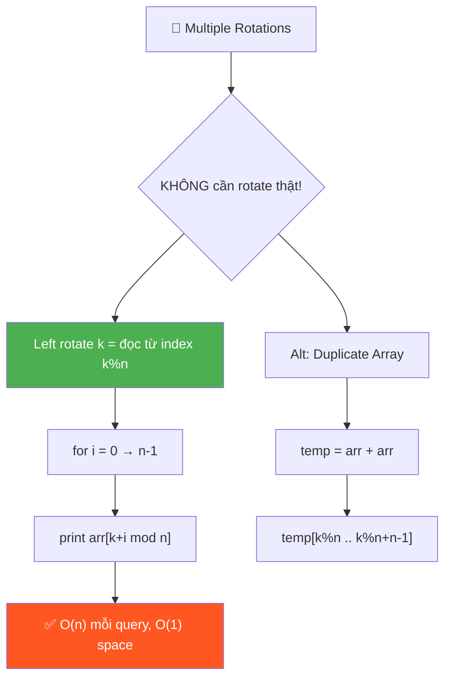
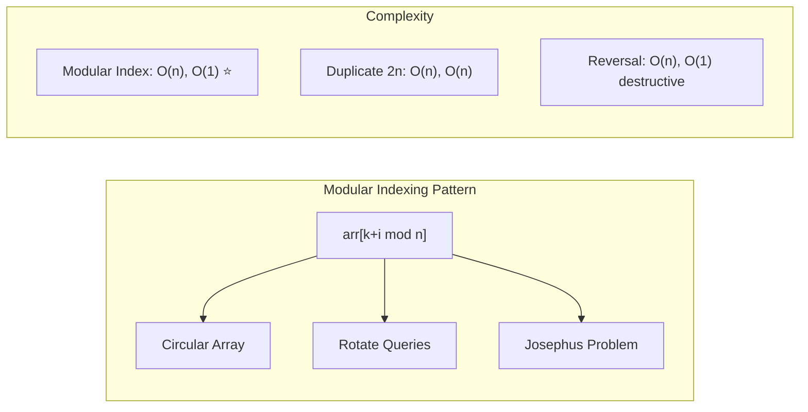
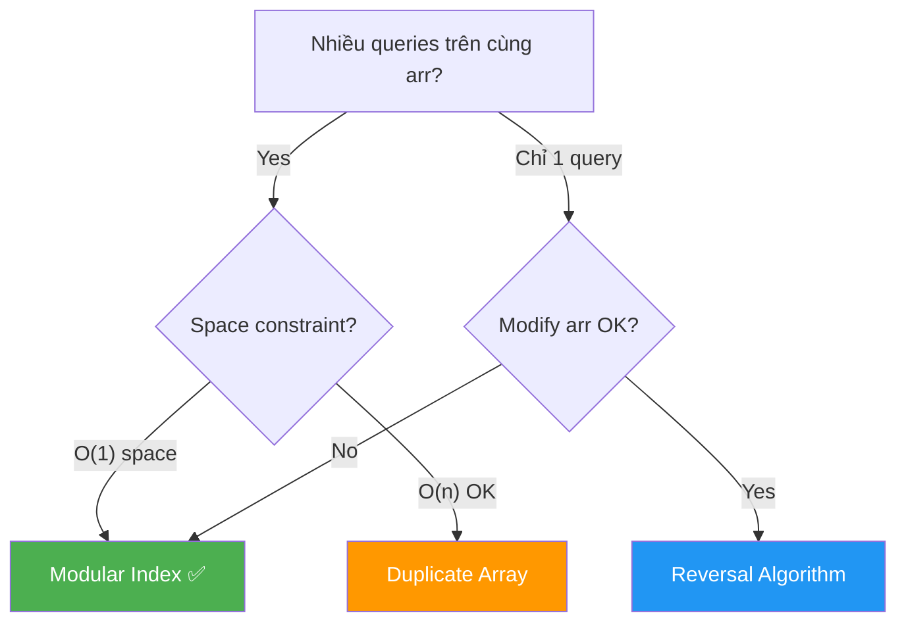

# 🔄 Multiple Left Rotations of Array — GfG (Easy)

> 📖 Code: [Multiple Left Rotations.js](./Multiple%20Left%20Rotations.js)





---

## R — Repeat & Clarify

🧠 _"Không cần thật sự rotate! Chỉ cần in từ index (k % n) → modular indexing!"_

> 🎙️ _"Given multiple rotation queries, print the rotated array for each query WITHOUT actually rotating."_

### Clarification Questions

```
Q: Left rotate nghĩa là gì chính xác?
A: Dịch mọi phần tử sang TRÁI k vị trí, phần tử đầu "cuộn" về cuối

Q: Có modify mảng gốc không?
A: KHÔNG! Nhiều queries → mảng phải giữ nguyên giữa các queries

Q: k có thể lớn hơn n không?
A: CÓ! k = 14, n = 5 → tương đương rotate 14 % 5 = 4

Q: k = 0 hoặc k = n?
A: Trả về mảng nguyên gốc (0 rotation hoặc full cycle)

Q: Mảng rỗng hoặc 1 phần tử?
A: Trả về nguyên mảng (rotate vô nghĩa)
```

### Tại sao bài này quan trọng?

```
  Bài này dạy pattern MODULAR INDEXING — nền tảng cho MỌI bài circular!

  BẠN PHẢI hiểu:
  1. Rotation = SHIFT điểm bắt đầu, KHÔNG phải di chuyển phần tử
  2. Modulo (%) = "cuộn vòng" — công cụ số 1 cho circular problems
  3. KHÔNG ROTATE THẬT khi có nhiều queries → read-only approach

  Pattern này xuất hiện trong:
  ┌────────────────────────────────────────────────────────────┐
  │  Circular Buffer/Queue    → read/write pointer % capacity │
  │  Rotate Array #189       → target index = (i + k) % n    │
  │  Josephus Problem        → modular elimination            │
  │  Clock problems          → hours % 12, minutes % 60      │
  │  Hash Table              → hash % tableSize               │
  │  Circular Linked List    → detect cycle with modulo       │
  └────────────────────────────────────────────────────────────┘
```

---

## 🧠 Bản chất bài toán — Hiểu để NHỚ, không chỉ để GIẢI

### Left Rotation = Dịch ĐIỂM BẮT ĐẦU

```
  Tưởng tượng mảng như 1 VÒNG TRÒN (carousel):

  arr = [1, 3, 5, 7, 9]

  Biểu diễn LINEAR (thẳng):
    ┌───┬───┬───┬───┬───┐
    │ 1 │ 3 │ 5 │ 7 │ 9 │
    └───┴───┴───┴───┴───┘
      0   1   2   3   4

  Biểu diễn CIRCULAR (vòng):
           1
        ╱     ╲
      9         3
      │         │
      7 ─── 5

  Left rotate k = QUAY vòng tròn k bước NGƯỢC chiều kim đồng hồ
  = Đổi ĐIỂM BẮT ĐẦU ĐỌC từ index 0 → index k!

  k=0: đọc từ index 0 → [1, 3, 5, 7, 9]  (nguyên gốc)
  k=1: đọc từ index 1 → [3, 5, 7, 9, 1]  (bắt đầu từ 3)
  k=3: đọc từ index 3 → [7, 9, 1, 3, 5]  (bắt đầu từ 7)

  💡 KEY INSIGHT:
     Left rotate k = ĐỌC mảng bắt đầu từ index k!
     KHÔNG CẦN di chuyển bất kỳ phần tử nào!
```

### Modulo (%) — Phép "cuộn vòng"

```
  Khi đọc từ index k, đến cuối mảng ta phải "cuộn" về đầu!

  arr = [1, 3, 5, 7, 9], k=3, n=5

  Đọc lần lượt:
    i=0: index = (3+0) = 3 → arr[3] = 7
    i=1: index = (3+1) = 4 → arr[4] = 9
    i=2: index = (3+2) = 5 → ⚠️ 5 = n! Out of bounds!

  → Dùng MODULO: 5 % 5 = 0 → arr[0] = 1  ← "cuộn" về đầu!

    i=2: (3+2) % 5 = 5 % 5 = 0 → arr[0] = 1 ✅
    i=3: (3+3) % 5 = 6 % 5 = 1 → arr[1] = 3 ✅
    i=4: (3+4) % 5 = 7 % 5 = 2 → arr[2] = 5 ✅

  → Result: [7, 9, 1, 3, 5] ✅

  🧠 MODULO = phép chia lấy DƯ = "cuộn tròn" tự nhiên!

  ┌──────────────────────────────────────────────────────┐
  │  index % n nghĩa là:                                 │
  │                                                      │
  │  Nếu index < n: trả về chính index (trong phạm vi)  │
  │  Nếu index ≥ n: "cuộn" về đầu                       │
  │                                                      │
  │  Giống đồng hồ:                                     │
  │    13 giờ = 13 % 12 = 1 giờ                         │
  │    25 giờ = 25 % 12 = 1 giờ                         │
  │    Luôn nằm trong [0, 11]!                           │
  │                                                      │
  │  Công thức: (k + i) % n → luôn nằm trong [0, n-1]  │
  └──────────────────────────────────────────────────────┘
```

### Tại sao k % n trước khi dùng?

```
  Khi k ≥ n: rotate k lần = rotate k % n lần!

  Ví dụ: arr = [1, 3, 5, 7, 9], n = 5

    k=5:  rotate 5 lần → quay ĐÚNG 1 vòng → về lại vị trí gốc!
          → k % n = 5 % 5 = 0 → KHÔNG rotate!

    k=6:  rotate 6 lần = 1 vòng + 1 bước = rotate 1 lần
          → k % n = 6 % 5 = 1 ✅

    k=14: rotate 14 lần = 2 vòng + 4 bước = rotate 4 lần
          → k % n = 14 % 5 = 4 ✅

  🧠 CHỨNG MINH: Tại sao rotate n = rotate 0?

    Left rotate 1: mỗi phần tử dịch trái 1 → arr[i] → vị trí i-1
    Left rotate n: mỗi phần tử dịch trái n → quay đúng 1 vòng tròn
                   → mọi phần tử về lại VỊ TRÍ BAN ĐẦU!

    Tổng quát:
      rotate(k) = rotate(k % n)
      Vì: k = q × n + r   (q vòng + r bước dư)
          q vòng = no-op (quay đúng q vòng → về vị trí gốc)
          r bước = rotation thực sự!

  📌 LUÔN normalize: k = k % n trước khi tính toán!
     → Tránh k lớn bất thường (k = 1,000,000)
     → Tránh tính toán thừa
```

### Left vs Right Rotation — Mối quan hệ

```
  Left rotate k  ←→  Right rotate (n - k)!

  arr = [1, 3, 5, 7, 9], n = 5

  Left rotate 2:
    [1, 3, 5, 7, 9] → [5, 7, 9, 1, 3]    ← dịch trái 2

  Right rotate 3 (= n - 2 = 3):
    [1, 3, 5, 7, 9] → [5, 7, 9, 1, 3]    ← dịch phải 3 = CÙNG KẾT QUẢ!

  🧠 Tại sao?
    Left k  = đọc từ index k         → (k + i) % n
    Right r = đọc từ index (n - r)   → (n - r + i) % n

    Khi r = n - k:
      (n - (n - k) + i) % n = (k + i) % n  ← GIỐNG NHAU! ✅

  ┌──────────────────────────────────────────────────┐
  │  Left rotate k  =  Right rotate (n - k)         │
  │  Right rotate k =  Left rotate (n - k)          │
  │                                                  │
  │  → Chỉ cần NHỚ 1 công thức, suy ra cái kia!    │
  └──────────────────────────────────────────────────┘

  📌 LeetCode #189 "Rotate Array" yêu cầu RIGHT rotate:
    Right rotate k = Left rotate (n - k)
    → index mới = (i + k) % n    (CỘNG k thay vì đọc từ k)
```

---

## 🧭 Luồng Suy Nghĩ — Từ đọc đề đến solution

> 💡 Phần này dạy bạn **CÁCH TƯ DUY** để tự giải bài, không chỉ biết đáp án.

### Bước 1: Đọc đề → Gạch chân KEYWORDS

```
  Đề bài: "Given an array and multiple rotation queries,
           print the rotated array for each query."

  Gạch chân:
    "multiple queries"  → NHIỀU lần → KHÔNG THỂ modify mảng!
    "rotation"          → circular, modular
    "print"             → chỉ cần OUTPUT, không cần lưu

  🧠 Tự hỏi: "Nếu rotate thật cho mỗi query thì sao?"
    → arr bị modify → query tiếp theo CHẠY TRÊN arr ĐÃ THAY ĐỔI!
    → Phải RESTORE lại mảng gốc → lãng phí!
    → HOẶC phải copy mảng cho mỗi query → O(n × q) space!

  📌 Kỹ năng chuyển giao:
    "Multiple queries trên CÙNG data" → ĐỌC, KHÔNG GHI!
    → Nghĩ ngay: preprocessing, mathematical mapping, modular indexing
```

### Bước 2: Vẽ ví dụ NHỎ bằng tay → Tìm PATTERN

```
  arr = [A, B, C, D, E]  (n = 5)
         0  1  2  3  4

  Viết ra mấy lần rotate:
    k=0: [A, B, C, D, E]   đọc từ index 0: A B C D E
    k=1: [B, C, D, E, A]   đọc từ index 1: B C D E A
    k=2: [C, D, E, A, B]   đọc từ index 2: C D E A B
    k=3: [D, E, A, B, C]   đọc từ index 3: D E A B C

  🧠 Quan sát PATTERN:
    1. "Rotate left k" = đọc mảng bắt đầu từ index k!
    2. Khi đến cuối mảng → "cuộn" về đầu!
    3. k=5 → quay 1 vòng → giống k=0 → k % n = 0!

  📌 Kỹ năng chuyển giao:
    Khi gặp "rotation" hay "circular":
    → Viết ra vài trường hợp bằng tay
    → TÌM mối liên hệ giữa k và index BẮT ĐẦU
    → 99% sẽ dùng MODULO!
```

### Bước 3: Từ pattern → Công thức

```
  Từ quan sát: "rotate k = đọc từ index k"
  → Phần tử thứ i sau rotation = arr[(k + i) % n]

  🧠 CHỨNG MINH bằng trực giác:

    Trước rotate: vị trí i chứa arr[i]
    Sau left rotate k: phần tử tại vị trí i "dịch trái k bước"
       → phần tử BAN ĐẦU ở vị trí (i + k) sẽ đứng tại vị trí i
       → result[i] = arr[(i + k) % n]

  Ví dụ: k=3, i=0
    result[0] = arr[(0 + 3) % 5] = arr[3] = D ✅
    (phần tử ở vị trí 3 "dịch trái 3" → đến vị trí 0)

  📌 Kỹ năng chuyển giao:
    Bất kỳ bài "circular" nào:
    → new_index = (old_index + offset) % size
    → Đây là CÔNG THỨC VÀNG cho circular problems!
```

### Bước 4: Có cần optimize thêm không?

```
  🧠 Tự hỏi: "Nếu có Q queries, mỗi query O(n) → O(Q × n) tổng. OK?"

  Phân tích:
    → Phải in n phần tử cho mỗi query → O(n) mỗi query là OPTIMAL!
    → Không thể nhanh hơn O(n) per query (phải in tất cả!)
    → O(Q × n) tổng → ĐÃ TỐI ƯU!

  Alternative: Preprocess bằng mảng 2n
    → Preprocessing: O(n) time + O(n) space
    → Per query: O(n) (slice)
    → Bỏ modulo nhưng TỐN space → trade-off!

  📌 Kết luận: Modular indexing là BEST cho hầu hết trường hợp
    → O(1) space, O(n) per query, KHÔNG modify data
```

---

## E — Examples

```
arr = [1, 3, 5, 7, 9], n = 5

  k=1: [3, 5, 7, 9, 1]    ← bắt đầu từ index 1
  k=3: [7, 9, 1, 3, 5]    ← bắt đầu từ index 3
  k=4: [9, 1, 3, 5, 7]    ← bắt đầu từ index 4
  k=6: [3, 5, 7, 9, 1]    ← 6%5=1, bắt đầu từ index 1

  💡 Left rotate k = bắt đầu đọc từ index (k % n)!
```

### Minh họa trực quan — Modular Indexing

```
  arr = [1, 3, 5, 7, 9], k = 3

  ┌───────────────────────────────────────────────────┐
  │  Mảng gốc:                                        │
  │  ┌───┬───┬───┬───┬───┐                            │
  │  │ 1 │ 3 │ 5 │ 7 │ 9 │                            │
  │  └───┴───┴───┴───┴───┘                            │
  │    0   1   2   3   4                               │
  │                    ↑                               │
  │                  k = 3 (START ĐỌC TẠI ĐÂY!)      │
  │                                                    │
  │  Đọc theo modular:                                 │
  │    i=0: (3+0)%5 = 3 → arr[3] = 7                  │
  │    i=1: (3+1)%5 = 4 → arr[4] = 9                  │
  │    i=2: (3+2)%5 = 0 → arr[0] = 1  ← CUỘN!       │
  │    i=3: (3+3)%5 = 1 → arr[1] = 3                  │
  │    i=4: (3+4)%5 = 2 → arr[2] = 5                  │
  │                                                    │
  │  Result: [7, 9, 1, 3, 5] ✅                       │
  └───────────────────────────────────────────────────┘

  Hình dung CIRCULAR:
                 ┌─START k=3
                 ↓
      1 ← 3 ← 5 ← [7] → 9
      ↑                    │
      └────────────────────┘
      Đọc: 7 → 9 → 1 → 3 → 5
```

### Minh họa — Duplicate Array Approach

```
  arr = [1, 3, 5, 7, 9]

  temp = arr + arr:
  ┌───┬───┬───┬───┬───┬───┬───┬───┬───┬───┐
  │ 1 │ 3 │ 5 │ 7 │ 9 │ 1 │ 3 │ 5 │ 7 │ 9 │
  └───┴───┴───┴───┴───┴───┴───┴───┴───┴───┘
    0   1   2   3   4   5   6   7   8   9

  k=3: start = 3%5 = 3
       temp[3..7] = [7, 9, 1, 3, 5] ✅
       ← Không cần modulo! Vì mảng đã "cuộn sẵn"!

  k=6: start = 6%5 = 1
       temp[1..5] = [3, 5, 7, 9, 1] ✅

  🧠 Tại sao hoạt động?
    Duplicate = "mở vòng tròn" thành đường thẳng DÀI GẤP ĐÔI!
    → Bất kỳ đoạn n phần tử liên tiếp nào = 1 rotation!
    → Không cần modulo vì mảng đã kéo dài quá n!
```

---

## A — Approach

### Approach 1: Modular Index — O(1) space ✅

```
  💡 Ý tưởng: Dùng CÔNG THỨC (k + i) % n thay vì rotate thật!

  ┌─────────────────────────────────────────────────────────────┐
  │  Input: arr[n], k (số bước rotate)                         │
  │                                                             │
  │  Bước 1: Normalize k                                       │
  │    k = k % n    ← xử lý k > n                             │
  │                                                             │
  │  Bước 2: Đọc n phần tử bắt đầu từ index k                │
  │    for i = 0 → n-1:                                        │
  │      result[i] = arr[(k + i) % n]                          │
  │                                                             │
  │  Time: O(n)     Space: O(1)*    Modify arr: KHÔNG!         │
  │  * O(n) nếu tính result array                              │
  └─────────────────────────────────────────────────────────────┘

  🧠 Tại sao O(1) space?
    Nếu chỉ PRINT (không lưu): O(1) space
    Nếu tạo result array: O(n) space (nhưng đây là space cho OUTPUT)
    → Convention: không tính output space vào complexity
```

### Approach 2: Duplicate Array — O(n) space

```
  💡 Ý tưởng: Nhân đôi mảng → mọi rotation = 1 slice liên tiếp!

  Preprocessing:
    temp = [...arr, ...arr]    ← O(n) space và O(n) time

  Per query k:
    start = k % n
    result = temp[start .. start + n - 1]     ← temp.slice(start, start + n)

  ┌─────────────────────────────────────────────────────────────┐
  │  Ưu điểm:                                                  │
  │    → Không cần modulo mỗi iteration                        │
  │    → Slice liên tiếp = CACHE FRIENDLY!                     │
  │    → Code rất đơn giản                                     │
  │                                                             │
  │  Nhược điểm:                                                │
  │    → O(n) extra space cho temp                              │
  │    → slice() tạo array mới mỗi lần = O(n) mỗi query       │
  │                                                             │
  │  Time: O(n) preprocessing + O(n) per query                 │
  │  Space: O(n)                                                │
  └─────────────────────────────────────────────────────────────┘

  📌 Khi nào chọn Duplicate?
    → Khi n NHỎ, memory KHÔNG là vấn đề
    → Khi cần tối đa CACHE LOCALITY (đọc sequential liên tục)
    → Khi code ĐƠNGIẢN NHẤT có thể (e.g., competitive programming)
```

### So sánh 2 approaches



```
  ┌──────────────────────────────────────────────────────────────┐
  │  Bài hỏi "nhiều queries" → Modular Index (read-only!)      │
  │  Bài hỏi "rotate và trả về" → Reversal Algorithm           │
  │  Bài hỏi "tốc độ, n nhỏ" → Duplicate Array                │
  └──────────────────────────────────────────────────────────────┘
```

---

## C — Code

### Solution 1: Modular Index — O(1) space ✅

```javascript
function leftRotate(arr, k) {
  const n = arr.length;
  const result = [];

  for (let i = 0; i < n; i++) {
    result.push(arr[(k + i) % n]);
  }
  return result;
}

// Handle multiple queries
function multipleRotations(arr, queries) {
  for (const k of queries) {
    console.log(leftRotate(arr, k).join(" "));
  }
}
```

```
  📝 Line-by-line:

  Line 3: const result = []
    → Mảng kết quả. Nếu chỉ print thì dùng console.log trực tiếp
    → Ở đây trả về array để flexible hơn

  Line 5-7: for (let i = 0; i < n; i++) { result.push(arr[(k + i) % n]); }
    → TRÁI TIM của thuật toán!
    → i = vị trí trong KẾT QUẢ (0, 1, 2, ...)
    → (k + i) % n = vị trí tương ứng trong MẢNG GỐC

    🧠 Phân tích (k + i) % n:
    ┌────────────────────────────────────────────────────┐
    │  k = offset (số bước rotate)                       │
    │  i = counter (vị trí output)                       │
    │  k + i = vị trí thật trong mảng gốc               │
    │  % n = "cuộn vòng" khi vượt quá n                  │
    │                                                    │
    │  Khi k + i < n:  % n không ảnh hưởng              │
    │  Khi k + i ≥ n:  % n "cuộn" về đầu mảng          │
    └────────────────────────────────────────────────────┘

  Line 12-14: multipleRotations
    → Duyệt qua từng query k
    → Gọi leftRotate cho mỗi k
    → arr KHÔNG BỊ MODIFY → các query INDEPENDENT!

  ⚠️ Nếu k có thể ÂM (right rotation):
    k = ((k % n) + n) % n;  ← normalize về [0, n-1]
    → k = -2, n = 5: ((-2 % 5) + 5) % 5 = (3 + 5) % 5...
    → JS: -2 % 5 = -2 → (-2 + 5) % 5 = 3 ✅
```

### Solution 2: Duplicate Array — O(n) space

```javascript
function multipleRotationsPreprocess(arr, queries) {
  const n = arr.length;
  const temp = [...arr, ...arr]; // duplicate!

  for (const k of queries) {
    const start = k % n;
    console.log(temp.slice(start, start + n).join(" "));
  }
}
```

```
  📝 Line-by-line:

  Line 3: const temp = [...arr, ...arr]
    → Spread operator: tạo mảng mới gộp 2 bản copy
    → arr = [1,3,5] → temp = [1,3,5,1,3,5]
    → Size: 2n

    ⚠️ Alternative: temp = arr.concat(arr)
       → Cùng kết quả, khác syntax

  Line 6: const start = k % n
    → VẪN CẦN modulo! Vì k có thể > 2n!
    → k=14, n=5: start = 14%5 = 4 ✅
    → Nhưng BÊN TRONG vòng for: KHÔNG cần modulo!

  Line 7: temp.slice(start, start + n)
    → slice(start, end) — end EXCLUSIVE!
    → Lấy n phần tử liên tiếp từ vị trí start
    → Vì temp có 2n phần tử → start + n ≤ 2n → AN TOÀN!

    🧠 Chứng minh an toàn:
       start ∈ [0, n-1]   (vì đã % n)
       start + n ∈ [n, 2n-1]   (luôn ≤ 2n = temp.length)
       → KHÔNG BAO GIỜ out of bounds!
```

### Trace CHI TIẾT: arr = [1, 3, 5, 7, 9], k = 3

```
  n = 5, k % n = 3

  ──── Modular Index ────────────────────────────────────────

  i=0: index = (3 + 0) % 5 = 3     → arr[3] = 7
         ↓ 3 < 5, modulo không ảnh hưởng

  i=1: index = (3 + 1) % 5 = 4     → arr[4] = 9
         ↓ 4 < 5, modulo không ảnh hưởng

  i=2: index = (3 + 2) % 5 = 0     → arr[0] = 1  ← CUỘN!
         ↓ 5 % 5 = 0! "Cuộn" về index 0!

  i=3: index = (3 + 3) % 5 = 1     → arr[1] = 3
         ↓ 6 % 5 = 1

  i=4: index = (3 + 4) % 5 = 2     → arr[2] = 5
         ↓ 7 % 5 = 2

  → Result: [7, 9, 1, 3, 5] ✅

  ──── Duplicate Array ──────────────────────────────────────

  temp = [1, 3, 5, 7, 9, 1, 3, 5, 7, 9]
          0  1  2  3  4  5  6  7  8  9

  start = 3 % 5 = 3
  temp.slice(3, 8) = [7, 9, 1, 3, 5] ✅
                      ↑──────────↑
                    index 3    index 7
```

### Trace edge case: k > n → k = 14, n = 5

```
  k = 14, n = 5
  k % n = 14 % 5 = 4

  ──── Modular Index ────────────────────────────────────────

  Normalize: k = 4 (tương đương rotate 4)

  i=0: (4+0) % 5 = 4 → arr[4] = 9
  i=1: (4+1) % 5 = 0 → arr[0] = 1   ← cuộn!
  i=2: (4+2) % 5 = 1 → arr[1] = 3
  i=3: (4+3) % 5 = 2 → arr[2] = 5
  i=4: (4+4) % 5 = 3 → arr[3] = 7

  → Result: [9, 1, 3, 5, 7] ✅

  🧠 Nhận xét: k = 14 và k = 4 cho CÙNG kết quả!
     14 = 2 × 5 + 4  → 2 vòng quay đầy (no-op) + 4 bước thực
```

> 🎙️ _"Instead of actually rotating, I use modular indexing. Left rotate by k means reading from index k%n. For each position i, the element is arr[(k+i) % n]. This handles multiple queries efficiently without modifying the original array."_

---

## ❌ Common Mistakes — Lỗi thường gặp

### Mistake 1: Quên normalize k bằng modulo

```javascript
// ❌ SAI: k = 14, n = 5 → index = 14 → OUT OF BOUNDS!
function leftRotateBad(arr, k) {
  const result = [];
  for (let i = 0; i < arr.length; i++) {
    result.push(arr[k + i]); // ← THIẾU % n!
  }
  return result;
}

// ✅ ĐÚNG: luôn dùng modulo
result.push(arr[(k + i) % n]);
```

```
  🧠 Tại sao sai?
    k = 14, i = 0 → index = 14 → arr[14] = undefined!
    → Phải (k + i) % n để "cuộn" về [0, n-1]
```

### Mistake 2: Rotate thật sự → phá mảng gốc

```javascript
// ❌ SAI cho MULTIPLE queries: mảng bị modify!
function rotateAndPrint(arr, queries) {
  for (const k of queries) {
    // Rotate arr thật sự
    for (let j = 0; j < k; j++) {
      arr.push(arr.shift()); // ← MODIFY arr!
    }
    console.log(arr.join(" "));
    // ⚠️ arr ĐÃ THAY ĐỔI! Query tiếp sẽ SAI!
  }
}

// ✅ ĐÚNG: dùng modular, KHÔNG modify arr
function multipleRotations(arr, queries) {
  for (const k of queries) {
    console.log(leftRotate(arr, k).join(" "));
    // arr KHÔNG đổi → query INDEPENDENT!
  }
}
```

```
  🧠 Tại sao sai?
    Query 1: k=3 → rotate arr 3 lần → arr thay đổi!
    Query 2: k=1 → rotate arr ĐÃ BỊ THAY ĐỔI 1 lần
             → Kết quả = rotate 3+1 = 4 THAY VÌ rotate 1!

  → MULTIPLE queries phải INDEPENDENT → read-only!
```

### Mistake 3: Nhầm Left với Right

```javascript
// ❌ NHẦM: Đây là RIGHT rotate!
arr[(i + k) % n]; // ← phần tử i SẼ ĐẾN vị trí (i+k)%n
// ← Đây là mapping ĐÍCH, không phải NGUỒN!

// ✅ LEFT rotate: đọc TỪ vị trí (k + i)
result[i] = arr[(k + i) % n]; // ← lấy phần tử từ (k+i)

// ✅ RIGHT rotate: lấy phần tử đến TRƯỚC k bước
result[i] = arr[(i - k + n) % n]; // ← hoặc arr[(n - k + i) % n]
```

```
  🧠 Cách nhớ:
  ┌──────────────────────────────────────────────────────┐
  │  LEFT rotate k:   result[i] = arr[(i + k) % n]     │
  │    → "Đọc TIẾN k bước" trong mảng gốc               │
  │                                                      │
  │  RIGHT rotate k:  result[i] = arr[(i - k + n) % n] │
  │    → "Đọc LÙI k bước" trong mảng gốc                │
  │    → +n để tránh index ÂM!                           │
  └──────────────────────────────────────────────────────┘
```

### Mistake 4: Quên +n khi modulo số âm (JS trap!)

```javascript
// ❌ JavaScript: -2 % 5 = -2 (KHÔNG PHẢI 3!)
// Khác Python: -2 % 5 = 3

// ❌ SAI: right rotate 2, n=5
const index = (i - 2) % 5; // i=0 → -2 % 5 = -2 → NEGATIVE INDEX!

// ✅ ĐÚNG: thêm n trước modulo
const index = (i - 2 + 5) % 5; // i=0 → 3 % 5 = 3 ✅

// ✅ TỔNG QUÁT an toàn:
const index = (i - (k % n) + n) % n; // luôn [0, n-1]
```

```
  🧠 JavaScript modulo trap:
  ┌──────────────────────────────────────────────────┐
  │  JavaScript:  -2 % 5 = -2  (giữ dấu tử số!)   │
  │  Python:      -2 % 5 = 3   (luôn dương!)        │
  │  C/C++:       -2 % 5 = -2  (giống JS)          │
  │  Java:        -2 % 5 = -2  (giống JS)          │
  │                                                  │
  │  → Trong JS/C/Java: LUÔN thêm +n trước %!       │
  │  → ((x % n) + n) % n → đảm bảo kết quả ≥ 0     │
  └──────────────────────────────────────────────────┘
```

---

## O — Optimize

```
                     Time/query  Space    Modify arr?   Preprocess
  ──────────────────────────────────────────────────────────────────
  Naive (shift)      O(n×k)      O(1)     ✅ YES!       O(1)
  Reversal Algo      O(n)        O(1)     ✅ YES        O(1)
  Modular Index ✅   O(n)        O(1)*    ❌ NO         O(1)
  Duplicate Array    O(n)        O(n)     ❌ NO         O(n)

  * O(1) nếu chỉ print, O(n) nếu tạo result array

  Modular tốt nhất cho MULTIPLE queries:
    → Không modify gốc → queries độc lập!
    → O(1) preprocessing, O(n) per query
    → KHÔNG TỐN thêm memory!
```

### Phân tích Naive approach (tại sao TỆ)

```
  Naive: dịch từng phần tử 1 bước, lặp k lần.

  function naiveRotate(arr, k) {
    for (let j = 0; j < k; j++) {
      const first = arr[0];               // lưu phần tử đầu
      for (let i = 0; i < arr.length - 1; i++) {
        arr[i] = arr[i + 1];              // shift trái 1
      }
      arr[arr.length - 1] = first;         // đặt đầu vào cuối
    }
  }

  ⚠️ Time: O(n × k) → k = n/2 → O(n²/2) → O(n²)!
     Với n = 100,000 và k = 50,000:
     → 5 × 10⁹ operations → TLE (Time Limit Exceeded)!

  → Modular Index: O(n) per query → 100,000 operations → ✅
```

### Reversal Algorithm (bonus — cho bài "rotate thật")

```
  Khi bài YÊU CẦU modify mảng gốc (e.g., LeetCode #189):
  → Dùng Reversal Algorithm — O(n) time, O(1) space!

  Left rotate k:
    Step 1: Reverse arr[0..k-1]      ← đảo ngược phần đầu
    Step 2: Reverse arr[k..n-1]      ← đảo ngược phần cuối
    Step 3: Reverse arr[0..n-1]      ← đảo ngược TOÀN BỘ

  Ví dụ: arr = [1, 3, 5, 7, 9], k = 3

    Step 1: Reverse [1, 3, 5]      → [5, 3, 1, 7, 9]
    Step 2: Reverse [7, 9]         → [5, 3, 1, 9, 7]
    Step 3: Reverse [5, 3, 1, 9, 7] → [7, 9, 1, 3, 5] ✅

  🧠 Tại sao hoạt động?
    "Đảo 2 phần, rồi đảo cả → phần sau lên trước, phần trước xuống sau!"
    Giống lật 2 nửa bản tay, rồi lật cả bàn tay!

  ⚠️ DESTRUCTIVE! Modify mảng gốc → KHÔNG dùng cho multiple queries!
```

---

## T — Test

```
Test Cases:
  arr=[1,3,5,7,9], k=1   → [3, 5, 7, 9, 1]          ✅ Basic
  arr=[1,3,5,7,9], k=3   → [7, 9, 1, 3, 5]          ✅ Standard
  arr=[1,3,5,7,9], k=5   → [1, 3, 5, 7, 9]          ✅ Full cycle
  arr=[1,3,5,7,9], k=6   → [3, 5, 7, 9, 1]          ✅ k > n
  arr=[1,3,5,7,9], k=14  → [9, 1, 3, 5, 7]          ✅ k >> n
  arr=[1,3,5,7,9], k=0   → [1, 3, 5, 7, 9]          ✅ No rotation
  arr=[42],        k=7   → [42]                       ✅ Single element
  arr=[1,2],       k=1   → [2, 1]                     ✅ Two elements
```

### Edge Cases giải thích

```
  ┌──────────────────────────────────────────────────────────────┐
  │  k = 0:       (0+i)%n = i → arr[i] → mảng gốc!            │
  │               → Rotation 0 = no-op ✅                       │
  │                                                              │
  │  k = n:       (n+i)%n = i%n = i → arr[i] → mảng gốc!      │
  │               → Full cycle = no-op ✅                        │
  │                                                              │
  │  k > n:       k%n normalize → tương đương k nhỏ hơn        │
  │               → 14%5 = 4 → same as k=4 ✅                   │
  │                                                              │
  │  n = 1:       (k+i)%1 = 0 luôn → arr[0] → chính nó!       │
  │               → 1 phần tử rotate bao nhiêu cũng giống ✅    │
  │                                                              │
  │  Multiple queries: arr KHÔNG bị modify                       │
  │               → Mỗi query INDEPENDENT ✅                    │
  └──────────────────────────────────────────────────────────────┘
```

---

## 🗣️ Interview Script

### 🎙️ Think Out Loud — Mô phỏng phỏng vấn thực

> ⚠️ Script này dạy cách **NÓI**, không phải cách CODE.
> Mỗi đoạn = cách bạn **PHÁT BIỂU** trong phỏng vấn thực!

```
  ╔══════════════════════════════════════════════════════════════╗
  ║  🕐 FULL INTERVIEW SIMULATION — 1h30 (90 phút)             ║
  ║                                                              ║
  ║  00:00-05:00  Introduction + Icebreaker         (5 min)     ║
  ║  05:00-45:00  Problem Solving                   (40 min)    ║
  ║  45:00-60:00  Deep Technical Probing            (15 min)    ║
  ║  60:00-75:00  Variations + Extensions           (15 min)    ║
  ║  75:00-85:00  System Design at Scale            (10 min)    ║
  ║  85:00-90:00  Behavioral + Q&A                  (5 min)     ║
  ╚══════════════════════════════════════════════════════════════╝
```

```
  ╔══════════════════════════════════════════════════════════════╗
  ║  PART 1: INTRODUCTION (00:00 — 05:00)                       ║
  ╚══════════════════════════════════════════════════════════════╝

  👤 "Tell me about yourself and a time you worked with
      circular data structures."

  🧑 "I'm a frontend engineer with [X] years of experience.
      A relevant example: I built a chat application with
      a message buffer. We had a fixed-size buffer of 1000
      messages arranged in a ring. When a new message arrived
      and the buffer was full, it would overwrite the oldest
      message and the 'start' pointer would advance.

      Displaying the messages meant reading from the start
      pointer and wrapping around using modulo.
      The key insight: I never moved any messages.
      I just changed WHERE I started reading.

      A user scrolling through message history was effectively
      performing 'rotations' — shifting the view window.
      Each scroll amount was a different rotation query
      on the same underlying circular buffer.

      That's exactly this problem: multiple rotation queries
      on the same array, without actually rotating."

  👤 "Great analogy. Let's dive in."
```

```
  ╔══════════════════════════════════════════════════════════════╗
  ║  PART 2: PROBLEM SOLVING (05:00 — 45:00)                   ║
  ╚══════════════════════════════════════════════════════════════╝

  ──────────────── 05:00 — Clarify (4 phút) ────────────────

  👤 "Given an array and multiple left-rotation queries,
      print the rotated array for each query."

  🧑 "Let me clarify the requirements.

      Left rotation by k means: shift every element k positions
      to the left. Elements that 'fall off' the left end
      wrap around to the right end.

      Multiple queries means: for each query value k,
      I print the result of rotating the ORIGINAL array
      by k positions. The array must REMAIN UNCHANGED
      between queries.

      This is critical: if I actually rotated the array
      for query 1, then query 2 would rotate the ALREADY
      rotated array — wrong!

      k can be larger than n — rotation by n is a full
      cycle, back to the original. So k mod n gives the
      effective rotation.

      k can be 0 — return the original array.

      The key constraint: multiple queries on the SAME
      data. This means I should NOT modify the array.
      I need a READ-ONLY approach."

  ──────────────── 09:00 — The Carousel Analogy (4 phút) ────────

  🧑 "I like to think of this as a CAROUSEL — a merry-go-round.

      The array elements are seats on the carousel,
      arranged in a circle: 1, 3, 5, 7, 9.

      The carousel rotates, but the seats don't MOVE
      from each other's perspective. What changes is
      WHERE I start looking.

      Left rotation by k means: I start reading from
      seat number k instead of seat 0.

      For arr equal [1, 3, 5, 7, 9] with k equal 3:
      Instead of starting at index 0, I start at index 3.
      I read: 7, 9, then wrap around: 1, 3, 5.

      This is the fundamental insight:
      ROTATION EQUALS CHANGING THE START POSITION.
      I don't need to move any elements — I just need
      to read from a different starting point."

  ──────────────── 13:00 — Modular Indexing (5 phút) ────────────

  🧑 "The mathematical formula follows from the analogy.

      For position i in the rotated result,
      the element comes from arr at index k plus i mod n.

      Why mod n? Because when k plus i exceeds n minus 1,
      I need to wrap around to the beginning.

      For k equal 3, n equal 5:
      i equal 0: index equal 3 plus 0 mod 5 equal 3.
      arr at 3 equal 7.
      i equal 1: index equal 3 plus 1 mod 5 equal 4.
      arr at 4 equal 9.
      i equal 2: index equal 3 plus 2 mod 5 equal 0.
      5 mod 5 wraps to 0! arr at 0 equal 1.
      i equal 3: index equal 3 plus 3 mod 5 equal 1.
      arr at 1 equal 3.
      i equal 4: index equal 3 plus 4 mod 5 equal 2.
      arr at 2 equal 5.

      Result: [7, 9, 1, 3, 5]. Correct!

      This is CLOCK ARITHMETIC. Just like 15 o'clock
      is 15 mod 12 equal 3 o'clock, index 7 in an array
      of size 5 is 7 mod 5 equal index 2."

  ──────────────── 18:00 — Why k mod n first? (3 phút) ────────────

  🧑 "Before computing indices, I normalize k.

      k mod n gives the effective rotation.
      Because rotating by n is a full cycle — every element
      returns to its original position.

      k equal 14 with n equal 5:
      14 divided by 5 equals 2 remainder 4.
      So 14 rotations equal 2 full cycles plus 4 extra steps.
      The 2 full cycles are no-ops.
      Effective rotation: 4.

      k equal 0 or k equal n: no rotation.
      The result is the original array.

      This normalization is O of 1 and prevents
      large k values from wasting computation.
      Without it, k equal a billion would still work
      mathematically but is wasteful."

  ──────────────── 21:00 — Write Code (3 phút) ────────────────

  🧑 "The code is minimal.

      [Vừa viết vừa nói:]

      function leftRotate of arr and k.
      const n equal arr dot length.
      const result equal empty array.
      for let i equal 0, i less than n, i plus plus:
      result dot push of arr at k plus i mod n.
      return result.

      For multiple queries:
      for each k in queries:
      console log leftRotate of arr and k.

      The array is NEVER modified. Each query is independent.
      O of n per query. O of 1 extra space if I just print."

  ──────────────── 24:00 — Alternative: Duplicate Array (4 phút) ──

  🧑 "An alternative approach: duplicate the array.

      Create temp equal arr concatenated with arr.
      For arr equal [1, 3, 5, 7, 9]:
      temp equal [1, 3, 5, 7, 9, 1, 3, 5, 7, 9].

      Now for any rotation k, I just slice temp
      from k mod n to k mod n plus n.

      k equal 3: temp dot slice from 3 to 8 equal [7, 9, 1, 3, 5].

      Why does this work? By duplicating, I've 'unrolled'
      the circle into a straight line long enough that
      ANY window of n consecutive elements is a valid rotation.

      Trade-off: O of n extra space for the duplicate,
      but no modulo operation INSIDE the loop — just
      sequential memory access. This can be more
      CACHE-FRIENDLY on modern CPUs.

      For this problem, modular indexing is preferred
      because O of 1 space is better."

  ──────────────── 28:00 — Trace bằng LỜI (3 phút) ────────────────

  🧑 "Let me trace a full example.
      arr equal [1, 3, 5, 7, 9]. Queries: [1, 3, 6, 14].

      Query k equal 1:
      Read from index 1: arr at 1, 2, 3, 4, 0.
      Values: 3, 5, 7, 9, 1.

      Query k equal 3:
      Read from index 3: arr at 3, 4, 0, 1, 2.
      Values: 7, 9, 1, 3, 5.

      Query k equal 6:
      k mod 5 equal 1. Same as k equal 1.
      Values: 3, 5, 7, 9, 1.

      Query k equal 14:
      k mod 5 equal 4. Read from index 4: arr at 4, 0, 1, 2, 3.
      Values: 9, 1, 3, 5, 7.

      The original array is UNCHANGED for all queries."

  ──────────────── 31:00 — Edge Cases (3 phút) ────────────────

  🧑 "Edge cases.

      k equal 0: no rotation. Return original array.
      k mod n is 0, so index starts at 0.

      k equal n: full cycle. Same as k equal 0.
      k mod n equals n mod n equals 0.

      k much larger than n: k equal a billion, n equal 5.
      k mod n equal 0. Just return original.

      Single element: [42]. Any rotation returns [42].
      Rotating a single-element carousel changes nothing.

      Two elements: [a, b]. k equal 1 gives [b, a].
      k equal 2 gives [a, b] — back to original."

  ──────────────── 34:00 — Complexity (3 phút) ────────────────

  🧑 "Time: O of n per query. I must output n elements.
      This is optimal — I can't produce n elements
      in less than O of n.

      For Q queries: O of Q times n total. Each query
      independent.

      Space: O of 1 extra — just the loop variable.
      The output itself is O of n, but that's unavoidable.

      For the duplicate approach: O of n preprocessing space.
      Then O of n per query for the slice.

      Can I do better than O of n per query?
      No — because I must output all n elements.
      The lower bound is Omega of n per query."

  ──────────────── 37:00 — Left vs Right Rotation (4 phút) ────────

  👤 "How would you handle RIGHT rotation?"

  🧑 "Left rotate k equals right rotate n minus k!

      They're DUAL operations.

      Left rotate 3 on [1, 3, 5, 7, 9]:
      Start at index 3: [7, 9, 1, 3, 5].

      Right rotate 2 on the same array:
      n minus k equal 5 minus 2 equal 3.
      Start at index 3: [7, 9, 1, 3, 5]. SAME result!

      Why? Left rotating by k moves each element
      k positions backwards. Right rotating by r
      moves each element r positions forward.
      When k plus r equals n, they produce the same result.

      For LeetCode 189 — Rotate Array — which asks
      for RIGHT rotation, I just convert:
      right rotate k maps to left rotate n minus k.
      Then I use the same modular indexing formula.

      Or equivalently: for right rotation by k,
      the formula is arr at i minus k plus n mod n,
      but I need to add n to avoid negative indices
      in JavaScript."

  ──────────────── 41:00 — JS Negative Modulo (3 phút) ────────────

  👤 "Tell me about negative modulo in JavaScript."

  🧑 "This is a common TRAP!

      In JavaScript, the modulo operator preserves the
      sign of the DIVIDEND — the left operand.

      Minus 2 mod 5 equals minus 2 in JavaScript.
      But mathematically, minus 2 mod 5 should be 3.

      This matters for right rotation:
      i minus k could be negative.
      For example, i equal 0, k equal 2:
      0 minus 2 equal minus 2.
      Minus 2 mod 5 equal minus 2 — a NEGATIVE index!

      The fix: add n before taking modulo.
      i minus k plus n mod n.
      0 minus 2 plus 5 mod 5 equal 3 mod 5 equal 3. Correct!

      The general safe pattern:
      double parens x mod n plus n close paren mod n.
      This guarantees a non-negative result."
```

```
  ╔══════════════════════════════════════════════════════════════╗
  ║  PART 3: DEEP TECHNICAL PROBING (45:00 — 60:00)            ║
  ╚══════════════════════════════════════════════════════════════╝

  ──────────────── 45:00 — Reversal Algorithm (5 phút) ────────────

  👤 "What if the problem asks you to actually modify the array?"

  🧑 "Then I use the REVERSAL ALGORITHM.

      To left rotate by k IN-PLACE:
      Step 1: Reverse arr at 0 to k minus 1.
      Step 2: Reverse arr at k to n minus 1.
      Step 3: Reverse the ENTIRE array.

      For arr equal [1, 3, 5, 7, 9] with k equal 3:
      After step 1: reverse [1, 3, 5] gives [5, 3, 1, 7, 9].
      After step 2: reverse [7, 9] gives [5, 3, 1, 9, 7].
      After step 3: reverse all gives [7, 9, 1, 3, 5]. Correct!

      Time: O of n — each reversal is linear.
      Space: O of 1 — reversals are in-place.

      But this MODIFIES the array! For multiple queries,
      I'd need to restore it after each query — defeating
      the purpose. That's why modular indexing is better
      for the multi-query version."

  ──────────────── 50:00 — Why three reversals work (4 phút) ────

  👤 "Prove why the reversal algorithm is correct."

  🧑 "Let me think of the array as two blocks:
      A equal arr at 0 to k minus 1.
      B equal arr at k to n minus 1.

      The original array is AB.
      I want BA — the left-rotated result.

      Step 1: Reverse A. Array becomes A reversed B.
      Step 2: Reverse B. Array becomes A reversed B reversed.
      Step 3: Reverse all. By the REVERSAL OF REVERSAL property,
      reversing A reversed B reversed gives B A.

      Formally: reverse of X reversed Y reversed
      equals Y X — because reversing a concatenation
      reverses the order of blocks AND un-reverses each block.

      It's like reading a mirror of a mirror — you get
      back the original, but in the swapped order.

      This is one of the most elegant algorithms in CS.
      Three reversals, each O of n, gives O of n total."

  ──────────────── 54:00 — Modulo vs multiplication (3 phút) ────

  👤 "Is the modulo operation expensive?"

  🧑 "On modern CPUs, modulo is a division instruction.
      Division is typically 3 to 5 times slower than
      addition or multiplication.

      For n iterations, that's n divisions.
      In practice, this is negligible for n under a million.

      But there's an optimization: when K is fixed
      and I'm computing k plus i mod n for consecutive i,
      I can AVOID modulo entirely:

      Track index equal k. After each step, increment by 1.
      If index reaches n, reset to 0.
      This replaces modulo with a comparison and branch.

      In code: index plus plus, then if index equals n,
      index equals 0.

      This is what the duplicate array approach achieves
      implicitly — sequential access with no modulo.

      For interview purposes, the modulo version is clearer.
      I'd mention the optimization only if the interviewer
      asks about performance."

  ──────────────── 57:00 — Why not just shift? (3 phút) ────────────

  👤 "What's the naive approach and why is it bad?"

  🧑 "The naive approach: for each rotation by 1,
      save the first element, shift everything left by 1,
      put the saved element at the end. Repeat k times.

      Each single rotation is O of n — shifting n elements.
      For k rotations: O of n times k.
      If k is close to n, that's O of n squared.

      For n equal 100,000 and k equal 50,000:
      5 times 10 to the 9 operations. Far too slow.

      Even for a single query, the reversal algorithm
      does O of n. For multiple queries, modular indexing
      does O of n per query.

      The naive approach also MODIFIES the array,
      making it unusable for multiple queries."
```

```
  ╔══════════════════════════════════════════════════════════════╗
  ║  PART 4: VARIATIONS (60:00 — 75:00)                         ║
  ╚══════════════════════════════════════════════════════════════╝

  ──────────────── 60:00 — Rotate a matrix (4 phút) ────────────────

  👤 "How would you extend this to a 2D matrix?"

  🧑 "Matrix rotation is a different but related problem.

      For a 2D matrix, 'rotation' usually means
      rotating 90 degrees clockwise or counterclockwise.

      The 90-degree clockwise rotation formula:
      new row equal old column.
      new column equal n minus 1 minus old row.

      In-place: transpose the matrix then reverse each row.
      This is the 2D analog of the reversal algorithm.

      For CIRCULAR row or column shifts — rotating each
      row or column by k — I'd apply the same modular
      indexing to each row or column independently.

      The key insight: modular indexing works in ANY
      dimension. For a 1D array, it's k plus i mod n.
      For a 2D matrix with circular row shift,
      it's k plus j mod cols for row j."

  ──────────────── 64:00 — Rotate a string (3 phút) ────────────────

  👤 "What about rotating a string?"

  🧑 "Strings are just arrays of characters!

      Left rotate the string 'ABCDE' by 2:
      Read from index 2: CDEAB.

      In JavaScript, strings are immutable,
      so I'd convert to an array, apply rotation,
      and join back. Or use string slicing:
      str dot slice of k concatenated with
      str dot slice of 0 to k.

      'ABCDE' dot slice 2 equals 'CDE'.
      'ABCDE' dot slice 0, 2 equals 'AB'.
      Concatenate: 'CDEAB'. Correct!

      A classic related problem:
      'Is string A a rotation of string B?'
      Answer: A is a rotation of B if and only if
      A is a substring of B concatenated with B.
      This uses the duplicate-array insight!"

  ──────────────── 67:00 — Rotate a linked list (3 phút) ────────────

  👤 "What about rotating a linked list?"

  🧑 "LeetCode 61 — Rotate List!

      For a singly linked list, left rotation by k means
      making the k-th node the new head.

      Steps:
      1. Find the length n.
      2. Normalize: k equal k mod n.
      3. Find the k-th node — it becomes the new tail.
      4. The k plus 1-th node becomes the new head.
      5. The original tail points to the old head.

      Time: O of n. Space: O of 1.

      For a circular linked list, it's even simpler —
      just move the head pointer k positions forward.
      That's literally the modular indexing approach."

  ──────────────── 70:00 — Rotation as permutation (5 phút) ────────

  👤 "Can you view rotation through the lens of permutations?"

  🧑 "Yes! A rotation is a CYCLIC PERMUTATION.

      Left rotate by 1: every element moves to the position
      one before it. Element 0 goes to position n minus 1.
      This is the cyclic permutation open paren 0 1 2 ... n minus 1
      close paren.

      Left rotate by k: this is the k-th power of that
      cyclic permutation.

      The cycle structure determines how to implement
      in-place rotation efficiently. If GCD of n and k
      equals 1, there's a single cycle of length n.
      If GCD is greater than 1, there are GCD cycles,
      each of length n divided by GCD.

      This is the JUGGLING ALGORITHM:
      perform GCD of n, k right rotations, each cycling
      through n divided by GCD elements.

      Time: O of n. Space: O of 1.
      It's in-place and destructive — another option
      alongside the reversal algorithm."
```

```
  ╔══════════════════════════════════════════════════════════════╗
  ║  PART 5: SYSTEM DESIGN AT SCALE (75:00 — 85:00)            ║
  ╚══════════════════════════════════════════════════════════════╝

  ──────────────── 75:00 — Circular buffers in practice (5 phút) ──

  👤 "Where does modular indexing appear in real systems?"

  🧑 "It's EVERYWHERE in systems programming!

      First — CIRCULAR BUFFERS / RING BUFFERS.
      Used in audio processing, network I/O,
      and producer-consumer queues.
      Read and write pointers use modular arithmetic
      to wrap around. Exactly k plus i mod n.

      Second — HASH TABLES.
      Open addressing with linear probing:
      probe position equals hash plus i mod tableSize.
      This is modular indexing applied to collision
      resolution. The 'rotation' is the probe sequence.

      Third — ROUND-ROBIN SCHEDULING.
      The OS scheduler cycles through processes:
      next equals current plus 1 mod numProcesses.
      Each 'rotation' selects the next process.

      Fourth — LOG-STRUCTURED STORAGE.
      Write-ahead logs in databases wrap around
      when they reach the end of the allocated space.
      The log head and tail use modular arithmetic
      to manage the circular log."

  ──────────────── 80:00 — High throughput rotation queries (5 phút)

  👤 "What if you had billions of rotation queries?"

  🧑 "Each query is O of n and independent.
      So I can parallelize queries trivially.

      Key optimizations:

      First — BATCH PROCESSING.
      Group queries by their k mod n value.
      Queries with the same effective rotation
      produce identical output. Deduplicate them.

      Second — PRECOMPUTE ALL ROTATIONS.
      If n is small, I can precompute all n possible
      rotations in O of n squared time and space.
      Then each query is O of 1 lookup.

      Third — MEMORY-MAPPED DUPLICATE ARRAY.
      Create the duplicate array once as a memory-mapped
      file. Each query just returns a pointer
      to the appropriate offset — O of 1 per query,
      no copying needed.

      Fourth — SIMD VECTORIZATION.
      The modular indexing loop is trivially vectorizable.
      Modern CPUs process 4-8 elements per cycle with
      AVX instructions. For n equal a million,
      this reduces wall time by 4 to 8 times."
```

```
  ╔══════════════════════════════════════════════════════════════╗
  ║  PART 6: BEHAVIORAL + Q&A (85:00 — 90:00)                  ║
  ╚══════════════════════════════════════════════════════════════╝

  ──────────────── 85:00 — Reflection (3 phút) ────────────────

  👤 "What would you take away from this problem?"

  🧑 "Three things.

      First, ROTATION IS NOT MOVEMENT.
      The insight: left rotation by k equals reading
      from index k. I don't move any elements —
      I change the starting point. This transforms
      an O of n k naive approach into O of n.

      Second, MODULAR ARITHMETIC as the universal tool
      for circular problems. Any time data wraps around —
      buffers, tables, schedules — I think modulo.
      The formula k plus i mod n is my Swiss Army knife.

      Third, READ-ONLY for MULTIPLE QUERIES.
      When the same data serves multiple queries,
      I must NOT modify it. Modular indexing is
      inherently read-only — the array stays pristine
      for the next query."

  ──────────────── 88:00 — Questions (2 phút) ────────────────

  👤 "Any questions for me?"

  🧑 "A few!

      First — the reversal algorithm is elegant but
      destructive. In your codebase, do you ever need
      to ACTUALLY rotate arrays, or is modular indexing
      always sufficient for read-only access?

      Second — the JS negative modulo trap catches
      many developers. Do your style guides include
      a utility function like positiveMod?

      Third — the duplicate-array approach trades space
      for cache locality. In performance-critical systems,
      do you find that cache-friendly access patterns
      outweigh the memory cost?"

  👤 "Excellent questions! Your carousel analogy made
      the concept immediately clear, and you handled
      every edge case — including k greater than n and
      negative modulo. We'll be in touch!"
```

```
  ╔══════════════════════════════════════════════════════════════╗
  ║  ⭐ 8 MẸO NÓI CHUYỆN TRONG PHỎNG VẤN (Rotations)         ║
  ╚══════════════════════════════════════════════════════════════╝

  📌 MẸO #1: Use the carousel analogy
     ✅ "A rotation doesn't MOVE elements — it changes
         where I START READING. Like spinning a carousel
         and reading from a different seat."

  📌 MẸO #2: State the golden formula
     ✅ "Position i in the rotated result comes from
         arr at k plus i mod n. This is modular indexing —
         clock arithmetic applied to arrays."

  📌 MẸO #3: Normalize k immediately
     ✅ "First thing: k mod n. Rotating by n is a full cycle.
         k equal a billion with n equal 5: effective rotation
         is 0. The mod is O of 1."

  📌 MẸO #4: Emphasize read-only for multiple queries
     ✅ "Multiple queries on the same array means I CANNOT
         modify it. Modular indexing is read-only by design.
         Queries are independent."

  📌 MẸO #5: Know Left-Right duality
     ✅ "Left rotate k equals right rotate n minus k.
         They produce the same result. I only need
         to remember ONE formula."

  📌 MẸO #6: Mention the negative modulo trap
     ✅ "JavaScript: minus 2 mod 5 equals minus 2, not 3.
         Always add n before modulo to guarantee
         a non-negative result."

  📌 MẸO #7: Present the duplicate-array alternative
     ✅ "Doubling the array eliminates modulo inside the loop.
         Trade-off: O of n space for sequential access.
         Good for cache-critical scenarios."

  📌 MẸO #8: Connect to the reversal algorithm
     ✅ "For DESTRUCTIVE single rotation: reverse first k,
         reverse last n minus k, reverse all.
         Three O of n reversals. Elegant but modifies input."
```

