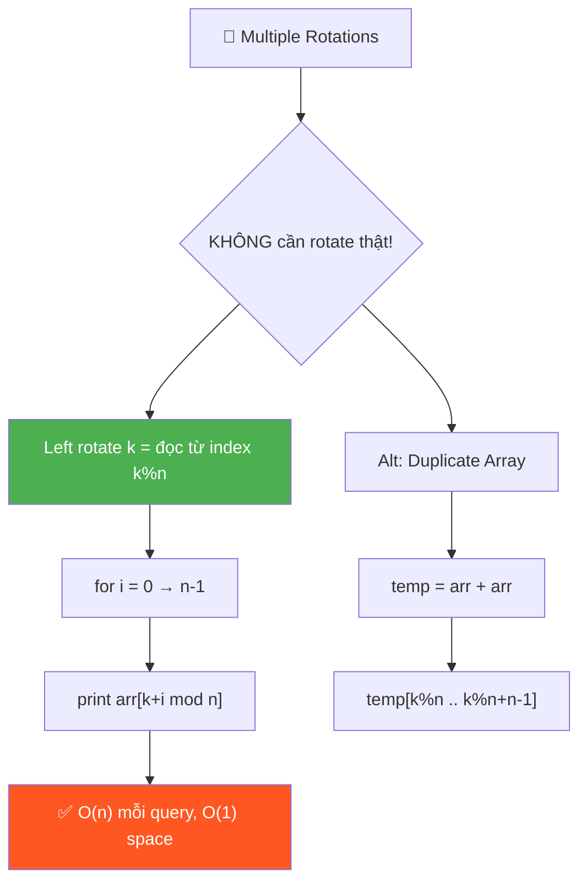
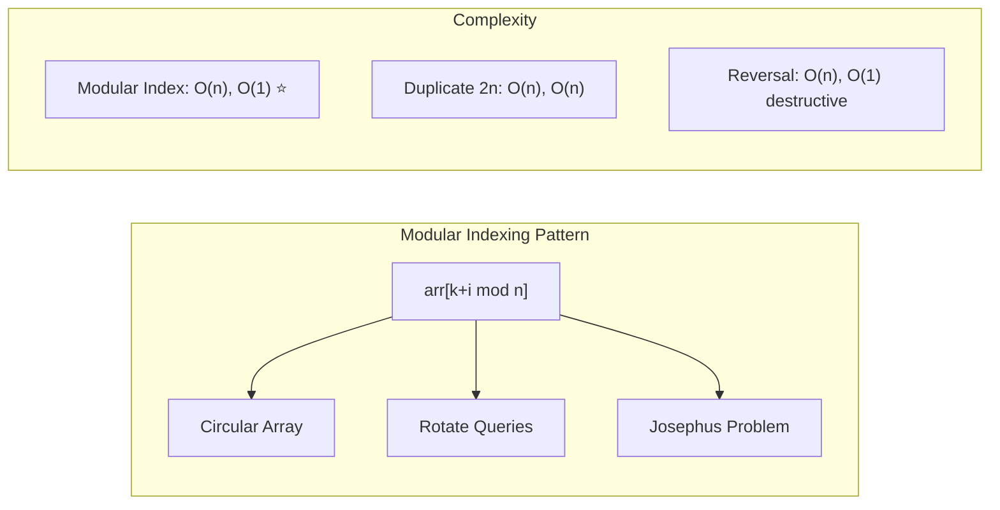
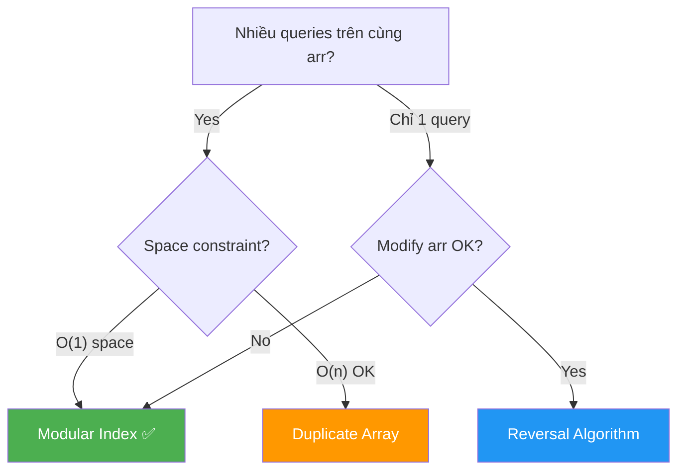

# 🔄 Multiple Left Rotations of Array — GfG (Easy)

> 📖 Code: [Multiple Left Rotations.js](./Multiple%20Left%20Rotations.js)





---

## R — Repeat & Clarify

🧠 _"Không cần thật sự rotate! Chỉ cần in từ index (k % n) → modular indexing!"_

> 🎙️ _"Given multiple rotation queries, print the rotated array for each query WITHOUT actually rotating."_

### Clarification Questions

```
Q: Left rotate nghĩa là gì chính xác?
A: Dịch mọi phần tử sang TRÁI k vị trí, phần tử đầu "cuộn" về cuối

Q: Có modify mảng gốc không?
A: KHÔNG! Nhiều queries → mảng phải giữ nguyên giữa các queries

Q: k có thể lớn hơn n không?
A: CÓ! k = 14, n = 5 → tương đương rotate 14 % 5 = 4

Q: k = 0 hoặc k = n?
A: Trả về mảng nguyên gốc (0 rotation hoặc full cycle)

Q: Mảng rỗng hoặc 1 phần tử?
A: Trả về nguyên mảng (rotate vô nghĩa)
```

### Tại sao bài này quan trọng?

```
  Bài này dạy pattern MODULAR INDEXING — nền tảng cho MỌI bài circular!

  BẠN PHẢI hiểu:
  1. Rotation = SHIFT điểm bắt đầu, KHÔNG phải di chuyển phần tử
  2. Modulo (%) = "cuộn vòng" — công cụ số 1 cho circular problems
  3. KHÔNG ROTATE THẬT khi có nhiều queries → read-only approach

  Pattern này xuất hiện trong:
  ┌────────────────────────────────────────────────────────────┐
  │  Circular Buffer/Queue    → read/write pointer % capacity │
  │  Rotate Array #189       → target index = (i + k) % n    │
  │  Josephus Problem        → modular elimination            │
  │  Clock problems          → hours % 12, minutes % 60      │
  │  Hash Table              → hash % tableSize               │
  │  Circular Linked List    → detect cycle with modulo       │
  └────────────────────────────────────────────────────────────┘
```

---

## 🧠 Bản chất bài toán — Hiểu để NHỚ, không chỉ để GIẢI

### Left Rotation = Dịch ĐIỂM BẮT ĐẦU

```
  Tưởng tượng mảng như 1 VÒNG TRÒN (carousel):

  arr = [1, 3, 5, 7, 9]

  Biểu diễn LINEAR (thẳng):
    ┌───┬───┬───┬───┬───┐
    │ 1 │ 3 │ 5 │ 7 │ 9 │
    └───┴───┴───┴───┴───┘
      0   1   2   3   4

  Biểu diễn CIRCULAR (vòng):
           1
        ╱     ╲
      9         3
      │         │
      7 ─── 5

  Left rotate k = QUAY vòng tròn k bước NGƯỢC chiều kim đồng hồ
  = Đổi ĐIỂM BẮT ĐẦU ĐỌC từ index 0 → index k!

  k=0: đọc từ index 0 → [1, 3, 5, 7, 9]  (nguyên gốc)
  k=1: đọc từ index 1 → [3, 5, 7, 9, 1]  (bắt đầu từ 3)
  k=3: đọc từ index 3 → [7, 9, 1, 3, 5]  (bắt đầu từ 7)

  💡 KEY INSIGHT:
     Left rotate k = ĐỌC mảng bắt đầu từ index k!
     KHÔNG CẦN di chuyển bất kỳ phần tử nào!
```

### Modulo (%) — Phép "cuộn vòng"

```
  Khi đọc từ index k, đến cuối mảng ta phải "cuộn" về đầu!

  arr = [1, 3, 5, 7, 9], k=3, n=5

  Đọc lần lượt:
    i=0: index = (3+0) = 3 → arr[3] = 7
    i=1: index = (3+1) = 4 → arr[4] = 9
    i=2: index = (3+2) = 5 → ⚠️ 5 = n! Out of bounds!

  → Dùng MODULO: 5 % 5 = 0 → arr[0] = 1  ← "cuộn" về đầu!

    i=2: (3+2) % 5 = 5 % 5 = 0 → arr[0] = 1 ✅
    i=3: (3+3) % 5 = 6 % 5 = 1 → arr[1] = 3 ✅
    i=4: (3+4) % 5 = 7 % 5 = 2 → arr[2] = 5 ✅

  → Result: [7, 9, 1, 3, 5] ✅

  🧠 MODULO = phép chia lấy DƯ = "cuộn tròn" tự nhiên!

  ┌──────────────────────────────────────────────────────┐
  │  index % n nghĩa là:                                 │
  │                                                      │
  │  Nếu index < n: trả về chính index (trong phạm vi)  │
  │  Nếu index ≥ n: "cuộn" về đầu                       │
  │                                                      │
  │  Giống đồng hồ:                                     │
  │    13 giờ = 13 % 12 = 1 giờ                         │
  │    25 giờ = 25 % 12 = 1 giờ                         │
  │    Luôn nằm trong [0, 11]!                           │
  │                                                      │
  │  Công thức: (k + i) % n → luôn nằm trong [0, n-1]  │
  └──────────────────────────────────────────────────────┘
```

### Tại sao k % n trước khi dùng?

```
  Khi k ≥ n: rotate k lần = rotate k % n lần!

  Ví dụ: arr = [1, 3, 5, 7, 9], n = 5

    k=5:  rotate 5 lần → quay ĐÚNG 1 vòng → về lại vị trí gốc!
          → k % n = 5 % 5 = 0 → KHÔNG rotate!

    k=6:  rotate 6 lần = 1 vòng + 1 bước = rotate 1 lần
          → k % n = 6 % 5 = 1 ✅

    k=14: rotate 14 lần = 2 vòng + 4 bước = rotate 4 lần
          → k % n = 14 % 5 = 4 ✅

  🧠 CHỨNG MINH: Tại sao rotate n = rotate 0?

    Left rotate 1: mỗi phần tử dịch trái 1 → arr[i] → vị trí i-1
    Left rotate n: mỗi phần tử dịch trái n → quay đúng 1 vòng tròn
                   → mọi phần tử về lại VỊ TRÍ BAN ĐẦU!

    Tổng quát:
      rotate(k) = rotate(k % n)
      Vì: k = q × n + r   (q vòng + r bước dư)
          q vòng = no-op (quay đúng q vòng → về vị trí gốc)
          r bước = rotation thực sự!

  📌 LUÔN normalize: k = k % n trước khi tính toán!
     → Tránh k lớn bất thường (k = 1,000,000)
     → Tránh tính toán thừa
```

### Left vs Right Rotation — Mối quan hệ

```
  Left rotate k  ←→  Right rotate (n - k)!

  arr = [1, 3, 5, 7, 9], n = 5

  Left rotate 2:
    [1, 3, 5, 7, 9] → [5, 7, 9, 1, 3]    ← dịch trái 2

  Right rotate 3 (= n - 2 = 3):
    [1, 3, 5, 7, 9] → [5, 7, 9, 1, 3]    ← dịch phải 3 = CÙNG KẾT QUẢ!

  🧠 Tại sao?
    Left k  = đọc từ index k         → (k + i) % n
    Right r = đọc từ index (n - r)   → (n - r + i) % n

    Khi r = n - k:
      (n - (n - k) + i) % n = (k + i) % n  ← GIỐNG NHAU! ✅

  ┌──────────────────────────────────────────────────┐
  │  Left rotate k  =  Right rotate (n - k)         │
  │  Right rotate k =  Left rotate (n - k)          │
  │                                                  │
  │  → Chỉ cần NHỚ 1 công thức, suy ra cái kia!    │
  └──────────────────────────────────────────────────┘

  📌 LeetCode #189 "Rotate Array" yêu cầu RIGHT rotate:
    Right rotate k = Left rotate (n - k)
    → index mới = (i + k) % n    (CỘNG k thay vì đọc từ k)
```

---

## 🧭 Luồng Suy Nghĩ — Từ đọc đề đến solution

> 💡 Phần này dạy bạn **CÁCH TƯ DUY** để tự giải bài, không chỉ biết đáp án.

### Bước 1: Đọc đề → Gạch chân KEYWORDS

```
  Đề bài: "Given an array and multiple rotation queries,
           print the rotated array for each query."

  Gạch chân:
    "multiple queries"  → NHIỀU lần → KHÔNG THỂ modify mảng!
    "rotation"          → circular, modular
    "print"             → chỉ cần OUTPUT, không cần lưu

  🧠 Tự hỏi: "Nếu rotate thật cho mỗi query thì sao?"
    → arr bị modify → query tiếp theo CHẠY TRÊN arr ĐÃ THAY ĐỔI!
    → Phải RESTORE lại mảng gốc → lãng phí!
    → HOẶC phải copy mảng cho mỗi query → O(n × q) space!

  📌 Kỹ năng chuyển giao:
    "Multiple queries trên CÙNG data" → ĐỌC, KHÔNG GHI!
    → Nghĩ ngay: preprocessing, mathematical mapping, modular indexing
```

### Bước 2: Vẽ ví dụ NHỎ bằng tay → Tìm PATTERN

```
  arr = [A, B, C, D, E]  (n = 5)
         0  1  2  3  4

  Viết ra mấy lần rotate:
    k=0: [A, B, C, D, E]   đọc từ index 0: A B C D E
    k=1: [B, C, D, E, A]   đọc từ index 1: B C D E A
    k=2: [C, D, E, A, B]   đọc từ index 2: C D E A B
    k=3: [D, E, A, B, C]   đọc từ index 3: D E A B C

  🧠 Quan sát PATTERN:
    1. "Rotate left k" = đọc mảng bắt đầu từ index k!
    2. Khi đến cuối mảng → "cuộn" về đầu!
    3. k=5 → quay 1 vòng → giống k=0 → k % n = 0!

  📌 Kỹ năng chuyển giao:
    Khi gặp "rotation" hay "circular":
    → Viết ra vài trường hợp bằng tay
    → TÌM mối liên hệ giữa k và index BẮT ĐẦU
    → 99% sẽ dùng MODULO!
```

### Bước 3: Từ pattern → Công thức

```
  Từ quan sát: "rotate k = đọc từ index k"
  → Phần tử thứ i sau rotation = arr[(k + i) % n]

  🧠 CHỨNG MINH bằng trực giác:

    Trước rotate: vị trí i chứa arr[i]
    Sau left rotate k: phần tử tại vị trí i "dịch trái k bước"
       → phần tử BAN ĐẦU ở vị trí (i + k) sẽ đứng tại vị trí i
       → result[i] = arr[(i + k) % n]

  Ví dụ: k=3, i=0
    result[0] = arr[(0 + 3) % 5] = arr[3] = D ✅
    (phần tử ở vị trí 3 "dịch trái 3" → đến vị trí 0)

  📌 Kỹ năng chuyển giao:
    Bất kỳ bài "circular" nào:
    → new_index = (old_index + offset) % size
    → Đây là CÔNG THỨC VÀNG cho circular problems!
```

### Bước 4: Có cần optimize thêm không?

```
  🧠 Tự hỏi: "Nếu có Q queries, mỗi query O(n) → O(Q × n) tổng. OK?"

  Phân tích:
    → Phải in n phần tử cho mỗi query → O(n) mỗi query là OPTIMAL!
    → Không thể nhanh hơn O(n) per query (phải in tất cả!)
    → O(Q × n) tổng → ĐÃ TỐI ƯU!

  Alternative: Preprocess bằng mảng 2n
    → Preprocessing: O(n) time + O(n) space
    → Per query: O(n) (slice)
    → Bỏ modulo nhưng TỐN space → trade-off!

  📌 Kết luận: Modular indexing là BEST cho hầu hết trường hợp
    → O(1) space, O(n) per query, KHÔNG modify data
```

---

## E — Examples

```
arr = [1, 3, 5, 7, 9], n = 5

  k=1: [3, 5, 7, 9, 1]    ← bắt đầu từ index 1
  k=3: [7, 9, 1, 3, 5]    ← bắt đầu từ index 3
  k=4: [9, 1, 3, 5, 7]    ← bắt đầu từ index 4
  k=6: [3, 5, 7, 9, 1]    ← 6%5=1, bắt đầu từ index 1

  💡 Left rotate k = bắt đầu đọc từ index (k % n)!
```

### Minh họa trực quan — Modular Indexing

```
  arr = [1, 3, 5, 7, 9], k = 3

  ┌───────────────────────────────────────────────────┐
  │  Mảng gốc:                                        │
  │  ┌───┬───┬───┬───┬───┐                            │
  │  │ 1 │ 3 │ 5 │ 7 │ 9 │                            │
  │  └───┴───┴───┴───┴───┘                            │
  │    0   1   2   3   4                               │
  │                    ↑                               │
  │                  k = 3 (START ĐỌC TẠI ĐÂY!)      │
  │                                                    │
  │  Đọc theo modular:                                 │
  │    i=0: (3+0)%5 = 3 → arr[3] = 7                  │
  │    i=1: (3+1)%5 = 4 → arr[4] = 9                  │
  │    i=2: (3+2)%5 = 0 → arr[0] = 1  ← CUỘN!       │
  │    i=3: (3+3)%5 = 1 → arr[1] = 3                  │
  │    i=4: (3+4)%5 = 2 → arr[2] = 5                  │
  │                                                    │
  │  Result: [7, 9, 1, 3, 5] ✅                       │
  └───────────────────────────────────────────────────┘

  Hình dung CIRCULAR:
                 ┌─START k=3
                 ↓
      1 ← 3 ← 5 ← [7] → 9
      ↑                    │
      └────────────────────┘
      Đọc: 7 → 9 → 1 → 3 → 5
```

### Minh họa — Duplicate Array Approach

```
  arr = [1, 3, 5, 7, 9]

  temp = arr + arr:
  ┌───┬───┬───┬───┬───┬───┬───┬───┬───┬───┐
  │ 1 │ 3 │ 5 │ 7 │ 9 │ 1 │ 3 │ 5 │ 7 │ 9 │
  └───┴───┴───┴───┴───┴───┴───┴───┴───┴───┘
    0   1   2   3   4   5   6   7   8   9

  k=3: start = 3%5 = 3
       temp[3..7] = [7, 9, 1, 3, 5] ✅
       ← Không cần modulo! Vì mảng đã "cuộn sẵn"!

  k=6: start = 6%5 = 1
       temp[1..5] = [3, 5, 7, 9, 1] ✅

  🧠 Tại sao hoạt động?
    Duplicate = "mở vòng tròn" thành đường thẳng DÀI GẤP ĐÔI!
    → Bất kỳ đoạn n phần tử liên tiếp nào = 1 rotation!
    → Không cần modulo vì mảng đã kéo dài quá n!
```

---

## A — Approach

### Approach 1: Modular Index — O(1) space ✅

```
  💡 Ý tưởng: Dùng CÔNG THỨC (k + i) % n thay vì rotate thật!

  ┌─────────────────────────────────────────────────────────────┐
  │  Input: arr[n], k (số bước rotate)                         │
  │                                                             │
  │  Bước 1: Normalize k                                       │
  │    k = k % n    ← xử lý k > n                             │
  │                                                             │
  │  Bước 2: Đọc n phần tử bắt đầu từ index k                │
  │    for i = 0 → n-1:                                        │
  │      result[i] = arr[(k + i) % n]                          │
  │                                                             │
  │  Time: O(n)     Space: O(1)*    Modify arr: KHÔNG!         │
  │  * O(n) nếu tính result array                              │
  └─────────────────────────────────────────────────────────────┘

  🧠 Tại sao O(1) space?
    Nếu chỉ PRINT (không lưu): O(1) space
    Nếu tạo result array: O(n) space (nhưng đây là space cho OUTPUT)
    → Convention: không tính output space vào complexity
```

### Approach 2: Duplicate Array — O(n) space

```
  💡 Ý tưởng: Nhân đôi mảng → mọi rotation = 1 slice liên tiếp!

  Preprocessing:
    temp = [...arr, ...arr]    ← O(n) space và O(n) time

  Per query k:
    start = k % n
    result = temp[start .. start + n - 1]     ← temp.slice(start, start + n)

  ┌─────────────────────────────────────────────────────────────┐
  │  Ưu điểm:                                                  │
  │    → Không cần modulo mỗi iteration                        │
  │    → Slice liên tiếp = CACHE FRIENDLY!                     │
  │    → Code rất đơn giản                                     │
  │                                                             │
  │  Nhược điểm:                                                │
  │    → O(n) extra space cho temp                              │
  │    → slice() tạo array mới mỗi lần = O(n) mỗi query       │
  │                                                             │
  │  Time: O(n) preprocessing + O(n) per query                 │
  │  Space: O(n)                                                │
  └─────────────────────────────────────────────────────────────┘

  📌 Khi nào chọn Duplicate?
    → Khi n NHỎ, memory KHÔNG là vấn đề
    → Khi cần tối đa CACHE LOCALITY (đọc sequential liên tục)
    → Khi code ĐƠNGIẢN NHẤT có thể (e.g., competitive programming)
```

### So sánh 2 approaches



```
  ┌──────────────────────────────────────────────────────────────┐
  │  Bài hỏi "nhiều queries" → Modular Index (read-only!)      │
  │  Bài hỏi "rotate và trả về" → Reversal Algorithm           │
  │  Bài hỏi "tốc độ, n nhỏ" → Duplicate Array                │
  └──────────────────────────────────────────────────────────────┘
```

---

## C — Code

### Solution 1: Modular Index — O(1) space ✅

```javascript
function leftRotate(arr, k) {
  const n = arr.length;
  const result = [];

  for (let i = 0; i < n; i++) {
    result.push(arr[(k + i) % n]);
  }
  return result;
}

// Handle multiple queries
function multipleRotations(arr, queries) {
  for (const k of queries) {
    console.log(leftRotate(arr, k).join(" "));
  }
}
```

```
  📝 Line-by-line:

  Line 3: const result = []
    → Mảng kết quả. Nếu chỉ print thì dùng console.log trực tiếp
    → Ở đây trả về array để flexible hơn

  Line 5-7: for (let i = 0; i < n; i++) { result.push(arr[(k + i) % n]); }
    → TRÁI TIM của thuật toán!
    → i = vị trí trong KẾT QUẢ (0, 1, 2, ...)
    → (k + i) % n = vị trí tương ứng trong MẢNG GỐC

    🧠 Phân tích (k + i) % n:
    ┌────────────────────────────────────────────────────┐
    │  k = offset (số bước rotate)                       │
    │  i = counter (vị trí output)                       │
    │  k + i = vị trí thật trong mảng gốc               │
    │  % n = "cuộn vòng" khi vượt quá n                  │
    │                                                    │
    │  Khi k + i < n:  % n không ảnh hưởng              │
    │  Khi k + i ≥ n:  % n "cuộn" về đầu mảng          │
    └────────────────────────────────────────────────────┘

  Line 12-14: multipleRotations
    → Duyệt qua từng query k
    → Gọi leftRotate cho mỗi k
    → arr KHÔNG BỊ MODIFY → các query INDEPENDENT!

  ⚠️ Nếu k có thể ÂM (right rotation):
    k = ((k % n) + n) % n;  ← normalize về [0, n-1]
    → k = -2, n = 5: ((-2 % 5) + 5) % 5 = (3 + 5) % 5...
    → JS: -2 % 5 = -2 → (-2 + 5) % 5 = 3 ✅
```

### Solution 2: Duplicate Array — O(n) space

```javascript
function multipleRotationsPreprocess(arr, queries) {
  const n = arr.length;
  const temp = [...arr, ...arr]; // duplicate!

  for (const k of queries) {
    const start = k % n;
    console.log(temp.slice(start, start + n).join(" "));
  }
}
```

```
  📝 Line-by-line:

  Line 3: const temp = [...arr, ...arr]
    → Spread operator: tạo mảng mới gộp 2 bản copy
    → arr = [1,3,5] → temp = [1,3,5,1,3,5]
    → Size: 2n

    ⚠️ Alternative: temp = arr.concat(arr)
       → Cùng kết quả, khác syntax

  Line 6: const start = k % n
    → VẪN CẦN modulo! Vì k có thể > 2n!
    → k=14, n=5: start = 14%5 = 4 ✅
    → Nhưng BÊN TRONG vòng for: KHÔNG cần modulo!

  Line 7: temp.slice(start, start + n)
    → slice(start, end) — end EXCLUSIVE!
    → Lấy n phần tử liên tiếp từ vị trí start
    → Vì temp có 2n phần tử → start + n ≤ 2n → AN TOÀN!

    🧠 Chứng minh an toàn:
       start ∈ [0, n-1]   (vì đã % n)
       start + n ∈ [n, 2n-1]   (luôn ≤ 2n = temp.length)
       → KHÔNG BAO GIỜ out of bounds!
```

### Trace CHI TIẾT: arr = [1, 3, 5, 7, 9], k = 3

```
  n = 5, k % n = 3

  ──── Modular Index ────────────────────────────────────────

  i=0: index = (3 + 0) % 5 = 3     → arr[3] = 7
         ↓ 3 < 5, modulo không ảnh hưởng

  i=1: index = (3 + 1) % 5 = 4     → arr[4] = 9
         ↓ 4 < 5, modulo không ảnh hưởng

  i=2: index = (3 + 2) % 5 = 0     → arr[0] = 1  ← CUỘN!
         ↓ 5 % 5 = 0! "Cuộn" về index 0!

  i=3: index = (3 + 3) % 5 = 1     → arr[1] = 3
         ↓ 6 % 5 = 1

  i=4: index = (3 + 4) % 5 = 2     → arr[2] = 5
         ↓ 7 % 5 = 2

  → Result: [7, 9, 1, 3, 5] ✅

  ──── Duplicate Array ──────────────────────────────────────

  temp = [1, 3, 5, 7, 9, 1, 3, 5, 7, 9]
          0  1  2  3  4  5  6  7  8  9

  start = 3 % 5 = 3
  temp.slice(3, 8) = [7, 9, 1, 3, 5] ✅
                      ↑──────────↑
                    index 3    index 7
```

### Trace edge case: k > n → k = 14, n = 5

```
  k = 14, n = 5
  k % n = 14 % 5 = 4

  ──── Modular Index ────────────────────────────────────────

  Normalize: k = 4 (tương đương rotate 4)

  i=0: (4+0) % 5 = 4 → arr[4] = 9
  i=1: (4+1) % 5 = 0 → arr[0] = 1   ← cuộn!
  i=2: (4+2) % 5 = 1 → arr[1] = 3
  i=3: (4+3) % 5 = 2 → arr[2] = 5
  i=4: (4+4) % 5 = 3 → arr[3] = 7

  → Result: [9, 1, 3, 5, 7] ✅

  🧠 Nhận xét: k = 14 và k = 4 cho CÙNG kết quả!
     14 = 2 × 5 + 4  → 2 vòng quay đầy (no-op) + 4 bước thực
```

> 🎙️ _"Instead of actually rotating, I use modular indexing. Left rotate by k means reading from index k%n. For each position i, the element is arr[(k+i) % n]. This handles multiple queries efficiently without modifying the original array."_

---

## ❌ Common Mistakes — Lỗi thường gặp

### Mistake 1: Quên normalize k bằng modulo

```javascript
// ❌ SAI: k = 14, n = 5 → index = 14 → OUT OF BOUNDS!
function leftRotateBad(arr, k) {
  const result = [];
  for (let i = 0; i < arr.length; i++) {
    result.push(arr[k + i]); // ← THIẾU % n!
  }
  return result;
}

// ✅ ĐÚNG: luôn dùng modulo
result.push(arr[(k + i) % n]);
```

```
  🧠 Tại sao sai?
    k = 14, i = 0 → index = 14 → arr[14] = undefined!
    → Phải (k + i) % n để "cuộn" về [0, n-1]
```

### Mistake 2: Rotate thật sự → phá mảng gốc

```javascript
// ❌ SAI cho MULTIPLE queries: mảng bị modify!
function rotateAndPrint(arr, queries) {
  for (const k of queries) {
    // Rotate arr thật sự
    for (let j = 0; j < k; j++) {
      arr.push(arr.shift()); // ← MODIFY arr!
    }
    console.log(arr.join(" "));
    // ⚠️ arr ĐÃ THAY ĐỔI! Query tiếp sẽ SAI!
  }
}

// ✅ ĐÚNG: dùng modular, KHÔNG modify arr
function multipleRotations(arr, queries) {
  for (const k of queries) {
    console.log(leftRotate(arr, k).join(" "));
    // arr KHÔNG đổi → query INDEPENDENT!
  }
}
```

```
  🧠 Tại sao sai?
    Query 1: k=3 → rotate arr 3 lần → arr thay đổi!
    Query 2: k=1 → rotate arr ĐÃ BỊ THAY ĐỔI 1 lần
             → Kết quả = rotate 3+1 = 4 THAY VÌ rotate 1!

  → MULTIPLE queries phải INDEPENDENT → read-only!
```

### Mistake 3: Nhầm Left với Right

```javascript
// ❌ NHẦM: Đây là RIGHT rotate!
arr[(i + k) % n]; // ← phần tử i SẼ ĐẾN vị trí (i+k)%n
// ← Đây là mapping ĐÍCH, không phải NGUỒN!

// ✅ LEFT rotate: đọc TỪ vị trí (k + i)
result[i] = arr[(k + i) % n]; // ← lấy phần tử từ (k+i)

// ✅ RIGHT rotate: lấy phần tử đến TRƯỚC k bước
result[i] = arr[(i - k + n) % n]; // ← hoặc arr[(n - k + i) % n]
```

```
  🧠 Cách nhớ:
  ┌──────────────────────────────────────────────────────┐
  │  LEFT rotate k:   result[i] = arr[(i + k) % n]     │
  │    → "Đọc TIẾN k bước" trong mảng gốc               │
  │                                                      │
  │  RIGHT rotate k:  result[i] = arr[(i - k + n) % n] │
  │    → "Đọc LÙI k bước" trong mảng gốc                │
  │    → +n để tránh index ÂM!                           │
  └──────────────────────────────────────────────────────┘
```

### Mistake 4: Quên +n khi modulo số âm (JS trap!)

```javascript
// ❌ JavaScript: -2 % 5 = -2 (KHÔNG PHẢI 3!)
// Khác Python: -2 % 5 = 3

// ❌ SAI: right rotate 2, n=5
const index = (i - 2) % 5; // i=0 → -2 % 5 = -2 → NEGATIVE INDEX!

// ✅ ĐÚNG: thêm n trước modulo
const index = (i - 2 + 5) % 5; // i=0 → 3 % 5 = 3 ✅

// ✅ TỔNG QUÁT an toàn:
const index = (i - (k % n) + n) % n; // luôn [0, n-1]
```

```
  🧠 JavaScript modulo trap:
  ┌──────────────────────────────────────────────────┐
  │  JavaScript:  -2 % 5 = -2  (giữ dấu tử số!)   │
  │  Python:      -2 % 5 = 3   (luôn dương!)        │
  │  C/C++:       -2 % 5 = -2  (giống JS)          │
  │  Java:        -2 % 5 = -2  (giống JS)          │
  │                                                  │
  │  → Trong JS/C/Java: LUÔN thêm +n trước %!       │
  │  → ((x % n) + n) % n → đảm bảo kết quả ≥ 0     │
  └──────────────────────────────────────────────────┘
```

---

## O — Optimize

```
                     Time/query  Space    Modify arr?   Preprocess
  ──────────────────────────────────────────────────────────────────
  Naive (shift)      O(n×k)      O(1)     ✅ YES!       O(1)
  Reversal Algo      O(n)        O(1)     ✅ YES        O(1)
  Modular Index ✅   O(n)        O(1)*    ❌ NO         O(1)
  Duplicate Array    O(n)        O(n)     ❌ NO         O(n)

  * O(1) nếu chỉ print, O(n) nếu tạo result array

  Modular tốt nhất cho MULTIPLE queries:
    → Không modify gốc → queries độc lập!
    → O(1) preprocessing, O(n) per query
    → KHÔNG TỐN thêm memory!
```

### Phân tích Naive approach (tại sao TỆ)

```
  Naive: dịch từng phần tử 1 bước, lặp k lần.

  function naiveRotate(arr, k) {
    for (let j = 0; j < k; j++) {
      const first = arr[0];               // lưu phần tử đầu
      for (let i = 0; i < arr.length - 1; i++) {
        arr[i] = arr[i + 1];              // shift trái 1
      }
      arr[arr.length - 1] = first;         // đặt đầu vào cuối
    }
  }

  ⚠️ Time: O(n × k) → k = n/2 → O(n²/2) → O(n²)!
     Với n = 100,000 và k = 50,000:
     → 5 × 10⁹ operations → TLE (Time Limit Exceeded)!

  → Modular Index: O(n) per query → 100,000 operations → ✅
```

### Reversal Algorithm (bonus — cho bài "rotate thật")

```
  Khi bài YÊU CẦU modify mảng gốc (e.g., LeetCode #189):
  → Dùng Reversal Algorithm — O(n) time, O(1) space!

  Left rotate k:
    Step 1: Reverse arr[0..k-1]      ← đảo ngược phần đầu
    Step 2: Reverse arr[k..n-1]      ← đảo ngược phần cuối
    Step 3: Reverse arr[0..n-1]      ← đảo ngược TOÀN BỘ

  Ví dụ: arr = [1, 3, 5, 7, 9], k = 3

    Step 1: Reverse [1, 3, 5]      → [5, 3, 1, 7, 9]
    Step 2: Reverse [7, 9]         → [5, 3, 1, 9, 7]
    Step 3: Reverse [5, 3, 1, 9, 7] → [7, 9, 1, 3, 5] ✅

  🧠 Tại sao hoạt động?
    "Đảo 2 phần, rồi đảo cả → phần sau lên trước, phần trước xuống sau!"
    Giống lật 2 nửa bản tay, rồi lật cả bàn tay!

  ⚠️ DESTRUCTIVE! Modify mảng gốc → KHÔNG dùng cho multiple queries!
```

---

## T — Test

```
Test Cases:
  arr=[1,3,5,7,9], k=1   → [3, 5, 7, 9, 1]          ✅ Basic
  arr=[1,3,5,7,9], k=3   → [7, 9, 1, 3, 5]          ✅ Standard
  arr=[1,3,5,7,9], k=5   → [1, 3, 5, 7, 9]          ✅ Full cycle
  arr=[1,3,5,7,9], k=6   → [3, 5, 7, 9, 1]          ✅ k > n
  arr=[1,3,5,7,9], k=14  → [9, 1, 3, 5, 7]          ✅ k >> n
  arr=[1,3,5,7,9], k=0   → [1, 3, 5, 7, 9]          ✅ No rotation
  arr=[42],        k=7   → [42]                       ✅ Single element
  arr=[1,2],       k=1   → [2, 1]                     ✅ Two elements
```

### Edge Cases giải thích

```
  ┌──────────────────────────────────────────────────────────────┐
  │  k = 0:       (0+i)%n = i → arr[i] → mảng gốc!            │
  │               → Rotation 0 = no-op ✅                       │
  │                                                              │
  │  k = n:       (n+i)%n = i%n = i → arr[i] → mảng gốc!      │
  │               → Full cycle = no-op ✅                        │
  │                                                              │
  │  k > n:       k%n normalize → tương đương k nhỏ hơn        │
  │               → 14%5 = 4 → same as k=4 ✅                   │
  │                                                              │
  │  n = 1:       (k+i)%1 = 0 luôn → arr[0] → chính nó!       │
  │               → 1 phần tử rotate bao nhiêu cũng giống ✅    │
  │                                                              │
  │  Multiple queries: arr KHÔNG bị modify                       │
  │               → Mỗi query INDEPENDENT ✅                    │
  └──────────────────────────────────────────────────────────────┘
```

---

## 🗣️ Interview Script

### 🎙️ Think Out Loud — Mô phỏng phỏng vấn thực

```
  👤 Interviewer: "Given an array and multiple left-rotation queries,
                   print the rotated array for each query."

  🧑 You: "Let me clarify — for each query k, I need to print the
   array after left-rotating by k positions? And the array should
   remain unchanged between queries?"

  👤 Interviewer: "Correct."

  🧑 You: "My first observation is that actually rotating the array
   for each query would be wasteful — it modifies the array, making
   queries dependent on each other.

   Instead, I notice that left rotating by k is equivalent to reading
   the array starting from index k. For position i in the result,
   the element comes from arr[(k + i) mod n].

   This uses modular arithmetic to handle the 'wrap-around' when
   we reach the end. And k mod n handles cases where k >= n.

   This gives O(n) per query, O(1) extra space, and the original
   array stays untouched so queries are independent."

  👤 Interviewer: "What if k is very large, like 10^9?"

  🧑 You: "No problem — k mod n reduces it to at most n-1.
   For n=5 and k=10^9, we compute 10^9 mod 5 = 0, so no rotation.
   The modulo operation is O(1)."

  👤 Interviewer: "Is there an alternative approach?"

  🧑 You: "Yes — I could duplicate the array: temp = arr + arr.
   Then for each query, slice temp from k%n to k%n+n.
   This trades O(n) space for simpler indexing — no modulo needed
   inside the loop. But for this problem, modular indexing is
   more space-efficient and equally fast."
```

### Pattern & Liên kết

```
  MODULAR INDEXING pattern: Bất kỳ bài "circular" → dùng % n!

  ┌──────────────────────────────────────────────────────────────┐
  │  Circular Array/Buffer  → read/write pointer % capacity     │
  │  Rotate queries         → (k + i) % n                       │
  │  Josephus Problem       → modular elimination                │
  │  Clock arithmetic       → hours % 12, minutes % 60          │
  │  Hash Table             → hash(key) % tableSize              │
  │  Circular Queue         → (front + i) % capacity             │
  └──────────────────────────────────────────────────────────────┘

  📌 CÔNG THỨC VÀNG:
    new_position = (current + offset) % size
    → Luôn nằm trong [0, size - 1]
    → "Cuộn tròn" tự nhiên!
```

### Skeleton code — Template cho circular problems

```javascript
// TEMPLATE: Circular Array Access
function circularAccess(arr, startOffset) {
  const n = arr.length;
  const result = [];

  for (let i = 0; i < n; i++) {
    // Đọc n phần tử bắt đầu từ offset
    result.push(arr[(startOffset + i) % n]);
  }

  return result;
}

// Left rotate k:   circularAccess(arr, k)
// Right rotate k:  circularAccess(arr, n - k)
// Read from pos p: circularAccess(arr, p)
```

```
  🧠 HỌC 1 TEMPLATE → GIẢI ĐƯỢC TẤT CẢ bài circular!

  Bản chất: mọi bài circular chỉ KHÁC NHAU ở OFFSET:
  ┌────────────────────────────────────────────────────┐
  │  Left rotate k:      offset = k                    │
  │  Right rotate k:     offset = n - k                │
  │  Circular buffer:    offset = head                  │
  │  Ring buffer read:   offset = readPointer           │
  └────────────────────────────────────────────────────┘
```
