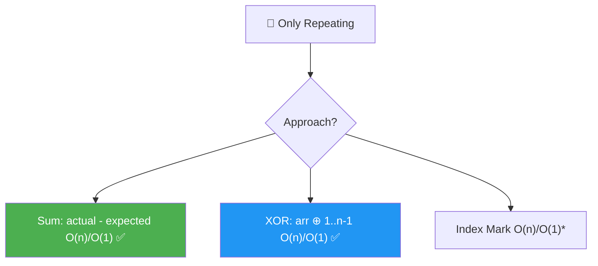
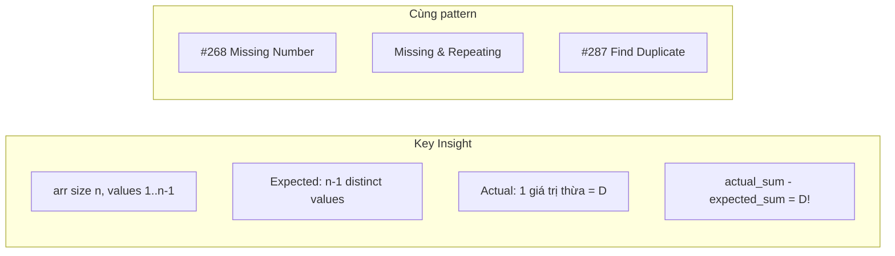
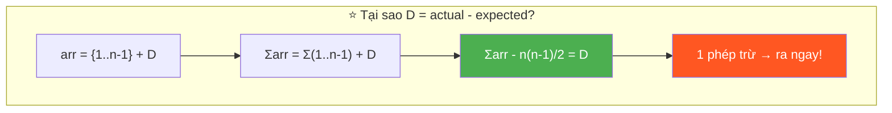
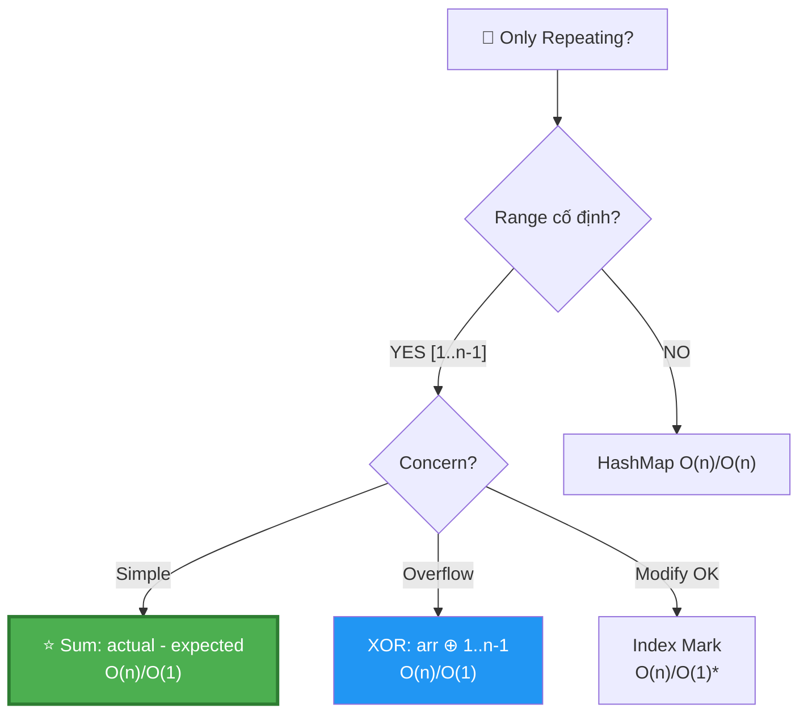
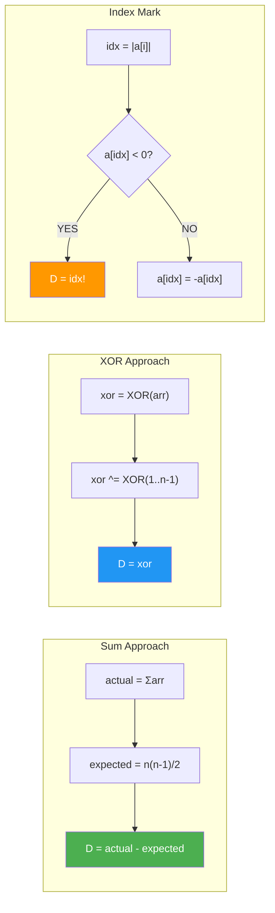
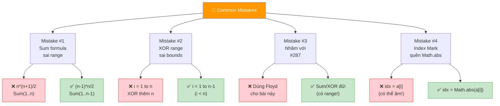
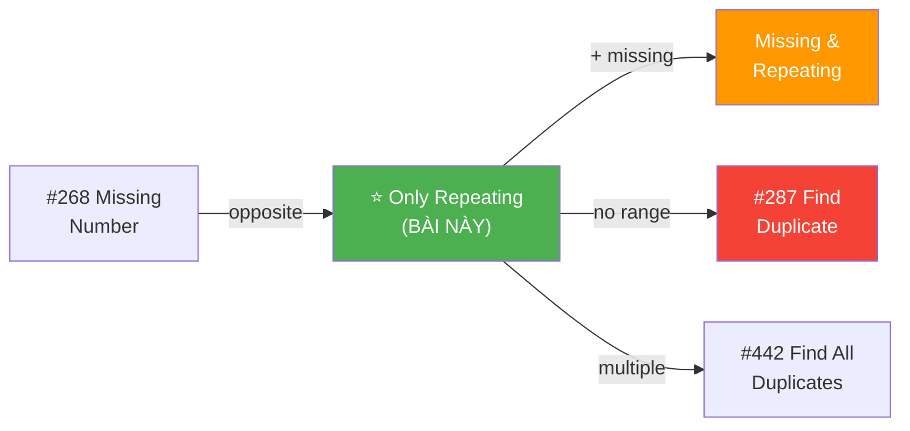
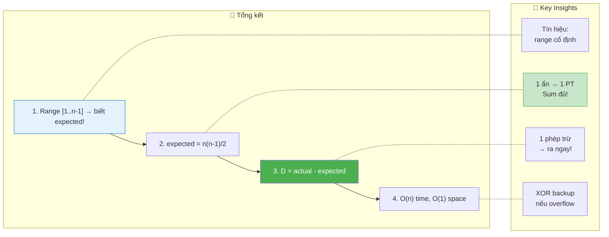

# 🔁 Only Repeating From 1 To n-1 — GfG (Easy)

> 📖 Code: [Only Repeating.js](./Only%20Repeating.js)





---

## R — Repeat & Clarify

🧠 _"Range [1..n-1], mảng size n → thừa 1 phần tử = duplicate! Sum thực - Sum expected = duplicate. O(n)/O(1)!"_

> 🎙️ _"Array size n, elements from 1 to n-1, exactly one repeats. Find it."_

### Clarification Questions

```
Q: Mảng size n, giá trị 1..n-1 → có n-1 giá trị distinct + 1 duplicate?
A: Đúng! Chính xác 1 giá trị xuất hiện 2 lần.

Q: Giống bài Missing Number (#268)?
A: GẦN giống! #268: [0..n] thiếu 1 → tìm MISSING.
   Bài này: [1..n-1] thừa 1 → tìm REPEATING.
   → Cùng technique: Sum hoặc XOR!

Q: Giống bài Missing & Repeating?
A: Đơn giản hơn! Chỉ cần tìm 1 số (repeating), không cần missing.
   → 1 ẩn → 1 phương trình đủ! (Sum HOẶC XOR)

Q: Có thể có nhiều hơn 1 duplicate?
A: KHÔNG! Chính xác 1 giá trị lặp, đúng 1 lần thừa.

Q: Giá trị duplicate ở đâu trong mảng?
A: BẤT CỨ ĐÂU! Mảng KHÔNG sorted!
```

### Tại sao bài này quan trọng?

```
  ⭐ Bài này dạy PATTERN CĂN BẢN NHẤT:
     "Range cố định → biết EXPECTED → so sánh!"

  ┌──────────────────────────────────────────────────────────────┐
  │  Bài này = VERSION ĐƠN GIẢN NHẤT của pattern:              │
  │    "Range cố định [a..b] + duplicate/missing"                │
  │                                                              │
  │  Progression:                                                │
  │    ⭐ Only Repeating (BÀI NÀY) → 1 ẩn, 1 PT (sum)!        │
  │    ⭐ Missing Number (#268)    → 1 ẩn, 1 PT (sum)!         │
  │    Missing + Repeating         → 2 ẩn, 2 PT (sum + sum²)!  │
  │    Find Duplicate (#287)       → Floyd Cycle (no range)!     │
  │                                                              │
  │  📌 TÍN HIỆU: "Elements 1 to n-1" → SUM hoặc XOR!         │
  │                                                              │
  │  📌 Quy tắc VÀNG:                                           │
  │    Số ẩn = Số PT cần thiết!                                 │
  │    1 ẩn → Sum ĐỦ! (hoặc XOR)                               │
  │    2 ẩn → Sum + Sum²! (hoặc XOR partition)                  │
  └──────────────────────────────────────────────────────────────┘
```

---

## 🧠 Bản chất bài toán — Hiểu để NHỚ, không chỉ để GIẢI

### INSIGHT CỐT LÕI: "Thừa = Actual - Expected!"

```
  ⭐ ĐÂY LÀ TRICK ĐƠN GIẢN NHẤT TRONG LẬP TRÌNH!

  arr size n, giá trị 1..n-1, 1 số lặp → duplicate = D

  Expected: {1, 2, 3, ..., n-1} → sum = n(n-1)/2
  Actual:   {1, 2, ..., D, ..., D, ..., n-1} → sum = n(n-1)/2 + D

  → actual_sum - expected_sum = D!  ← 1 PHÉP TRỪ!

  ┌──────────────────────────────────────────────────────────────┐
  │  Ẩn dụ: KIỂM KÊ HÀNG HÓA!                                 │
  │                                                              │
  │  Kho có n-1 loại hàng, mỗi loại 1 cái.                     │
  │  Ai đó BỎ THÊM 1 cái vào (duplicate).                       │
  │  → Đếm tổng → so sánh với expected → ra cái thừa!         │
  │                                                              │
  │  Không cần biết cái thừa Ở ĐÂU!                             │
  │  Chỉ cần biết TỔNG khác mong đợi bao nhiêu!                │
  └──────────────────────────────────────────────────────────────┘
```

### Tại sao SUM hoạt động?

```
  Ví dụ: arr = [1, 3, 2, 3, 4], n = 5

  Expected: {1, 2, 3, 4} → sum(1..4) = 4×5/2 = 10
  Actual:   {1, 3, 2, 3, 4} → sum = 1+3+2+3+4 = 13

  Diff: 13 - 10 = 3 = DUPLICATE! ✅

  ┌──────────────────────────────────────────────────────────────┐
  │  CHỨNG MINH:                                                 │
  │                                                              │
  │  arr = {1, 2, ..., n-1} + thêm 1 bản sao D                 │
  │  Σarr = Σ(1..n-1) + D = n(n-1)/2 + D                       │
  │  Σarr - n(n-1)/2 = D  ∎                                     │
  │                                                              │
  │  ⚠️ Chỉ đúng khi CHÍNH XÁC 1 duplicate!                   │
  │     Nếu nhiều duplicates → Sum cho TỔNG các thừa,           │
  │     KHÔNG cho từng giá trị!                                  │
  └──────────────────────────────────────────────────────────────┘
```

### Tại sao XOR hoạt động?

```
  XOR(arr) ⊕ XOR(1..n-1)

  Mỗi số 1..n-1 trừ D: xuất hiện 2 lần (1 arr + 1 range)
    → a ⊕ a = 0 → TRIỆT TIÊU!

  D xuất hiện 3 lần (2 arr + 1 range):
    → D ⊕ D ⊕ D = D (vì D ⊕ D = 0, 0 ⊕ D = D)

  → Kết quả = D! ✅

  📌 So sánh Sum vs XOR:
  ┌──────────────┬───────────────────┬───────────────────┐
  │              │ Sum               │ XOR               │
  ├──────────────┼───────────────────┼───────────────────┤
  │ Nguyên lý    │ Thừa = diff       │ Triệt tiêu cặp   │
  │ Overflow?    │ ⚠️ CÓ (sum lớn)  │ ✅ KHÔNG          │
  │ Dễ hiểu?    │ ✅ RẤT dễ        │ Cần hiểu XOR      │
  │ Code         │ 2 dòng!           │ 4 dòng            │
  └──────────────┴───────────────────┴───────────────────┘
```

### Hình dung trực quan

```
  arr = [1, 3, 2, 3, 4]    n = 5

  Đường số:   1   2   3   4
  Expected:   ✅  ✅  ✅  ✅    (mỗi số 1 lần)
  Actual:     ✅  ✅  ✅✅ ✅   (3 xuất hiện 2 lần!)
                        ↑
                    DUPLICATE!

  Sum view:
    Expected: 1 + 2 + 3 + 4 = 10
    Actual:   1 + 2 + 3 + 3 + 4 = 13
                          ↑ thừa!
    Diff: 13 - 10 = 3
```



---

## 🧭 Luồng Suy Nghĩ — Từ đọc đề đến solution

### Bước 1: Đọc đề → Gạch chân KEYWORDS

```
  Đề: "Array size n, elements from 1 to n-1, exactly one repeats"

  Gạch chân:
    ✏️ "1 to n-1"     → RANGE CỐ ĐỊNH! → biết expected!
    ✏️ "size n"       → n phần tử, n-1 giá trị distinct + 1 thừa
    ✏️ "exactly one"  → ĐÚNG 1 duplicate!
    ✏️ "repeats"      → tìm GIÁI TRỊ duplicate

  🧠 "Range cố định → nghĩ SUM hoặc XOR ngay!"
  🧠 "1 ẩn (duplicate) → 1 phương trình đủ!"
```

### Bước 2: Vẽ ví dụ → Phát hiện PATTERN

```
  arr = [1, 3, 2, 3, 4], n = 5

  🧠 "Nếu không lặp: {1, 2, 3, 4} → sum = 10"
  🧠 "Actual: {1, 3, 2, 3, 4} → sum = 13"
  🧠 "13 - 10 = 3 → duplicate = 3!"

  ─── Quá trình suy luận ───

  Bước 2a: Expected = Sum(1..n-1) = n(n-1)/2

    n = 5: expected = 5×4/2 = 10

  Bước 2b: Actual = Σarr[i] = 13

  Bước 2c: Diff = 13 - 10 = 3

  📌 EUREKA: Diff = DUPLICATE! Vì thừa đúng 1 bản!
```

### Bước 3: Alternatives

```
  🧠 "Có cần HashMap không?"
    → KHÔNG! Sum 1 dòng đủ! HashMap tốn O(n) space!

  🧠 "Overflow?"
    → n lớn → sum lớn → dùng XOR thay Sum!

  🧠 "Modify input OK?"
    → Index Mark: negate a[val] → gặp âm = duplicate!
```

### Bước 4: Cây quyết định



---

## E — Examples

```
VÍ DỤ 1: arr = [1, 3, 2, 3, 4]  n = 5

  Sum: (1+3+2+3+4) - (1+2+3+4) = 13 - 10 = 3 ✅
  XOR: (1^3^2^3^4) ^ (1^2^3^4)
     = (1^1)^(2^2)^(3^3^3)^(4^4) = 0^0^3^0 = 3 ✅
```

```
VÍ DỤ 2: arr = [1, 5, 1, 2, 3, 4]  n = 6

  Sum: (1+5+1+2+3+4) - (1+2+3+4+5) = 16 - 15 = 1 ✅
  XOR: (1^5^1^2^3^4) ^ (1^2^3^4^5)
     = (1^1^1)^(2^2)^(3^3)^(4^4)^(5^5) = 1 ✅

  📌 Duplicate ở ĐẦU mảng → Sum/XOR vẫn tìm được!
```

```
VÍ DỤ 3: arr = [2, 2]  n = 2

  Sum: (2+2) - (1) = 4 - 1 = 3?? ← ⚠️ SAI!

  Chờ đã... range [1..n-1] = [1..1] = chỉ có {1}!
  Mà arr = [2, 2] → giá trị 2 KHÔNG nằm trong [1..1]!
  → Đề bài KHÔNG HỢP LỆ!

  ✅ ĐÚNG: arr = [1, 1], n = 2
  Sum: (1+1) - (1) = 2 - 1 = 1 ✅
```

### Minh họa Sum — Trace dạng bảng

```
  arr = [1, 3, 2, 3, 4], n = 5

  ┌──────────┬─────────────┬──────────────┬────────────────┐
  │ Step     │ Operation   │ actualSum    │ expectedSum    │
  ├──────────┼─────────────┼──────────────┼────────────────┤
  │ Init     │             │ 0            │ 5×4/2 = 10     │
  │ i=0      │ +arr[0]=1   │ 1            │                │
  │ i=1      │ +arr[1]=3   │ 4            │                │
  │ i=2      │ +arr[2]=2   │ 6            │                │
  │ i=3      │ +arr[3]=3   │ 9            │                │
  │ i=4      │ +arr[4]=4   │ 13           │                │
  │ Result   │ 13 - 10     │              │ = 3 ✅         │
  └──────────┴─────────────┴──────────────┴────────────────┘
```

### Minh họa XOR — Trace dạng bảng

```
  arr = [1, 3, 2, 3, 4], n = 5

  ┌──────────┬─────────────┬──────────────┬────────────────┐
  │ Step     │ Operation   │ xor (binary) │ xor (decimal)  │
  ├──────────┼─────────────┼──────────────┼────────────────┤
  │ Init     │             │ 000          │ 0              │
  │ Pass 1   │ ^arr[0]=1   │ 001          │ 1              │
  │          │ ^arr[1]=3   │ 010          │ 2              │
  │          │ ^arr[2]=2   │ 000          │ 0              │
  │          │ ^arr[3]=3   │ 011          │ 3              │
  │          │ ^arr[4]=4   │ 111          │ 7              │
  │ Pass 2   │ ^1          │ 110          │ 6              │
  │          │ ^2          │ 100          │ 4              │
  │          │ ^3          │ 111          │ 7              │
  │          │ ^4          │ 011          │ 3 ✅           │
  └──────────┴─────────────┴──────────────┴────────────────┘
```

---

## A — Approach

### Approach 1: Sum — O(n)/O(1) ✅

```
💡 Ý tưởng: actual_sum - expected_sum = duplicate!

  ┌──────────────────────────────────────────────────────────────┐
  │  expected = n(n-1)/2 = Sum(1..n-1)                           │
  │  actual = Σarr[i]                                            │
  │  duplicate = actual - expected                                │
  │                                                              │
  │  Time: O(n)    Space: O(1)    ⚠️ Overflow risk!             │
  │                                                              │
  │  📌 Đơn giản nhất! 2 dòng code!                              │
  └──────────────────────────────────────────────────────────────┘
```

### Approach 2: XOR — O(n)/O(1) ✅

```
💡 Ý tưởng: XOR triệt tiêu cặp → chỉ còn duplicate!

  ┌──────────────────────────────────────────────────────────────┐
  │  xor = XOR(arr) ⊕ XOR(1..n-1)                               │
  │  = duplicate (tất cả khác triệt tiêu!)                      │
  │                                                              │
  │  Time: O(n)    Space: O(1)    ✅ No overflow!               │
  │                                                              │
  │  📌 An toàn hơn Sum, nhưng cần hiểu XOR!                    │
  └──────────────────────────────────────────────────────────────┘
```

### Approach 3: Index Mark — O(n)/O(1)*

```
💡 Ý tưởng: Dùng giá trị làm index, negate để đánh dấu!

  ┌──────────────────────────────────────────────────────────────┐
  │  Duyệt arr: val = |arr[i]|                                  │
  │    if arr[val] < 0 → val đã visited → DUPLICATE!            │
  │    else → arr[val] = -arr[val] (mark!)                       │
  │                                                              │
  │  Time: O(n)    Space: O(1)                                   │
  │  ⚠️ MODIFY input array!                                    │
  └──────────────────────────────────────────────────────────────┘
```

### So sánh

```
  ┌──────────────────┬──────────┬──────────┬──────────────────────┐
  │                  │ Time     │ Space    │ Ghi chú               │
  ├──────────────────┼──────────┼──────────┼──────────────────────┤
  │ Sum ⭐           │ O(n)     │ O(1)     │ Đơn giản nhất!       │
  │ XOR ✅           │ O(n)     │ O(1)     │ No overflow!          │
  │ Index Mark       │ O(n)     │ O(1)*    │ Modify input!         │
  │ HashMap          │ O(n)     │ O(n)     │ Overkill cho bài này │
  └──────────────────┴──────────┴──────────┴──────────────────────┘
```

---

## C — Code ✅

### Solution 1: Sum — O(n)/O(1) ✅

```javascript
function findRepeatingSum(arr) {
  const n = arr.length;
  const expectedSum = (n - 1) * n / 2;
  const actualSum = arr.reduce((a, b) => a + b, 0);
  return actualSum - expectedSum;
}
```

```
  📝 Line-by-line:

  Line 2: n = arr.length
    → Mảng size n, giá trị 1..n-1
    → n phần tử, n-1 giá trị distinct + 1 duplicate

  Line 3: expectedSum = (n-1)*n/2
    → Sum(1..n-1) = (n-1)×n/2
    → ⚠️ KHÔNG PHẢI n(n+1)/2! Đó là Sum(1..n)!
    → VD: n=5 → Sum(1..4) = 4×5/2 = 10

    ⚠️ Tại sao (n-1)*n/2 chứ không phải n*(n-1)/2?
       → GIỐNG NHAU! Nhân giao hoán! Nhưng (n-1)*n/2
         dễ thấy "(n-1) giá trị, giá trị lớn nhất = n-1"

  Line 4: actualSum = arr.reduce((a, b) => a + b, 0)
    → Tổng TẤT CẢ phần tử (bao gồm cả duplicate!)
    → reduce: accumulator + current, bắt đầu từ 0

  Line 5: actualSum - expectedSum
    → Phần dư = DUPLICATE!
    → Vì actual = expected + D → actual - expected = D!
```

### Solution 2: XOR — O(n)/O(1) ✅

```javascript
function findRepeatingXOR(arr) {
  const n = arr.length;
  let xor = 0;
  for (let i = 0; i < n; i++) xor ^= arr[i];
  for (let i = 1; i < n; i++) xor ^= i;
  return xor;
}
```

```
  📝 Line-by-line:

  Line 3: xor = 0
    → 0 ⊕ x = x → identity cho XOR
    → Bắt đầu từ 0 = "chưa có gì"

  Line 4: XOR tất cả arr elements
    → xor = arr[0] ⊕ arr[1] ⊕ ... ⊕ arr[n-1]

  Line 5: XOR với 1..n-1
    → ⚠️ for i = 1 to n-1 (i < n, KHÔNG PHẢI i <= n!)
    → Vì range là [1..n-1], KHÔNG có n!

    🧠 Tại sao 2 vòng lặp riêng?
       Có thể gộp: for (i=0; i<n; i++) xor ^= arr[i]; xor ^= (i+1)
       Nhưng cẩn thận: gộp xor ^= (i+1) chạy từ 1 đến n
       → XOR thêm n (SAI!)
       → 2 vòng riêng AN TOÀN hơn!

  Line 6: return xor = D
    → Tất cả cặp triệt tiêu → chỉ còn duplicate!
```

### Solution 3: Index Mark — O(n)/O(1)*

```javascript
function findRepeatingMark(arr) {
  const a = [...arr];
  for (let i = 0; i < a.length; i++) {
    const idx = Math.abs(a[i]);
    if (a[idx] < 0) return idx;
    a[idx] = -a[idx];
  }
  return -1;
}
```

```
  📝 Line-by-line:

  Line 2: const a = [...arr] → Copy! (tránh modify input gốc)
    → Nếu đề cho phép modify → bỏ copy, dùng arr trực tiếp!

  Line 4: idx = Math.abs(a[i])
    → Dùng GIÁ TRỊ phần tử làm INDEX!
    → Math.abs vì a[i] có thể ĐÃ BỊ NEGATE!
    → VD: a[i] = -3 → idx = 3

  Line 5: if (a[idx] < 0) → ĐÃ VISIT trước đó!
    → Ai visit? Một phần tử TRƯỚC có cùng giá trị idx!
    → → idx = DUPLICATE! Return ngay!

  Line 6: a[idx] = -a[idx] → MARK bằng negate!
    → Lần đầu gặp idx → negate a[idx] → "đánh dấu đã thấy"

  ⚠️ Tại sao idx = Math.abs(a[i]) thay vì a[i] - 1?
     Vì giá trị 1..n-1 → index range 1..n-1
     a[idx] dùng TRỰC TIẾP giá trị làm index (1-indexed!)
     KHÁC với bài Missing+Repeating (dùng val-1 = 0-indexed!)
```

---

## 🔬 Deep Dive — Giải thích CHI TIẾT

> 💡 So sánh 3 approaches cùng 1 ví dụ.

### Deep Dive: Sum vs XOR vs Index Mark

```
  arr = [1, 5, 1, 2, 3, 4], n = 6

  ═══ SUM ═══════════════════════════════════════════════

  expected = 5×6/2 = 15
  actual = 1+5+1+2+3+4 = 16
  D = 16 - 15 = 1 ✅

  → 2 dòng code, O(1) operations sau reduce.

  ═══ XOR ═══════════════════════════════════════════════

  Pass 1 (arr): 1^5^1^2^3^4
    = (1^1) ^ 5 ^ 2 ^ 3 ^ 4
    = 0 ^ 5^2^3^4 = 5^2^3^4

  Pass 2 (1..5): ^ 1^2^3^4^5
    = (5^5) ^ (2^2) ^ (3^3) ^ (4^4) ^ 1
    = 0 ^ 0 ^ 0 ^ 0 ^ 1 = 1 ✅

  → Tất cả triệt tiêu trừ D!

  ═══ INDEX MARK ═══════════════════════════════════════

  a = [1, 5, 1, 2, 3, 4]

  i=0: idx=|1|=1 → a[1]=5 > 0 → a[1]=-5     → [1,-5,1,2,3,4]
  i=1: idx=|-5|=5 → a[5]=4 > 0 → a[5]=-4    → [1,-5,1,2,3,-4]
  i=2: idx=|1|=1 → a[1]=-5 < 0 → FOUND! D=1 ✅

  → Dừng ngay khi gặp index ĐÃ MARK!
```



---

## 📐 Invariant — Chứng minh tính đúng đắn

```
  📐 CHỨNG MINH SUM:

  Cho arr chứa {1, 2, ..., n-1} + 1 bản sao D.

  Σarr = Σ(1..n-1) + D
       = n(n-1)/2 + D

  → Σarr - n(n-1)/2 = D  ∎

  Tính đúng: D ∈ [1..n-1] → D ≥ 1 → diff ≥ 1 → KHÔNG = 0!
  Tính duy nhất: Chỉ 1 duplicate → diff = ĐÚNG D! ∎
```

```
  📐 CHỨNG MINH XOR:

  XOR(arr) ⊕ XOR(1..n-1):
    Mỗi k ∈ {1..n-1}, k ≠ D: xuất hiện 2 lần → k ⊕ k = 0
    D: xuất hiện 3 lần (2 arr + 1 range) → D ⊕ D ⊕ D = D

  → Kết quả = 0 ⊕ 0 ⊕ ... ⊕ D = D  ∎

  📐 CHỨNG MINH INDEX MARK:

  Invariant: Sau khi xử lý arr[0..i]:
    ∀ v ∈ values đã gặp: a[v] < 0 (đã mark!)
    ∀ v ∈ values chưa gặp: a[v] > 0 (chưa mark!)

  Khi gặp D lần thứ 2:
    idx = D → a[D] đã < 0 (mark lần 1)
    → Detect duplicate! ∎

  Correctness: D là UNIQUE duplicate → lần 2 gặp D
    CHẮC CHẮN trigger a[D] < 0 (vì lần 1 đã mark!)
```

---

## ❌ Common Mistakes — Lỗi thường gặp



### Mistake 1: Sum formula sai range!

```javascript
// ❌ SAI: Sum(1..n) thay vì Sum(1..n-1)!
const expected = n * (n + 1) / 2;  // ← Sum(1..n)!
// n=5: expected = 15, nhưng range chỉ 1..4 → expected = 10!

// ✅ ĐÚNG: Sum(1..n-1)!
const expected = (n - 1) * n / 2;
// n=5: expected = 4×5/2 = 10 ✅

// 🧠 Nhớ: n phần tử, giá trị 1..n-1 → Sum(1..n-1)!
//    n-1 = giá trị MAX = số lượng distinct values!
```

### Mistake 2: XOR range sai bounds!

```javascript
// ❌ SAI: XOR thêm n!
for (let i = 1; i <= n; i++) xor ^= i;
// XOR thêm giá trị n → kết quả sai!

// ✅ ĐÚNG: XOR chỉ 1..n-1!
for (let i = 1; i < n; i++) xor ^= i;
// ⚠️ i < n, KHÔNG PHẢI i <= n!
```

### Mistake 3: Nhầm với #287 Find Duplicate!

```
  #287 Find the Duplicate Number:
    → Mảng n+1 phần tử, giá trị [1, n]
    → KHÔNG biết range chính xác!
    → Dùng Floyd Cycle Detection!

  Bài này (Only Repeating):
    → Mảng n phần tử, giá trị [1, n-1]
    → BIẾT range → Sum/XOR ĐỦ!
    → KHÔNG CẦN Floyd!

  📌 "Có range → Sum/XOR! Không range → Floyd/HashMap!"
```

### Mistake 4: Index Mark — quên Math.abs!

```javascript
// ❌ SAI: a[i] có thể đã bị negate!
const idx = a[i];  // a[i] = -3 → idx = -3 → OUT OF BOUNDS!

// ✅ ĐÚNG: luôn dùng Math.abs!
const idx = Math.abs(a[i]);
// a[i] = -3 → idx = 3 → ĐÚNG!
```

---

## O — Optimize

```
                Time     Space    Overflow?   Modify?
  ──────────────────────────────────────────────────────
  Sum ⭐        O(n)     O(1)     ⚠️ có      No
  XOR ✅        O(n)     O(1)     ✅ không    No
  Index Mark    O(n)     O(1)*    ✅ không    ⚠️ có!
  HashMap       O(n)     O(n)     ✅ không    No

  📌 Sum = TỐI ƯU cho bài này! Đơn giản nhất!
     XOR = backup nếu hỏi overflow!
```

### Complexity chính xác — Đếm operations

```
  Sum:
    1 nhân + 1 chia (expected) + n cộng (actual) + 1 trừ
    TỔNG: n + 3 operations

  XOR:
    n XOR (pass 1) + (n-1) XOR (pass 2)
    TỔNG: 2n - 1 operations

  Index Mark:
    n abs + n comparisons + ≤n negations
    TỔNG: ≤ 3n operations

  📊 So sánh (n = 10⁶):
    Sum:     10⁶ + 3 ops ≈ 1ms
    XOR:     2×10⁶ ops ≈ 2ms
    Mark:    3×10⁶ ops ≈ 3ms
    → Sum nhanh nhất! (ít operations nhất)

  ⚠️ Overflow threshold:
    n ≈ 10⁵: sum ≈ 5×10⁹ → OK trong 64-bit
    n ≈ 10⁸: sum ≈ 5×10¹⁵ → vượt Number.MAX_SAFE_INTEGER!
    → n lớn: dùng XOR hoặc BigInt!
```

---

## T — Test

```
Test Cases:
  [1, 3, 2, 3, 4]       → 3    ✅ duplicate ở giữa
  [1, 5, 1, 2, 3, 4]    → 1    ✅ duplicate ở đầu
  [1, 2, 3, 4, 4]        → 4    ✅ duplicate ở cuối
  [1, 1]                 → 1    ✅ minimum n=2
  [2, 1, 3, 2, 4]        → 2    ✅ duplicate cách xa
  [1, 2, 3, 4, 5, 3]     → 3    ✅ n=6
```

### Edge Cases giải thích

```
  ┌──────────────────────────────────────────────────────────────────┐
  │  Minimum: arr=[1,1], n=2                                        │
  │    Sum: (1+1) - 1×2/2 = 2 - 1 = 1 ✅                           │
  │    XOR: (1^1) ^ (1) = 0 ^ 1 = 1 ✅                              │
  │                                                                  │
  │  Duplicate ở cuối: arr=[1,2,3,4,4], n=5                         │
  │    Sum: 14 - 10 = 4 ✅                                           │
  │                                                                  │
  │  Duplicate ở đầu: arr=[1,1,2,3,4], n=5                          │
  │    Sum: 11 - 10 = 1 ✅                                           │
  │    Index Mark: i=0→mark a[1], i=1→a[1]<0→D=1 ✅                │
  │                                                                  │
  │  📌 Vị trí duplicate KHÔNG ảnh hưởng Sum/XOR!                   │
  │     Sum chỉ cần TỔNG, XOR chỉ cần BIT!                         │
  └──────────────────────────────────────────────────────────────────┘
```

---

## 🗣️ Interview Script

### 🎙️ Think Out Loud — Mô phỏng phỏng vấn thực

> ⚠️ Script này dạy cách **NÓI**, không phải cách CODE.
> Mỗi đoạn = cách bạn **PHÁT BIỂU** trong phỏng vấn thực!

```
  ╔══════════════════════════════════════════════════════════════╗
  ║  🕐 FULL INTERVIEW SIMULATION — 1h30 (90 phút)             ║
  ║                                                              ║
  ║  00:00-05:00  Introduction + Icebreaker         (5 min)     ║
  ║  05:00-45:00  Problem Solving                   (40 min)    ║
  ║  45:00-60:00  Deep Technical Probing            (15 min)    ║
  ║  60:00-75:00  Variations + Extensions           (15 min)    ║
  ║  75:00-85:00  System Design at Scale            (10 min)    ║
  ║  85:00-90:00  Behavioral + Q&A                  (5 min)     ║
  ╚══════════════════════════════════════════════════════════════╝
```

```
  ╔══════════════════════════════════════════════════════════════╗
  ║  PART 1: INTRODUCTION (00:00 — 05:00)                       ║
  ╚══════════════════════════════════════════════════════════════╝

  👤 "Tell me about yourself and a time you detected
      a data anomaly using mathematical techniques."

  🧑 "I'm a frontend engineer with [X] years of experience.
      A relevant example: I was building an e-commerce
      checkout system. We had an inventory reconciliation
      process where each product SKU from 1 to N should
      appear exactly once in a batch.

      One day the batch had one extra item — a duplicate
      SKU that had been scanned twice. Instead of scanning
      every item one by one to find it, I realized I could
      just compute the TOTAL of all SKU numbers and compare
      it to the EXPECTED total — which I knew from the
      formula n times n minus 1 over 2.

      The difference was the duplicate SKU. One subtraction.
      No database lookup, no hashmap, no sorting.

      That's the exact technique for this problem:
      actual sum minus expected sum equals the duplicate."

  👤 "That's a clean approach. Let's formalize it."
```

```
  ╔══════════════════════════════════════════════════════════════╗
  ║  PART 2: PROBLEM SOLVING (05:00 — 45:00)                   ║
  ╚══════════════════════════════════════════════════════════════╝

  ──────────────── 05:00 — Clarify (4 phút) ────────────────

  👤 "Array of size n, elements from 1 to n-1,
      exactly one value repeats. Find it."

  🧑 "Let me clarify.

      The array has n elements.
      Values range from 1 to n minus 1.
      That's n minus 1 distinct values filling n slots.
      So exactly ONE value must appear TWICE.
      Everything else appears exactly once.

      Key observations:
      The RANGE is FIXED and KNOWN — 1 to n minus 1.
      This means I can compute the EXPECTED sum
      without seeing the array.

      This is a '1 unknown, 1 equation' problem.
      The unknown is the duplicate D.
      The equation is: actual sum equals expected sum plus D.

      The array is NOT sorted.
      I need to return the VALUE of the duplicate,
      not its index."

  ──────────────── 09:00 — The 'Inventory Audit' Insight (3 phút) ──

  🧑 "I like to think of this as an INVENTORY AUDIT.

      Imagine a warehouse with n minus 1 types of items,
      each type having exactly 1 unit. Someone accidentally
      added an extra unit of one type.

      To find which type was duplicated, I don't need
      to inspect every shelf. I just WEIGH the entire
      warehouse and compare to the expected weight.

      The excess weight IS the duplicate.

      Mathematically:
      Expected sum equals sum from 1 to n minus 1
      equals n times open paren n minus 1 close paren
      over 2.
      Actual sum equals sum of all array elements.
      Duplicate equals actual minus expected."

  ──────────────── 12:00 — Approach 1: Sum (4 phút) ────────────

  🧑 "My primary approach: the SUM technique.

      Step 1: Compute expected sum equals n times
      n minus 1 over 2. This is O of 1.

      Step 2: Compute actual sum by adding all elements.
      This is O of n.

      Step 3: Return actual minus expected.

      For arr equal [1, 3, 2, 3, 4] with n equal 5:
      Expected equals 4 times 5 over 2 equals 10.
      Actual equals 1 plus 3 plus 2 plus 3 plus 4 equals 13.
      Duplicate equals 13 minus 10 equals 3.

      Time: O of n. Space: O of 1. Two lines of code.

      This is the SIMPLEST possible solution."

  ──────────────── 16:00 — Approach 2: XOR (5 phút) ────────────

  🧑 "If the interviewer asks about overflow,
      I switch to the XOR technique.

      XOR has two key properties:
      a XOR a equals 0 — cancellation.
      a XOR 0 equals a — identity.

      I XOR all array elements together,
      then XOR with all values from 1 to n minus 1.

      Every value EXCEPT the duplicate appears exactly
      twice — once in the array and once in the range.
      They cancel out: x XOR x equals 0.

      The duplicate D appears THREE times — twice in
      the array plus once in the range.
      D XOR D XOR D equals D. Because D XOR D equals 0,
      and 0 XOR D equals D.

      So the final result is D.

      For arr equal [1, 3, 2, 3, 4]:
      XOR all arr: 1 XOR 3 XOR 2 XOR 3 XOR 4 equals 7.
      XOR range 1 to 4: 7 XOR 1 XOR 2 XOR 3 XOR 4.
      All pairs cancel: result equals 3. Correct!

      Time: O of n. Space: O of 1. No overflow risk."

  ──────────────── 21:00 — Approach 3: Index Mark (4 phút) ────────

  🧑 "A third approach: use the array itself as a visited set.

      Since values are in range 1 to n minus 1,
      I can use each value as an INDEX into the array.

      For each element, I take its absolute value as idx.
      If arr at idx is already negative, then idx has been
      visited before — it's the duplicate!
      Otherwise, I negate arr at idx to mark it as visited.

      For arr equal [1, 3, 2, 3, 4]:
      i equal 0: value 1, arr at 1 is 3, positive.
      Negate: arr at 1 becomes minus 3.
      i equal 1: value abs of minus 3 equals 3.
      arr at 3 is 3, positive. Negate: arr at 3 becomes minus 3.
      i equal 2: value 2, arr at 2 is 2, positive.
      Negate: arr at 2 becomes minus 2.
      i equal 3: value abs of minus 3 equals 3.
      arr at 3 is minus 3. NEGATIVE! Duplicate found: 3!

      Time: O of n. Space: O of 1.
      But it MODIFIES the array — a trade-off."

  ──────────────── 25:00 — Write Code (3 phút) ────────────────

  🧑 "Let me code the sum approach — it's the cleanest.

      [Vừa viết vừa nói:]

      function findRepeating of arr.
      const n equal arr dot length.
      const expected equal n minus 1 times n over 2.
      const actual equal arr dot reduce of
      open paren a, b close paren arrow a plus b, 0.
      return actual minus expected.

      That's 4 lines. The key insight is in line 3:
      expected equals n minus 1 times n over 2.
      NOT n times n plus 1 over 2!

      The range is 1 to n MINUS 1, not 1 to n.
      This is the most common mistake."

  ──────────────── 28:00 — Trace bằng LỜI (3 phút) ────────────────

  🧑 "Let me trace with arr equal [1, 5, 1, 2, 3, 4], n equal 6.

      Expected: sum of 1 to 5 equals 5 times 6 over 2 equals 15.
      Actual: 1 plus 5 plus 1 plus 2 plus 3 plus 4 equals 16.
      Duplicate: 16 minus 15 equals 1. Correct!

      Notice: the duplicate 1 appears at index 0 and index 2.
      Their positions don't matter — sum is order-independent.

      Let me also trace XOR for the same example:
      Pass 1 — XOR arr:
      1 XOR 5 XOR 1 XOR 2 XOR 3 XOR 4.
      The two 1s cancel: 5 XOR 2 XOR 3 XOR 4.

      Pass 2 — XOR range 1 to 5:
      XOR with 1 XOR 2 XOR 3 XOR 4 XOR 5.
      5 XOR 5 cancels, 2 XOR 2 cancels, 3 XOR 3 cancels,
      4 XOR 4 cancels. Left with 1. Correct!"

  ──────────────── 31:00 — Edge Cases (3 phút) ────────────────

  🧑 "Edge cases.

      Minimum array: arr equal [1, 1], n equal 2.
      Expected: sum of 1 to 1 equals 1.
      Actual: 1 plus 1 equals 2.
      Duplicate: 2 minus 1 equals 1. Correct.

      Duplicate at the end: arr equal [1, 2, 3, 4, 4].
      Expected: 10. Actual: 14. Duplicate: 4.

      Duplicate at the beginning: arr equal [1, 1, 2, 3, 4].
      Expected: 10. Actual: 11. Duplicate: 1.

      The position of the duplicate doesn't matter
      for both Sum and XOR — they're commutative operations.
      sum of a, b, c equals sum of c, a, b.
      XOR of a, b, c equals XOR of c, a, b."

  ──────────────── 34:00 — Complexity (3 phút) ────────────────

  🧑 "Time: O of n. One pass through the array to compute
      the sum or XOR. The expected sum formula is O of 1.

      Space: O of 1. Just a running total.
      No extra arrays, no hashmaps.

      Compared to alternatives:
      HashMap: O of n time, O of n space. Works but wasteful.
      Sorting: O of n log n time. Overkill.
      Brute force nested loops: O of n squared. Way too slow.

      The sum approach is OPTIMAL in both time and space.
      It's also the simplest — literally 2 lines of logic."

  ──────────────── 37:00 — Sum formula derivation (3 phút) ────────

  👤 "How do you derive n times n minus 1 over 2?"

  🧑 "Classic Gauss formula.

      Sum from 1 to k equals k times k plus 1 over 2.

      For this problem, the range is 1 to n minus 1.
      So k equals n minus 1:
      sum equals n minus 1 times n minus 1 plus 1 over 2
      equals n minus 1 times n over 2.

      The intuition: pair the smallest with the largest.
      1 plus n minus 1 equals n.
      2 plus n minus 2 equals n.
      There are n minus 1 over 2 such pairs.
      Total equals n times n minus 1 over 2.

      A common trap: using n times n plus 1 over 2,
      which is sum from 1 to N, not 1 to n minus 1."

  ──────────────── 40:00 — Why this is a '1-unknown' problem (3 phút)

  🧑 "I want to highlight WHY sum alone is sufficient here.

      I have 1 UNKNOWN — the duplicate D.
      I need 1 EQUATION to solve for D.
      Sum gives me that equation:
      actual equals expected plus D.

      If I had 2 unknowns — like in Missing and Repeating —
      I'd need 2 equations: sum AND sum of squares.
      That's the 'system of equations' approach.

      The rule of thumb: number of unknowns equals
      number of equations needed.
      1 unknown: Sum or XOR.
      2 unknowns: Sum plus Sum-of-squares, or XOR partition."
```

```
  ╔══════════════════════════════════════════════════════════════╗
  ║  PART 3: DEEP TECHNICAL PROBING (45:00 — 60:00)            ║
  ╚══════════════════════════════════════════════════════════════╝

  ──────────────── 45:00 — Overflow analysis (5 phút) ────────────

  👤 "When does the sum overflow?"

  🧑 "The actual sum is at most n minus 1 times n over 2
      plus n minus 1 — the expected sum plus the maximum
      possible duplicate.

      In JavaScript, Number dot MAX_SAFE_INTEGER is
      2 to the 53 minus 1, approximately 9 times 10 to the 15.

      The sum grows as n squared over 2.
      Setting n squared over 2 less than 9 times 10 to the 15,
      n is approximately the square root of 1.8 times 10 to the 16,
      which is about 1.34 times 10 to the 8.

      So for n up to about 130 million, JavaScript's
      Number is safe. Beyond that, I'd need BigInt or XOR.

      In C++ with 32-bit integers:
      n squared over 2 exceeds 2 to the 31 when n is about 65,000.
      With 64-bit long long, safe up to about 4 billion.

      XOR NEVER overflows because it operates bit by bit.
      The result is always in the same range as the inputs.
      For safety-critical code, XOR is the better choice."

  ──────────────── 50:00 — XOR deep dive (4 phút) ────────────

  👤 "Why does D XOR D XOR D equal D?"

  🧑 "Let me break it down.

      XOR is associative and commutative.
      D XOR D equals 0. That's the cancellation property.
      0 XOR D equals D. That's the identity property.

      So D XOR D XOR D equals open paren D XOR D close paren
      XOR D equals 0 XOR D equals D.

      More generally:
      D XOR-ed an EVEN number of times gives 0.
      D XOR-ed an ODD number of times gives D.

      In our problem:
      Every non-duplicate value appears twice — once in the
      array, once in the range. Even count: cancels to 0.
      D appears three times — twice in array, once in range.
      Odd count: survives as D.

      This is the same principle behind RAID parity,
      error-correcting codes, and the 'single number'
      problem on LeetCode 136."

  ──────────────── 54:00 — Sum vs XOR trade-off (3 phút) ────────

  👤 "When would you choose Sum over XOR?"

  🧑 "Sum: simpler to understand, 2 lines of code.
      Anyone can read it. The math is elementary school
      arithmetic. But it has overflow risk.

      XOR: no overflow, same complexity.
      But it requires understanding bitwise operations.
      Less intuitive for someone unfamiliar with XOR.

      In an interview, I'd PRESENT Sum first because
      it's the most direct mapping from the insight.
      Then I'd MENTION XOR as the overflow-safe alternative
      if the interviewer asks.

      In production code:
      If n is bounded — say under a million — Sum is fine.
      If n is unbounded — or the language has strict
      integer limits like C — XOR is safer."

  ──────────────── 57:00 — Index Mark vs Sum/XOR (3 phút) ────────

  👤 "When would you prefer Index Mark?"

  🧑 "Index Mark has one unique advantage: EARLY TERMINATION.

      Sum and XOR must process ALL elements before
      producing the answer. They're full-scan approaches.

      Index Mark can stop as soon as it finds the duplicate.
      In the best case, the duplicate's two copies are
      at the beginning — O of 1 work.
      On average, it stops after scanning about 2/3 of
      the array — because by that point, enough values
      are marked that the duplicate is likely found.

      The downside: it MODIFIES the input array.
      If the array is read-only — or I need it intact
      for later use — Index Mark isn't an option.

      So the choice depends:
      Read-only? Sum or XOR.
      Modifiable and want early exit? Index Mark.
      Overflow risk? XOR."
```

```
  ╔══════════════════════════════════════════════════════════════╗
  ║  PART 4: VARIATIONS (60:00 — 75:00)                         ║
  ╚══════════════════════════════════════════════════════════════╝

  ──────────────── 60:00 — Missing Number (#268) (3 phút) ────────

  👤 "How does this relate to Missing Number?"

  🧑 "They're MIRROR problems!

      Missing Number: array of n elements, values 0 to n,
      one value is MISSING. Find it.
      Answer: expected minus actual equals missing.

      Only Repeating: array of n elements, values 1 to n minus 1,
      one value is DUPLICATED. Find it.
      Answer: actual minus expected equals duplicate.

      Same technique, OPPOSITE subtraction!
      Missing: expected is LARGER. Excess is in expected.
      Duplicate: actual is LARGER. Excess is in actual.

      Both can also use XOR. The XOR approach is identical
      in structure — XOR all elements with the full range.
      The 'leftover' is the anomaly."

  ──────────────── 63:00 — Missing AND Repeating (4 phút) ────────

  👤 "What if you need to find BOTH a missing and a repeating?"

  🧑 "Now I have 2 unknowns: D for duplicate, M for missing.
      I need 2 equations.

      Equation 1: actual sum minus expected sum equals D minus M.
      Call this diff.

      Equation 2: actual sum-of-squares minus expected
      sum-of-squares equals D squared minus M squared.
      Call this sqDiff.

      D squared minus M squared equals D plus M times D minus M
      equals D plus M times diff.
      So D plus M equals sqDiff over diff.

      Now I have D minus M and D plus M.
      D equals D plus M plus D minus M over 2.
      M equals D plus M minus D minus M over 2.

      This is the 'system of equations' technique.
      1 unknown: 1 equation. 2 unknowns: 2 equations.
      The pattern scales."

  ──────────────── 67:00 — Find Duplicate (#287) (4 phút) ────────

  👤 "How does this compare to LeetCode 287?"

  🧑 "LeetCode 287 — Find the Duplicate Number — is HARDER.

      The array has n plus 1 elements with values 1 to n.
      But the key difference: the duplicate can appear
      MORE than twice.

      Sum won't work because the excess isn't just one copy.
      XOR won't work because the cancellation pattern
      doesn't hold with arbitrary repetitions.

      The elegant solution for 287 is FLOYD'S CYCLE DETECTION.
      Treat the array as a linked list where arr at i
      points to the next node. The duplicate creates a cycle.

      For OUR problem — Only Repeating — the duplicate
      appears EXACTLY twice. So Sum and XOR work perfectly.

      The decision heuristic:
      Known range, exactly 1 extra copy? Sum or XOR.
      Unknown repetitions? Floyd's cycle detection.
      No range constraint at all? HashMap."

  ──────────────── 71:00 — Multiple duplicates (4 phút) ────────────

  👤 "What if there could be multiple duplicates?"

  🧑 "Sum alone gives the TOTAL excess — the sum of all
      duplicate values — but not which values are duplicated.

      For example, arr equal [1, 1, 2, 2, 3] with n equal 5.
      Expected sum of 1 to 4 equals 10. Actual equals 9.
      Diff equals minus 1? That doesn't make sense...

      Actually, the problem structure changes completely.
      With multiple duplicates, some values must be MISSING
      to make room. It becomes a 'find all missing and
      all repeating' problem — much harder.

      Approaches:
      HashMap: O of n time, O of n space. Count occurrences.
      Index Mark: O of n time, O of 1 space. Mark visited,
      collect those seen twice.
      XOR: doesn't directly help — cancellation only
      works for single anomalies.

      This is why the problem specifies EXACTLY one duplicate.
      It's a carefully crafted constraint that enables
      the elegant Sum/XOR solution."
```

```
  ╔══════════════════════════════════════════════════════════════╗
  ║  PART 5: SYSTEM DESIGN AT SCALE (75:00 — 85:00)            ║
  ╚══════════════════════════════════════════════════════════════╝

  ──────────────── 75:00 — Real-world applications (5 phút) ────────

  👤 "Where does this pattern appear in practice?"

  🧑 "Several important domains!

      First — DATA INTEGRITY / CHECKSUMS.
      Network protocols use checksums to verify data.
      TCP checksum is essentially a running sum.
      If the received checksum doesn't match the expected
      one, a byte was corrupted — same diff technique.

      Second — FINANCIAL RECONCILIATION.
      Bank transactions should balance. If the actual
      total differs from expected, there's a discrepancy.
      actual minus expected equals the anomaly.
      Auditors use this DAILY.

      Third — DATABASE DEDUPLICATION.
      In distributed databases, unique IDs from 1 to N
      are assigned to records. If the count is N plus 1,
      there's a duplicate. Sum of IDs minus expected
      gives the duplicated ID.

      Fourth — NETWORK PACKET SEQUENCING.
      TCP packets have sequence numbers. If a packet
      arrives twice — a duplicate ACK — the receiver
      can detect it using the same sum or XOR technique
      against expected sequence numbers."

  ──────────────── 80:00 — Streaming detection (5 phút) ────────────

  👤 "Can you detect duplicates in a data stream?"

  🧑 "Yes! The Sum and XOR techniques are STREAMING-FRIENDLY.

      I maintain a running sum as elements arrive.
      I also maintain the expected sum based on the count
      of elements seen so far.

      If at any point actual sum exceeds expected sum
      by more than what's possible with remaining elements,
      I've found the duplicate.

      But there's a subtlety: in a stream, I might not
      know N upfront. In that case, I need a different approach:

      BLOOM FILTER: probabilistic, O of 1 space per element.
      Reports 'possibly seen' or 'definitely not seen.'
      False positives but no false negatives.

      EXACT STREAMING: maintain a RUNNING XOR.
      When the stream is complete, XOR with 1 to n minus 1.
      The result is the duplicate. But I need to know n.

      For the specific constraint of this problem —
      known range, exactly one duplicate — the running sum
      approach is optimal for streaming."
```

```
  ╔══════════════════════════════════════════════════════════════╗
  ║  PART 6: BEHAVIORAL + Q&A (85:00 — 90:00)                  ║
  ╚══════════════════════════════════════════════════════════════╝

  ──────────────── 85:00 — Reflection (3 phút) ────────────────

  👤 "What would you take away from this problem?"

  🧑 "Three things.

      First, KNOWN RANGE enables mathematical solutions.
      The moment I see 'elements 1 to n minus 1,' I think
      Sum or XOR. The range gives me the EXPECTED value,
      and the difference reveals the anomaly.

      Second, NUMBER OF UNKNOWNS equals NUMBER OF EQUATIONS.
      1 unknown — Sum is enough.
      2 unknowns — Need Sum plus Sum-of-squares.
      This principle scales to any detection problem.

      Third, the PATTERN FAMILY.
      Only Repeating, Missing Number, Missing-and-Repeating —
      they're all variations of 'fixed range with anomaly.'
      Learning one teaches the others."

  ──────────────── 88:00 — Questions (2 phút) ────────────────

  👤 "Any questions for me?"

  🧑 "A few!

      First — this problem reduces to a single subtraction.
      But in real systems, data anomalies are rarely this
      clean. Do you use checksum-based techniques for
      data integrity in your infrastructure?

      Second — the XOR approach is more robust against
      overflow but harder to read. In code reviews,
      do you prefer clarity of Sum or safety of XOR?

      Third — the 'known range' constraint is the key
      enabler. Most production systems don't have such
      clean constraints. What's the most common anomaly
      detection pattern your team uses?"

  👤 "Great questions. Your progression from the inventory
      analogy to the mathematical proof was very clear.
      The connection to Missing Number and the overflow
      analysis showed real depth. We'll be in touch!"
```

```
  ╔══════════════════════════════════════════════════════════════╗
  ║  ⭐ 8 MẸO NÓI CHUYỆN TRONG PHỎNG VẤN (Only Repeating)    ║
  ╚══════════════════════════════════════════════════════════════╝

  📌 MẸO #1: State the core insight immediately
     ✅ "The range is fixed — 1 to n minus 1.
         I know the expected sum. Actual minus expected
         gives the duplicate. One subtraction."

  📌 MẸO #2: Use the 'inventory audit' analogy
     ✅ "It's like a warehouse with n minus 1 types of items.
         One extra item was added. Weigh the total,
         subtract the expected weight. The excess is
         the duplicate."

  📌 MẹO #3: Present Sum first, XOR as backup
     ✅ "Sum: simplest, 2 lines. XOR: same complexity
         but no overflow. I present Sum first because
         it's the most intuitive, then mention XOR
         if overflow comes up."

  📌 MẸO #4: Highlight the '1 unknown, 1 equation' rule
     ✅ "I have 1 unknown — the duplicate.
         I need 1 equation — Sum gives me that.
         If I had 2 unknowns, I'd need Sum PLUS
         Sum-of-squares."

  📌 MẸO #5: Flag the formula trap
     ✅ "Sum of 1 to n minus 1 is n minus 1 times n over 2.
         NOT n times n plus 1 over 2! The range ends at
         n minus 1, not n."

  📌 MẸO #6: Connect to the family
     ✅ "Only Repeating: actual minus expected.
         Missing Number: expected minus actual.
         Missing and Repeating: two equations.
         Same pattern, different directions."

  📌 MẸO #7: Address overflow proactively
     ✅ "Sum overflows at about n equals 130 million in JS.
         XOR never overflows. For safety-critical code,
         I'd choose XOR."

  📌 MẸO #8: Mention Index Mark for early termination
     ✅ "If I can modify the array, Index Mark stops
         as soon as it finds the duplicate — potentially
         before scanning the full array."
```


## 📚 Bài tập liên quan — Practice Problems

### Progression Path



### 1. Missing Number (#268) — Easy

```
  Đề: Mảng n số distinct từ [0, n]. Tìm số THIẾU.

  function missingNumber(nums) {
    const n = nums.length;
    return n * (n + 1) / 2 - nums.reduce((a, b) => a + b, 0);
  }

  📌 So sánh:
    Only Repeating: actual - expected = THỪA (duplicate)
    Missing Number: expected - actual = THIẾU (missing)
    → CÙNG 1 TRICK, đổi dấu!
```

### 2. Find the Duplicate (#287) — Medium

```
  Đề: Mảng n+1 phần tử, giá trị [1,n]. Tìm duplicate.

  ⚠️ KHÁC bài này! #287 KHÔNG nói mỗi số chỉ lặp 1 lần!
     → Có thể lặp nhiều lần!
     → KHÔNG dùng Sum (sum thừa ≠ 1 duplicate)!
     → Dùng Floyd's Cycle Detection!

  function findDuplicate(nums) {
    let slow = nums[0], fast = nums[0];
    do {
      slow = nums[slow];
      fast = nums[nums[fast]];
    } while (slow !== fast);

    slow = nums[0];
    while (slow !== fast) {
      slow = nums[slow]; fast = nums[fast];
    }
    return slow;
  }

  📌 "Biết range + 1 duplicate" → Sum/XOR!
     "Biết range + multiple duplicates" → Floyd/Index!
```

### 3. Find All Duplicates (#442) — Medium

```
  Đề: Mảng n phần tử, giá trị [1,n]. Tìm TẤT CẢ duplicates.

  function findDuplicates(nums) {
    const result = [];
    for (const num of nums) {
      const idx = Math.abs(num) - 1;
      if (nums[idx] < 0) result.push(idx + 1);
      else nums[idx] = -nums[idx];
    }
    return result;
  }

  📌 Index Mark mở rộng! Cùng trick negate!
```

### Tổng kết — "Range + duplicate" pattern

```
  ┌──────────────────────────────────────────────────────────────┐
  │  BÀI                     │  Technique         │  Ẩn         │
  ├──────────────────────────────────────────────────────────────┤
  │  Only Repeating ⭐       │  Sum / XOR         │  1 dup      │
  │  #268 Missing Number     │  Sum / XOR         │  1 miss     │
  │  Missing+Repeating       │  Sum+Sum² / XOR    │  1+1        │
  │  #287 Find Duplicate     │  Floyd Cycle       │  1 dup*     │
  │  #442 Find All Dups      │  Index Mark        │  multi      │
  └──────────────────────────────────────────────────────────────┘
  * #287: có thể nhiều bản sao, Sum KHÔNG đủ!

  📌 RULE: "Range cố định + k ẩn" → k PT (Sum^1, Sum^2, ...)!
           "Không range" → Floyd / HashMap!
```

### Skeleton code — Reusable template

```javascript
// TEMPLATE: Tìm "thừa/thiếu" khi biết range [1..m]
function findExtraOrMissing(arr, m) {
  const expected = m * (m + 1) / 2;
  const actual = arr.reduce((a, b) => a + b, 0);
  const diff = actual - expected;

  // diff > 0 → có giá trị THỪA (duplicate) = diff
  // diff < 0 → có giá trị THIẾU (missing) = -diff
  // diff = 0 → không thừa không thiếu

  return diff;
}

// Only Repeating: m = n-1, diff > 0 → duplicate = diff
// Missing Number: m = n, diff < 0 → missing = -diff
```

---

## 📊 Tổng kết — Key Insights



```
  ┌──────────────────────────────────────────────────────────────────────────┐
  │  📌 3 ĐIỀU PHẢI NHỚ                                                    │
  │                                                                          │
  │  1. CÔNG THỨC: D = Σarr - n(n-1)/2                                     │
  │     → actual_sum - expected_sum = duplicate!                            │
  │     → 1 phép trừ! Đơn giản nhất trong tất cả array problems!          │
  │     → ⚠️ (n-1)*n/2, KHÔNG PHẢI n*(n+1)/2!                            │
  │                                                                          │
  │  2. XOR ALTERNATIVE: khi lo overflow!                                   │
  │     → XOR(arr) ⊕ XOR(1..n-1) = D                                      │
  │     → Cặp triệt tiêu, D xuất hiện 3 lần → D ⊕ D ⊕ D = D            │
  │     → ⚠️ XOR 1..n-1, KHÔNG phải 1..n!                                │
  │                                                                          │
  │  3. PATTERN CHUNG: "Range cố định = biết expected!"                    │
  │     → Thừa: actual - expected = duplicate                              │
  │     → Thiếu: expected - actual = missing                               │
  │     → 2 ẩn: cần 2 PT (sum + sum²)                                     │
  │     → CÙNG PATTERN cho #268, Missing+Repeating, #442!                 │
  └──────────────────────────────────────────────────────────────────────────┘
```

---

## 📝 Flashcard — Tự kiểm tra

| ❓ Câu hỏi | ✅ Đáp án |
|---|---|
| Công thức Sum? | D = **Σarr - n(n-1)/2** |
| Tại sao (n-1)*n/2? | Range là **1..n-1**, KHÔNG phải 1..n! |
| XOR hoạt động thế nào? | Cặp **triệt tiêu**, D lặp 3 lần → **D** |
| XOR range? | **1..n-1** (i < n, KHÔNG i <= n!) |
| Khi nào dùng XOR thay Sum? | Khi lo **overflow**! |
| So sánh với #287? | #287 **không range** → Floyd! Bài này **có range** → Sum! |
| So sánh với #268? | #268: **expected - actual** = missing. Ngược dấu! |
| Time / Space? | **O(n)** / **O(1)** |
| Pattern tín hiệu? | **"Range cố định"** → Sum/XOR! |
| Index Mark hạn chế? | **Modify** input array! |
