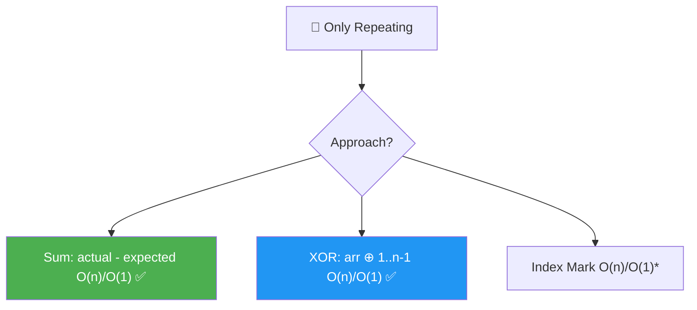
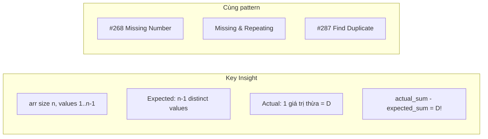
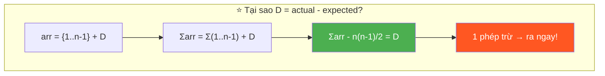
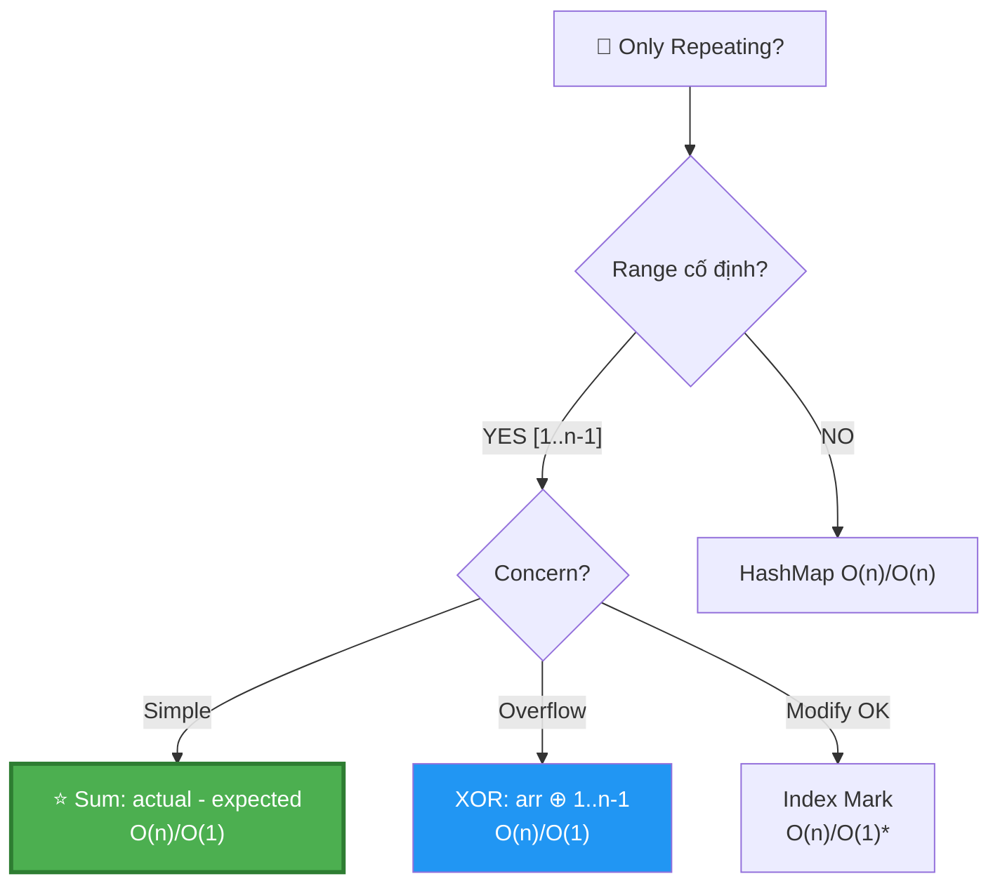
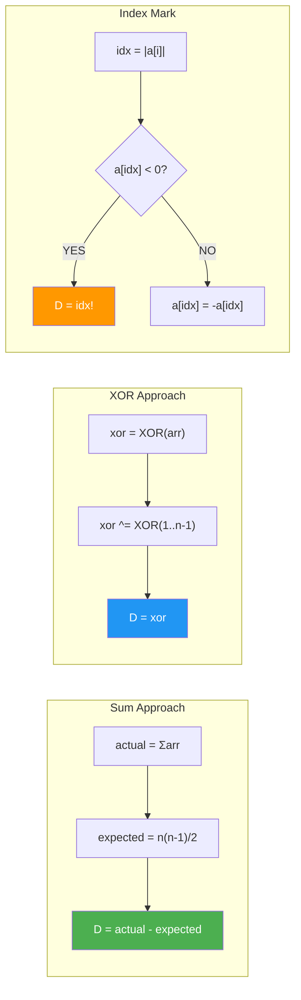
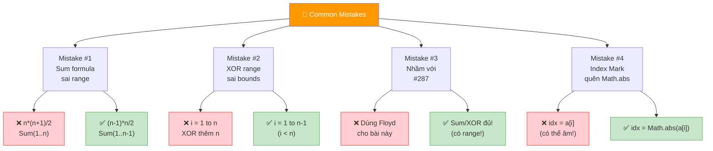
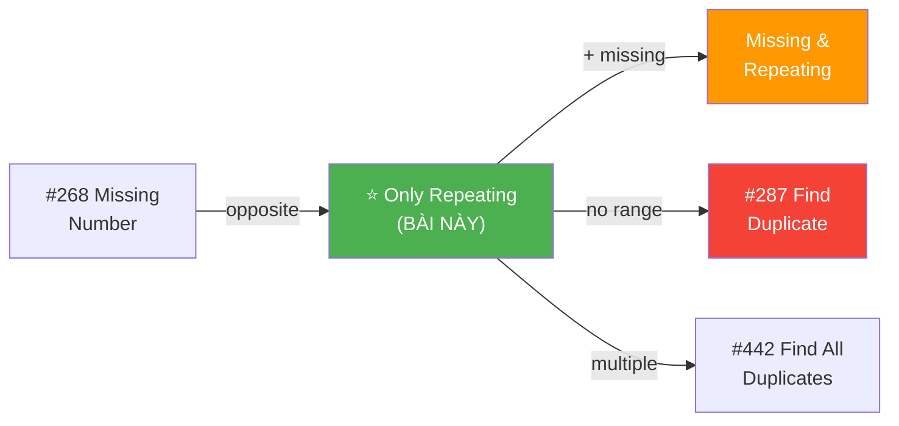
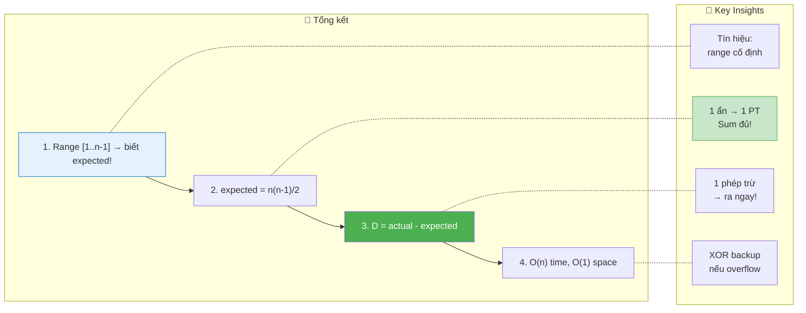

# 🔁 Only Repeating From 1 To n-1 — GfG (Easy)

> 📖 Code: [Only Repeating.js](./Only%20Repeating.js)





---

## R — Repeat & Clarify

🧠 _"Range [1..n-1], mảng size n → thừa 1 phần tử = duplicate! Sum thực - Sum expected = duplicate. O(n)/O(1)!"_

> 🎙️ _"Array size n, elements from 1 to n-1, exactly one repeats. Find it."_

### Clarification Questions

```
Q: Mảng size n, giá trị 1..n-1 → có n-1 giá trị distinct + 1 duplicate?
A: Đúng! Chính xác 1 giá trị xuất hiện 2 lần.

Q: Giống bài Missing Number (#268)?
A: GẦN giống! #268: [0..n] thiếu 1 → tìm MISSING.
   Bài này: [1..n-1] thừa 1 → tìm REPEATING.
   → Cùng technique: Sum hoặc XOR!

Q: Giống bài Missing & Repeating?
A: Đơn giản hơn! Chỉ cần tìm 1 số (repeating), không cần missing.
   → 1 ẩn → 1 phương trình đủ! (Sum HOẶC XOR)

Q: Có thể có nhiều hơn 1 duplicate?
A: KHÔNG! Chính xác 1 giá trị lặp, đúng 1 lần thừa.

Q: Giá trị duplicate ở đâu trong mảng?
A: BẤT CỨ ĐÂU! Mảng KHÔNG sorted!
```

### Tại sao bài này quan trọng?

```
  ⭐ Bài này dạy PATTERN CĂN BẢN NHẤT:
     "Range cố định → biết EXPECTED → so sánh!"

  ┌──────────────────────────────────────────────────────────────┐
  │  Bài này = VERSION ĐƠN GIẢN NHẤT của pattern:              │
  │    "Range cố định [a..b] + duplicate/missing"                │
  │                                                              │
  │  Progression:                                                │
  │    ⭐ Only Repeating (BÀI NÀY) → 1 ẩn, 1 PT (sum)!        │
  │    ⭐ Missing Number (#268)    → 1 ẩn, 1 PT (sum)!         │
  │    Missing + Repeating         → 2 ẩn, 2 PT (sum + sum²)!  │
  │    Find Duplicate (#287)       → Floyd Cycle (no range)!     │
  │                                                              │
  │  📌 TÍN HIỆU: "Elements 1 to n-1" → SUM hoặc XOR!         │
  │                                                              │
  │  📌 Quy tắc VÀNG:                                           │
  │    Số ẩn = Số PT cần thiết!                                 │
  │    1 ẩn → Sum ĐỦ! (hoặc XOR)                               │
  │    2 ẩn → Sum + Sum²! (hoặc XOR partition)                  │
  └──────────────────────────────────────────────────────────────┘
```

---

## 🧠 Bản chất bài toán — Hiểu để NHỚ, không chỉ để GIẢI

### INSIGHT CỐT LÕI: "Thừa = Actual - Expected!"

```
  ⭐ ĐÂY LÀ TRICK ĐƠN GIẢN NHẤT TRONG LẬP TRÌNH!

  arr size n, giá trị 1..n-1, 1 số lặp → duplicate = D

  Expected: {1, 2, 3, ..., n-1} → sum = n(n-1)/2
  Actual:   {1, 2, ..., D, ..., D, ..., n-1} → sum = n(n-1)/2 + D

  → actual_sum - expected_sum = D!  ← 1 PHÉP TRỪ!

  ┌──────────────────────────────────────────────────────────────┐
  │  Ẩn dụ: KIỂM KÊ HÀNG HÓA!                                 │
  │                                                              │
  │  Kho có n-1 loại hàng, mỗi loại 1 cái.                     │
  │  Ai đó BỎ THÊM 1 cái vào (duplicate).                       │
  │  → Đếm tổng → so sánh với expected → ra cái thừa!         │
  │                                                              │
  │  Không cần biết cái thừa Ở ĐÂU!                             │
  │  Chỉ cần biết TỔNG khác mong đợi bao nhiêu!                │
  └──────────────────────────────────────────────────────────────┘
```

### Tại sao SUM hoạt động?

```
  Ví dụ: arr = [1, 3, 2, 3, 4], n = 5

  Expected: {1, 2, 3, 4} → sum(1..4) = 4×5/2 = 10
  Actual:   {1, 3, 2, 3, 4} → sum = 1+3+2+3+4 = 13

  Diff: 13 - 10 = 3 = DUPLICATE! ✅

  ┌──────────────────────────────────────────────────────────────┐
  │  CHỨNG MINH:                                                 │
  │                                                              │
  │  arr = {1, 2, ..., n-1} + thêm 1 bản sao D                 │
  │  Σarr = Σ(1..n-1) + D = n(n-1)/2 + D                       │
  │  Σarr - n(n-1)/2 = D  ∎                                     │
  │                                                              │
  │  ⚠️ Chỉ đúng khi CHÍNH XÁC 1 duplicate!                   │
  │     Nếu nhiều duplicates → Sum cho TỔNG các thừa,           │
  │     KHÔNG cho từng giá trị!                                  │
  └──────────────────────────────────────────────────────────────┘
```

### Tại sao XOR hoạt động?

```
  XOR(arr) ⊕ XOR(1..n-1)

  Mỗi số 1..n-1 trừ D: xuất hiện 2 lần (1 arr + 1 range)
    → a ⊕ a = 0 → TRIỆT TIÊU!

  D xuất hiện 3 lần (2 arr + 1 range):
    → D ⊕ D ⊕ D = D (vì D ⊕ D = 0, 0 ⊕ D = D)

  → Kết quả = D! ✅

  📌 So sánh Sum vs XOR:
  ┌──────────────┬───────────────────┬───────────────────┐
  │              │ Sum               │ XOR               │
  ├──────────────┼───────────────────┼───────────────────┤
  │ Nguyên lý    │ Thừa = diff       │ Triệt tiêu cặp   │
  │ Overflow?    │ ⚠️ CÓ (sum lớn)  │ ✅ KHÔNG          │
  │ Dễ hiểu?    │ ✅ RẤT dễ        │ Cần hiểu XOR      │
  │ Code         │ 2 dòng!           │ 4 dòng            │
  └──────────────┴───────────────────┴───────────────────┘
```

### Hình dung trực quan

```
  arr = [1, 3, 2, 3, 4]    n = 5

  Đường số:   1   2   3   4
  Expected:   ✅  ✅  ✅  ✅    (mỗi số 1 lần)
  Actual:     ✅  ✅  ✅✅ ✅   (3 xuất hiện 2 lần!)
                        ↑
                    DUPLICATE!

  Sum view:
    Expected: 1 + 2 + 3 + 4 = 10
    Actual:   1 + 2 + 3 + 3 + 4 = 13
                          ↑ thừa!
    Diff: 13 - 10 = 3
```



---

## 🧭 Luồng Suy Nghĩ — Từ đọc đề đến solution

### Bước 1: Đọc đề → Gạch chân KEYWORDS

```
  Đề: "Array size n, elements from 1 to n-1, exactly one repeats"

  Gạch chân:
    ✏️ "1 to n-1"     → RANGE CỐ ĐỊNH! → biết expected!
    ✏️ "size n"       → n phần tử, n-1 giá trị distinct + 1 thừa
    ✏️ "exactly one"  → ĐÚNG 1 duplicate!
    ✏️ "repeats"      → tìm GIÁI TRỊ duplicate

  🧠 "Range cố định → nghĩ SUM hoặc XOR ngay!"
  🧠 "1 ẩn (duplicate) → 1 phương trình đủ!"
```

### Bước 2: Vẽ ví dụ → Phát hiện PATTERN

```
  arr = [1, 3, 2, 3, 4], n = 5

  🧠 "Nếu không lặp: {1, 2, 3, 4} → sum = 10"
  🧠 "Actual: {1, 3, 2, 3, 4} → sum = 13"
  🧠 "13 - 10 = 3 → duplicate = 3!"

  ─── Quá trình suy luận ───

  Bước 2a: Expected = Sum(1..n-1) = n(n-1)/2

    n = 5: expected = 5×4/2 = 10

  Bước 2b: Actual = Σarr[i] = 13

  Bước 2c: Diff = 13 - 10 = 3

  📌 EUREKA: Diff = DUPLICATE! Vì thừa đúng 1 bản!
```

### Bước 3: Alternatives

```
  🧠 "Có cần HashMap không?"
    → KHÔNG! Sum 1 dòng đủ! HashMap tốn O(n) space!

  🧠 "Overflow?"
    → n lớn → sum lớn → dùng XOR thay Sum!

  🧠 "Modify input OK?"
    → Index Mark: negate a[val] → gặp âm = duplicate!
```

### Bước 4: Cây quyết định



---

## E — Examples

```
VÍ DỤ 1: arr = [1, 3, 2, 3, 4]  n = 5

  Sum: (1+3+2+3+4) - (1+2+3+4) = 13 - 10 = 3 ✅
  XOR: (1^3^2^3^4) ^ (1^2^3^4)
     = (1^1)^(2^2)^(3^3^3)^(4^4) = 0^0^3^0 = 3 ✅
```

```
VÍ DỤ 2: arr = [1, 5, 1, 2, 3, 4]  n = 6

  Sum: (1+5+1+2+3+4) - (1+2+3+4+5) = 16 - 15 = 1 ✅
  XOR: (1^5^1^2^3^4) ^ (1^2^3^4^5)
     = (1^1^1)^(2^2)^(3^3)^(4^4)^(5^5) = 1 ✅

  📌 Duplicate ở ĐẦU mảng → Sum/XOR vẫn tìm được!
```

```
VÍ DỤ 3: arr = [2, 2]  n = 2

  Sum: (2+2) - (1) = 4 - 1 = 3?? ← ⚠️ SAI!

  Chờ đã... range [1..n-1] = [1..1] = chỉ có {1}!
  Mà arr = [2, 2] → giá trị 2 KHÔNG nằm trong [1..1]!
  → Đề bài KHÔNG HỢP LỆ!

  ✅ ĐÚNG: arr = [1, 1], n = 2
  Sum: (1+1) - (1) = 2 - 1 = 1 ✅
```

### Minh họa Sum — Trace dạng bảng

```
  arr = [1, 3, 2, 3, 4], n = 5

  ┌──────────┬─────────────┬──────────────┬────────────────┐
  │ Step     │ Operation   │ actualSum    │ expectedSum    │
  ├──────────┼─────────────┼──────────────┼────────────────┤
  │ Init     │             │ 0            │ 5×4/2 = 10     │
  │ i=0      │ +arr[0]=1   │ 1            │                │
  │ i=1      │ +arr[1]=3   │ 4            │                │
  │ i=2      │ +arr[2]=2   │ 6            │                │
  │ i=3      │ +arr[3]=3   │ 9            │                │
  │ i=4      │ +arr[4]=4   │ 13           │                │
  │ Result   │ 13 - 10     │              │ = 3 ✅         │
  └──────────┴─────────────┴──────────────┴────────────────┘
```

### Minh họa XOR — Trace dạng bảng

```
  arr = [1, 3, 2, 3, 4], n = 5

  ┌──────────┬─────────────┬──────────────┬────────────────┐
  │ Step     │ Operation   │ xor (binary) │ xor (decimal)  │
  ├──────────┼─────────────┼──────────────┼────────────────┤
  │ Init     │             │ 000          │ 0              │
  │ Pass 1   │ ^arr[0]=1   │ 001          │ 1              │
  │          │ ^arr[1]=3   │ 010          │ 2              │
  │          │ ^arr[2]=2   │ 000          │ 0              │
  │          │ ^arr[3]=3   │ 011          │ 3              │
  │          │ ^arr[4]=4   │ 111          │ 7              │
  │ Pass 2   │ ^1          │ 110          │ 6              │
  │          │ ^2          │ 100          │ 4              │
  │          │ ^3          │ 111          │ 7              │
  │          │ ^4          │ 011          │ 3 ✅           │
  └──────────┴─────────────┴──────────────┴────────────────┘
```

---

## A — Approach

### Approach 1: Sum — O(n)/O(1) ✅

```
💡 Ý tưởng: actual_sum - expected_sum = duplicate!

  ┌──────────────────────────────────────────────────────────────┐
  │  expected = n(n-1)/2 = Sum(1..n-1)                           │
  │  actual = Σarr[i]                                            │
  │  duplicate = actual - expected                                │
  │                                                              │
  │  Time: O(n)    Space: O(1)    ⚠️ Overflow risk!             │
  │                                                              │
  │  📌 Đơn giản nhất! 2 dòng code!                              │
  └──────────────────────────────────────────────────────────────┘
```

### Approach 2: XOR — O(n)/O(1) ✅

```
💡 Ý tưởng: XOR triệt tiêu cặp → chỉ còn duplicate!

  ┌──────────────────────────────────────────────────────────────┐
  │  xor = XOR(arr) ⊕ XOR(1..n-1)                               │
  │  = duplicate (tất cả khác triệt tiêu!)                      │
  │                                                              │
  │  Time: O(n)    Space: O(1)    ✅ No overflow!               │
  │                                                              │
  │  📌 An toàn hơn Sum, nhưng cần hiểu XOR!                    │
  └──────────────────────────────────────────────────────────────┘
```

### Approach 3: Index Mark — O(n)/O(1)*

```
💡 Ý tưởng: Dùng giá trị làm index, negate để đánh dấu!

  ┌──────────────────────────────────────────────────────────────┐
  │  Duyệt arr: val = |arr[i]|                                  │
  │    if arr[val] < 0 → val đã visited → DUPLICATE!            │
  │    else → arr[val] = -arr[val] (mark!)                       │
  │                                                              │
  │  Time: O(n)    Space: O(1)                                   │
  │  ⚠️ MODIFY input array!                                    │
  └──────────────────────────────────────────────────────────────┘
```

### So sánh

```
  ┌──────────────────┬──────────┬──────────┬──────────────────────┐
  │                  │ Time     │ Space    │ Ghi chú               │
  ├──────────────────┼──────────┼──────────┼──────────────────────┤
  │ Sum ⭐           │ O(n)     │ O(1)     │ Đơn giản nhất!       │
  │ XOR ✅           │ O(n)     │ O(1)     │ No overflow!          │
  │ Index Mark       │ O(n)     │ O(1)*    │ Modify input!         │
  │ HashMap          │ O(n)     │ O(n)     │ Overkill cho bài này │
  └──────────────────┴──────────┴──────────┴──────────────────────┘
```

---

## C — Code ✅

### Solution 1: Sum — O(n)/O(1) ✅

```javascript
function findRepeatingSum(arr) {
  const n = arr.length;
  const expectedSum = (n - 1) * n / 2;
  const actualSum = arr.reduce((a, b) => a + b, 0);
  return actualSum - expectedSum;
}
```

```
  📝 Line-by-line:

  Line 2: n = arr.length
    → Mảng size n, giá trị 1..n-1
    → n phần tử, n-1 giá trị distinct + 1 duplicate

  Line 3: expectedSum = (n-1)*n/2
    → Sum(1..n-1) = (n-1)×n/2
    → ⚠️ KHÔNG PHẢI n(n+1)/2! Đó là Sum(1..n)!
    → VD: n=5 → Sum(1..4) = 4×5/2 = 10

    ⚠️ Tại sao (n-1)*n/2 chứ không phải n*(n-1)/2?
       → GIỐNG NHAU! Nhân giao hoán! Nhưng (n-1)*n/2
         dễ thấy "(n-1) giá trị, giá trị lớn nhất = n-1"

  Line 4: actualSum = arr.reduce((a, b) => a + b, 0)
    → Tổng TẤT CẢ phần tử (bao gồm cả duplicate!)
    → reduce: accumulator + current, bắt đầu từ 0

  Line 5: actualSum - expectedSum
    → Phần dư = DUPLICATE!
    → Vì actual = expected + D → actual - expected = D!
```

### Solution 2: XOR — O(n)/O(1) ✅

```javascript
function findRepeatingXOR(arr) {
  const n = arr.length;
  let xor = 0;
  for (let i = 0; i < n; i++) xor ^= arr[i];
  for (let i = 1; i < n; i++) xor ^= i;
  return xor;
}
```

```
  📝 Line-by-line:

  Line 3: xor = 0
    → 0 ⊕ x = x → identity cho XOR
    → Bắt đầu từ 0 = "chưa có gì"

  Line 4: XOR tất cả arr elements
    → xor = arr[0] ⊕ arr[1] ⊕ ... ⊕ arr[n-1]

  Line 5: XOR với 1..n-1
    → ⚠️ for i = 1 to n-1 (i < n, KHÔNG PHẢI i <= n!)
    → Vì range là [1..n-1], KHÔNG có n!

    🧠 Tại sao 2 vòng lặp riêng?
       Có thể gộp: for (i=0; i<n; i++) xor ^= arr[i]; xor ^= (i+1)
       Nhưng cẩn thận: gộp xor ^= (i+1) chạy từ 1 đến n
       → XOR thêm n (SAI!)
       → 2 vòng riêng AN TOÀN hơn!

  Line 6: return xor = D
    → Tất cả cặp triệt tiêu → chỉ còn duplicate!
```

### Solution 3: Index Mark — O(n)/O(1)*

```javascript
function findRepeatingMark(arr) {
  const a = [...arr];
  for (let i = 0; i < a.length; i++) {
    const idx = Math.abs(a[i]);
    if (a[idx] < 0) return idx;
    a[idx] = -a[idx];
  }
  return -1;
}
```

```
  📝 Line-by-line:

  Line 2: const a = [...arr] → Copy! (tránh modify input gốc)
    → Nếu đề cho phép modify → bỏ copy, dùng arr trực tiếp!

  Line 4: idx = Math.abs(a[i])
    → Dùng GIÁ TRỊ phần tử làm INDEX!
    → Math.abs vì a[i] có thể ĐÃ BỊ NEGATE!
    → VD: a[i] = -3 → idx = 3

  Line 5: if (a[idx] < 0) → ĐÃ VISIT trước đó!
    → Ai visit? Một phần tử TRƯỚC có cùng giá trị idx!
    → → idx = DUPLICATE! Return ngay!

  Line 6: a[idx] = -a[idx] → MARK bằng negate!
    → Lần đầu gặp idx → negate a[idx] → "đánh dấu đã thấy"

  ⚠️ Tại sao idx = Math.abs(a[i]) thay vì a[i] - 1?
     Vì giá trị 1..n-1 → index range 1..n-1
     a[idx] dùng TRỰC TIẾP giá trị làm index (1-indexed!)
     KHÁC với bài Missing+Repeating (dùng val-1 = 0-indexed!)
```

---

## 🔬 Deep Dive — Giải thích CHI TIẾT

> 💡 So sánh 3 approaches cùng 1 ví dụ.

### Deep Dive: Sum vs XOR vs Index Mark

```
  arr = [1, 5, 1, 2, 3, 4], n = 6

  ═══ SUM ═══════════════════════════════════════════════

  expected = 5×6/2 = 15
  actual = 1+5+1+2+3+4 = 16
  D = 16 - 15 = 1 ✅

  → 2 dòng code, O(1) operations sau reduce.

  ═══ XOR ═══════════════════════════════════════════════

  Pass 1 (arr): 1^5^1^2^3^4
    = (1^1) ^ 5 ^ 2 ^ 3 ^ 4
    = 0 ^ 5^2^3^4 = 5^2^3^4

  Pass 2 (1..5): ^ 1^2^3^4^5
    = (5^5) ^ (2^2) ^ (3^3) ^ (4^4) ^ 1
    = 0 ^ 0 ^ 0 ^ 0 ^ 1 = 1 ✅

  → Tất cả triệt tiêu trừ D!

  ═══ INDEX MARK ═══════════════════════════════════════

  a = [1, 5, 1, 2, 3, 4]

  i=0: idx=|1|=1 → a[1]=5 > 0 → a[1]=-5     → [1,-5,1,2,3,4]
  i=1: idx=|-5|=5 → a[5]=4 > 0 → a[5]=-4    → [1,-5,1,2,3,-4]
  i=2: idx=|1|=1 → a[1]=-5 < 0 → FOUND! D=1 ✅

  → Dừng ngay khi gặp index ĐÃ MARK!
```



---

## 📐 Invariant — Chứng minh tính đúng đắn

```
  📐 CHỨNG MINH SUM:

  Cho arr chứa {1, 2, ..., n-1} + 1 bản sao D.

  Σarr = Σ(1..n-1) + D
       = n(n-1)/2 + D

  → Σarr - n(n-1)/2 = D  ∎

  Tính đúng: D ∈ [1..n-1] → D ≥ 1 → diff ≥ 1 → KHÔNG = 0!
  Tính duy nhất: Chỉ 1 duplicate → diff = ĐÚNG D! ∎
```

```
  📐 CHỨNG MINH XOR:

  XOR(arr) ⊕ XOR(1..n-1):
    Mỗi k ∈ {1..n-1}, k ≠ D: xuất hiện 2 lần → k ⊕ k = 0
    D: xuất hiện 3 lần (2 arr + 1 range) → D ⊕ D ⊕ D = D

  → Kết quả = 0 ⊕ 0 ⊕ ... ⊕ D = D  ∎

  📐 CHỨNG MINH INDEX MARK:

  Invariant: Sau khi xử lý arr[0..i]:
    ∀ v ∈ values đã gặp: a[v] < 0 (đã mark!)
    ∀ v ∈ values chưa gặp: a[v] > 0 (chưa mark!)

  Khi gặp D lần thứ 2:
    idx = D → a[D] đã < 0 (mark lần 1)
    → Detect duplicate! ∎

  Correctness: D là UNIQUE duplicate → lần 2 gặp D
    CHẮC CHẮN trigger a[D] < 0 (vì lần 1 đã mark!)
```

---

## ❌ Common Mistakes — Lỗi thường gặp



### Mistake 1: Sum formula sai range!

```javascript
// ❌ SAI: Sum(1..n) thay vì Sum(1..n-1)!
const expected = n * (n + 1) / 2;  // ← Sum(1..n)!
// n=5: expected = 15, nhưng range chỉ 1..4 → expected = 10!

// ✅ ĐÚNG: Sum(1..n-1)!
const expected = (n - 1) * n / 2;
// n=5: expected = 4×5/2 = 10 ✅

// 🧠 Nhớ: n phần tử, giá trị 1..n-1 → Sum(1..n-1)!
//    n-1 = giá trị MAX = số lượng distinct values!
```

### Mistake 2: XOR range sai bounds!

```javascript
// ❌ SAI: XOR thêm n!
for (let i = 1; i <= n; i++) xor ^= i;
// XOR thêm giá trị n → kết quả sai!

// ✅ ĐÚNG: XOR chỉ 1..n-1!
for (let i = 1; i < n; i++) xor ^= i;
// ⚠️ i < n, KHÔNG PHẢI i <= n!
```

### Mistake 3: Nhầm với #287 Find Duplicate!

```
  #287 Find the Duplicate Number:
    → Mảng n+1 phần tử, giá trị [1, n]
    → KHÔNG biết range chính xác!
    → Dùng Floyd Cycle Detection!

  Bài này (Only Repeating):
    → Mảng n phần tử, giá trị [1, n-1]
    → BIẾT range → Sum/XOR ĐỦ!
    → KHÔNG CẦN Floyd!

  📌 "Có range → Sum/XOR! Không range → Floyd/HashMap!"
```

### Mistake 4: Index Mark — quên Math.abs!

```javascript
// ❌ SAI: a[i] có thể đã bị negate!
const idx = a[i];  // a[i] = -3 → idx = -3 → OUT OF BOUNDS!

// ✅ ĐÚNG: luôn dùng Math.abs!
const idx = Math.abs(a[i]);
// a[i] = -3 → idx = 3 → ĐÚNG!
```

---

## O — Optimize

```
                Time     Space    Overflow?   Modify?
  ──────────────────────────────────────────────────────
  Sum ⭐        O(n)     O(1)     ⚠️ có      No
  XOR ✅        O(n)     O(1)     ✅ không    No
  Index Mark    O(n)     O(1)*    ✅ không    ⚠️ có!
  HashMap       O(n)     O(n)     ✅ không    No

  📌 Sum = TỐI ƯU cho bài này! Đơn giản nhất!
     XOR = backup nếu hỏi overflow!
```

### Complexity chính xác — Đếm operations

```
  Sum:
    1 nhân + 1 chia (expected) + n cộng (actual) + 1 trừ
    TỔNG: n + 3 operations

  XOR:
    n XOR (pass 1) + (n-1) XOR (pass 2)
    TỔNG: 2n - 1 operations

  Index Mark:
    n abs + n comparisons + ≤n negations
    TỔNG: ≤ 3n operations

  📊 So sánh (n = 10⁶):
    Sum:     10⁶ + 3 ops ≈ 1ms
    XOR:     2×10⁶ ops ≈ 2ms
    Mark:    3×10⁶ ops ≈ 3ms
    → Sum nhanh nhất! (ít operations nhất)

  ⚠️ Overflow threshold:
    n ≈ 10⁵: sum ≈ 5×10⁹ → OK trong 64-bit
    n ≈ 10⁸: sum ≈ 5×10¹⁵ → vượt Number.MAX_SAFE_INTEGER!
    → n lớn: dùng XOR hoặc BigInt!
```

---

## T — Test

```
Test Cases:
  [1, 3, 2, 3, 4]       → 3    ✅ duplicate ở giữa
  [1, 5, 1, 2, 3, 4]    → 1    ✅ duplicate ở đầu
  [1, 2, 3, 4, 4]        → 4    ✅ duplicate ở cuối
  [1, 1]                 → 1    ✅ minimum n=2
  [2, 1, 3, 2, 4]        → 2    ✅ duplicate cách xa
  [1, 2, 3, 4, 5, 3]     → 3    ✅ n=6
```

### Edge Cases giải thích

```
  ┌──────────────────────────────────────────────────────────────────┐
  │  Minimum: arr=[1,1], n=2                                        │
  │    Sum: (1+1) - 1×2/2 = 2 - 1 = 1 ✅                           │
  │    XOR: (1^1) ^ (1) = 0 ^ 1 = 1 ✅                              │
  │                                                                  │
  │  Duplicate ở cuối: arr=[1,2,3,4,4], n=5                         │
  │    Sum: 14 - 10 = 4 ✅                                           │
  │                                                                  │
  │  Duplicate ở đầu: arr=[1,1,2,3,4], n=5                          │
  │    Sum: 11 - 10 = 1 ✅                                           │
  │    Index Mark: i=0→mark a[1], i=1→a[1]<0→D=1 ✅                │
  │                                                                  │
  │  📌 Vị trí duplicate KHÔNG ảnh hưởng Sum/XOR!                   │
  │     Sum chỉ cần TỔNG, XOR chỉ cần BIT!                         │
  └──────────────────────────────────────────────────────────────────┘
```

---

## 🗣️ Interview Script

### 🎙️ Think Out Loud — Mô phỏng phỏng vấn thực

```
  ──────────────── PHASE 1: Clarify ────────────────

  👤 Interviewer: "Array of size n, elements 1 to n-1,
                   exactly one repeats. Find it."

  🧑 You: "Let me confirm:
   1. Array has n elements, values range from 1 to n-1.
   2. Exactly one value appears twice, all others once.
   3. I need to return the duplicate value.
   4. The array is unsorted."

  ──────────────── PHASE 2: Examples ────────────────

  🧑 You: "arr = [1, 3, 2, 3, 4], n=5.
   Values should be {1,2,3,4}, each once.
   But 3 appears twice. Expected sum = 10, actual = 13.
   13 - 10 = 3 — the duplicate."

  ──────────────── PHASE 3: Approach ────────────────

  🧑 You: "Since values are in a known range [1, n-1],
   I know the expected sum = n(n-1)/2.
   The actual sum exceeds this by exactly the duplicate.
   One subtraction gives me the answer.

   O(n) time to compute the sum, O(1) space."

  ──────────────── PHASE 4: Code + Edge Cases ────────────────

  🧑 You: [writes code]

  "Edge cases:
   - n=2, arr=[1,1]: (1+1) - 1 = 1 ✅
   - Duplicate at end: still works, sum is order-independent."

  ──────────────── PHASE 5: Follow-ups ────────────────

  👤 "What about overflow?"
  🧑 "For very large n, the sum could overflow. I'd switch
      to XOR: XOR all array elements with XOR of 1..n-1.
      All pairs cancel, leaving only the duplicate.
      Same O(n) time, O(1) space, but no overflow."

  👤 "What if there's no fixed range?"
  🧑 "Then I'd need a different approach — like Floyd's
      cycle detection for LeetCode #287, or a HashSet."

  👤 "How does this relate to Missing Number?"
  🧑 "Same pattern, opposite direction! Missing Number:
      expected - actual = missing. This problem:
      actual - expected = duplicate. Both use Sum or XOR."
```

---

## 📚 Bài tập liên quan — Practice Problems

### Progression Path



### 1. Missing Number (#268) — Easy

```
  Đề: Mảng n số distinct từ [0, n]. Tìm số THIẾU.

  function missingNumber(nums) {
    const n = nums.length;
    return n * (n + 1) / 2 - nums.reduce((a, b) => a + b, 0);
  }

  📌 So sánh:
    Only Repeating: actual - expected = THỪA (duplicate)
    Missing Number: expected - actual = THIẾU (missing)
    → CÙNG 1 TRICK, đổi dấu!
```

### 2. Find the Duplicate (#287) — Medium

```
  Đề: Mảng n+1 phần tử, giá trị [1,n]. Tìm duplicate.

  ⚠️ KHÁC bài này! #287 KHÔNG nói mỗi số chỉ lặp 1 lần!
     → Có thể lặp nhiều lần!
     → KHÔNG dùng Sum (sum thừa ≠ 1 duplicate)!
     → Dùng Floyd's Cycle Detection!

  function findDuplicate(nums) {
    let slow = nums[0], fast = nums[0];
    do {
      slow = nums[slow];
      fast = nums[nums[fast]];
    } while (slow !== fast);

    slow = nums[0];
    while (slow !== fast) {
      slow = nums[slow]; fast = nums[fast];
    }
    return slow;
  }

  📌 "Biết range + 1 duplicate" → Sum/XOR!
     "Biết range + multiple duplicates" → Floyd/Index!
```

### 3. Find All Duplicates (#442) — Medium

```
  Đề: Mảng n phần tử, giá trị [1,n]. Tìm TẤT CẢ duplicates.

  function findDuplicates(nums) {
    const result = [];
    for (const num of nums) {
      const idx = Math.abs(num) - 1;
      if (nums[idx] < 0) result.push(idx + 1);
      else nums[idx] = -nums[idx];
    }
    return result;
  }

  📌 Index Mark mở rộng! Cùng trick negate!
```

### Tổng kết — "Range + duplicate" pattern

```
  ┌──────────────────────────────────────────────────────────────┐
  │  BÀI                     │  Technique         │  Ẩn         │
  ├──────────────────────────────────────────────────────────────┤
  │  Only Repeating ⭐       │  Sum / XOR         │  1 dup      │
  │  #268 Missing Number     │  Sum / XOR         │  1 miss     │
  │  Missing+Repeating       │  Sum+Sum² / XOR    │  1+1        │
  │  #287 Find Duplicate     │  Floyd Cycle       │  1 dup*     │
  │  #442 Find All Dups      │  Index Mark        │  multi      │
  └──────────────────────────────────────────────────────────────┘
  * #287: có thể nhiều bản sao, Sum KHÔNG đủ!

  📌 RULE: "Range cố định + k ẩn" → k PT (Sum^1, Sum^2, ...)!
           "Không range" → Floyd / HashMap!
```

### Skeleton code — Reusable template

```javascript
// TEMPLATE: Tìm "thừa/thiếu" khi biết range [1..m]
function findExtraOrMissing(arr, m) {
  const expected = m * (m + 1) / 2;
  const actual = arr.reduce((a, b) => a + b, 0);
  const diff = actual - expected;

  // diff > 0 → có giá trị THỪA (duplicate) = diff
  // diff < 0 → có giá trị THIẾU (missing) = -diff
  // diff = 0 → không thừa không thiếu

  return diff;
}

// Only Repeating: m = n-1, diff > 0 → duplicate = diff
// Missing Number: m = n, diff < 0 → missing = -diff
```

---

## 📊 Tổng kết — Key Insights



```
  ┌──────────────────────────────────────────────────────────────────────────┐
  │  📌 3 ĐIỀU PHẢI NHỚ                                                    │
  │                                                                          │
  │  1. CÔNG THỨC: D = Σarr - n(n-1)/2                                     │
  │     → actual_sum - expected_sum = duplicate!                            │
  │     → 1 phép trừ! Đơn giản nhất trong tất cả array problems!          │
  │     → ⚠️ (n-1)*n/2, KHÔNG PHẢI n*(n+1)/2!                            │
  │                                                                          │
  │  2. XOR ALTERNATIVE: khi lo overflow!                                   │
  │     → XOR(arr) ⊕ XOR(1..n-1) = D                                      │
  │     → Cặp triệt tiêu, D xuất hiện 3 lần → D ⊕ D ⊕ D = D            │
  │     → ⚠️ XOR 1..n-1, KHÔNG phải 1..n!                                │
  │                                                                          │
  │  3. PATTERN CHUNG: "Range cố định = biết expected!"                    │
  │     → Thừa: actual - expected = duplicate                              │
  │     → Thiếu: expected - actual = missing                               │
  │     → 2 ẩn: cần 2 PT (sum + sum²)                                     │
  │     → CÙNG PATTERN cho #268, Missing+Repeating, #442!                 │
  └──────────────────────────────────────────────────────────────────────────┘
```

---

## 📝 Flashcard — Tự kiểm tra

| ❓ Câu hỏi | ✅ Đáp án |
|---|---|
| Công thức Sum? | D = **Σarr - n(n-1)/2** |
| Tại sao (n-1)*n/2? | Range là **1..n-1**, KHÔNG phải 1..n! |
| XOR hoạt động thế nào? | Cặp **triệt tiêu**, D lặp 3 lần → **D** |
| XOR range? | **1..n-1** (i < n, KHÔNG i <= n!) |
| Khi nào dùng XOR thay Sum? | Khi lo **overflow**! |
| So sánh với #287? | #287 **không range** → Floyd! Bài này **có range** → Sum! |
| So sánh với #268? | #268: **expected - actual** = missing. Ngược dấu! |
| Time / Space? | **O(n)** / **O(1)** |
| Pattern tín hiệu? | **"Range cố định"** → Sum/XOR! |
| Index Mark hạn chế? | **Modify** input array! |
