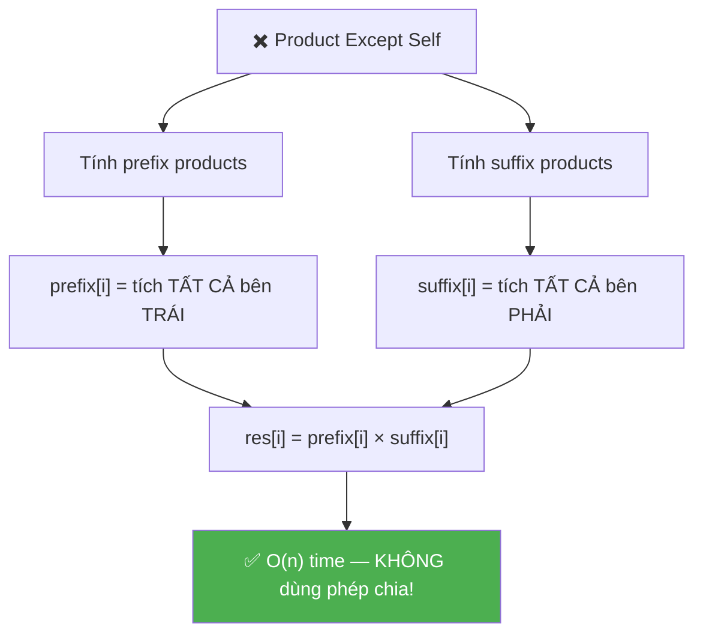
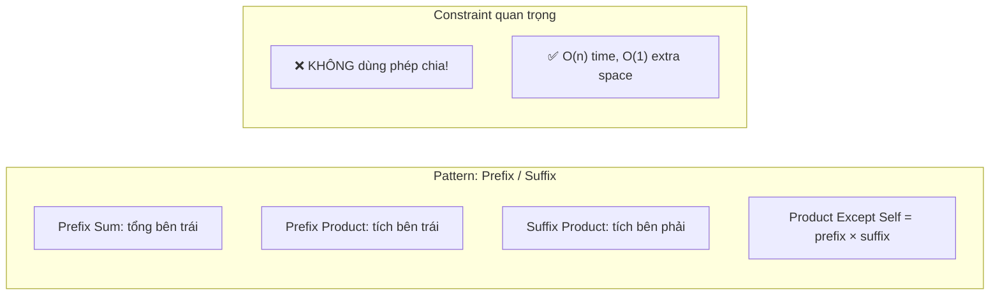
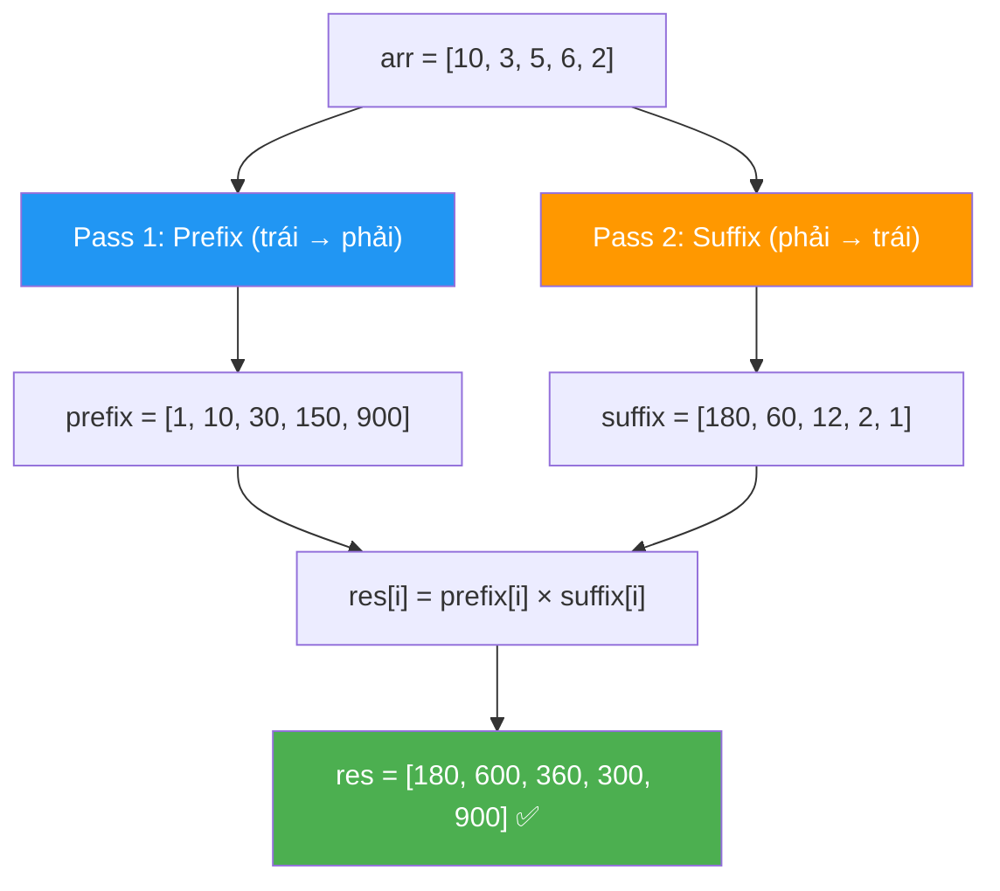

# ✖️ Product of Array Except Self — GfG / LeetCode #238 (Easy)

> 📖 Code: [Product of Array Except Self.js](./Product%20of%20Array%20Except%20Self.js)





---

## R — Repeat & Clarify

🧠 *"Với mỗi vị trí i, tính TÍCH tất cả phần tử NGOẠI TRỪ arr[i]. Không được dùng phép chia!"*

> 🎙️ *"Given an array, construct a result array where res[i] is the product of all elements except arr[i]. You cannot use division."*

### Clarification Questions

```
Q: Có được dùng phép CHIA không?
A: KHÔNG! Đây là constraint QUAN TRỌNG NHẤT!
   → Nếu được chia: totalProduct / arr[i] → quá dễ!
   → Không chia → cần PREFIX × SUFFIX trick!

Q: Mảng có chứa số 0 không?
A: CÓ! Đây là edge case quan trọng!
   [12, 0] → [0, 12]
   → Phép chia sẽ lỗi (chia cho 0!)
   → Thêm lý do KHÔNG dùng chia!

Q: Mảng có số âm không?
A: CÓ! Nhưng không ảnh hưởng thuật toán.
   → Tích âm × âm = dương, hoạt động bình thường.

Q: Output array tính vào space complexity không?
A: KHÔNG! Output không tính → O(1) extra space.

Q: Mảng có ≥ 2 phần tử?
A: CÓ! Guarantee n ≥ 2.
```

### Tại sao bài này quan trọng?

```
  Bài này xuất hiện RẤT NHIỀU trong phỏng vấn Big Tech!
  (Amazon, Google, Facebook đều hỏi!)

  BẠN PHẢI hiểu:
  1. Prefix/Suffix Product = BIẾN THỂ của Prefix Sum
  2. "Không dùng chia" → buộc sáng tạo!
  3. O(1) extra space = dùng OUTPUT array làm buffer!

  Pattern chuyển giao:
  ┌───────────────────────────────────────────────────┐
  │  Prefix Sum:     tổng tất cả bên TRÁI             │
  │  Prefix Product: tích tất cả bên TRÁI             │
  │  Suffix Product: tích tất cả bên PHẢI             │
  │  → res[i] = prefix[i] × suffix[i]                 │
  │                                                    │
  │  Ứng dụng: Trapping Rain Water, Range queries,     │
  │            Running product, Statistics              │
  └───────────────────────────────────────────────────┘
```

---

## 🧠 Bản chất bài toán — Hiểu để NHỚ, không chỉ để GIẢI

### Tưởng tượng: DÂY CHUYỀN LẮP RÁP!

```
  Mỗi vị trí i cần tích TẤT CẢ phần tử NGOẠI TRỪ chính nó.

  Tưởng tượng: Bạn đứng ở vị trí i trên dây chuyền.
  → Nhìn bên TRÁI: thấy prefix = tích tất cả bên trái
  → Nhìn bên PHẢI: thấy suffix = tích tất cả bên phải
  → Kết quả = TRÁI × PHẢI (bỏ qua chính mình!)

  arr = [10, 3, 5, 6, 2]
         ↑
  Đứng ở vị trí 2 (giá trị 5):
    Bên TRÁI: 10 × 3 = 30         ← prefix[2]
    Bên PHẢI: 6 × 2 = 12          ← suffix[2]
    Kết quả:  30 × 12 = 360       ← res[2] ✅
```

### Công thức CỐT LÕI

```
  ⭐ res[i] = prefix[i] × suffix[i]

  Trong đó:
    prefix[i] = tích tất cả phần tử TỪ 0 ĐẾN i-1
    suffix[i] = tích tất cả phần tử TỪ i+1 ĐẾN n-1

  VÍ DỤ: arr = [10, 3, 5, 6, 2]

  prefix[]: tích tất cả BÊN TRÁI
    prefix[0] = 1        (không có ai bên trái → 1)
    prefix[1] = 10
    prefix[2] = 10×3 = 30
    prefix[3] = 10×3×5 = 150
    prefix[4] = 10×3×5×6 = 900

  suffix[]: tích tất cả BÊN PHẢI
    suffix[4] = 1        (không có ai bên phải → 1)
    suffix[3] = 2
    suffix[2] = 6×2 = 12
    suffix[1] = 5×6×2 = 60
    suffix[0] = 3×5×6×2 = 180

  res[i] = prefix[i] × suffix[i]:
    res[0] = 1 × 180  = 180  ✅
    res[1] = 10 × 60  = 600  ✅
    res[2] = 30 × 12  = 360  ✅
    res[3] = 150 × 2  = 300  ✅
    res[4] = 900 × 1  = 900  ✅
```

### Minh họa BẢNG TRỰC QUAN

```
  arr = [10,  3,  5,  6,  2]
  idx:    0   1   2   3   4

  ┌────────────────────────────────────────────────────────────┐
  │  i=0:  (    )(  3 × 5 × 6 × 2  )  = 1 × 180 = 180       │
  │  i=1:  ( 10 )(  5 × 6 × 2      )  = 10 × 60 = 600       │
  │  i=2:  ( 10 × 3 )(  6 × 2      )  = 30 × 12 = 360       │
  │  i=3:  ( 10 × 3 × 5 )(  2      )  = 150 × 2 = 300       │
  │  i=4:  ( 10 × 3 × 5 × 6 )(     )  = 900 × 1 = 900       │
  │         └── prefix ──┘ └ suffix ┘                          │
  └────────────────────────────────────────────────────────────┘

  ⭐ Mỗi hàng: bỏ phần tử ở vị trí i
     prefix = tích trước nó
     suffix = tích sau nó
     res[i] = prefix × suffix
```



### Tại sao KHÔNG dùng phép chia?

```
  ⚠️ Nếu ĐƯỢC chia:
    totalProduct = 10 × 3 × 5 × 6 × 2 = 1800
    res[i] = totalProduct / arr[i]
    → res[0] = 1800 / 10 = 180 ✅

  ❌ Nhưng KHÔNG ĐƯỢC vì:
    1. Đề bài CẤM dùng phép chia!
    2. Nếu arr[i] = 0 → chia cho 0 → LỖI!
       arr = [12, 0] → totalProduct = 0
       res[1] = 0 / 12 = 0??? res[0] = 0 / 0 = ???

  → PREFIX × SUFFIX = giải quyết CẢ 2 vấn đề:
    Không cần chia + handle 0 tự nhiên!
```

---

## 🧭 Luồng Suy Nghĩ — Từ đọc đề đến solution

> 💡 Phần này dạy bạn **CÁCH TƯ DUY** để tự giải bài, không chỉ biết đáp án.

### Bước 1: Đọc đề → Gạch chân KEYWORDS

```
  Đề bài: "Product of all elements except arr[i]"

  Gạch chân:
    "product"     → NHÂN, không phải cộng!
    "all except"  → TẤT CẢ trừ phần tử hiện tại!
    "without division" → KHÔNG CHIA! Constraint quan trọng!

  🧠 Tự hỏi: "Không chia → làm sao bỏ arr[i]?"
    → Nhân TẤT CẢ bên trái × TẤT CẢ bên phải!
    → prefix[i] × suffix[i]!

  📌 Kỹ năng chuyển giao:
    "Tích/tổng mà bỏ 1 phần tử"
    → Nghĩ: prefix × suffix (hoặc prefix + suffix cho tổng)
    → Pattern cực phổ biến!
```

### Bước 2: Vẽ ví dụ NHỎ bằng tay → Tìm PATTERN

```
  arr = [2, 3, 4]

  Brute force:
    res[0] = 3 × 4 = 12
    res[1] = 2 × 4 = 8
    res[2] = 2 × 3 = 6

  🧠 Nhìn kỹ:
    res[0] = (nothing) × (3 × 4)      = 1 × 12
    res[1] = (2) × (4)                = 2 × 4
    res[2] = (2 × 3) × (nothing)      = 6 × 1

  Pattern:
    res[i] = (tích bên TRÁI) × (tích bên PHẢI)
           = prefix[i] × suffix[i]

  ⭐ 2 PASS:
    Pass 1 (trái → phải): tính prefix products
    Pass 2 (phải → trái): tính suffix products
```

### Bước 3: Brute Force → O(n²)

```
  🧠 "Cách naive nhất?"
    → Với mỗi i: nhân TẤT CẢ phần tử trừ arr[i]
    → 2 vòng for → O(n²)

  for i = 0 → n-1:
    product = 1
    for j = 0 → n-1:
      if (j !== i) product *= arr[j]
    res[i] = product

  ❌ O(n²) → quá chậm!
  ✅ Nhưng viết trước trong phỏng vấn → chứng tỏ hiểu đề!
```

### Bước 4: Optimize → Prefix × Suffix — O(n)

```
  🧠 "Làm sao bỏ vòng for thứ 2?"
    → Precompute! Tính sẵn tích bên trái & bên phải!

  Pass 1: prefix[i] = arr[0] × arr[1] × ... × arr[i-1]
    → Chạy trái → phải, nhân dồn!
    prefix[0] = 1
    prefix[i] = prefix[i-1] × arr[i-1]

  Pass 2: suffix[i] = arr[i+1] × arr[i+2] × ... × arr[n-1]
    → Chạy phải → trái, nhân dồn!
    suffix[n-1] = 1
    suffix[i] = suffix[i+1] × arr[i+1]

  ✅ Solution 2: O(n) time, O(n) space
```

### Bước 5: "O(1) extra space?"

```
  🧠 "Có dùng ÍT mảng hơn không?"
    → Dùng OUTPUT array res[] làm prefix!
    → Dùng 1 BIẾN suffix chạy từ phải!

  Pass 1: res[i] = prefix (lưu thẳng vào output!)
  Pass 2: duyệt phải → trái, nhân suffix vào res[i]!

  ✅ Solution 3: O(n) time, O(1) extra space ⭐
     (output array không tính vào space!)
```

---

## E — Examples

```
VÍ DỤ 1: arr = [10, 3, 5, 6, 2]

  prefix (trái → phải):
    [1, 10, 30, 150, 900]

  suffix (phải → trái):
    [180, 60, 12, 2, 1]

  res = [1×180, 10×60, 30×12, 150×2, 900×1]
      = [180,   600,   360,   300,   900] ✅
```

```
VÍ DỤ 2: arr = [12, 0]

  prefix: [1, 12]
  suffix: [0, 1]

  res = [1×0, 12×1] = [0, 12] ✅

  ⚠️ Số 0 handled TỰ NHIÊN!
  prefix[1]=12, suffix[0]=0 → res[0] = 1×0 = 0
  → Vì có 0 ở bên PHẢI → tích bên phải = 0!
```

```
VÍ DỤ 3: arr = [1, 2, 3, 4]

  prefix: [1, 1, 2, 6]
  suffix: [24, 12, 4, 1]

  res = [1×24, 1×12, 2×4, 6×1]
      = [24, 12, 8, 6] ✅
```

```
VÍ DỤ 4 (Edge): arr = [0, 0]

  prefix: [1, 0]
  suffix: [0, 1]

  res = [1×0, 0×1] = [0, 0] ✅
  → Hai số 0 → mọi tích đều = 0!
```

---

## A — Approach

### Approach 1: Brute Force — O(n²)

```
💡 Ý tưởng: Với mỗi i, nhân tất cả arr[j] mà j ≠ i

  for i = 0 → n-1:
    product = 1
    for j = 0 → n-1:
      if (j !== i) product *= arr[j]
    res[i] = product

  ✅ Đúng, dễ hiểu
  ❌ O(n²) — quá chậm!
```

### Approach 2: Prefix × Suffix (2 mảng) — O(n) time, O(n) space

```
💡 Ý tưởng: Tính sẵn tích bên trái (prefix) & bên phải (suffix)

  Pass 1 (trái → phải): prefix[i] = tích arr[0..i-1]
  Pass 2 (phải → trái): suffix[i] = tích arr[i+1..n-1]
  Pass 3: res[i] = prefix[i] × suffix[i]

  ✅ O(n) time — 3 passes
  ❌ O(n) space — 2 mảng phụ
```

### Approach 3: Dùng res[] làm buffer — O(n) time, O(1) space ⭐

```
💡 Ý tưởng: Lưu prefix VÀO res[], rồi nhân suffix trực tiếp!

  Pass 1 (trái → phải): res[i] = prefix (lưu vào output)
  Pass 2 (phải → trái): res[i] *= suffix (nhân thêm suffix)

  → Chỉ cần 1 biến suffix thay vì mảng → O(1) extra!

  ✅ O(n) time, O(1) extra space — TỐI ƯU!
  ⭐ Đây là cách phỏng vấn muốn thấy!
```

### So sánh 3 approaches

```
  ┌──────────────────────────┬──────────┬──────────┬──────────────────┐
  │                          │ Time     │ Space    │ Ghi chú           │
  ├──────────────────────────┼──────────┼──────────┼──────────────────┤
  │ Brute Force (2 loops)    │ O(n²)    │ O(1)     │ Quá chậm          │
  │ Prefix + Suffix (2 arr)  │ O(n)     │ O(n)     │ Dễ hiểu           │
  │ Output as buffer ⭐      │ O(n)     │ O(1)*    │ Phỏng vấn dùng!  │
  └──────────────────────────┴──────────┴──────────┴──────────────────┘
  * không tính output array
```

---

## C — Code

### Solution 1: Brute Force — O(n²)

```javascript
function productExceptSelfBrute(arr) {
  const n = arr.length;
  const res = [];

  for (let i = 0; i < n; i++) {
    let product = 1;
    for (let j = 0; j < n; j++) {
      if (j !== i) product *= arr[j];
    }
    res.push(product);
  }
  return res;
}
```

### Giải thích Brute Force

```
  for i: chọn phần tử CẦN BỎ
  for j: nhân TẤT CẢ phần tử KHÁC

  ⚠️ if (j !== i): bỏ qua arr[i]!
  → Đúng nhưng chậm: O(n²)
```

### Solution 2: Prefix × Suffix (2 mảng) — O(n)

```javascript
function productExceptSelf2Arrays(arr) {
  const n = arr.length;
  const prefix = new Array(n);
  const suffix = new Array(n);
  const res = new Array(n);

  // Pass 1: Prefix products (trái → phải)
  prefix[0] = 1; // Không có phần tử nào bên trái index 0
  for (let i = 1; i < n; i++) {
    prefix[i] = prefix[i - 1] * arr[i - 1];
  }

  // Pass 2: Suffix products (phải → trái)
  suffix[n - 1] = 1; // Không có phần tử nào bên phải index n-1
  for (let i = n - 2; i >= 0; i--) {
    suffix[i] = suffix[i + 1] * arr[i + 1];
  }

  // Pass 3: Kết hợp
  for (let i = 0; i < n; i++) {
    res[i] = prefix[i] * suffix[i];
  }

  return res;
}
```

### Giải thích Prefix × Suffix — CHI TIẾT

```
  PASS 1: Prefix products (trái → phải)

    prefix[i] = tích tất cả phần tử TỪ 0 ĐẾN i-1
    prefix[0] = 1      (không có ai bên trái → "tích rỗng" = 1)
    prefix[i] = prefix[i-1] × arr[i-1]

    ⚠️ Tại sao prefix[i-1] × arr[i-1]?
       prefix[i-1] = tích từ 0 đến i-2
       × arr[i-1]  = thêm phần tử ở i-1
       = tích từ 0 đến i-1 = ĐÚNG!

  PASS 2: Suffix products (phải → trái)

    suffix[i] = tích tất cả phần tử TỪ i+1 ĐẾN n-1
    suffix[n-1] = 1    (không có ai bên phải → "tích rỗng" = 1)
    suffix[i] = suffix[i+1] × arr[i+1]

    ⚠️ ĐỐI XỨNG với prefix, nhưng chạy NGƯỢC!

  PASS 3: res[i] = prefix[i] × suffix[i]
    → Trái × Phải = tích TẤT CẢ trừ chính nó!
```

### Trace CHI TIẾT: arr = [10, 3, 5, 6, 2]

```
  n = 5

  ═══ PASS 1: Prefix (trái → phải) ═══════════════════════════

  prefix[0] = 1                           (base: không ai bên trái)
  prefix[1] = prefix[0] × arr[0] = 1 × 10 = 10
  prefix[2] = prefix[1] × arr[1] = 10 × 3 = 30
  prefix[3] = prefix[2] × arr[2] = 30 × 5 = 150
  prefix[4] = prefix[3] × arr[3] = 150 × 6 = 900

  prefix = [1, 10, 30, 150, 900]

  Kiểm tra:
    prefix[2] = 30 = arr[0] × arr[1] = 10 × 3 ✅ (tích bên trái i=2)
    prefix[4] = 900 = 10 × 3 × 5 × 6 ✅ (tích bên trái i=4)

  ═══ PASS 2: Suffix (phải → trái) ═══════════════════════════

  suffix[4] = 1                           (base: không ai bên phải)
  suffix[3] = suffix[4] × arr[4] = 1 × 2 = 2
  suffix[2] = suffix[3] × arr[3] = 2 × 6 = 12
  suffix[1] = suffix[2] × arr[2] = 12 × 5 = 60
  suffix[0] = suffix[1] × arr[1] = 60 × 3 = 180

  suffix = [180, 60, 12, 2, 1]

  Kiểm tra:
    suffix[2] = 12 = arr[3] × arr[4] = 6 × 2 ✅ (tích bên phải i=2)
    suffix[0] = 180 = 3 × 5 × 6 × 2 ✅ (tích bên phải i=0)

  ═══ PASS 3: Kết hợp ════════════════════════════════════════

  res[0] = prefix[0] × suffix[0] = 1 × 180 = 180
  res[1] = prefix[1] × suffix[1] = 10 × 60 = 600
  res[2] = prefix[2] × suffix[2] = 30 × 12 = 360
  res[3] = prefix[3] × suffix[3] = 150 × 2 = 300
  res[4] = prefix[4] × suffix[4] = 900 × 1 = 900

  res = [180, 600, 360, 300, 900] ✅
```

```
  BẢNG TÓM TẮT:

  index:    0     1     2      3      4
  arr:      10    3     5      6      2
  prefix:   1     10    30     150    900
  suffix:   180   60    12     2      1
  res:      180   600   360    300    900
             ↑
           1×180  10×60 30×12  150×2  900×1
```

### Solution 3: Dùng res[] làm buffer — O(1) space ⭐

```javascript
function productExceptSelf(arr) {
  const n = arr.length;
  const res = new Array(n);

  // Pass 1: Lưu prefix VÀO res[]
  res[0] = 1;
  for (let i = 1; i < n; i++) {
    res[i] = res[i - 1] * arr[i - 1];
  }

  // Pass 2: Nhân suffix TRỰC TIẾP vào res[]
  let suffix = 1;
  for (let i = n - 1; i >= 0; i--) {
    res[i] *= suffix;       // res[i] = prefix × suffix!
    suffix *= arr[i];       // Cập nhật suffix cho vòng tiếp
  }

  return res;
}
```

### Giải thích O(1) space — CHI TIẾT

```
  PASS 1: Lưu prefix VÀO res[] (GIỐNG y hệt Solution 2!)

    res[0] = 1
    res[1] = res[0] × arr[0] = 1 × 10 = 10
    res[2] = res[1] × arr[1] = 10 × 3 = 30
    res[3] = res[2] × arr[2] = 30 × 5 = 150
    res[4] = res[3] × arr[3] = 150 × 6 = 900

    Sau pass 1: res = [1, 10, 30, 150, 900] = prefix!

  PASS 2: Nhân suffix từ phải → trái!

    suffix = 1 (biến DUY NHẤT thay cho mảng suffix[])

    i=4: res[4] *= suffix → 900 × 1 = 900
         suffix *= arr[4] → 1 × 2 = 2

    i=3: res[3] *= suffix → 150 × 2 = 300
         suffix *= arr[3] → 2 × 6 = 12

    i=2: res[2] *= suffix → 30 × 12 = 360
         suffix *= arr[2] → 12 × 5 = 60

    i=1: res[1] *= suffix → 10 × 60 = 600
         suffix *= arr[1] → 60 × 3 = 180

    i=0: res[0] *= suffix → 1 × 180 = 180
         suffix *= arr[0] → 180 × 10 = 1800 (không dùng nữa)

    res = [180, 600, 360, 300, 900] ✅

  ⭐ TRICK: Thay mảng suffix[] bằng 1 BIẾN suffix!
     Vì suffix chỉ phụ thuộc giá trị TRƯỚC (phải → trái)
     → Không cần lưu hết → 1 biến đủ!
```

### Trace O(1) space: arr = [12, 0]

```
  n = 2

  PASS 1: Prefix vào res[]
    res[0] = 1
    res[1] = res[0] × arr[0] = 1 × 12 = 12
    → res = [1, 12]

  PASS 2: Nhân suffix
    suffix = 1

    i=1: res[1] *= 1 → 12 × 1 = 12
         suffix *= arr[1] = 1 × 0 = 0

    i=0: res[0] *= 0 → 1 × 0 = 0
         suffix *= arr[0] = 0 × 12 = 0

    → res = [0, 12] ✅

  ⚠️ Số 0 handled tự nhiên!
     suffix tích lũy 0 → propagate cho tất cả bên trái!
```

> 🎙️ *"I build prefix products left-to-right directly into the result array, then sweep right-to-left multiplying by a running suffix product. Two passes, no division, O(1) extra space. This works even with zeros — the zero naturally propagates through the products."*

---

## O — Optimize

```
                       Time      Space*         Ghi chú
  ────────────────────────────────────────────────────
  Brute Force          O(n²)     O(1)           Quá chậm
  Prefix + Suffix arr  O(n)      O(n)           Dễ hiểu
  Output as buffer ⭐  O(n)      O(1)           Tối ưu!

  * không tính output array

  ⚠️ Tại sao O(n) là TỐI ƯU?
    Phải đọc MỌI phần tử → Ω(n) lower bound!
    Phải ghi n giá trị output → Ω(n)!
    → O(n) không thể tốt hơn!

  ⚠️ Tại sao KHÔNG dùng phép chia?
    1. Đề cấm!
    2. arr[i] = 0 → chia cho 0!
    3. Prefix × Suffix LUÔN ĐÚNG, kể cả có 0!
```

---

## T — Test

```
Test Cases:
  [10, 3, 5, 6, 2]    → [180, 600, 360, 300, 900]   ✅ bài gốc
  [12, 0]              → [0, 12]                      ✅ có 1 số 0
  [0, 0]               → [0, 0]                       ✅ toàn 0
  [1, 2, 3, 4]         → [24, 12, 8, 6]              ✅ không có 0
  [1, 1]               → [1, 1]                       ✅ toàn 1
  [-1, 1, 0, -3, 3]    → [0, 0, 9, 0, 0]             ✅ âm + 0
  [2, 3]               → [3, 2]                       ✅ n=2 nhỏ nhất
  [5]                   → edge: n=1 thì res=[1]?      ⚠️ tùy đề
```

---

## 🗣️ Interview Script

> 🎙️ *"The key insight is to decompose the product-except-self into two parts: the product of all elements to the left (prefix) and all elements to the right (suffix). I compute prefixes left-to-right into the result array, then sweep right-to-left with a running suffix multiplier. Two passes, O(n) time, O(1) extra space, no division needed."*

### Think Out Loud — Quá trình suy nghĩ

```
  🧠 BƯỚC 1: Đọc đề → phát hiện keywords
    "product except self" → tích TẤT CẢ trừ chính nó
    "without division" → KHÔNG CHIA!
    → Cần cách khác → prefix × suffix!

  🧠 BƯỚC 2: Brute force
    "Với mỗi i, nhân tất cả j ≠ i → O(n²)"
    → Nói: "I can brute force in O(n²) but let me optimize."

  🧠 BƯỚC 3: Optimize
    "res[i] = tích bên trái × tích bên phải"
    "→ prefix[i] × suffix[i]"
    "→ 2 passes: left-to-right, right-to-left"
    "→ O(n) time, O(n) space"

  🧠 BƯỚC 4: O(1) space
    "Lưu prefix VÀO res[], dùng 1 biến suffix"
    "→ O(n) time, O(1) extra space"

  🧠 BƯỚC 5: Edge cases
    "Zero? → handled tự nhiên, 0 propagate qua tích"
    "Negative? → hoạt động bình thường"
    "n=2? → trivial case"

  🎙️ Interview phrasing:
    "For each position, the answer is the product of everything
     to its left times everything to its right. I store prefix
     products in my output array, then multiply by a running
     suffix product in a second pass. No division needed, works
     with zeros. O(n) time, O(1) extra space."
```

### Biến thể & Mở rộng

```
  Biến thể phổ biến:

  1. SUM except self (dễ hơn!)
     → totalSum - arr[i]
     → Nhưng phép chia analog = totalProduct / arr[i]
        thì KHÔNG ĐƯỢC vì có 0!

  2. Có phép chia + KHÔNG CÓ số 0
     → totalProduct / arr[i] → 1 pass!
     → Nhưng phỏng vấn luôn cấm chia!

  3. Có phép chia + CÓ thể có 0
     → Đếm số lượng 0:
       0 zeros: totalProduct / arr[i]
       1 zero:  res[i]=0 nếu arr[i]≠0, res[i]=product_others nếu arr[i]=0
       2+ zeros: tất cả res[i] = 0

  4. Product of all subarrays containing index i
     → Khác bài! Cần counting technique

  5. Maximum product subarray
     → Track max VÀ min (vì âm × âm = dương!)
     → Kadane's variant!
```

### So sánh với bài liên quan

```
  ┌──────────────────────────────────────────────────────────┐
  │  Bài toán              Technique           Complexity    │
  │  ────────────────────────────────────────────────        │
  │  Product Except Self ⭐ Prefix × Suffix    O(n)         │
  │  Prefix Sum            Running sum          O(n)         │
  │  Trapping Rain Water   Prefix max + Suffix  O(n)         │
  │  Range Sum Query       Prefix Sum array     O(1) query   │
  │  Max Product Subarray  Kadane variant       O(n)         │
  └──────────────────────────────────────────────────────────┘

  KEY INSIGHT:
  → "Bỏ phần tử" = prefix × suffix
  → "Tính trước từ 2 chiều" = prefix + suffix pattern
  → Trapping Rain Water CÙNG pattern! (max thay vì product)
```

### Kiến thức liên quan

```
  PRODUCT EXCEPT SELF → Prefix/Suffix Decomposition!

  Lộ trình học (progression):
  ┌───────────────────────────────────────────────────────────┐
  │  Prefix Sum (cộng dồn — nền tảng!)                        │
  │         ↓                                                  │
  │  Prefix Product (nhân dồn — bài này!)                     │
  │         ↓                                                  │
  │  ⭐ Product Except Self (prefix × suffix)                  │
  │         ↓                                                  │
  │  Trapping Rain Water (prefix max × suffix max)             │
  │         ↓                                                  │
  │  Range queries (segment tree, BIT)                         │
  └───────────────────────────────────────────────────────────┘

  ⭐ QUY TẮC VÀNG:
    Khi cần thông tin "2 chiều" (trái + phải, trước + sau):
    → 2 passes: trái→phải rồi phải→trái!
    → O(n) thay vì O(n²)!
```

---

## 🧩 Sai lầm phổ biến

```
❌ SAI LẦM #1: Dùng phép CHIA!

   totalProduct = arr[0] × ... × arr[n-1]
   res[i] = totalProduct / arr[i]

   FAIL khi:
   → arr[i] = 0 → chia cho 0!
   → Đề bài CẤM!

   ✅ Dùng prefix × suffix thay vì chia!

─────────────────────────────────────────────────────

❌ SAI LẦM #2: prefix[0] = arr[0] thay vì 1!

   prefix[0] phải = 1 (tích rỗng!)
   Vì không có phần tử nào bên TRÁI index 0!

   Nếu prefix[0] = arr[0]:
   → res[0] = arr[0] × suffix[0] → TÍNH arr[0] 2 LẦN!

   ✅ prefix[0] = 1, suffix[n-1] = 1 (tích rỗng = 1)

─────────────────────────────────────────────────────

❌ SAI LẦM #3: Nhầm index trong công thức prefix!

   prefix[i] = prefix[i-1] × arr[i-1]   ← ĐÚNG ✅
   prefix[i] = prefix[i-1] × arr[i]     ← SAI ❌

   arr[i] là phần tử CHÍNH NÓ → không được tính vào prefix[i]!
   prefix[i] = tích TRƯỚC i → nhân đến arr[i-1] thôi!

─────────────────────────────────────────────────────

❌ SAI LẦM #4: Quên update suffix TRONG pass 2!

   // ĐÚNG:
   res[i] *= suffix;        // nhân suffix VÀO kết quả
   suffix *= arr[i];        // CẬP NHẬT suffix cho vòng tiếp

   // SAI (đảo thứ tự):
   suffix *= arr[i];        // cập nhật suffix TRƯỚC
   res[i] *= suffix;        // suffix ĐÃ BAO GỒM arr[i] → SAI!

   → Phải nhân suffix TRƯỚC khi update nó!
```

---

## 📝 Flashcard — Tự kiểm tra

| ❓ Câu hỏi | ✅ Đáp án |
|---|---|
| Công thức cốt lõi? | `res[i] = prefix[i] × suffix[i]` |
| prefix[i] là gì? | Tích tất cả phần tử TỪ 0 ĐẾN i-1 |
| suffix[i] là gì? | Tích tất cả phần tử TỪ i+1 ĐẾN n-1 |
| prefix[0] = ? | **1** (tích rỗng, KHÔNG PHẢI arr[0]!) |
| suffix[n-1] = ? | **1** (tích rỗng) |
| Tại sao không chia? | Đề cấm + arr[i]=0 gây lỗi |
| O(1) space trick? | Lưu prefix vào res[], dùng 1 biến suffix |
| Time complexity? | **O(n)** — 2 passes |
| Có handle số 0 không? | CÓ! 0 propagate tự nhiên qua tích |
| Bài nào cùng pattern? | Trapping Rain Water (prefix max + suffix max) |
