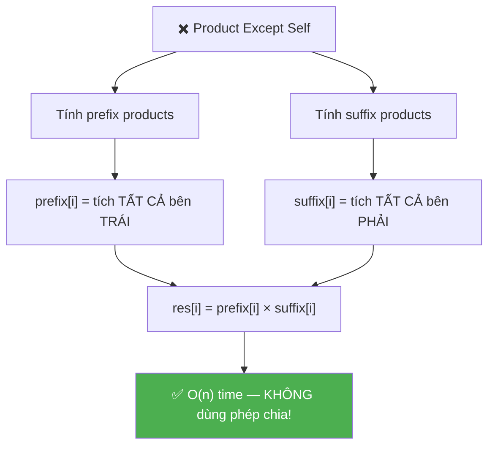
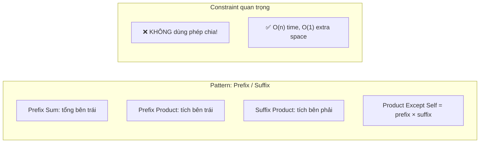
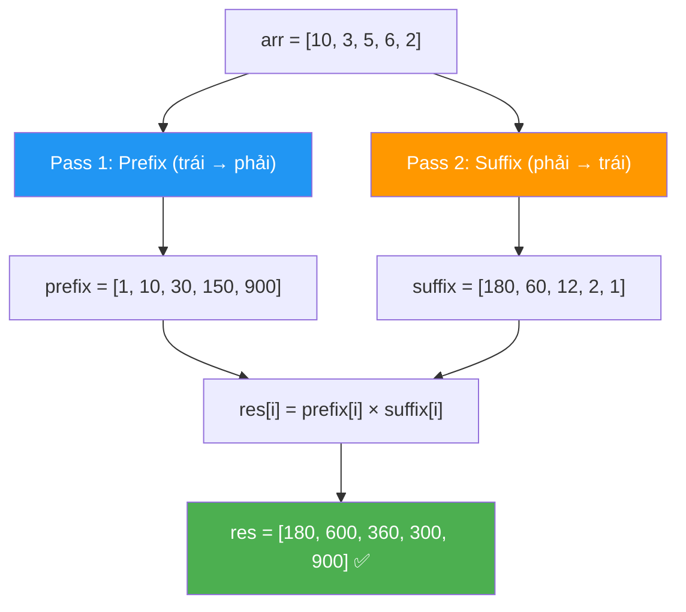

# ✖️ Product of Array Except Self — GfG / LeetCode #238 (Easy)

> 📖 Code: [Product of Array Except Self.js](./Product%20of%20Array%20Except%20Self.js)





---

## R — Repeat & Clarify

🧠 *"Với mỗi vị trí i, tính TÍCH tất cả phần tử NGOẠI TRỪ arr[i]. Không được dùng phép chia!"*

> 🎙️ *"Given an array, construct a result array where res[i] is the product of all elements except arr[i]. You cannot use division."*

### Clarification Questions

```
Q: Có được dùng phép CHIA không?
A: KHÔNG! Đây là constraint QUAN TRỌNG NHẤT!
   → Nếu được chia: totalProduct / arr[i] → quá dễ!
   → Không chia → cần PREFIX × SUFFIX trick!

Q: Mảng có chứa số 0 không?
A: CÓ! Đây là edge case quan trọng!
   [12, 0] → [0, 12]
   → Phép chia sẽ lỗi (chia cho 0!)
   → Thêm lý do KHÔNG dùng chia!

Q: Mảng có số âm không?
A: CÓ! Nhưng không ảnh hưởng thuật toán.
   → Tích âm × âm = dương, hoạt động bình thường.

Q: Output array tính vào space complexity không?
A: KHÔNG! Output không tính → O(1) extra space.

Q: Mảng có ≥ 2 phần tử?
A: CÓ! Guarantee n ≥ 2.
```

### Tại sao bài này quan trọng?

```
  Bài này xuất hiện RẤT NHIỀU trong phỏng vấn Big Tech!
  (Amazon, Google, Facebook đều hỏi!)

  BẠN PHẢI hiểu:
  1. Prefix/Suffix Product = BIẾN THỂ của Prefix Sum
  2. "Không dùng chia" → buộc sáng tạo!
  3. O(1) extra space = dùng OUTPUT array làm buffer!

  Pattern chuyển giao:
  ┌───────────────────────────────────────────────────┐
  │  Prefix Sum:     tổng tất cả bên TRÁI             │
  │  Prefix Product: tích tất cả bên TRÁI             │
  │  Suffix Product: tích tất cả bên PHẢI             │
  │  → res[i] = prefix[i] × suffix[i]                 │
  │                                                    │
  │  Ứng dụng: Trapping Rain Water, Range queries,     │
  │            Running product, Statistics              │
  └───────────────────────────────────────────────────┘
```

---

## 🧠 Bản chất bài toán — Hiểu để NHỚ, không chỉ để GIẢI

### Tưởng tượng: DÂY CHUYỀN LẮP RÁP!

```
  Mỗi vị trí i cần tích TẤT CẢ phần tử NGOẠI TRỪ chính nó.

  Tưởng tượng: Bạn đứng ở vị trí i trên dây chuyền.
  → Nhìn bên TRÁI: thấy prefix = tích tất cả bên trái
  → Nhìn bên PHẢI: thấy suffix = tích tất cả bên phải
  → Kết quả = TRÁI × PHẢI (bỏ qua chính mình!)

  arr = [10, 3, 5, 6, 2]
         ↑
  Đứng ở vị trí 2 (giá trị 5):
    Bên TRÁI: 10 × 3 = 30         ← prefix[2]
    Bên PHẢI: 6 × 2 = 12          ← suffix[2]
    Kết quả:  30 × 12 = 360       ← res[2] ✅
```

### Công thức CỐT LÕI

```
  ⭐ res[i] = prefix[i] × suffix[i]

  Trong đó:
    prefix[i] = tích tất cả phần tử TỪ 0 ĐẾN i-1
    suffix[i] = tích tất cả phần tử TỪ i+1 ĐẾN n-1

  VÍ DỤ: arr = [10, 3, 5, 6, 2]

  prefix[]: tích tất cả BÊN TRÁI
    prefix[0] = 1        (không có ai bên trái → 1)
    prefix[1] = 10
    prefix[2] = 10×3 = 30
    prefix[3] = 10×3×5 = 150
    prefix[4] = 10×3×5×6 = 900

  suffix[]: tích tất cả BÊN PHẢI
    suffix[4] = 1        (không có ai bên phải → 1)
    suffix[3] = 2
    suffix[2] = 6×2 = 12
    suffix[1] = 5×6×2 = 60
    suffix[0] = 3×5×6×2 = 180

  res[i] = prefix[i] × suffix[i]:
    res[0] = 1 × 180  = 180  ✅
    res[1] = 10 × 60  = 600  ✅
    res[2] = 30 × 12  = 360  ✅
    res[3] = 150 × 2  = 300  ✅
    res[4] = 900 × 1  = 900  ✅
```

### Minh họa BẢNG TRỰC QUAN

```
  arr = [10,  3,  5,  6,  2]
  idx:    0   1   2   3   4

  ┌────────────────────────────────────────────────────────────┐
  │  i=0:  (    )(  3 × 5 × 6 × 2  )  = 1 × 180 = 180       │
  │  i=1:  ( 10 )(  5 × 6 × 2      )  = 10 × 60 = 600       │
  │  i=2:  ( 10 × 3 )(  6 × 2      )  = 30 × 12 = 360       │
  │  i=3:  ( 10 × 3 × 5 )(  2      )  = 150 × 2 = 300       │
  │  i=4:  ( 10 × 3 × 5 × 6 )(     )  = 900 × 1 = 900       │
  │         └── prefix ──┘ └ suffix ┘                          │
  └────────────────────────────────────────────────────────────┘

  ⭐ Mỗi hàng: bỏ phần tử ở vị trí i
     prefix = tích trước nó
     suffix = tích sau nó
     res[i] = prefix × suffix
```



### Tại sao KHÔNG dùng phép chia?

```
  ⚠️ Nếu ĐƯỢC chia:
    totalProduct = 10 × 3 × 5 × 6 × 2 = 1800
    res[i] = totalProduct / arr[i]
    → res[0] = 1800 / 10 = 180 ✅

  ❌ Nhưng KHÔNG ĐƯỢC vì:
    1. Đề bài CẤM dùng phép chia!
    2. Nếu arr[i] = 0 → chia cho 0 → LỖI!
       arr = [12, 0] → totalProduct = 0
       res[1] = 0 / 12 = 0??? res[0] = 0 / 0 = ???

  → PREFIX × SUFFIX = giải quyết CẢ 2 vấn đề:
    Không cần chia + handle 0 tự nhiên!
```

---

## 🧭 Luồng Suy Nghĩ — Từ đọc đề đến solution

> 💡 Phần này dạy bạn **CÁCH TƯ DUY** để tự giải bài, không chỉ biết đáp án.

### Bước 1: Đọc đề → Gạch chân KEYWORDS

```
  Đề bài: "Product of all elements except arr[i]"

  Gạch chân:
    "product"     → NHÂN, không phải cộng!
    "all except"  → TẤT CẢ trừ phần tử hiện tại!
    "without division" → KHÔNG CHIA! Constraint quan trọng!

  🧠 Tự hỏi: "Không chia → làm sao bỏ arr[i]?"
    → Nhân TẤT CẢ bên trái × TẤT CẢ bên phải!
    → prefix[i] × suffix[i]!

  📌 Kỹ năng chuyển giao:
    "Tích/tổng mà bỏ 1 phần tử"
    → Nghĩ: prefix × suffix (hoặc prefix + suffix cho tổng)
    → Pattern cực phổ biến!
```

### Bước 2: Vẽ ví dụ NHỎ bằng tay → Tìm PATTERN

```
  arr = [2, 3, 4]

  Brute force:
    res[0] = 3 × 4 = 12
    res[1] = 2 × 4 = 8
    res[2] = 2 × 3 = 6

  🧠 Nhìn kỹ:
    res[0] = (nothing) × (3 × 4)      = 1 × 12
    res[1] = (2) × (4)                = 2 × 4
    res[2] = (2 × 3) × (nothing)      = 6 × 1

  Pattern:
    res[i] = (tích bên TRÁI) × (tích bên PHẢI)
           = prefix[i] × suffix[i]

  ⭐ 2 PASS:
    Pass 1 (trái → phải): tính prefix products
    Pass 2 (phải → trái): tính suffix products
```

### Bước 3: Brute Force → O(n²)

```
  🧠 "Cách naive nhất?"
    → Với mỗi i: nhân TẤT CẢ phần tử trừ arr[i]
    → 2 vòng for → O(n²)

  for i = 0 → n-1:
    product = 1
    for j = 0 → n-1:
      if (j !== i) product *= arr[j]
    res[i] = product

  ❌ O(n²) → quá chậm!
  ✅ Nhưng viết trước trong phỏng vấn → chứng tỏ hiểu đề!
```

### Bước 4: Optimize → Prefix × Suffix — O(n)

```
  🧠 "Làm sao bỏ vòng for thứ 2?"
    → Precompute! Tính sẵn tích bên trái & bên phải!

  Pass 1: prefix[i] = arr[0] × arr[1] × ... × arr[i-1]
    → Chạy trái → phải, nhân dồn!
    prefix[0] = 1
    prefix[i] = prefix[i-1] × arr[i-1]

  Pass 2: suffix[i] = arr[i+1] × arr[i+2] × ... × arr[n-1]
    → Chạy phải → trái, nhân dồn!
    suffix[n-1] = 1
    suffix[i] = suffix[i+1] × arr[i+1]

  ✅ Solution 2: O(n) time, O(n) space
```

### Bước 5: "O(1) extra space?"

```
  🧠 "Có dùng ÍT mảng hơn không?"
    → Dùng OUTPUT array res[] làm prefix!
    → Dùng 1 BIẾN suffix chạy từ phải!

  Pass 1: res[i] = prefix (lưu thẳng vào output!)
  Pass 2: duyệt phải → trái, nhân suffix vào res[i]!

  ✅ Solution 3: O(n) time, O(1) extra space ⭐
     (output array không tính vào space!)
```

---

## E — Examples

```
VÍ DỤ 1: arr = [10, 3, 5, 6, 2]

  prefix (trái → phải):
    [1, 10, 30, 150, 900]

  suffix (phải → trái):
    [180, 60, 12, 2, 1]

  res = [1×180, 10×60, 30×12, 150×2, 900×1]
      = [180,   600,   360,   300,   900] ✅
```

```
VÍ DỤ 2: arr = [12, 0]

  prefix: [1, 12]
  suffix: [0, 1]

  res = [1×0, 12×1] = [0, 12] ✅

  ⚠️ Số 0 handled TỰ NHIÊN!
  prefix[1]=12, suffix[0]=0 → res[0] = 1×0 = 0
  → Vì có 0 ở bên PHẢI → tích bên phải = 0!
```

```
VÍ DỤ 3: arr = [1, 2, 3, 4]

  prefix: [1, 1, 2, 6]
  suffix: [24, 12, 4, 1]

  res = [1×24, 1×12, 2×4, 6×1]
      = [24, 12, 8, 6] ✅
```

```
VÍ DỤ 4 (Edge): arr = [0, 0]

  prefix: [1, 0]
  suffix: [0, 1]

  res = [1×0, 0×1] = [0, 0] ✅
  → Hai số 0 → mọi tích đều = 0!
```

---

## A — Approach

### Approach 1: Brute Force — O(n²)

```
💡 Ý tưởng: Với mỗi i, nhân tất cả arr[j] mà j ≠ i

  for i = 0 → n-1:
    product = 1
    for j = 0 → n-1:
      if (j !== i) product *= arr[j]
    res[i] = product

  ✅ Đúng, dễ hiểu
  ❌ O(n²) — quá chậm!
```

### Approach 2: Prefix × Suffix (2 mảng) — O(n) time, O(n) space

```
💡 Ý tưởng: Tính sẵn tích bên trái (prefix) & bên phải (suffix)

  Pass 1 (trái → phải): prefix[i] = tích arr[0..i-1]
  Pass 2 (phải → trái): suffix[i] = tích arr[i+1..n-1]
  Pass 3: res[i] = prefix[i] × suffix[i]

  ✅ O(n) time — 3 passes
  ❌ O(n) space — 2 mảng phụ
```

### Approach 3: Dùng res[] làm buffer — O(n) time, O(1) space ⭐

```
💡 Ý tưởng: Lưu prefix VÀO res[], rồi nhân suffix trực tiếp!

  Pass 1 (trái → phải): res[i] = prefix (lưu vào output)
  Pass 2 (phải → trái): res[i] *= suffix (nhân thêm suffix)

  → Chỉ cần 1 biến suffix thay vì mảng → O(1) extra!

  ✅ O(n) time, O(1) extra space — TỐI ƯU!
  ⭐ Đây là cách phỏng vấn muốn thấy!
```

### So sánh 3 approaches

```
  ┌──────────────────────────┬──────────┬──────────┬──────────────────┐
  │                          │ Time     │ Space    │ Ghi chú           │
  ├──────────────────────────┼──────────┼──────────┼──────────────────┤
  │ Brute Force (2 loops)    │ O(n²)    │ O(1)     │ Quá chậm          │
  │ Prefix + Suffix (2 arr)  │ O(n)     │ O(n)     │ Dễ hiểu           │
  │ Output as buffer ⭐      │ O(n)     │ O(1)*    │ Phỏng vấn dùng!  │
  └──────────────────────────┴──────────┴──────────┴──────────────────┘
  * không tính output array
```

---

## C — Code

### Solution 1: Brute Force — O(n²)

```javascript
function productExceptSelfBrute(arr) {
  const n = arr.length;
  const res = [];

  for (let i = 0; i < n; i++) {
    let product = 1;
    for (let j = 0; j < n; j++) {
      if (j !== i) product *= arr[j];
    }
    res.push(product);
  }
  return res;
}
```

### Giải thích Brute Force

```
  for i: chọn phần tử CẦN BỎ
  for j: nhân TẤT CẢ phần tử KHÁC

  ⚠️ if (j !== i): bỏ qua arr[i]!
  → Đúng nhưng chậm: O(n²)
```

### Solution 2: Prefix × Suffix (2 mảng) — O(n)

```javascript
function productExceptSelf2Arrays(arr) {
  const n = arr.length;
  const prefix = new Array(n);
  const suffix = new Array(n);
  const res = new Array(n);

  // Pass 1: Prefix products (trái → phải)
  prefix[0] = 1; // Không có phần tử nào bên trái index 0
  for (let i = 1; i < n; i++) {
    prefix[i] = prefix[i - 1] * arr[i - 1];
  }

  // Pass 2: Suffix products (phải → trái)
  suffix[n - 1] = 1; // Không có phần tử nào bên phải index n-1
  for (let i = n - 2; i >= 0; i--) {
    suffix[i] = suffix[i + 1] * arr[i + 1];
  }

  // Pass 3: Kết hợp
  for (let i = 0; i < n; i++) {
    res[i] = prefix[i] * suffix[i];
  }

  return res;
}
```

### Giải thích Prefix × Suffix — CHI TIẾT

```
  PASS 1: Prefix products (trái → phải)

    prefix[i] = tích tất cả phần tử TỪ 0 ĐẾN i-1
    prefix[0] = 1      (không có ai bên trái → "tích rỗng" = 1)
    prefix[i] = prefix[i-1] × arr[i-1]

    ⚠️ Tại sao prefix[i-1] × arr[i-1]?
       prefix[i-1] = tích từ 0 đến i-2
       × arr[i-1]  = thêm phần tử ở i-1
       = tích từ 0 đến i-1 = ĐÚNG!

  PASS 2: Suffix products (phải → trái)

    suffix[i] = tích tất cả phần tử TỪ i+1 ĐẾN n-1
    suffix[n-1] = 1    (không có ai bên phải → "tích rỗng" = 1)
    suffix[i] = suffix[i+1] × arr[i+1]

    ⚠️ ĐỐI XỨNG với prefix, nhưng chạy NGƯỢC!

  PASS 3: res[i] = prefix[i] × suffix[i]
    → Trái × Phải = tích TẤT CẢ trừ chính nó!
```

### Trace CHI TIẾT: arr = [10, 3, 5, 6, 2]

```
  n = 5

  ═══ PASS 1: Prefix (trái → phải) ═══════════════════════════

  prefix[0] = 1                           (base: không ai bên trái)
  prefix[1] = prefix[0] × arr[0] = 1 × 10 = 10
  prefix[2] = prefix[1] × arr[1] = 10 × 3 = 30
  prefix[3] = prefix[2] × arr[2] = 30 × 5 = 150
  prefix[4] = prefix[3] × arr[3] = 150 × 6 = 900

  prefix = [1, 10, 30, 150, 900]

  Kiểm tra:
    prefix[2] = 30 = arr[0] × arr[1] = 10 × 3 ✅ (tích bên trái i=2)
    prefix[4] = 900 = 10 × 3 × 5 × 6 ✅ (tích bên trái i=4)

  ═══ PASS 2: Suffix (phải → trái) ═══════════════════════════

  suffix[4] = 1                           (base: không ai bên phải)
  suffix[3] = suffix[4] × arr[4] = 1 × 2 = 2
  suffix[2] = suffix[3] × arr[3] = 2 × 6 = 12
  suffix[1] = suffix[2] × arr[2] = 12 × 5 = 60
  suffix[0] = suffix[1] × arr[1] = 60 × 3 = 180

  suffix = [180, 60, 12, 2, 1]

  Kiểm tra:
    suffix[2] = 12 = arr[3] × arr[4] = 6 × 2 ✅ (tích bên phải i=2)
    suffix[0] = 180 = 3 × 5 × 6 × 2 ✅ (tích bên phải i=0)

  ═══ PASS 3: Kết hợp ════════════════════════════════════════

  res[0] = prefix[0] × suffix[0] = 1 × 180 = 180
  res[1] = prefix[1] × suffix[1] = 10 × 60 = 600
  res[2] = prefix[2] × suffix[2] = 30 × 12 = 360
  res[3] = prefix[3] × suffix[3] = 150 × 2 = 300
  res[4] = prefix[4] × suffix[4] = 900 × 1 = 900

  res = [180, 600, 360, 300, 900] ✅
```

```
  BẢNG TÓM TẮT:

  index:    0     1     2      3      4
  arr:      10    3     5      6      2
  prefix:   1     10    30     150    900
  suffix:   180   60    12     2      1
  res:      180   600   360    300    900
             ↑
           1×180  10×60 30×12  150×2  900×1
```

### Solution 3: Dùng res[] làm buffer — O(1) space ⭐

```javascript
function productExceptSelf(arr) {
  const n = arr.length;
  const res = new Array(n);

  // Pass 1: Lưu prefix VÀO res[]
  res[0] = 1;
  for (let i = 1; i < n; i++) {
    res[i] = res[i - 1] * arr[i - 1];
  }

  // Pass 2: Nhân suffix TRỰC TIẾP vào res[]
  let suffix = 1;
  for (let i = n - 1; i >= 0; i--) {
    res[i] *= suffix;       // res[i] = prefix × suffix!
    suffix *= arr[i];       // Cập nhật suffix cho vòng tiếp
  }

  return res;
}
```

### Giải thích O(1) space — CHI TIẾT

```
  PASS 1: Lưu prefix VÀO res[] (GIỐNG y hệt Solution 2!)

    res[0] = 1
    res[1] = res[0] × arr[0] = 1 × 10 = 10
    res[2] = res[1] × arr[1] = 10 × 3 = 30
    res[3] = res[2] × arr[2] = 30 × 5 = 150
    res[4] = res[3] × arr[3] = 150 × 6 = 900

    Sau pass 1: res = [1, 10, 30, 150, 900] = prefix!

  PASS 2: Nhân suffix từ phải → trái!

    suffix = 1 (biến DUY NHẤT thay cho mảng suffix[])

    i=4: res[4] *= suffix → 900 × 1 = 900
         suffix *= arr[4] → 1 × 2 = 2

    i=3: res[3] *= suffix → 150 × 2 = 300
         suffix *= arr[3] → 2 × 6 = 12

    i=2: res[2] *= suffix → 30 × 12 = 360
         suffix *= arr[2] → 12 × 5 = 60

    i=1: res[1] *= suffix → 10 × 60 = 600
         suffix *= arr[1] → 60 × 3 = 180

    i=0: res[0] *= suffix → 1 × 180 = 180
         suffix *= arr[0] → 180 × 10 = 1800 (không dùng nữa)

    res = [180, 600, 360, 300, 900] ✅

  ⭐ TRICK: Thay mảng suffix[] bằng 1 BIẾN suffix!
     Vì suffix chỉ phụ thuộc giá trị TRƯỚC (phải → trái)
     → Không cần lưu hết → 1 biến đủ!
```

### Trace O(1) space: arr = [12, 0]

```
  n = 2

  PASS 1: Prefix vào res[]
    res[0] = 1
    res[1] = res[0] × arr[0] = 1 × 12 = 12
    → res = [1, 12]

  PASS 2: Nhân suffix
    suffix = 1

    i=1: res[1] *= 1 → 12 × 1 = 12
         suffix *= arr[1] = 1 × 0 = 0

    i=0: res[0] *= 0 → 1 × 0 = 0
         suffix *= arr[0] = 0 × 12 = 0

    → res = [0, 12] ✅

  ⚠️ Số 0 handled tự nhiên!
     suffix tích lũy 0 → propagate cho tất cả bên trái!
```

> 🎙️ *"I build prefix products left-to-right directly into the result array, then sweep right-to-left multiplying by a running suffix product. Two passes, no division, O(1) extra space. This works even with zeros — the zero naturally propagates through the products."*

---

## O — Optimize

```
                       Time      Space*         Ghi chú
  ────────────────────────────────────────────────────
  Brute Force          O(n²)     O(1)           Quá chậm
  Prefix + Suffix arr  O(n)      O(n)           Dễ hiểu
  Output as buffer ⭐  O(n)      O(1)           Tối ưu!

  * không tính output array

  ⚠️ Tại sao O(n) là TỐI ƯU?
    Phải đọc MỌI phần tử → Ω(n) lower bound!
    Phải ghi n giá trị output → Ω(n)!
    → O(n) không thể tốt hơn!

  ⚠️ Tại sao KHÔNG dùng phép chia?
    1. Đề cấm!
    2. arr[i] = 0 → chia cho 0!
    3. Prefix × Suffix LUÔN ĐÚNG, kể cả có 0!
```

---

## T — Test

```
Test Cases:
  [10, 3, 5, 6, 2]    → [180, 600, 360, 300, 900]   ✅ bài gốc
  [12, 0]              → [0, 12]                      ✅ có 1 số 0
  [0, 0]               → [0, 0]                       ✅ toàn 0
  [1, 2, 3, 4]         → [24, 12, 8, 6]              ✅ không có 0
  [1, 1]               → [1, 1]                       ✅ toàn 1
  [-1, 1, 0, -3, 3]    → [0, 0, 9, 0, 0]             ✅ âm + 0
  [2, 3]               → [3, 2]                       ✅ n=2 nhỏ nhất
  [5]                   → edge: n=1 thì res=[1]?      ⚠️ tùy đề
```

---

## 🗣️ Interview Script

### 🎙️ Think Out Loud — Mô phỏng phỏng vấn thực

> ⚠️ Script này dạy cách **NÓI**, không phải cách CODE.
> Mỗi đoạn = cách bạn **PHÁT BIỂU** trong phỏng vấn thực!

```
  ╔══════════════════════════════════════════════════════════════╗
  ║  🕐 FULL INTERVIEW SIMULATION — 1h30 (90 phút)             ║
  ║                                                              ║
  ║  00:00-05:00  Introduction + Icebreaker         (5 min)     ║
  ║  05:00-45:00  Problem Solving                   (40 min)    ║
  ║  45:00-60:00  Deep Technical Probing            (15 min)    ║
  ║  60:00-75:00  Variations + Extensions           (15 min)    ║
  ║  75:00-85:00  System Design at Scale            (10 min)    ║
  ║  85:00-90:00  Behavioral + Q&A                  (5 min)     ║
  ╚══════════════════════════════════════════════════════════════╝
```

```
  ╔══════════════════════════════════════════════════════════════╗
  ║  PART 1: INTRODUCTION (00:00 — 05:00)                       ║
  ╚══════════════════════════════════════════════════════════════╝

  👤 "Tell me about yourself and a time you decomposed
      a problem into left and right components."

  🧑 "I'm a frontend engineer with [X] years of experience.
      A relevant example: I was building a pricing dashboard
      where each product's 'relative weight' was defined as
      the product of all OTHER products' prices.

      My first approach calculated the total product,
      then divided by each price. But some products had
      price zero — on clearance — causing division by zero.

      I realized I could split the problem: for each product,
      compute the product of everything to its LEFT
      and the product of everything to its RIGHT.
      Multiply those two. No division needed.

      I precomputed prefix products left-to-right,
      then swept right-to-left with a running suffix.
      Two passes, zero handled naturally, constant extra space.

      That's the exact algorithm for Product of Array
      Except Self."

  👤 "Perfect setup. Let's formalize that."
```

```
  ╔══════════════════════════════════════════════════════════════╗
  ║  PART 2: PROBLEM SOLVING (05:00 — 45:00)                   ║
  ╚══════════════════════════════════════════════════════════════╝

  ──────────────── 05:00 — Clarify (4 phút) ────────────────

  👤 "Given an array, construct a result array where result at i
      is the product of all elements except arr at i.
      You cannot use division."

  🧑 "Let me clarify the requirements.

      For each index i, I need the product of ALL other elements.
      Division is explicitly BANNED.
      This is the most important constraint because
      without it, I'd just compute total product divided by
      arr at i — trivial.

      Can the array contain zeros?
      Yes — and this is another reason division fails.
      If arr at i is zero, dividing by zero is undefined.

      Can it contain negative numbers?
      Yes, but negatives don't affect the algorithm.
      Negative times negative is positive — it works naturally.

      What about the output array — does it count
      toward space complexity?
      No — output space is free. So O of 1 'extra' space
      is achievable.

      Array size is at least 2."

  ──────────────── 09:00 — The Assembly Line Analogy (3 phút) ──

  🧑 "I like to think of this as an ASSEMBLY LINE.

      Imagine standing at position i on a conveyor belt.
      I can look LEFT and see everything before me.
      I can look RIGHT and see everything after me.

      The product-except-self at position i equals
      everything-to-my-left TIMES everything-to-my-right.
      I'm simply excluded by the split.

      For arr equal [10, 3, 5, 6, 2], standing at index 2:
      Left products: 10 times 3 equals 30.
      Right products: 6 times 2 equals 12.
      Result: 30 times 12 equals 360.

      This decomposition is the KEY insight.
      Product except self equals prefix times suffix."

  ──────────────── 12:00 — Approach 1: Brute Force (3 phút) ────────

  🧑 "Let me start with brute force.

      For each index i, multiply all elements where j is
      not equal to i. That's a nested loop: outer loop
      picks i, inner loop multiplies everything else.

      Time: O of n squared. Space: O of 1.

      This is correct but too slow. For n equals 100,000,
      that's 10 billion operations. I need O of n."

  ──────────────── 15:00 — Approach 2: Two Arrays (5 phút) ────────

  🧑 "From the assembly line insight:
      result at i equals prefix at i times suffix at i.

      I precompute two arrays:

      Prefix at i equals the product of all elements
      from index 0 to i minus 1.
      Prefix at 0 equals 1 — nothing to the left.
      Prefix at i equals prefix at i minus 1 times arr at i minus 1.

      Suffix at i equals the product of all elements
      from index i plus 1 to n minus 1.
      Suffix at n minus 1 equals 1 — nothing to the right.
      Suffix at i equals suffix at i plus 1 times arr at i plus 1.

      Then result at i equals prefix at i times suffix at i.

      Let me trace with arr equal [10, 3, 5, 6, 2]:

      Prefix: [1, 10, 30, 150, 900].
      Prefix at 2 equals 30 equals 10 times 3. Correct —
      that's the product of everything to the left of index 2.

      Suffix: [180, 60, 12, 2, 1].
      Suffix at 2 equals 12 equals 6 times 2. Correct —
      product of everything to the right.

      Result: [1 times 180, 10 times 60, 30 times 12,
      150 times 2, 900 times 1]
      equals [180, 600, 360, 300, 900].

      Time: O of n — three passes.
      Space: O of n — for the two auxiliary arrays.

      Can I reduce space?"

  ──────────────── 20:00 — Approach 3: O(1) Space (6 phút) ────────

  🧑 "Yes! The key trick: use the OUTPUT array as my buffer.

      Pass 1 — left to right:
      Store prefix products directly INTO the result array.
      result at 0 equals 1.
      result at i equals result at i minus 1 times arr at i minus 1.

      After pass 1, result contains all prefix products.

      Pass 2 — right to left:
      Maintain a SINGLE variable called suffix, starting at 1.
      For i from n minus 1 down to 0:
      result at i times-equals suffix.
      suffix times-equals arr at i.

      At each step, result at i — which was the prefix —
      gets multiplied by the running suffix.
      So result at i becomes prefix times suffix.

      Let me trace with arr equal [10, 3, 5, 6, 2]:

      After pass 1: result equals [1, 10, 30, 150, 900].

      Pass 2, suffix starts at 1:
      i equals 4: result at 4 times-equals 1 gives 900.
      suffix becomes 1 times 2 equals 2.

      i equals 3: result at 3 times-equals 2 gives 300.
      suffix becomes 2 times 6 equals 12.

      i equals 2: result at 2 times-equals 12 gives 360.
      suffix becomes 12 times 5 equals 60.

      i equals 1: result at 1 times-equals 60 gives 600.
      suffix becomes 60 times 3 equals 180.

      i equals 0: result at 0 times-equals 180 gives 180.

      Final: [180, 600, 360, 300, 900]. Correct!

      Time: O of n — two passes.
      Space: O of 1 extra — just the suffix variable.
      The output array doesn't count."

  ──────────────── 26:00 — Write Code (3 phút) ────────────────

  🧑 "The code is concise.

      [Vừa viết vừa nói:]

      function productExceptSelf of arr.
      const n equal arr dot length.
      const res equal new Array of n.

      Pass 1 — prefix into result:
      res at 0 equal 1.
      for let i equal 1, i less than n, i plus plus:
      res at i equal res at i minus 1 times arr at i minus 1.

      Pass 2 — multiply by suffix:
      let suffix equal 1.
      for let i equal n minus 1, i greater than or equal 0,
      i minus minus:
      res at i times-equal suffix.
      suffix times-equal arr at i.

      return res.

      Two clean loops. No division anywhere.
      The suffix variable replaces the entire suffix array."

  ──────────────── 29:00 — Zero Handling (3 phút) ────────────────

  🧑 "Let me trace the zero edge case.
      arr equal [12, 0].

      Pass 1: result at 0 equals 1.
      result at 1 equals 1 times 12 equals 12.
      Result after pass 1: [1, 12].

      Pass 2: suffix equals 1.
      i equals 1: result at 1 times-equals 1 gives 12.
      suffix becomes 1 times 0 equals 0.

      i equals 0: result at 0 times-equals 0 gives 0.

      Final: [0, 12]. Correct!

      The zero PROPAGATES naturally through the suffix.
      Everything to the LEFT of the zero gets multiplied
      by zero in the suffix pass. Everything to the RIGHT
      keeps its prefix value because the zero hasn't
      entered the suffix yet.

      This is EXACTLY why the no-division approach works
      better than division — zeros are handled for free."

  ──────────────── 32:00 — Edge Cases (3 phút) ────────────────

  🧑 "Other edge cases.

      Two zeros: arr equal [0, 0].
      Every product includes at least one zero.
      Result: [0, 0]. Correct.

      All ones: arr equal [1, 1, 1].
      Result: [1, 1, 1]. Trivial but correct.

      Negatives: arr equal [minus 1, 2, minus 3].
      Prefix: [1, minus 1, minus 2].
      Suffix: [minus 6, minus 3, 1].
      Result: [1 times minus 6, minus 1 times minus 3,
      minus 2 times 1] equals [minus 6, 3, minus 2].
      Verification: minus 1 times 2 times minus 3 equals 6.
      Product except index 0: 2 times minus 3 equals minus 6. Correct.

      Minimum size n equals 2: arr equal [a, b].
      Result: [b, a]. Just swap!"

  ──────────────── 35:00 — Complexity (3 phút) ────────────────

  🧑 "Time: O of n. Two passes through the array.
      Each pass does exactly n multiplications.
      Total: 2n multiplications.

      Space: O of 1 extra. The result array is output —
      doesn't count. The only extra variable is suffix.

      Is O of n optimal? Yes.
      Lower bound: I must READ every element — at least once.
      I must WRITE every output — n values.
      So Omega of n is the lower bound. We match it.

      Number of multiplications: exactly 2n minus 2.
      Pass 1: n minus 1 multiplications.
      Pass 2: n multiplications (n suffix updates plus
      n result updates, but each iteration does 2).
      This is nearly optimal."

  ──────────────── 38:00 — Why not division? (4 phút) ────────────

  👤 "If division were allowed, how would you handle zeros?"

  🧑 "Good question. With division allowed, I'd compute
      the total product of all non-zero elements,
      and count the number of zeros.

      Case 1: zero zeros.
      result at i equals totalProduct divided by arr at i.

      Case 2: exactly one zero at index j.
      result at i equals 0 for all i not equal j.
      result at j equals totalProduct of non-zeros.

      Case 3: two or more zeros.
      ALL results are 0. Any product includes at least one
      of the other zeros.

      This works but requires SPECIAL CASING for zeros.
      The prefix-suffix approach handles ALL cases uniformly.
      No special cases, no branches, no risk of division
      by zero. That's the elegance of the approach."

  ──────────────── 42:00 — The output-as-buffer trick (3 phút) ──

  👤 "Why can we reuse the output array?"

  🧑 "Because the output array's initial values don't matter!

      In pass 1, I write prefix products into result.
      Each result at i depends only on result at i minus 1
      and arr at i minus 1 — both already computed.
      I'm writing LEFT to RIGHT, reading LEFT to RIGHT.
      No conflict.

      In pass 2, I read result at i — which is the prefix —
      and multiply by suffix. I'm writing RIGHT to LEFT.
      I read result at i before overwriting it.
      Again, no conflict.

      This is a general pattern: when building an output
      incrementally, you can often reuse the output array
      as workspace if the write direction matches the
      dependency direction."
```

```
  ╔══════════════════════════════════════════════════════════════╗
  ║  PART 3: DEEP TECHNICAL PROBING (45:00 — 60:00)            ║
  ╚══════════════════════════════════════════════════════════════╝

  ──────────────── 45:00 — Connection to Trapping Rain Water (4 phút)

  👤 "How does this relate to Trapping Rain Water?"

  🧑 "They share the SAME pattern — prefix-suffix decomposition!

      Product Except Self:
      result at i equals prefix PRODUCT times suffix PRODUCT.
      Operator: multiplication.

      Trapping Rain Water:
      water at i equals min of prefix MAX and suffix MAX,
      minus height at i.
      Operator: max instead of multiply.

      Both problems need information from BOTH directions.
      Both solve it with two passes: left-to-right builds
      the prefix, right-to-left builds the suffix.

      The general pattern:
      'For each position, combine left-aggregate with
      right-aggregate using some operator.'

      This pattern also appears in:
      Range minimum queries — prefix and suffix min.
      Equilibrium index — prefix sum and suffix sum.
      Best time to buy and sell stock — prefix min,
      suffix max."

  ──────────────── 49:00 — Overflow analysis (4 phút) ────────────

  👤 "Can the product overflow?"

  🧑 "Yes! Products grow exponentially.

      If all elements are 2 and n equals 100,
      the prefix product at position 99 is 2 to the 99 —
      far beyond Number dot MAX_SAFE_INTEGER,
      which is about 9 times 10 to the 15.

      In JavaScript, numbers are 64-bit floats.
      They can represent values up to about 1.8 times
      10 to the 308, but PRECISION is lost after
      2 to the 53. Products involving large integers
      will silently lose precision.

      Mitigations:
      Use BigInt if exact precision is needed.
      Use logarithms: log of product equals sum of logs.
      Then exponentiate. But this has floating-point issues.

      In interviews, I'd mention overflow awareness
      but note that the problem typically constrains
      values to avoid it. LeetCode 238 guarantees
      the product fits in a 32-bit integer."

  ──────────────── 53:00 — Logarithmic trick (3 phút) ────────────

  👤 "Tell me about the logarithm approach."

  🧑 "If division is allowed and there are no zeros:
      log of product-except-i equals totalLogSum minus
      log of arr at i.
      Then result at i equals e to the power of that.

      This converts multiplication to addition
      and division to subtraction.
      It avoids overflow because we're adding logs
      instead of multiplying large numbers.

      But there are problems:
      Floating-point precision — exponentiation amplifies errors.
      Log of zero is undefined — zeros still break it.
      Negative numbers — log of negative is complex-valued.

      So it's a theoretical alternative but not practical
      for this problem. The prefix-suffix approach is
      universally better — exact, handles zeros,
      handles negatives."

  ──────────────── 56:00 — Can we do it in one pass? (4 phút) ────

  👤 "Is a one-pass solution possible?"

  🧑 "For the no-division constraint, I believe
      two passes is the minimum.

      Why? At position i, I need information from BOTH
      directions — elements to the left AND to the right.
      A single left-to-right pass can give me the prefix,
      but not the suffix. I MUST sweep right-to-left
      at some point.

      I can INTERLEAVE the two passes — simultaneously
      building prefix from the left and suffix from the right
      using two pointers converging — but that's still
      logically two passes, just overlapping.

      With division, one pass suffices: compute the total
      product, then divide. But the problem forbids division.

      So two passes is both necessary and sufficient."
```

```
  ╔══════════════════════════════════════════════════════════════╗
  ║  PART 4: VARIATIONS (60:00 — 75:00)                         ║
  ╚══════════════════════════════════════════════════════════════╝

  ──────────────── 60:00 — Sum Except Self (3 phút) ────────────────

  👤 "What about SUM except self?"

  🧑 "Much easier! Division analog works for sum.

      Sum except self at i equals totalSum minus arr at i.
      One pass to compute totalSum, then one pass to subtract.
      O of n time, O of 1 space. No prefix-suffix needed.

      Why is sum easier but product harder?
      Because subtraction — the 'un-do' operation for
      addition — doesn't have the zero problem.
      Subtracting zero is fine.
      But dividing by zero is undefined.

      Also, addition is commutative and has a CLEAN inverse.
      Multiplication's inverse — division — is partial
      (undefined at zero). That's the fundamental asymmetry."

  ──────────────── 63:00 — Maximum Product Subarray (4 phút) ────────

  👤 "How about Maximum Product Subarray?"

  🧑 "That's LeetCode 152 — a different problem but related.

      The key complexity: negatives! A negative times
      a negative is positive. So the MINIMUM product
      subarray can BECOME the maximum if multiplied
      by another negative.

      I track BOTH maxSoFar and minSoFar at each position.
      For each element x:
      newMax equals max of x, maxSoFar times x, minSoFar times x.
      newMin equals min of x, maxSoFar times x, minSoFar times x.

      This is a Kadane's variant where I maintain
      both extremes because of sign flips.

      The connection to our problem: both involve
      products across array positions. But Max Product
      Subarray is about CONTIGUOUS subarrays,
      while Product Except Self considers ALL other elements."

  ──────────────── 67:00 — Product in a Range (4 phút) ────────────

  👤 "What if I need the product of a RANGE?"

  🧑 "For range products — product from index L to R —
      I precompute prefix products.

      prefixProd at 0 equals 1.
      prefixProd at i equals prefixProd at i minus 1
      times arr at i minus 1.

      Then product from L to R equals prefixProd at R plus 1
      divided by prefixProd at L.

      But this requires DIVISION! And fails with zeros.

      For ranges with zeros, I'd need to count zeros
      in the range and handle specially.
      Or use a segment tree that stores products —
      O of log n per query, handles any range.

      Alternatively, prefix LOG-sums with exponentiation
      give approximate range products without division."

  ──────────────── 71:00 — 2D Product Except Self (4 phút) ────────

  👤 "Can this extend to 2D?"

  🧑 "For a 2D matrix, the analog would be:
      for each cell i, j, compute the product of ALL
      other cells.

      With division: totalProduct divided by matrix at i, j.
      Without division: much harder.

      I could flatten the matrix to 1D, apply prefix-suffix,
      and reshape. That works!
      Time: O of m times n. Space: O of 1 extra.

      For a more interesting 2D variant — product of
      all elements in the same ROW except self AND
      same COLUMN except self — I'd apply prefix-suffix
      independently to each row and each column.

      The prefix-suffix pattern is dimension-agnostic.
      It works on any 1D sequence."
```

```
  ╔══════════════════════════════════════════════════════════════╗
  ║  PART 5: SYSTEM DESIGN AT SCALE (75:00 — 85:00)            ║
  ╚══════════════════════════════════════════════════════════════╝

  ──────────────── 75:00 — Real-world applications (5 phút) ────────

  👤 "Where does this pattern appear in practice?"

  🧑 "Several important domains!

      First — SIGNAL PROCESSING.
      In audio or image processing, computing
      'normalized' values where each sample is weighted
      relative to ALL other samples. The prefix-suffix
      decomposition enables streaming computation.

      Second — FINANCIAL ANALYTICS.
      Portfolio diversification metrics often compute
      'what's the aggregate performance excluding
      this one asset?' This is exactly product-except-self
      applied to return multipliers.

      Third — MACHINE LEARNING — Leave-One-Out Cross Validation.
      Computing the model performance when each data point
      is left out. If the metric is multiplicative —
      like likelihood — it's product-except-self.

      Fourth — RECOMMENDER SYSTEMS.
      Computing 'relevance-except-this-item' scores
      for diversity metrics. Each item's score accounts
      for the product of all other items' relevance."

  ──────────────── 80:00 — Parallel computation (5 phút) ────────────

  👤 "Can this be parallelized?"

  🧑 "The two-pass approach is inherently sequential
      within each pass — each prefix depends on the previous.

      But I can use PARALLEL PREFIX SCAN!

      A parallel prefix product computes all prefix products
      in O of log n parallel steps using O of n processors.
      The suffix scan runs in parallel similarly.
      Then the final multiplication is fully parallel.

      Total: O of log n parallel time.

      For distributed systems with the array split
      across machines:
      Each machine computes its local prefix and suffix.
      Then a REDUCTION step computes the global prefix
      and suffix boundaries.
      Each machine multiplies its result by the global
      context. Communication: O of log P messages
      where P is the number of machines.

      The prefix-suffix decomposition is fundamentally
      parallelizable because each element's result
      depends only on its prefix and suffix —
      which can be computed via parallel scans."
```

```
  ╔══════════════════════════════════════════════════════════════╗
  ║  PART 6: BEHAVIORAL + Q&A (85:00 — 90:00)                  ║
  ╚══════════════════════════════════════════════════════════════╝

  ──────────────── 85:00 — Reflection (3 phút) ────────────────

  👤 "What would you take away from this problem?"

  🧑 "Three things.

      First, PREFIX-SUFFIX DECOMPOSITION as a paradigm.
      When I need information from both directions,
      I build two aggregates — one from the left,
      one from the right — and combine them.
      This turns O of n squared brute force into O of n.

      Second, CONSTRAINT-DRIVEN creativity.
      The no-division constraint is the entire point.
      Without it, the problem is trivial.
      The constraint forced the insight: split into
      left and right, multiply without including self.

      Third, OUTPUT ARRAY as workspace.
      The trick of storing intermediate results
      in the output array saves space.
      This is a general technique — whenever the output
      will be overwritten anyway, use it as a buffer."

  ──────────────── 88:00 — Questions (2 phút) ────────────────

  👤 "Any questions for me?"

  🧑 "A few!

      First — this problem is one of the most frequently
      asked in Big Tech interviews. Do you use it as
      a foundational question, or more as a warm-up
      before harder prefix-suffix problems like
      Trapping Rain Water?

      Second — the output-as-buffer trick is elegant
      but can make code harder to read. In production,
      do you prefer clarity with two explicit arrays,
      or the space-optimized version?

      Third — the prefix-suffix pattern maps directly
      to parallel prefix scans. Do your distributed
      systems use scan-based aggregations?"

  👤 "Excellent questions! Your progression from brute
      force to two arrays to the output-as-buffer trick
      was textbook. The zero handling explanation and
      the Trapping Rain Water connection showed real depth.
      We'll be in touch!"
```

```
  ╔══════════════════════════════════════════════════════════════╗
  ║  ⭐ 8 MẸO NÓI CHUYỆN TRONG PHỎNG VẤN (Product Except)    ║
  ╚══════════════════════════════════════════════════════════════╝

  📌 MẸO #1: Name the decomposition immediately
     ✅ "Product except self at i equals prefix product
         times suffix product. Left times right.
         No division needed."

  📌 MẸO #2: Use the assembly line analogy
     ✅ "Standing at position i: everything to my LEFT
         times everything to my RIGHT. I'm excluded
         by the split itself."

  📌 MẸO #3: Present 3 approaches as escalation
     ✅ "Brute force: O of n squared, nested loops.
         Two arrays: O of n time, O of n space.
         Output as buffer: O of n time, O of 1 extra space."

  📌 MẸO #4: Explain the output-as-buffer trick
     ✅ "Pass 1 stores prefix products INTO the result array.
         Pass 2 multiplies each by a running suffix variable.
         The result array does double duty as workspace."

  📌 MẸO #5: Address zeros proactively
     ✅ "Zeros propagate naturally through multiplication.
         No special cases needed. The suffix accumulates zero
         and eliminates everything to its left."

  📌 MẸO #6: Explain why 2 passes are necessary
     ✅ "I need information from both directions.
         A single pass can give me prefix OR suffix,
         not both. Two passes is the minimum without division."

  📌 MẸO #7: Connect to Trapping Rain Water
     ✅ "Same pattern! Trapping Rain Water uses prefix MAX
         and suffix MAX instead of prefix PRODUCT.
         Both decompose into left and right aggregates."

  📌 MẸO #8: Highlight the constraint-driven insight
     ✅ "The no-division constraint IS the problem.
         Without it, totalProduct divided by arr at i is trivial.
         The constraint forces the prefix-suffix decomposition."
```

---

## 🧩 Sai lầm phổ biến

```
❌ SAI LẦM #1: Dùng phép CHIA!

   totalProduct = arr[0] × ... × arr[n-1]
   res[i] = totalProduct / arr[i]

   FAIL khi:
   → arr[i] = 0 → chia cho 0!
   → Đề bài CẤM!

   ✅ Dùng prefix × suffix thay vì chia!

─────────────────────────────────────────────────────

❌ SAI LẦM #2: prefix[0] = arr[0] thay vì 1!

   prefix[0] phải = 1 (tích rỗng!)
   Vì không có phần tử nào bên TRÁI index 0!

   Nếu prefix[0] = arr[0]:
   → res[0] = arr[0] × suffix[0] → TÍNH arr[0] 2 LẦN!

   ✅ prefix[0] = 1, suffix[n-1] = 1 (tích rỗng = 1)

─────────────────────────────────────────────────────

❌ SAI LẦM #3: Nhầm index trong công thức prefix!

   prefix[i] = prefix[i-1] × arr[i-1]   ← ĐÚNG ✅
   prefix[i] = prefix[i-1] × arr[i]     ← SAI ❌

   arr[i] là phần tử CHÍNH NÓ → không được tính vào prefix[i]!
   prefix[i] = tích TRƯỚC i → nhân đến arr[i-1] thôi!

─────────────────────────────────────────────────────

❌ SAI LẦM #4: Quên update suffix TRONG pass 2!

   // ĐÚNG:
   res[i] *= suffix;        // nhân suffix VÀO kết quả
   suffix *= arr[i];        // CẬP NHẬT suffix cho vòng tiếp

   // SAI (đảo thứ tự):
   suffix *= arr[i];        // cập nhật suffix TRƯỚC
   res[i] *= suffix;        // suffix ĐÃ BAO GỒM arr[i] → SAI!

   → Phải nhân suffix TRƯỚC khi update nó!
```

---

## 📝 Flashcard — Tự kiểm tra

| ❓ Câu hỏi | ✅ Đáp án |
|---|---|
| Công thức cốt lõi? | `res[i] = prefix[i] × suffix[i]` |
| prefix[i] là gì? | Tích tất cả phần tử TỪ 0 ĐẾN i-1 |
| suffix[i] là gì? | Tích tất cả phần tử TỪ i+1 ĐẾN n-1 |
| prefix[0] = ? | **1** (tích rỗng, KHÔNG PHẢI arr[0]!) |
| suffix[n-1] = ? | **1** (tích rỗng) |
| Tại sao không chia? | Đề cấm + arr[i]=0 gây lỗi |
| O(1) space trick? | Lưu prefix vào res[], dùng 1 biến suffix |
| Time complexity? | **O(n)** — 2 passes |
| Có handle số 0 không? | CÓ! 0 propagate tự nhiên qua tích |
| Bài nào cùng pattern? | Trapping Rain Water (prefix max + suffix max) |
