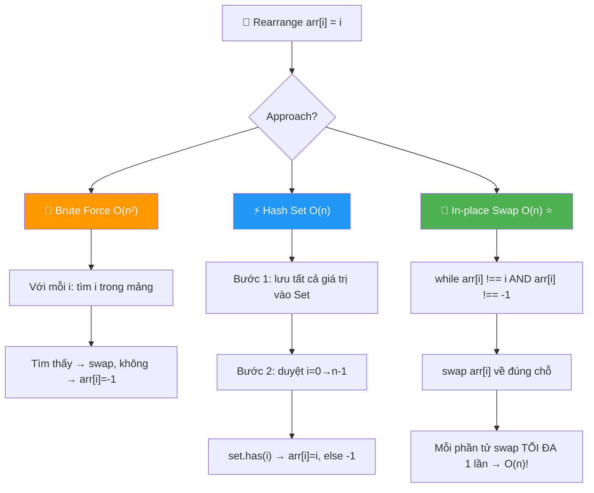
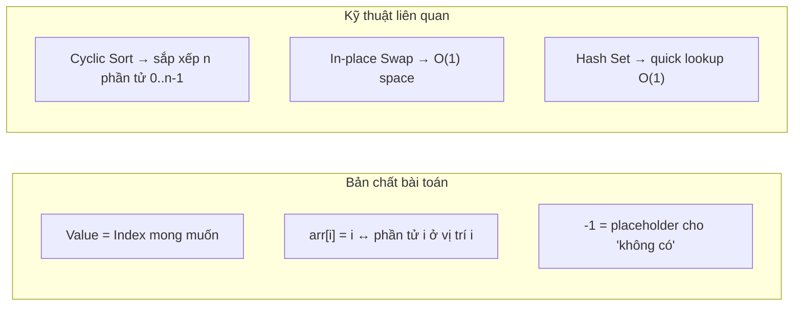
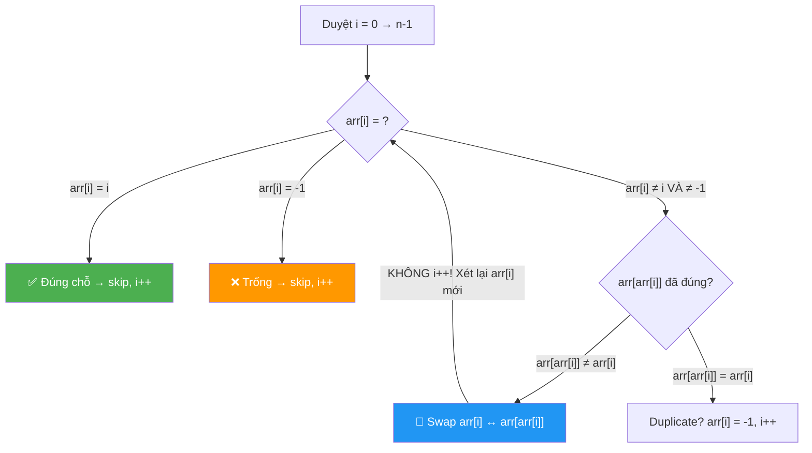
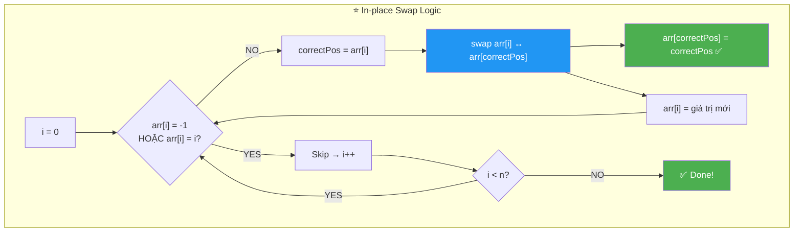
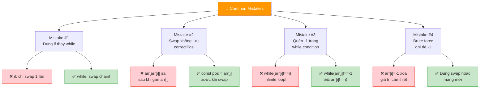
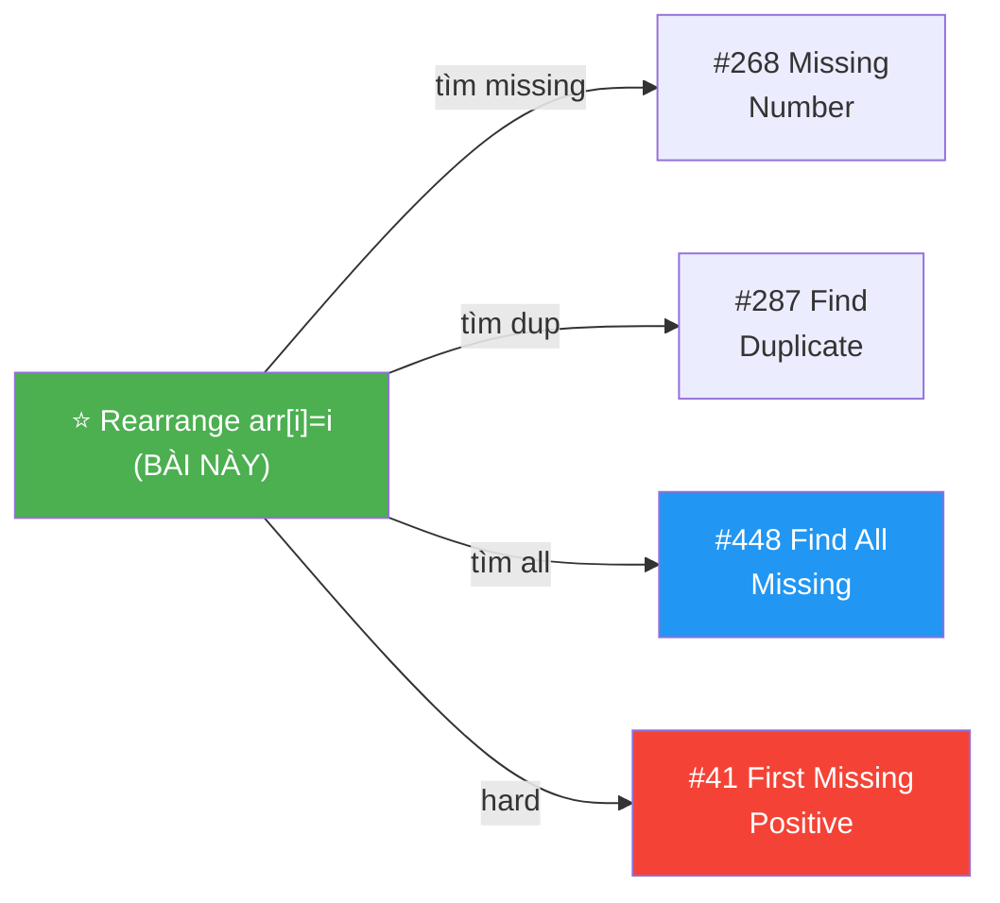
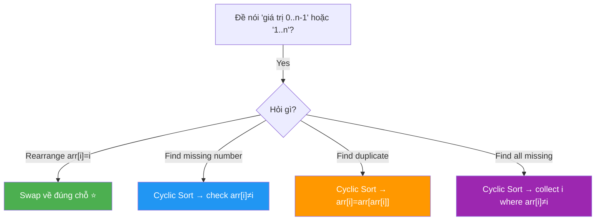
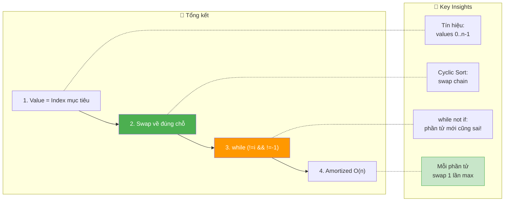

# 🔄 Rearrange Array — arr[i] = i — GfG (Easy)

> 📖 Code: [Rearrange Array.js](./Rearrange%20Array.js)





---

## R — Repeat & Clarify

🧠 *"Cho mảng n phần tử, giá trị 0 đến n-1. Nếu giá trị i tồn tại → đặt vào arr[i]. Nếu không → arr[i] = -1."*

> 🎙️ *"Given an array of n elements with values 0 to n-1 (some missing, replaced by -1), rearrange so that arr[i] = i. If i is not in the array, place -1 at index i."*

### Clarification Questions

```
Q: Giá trị nằm trong range nào?
A: Từ 0 đến n-1 (hoặc -1 nếu thiếu)

Q: Có giá trị trùng lặp không?
A: KHÔNG — mỗi giá trị xuất hiện TỐI ĐA 1 lần (hoặc -1)

Q: -1 có ý nghĩa gì?
A: -1 = placeholder, nghĩa là vị trí đó CHƯA CÓ phần tử phù hợp

Q: Có cần giữ thứ tự gốc không?
A: KHÔNG — bài yêu cầu rearrange hoàn toàn

Q: Output format?
A: arr[i] = i nếu i tồn tại, arr[i] = -1 nếu i không tồn tại
```

### Tại sao bài này quan trọng?

```
  Bài này là NỀN TẢNG cho pattern "Cyclic Sort"!

  BẠN SẼ GẶP LẠI pattern này ở:
  ┌───────────────────────────────────────────────────────┐
  │  Find Missing Number          → Cyclic Sort           │
  │  Find Duplicate Number        → Cyclic Sort           │
  │  Find All Missing Numbers     → Cyclic Sort           │
  │  Find First Missing Positive  → Cyclic Sort (biến thể)│
  │  Set Mismatch                 → Cyclic Sort           │
  └───────────────────────────────────────────────────────┘

  TƯ TƯỞNG CHUNG:
    Khi giá trị nằm trong range [0, n-1] hoặc [1, n]
    → Giá trị CHÍNH LÀ index mong muốn!
    → Swap phần tử VỀ ĐÚNG CHỖ!
```

---

## 🧠 Bản chất bài toán — Hiểu để NHỚ, không chỉ để GIẢI

### Value = Index — Mỗi số "biết" vị trí của mình!

```
  Tưởng tượng: Một LỚP HỌC có 10 ghế (0-9)
  Mỗi học sinh có SỐ THỨ TỰ = SỐ GHẾ phải ngồi

  Học sinh số 3 → phải ngồi ghế 3
  Học sinh số 7 → phải ngồi ghế 7
  -1 = ghế TRỐNG (không có học sinh số đó)

  Ban đầu (lộn xộn):
    Ghế:     0   1   2   3   4   5   6   7   8   9
    Ngồi:  [-1, -1,  6,  1,  9,  3,  2, -1,  4, -1]

  Sau khi sắp xếp (ai về ghế nấy):
    Ghế:     0   1   2   3   4   5   6   7   8   9
    Ngồi:  [-1,  1,  2,  3,  4, -1,  6, -1, -1,  9]

  Học sinh 0, 5, 7, 8 VẮNG MẶT → ghế trống = -1
```

### Tại sao bài này ĐƠN GIẢN hơn tưởng?

```
  KEY INSIGHT: Giá trị arr[i] CHO BIẾT vị trí đúng!

  Nếu arr[2] = 6:
    → Giá trị 6 đang ngồi NHẦM ở ghế 2
    → Phải chuyển 6 về ghế 6: arr[6] = 6!
    → Swap arr[2] và arr[6]!

  Nếu arr[i] = -1:
    → Ghế i hiện TRỐNG, skip!

  Nếu arr[i] = i:
    → Đã đúng chỗ rồi, skip!

  → BÀI TOÁN = swap mỗi phần tử VỀ ĐÚNG VỊ TRÍ!
```

---

## 🧭 Luồng Suy Nghĩ — Từ đọc đề đến solution

> 💡 Phần này dạy bạn **CÁCH TƯ DUY** để tự giải bài, không chỉ biết đáp án.

### Bước 1: Đọc đề → Gạch chân KEYWORDS

```
  Đề bài: "Rearrange the array such that arr[i] = i"

  Gạch chân:
    "rearrange"    → SẮP XẾP LẠI, in-place operation
    "arr[i] = i"   → giá trị i phải ở VỊ TRÍ i
    "0 to n-1"     → range = [0, n-1] → value = index!
    "-1"           → placeholder cho phần tử THIẾU

  🧠 Trigger: "Giá trị 0 đến n-1" + "arr[i] = i"
    → Pattern: Cyclic Sort / In-place rearrange!
    → Mỗi giá trị BIẾT vị trí đúng của nó!

  📌 Kỹ năng chuyển giao:
    Bất cứ khi nào giá trị thuộc range [0, n-1] hoặc [1, n]
    → Nghĩ ngay: Cyclic Sort! Swap về đúng vị trí!
```

### Bước 2: Vẽ ví dụ NHỎ bằng tay → Tìm PATTERN

```
  arr = [-1, -1, 6, 1, 9, 3, 2, -1, 4, -1]

  Duyệt từng phần tử:
    i=0: arr[0]=-1  → không có ai → -1 ✅
    i=1: arr[1]=-1  → chưa đúng, nhưng -1 thì skip
    i=2: arr[2]=6   → 6 không phải 2 → cần swap!
         6 phải ở vị trí 6 → swap arr[2] ↔ arr[6]
    ...

  💡 Pattern: Duyệt mảng, nếu arr[i] ≠ i VÀ arr[i] ≠ -1
    → swap arr[i] về đúng vị trí arr[arr[i]]!
```

### Bước 3: Từ pattern → Nghĩ các approaches

```
  Approach 1 (Naive): Với mỗi i, tìm i trong mảng → O(n²)
  Approach 2 (Hash):  Lưu tất cả giá trị vào Set → O(n) time, O(n) space
  Approach 3 (Swap):  Swap về đúng chỗ in-place → O(n) time, O(1) space ⭐

  📌 Kỹ năng chuyển giao:
    Luôn nghĩ BẢ approach stừ brute force → optimize:
    O(n²) → O(n) time + O(n) space → O(n) time + O(1) space
```

---

## E — Examples

```
VÍ DỤ 1: arr = [-1, -1, 6, 1, 9, 3, 2, -1, 4, -1]

  Values present: {1, 2, 3, 4, 6, 9}
  Values missing: {0, 5, 7, 8}

  Output: [-1, 1, 2, 3, 4, -1, 6, -1, -1, 9]

  Kiểm tra:
    arr[0] = -1  ← 0 không tồn tại ✅
    arr[1] = 1   ← 1 ở vị trí 1 ✅
    arr[2] = 2   ← 2 ở vị trí 2 ✅
    arr[3] = 3   ← 3 ở vị trí 3 ✅
    arr[4] = 4   ← 4 ở vị trí 4 ✅
    arr[5] = -1  ← 5 không tồn tại ✅
    arr[6] = 6   ← 6 ở vị trí 6 ✅
    arr[7] = -1  ← 7 không tồn tại ✅
    arr[8] = -1  ← 8 không tồn tại ✅
    arr[9] = 9   ← 9 ở vị trí 9 ✅
```

```
VÍ DỤ 2: arr = [0, 1, 2, 3, 4, 5]

  Mọi phần tử ĐÃ ĐÚNG CHỖ!
  Output: [0, 1, 2, 3, 4, 5] ← không thay đổi gì

VÍ DỤ 3 (Edge): arr = [-1, -1, -1]

  Không có giá trị nào trong range!
  Output: [-1, -1, -1]

VÍ DỤ 4 (Edge): arr = [2, 0, 1]

  Tất cả đều SAI VỊ TRÍ nhưng đều tồn tại!
  Output: [0, 1, 2]
```

---

## A — Approach

### Approach 1: Brute Force — O(n²) Time, O(1) Space

```
Ý tưởng: Với mỗi vị trí i (0 → n-1),
  TÌM xem giá trị i CÓ TRONG mảng không.
  Có → đặt arr[i] = i
  Không → đặt arr[i] = -1

  ⚠️ Mỗi lần tìm = duyệt TOÀN BỘ mảng → O(n) per search
  → Tổng: O(n²)
```

```javascript
function rearrangeBrute(arr) {
  const n = arr.length;

  for (let i = 0; i < n; i++) {
    // Tìm giá trị i trong mảng
    let found = false;
    for (let j = 0; j < n; j++) {
      if (arr[j] === i) {
        found = true;
        // Swap arr[i] và arr[j]
        [arr[i], arr[j]] = [arr[j], arr[i]];
        break;
      }
    }
    if (!found) {
      arr[i] = -1;
    }
  }
  return arr;
}
// Time: O(n²), Space: O(1)
```

### Trace Brute Force: arr = [-1, -1, 6, 1, 9, 3, 2, -1, 4, -1]

```
  i=0: tìm 0 trong mảng → KHÔNG CÓ → arr[0]=-1
  i=1: tìm 1 → ở j=3 → swap arr[1]↔arr[3] → [-1, 1, 6, -1, 9, 3, 2, -1, 4, -1]
  i=2: tìm 2 → ở j=6 → swap arr[2]↔arr[6] → [-1, 1, 2, -1, 9, 3, 6, -1, 4, -1]
  i=3: tìm 3 → ở j=5 → swap arr[3]↔arr[5] → [-1, 1, 2, 3, 9, -1, 6, -1, 4, -1]
  i=4: tìm 4 → ở j=8 → swap arr[4]↔arr[8] → [-1, 1, 2, 3, 4, -1, 6, -1, 9, -1]
  i=5: tìm 5 → KHÔNG CÓ → arr[5]=-1
  i=6: arr[6]=6 → tìm 6 → ở j=6 → ĐÃ ĐÚNG ✅
  i=7: tìm 7 → KHÔNG CÓ → arr[7]=-1
  i=8: tìm 8 → KHÔNG CÓ → arr[8] bị ghi -1? ⚠️
       → SAI! 9 đang ở vị trí 8, bị mất!

  ⚠️ VẤN ĐỀ: Ghi đè -1 khi phần tử đó có thể cần ở chỗ khác!
  → Cần cẩn thận: dùng mảng mới hoặc swap pattern!
```

```
⚠️ BẪY KINH ĐIỂN:
  Brute Force viết sai rất DỄ vì:
  1. Ghi đè arr[i] = -1 có thể XÓA giá trị còn cần swap
  2. Sau khi swap, giá trị cũ ở arr[i] có thể cần xét lại

  → Cách an toàn: dùng mảng mới (Approach 2)
  → Cách tốt hơn: swap chain in-place (Approach 3)
```

---

### Approach 2: Hash Set — O(n) Time, O(n) Space

```
Ý tưởng ĐƠNG GIẢN NHẤT:
  Bước 1: Bỏ tất cả giá trị (≠ -1) vào Set → O(n)
  Bước 2: Với mỗi i, check set.has(i) → O(1) mỗi lần
  Bước 3: Có → arr[i] = i, Không → arr[i] = -1

  → An toàn, dễ hiểu, KHÔNG có bug ghi đè!
  → Nhưng tốn O(n) extra space
```

```javascript
function rearrangeHash(arr) {
  const n = arr.length;

  // Bước 1: Thu thập tất cả giá trị vào Set
  const present = new Set();
  for (const val of arr) {
    if (val !== -1) {
      present.add(val);
    }
  }

  // Bước 2: Build kết quả
  for (let i = 0; i < n; i++) {
    arr[i] = present.has(i) ? i : -1;
  }

  return arr;
}
// Time: O(n), Space: O(n) — Set chứa tối đa n phần tử
```

### Trace Hash Set: arr = [-1, -1, 6, 1, 9, 3, 2, -1, 4, -1]

```
  Bước 1: Build Set
    Duyệt: -1(skip), -1(skip), 6, 1, 9, 3, 2, -1(skip), 4, -1(skip)
    Set = {6, 1, 9, 3, 2, 4}

  Bước 2: Build kết quả
    i=0: set.has(0)? NO  → arr[0] = -1
    i=1: set.has(1)? YES → arr[1] = 1
    i=2: set.has(2)? YES → arr[2] = 2
    i=3: set.has(3)? YES → arr[3] = 3
    i=4: set.has(4)? YES → arr[4] = 4
    i=5: set.has(5)? NO  → arr[5] = -1
    i=6: set.has(6)? YES → arr[6] = 6
    i=7: set.has(7)? NO  → arr[7] = -1
    i=8: set.has(8)? NO  → arr[8] = -1
    i=9: set.has(9)? YES → arr[9] = 9

  Output: [-1, 1, 2, 3, 4, -1, 6, -1, -1, 9] ✅

  Ưu: code CỰC KỲ đơn giản, KHÔNG SỢ bug!
  Nhược: tốn O(n) space cho Set
```

---

### Approach 3: In-place Swap — O(n) Time, O(1) Space ⭐



```
TƯ TƯỞNG CHUỖI SWAP:

  Mỗi phần tử "BIẾT" vị trí đúng của nó!
  arr[i] = v → v phải ở vị trí v → swap arr[i] ↔ arr[v]!

  Dùng WHILE thay for ở bước swap vì:
    Sau 1 swap, phần tử MỚI ở arr[i] CÓ THỂ cũng sai chỗ!
    → Phải tiếp tục swap cho đến khi:
       arr[i] = i (đúng chỗ) HOẶC arr[i] = -1 (trống)

  Mỗi phần tử swap về đúng vị trí TỐI ĐA 1 LẦN → O(n) tổng!
```

```javascript
function rearrangeInPlace(arr) {
  const n = arr.length;

  for (let i = 0; i < n; i++) {
    // Tiếp tục swap cho đến khi arr[i] đúng chỗ hoặc trống
    while (arr[i] !== -1 && arr[i] !== i) {
      const correctPos = arr[i];  // vị trí đúng của giá trị arr[i]

      // Swap arr[i] về đúng vị trí
      [arr[i], arr[correctPos]] = [arr[correctPos], arr[i]];
    }
  }

  return arr;
}
// Time: O(n) — mỗi phần tử swap tối đa 1 lần!
// Space: O(1) — in-place!
```

### Trace In-place Swap: arr = [-1, -1, 6, 1, 9, 3, 2, -1, 4, -1]

```
  i=0: arr[0]=-1 → skip (trống)
       arr = [-1, -1, 6, 1, 9, 3, 2, -1, 4, -1]

  i=1: arr[1]=-1 → skip (trống)
       arr = [-1, -1, 6, 1, 9, 3, 2, -1, 4, -1]

  i=2: arr[2]=6, 6≠2, 6≠-1 → SWAP!
       correctPos = 6
       swap arr[2] ↔ arr[6]: arr[2]=2, arr[6]=6
       arr = [-1, -1, 2, 1, 9, 3, 6, -1, 4, -1]

       arr[2]=2 = i=2 → ĐÚNG CHỖ! while dừng ✅

  i=3: arr[3]=1, 1≠3, 1≠-1 → SWAP!
       correctPos = 1
       swap arr[3] ↔ arr[1]: arr[3]=-1, arr[1]=1
       arr = [-1, 1, 2, -1, 9, 3, 6, -1, 4, -1]

       arr[3]=-1 → while dừng (trống) ✅

  i=4: arr[4]=9, 9≠4, 9≠-1 → SWAP!
       correctPos = 9
       swap arr[4] ↔ arr[9]: arr[4]=-1, arr[9]=9
       arr = [-1, 1, 2, -1, -1, 3, 6, -1, 4, 9]

       arr[4]=-1 → while dừng ✅

  i=5: arr[5]=3, 3≠5, 3≠-1 → SWAP!
       correctPos = 3
       swap arr[5] ↔ arr[3]: arr[5]=-1, arr[3]=3
       arr = [-1, 1, 2, 3, -1, -1, 6, -1, 4, 9]

       arr[5]=-1 → while dừng ✅

  i=6: arr[6]=6 = i=6 → ĐÚNG CHỖ! skip ✅

  i=7: arr[7]=-1 → skip ✅

  i=8: arr[8]=4, 4≠8, 4≠-1 → SWAP!
       correctPos = 4
       swap arr[8] ↔ arr[4]: arr[8]=-1, arr[4]=4
       arr = [-1, 1, 2, 3, 4, -1, 6, -1, -1, 9]

       arr[8]=-1 → while dừng ✅

  i=9: arr[9]=9 = i=9 → ĐÚNG CHỖ! skip ✅

  KẾT QUẢ: [-1, 1, 2, 3, 4, -1, 6, -1, -1, 9] ✅
```

### Tại sao O(n) mà có while loop?

```
⚠️ CÂU HỎI HAY GẶP TRONG PHỎNG VẤN:
  "for + while bên trong → O(n²) chứ?"

  KHÔNG! Vì:
    Mỗi phần tử swap VỀ ĐÚNG VỊ TRÍ chỉ 1 LẦN!
    Sau khi swap xong → KHÔNG BAO GIỜ bị swap lại!

    Tổng số swap = tổng phần tử sai chỗ ≤ n
    → Amortized O(n)!

  CHỨNG MINH:
    Biến đếm "số phần tử đúng chỗ" CHỈ TĂNG, không giảm
    → Mỗi swap: +1 phần tử đúng chỗ (ít nhất)
    → Tối đa n swap → O(n) tổng!

  📌 Tương tự: Monotonic Stack cũng O(n) dù có while
    → "Mỗi phần tử vào/ra 1 lần" = amortized O(n)
```

---

## Trace thêm: arr = [2, 0, 1]

```
  i=0: arr[0]=2, 2≠0 → SWAP arr[0] ↔ arr[2]
       arr = [1, 0, 2]
       arr[0]=1, 1≠0 → SWAP arr[0] ↔ arr[1]
       arr = [0, 1, 2]
       arr[0]=0 = i → ĐÚNG! while dừng ✅

  i=1: arr[1]=1 = i → skip ✅
  i=2: arr[2]=2 = i → skip ✅

  KẾT QUẢ: [0, 1, 2] ✅

  CHUỖI SWAP chỉ ở i=0: 2 swaps
  Sau đó mọi thứ đã đúng → O(n) tổng!
```

---

## 🔬 Deep Dive — Giải thích CHI TIẾT In-place Swap

> 💡 Phân tích **từng dòng** để hiểu **TẠI SAO**.

```javascript
function rearrangeInPlace(arr) {
  const n = arr.length;

  // ═══════════════════════════════════════════════════════════
  // WHILE, không phải IF!
  // ═══════════════════════════════════════════════════════════
  //
  // TẠI SAO while?
  //   Sau 1 swap, phần tử MỚI ở arr[i] CŨNG có thể sai chỗ!
  //   → Phải tiếp tục swap cho đến khi:
  //     arr[i] = i (OK!) HOẶC arr[i] = -1 (trống!)
  //
  // TẠI SAO không infinite loop?
  //   Mỗi swap đưa 1 phần tử về ĐÚNG VỊ TRÍ!
  //   → Số phần tử "đúng chỗ" CHỈ TĂNG, không giảm!
  //   → Tối đa n swap → terminate!
  //
  for (let i = 0; i < n; i++) {

    while (arr[i] !== -1 && arr[i] !== i) {
      // ─── Lưu correctPos TRƯỚC khi swap! ───
      //
      // ⚠️ Bẫy JS: destructuring swap có thể sai!
      //   [arr[i], arr[arr[i]]] = [arr[arr[i]], arr[i]]
      //   → arr[i] thay đổi TRƯỚC → arr[arr[i]] sai index!
      //   → PHẢI lưu const correctPos = arr[i] trước!
      //
      const correctPos = arr[i];

      // ─── Swap: đưa arr[i] về đúng vị trí correctPos ───
      //
      // Sau swap:
      //   arr[correctPos] = correctPos (đúng chỗ!)
      //   arr[i] = giá trị cũ của arr[correctPos]
      //   → Xét tiếp arr[i] mới (while lặp lại!)
      //
      [arr[i], arr[correctPos]] = [arr[correctPos], arr[i]];
    }
  }

  return arr;
}
```



---

## 📐 Invariant — Chứng minh tính đúng đắn

```
  📐 INVARIANT:

  Sau khi xử lý vị trí i:
    ∀ j ≤ i: arr[j] = j (nếu j có trong mảng gốc)
                 HOẶC arr[j] = -1 (nếu j KHÔNG có)

  Chứng minh:
  ┌──────────────────────────────────────────────────────────────┐
  │  Base: i=0, chưa xử lý → invariant trivially true ✅      │
  │                                                              │
  │  Inductive: xử lý vị trí i:                                 │
  │    Case 1: arr[i] = i → đã đúng, skip ✅                    │
  │    Case 2: arr[i] = -1 → giá trị i không tồn tại, skip ✅   │
  │    Case 3: arr[i] = v, v ≠ i, v ≠ -1:                       │
  │      → Swap arr[i] ↔ arr[v]                                 │
  │      → arr[v] = v (đúng chỗ!) ✅                              │
  │      → arr[i] = giá trị cũ của arr[v] → lặp lại!            │
  │      → While dừng khi arr[i] = i hoặc -1 ✅                │
  │                                                              │
  │  Termination:                                                │
  │    Mỗi swap tăng số phần tử "đúng chỗ" ít nhất 1           │
  │    Tối đa n phần tử → tối đa n swaps → terminate! ∎       │
  └──────────────────────────────────────────────────────────────┘

  📐 AMORTIZED O(n) PROOF:
    Định nghĩa: Φ = số phần tử ở SAI vị trí
    Ban đầu: Φ ≤ n
    Mỗi swap: Φ giảm ít nhất 1 (1 phần tử về đúng chỗ)
    While dừng: Φ = 0 cho tất cả vị trí đã xét
    Tổng swaps: ≤ n → O(n)! ∎

  📐 TẠI SAO SWAP KHÔNG PHÁ HỦY phần tử đã đúng?
    Khi swap arr[i] ↔ arr[v]:
      arr[v] = v → đúng chỗ! KHÔNG BAO GIỜ bị swap lại!
    Vì while check: arr[i] !== i → nếu arr[i] = i, skip!
    → Phần tử đã đúng chỗ ĐƯỢC BẢO VỆ! ∎
```

---

## So sánh các Approach

```
                    Brute Force       Hash Set          In-place Swap
  ────────────────────────────────────────────────────────────────────
  Time              O(n²)             O(n) ✅            O(n) ✅
  Space             O(1) ✅            O(n)              O(1) ✅
  Độ khó code       Dễ nhưng DỄ BUG   Dễ nhất ⭐        Trung bình
  In-place?         ✅                ❌                ✅
  Phỏng vấn         ❌ Quá chậm       ✅ Acceptable     ⭐ Best answer!

  💡 Strategy phỏng vấn:
    1. NÓI Brute Force trước (30 giây) → show you think systematically
    2. VIẾT Hash Set (nếu cần code nhanh) → clear & correct
    3. OPTIMIZE sang In-place Swap → impress interviewer!
```

### Complexity chính xác — Đếm operations

```
  In-place Swap:
    Outer loop: n iterations
    Tổng swaps (inner while): ≤ n (mỗi phần tử swap đúng chỗ 1 lần)
    Mỗi swap: 1 so sánh + 1 gán + 1 swap (3 ops)
    TỔNG: 3n + n = 4n operations

  Hash Set:
    Pass 1: n hash inserts
    Pass 2: n hash lookups + n gán
    TỔNG: 3n operations (nhưng +O(n) RAM!)

  📊 So sánh THỰC TẾ (n = 10⁶):
    In-place: 4×10⁶ ops, 0 extra RAM ⭐
    Hash Set: 3×10⁶ ops, ~8MB RAM 😰
    Brute:    10¹² ops 💀
```

---

## ❌ Common Mistakes — Lỗi thường gặp



### Mistake 1: Dùng if thay vì while!

```javascript
// ❌ SAI: chỉ swap 1 lần!
if (arr[i] !== -1 && arr[i] !== i) {
  const pos = arr[i];
  [arr[i], arr[pos]] = [arr[pos], arr[i]];
}
// arr = [2, 0, 1] → sau i=0: [1, 0, 2] → arr[0]=1 vẫn SAI!

// ✅ ĐÚNG: while loop!
while (arr[i] !== -1 && arr[i] !== i) {
  const pos = arr[i];
  [arr[i], arr[pos]] = [arr[pos], arr[i]];
}
// arr = [2, 0, 1] → swap 2→2 → [1,0,2] → swap 1→1 → [0,1,2] ✅
```

### Mistake 2: Swap JS destructuring trap!

```javascript
// ❌ SAI: arr[i] thay đổi TRƯỚC khi đọc arr[arr[i]]!
[arr[i], arr[arr[i]]] = [arr[arr[i]], arr[i]];
// JS evaluate left-to-right: arr[i] gán trước
// → arr[arr[i]] dùng arr[i] MỚI (sai index!)

// ✅ ĐÚNG: Lưu index TRƯỚC!
const correctPos = arr[i];
[arr[i], arr[correctPos]] = [arr[correctPos], arr[i]];
```

### Mistake 3: Quên check -1 → infinite loop!

```javascript
// ❌ SAI: không check -1!
while (arr[i] !== i) { /* swap */ }
// arr[i] = -1 → -1 !== i LUÔN true → INFINITE LOOP!

// ✅ ĐÚNG: check CẢ HAI!
while (arr[i] !== -1 && arr[i] !== i) { /* swap */ }
```

### Mistake 4: Brute force ghi đè giá trị cần thiết!

```
  arr = [-1, -1, 6, 1, ...]
  i=0: tìm 0 → không có → arr[0] = -1   (OK, vốn là -1)
  i=8: tìm 8 → không có → arr[8] = -1   ← nhưng arr[8]=9!
       → GHI ĐÈ giá trị 9! 9 bị MẤT!

  ✅ FIX: Dùng Hash Set hoặc In-place Swap (không ghi đè!)
```

---

## O — Optimize

```
                Time     Space    Ghi chú
  ──────────────────────────────────────────────────────
  Brute Force   O(n²)    O(1)     Dễ bug, quá chậm
  Hash Set      O(n)     O(n)     Dễ nhất, safe
  In-place ⭐   O(n)     O(1)     Tối ưu!
```

---

## T — Test

```
Test Cases:
  [-1,-1,6,1,9,3,2,-1,4,-1] → [-1,1,2,3,4,-1,6,-1,-1,9] ✅
  [0,1,2,3,4,5]              → [0,1,2,3,4,5]              ✅ đã đúng
  [-1,-1,-1]                  → [-1,-1,-1]                  ✅ tất cả thiếu
  [2,0,1]                     → [0,1,2]                     ✅ tất cả sai chỗ
  [0]                         → [0]                         ✅ n=1
  [1,0]                       → [0,1]                       ✅ swap 1 lần
```

---

## 🗣️ Interview Script

### 🎙️ Think Out Loud — Mô phỏng phỏng vấn thực

> ⚠️ Script này dạy cách **NÓI**, không phải cách CODE.
> Mỗi đoạn = cách bạn **PHÁT BIỂU** trong phỏng vấn thực!

```
  ╔══════════════════════════════════════════════════════════════╗
  ║  🕐 FULL INTERVIEW SIMULATION — 1h30 (90 phút)             ║
  ║                                                              ║
  ║  00:00-05:00  Introduction + Icebreaker         (5 min)     ║
  ║  05:00-45:00  Problem Solving                   (40 min)    ║
  ║  45:00-60:00  Deep Technical Probing            (15 min)    ║
  ║  60:00-75:00  Variations + Extensions           (15 min)    ║
  ║  75:00-85:00  System Design at Scale            (10 min)    ║
  ║  85:00-90:00  Behavioral + Q&A                  (5 min)     ║
  ╚══════════════════════════════════════════════════════════════╝
```

```
  ╔══════════════════════════════════════════════════════════════╗
  ║  PART 1: INTRODUCTION (00:00 — 05:00)                       ║
  ╚══════════════════════════════════════════════════════════════╝

  👤 "Tell me about yourself and a time you used
      the 'value as index' pattern."

  🧑 "I'm a frontend engineer with [X] years of experience.
      A relevant example: I built a user registration system
      where each user had a numeric ID from 0 to N minus 1.
      We needed to check which IDs were assigned and which
      were free — essentially an ID allocation table.

      Instead of using a hash map or boolean array,
      I realized I could use the ID array itself as
      the allocation table. If user ID 5 exists,
      it should be stored at index 5 in the array.
      Missing IDs get a sentinel value of minus 1.

      The rearrangement was done by swapping each value
      to its 'home' index. After one pass, the array
      was its own allocation table — no extra space needed.

      That's exactly this problem: rearrange so arr at i
      equals i, or minus 1 if i is absent."

  👤 "Nice real-world mapping. Let's solve it."
```

```
  ╔══════════════════════════════════════════════════════════════╗
  ║  PART 2: PROBLEM SOLVING (05:00 — 45:00)                   ║
  ╚══════════════════════════════════════════════════════════════╝

  ──────────────── 05:00 — Clarify (4 phút) ────────────────

  👤 "Given an array of n elements with values 0 to n minus 1,
      some replaced by minus 1. Rearrange so arr[i] = i.
      If i is not present, arr[i] = -1."

  🧑 "Let me clarify.

      Values range from 0 to n minus 1.
      Each value appears AT MOST once — no duplicates.
      Some values are missing — replaced by minus 1.
      Minus 1 is a placeholder meaning 'not present.'

      The key insight: each value KNOWS its target position!
      Value 5 belongs at index 5. Value 0 belongs at index 0.
      This is the 'value equals index' property.

      I need to swap each value to its home position.
      This is the CYCLIC SORT pattern."

  ──────────────── 09:00 — The Classroom Analogy (3 phút) ────────

  🧑 "I like to think of this as a CLASSROOM.

      There are n desks numbered 0 to n minus 1.
      Each student has a student ID equal to their desk number.
      Student 3 must sit at desk 3. Student 7 at desk 7.

      Some students are absent — their desks are empty,
      marked as minus 1.

      The input is the classroom in chaos — students
      sitting at random desks. I need to send each student
      to their correct desk.

      I walk through each desk left to right.
      If the student at desk i has ID v and v is not i,
      I tell student v to GO TO desk v.
      I swap the students at desk i and desk v.
      The new student at desk i might also be at the wrong desk,
      so I keep swapping until desk i has the right student
      or is empty."

  ──────────────── 12:00 — Approach 1: Brute Force (3 phút) ────────

  🧑 "The brute force: for each index i, search the entire
      array for value i.

      If found, swap it to position i.
      If not found, set arr at i to minus 1.

      But this has a problem: setting arr at i to minus 1
      might overwrite a value that needs to go elsewhere!
      And searching takes O of n per index.

      Time: O of n squared. And it's BUG-PRONE.
      Not a good approach."

  ──────────────── 15:00 — Approach 2: Hash Set (3 phút) ────────

  🧑 "A safer approach: Hash Set.

      Pass 1: collect all non-minus-1 values into a Set.
      Pass 2: for each index i, check if set has i.
      If yes, arr at i equals i. If no, arr at i equals minus 1.

      This is O of n time, O of n space.
      Dead simple, no bugs. But uses extra space."

  ──────────────── 18:00 — Approach 3: In-place Swap (6 phút) ────────

  🧑 "The optimal approach: CYCLIC SORT — swap in-place!

      The key insight: value v at index i tells me
      v should be at index v. I can swap arr at i
      with arr at v directly.

      I use a WHILE loop, not an IF.
      After swapping, the new value at arr at i might
      ALSO be misplaced. I keep swapping until
      arr at i equals i — correct — or
      arr at i equals minus 1 — empty.

      Let me trace arr equals [minus 1, minus 1, 6, 1, 9, 3,
      2, minus 1, 4, minus 1]:

      i equals 0: arr at 0 equals minus 1. Skip.
      i equals 1: arr at 1 equals minus 1. Skip.
      i equals 2: arr at 2 equals 6. Not 2, not minus 1.
      Swap arr at 2 with arr at 6.
      Now arr at 6 equals 6 — correct! arr at 2 equals 2 — correct!
      While loop stops.

      i equals 3: arr at 3 equals 1. Not 3, not minus 1.
      Swap arr at 3 with arr at 1.
      Now arr at 1 equals 1 — correct! arr at 3 equals minus 1 — empty.
      While loop stops.

      Continuing this for all positions gives us
      [minus 1, 1, 2, 3, 4, minus 1, 6, minus 1, minus 1, 9]."

  ──────────────── 24:00 — Write Code (3 phút) ────────────────

  🧑 "The code is clean.

      [Vừa viết vừa nói:]

      function rearrange of arr.
      const n equal arr dot length.

      for let i equal 0, i less than n, i plus plus:
      while arr at i not equal minus 1 AND arr at i not equal i:
      const correctPos equal arr at i.
      Swap arr at i with arr at correctPos.

      return arr.

      Critical detail: I save correctPos BEFORE swapping.
      In JavaScript, destructuring evaluates left to right.
      If I wrote swap arr at i with arr at arr at i,
      arr at i changes first, then arr at arr at i uses
      the NEW value of arr at i — wrong index!"

  ──────────────── 27:00 — Trace arr = [2, 0, 1] (3 phút) ────────

  🧑 "Let me trace a swap chain.
      arr equals [2, 0, 1].

      i equals 0: arr at 0 equals 2. Not 0, not minus 1.
      correctPos equals 2. Swap arr at 0 with arr at 2.
      Array becomes [1, 0, 2].

      arr at 0 is now 1. Not 0, not minus 1.
      correctPos equals 1. Swap arr at 0 with arr at 1.
      Array becomes [0, 1, 2].

      arr at 0 is now 0. i equals 0. While stops.

      i equals 1: arr at 1 equals 1. Already correct.
      i equals 2: arr at 2 equals 2. Already correct.

      Two swaps total. Both at i equals 0.
      After that, everything is settled."

  ──────────────── 30:00 — Edge Cases (3 phút) ────────────────

  🧑 "Edge cases.

      Already correct: arr equals [0, 1, 2, 3].
      Every arr at i equals i. No swaps needed.
      The while loop body never executes.

      All missing: arr equals [minus 1, minus 1, minus 1].
      Every element is minus 1. While condition fails immediately.
      Output is [minus 1, minus 1, minus 1].

      Single element: arr equals [0]. Already correct.
      arr equals [minus 1]. Missing. Output [minus 1].

      All misplaced: arr equals [2, 0, 1].
      Everything is wrong but everything exists.
      A chain of swaps fixes it in 2 swaps."

  ──────────────── 33:00 — Why O(n) despite while? (4 phút) ────────

  👤 "You have a for loop with a while inside. Isn't that O(n²)?"

  🧑 "Great question! This is the AMORTIZED argument.

      Each element can be swapped to its correct position
      AT MOST ONCE. Once arr at v equals v, it's settled
      and never moves again.

      The while loop at position i may execute multiple swaps,
      but each swap settles one element permanently.
      Total swaps across ALL iterations of the for loop
      is at most n.

      Think of it like a potential function:
      Let phi equal the number of misplaced elements.
      phi starts at most n. Each swap reduces phi by at least 1.
      phi can't go below 0. So total swaps is at most n.

      This is the same argument for monotonic stack being O of n
      despite the while loop. The key invariant: each element
      is processed at most twice — once when visited, once
      when swapped to its final position."

  ──────────────── 37:00 — Complexity (3 phút) ────────────────

  🧑 "Time: O of n amortized. At most n swaps total.
      The for loop iterates n times.
      Total operations: at most 2n.

      Space: O of 1. Only one temporary variable
      for correctPos. Everything is in-place.

      Compared to Hash Set:
      Same time O of n, but O of n extra space for the Set.
      In-place swap uses zero extra space."

  ──────────────── 40:00 — JS destructuring trap (3 phút) ────────

  👤 "Tell me about the JavaScript swapping bug."

  🧑 "In JavaScript, destructuring assignment evaluates
      the LEFT side targets from left to right.

      If I write: bracket arr at i comma arr at bracket arr at i
      close bracket equals bracket arr at bracket arr at i
      comma arr at i close bracket —

      The problem: arr at i on the LEFT gets assigned first.
      Then arr at bracket arr at i uses the NEW value
      of arr at i — pointing to the wrong index!

      For example, arr equals [2, 0, 1], i equals 0.
      Without saving correctPos:
      arr at 0 gets 1 first (from arr at 2).
      Then arr at bracket arr at 0 — arr at 0 is now 1 —
      so arr at 1 gets 2. Wrong!

      With correctPos saved first:
      correctPos equals 2. arr at 0 gets arr at 2 equals 1.
      arr at 2 gets old arr at 0 equals 2. Correct!

      Always save the target index before destructuring."
```

```
  ╔══════════════════════════════════════════════════════════════╗
  ║  PART 3: DEEP TECHNICAL PROBING (45:00 — 60:00)            ║
  ╚══════════════════════════════════════════════════════════════╝

  ──────────────── 45:00 — Cyclic sort family (5 phút) ────────────

  👤 "How does this relate to cyclic sort?"

  🧑 "This IS cyclic sort — it's the CANONICAL example!

      The pattern: when values are in range 0 to n minus 1
      or 1 to n, each value KNOWS its correct index.
      Value v belongs at index v — or index v minus 1
      if 1-indexed.

      I swap each value to its home. After one pass,
      everything is in place. Any remaining anomaly
      — a value that's NOT at its home — reveals
      a missing or duplicate value.

      The cyclic sort family:
      This problem — Rearrange arr at i equals i.
      Missing Number 268 — after cyclic sort, find which i
      has arr at i not equal i.
      Find Duplicate 287 — during cyclic sort, a collision
      reveals the duplicate.
      Find All Missing 448 — after cyclic sort, collect all i
      where arr at i not equal i.
      First Missing Positive 41 — cyclic sort values 1 to n only,
      then scan for the first missing.

      Learning THIS problem teaches the entire family."

  ──────────────── 50:00 — What if range is [1, n]? (3 phút) ────────

  👤 "What if values are 1 to n instead of 0 to n minus 1?"

  🧑 "Simple offset! Value v should go to index v minus 1.

      Change correctPos from arr at i to arr at i minus 1.
      And the check becomes: arr at i not equal i plus 1.

      For arr equals [3, 1, 2]:
      i equals 0: arr at 0 equals 3. correctPos equals 2.
      Swap arr at 0 with arr at 2. Array becomes [2, 1, 3].
      arr at 0 equals 2. correctPos equals 1.
      Swap arr at 0 with arr at 1. Array becomes [1, 2, 3].
      arr at 0 equals 1 equals i plus 1. Done.

      Same algorithm, same O of n, just offset by 1."

  ──────────────── 53:00 — Duplicate handling (4 phút) ────────────

  👤 "What if there could be duplicates?"

  🧑 "With duplicates, the while loop could INFINITE LOOP!

      If arr at i equals 5 and arr at 5 is already 5,
      swapping would put 5 at arr at i — same value.
      The while condition is still true. Infinite loop!

      The fix: add a guard. Before swapping, check if
      arr at correctPos already equals correctPos.
      If yes, the target is already correct — this copy
      of the value is a DUPLICATE. Set arr at i to minus 1
      and break.

      This extended version detects duplicates AS a side effect
      of the placement process. Very useful for problems
      like Find the Duplicate Number."

  ──────────────── 57:00 — Hash Set vs In-place trade-off (3 phút) ──

  👤 "When would you prefer Hash Set over in-place swap?"

  🧑 "Hash Set when:
      The array is READ-ONLY — can't modify it.
      The values are NOT in a contiguous range — e.g.,
      arbitrary strings or large sparse integers.
      Simplicity matters more than space — in code reviews,
      the Hash Set version is 5 lines and bug-free.

      In-place swap when:
      Space is critical — embedded systems, large arrays.
      Values are in a known range 0 to n minus 1 —
      this is the prerequisite for value-as-index.
      Performance matters — swap is cache-friendly,
      Hash Set has overhead from hashing and collisions.

      In interviews, I present Hash Set first for correctness,
      then optimize to in-place swap for the 'wow' factor."
```

```
  ╔══════════════════════════════════════════════════════════════╗
  ║  PART 4: VARIATIONS (60:00 — 75:00)                         ║
  ╚══════════════════════════════════════════════════════════════╝

  ──────────────── 60:00 — First Missing Positive (#41) (4 phút) ──

  👤 "How would you find the first missing positive?"

  🧑 "LeetCode 41 — a HARD problem, but same core idea!

      I only care about values 1 to n.
      Values outside this range — negatives, zeros,
      values greater than n — are irrelevant.

      Step 1: Cyclic sort only positive values 1 to n.
      Value v goes to index v minus 1.
      Ignore out-of-range values.

      Step 2: Scan the array. The first index i where
      arr at i is not equal to i plus 1
      means i plus 1 is the first missing positive.

      If all positions are correct, the answer is n plus 1.

      Time: O of n. Space: O of 1.
      The cyclic sort makes this solvable in-place!"

  ──────────────── 64:00 — Find All Missing (#448) (3 phút) ────────

  👤 "What about finding ALL missing numbers?"

  🧑 "After cyclic sort, scan the array.
      Every index i where arr at i is not equal i
      (or i plus 1 for 1-indexed) is a missing number.

      Collect all such i values into a result array.
      Time: O of n. Space: O of 1 extra.

      This is beautiful — one cyclic sort pass,
      then one scan pass. The array becomes a BITMAP
      of which values are present."

  ──────────────── 67:00 — Set Mismatch (#645) (4 phút) ────────────

  👤 "And Find the Number that occurs twice and is missing?"

  🧑 "That's LeetCode 645 — Set Mismatch.

      Array of n elements, values 1 to n.
      One value appears TWICE, one is MISSING.

      After cyclic sort, the one position i where
      arr at i is not equal i plus 1 tells me both:
      i plus 1 is the MISSING number.
      arr at i is the DUPLICATE — it's the value
      sitting at the wrong position.

      Same O of n, O of 1 approach.
      All these problems are just different QUERIES
      on the result of cyclic sort."

  ──────────────── 71:00 — Negative values and sentinels (4 phút) ──

  👤 "Why use minus 1 as the sentinel?"

  🧑 "Because the valid values are 0 to n minus 1 —
      all non-negative. Minus 1 is outside this range,
      so it can't be confused with a valid value.

      It also serves as a natural STOP signal for the while loop.
      When arr at i equals minus 1, I know the position
      is 'empty' — no further swapping is possible.

      If the problem used a different range — say 1 to n —
      I might use 0 as the sentinel instead.
      The sentinel must be a value OUTSIDE the valid range.

      In practice, you could also use n as a sentinel,
      or null in languages that support it."
```

```
  ╔══════════════════════════════════════════════════════════════╗
  ║  PART 5: SYSTEM DESIGN AT SCALE (75:00 — 85:00)            ║
  ╚══════════════════════════════════════════════════════════════╝

  ──────────────── 75:00 — Real-world applications (5 phút) ────────

  👤 "Where does this pattern appear in practice?"

  🧑 "Several important domains!

      First — PROCESS ID ALLOCATION.
      Operating systems assign PIDs from 0 to MAX_PID.
      Finding the next free PID is 'first missing positive.'
      A bitmap array where arr at i equals i means
      PID i is in use.

      Second — DATABASE AUTO-INCREMENT RECOVERY.
      After deletions, auto-increment IDs have gaps.
      To compact IDs — reassign so there are no gaps —
      cyclic sort places each record at its ID position.

      Third — MEMORY ALLOCATION.
      Free-list managers track which memory blocks are
      allocated. Block i being at position i means it's
      in use. Minus 1 means freed.

      Fourth — DEDUPLICATION PIPELINES.
      In data engineering, detecting duplicate records
      with sequential IDs uses exactly this pattern:
      place each record at its ID index, detect collisions."

  ──────────────── 80:00 — Distributed cyclic sort (5 phút) ────────

  👤 "Can this scale to distributed systems?"

  🧑 "In a distributed setting, the values are partitioned
      across machines by range.

      Machine 0 handles IDs 0 to k minus 1.
      Machine 1 handles IDs k to 2k minus 1.

      Each machine receives values that belong to it
      via a SHUFFLE step — routing each value v to the
      machine responsible for index v.

      After shuffling, each machine independently performs
      cyclic sort on its local partition.

      This is essentially a distributed RADIX-BASED
      placement. Communication cost: O of n total messages.
      Local sort: O of n over P per machine.

      The key insight: the value-as-index property
      provides a NATURAL partitioning scheme.
      No hash function needed — the value IS the address."
```

```
  ╔══════════════════════════════════════════════════════════════╗
  ║  PART 6: BEHAVIORAL + Q&A (85:00 — 90:00)                  ║
  ╚══════════════════════════════════════════════════════════════╝

  ──────────────── 85:00 — Reflection (3 phút) ────────────────

  👤 "What would you take away from this problem?"

  🧑 "Three things.

      First, VALUE AS INDEX — the fundamental insight.
      When values are in range 0 to n minus 1, the value
      itself tells me WHERE it belongs. No searching,
      no hashing — just direct placement.

      Second, CYCLIC SORT as a family of problems.
      This single technique — swap to correct position —
      solves Rearrange, Missing Number, Find Duplicate,
      Find All Missing, First Missing Positive, and
      Set Mismatch. Learn one, solve six.

      Third, AMORTIZED ANALYSIS for nested loops.
      The for-with-while pattern looks O of n squared
      but is actually O of n because each element
      moves at most once. This is the same argument
      for monotonic stack, two-pointer, and sliding window."

  ──────────────── 88:00 — Questions (2 phút) ────────────────

  👤 "Any questions for me?"

  🧑 "A few!

      First — the JS destructuring evaluation order
      is a subtle bug source. Does your team have
      linting rules or style guides that catch this?

      Second — the cyclic sort pattern requires
      a contiguous range. In your databases, do IDs
      typically have this property, or are they sparse?

      Third — this is a gateway problem to First Missing
      Positive, which is a common Hard interview question.
      Do you use it in your interview pipeline?"

  👤 "Great questions! Your classroom analogy made the
      swap logic intuitive, and the amortized analysis
      showed you understand complexity deeply.
      We'll be in touch!"
```

```
  ╔══════════════════════════════════════════════════════════════╗
  ║  ⭐ 8 MẸO NÓI CHUYỆN TRONG PHỎNG VẤN (Rearrange arr=i)   ║
  ╚══════════════════════════════════════════════════════════════╝

  📌 MẸO #1: State the core insight
     ✅ "Each value KNOWS its home — value v belongs at index v.
         I just swap each value to its home position."

  📌 MẸO #2: Use the classroom analogy
     ✅ "Students with ID numbers sitting at random desks.
         I walk through each desk and send each student
         to their correct desk by swapping."

  📌 MẸO #3: Explain while vs if
     ✅ "After one swap, the NEW value at position i might
         also be misplaced. The while loop keeps swapping
         until position i is settled — correct or empty."

  📌 MẸO #4: Present 3 approaches as escalation
     ✅ "Brute force O of n squared — search for each value.
         Hash Set O of n, O of n — safe and simple.
         In-place swap O of n, O of 1 — optimal."

  📌 MẸO #5: Address the O(n) question proactively
     ✅ "Each element swaps to its home AT MOST ONCE.
         Total swaps across all for-loop iterations is at most n.
         Amortized O of n — same as monotonic stack."

  📌 MẸO #6: Flag the JS destructuring bug
     ✅ "Always save correctPos equals arr at i BEFORE
         the destructuring swap. Left-to-right evaluation
         would use the wrong index otherwise."

  📌 MẸO #7: Connect to the cyclic sort family
     ✅ "This is cyclic sort. Same pattern solves Missing Number,
         Find Duplicate, First Missing Positive.
         Learn one, solve the whole family."

  📌 MẸO #8: Explain minus 1 as sentinel
     ✅ "Minus 1 means 'empty seat.' It stops the while loop
         because there's nothing to swap. The sentinel must
         be outside the valid range 0 to n minus 1."
```

---

## 📚 Bài tập liên quan — Practice Problems

### Progression Path



### 1. First Missing Positive (#41) — Hard

```
  Đề: Tìm số dương NHỎ NHẤT không có trong mảng.

  function firstMissingPositive(nums) {
    const n = nums.length;

    // Cyclic sort: đặt nums[i] vào vị trí nums[i]-1
    for (let i = 0; i < n; i++) {
      while (nums[i] > 0 && nums[i] <= n
              && nums[nums[i]-1] !== nums[i]) {
        const pos = nums[i] - 1;  // 1-indexed!
        [nums[i], nums[pos]] = [nums[pos], nums[i]];
      }
    }

    // Tìm vị trí đầu tiên sai
    for (let i = 0; i < n; i++) {
      if (nums[i] !== i + 1) return i + 1;
    }
    return n + 1;
  }

  📌 CÙNG PATTERN: swap về đúng chỗ!
     Bài này: 0-indexed, target = i
     #41: 1-indexed, target = i+1, filter > 0 && <= n
```

### 2. Find All Disappeared Numbers (#448) — Easy

```
  Đề: Tìm TẤT CẢ số thiếu trong [1,n].

  function findDisappearedNumbers(nums) {
    // Cyclic sort
    for (let i = 0; i < nums.length; i++) {
      while (nums[i] !== nums[nums[i]-1]) {
        const pos = nums[i] - 1;
        [nums[i], nums[pos]] = [nums[pos], nums[i]];
      }
    }
    // Thu thập missing
    const result = [];
    for (let i = 0; i < nums.length; i++) {
      if (nums[i] !== i + 1) result.push(i + 1);
    }
    return result;
  }

  📌 Sau cyclic sort: nums[i] ≠ i+1 → (i+1) thiếu!
```

### 3. Set Mismatch (#645) — Easy

```
  Đề: Trong [1,n], 1 số lặp 2 lần, 1 số bị thiếu.

  function findErrorNums(nums) {
    // Cyclic sort
    for (let i = 0; i < nums.length; i++) {
      while (nums[i] !== nums[nums[i]-1]) {
        const pos = nums[i] - 1;
        [nums[i], nums[pos]] = [nums[pos], nums[i]];
      }
    }
    // Tìm vị trí sai: nums[i] ≠ i+1
    for (let i = 0; i < nums.length; i++) {
      if (nums[i] !== i + 1) return [nums[i], i + 1];
      //                              dup       missing
    }
  }

  📌 Cyclic sort → tìm "ai ngồi nhầm" → ra cả 2!
```

### Tổng kết — Cyclic Sort Family

```
  ┌──────────────────────────────────────────────────────────────┐
  │  BÀI                     │  Sau Cyclic Sort                 │
  ├──────────────────────────────────────────────────────────────┤
  │  Rearrange arr[i]=i ⭐  │  Xong! arr[i]=i hoặc -1         │
  │  #268 Missing Number     │  arr[i]≠i+1 → (i+1) thiếu      │
  │  #448 Find All Missing   │  collect tất cả arr[i]≠i+1     │
  │  #287 Find Duplicate     │  arr[i]≠i+1 → nums[i] là dup   │
  │  #645 Set Mismatch       │  arr[i]≠i+1 → dup + missing    │
  │  #41 First Missing Pos   │  arr[i]≠i+1 → return i+1       │
  └──────────────────────────────────────────────────────────────┘

  📌 CÙNG 1 PATTERN! Chỉ khác ở bước DÒ SAU cyclic sort!
```

### Skeleton code — Reusable Cyclic Sort template

```javascript
// TEMPLATE: Cyclic Sort cho range [0..n-1] hoặc [1..n]
function cyclicSort(arr, offset = 0) {
  // offset = 0: values 0..n-1, target arr[i] = i
  // offset = 1: values 1..n, target arr[i] = i+1

  for (let i = 0; i < arr.length; i++) {
    while (
      arr[i] !== i + offset &&     // chưa đúng chỗ
      arr[i] >= offset &&           // trong range
      arr[i] < arr.length + offset &&
      arr[i] !== arr[arr[i] - offset]  // tránh dup/infinite
    ) {
      const pos = arr[i] - offset;
      [arr[i], arr[pos]] = [arr[pos], arr[i]];
    }
  }
  return arr;
}

// Bài này: cyclicSort(arr, 0) + replace mismatches with -1
// #41:    cyclicSort(nums, 1) + find first mismatch
// #448:   cyclicSort(nums, 1) + collect all mismatches
// #645:   cyclicSort(nums, 1) + find [dup, missing]
```

---

## 📌 Kỹ năng chuyển giao — Pattern "Cyclic Sort"



---

## 📊 Tổng kết — Key Insights



```
  ┌──────────────────────────────────────────────────────────────────────────┐
  │  📌 3 ĐIỀU PHẢI NHỚ                                                    │
  │                                                                          │
  │  1. CYCLIC SORT PATTERN: "Value 0..n-1 = Index mục tiêu"               │
  │     → arr[i] = v → swap arr[i] ↔ arr[v]!                             │
  │     → Dùng WHILE (không if!) vì swap chain!                           │
  │     → Dừng khi arr[i] = i (đúng) hoặc -1 (trống)                     │
  │                                                                          │
  │  2. AMORTIZED O(n): for + while = VẪN O(n)!                            │
  │     → Mỗi phần tử swap đúng chỗ TỐI ĐA 1 lần                         │
  │     → Tổng swaps ≤ n → O(n)!                                          │
  │     → Tương tự Monotonic Stack: mỗi item vào/ra 1 lần!              │
  │                                                                          │
  │  3. JS TRAP: Lưu correctPos TRƯỚC khi swap!                             │
  │     → const pos = arr[i]; // rồi mới swap!                            │
  │     → Destructuring [arr[i], arr[arr[i]]] evaluate LEFT-TO-RIGHT!     │
  │     → Quên = SAI INDEX!                                                 │
  └──────────────────────────────────────────────────────────────────────────┘
```

---

## 📝 Flashcard — Tự kiểm tra

| ❓ Câu hỏi | ✅ Đáp án |
|---|---|
| Bài này yêu cầu gì? | **arr[i] = i** nếu i tồn tại, **-1** nếu không |
| Pattern? | **Cyclic Sort** — swap về đúng chỗ |
| Tại sao while không if? | Phần tử **mới** swap vào cũng có thể sai chỗ! |
| While dừng khi nào? | **arr[i] = i** (ok) hoặc **arr[i] = -1** (trống) |
| Tại sao O(n)? | Mỗi phần tử swap đúng chỗ **tối đa 1 lần** → amortized! |
| JS trap? | Lưu **const pos = arr[i]** TRƯỚC khi swap! |
| Approach tối ưu? | **In-place Swap** O(n)/O(1) |
| Bài liên quan? | **#41, #268, #287, #448, #645** — Cyclic Sort family |
| Tín hiệu? | **"Values 0..n-1"** hoặc **"1..n"** |
| TẠI SAO không HashMap? | HashMap tốn **O(n) space** — swap O(1)! |
