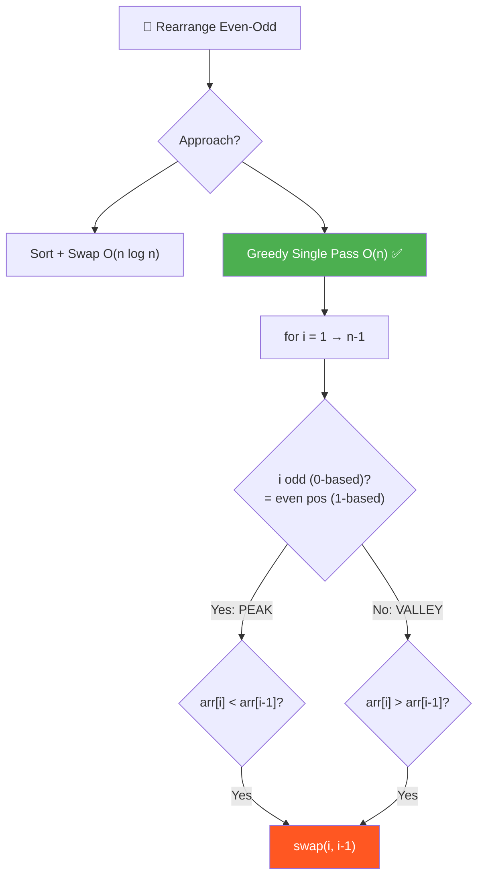
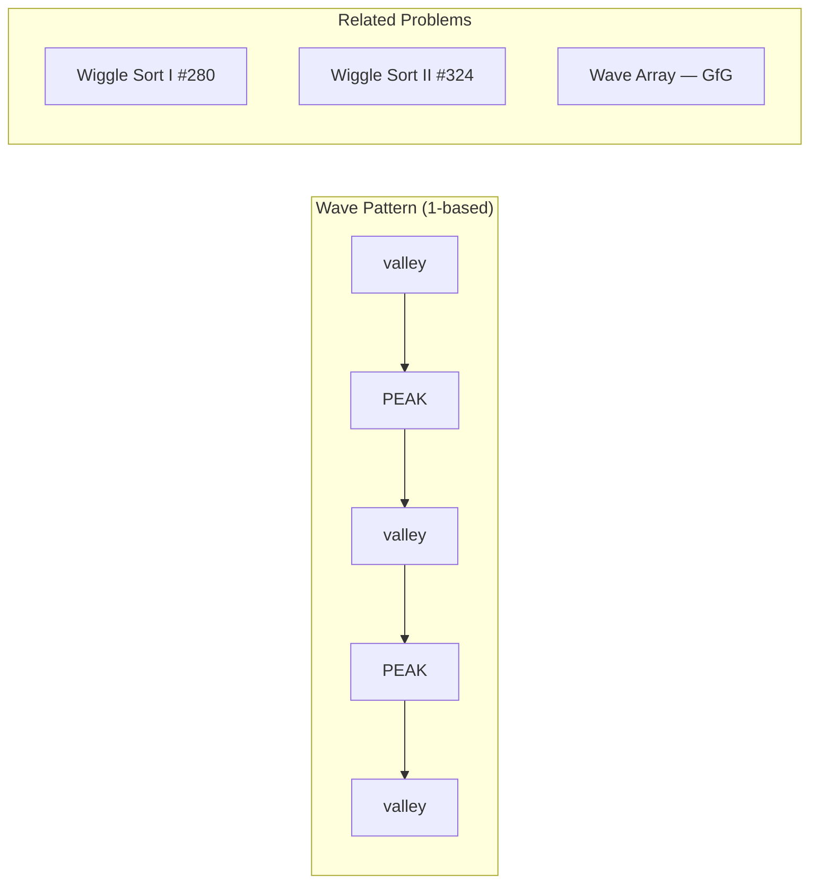
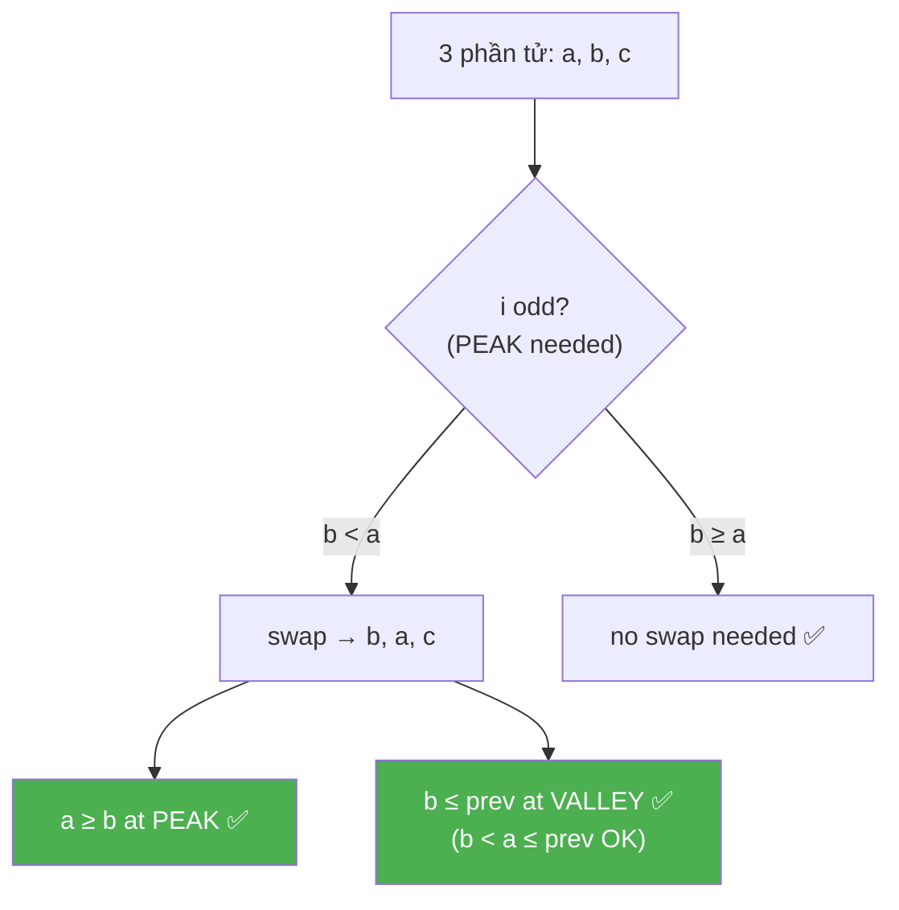
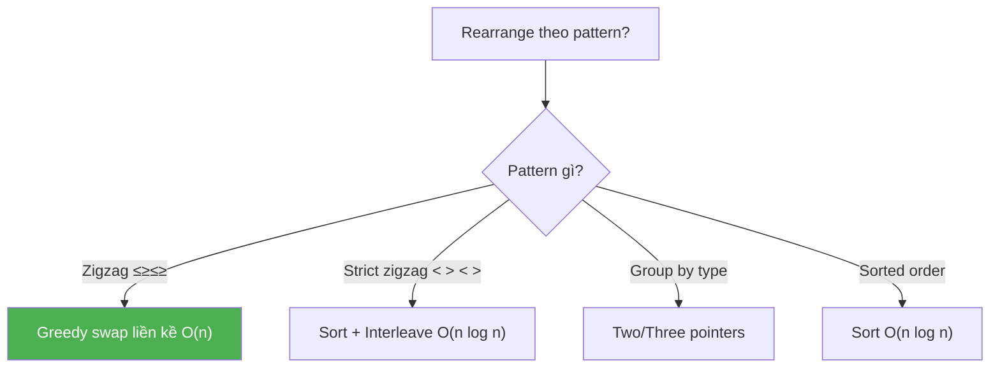
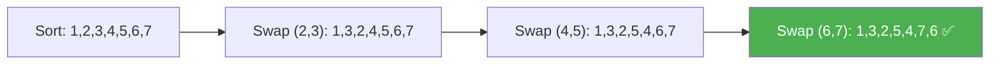

# 🔀 Rearrange Even-Odd Positions (Wave/Zigzag Sort) — GfG (Easy)

> 📖 Code: [Rearrange Even-Odd Positions.js](./Rearrange%20Even-Odd%20Positions.js)





---

## R — Repeat & Clarify

🧠 _"Zigzag pattern: ≤ ≥ ≤ ≥ ... Single pass O(n), swap khi vi phạm!"_

> 🎙️ _"Rearrange arr[] so that even-positioned elements (1-based) are >= their previous, and odd-positioned elements are <= their previous."_

### Clarification Questions

```
Q: Indexing 1-based hay 0-based?
A: 1-based! i=1 là vị trí đầu tiên.
   → 0-based: i=0 (odd pos), i=1 (even pos), i=2 (odd pos)...

Q: "Even position" = vị trí CHẴN (2, 4, 6...)?
A: Đúng! Vị trí 2, 4, 6... (1-based) → arr[i] >= arr[i-1]

Q: Có nhiều đáp án hợp lệ không?
A: CÓ! Bài yêu cầu TÌM 1 đáp án bất kỳ thỏa mãn.

Q: arr có thể có duplicate?
A: Có! [1, 2, 2, 1] → [1, 2, 1, 2] hợp lệ

Q: Mảng rỗng hoặc 1 phần tử?
A: Luôn hợp lệ (không có cặp nào cần kiểm tra)
```

### Tại sao bài này quan trọng?

```
  Bài này dạy PATTERN cực kỳ phổ biến:

  ┌──────────────────────────────────────────────────────────────┐
  │  ZIGZAG / WAVE pattern:                                      │
  │    arr[0] ≤ arr[1] ≥ arr[2] ≤ arr[3] ≥ arr[4] ...          │
  │                                                              │
  │  Xuất hiện trong:                                            │
  │  • Wiggle Sort I (#280) — chính bài này!                    │
  │  • Wiggle Sort II (#324) — strict inequality (HARD)         │
  │  • Wave Array (GfG) — biến thể: ≥ ≤ ≥ ≤                    │
  │  • Alternating positive/negative                             │
  │  • Peak-Valley problems                                      │
  │                                                              │
  │  KEY INSIGHT: Greedy fix-as-you-go = O(n)!                  │
  │  → Không cần sort, không cần extra space!                    │
  └──────────────────────────────────────────────────────────────┘
```

---

## 🧠 Bản chất bài toán — Hiểu để NHỚ, không chỉ để GIẢI

### Zigzag Pattern = "Chuỗi núi"

```
  Hình dung output như CHUỖI NÚI (peak-valley):

  arr = [1, 3, 2, 5, 4, 7, 6]

      3       5       7
     / \     / \     / \      ← PEAK tại vị trí CHẴN (1-based: 2,4,6)
    1   2   4   6              ← VALLEY tại vị trí LẺ (1-based: 1,3,5,7)
    
  Position (1-based): 1  2  3  4  5  6  7
  Pattern:            V  P  V  P  V  P  V
  Rule:               ≤  ≥  ≤  ≥  ≤  ≥

  📌 QUY TẮC:
    Vị trí CHẴN (1-based) = PEAK:    arr[i] ≥ arr[i-1]
    Vị trí LẺ (1-based)   = VALLEY:  arr[i] ≤ arr[i-1]
```

### Chuyển đổi 1-based → 0-based

```
  ⚠️ Đề bài dùng 1-based, code dùng 0-BASED!

  ┌──────────────────────────────────────────────────────────────┐
  │  1-based pos:  1    2    3    4    5    6    7               │
  │  0-based idx:  0    1    2    3    4    5    6               │
  │  Pattern:      V    P    V    P    V    P    V               │
  │                                                              │
  │  1-based EVEN (2,4,6) → 0-based ODD (1,3,5) → PEAK         │
  │  1-based ODD  (3,5,7) → 0-based EVEN (2,4,6) → VALLEY      │
  │                                                              │
  │  📌 Trong code (0-based):                                    │
  │    i odd  → PEAK:   arr[i] ≥ arr[i-1]                      │
  │    i even → VALLEY: arr[i] ≤ arr[i-1]                      │
  └──────────────────────────────────────────────────────────────┘

  ⚠️ Cẩn thận: "even position (1-based)" ≠ "even index (0-based)"!
     Đây là NGUỒN LỖI PHỔ BIẾN NHẤT!
```

### Tại sao Greedy hoạt động? — CHỨNG MINH

```
  🧠 Câu hỏi: "Swap tại vị trí i có PHÁ VỠ điều kiện ở i-1 không?"

  Xét 3 phần tử liên tiếp: a, b, c tại index i-1, i, i+1

  CASE 1: i odd (0-based) → PEAK: cần b ≥ a
    Nếu b < a → swap(a, b) → [b, a, c]
    
    Trước swap: ..., a, b, c    (b < a)
    Sau swap:   ..., b, a, c    (a > b → a ≥ b ✅ tại i)
    
    Liệu b ≤ prev(a) có bị phá?
    → Trước đó: prev ≤ a (vì index i-1 đã được xử lý)
    → b < a → b < a, và prev ≤ a
    → Nếu prev ≤ a → prev có thể > b? CÓ!
    
    Nhưng KHÔNG SAO vì: i-1 là VALLEY cần arr[i-1] ≤ arr[i-2]
    → Trước swap: a đang ở i-1, đã thỏa arr[i-1] ≤ arr[i-2]
    → Sau swap: b ở i-1, b < a ≤ arr[i-2] → VẪN THỎA! ✅

  CASE 2: i even (0-based) → VALLEY: cần c ≤ b
    Tương tự, swap(b, c) → b > c → điều kiện trước vẫn giữ.

  📌 KẾT LUẬN:
    "Swap 2 phần tử liền kề KHÔNG PHÁ VỠ điều kiện đã xử lý trước đó"
    → Vì phần tử NHỎ HƠN di chuyển về vị trí VALLEY → vẫn ≤ neighbor!
    → Phần tử LỚN HƠN di chuyển về vị trí PEAK → vẫn ≥ neighbor!
    → Greedy AN TOÀN duyệt từ trái → phải, fix từng violation!
```



### Hai cách nhìn bài toán

```
  CÁCH 1: Sort + Swap — "Sắp xếp rồi hoán vị"
  ┌──────────────────────────────────────────────────────────────┐
  │  1. Sort mảng tăng dần                                       │
  │  2. Swap từng cặp liền kề: (1,2), (3,4), (5,6), ...        │
  │                                                              │
  │  Sorted: [1, 2, 3, 4, 5, 6, 7]                              │
  │  Swap:   [1, 3, 2, 5, 4, 7, 6]                              │
  │           V  P  V  P  V  P  V  ✅                           │
  │                                                              │
  │  Time: O(n log n)    Space: O(1) ngoài sort                 │
  │  → Trực quan, dễ hiểu, nhưng CHẬM!                         │
  └──────────────────────────────────────────────────────────────┘

  CÁCH 2: Greedy Single Pass — "Fix violation khi gặp"
  ┌──────────────────────────────────────────────────────────────┐
  │  Duyệt i = 1 → n-1:                                         │
  │    Nếu i nên là PEAK nhưng arr[i] < arr[i-1] → swap!       │
  │    Nếu i nên là VALLEY nhưng arr[i] > arr[i-1] → swap!     │
  │                                                              │
  │  Time: O(n)    Space: O(1)                                   │
  │  → Tối ưu nhất! Không cần sort!                             │
  └──────────────────────────────────────────────────────────────┘

  📌 Sort + Swap dễ nhớ, Greedy tối ưu cho interview!
```

---

## 🧭 Luồng Suy Nghĩ — Từ đọc đề đến solution

> 💡 Phần này dạy bạn **CÁCH TƯ DUY** để tự giải bài, không chỉ biết đáp án.
> Mỗi bước đều có **lý do tại sao**, để bạn áp dụng cho bài khó hơn.

### Bước 1: Đọc đề → Gạch chân KEYWORDS

```
  Đề bài: "arr[i] >= arr[i-1] if i is even, arr[i] <= arr[i-1] if i is odd"

  Gạch chân:
    "arr[i] >= arr[i-1]"    → so sánh 2 PHẦN TỬ LIỀN KỀ
    "if i is even/odd"       → XOAY VẶN quy tắc theo vị trí
    "rearrange"              → SẮP XẾP LẠI, không phải tìm kiếm
    "1-based indexing"       → CẨN THẬN chuyển đổi!

  🧠 Tự hỏi: "Pattern gì?"
    → Even pos: ≥   Odd pos: ≤
    → Zigzag! ≤ ≥ ≤ ≥ ≤ ≥ ...
    → "Bài này giống Wiggle Sort!"

  📌 Kỹ năng chuyển giao:
    Khi thấy "xoay vặn quy tắc theo index":
    → i % 2 == 0 vs i % 2 != 0
    → Zigzag, Alternating, Wave patterns
```

### Bước 2: Phân tách bài toán — Vẽ pattern bằng tay

```
  arr = [1, 2, 2, 1]

  Viết ra quy tắc cho TỪNG vị trí (1-based):
    pos 1 (odd):  không có i-1, bỏ qua
    pos 2 (even): arr[2] ≥ arr[1] → phần tử 2 ≥ phần tử 1
    pos 3 (odd):  arr[3] ≤ arr[2] → phần tử 3 ≤ phần tử 2
    pos 4 (even): arr[4] ≥ arr[3] → phần tử 4 ≥ phần tử 3

  Pattern: _ ≥ ≤ ≥ ≤ ≥ ...
  → ZIGZAG! Đỉnh xen kẽ đáy!

  Thử output: [1, 2, 1, 2]
    pos 2: 2 ≥ 1 ✅
    pos 3: 1 ≤ 2 ✅  
    pos 4: 2 ≥ 1 ✅  → ĐÚNG!

  📌 Kỹ năng chuyển giao:
    LUÔN vẽ pattern trước khi code!
    → Thấy ≤ ≥ ≤ ≥ → nhận ra "Zigzag/Wave"
    → Có keyword → biết approach!
```

### Bước 3: Brute Force — "Sort rồi sắp xếp lại"

```
  🧠 Ý tưởng đầu tiên: "Sort rồi swap cặp liền kề"

  Tại sao sort trước?
    → Sau sort: a ≤ b ≤ c ≤ d ≤ e ≤ f
    → Swap cặp: (b,c) → a, c, b, d, e, f
    → Swap cặp: (d,e) → a, c, b, e, d, f
    → Result: a ≤ c ≥ b ≤ e ≥ d ≤ f ✅

  Ví dụ: [4, 7, 5, 6]
    Sort:  [4, 5, 6, 7]
    Swap (5,6): [4, 6, 5, 7]
    Check: 4≤6 ≥ 5≤7 ✅

  Time: O(n log n)    Space: O(1)

  📌 Kỹ năng chuyển giao:
    "Sort + post-process" = brute force PHỔ BIẾN!
    → Sort cho bạn "trật tự", rồi chỉnh sửa ít
    → Nhưng O(n log n) > O(n) → tìm cách tốt hơn!
```

### Bước 4: "Có cần sort không?" → Nhìn từng bước, fix LOCAL

```
  🧠 Quan sát: mỗi quy tắc chỉ kiểm tra 2 PHẦN TỬ LIỀN KỀ!
    → arr[i] vs arr[i-1] — CHỈ 2 phần tử!

  💡 Insight: nếu violation xảy ra → swap 2 phần tử đó!
    → Swap FIX violation tại i
    → Swap KHÔNG PHÁ violation tại i-1 (đã chứng minh ở trên!)

  → Chỉ cần duyệt 1 PASS, fix từng violation!
  → KHÔNG cần sort → O(n)!

  📌 Kỹ năng chuyển giao:
    ┌──────────────────────────────────────────────────────────────┐
    │  Khi constraint CHỈ liên quan PHẦN TỬ LIỀN KỀ:             │
    │    → GREEDY single pass thường hoạt động!                   │
    │    → Fix violation local = fix global!                      │
    │                                                              │
    │  Ví dụ CÙNG pattern:                                        │
    │    Wiggle Sort (#280):    ≤ ≥ ≤ ≥ → swap liền kề           │
    │    Sort Colors (#75):     0s, 1s, 2s → 3 pointers          │
    │    Candy (#135):          2 pass left→right + right→left   │
    └──────────────────────────────────────────────────────────────┘
```

### Bước 5: Tổng kết — Cây quyết định



```
  ⭐ QUY TẮC VÀNG:
    "Constraint chỉ liên quan LIỀN KỀ → Greedy fix local"
    "Pattern xoay vặn theo i → dùng i % 2"
    "Non-strict inequality (≤ ≥) → single pass swap đủ"
    "Strict inequality (< >) → cần sort trước (HARD!)"
```

---

## E — Examples

### Ví dụ minh họa trực quan

```
VÍ DỤ 1: arr = [1, 2, 2, 1]

  Input:   1  2  2  1
  Output:  1  2  1  2

  Verify (1-based):
    pos 2 (even): arr[2]=2 ≥ arr[1]=1 ✅
    pos 3 (odd):  arr[3]=1 ≤ arr[2]=2 ✅
    pos 4 (even): arr[4]=2 ≥ arr[3]=1 ✅

  Hình dung:
      2       2
     / \     / \
    1   1   1   ?
    → Zigzag ✅
```

```
VÍ DỤ 2: arr = [1, 3, 2]

  Input:   1  3  2
  Output:  1  3  2   (ĐÃ thỏa mãn, không cần thay đổi!)

    pos 2 (even): 3 ≥ 1 ✅
    pos 3 (odd):  2 ≤ 3 ✅
```

```
VÍ DỤ 3: arr = [4, 7, 5, 6]

  Sort + Swap approach:
    Sort:  [4, 5, 6, 7]
    Swap (5,6): [4, 6, 5, 7]
    Verify: 4≤6 ≥ 5≤7 ✅

  Greedy approach (0-based):
    i=1 (odd→PEAK): 7 ≥ 4 ✅ → no swap
    i=2 (even→VALLEY): 5 ≤ 7 ✅ → no swap
    i=3 (odd→PEAK): 6 ≥ 5 ✅ → no swap
    → Already valid! [4, 7, 5, 6] ✅
```

```
VÍ DỤ 4: arr = [1, 2, 3, 4, 5, 6, 7]

  Greedy (0-based):
    i=1 (PEAK): 2≥1 ✅
    i=2 (VALLEY): 3>2 ❌ → swap! [1, 3, 2, 4, 5, 6, 7]
    i=3 (PEAK): 4≥2 ✅
    i=4 (VALLEY): 5>4 ❌ → swap! [1, 3, 2, 5, 4, 6, 7]
    i=5 (PEAK): 6≥4 ✅
    i=6 (VALLEY): 7>6 ❌ → swap! [1, 3, 2, 5, 4, 7, 6]

  Result: [1, 3, 2, 5, 4, 7, 6]
      3       5       7
     / \     / \     / \
    1   2   4   6         ← Perfect zigzag!
```

### Trace CHI TIẾT — Greedy: arr = [7, 3, 5, 1, 9, 2]

```
  ┌──────────────────────────────────────────────────────────────────┐
  │ i=1 (odd→PEAK): arr[1]=3 < arr[0]=7?                           │
  │   3 < 7 → YES! Violation! → swap(0,1)                          │
  │   arr = [3, 7, 5, 1, 9, 2]                                     │
  │          V  P                                                    │
  │          3≤7 ✅                                                  │
  ├──────────────────────────────────────────────────────────────────┤
  │ i=2 (even→VALLEY): arr[2]=5 > arr[1]=7?                        │
  │   5 > 7? NO → no swap                                           │
  │   arr = [3, 7, 5, 1, 9, 2]                                     │
  │             P≥V ✅ (7≥5)                                        │
  ├──────────────────────────────────────────────────────────────────┤
  │ i=3 (odd→PEAK): arr[3]=1 < arr[2]=5?                           │
  │   1 < 5 → YES! Violation! → swap(2,3)                          │
  │   arr = [3, 7, 1, 5, 9, 2]                                     │
  │                V  P                                              │
  │                1≤5 ✅                                            │
  │   🧠 Check i=2: arr[2]=1 ≤ arr[1]=7? YES ✅ (không phá!)      │
  ├──────────────────────────────────────────────────────────────────┤
  │ i=4 (even→VALLEY): arr[4]=9 > arr[3]=5?                        │
  │   9 > 5 → YES! Violation! → swap(3,4)                          │
  │   arr = [3, 7, 1, 9, 5, 2]                                     │
  │                   P≥V ✅ (9≥5)                                  │
  │   🧠 Check i=3: arr[3]=9 ≥ arr[2]=1? YES ✅ (không phá!)      │
  ├──────────────────────────────────────────────────────────────────┤
  │ i=5 (odd→PEAK): arr[5]=2 < arr[4]=5?                           │
  │   2 < 5 → YES! Violation! → swap(4,5)                          │
  │   arr = [3, 7, 1, 9, 2, 5]                                     │
  │                      V  P                                        │
  │                      2≤5 ✅                                      │
  │   🧠 Check i=4: arr[4]=2 ≤ arr[3]=9? YES ✅ (không phá!)      │
  └──────────────────────────────────────────────────────────────────┘

  Final: [3, 7, 1, 9, 2, 5]

  Verify:
      7       9       5
     / \     / \     /
    3   1   2   
    → 3≤7 ≥ 1≤9 ≥ 2≤5 ✅
```

---

## A — Approach

### Approach 1: Sort + Swap Adjacent Pairs — O(n log n)

```
  ┌──────────────────────────────────────────────────────────────┐
  │  1. Sort mảng tăng dần                                       │
  │  2. Swap cặp liền kề tại index (1,2), (3,4), (5,6), ...    │
  │     → Bắt đầu từ index 1, bước nhảy 2                       │
  │                                                              │
  │  Tại sao đúng?                                               │
  │    Sort: a ≤ b ≤ c ≤ d ≤ e ≤ f                              │
  │    Swap (b,c): a ≤ c ≥ b (vì c ≥ b từ sort)                │
  │    Swap (d,e): b ≤ e ≥ d (vì b ≤ c ≤ d ≤ e)               │
  │    → Zigzag tự nhiên hình thành!                             │
  │                                                              │
  │  Time: O(n log n)    Space: O(1) ngoài sort                 │
  └──────────────────────────────────────────────────────────────┘
```



### Approach 2: Greedy Single Pass — O(n) ✅

```
  💡 KEY INSIGHT: Chỉ cần fix từng violation local!

  ┌──────────────────────────────────────────────────────────────┐
  │  for i = 1 → n-1:                                           │
  │    if i is ODD (0-based) → PEAK needed:                     │
  │      if arr[i] < arr[i-1]: swap(i, i-1)                    │
  │    if i is EVEN (0-based) → VALLEY needed:                  │
  │      if arr[i] > arr[i-1]: swap(i, i-1)                    │
  │                                                              │
  │  Time: O(n)    Space: O(1)                                   │
  │  → Tối ưu nhất! Single pass, in-place!                      │
  └──────────────────────────────────────────────────────────────┘

  🧠 Tại sao chỉ cần 1 pass?
    → Mỗi swap FIX violation tại i
    → Swap KHÔNG PHÁ violation tại i-1 (đã chứng minh!)
    → Duyệt trái → phải, mỗi vị trí chỉ xử lý 1 lần!

  📌 Cách nhớ:
    "i odd (0-based) = PEAK → arr[i] PHẢI LỚN → nếu nhỏ thì swap LÊN"
    "i even (0-based) = VALLEY → arr[i] PHẢI NHỎ → nếu lớn thì swap XUỐNG"
```

---

## C — Code

### Solution 1: Sort + Swap — O(n log n)

```javascript
function rearrangeSort(arr) {
  const result = [...arr];
  result.sort((a, b) => a - b);

  // Swap adjacent pairs: (1,2), (3,4), (5,6), ...
  for (let i = 1; i < result.length - 1; i += 2) {
    [result[i], result[i + 1]] = [result[i + 1], result[i]];
  }

  return result;
}
```

```
  📝 Line-by-line:

  Line 3: result.sort((a, b) => a - b)
    → Sort tăng dần
    → ⚠️ PHẢI dùng comparator! JS sort() mặc định sort STRING!
       [10, 2, 1].sort() → [1, 10, 2] ← SAI!

  Line 6: for (let i = 1; i < result.length - 1; i += 2)
    → Bắt đầu từ index 1 (phần tử thứ 2)
    → Bước nhảy 2: swap cặp (1,2), (3,4), (5,6)...
    
    ⚠️ Tại sao i < length - 1 (KHÔNG PHẢI i < length)?
       → Cần arr[i+1] tồn tại để swap!
       → Nếu n lẻ: phần tử cuối không swap → tự nhiên là VALLEY ✅

  Line 7: [result[i], result[i + 1]] = [result[i + 1], result[i]]
    → Destructuring swap — JS idiomatic!
    → Phần tử LỚN HƠN về PEAK (i), nhỏ hơn về VALLEY (i+1)
```

### Solution 2: Greedy Single Pass — O(n) ✅

```javascript
function rearrangeGreedy(arr) {
  const result = [...arr];
  const n = result.length;

  for (let i = 1; i < n; i++) {
    if (i % 2 !== 0) {
      // i odd (0-based) = even pos (1-based) → PEAK
      if (result[i] < result[i - 1]) {
        [result[i], result[i - 1]] = [result[i - 1], result[i]];
      }
    } else {
      // i even (0-based) = odd pos (1-based) → VALLEY
      if (result[i] > result[i - 1]) {
        [result[i], result[i - 1]] = [result[i - 1], result[i]];
      }
    }
  }

  return result;
}
```

```
  📝 Line-by-line:

  Line 5: for (let i = 1; i < n; i++)
    → Bắt đầu từ 1 (cần arr[i-1])
    → Duyệt MỌI index, KHÔNG nhảy 2!

  Line 6: if (i % 2 !== 0)
    → i odd (0-based) = even position (1-based) = PEAK
    
    ⚠️ CẢNH BÁO: đề nói "even position" (1-based)
       = index ODD trong code (0-based)!
       → Nếu nhầm → output NGƯỢC hoàn toàn!

  Line 8: if (result[i] < result[i - 1])
    → PEAK cần arr[i] ≥ arr[i-1]
    → Nếu arr[i] < arr[i-1] → vi phạm → SWAP!

  Line 13: if (result[i] > result[i - 1])
    → VALLEY cần arr[i] ≤ arr[i-1]
    → Nếu arr[i] > arr[i-1] → vi phạm → SWAP!

  🧠 Cách viết GỌN hơn (1 dòng condition):
    if ((i % 2 !== 0 && result[i] < result[i-1]) ||
        (i % 2 === 0 && result[i] > result[i-1]))
      swap(i, i-1);
    
    → Nhưng code TÁCH RÕ dễ đọc hơn cho interview!
```

---

## ❌ Common Mistakes — Lỗi thường gặp

### Mistake 1: Nhầm 1-based và 0-based

```javascript
// ❌ SAI: nghĩ "even position" = "even index"
if (i % 2 === 0) {
  // PEAK?  ← SAI! Even INDEX = ODD POSITION = VALLEY!
}

// ✅ ĐÚNG: even POSITION (1-based) = odd INDEX (0-based)
if (i % 2 !== 0) {
  // PEAK! (i=1,3,5 trong 0-based = position 2,4,6 trong 1-based)
}
```

```
  ⚠️ ĐÂY LÀ LỖI PHỔ BIẾN NHẤT!

  Cách tránh: VIẾT COMMENT rõ ràng!
    // i odd (0-based) = even position (1-based) = PEAK
    // i even (0-based) = odd position (1-based) = VALLEY
```

### Mistake 2: Sort + Swap — sai range swap

```javascript
// ❌ SAI: swap cặp (0,1), (2,3), (4,5) → bắt đầu từ i=0!
for (let i = 0; i < n - 1; i += 2) {
  [arr[i], arr[i+1]] = [arr[i+1], arr[i]];
}
// Sorted [1,2,3,4] → swap (1,2),(3,4) → [2,1,4,3]
// Check: 2≥1 ✅ nhưng 4>1 ❌ (pos 3 cần ≤)

// ✅ ĐÚNG: swap cặp (1,2), (3,4) → bắt đầu từ i=1!
for (let i = 1; i < n - 1; i += 2) {
  [arr[i], arr[i+1]] = [arr[i+1], arr[i]];
}
// Sorted [1,2,3,4] → swap (2,3) → [1,3,2,4]
// Check: 1≤3 ≥ 2≤4 ✅
```

### Mistake 3: Greedy — so sánh sai hướng

```javascript
// ❌ SAI: PEAK cần ≥ nhưng check ngược!
if (i % 2 !== 0) {
  if (result[i] > result[i - 1]) swap; // Swap khi ĐÃ ĐÚNG!
}

// ✅ ĐÚNG: PEAK cần arr[i] ≥ arr[i-1], swap khi arr[i] < arr[i-1]
if (i % 2 !== 0) {
  if (result[i] < result[i - 1]) swap; // Swap khi VI PHẠM!
}
```

### Mistake 4: JS sort() không có comparator

```javascript
// ❌ SAI: sort() mặc định sort theo STRING!
[10, 2, 1, 20].sort() // → [1, 10, 2, 20] ← SAI!

// ✅ ĐÚNG: luôn dùng comparator cho số!
[10, 2, 1, 20].sort((a, b) => a - b) // → [1, 2, 10, 20]
```

### Mistake 5: Quên copy mảng — mutate input

```javascript
// ❌ SAI: sửa trực tiếp mảng input!
function rearrange(arr) {
  arr.sort((a, b) => a - b); // ← mutate arr!
  // ...
}

// ✅ ĐÚNG: copy trước!
function rearrange(arr) {
  const result = [...arr]; // copy!
  result.sort((a, b) => a - b);
  // ...
}
```

---

## O — Optimize

```
                      Time         Space     Ghi chú
  ─────────────────────────────────────────────────────────────
  Sort + Swap         O(n log n)   O(1)*     *ngoài sort
  Greedy ✅           O(n)         O(1)      Single pass!

  📌 Greedy THẮNG tuyệt đối:
    → 1 pass, O(1) space, O(n) time
    → Không thể tốt hơn! (phải đọc mỗi phần tử ít nhất 1 lần)
```

### So sánh chi tiết

```
  ┌──────────────────────────────────────────────────────────────┐
  │  Tiêu chí           Sort + Swap         Greedy              │
  ├──────────────────────────────────────────────────────────────┤
  │  Time               O(n log n)          O(n) ✅            │
  │  Space              O(1)                O(1) (tie)          │
  │  Dễ hiểu            ✅ trực quan       ⚠️ cần chứng minh │
  │  Dễ code            ✅ 5 dòng          ✅ 8 dòng          │
  │  Stability          ✅ deterministic    ⚠️ result phụ thuộc│
  │                                           vào input order   │
  │  Mở rộng #324       ❌ cần median       ❌ không đủ        │
  │  Interview          ✅ nêu trước        ✅ nêu sau optimize│
  └──────────────────────────────────────────────────────────────┘
```

---

## T — Test

```
Test Cases:
  [1,2,2,1]         → valid ✅  Có duplicate
  [1,3,2]           → valid ✅  Đã đúng sẵn
  [4,7,5,6]         → valid ✅  4 phần tử
  [1,2,3,4,5,6,7]   → valid ✅  Sorted ascending
  [5]               → valid ✅  Single element
  [3,1]             → valid ✅  2 phần tử
  [1,1,1,1]         → valid ✅  Tất cả giống nhau
  [7,3,5,1,9,2]     → valid ✅  Random order
```

### Edge Cases giải thích

```
  ┌──────────────────────────────────────────────────────────────┐
  │  Mảng rỗng/1:     Không có cặp → luôn valid               │
  │                                                              │
  │  2 phần tử:       [a, b] → cần b ≥ a (even pos)           │
  │                    → sort hoặc swap nếu a > b               │
  │                                                              │
  │  Tất cả giống:    [x,x,x,x] → mọi ≤ và ≥ đều thỏa        │
  │                    → Luôn valid, không cần swap!             │
  │                                                              │
  │  Đã sorted:       [1,2,3,4,5] → Greedy swap ở VALLEY       │
  │                    → [1,3,2,5,4] hoặc tương đương           │
  │                                                              │
  │  Reverse sorted:  [5,4,3,2,1] → Greedy swap ở PEAK         │
  │                    → [4,5,2,3,1] hoặc tương đương           │
  └──────────────────────────────────────────────────────────────┘
```

---

## 🗣️ Interview Script

### 🎙️ Think Out Loud — Mô phỏng phỏng vấn thực

> ⚠️ Script này dạy cách **NÓI**, không phải cách CODE.
> Mỗi đoạn = cách bạn **PHÁT BIỂU** trong phỏng vấn thực!

```
  ╔══════════════════════════════════════════════════════════════╗
  ║  🕐 FULL INTERVIEW SIMULATION — 1h30 (90 phút)             ║
  ║                                                              ║
  ║  00:00-05:00  Introduction + Icebreaker         (5 min)     ║
  ║  05:00-45:00  Problem Solving                   (40 min)    ║
  ║  45:00-60:00  Deep Technical Probing            (15 min)    ║
  ║  60:00-75:00  Variations + Extensions           (15 min)    ║
  ║  75:00-85:00  System Design at Scale            (10 min)    ║
  ║  85:00-90:00  Behavioral + Q&A                  (5 min)     ║
  ╚══════════════════════════════════════════════════════════════╝
```

```
  ╔══════════════════════════════════════════════════════════════╗
  ║  PART 1: INTRODUCTION (00:00 — 05:00)                       ║
  ╚══════════════════════════════════════════════════════════════╝

  👤 "Tell me about yourself and a time you solved
      a problem with a greedy, fix-as-you-go approach."

  🧑 "I'm a frontend engineer with [X] years of experience.
      A relevant example: I was building a dashboard
      that displayed a bar chart of server loads.
      The product manager wanted a 'zigzag' visual —
      alternating tall and short bars for aesthetic appeal.

      My first approach: sort the loads, then interleave
      the largest and smallest. But sorting was O of n log n
      and messed up the original groupings.

      Then I realized: each bar only needs to satisfy
      a LOCAL condition relative to its neighbor.
      I could scan left to right, and whenever a bar
      violated the zigzag pattern, swap it with its neighbor.

      One pass, O of n, in-place. That's exactly
      the greedy approach for Wave Sort."

  👤 "Great! Let's formalize that intuition."
```

```
  ╔══════════════════════════════════════════════════════════════╗
  ║  PART 2: PROBLEM SOLVING (05:00 — 45:00)                   ║
  ╚══════════════════════════════════════════════════════════════╝

  ──────────────── 05:00 — Clarify (4 phút) ────────────────

  👤 "Rearrange the array so even-positioned elements
      (1-based) are greater than or equal to their
      adjacent odd-positioned elements."

  🧑 "Let me clarify the pattern.

      1-based: positions 1, 2, 3, 4, 5...
      Even positions (2, 4, 6) should be PEAKS:
      arr at pos 2 greater-equals arr at pos 1.
      Odd positions (3, 5, 7) should be VALLEYS:
      arr at pos 3 less-equals arr at pos 2.

      So the pattern is: valley, PEAK, valley, PEAK, valley...
      Or in terms of comparison: less-equals, greater-equals,
      less-equals, greater-equals...

      A ZIGZAG or WAVE pattern!

      Important: converting to 0-based indexing —
      1-based EVEN position equals 0-based ODD index.
      1-based ODD position equals 0-based EVEN index.
      This is the NUMBER ONE source of bugs.

      Non-strict inequalities, so duplicates are fine.
      Multiple valid answers exist.
      Array has at least one element."

  ──────────────── 09:00 — Zigzag Mountain Analogy (3 phút) ──────

  🧑 "I visualize this as a MOUNTAIN RANGE.

      Imagine peaks and valleys alternating:

      The number 7 at the peak, then down to 3 in the valley,
      up to 9 at the next peak, down to 2, up to 5.

      Like this: 3, 7, 3, 9, 2, 5.

      Each peak is higher than BOTH neighbors.
      Each valley is lower than BOTH neighbors.

      The greedy insight: I only need to check
      each position against its LEFT neighbor.
      If the zigzag condition is violated, I swap.
      One pass from left to right fixes everything."

  ──────────────── 12:00 — Approach 1: Sort + Swap (4 phút) ────────

  🧑 "First approach: Sort, then create the zigzag.

      After sorting, the array is monotonically increasing.
      I swap adjacent pairs starting from index 1:
      swap positions 1 and 2, swap positions 3 and 4, etc.

      Example: [1, 2, 3, 4, 5, 6, 7] after sorting.
      Swap (2, 3): [1, 3, 2, 4, 5, 6, 7].
      Swap (4, 5): [1, 3, 2, 5, 4, 6, 7].
      Swap (6, 7): [1, 3, 2, 5, 4, 7, 6].

      Verify: 1 less-equals 3 greater-equals 2
      less-equals 5 greater-equals 4 less-equals 7
      greater-equals 6. Correct!

      Time: O of n log n because of sorting.
      Can I avoid sorting entirely?"

  ──────────────── 16:00 — Approach 2: Greedy Single Pass (6 phút) ──

  🧑 "Yes! Each constraint only involves TWO ADJACENT elements.

      I scan from index 1 to n minus 1.
      At each position i, I check:

      If i is ODD (0-based) — should be a PEAK:
      arr at i should be greater-equals arr at i minus 1.
      If it's less, violation! Swap them.

      If i is EVEN (0-based) — should be a VALLEY:
      arr at i should be less-equals arr at i minus 1.
      If it's greater, violation! Swap them.

      Let me trace with arr equals [7, 3, 5, 1, 9, 2]:

      i equals 1 (odd, PEAK): arr at 1 equals 3.
      arr at 0 equals 7. 3 less than 7? YES, violation!
      Swap. Array becomes [3, 7, 5, 1, 9, 2].

      i equals 2 (even, VALLEY): arr at 2 equals 5.
      arr at 1 equals 7. 5 greater than 7? NO. OK.

      i equals 3 (odd, PEAK): arr at 3 equals 1.
      arr at 2 equals 5. 1 less than 5? YES, violation!
      Swap. Array becomes [3, 7, 1, 5, 9, 2].

      i equals 4 (even, VALLEY): arr at 4 equals 9.
      arr at 3 equals 5. 9 greater than 5? YES, violation!
      Swap. Array becomes [3, 7, 1, 9, 5, 2].

      i equals 5 (odd, PEAK): arr at 5 equals 2.
      arr at 4 equals 5. 2 less than 5? YES, violation!
      Swap. Array becomes [3, 7, 1, 9, 2, 5].

      Final: [3, 7, 1, 9, 2, 5].
      Verify: 3 less-equals 7 greater-equals 1
      less-equals 9 greater-equals 2 less-equals 5. Correct!

      Time: O of n. Space: O of 1. Single pass!"

  ──────────────── 22:00 — Write Code (3 phút) ────────────────

  🧑 "The code is very clean.

      [Vừa viết vừa nói:]

      function rearrangeGreedy of arr.
      const result equal spread arr.
      const n equal result dot length.

      for let i equal 1, i less than n, i plus plus.
      If i mod 2 not equal 0 — odd index, PEAK needed:
      if result at i less than result at i minus 1:
      swap result at i with result at i minus 1.
      Else — even index, VALLEY needed:
      if result at i greater than result at i minus 1:
      swap result at i with result at i minus 1.

      return result.

      Eight lines total. The i mod 2 check determines
      whether we expect a peak or valley."

  ──────────────── 25:00 — Why swap doesn't break previous (5 phút)

  👤 "How do you know the swap doesn't break the condition
      you already fixed at position i minus 1?"

  🧑 "This is the KEY correctness argument!

      Consider three consecutive elements: a, b, c
      at positions i minus 1, i, i plus 1.

      Case: i is odd (PEAK needed). Condition: b greater-equals a.
      Suppose b less than a — violation. I swap a and b.
      After swap: b, a, c. Now position i has a, which is
      greater than b. Peak condition satisfied.

      But does position i minus 1 (VALLEY) break?
      Before swap: position i minus 1 had a, and it satisfied
      its valley condition: a less-equals its left neighbor.
      After swap: position i minus 1 has b.
      Since b less than a, and a was already less-equals
      its left neighbor, b is EVEN SMALLER.
      So b is definitely less-equals the left neighbor.
      Valley condition PRESERVED!

      The intuition: when I swap, the SMALLER value moves
      to the valley position, and the LARGER value moves
      to the peak position. Both conditions are maintained.

      This is why greedy works — local fixes don't
      break global invariants."

  ──────────────── 30:00 — The 1-based vs 0-based trap (3 phút) ────

  🧑 "The most common bug in this problem:
      confusing 1-based positions with 0-based indices.

      The problem says 'even position' meaning position 2, 4, 6
      in 1-based. But in code, that's index 1, 3, 5 — ODD indices!

      If you get this wrong, the zigzag is INVERTED:
      peaks where valleys should be and vice versa.
      The output looks 'correct' but fails validation.

      My rule: always write a comment like
      'i odd (0-based) equals even position (1-based) equals PEAK.'
      This prevents the mistake."

  ──────────────── 33:00 — Edge Cases (3 phút) ────────────────

  🧑 "Edge cases.

      Single element: always valid. Nothing to compare.

      Two elements: [a, b]. Position 2 (0-based index 1)
      is a PEAK, so b should be greater-equals a.
      If not, one swap fixes it.

      All equal: [5, 5, 5, 5]. Every comparison is
      5 less-equals 5 and 5 greater-equals 5.
      All satisfied. No swaps needed.

      Already sorted ascending: [1, 2, 3, 4, 5].
      Greedy will swap at every valley position.
      Result: [1, 3, 2, 5, 4].

      Already sorted descending: [5, 4, 3, 2, 1].
      Greedy will swap at every peak position.
      Result: [4, 5, 2, 3, 1]."

  ──────────────── 36:00 — Complexity (3 phút) ────────────────

  🧑 "Time: O of n. Single pass from 1 to n minus 1.
      Each position does at most one comparison and
      at most one swap. Total: at most n minus 1
      comparisons and at most n minus 1 swaps.

      Space: O of 1. Only swapping in-place.
      If I copy the array first, that's O of n for the copy,
      but O of 1 extra beyond that.

      Is this optimal? Yes. I must examine each element
      at least once — that's Omega of n.
      We match the lower bound.

      Compared to Sort + Swap:
      Sort is O of n log n. Greedy is O of n.
      Greedy wins by a log factor."

  ──────────────── 39:00 — Alternative: compact form (3 phút) ────

  👤 "Can you write it more concisely?"

  🧑 "Yes! One condition covers both cases:

      if i mod 2 not equal 0 AND result at i less than
      result at i minus 1 — swap.
      OR i mod 2 equal 0 AND result at i greater than
      result at i minus 1 — swap.

      Or even more compact:
      if shouldBePeak AND arr at i less than arr at i minus 1
      OR NOT shouldBePeak AND arr at i greater than
      arr at i minus 1 — swap.

      But in an interview, I prefer the explicit if-else
      with comments. Clarity beats cleverness."
```

```
  ╔══════════════════════════════════════════════════════════════╗
  ║  PART 3: DEEP TECHNICAL PROBING (45:00 — 60:00)            ║
  ╚══════════════════════════════════════════════════════════════╝

  ──────────────── 45:00 — Formal invariant proof (4 phút) ────────

  👤 "Can you formalize the correctness?"

  🧑 "Sure. The LOOP INVARIANT:

      After processing position i, all positions 0 through i
      satisfy the zigzag condition with their left neighbor.

      Base case: i equals 1. I check and fix position 1.
      After processing, positions 0 and 1 satisfy the condition.

      Inductive step: assume positions 0 through i minus 1
      satisfy the condition. At position i, I check
      arr at i versus arr at i minus 1.

      If the condition holds, nothing changes. Invariant preserved.

      If violated, I swap arr at i and arr at i minus 1.
      The swap fixes position i.
      Position i minus 1 gets a value that STRENGTHENS
      its own condition (smaller for valley, larger for peak).
      So the invariant at i minus 1 is preserved.

      By induction, after processing all positions,
      the entire array satisfies the zigzag pattern."

  ──────────────── 49:00 — Multiple valid outputs (4 phút) ────────

  👤 "The problem says any valid answer. How many exist?"

  🧑 "For n distinct elements, there can be MANY valid
      zigzag arrangements.

      The greedy approach produces ONE specific output —
      determined by the input order. A different starting
      order gives a different valid output.

      Sort + Swap produces a DETERMINISTIC output —
      always the same regardless of input order.

      For n equals 3 with values [1, 2, 3]:
      Valid outputs: [1, 3, 2], [2, 3, 1], [1, 2, 1] if
      considering repeats... For distinct values,
      the number of valid arrangements grows exponentially.

      This multiple-solution property is why greedy works —
      we don't need THE answer, just ANY answer."

  ──────────────── 53:00 — Stability considerations (3 phút) ────────

  👤 "Is the greedy approach stable?"

  🧑 "No — swaps change the relative order of equal elements.

      But stability doesn't matter here because
      the problem asks for ANY valid arrangement.
      There's no 'original order' to preserve.

      If stability were required — say, among equal elements,
      maintain the original order — the greedy swap approach
      would need modification. But I've never seen that variant
      in an interview."

  ──────────────── 56:00 — What about strict inequality? (4 phút) ──

  👤 "What if the problem requires STRICT inequality?
      Less-than and greater-than instead of less-equals
      and greater-equals?"

  🧑 "That's Wiggle Sort II — LeetCode 324 — a HARD problem!

      The greedy swap approach FAILS for strict inequality.
      Example: [1, 1, 2, 2]. I need strictly less, greater,
      less, greater. But with two 1s and two 2s,
      I can't avoid equal neighbors with simple swaps.

      The approach for strict inequality:
      1. Find the MEDIAN in O of n using QuickSelect.
      2. Three-way partition: less than median, equal, greater.
      3. Place greater-than-median at odd indices (peaks).
      4. Place less-than-median at even indices (valleys).
      5. Equal-to-median fills remaining spots carefully.

      This requires O of n time but is MUCH more complex.
      The key difference: non-strict allows equal neighbors,
      so greedy swap always works. Strict does not."
```

```
  ╔══════════════════════════════════════════════════════════════╗
  ║  PART 4: VARIATIONS (60:00 — 75:00)                         ║
  ╚══════════════════════════════════════════════════════════════╝

  ──────────────── 60:00 — Wave Array (inverted zigzag) (3 phút) ──

  👤 "What about the Wave Array variant: peak, valley, peak?"

  🧑 "Just flip the condition!

      Instead of: odd index equals peak (0-based),
      use: even index equals peak (0-based).

      In code, change i mod 2 not equal 0 to i mod 2 equal 0
      in the peak check.

      Or equivalently: swap shouldBePeak logic.
      Same algorithm, same complexity, just inverted pattern.

      Wave Array expects:
      arr at 0 greater-equals arr at 1,
      arr at 1 less-equals arr at 2,
      arr at 2 greater-equals arr at 3...

      Instead of our:
      arr at 0 less-equals arr at 1,
      arr at 1 greater-equals arr at 2..."

  ──────────────── 63:00 — Sort Colors / DNF (4 phút) ────────────

  👤 "How does this relate to Sort Colors?"

  🧑 "Sort Colors — LeetCode 75 — is a RELATED rearrangement
      problem but with a different goal.

      Sort Colors: partition [0, 1, 2] into three groups.
      Uses Dutch National Flag: three pointers (low, mid, high).

      Our problem: alternating peaks and valleys.
      Uses greedy swap with one pointer.

      The connection: both are REARRANGEMENT problems
      solvable in O of n with O of 1 space.
      Both use LOCAL swap decisions.
      But the INVARIANT is different:
      Sort Colors maintains group boundaries.
      Zigzag maintains alternating comparison direction.

      The meta-pattern: 'rearrange array to satisfy
      local constraints' often yields O of n greedy solutions."

  ──────────────── 67:00 — Alternating positive/negative (4 phút) ──

  👤 "What about alternating positive and negative numbers?"

  🧑 "That's a variant where the rearrangement criterion
      is based on SIGN rather than relative magnitude.

      If equal counts of positives and negatives:
      Separate into two queues — positives and negatives.
      Interleave: take from positive queue, negative queue,
      positive, negative...
      O of n time, O of n space.

      For unequal counts, the extra elements go at the end.

      Can I do it in-place? With a modified zigzag approach:
      Scan left to right. If position i should be positive
      but arr at i is negative, find the next positive
      and rotate the subarray to bring it here.
      But this can be O of n squared in the worst case.

      The in-place O of n solution is possible but complex —
      requires merge-based techniques."

  ──────────────── 71:00 — K-way zigzag (4 phút) ────────────────

  👤 "Can you generalize to a k-way pattern?"

  🧑 "Interesting extension! Instead of 2-period zigzag
      (peak-valley), a k-period pattern.

      For k equals 3: small, medium, LARGE, small, medium, LARGE...

      Sort + interleave generalizes naturally:
      Sort the array, divide into k groups by rank,
      then interleave cyclically.
      O of n log n time.

      Greedy is harder for k greater than 2.
      The swap might need to consider k minus 1 neighbors
      instead of just 1. The correctness proof becomes
      more complex.

      In practice, k equals 2 — classic zigzag —
      covers almost all interview scenarios."
```

```
  ╔══════════════════════════════════════════════════════════════╗
  ║  PART 5: SYSTEM DESIGN AT SCALE (75:00 — 85:00)            ║
  ╚══════════════════════════════════════════════════════════════╝

  ──────────────── 75:00 — Real-world applications (5 phút) ────────

  👤 "Where does zigzag/wave pattern appear in practice?"

  🧑 "Several domains!

      First — LOAD BALANCING.
      In distributed systems, you might want to alternate
      between heavy and light tasks across servers.
      A zigzag assignment ensures no two heavy tasks
      are adjacent — preventing hotspots.

      Second — SIGNAL PROCESSING.
      Anti-aliasing in digital audio uses a form of
      alternating pattern to avoid resonance.
      Dithering in images intentionally creates
      zigzag noise patterns.

      Third — SCHEDULING.
      In OS thread scheduling, alternating between
      CPU-bound and IO-bound tasks maximizes throughput.
      The zigzag ensures the CPU is never idle
      while waiting for IO.

      Fourth — UI/UX DESIGN.
      Dashboard layouts often alternate between
      tall and short visual elements for readability.
      This is the exact use case from my introduction."

  ──────────────── 80:00 — Streaming zigzag (5 phút) ────────────

  👤 "What if elements arrive as a stream?"

  🧑 "In a streaming scenario, I maintain the zigzag
      invariant incrementally.

      When a new element arrives, I append it to the array.
      Then I check: does it satisfy the zigzag condition
      with its left neighbor?

      If yes, done. If no, swap with the left neighbor.
      But after swapping, I might need to check the
      left neighbor's condition too — so I might cascade
      leftward.

      Worst case per insertion: O of 1 amortized.
      Because each swap settles one violated condition,
      and the newly swapped value going LEFT satisfies
      the valley condition (it's the smaller value).

      This makes the zigzag pattern STREAMABLE —
      I can maintain it in an online fashion
      with O of 1 work per new element.

      Useful for real-time dashboards where data points
      arrive continuously and need immediate visualization."
```

```
  ╔══════════════════════════════════════════════════════════════╗
  ║  PART 6: BEHAVIORAL + Q&A (85:00 — 90:00)                  ║
  ╚══════════════════════════════════════════════════════════════╝

  ──────────────── 85:00 — Reflection (3 phút) ────────────────

  👤 "What would you take away from this problem?"

  🧑 "Three things.

      First, GREEDY FIX-AS-YOU-GO for local constraints.
      When each constraint involves only adjacent elements,
      a single pass fixing violations is often optimal.
      No sorting, no extra space needed.

      Second, SWAP PRESERVES INVARIANT — the correctness key.
      Swapping two adjacent elements fixes the current
      violation WITHOUT breaking the previous one.
      The smaller value naturally satisfies the valley,
      the larger value satisfies the peak.

      Third, 1-BASED vs 0-BASED is the number one bug source.
      'Even position' in 1-based is 'odd index' in 0-based.
      Always write explicit comments to prevent this mistake."

  ──────────────── 88:00 — Questions (2 phút) ────────────────

  👤 "Any questions for me?"

  🧑 "A few!

      First — the greedy approach works for non-strict
      inequalities. Have you seen candidates struggle
      with the strict version — Wiggle Sort II?
      It's a significant jump in difficulty.

      Second — the zigzag pattern is useful for load
      balancing. Do your distributed systems use any
      form of alternating assignment to prevent hotspots?

      Third — this problem has multiple valid outputs.
      In your testing framework, how do you validate
      'any valid zigzag' rather than a specific output?"

  👤 "Excellent questions! Your correctness proof —
      showing swap preserves the valley condition —
      was the highlight. The connection to Wiggle Sort II
      showed strong pattern recognition. We'll be in touch!"
```

```
  ╔══════════════════════════════════════════════════════════════╗
  ║  ⭐ 8 MẸO NÓI CHUYỆN TRONG PHỎNG VẤN (Even-Odd Wave)     ║
  ╚══════════════════════════════════════════════════════════════╝

  📌 MẸO #1: Name the pattern immediately
     ✅ "This is a ZIGZAG or WAVE sort problem.
         Alternating peaks and valleys."

  📌 MẸO #2: Clarify 1-based vs 0-based up front
     ✅ "Even position in 1-based equals odd INDEX in 0-based.
         I'll write comments to avoid confusion."

  📌 MẸO #3: Present two approaches as escalation
     ✅ "Sort + swap adjacent pairs: O of n log n.
         Greedy single pass: O of n. Optimal."

  📌 MẸO #4: Explain why local fix works globally
     ✅ "Swapping sends the smaller value to the valley
         and the larger to the peak. Both conditions
         are maintained. Local fix equals global fix."

  📌 MẸO #5: Trace with a violation example
     ✅ "At index 1 (PEAK), 3 is less than 7 — violation.
         Swap: [3, 7, ...]. Now 3 is at the valley,
         7 at the peak. Both satisfied."

  📌 MẸO #6: Note non-strict vs strict difference
     ✅ "Non-strict (less-equals/greater-equals) — greedy works.
         Strict (less-than/greater-than) — that's Wiggle Sort II,
         a Hard problem requiring median partitioning."

  📌 MẸO #7: Mention the mountain range visualization
     ✅ "Peaks and valleys like a mountain range.
         Each position alternates between going up
         and going down."

  📌 MẹO #8: Connect to the rearrangement family
     ✅ "Same meta-pattern as Sort Colors and alternating
         positive-negative: rearrange to satisfy local
         constraints using O of n greedy swaps."
```

---
