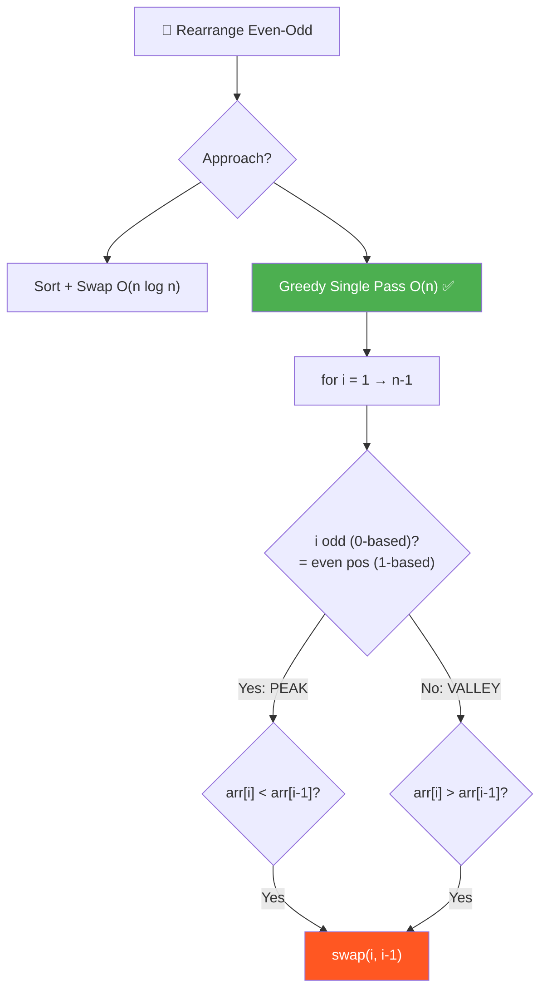
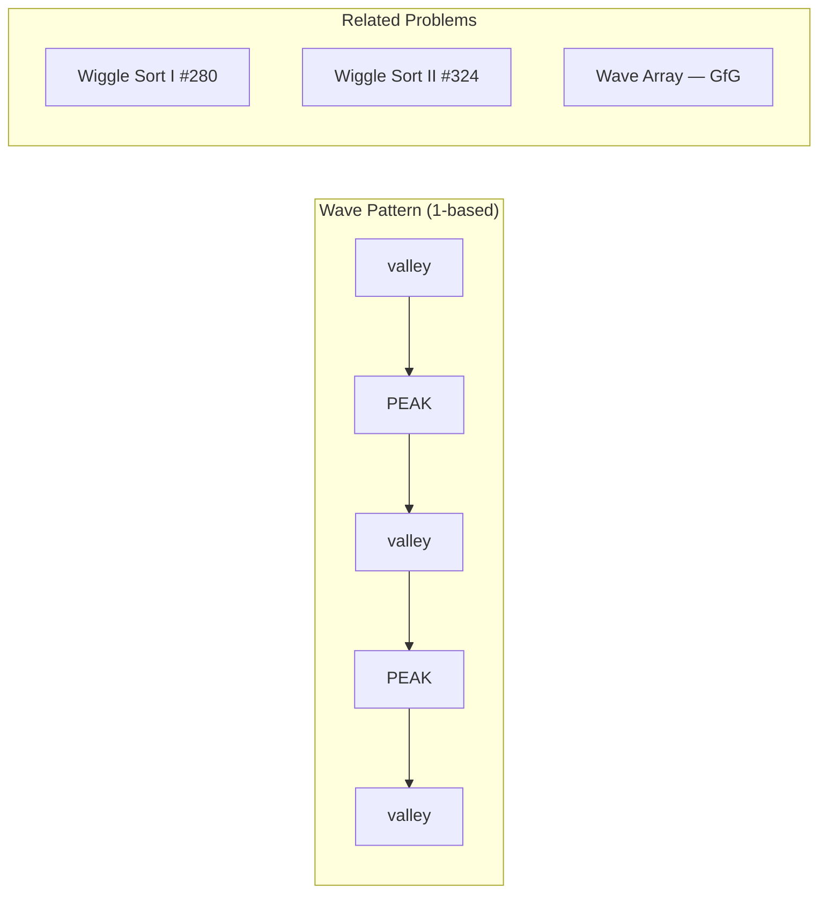
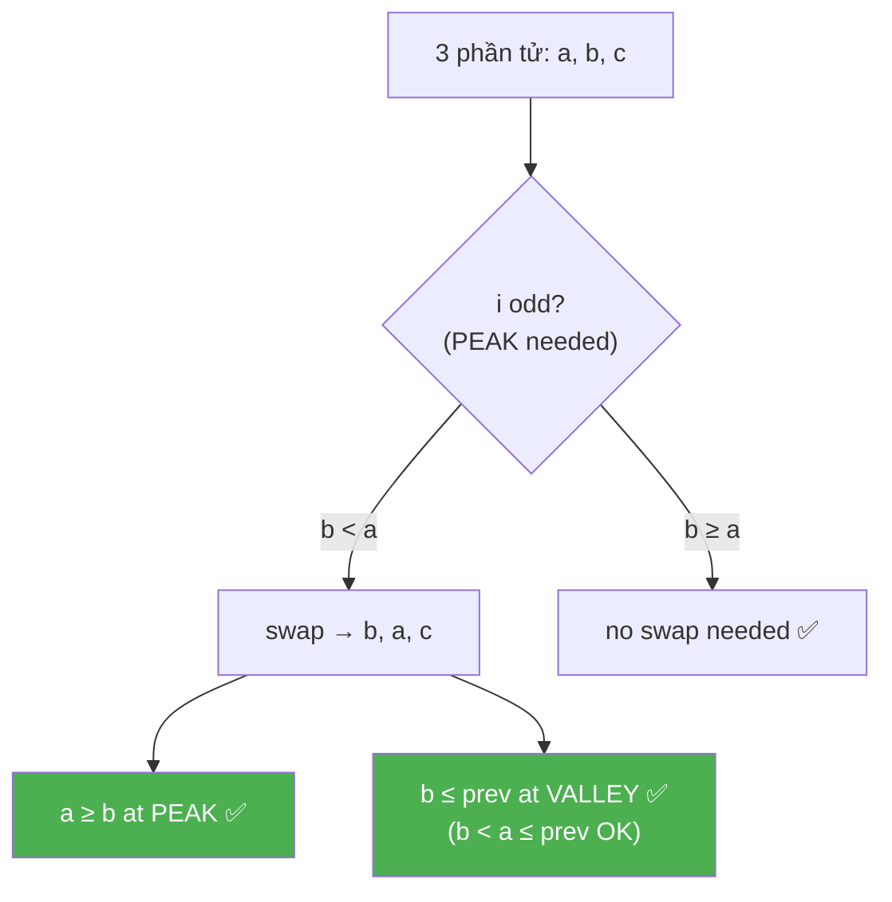
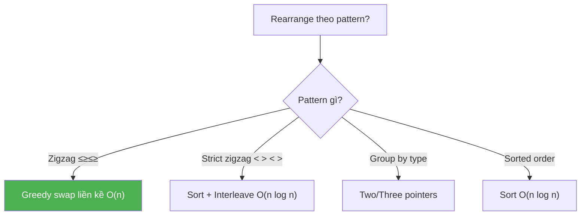
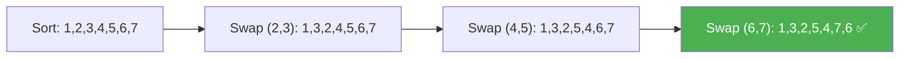

# 🔀 Rearrange Even-Odd Positions (Wave/Zigzag Sort) — GfG (Easy)

> 📖 Code: [Rearrange Even-Odd Positions.js](./Rearrange%20Even-Odd%20Positions.js)





---

## R — Repeat & Clarify

🧠 _"Zigzag pattern: ≤ ≥ ≤ ≥ ... Single pass O(n), swap khi vi phạm!"_

> 🎙️ _"Rearrange arr[] so that even-positioned elements (1-based) are >= their previous, and odd-positioned elements are <= their previous."_

### Clarification Questions

```
Q: Indexing 1-based hay 0-based?
A: 1-based! i=1 là vị trí đầu tiên.
   → 0-based: i=0 (odd pos), i=1 (even pos), i=2 (odd pos)...

Q: "Even position" = vị trí CHẴN (2, 4, 6...)?
A: Đúng! Vị trí 2, 4, 6... (1-based) → arr[i] >= arr[i-1]

Q: Có nhiều đáp án hợp lệ không?
A: CÓ! Bài yêu cầu TÌM 1 đáp án bất kỳ thỏa mãn.

Q: arr có thể có duplicate?
A: Có! [1, 2, 2, 1] → [1, 2, 1, 2] hợp lệ

Q: Mảng rỗng hoặc 1 phần tử?
A: Luôn hợp lệ (không có cặp nào cần kiểm tra)
```

### Tại sao bài này quan trọng?

```
  Bài này dạy PATTERN cực kỳ phổ biến:

  ┌──────────────────────────────────────────────────────────────┐
  │  ZIGZAG / WAVE pattern:                                      │
  │    arr[0] ≤ arr[1] ≥ arr[2] ≤ arr[3] ≥ arr[4] ...          │
  │                                                              │
  │  Xuất hiện trong:                                            │
  │  • Wiggle Sort I (#280) — chính bài này!                    │
  │  • Wiggle Sort II (#324) — strict inequality (HARD)         │
  │  • Wave Array (GfG) — biến thể: ≥ ≤ ≥ ≤                    │
  │  • Alternating positive/negative                             │
  │  • Peak-Valley problems                                      │
  │                                                              │
  │  KEY INSIGHT: Greedy fix-as-you-go = O(n)!                  │
  │  → Không cần sort, không cần extra space!                    │
  └──────────────────────────────────────────────────────────────┘
```

---

## 🧠 Bản chất bài toán — Hiểu để NHỚ, không chỉ để GIẢI

### Zigzag Pattern = "Chuỗi núi"

```
  Hình dung output như CHUỖI NÚI (peak-valley):

  arr = [1, 3, 2, 5, 4, 7, 6]

      3       5       7
     / \     / \     / \      ← PEAK tại vị trí CHẴN (1-based: 2,4,6)
    1   2   4   6              ← VALLEY tại vị trí LẺ (1-based: 1,3,5,7)
    
  Position (1-based): 1  2  3  4  5  6  7
  Pattern:            V  P  V  P  V  P  V
  Rule:               ≤  ≥  ≤  ≥  ≤  ≥

  📌 QUY TẮC:
    Vị trí CHẴN (1-based) = PEAK:    arr[i] ≥ arr[i-1]
    Vị trí LẺ (1-based)   = VALLEY:  arr[i] ≤ arr[i-1]
```

### Chuyển đổi 1-based → 0-based

```
  ⚠️ Đề bài dùng 1-based, code dùng 0-BASED!

  ┌──────────────────────────────────────────────────────────────┐
  │  1-based pos:  1    2    3    4    5    6    7               │
  │  0-based idx:  0    1    2    3    4    5    6               │
  │  Pattern:      V    P    V    P    V    P    V               │
  │                                                              │
  │  1-based EVEN (2,4,6) → 0-based ODD (1,3,5) → PEAK         │
  │  1-based ODD  (3,5,7) → 0-based EVEN (2,4,6) → VALLEY      │
  │                                                              │
  │  📌 Trong code (0-based):                                    │
  │    i odd  → PEAK:   arr[i] ≥ arr[i-1]                      │
  │    i even → VALLEY: arr[i] ≤ arr[i-1]                      │
  └──────────────────────────────────────────────────────────────┘

  ⚠️ Cẩn thận: "even position (1-based)" ≠ "even index (0-based)"!
     Đây là NGUỒN LỖI PHỔ BIẾN NHẤT!
```

### Tại sao Greedy hoạt động? — CHỨNG MINH

```
  🧠 Câu hỏi: "Swap tại vị trí i có PHÁ VỠ điều kiện ở i-1 không?"

  Xét 3 phần tử liên tiếp: a, b, c tại index i-1, i, i+1

  CASE 1: i odd (0-based) → PEAK: cần b ≥ a
    Nếu b < a → swap(a, b) → [b, a, c]
    
    Trước swap: ..., a, b, c    (b < a)
    Sau swap:   ..., b, a, c    (a > b → a ≥ b ✅ tại i)
    
    Liệu b ≤ prev(a) có bị phá?
    → Trước đó: prev ≤ a (vì index i-1 đã được xử lý)
    → b < a → b < a, và prev ≤ a
    → Nếu prev ≤ a → prev có thể > b? CÓ!
    
    Nhưng KHÔNG SAO vì: i-1 là VALLEY cần arr[i-1] ≤ arr[i-2]
    → Trước swap: a đang ở i-1, đã thỏa arr[i-1] ≤ arr[i-2]
    → Sau swap: b ở i-1, b < a ≤ arr[i-2] → VẪN THỎA! ✅

  CASE 2: i even (0-based) → VALLEY: cần c ≤ b
    Tương tự, swap(b, c) → b > c → điều kiện trước vẫn giữ.

  📌 KẾT LUẬN:
    "Swap 2 phần tử liền kề KHÔNG PHÁ VỠ điều kiện đã xử lý trước đó"
    → Vì phần tử NHỎ HƠN di chuyển về vị trí VALLEY → vẫn ≤ neighbor!
    → Phần tử LỚN HƠN di chuyển về vị trí PEAK → vẫn ≥ neighbor!
    → Greedy AN TOÀN duyệt từ trái → phải, fix từng violation!
```



### Hai cách nhìn bài toán

```
  CÁCH 1: Sort + Swap — "Sắp xếp rồi hoán vị"
  ┌──────────────────────────────────────────────────────────────┐
  │  1. Sort mảng tăng dần                                       │
  │  2. Swap từng cặp liền kề: (1,2), (3,4), (5,6), ...        │
  │                                                              │
  │  Sorted: [1, 2, 3, 4, 5, 6, 7]                              │
  │  Swap:   [1, 3, 2, 5, 4, 7, 6]                              │
  │           V  P  V  P  V  P  V  ✅                           │
  │                                                              │
  │  Time: O(n log n)    Space: O(1) ngoài sort                 │
  │  → Trực quan, dễ hiểu, nhưng CHẬM!                         │
  └──────────────────────────────────────────────────────────────┘

  CÁCH 2: Greedy Single Pass — "Fix violation khi gặp"
  ┌──────────────────────────────────────────────────────────────┐
  │  Duyệt i = 1 → n-1:                                         │
  │    Nếu i nên là PEAK nhưng arr[i] < arr[i-1] → swap!       │
  │    Nếu i nên là VALLEY nhưng arr[i] > arr[i-1] → swap!     │
  │                                                              │
  │  Time: O(n)    Space: O(1)                                   │
  │  → Tối ưu nhất! Không cần sort!                             │
  └──────────────────────────────────────────────────────────────┘

  📌 Sort + Swap dễ nhớ, Greedy tối ưu cho interview!
```

---

## 🧭 Luồng Suy Nghĩ — Từ đọc đề đến solution

> 💡 Phần này dạy bạn **CÁCH TƯ DUY** để tự giải bài, không chỉ biết đáp án.
> Mỗi bước đều có **lý do tại sao**, để bạn áp dụng cho bài khó hơn.

### Bước 1: Đọc đề → Gạch chân KEYWORDS

```
  Đề bài: "arr[i] >= arr[i-1] if i is even, arr[i] <= arr[i-1] if i is odd"

  Gạch chân:
    "arr[i] >= arr[i-1]"    → so sánh 2 PHẦN TỬ LIỀN KỀ
    "if i is even/odd"       → XOAY VẶN quy tắc theo vị trí
    "rearrange"              → SẮP XẾP LẠI, không phải tìm kiếm
    "1-based indexing"       → CẨN THẬN chuyển đổi!

  🧠 Tự hỏi: "Pattern gì?"
    → Even pos: ≥   Odd pos: ≤
    → Zigzag! ≤ ≥ ≤ ≥ ≤ ≥ ...
    → "Bài này giống Wiggle Sort!"

  📌 Kỹ năng chuyển giao:
    Khi thấy "xoay vặn quy tắc theo index":
    → i % 2 == 0 vs i % 2 != 0
    → Zigzag, Alternating, Wave patterns
```

### Bước 2: Phân tách bài toán — Vẽ pattern bằng tay

```
  arr = [1, 2, 2, 1]

  Viết ra quy tắc cho TỪNG vị trí (1-based):
    pos 1 (odd):  không có i-1, bỏ qua
    pos 2 (even): arr[2] ≥ arr[1] → phần tử 2 ≥ phần tử 1
    pos 3 (odd):  arr[3] ≤ arr[2] → phần tử 3 ≤ phần tử 2
    pos 4 (even): arr[4] ≥ arr[3] → phần tử 4 ≥ phần tử 3

  Pattern: _ ≥ ≤ ≥ ≤ ≥ ...
  → ZIGZAG! Đỉnh xen kẽ đáy!

  Thử output: [1, 2, 1, 2]
    pos 2: 2 ≥ 1 ✅
    pos 3: 1 ≤ 2 ✅  
    pos 4: 2 ≥ 1 ✅  → ĐÚNG!

  📌 Kỹ năng chuyển giao:
    LUÔN vẽ pattern trước khi code!
    → Thấy ≤ ≥ ≤ ≥ → nhận ra "Zigzag/Wave"
    → Có keyword → biết approach!
```

### Bước 3: Brute Force — "Sort rồi sắp xếp lại"

```
  🧠 Ý tưởng đầu tiên: "Sort rồi swap cặp liền kề"

  Tại sao sort trước?
    → Sau sort: a ≤ b ≤ c ≤ d ≤ e ≤ f
    → Swap cặp: (b,c) → a, c, b, d, e, f
    → Swap cặp: (d,e) → a, c, b, e, d, f
    → Result: a ≤ c ≥ b ≤ e ≥ d ≤ f ✅

  Ví dụ: [4, 7, 5, 6]
    Sort:  [4, 5, 6, 7]
    Swap (5,6): [4, 6, 5, 7]
    Check: 4≤6 ≥ 5≤7 ✅

  Time: O(n log n)    Space: O(1)

  📌 Kỹ năng chuyển giao:
    "Sort + post-process" = brute force PHỔ BIẾN!
    → Sort cho bạn "trật tự", rồi chỉnh sửa ít
    → Nhưng O(n log n) > O(n) → tìm cách tốt hơn!
```

### Bước 4: "Có cần sort không?" → Nhìn từng bước, fix LOCAL

```
  🧠 Quan sát: mỗi quy tắc chỉ kiểm tra 2 PHẦN TỬ LIỀN KỀ!
    → arr[i] vs arr[i-1] — CHỈ 2 phần tử!

  💡 Insight: nếu violation xảy ra → swap 2 phần tử đó!
    → Swap FIX violation tại i
    → Swap KHÔNG PHÁ violation tại i-1 (đã chứng minh ở trên!)

  → Chỉ cần duyệt 1 PASS, fix từng violation!
  → KHÔNG cần sort → O(n)!

  📌 Kỹ năng chuyển giao:
    ┌──────────────────────────────────────────────────────────────┐
    │  Khi constraint CHỈ liên quan PHẦN TỬ LIỀN KỀ:             │
    │    → GREEDY single pass thường hoạt động!                   │
    │    → Fix violation local = fix global!                      │
    │                                                              │
    │  Ví dụ CÙNG pattern:                                        │
    │    Wiggle Sort (#280):    ≤ ≥ ≤ ≥ → swap liền kề           │
    │    Sort Colors (#75):     0s, 1s, 2s → 3 pointers          │
    │    Candy (#135):          2 pass left→right + right→left   │
    └──────────────────────────────────────────────────────────────┘
```

### Bước 5: Tổng kết — Cây quyết định



```
  ⭐ QUY TẮC VÀNG:
    "Constraint chỉ liên quan LIỀN KỀ → Greedy fix local"
    "Pattern xoay vặn theo i → dùng i % 2"
    "Non-strict inequality (≤ ≥) → single pass swap đủ"
    "Strict inequality (< >) → cần sort trước (HARD!)"
```

---

## E — Examples

### Ví dụ minh họa trực quan

```
VÍ DỤ 1: arr = [1, 2, 2, 1]

  Input:   1  2  2  1
  Output:  1  2  1  2

  Verify (1-based):
    pos 2 (even): arr[2]=2 ≥ arr[1]=1 ✅
    pos 3 (odd):  arr[3]=1 ≤ arr[2]=2 ✅
    pos 4 (even): arr[4]=2 ≥ arr[3]=1 ✅

  Hình dung:
      2       2
     / \     / \
    1   1   1   ?
    → Zigzag ✅
```

```
VÍ DỤ 2: arr = [1, 3, 2]

  Input:   1  3  2
  Output:  1  3  2   (ĐÃ thỏa mãn, không cần thay đổi!)

    pos 2 (even): 3 ≥ 1 ✅
    pos 3 (odd):  2 ≤ 3 ✅
```

```
VÍ DỤ 3: arr = [4, 7, 5, 6]

  Sort + Swap approach:
    Sort:  [4, 5, 6, 7]
    Swap (5,6): [4, 6, 5, 7]
    Verify: 4≤6 ≥ 5≤7 ✅

  Greedy approach (0-based):
    i=1 (odd→PEAK): 7 ≥ 4 ✅ → no swap
    i=2 (even→VALLEY): 5 ≤ 7 ✅ → no swap
    i=3 (odd→PEAK): 6 ≥ 5 ✅ → no swap
    → Already valid! [4, 7, 5, 6] ✅
```

```
VÍ DỤ 4: arr = [1, 2, 3, 4, 5, 6, 7]

  Greedy (0-based):
    i=1 (PEAK): 2≥1 ✅
    i=2 (VALLEY): 3>2 ❌ → swap! [1, 3, 2, 4, 5, 6, 7]
    i=3 (PEAK): 4≥2 ✅
    i=4 (VALLEY): 5>4 ❌ → swap! [1, 3, 2, 5, 4, 6, 7]
    i=5 (PEAK): 6≥4 ✅
    i=6 (VALLEY): 7>6 ❌ → swap! [1, 3, 2, 5, 4, 7, 6]

  Result: [1, 3, 2, 5, 4, 7, 6]
      3       5       7
     / \     / \     / \
    1   2   4   6         ← Perfect zigzag!
```

### Trace CHI TIẾT — Greedy: arr = [7, 3, 5, 1, 9, 2]

```
  ┌──────────────────────────────────────────────────────────────────┐
  │ i=1 (odd→PEAK): arr[1]=3 < arr[0]=7?                           │
  │   3 < 7 → YES! Violation! → swap(0,1)                          │
  │   arr = [3, 7, 5, 1, 9, 2]                                     │
  │          V  P                                                    │
  │          3≤7 ✅                                                  │
  ├──────────────────────────────────────────────────────────────────┤
  │ i=2 (even→VALLEY): arr[2]=5 > arr[1]=7?                        │
  │   5 > 7? NO → no swap                                           │
  │   arr = [3, 7, 5, 1, 9, 2]                                     │
  │             P≥V ✅ (7≥5)                                        │
  ├──────────────────────────────────────────────────────────────────┤
  │ i=3 (odd→PEAK): arr[3]=1 < arr[2]=5?                           │
  │   1 < 5 → YES! Violation! → swap(2,3)                          │
  │   arr = [3, 7, 1, 5, 9, 2]                                     │
  │                V  P                                              │
  │                1≤5 ✅                                            │
  │   🧠 Check i=2: arr[2]=1 ≤ arr[1]=7? YES ✅ (không phá!)      │
  ├──────────────────────────────────────────────────────────────────┤
  │ i=4 (even→VALLEY): arr[4]=9 > arr[3]=5?                        │
  │   9 > 5 → YES! Violation! → swap(3,4)                          │
  │   arr = [3, 7, 1, 9, 5, 2]                                     │
  │                   P≥V ✅ (9≥5)                                  │
  │   🧠 Check i=3: arr[3]=9 ≥ arr[2]=1? YES ✅ (không phá!)      │
  ├──────────────────────────────────────────────────────────────────┤
  │ i=5 (odd→PEAK): arr[5]=2 < arr[4]=5?                           │
  │   2 < 5 → YES! Violation! → swap(4,5)                          │
  │   arr = [3, 7, 1, 9, 2, 5]                                     │
  │                      V  P                                        │
  │                      2≤5 ✅                                      │
  │   🧠 Check i=4: arr[4]=2 ≤ arr[3]=9? YES ✅ (không phá!)      │
  └──────────────────────────────────────────────────────────────────┘

  Final: [3, 7, 1, 9, 2, 5]

  Verify:
      7       9       5
     / \     / \     /
    3   1   2   
    → 3≤7 ≥ 1≤9 ≥ 2≤5 ✅
```

---

## A — Approach

### Approach 1: Sort + Swap Adjacent Pairs — O(n log n)

```
  ┌──────────────────────────────────────────────────────────────┐
  │  1. Sort mảng tăng dần                                       │
  │  2. Swap cặp liền kề tại index (1,2), (3,4), (5,6), ...    │
  │     → Bắt đầu từ index 1, bước nhảy 2                       │
  │                                                              │
  │  Tại sao đúng?                                               │
  │    Sort: a ≤ b ≤ c ≤ d ≤ e ≤ f                              │
  │    Swap (b,c): a ≤ c ≥ b (vì c ≥ b từ sort)                │
  │    Swap (d,e): b ≤ e ≥ d (vì b ≤ c ≤ d ≤ e)               │
  │    → Zigzag tự nhiên hình thành!                             │
  │                                                              │
  │  Time: O(n log n)    Space: O(1) ngoài sort                 │
  └──────────────────────────────────────────────────────────────┘
```



### Approach 2: Greedy Single Pass — O(n) ✅

```
  💡 KEY INSIGHT: Chỉ cần fix từng violation local!

  ┌──────────────────────────────────────────────────────────────┐
  │  for i = 1 → n-1:                                           │
  │    if i is ODD (0-based) → PEAK needed:                     │
  │      if arr[i] < arr[i-1]: swap(i, i-1)                    │
  │    if i is EVEN (0-based) → VALLEY needed:                  │
  │      if arr[i] > arr[i-1]: swap(i, i-1)                    │
  │                                                              │
  │  Time: O(n)    Space: O(1)                                   │
  │  → Tối ưu nhất! Single pass, in-place!                      │
  └──────────────────────────────────────────────────────────────┘

  🧠 Tại sao chỉ cần 1 pass?
    → Mỗi swap FIX violation tại i
    → Swap KHÔNG PHÁ violation tại i-1 (đã chứng minh!)
    → Duyệt trái → phải, mỗi vị trí chỉ xử lý 1 lần!

  📌 Cách nhớ:
    "i odd (0-based) = PEAK → arr[i] PHẢI LỚN → nếu nhỏ thì swap LÊN"
    "i even (0-based) = VALLEY → arr[i] PHẢI NHỎ → nếu lớn thì swap XUỐNG"
```

---

## C — Code

### Solution 1: Sort + Swap — O(n log n)

```javascript
function rearrangeSort(arr) {
  const result = [...arr];
  result.sort((a, b) => a - b);

  // Swap adjacent pairs: (1,2), (3,4), (5,6), ...
  for (let i = 1; i < result.length - 1; i += 2) {
    [result[i], result[i + 1]] = [result[i + 1], result[i]];
  }

  return result;
}
```

```
  📝 Line-by-line:

  Line 3: result.sort((a, b) => a - b)
    → Sort tăng dần
    → ⚠️ PHẢI dùng comparator! JS sort() mặc định sort STRING!
       [10, 2, 1].sort() → [1, 10, 2] ← SAI!

  Line 6: for (let i = 1; i < result.length - 1; i += 2)
    → Bắt đầu từ index 1 (phần tử thứ 2)
    → Bước nhảy 2: swap cặp (1,2), (3,4), (5,6)...
    
    ⚠️ Tại sao i < length - 1 (KHÔNG PHẢI i < length)?
       → Cần arr[i+1] tồn tại để swap!
       → Nếu n lẻ: phần tử cuối không swap → tự nhiên là VALLEY ✅

  Line 7: [result[i], result[i + 1]] = [result[i + 1], result[i]]
    → Destructuring swap — JS idiomatic!
    → Phần tử LỚN HƠN về PEAK (i), nhỏ hơn về VALLEY (i+1)
```

### Solution 2: Greedy Single Pass — O(n) ✅

```javascript
function rearrangeGreedy(arr) {
  const result = [...arr];
  const n = result.length;

  for (let i = 1; i < n; i++) {
    if (i % 2 !== 0) {
      // i odd (0-based) = even pos (1-based) → PEAK
      if (result[i] < result[i - 1]) {
        [result[i], result[i - 1]] = [result[i - 1], result[i]];
      }
    } else {
      // i even (0-based) = odd pos (1-based) → VALLEY
      if (result[i] > result[i - 1]) {
        [result[i], result[i - 1]] = [result[i - 1], result[i]];
      }
    }
  }

  return result;
}
```

```
  📝 Line-by-line:

  Line 5: for (let i = 1; i < n; i++)
    → Bắt đầu từ 1 (cần arr[i-1])
    → Duyệt MỌI index, KHÔNG nhảy 2!

  Line 6: if (i % 2 !== 0)
    → i odd (0-based) = even position (1-based) = PEAK
    
    ⚠️ CẢNH BÁO: đề nói "even position" (1-based)
       = index ODD trong code (0-based)!
       → Nếu nhầm → output NGƯỢC hoàn toàn!

  Line 8: if (result[i] < result[i - 1])
    → PEAK cần arr[i] ≥ arr[i-1]
    → Nếu arr[i] < arr[i-1] → vi phạm → SWAP!

  Line 13: if (result[i] > result[i - 1])
    → VALLEY cần arr[i] ≤ arr[i-1]
    → Nếu arr[i] > arr[i-1] → vi phạm → SWAP!

  🧠 Cách viết GỌN hơn (1 dòng condition):
    if ((i % 2 !== 0 && result[i] < result[i-1]) ||
        (i % 2 === 0 && result[i] > result[i-1]))
      swap(i, i-1);
    
    → Nhưng code TÁCH RÕ dễ đọc hơn cho interview!
```

---

## ❌ Common Mistakes — Lỗi thường gặp

### Mistake 1: Nhầm 1-based và 0-based

```javascript
// ❌ SAI: nghĩ "even position" = "even index"
if (i % 2 === 0) {
  // PEAK?  ← SAI! Even INDEX = ODD POSITION = VALLEY!
}

// ✅ ĐÚNG: even POSITION (1-based) = odd INDEX (0-based)
if (i % 2 !== 0) {
  // PEAK! (i=1,3,5 trong 0-based = position 2,4,6 trong 1-based)
}
```

```
  ⚠️ ĐÂY LÀ LỖI PHỔ BIẾN NHẤT!

  Cách tránh: VIẾT COMMENT rõ ràng!
    // i odd (0-based) = even position (1-based) = PEAK
    // i even (0-based) = odd position (1-based) = VALLEY
```

### Mistake 2: Sort + Swap — sai range swap

```javascript
// ❌ SAI: swap cặp (0,1), (2,3), (4,5) → bắt đầu từ i=0!
for (let i = 0; i < n - 1; i += 2) {
  [arr[i], arr[i+1]] = [arr[i+1], arr[i]];
}
// Sorted [1,2,3,4] → swap (1,2),(3,4) → [2,1,4,3]
// Check: 2≥1 ✅ nhưng 4>1 ❌ (pos 3 cần ≤)

// ✅ ĐÚNG: swap cặp (1,2), (3,4) → bắt đầu từ i=1!
for (let i = 1; i < n - 1; i += 2) {
  [arr[i], arr[i+1]] = [arr[i+1], arr[i]];
}
// Sorted [1,2,3,4] → swap (2,3) → [1,3,2,4]
// Check: 1≤3 ≥ 2≤4 ✅
```

### Mistake 3: Greedy — so sánh sai hướng

```javascript
// ❌ SAI: PEAK cần ≥ nhưng check ngược!
if (i % 2 !== 0) {
  if (result[i] > result[i - 1]) swap; // Swap khi ĐÃ ĐÚNG!
}

// ✅ ĐÚNG: PEAK cần arr[i] ≥ arr[i-1], swap khi arr[i] < arr[i-1]
if (i % 2 !== 0) {
  if (result[i] < result[i - 1]) swap; // Swap khi VI PHẠM!
}
```

### Mistake 4: JS sort() không có comparator

```javascript
// ❌ SAI: sort() mặc định sort theo STRING!
[10, 2, 1, 20].sort() // → [1, 10, 2, 20] ← SAI!

// ✅ ĐÚNG: luôn dùng comparator cho số!
[10, 2, 1, 20].sort((a, b) => a - b) // → [1, 2, 10, 20]
```

### Mistake 5: Quên copy mảng — mutate input

```javascript
// ❌ SAI: sửa trực tiếp mảng input!
function rearrange(arr) {
  arr.sort((a, b) => a - b); // ← mutate arr!
  // ...
}

// ✅ ĐÚNG: copy trước!
function rearrange(arr) {
  const result = [...arr]; // copy!
  result.sort((a, b) => a - b);
  // ...
}
```

---

## O — Optimize

```
                      Time         Space     Ghi chú
  ─────────────────────────────────────────────────────────────
  Sort + Swap         O(n log n)   O(1)*     *ngoài sort
  Greedy ✅           O(n)         O(1)      Single pass!

  📌 Greedy THẮNG tuyệt đối:
    → 1 pass, O(1) space, O(n) time
    → Không thể tốt hơn! (phải đọc mỗi phần tử ít nhất 1 lần)
```

### So sánh chi tiết

```
  ┌──────────────────────────────────────────────────────────────┐
  │  Tiêu chí           Sort + Swap         Greedy              │
  ├──────────────────────────────────────────────────────────────┤
  │  Time               O(n log n)          O(n) ✅            │
  │  Space              O(1)                O(1) (tie)          │
  │  Dễ hiểu            ✅ trực quan       ⚠️ cần chứng minh │
  │  Dễ code            ✅ 5 dòng          ✅ 8 dòng          │
  │  Stability          ✅ deterministic    ⚠️ result phụ thuộc│
  │                                           vào input order   │
  │  Mở rộng #324       ❌ cần median       ❌ không đủ        │
  │  Interview          ✅ nêu trước        ✅ nêu sau optimize│
  └──────────────────────────────────────────────────────────────┘
```

---

## T — Test

```
Test Cases:
  [1,2,2,1]         → valid ✅  Có duplicate
  [1,3,2]           → valid ✅  Đã đúng sẵn
  [4,7,5,6]         → valid ✅  4 phần tử
  [1,2,3,4,5,6,7]   → valid ✅  Sorted ascending
  [5]               → valid ✅  Single element
  [3,1]             → valid ✅  2 phần tử
  [1,1,1,1]         → valid ✅  Tất cả giống nhau
  [7,3,5,1,9,2]     → valid ✅  Random order
```

### Edge Cases giải thích

```
  ┌──────────────────────────────────────────────────────────────┐
  │  Mảng rỗng/1:     Không có cặp → luôn valid               │
  │                                                              │
  │  2 phần tử:       [a, b] → cần b ≥ a (even pos)           │
  │                    → sort hoặc swap nếu a > b               │
  │                                                              │
  │  Tất cả giống:    [x,x,x,x] → mọi ≤ và ≥ đều thỏa        │
  │                    → Luôn valid, không cần swap!             │
  │                                                              │
  │  Đã sorted:       [1,2,3,4,5] → Greedy swap ở VALLEY       │
  │                    → [1,3,2,5,4] hoặc tương đương           │
  │                                                              │
  │  Reverse sorted:  [5,4,3,2,1] → Greedy swap ở PEAK         │
  │                    → [4,5,2,3,1] hoặc tương đương           │
  └──────────────────────────────────────────────────────────────┘
```

---

## 🗣️ Interview Script

### 🎙️ Think Out Loud — Mô phỏng phỏng vấn thực

```
  ──────────────── PHASE 1: Clarify ────────────────

  👤 Interviewer: "Rearrange the array so even-positioned elements 
                   are greater than odd-positioned (1-based)."

  🧑 You: "So I need a zigzag pattern: positions alternate between
   being a peak (≥ previous) and valley (≤ previous).
   Let me clarify:
   1. 1-based indexing — position 2,4,6... are peaks
   2. Non-strict inequalities (≥, ≤) — duplicates OK
   3. Any valid rearrangement, not unique answer required
   4. In-place modification preferred?"

  ──────────────── PHASE 2: Brute Force ────────────────

  🧑 You: "My first approach: sort the array, then swap adjacent
   pairs starting from index 1. After sorting, arr[i] ≤ arr[i+1],
   so swapping makes arr[i] ≥ arr[i+1] — creating peaks.
   
   This is O(n log n) due to sorting. Can I do better?"

  ──────────────── PHASE 3: Optimize → Greedy ────────────────

  🧑 You: "I notice each constraint only involves adjacent elements.
   So I can do a single pass: at each position, if the zigzag
   condition is violated, I swap with the previous element.

   The key insight is that this swap never breaks the already-fixed
   condition at the previous position. If position i needs to be
   a peak but arr[i] < arr[i-1], swapping makes the smaller value
   go to position i-1 (a valley), which is still ≤ its predecessor.

   This gives O(n) time, O(1) space — optimal!"

  ──────────────── PHASE 4: Follow-up ────────────────

  👤 Interviewer: "What if the inequality is STRICT? (< > < >)"

  🧑 You: "That's Wiggle Sort II (#324), a Hard problem!
   Simple swapping doesn't work because equal elements break
   strict inequality. The approach is:
   1. Find the median in O(n) using QuickSelect
   2. Place elements > median at odd indices
   3. Place elements < median at even indices
   4. Handle elements = median carefully
   
   This requires O(n) time but is significantly more complex."
```

### Pattern & Liên kết

```
  ZIGZAG/WAVE pattern family:

  ┌──────────────────────────────────────────────────────────────┐
  │  Wiggle Sort I (#280) / Wave Array — BÀI NÀY:              │
  │    → Non-strict: ≤ ≥ ≤ ≥                                    │
  │    → Greedy single pass O(n) ✅                             │
  │                                                              │
  │  Wiggle Sort II (#324) — HARD:                               │
  │    → Strict: < > < >                                         │
  │    → Sort + 3-way interleave hoặc Median + Index mapping    │
  │                                                              │
  │  Sort Colors (#75):                                          │
  │    → Rearrange 0s, 1s, 2s                                    │
  │    → Dutch National Flag, 3 pointers O(n)                   │
  │                                                              │
  │  Alternating Positive/Negative:                              │
  │    → Rearrange [+, -, +, -, ...]                            │
  │    → Two queues hoặc modify zigzag approach                  │
  └──────────────────────────────────────────────────────────────┘

  📌 PATTERN CHUNG: "Rearrange theo quy tắc xen kẽ"
     → Nếu non-strict → Greedy swap O(n)
     → Nếu strict → Sort + interleave O(n log n)
     → Nếu multi-type → Multi-pointer O(n)
```

### Skeleton code — Zigzag pattern template

```javascript
// TEMPLATE: Rearrange zigzag ≤ ≥ ≤ ≥
function zigzagSort(arr) {
  for (let i = 1; i < arr.length; i++) {
    const shouldBePeak = (i % 2 !== 0); // adjust based on problem
    
    if (shouldBePeak && arr[i] < arr[i - 1]) {
      [arr[i], arr[i - 1]] = [arr[i - 1], arr[i]];
    }
    if (!shouldBePeak && arr[i] > arr[i - 1]) {
      [arr[i], arr[i - 1]] = [arr[i - 1], arr[i]];
    }
  }
  return arr;
}

// Biến thể: Wave Array (≥ ≤ ≥ ≤) — đảo shouldBePeak!
// Biến thể: Start with peak — thay (i % 2 !== 0) bằng (i % 2 === 0)
```
