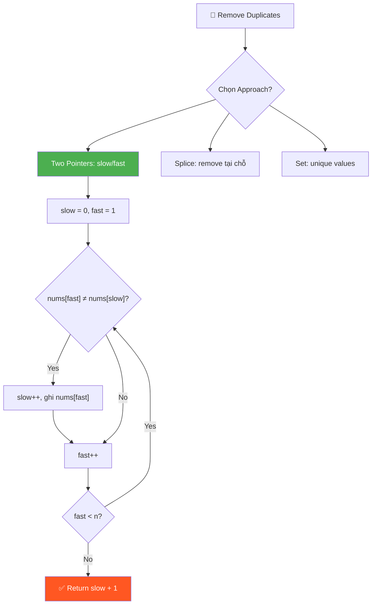
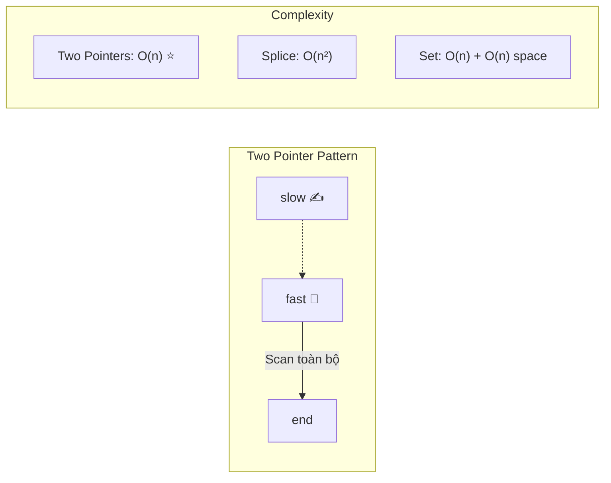

# 🧹 Remove Duplicates from Sorted Array — LeetCode #26 (Easy)

> 📖 Code: [Remove Duplicates from Sorted Array.js](./Remove%20Duplicates%20from%20Sorted%20Array.js)





---

## R — Repeat & Clarify

🧠 *"Sorted array → duplicates NẰM KỀ NHAU. Chỉ cần so sánh liền kề. Xóa in-place, return số lượng unique."*

> 🎙️ *"Given a sorted integer array, remove duplicates in-place so each element appears only once. Return the number of unique elements k. The first k elements of the array should contain the unique elements in the original order."*

### Clarification Questions

```
Q: Mảng đã sorted chưa?
A: ĐÃ SORTED — ascending! → Duplicates LUÔN nằm kề nhau!

Q: "In-place" nghĩa là gì?
A: KHÔNG tạo mảng mới! Sửa trực tiếp trên mảng gốc.
   → Space O(1) — chỉ dùng biến phụ!

Q: Return gì?
A: Return k = số phần tử UNIQUE
   → k phần tử đầu tiên của nums = các giá trị unique

Q: Mảng rỗng?
A: Return 0

Q: Tất cả giống nhau? [1, 1, 1, 1]
A: Return 1, nums[0] = 1

Q: Không có duplicate? [1, 2, 3]
A: Return 3, mảng giữ nguyên
```

### Tại sao bài này quan trọng?

```
  Đây là bài KINH ĐIỂN về TWO POINTERS (Cùng hướng):
    → Foundation cho: Fast & Slow pointer pattern
    → Hiểu IN-PLACE modification (không cần extra space)
    → Key insight: SORTED → duplicates liền kề → chỉ cần so sánh kề

  🔑 NHẬN DẠNG: Bất cứ khi nào thấy cụm từ:
    "sorted" + "remove duplicates" + "in-place"
    → TWO POINTERS (slow/fast)!

  Pattern liên quan:
    → Remove Element (#27)
    → Move Zeroes (#283)
    → Remove Duplicates II (#80) — cho phép 2 lần
```

---

## E — Examples

```
VÍ DỤ 1:
  Input:  nums = [1, 1, 2]
  Output: k = 2, nums = [1, 2, _]

  Minh họa chi tiết:
     Index:   0     1     2
     Value:   1     1     2
              ↑s    ↑f
              unique  dup   new!

  Quá trình:
    → nums[1] === nums[0] (1 === 1) → duplicate → BỎ QUA
    → nums[2] !== nums[0] (2 !== 1) → MỚI → slow++, ghi vào!
    → k = slow + 1 = 2

  Kết quả: nums = [1, 2, _]  (phần _ không quan trọng)

VÍ DỤ 2:
  Input:  nums = [0, 0, 1, 1, 1, 2, 2, 3, 3, 4]
  Output: k = 5, nums = [0, 1, 2, 3, 4, _, _, _, _, _]

  Quá trình:
    slow=0, fast duyệt từ 1 → 9
    Mỗi khi tìm giá trị MỚI → slow++, ghi lại
      fast=1: 0===0 → skip
      fast=2: 1!==0 → slow=1, nums[1]=1
      fast=3: 1===1 → skip
      fast=4: 1===1 → skip
      fast=5: 2!==1 → slow=2, nums[2]=2
      fast=6: 2===2 → skip
      fast=7: 3!==2 → slow=3, nums[3]=3
      fast=8: 3===3 → skip
      fast=9: 4!==3 → slow=4, nums[4]=4

    k = slow + 1 = 5
```

### Edge Cases — PHẢI nhớ!

```
VÍ DỤ 3 (1 phần tử):
  Input:  [1]
  Output: k = 1, nums = [1]
  → Chỉ có 1 phần tử → luôn unique!

VÍ DỤ 4 (tất cả giống nhau):
  Input:  [2, 2, 2, 2, 2]
  Output: k = 1, nums = [2, _, _, _, _]
  → fast chạy hết mà KHÔNG BAO GIỜ gặp giá trị mới
  → slow vẫn = 0 → k = 1

VÍ DỤ 5 (không duplicate):
  Input:  [1, 2, 3, 4, 5]
  Output: k = 5, nums = [1, 2, 3, 4, 5]
  → Mỗi phần tử đều khác trước → slow++ mỗi lần
  → Mảng giữ nguyên!

VÍ DỤ 6 (rỗng):
  Input:  []
  Output: k = 0
  → Early return!

VÍ DỤ 7 (negative numbers):
  Input:  [-3, -1, -1, 0, 0, 2]
  Output: k = 4, nums = [-3, -1, 0, 2, _, _]
  → Sorted bao gồm cả âm! Logic vẫn giống!
```

---

## A — Approach

### 💡 Key Insight: Sorted → Duplicates nằm kề nhau!

```
  Vì mảng ĐÃ SORTED (tăng dần):
    [1, 1, 2, 2, 3]
     ↑  ↑        ← duplicates NẰM KỀ NHAU!

  → KHÔNG cần HashMap / Set để check duplicate!
  → CHỈ CẦN so sánh phần tử HIỆN TẠI với phần tử TRƯỚC ĐÓ!

  Nếu CHƯA sorted: [3, 1, 2, 1, 3]
    → Phải dùng Set/HashMap → O(n) space
    → Hoặc sort trước → O(n log n) time
```

### Approach 1: Two Pointers (Tối ưu nhất ⭐) — 2 biến thể

```
💡 Ý tưởng chung: 2 con trỏ chạy CÙNG HƯỚNG
  → 1 con trỏ GHI (write) + 1 con trỏ ĐỌC (read)
  → Có 2 cách so sánh KHÁC NHAU nhưng KẾT QUẢ GIỐNG NHAU:

  ╔══════════════════════════════════════════════════════════════╗
  ║  Biến thể A (LeetCode style):                              ║
  ║    So sánh: nums[fast] vs nums[slow]                       ║
  ║    → So sánh với phần tử unique CUỐI CÙNG                  ║
  ║    → Return: slow + 1                                      ║
  ║                                                            ║
  ║  Biến thể B (GfG style):                                   ║
  ║    So sánh: arr[i] vs arr[i - 1]                           ║
  ║    → So sánh với phần tử LIỀN TRƯỚC trong mảng gốc         ║
  ║    → Return: idx                                           ║
  ╚══════════════════════════════════════════════════════════════╝

  Tại sao cả 2 đều ĐÚNG?
    → Vì mảng ĐÃ SORTED → duplicates LIỀN KỀ
    → arr[i] !== arr[i-1] ⟺ "gặp giá trị MỚI"
    → nums[fast] !== nums[slow] ⟺ "gặp giá trị MỚI"
    → Cả 2 condition ĐỀU phát hiện cùng 1 thứ!
```

#### Biến thể A: slow/fast — So sánh với unique cuối cùng

```
  slow = "con trỏ GHI" → đánh dấu vị trí cuối cùng của unique zone
  fast = "con trỏ ĐỌC" → quét toàn bộ mảng tìm giá trị mới

  QUY TẮC:
    Nếu nums[fast] === nums[slow] → DUPLICATE → fast++ (bỏ qua)
    Nếu nums[fast] !== nums[slow] → MỚI! → slow++, ghi nums[fast] vào

  Hình dung:
    [1, 1, 2, 2, 3]
     ↑s ↑f              fast=1: 1===1 → skip
     ↑s    ↑f           fast=2: 2!==1 → slow++, ghi
        ↑s    ↑f        fast=3: 2===2 → skip
        ↑s       ↑f     fast=4: 3!==2 → slow++, ghi
           ↑s       ↑f  fast=5: done!

    Kết quả: [1, 2, 3, _, _]  k = slow + 1 = 3
              └──────┘ unique zone
```

#### Biến thể B: idx/i — So sánh liền kề (GfG style)

```
  idx = "con trỏ GHI" → vị trí TIẾP THEO sẽ ghi (bắt đầu = 1)
  i   = "con trỏ ĐỌC" → quét toàn bộ mảng

  QUY TẮC:
    Nếu arr[i] === arr[i - 1] → DUPLICATE → i++ (bỏ qua)
    Nếu arr[i] !== arr[i - 1] → MỚI! → ghi arr[i] vào arr[idx], idx++

  Hình dung:
    [1, 1, 2, 2, 3]
        ↑idx               idx=1
        ↑i              i=1: arr[1]=1 vs arr[0]=1 → skip
           ↑i           i=2: arr[2]=2 vs arr[1]=1 → NEW! ghi, idx=2
              ↑i        i=3: arr[3]=2 vs arr[2]=2 → skip
                 ↑i     i=4: arr[4]=3 vs arr[3]=2 → NEW! ghi, idx=3

    Kết quả: [1, 2, 3, _, _]  k = idx = 3
              └──────┘ unique zone

  🔑 KHÁC BIỆT QUAN TRỌNG:
    Biến thể A: slow bắt đầu ở 0, return slow + 1
    Biến thể B: idx bắt đầu ở 1, return idx  (gọn hơn!)

    Biến thể A: so sánh nums[fast] vs nums[slow]  (unique cuối)
    Biến thể B: so sánh arr[i] vs arr[i-1]         (liền kề gốc)

  ⚠️ Khi nào biến thể B KHÁC biến thể A?
    → Khi mảng CHƯA sorted! Biến thể B sẽ SAI!
    → Vì arr[i-1] có thể đã bị GHI ĐÈ bởi giá trị mới
    → Nhưng với sorted array → cả 2 luôn cho kết quả GIỐNG NHAU
```

### Approach 2: Splice — Xóa duplicate tại chỗ

```
💡 Ý tưởng: Duyệt mảng, nếu arr[i] === arr[i+1] → splice(i+1, 1)

  ⚠️ VẤN ĐỀ: splice dịch TOÀN BỘ phần tử phía sau → O(n) cho MỖI xóa!
    → Worst case: [1, 1, 1, ..., 1] (n phần tử giống) → O(n²)!

  ⚠️ TRAP: Sau khi splice, index bị dịch!
    → Phải i-- để check lại vị trí hiện tại!

  Ví dụ: [1, 1, 1, 2]
    i=0: nums[0]===nums[1]? 1===1 → splice(1,1) → [1, 1, 2] → i--
    i=0: nums[0]===nums[1]? 1===1 → splice(1,1) → [1, 2] → i--
    i=0: nums[0]===nums[1]? 1===2 → NO → i++
    i=1: done → k = 2
```

### Approach 3: Set (Không in-place — chỉ tham khảo)

```
💡 Ý tưởng: Dùng Set để lọc unique, rồi ghi lại vào mảng

  const unique = [...new Set(nums)];

  ⚠️ KHÔNG thỏa mãn yêu cầu "in-place" → dùng O(n) extra space
  ⚠️ Interview: Interviewer sẽ KHÔNG chấp nhận! Nhưng có thể mention
      để show rằng bạn biết nhiều cách.
```

### So sánh 3 approaches

```
                 Time      Space     In-place?   Interview?
  ─────────────────────────────────────────────────────────────
  Two Pointers   O(n)      O(1)      ✅ Yes      ✅ Best! ⭐
  Splice         O(n²)     O(1)      ✅ Yes      ❌ Too slow
  Set            O(n)      O(n)      ❌ No       ❌ Not in-place
```

---

## C — Code

### Solution 1a: Two Pointers — slow/fast (LeetCode style ⭐)

```javascript
function removeDuplicates(nums) {
  if (nums.length === 0) return 0;

  let slow = 0; // Con trỏ ghi — vị trí unique cuối cùng

  for (let fast = 1; fast < nums.length; fast++) {
    if (nums[fast] !== nums[slow]) {
      slow++;                  // Mở rộng unique zone
      nums[slow] = nums[fast]; // Ghi giá trị mới
    }
  }
  return slow + 1; // Số phần tử unique
}
```

### Solution 1b: Two Pointers — idx/i (GfG style ⭐)

```javascript
function removeDuplicates(arr) {
  const n = arr.length;
  if (n <= 1) return n;

  let idx = 1; // Vị trí ghi TIẾP THEO (phần tử 0 đã unique)

  for (let i = 1; i < n; i++) {
    if (arr[i] !== arr[i - 1]) {  // So sánh LIỀN KỀ!
      arr[idx++] = arr[i];        // Ghi + tăng idx (post-increment)
    }
  }
  return idx; // idx chính là số lượng unique
}
```

### So sánh 2 biến thể Two Pointers

```
  ┌──────────────────┬──────────────────────┬──────────────────────┐
  │                  │  1a: slow/fast       │  1b: idx/i           │
  ├──────────────────┼──────────────────────┼──────────────────────┤
  │  So sánh         │  nums[fast] vs       │  arr[i] vs           │
  │                  │  nums[slow]          │  arr[i - 1]          │
  │  Nghĩa           │  vs unique CUỐI      │  vs phần tử TRƯỚC    │
  │  Write pointer   │  slow (bắt đầu = 0)  │  idx (bắt đầu = 1)  │
  │  Cách ghi        │  slow++ rồi ghi      │  arr[idx++] = ...    │
  │  Return          │  slow + 1            │  idx                 │
  │  Early return    │  length === 0        │  n <= 1              │
  └──────────────────┴──────────────────────┴──────────────────────┘

  🔑 Điểm khác biệt CỐT LÕI:
    1a: slow luôn TRỎ ĐẾN phần tử unique cuối → return slow + 1
    1b: idx luôn trỏ đến VỊ TRÍ SẼ GHI tiếp → return idx (gọn hơn!)

  🧠 Post-increment trick: arr[idx++] = arr[i]
    → Tương đương: arr[idx] = arr[i]; idx++;
    → Ghi giá trị VÀ tăng idx trong 1 dòng!
    → Cách 1a phải tách: slow++ rồi nums[slow] = nums[fast]

  ⚠️ Cả 2 đều O(n) time, O(1) space — HOÀN TOÀN tương đương!
     Chọn cách nào quen tay hơn khi interview.
```

### Giải thích từng dòng (1a: slow/fast)

```
  if (nums.length === 0) return 0;
    → Edge case: mảng rỗng → 0 unique elements

  let slow = 0;
    → Phần tử đầu tiên LUÔN unique
    → slow = "biên phải" của unique zone

  for (let fast = 1; ...)
    → Bắt đầu từ 1 vì phần tử 0 đã được tính

  if (nums[fast] !== nums[slow])
    → So sánh giá trị HIỆN TẠI (fast) với giá trị unique CUỐI (slow)
    → Khác nhau = TÌM THẤY giá trị mới!

  slow++;
    → Mở rộng unique zone thêm 1 slot

  nums[slow] = nums[fast];
    → GHI giá trị mới vào vị trí tiếp theo của unique zone
    → ⚠️ PHẢI slow++ TRƯỚC rồi mới ghi!

  return slow + 1;
    → slow là INDEX cuối cùng (0-indexed)
    → Số lượng = index + 1
```

### Giải thích từng dòng (1b: idx/i)

```
  if (n <= 1) return n;
    → Mảng rỗng (0) hoặc 1 phần tử → return luôn!
    → GỌN hơn 1a: handle cả 2 edge case trong 1 dòng

  let idx = 1;
    → idx = 1 vì phần tử đầu tiên (index 0) ĐÃ UNIQUE
    → idx chỉ vào vị trí SẼ GHI tiếp theo

  for (let i = 1; i < n; i++)
    → i quét từ phần tử thứ 2 đến cuối

  if (arr[i] !== arr[i - 1])
    → So sánh với phần tử LIỀN TRƯỚC trong mảng GỐC
    → Vì sorted → liền kề khác nhau = chắc chắn MỚI!

  arr[idx++] = arr[i];
    → Ghi giá trị mới vào vị trí idx
    → idx++ (post-increment) → idx tăng SAU khi ghi
    → 1 dòng làm 2 việc: ghi + tăng counter!

  return idx;
    → idx = số phần tử unique (vì bắt đầu từ 1, mỗi unique +1)
    → KHÔNG cần +1 như biến thể A!
```

### Trace CHI TIẾT: [0, 0, 1, 1, 1, 2, 2, 3, 3, 4]

```
  Ban đầu: slow = 0, fast = 1
  nums = [0, 0, 1, 1, 1, 2, 2, 3, 3, 4]
          ↑s ↑f

  ┌─ Iteration 1 (fast=1) ────────────────────────┐
  │  nums[1]=0 vs nums[0]=0  →  0 === 0  →  SKIP  │
  │  slow = 0                                      │
  │  [0, 0, 1, 1, 1, 2, 2, 3, 3, 4]               │
  │   ↑s    ↑f                                     │
  └────────────────────────────────────────────────┘

  ┌─ Iteration 2 (fast=2) ────────────────────────┐
  │  nums[2]=1 vs nums[0]=0  →  1 !== 0  →  NEW!  │
  │  slow++ → slow = 1                             │
  │  nums[1] = 1                                   │
  │  [0, 1, 1, 1, 1, 2, 2, 3, 3, 4]               │
  │      ↑s    ↑f                                  │
  └────────────────────────────────────────────────┘

  ┌─ Iteration 3 (fast=3) ────────────────────────┐
  │  nums[3]=1 vs nums[1]=1  →  1 === 1  →  SKIP  │
  │  slow = 1                                      │
  │  [0, 1, 1, 1, 1, 2, 2, 3, 3, 4]               │
  │      ↑s       ↑f                               │
  └────────────────────────────────────────────────┘

  ┌─ Iteration 4 (fast=4) ────────────────────────┐
  │  nums[4]=1 vs nums[1]=1  →  1 === 1  →  SKIP  │
  │  slow = 1                                      │
  │  [0, 1, 1, 1, 1, 2, 2, 3, 3, 4]               │
  │      ↑s          ↑f                            │
  └────────────────────────────────────────────────┘

  ┌─ Iteration 5 (fast=5) ────────────────────────┐
  │  nums[5]=2 vs nums[1]=1  →  2 !== 1  →  NEW!  │
  │  slow++ → slow = 2                             │
  │  nums[2] = 2                                   │
  │  [0, 1, 2, 1, 1, 2, 2, 3, 3, 4]               │
  │         ↑s          ↑f                         │
  └────────────────────────────────────────────────┘

  ┌─ Iteration 6 (fast=6) ────────────────────────┐
  │  nums[6]=2 vs nums[2]=2  →  2 === 2  →  SKIP  │
  │  slow = 2                                      │
  │  [0, 1, 2, 1, 1, 2, 2, 3, 3, 4]               │
  │         ↑s             ↑f                      │
  └────────────────────────────────────────────────┘

  ┌─ Iteration 7 (fast=7) ────────────────────────┐
  │  nums[7]=3 vs nums[2]=2  →  3 !== 2  →  NEW!  │
  │  slow++ → slow = 3                             │
  │  nums[3] = 3                                   │
  │  [0, 1, 2, 3, 1, 2, 2, 3, 3, 4]               │
  │            ↑s             ↑f                   │
  └────────────────────────────────────────────────┘

  ┌─ Iteration 8 (fast=8) ────────────────────────┐
  │  nums[8]=3 vs nums[3]=3  →  3 === 3  →  SKIP  │
  │  slow = 3                                      │
  │  [0, 1, 2, 3, 1, 2, 2, 3, 3, 4]               │
  │            ↑s                ↑f                │
  └────────────────────────────────────────────────┘

  ┌─ Iteration 9 (fast=9) ────────────────────────┐
  │  nums[9]=4 vs nums[3]=3  →  4 !== 3  →  NEW!  │
  │  slow++ → slow = 4                             │
  │  nums[4] = 4                                   │
  │  [0, 1, 2, 3, 4, 2, 2, 3, 3, 4]               │
  │               ↑s                ↑f             │
  └────────────────────────────────────────────────┘

  ┌─ End ──────────────────────────────────────────┐
  │  fast = 10  →  10 < 10? → NO ❌ → STOP!       │
  └────────────────────────────────────────────────┘

  Kết quả: k = slow + 1 = 5
  nums = [0, 1, 2, 3, 4, ...]   ← 5 phần tử đầu = unique! ✅
          └───────────┘ unique zone
  Tổng iterations: 9 (= n - 1)
```

### Solution 2: Splice (Chậm — O(n²))

```javascript
function removeDuplicatesSplice(nums) {
  for (let i = 0; i < nums.length - 1; i++) {
    if (nums[i] === nums[i + 1]) {
      nums.splice(i + 1, 1); // Xóa phần tử duplicate
      i--;                    // Check lại vị trí hiện tại
    }
  }
  return nums.length;
}
```

### Giải thích Splice

```
  nums.splice(i + 1, 1):
    → Xóa 1 phần tử tại vị trí i + 1
    → Tất cả phần tử SAU bị dịch trái → O(n) cho MỖI lần xóa!

  i--:
    → Sau khi xóa, phần tử tiếp theo "trượt" vào vị trí i+1
    → Phải check lại! (có thể vẫn là duplicate)

  Trace [1, 1, 1, 2]:
    i=0: 1===1 → splice(1,1) → [1, 1, 2]   → i-- → i=-1
    i=0: 1===1 → splice(1,1) → [1, 2]       → i-- → i=-1
    i=0: 1!==2 → next
    i=1: done → k = 2

  ⚠️ Tại sao CHẬM?
    Mỗi splice → dịch n phần tử → O(n)
    Worst case: n lần splice → O(n) × O(n) = O(n²)
```

### Solution 3: Set (Không in-place — chỉ tham khảo)

```javascript
function removeDuplicatesSet(nums) {
  const unique = [...new Set(nums)];
  for (let i = 0; i < unique.length; i++) {
    nums[i] = unique[i];
  }
  nums.length = unique.length;
  return unique.length;
}
```

### Giải thích Set

```
  new Set(nums):
    → Tự động loại bỏ duplicates
    → Set giữ thứ tự insertion → vì sorted → unique cũng sorted!

  [...new Set(nums)]:
    → Spread Set thành Array

  Ghi lại vào nums:
    → Copy từng phần tử unique vào mảng gốc
    → nums.length = unique.length → "cắt" mảng

  ⚠️ Dùng O(n) extra space → KHÔNG phải "in-place"!
  ⚠️ Interviewer sẽ hỏi: "Có cách nào O(1) space không?"
     → Two Pointers!
```

---

### 🆕 Non-In-Place Solutions (Tạo mảng mới — Return array)

> ⚠️ Các cách dưới đây **KHÔNG** thỏa mãn yêu cầu LeetCode (in-place), nhưng rất hữu ích trong **production code** và **bài tập cơ bản**.

#### Solution 4: Set One-liner ⭐

```javascript
const removeDups = (arr) => [...new Set(arr)];

// [1, 1, 2, 2, 3] → [1, 2, 3]
```

```
  Cách hoạt động:
    new Set(arr) → loại bỏ duplicate tự động
    [...set]     → spread thành mảng mới

  ✅ Ngắn gọn nhất — 1 DÒNG duy nhất!
  ✅ Hoạt động cho CẢ sorted và unsorted!
  ⚠️ O(n) space — tạo Set + Array mới
```

#### Solution 5: Filter — So sánh liền kề

```javascript
const removeDups = (arr) =>
  arr.filter((val, i) => i === 0 || val !== arr[i - 1]);

// [1, 1, 2, 2, 3] → [1, 2, 3]
```

```
  Cách hoạt động:
    Với mỗi phần tử, giữ lại nếu:
      i === 0      → phần tử ĐẦU TIÊN luôn giữ!
      val !== arr[i - 1]  → KHÁC phần tử trước → giữ!

  Trace [1, 1, 2, 2, 3]:
    i=0: i===0       → true  → GIỮU 1 ✅
    i=1: 1!==1?      → false → BỎ    ❌
    i=2: 2!==1?      → true  → GIỮU 2 ✅
    i=3: 2!==2?      → false → BỎ    ❌
    i=4: 3!==2?      → true  → GIỮU 3 ✅

  ⚠️ CHỈ đúng với sorted array! (vì so sánh liền kề)
```

#### Solution 6: Reduce — Tích lũy unique

```javascript
const removeDups = (arr) =>
  arr.reduce((acc, val) => {
    if (acc[acc.length - 1] !== val) acc.push(val);
    return acc;
  }, []);

// [1, 1, 2, 2, 3] → [1, 2, 3]
```

```
  Cách hoạt động:
    acc = mảng kết quả (bắt đầu = [])
    Mỗi phần tử: so sánh với phần tử CUỐI CÙNG của acc
      Khác → push vào!
      Giống → bỏ qua!

  Trace [1, 1, 2, 2, 3]:
    val=1: acc=[]    → acc[-1]=undefined !== 1 → push → [1]
    val=1: acc=[1]   → acc[0]=1 === 1          → skip → [1]
    val=2: acc=[1]   → acc[0]=1 !== 2          → push → [1, 2]
    val=2: acc=[1,2] → acc[1]=2 === 2          → skip → [1, 2]
    val=3: acc=[1,2] → acc[1]=2 !== 3          → push → [1, 2, 3]

  ⚠️ CHỈ đúng với sorted array!
```

#### Solution 7: forEach — Xây dựng mảng mới

```javascript
function removeDups(arr) {
  const result = [];
  arr.forEach((val, i) => {
    if (i === 0 || val !== arr[i - 1]) {
      result.push(val);
    }
  });
  return result;
}

// [1, 1, 2, 2, 3] → [1, 2, 3]
```

```
  Logic giống filter nhưng TƯỜNG MINH hơn:
    → Tự tạo mảng result
    → Tự push phần tử unique
    → Dễ debug, dễ thêm logic phụ

  ⚠️ CHỈ đúng với sorted array!
```

#### Solution 8: For loop — Cơ bản nhất

```javascript
function removeDups(arr) {
  if (arr.length === 0) return [];
  const result = [arr[0]]; // Phần tử đầu luôn unique!

  for (let i = 1; i < arr.length; i++) {
    if (arr[i] !== arr[i - 1]) {
      result.push(arr[i]);
    }
  }
  return result;
}

// [1, 1, 2, 2, 3] → [1, 2, 3]
```

```
  Logic CƠ BẢN NHẤT — dễ hiểu cho người mới:
    1. Luôn lấy phần tử đầu tiên
    2. Duyệt từ phần tử thứ 2
    3. Nếu khác phần tử trước → push

  ⚠️ CHỈ đúng với sorted array!
  💡 Muốn hoạt động với unsorted? → dùng Set!
```

#### Solution 9: HashMap (Map) — Đếm / Đánh dấu đã gặp

```javascript
function removeDupsMap(arr) {
  const seen = new Map();
  const result = [];

  for (const val of arr) {
    if (!seen.has(val)) {
      seen.set(val, true);
      result.push(val);
    }
  }
  return result;
}

// [1, 1, 2, 2, 3] → [1, 2, 3]
// [3, 1, 2, 1, 3] → [3, 1, 2]  ← UNSORTED cũng đúng!
```

```
  Cách hoạt động:
    seen = HashMap lưu các giá trị ĐÃ GẶP
    Với mỗi phần tử:
      Chưa có trong Map → thêm vào Map + push vào result
      Đã có trong Map   → bỏ qua (duplicate!)

  Trace [1, 1, 2, 2, 3]:
    val=1: seen.has(1)? NO  → set(1,true), push → [1]
    val=1: seen.has(1)? YES → skip
    val=2: seen.has(2)? NO  → set(2,true), push → [1, 2]
    val=2: seen.has(2)? YES → skip
    val=3: seen.has(3)? NO  → set(3,true), push → [1, 2, 3]

  ✅ Hoạt động cho CẢ sorted và unsorted!
  ⚠️ O(n) space cho Map + O(n) cho result
  💡 Map vs Set: Map có thể lưu thêm metadata (count, index, ...)
```

#### Solution 10: Set has() — Check đã tồn tại

```javascript
function removeDupsSetCheck(arr) {
  const seen = new Set();
  const result = [];

  for (const val of arr) {
    if (!seen.has(val)) {
      seen.add(val);
      result.push(val);
    }
  }
  return result;
}

// [1, 1, 2, 2, 3] → [1, 2, 3]
// [3, 1, 2, 1, 3] → [3, 1, 2]  ← UNSORTED cũng đúng!
```

```
  Khác với Solution 4 (Set one-liner):
    Solution 4:  [...new Set(arr)]        → gọn nhất, 1 dòng
    Solution 10: seen.has() + push        → TƯỜNG MINH, thấy rõ logic

  Cách hoạt động:
    seen = Set lưu giá trị đã gặp
    seen.has(val)  → O(1) lookup! (hash-based)
    seen.add(val)  → O(1) insert!

  ✅ Hoạt động cho CẢ sorted và unsorted!
  💡 Bản chất: Set one-liner cũng dùng logic này bên trong!
```

#### Solution 11: indexOf — Tìm vị trí đầu tiên

```javascript
const removeDupsIndexOf = (arr) =>
  arr.filter((val, i) => arr.indexOf(val) === i);

// [1, 1, 2, 2, 3] → [1, 2, 3]
// [3, 1, 2, 1, 3] → [3, 1, 2]  ← UNSORTED cũng đúng!
```

```
  Cách hoạt động:
    arr.indexOf(val) → trả về INDEX ĐẦU TIÊN của val trong mảng
    Nếu indexOf(val) === i → đây là lần XUẤT HIỆN ĐẦU TIÊN → GIỮ!
    Nếu indexOf(val) !== i → đã xuất hiện TRƯỚC ĐÓ → BỎ!

  Trace [1, 1, 2, 2, 3]:
    i=0, val=1: indexOf(1) = 0 === 0 → GIỮU ✅ (lần đầu gặp 1)
    i=1, val=1: indexOf(1) = 0 !== 1 → BỎ   ❌ (đã gặp 1 ở index 0)
    i=2, val=2: indexOf(2) = 2 === 2 → GIỮU ✅ (lần đầu gặp 2)
    i=3, val=2: indexOf(2) = 2 !== 3 → BỎ   ❌ (đã gặp 2 ở index 2)
    i=4, val=3: indexOf(3) = 4 === 4 → GIỮU ✅ (lần đầu gặp 3)

  ✅ Hoạt động cho CẢ sorted và unsorted!
  ⚠️ O(n²) time! indexOf duyệt lại mảng mỗi lần → CHẬM!
  💡 Cách viết ngắn gọn, phù hợp cho mảng nhỏ
```

#### Solution 12: Object keys — Dùng Object làm HashMap

```javascript
function removeDupsObject(arr) {
  const seen = {};
  const result = [];

  for (const val of arr) {
    if (!seen[val]) {
      seen[val] = true;
      result.push(val);
    }
  }
  return result;
}

// [1, 1, 2, 2, 3] → [1, 2, 3]
```

```
  Cách hoạt động:
    Dùng Object {} như một "poor man's HashMap"
    seen[val] → undefined (falsy) nếu chưa gặp
    seen[val] = true → đánh dấu đã gặp

  ✅ Hoạt động cho CẢ sorted và unsorted!
  ⚠️ TRAP: Object keys luôn là STRING!
    seen[1] và seen["1"] → CÙNG key "1"!
    → [1, "1", 2] sẽ cho [1, 2] thay vì [1, "1", 2]!
    → Dùng Map nếu cần phân biệt type!

  ⚠️ TRAP 2: val = 0 (falsy!)
    seen[0] = true → OK
    Nhưng nếu dùng seen[val] = val → seen[0] = 0 → falsy!
    → Phải dùng seen[val] = true hoặc check !== undefined
```

### So sánh tất cả Non-In-Place

```
  ┌──────────────────────────────────────────────────────────────────────────┐
  │              SO SÁNH LIỀN KỀ (chỉ sorted)                              │
  ├─────────────────┬────────┬────────┬──────────┬──────────┬──────────────┤
  │                 │ Time   │ Space  │ Sorted?  │Unsorted? │ Kỹ thuật     │
  ├─────────────────┼────────┼────────┼──────────┼──────────┼──────────────┤
  │ Filter          │ O(n)   │ O(n)   │ ✅       │ ❌       │ Compare adj  │
  │ Reduce          │ O(n)   │ O(n)   │ ✅       │ ❌       │ Accumulator  │
  │ forEach         │ O(n)   │ O(n)   │ ✅       │ ❌       │ Explicit     │
  │ For loop        │ O(n)   │ O(n)   │ ✅       │ ❌       │ Basic loop   │
  ├─────────────────┴────────┴────────┴──────────┴──────────┴──────────────┤
  │              HASH-BASED (sorted + unsorted)                            │
  ├─────────────────┬────────┬────────┬──────────┬──────────┬──────────────┤
  │ Set one-liner   │ O(n)   │ O(n)   │ ✅       │ ✅       │ Set ⭐       │
  │ Set has()       │ O(n)   │ O(n)   │ ✅       │ ✅       │ Set explicit │
  │ HashMap (Map)   │ O(n)   │ O(n)   │ ✅       │ ✅       │ Map ⭐       │
  │ Object keys     │ O(n)   │ O(n)   │ ✅       │ ✅       │ Object {}    │
  ├─────────────────┴────────┴────────┴──────────┴──────────┴──────────────┤
  │              SEARCH-BASED (chậm hơn)                                   │
  ├─────────────────┬────────┬────────┬──────────┬──────────┬──────────────┤
  │ indexOf         │ O(n²)  │ O(n)   │ ✅       │ ✅       │ Linear scan  │
  └─────────────────┴────────┴────────┴──────────┴──────────┴──────────────┘

  🧠 Khi nào dùng cách nào?
    → Interview (in-place):       Two Pointers ⭐
    → Interview (unsorted):       HashMap hoặc Set
    → Production code:            Set one-liner hoặc Filter
    → Cần metadata (count, ...):  HashMap (Map) ⭐
    → Học cơ bản:                 For loop
    → Functional programming:     Reduce
    → Mảng nhỏ, code nhanh:      indexOf (chấp nhận O(n²))
```

> 🎙️ *"I'll use the two-pointer technique. Since the array is sorted, duplicates are adjacent. I keep a slow pointer marking the end of the unique portion, and a fast pointer scanning ahead. When fast finds a new value, I advance slow and write it. Time O(n), space O(1)."*

---

## O — Optimize

```
  ┌─────────────────────────────────────────────────────────────────────┐
  │                    IN-PLACE (sửa mảng gốc, return k)               │
  ├──────────────────┬────────┬────────┬───────────┬───────────────────┤
  │                  │ Time   │ Space  │ In-place? │ Best for          │
  ├──────────────────┼────────┼────────┼───────────┼───────────────────┤
  │ Two Pointers     │ O(n)   │ O(1)   │ ✅ Yes    │ Interview ⭐     │
  │ Splice           │ O(n²)  │ O(1)   │ ✅ Yes    │ Avoid! ❌        │
  │ Set → ghi lại    │ O(n)   │ O(n)   │ ⚠️ Hybrid │ Quick prototype  │
  ├──────────────────┴────────┴────────┴───────────┴───────────────────┤
  │                NON-IN-PLACE (tạo mảng mới, return array)           │
  ├──────────────────┬────────┬────────┬───────────┬───────────────────┤
  │ Set one-liner    │ O(n)   │ O(n)   │ ❌ No     │ Production ⭐    │
  │ Filter           │ O(n)   │ O(n)   │ ❌ No     │ Functional       │
  │ Reduce           │ O(n)   │ O(n)   │ ❌ No     │ Advanced         │
  │ forEach          │ O(n)   │ O(n)   │ ❌ No     │ Explicit logic   │
  │ For loop         │ O(n)   │ O(n)   │ ❌ No     │ Beginner         │
  └──────────────────┴────────┴────────┴───────────┴───────────────────┘

  📊 Tại sao Two Pointers là tốt nhất?
    1. O(n) time — duyệt mảng đúng 1 lần!
    2. O(1) space — chỉ dùng 2 biến (slow, fast)!
    3. In-place — thỏa mãn requirement!
    4. Stable — giữ nguyên thứ tự!

  ⚠️ Big-O breakdown:
    n = 1,000,000 phần tử:
      Two Pointers: ~1,000,000 comparisons → ✅ NHANH
      Splice:       ~500,000,000,000 shifts → ❌ CHẾT
      Set:          ~1,000,000 + O(n) memory → ⚠️ OK nhưng tốn RAM

  🧠 Tại sao O(n) là OPTIMAL?
    → Phải đọc TẤT CẢ phần tử ít nhất 1 lần (để biết nó duplicate hay không)
    → Không thể nhanh hơn O(n)! → Two Pointers = OPTIMAL!
```

---

## T — Test

```
Test Cases:
  [1, 1, 2]                        → k=2, [1, 2]           ✅ Basic duplicate
  [0, 0, 1, 1, 1, 2, 2, 3, 3, 4]  → k=5, [0, 1, 2, 3, 4]  ✅ Multiple dups
  [1]                               → k=1, [1]              ✅ Single element
  []                                → k=0, []               ✅ Empty array
  [1, 2, 3, 4, 5]                  → k=5, [1, 2, 3, 4, 5]  ✅ No duplicates
  [2, 2, 2, 2, 2]                  → k=1, [2]              ✅ All same
  [-3, -1, -1, 0, 0, 2]           → k=4, [-3, -1, 0, 2]   ✅ Negatives
  [1, 1]                           → k=1, [1]              ✅ Two same
  [1, 2]                           → k=2, [1, 2]           ✅ Two different
```

---

## 🗣️ Interview Script

### 🎙️ Think Out Loud — Mô phỏng phỏng vấn thực

> ⚠️ Script này dạy cách **NÓI**, không phải cách CODE.
> Mỗi đoạn = cách bạn **PHÁT BIỂU** trong phỏng vấn thực!

```
  ╔══════════════════════════════════════════════════════════════╗
  ║  🕐 FULL INTERVIEW SIMULATION — 1h30 (90 phút)             ║
  ║                                                              ║
  ║  00:00-05:00  Introduction + Icebreaker         (5 min)     ║
  ║  05:00-45:00  Problem Solving                   (40 min)    ║
  ║  45:00-60:00  Deep Technical Probing            (15 min)    ║
  ║  60:00-75:00  Variations + Extensions           (15 min)    ║
  ║  75:00-85:00  System Design at Scale            (10 min)    ║
  ║  85:00-90:00  Behavioral + Q&A                  (5 min)     ║
  ╚══════════════════════════════════════════════════════════════╝
```

```
  ╔══════════════════════════════════════════════════════════════╗
  ║  PART 1: INTRODUCTION (00:00 — 05:00)                       ║
  ╚══════════════════════════════════════════════════════════════╝

  👤 "Tell me about yourself and a time you used
      a reader-writer pointer pattern."

  🧑 "I'm a frontend engineer with [X] years of experience.
      A relevant example: I was processing a stream of
      analytics events where duplicate events arrived
      consecutively due to retry logic.

      I needed to compact the log in-place — keep only
      the first occurrence of each consecutive duplicate.
      The log was already timestamp-sorted, so duplicates
      were always adjacent.

      I used two pointers: a 'writer' marking where to place
      the next unique event, and a 'reader' scanning forward.
      Whenever the reader found a new event different from
      the last written one, I wrote it and advanced the writer.

      One pass, O of n time, O of 1 space.
      That's the exact two-pointer pattern for Remove
      Duplicates from Sorted Array."

  👤 "Great real-world connection. Let's formalize."
```

```
  ╔══════════════════════════════════════════════════════════════╗
  ║  PART 2: PROBLEM SOLVING (05:00 — 45:00)                   ║
  ╚══════════════════════════════════════════════════════════════╝

  ──────────────── 05:00 — Clarify (4 phút) ────────────────

  👤 "Given a sorted integer array, remove duplicates in-place.
      Each element should appear only once. Return the count
      of unique elements k. The first k elements should
      contain the unique values."

  🧑 "Let me clarify the requirements.

      The array is SORTED in ascending order.
      This is the KEY constraint — it means all duplicates
      are ADJACENT. I don't need a hash set to find them.
      I just compare consecutive elements.

      'In-place' means I modify the original array.
      No new array allowed. O of 1 extra space.

      I return k — the count of unique elements.
      The first k positions of the array hold the unique values.
      What's beyond position k doesn't matter.

      Edge cases: empty array returns 0.
      Single element returns 1.
      Array with all identical values returns 1."

  ──────────────── 09:00 — Bookshelf Analogy (3 phút) ────────────

  🧑 "I think of this as curating a BOOKSHELF.

      I have a shelf of sorted books — some titles repeated.
      I walk along the shelf with two hands.

      My LEFT hand (slow pointer) marks the last unique book
      I've accepted. My RIGHT hand (fast pointer) scans forward.

      When my right hand finds a book with a NEW title —
      different from the last accepted one — I slide it
      next to the last accepted book.

      When it's the SAME title, I skip it.

      After one pass, the left section of the shelf
      contains one copy of each title, in order."

  ──────────────── 12:00 — Approach: Two Pointers (5 phút) ────────

  🧑 "The core idea: reader-writer two pointers.

      slow starts at 0 — the first element is always unique.
      fast starts at 1 — scanning the rest.

      At each step, I compare nums at fast with nums at slow.

      If they're EQUAL — duplicate. I just advance fast.
      The slow pointer stays put.

      If they're DIFFERENT — new unique value found!
      I increment slow to open a new slot,
      then copy nums at fast into nums at slow.
      Then advance fast.

      After fast reaches the end, return slow plus 1
      — that's the count of unique elements.

      Let me trace with [0, 0, 1, 1, 1, 2, 2, 3, 3, 4]:

      slow equals 0, fast equals 1.
      fast equals 1: nums at 1 equals 0, same as nums at 0. Skip.
      fast equals 2: nums at 2 equals 1, different! slow becomes 1.
      Write nums at 1 equals 1.
      fast equals 3: 1 same as 1. Skip.
      fast equals 4: 1 same as 1. Skip.
      fast equals 5: 2 different! slow becomes 2. Write nums at 2 equals 2.
      fast equals 6: 2 same. Skip.
      fast equals 7: 3 different! slow becomes 3. Write nums at 3 equals 3.
      fast equals 8: 3 same. Skip.
      fast equals 9: 4 different! slow becomes 4. Write nums at 4 equals 4.

      Result: [0, 1, 2, 3, 4, ...]. k equals 5.

      Time: O of n — one pass.
      Space: O of 1 — just two pointers."

  ──────────────── 17:00 — Write Code (3 phút) ────────────────

  🧑 "The code is minimal.

      [Vừa viết vừa nói:]

      function removeDuplicates of nums.
      If nums dot length equals 0, return 0.

      let slow equal 0.

      for let fast equal 1, fast less than nums dot length,
      fast plus plus:
      if nums at fast not equal nums at slow:
      slow plus plus.
      nums at slow equal nums at fast.

      return slow plus 1.

      Five lines of core logic. The slow pointer advances
      only when we find a new unique value.
      The fast pointer always advances."

  ──────────────── 20:00 — Alternative variant (3 phút) ────────────

  🧑 "There's an equivalent variant — the GfG style.

      Instead of comparing fast with slow,
      I compare arr at i with arr at i minus 1.

      idx starts at 1. i scans from 1 to n minus 1.
      When arr at i differs from arr at i minus 1,
      I write arr at idx equals arr at i, then idx plus plus.

      The difference: slow tracks the last unique ELEMENT,
      while idx tracks the next WRITE POSITION.
      Both are O of n, O of 1. Just different bookkeeping.

      I prefer the slow/fast variant for interviews
      because the LeetCode problem statement matches it."

  ──────────────── 23:00 — Edge Cases (3 phút) ────────────────

  🧑 "Edge cases.

      Empty array: return 0. The for loop doesn't execute.

      Single element: [5]. slow stays at 0.
      fast starts at 1, which is not less than length 1.
      Loop doesn't execute. Return slow plus 1 equals 1.

      All same: [2, 2, 2, 2, 2]. fast scans 1 through 4.
      Every comparison: nums at fast equals 2 equals nums at slow.
      slow never advances. Return 1.

      No duplicates: [1, 2, 3, 4, 5]. Every comparison
      finds a different value. slow advances every time.
      Return 5 — the entire array is unique.

      Negative numbers: [-3, -1, -1, 0, 0, 2].
      Works identically — the comparison is just not-equal.
      Return 4: [-3, -1, 0, 2]."

  ──────────────── 26:00 — Why sorted matters (3 phút) ────────────

  👤 "What if the array weren't sorted?"

  🧑 "If unsorted, duplicates could be ANYWHERE —
      not necessarily adjacent.

      Comparing consecutive elements would miss duplicates
      that are far apart. I'd need a hash set to track
      which values I've already seen.

      For example, [3, 1, 2, 1, 3] — the two 1s are
      at indices 1 and 3, not adjacent.
      Consecutive comparison would keep both.

      With a hash set: O of n time, O of n space.
      I lose the O of 1 space advantage.

      The SORTED constraint is what makes O of 1 space
      possible. It guarantees duplicates cluster together.
      The two-pointer technique exploits this clustering."

  ──────────────── 29:00 — Complexity (3 phút) ────────────────

  🧑 "Time: O of n. One pass through the array.
      Each element is compared exactly once.
      The number of writes — when slow advances —
      equals the number of unique elements, which is at most n.

      Space: O of 1 extra. Two integer variables: slow and fast.

      Is O of n optimal? Yes. I must read every element
      at least once to determine if it's a duplicate.
      That's Omega of n. We match it.

      Interesting note: the number of WRITES is exactly
      k minus 1, where k is the number of uniques.
      If there are few uniques relative to n,
      most iterations just advance fast — very efficient."

  ──────────────── 32:00 — The write count insight (3 phút) ────────

  👤 "How many writes does the algorithm perform?"

  🧑 "Exactly k minus 1 writes, where k is the number
      of unique elements.

      The first unique element is already at position 0.
      Each subsequent unique triggers one write: slow advances,
      then I copy the value.

      For [0, 0, 1, 1, 1, 2, 2, 3, 3, 4]:
      k equals 5 uniques. Writes: 4.
      fast runs 9 comparisons, but only 4 cause writes.

      This is very efficient for arrays with many duplicates.
      An array of 1 million elements with only 100 uniques
      would do 99 writes and 999,999 comparisons.

      Compare with splice: each removal shifts all subsequent
      elements. That's O of n per removal, O of n squared total."

  ──────────────── 35:00 — Why slow plus 1? (3 phút) ────────────

  👤 "Why return slow plus 1 instead of slow?"

  🧑 "Because slow is a 0-based INDEX, not a COUNT.

      slow points to the last unique element's position.
      Position 0 means 1 element. Position 4 means 5 elements.
      So the count is always slow plus 1.

      In the idx variant, idx starts at 1 and represents
      the NEXT write position. So idx IS the count directly.
      No plus 1 needed.

      This is a common off-by-one source.
      My rule: if the pointer points TO the last element,
      add 1. If it points PAST the last element,
      return it directly."

  ──────────────── 38:00 — Post-increment trick (3 phút) ────────

  👤 "Explain the arr[idx++] = arr[i] idiom."

  🧑 "In the GfG variant, the write is:
      arr at idx plus plus equals arr at i.

      This does TWO things in one expression:
      1. Write arr at i into arr at idx (using current idx).
      2. Increment idx (post-increment — happens AFTER the write).

      It's equivalent to:
      arr at idx equals arr at i.
      idx plus plus.

      Two lines compressed into one.
      Common in C-style code. In interviews, I use it
      if the interviewer seems comfortable with it,
      otherwise I write it as two lines for clarity."
```

```
  ╔══════════════════════════════════════════════════════════════╗
  ║  PART 3: DEEP TECHNICAL PROBING (45:00 — 60:00)            ║
  ╚══════════════════════════════════════════════════════════════╝

  ──────────────── 45:00 — Connection to Move Zeros (4 phút) ────────

  👤 "How does this relate to Move Zeros?"

  🧑 "Same TWO-POINTER pattern — reader and writer!

      Remove Duplicates: the FILTER condition is
      'value differs from the last unique.'
      Writer advances when a new unique is found.

      Move Zeros: the filter condition is
      'value is not zero.'
      Writer advances when a non-zero is found.

      Remove Element: the filter condition is
      'value is not equal to the target.'

      All three follow the SAME template:
      slow equals 0.
      for fast from 0 to n minus 1:
      if condition of nums at fast:
      nums at slow equals nums at fast.
      slow plus plus.
      return slow.

      The ONLY difference is the condition.
      Learn one, you've learned the entire family."

  ──────────────── 49:00 — Remove Duplicates II (4 phút) ────────────

  👤 "What about allowing each element to appear at most twice?"

  🧑 "That's LeetCode 80 — Remove Duplicates II.

      The trick: instead of comparing nums at fast with
      nums at slow, I compare nums at fast with
      nums at slow minus 1.

      Why? If nums at fast equals nums at slow minus 1,
      that means there are already TWO copies of this value
      in the unique zone. A third would violate the constraint.

      If nums at fast differs from nums at slow minus 1,
      there's room for another copy.

      For [1, 1, 1, 2, 2, 3]:
      Slow at 0 (value 1), slow at 1 (value 1).
      fast equals 2: nums at 2 equals 1 equals nums at slow minus 1.
      Already two 1s. Skip.
      fast equals 3: nums at 3 equals 2 differs from nums at 0 equals 1.
      Write. And so on.

      Result: [1, 1, 2, 2, 3]. k equals 5.

      Generalizing: for 'at most K occurrences,' compare
      nums at fast with nums at slow minus K plus 1."

  ──────────────── 53:00 — Sorted List version (3 phút) ────────────

  👤 "What about the Linked List version?"

  🧑 "LeetCode 83 — Remove Duplicates from Sorted List.

      Same logic, different data structure.
      Instead of two index pointers, I use node pointers.

      current equals head.
      While current AND current dot next:
      If current dot val equals current dot next dot val:
      current dot next equals current dot next dot next.
      (Skip the duplicate node.)
      Else: current equals current dot next.

      The key difference: in an array, I copy values.
      In a linked list, I rewire pointers.
      Rewiring is O of 1 — no shifting needed.

      Both are O of n time, O of 1 space."

  ──────────────── 56:00 — Stability and order preservation (4 phút)

  👤 "Does this maintain the relative order of elements?"

  🧑 "Yes! The algorithm is STABLE.

      I only copy elements FORWARD — from higher index
      to lower index. I never swap or reorder.
      The unique elements appear in the result array
      in the SAME ORDER as their FIRST OCCURRENCE
      in the original.

      For sorted input, that means the uniques remain sorted.

      This stability is important for the problem's requirement
      that 'the first k elements should contain the unique
      elements in the original order.'

      Contrast with a hash set approach on unsorted data:
      Set preserves insertion order in JavaScript,
      but not in all languages. The two-pointer approach
      is inherently stable and language-agnostic."
```

```
  ╔══════════════════════════════════════════════════════════════╗
  ║  PART 4: VARIATIONS (60:00 — 75:00)                         ║
  ╚══════════════════════════════════════════════════════════════╝

  ──────────────── 60:00 — Remove Element (#27) (3 phút) ────────────

  👤 "How about removing all occurrences of a value?"

  🧑 "LeetCode 27 — Remove Element.

      Same two-pointer template. The filter condition
      is: nums at fast not equal val.

      When fast finds a value that's NOT the target,
      copy it to slow and advance slow.
      Skip all occurrences of val.

      Works on UNSORTED arrays too — no sorting required.
      Order preservation isn't guaranteed for elements
      after position slow, but the first slow elements
      are all non-val values.

      Time: O of n. Space: O of 1.
      Identical pattern, different filter."

  ──────────────── 63:00 — Move Zeros (#283) (3 phút) ────────────

  👤 "And Move Zeros to End?"

  🧑 "LeetCode 283. Two variants:

      Variant 1 — Overwrite + fill:
      Use the reader-writer pattern to copy all non-zeros
      to the front. Then fill remaining positions with 0.

      Variant 2 — Swap:
      When fast finds a non-zero, swap with slow position.
      This preserves zeros — they naturally migrate to the end.

      The swap variant is better for this problem because
      it maintains the relative order of non-zero elements
      AND places zeros at the end in one pass.

      All three — Remove Duplicates, Remove Element,
      Move Zeros — are the SAME algorithm with different
      filter conditions."

  ──────────────── 66:00 — Unsorted dedup (4 phút) ────────────────

  👤 "What if the array is unsorted and I need unique values?"

  🧑 "Two options:

      Option 1: Sort first, then use two pointers.
      O of n log n time, O of 1 space.
      But sorting changes the order!

      Option 2: Use a hash set.
      O of n time, O of n space.
      Preserves the order of first occurrences.

      In JavaScript: spread new Set of arr.
      One line. But uses O of n extra space.

      For interview: if asked for in-place and order
      doesn't matter, I'd sort first.
      If order matters, I'd use a set.

      The key insight: the sorted constraint in our problem
      converts an O of n space problem into O of 1 space.
      Sorting is the 'preprocessing' that enables this."

  ──────────────── 70:00 — Stream deduplication (5 phút) ────────────

  👤 "What if elements arrive as a sorted stream?"

  🧑 "Perfect use case! I maintain the last unique value seen.

      When a new element arrives:
      If it equals the last unique — skip (duplicate).
      If it differs — emit it and update last unique.

      O of 1 time per element, O of 1 space.
      This is a STREAMING version of our algorithm.

      In practice, this is used for:
      Log deduplication — consecutive identical log entries.
      Sensor readings — sampling that produces duplicates.
      Database change streams — deduplicate consecutive
      identical rows.

      The key: our two-pointer algorithm naturally
      translates to a streaming filter because it only
      needs the LAST unique value as state —
      not the entire history."
```

```
  ╔══════════════════════════════════════════════════════════════╗
  ║  PART 5: SYSTEM DESIGN AT SCALE (75:00 — 85:00)            ║
  ╚══════════════════════════════════════════════════════════════╝

  ──────────────── 75:00 — Real-world applications (5 phút) ────────

  👤 "Where does this pattern appear in production?"

  🧑 "Everywhere!

      First — LOG COMPACTION in Kafka.
      Kafka retains only the latest value for each key.
      The compaction process is essentially 'remove duplicates'
      on a sorted-by-key log.

      Second — DATABASE INDEX MAINTENANCE.
      When building a sorted index, duplicate key entries
      are compacted using this exact reader-writer pattern.
      The unique entries become the index nodes.

      Third — SEARCH ENGINE RESULT DEDUP.
      After retrieving sorted document IDs from multiple
      shards, duplicates from overlapping shards are removed
      using a merge-and-dedup step — same two-pointer logic.

      Fourth — TIME SERIES COMPRESSION.
      Consecutive identical readings in IoT sensors
      are compressed by keeping only unique transitions.
      This is run-length encoding's companion:
      instead of storing (value, count), just store
      the unique values."

  ──────────────── 80:00 — Parallel deduplication (5 phút) ────────

  👤 "Can this be parallelized?"

  🧑 "The sequential two-pointer approach is inherently
      serial — each decision depends on the previous unique.

      But for LARGE sorted arrays, I can parallelize:

      Step 1: Divide the array into P chunks.
      Step 2: Each processor deduplicates its chunk independently.
      Step 3: MERGE the chunks. At chunk boundaries,
      check if the last element of chunk i equals
      the first element of chunk i plus 1.
      If so, remove the duplicate at the boundary.

      The merge step is O of P — very small.
      Each chunk dedup is O of n over P.
      Total: O of n over P plus P — effectively O of n over P.

      In MapReduce terms:
      Map: deduplicate each partition.
      Reduce: merge adjacent partitions, handling boundaries.

      The key insight: deduplication is 'embarrassingly
      parallel' for sorted data because duplicates are LOCAL."
```

```
  ╔══════════════════════════════════════════════════════════════╗
  ║  PART 6: BEHAVIORAL + Q&A (85:00 — 90:00)                  ║
  ╚══════════════════════════════════════════════════════════════╝

  ──────────────── 85:00 — Reflection (3 phút) ────────────────

  👤 "What would you take away from this problem?"

  🧑 "Three things.

      First, READER-WRITER two pointers as a template.
      One pointer scans (reads), the other places (writes).
      The write condition is the ONLY thing that changes
      between Remove Duplicates, Remove Element,
      and Move Zeros. Master the template, solve the family.

      Second, SORTED enables O of 1 space.
      Without sorting, I'd need a hash set.
      The sorted constraint clusters duplicates,
      making adjacency comparison sufficient.
      This is a general principle: structure in the data
      reduces the space needed.

      Third, the OUTPUT matters more than the process.
      The problem says 'the first k elements.'
      What's beyond k doesn't matter.
      This relaxation is what allows in-place modification
      without preserving everything."

  ──────────────── 88:00 — Questions (2 phút) ────────────────

  👤 "Any questions for me?"

  🧑 "A few!

      First — this is a gateway problem to the two-pointer
      family. Do you use it early in your interview loop,
      or as a warm-up before harder two-pointer problems
      like Container With Water?

      Second — the reader-writer pattern maps directly
      to stream processing. Do your data pipelines use
      a similar dedup step for sorted event streams?

      Third — Remove Duplicates II allows at most 2
      occurrences. Is that a common follow-up in your
      interviews? It tests whether candidates can
      generalize the pattern."

  👤 "Excellent progression! The bookshelf analogy was
      crystal clear, and connecting to Move Zeros and
      Remove Element showed real pattern thinking.
      We'll be in touch!"
```

```
  ╔══════════════════════════════════════════════════════════════╗
  ║  ⭐ 8 MẸO NÓI CHUYỆN TRONG PHỎNG VẤN (Remove Dups)       ║
  ╚══════════════════════════════════════════════════════════════╝

  📌 MẸO #1: State the key insight immediately
     ✅ "Since the array is sorted, duplicates are adjacent.
         I only need to compare consecutive elements.
         No hash set needed."

  📌 MẸO #2: Name the pattern
     ✅ "This is the reader-writer two-pointer pattern.
         Slow writes, fast reads. Same family as
         Remove Element and Move Zeros."

  📌 MẸO #3: Use the bookshelf analogy
     ✅ "Left hand marks the last accepted unique book.
         Right hand scans forward. When it finds a new title,
         slide it next to the last accepted one."

  📌 MẸO #4: Explain slow plus 1
     ✅ "Slow is a 0-based index pointing to the last unique.
         The COUNT is always index plus 1.
         This is the classic off-by-one to watch for."

  📌 MẸO #5: Count the writes, not the comparisons
     ✅ "I compare n minus 1 times, but only WRITE
         k minus 1 times — once per unique value.
         Very efficient for arrays with many duplicates."

  📌 MẸO #6: Connect to the two-pointer family
     ✅ "Same template as Remove Element and Move Zeros.
         Only the filter condition changes.
         Learn one, solve the entire family."

  📌 MẸO #7: Explain why sorted enables O(1) space
     ✅ "Sorting clusters duplicates adjacently.
         I only need the LAST unique value — not a full
         hash set — to detect duplicates."

  📌 MẹO #8: Mention the streaming extension
     ✅ "This algorithm translates directly to a streaming
         dedup filter. I only need one variable — the last
         unique value — as state. O of 1 per element."
```

---

