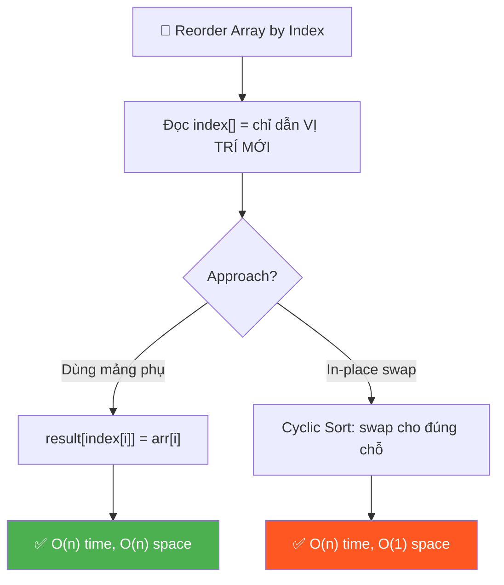
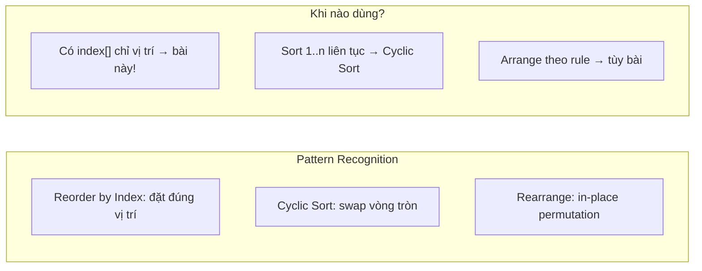
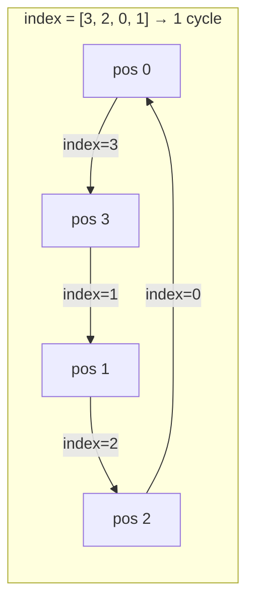
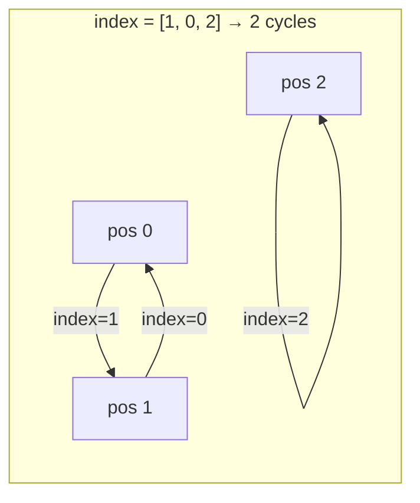
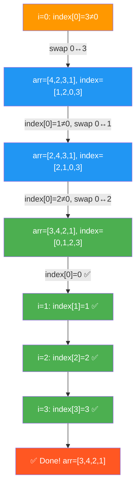

# 🔀 Reorder Array According to Given Indexes — GfG (Easy)

> 📖 Code: [Reorder Array by Index.js](./Reorder%20Array%20by%20Index.js)





---

## R — Repeat & Clarify

🧠 *"Cho 2 mảng cùng kích thước: arr[] chứa GIÁ TRỊ, index[] chứa VỊ TRÍ MỚI. Di chuyển arr[i] đến vị trí index[i]."*

> 🎙️ *"Given two arrays of the same length — arr[] and index[] — reorder arr[] so that the element at arr[i] is placed at position index[i] in the result."*

### Clarification Questions

```
Q: index[] có guarantee là permutation hợp lệ không?
A: CÓ! index[] là 1 hoán vị của [0, 1, ..., n-1].
   → Mỗi vị trí xuất hiện ĐÚNG 1 LẦN!
   → Không có index trùng, không có index ngoài range!

Q: arr[i] di chuyển ĐẾN index[i], hay index[i] chỉ nguồn?
A: arr[i] di chuyển ĐẾN vị trí index[i]!
   → index[i] = VỊ TRÍ ĐÍCH của arr[i]

Q: Cần modify in-place hay trả mảng mới?
A: Tùy approach! Cả 2 đều chấp nhận.

Q: Có cần giữ nguyên index[] không?
A: In-place approach SẼ modify index[].
   Nếu cần giữ → dùng mảng phụ.
```

### Tại sao bài này quan trọng?

```
  Bài này dạy PERMUTATION — HOÁN VỊ!

  BẠN PHẢI hiểu:
  1. index[] mô tả 1 PERMUTATION (ánh xạ vị trí)
  2. "Đặt đúng chỗ" = bản chất của SORTING!
  3. Mọi permutation = tập hợp các CYCLES!

  Ứng dụng thực tế:
  ┌───────────────────────────────────────────────────┐
  │  Database: reorder records theo sort order        │
  │  Shuffle:  xáo trộn mảng theo random index        │
  │  Ranking:  sort by rank index                      │
  │  Excel:    sắp xếp cột theo thứ tự mới             │
  └───────────────────────────────────────────────────┘
```

---

## 🧠 Bản chất bài toán — Hiểu để NHỚ, không chỉ để GIẢI

### Tưởng tượng: XẾP HỌC SINH VÀO GHẾ!

```
  Có n học sinh đang ĐỨNG (arr[]):
    Vị trí 0: Học sinh "10"
    Vị trí 1: Học sinh "11"
    Vị trí 2: Học sinh "12"

  Giáo viên phát PHIẾU SỐ GHẾ (index[]):
    Học sinh "10" nhận phiếu: "Ngồi ghế 1"   → index[0] = 1
    Học sinh "11" nhận phiếu: "Ngồi ghế 0"   → index[1] = 0
    Học sinh "12" nhận phiếu: "Ngồi ghế 2"   → index[2] = 2

  Sau khi ngồi:
    Ghế 0: "11"  ← học sinh 11 có phiếu 0
    Ghế 1: "10"  ← học sinh 10 có phiếu 1
    Ghế 2: "12"  ← học sinh 12 có phiếu 2

  → Result: [11, 10, 12] ✅
```

### Công thức CỐT LÕI — 1 dòng!

```
  ⭐ result[index[i]] = arr[i]

  Dịch: "Phần tử ở vị trí i → đặt vào vị trí index[i]"

  VÍ DỤ: arr = [10, 11, 12], index = [1, 0, 2]

  i=0: result[index[0]] = arr[0]  →  result[1] = 10
  i=1: result[index[1]] = arr[1]  →  result[0] = 11
  i=2: result[index[2]] = arr[2]  →  result[2] = 12

  result = [11, 10, 12] ✅

  CHỈ 1 DÒNG LOGIC! Phần còn lại là setup.
```

### Permutation = Tập hợp các CYCLES!

```
  ⭐ INSIGHT QUAN TRỌNG cho approach in-place!

  index = [3, 2, 0, 1] mô tả mapping:
    0 → 3 → 1 → 2 → 0     ← 1 CYCLE duy nhất!

  Vẽ mũi tên "đi đến đâu?":
    0 ──→ 3          index[0]=3: vị trí 0 gửi đến vị trí 3
    3 ──→ 1          index[3]=1: vị trí 3 gửi đến vị trí 1
    1 ──→ 2          index[1]=2: vị trí 1 gửi đến vị trí 2
    2 ──→ 0          index[2]=0: vị trí 2 gửi đến vị trí 0
          ↑──────────↩ quay lại 0 → CYCLE!

  Mọi permutation đều PHÂN RÃ thành CYCLES!
  → Swap theo từng cycle = in-place, O(1) extra space!

  ────────────────────────────────────────

  VÍ DỤ KHÁC: index = [1, 0, 2]
    Cycle 1: 0 → 1 → 0       (2 phần tử swap nhau)
    Cycle 2: 2 → 2            (tự nó — FIXED POINT!)

  → 2 cycles độc lập!
```





---

## 🧭 Luồng Suy Nghĩ — Từ đọc đề đến solution

> 💡 Phần này dạy bạn **CÁCH TƯ DUY** để tự giải bài, không chỉ biết đáp án.

### Bước 1: Đọc đề → Gạch chân KEYWORDS

```
  Đề bài: "Reorder arr[] so that arr[i] moves to position index[i]"

  Gạch chân:
    "reorder"    → SẮP XẾP LẠI → permutation!
    "arr[i]"     → giá trị cần di chuyển
    "index[i]"   → VỊ TRÍ ĐÍCH cho arr[i]
    "same length"→ index[] là permutation hợp lệ!

  🧠 Tự hỏi: "Cách đơn giản nhất?"
    → Tạo mảng mới, đặt từng phần tử vào đúng chỗ!
    → result[index[i]] = arr[i]

  📌 Kỹ năng chuyển giao:
    Khi có "index chỉ vị trí" → nghĩ: result[index[i]] = arr[i]
    Khi cần "in-place" → nghĩ: CYCLIC SORT (swap theo vòng)
```

### Bước 2: Vẽ ví dụ NHỎ bằng tay → Tìm PATTERN

```
  arr   = [10, 11, 12]
  index = [ 1,  0,  2]

  Vẽ mũi tên "ai đi đâu?":
    arr[0]=10 ──→ vị trí 1      (index[0]=1)
    arr[1]=11 ──→ vị trí 0      (index[1]=0)
    arr[2]=12 ──→ vị trí 2      (index[2]=2: ở yên!)

  Kết quả:
    Vị trí 0: 11  (đến từ arr[1])
    Vị trí 1: 10  (đến từ arr[0])
    Vị trí 2: 12  (đến từ arr[2])

  → [11, 10, 12] ✅

  🧠 Pattern: Chỉ cần 1 vòng for, đặt từng phần tử!
```

### Bước 3: Brute Force → Mảng phụ O(n) space

```
  🧠 "Cách đơn giản nhất?"
    → Tạo result[] mới
    → Duyệt i: result[index[i]] = arr[i]
    → Copy result → arr (nếu cần modify in-place)

  ✅ Solution 1: O(n) time, O(n) space
     Code CỰC NGẮN — chỉ 3 dòng logic!

  📌 Kỹ năng chuyển giao:
    LUÔN bắt đầu từ cách đơn giản nhất!
    Dùng mảng phụ → dễ hiểu, ít bug!
```

### Bước 4: "Có làm in-place được không?"

```
  🧠 "O(n) space → O(1) space?"
    → Không dùng mảng phụ → SWAP trực tiếp!
    → Nhưng swap thường phá vỡ vị trí → SAI!

  💡 INSIGHT: Permutation = cycles!
    → Swap THEO CYCLE → mỗi phần tử về đúng chỗ!
    → Giống Cyclic Sort!

  Với index = [3, 2, 0, 1]:
    Bắt đầu tại i=0:
      swap(0, 3) → phần tử ở 0 đi đến 3, phần tử ở 3 về 0
      swap(0, 1) → phần tử ở 0 đi đến 1, phần tử ở 1 về 0
      swap(0, 2) → phần tử ở 0 đi đến 2, phần tử ở 2 về 0
    → Cycle hoàn tất khi index[i] === i (đã đúng chỗ!)

  ✅ Solution 2: O(n) time, O(1) space
```

### Bước 5: Tổng kết

```
  ┌──────────────────────────────────────────────────────────┐
  │  Approach 1: Mảng phụ                                    │
  │    result[index[i]] = arr[i]                              │
  │    O(n) time, O(n) space  — ĐƠN GIẢN NHẤT!              │
  │                                                           │
  │  Approach 2: Cyclic Sort (swap in-place)                  │
  │    while (index[i] !== i): swap arr & index               │
  │    O(n) time, O(1) space  — TỐI ƯU SPACE!               │
  └──────────────────────────────────────────────────────────┘
```

---

## E — Examples

```
VÍ DỤ 1: arr = [10, 11, 12], index = [1, 0, 2]

  Mapping:
    10 → vị trí 1
    11 → vị trí 0
    12 → vị trí 2

  Result: [11, 10, 12] ✅
```

```
VÍ DỤ 2: arr = [1, 2, 3, 4], index = [3, 2, 0, 1]

  Mapping:
    1 → vị trí 3
    2 → vị trí 2
    3 → vị trí 0
    4 → vị trí 1

  Result: [3, 4, 2, 1] ✅

  Cycle: 0 → 3 → 1 → 2 → 0 (1 cycle duy nhất!)
```

```
VÍ DỤ 3: arr = [50, 40, 70, 60, 90], index = [3, 0, 4, 1, 2]

  Mapping:
    50 → vị trí 3
    40 → vị trí 0
    70 → vị trí 4
    60 → vị trí 1
    90 → vị trí 2

  Result: [40, 60, 90, 50, 70] ✅
```

### Minh họa trực quan

```
  arr   = [10, 11, 12]
  index = [ 1,  0,  2]

  TRƯỚC:
    pos:    0    1    2
    arr:  [10] [11] [12]
              ↗  ↙
  SAU:      swap!
    pos:    0    1    2
    arr:  [11] [10] [12]

  ─────────────────────────────────────────────

  arr   = [ 1,  2,  3,  4]
  index = [ 3,  2,  0,  1]

  TRƯỚC:
    pos:   0   1   2   3
    arr:  [1] [2] [3] [4]
           ↓   ↓   ↓   ↓     "đi đến"
           3   2   0   1

  SAU:
    pos:   0   1   2   3
    arr:  [3] [4] [2] [1]
           ↑   ↑   ↑   ↑
         từ 2 từ 3 từ 1 từ 0
```

---

## A — Approach

### Approach 1: Mảng phụ — O(n) time, O(n) space

```
💡 Ý tưởng: Tạo result[], đặt arr[i] vào result[index[i]]

  for i = 0 → n-1:
    result[index[i]] = arr[i]

  CHỈ 1 DÒNG LOGIC!

  ✅ Ưu: Cực đơn giản, không thể sai!
  ❌ Nhược: O(n) extra space
```

### Approach 2: Cyclic Sort (in-place) — O(n) time, O(1) space ⭐

```
💡 Ý tưởng: Swap từng phần tử VỀ ĐÚNG CHỖ!

  for i = 0 → n-1:
    while (index[i] !== i):
      // Phần tử ở vị trí i chưa đúng chỗ!
      // Swap nó đến vị trí ĐÚNG = index[i]
      swap(arr[i], arr[index[i]])
      swap(index[i], index[index[i]])

  Tại sao ĐÚNG?
    Mỗi swap đưa ÍT NHẤT 1 phần tử về đúng chỗ!
    → Sau tối đa n swaps → TẤT CẢ đúng chỗ!

  ⚠️ Phải swap CẢ arr[] VÀ index[]!
     Vì index[] cũng là "bản đồ" — nếu không swap
     index[] thì ta mất tracking!

  ⚠️ TRAP: Thứ tự swap quan trọng!
     Phải swap index[] TRƯỚC hoặc dùng biến temp!
```

### Trace Cyclic Sort: arr = [1, 2, 3, 4], index = [3, 2, 0, 1]

```
  BAN ĐẦU:
    arr   = [1, 2, 3, 4]
    index = [3, 2, 0, 1]

  ═══ i=0: index[0]=3 ≠ 0 → SWAP! ═════════════════════

  Iteration 1: swap positions 0 ↔ 3
    swap arr[0] ↔ arr[3]:     [1,2,3,4] → [4,2,3,1]
    swap index[0] ↔ index[3]: [3,2,0,1] → [1,2,0,3]
                                           ↑       ↑
    arr   = [4, 2, 3, 1]
    index = [1, 2, 0, 3]
    → index[0]=1 ≠ 0 → TIẾP TỤC SWAP!

  Iteration 2: swap positions 0 ↔ 1
    swap arr[0] ↔ arr[1]:     [4,2,3,1] → [2,4,3,1]
    swap index[0] ↔ index[1]: [1,2,0,3] → [2,1,0,3]

    arr   = [2, 4, 3, 1]
    index = [2, 1, 0, 3]
    → index[0]=2 ≠ 0 → TIẾP TỤC SWAP!

  Iteration 3: swap positions 0 ↔ 2
    swap arr[0] ↔ arr[2]:     [2,4,3,1] → [3,4,2,1]
    swap index[0] ↔ index[2]: [2,1,0,3] → [0,1,2,3]

    arr   = [3, 4, 2, 1]
    index = [0, 1, 2, 3]
    → index[0]=0 === 0 → DỪNG! ✅

  ═══ i=1: index[1]=1 === 1 → ĐÃ ĐÚNG! skip ═════════
  ═══ i=2: index[2]=2 === 2 → ĐÃ ĐÚNG! skip ═════════
  ═══ i=3: index[3]=3 === 3 → ĐÃ ĐÚNG! skip ═════════

  KẾT QUẢ: arr = [3, 4, 2, 1] ✅
           index = [0, 1, 2, 3] (identity permutation!)
```



### Tại sao mỗi phần tử chỉ bị swap TỐI ĐA 1 lần?

```
  ⭐ PHÂN TÍCH AMORTIZED — Tại sao O(n)?

  "while loop bên trong for → O(n²)?"  → KHÔNG!

  Lý do: Mỗi SWAP đưa 1 phần tử VỀ ĐÚNG CHỖ VĨNH VIỄN!
    → Phần tử đúng chỗ KHÔNG BAO GIỜ bị swap lại!
    → Tổng số swaps ≤ n (vì chỉ có n phần tử!)

  Phân tích cycle:
    index = [3, 2, 0, 1] → 1 cycle: 0→3→1→2→0 (length 4)
    → Cần 3 swaps cho cycle length 4 (length - 1)!

  TỔNG QUÁT:
    Nếu có k cycles với lengths L₁, L₂, ..., Lₖ:
    Tổng swaps = (L₁-1) + (L₂-1) + ... + (Lₖ-1)
               = (L₁+L₂+...+Lₖ) - k
               = n - k
               ≤ n - 1
               → O(n)!

  ⚠️ for loop chạy n lần + while chạy TỔNG ≤ n lần
     → Tổng iterations ≤ 2n → O(n)!
```

### So sánh 2 approaches

```
  ┌──────────────────────┬──────────┬──────────┬──────────────────┐
  │                      │ Time     │ Space    │ Ghi chú           │
  ├──────────────────────┼──────────┼──────────┼──────────────────┤
  │ Mảng phụ             │ O(n)     │ O(n)     │ Đơn giản nhất ⭐ │
  │ Cyclic Sort in-place │ O(n)     │ O(1)     │ Tối ưu space ⭐  │
  └──────────────────────┴──────────┴──────────┴──────────────────┘

  Phỏng vấn:
    → Viết mảng phụ TRƯỚC (2 phút!)
    → Interviewer hỏi "in-place?" → Cyclic Sort!
```

---

## C — Code

### Solution 1: Mảng phụ — O(n) time, O(n) space

```javascript
function reorderByIndex(arr, index) {
  const n = arr.length;
  const result = new Array(n);

  for (let i = 0; i < n; i++) {
    result[index[i]] = arr[i]; // ⭐ Công thức CỐT LÕI!
  }

  // Copy kết quả về arr (nếu cần modify in-place)
  for (let i = 0; i < n; i++) {
    arr[i] = result[i];
  }

  return arr;
}
```

### Giải thích từng dòng

```
  const result = new Array(n);
    → Mảng phụ chứa kết quả

  result[index[i]] = arr[i];
    → "Phần tử arr[i] đặt vào vị trí index[i]"
    → ĐÂY LÀ TẤT CẢ! 1 dòng logic!

  ⚠️ Tại sao result[index[i]] chứ không phải result[i] = arr[index[i]]?
     Vì index[i] = VỊ TRÍ ĐÍCH!
     arr[i] → đi ĐẾN index[i]

     Nếu nhầm: result[i] = arr[index[i]]
     → Đọc: "vị trí i lấy giá trị TỪ index[i]"
     → Đây là REVERSE mapping! KHÁC BÀI!

  📌 TRICK NHỚ:
     "arr[i] đi ĐẾN index[i]"
     → result[ĐẾN] = arr[TỪ]
     → result[index[i]] = arr[i]
```

### Trace CHI TIẾT: arr = [50, 40, 70, 60, 90], index = [3, 0, 4, 1, 2]

```
  n = 5, result = [_, _, _, _, _]

  i=0: result[index[0]] = arr[0]
       result[3] = 50
       result = [_, _, _, 50, _]

  i=1: result[index[1]] = arr[1]
       result[0] = 40
       result = [40, _, _, 50, _]

  i=2: result[index[2]] = arr[2]
       result[4] = 70
       result = [40, _, _, 50, 70]

  i=3: result[index[3]] = arr[3]
       result[1] = 60
       result = [40, 60, _, 50, 70]

  i=4: result[index[4]] = arr[4]
       result[2] = 90
       result = [40, 60, 90, 50, 70]

  → [40, 60, 90, 50, 70] ✅
```

### Solution 2: Cyclic Sort (in-place) — O(n) time, O(1) space ⭐

```javascript
function reorderByIndexInPlace(arr, index) {
  const n = arr.length;

  for (let i = 0; i < n; i++) {
    // Swap cho đến khi phần tử ở i ĐÚNG CHỖ
    while (index[i] !== i) {
      const targetIdx = index[i]; // Vị trí ĐÍCH

      // Swap arr: đặt arr[i] vào đúng chỗ targetIdx
      [arr[i], arr[targetIdx]] = [arr[targetIdx], arr[i]];

      // Swap index: cập nhật bản đồ
      [index[i], index[targetIdx]] = [index[targetIdx], index[i]];
    }
  }

  return arr;
}
```

### Giải thích Cyclic Sort — CHI TIẾT

```
  while (index[i] !== i):
    → "Phần tử ở vị trí i CHƯA đúng chỗ!"
    → Cần swap nó đến vị trí ĐÍCH = index[i]

  const targetIdx = index[i]:
    → Vị trí mà phần tử hiện tại CẦN đến

  swap arr[i] ↔ arr[targetIdx]:
    → Di chuyển phần tử ở i đến đích
    → Đồng thời kéo phần tử ở đích VỀ vị trí i
    → Phần tử mới ở i có thể CŨNG chưa đúng chỗ → tiếp tục while!

  swap index[i] ↔ index[targetIdx]:
    → CẬP NHẬT bản đồ! Quan trọng!
    → Nếu không swap index[] → mất tracking vị trí ĐÍCH!

  Khi index[i] === i:
    → Phần tử ở vị trí i ĐÃ đúng chỗ → qua i tiếp theo!

  ⚠️ TRAP: Phải swap CẢ arr[] VÀ index[]!
     Quên swap index[] → vòng lặp VÔ HẠN hoặc sai kết quả!
```

### Trace Cyclic Sort: arr = [10, 11, 12], index = [1, 0, 2]

```
  BAN ĐẦU:
    arr   = [10, 11, 12]
    index = [ 1,  0,  2]

  ═══ i=0: index[0]=1 ≠ 0 → SWAP! ═══════════════════

  targetIdx = 1
    swap arr[0] ↔ arr[1]:     [10,11,12] → [11,10,12]
    swap index[0] ↔ index[1]: [1,0,2]    → [0,1,2]

    arr   = [11, 10, 12]
    index = [ 0,  1,  2]
    → index[0]=0 === 0 → DỪNG! ✅

  ═══ i=1: index[1]=1 === 1 → skip ═══════════════════
  ═══ i=2: index[2]=2 === 2 → skip ═══════════════════

  KẾT QUẢ: arr = [11, 10, 12] ✅
  Chỉ cần 1 swap!
```

### Trace Cyclic Sort: arr = [50, 40, 70, 60, 90], index = [3, 0, 4, 1, 2]

```
  BAN ĐẦU:
    arr   = [50, 40, 70, 60, 90]
    index = [ 3,  0,  4,  1,  2]

  ═══ i=0: index[0]=3 ≠ 0 → SWAP! ═══════════════════

  Iteration 1: targetIdx = 3
    swap arr[0] ↔ arr[3]:     [50,40,70,60,90] → [60,40,70,50,90]
    swap index[0] ↔ index[3]: [3,0,4,1,2]      → [1,0,4,3,2]

    arr   = [60, 40, 70, 50, 90]
    index = [ 1,  0,  4,  3,  2]
    → index[0]=1 ≠ 0 → TIẾP TỤC!

  Iteration 2: targetIdx = 1
    swap arr[0] ↔ arr[1]:     [60,40,70,50,90] → [40,60,70,50,90]
    swap index[0] ↔ index[1]: [1,0,4,3,2]      → [0,1,4,3,2]

    arr   = [40, 60, 70, 50, 90]
    index = [ 0,  1,  4,  3,  2]
    → index[0]=0 === 0 → DỪNG! ✅

  ═══ i=1: index[1]=1 === 1 → skip ═══════════════════

  ═══ i=2: index[2]=4 ≠ 2 → SWAP! ═══════════════════

  Iteration 1: targetIdx = 4
    swap arr[2] ↔ arr[4]:     [40,60,70,50,90] → [40,60,90,50,70]
    swap index[2] ↔ index[4]: [0,1,4,3,2]      → [0,1,2,3,4]

    arr   = [40, 60, 90, 50, 70]
    index = [ 0,  1,  2,  3,  4]
    → index[2]=2 === 2 → DỪNG! ✅

  ═══ i=3: index[3]=3 === 3 → skip ═══════════════════
  ═══ i=4: index[4]=4 === 4 → skip ═══════════════════

  KẾT QUẢ: arr = [40, 60, 90, 50, 70] ✅
  Tổng: 3 swaps (cycle 0→3→1: 2 swaps + cycle 2→4: 1 swap)
```

> 🎙️ *"The auxiliary array approach places each element at its target index in one pass. For in-place, I use cyclic sort — following each cycle of the permutation and swapping elements into place. Total swaps never exceed n-1 since each swap fixes at least one element permanently."*

---

## O — Optimize

```
                    Time      Space          Ghi chú
  ───────────────────────────────────────────────────
  Mảng phụ          O(n)      O(n)           Đơn giản nhất
  Cyclic Sort       O(n)      O(1)           Tối ưu space ⭐

  ⚠️ Cả 2 đều O(n) time!
    → Phải đọc mọi phần tử → Ω(n) lower bound!
    → Không thể nhanh hơn O(n)!

  ⚠️ Cyclic Sort MODIFY cả index[]!
    Nếu cần giữ index[] → phải copy trước hoặc dùng mảng phụ.

  📊 Khi nào dùng gì?
    Phỏng vấn: Viết mảng phụ trước → nói "có thể in-place"
    Sản phẩm: Mảng phụ (an toàn, dễ maintain)
    Memory tight: Cyclic Sort
```

---

## T — Test

```
Test Cases:
  [10,11,12],   [1,0,2]     → [11,10,12]     ✅ swap 2 phần tử
  [1,2,3,4],    [3,2,0,1]   → [3,4,2,1]      ✅ 1 cycle length 4
  [50,40,70,60,90], [3,0,4,1,2] → [40,60,90,50,70] ✅ 2 cycles
  [5],          [0]          → [5]            ✅ 1 phần tử
  [1,2],        [1,0]        → [2,1]          ✅ swap 2 phần tử
  [1,2,3],      [0,1,2]     → [1,2,3]        ✅ identity (không đổi!)
  [7,8,9,10],   [2,3,0,1]   → [9,10,7,8]     ✅ 2 cycles length 2
```

---

## 🗣️ Interview Script

### 🎙️ Think Out Loud — Mô phỏng phỏng vấn thực

> ⚠️ Script này dạy cách **NÓI**, không phải cách CODE.
> Mỗi đoạn = cách bạn **PHÁT BIỂU** trong phỏng vấn thực!

```
  ╔══════════════════════════════════════════════════════════════╗
  ║  🕐 FULL INTERVIEW SIMULATION — 1h30 (90 phút)             ║
  ║                                                              ║
  ║  00:00-05:00  Introduction + Icebreaker         (5 min)     ║
  ║  05:00-45:00  Problem Solving                   (40 min)    ║
  ║  45:00-60:00  Deep Technical Probing            (15 min)    ║
  ║  60:00-75:00  Variations + Extensions           (15 min)    ║
  ║  75:00-85:00  System Design at Scale            (10 min)    ║
  ║  85:00-90:00  Behavioral + Q&A                  (5 min)     ║
  ╚══════════════════════════════════════════════════════════════╝
```

```
  ╔══════════════════════════════════════════════════════════════╗
  ║  PART 1: INTRODUCTION (00:00 — 05:00)                       ║
  ╚══════════════════════════════════════════════════════════════╝

  👤 "Tell me about yourself and a time you worked
      with permutations or reordering data."

  🧑 "I'm a frontend engineer with [X] years of experience.
      A relevant example: I built a Kanban board where users
      could drag-and-drop cards to reorder them.

      When a user finished dragging, the backend sent
      the new ordering as an index array:
      'card at position 0 should now be at position 3,
      card at position 1 should be at position 0,' and so on.

      I needed to apply this permutation to the card array.
      The straightforward approach: create a new array and
      place each card at its target index.
      But for very large boards, I wanted to do it in-place
      to avoid cloning hundreds of card objects.

      I realized every permutation decomposes into cycles.
      Following each cycle and swapping cards along the chain
      gave me O of n time with O of 1 extra space.

      That's exactly this problem — reorder an array
      according to a given index mapping."

  👤 "Great real-world connection. Let's solve it."
```

```
  ╔══════════════════════════════════════════════════════════════╗
  ║  PART 2: PROBLEM SOLVING (05:00 — 45:00)                   ║
  ╚══════════════════════════════════════════════════════════════╝

  ──────────────── 05:00 — Clarify (4 phút) ────────────────

  👤 "Given two arrays of the same length: arr[] contains values,
      index[] contains target positions. Reorder arr[] so that
      arr[i] is placed at position index[i]."

  🧑 "Let me clarify.

      index[] is a VALID PERMUTATION of 0 to n minus 1.
      Each position appears exactly once — no duplicates,
      no out-of-range values. This is the prerequisite.

      The mapping direction: arr at i GOES TO position index at i.
      Not 'position i TAKES FROM index at i' — that would be
      the REVERSE mapping, a completely different problem.

      I need to produce a result where:
      result at index at i equals arr at i, for every i.

      Can I modify the array in-place?
      Can I modify the index array too?
      If so, I can use cyclic sort for O of 1 space."

  ──────────────── 09:00 — Seating Card Analogy (3 phút) ────────

  🧑 "I think of this as a CLASSROOM with seating cards.

      There are n students standing in line.
      Student at position i has value arr at i.

      The teacher hands out SEATING CARDS.
      Student at position i receives card index at i,
      which says 'Go sit at desk index at i.'

      The students walk to their assigned desks.
      After everyone sits down, the result is the
      reordered array.

      Example: arr equals [10, 11, 12], index equals [1, 0, 2].
      Student 10 gets card 1 — go to desk 1.
      Student 11 gets card 0 — go to desk 0.
      Student 12 gets card 2 — stay at desk 2.
      Result: [11, 10, 12]."

  ──────────────── 12:00 — Approach 1: Auxiliary Array (3 phút) ────

  🧑 "The simplest approach: create a result array.

      The core formula — just ONE LINE of logic:
      result at index at i equals arr at i.

      'Element arr at i goes TO position index at i.'

      For arr equals [10, 11, 12], index equals [1, 0, 2]:
      i equals 0: result at 1 equals 10.
      i equals 1: result at 0 equals 11.
      i equals 2: result at 2 equals 12.
      Result: [11, 10, 12].

      Time: O of n. Space: O of n for the result array.
      Three lines of code. Cannot get simpler."

  ──────────────── 15:00 — The forward vs reverse trap (3 phút) ────

  🧑 "Critical clarification: the DIRECTION of mapping.

      This problem: arr at i goes TO position index at i.
      Formula: result at index at i equals arr at i.

      The REVERSE: position i takes FROM position index at i.
      Formula: result at i equals arr at index at i.

      These are DIFFERENT problems!

      Example: arr equals [10, 11, 12], index equals [1, 0, 2].
      Forward: result equals [11, 10, 12].
      Reverse: result at 0 equals arr at 1 equals 11,
      result at 1 equals arr at 0 equals 10. Same here!
      But they diverge for other inputs.

      Always ask: 'Does arr at i GO TO index at i,
      or does position i TAKE FROM index at i?'
      Misreading this is the number one mistake."

  ──────────────── 18:00 — Approach 2: Cyclic Sort In-Place (6 phút)

  🧑 "For O of 1 space, I use CYCLIC SORT — swap in-place.

      The key insight: every permutation decomposes
      into CYCLES. I follow each cycle and swap elements
      along the chain.

      At each position i, while index at i is not equal to i:
      The element at position i doesn't belong here.
      It should go to position index at i.
      I swap arr at i with arr at index at i.
      I ALSO swap index at i with index at index at i —
      to update the mapping.

      When index at i equals i, the element at position i
      is correct. Move to i plus 1.

      Let me trace arr equals [1, 2, 3, 4],
      index equals [3, 2, 0, 1]:

      i equals 0: index at 0 equals 3, not 0. Swap!
      targetIdx equals 3.
      Swap arr at 0 with arr at 3: [1,2,3,4] becomes [4,2,3,1].
      Swap index at 0 with index at 3: [3,2,0,1] becomes [1,2,0,3].

      index at 0 is now 1, not 0. Swap again!
      targetIdx equals 1.
      Swap arr at 0 with arr at 1: [4,2,3,1] becomes [2,4,3,1].
      Swap index at 0 with index at 1: [1,2,0,3] becomes [2,1,0,3].

      index at 0 is now 2, not 0. Swap again!
      targetIdx equals 2.
      Swap arr at 0 with arr at 2: [2,4,3,1] becomes [3,4,2,1].
      Swap index at 0 with index at 2: [2,1,0,3] becomes [0,1,2,3].

      index at 0 is now 0. Done!

      i equals 1: index at 1 equals 1. Already correct.
      i equals 2: index at 2 equals 2. Already correct.
      i equals 3: index at 3 equals 3. Already correct.

      Result: [3, 4, 2, 1]. Only 3 swaps for the entire array."

  ──────────────── 24:00 — Write Code (3 phút) ────────────────

  🧑 "The code.

      [Vừa viết vừa nói:]

      function reorderByIndex of arr, index.
      const n equal arr dot length.

      for let i equal 0, i less than n, i plus plus:
      while index at i not equal i:
      const targetIdx equal index at i.
      Swap arr at i with arr at targetIdx.
      Swap index at i with index at targetIdx.

      return arr.

      Critical: I save targetIdx BEFORE any swaps.
      And I swap BOTH arr and index arrays.
      Forgetting to swap index causes an infinite loop."

  ──────────────── 27:00 — Why swap both arrays? (3 phút) ────────

  👤 "Why must you swap index[] too?"

  🧑 "The index array is my MAP — it tells me where
      each element should go.

      When I swap arr at i with arr at targetIdx,
      the element that was at targetIdx is now at position i.
      But its destination is index at targetIdx.
      After swapping index, index at i now holds the
      destination of the element that just arrived at i.

      If I DON'T swap index, I lose the tracking.
      The while loop would check the same stale index at i
      forever — infinite loop!

      Think of it as: I'm moving the seating card
      along with the student. When two students swap desks,
      their seating cards swap too."

  ──────────────── 30:00 — Edge Cases (3 phút) ────────────────

  🧑 "Edge cases.

      Single element: arr equals [5], index equals [0].
      index at 0 equals 0. Already correct. No swaps.

      Identity permutation: index equals [0, 1, 2, 3].
      Every index at i equals i. The while loop never
      executes. The array stays unchanged.

      Complete reversal: index equals [3, 2, 1, 0].
      This decomposes into two 2-cycles:
      0 swaps with 3, 1 swaps with 2.
      Two swaps total.

      Single long cycle: index equals [1, 2, 3, 4, 0].
      All elements are in one cycle of length 5.
      The while loop at i equals 0 does 4 swaps.
      All subsequent i values find index at i equals i."

  ──────────────── 33:00 — Why O(n) despite while? (4 phút) ────────

  👤 "For loop with while inside — isn't that O of n squared?"

  🧑 "No! This is the AMORTIZED argument.

      Each swap places EXACTLY ONE element at its correct
      position — permanently. Once arr at targetIdx gets
      its correct value, it never moves again.

      Total swaps across ALL for-loop iterations: at most
      n minus 1. Why n minus 1, not n? Because in a cycle
      of length L, I need L minus 1 swaps.

      If there are k cycles with lengths L1, L2, ..., Lk:
      Total swaps equals (L1 minus 1) plus (L2 minus 1)
      plus ... plus (Lk minus 1)
      equals (L1 plus L2 plus ... plus Lk) minus k
      equals n minus k.
      Since k is at least 1, total swaps is at most n minus 1.

      The for loop runs n times. The while loop runs
      at most n minus 1 times total. Grand total: at most
      2n minus 1 operations. O of n."

  ──────────────── 37:00 — Complexity Summary (3 phút) ────────────

  🧑 "Auxiliary array:
      Time: O of n. One pass to place, one pass to copy back.
      Space: O of n for the result array.

      Cyclic sort:
      Time: O of n amortized. At most n minus 1 swaps.
      Space: O of 1. Only one temp variable for targetIdx.

      Both are optimal in time — Omega of n lower bound
      since I must read every element.

      The trade-off is space: O of n versus O of 1.
      But cyclic sort modifies the index array.
      If I need to preserve index, I'd need to copy it first —
      which uses O of n space anyway."
```

```
  ╔══════════════════════════════════════════════════════════════╗
  ║  PART 3: DEEP TECHNICAL PROBING (45:00 — 60:00)            ║
  ╚══════════════════════════════════════════════════════════════╝

  ──────────────── 45:00 — Cycle decomposition theory (5 phút) ────

  👤 "Tell me more about cycle decomposition."

  🧑 "Every permutation of n elements can be uniquely
      decomposed into DISJOINT CYCLES.

      A cycle is a sequence where each element points
      to the next: a goes to b, b goes to c, c goes back to a.

      For index equals [3, 2, 0, 1]:
      Start at 0: 0 goes to 3, 3 goes to 1, 1 goes to 2,
      2 goes to 0. One cycle: (0, 3, 1, 2).

      For index equals [1, 0, 3, 2]:
      Start at 0: 0 goes to 1, 1 goes to 0. Cycle: (0, 1).
      Start at 2: 2 goes to 3, 3 goes to 2. Cycle: (2, 3).
      Two independent cycles.

      FIXED POINTS are 1-cycles: index at i equals i.
      No swap needed.

      The cycle structure determines:
      Number of swaps — exactly n minus number of cycles.
      The BEST case — identity permutation — has n cycles
      (all fixed points), zero swaps.
      The WORST case — one giant cycle — needs n minus 1 swaps."

  ──────────────── 50:00 — JS destructuring trap (3 phút) ────────

  👤 "Is there a swap ordering issue in JavaScript?"

  🧑 "Yes! The same destructuring trap as Rearrange Array.

      If I write: bracket index at i comma index at index at i
      close bracket equals bracket index at index at i comma
      index at i close bracket —

      index at i on the LEFT changes first.
      Then index at index at i on the LEFT uses the NEW
      value of index at i — wrong target!

      That's why I save targetIdx equals index at i FIRST.
      Then swap arr at i with arr at targetIdx.
      Then swap index at i with index at targetIdx.

      The saved targetIdx is immune to the order issue."

  ──────────────── 53:00 — Forward vs reverse permutation (4 phút) ─

  👤 "What's the relationship between forward and inverse
      permutation?"

  🧑 "If the forward permutation maps position i to index at i,
      the INVERSE permutation maps position index at i BACK to i.

      Forward: result at index at i equals arr at i.
      Inverse: result at i equals arr at index at i.

      They're different operations!
      Forward: 'where does element at i go?'
      Inverse: 'where does element at i come from?'

      Computing the inverse:
      Given index[], create inv[] where inv at index at i equals i.
      One pass, O of n.

      Applying the inverse permutation UNDOES the forward one.
      If I apply forward then inverse, I get back the original.

      In databases, this is 'sort then unsort' —
      the inverse permutation of the sort indices
      restores the original order."

  ──────────────── 57:00 — Detecting if index is valid (3 phút) ────

  👤 "How would you validate that index[] is a valid permutation?"

  🧑 "A valid permutation of 0 to n minus 1 means:
      every value appears exactly once,
      all values are in range [0, n minus 1].

      Quick check: if the sum equals n times (n minus 1) over 2
      — necessary but NOT sufficient. Example: [0, 0, 3]
      has sum 3 but is not a valid permutation.

      Correct check: use a boolean array of size n.
      For each index at i, mark seen at index at i as true.
      If any is already true — duplicate — invalid.
      If any index at i is out of range — invalid.
      If all are marked exactly once — valid.

      O of n time, O of n space for the boolean array.

      Or sort index and check if it equals [0, 1, ..., n minus 1].
      But this modifies index — O of n log n."
```

```
  ╔══════════════════════════════════════════════════════════════╗
  ║  PART 4: VARIATIONS (60:00 — 75:00)                         ║
  ╚══════════════════════════════════════════════════════════════╝

  ──────────────── 60:00 — Sort two arrays by one key (3 phút) ────

  👤 "What if I want to sort an array and apply the same
      reordering to another array?"

  🧑 "Classic use case! I compute the SORT PERMUTATION.

      Create an index array: [0, 1, 2, ..., n minus 1].
      Sort index by comparing arr at index at a vs arr at index at b.
      Now index holds the sort permutation.

      Apply this permutation to BOTH arrays:
      result1 at i equals arr1 at index at i.
      result2 at i equals arr2 at index at i.

      In JavaScript: zip the arrays, sort by key, unzip.
      Or use the index approach for in-place reordering.

      This is how spreadsheet column sorting works:
      sort by one column, reorder ALL columns."

  ──────────────── 63:00 — Apply permutation K times (4 phút) ────

  👤 "Can you apply a permutation K times efficiently?"

  🧑 "Naive: apply the permutation K times. O of n times K.

      Optimal: PERMUTATION EXPONENTIATION.

      Each element follows its cycle.
      In a cycle of length L, after L applications,
      the element returns to its original position.

      So after K applications, element at position p
      moves K steps forward in its cycle.
      That's equivalent to K mod L steps.

      Algorithm:
      1. Decompose into cycles. O of n.
      2. For each cycle of length L, compute K mod L.
      3. Shift each element K mod L positions forward
         in the cycle. O of n.

      Total: O of n. Independent of K!

      This is used in competitive programming and
      in computing matrix powers for state transitions."

  ──────────────── 67:00 — Fisher-Yates shuffle (4 phút) ────────

  👤 "How does this relate to shuffling?"

  🧑 "Fisher-Yates shuffle GENERATES a random permutation.
      This problem APPLIES a given permutation.

      Fisher-Yates:
      For i from n minus 1 down to 1:
      Pick random j in [0, i].
      Swap arr at i with arr at j.

      The result: a uniformly random permutation.
      If I record all the swap indices, I can reconstruct
      the permutation as an index array.

      The connection: shuffling equals generating a random
      permutation, then applying it. This problem handles
      the 'applying' part.

      To UNSHUFFLE — restore the original order —
      I need the INVERSE permutation of the shuffle."

  ──────────────── 71:00 — Rearrange arr[i] = i connection (4 phút)

  👤 "How does this relate to 'Rearrange arr[i] = i'?"

  🧑 "They're SIBLINGS in the cyclic sort family!

      Rearrange arr at i equals i:
      The value IS the target index. Value v goes to index v.
      The index array is IMPLICIT — it's the values themselves.

      Reorder by Index:
      The target index is given EXPLICITLY in a separate array.
      Value arr at i goes to index at i.

      Both use the same cyclic sort mechanism:
      while the element at position i is not correct,
      swap it to its target.

      The difference: in arr at i equals i, I check arr at i
      versus i. Here, I check index at i versus i.

      Understanding both problems gives you mastery
      of the cyclic sort pattern — one of the most
      powerful in-place rearrangement techniques."
```

```
  ╔══════════════════════════════════════════════════════════════╗
  ║  PART 5: SYSTEM DESIGN AT SCALE (75:00 — 85:00)            ║
  ╚══════════════════════════════════════════════════════════════╝

  ──────────────── 75:00 — Real-world applications (5 phút) ────────

  👤 "Where does permutation reordering appear in practice?"

  🧑 "Everywhere in backend and data systems!

      First — DATABASE RE-INDEXING.
      When rebuilding an index after sorting, the database
      creates a permutation mapping old positions to new ones.
      Applying this permutation reorders the data pages.

      Second — SPREADSHEET COLUMN REORDERING.
      When a user drags columns in Excel or Google Sheets,
      the new column order is expressed as a permutation.
      Applying it rearranges all rows consistently.

      Third — GPU SCATTER-GATHER OPERATIONS.
      In GPU programming, scatter writes data to
      non-contiguous positions: output at index at i
      equals input at i. That's exactly our formula.
      Gather does the reverse: output at i equals
      input at index at i.

      Fourth — NETWORK PACKET REASSEMBLY.
      TCP packets arrive out of order. Each packet has
      a sequence number (its index). Reassembly places
      each packet at its sequence position —
      same as result at index at i equals arr at i."

  ──────────────── 80:00 — Distributed permutation (5 phút) ────────

  👤 "Can this scale to distributed systems?"

  🧑 "In a distributed setting, applying a permutation
      is essentially a ROUTING problem.

      Each machine holds a partition of the array.
      The index array tells each element which machine
      and position it should go to.

      This is an ALL-TO-ALL communication pattern:
      Machine A sends element to Machine B at position j.

      In MapReduce:
      Map: each element emits (target position, value).
      Shuffle: route by target position to the correct reducer.
      Reduce: place elements at their positions.

      The shuffle step is the bottleneck:
      O of n total messages across the network.

      For in-place distributed permutation, it's NP-hard
      to minimize communication rounds in general.
      But cycle decomposition helps:
      elements in the same cycle can be routed along
      the cycle, reducing messages.

      In practice, the auxiliary array approach
      (send all elements to a new array on the target machines)
      is simpler and used more often."
```

```
  ╔══════════════════════════════════════════════════════════════╗
  ║  PART 6: BEHAVIORAL + Q&A (85:00 — 90:00)                  ║
  ╚══════════════════════════════════════════════════════════════╝

  ──────────────── 85:00 — Reflection (3 phút) ────────────────

  👤 "What would you take away from this problem?"

  🧑 "Three things.

      First, PERMUTATION DECOMPOSITION into cycles.
      Every permutation is a collection of disjoint cycles.
      This mathematical structure enables in-place reordering
      with O of 1 extra space. Learn cycles, unlock
      a whole class of problems.

      Second, THE FORMULA result at index at i equals arr at i.
      This single line captures the entire problem.
      Always clarify the mapping DIRECTION first —
      forward versus reverse is the number one trap.

      Third, DUAL-ARRAY SWAP in cyclic sort.
      When the index array is explicit, I must swap
      BOTH the data array and the index array simultaneously.
      Forgetting the index swap causes infinite loops.
      This is unique to this problem and doesn't appear
      in the simpler arr at i equals i variant."

  ──────────────── 88:00 — Questions (2 phút) ────────────────

  👤 "Any questions for me?"

  🧑 "A few!

      First — the forward versus reverse mapping confusion
      is a common source of bugs. Does your team have
      established conventions for specifying permutations?

      Second — applying a permutation K times has an
      elegant O of n solution using cycle lengths.
      Do you encounter this in animation or state transitions?

      Third — the GPU scatter-gather pattern is exactly
      this problem at the hardware level.
      Does your infrastructure team work on GPU-accelerated
      data transformations?"

  👤 "Excellent! Your cycle decomposition explanation was
      mathematically precise, and connecting to scatter-gather
      showed real systems knowledge. The dual-swap trap
      is exactly the bug we see in practice. We'll be in touch!"
```

```
  ╔══════════════════════════════════════════════════════════════╗
  ║  ⭐ 8 MẸO NÓI CHUYỆN TRONG PHỎNG VẤN (Reorder by Index)  ║
  ╚══════════════════════════════════════════════════════════════╝

  📌 MẸO #1: State the formula immediately
     ✅ "result at index at i equals arr at i.
         One line captures the entire problem."

  📌 MẸO #2: Clarify mapping direction
     ✅ "arr at i GOES TO position index at i.
         NOT: position i takes FROM index at i.
         This is the number one source of bugs."

  📌 MẸO #3: Use the seating card analogy
     ✅ "Students receive seating cards telling them
         which desk to go to. After everyone moves,
         the array is reordered."

  📌 MẸO #4: Present two approaches as escalation
     ✅ "Auxiliary array: trivial, O of n space.
         Cyclic sort in-place: O of 1 space.
         Start simple, optimize when asked."

  📌 MẸO #5: Explain cycle decomposition
     ✅ "Every permutation decomposes into disjoint cycles.
         I follow each cycle and swap elements along it.
         A cycle of length L needs L minus 1 swaps."

  📌 MẸO #6: Flag the dual-swap requirement
     ✅ "I must swap BOTH arr and index arrays.
         Forgetting to swap index causes infinite loops
         because the mapping becomes stale."

  📌 MẸO #7: Address the O(n) question
     ✅ "Total swaps equals n minus number of cycles.
         At most n minus 1. The while loop across all
         for iterations runs at most n minus 1 times total."

  📌 MẸO #8: Connect to the permutation family
     ✅ "Same cyclic sort pattern as Rearrange arr at i equals i,
         but with an EXPLICIT index array instead of using
         the values themselves as indices."
```

---

### Kiến thức liên quan

```
  REORDER BY INDEX → Permutation fundamentals!

  Lộ trình học (progression):
  ┌───────────────────────────────────────────────────────────┐
  │  ⭐ Reorder by Index (bài này!)                           │
  │         ↓                                                  │
  │  Cyclic Sort (sort 1..n in-place)                          │
  │         ↓                                                  │
  │  Find Missing Number (cycle detection)                     │
  │         ↓                                                  │
  │  First Missing Positive (constraint sort)                  │
  │         ↓                                                  │
  │  Permutation Cycles (advanced math)                        │
  └───────────────────────────────────────────────────────────┘
```

---

## 🧩 Sai lầm phổ biến

```
❌ SAI LẦM #1: Nhầm CHIỀU mapping!

   BÀI NÀY: arr[i] đi ĐẾN index[i]
   → result[index[i]] = arr[i]    ✅

   NHẦM:    Vị trí i lấy TỪ index[i]
   → result[i] = arr[index[i]]    ❌ (đây là bài khác!)

   VÍ DỤ: arr=[10,11,12], index=[1,0,2]
   Đúng:  result[1]=10, result[0]=11 → [11,10,12] ✅
   Sai:   result[0]=arr[1]=11, result[1]=arr[0]=10 → [11,10,12]
   → Trùng hợp kết quả GIỐNG cho ví dụ này, nhưng KHÁC cho bài khác!
   → PHẢI đọc kỹ đề!

─────────────────────────────────────────────────────

❌ SAI LẦM #2: Quên swap index[] trong Cyclic Sort!

   Chỉ swap arr[] → index[] không cập nhật
   → while loop CHẠY MÃI hoặc swap SAI vị trí!

   PHẢI swap CẢ arr[] VÀ index[]!

─────────────────────────────────────────────────────

❌ SAI LẦM #3: Swap index trước khi đọc targetIdx!

   SAI:
     [index[i], index[index[i]]] = [index[index[i]], index[i]];
     // Sau dòng này, index[i] ĐÃ THAY ĐỔI!
     [arr[i], arr[index[i]]] = [arr[index[i]], arr[i]];
     // index[i] ở đây KHÁC giá trị ban đầu! → SAI!

   ĐÚNG:
     const targetIdx = index[i]; // Lưu TRƯỚC!
     [arr[i], arr[targetIdx]] = [arr[targetIdx], arr[i]];
     [index[i], index[targetIdx]] = [index[targetIdx], index[i]];

─────────────────────────────────────────────────────

❌ SAI LẦM #4: Nghĩ Cyclic Sort là O(n²)!

   "while loop bên trong for → O(n²)?"  → KHÔNG!
   Mỗi swap đặt 1 phần tử đúng chỗ VĨNH VIỄN!
   Tổng swaps ≤ n-1 → O(n) amortized!
```

---

## 📝 Flashcard — Tự kiểm tra

| ❓ Câu hỏi | ✅ Đáp án |
|---|---|
| Công thức cốt lõi? | `result[index[i]] = arr[i]` |
| Chiều mapping? | arr[i] đi ĐẾN vị trí index[i] |
| Mảng phụ: time/space? | O(n) time, O(n) space |
| Cyclic Sort: time/space? | O(n) time, O(1) space |
| Tại sao Cyclic Sort O(n)? | Mỗi swap fix 1 phần tử vĩnh viễn, tổng ≤ n-1 |
| Phải swap gì trong Cyclic Sort? | CẢ arr[] VÀ index[]! |
| Permutation = ? | Tập hợp các CYCLES! |
| Edge case quan trọng? | Identity permutation (không cần swap), 1 phần tử |
