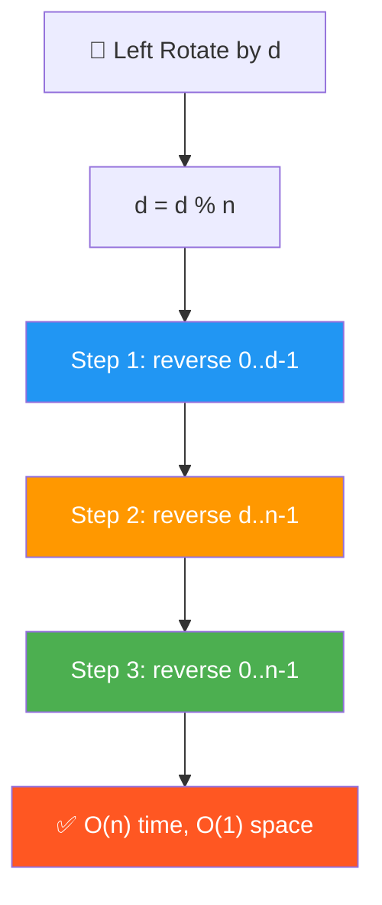
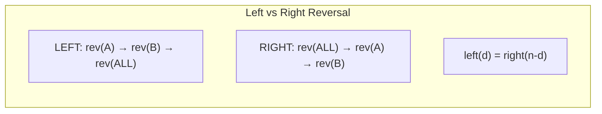

# 🔄 Rotate Array Left (Counterclockwise) — GfG (Easy)

> 📖 Code: [Rotate Array Left.js](./Rotate%20Array%20Left.js)
> 🔗 Xem thêm: [Rotate Array (Right)](./Rotate%20Array.md) — cùng pattern, đảo chiều!





---

## R — Repeat & Clarify

🧠 *"Left rotate d = d phần tử ĐẦU chuyển xuống CUỐI. Reversal: reverse(0..d-1) → reverse(d..n-1) → reverse(all)!"*

> 🎙️ *"Left rotate shifts elements to the left: first d elements go to the end, remaining shift forward."*

```
  Left Rotate vs Right Rotate:

  arr = [1, 2, 3, 4, 5, 6], d = 2

  LEFT rotate:  [3, 4, 5, 6, 1, 2]   ← đầu → cuối
  RIGHT rotate: [5, 6, 1, 2, 3, 4]   ← cuối → đầu

  ⚠️ Left rotate by d = Right rotate by (n - d)!
```

---

## E — Examples

```
VÍ DỤ 1: arr = [1, 2, 3, 4, 5, 6], d = 2

  Step 1: [2, 3, 4, 5, 6, 1]    ← 1 xuống cuối
  Step 2: [3, 4, 5, 6, 1, 2]    ← 2 xuống cuối

  d phần tử đầu [1, 2] → CUỐI
  n-d phần tử sau [3, 4, 5, 6] → ĐẦU

VÍ DỤ 2: arr = [1, 2, 3], d = 4
  d % n = 4 % 3 = 1 → left rotate 1
  [2, 3, 1] ✅
```

---

## A — Approach

### Reversal Algorithm cho LEFT rotate ✅

```
  Ngược với RIGHT rotate!

  RIGHT: reverse(ALL) → reverse(0..d-1) → reverse(d..n-1)
  LEFT:  reverse(0..d-1) → reverse(d..n-1) → reverse(ALL)

  Ví dụ: [1, 2, 3, 4, 5, 6], d = 2

    Step 1: reverse(0, 1) → [2, 1, 3, 4, 5, 6]
    Step 2: reverse(2, 5) → [2, 1, 6, 5, 4, 3]
    Step 3: reverse(0, 5) → [3, 4, 5, 6, 1, 2] ✅

  TẠI SAO ĐÚNG?
    [A | B] → [A' | B'] → [BA] = rotate left!
    reverse A, reverse B, reverse all = đưa B lên trước, A xuống sau
```

---

## C — Code

### Solution 1: One by One — O(n × d)

```javascript
function rotateLeftOneByOne(arr, d) {
  const n = arr.length;
  d %= n;

  for (let i = 0; i < d; i++) {
    const first = arr[0]; // Lưu đầu
    for (let j = 0; j < n - 1; j++) {
      arr[j] = arr[j + 1]; // Dồn trái 1 ô
    }
    arr[n - 1] = first; // Đặt đầu xuống cuối
  }
}
```

### Solution 2: Temp Array — O(n) space

```javascript
function rotateLeftTemp(arr, d) {
  const n = arr.length;
  d %= n;
  const temp = new Array(n);

  for (let i = 0; i < n - d; i++) temp[i] = arr[d + i];
  for (let i = 0; i < d; i++) temp[n - d + i] = arr[i];
  for (let i = 0; i < n; i++) arr[i] = temp[i];
}
```

### Solution 3: Reversal Algorithm — O(n), O(1) ✅

```javascript
function rotateLeft(arr, d) {
  const n = arr.length;
  if (n === 0) return;
  d %= n;
  if (d === 0) return;

  reverse(arr, 0, d - 1);     // Reverse d phần tử ĐẦU
  reverse(arr, d, n - 1);     // Reverse n-d phần tử CUỐI
  reverse(arr, 0, n - 1);     // Reverse TOÀN BỘ
}

function reverse(arr, start, end) {
  while (start < end) {
    [arr[start], arr[end]] = [arr[end], arr[start]];
    start++;
    end--;
  }
}
```

### Trace: [1, 2, 3, 4, 5, 6], d = 2

```
  Step 1: reverse(0, 1) — reverse [1, 2]
    [1, 2, 3, 4, 5, 6] → [2, 1, 3, 4, 5, 6]

  Step 2: reverse(2, 5) — reverse [3, 4, 5, 6]
    [2, 1, 3, 4, 5, 6] → [2, 1, 6, 5, 4, 3]

  Step 3: reverse(0, 5) — reverse all
    [2, 1, 6, 5, 4, 3] → [3, 4, 5, 6, 1, 2] ✅
```

---

## O — Optimize

```
                     Time       Space
  ─────────────────────────────────────
  One by One         O(n × d)   O(1)     Chậm!
  Temp Array         O(n)       O(n)     Tốn memory
  Reversal ✅        O(n)       O(1)     BEST!
  Juggling           O(n)       O(1)     Phức tạp

  💡 Trick: Left by d = Right by (n - d)!
  → Chỉ cần 1 hàm rotate + chuyển đổi d!
```

---

## T — Test

```
  [1,2,3,4,5,6] d=2  → [3,4,5,6,1,2]       ✅
  [1,2,3] d=4        → [2,3,1] (d%3=1)      ✅ d > n
  [1,2,3,4,5,6] d=0  → [1,2,3,4,5,6]        ✅ No rotation
  [1,2,3,4,5,6] d=6  → [1,2,3,4,5,6]        ✅ Full rotation
  [1] d=5             → [1]                   ✅ Single
```

---

## 🗣️ Interview Script

> 🎙️ *"For left rotation, the Reversal Algorithm reverses the first d elements, then the remaining n-d, then the entire array. This achieves O(n) time with O(1) space. Alternatively, left rotate by d equals right rotate by n-d — same algorithm, different parameter."*

### So sánh Left vs Right Reversal

```
  LEFT  rotate by d: reverse(0..d-1) → reverse(d..n-1) → reverse(ALL)
  RIGHT rotate by d: reverse(ALL) → reverse(0..d-1) → reverse(d..n-1)

  → Thứ tự reverse ngược nhau!
  → Hoặc: left(d) = right(n-d), chỉ cần 1 hàm!
```
