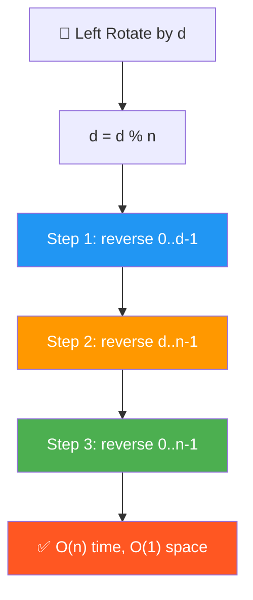
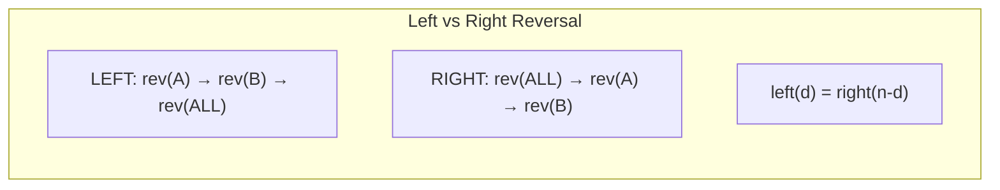
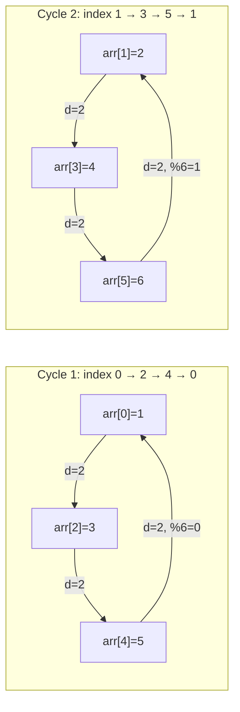

# 🔄 Rotate Array Left (Counterclockwise) — GfG (Easy)

> 📖 Code: [Rotate Array Left.js](./Rotate%20Array%20Left.js)
> 🔗 Xem thêm: [Rotate Array (Right)](./Rotate%20Array.md) — cùng pattern, đảo chiều!





---

## R — Repeat & Clarify

🧠 _"Left rotate d = d phần tử ĐẦU chuyển xuống CUỐI. Reversal: reverse(0..d-1) → reverse(d..n-1) → reverse(all)!"_

> 🎙️ _"Left rotate shifts elements to the left: first d elements go to the end, remaining shift forward."_

```
  Left Rotate vs Right Rotate:

  arr = [1, 2, 3, 4, 5, 6], d = 2

  LEFT rotate:  [3, 4, 5, 6, 1, 2]   ← đầu → cuối
  RIGHT rotate: [5, 6, 1, 2, 3, 4]   ← cuối → đầu

  ⚠️ Left rotate by d = Right rotate by (n - d)!

  Hình dung LEFT rotate = BÁN NGUYỆT quay NGƯỢC chiều kim đồng hồ:

    Trước: [1, 2, | 3, 4, 5, 6]
             ↑ d=2 ↑
           phần A    phần B

    Sau:   [3, 4, 5, 6, | 1, 2]
           phần B          phần A

    → d phần tử ĐẦU (A) nhảy XUỐNG CUỐI
    → n-d phần tử SAU (B) dồn LÊN ĐẦU
```

### Tại sao cần `d = d % n`?

```
  Tưởng tượng mảng NỐI ĐẦU VỚI CUỐI thành VÒNG TRÒN:

  arr = [A, B, C]    n = 3

        A
       / \
      C   B        ← 3 phần tử xếp thành vòng tròn
       \ /
        ·

  Left rotate 1 bước = xoay vòng tròn NGƯỢC chiều kim đồng hồ 1 bước:

  d=0:  [A, B, C]   ← chưa xoay
  d=1:  [B, C, A]   ← xoay 1
  d=2:  [C, A, B]   ← xoay 2
  d=3:  [A, B, C]   ← xoay 3 = VỀ GỐC! (đi đúng 1 vòng = 360°)
  d=4:  [B, C, A]   ← xoay 4 = xoay 1 (thêm 1 vòng thừa!)
  d=5:  [C, A, B]   ← xoay 5 = xoay 2
  d=6:  [A, B, C]   ← xoay 6 = VỀ GỐC LẦN NỮA!
  d=7:  [B, C, A]   ← xoay 7 = xoay 1
  ...

  NHÌN THẤY PATTERN — kết quả LẶP LẠI theo chu kỳ n=3:
    d=0 → [A,B,C]  ┐
    d=3 → [A,B,C]  ├─ d chia 3 DƯ 0 → cùng kết quả!
    d=6 → [A,B,C]  ┘

    d=1 → [B,C,A]  ┐
    d=4 → [B,C,A]  ├─ d chia 3 DƯ 1 → cùng kết quả!
    d=7 → [B,C,A]  ┘

    d=2 → [C,A,B]  ┐
    d=5 → [C,A,B]  ├─ d chia 3 DƯ 2 → cùng kết quả!
    d=8 → [C,A,B]  ┘

    → Chỉ có 3 kết quả khác nhau! (vì n=3)
    → d bao nhiêu cũng chỉ cần biết chia n DƯ bao nhiêu!
    → d % n = SỐ DƯ = số bước THỰC SỰ cần xoay!
```

```
  TRACE ví dụ cụ thể: n=3, d=7

  Không dùng %:
    d=7 → xoay 7 lần (mỗi lần dồn cả mảng!) → 7 × 3 = 21 thao tác!

  Dùng %:
    d = 7 % 3 = 1 → xoay 1 lần → 3 thao tác!
    Kiểm tra: 7 ÷ 3 = 2 dư 1 → đúng!

  Ví dụ khác:
    n=5, d=13 → d % 5 = 3 → chỉ xoay 3 bước!
    Kiểm tra: 13 ÷ 5 = 2 dư 3 ✅ (2 × 5 = 10, 13 - 10 = 3)

    n=4, d=10 → d % 4 = 2 → chỉ xoay 2 bước!
    Kiểm tra: 10 ÷ 4 = 2 dư 2 ✅ (2 × 4 = 8, 10 - 8 = 2)

  ⚠️ Các trường hợp đặc biệt:
    d = 0:     d % n = 0 → không xoay → GIỮA NGUYÊN ✅
    d = n:     d % n = 0 → xoay đủ 1 vòng → VỀ GỐC ✅
    d = 2n:    d % n = 0 → xoay đủ 2 vòng → VỀ GỐC ✅
    d < n:     d % n = d → giữ nguyên d (không thay đổi) ✅

  ⚠️ LUÔN viết d %= n ở ĐẦU mọi solution!
     Nếu quên: d = 1000000, n = 3 → vòng for chạy 1 TRIỆU lần!
```

```

---

## E — Examples

```

VÍ DỤ 1: arr = [1, 2, 3, 4, 5, 6], d = 2

Hiểu từng bước xoay:

Bước 1: Phần tử đầu (1) ra khỏi mảng → tất cả dồn trái → 1 vào cuối
[1, 2, 3, 4, 5, 6] → [2, 3, 4, 5, 6, 1]
↑ lấy ra ↑ đặt cuối

Bước 2: Phần tử đầu (2) ra khỏi mảng → tất cả dồn trái → 2 vào cuối
[2, 3, 4, 5, 6, 1] → [3, 4, 5, 6, 1, 2]
↑ lấy ra ↑ đặt cuối

Kết quả: [3, 4, 5, 6, 1, 2] ✅

Nhìn tổng thể:
A = [1, 2] (d phần tử đầu)
B = [3, 4, 5, 6] (n-d phần tử sau)
[A | B] → [B | A] = [3, 4, 5, 6, 1, 2] ✅

VÍ DỤ 2: arr = [1, 2, 3], d = 4
d % n = 4 % 3 = 1 → left rotate 1
[2, 3, 1] ✅

```

### Edge Cases

```

[1, 2, 3] d=0 → [1, 2, 3] ← d%n=0, không xoay
[1, 2, 3] d=3 → [1, 2, 3] ← d%n=0, xoay đủ 1 vòng = về gốc!
[1, 2, 3] d=7 → [2, 3, 1] ← d%n=1, 7 bước = 2 vòng + 1 bước
[5] d=99 → [5] ← 1 phần tử thì xoay kiểu gì cũng giữ nguyên!

```

---

## A — Approach

### Approach 1: One by One — O(n × d)

```

Ý tưởng: Xoay 1 bước, lặp lại d lần!
Mỗi bước: lấy phần tử ĐẦU → dồn tất cả TRÁI → đặt vào CUỐI

arr = [1, 2, 3, 4, 5], d=2

Lần 1:
first = arr[0] = 1 ← lưu phần tử đầu
arr[0] = arr[1] = 2 ← dồn trái
arr[1] = arr[2] = 3
arr[2] = arr[3] = 4
arr[3] = arr[4] = 5
arr[4] = first = 1 ← đặt cuối
→ [2, 3, 4, 5, 1]

Lần 2:
first = arr[0] = 2
dồn trái...
arr[4] = 2
→ [3, 4, 5, 1, 2] ✅

⚠️ Mỗi lần dồn = O(n), lặp d lần → O(n × d)
d lớn → RẤT CHẬM! d = n/2 → O(n²)!

```

### Approach 2: Temp Array — O(n) space

```

Ý tưởng: Copy phần B TRƯỚC, copy phần A SAU vào mảng mới!

arr = [1, 2, 3, 4, 5, 6], d = 2
A | B

temp = [_, _, _, _, _, _]

Bước 1: Copy B (index d → n-1) vào đầu temp:
temp[0] = arr[2] = 3
temp[1] = arr[3] = 4
temp[2] = arr[4] = 5
temp[3] = arr[5] = 6
→ Công thức: temp[i] = arr[d + i] (i = 0 → n-d-1)

Bước 2: Copy A (index 0 → d-1) vào cuối temp:
temp[4] = arr[0] = 1
temp[5] = arr[1] = 2
→ Công thức: temp[n-d+i] = arr[i] (i = 0 → d-1)

temp = [3, 4, 5, 6, 1, 2] ✅

Bước 3: Copy temp → arr

⚠️ Nhanh O(n) nhưng TỐN O(n) bộ nhớ THÊM!

```

### Approach 3: Reversal Algorithm — O(n), O(1) ✅

```

Ý tưởng: 3 lần reverse = rotate!

LEFT rotate:
Step 1: reverse(0, d-1) ← reverse phần A (d phần tử đầu)
Step 2: reverse(d, n-1) ← reverse phần B (n-d phần tử sau)
Step 3: reverse(0, n-1) ← reverse TOÀN BỘ

Ví dụ: [1, 2, 3, 4, 5, 6], d = 2

    Ban đầu: [1, 2 | 3, 4, 5, 6]
              ──A──  ────B────

    Step 1: reverse A → [2, 1 | 3, 4, 5, 6]
    Step 2: reverse B → [2, 1 | 6, 5, 4, 3]
    Step 3: reverse ALL → [3, 4, 5, 6, 1, 2] ✅

TẠI SAO ĐÚNG? Chứng minh bằng ký hiệu:
Gọi phần A = [a₁, a₂], phần B = [b₁, b₂, b₃, b₄]

    Ban đầu:  [a₁, a₂ | b₁, b₂, b₃, b₄]
    Step 1:   [a₂, a₁ | b₁, b₂, b₃, b₄]     ← A lật
    Step 2:   [a₂, a₁ | b₄, b₃, b₂, b₁]     ← B lật
    Step 3:   [b₁, b₂, b₃, b₄, a₁, a₂]       ← ALL lật → B trước A! ✅

💡 Quy tắc: reverse(reverse(A) + reverse(B)) = B + A
→ Đổi thứ tự 2 khối mà KHÔNG cần bộ nhớ thêm!

```

### Approach 4: Juggling Algorithm — O(n), O(1)

```

💡 Ý tưởng: Di chuyển phần tử TRỰC TIẾP đến vị trí đúng!
Mỗi phần tử ở index i → sẽ đến index (i - d + n) % n

Vấn đề: Nếu di chuyển arr[0] → arr[4], thì arr[4] cũ đi đâu?
→ Lưu tạm arr[0], đặt arr[4] vào arr[0], rồi tìm chỗ cho arr[4] cũ...
→ Tạo ra 1 CHUỖI di chuyển vòng tròn (CYCLE)!

⚠️ 1 cycle KHÔNG NHẤT THIẾT đi qua tất cả phần tử!
Số cycles = GCD(n, d)
Mỗi cycle xử lý n / GCD(n, d) phần tử
Tổng: GCD(n,d) × n/GCD(n,d) = n phần tử ✅

```

```

TRACE: arr = [1, 2, 3, 4, 5, 6], n=6, d=2

GCD(6, 2) = 2 → CÓ 2 cycles!

┌─ Cycle 1: bắt đầu từ index 0 ──────────────────────────────┐
│ │
│ temp = arr[0] = 1 │
│ │
│ i=0: arr[0] = arr[(0+2) % 6] = arr[2] = 3 │
│ [3, 2, 3, 4, 5, 6] │
│ ↑ mới │
│ │
│ i=2: arr[2] = arr[(2+2) % 6] = arr[4] = 5 │
│ [3, 2, 5, 4, 5, 6] │
│ ↑ mới │
│ │
│ i=4: arr[4] = temp = 1 ← quay lại start! (4+2)%6=0 │
│ [3, 2, 5, 4, 1, 6] │
│ ↑ mới │
│ │
│ Cycle 1 di chuyển: 0 → 2 → 4 → 0 (vòng tròn!) │
│ Processed: index 0, 2, 4 (3 phần tử = n/gcd = 6/2) │
└──────────────────────────────────────────────────────────────┘

┌─ Cycle 2: bắt đầu từ index 1 ──────────────────────────────┐
│ │
│ temp = arr[1] = 2 │
│ │
│ i=1: arr[1] = arr[(1+2) % 6] = arr[3] = 4 │
│ [3, 4, 5, 4, 1, 6] │
│ ↑ mới │
│ │
│ i=3: arr[3] = arr[(3+2) % 6] = arr[5] = 6 │
│ [3, 4, 5, 6, 1, 6] │
│ ↑ mới │
│ │
│ i=5: arr[5] = temp = 2 ← quay lại start! (5+2)%6=1 │
│ [3, 4, 5, 6, 1, 2] │
│ ↑ mới │
│ │
│ Cycle 2 di chuyển: 1 → 3 → 5 → 1 (vòng tròn!) │
│ Processed: index 1, 3, 5 (3 phần tử) │
└──────────────────────────────────────────────────────────────┘

Kết quả: [3, 4, 5, 6, 1, 2] ✅
Tổng: 2 cycles × 3 phần tử mỗi cycle = 6 = n ✅

````


  TẠI SAO SỐ CYCLES = GCD(n, d)?

  Cycle bắt đầu từ index s, đi qua: s, s+d, s+2d, s+3d, ... (mod n)
  Cycle QUAY LẠI start khi: s + k×d ≡ s (mod n) → k×d là bội của n
  → k nhỏ nhất = n / GCD(n, d) = số phần tử MỖI cycle
  → Tổng: n phần tử / (n/GCD) phần tử mỗi cycle = GCD(n,d) cycles

  Ví dụ:
    n=6, d=2 → GCD=2 → 2 cycles, mỗi cycle 3 phần tử
    n=6, d=3 → GCD=3 → 3 cycles, mỗi cycle 2 phần tử
    n=6, d=1 → GCD=1 → 1 cycle,  mỗi cycle 6 phần tử (1 vòng đi hết!)
    n=5, d=2 → GCD=1 → 1 cycle,  mỗi cycle 5 phần tử
```

### So sánh tất cả approaches

```
  ┌──────────────────┬──────────┬──────────┬────────────────────────┐
  │                  │ Time     │ Space    │ Ghi chú                 │
  ├──────────────────┼──────────┼──────────┼────────────────────────┤
  │ One by One       │ O(n × d) │ O(1)     │ Chậm! d lớn → O(n²)   │
  │ Temp Array       │ O(n)     │ O(n)     │ Nhanh nhưng tốn memory │
  │ Reversal ⭐      │ O(n)     │ O(1)     │ Best! Dễ nhớ!          │
  │ Juggling         │ O(n)     │ O(1)     │ Trực tiếp, khó hiểu    │
  └──────────────────┴──────────┴──────────┴────────────────────────┘

  📌 Phỏng vấn: dùng Reversal (dễ giải thích!)
     Follow-up: interviewer hỏi Juggling → biết thêm điểm!
```

---

## C — Code

### Solution 1: One by One — O(n × d)

```javascript
function rotateLeftOneByOne(arr, d) {
  // arr = [1, 2, 3], d = 2
  const n = arr.length;
  d %= n; // d = 2 % 3 = 2

  for (let i = 0; i < d; i++) {
    // i = 0, 1
    const first = arr[0]; // Lưu đầu [1]
    for (let j = 0; j < n - 1; j++) {
      // j = 0, 1
      arr[j] = arr[j + 1]; // Dồn trái 1 ô // arr[0] = arr[0 + 1] & arr[1] = arr[1 + 1]
    }
    arr[n - 1] = first; // Đặt đầu xuống cuối
  }
}
```

```
  Giải thích:
    Vòng NGOÀI (i): lặp d lần, mỗi lần xoay 1 bước
    Vòng TRONG (j): dồn TẤT CẢ phần tử sang trái 1 ô

  Tại sao j < n - 1 mà không phải j < n?
    j=0: arr[0] = arr[1]     ← phần tử 1 dồn về 0
    j=1: arr[1] = arr[2]     ← phần tử 2 dồn về 1
    ...
    j=n-2: arr[n-2] = arr[n-1]  ← phần tử cuối dồn về n-2
    j=n-1: arr[n-1] = arr[n] ← arr[n] = UNDEFINED! 💀

    → j < n-1 để KHÔNG truy cập arr[n] (out of bounds!)
    → arr[n-1] = first → đặt phần tử đầu vào cuối
```

### Solution 2: Temp Array — O(n) space

```javascript
function rotateLeftTemp(arr, d) {
  const n = arr.length;
  d %= n;
  const temp = new Array(n);

  // Copy phần B (index d → n-1) vào ĐẦU temp
  for (let i = 0; i < n - d; i++) temp[i] = arr[d + i];
  // Copy phần A (index 0 → d-1) vào CUỐI temp
  for (let i = 0; i < d; i++) temp[n - d + i] = arr[i];
  // Copy temp → arr
  for (let i = 0; i < n; i++) arr[i] = temp[i];
}
```

```
  Giải thích từng vòng:

  arr = [1, 2, 3, 4, 5, 6], d=2, n=6
         A     |     B

  Vòng 1: temp[i] = arr[d + i]  (i = 0 → n-d-1 = 3)
    temp[0] = arr[2] = 3
    temp[1] = arr[3] = 4
    temp[2] = arr[4] = 5
    temp[3] = arr[5] = 6
    → Copy B lên ĐẦU

  Vòng 2: temp[n-d+i] = arr[i]  (i = 0 → d-1 = 1)
    temp[4] = arr[0] = 1     ← n-d+0 = 4
    temp[5] = arr[1] = 2     ← n-d+1 = 5
    → Copy A xuống CUỐI

  Vòng 3: arr[i] = temp[i]  (copy lại)

  ⚠️ Tại sao n-d+i?
     Phần A có d phần tử, đặt SAU phần B (n-d phần tử)
     → Offset = n - d
     → temp[n-d], temp[n-d+1], ..., temp[n-1]
```

### Solution 3: Reversal Algorithm — O(n), O(1) ✅

```javascript
function rotateLeft(arr, d) {
  const n = arr.length;
  if (n === 0) return;
  d %= n;
  if (d === 0) return;

  reverse(arr, 0, d - 1); // Reverse d phần tử ĐẦU
  reverse(arr, d, n - 1); // Reverse n-d phần tử CUỐI
  reverse(arr, 0, n - 1); // Reverse TOÀN BỘ
}

function reverse(arr, start, end) {
  while (start < end) {
    [arr[start], arr[end]] = [arr[end], arr[start]];
    start++;
    end--;
  }
}
```

### Trace Reversal: [1, 2, 3, 4, 5, 6], d = 2

```
  d %= 6 → d = 2 ✅

  Step 1: reverse(arr, 0, 1) — reverse phần A [1, 2]
    L=0, R=1: swap(1, 2)
    [1, 2, 3, 4, 5, 6] → [2, 1, 3, 4, 5, 6]
     ╰──╯ A reversed

  Step 2: reverse(arr, 2, 5) — reverse phần B [3, 4, 5, 6]
    L=2, R=5: swap(3, 6) → [2, 1, 6, 4, 5, 3]
    L=3, R=4: swap(4, 5) → [2, 1, 6, 5, 4, 3]
              ╰──────────╯ B reversed

  Step 3: reverse(arr, 0, 5) — reverse TOÀN BỘ [2, 1, 6, 5, 4, 3]
    L=0, R=5: swap(2, 3) → [3, 1, 6, 5, 4, 2]
    L=1, R=4: swap(1, 4) → [3, 4, 6, 5, 1, 2]
    L=2, R=3: swap(6, 5) → [3, 4, 5, 6, 1, 2]
    ╰────────────────────╯ ALL reversed

  Kết quả: [3, 4, 5, 6, 1, 2] ✅

  Tổng swaps: 1 + 2 + 3 = 6 = n (mỗi phần tử swap đúng 1 lần!)
```

### Solution 4: Juggling Algorithm — O(n), O(1)

```javascript
function rotateLeftJuggling(arr, d) {
  const n = arr.length;
  d %= n;
  if (d === 0) return;

  const cycles = gcd(n, d); // Số cycles cần chạy

  for (let i = 0; i < cycles; i++) {
    const temp = arr[i]; // Lưu phần tử ĐẦU cycle
    let j = i;

    while (true) {
      const next = (j + d) % n; // Vị trí nguồn
      if (next === i) break; // Quay lại start → xong cycle!
      arr[j] = arr[next]; // Di chuyển phần tử
      j = next;
    }

    arr[j] = temp; // Đặt phần tử đầu vào vị trí cuối của cycle
  }
}

function gcd(a, b) {
  while (b > 0) {
    [a, b] = [b, a % b];
  }
  return a;
}
```

```
  Giải thích từng dòng:

  const cycles = gcd(n, d)
    → Số vòng tròn di chuyển cần thực hiện
    → gcd(6, 2) = 2 → 2 cycles

  for (let i = 0; i < cycles; i++)
    → Mỗi cycle bắt đầu từ index i (0, 1, ..., gcd-1)

  const temp = arr[i]
    → Lưu phần tử ĐẦU cycle (sẽ bị ghi đè!)

  const next = (j + d) % n
    → Phần tử ở index "next" sẽ đến index "j"
    → % n để quay vòng (wrap around)!

  if (next === i) break
    → Đã quay lại vị trí bắt đầu → cycle XONG!

  arr[j] = temp
    → Phần tử lưu tạm đặt vào vị trí cuối cùng
```

### Trace Juggling CHI TIẾT: [1, 2, 3, 4, 5, 6], d=2

```
  GCD(6, 2) = 2 → 2 cycles

  ┌─ Cycle i=0 ─────────────────────────────────────────────────┐
  │  temp = arr[0] = 1                                          │
  │                                                              │
  │  j=0: next = (0+2)%6 = 2                                    │
  │       next ≠ 0 → arr[0] = arr[2] = 3     j=2               │
  │       [3, 2, 3, 4, 5, 6]                                    │
  │                                                              │
  │  j=2: next = (2+2)%6 = 4                                    │
  │       next ≠ 0 → arr[2] = arr[4] = 5     j=4               │
  │       [3, 2, 5, 4, 5, 6]                                    │
  │                                                              │
  │  j=4: next = (4+2)%6 = 0                                    │
  │       next === 0 → BREAK!                                    │
  │       arr[4] = temp = 1                                      │
  │       [3, 2, 5, 4, 1, 6]                                    │
  │                                                              │
  │  Di chuyển: 0←2←4←(temp)  (ngược chiều: 0→2→4→0)          │
  └──────────────────────────────────────────────────────────────┘

  ┌─ Cycle i=1 ─────────────────────────────────────────────────┐
  │  temp = arr[1] = 2                                          │
  │                                                              │
  │  j=1: next = (1+2)%6 = 3                                    │
  │       next ≠ 1 → arr[1] = arr[3] = 4     j=3               │
  │       [3, 4, 5, 4, 1, 6]                                    │
  │                                                              │
  │  j=3: next = (3+2)%6 = 5                                    │
  │       next ≠ 1 → arr[3] = arr[5] = 6     j=5               │
  │       [3, 4, 5, 6, 1, 6]                                    │
  │                                                              │
  │  j=5: next = (5+2)%6 = 1                                    │
  │       next === 1 → BREAK!                                    │
  │       arr[5] = temp = 2                                      │
  │       [3, 4, 5, 6, 1, 2]                                    │
  └──────────────────────────────────────────────────────────────┘

  Kết quả: [3, 4, 5, 6, 1, 2] ✅
```

---

## O — Optimize

```
                     Time       Space     Swaps/Moves
  ──────────────────────────────────────────────────────
  One by One         O(n × d)   O(1)      n × d moves
  Temp Array         O(n)       O(n)      2n copies
  Reversal ✅        O(n)       O(1)      n swaps
  Juggling           O(n)       O(1)      n moves

  💡 Trick: Left by d = Right by (n - d)!
  → Chỉ cần 1 hàm rotate + chuyển đổi d!

  Reversal vs Juggling:
    Reversal: dễ nhớ, dễ code, dễ giải thích → PHỎNG VẤN ⭐
    Juggling: ít cache miss hơn (mỗi phần tử move 1 lần)
              nhưng khó giải thích → follow-up bonus
```

---

## T — Test

```
  [1,2,3,4,5,6] d=2  → [3,4,5,6,1,2]       ✅
  [1,2,3] d=4        → [2,3,1] (d%3=1)      ✅ d > n
  [1,2,3,4,5,6] d=0  → [1,2,3,4,5,6]        ✅ No rotation
  [1,2,3,4,5,6] d=6  → [1,2,3,4,5,6]        ✅ Full rotation
  [1] d=5             → [1]                   ✅ Single
  [1,2,3,4,5] d=2    → [3,4,5,1,2]           ✅ GCD(5,2)=1 → 1 cycle
```

---

## 🗣️ Interview Script

> 🎙️ _"For left rotation, the Reversal Algorithm reverses the first d elements, then the remaining n-d, then the entire array. This achieves O(n) time with O(1) space. Alternatively, left rotate by d equals right rotate by n-d — same algorithm, different parameter."_

### So sánh Left vs Right Reversal

```
  LEFT  rotate by d: reverse(0..d-1) → reverse(d..n-1) → reverse(ALL)
  RIGHT rotate by d: reverse(ALL) → reverse(0..d-1) → reverse(d..n-1)

  → Thứ tự reverse ngược nhau!
  → Hoặc: left(d) = right(n-d), chỉ cần 1 hàm!
```
