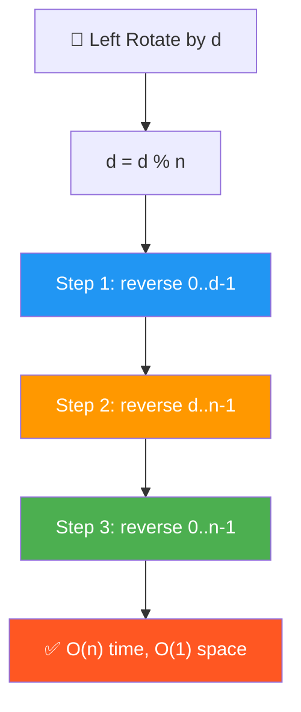
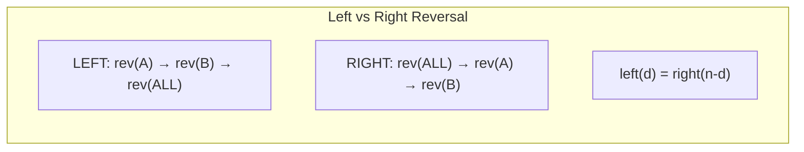
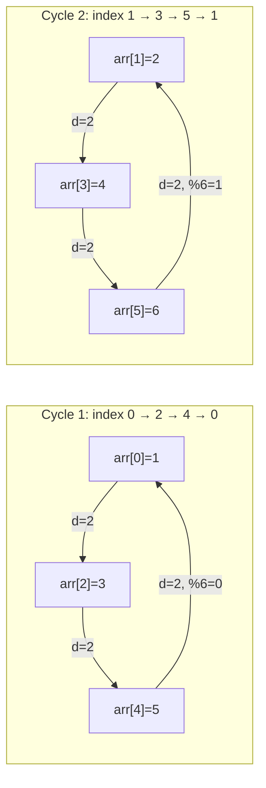

# 🔄 Rotate Array Left (Counterclockwise) — GfG (Easy)

> 📖 Code: [Rotate Array Left.js](./Rotate%20Array%20Left.js)
> 🔗 Xem thêm: [Rotate Array (Right)](./Rotate%20Array.md) — cùng pattern, đảo chiều!





---

## R — Repeat & Clarify

🧠 _"Left rotate d = d phần tử ĐẦU chuyển xuống CUỐI. Reversal: reverse(0..d-1) → reverse(d..n-1) → reverse(all)!"_

> 🎙️ _"Left rotate shifts elements to the left: first d elements go to the end, remaining shift forward."_

```
  Left Rotate vs Right Rotate:

  arr = [1, 2, 3, 4, 5, 6], d = 2

  LEFT rotate:  [3, 4, 5, 6, 1, 2]   ← đầu → cuối
  RIGHT rotate: [5, 6, 1, 2, 3, 4]   ← cuối → đầu

  ⚠️ Left rotate by d = Right rotate by (n - d)!

  Hình dung LEFT rotate = BÁN NGUYỆT quay NGƯỢC chiều kim đồng hồ:

    Trước: [1, 2, | 3, 4, 5, 6]
             ↑ d=2 ↑
           phần A    phần B

    Sau:   [3, 4, 5, 6, | 1, 2]
           phần B          phần A

    → d phần tử ĐẦU (A) nhảy XUỐNG CUỐI
    → n-d phần tử SAU (B) dồn LÊN ĐẦU
```

### Tại sao cần `d = d % n`?

```
  Tưởng tượng mảng NỐI ĐẦU VỚI CUỐI thành VÒNG TRÒN:

  arr = [A, B, C]    n = 3

        A
       / \
      C   B        ← 3 phần tử xếp thành vòng tròn
       \ /
        ·

  Left rotate 1 bước = xoay vòng tròn NGƯỢC chiều kim đồng hồ 1 bước:

  d=0:  [A, B, C]   ← chưa xoay
  d=1:  [B, C, A]   ← xoay 1
  d=2:  [C, A, B]   ← xoay 2
  d=3:  [A, B, C]   ← xoay 3 = VỀ GỐC! (đi đúng 1 vòng = 360°)
  d=4:  [B, C, A]   ← xoay 4 = xoay 1 (thêm 1 vòng thừa!)
  d=5:  [C, A, B]   ← xoay 5 = xoay 2
  d=6:  [A, B, C]   ← xoay 6 = VỀ GỐC LẦN NỮA!
  d=7:  [B, C, A]   ← xoay 7 = xoay 1
  ...

  NHÌN THẤY PATTERN — kết quả LẶP LẠI theo chu kỳ n=3:
    d=0 → [A,B,C]  ┐
    d=3 → [A,B,C]  ├─ d chia 3 DƯ 0 → cùng kết quả!
    d=6 → [A,B,C]  ┘

    d=1 → [B,C,A]  ┐
    d=4 → [B,C,A]  ├─ d chia 3 DƯ 1 → cùng kết quả!
    d=7 → [B,C,A]  ┘

    d=2 → [C,A,B]  ┐
    d=5 → [C,A,B]  ├─ d chia 3 DƯ 2 → cùng kết quả!
    d=8 → [C,A,B]  ┘

    → Chỉ có 3 kết quả khác nhau! (vì n=3)
    → d bao nhiêu cũng chỉ cần biết chia n DƯ bao nhiêu!
    → d % n = SỐ DƯ = số bước THỰC SỰ cần xoay!
```

```
  TRACE ví dụ cụ thể: n=3, d=7

  Không dùng %:
    d=7 → xoay 7 lần (mỗi lần dồn cả mảng!) → 7 × 3 = 21 thao tác!

  Dùng %:
    d = 7 % 3 = 1 → xoay 1 lần → 3 thao tác!
    Kiểm tra: 7 ÷ 3 = 2 dư 1 → đúng!

  Ví dụ khác:
    n=5, d=13 → d % 5 = 3 → chỉ xoay 3 bước!
    Kiểm tra: 13 ÷ 5 = 2 dư 3 ✅ (2 × 5 = 10, 13 - 10 = 3)

    n=4, d=10 → d % 4 = 2 → chỉ xoay 2 bước!
    Kiểm tra: 10 ÷ 4 = 2 dư 2 ✅ (2 × 4 = 8, 10 - 8 = 2)

  ⚠️ Các trường hợp đặc biệt:
    d = 0:     d % n = 0 → không xoay → GIỮA NGUYÊN ✅
    d = n:     d % n = 0 → xoay đủ 1 vòng → VỀ GỐC ✅
    d = 2n:    d % n = 0 → xoay đủ 2 vòng → VỀ GỐC ✅
    d < n:     d % n = d → giữ nguyên d (không thay đổi) ✅

  ⚠️ LUÔN viết d %= n ở ĐẦU mọi solution!
     Nếu quên: d = 1000000, n = 3 → vòng for chạy 1 TRIỆU lần!
```

```

---

## E — Examples

```

VÍ DỤ 1: arr = [1, 2, 3, 4, 5, 6], d = 2

Hiểu từng bước xoay:

Bước 1: Phần tử đầu (1) ra khỏi mảng → tất cả dồn trái → 1 vào cuối
[1, 2, 3, 4, 5, 6] → [2, 3, 4, 5, 6, 1]
↑ lấy ra ↑ đặt cuối

Bước 2: Phần tử đầu (2) ra khỏi mảng → tất cả dồn trái → 2 vào cuối
[2, 3, 4, 5, 6, 1] → [3, 4, 5, 6, 1, 2]
↑ lấy ra ↑ đặt cuối

Kết quả: [3, 4, 5, 6, 1, 2] ✅

Nhìn tổng thể:
A = [1, 2] (d phần tử đầu)
B = [3, 4, 5, 6] (n-d phần tử sau)
[A | B] → [B | A] = [3, 4, 5, 6, 1, 2] ✅

VÍ DỤ 2: arr = [1, 2, 3], d = 4
d % n = 4 % 3 = 1 → left rotate 1
[2, 3, 1] ✅

```

### Edge Cases

```

[1, 2, 3] d=0 → [1, 2, 3] ← d%n=0, không xoay
[1, 2, 3] d=3 → [1, 2, 3] ← d%n=0, xoay đủ 1 vòng = về gốc!
[1, 2, 3] d=7 → [2, 3, 1] ← d%n=1, 7 bước = 2 vòng + 1 bước
[5] d=99 → [5] ← 1 phần tử thì xoay kiểu gì cũng giữ nguyên!

```

---

## A — Approach

### Approach 1: One by One — O(n × d)

```

Ý tưởng: Xoay 1 bước, lặp lại d lần!
Mỗi bước: lấy phần tử ĐẦU → dồn tất cả TRÁI → đặt vào CUỐI

arr = [1, 2, 3, 4, 5], d=2

Lần 1:
first = arr[0] = 1 ← lưu phần tử đầu
arr[0] = arr[1] = 2 ← dồn trái
arr[1] = arr[2] = 3
arr[2] = arr[3] = 4
arr[3] = arr[4] = 5
arr[4] = first = 1 ← đặt cuối
→ [2, 3, 4, 5, 1]

Lần 2:
first = arr[0] = 2
dồn trái...
arr[4] = 2
→ [3, 4, 5, 1, 2] ✅

⚠️ Mỗi lần dồn = O(n), lặp d lần → O(n × d)
d lớn → RẤT CHẬM! d = n/2 → O(n²)!

```

### Approach 2: Temp Array — O(n) space

```

Ý tưởng: Copy phần B TRƯỚC, copy phần A SAU vào mảng mới!

arr = [1, 2, 3, 4, 5, 6], d = 2
A | B

temp = [_, _, _, _, _, _]

Bước 1: Copy B (index d → n-1) vào đầu temp:
temp[0] = arr[2] = 3
temp[1] = arr[3] = 4
temp[2] = arr[4] = 5
temp[3] = arr[5] = 6
→ Công thức: temp[i] = arr[d + i] (i = 0 → n-d-1)

Bước 2: Copy A (index 0 → d-1) vào cuối temp:
temp[4] = arr[0] = 1
temp[5] = arr[1] = 2
→ Công thức: temp[n-d+i] = arr[i] (i = 0 → d-1)

temp = [3, 4, 5, 6, 1, 2] ✅

Bước 3: Copy temp → arr

⚠️ Nhanh O(n) nhưng TỐN O(n) bộ nhớ THÊM!

```

### Approach 3: Reversal Algorithm — O(n), O(1) ✅

```

Ý tưởng: 3 lần reverse = rotate!

LEFT rotate:
Step 1: reverse(0, d-1) ← reverse phần A (d phần tử đầu)
Step 2: reverse(d, n-1) ← reverse phần B (n-d phần tử sau)
Step 3: reverse(0, n-1) ← reverse TOÀN BỘ

Ví dụ: [1, 2, 3, 4, 5, 6], d = 2

    Ban đầu: [1, 2 | 3, 4, 5, 6]
              ──A──  ────B────

    Step 1: reverse A → [2, 1 | 3, 4, 5, 6]
    Step 2: reverse B → [2, 1 | 6, 5, 4, 3]
    Step 3: reverse ALL → [3, 4, 5, 6, 1, 2] ✅

TẠI SAO ĐÚNG? Chứng minh bằng ký hiệu:
Gọi phần A = [a₁, a₂], phần B = [b₁, b₂, b₃, b₄]

    Ban đầu:  [a₁, a₂ | b₁, b₂, b₃, b₄]
    Step 1:   [a₂, a₁ | b₁, b₂, b₃, b₄]     ← A lật
    Step 2:   [a₂, a₁ | b₄, b₃, b₂, b₁]     ← B lật
    Step 3:   [b₁, b₂, b₃, b₄, a₁, a₂]       ← ALL lật → B trước A! ✅

💡 Quy tắc: reverse(reverse(A) + reverse(B)) = B + A
→ Đổi thứ tự 2 khối mà KHÔNG cần bộ nhớ thêm!

```

### Approach 4: Juggling Algorithm — O(n), O(1)

```

💡 Ý tưởng: Di chuyển phần tử TRỰC TIẾP đến vị trí đúng!
Mỗi phần tử ở index i → sẽ đến index (i - d + n) % n

Vấn đề: Nếu di chuyển arr[0] → arr[4], thì arr[4] cũ đi đâu?
→ Lưu tạm arr[0], đặt arr[4] vào arr[0], rồi tìm chỗ cho arr[4] cũ...
→ Tạo ra 1 CHUỖI di chuyển vòng tròn (CYCLE)!

⚠️ 1 cycle KHÔNG NHẤT THIẾT đi qua tất cả phần tử!
Số cycles = GCD(n, d)
Mỗi cycle xử lý n / GCD(n, d) phần tử
Tổng: GCD(n,d) × n/GCD(n,d) = n phần tử ✅

```

```

TRACE: arr = [1, 2, 3, 4, 5, 6], n=6, d=2

GCD(6, 2) = 2 → CÓ 2 cycles!

┌─ Cycle 1: bắt đầu từ index 0 ──────────────────────────────┐
│ │
│ temp = arr[0] = 1 │
│ │
│ i=0: arr[0] = arr[(0+2) % 6] = arr[2] = 3 │
│ [3, 2, 3, 4, 5, 6] │
│ ↑ mới │
│ │
│ i=2: arr[2] = arr[(2+2) % 6] = arr[4] = 5 │
│ [3, 2, 5, 4, 5, 6] │
│ ↑ mới │
│ │
│ i=4: arr[4] = temp = 1 ← quay lại start! (4+2)%6=0 │
│ [3, 2, 5, 4, 1, 6] │
│ ↑ mới │
│ │
│ Cycle 1 di chuyển: 0 → 2 → 4 → 0 (vòng tròn!) │
│ Processed: index 0, 2, 4 (3 phần tử = n/gcd = 6/2) │
└──────────────────────────────────────────────────────────────┘

┌─ Cycle 2: bắt đầu từ index 1 ──────────────────────────────┐
│ │
│ temp = arr[1] = 2 │
│ │
│ i=1: arr[1] = arr[(1+2) % 6] = arr[3] = 4 │
│ [3, 4, 5, 4, 1, 6] │
│ ↑ mới │
│ │
│ i=3: arr[3] = arr[(3+2) % 6] = arr[5] = 6 │
│ [3, 4, 5, 6, 1, 6] │
│ ↑ mới │
│ │
│ i=5: arr[5] = temp = 2 ← quay lại start! (5+2)%6=1 │
│ [3, 4, 5, 6, 1, 2] │
│ ↑ mới │
│ │
│ Cycle 2 di chuyển: 1 → 3 → 5 → 1 (vòng tròn!) │
│ Processed: index 1, 3, 5 (3 phần tử) │
└──────────────────────────────────────────────────────────────┘

Kết quả: [3, 4, 5, 6, 1, 2] ✅
Tổng: 2 cycles × 3 phần tử mỗi cycle = 6 = n ✅

````


  TẠI SAO SỐ CYCLES = GCD(n, d)?

  Cycle bắt đầu từ index s, đi qua: s, s+d, s+2d, s+3d, ... (mod n)
  Cycle QUAY LẠI start khi: s + k×d ≡ s (mod n) → k×d là bội của n
  → k nhỏ nhất = n / GCD(n, d) = số phần tử MỖI cycle
  → Tổng: n phần tử / (n/GCD) phần tử mỗi cycle = GCD(n,d) cycles

  Ví dụ:
    n=6, d=2 → GCD=2 → 2 cycles, mỗi cycle 3 phần tử
    n=6, d=3 → GCD=3 → 3 cycles, mỗi cycle 2 phần tử
    n=6, d=1 → GCD=1 → 1 cycle,  mỗi cycle 6 phần tử (1 vòng đi hết!)
    n=5, d=2 → GCD=1 → 1 cycle,  mỗi cycle 5 phần tử
```

### So sánh tất cả approaches

```
  ┌──────────────────┬──────────┬──────────┬────────────────────────┐
  │                  │ Time     │ Space    │ Ghi chú                 │
  ├──────────────────┼──────────┼──────────┼────────────────────────┤
  │ One by One       │ O(n × d) │ O(1)     │ Chậm! d lớn → O(n²)   │
  │ Temp Array       │ O(n)     │ O(n)     │ Nhanh nhưng tốn memory │
  │ Reversal ⭐      │ O(n)     │ O(1)     │ Best! Dễ nhớ!          │
  │ Juggling         │ O(n)     │ O(1)     │ Trực tiếp, khó hiểu    │
  └──────────────────┴──────────┴──────────┴────────────────────────┘

  📌 Phỏng vấn: dùng Reversal (dễ giải thích!)
     Follow-up: interviewer hỏi Juggling → biết thêm điểm!
```

---

## C — Code

### Solution 1: One by One — O(n × d)

```javascript
function rotateLeftOneByOne(arr, d) {
  // arr = [1, 2, 3], d = 2
  const n = arr.length;
  d %= n; // d = 2 % 3 = 2

  for (let i = 0; i < d; i++) {
    // i = 0, 1
    const first = arr[0]; // Lưu đầu [1]
    for (let j = 0; j < n - 1; j++) {
      // j = 0, 1
      arr[j] = arr[j + 1]; // Dồn trái 1 ô // arr[0] = arr[0 + 1] & arr[1] = arr[1 + 1]
    }
    arr[n - 1] = first; // Đặt đầu xuống cuối
  }
}
```

```
  Giải thích:
    Vòng NGOÀI (i): lặp d lần, mỗi lần xoay 1 bước
    Vòng TRONG (j): dồn TẤT CẢ phần tử sang trái 1 ô

  Tại sao j < n - 1 mà không phải j < n?
    j=0: arr[0] = arr[1]     ← phần tử 1 dồn về 0
    j=1: arr[1] = arr[2]     ← phần tử 2 dồn về 1
    ...
    j=n-2: arr[n-2] = arr[n-1]  ← phần tử cuối dồn về n-2
    j=n-1: arr[n-1] = arr[n] ← arr[n] = UNDEFINED! 💀

    → j < n-1 để KHÔNG truy cập arr[n] (out of bounds!)
    → arr[n-1] = first → đặt phần tử đầu vào cuối
```

### Solution 2: Temp Array — O(n) space

```javascript
function rotateLeftTemp(arr, d) {
  const n = arr.length;
  d %= n;
  const temp = new Array(n);

  // Copy phần B (index d → n-1) vào ĐẦU temp
  for (let i = 0; i < n - d; i++) temp[i] = arr[d + i];
  // Copy phần A (index 0 → d-1) vào CUỐI temp
  for (let i = 0; i < d; i++) temp[n - d + i] = arr[i];
  // Copy temp → arr
  for (let i = 0; i < n; i++) arr[i] = temp[i];
}
```

```
  Giải thích từng vòng:

  arr = [1, 2, 3, 4, 5, 6], d=2, n=6
         A     |     B

  Vòng 1: temp[i] = arr[d + i]  (i = 0 → n-d-1 = 3)
    temp[0] = arr[2] = 3
    temp[1] = arr[3] = 4
    temp[2] = arr[4] = 5
    temp[3] = arr[5] = 6
    → Copy B lên ĐẦU

  Vòng 2: temp[n-d+i] = arr[i]  (i = 0 → d-1 = 1)
    temp[4] = arr[0] = 1     ← n-d+0 = 4
    temp[5] = arr[1] = 2     ← n-d+1 = 5
    → Copy A xuống CUỐI

  Vòng 3: arr[i] = temp[i]  (copy lại)

  ⚠️ Tại sao n-d+i?
     Phần A có d phần tử, đặt SAU phần B (n-d phần tử)
     → Offset = n - d
     → temp[n-d], temp[n-d+1], ..., temp[n-1]
```

### Solution 3: Reversal Algorithm — O(n), O(1) ✅

```javascript
function rotateLeft(arr, d) {
  const n = arr.length;
  if (n === 0) return;
  d %= n;
  if (d === 0) return;

  reverse(arr, 0, d - 1); // Reverse d phần tử ĐẦU
  reverse(arr, d, n - 1); // Reverse n-d phần tử CUỐI
  reverse(arr, 0, n - 1); // Reverse TOÀN BỘ
}

function reverse(arr, start, end) {
  while (start < end) {
    [arr[start], arr[end]] = [arr[end], arr[start]];
    start++;
    end--;
  }
}
```

### Trace Reversal: [1, 2, 3, 4, 5, 6], d = 2

```
  d %= 6 → d = 2 ✅

  Step 1: reverse(arr, 0, 1) — reverse phần A [1, 2]
    L=0, R=1: swap(1, 2)
    [1, 2, 3, 4, 5, 6] → [2, 1, 3, 4, 5, 6]
     ╰──╯ A reversed

  Step 2: reverse(arr, 2, 5) — reverse phần B [3, 4, 5, 6]
    L=2, R=5: swap(3, 6) → [2, 1, 6, 4, 5, 3]
    L=3, R=4: swap(4, 5) → [2, 1, 6, 5, 4, 3]
              ╰──────────╯ B reversed

  Step 3: reverse(arr, 0, 5) — reverse TOÀN BỘ [2, 1, 6, 5, 4, 3]
    L=0, R=5: swap(2, 3) → [3, 1, 6, 5, 4, 2]
    L=1, R=4: swap(1, 4) → [3, 4, 6, 5, 1, 2]
    L=2, R=3: swap(6, 5) → [3, 4, 5, 6, 1, 2]
    ╰────────────────────╯ ALL reversed

  Kết quả: [3, 4, 5, 6, 1, 2] ✅

  Tổng swaps: 1 + 2 + 3 = 6 = n (mỗi phần tử swap đúng 1 lần!)
```

### Solution 4: Juggling Algorithm — O(n), O(1)

```javascript
function rotateLeftJuggling(arr, d) {
  const n = arr.length;
  d %= n;
  if (d === 0) return;

  const cycles = gcd(n, d); // Số cycles cần chạy

  for (let i = 0; i < cycles; i++) {
    const temp = arr[i]; // Lưu phần tử ĐẦU cycle
    let j = i;

    while (true) {
      const next = (j + d) % n; // Vị trí nguồn
      if (next === i) break; // Quay lại start → xong cycle!
      arr[j] = arr[next]; // Di chuyển phần tử
      j = next;
    }

    arr[j] = temp; // Đặt phần tử đầu vào vị trí cuối của cycle
  }
}

function gcd(a, b) {
  while (b > 0) {
    [a, b] = [b, a % b];
  }
  return a;
}
```

```
  Giải thích từng dòng:

  const cycles = gcd(n, d)
    → Số vòng tròn di chuyển cần thực hiện
    → gcd(6, 2) = 2 → 2 cycles

  for (let i = 0; i < cycles; i++)
    → Mỗi cycle bắt đầu từ index i (0, 1, ..., gcd-1)

  const temp = arr[i]
    → Lưu phần tử ĐẦU cycle (sẽ bị ghi đè!)

  const next = (j + d) % n
    → Phần tử ở index "next" sẽ đến index "j"
    → % n để quay vòng (wrap around)!

  if (next === i) break
    → Đã quay lại vị trí bắt đầu → cycle XONG!

  arr[j] = temp
    → Phần tử lưu tạm đặt vào vị trí cuối cùng
```

### Trace Juggling CHI TIẾT: [1, 2, 3, 4, 5, 6], d=2

```
  GCD(6, 2) = 2 → 2 cycles

  ┌─ Cycle i=0 ─────────────────────────────────────────────────┐
  │  temp = arr[0] = 1                                          │
  │                                                              │
  │  j=0: next = (0+2)%6 = 2                                    │
  │       next ≠ 0 → arr[0] = arr[2] = 3     j=2               │
  │       [3, 2, 3, 4, 5, 6]                                    │
  │                                                              │
  │  j=2: next = (2+2)%6 = 4                                    │
  │       next ≠ 0 → arr[2] = arr[4] = 5     j=4               │
  │       [3, 2, 5, 4, 5, 6]                                    │
  │                                                              │
  │  j=4: next = (4+2)%6 = 0                                    │
  │       next === 0 → BREAK!                                    │
  │       arr[4] = temp = 1                                      │
  │       [3, 2, 5, 4, 1, 6]                                    │
  │                                                              │
  │  Di chuyển: 0←2←4←(temp)  (ngược chiều: 0→2→4→0)          │
  └──────────────────────────────────────────────────────────────┘

  ┌─ Cycle i=1 ─────────────────────────────────────────────────┐
  │  temp = arr[1] = 2                                          │
  │                                                              │
  │  j=1: next = (1+2)%6 = 3                                    │
  │       next ≠ 1 → arr[1] = arr[3] = 4     j=3               │
  │       [3, 4, 5, 4, 1, 6]                                    │
  │                                                              │
  │  j=3: next = (3+2)%6 = 5                                    │
  │       next ≠ 1 → arr[3] = arr[5] = 6     j=5               │
  │       [3, 4, 5, 6, 1, 6]                                    │
  │                                                              │
  │  j=5: next = (5+2)%6 = 1                                    │
  │       next === 1 → BREAK!                                    │
  │       arr[5] = temp = 2                                      │
  │       [3, 4, 5, 6, 1, 2]                                    │
  └──────────────────────────────────────────────────────────────┘

  Kết quả: [3, 4, 5, 6, 1, 2] ✅
```

---

## O — Optimize

```
                     Time       Space     Swaps/Moves
  ──────────────────────────────────────────────────────
  One by One         O(n × d)   O(1)      n × d moves
  Temp Array         O(n)       O(n)      2n copies
  Reversal ✅        O(n)       O(1)      n swaps
  Juggling           O(n)       O(1)      n moves

  💡 Trick: Left by d = Right by (n - d)!
  → Chỉ cần 1 hàm rotate + chuyển đổi d!

  Reversal vs Juggling:
    Reversal: dễ nhớ, dễ code, dễ giải thích → PHỎNG VẤN ⭐
    Juggling: ít cache miss hơn (mỗi phần tử move 1 lần)
              nhưng khó giải thích → follow-up bonus
```

---

## T — Test

```
  [1,2,3,4,5,6] d=2  → [3,4,5,6,1,2]       ✅
  [1,2,3] d=4        → [2,3,1] (d%3=1)      ✅ d > n
  [1,2,3,4,5,6] d=0  → [1,2,3,4,5,6]        ✅ No rotation
  [1,2,3,4,5,6] d=6  → [1,2,3,4,5,6]        ✅ Full rotation
  [1] d=5             → [1]                   ✅ Single
  [1,2,3,4,5] d=2    → [3,4,5,1,2]           ✅ GCD(5,2)=1 → 1 cycle
```

---

## 🗣️ Interview Script

### 🎙️ Think Out Loud — Mô phỏng phỏng vấn thực

> ⚠️ Script này dạy cách **NÓI**, không phải cách CODE.
> Mỗi đoạn = cách bạn **PHÁT BIỂU** trong phỏng vấn thực!

```
  ╔══════════════════════════════════════════════════════════════╗
  ║  🕐 FULL INTERVIEW SIMULATION — 1h30 (90 phút)             ║
  ║                                                              ║
  ║  00:00-05:00  Introduction + Icebreaker         (5 min)     ║
  ║  05:00-45:00  Problem Solving                   (40 min)    ║
  ║  45:00-60:00  Deep Technical Probing            (15 min)    ║
  ║  60:00-75:00  Variations + Extensions           (15 min)    ║
  ║  75:00-85:00  System Design at Scale            (10 min)    ║
  ║  85:00-90:00  Behavioral + Q&A                  (5 min)     ║
  ╚══════════════════════════════════════════════════════════════╝
```

```
  ╔══════════════════════════════════════════════════════════════╗
  ║  PART 1: INTRODUCTION (00:00 — 05:00)                       ║
  ╚══════════════════════════════════════════════════════════════╝

  👤 "Tell me about yourself and a time you used
      the reversal trick or circular buffer pattern."

  🧑 "I'm a frontend engineer with [X] years of experience.
      A relevant example: I built a real-time chat application
      where we displayed the most recent N messages.

      When a new message arrived, the oldest message dropped off.
      This is essentially a CIRCULAR BUFFER — the array
      wraps around, and a 'rotation' happens every time
      a new message pushes out the oldest.

      Initially I used splice to remove the first element
      and push the new one — O of n per update.
      Then I realized I could maintain a HEAD pointer
      and just advance it modulo n. No shifting at all.

      But when exporting the chat history to a flat array,
      I needed to 'unrotate' — rotate the circular buffer
      back to linear order. That's where the reversal
      algorithm came in: three reverses, O of n, O of 1 space.

      That's exactly this problem — rotate an array left by d."

  👤 "Nice connection to circular buffers. Let's solve it."
```

```
  ╔══════════════════════════════════════════════════════════════╗
  ║  PART 2: PROBLEM SOLVING (05:00 — 45:00)                   ║
  ╚══════════════════════════════════════════════════════════════╝

  ──────────────── 05:00 — Clarify (4 phút) ────────────────

  👤 "Left rotate an array by d positions."

  🧑 "Let me clarify.

      Left rotation means the first d elements move
      to the END of the array, and the remaining
      n minus d elements shift to the FRONT.

      Visually: the array is [A | B] where A has d elements
      and B has n minus d. After rotation: [B | A].

      First thing I do: d modulo n.
      If d equals 0 or d equals n, no rotation needed.
      If d is larger than n, rotating n positions is
      a full circle — back to the start.
      So the effective rotation is always d mod n.

      Example: arr equals [1, 2, 3, 4, 5, 6], d equals 2.
      A equals [1, 2], B equals [3, 4, 5, 6].
      Result: [3, 4, 5, 6, 1, 2].

      Edge cases: empty array, single element,
      d equals 0, d greater than n."

  ──────────────── 09:00 — Lazy Susan Analogy (3 phút) ────────────

  🧑 "I think of this as a LAZY SUSAN — a rotating turntable.

      Imagine a circular turntable with dishes on it.
      Rotating left by 2 means spinning the turntable
      counterclockwise so that the dish at position 2
      is now in front of you at position 0.

      The key insight: rotating by n brings everything
      back to the start. So d mod n gives the actual
      number of positions to rotate.

      And here's the elegant trick: I don't need to
      move elements one by one. I can REVERSE segments
      to achieve the same effect in one pass."

  ──────────────── 12:00 — Approach 1: One by One (3 phút) ────────

  🧑 "The naive approach: rotate one position at a time,
      repeat d times.

      Each single rotation: save the first element,
      shift all elements left by one, put the saved
      element at the end.

      Each shift is O of n. Repeated d times: O of n times d.
      If d is n over 2, that's O of n squared. Too slow.

      But this helps build intuition: each rotation
      peels off one element from the front and appends
      it to the back."

  ──────────────── 15:00 — Approach 2: Temp Array (3 phút) ────────

  🧑 "Better: use a temporary array.

      Copy elements d through n minus 1 into the front
      of the temp array.
      Then copy elements 0 through d minus 1 to the back.

      Formula: temp at i equals arr at d plus i,
      for i from 0 to n minus d minus 1.
      Then temp at n minus d plus i equals arr at i,
      for i from 0 to d minus 1.

      Time: O of n. Space: O of n.
      Simple and correct, but uses extra space."

  ──────────────── 18:00 — Approach 3: Reversal Algorithm (6 phút)

  🧑 "The optimal approach: the REVERSAL ALGORITHM.
      Three reverses equal one rotation!

      Step 1: Reverse the first d elements — part A.
      Step 2: Reverse the remaining n minus d elements — part B.
      Step 3: Reverse the ENTIRE array.

      Let me trace with [1, 2, 3, 4, 5, 6], d equals 2:

      Original: [1, 2 | 3, 4, 5, 6].
      A equals [1, 2], B equals [3, 4, 5, 6].

      Step 1 — reverse A: [2, 1 | 3, 4, 5, 6].
      Step 2 — reverse B: [2, 1 | 6, 5, 4, 3].
      Step 3 — reverse ALL: [3, 4, 5, 6, 1, 2].

      The first d elements moved to the end.
      The last n minus d elements moved to the front.
      Exactly left rotation by d!

      Time: O of n — each element is swapped at most twice.
      Space: O of 1 — only the reverse helper uses
      two pointers and one temp variable."

  ──────────────── 24:00 — Why does reversal work? (4 phút) ────────

  👤 "Can you prove why three reverses give rotation?"

  🧑 "Yes! Algebraically.

      Let A equal [a1, a2] and B equal [b1, b2, b3, b4].
      The original array is [A, B].

      After step 1 — reverse A: [a2, a1, B].
      After step 2 — reverse B: [a2, a1, b4, b3, b2, b1].
      After step 3 — reverse ALL:
      Read the array backwards: [b1, b2, b3, b4, a1, a2].
      That's [B, A]!

      The general formula:
      reverse(reverse(A) concat reverse(B))
      equals reverse(A_reversed concat B_reversed)
      equals B concat A.

      This works because reversing twice restores
      the original order WITHIN each segment,
      while the final full reverse SWAPS the positions
      of the two segments.

      This is a beautiful algebraic identity.
      It generalizes: you can swap ANY two contiguous
      blocks in O of n time and O of 1 space."

  ──────────────── 28:00 — Write Code (3 phút) ────────────────

  🧑 "The code is very clean.

      [Vừa viết vừa nói:]

      function rotateLeft of arr, d.
      const n equal arr dot length.
      if n equals 0, return.
      d modulo-equal n.
      if d equals 0, return.

      reverse arr from 0 to d minus 1.
      reverse arr from d to n minus 1.
      reverse arr from 0 to n minus 1.

      function reverse of arr, start, end.
      while start less than end:
      swap arr at start with arr at end.
      start plus plus. end minus minus.

      Three lines of core logic plus a 5-line helper.
      The d modulo n handles all edge cases."

  ──────────────── 31:00 — Approach 4: Juggling (4 phút) ────────

  🧑 "There's a fourth approach: the JUGGLING algorithm.

      Each element at index i should move to index
      (i minus d plus n) mod n. I can move elements
      directly to their final positions.

      But if I move arr at 0 to its target, the element
      at the target needs to move too — creating a CYCLE.

      The number of independent cycles equals GCD of n and d.
      Each cycle processes n over GCD elements.

      For n equals 6, d equals 2: GCD equals 2.
      Two cycles, each processing 3 elements.

      Cycle 1: 0 goes to 4, 4 goes to 2, 2 goes to 0.
      Cycle 2: 1 goes to 5, 5 goes to 3, 3 goes to 1.

      Time: O of n. Space: O of 1.
      Each element moves exactly once.

      In interviews, I prefer the reversal algorithm
      because it's easier to explain and implement.
      But the juggling approach shows deeper understanding
      of modular arithmetic and cycle structure."

  ──────────────── 35:00 — Edge Cases (3 phút) ────────────────

  🧑 "Edge cases.

      d equals 0: d mod n equals 0. No rotation. Return early.

      d equals n: d mod n equals 0. Full circle. Same as d equals 0.

      d greater than n: d mod n reduces it.
      Example: d equals 8, n equals 3. 8 mod 3 equals 2.
      Rotate by 2 instead of 8.

      Single element: any d gives d mod 1 equals 0.
      No rotation possible.

      Two elements: d equals 1. Swap them.
      [a, b] becomes [b, a].

      All same values: [5, 5, 5]. Any rotation gives [5, 5, 5].
      Functionally unchanged."

  ──────────────── 38:00 — Complexity (3 phút) ────────────────

  🧑 "Reversal algorithm:
      Time: O of n. Each of the three reverses does
      at most n over 2 swaps. Total swaps: at most n.
      Actually exactly n swaps: d over 2 plus
      (n minus d) over 2 plus n over 2.

      Space: O of 1. The reverse function uses only
      two pointers and implicit temp in the swap.

      Is this optimal? Yes. I must move every element
      at least once — that's Omega of n.
      We match this lower bound.

      Count of array accesses: each swap involves
      2 reads and 2 writes. Total: at most 4n accesses.
      Very cache-friendly because the reverses
      sweep linearly through memory."

  ──────────────── 41:00 — Left equals Right(n-d) (3 phút) ────────

  👤 "How does left rotation relate to right rotation?"

  🧑 "Left rotate by d equals right rotate by n minus d!

      Left by 2 on [1, 2, 3, 4, 5, 6]:
      Move first 2 to end: [3, 4, 5, 6, 1, 2].

      Right by 4 on [1, 2, 3, 4, 5, 6]:
      Move last 4 to front: [3, 4, 5, 6, 1, 2].

      Same result! Because n minus d equals 6 minus 2 equals 4.

      For RIGHT rotation, the reversal algorithm is:
      Step 1: reverse the ENTIRE array.
      Step 2: reverse the first d elements.
      Step 3: reverse the remaining n minus d.

      The OPPOSITE order of left rotation!
      Left: reverse A, reverse B, reverse ALL.
      Right: reverse ALL, reverse A, reverse B.

      I only need ONE rotate function. To rotate left by d,
      I can call rotateRight with n minus d."
```

```
  ╔══════════════════════════════════════════════════════════════╗
  ║  PART 3: DEEP TECHNICAL PROBING (45:00 — 60:00)            ║
  ╚══════════════════════════════════════════════════════════════╝

  ──────────────── 45:00 — GCD and cycle structure (5 phút) ────────

  👤 "Explain the GCD connection in the juggling approach."

  🧑 "When I move element at index i to index (i minus d) mod n,
      I create a CYCLE. Starting from index 0:
      0, d, 2d, 3d, ... (all mod n), until I return to 0.

      How many steps until I return? The cycle length is
      n over GCD of n and d.

      Why? I return when k times d is a multiple of n.
      The smallest such k is n over GCD of n and d.
      This is because GCD of n and d divides n exactly.

      Since each cycle covers n over GCD elements,
      and there are n elements total, the number of
      independent cycles is GCD of n and d.

      Example: n equals 12, d equals 4. GCD equals 4.
      4 cycles, each processing 3 elements.
      Cycle 0: 0, 4, 8, 0.
      Cycle 1: 1, 5, 9, 1.
      Cycle 2: 2, 6, 10, 2.
      Cycle 3: 3, 7, 11, 3.

      When GCD equals 1 — n and d are coprime —
      there's ONE cycle covering all n elements.
      Example: n equals 5, d equals 2.
      Cycle: 0, 2, 4, 1, 3, 0. All 5 elements."

  ──────────────── 50:00 — Cache analysis (4 phút) ────────────────

  👤 "Which approach is most cache-friendly?"

  🧑 "The reversal algorithm is the MOST cache-friendly.

      Each reverse sweeps linearly through a contiguous
      memory segment. The access pattern is sequential —
      perfect for CPU cache prefetching.

      The juggling algorithm jumps by d positions each step.
      If d is large, these jumps span different cache lines.
      This causes cache misses, especially for large arrays.

      The one-by-one approach shifts the entire array
      d times — sequential within each shift, but
      d times more total work.

      The temp array approach copies sequentially —
      good cache behavior — but uses extra memory,
      which could evict useful data from cache.

      In practice, reversal is fastest for large arrays
      because it's O of n AND cache-friendly."

  ──────────────── 54:00 — String rotation connection (3 phút) ────

  👤 "How does this relate to string rotation?"

  🧑 "String rotation is the SAME problem!

      Left rotating the string 'abcdef' by 2 gives 'cdefab'.
      Same reversal algorithm: reverse 'ab', reverse 'cdef',
      reverse 'bafedc' gives 'cdefab'.

      A classic interview question: 'Is string s2 a rotation
      of string s1?' The trick: s2 is a rotation of s1
      if and only if s2 is a SUBSTRING of s1 concatenated
      with itself (s1 plus s1).

      'cdefab' in 'abcdefabcdef'? Yes! Found at position 2.

      This works because s1 plus s1 contains ALL possible
      rotations of s1 as substrings."

  ──────────────── 57:00 — Block swap algorithm (3 phút) ────────

  👤 "Are there other O(n) O(1) approaches?"

  🧑 "Yes! The BLOCK SWAP algorithm.

      If d less than n minus d:
      Swap the first d elements with the last d elements.
      Then recursively rotate the remaining middle portion.

      If d equals n minus d:
      Just swap the two halves. Done.

      If d greater than n minus d:
      Swap the first n minus d elements with the last
      n minus d elements. Adjust d.

      This is a divide-and-conquer approach.
      Each step reduces the problem size by at least half.
      Total swaps: exactly n. Time: O of n. Space: O of 1.

      In practice, reversal is simpler to implement.
      Block swap is more elegant recursively but
      harder to explain under interview pressure."
```

```
  ╔══════════════════════════════════════════════════════════════╗
  ║  PART 4: VARIATIONS (60:00 — 75:00)                         ║
  ╚══════════════════════════════════════════════════════════════╝

  ──────────────── 60:00 — Right rotation (3 phút) ────────────────

  👤 "What about right rotation?"

  🧑 "Right rotation by d: the last d elements move
      to the front.

      Two ways to implement:

      Option 1: Reversal with reversed order.
      reverse ALL, then reverse first d, then reverse last n minus d.

      Option 2: Convert to left rotation.
      Right by d equals left by n minus d.
      Call rotateLeft with n minus d.

      LeetCode 189 — Rotate Array — is right rotation.
      Same algorithm, same complexity.
      The duality makes them interchangeable."

  ──────────────── 63:00 — Rotate by negative d (3 phút) ────────

  👤 "What if d is negative?"

  🧑 "Negative d means rotate in the OPPOSITE direction.

      Left rotate by minus 2 equals right rotate by 2.
      That equals left rotate by n minus 2.

      Implementation: after d modulo n, if d is negative,
      add n to make it positive.
      d equals ((d mod n) plus n) mod n.

      Example: d equals minus 2, n equals 5.
      d mod 5 equals minus 2. Add 5: 3.
      Left rotate by 3 equals right rotate by 2.

      This handles all cases: positive, negative, zero,
      and values larger than n."

  ──────────────── 66:00 — Multiple left rotations query (4 phút) ──

  👤 "What if I need to answer multiple rotation queries?"

  🧑 "If I have Q queries, each asking 'what is the result
      after rotating left by d?'

      Naive: rotate for each query. O of n per query.
      Total: O of n times Q.

      Optimal: DON'T actually rotate!

      After left rotation by d, element at original index i
      is now at index (i minus d plus n) mod n.
      So the element at result index j was originally at
      index (j plus d) mod n.

      For each query with rotation d, to find element
      at index j: return arr at (j plus d) mod n.
      O of 1 per element, O of n per query to output,
      O of Q times n total.

      Or if queries ask for a specific index:
      O of 1 per query! Just compute (j plus d) mod n.

      This is the VIRTUAL ROTATION technique —
      compute the answer without modifying the array."

  ──────────────── 70:00 — Rotate a 2D matrix (5 phút) ────────────

  👤 "How about rotating a 2D matrix?"

  🧑 "Matrix rotation is a different but related problem.

      Rotating a matrix 90 degrees clockwise:
      Step 1: Transpose the matrix (swap rows and columns).
      Step 2: Reverse each row.

      This is the 2D analog of the reversal algorithm!
      Transpose equals a structural reverse,
      and row reversal completes the rotation.

      For 90 degrees counterclockwise:
      Step 1: Transpose.
      Step 2: Reverse each COLUMN (or reverse each row
      then transpose).

      The connection: both array rotation and matrix rotation
      use REVERSAL as the primitive operation.
      In 1D: three reverses. In 2D: transpose plus reverse."
```

```
  ╔══════════════════════════════════════════════════════════════╗
  ║  PART 5: SYSTEM DESIGN AT SCALE (75:00 — 85:00)            ║
  ╚══════════════════════════════════════════════════════════════╝

  ──────────────── 75:00 — Real-world applications (5 phút) ────────

  👤 "Where does array rotation appear in practice?"

  🧑 "Many important systems!

      First — CIRCULAR BUFFERS / RING BUFFERS.
      Used in audio processing, network IO, and logging.
      A circular buffer is an array with a head pointer
      that advances modulo n. 'Reading' the buffer
      in order is equivalent to rotating the array
      so the head is at position 0.

      Second — LOG ROTATION.
      System logs are rotated daily: today's log becomes
      yesterday's, yesterday's becomes two days ago.
      The rotation pattern is exactly left rotation by 1.

      Third — ROUND-ROBIN SCHEDULING.
      OS process schedulers rotate the process queue:
      the running process moves to the back,
      the next process comes to the front.
      Left rotation by 1 per time quantum.

      Fourth — CRYPTOGRAPHY / CIPHER ALGORITHMS.
      Circular shifts on bit arrays are fundamental
      operations in SHA, AES, and other crypto algorithms.
      Left shift by d bits in a circular register."

  ──────────────── 80:00 — Parallel rotation (5 phút) ────────────

  👤 "Can rotation be parallelized?"

  🧑 "Yes! The reversal algorithm parallelizes naturally.

      Each reverse is an embarrassingly parallel operation:
      swap element at i with element at n minus 1 minus i.
      All swaps are independent — no data dependencies.
      With P processors: O of n over P per reverse.

      Total: 3 times O of n over P equals O of n over P.

      The juggling approach also parallelizes well:
      each of the GCD cycles is independent.
      Run each cycle on a separate thread.

      For distributed systems, the virtual rotation
      approach is best: don't move data at all.
      Just adjust the offset in the indexing function.
      Each node maintains its local array untouched
      and applies the offset when reading.

      This is how distributed circular buffers work:
      the 'rotation' is just a metadata update."
```

```
  ╔══════════════════════════════════════════════════════════════╗
  ║  PART 6: BEHAVIORAL + Q&A (85:00 — 90:00)                  ║
  ╚══════════════════════════════════════════════════════════════╝

  ──────────────── 85:00 — Reflection (3 phút) ────────────────

  👤 "What would you take away from this problem?"

  🧑 "Three things.

      First, the REVERSAL IDENTITY:
      reverse(reverse(A) concat reverse(B)) equals B concat A.
      This single algebraic fact gives us O of n, O of 1
      block swapping. It's one of the most elegant
      algorithms in computer science.

      Second, d MODULO n as the FIRST step.
      Rotation is circular — d mod n gives the effective
      rotation. This eliminates edge cases and prevents
      unnecessary work. Always normalize d first.

      Third, LEFT equals RIGHT(n minus d) — the duality.
      Knowing one direction gives you the other for free.
      This halves the code you need to write and maintain.
      Same principle applies to circular buffers,
      modular arithmetic, and cyclic groups."

  ──────────────── 88:00 — Questions (2 phút) ────────────────

  👤 "Any questions for me?"

  🧑 "A few!

      First — the reversal algorithm is cache-friendly
      due to sequential access. Does your infrastructure
      use cache-aware algorithms for large array operations?

      Second — circular buffers are everywhere in
      network programming. Do your systems use ring buffers
      for IO, and if so, do they ever need to 'linearize'
      the buffer — which is exactly this rotation problem?

      Third — the juggling approach uses GCD to determine
      cycle count. This number theory connection is unusual
      for a coding problem. Do you test for mathematical
      thinking in your interviews?"

  👤 "Excellent! The algebraic proof of the reversal identity
      was the highlight — most candidates just memorize
      the three steps without understanding WHY.
      Your cache analysis and circular buffer connection
      showed genuine systems depth. We'll be in touch!"
```

```
  ╔══════════════════════════════════════════════════════════════╗
  ║  ⭐ 8 MẸO NÓI CHUYỆN TRONG PHỎNG VẤN (Rotate Left)       ║
  ╚══════════════════════════════════════════════════════════════╝

  📌 MẸO #1: Normalize d immediately
     ✅ "First thing: d modulo n. Rotation is circular.
         d equals 0 or d equals n means no rotation.
         d greater than n is redundant — just take the remainder."

  📌 MẸO #2: State the block swap view
     ✅ "The array is [A | B]. Left rotation gives [B | A].
         I need to swap two contiguous blocks in-place."

  📌 MẸO #3: Name and prove the reversal identity
     ✅ "reverse(reverse(A) concat reverse(B)) equals B concat A.
         Three reverses achieve a block swap.
         O of n time, O of 1 space."

  📌 MẸO #4: Present four approaches as escalation
     ✅ "One-by-one: O of n times d — too slow.
         Temp array: O of n, O of n — uses extra space.
         Reversal: O of n, O of 1 — optimal and simple.
         Juggling: O of n, O of 1 — bonus for GCD insight."

  📌 MẸO #5: Explain left-right duality
     ✅ "Left by d equals right by n minus d.
         One function handles both directions.
         The reversal order flips for right rotation."

  📌 MẸO #6: Use the lazy Susan analogy
     ✅ "A rotating turntable. Spinning counterclockwise by d
         moves the first d dishes to the back.
         A full revolution returns everything to start."

  📌 MẸO #7: Mention the GCD cycle count
     ✅ "In the juggling approach, the number of independent
         cycles equals GCD of n and d. Each cycle processes
         n over GCD elements. Total: exactly n moves."

  📌 MẸO #8: Connect to circular buffers
     ✅ "Rotation is how circular buffers linearize their data.
         The head pointer offset IS the rotation amount.
         Real-world: ring buffers, log rotation, round-robin."
```

---

### So sánh Left vs Right Reversal

```
  LEFT  rotate by d: reverse(0..d-1) → reverse(d..n-1) → reverse(ALL)
  RIGHT rotate by d: reverse(ALL) → reverse(0..d-1) → reverse(d..n-1)

  → Thứ tự reverse ngược nhau!
  → Hoặc: left(d) = right(n-d), chỉ cần 1 hàm!
```

