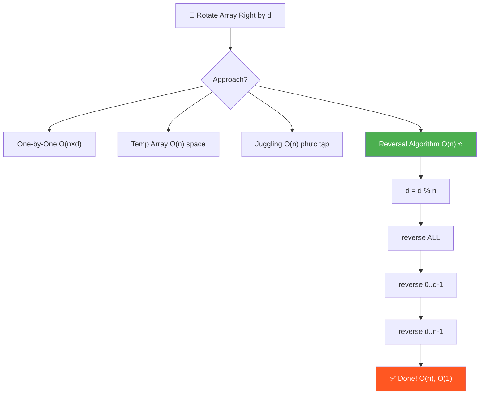
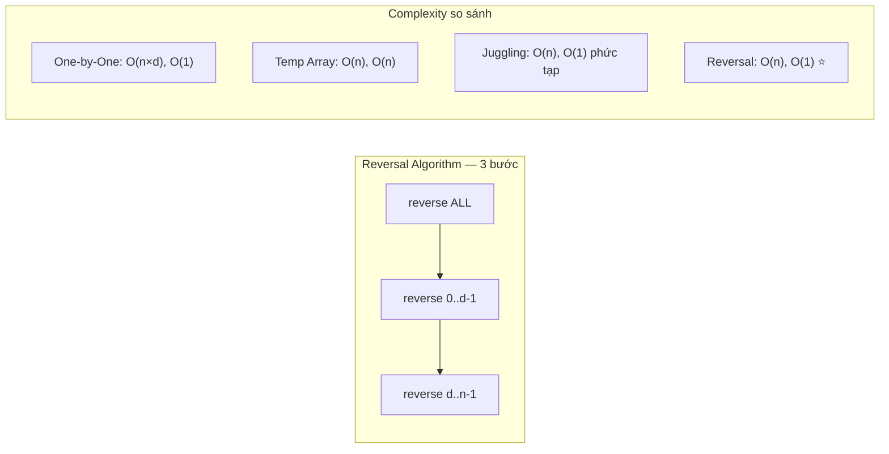

# 🔄 Rotate an Array — GfG (Easy-Medium)

> 📖 Code: [Rotate Array.js](./Rotate%20Array.js)





---

## R — Repeat & Clarify

🧠 *"Rotate right d bước = d phần tử CUỐI chuyển lên ĐẦU. Reversal Algorithm = reverse 3 lần = O(n), O(1)!"*

> 🎙️ *"Right rotate array by d positions: last d elements move to the front, remaining shift right. Left rotate is the opposite."*

### Clarification Questions

```
Q: Right rotate hay Left rotate?
A: Cả hai! Right: cuối → đầu. Left: đầu → cuối

Q: Nếu d > n?
A: d = d % n (rotate n lần = quay về vị trí cũ!)

Q: In-place?
A: Reversal Algorithm = in-place O(1) space ✅
```

---

## E — Examples

```
RIGHT ROTATE by d = 2:
  arr = [1, 2, 3, 4, 5, 6]

  Step 1: [6, 1, 2, 3, 4, 5]    ← 6 lên đầu
  Step 2: [5, 6, 1, 2, 3, 4]    ← 5 lên đầu

  Kết quả: [5, 6, 1, 2, 3, 4] ✅

  Nhận xét:
    2 phần tử CUỐI [5, 6] → lên ĐẦU
    4 phần tử ĐẦU [1, 2, 3, 4] → xuống CUỐI

LEFT ROTATE by d = 2:
  arr = [1, 2, 3, 4, 5, 6]

  Step 1: [2, 3, 4, 5, 6, 1]    ← 1 xuống cuối
  Step 2: [3, 4, 5, 6, 1, 2]    ← 2 xuống cuối

  Kết quả: [3, 4, 5, 6, 1, 2] ✅

d > n:
  arr = [1, 2, 3], d = 4
  d % n = 4 % 3 = 1 → rotate 1 lần
  [3, 1, 2] ✅
```

---

## A — Approach

### Approach 1: Rotate One by One — O(n × d)

```
Lặp d lần, mỗi lần dồn toàn bộ mảng 1 vị trí

  Chậm! Nếu d = n/2 → O(n²/2)
```

### Approach 2: Temporary Array — O(n) time, O(n) space

```
Copy d phần tử cuối vào đầu temp
Copy n-d phần tử đầu vào cuối temp
Copy temp → arr

  Nhanh nhưng TỐN bộ nhớ!
```

### Approach 3: Juggling Algorithm — O(n) time, O(1) space

```
💡 Chia thành gcd(n, d) CYCLES
   Mỗi cycle: dịch phần tử theo bước d

  Phức tạp để implement, dễ bug!
```

### Approach 4: Reversal Algorithm — O(n) time, O(1) space ✅

```
💡 REVERSE 3 LẦN! Đơn giản + hiệu quả!

  RIGHT ROTATE by d:
    Step 1: Reverse TOÀN BỘ mảng
    Step 2: Reverse d phần tử ĐẦU
    Step 3: Reverse n-d phần tử CUỐI

  Ví dụ: [1, 2, 3, 4, 5, 6], d = 2

    Step 1: reverse all  → [6, 5, 4, 3, 2, 1]
    Step 2: reverse [0..1] → [5, 6, 4, 3, 2, 1]
    Step 3: reverse [2..5] → [5, 6, 1, 2, 3, 4] ✅

  LEFT ROTATE by d:
    Step 1: Reverse d phần tử ĐẦU
    Step 2: Reverse n-d phần tử CUỐI
    Step 3: Reverse TOÀN BỘ mảng
    (hoặc: right rotate by n-d!)

  TẠI SAO ĐÚNG?
    Reverse all: [A, B] → [B', A'] (B reversed, A reversed)
    Reverse B': [B, A']
    Reverse A': [B, A]
    → B lên trước, A lên sau! Chính là rotate!
```

---

## C — Code

### Solution 1: Rotate One by One — O(n × d)

```javascript
function rotateOneByOne(arr, d) {
  const n = arr.length;
  d %= n;

  for (let i = 0; i < d; i++) {
    const last = arr[n - 1]; // Lưu phần tử cuối
    for (let j = n - 1; j > 0; j--) {
      arr[j] = arr[j - 1];  // Dồn phải 1 ô
    }
    arr[0] = last;           // Đặt cuối lên đầu
  }
}
```

### Solution 2: Temporary Array — O(n) space

```javascript
function rotateTemp(arr, d) {
  const n = arr.length;
  d %= n;

  const temp = new Array(n);

  // Copy d phần tử CUỐI → đầu temp
  for (let i = 0; i < d; i++) {
    temp[i] = arr[n - d + i];
  }

  // Copy n-d phần tử ĐẦU → cuối temp
  for (let i = 0; i < n - d; i++) {
    temp[i + d] = arr[i];
  }

  // Copy temp → arr
  for (let i = 0; i < n; i++) {
    arr[i] = temp[i];
  }
}
```

### Solution 3: Reversal Algorithm — O(n), O(1) ✅

```javascript
function rotateRight(arr, d) {
  const n = arr.length;
  if (n === 0) return;
  d %= n;
  if (d === 0) return;

  // 3 lần reverse!
  reverse(arr, 0, n - 1);     // Reverse toàn bộ
  reverse(arr, 0, d - 1);     // Reverse d phần tử đầu
  reverse(arr, d, n - 1);     // Reverse n-d phần tử cuối
}

function rotateLeft(arr, d) {
  const n = arr.length;
  if (n === 0) return;
  d %= n;
  if (d === 0) return;

  reverse(arr, 0, d - 1);     // Reverse d phần tử đầu
  reverse(arr, d, n - 1);     // Reverse n-d phần tử cuối
  reverse(arr, 0, n - 1);     // Reverse toàn bộ
}

function reverse(arr, start, end) {
  while (start < end) {
    [arr[start], arr[end]] = [arr[end], arr[start]];
    start++;
    end--;
  }
}
```

### Trace Right Rotate: [1, 2, 3, 4, 5, 6], d = 2

```
  d = 2 % 6 = 2

  Step 1: reverse(0, 5) — reverse toàn bộ
    [1, 2, 3, 4, 5, 6] → [6, 5, 4, 3, 2, 1]
     ↕              ↕      swap(1,6)
     ↕           ↕          swap(2,5)
        ↕     ↕              swap(3,4)

  Step 2: reverse(0, 1) — reverse 2 phần tử đầu
    [6, 5, 4, 3, 2, 1] → [5, 6, 4, 3, 2, 1]
     ↕  ↕                  swap(6,5)

  Step 3: reverse(2, 5) — reverse 4 phần tử cuối
    [5, 6, 4, 3, 2, 1] → [5, 6, 1, 2, 3, 4]
           ↕        ↕      swap(4,1)
              ↕  ↕          swap(3,2)

  Kết quả: [5, 6, 1, 2, 3, 4] ✅
```

### Trace Left Rotate: [1, 2, 3, 4, 5, 6], d = 2

```
  Step 1: reverse(0, 1) → [2, 1, 3, 4, 5, 6]
  Step 2: reverse(2, 5) → [2, 1, 6, 5, 4, 3]
  Step 3: reverse(0, 5) → [3, 4, 5, 6, 1, 2] ✅
```

### Solution 4: Juggling Algorithm — O(n), O(1)

```javascript
function rotateJuggling(arr, d) {
  const n = arr.length;
  d %= n;

  const cycles = gcd(n, d);

  for (let i = 0; i < cycles; i++) {
    let currIdx = i;
    let currEle = arr[currIdx];

    do {
      const nextIdx = (currIdx + d) % n;
      const nextEle = arr[nextIdx];
      arr[nextIdx] = currEle;
      currEle = nextEle;
      currIdx = nextIdx;
    } while (currIdx !== i);
  }
}

function gcd(a, b) {
  while (b !== 0) {
    [a, b] = [b, a % b];
  }
  return a;
}
```

> 🎙️ *"The Reversal Algorithm is the most elegant: three in-place reverses achieve the rotation in O(n) time and O(1) space. First reverse all, then reverse the first d elements, then the rest."*

---

## O — Optimize

```
                     Time       Space     Ghi chú
  ─────────────────────────────────────────────────
  One by One         O(n × d)   O(1)      Chậm!
  Temp Array         O(n)       O(n)      Tốn memory
  Juggling           O(n)       O(1)      Phức tạp, dễ bug
  Reversal ✅        O(n)       O(1)      BEST! Đơn giản + nhanh

  ⚠️ Edge cases:
    d = 0 hoặc d = n → không cần rotate!
    d > n → d = d % n
    n = 0 hoặc n = 1 → return ngay
```

---

## T — Test

```
Test Cases:
  [1,2,3,4,5,6] d=2  → [5,6,1,2,3,4]       ✅ Right rotate
  [1,2,3] d=4        → [3,1,2] (d%3=1)      ✅ d > n
  [1,2,3,4,5,6] d=0  → [1,2,3,4,5,6]        ✅ No rotation
  [1,2,3,4,5,6] d=6  → [1,2,3,4,5,6]        ✅ Full rotation
  [1] d=5             → [1]                   ✅ Single element
  [] d=3              → []                    ✅ Empty
```

---

## 🗣️ Interview Script

> 🎙️ *"I'd use the Reversal Algorithm. Right rotate by d means the last d elements move to the front. By reversing the entire array, then reversing the first d and remaining n-d independently, we achieve the rotation in O(n) time with O(1) space. The key insight is that double-reversing a segment restores its order while repositioning it."*

### Pattern & Liên kết

```
  REVERSAL ALGORITHM pattern:

  Dùng REVERSE làm building block cho:
    Right Rotate by d → reverse(all) + reverse(0..d-1) + reverse(d..n-1)
    Left Rotate by d  → reverse(0..d-1) + reverse(d..n-1) + reverse(all)
    Right Rotate by d = Left Rotate by (n - d)!

  Liên kết:
    Array Reverse (#344)    → foundation
    Rotate Array (#189)     → classic application
    Rotate String (#796)    → string version
    Rotate Image (#48)      → 2D matrix version
```
