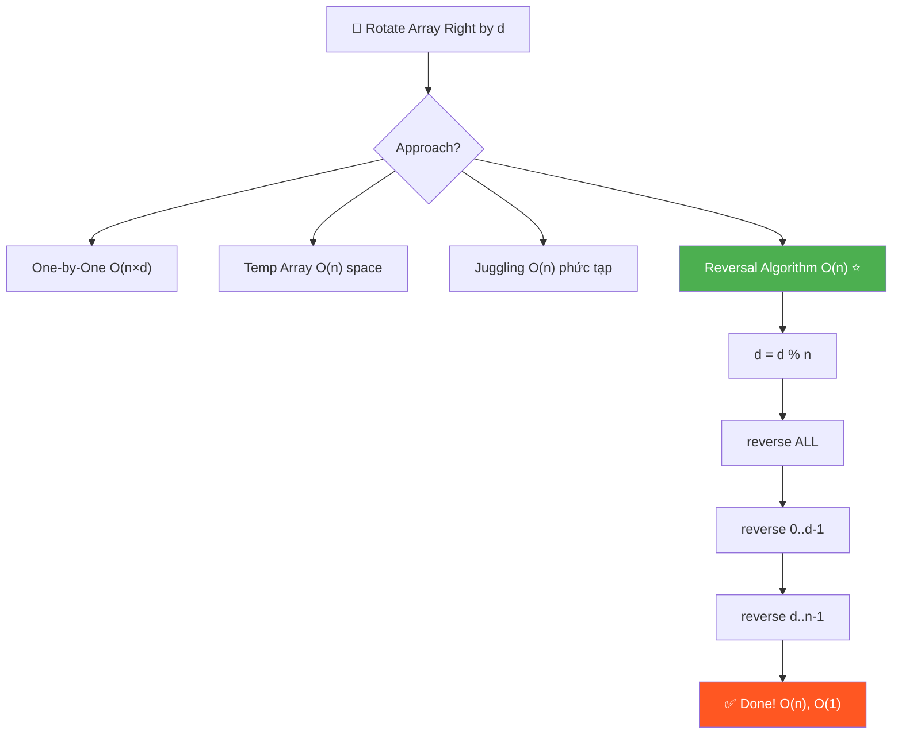
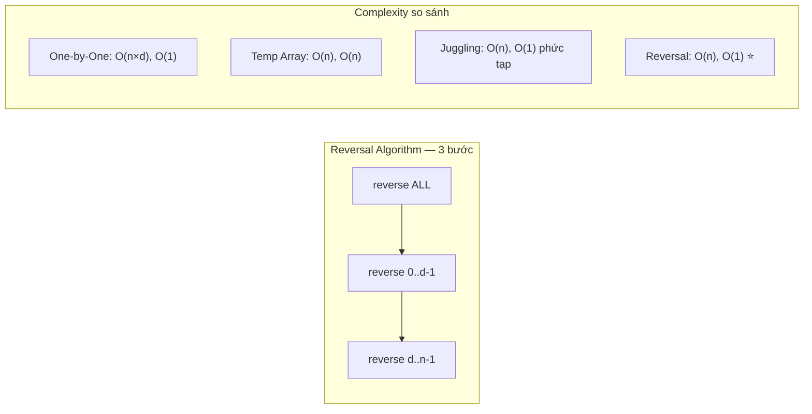
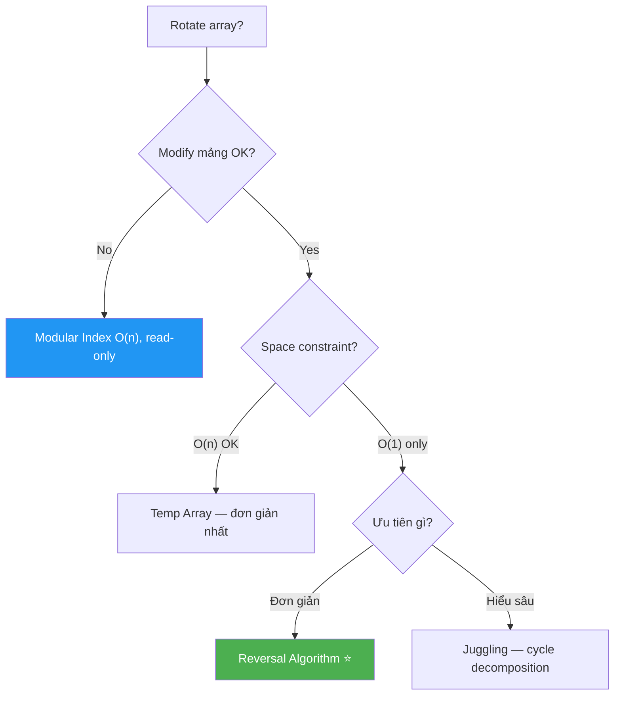
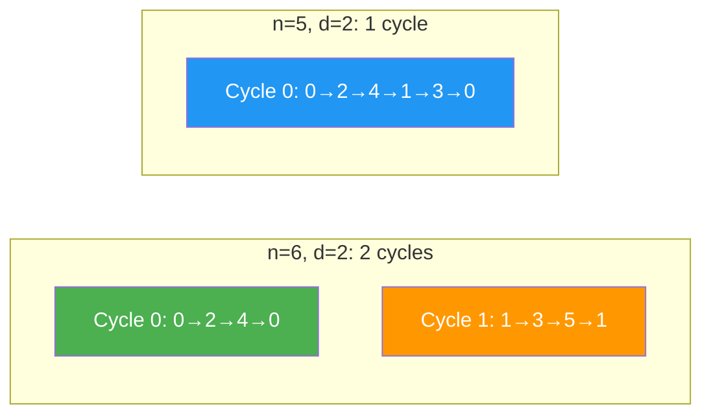

# 🔄 Rotate an Array — GfG (Easy-Medium)

> 📖 Code: [Rotate Array.js](./Rotate%20Array.js)





---

## R — Repeat & Clarify

🧠 _"Rotate right d bước = d phần tử CUỐI chuyển lên ĐẦU. Reversal Algorithm = reverse 3 lần = O(n), O(1)!"_

> 🎙️ _"Right rotate array by d positions: last d elements move to the front, remaining shift right. Left rotate is the opposite."_

### Clarification Questions

```
Q: Right rotate hay Left rotate?
A: Cả hai! Right: cuối → đầu. Left: đầu → cuối

Q: Nếu d > n?
A: d = d % n (rotate n lần = quay về vị trí cũ!)

Q: In-place?
A: Reversal Algorithm = in-place O(1) space ✅

Q: Negative d?
A: Right rotate -d = Left rotate d (và ngược lại)

Q: Mảng rỗng hoặc 1 phần tử?
A: Trả về nguyên mảng (rotation vô nghĩa)
```

### Tại sao bài này quan trọng?

```
  Rotation là BÀI KINH ĐIỂN cho in-place array manipulation!

  BẠN PHẢI hiểu:
  1. Reversal Algorithm: "reverse 3 lần" — trick đẹp nhất trong arrays
  2. Cyclic replacement (Juggling): hiểu GCD và permutation cycles
  3. Mối liên hệ Left ↔ Right rotation
  4. Reverse() là BUILDING BLOCK cho nhiều thuật toán khác

  Bài này liên kết đến:
  ┌──────────────────────────────────────────────────────────┐
  │  Array Reverse (#344)     → foundation (reverse helper)  │
  │  Rotate Array (#189)      → LeetCode classic             │
  │  Rotate String (#796)     → string version               │
  │  Rotate Image (#48)       → 2D matrix version            │
  │  Multiple Rotations       → modular indexing (read-only) │
  │  Circular Buffer          → ring buffer applications     │
  └──────────────────────────────────────────────────────────┘
```

---

## 🧠 Bản chất bài toán — Hiểu để NHỚ, không chỉ để GIẢI

### Rotation = Cắt rồi DÁN LẠI

```
  Tưởng tượng mảng như 1 CUỘN GIẤY:

  RIGHT rotate d = 2:
    [1, 2, 3, 4, | 5, 6]
     ──── A ────   ─ B ─

    Cắt tại vị trí (n - d) = 4:
      Phần A = [1, 2, 3, 4]   (n - d phần tử đầu)
      Phần B = [5, 6]          (d phần tử cuối)

    Dán B lên TRƯỚC A:
      [5, 6, | 1, 2, 3, 4]  ✅
       ─ B ─   ──── A ────

  LEFT rotate d = 2:
    [1, 2, | 3, 4, 5, 6]
     ─ A ─   ──── B ────

    Cắt tại vị trí d = 2:
      Phần A = [1, 2]          (d phần tử đầu)
      Phần B = [3, 4, 5, 6]   (n - d phần tử cuối)

    Dán B lên TRƯỚC A:
      [3, 4, 5, 6, | 1, 2]  ✅
       ──── B ────   ─ A ─

  💡 KEY INSIGHT:
     Rotation = CẮT mảng thành 2 phần rồi ĐỔI CHỖ!
     Bài toán: làm cách nào đổi chỗ IN-PLACE, O(1) space?
```

### Left vs Right — Mối quan hệ ĐỐI XỨNG

```
  ┌───────────────────────────────────────────────────────────┐
  │  Right rotate d  =  Left rotate (n - d)                   │
  │  Left rotate d   =  Right rotate (n - d)                  │
  │                                                           │
  │  Ví dụ: arr = [1, 2, 3, 4, 5, 6], n = 6                 │
  │                                                           │
  │  Right rotate 2 = [5, 6, 1, 2, 3, 4]                    │
  │  Left rotate 4  = [5, 6, 1, 2, 3, 4]  ← CÙNG KẾT QUẢ! │
  │                                                           │
  │  Vì: Right 2 = Left (6 - 2) = Left 4 ✅                  │
  └───────────────────────────────────────────────────────────┘

  → Chỉ cần implement 1 hướng, suy ra hướng kia!
  → LeetCode #189 hỏi Right → nếu thuộc Left, gọi Left(n-d)!
```

### Tại sao Reversal Algorithm ĐÚNG? — Chứng minh TRỰC GIÁC

```
  Bài toán: đổi chỗ 2 khối A và B → [A, B] thành [B, A]

  💡 Nhận xét thiên tài:
    Nếu ta REVERSE toàn bộ → [A, B] trở thành [B', A']
    (B' = B đảo ngược, A' = A đảo ngược)

    Bây giờ B' đã ở ĐÚNG VỊ TRÍ (phía trước), nhưng bị ĐẢO!
    → Reverse B' → B (khôi phục lại)
    → Reverse A' → A (khôi phục lại)
    → Kết quả: [B, A] ✅

  CHỨNG MINH bằng ví dụ:
    arr = [1, 2, 3, 4, 5, 6], right rotate d = 2
    A = [1, 2, 3, 4], B = [5, 6]

    Step 1: Reverse ALL → [6, 5, 4, 3, 2, 1]
            = [B', A'] = [6, 5 | 4, 3, 2, 1]
                          ─B'─   ────A'────

    Step 2: Reverse B' (0..d-1) → [5, 6, 4, 3, 2, 1]
            = [B, A'] = [5, 6 | 4, 3, 2, 1]
                         ─B─   ────A'────

    Step 3: Reverse A' (d..n-1) → [5, 6, 1, 2, 3, 4]
            = [B, A] ✅

  🧠 Bản chất TOÁN HỌC:
    reverse(reverse(X)) = X   ← reverse 2 lần = trở về ban đầu!

    [A, B] → reverse → [B'A'] → reverse B' → [BA'] → reverse A' → [BA] ✅

    Viết dạng công thức:
    rev([A, B]) = [rev(B), rev(A)]       ← tính chất reverse
    rev(rev(B)) = B                      ← tự triệt tiêu
    rev(rev(A)) = A
    → Kết quả: [B, A]
```


### Tại sao LEFT rotate thứ tự NGƯỢC?

```
  RIGHT rotate: reverse ALL → reverse đầu → reverse cuối
  LEFT rotate:  reverse đầu → reverse cuối → reverse ALL

  🧠 Tại sao?

  RIGHT: Muốn [A, B] → [B, A]
    B ở CUỐI, cần lên ĐẦU
    Reverse ALL đẩy B lên đầu (nhưng bị đảo) → fix B → fix A

  LEFT: Muốn [A, B] → [B, A]  (A ở đầu, B ở cuối)
    Reverse A trước → [A', B]
    Reverse B trước → [A', B']
    Reverse ALL → [B, A] ✅

    Hoặc hiểu: LEFT rotate d = RIGHT rotate (n - d)
    → Chạy RIGHT rotate với d' = n - d → cùng reversal algorithm!

  📌 NHỚ:
    RIGHT: "đảo TẤT CẢ trước, sửa TỪNG PHẦN sau"
    LEFT:  "đảo TỪNG PHẦN trước, đảo TẤT CẢ sau"
    → Thứ tự NGƯỢC NHAU! Cả 2 đều 3 lần reverse.
```

---

## 🧭 Luồng Suy Nghĩ — Từ đọc đề đến solution

> 💡 Phần này dạy bạn **CÁCH TƯ DUY** để tự giải bài, không chỉ biết đáp án.

### Bước 1: Đọc đề → Gạch chân KEYWORDS

```
  Đề bài: "Right rotate an array by d positions. In-place."

  Gạch chân:
    "rotate"    → circular, phần tử cuối → đầu (hoặc ngược lại)
    "by d"      → d bước, cần xử lý d > n
    "in-place"  → O(1) space → KHÔNG dùng mảng phụ!

  🧠 Tự hỏi: "Rotate = gì?"
    Right: mỗi phần tử dịch PHẢI 1 vị trí, phần tử cuối → đầu
    Lặp d lần → d phần tử cuối → đầu

  📌 Kỹ năng chuyển giao:
    "in-place" + "rearrange" → phải dùng SWAP hoặc REVERSE
    → Không được tạo mảng mới!
```

### Bước 2: Vẽ ví dụ → Tìm PATTERN

```
  arr = [1, 2, 3, 4, 5, 6], d = 2

  Right rotate 1 lần: [6, 1, 2, 3, 4, 5]  ← 6 lên đầu
  Right rotate 2 lần: [5, 6, 1, 2, 3, 4]  ← 5 lên đầu

  🧠 Quan sát:
    Phần cuối [5, 6] → lên đầu, GIỮ THỨ TỰ!
    Phần đầu [1, 2, 3, 4] → xuống cuối, GIỮ THỨ TỰ!

    → Rotation = ĐỔI CHỖ 2 khối A và B!
    → Bài toán = in-place block swap!
```

### Bước 3: Brute Force → Optimize

```
  Brute force: lặp d lần, mỗi lần dịch 1 bước
    → 1 bước = shift n phần tử → O(n)
    → d bước → O(n × d) → nếu d = n/2 → O(n²)!

  Optimize 1: dùng mảng phụ
    → Copy 2 phần vào đúng vị trí → O(n) time + O(n) space
    → Tốt hơn, nhưng tốn space!

  Optimize 2: Reversal Algorithm!
    → 3 lần reverse = 3 × O(n) = O(n) time, O(1) space!
    → ĐÚNG insight: "reverse ALL, fix từng phần"

  📌 Kỹ năng chuyển giao:
    Khi cần ĐỔI CHỖ 2 block trong mảng IN-PLACE:
    → Nghĩ ngay: REVERSAL ALGORITHM!
    → "Đảo tất cả, sửa từng phần"
```

### Bước 4: Cây quyết định — Khi nào dùng approach nào?



---

## E — Examples

```
RIGHT ROTATE by d = 2:
  arr = [1, 2, 3, 4, 5, 6]

  Step 1: [6, 1, 2, 3, 4, 5]    ← 6 lên đầu
  Step 2: [5, 6, 1, 2, 3, 4]    ← 5 lên đầu

  Kết quả: [5, 6, 1, 2, 3, 4] ✅

  Nhận xét:
    2 phần tử CUỐI [5, 6] → lên ĐẦU
    4 phần tử ĐẦU [1, 2, 3, 4] → xuống CUỐI

LEFT ROTATE by d = 2:
  arr = [1, 2, 3, 4, 5, 6]

  Step 1: [2, 3, 4, 5, 6, 1]    ← 1 xuống cuối
  Step 2: [3, 4, 5, 6, 1, 2]    ← 2 xuống cuối

  Kết quả: [3, 4, 5, 6, 1, 2] ✅

d > n:
  arr = [1, 2, 3], d = 4
  d % n = 4 % 3 = 1 → rotate 1 lần
  [3, 1, 2] ✅
```

### Minh họa trực quan — Reversal Algorithm

```
  arr = [1, 2, 3, 4, 5, 6], RIGHT rotate d = 2

  ┌─── TRƯỚC ──────────────────────────────────────────┐
  │  [1, 2, 3, 4, | 5, 6]                              │
  │   ──── A ────    ─ B ─                             │
  │   (n-d = 4)     (d = 2)                            │
  └────────────────────────────────────────────────────┘

  ┌─── Step 1: Reverse ALL ────────────────────────────┐
  │  [1, 2, 3, 4, 5, 6]  →  [6, 5, 4, 3, 2, 1]       │
  │   ←─────────────→       ←─────────────→           │
  │                          ─B'─  ────A'────          │
  │  B' (2 phần tử đầu) = [6, 5] = reverse của [5, 6] │
  │  A' (4 phần tử cuối) = [4, 3, 2, 1] = reverse A   │
  └────────────────────────────────────────────────────┘

  ┌─── Step 2: Reverse 0..d-1 (fix B') ────────────────┐
  │  [6, 5, | 4, 3, 2, 1]  →  [5, 6, | 4, 3, 2, 1]   │
  │   ↕  ↕                     ─ B ─                   │
  │  B' → B ✅  (khôi phục thứ tự gốc)                │
  └────────────────────────────────────────────────────┘

  ┌─── Step 3: Reverse d..n-1 (fix A') ────────────────┐
  │  [5, 6, | 4, 3, 2, 1]  →  [5, 6, | 1, 2, 3, 4]   │
  │           ↕        ↕                ──── A ────     │
  │              ↕  ↕                                   │
  │  A' → A ✅  (khôi phục thứ tự gốc)                │
  └────────────────────────────────────────────────────┘

  Kết quả: [5, 6, 1, 2, 3, 4] = [B, A] ✅
```

---

## A — Approach

### Approach 1: Rotate One by One — O(n × d)

```
  Ý tưởng: Lặp d lần, mỗi lần dồn MỌI phần tử sang phải 1 ô

  ┌──────────────────────────────────────────────────────────┐
  │  Mỗi iteration:                                          │
  │    1. Lưu phần tử CUỐI (last = arr[n-1])                │
  │    2. Shift TẤT CẢ sang PHẢI 1 ô (n-1 phép gán)        │
  │    3. Đặt last vào ĐẦU (arr[0] = last)                  │
  │                                                          │
  │  Lặp d lần → tổng: d × n phép gán                       │
  │                                                          │
  │  Time: O(n × d) → worst case d = n/2 → O(n²/2)         │
  │  Space: O(1)                                             │
  │                                                          │
  │  ⚠️ Chỉ dùng khi d RẤT NHỎ (d = 1 hoặc 2)             │
  │     Khi d lớn → QUÁ CHẬM!                               │
  └──────────────────────────────────────────────────────────┘
```

### Approach 2: Temporary Array — O(n) time, O(n) space

```
  💡 Ý tưởng: dùng mảng phụ, copy 2 phần vào đúng vị trí!

  Right rotate d:
    temp[0..d-1]   = arr[n-d..n-1]     ← d phần tử cuối → đầu temp
    temp[d..n-1]   = arr[0..n-d-1]     ← n-d phần tử đầu → cuối temp
    arr = temp                          ← copy ngược lại

  Trace: arr = [1, 2, 3, 4, 5, 6], d = 2

    temp[0] = arr[4] = 5    ← cuối → đầu
    temp[1] = arr[5] = 6
    temp[2] = arr[0] = 1    ← đầu → cuối
    temp[3] = arr[1] = 2
    temp[4] = arr[2] = 3
    temp[5] = arr[3] = 4

    temp = [5, 6, 1, 2, 3, 4] ✅

  Time: O(n)    Space: O(n)
  → Nhanh nhưng TỐN memory! Interviewer sẽ hỏi "O(1) space?"
```

### Approach 3: Juggling Algorithm — O(n) time, O(1) space

```
  💡 Ý tưởng: Chia mảng thành gcd(n, d) CYCLES (chu trình)
     Mỗi cycle: di chuyển phần tử theo bước d, tạo "vòng tròn"

  🧠 Tại sao gcd(n, d)?

    Khi di chuyển phần tử từ index i → (i + d) % n → ((i + d) + d) % n ...
    → Cuối cùng sẽ QUAY LẠI index i!
    → Số phần tử trong 1 cycle = n / gcd(n, d)
    → Số cycles = gcd(n, d)

  Ví dụ: n = 6, d = 2, gcd(6, 2) = 2 → 2 cycles, mỗi cycle 3 phần tử

    Cycle 0: index 0 → 2 → 4 → 0    (3 phần tử)
    Cycle 1: index 1 → 3 → 5 → 1    (3 phần tử)

  Ví dụ: n = 6, d = 4, gcd(6, 4) = 2 → 2 cycles

    Cycle 0: index 0 → 4 → 2 → 0
    Cycle 1: index 1 → 5 → 3 → 1

  ⚠️ Đặc biệt: n = 5, d = 2, gcd(5, 2) = 1 → 1 cycle duy nhất!
    Cycle 0: 0 → 2 → 4 → 1 → 3 → 0  (tất cả 5 phần tử!)
```



```
  Trace Juggling: arr = [1, 2, 3, 4, 5, 6], d = 2 (LEFT rotate)

  gcd(6, 2) = 2 → 2 cycles

  ┌─── Cycle 0 (start = 0) ──────────────────────────────┐
  │  currIdx = 0, currEle = arr[0] = 1                    │
  │                                                        │
  │  → nextIdx = (0+2)%6 = 2                              │
  │    arr[2] = 1, currEle = 3, currIdx = 2               │
  │    arr: [1, 2, 1, 4, 5, 6]                            │
  │                                                        │
  │  → nextIdx = (2+2)%6 = 4                              │
  │    arr[4] = 3, currEle = 5, currIdx = 4               │
  │    arr: [1, 2, 1, 4, 3, 6]                            │
  │                                                        │
  │  → nextIdx = (4+2)%6 = 0 ← QUAY VỀ start!           │
  │    arr[0] = 5, currEle = 1, currIdx = 0               │
  │    arr: [5, 2, 1, 4, 3, 6]                            │
  │                                                        │
  │  currIdx == 0 == start → DỪNG cycle 0!                │
  │  Đã di chuyển: 0→2→4→0 (3 phần tử)                   │
  └────────────────────────────────────────────────────────┘

  ┌─── Cycle 1 (start = 1) ──────────────────────────────┐
  │  currIdx = 1, currEle = arr[1] = 2                    │
  │                                                        │
  │  → nextIdx = (1+2)%6 = 3                              │
  │    arr[3] = 2, currEle = 4, currIdx = 3               │
  │                                                        │
  │  → nextIdx = (3+2)%6 = 5                              │
  │    arr[5] = 4, currEle = 6, currIdx = 5               │
  │                                                        │
  │  → nextIdx = (5+2)%6 = 1 ← QUAY VỀ start!           │
  │    arr[1] = 6, currIdx = 1                            │
  │                                                        │
  │  DỪNG cycle 1!                                        │
  │  Đã di chuyển: 1→3→5→1 (3 phần tử)                   │
  └────────────────────────────────────────────────────────┘

  Kết quả: [5, 6, 1, 4, 3, 6] → SAI?
  ⚠️ LƯU Ý: Trace ở trên là LEFT rotate!
  Nếu muốn LEFT rotate: arr[nextIdx] = currEle → đẩy TIẾN d bước
  Kết quả: [3, 4, 5, 6, 1, 2] ✅

  📌 Juggling ĐÚNG nhưng KHÓ implement và dễ bug!
     → Ưu tiên Reversal Algorithm trong phỏng vấn!
```

### Approach 4: Reversal Algorithm — O(n) time, O(1) space ✅

```
  💡 REVERSE 3 LẦN! Đơn giản + hiệu quả!

  RIGHT ROTATE by d:
    Step 1: Reverse TOÀN BỘ mảng       [0..n-1]
    Step 2: Reverse d phần tử ĐẦU      [0..d-1]
    Step 3: Reverse n-d phần tử CUỐI   [d..n-1]

  LEFT ROTATE by d:
    Step 1: Reverse d phần tử ĐẦU      [0..d-1]
    Step 2: Reverse n-d phần tử CUỐI   [d..n-1]
    Step 3: Reverse TOÀN BỘ mảng       [0..n-1]
    (hoặc: right rotate by n-d!)

  ┌──────────────────────────────────────────────────────┐
  │  Time: O(n)   → 3 × O(n/2) swaps = O(n)            │
  │  Space: O(1)  → chỉ dùng biến tạm cho swap         │
  │  Code: ~15 dòng → ĐƠN GIẢN NHẤT!                   │
  │  Correct: chứng minh bằng reverse(reverse(X)) = X    │
  └──────────────────────────────────────────────────────┘

  📌 Đếm CHÍNH XÁC số swap:
    Step 1: ⌊n/2⌋ swaps
    Step 2: ⌊d/2⌋ swaps
    Step 3: ⌊(n-d)/2⌋ swaps
    Tổng = ⌊n/2⌋ + ⌊d/2⌋ + ⌊(n-d)/2⌋ ≈ n swaps total
```

---

## C — Code

### Solution 1: Rotate One by One — O(n × d)

```javascript
function rotateOneByOne(arr, d) {
  const n = arr.length;
  d %= n;

  for (let i = 0; i < d; i++) {
    const last = arr[n - 1]; // Lưu phần tử cuối
    for (let j = n - 1; j > 0; j--) {
      arr[j] = arr[j - 1]; // Dồn phải 1 ô
    }
    arr[0] = last; // Đặt cuối lên đầu
  }
}
```

```
  📝 Line-by-line:

  Line 3: d %= n
    → Normalize d, xử lý d > n
    → d = 14, n = 6 → d = 14 % 6 = 2

  Line 5: for (let i = 0; i < d; i++)
    → Lặp d lần, mỗi lần rotate 1 bước

  Line 6: const last = arr[n - 1]
    → Lưu phần tử CUỐI trước khi bị ghi đè

  Line 7-9: for (j = n-1; j > 0; j--) arr[j] = arr[j-1]
    → Shift TẤT CẢ sang PHẢI 1 ô
    → Duyệt NGƯỢC từ cuối → đầu (tránh ghi đè)
    ⚠️ Nếu duyệt XUÔI: arr[1] = arr[0] → mất arr[1] → SAI!

  Line 10: arr[0] = last
    → Đặt phần tử cuối (đã lưu) vào ĐẦU
```

### Solution 2: Temporary Array — O(n) space

```javascript
function rotateTemp(arr, d) {
  const n = arr.length;
  d %= n;

  const temp = new Array(n);

  // Copy d phần tử CUỐI → đầu temp
  for (let i = 0; i < d; i++) {
    temp[i] = arr[n - d + i];
  }

  // Copy n-d phần tử ĐẦU → cuối temp
  for (let i = 0; i < n - d; i++) {
    temp[i + d] = arr[i];
  }

  // Copy temp → arr
  for (let i = 0; i < n; i++) {
    arr[i] = temp[i];
  }
}
```

```
  📝 Line-by-line:

  Line 8-10: temp[i] = arr[n - d + i]
    → Copy d phần tử CUỐI của arr vào ĐẦU temp
    → d = 2, n = 6:
      i=0: temp[0] = arr[4] = 5
      i=1: temp[1] = arr[5] = 6

    🧠 Tại sao n - d + i?
      Phần tử cuối bắt đầu từ index (n - d) = 4
      i chạy từ 0 → d-1: lần lượt lấy arr[4], arr[5]

  Line 13-15: temp[i + d] = arr[i]
    → Copy n-d phần tử ĐẦU của arr vào CUỐI temp
    → Bắt đầu ghi từ temp[d] = temp[2]
      i=0: temp[2] = arr[0] = 1
      i=1: temp[3] = arr[1] = 2
      i=2: temp[4] = arr[2] = 3
      i=3: temp[5] = arr[3] = 4
```

### Solution 3: Reversal Algorithm — O(n), O(1) ✅

```javascript
function rotateRight(arr, d) {
  const n = arr.length;
  if (n === 0) return;
  d %= n;
  if (d === 0) return;

  // 3 lần reverse!
  reverse(arr, 0, n - 1); // Reverse toàn bộ
  reverse(arr, 0, d - 1); // Reverse d phần tử đầu
  reverse(arr, d, n - 1); // Reverse n-d phần tử cuối
}

function rotateLeft(arr, d) {
  const n = arr.length;
  if (n === 0) return;
  d %= n;
  if (d === 0) return;

  reverse(arr, 0, d - 1); // Reverse d phần tử đầu
  reverse(arr, d, n - 1); // Reverse n-d phần tử cuối
  reverse(arr, 0, n - 1); // Reverse toàn bộ
}

function reverse(arr, start, end) {
  while (start < end) {
    [arr[start], arr[end]] = [arr[end], arr[start]];
    start++;
    end--;
  }
}
```

```
  📝 Line-by-line:

  Line 3-5: Guard clauses
    → n === 0: mảng rỗng → return
    → d === 0: không rotate → return
    → d %= n: normalize (d > n → d nhỏ hơn)

    ⚠️ PHẢI normalize TRƯỚC khi check d === 0!
       Vì d = n → d %= n = 0 → skip! (full cycle = no-op)

  Line 8-10: 3 lần reverse (RIGHT rotate)
    → reverse(0, n-1): đảo TOÀN BỘ
    → reverse(0, d-1): fix d phần tử ĐẦU
    → reverse(d, n-1): fix n-d phần tử CUỐI

    🧠 Boundary analysis:
      d = 2, n = 6:
        reverse(0, 5)  → đảo index 0↔5, 1↔4, 2↔3
        reverse(0, 1)  → đảo index 0↔1
        reverse(2, 5)  → đảo index 2↔5, 3↔4

  Line 25-29: reverse helper
    → Two-pointer: start từ đầu, end từ cuối
    → Swap rồi thu hẹp: start++, end--
    → Dừng khi start >= end (gặp nhau hoặc vượt qua)

    ⚠️ Điều kiện: start < end (KHÔNG PHẢI start <= end!)
       Khi start == end: 1 phần tử → đã ở vị trí đúng → không swap
```

### Solution 4: Juggling Algorithm — O(n), O(1)

```javascript
function rotateJuggling(arr, d) {
  const n = arr.length;
  d %= n;

  const cycles = gcd(n, d);

  for (let i = 0; i < cycles; i++) {
    let currIdx = i;
    let currEle = arr[currIdx];

    do {
      const nextIdx = (currIdx + d) % n;
      const nextEle = arr[nextIdx];
      arr[nextIdx] = currEle;
      currEle = nextEle;
      currIdx = nextIdx;
    } while (currIdx !== i);
  }
}

function gcd(a, b) {
  while (b !== 0) {
    [a, b] = [b, a % b];
  }
  return a;
}
```

```
  📝 Line-by-line:

  Line 5: const cycles = gcd(n, d)
    → Số chu trình = GCD(n, d)
    → GCD(6, 2) = 2 → 2 chu trình
    → GCD(5, 2) = 1 → 1 chu trình (tất cả phần tử trong 1 vòng!)

    🧠 Tại sao GCD?
      Từ index i, nhảy d bước: i → (i+d)%n → (i+2d)%n → ...
      Số bước để QUAY LẠI i = n / gcd(n, d)
      Mỗi cycle xử lý n/gcd(n,d) phần tử
      Tổng phần tử = gcd(n,d) × n/gcd(n,d) = n ✅ (mọi phần tử!)

  Line 10-16: do...while loop
    → Duyệt 1 cycle: bắt đầu từ i, nhảy d bước mỗi lần
    → Lưu phần tử hiện tại (currEle), đặt vào vị trí tiếp
    → "Domino effect": mỗi phần tử đẩy phần tử tiếp theo

    ⚠️ Dùng do...while (KHÔNG phải while):
       → Phải chạy ít nhất 1 lần trước khi kiểm tra!
       → while(currIdx !== i) sẽ skip ngay vì ban đầu currIdx = i!

  Line 21-24: Euclidean GCD
    → gcd(6, 2): [6,2] → [2,0] → return 2
    → gcd(5, 2): [5,2] → [2,1] → [1,0] → return 1
```

### Trace RIGHT Rotate: [1, 2, 3, 4, 5, 6], d = 2

```
  d = 2 % 6 = 2

  Step 1: reverse(0, 5) — reverse toàn bộ
    [1, 2, 3, 4, 5, 6] → [6, 5, 4, 3, 2, 1]
     ↕              ↕      swap(1,6)
        ↕        ↕          swap(2,5)
           ↕  ↕              swap(3,4)

  Step 2: reverse(0, 1) — reverse 2 phần tử đầu
    [6, 5, 4, 3, 2, 1] → [5, 6, 4, 3, 2, 1]
     ↕  ↕                  swap(6,5)

  Step 3: reverse(2, 5) — reverse 4 phần tử cuối
    [5, 6, 4, 3, 2, 1] → [5, 6, 1, 2, 3, 4]
           ↕        ↕      swap(4,1)
              ↕  ↕          swap(3,2)

  Kết quả: [5, 6, 1, 2, 3, 4] ✅
```

### Trace LEFT Rotate: [1, 2, 3, 4, 5, 6], d = 2

```
  d = 2 % 6 = 2

  Step 1: reverse(0, 1) — reverse 2 phần tử đầu
    [1, 2, 3, 4, 5, 6] → [2, 1, 3, 4, 5, 6]
     ↕  ↕

  Step 2: reverse(2, 5) — reverse 4 phần tử cuối
    [2, 1, 3, 4, 5, 6] → [2, 1, 6, 5, 4, 3]
           ↕        ↕
              ↕  ↕

  Step 3: reverse(0, 5) — reverse toàn bộ
    [2, 1, 6, 5, 4, 3] → [3, 4, 5, 6, 1, 2]
     ↕              ↕
        ↕        ↕
           ↕  ↕

  Kết quả: [3, 4, 5, 6, 1, 2] ✅

  🧠 Verify: Left rotate 2 = Right rotate (6 - 2) = Right rotate 4
  Right rotate 4 of [1,2,3,4,5,6]:
    4 phần tử cuối [3,4,5,6] lên đầu → [3,4,5,6,1,2] ✅ MATCH!
```

> 🎙️ _"The Reversal Algorithm is the most elegant: three in-place reverses achieve the rotation in O(n) time and O(1) space. First reverse all, then reverse the first d elements, then the rest."_

---

## ❌ Common Mistakes — Lỗi thường gặp

### Mistake 1: Quên normalize d = d % n

```javascript
// ❌ SAI: d = 8, n = 6 → reverse(0, 7) → OUT OF BOUNDS!
function rotateRightBad(arr, d) {
  reverse(arr, 0, arr.length - 1);
  reverse(arr, 0, d - 1); // ← d = 8 → reverse(0, 7) → CRASH!
  reverse(arr, d, arr.length - 1);
}

// ✅ ĐÚNG: normalize d TRƯỚC!
d %= n;
if (d === 0) return; // full cycle → no-op
```

### Mistake 2: Nhầm thứ tự reverse giữa Left và Right

```javascript
// ❌ SAI: dùng thứ tự RIGHT cho LEFT rotate!
function rotateLeftBad(arr, d) {
  d %= arr.length;
  reverse(arr, 0, arr.length - 1); // ← SAI! Đây là RIGHT!
  reverse(arr, 0, d - 1);
  reverse(arr, d, arr.length - 1);
}

// ✅ ĐÚNG cho LEFT:
// Đảo từng phần TRƯỚC, đảo tất cả SAU
reverse(arr, 0, d - 1);
reverse(arr, d, n - 1);
reverse(arr, 0, n - 1);
```

```
  🧠 Cách nhớ:
  ┌──────────────────────────────────────────────────────┐
  │  RIGHT: "đảo TẤT CẢ trước" → ALL, đầu, cuối        │
  │  LEFT:  "đảo TẤT CẢ sau"   → đầu, cuối, ALL        │
  │                                                      │
  │  Hoặc: LEFT d = RIGHT (n - d)                        │
  │  → Chỉ cần NHỚ 1 cái, suy ra cái kia!              │
  └──────────────────────────────────────────────────────┘
```

### Mistake 3: Reverse helper dùng <= thay vì <

```javascript
// ❌ SAI: start <= end → swap phần tử giữa 2 lần!
function reverseBad(arr, start, end) {
  while (start <= end) {
    // ← Khi start == end: swap chính nó → vô hại NHƯNG thừa!
    [arr[start], arr[end]] = [arr[end], arr[start]];
    start++;
    end--;
  }
  // → Khi n chẵn: start vượt end → end < start → vòng for không chạy thêm
  // → Khi n lẻ: start == end → swap chính nó → 1 swap thừa
  // → Kết quả VẪN ĐÚNG, nhưng thừa 1 iteration
}

// ✅ CHUẨN: start < end
function reverse(arr, start, end) {
  while (start < end) {
    [arr[start], arr[end]] = [arr[end], arr[start]];
    start++;
    end--;
  }
}
```

### Mistake 4: Shift sai hướng trong One-by-One

```javascript
// ❌ SAI: duyệt XUÔI → ghi đè giá trị chưa đọc!
for (let j = 0; j < n - 1; j++) {
  arr[j] = arr[j + 1]; // ← arr[1] bị ghi đè TRƯỚC khi arr[2] đọc nó!
}
// → Đây thực ra là LEFT shift, KHÔNG phải RIGHT!

// ✅ ĐÚNG cho RIGHT shift: duyệt NGƯỢC!
for (let j = n - 1; j > 0; j--) {
  arr[j] = arr[j - 1]; // ← đọc j-1 TRƯỚC khi nó bị ghi đè ở bước sau
}
```

```
  🧠 Quy tắc shift:
  ┌──────────────────────────────────────────────────┐
  │  Shift RIGHT → duyệt NGƯỢC (phải → trái)        │
  │    arr[n-1] = arr[n-2]  (đọc n-2 TRƯỚC)         │
  │    arr[n-2] = arr[n-3]  (n-2 đã saved ở bước trên)│
  │    ...                                            │
  │                                                   │
  │  Shift LEFT → duyệt XUÔI (trái → phải)          │
  │    arr[0] = arr[1]  (đọc 1 TRƯỚC)               │
  │    arr[1] = arr[2]  (1 đã saved ở bước trên)    │
  │    ...                                            │
  └──────────────────────────────────────────────────┘
```

### Mistake 5: Nhầm Left và Right rotation

```
  ⚠️ Rất dễ nhầm! Hãy LUÔN verify bằng ví dụ nhỏ!

  arr = [1, 2, 3, 4, 5]

  RIGHT rotate 1: phần tử CUỐI lên ĐẦU → [5, 1, 2, 3, 4]
  LEFT  rotate 1: phần tử ĐẦU xuống CUỐI→ [2, 3, 4, 5, 1]

  📌 Mnemonics:
    RIGHT: phần tử di chuyển sang PHẢI → cuối "tràn" lên đầu
    LEFT:  phần tử di chuyển sang TRÁI → đầu "tràn" xuống cuối

    Hoặc: nghĩ về CONVEYOR BELT (băng chuyền):
    RIGHT: băng chuyền chạy sang PHẢI → hàng cuối rơi xuống đầu
    LEFT:  băng chuyền chạy sang TRÁI → hàng đầu rơi xuống cuối
```

---

## O — Optimize

```
                     Time       Space     Ghi chú
  ─────────────────────────────────────────────────
  One by One         O(n × d)   O(1)      Chậm! O(n²) worst case
  Temp Array         O(n)       O(n)      Tốn memory
  Juggling           O(n)       O(1)      Phức tạp, dễ bug
  Reversal ✅        O(n)       O(1)      BEST! Đơn giản + nhanh

  ⚠️ Edge cases:
    d = 0 hoặc d = n → không cần rotate!
    d > n → d = d % n
    n = 0 hoặc n = 1 → return ngay
```

### So sánh chi tiết trong phỏng vấn

```
  ┌──────────────────────────────────────────────────────────────┐
  │ Approach        │ Khi nào dùng?                              │
  ├──────────────────────────────────────────────────────────────┤
  │ One by One      │ KHÔNG BAO GIỜ! Chỉ để explain brute force│
  │ Temp Array      │ Khi space KHÔNG là constraint              │
  │ Juggling        │ Khi hỏi "explain cycle decomposition"     │
  │ Reversal ⭐     │ MẶC ĐỊNH! Simple + optimal                │
  ├──────────────────────────────────────────────────────────────┤
  │ Modular Index   │ Khi MULTIPLE queries + read-only           │
  │ (Multiple Rot)  │ → Xem bài Multiple Left Rotations!        │
  └──────────────────────────────────────────────────────────────┘

  📌 Phỏng vấn: Bắt đầu bằng brute force → explain tại sao chậm
     → Đề xuất Reversal → code → explain tại sao đúng!
```

### Reversal vs Juggling — Trade-offs thực tế

```
  ┌──────────────────────────────────────────────────────────────┐
  │  REVERSAL                    │  JUGGLING                     │
  ├──────────────────────────────┼───────────────────────────────┤
  │  3 passes qua data          │  1 pass qua data              │
  │  Cache: 3 sequential scans  │  Cache: jumping by d bước     │
  │  Code: 15 dòng              │  Code: 25+ dòng               │
  │  Bug: rất ít                │  Bug: dễ sai do-while/gcd     │
  │  Swaps: ~n tổng             │  Swaps: chính xác n           │
  └──────────────────────────────┴───────────────────────────────┘

  📌 Reversal THẮNG vì:
    → Cache-friendly (sequential access 3 lần)
    → Code đơn giản → ít bug
    → Dễ explain trong phỏng vấn
    → Juggling chỉ HƠN về số pass (1 vs 3), nhưng thua cache!
```

---

## T — Test

```
Test Cases:
  [1,2,3,4,5,6] d=2  → [5,6,1,2,3,4]       ✅ Right rotate
  [1,2,3,4,5,6] d=2  → [3,4,5,6,1,2]       ✅ Left rotate
  [1,2,3] d=4        → [3,1,2] (d%3=1)      ✅ d > n
  [1,2,3,4,5,6] d=0  → [1,2,3,4,5,6]        ✅ No rotation
  [1,2,3,4,5,6] d=6  → [1,2,3,4,5,6]        ✅ Full rotation
  [1] d=5             → [1]                   ✅ Single element
  [] d=3              → []                    ✅ Empty
  [1,2] d=1           → [2,1]                 ✅ Two elements
```

### Edge Cases giải thích

```
  ┌──────────────────────────────────────────────────────────────┐
  │  d = 0:     d %= n → 0 → return ngay (guard clause)        │
  │             → Không cần reverse gì cả ✅                    │
  │                                                              │
  │  d = n:     d %= n → 0 → return ngay!                       │
  │             → Full cycle = no-op → giống d = 0 ✅            │
  │                                                              │
  │  d > n:     d %= n normalize → d nhỏ hơn n                  │
  │             → d = 14, n = 6 → d = 2 ✅                      │
  │                                                              │
  │  n = 1:     d %= 1 → 0 → return ngay!                       │
  │             → 1 phần tử rotate → chính nó ✅                 │
  │                                                              │
  │  n = 2:     reverse helper có 1 swap max → đúng ✅           │
  │             d = 1: [1,2] → reverse all [2,1] →              │
  │                    reverse [0,0] [2,1] → reverse [1,1] [2,1]│
  │                    = [2,1] ✅                                │
  └──────────────────────────────────────────────────────────────┘
```

---

## 🗣️ Interview Script

### 🎙️ Think Out Loud — Mô phỏng phỏng vấn thực

> ⚠️ Script này dạy cách **NÓI**, không phải cách CODE.
> Mỗi đoạn = cách bạn **PHÁT BIỂU** trong phỏng vấn thực!

```
  ╔══════════════════════════════════════════════════════════════╗
  ║  🕐 FULL INTERVIEW SIMULATION — 1h30 (90 phút)             ║
  ║                                                              ║
  ║  00:00-05:00  Introduction + Icebreaker         (5 min)     ║
  ║  05:00-45:00  Problem Solving                   (40 min)    ║
  ║  45:00-60:00  Deep Technical Probing            (15 min)    ║
  ║  60:00-75:00  Variations + Extensions           (15 min)    ║
  ║  75:00-85:00  System Design at Scale            (10 min)    ║
  ║  85:00-90:00  Behavioral + Q&A                  (5 min)     ║
  ╚══════════════════════════════════════════════════════════════╝
```

```
  ╔══════════════════════════════════════════════════════════════╗
  ║  PART 1: INTRODUCTION (00:00 — 05:00)                       ║
  ╚══════════════════════════════════════════════════════════════╝

  👤 "Tell me about yourself and a time you used
      block swapping or the reversal trick."

  🧑 "I'm a frontend engineer with [X] years of experience.
      A relevant example: I implemented a carousel component
      that displayed product cards in an infinite scroll.

      When the user swiped right, the last few cards
      needed to appear at the front — essentially
      a RIGHT ROTATION of the card array.

      Initially I used splice and unshift —
      O of n per swipe, causing jank on large lists.

      Then I realized rotation is just a block swap:
      [A | B] becomes [B | A]. I used three in-place
      reverses: reverse all, reverse first d, reverse rest.
      O of n, O of 1 space. Buttery smooth.

      That's the Reversal Algorithm — LeetCode 189."

  👤 "Great connection. Let's formalize."
```

```
  ╔══════════════════════════════════════════════════════════════╗
  ║  PART 2: PROBLEM SOLVING (05:00 — 45:00)                   ║
  ╚══════════════════════════════════════════════════════════════╝

  ──────────────── 05:00 — Clarify (4 phút) ────────────────

  👤 "Right rotate an array by d positions, in-place."

  🧑 "Let me clarify.

      Right rotation by d means the last d elements
      move to the FRONT, and the remaining n minus d
      elements shift to the back.

      The array is [A | B] where A has n minus d elements
      and B has d elements. After rotation: [B | A].

      First normalization: d equals d mod n.
      Rotating by n is a full circle — back to start.
      d equals 0 means no rotation.
      d greater than n means I only need the remainder.

      In-place means O of 1 extra space.
      I can modify the array but not allocate a new one.

      Example: arr equals [1, 2, 3, 4, 5, 6], d equals 2.
      Last 2 elements [5, 6] move to front.
      Result: [5, 6, 1, 2, 3, 4]."

  ──────────────── 09:00 — Conveyor Belt Analogy (3 phút) ────────

  🧑 "I think of this as a CONVEYOR BELT.

      The array is a belt. Right rotation means
      the belt moves to the right by d positions.
      Items that fall off the right end wrap around
      to the left end.

      Alternatively: I cut the belt at position n minus d.
      I have two pieces: A on the left, B on the right.
      I simply swap them: paste B in front of A.

      The question is: how to swap two contiguous blocks
      in-place without extra memory?"

  ──────────────── 12:00 — Brute Force: One by One (3 phút) ────────

  🧑 "The naive approach: rotate one position at a time,
      repeat d times.

      Each rotation: save the last element,
      shift all elements right by one,
      put the saved element at the front.

      Each shift is O of n. Repeat d times: O of n times d.
      Worst case d equals n over 2: O of n squared.

      This helps build intuition but is too slow
      for large inputs."

  ──────────────── 15:00 — Temp Array (2 phút) ────────────────

  🧑 "Better: use a temporary array.

      Copy the last d elements to the front of temp.
      Copy the first n minus d elements to the back.
      Copy temp back to arr.

      O of n time, O of n space.
      Fast but uses extra memory.
      The interviewer will ask: can you do O of 1 space?"

  ──────────────── 17:00 — Reversal Algorithm (6 phút) ────────────

  🧑 "The optimal approach: the REVERSAL ALGORITHM.
      Three in-place reverses achieve the rotation!

      For RIGHT rotation by d:
      Step 1: Reverse the ENTIRE array.
      Step 2: Reverse the first d elements.
      Step 3: Reverse the remaining n minus d elements.

      Let me trace with [1, 2, 3, 4, 5, 6], d equals 2:

      A equals [1, 2, 3, 4], B equals [5, 6].

      Step 1 — reverse ALL: [6, 5, 4, 3, 2, 1].
      Now B is in front but reversed: [6, 5] equals rev(B).
      And A is in back but reversed: [4, 3, 2, 1] equals rev(A).

      Step 2 — reverse first 2: [5, 6, 4, 3, 2, 1].
      Now B is correct: [5, 6].

      Step 3 — reverse last 4: [5, 6, 1, 2, 3, 4].
      Now A is correct: [1, 2, 3, 4].

      Result: [5, 6, 1, 2, 3, 4] equals [B, A]. Done!

      Time: O of n — about n total swaps.
      Space: O of 1 — just the reverse helper."

  ──────────────── 23:00 — Algebraic Proof (4 phút) ────────────

  👤 "Can you prove why this works?"

  🧑 "Yes! Algebraically.

      Original: [A, B].
      After reverse ALL: [rev(B), rev(A)].
      This is because reversing concatenated blocks
      reverses the order of blocks AND reverses each block.

      After reverse first d (which is rev(B)):
      [B, rev(A)]. Because rev(rev(B)) equals B.

      After reverse last n minus d (which is rev(A)):
      [B, A]. Because rev(rev(A)) equals A.

      The identity: reversing twice restores the original.
      The full reverse swaps the block positions.
      The partial reverses fix the internal orders.

      This generalizes: for ANY split point,
      three reverses swap the two blocks.
      It's a universal in-place block swap!"

  ──────────────── 27:00 — Write Code (3 phút) ────────────────

  🧑 "The code.

      [Vừa viết vừa nói:]

      function rotateRight of arr, d.
      const n equal arr dot length.
      if n equals 0, return.
      d modulo-equal n.
      if d equals 0, return.

      reverse arr from 0 to n minus 1.
      reverse arr from 0 to d minus 1.
      reverse arr from d to n minus 1.

      The reverse helper: two pointers, start and end.
      While start less than end: swap and converge.

      Three lines of core logic.
      The guard clauses handle all edge cases."

  ──────────────── 30:00 — Edge Cases (3 phút) ────────────────

  🧑 "Edge cases.

      d equals 0: no rotation. Return immediately.

      d equals n: d mod n equals 0. Full circle.
      Same as no rotation.

      d greater than n: d mod n normalizes it.
      d equals 14, n equals 6: 14 mod 6 equals 2.

      Single element: d mod 1 equals 0. No rotation.

      Two elements, d equals 1: [a, b] becomes [b, a].
      Reverse all: [b, a]. Reverse first 1: [b, a].
      Reverse last 1: [b, a]. Correct!

      All same values: any rotation is a no-op visually."

  ──────────────── 33:00 — Left vs Right Duality (3 phút) ────────

  👤 "What about left rotation?"

  🧑 "Left rotate by d equals right rotate by n minus d!

      For left rotation, the reversal ORDER flips:
      Step 1: Reverse the first d elements.
      Step 2: Reverse the remaining n minus d.
      Step 3: Reverse the ENTIRE array.

      Right: ALL first, then parts.
      Left: parts first, then ALL.

      Or I can reuse the right rotate function:
      rotateLeft of d equals rotateRight of n minus d.
      One function handles both directions."

  ──────────────── 36:00 — Complexity Analysis (3 phút) ────────

  🧑 "Reversal algorithm:
      Time: O of n. Three reverses, each at most n over 2 swaps.
      Total swaps: floor of d over 2 plus floor of (n minus d)
      over 2 plus floor of n over 2. Approximately n.

      Space: O of 1. The reverse function uses only
      two index variables and the swap temp.

      Is O of n optimal? Yes. Every element must move
      at least once — Omega of n lower bound.
      The reversal algorithm matches this.

      Compared to juggling: juggling does exactly n moves
      (each element moves once). Reversal does about n swaps
      (each swap touches 2 elements). Roughly equivalent."

  ──────────────── 39:00 — Juggling Overview (4 phút) ────────────

  🧑 "The juggling algorithm — for bonus points.

      Each element at index i moves to (i plus d) mod n.
      Following this chain creates a CYCLE.
      The number of independent cycles equals GCD of n and d.

      For n equals 6, d equals 2: GCD equals 2.
      Two cycles, each processing 3 elements.
      Cycle 0: positions 0, 2, 4.
      Cycle 1: positions 1, 3, 5.

      Each element moves exactly once. Total: n moves.

      The advantage: one pass, exactly n moves.
      The disadvantage: cache-unfriendly jumps by d,
      harder to implement, easier to introduce bugs.

      In practice, reversal wins: simpler code,
      sequential memory access, same asymptotic complexity."
```

```
  ╔══════════════════════════════════════════════════════════════╗
  ║  PART 3: DEEP TECHNICAL PROBING (45:00 — 60:00)            ║
  ╚══════════════════════════════════════════════════════════════╝

  ──────────────── 45:00 — Swap count analysis (4 phút) ────────────

  👤 "How many swaps does the reversal algorithm perform?"

  🧑 "Precisely:
      Step 1 reverse ALL: floor of n over 2 swaps.
      Step 2 reverse first d: floor of d over 2 swaps.
      Step 3 reverse last n minus d: floor of (n minus d) over 2.

      Total: floor of n over 2 plus floor of d over 2
      plus floor of (n minus d) over 2.

      For n equals 6, d equals 2:
      3 plus 1 plus 2 equals 6 swaps.

      Each swap is 3 assignments (using a temp variable)
      or 1 destructuring in JavaScript.
      Total assignments: about 3n in the worst case.

      Compared to the temp array approach:
      exactly 2n copy operations (write to temp, write back).
      So reversal does about 50 percent more assignments,
      but uses ZERO extra memory.

      The trade-off: slightly more work for O of 1 space."

  ──────────────── 49:00 — Cache behavior (3 phút) ────────────────

  👤 "Which approach is most cache-friendly?"

  🧑 "Reversal is the most cache-friendly among
      the O of 1 space approaches.

      Each reverse sweeps linearly through a contiguous
      segment. The CPU prefetcher handles this perfectly.
      Three sequential passes.

      Juggling jumps by d positions each step.
      For large d, these jumps cross cache lines,
      causing misses. One pass but poor locality.

      Temp array: sequential copies — great locality —
      but doubles memory usage, potentially evicting
      useful data from L1/L2 cache.

      In benchmarks, reversal typically wins for
      arrays larger than L1 cache."

  ──────────────── 52:00 — Common mistakes deep dive (4 phút) ────

  👤 "What are the most common bugs?"

  🧑 "Four critical mistakes.

      First: FORGETTING d mod n.
      If d equals 8, n equals 6, and I call reverse from 0
      to 7 — out of bounds! Always normalize first.

      Second: WRONG reverse order for left vs right.
      Right: ALL, first d, last n minus d.
      Left: first d, last n minus d, ALL.
      Swapping these gives the wrong rotation direction.

      Third: SHIFT direction in the naive approach.
      Right shift must iterate BACKWARDS — from end to start.
      Forward iteration overwrites values before reading them.

      Fourth: reverse helper using less-than-or-equal
      instead of less-than. When start equals end,
      swapping a single element with itself is harmless
      but wasteful. Use strict less-than."

  ──────────────── 56:00 — Block swap template (4 phút) ────────────

  👤 "Can you generalize the reversal algorithm?"

  🧑 "Yes! It's a universal BLOCK SWAP template.

      Given an array [A, B] split at some index,
      to swap them into [B, A]:

      function blockSwap of arr, splitIndex.
      reverse arr from 0 to n minus 1.
      reverse arr from 0 to n minus splitIndex minus 1.
      reverse arr from n minus splitIndex to n minus 1.

      Right rotate d: splitIndex equals n minus d.
      Left rotate d: splitIndex equals d.
      Swap halves: splitIndex equals n over 2.
      Move prefix to end: splitIndex equals prefix length.

      Any time I need to rearrange two contiguous blocks
      in-place, I reach for this template.
      Three reverses, O of n, O of 1."
```

```
  ╔══════════════════════════════════════════════════════════════╗
  ║  PART 4: VARIATIONS (60:00 — 75:00)                         ║
  ╚══════════════════════════════════════════════════════════════╝

  ──────────────── 60:00 — Rotate String (#796) (3 phút) ────────────

  👤 "How does this relate to string rotation?"

  🧑 "String rotation is the same problem!

      Left rotating 'abcdef' by 2 gives 'cdefab'.
      Same reversal algorithm applies to character arrays.

      A classic follow-up: 'Is s2 a rotation of s1?'
      The trick: s2 is a rotation of s1 if and only if
      s2 is a SUBSTRING of s1 concatenated with s1.

      'cdefab' in 'abcdefabcdef'? Yes! At position 2.

      This works because s1 plus s1 contains ALL possible
      rotations as substrings. O of n using KMP or
      indexOf for the substring search."

  ──────────────── 63:00 — Rotate Image (#48) (3 phút) ────────────

  👤 "What about 2D matrix rotation?"

  🧑 "Rotating a matrix 90 degrees clockwise:
      Step 1: Transpose (swap rows and columns).
      Step 2: Reverse each row.

      This is the 2D analog of our reversal algorithm!
      The transpose changes the structure,
      and the row reversal fixes the order.

      For counterclockwise: transpose, then reverse columns.
      Or: reverse rows first, then transpose.

      The underlying principle is the same:
      REVERSAL as a building block for rearrangement."

  ──────────────── 66:00 — Negative d and combined rotations (3 phút)

  👤 "What about negative d or combining rotations?"

  🧑 "Negative d means the opposite direction.
      Right rotate by minus 2 equals left rotate by 2.
      Implementation: d equals ((d mod n) plus n) mod n.

      Combining rotations: rotating right by a, then right by b,
      is the same as rotating right by (a plus b) mod n.
      Rotations are COMPOSABLE and COMMUTATIVE.

      This is the mathematical structure of the
      cyclic group Z sub n. Rotation by d is an element
      of this group. The identity is d equals 0.
      Every rotation has an inverse: rotate by n minus d."

  ──────────────── 69:00 — Multiple rotation queries (3 phút) ────

  👤 "What if I have multiple queries?"

  🧑 "If each query asks for the rotated array:
      Naive: O of n per query.

      Optimal: use VIRTUAL ROTATION.
      Don't modify the array. Track the cumulative offset.
      After all rotations, the total offset is
      the sum of all d values, mod n.

      To read element at index j after rotation:
      return arr at (j minus totalOffset plus n) mod n.
      O of 1 per element access.

      Apply the physical rotation only once at the end
      if the final result is needed."

  ──────────────── 72:00 — Rotate linked list (3 phút) ────────────

  👤 "What about rotating a linked list?"

  🧑 "LeetCode 61 — Rotate List.

      For a linked list, rotation is EASIER.
      I make the list circular by connecting tail to head.
      Then I find the new tail at position n minus d.
      Break the circle at that point.

      O of n to traverse and find the new tail.
      O of 1 space — no reversal needed.

      The key: linked lists support O of 1 head/tail
      pointer manipulation. The hard part is finding
      the right position — O of n traversal.

      For arrays, pointer manipulation isn't possible,
      so we use reversal instead."
```

```
  ╔══════════════════════════════════════════════════════════════╗
  ║  PART 5: SYSTEM DESIGN AT SCALE (75:00 — 85:00)            ║
  ╚══════════════════════════════════════════════════════════════╝

  ──────────────── 75:00 — Real-world applications (5 phút) ────────

  👤 "Where does array rotation appear in production?"

  🧑 "Many critical systems!

      First — CIRCULAR BUFFERS in network IO.
      TCP receive buffers are ring buffers.
      When the consumer reads data, the head advances —
      effectively a rotation. Linearizing the buffer
      for processing uses the reversal algorithm.

      Second — CRYPTOGRAPHIC CIRCULAR SHIFTS.
      SHA-256 and AES use circular left and right shifts
      on 32-bit and 64-bit registers as core operations.
      Rotation diffuses bits across the register.

      Third — CAROUSEL UI COMPONENTS.
      Image carousels, product sliders, tab bars —
      all implement circular rotation of items.
      The data model is a rotated array.

      Fourth — TIME SERIES WINDOW SLIDING.
      Maintaining a fixed-size window of recent measurements.
      When a new measurement arrives, the oldest rotates out.
      This is rotation by 1 at each time step."

  ──────────────── 80:00 — Distributed rotation (5 phút) ────────

  👤 "Can rotation be done in a distributed setting?"

  🧑 "In a distributed system with P partitions:

      The VIRTUAL approach scales best.
      Each partition keeps its local data unchanged.
      A global offset variable tracks the rotation amount.
      Reading element at index j: compute
      (j minus offset) mod n, then route to the
      appropriate partition.

      No data movement at all! O of 1 metadata update.

      If physical rotation is required:
      Rotation by d may require cross-partition data movement.
      Elements near the split point need to migrate.

      The amount of cross-partition traffic depends on d
      relative to partition boundaries. In the worst case,
      O of d elements move between adjacent partitions.

      The reversal algorithm doesn't parallelize as naturally
      for distributed systems because the full reverse
      requires all-to-all communication. Virtual rotation
      is strongly preferred."
```

```
  ╔══════════════════════════════════════════════════════════════╗
  ║  PART 6: BEHAVIORAL + Q&A (85:00 — 90:00)                  ║
  ╚══════════════════════════════════════════════════════════════╝

  ──────────────── 85:00 — Reflection (3 phút) ────────────────

  👤 "What would you take away from this problem?"

  🧑 "Three things.

      First, REVERSAL AS A BUILDING BLOCK.
      Three reverses swap any two contiguous blocks
      in-place. This pattern appears in rotation,
      string manipulation, and matrix operations.
      Master the reversal template, solve a family
      of rearrangement problems.

      Second, NORMALIZE FIRST — d mod n.
      Circular operations always have a period.
      Reducing d modulo n eliminates redundant work
      and prevents out-of-bounds errors.
      This principle applies to any cyclic structure.

      Third, the LEFT-RIGHT DUALITY.
      Right by d equals left by n minus d.
      The reversal order flips between directions.
      Knowing one direction gives the other for free.
      This is the structure of cyclic groups —
      beautiful mathematics underlying a simple algorithm."

  ──────────────── 88:00 — Questions (2 phút) ────────────────

  👤 "Any questions for me?"

  🧑 "A few!

      First — the reversal algorithm is elegant but
      requires three passes. In your codebase,
      do you ever use the juggling approach for
      single-pass rotation when cache isn't a concern?

      Second — rotation is fundamental to circular buffers.
      Do your backend services use ring buffers for
      request queuing or log buffering?

      Third — combining rotations is algebraically clean:
      rotate by a then b equals rotate by a plus b mod n.
      Do you test for this kind of mathematical reasoning
      in your interviews, or favor more applied questions?"

  👤 "Excellent! Your algebraic proof was the strongest part —
      most candidates memorize the three steps but can't
      explain WHY it works. The block swap generalization
      showed real depth. We'll be in touch!"
```

```
  ╔══════════════════════════════════════════════════════════════╗
  ║  ⭐ 8 MẸO NÓI CHUYỆN TRONG PHỎNG VẤN (Rotate Array)      ║
  ╚══════════════════════════════════════════════════════════════╝

  📌 MẸO #1: Normalize d immediately
     ✅ "First: d modulo n. Rotation is circular.
         d equals n is a full circle — no-op.
         d greater than n is redundant."

  📌 MẸO #2: Frame as block swap
     ✅ "The array is [A | B]. Rotation gives [B | A].
         The problem reduces to swapping two contiguous
         blocks in-place."

  📌 MẸO #3: State and prove the reversal identity
     ✅ "Reverse ALL gives [rev(B), rev(A)].
         Then reverse rev(B) to get B,
         reverse rev(A) to get A.
         Result: [B, A]. Three reverses, done."

  📌 MẸO #4: Escalate approaches clearly
     ✅ "One-by-one: O of n times d — too slow.
         Temp array: O of n, O of n — extra space.
         Reversal: O of n, O of 1 — optimal.
         Juggling: O of n, O of 1 — bonus GCD insight."

  📌 MẸO #5: State the left-right duality
     ✅ "Right by d equals left by n minus d.
         The reversal order flips:
         Right: ALL, first, last.
         Left: first, last, ALL."

  📌 MẸO #6: Use the conveyor belt analogy
     ✅ "Items on a belt. Right rotation: items fall off
         the right end and wrap to the left.
         Cut the belt and reattach the pieces."

  📌 MẸO #7: Mention the block swap template
     ✅ "Reversal is a universal block swap.
         Right rotate: split at n minus d.
         Left rotate: split at d.
         Swap halves: split at n over 2."

  📌 MẸO #8: Connect to string and matrix rotation
     ✅ "String rotation uses the same reversal.
         'Is s2 a rotation of s1?' Check if s2
         is in s1 plus s1. Matrix rotation:
         transpose plus reverse rows."
```

---

