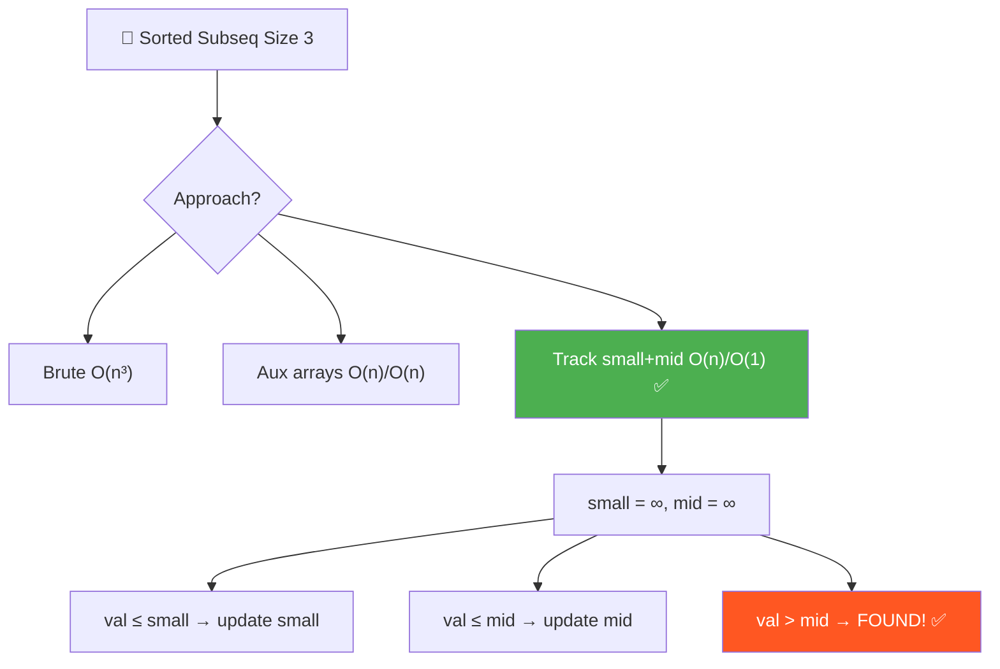
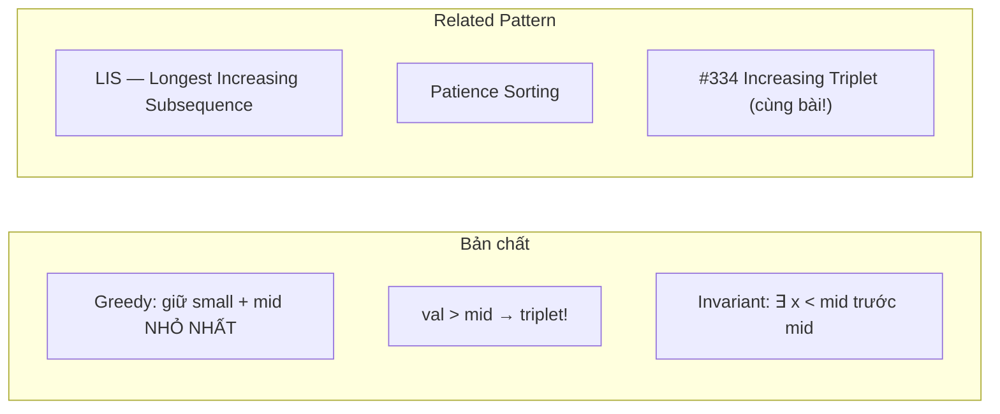
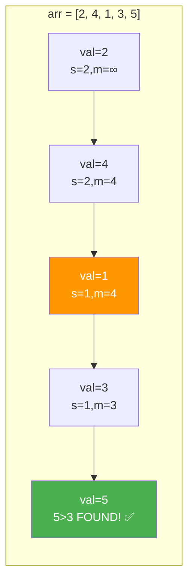
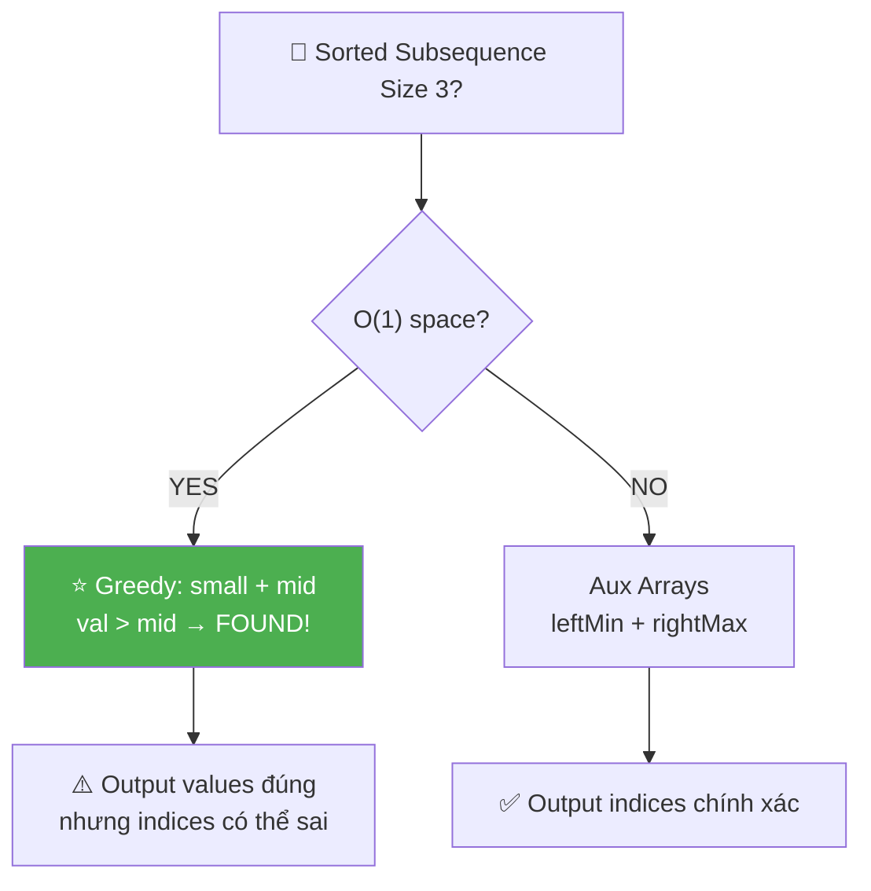
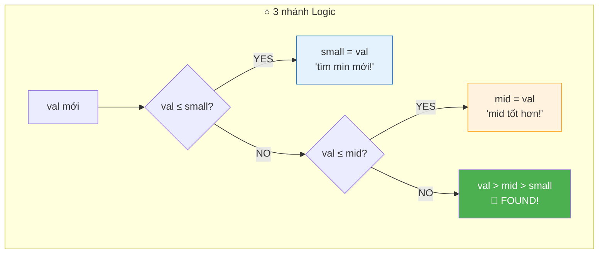
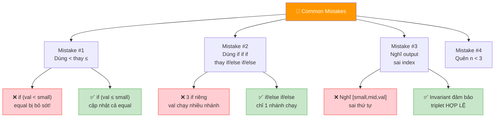
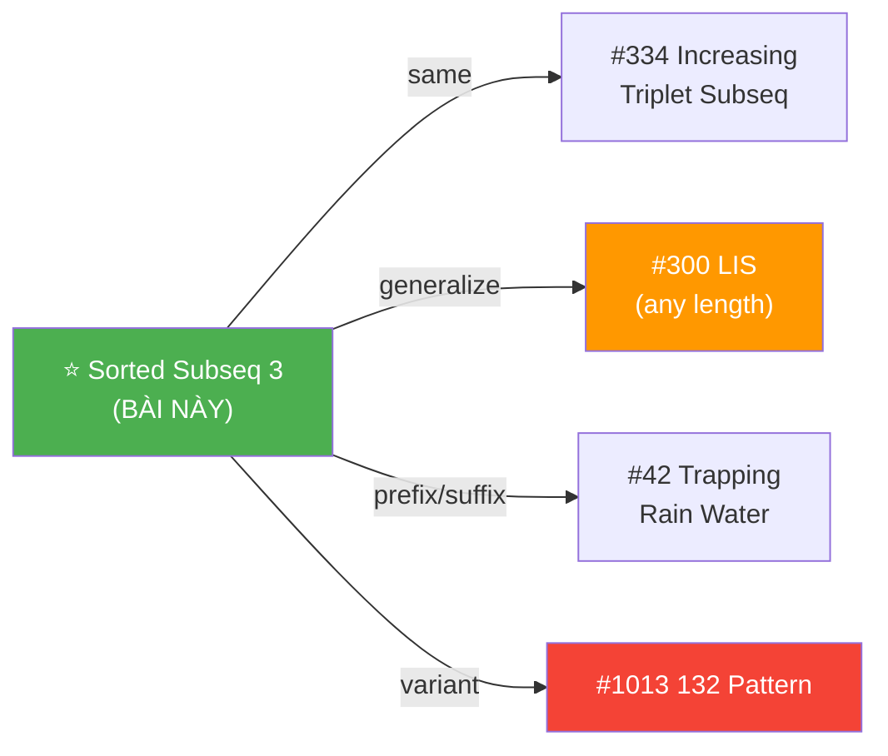
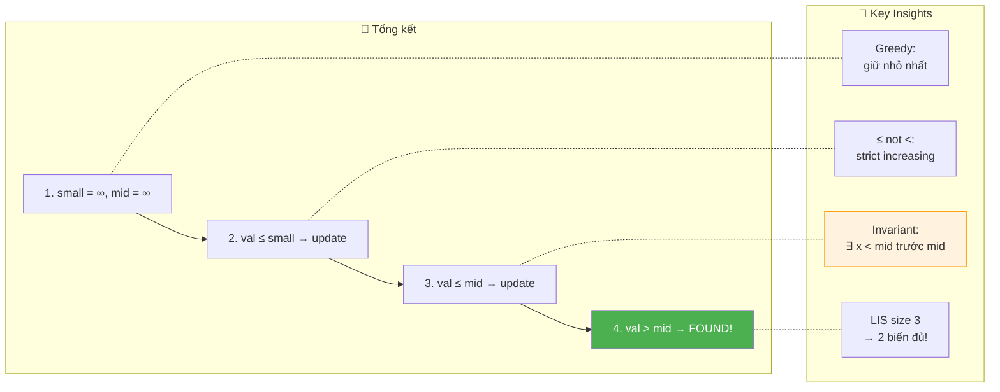

# 📐 Sorted Subsequence of Size 3 — GfG (Easy)

> 📖 Code: [Sorted Subsequence of Size 3.js](./Sorted%20Subsequence%20of%20Size%203.js)





---

## R — Repeat & Clarify

🧠 _"Track smallest và second-smallest. Khi gặp val > mid → found triplet! O(n)/O(1)!"_

> 🎙️ _"Find 3 elements a[i] < a[j] < a[k] where i < j < k in O(n) time."_

### Clarification Questions

```
Q: Subsequence = cần liên tiếp không?
A: KHÔNG! Subsequence = chỉ cần i < j < k (giữ thứ tự index).
   Subarray = liên tiếp. Subsequence = không cần liên tiếp!

Q: Strict increasing hay ≤?
A: STRICT: a[i] < a[j] < a[k], KHÔNG phải ≤!

Q: Output format?
A: Trả về [a[i], a[j], a[k]] bất kỳ. Nếu không tồn tại → null.

Q: Có thể duplicate values?
A: CÓ! Mảng chứa giá trị bất kỳ, kể cả trùng.

Q: n < 3?
A: Không thể tìm triplet → return null ngay!

Q: Giá trị âm?
A: CÓ THỂ! Giá trị bất kỳ (âm, 0, dương).
```

### Tại sao bài này quan trọng?

```
  ⭐ Bài này dạy NHIỀU pattern cùng lúc:

  ┌──────────────────────────────────────────────────────────────┐
  │  1. GREEDY CANDIDATES: giữ "nhỏ nhất có thể"               │
  │     → Dùng trong LIS, Patience Sorting, Stack problems     │
  │                                                              │
  │  2. PREFIX MIN / SUFFIX MAX: auxiliary arrays                │
  │     → Dùng trong Trapping Rain Water, Stock Problems        │
  │                                                              │
  │  3. INVARIANT THINKING: small có thể SAU mid nhưng          │
  │     vẫn đảm bảo "tồn tại số < mid TRƯỚC mid"               │
  │     → Kỹ năng tư duy QUAN TRỌNG cho interview!             │
  │                                                              │
  │  📌 Bài này = LIS nhưng chỉ cần LENGTH 3!                  │
  │     LIS size k → dùng k-1 candidates + binary search!      │
  └──────────────────────────────────────────────────────────────┘
```

---

## 🧠 Bản chất bài toán — Hiểu để NHỚ, không chỉ để GIẢI

### INSIGHT CỐT LÕI: "Giữ candidates NHỎ NHẤT"

```
  ⭐ Ẩn dụ: "Xếp bài Poker — Patience Sorting!"

  Tưởng tượng bạn đang xếp bài:
    - Bạn có 2 stack: stack "nhỏ" và stack "giữa"
    - Mỗi lá bài mới:
      ① Nhỏ hơn stack nhỏ → đặt lên stack nhỏ
      ② Nhỏ hơn stack giữa → đặt lên stack giữa
      ③ Lớn hơn stack giữa → BẠN CÓ 3 LÁ TĂNG DẦN!

  ┌──────────────────────────────────────────────────────────────┐
  │  Tại sao ĐỂ NHỎ NHẤT CÓ THỂ?                              │
  │                                                              │
  │  Vì small và mid CÀNG NHỎ →                                 │
  │    → val > mid CÀNG DỄ ĐẠT ĐƯỢC!                           │
  │    → XÁC SUẤT tìm thấy triplet CÀNG CAO!                   │
  │                                                              │
  │  Greedy: tại mỗi bước, GIẢM small/mid khi có thể!         │
  │  → Maximize cơ hội cho phần tử tiếp theo!                  │
  └──────────────────────────────────────────────────────────────┘
```

### Optimal: "Greedy update smallest và second-smallest"

```
  Duy trì 2 biến: small, mid (cả 2 khởi tạo = ∞)

  Với mỗi val:
    ① val ≤ small → update small (tìm được số NHỎ HƠN!)
    ② val ≤ mid   → update mid (tìm được số GIỮA tốt hơn!)
    ③ val > mid   → FOUND! [small, mid, val] là triplet!

  🧠 Tại sao ≤ (KHÔNG PHẢI <)?
    → val = small hoặc val = mid → KHÔNG tạo STRICTLY increasing!
    → Cần strict: a[i] < a[j] < a[k], KHÔNG phải ≤!
    → Nếu val = mid, update mid (giữ nguyên) → không hại gì!

  🧠 "Update small có phá mid không?"
    ─── ĐÂY LÀ CÂU HỎI HAY NHẤT CỦA BÀI NÀY! ───

    Ví dụ: [2, 4, 1, 3, 5]

    small=2, mid=4 → gặp 1 → small=1
    → mid VẪN = 4! Hợp lệ vì TỒN TẠI số < 4 TRƯỚC 4 (old small=2)
    → Gặp 3: 3 ≤ 4 → mid = 3 (update mid tốt hơn!)
    → Gặp 5: 5 > 3 → FOUND! [1, 3, 5] ✅

  📌 small có thể SAU mid trong mảng, nhưng INVARIANT:
     "Tồn tại 1 số < mid TRƯỚC mid" luôn đúng!
```

### Hình dung trực quan — State evolution



```
  arr = [2, 4, 1, 3, 5]

  ┌──────┬───────┬───────┬───────┬────────────────────────────┐
  │ Step │ val   │ small │ mid   │ Hành động                   │
  ├──────┼───────┼───────┼───────┼────────────────────────────┤
  │ 0    │       │ ∞     │ ∞     │ Init                       │
  │ 1    │ 2     │ 2     │ ∞     │ 2 ≤ ∞ → small=2           │
  │ 2    │ 4     │ 2     │ 4     │ 4 > 2, 4 ≤ ∞ → mid=4     │
  │ 3    │ 1     │ 1     │ 4     │ 1 ≤ 2 → small=1 ⚠️       │
  │ 4    │ 3     │ 1     │ 3     │ 3 > 1, 3 ≤ 4 → mid=3     │
  │ 5    │ 5     │ 1     │ 3     │ 5 > 3 → FOUND! ✅         │
  └──────┴───────┴───────┴───────┴────────────────────────────┘

  ⚠️ Step 3: small=1 nhưng mid=4 vẫn!
     small (index 2) SAU mid (index 1) trong mảng!
     Nhưng OLD small=2 (index 0) VẪN < mid=4 → invariant OK!
```

### Trace thêm — Trường hợp KHÔNG tìm thấy

```
  arr = [5, 4, 3, 2, 1]    (giảm dần)

  ┌──────┬───────┬───────┬───────┬────────────────────────────┐
  │ Step │ val   │ small │ mid   │ Hành động                   │
  ├──────┼───────┼───────┼───────┼────────────────────────────┤
  │ 0    │       │ ∞     │ ∞     │ Init                       │
  │ 1    │ 5     │ 5     │ ∞     │ 5 ≤ ∞ → small=5           │
  │ 2    │ 4     │ 4     │ ∞     │ 4 ≤ 5 → small=4           │
  │ 3    │ 3     │ 3     │ ∞     │ 3 ≤ 4 → small=3           │
  │ 4    │ 2     │ 2     │ ∞     │ 2 ≤ 3 → small=2           │
  │ 5    │ 1     │ 1     │ ∞     │ 1 ≤ 2 → small=1           │
  └──────┴───────┴───────┴───────┴────────────────────────────┘

  mid KHÔNG BAO GIỜ được update → không tìm được triplet!
  → return null ✅
```

### Auxiliary Arrays approach

```
  leftMin[j]  = min phần tử từ arr[0] đến arr[j] (inclusive)
  rightMax[j] = max phần tử từ arr[j] đến arr[n-1] (inclusive)

  Nếu leftMin[j] < arr[j] < rightMax[j] → arr[j] là MIDDLE!
  → Triplet: [leftMin[j], arr[j], rightMax[j]]

  ┌──────────────────────────────────────────────────────────────┐
  │  arr = [2, 4, 1, 3, 5]                                      │
  │                                                              │
  │  leftMin:  [2, 2, 1, 1, 1]                                  │
  │  rightMax: [5, 5, 5, 5, 5]                                  │
  │                                                              │
  │  j=1: leftMin[1]=2 < arr[1]=4 < rightMax[1]=5 → ✅          │
  │  → Triplet: [2, 4, 5] ✅                                    │
  │                                                              │
  │  📌 Trực quan hơn optimal, nhưng tốn O(n) space!            │
  │  📌 Output ĐÚNG indices (khác optimal!)                      │
  └──────────────────────────────────────────────────────────────┘
```

---

## 🧭 Luồng Suy Nghĩ — Từ đọc đề đến solution

### Bước 1: Đọc đề → Gạch chân KEYWORDS

```
  Đề: "Find 3 elements forming an increasing subsequence"

  Gạch chân:
    ✏️ "3 elements"        → cố định size = 3
    ✏️ "increasing"         → a[i] < a[j] < a[k]
    ✏️ "subsequence"        → i < j < k (GIỮ THỨ TỰ, không cần liên tiếp!)
    ✏️ "O(n)"              → linear scan!

  🧠 Trigger:
    "Increasing subsequence" → LIS pattern!
    "Size = 3" → chỉ cần 2 biến (small, mid)!
    "O(n)" → greedy candidate tracking!
```

### Bước 2: Approaches từ brute → optimal

```
  🧠 Approach 1: Brute Force O(n³)
    → 3 vòng for lồng nhau → quá chậm!

  🧠 Approach 2: Auxiliary Arrays O(n)/O(n)
    → leftMin[j] < arr[j] < rightMax[j] → arr[j] là middle!
    → O(n) time, O(n) space

  🧠 Approach 3: Greedy O(n)/O(1) ⭐
    → Track small + mid → val > mid → FOUND!
    → O(n) time, O(1) space → OPTIMAL!

  📌 "Size cố định" → constant variables!
     Size 3 → 2 biến (small, mid)
     Size k → k-1 biến (+ binary search cho insertion)
```

### Bước 3: Cây quyết định



---

## E — Examples

```
VÍ DỤ 1: arr = [1, 2, 1, 1, 3]

  Greedy:
    val=1: 1≤∞ → small=1
    val=2: 2>1, 2≤∞ → mid=2
    val=1: 1≤1 → small=1 (giữ nguyên)
    val=1: 1≤1 → small=1 (giữ nguyên)
    val=3: 3>2 → FOUND! [1, 2, 3] ✅
```

```
VÍ DỤ 2: arr = [3, 2, 1]

  Greedy:
    val=3: small=3
    val=2: 2≤3 → small=2
    val=1: 1≤2 → small=1
  mid CHƯA BAO GIỜ được set → return null ✅
```

```
VÍ DỤ 3: arr = [2, 4, 1, 3, 5]    (trường hợp HAY!)

  val=2: small=2
  val=4: 4>2 → mid=4
  val=1: 1≤2 → small=1 ⚠️ (small SAU mid!)
  val=3: 3>1, 3≤4 → mid=3
  val=5: 5>3 → FOUND! [1, 3, 5] ✅

  ⚠️ Output [1,3,5] nhưng:
     1 ở index 2, 3 ở index 3, 5 ở index 4
     Index: 2 < 3 < 4 → HỢP LỆ! ✅
```

```
VÍ DỤ 4 (Edge): arr = [1, 1, 1, 1]

  val=1: small=1
  val=1: 1≤1 → small=1
  val=1: 1≤1 → small=1
  val=1: 1≤1 → small=1
  mid CHƯA set → return null ✅

  📌 ≤ (không < ) đảm bảo val = small KHÔNG chuyển sang mid!
```

---

## A — Approach

### Approach 1: Brute Force — O(n³)

```
  3 vòng for lồng nhau: for i < j < k, check arr[i] < arr[j] < arr[k]
  → O(n³) — chỉ NÓI, không viết!
```

### Approach 2: Auxiliary Arrays — O(n)/O(n)

```
  leftMin[j] = min(arr[0..j])
  rightMax[j] = max(arr[j..n-1])

  Duyệt j: nếu leftMin[j] < arr[j] < rightMax[j] → FOUND!

  Time: O(n)    Space: O(n)
```

### Approach 3: Greedy Candidates — O(n)/O(1) ⭐

```
  small = ∞, mid = ∞

  For each val:
    val ≤ small → small = val
    val ≤ mid   → mid = val
    val > mid   → return [small, mid, val]

  Time: O(n)    Space: O(1) — CHỈ 2 biến!
```

---

## C — Code ✅

### Solution 1: Greedy — O(n)/O(1) ⭐

```javascript
function findTripletOptimal(arr) {
  let small = Infinity, mid = Infinity;

  for (const val of arr) {
    if (val <= small) small = val;
    else if (val <= mid) mid = val;
    else return [small, mid, val];
  }
  return null;
}
```

### Solution 2: Auxiliary Arrays — O(n)/O(n)

```javascript
function findTripletAux(arr) {
  const n = arr.length;
  if (n < 3) return null;

  const leftMin = new Array(n);
  const rightMax = new Array(n);

  leftMin[0] = arr[0];
  for (let i = 1; i < n; i++) leftMin[i] = Math.min(leftMin[i-1], arr[i]);

  rightMax[n-1] = arr[n-1];
  for (let i = n-2; i >= 0; i--) rightMax[i] = Math.max(rightMax[i+1], arr[i]);

  for (let j = 1; j < n-1; j++) {
    if (leftMin[j] < arr[j] && arr[j] < rightMax[j])
      return [leftMin[j], arr[j], rightMax[j]];
  }
  return null;
}
```

---

## 🔬 Deep Dive — Giải thích CHI TIẾT Greedy

> 💡 Phân tích **từng dòng** để hiểu **TẠI SAO**.

```javascript
function findTripletOptimal(arr) {
  // ═══════════════════════════════════════════════════════════
  // Init: small = ∞, mid = ∞
  // ═══════════════════════════════════════════════════════════
  //
  // TẠI SAO Infinity?
  //   → Bất kỳ giá trị nào cũng ≤ Infinity
  //   → Phần tử ĐẦU TIÊN sẽ trở thành small!
  //   → Không cần xử lý edge case riêng!
  //
  let small = Infinity, mid = Infinity;

  for (const val of arr) {
    // ═══════════════════════════════════════════════════════════
    // NHÁNH 1: val ≤ small → update small
    // ═══════════════════════════════════════════════════════════
    //
    // TẠI SAO ≤ (không phải <)?
    //   val = small → KHÔNG tạo strictly increasing!
    //   → Giữ small = val (không hại, vì giá trị GIỐNG nhau)
    //   → Ngăn val đi vào nhánh 2 (sai logic!)
    //
    // TẠI SAO update small khi mid đã set?
    //   → small GIẢM → "nới rộng" cơ hội cho val sau!
    //   → mid VẪN valid vì "tồn tại old small < mid TRƯỚC mid!"
    //
    if (val <= small) small = val;

    // ═══════════════════════════════════════════════════════════
    // NHÁNH 2: val ≤ mid → update mid
    // ═══════════════════════════════════════════════════════════
    //
    // Đến đây → val > small (vì nhánh 1 KHÔNG chạy!)
    // val ≤ mid → val là candidate TỐT HƠN cho mid!
    //   → mid GIẢM → "nới rộng" cơ hội cho val sau!
    //
    // ⚠️ "else if" KHÔNG PHẢI "if"! Chỉ 1 nhánh chạy!
    //    Nếu dùng "if" → val ≤ small rồi kiểm tiếp val ≤ mid
    //    → SAI! val = small ≤ mid → mid = val → BẰNG small!
    //
    else if (val <= mid) mid = val;

    // ═══════════════════════════════════════════════════════════
    // NHÁNH 3: val > mid → FOUND!
    // ═══════════════════════════════════════════════════════════
    //
    // val > mid > small → tồn tại triplet!
    //
    // ⚠️ Output [small, mid, val]:
    //    small CÓ THỂ SAU mid trong mảng (index sai!)
    //    NHƯNG đáp án vẫn ĐÚNG vì:
    //    → TỒN TẠI old_small < mid TRƯỚC mid trong mảng!
    //    → old_small, mid, val = valid triplet!
    //
    else return [small, mid, val];
  }
  return null;
}
```



---

## 📐 Invariant — Chứng minh tính đúng đắn

```
  📐 INVARIANT (trước mỗi iteration):

    Nếu mid ≠ ∞:
      ∃ index p < current_index sao cho arr[p] < mid
      (tức là TỒN TẠI phần tử NHỎ HƠN mid VÀ TRƯỚC mid!)

  CHỨNG MINH:
  ┌──────────────────────────────────────────────────────────────┐
  │  Base: mid = ∞ → invariant trivially true ✅               │
  │                                                              │
  │  mid được set lần đầu khi val > small:                      │
  │    → small đã set bởi phần tử TRƯỚC                        │
  │    → ∃ element = old_small < val = mid, ở index TRƯỚC ✅    │
  │                                                              │
  │  Khi small update SAU mid:                                   │
  │    → old_small VẪN < mid VÀ ở index TRƯỚC mid              │
  │    → Invariant KHÔNG bị phá! ✅                              │
  │                                                              │
  │  Khi mid update:                                             │
  │    → val > small (nhánh 2) → ∃ small < val = new_mid       │
  │    → Invariant giữ nguyên! ✅                                │
  └──────────────────────────────────────────────────────────────┘

  📐 CORRECTNESS:
    Khi val > mid (nhánh 3):
      → val > mid ✅
      → ∃ x < mid ở index trước mid (invariant!)
      → x < mid < val với index x < index mid < current ✅
      → VALID TRIPLET! ∎

  📐 COMPLETENESS:
    Nếu ∃ triplet a[i] < a[j] < a[k]:
      → Khi xử lý a[j]: small ≤ a[i] < a[j] → mid ≤ a[j]
      → Khi xử lý a[k]: a[k] > a[j] ≥ mid → nhánh 3 trigger!
      → Thuật toán LUÔN tìm được triplet nếu tồn tại! ∎
```

---

## ❌ Common Mistakes — Lỗi thường gặp



### Mistake 1: Dùng < thay vì ≤!

```javascript
// ❌ SAI: < thay vì ≤!
if (val < small) small = val;
else if (val < mid) mid = val;
else return [small, mid, val];

// arr = [1, 1, 2]: val=1 → small=1, val=1 → 1 < 1? NO!
// → đi vào nhánh 2: 1 < ∞? YES → mid=1!
// → val=2: 2 > 1 → return [1, 1, 2]
// → SAI! 1 < 1 < 2 KHÔNG strictly increasing!

// ✅ ĐÚNG: dùng ≤!
if (val <= small) small = val;
else if (val <= mid) mid = val;
else return [small, mid, val];
// val=1: 1≤1 → small=1 (nhánh 1!)
// val=1: 1≤1 → small=1 (nhánh 1 AGAIN!)
// val=2: 2>1, 2≤∞ → mid=2 → chưa đủ 3!
// → return null ✅ (chỉ có 1,1,2 → not strictly increasing)
```

### Mistake 2: Dùng 3 if riêng thay vì if/else if/else!

```javascript
// ❌ SAI: 3 if riêng!
if (val <= small) small = val;
if (val <= mid) mid = val;   // ← val = small cũng chạy!
// → mid = small → invalid!

// ✅ ĐÚNG: else if!
if (val <= small) small = val;
else if (val <= mid) mid = val;   // chỉ chạy khi val > small!
else return [small, mid, val];

// 📌 "else" đảm bảo chỉ 1 NHÁNH chạy!
```

### Mistake 3: Nghĩ output sai index → không hợp lệ!

```
  arr = [2, 4, 1, 3, 5]
  Output: [1, 3, 5]

  "Nhưng 1 ở index 2, TRƯỚC 4 ở index 1 sao?"
  → SAI cách nghĩ! Output [1, 3, 5] KHÔNG nói index!
  → 1 ở index 2, 3 ở index 3, 5 ở index 4
  → index: 2 < 3 < 4 → HỢP LỆ! ✅

  📌 Nếu cần OUTPUT ĐÚNG INDEX → dùng Auxiliary Arrays!
```

### Mistake 4: Quên handle n < 3!

```javascript
// ❌ SAI: không check n < 3!
// arr = [1, 2] → loop chạy nhưng return null → OK
// arr = [] → loop không chạy → return null → OK
// → THỰC RA OK trong code này, nhưng nên check rõ ràng!

// ✅ AN TOÀN HƠN:
if (arr.length < 3) return null;
```

---

## O — Optimize

```
                Time     Space    Ghi chú
  ──────────────────────────────────────────────────────
  Brute Force   O(n³)    O(1)     3 vòng for
  Aux Arrays    O(n)     O(n)     leftMin + rightMax
  Greedy ⭐     O(n)     O(1)     2 biến!
```

### Complexity chính xác — Đếm operations

```
  Greedy:
    1 pass × 2 comparisons per element
    TỔNG: 2n comparisons, 0 extra space

  Aux Arrays:
    3 passes × n elements = 3n
    2 arrays × n = 2n space
    TỔNG: 3n operations, 2n space

  📊 So sánh (n = 10⁶):
    Greedy:  2×10⁶ ops, 16 bytes RAM ⭐
    Aux:     3×10⁶ ops, ~16MB RAM 😰
    Brute:   10¹⁸ ops 💀
```

---

## T — Test

```
Test Cases:
  [1, 2, 1, 1, 3]    → [1, 2, 3]     ✅ basic
  [1, 1, 1, 1]        → null          ✅ all same
  [5, 4, 3, 2, 1]     → null          ✅ decreasing
  [2, 4, 1, 3, 5]     → [1, 3, 5]     ✅ small updates after mid
  [1, 2, 3]           → [1, 2, 3]     ✅ sorted
  [1]                 → null          ✅ n < 3
  [1, 5, 0, 7]        → [1, 5, 7]     ✅ skip middle element
  [10, 20, 3, 2, 30]  → [3, 20, 30]?  ← check!

  Trace [10, 20, 3, 2, 30]:
    val=10: small=10
    val=20: mid=20
    val=3: small=3 (⚠️ SAU mid!)
    val=2: small=2
    val=30: 30>20 → FOUND [2, 20, 30]
    → HỢP LỆ? index 2=3, index 20=1 → 2 ở index 3 > 20 ở index 1!
    → Output GIỐNG nhưng invariant đảm bảo ∃ x<20 trước 20 (old 10!)
    → Real triplet: [10, 20, 30] ✓
```

---

## 🗣️ Interview Script

### 🎙️ Think Out Loud — Mô phỏng phỏng vấn thực

```
  ──────────────── PHASE 1: Clarify ────────────────

  👤 Interviewer: "Find any increasing subsequence of length 3."

  🧑 You: "Let me clarify:
   1. Subsequence means maintaining order but not contiguous.
   2. Strictly increasing: a[i] < a[j] < a[k], not ≤.
   3. I just need to find one triplet, not count all.
   4. Return the values, or null if none exists."

  ──────────────── PHASE 2: Examples ────────────────

  🧑 You: "arr = [2, 4, 1, 3, 5].
   Looking for i < j < k where arr[i] < arr[j] < arr[k].
   [2, 4, 5] works (indices 0, 1, 4). Also [1, 3, 5]."

  ──────────────── PHASE 3: Approach ────────────────

  🧑 You: "The brute force is O(n³) with three nested loops.

   But since we only need length 3, I can use a greedy approach.
   I maintain two variables: 'small' (smallest so far) and 'mid'
   (smallest value that has something smaller before it).

   For each value:
   - If ≤ small: update small
   - Else if ≤ mid: update mid (it has small before it)
   - Else: it's > mid > small → found triplet!

   O(n) time, O(1) space."

  ──────────────── PHASE 4: Code + Verify ────────────────

  🧑 You: [writes code]

  "Key subtlety: when small updates past mid's position,
   mid is still valid because the OLD small existed before mid.
   The invariant is: if mid is set, there exists some element
   strictly less than mid at an earlier index."

  ──────────────── PHASE 5: Follow-ups ────────────────

  👤 "What if we need the actual indices?"
  🧑 "Then I'd use the auxiliary arrays approach — leftMin
      and rightMax. For each j, if leftMin[j] < arr[j] < rightMax[j],
      arr[j] is the middle. O(n) time but O(n) space."

  👤 "What about subsequence of size k?"
  🧑 "Generalize to k-1 candidates stored in a sorted array.
      Use binary search to find insertion point — this is
      essentially patience sorting. O(n log k) time."

  👤 "Why ≤ instead of < in the conditions?"
  🧑 "To handle duplicates. If I used <, then val = small
      would go to the mid branch, making mid = small.
      Then any val > mid would give a false triplet with
      equal values. Using ≤ keeps equal values in the
      small/mid category without promoting them."
```

---

## 📚 Bài tập liên quan — Practice Problems

### Progression Path



### 1. Increasing Triplet Subsequence (#334) — Medium

```
  Đề: CÙNG BÀI! "Return true if increasing triplet exists."

  function increasingTriplet(nums) {
    let small = Infinity, mid = Infinity;
    for (const val of nums) {
      if (val <= small) small = val;
      else if (val <= mid) mid = val;
      else return true;   // ← chỉ return true, không cần values!
    }
    return false;
  }

  📌 100% GIỐNG! Chỉ khác return true/false thay vì values!
```

### 2. Longest Increasing Subsequence (#300) — Medium

```
  Đề: Tìm CHIỀU DÀI LIS (any length, not just 3).

  function lengthOfLIS(nums) {
    const tails = [];   // ← THAY VÌ 2 biến, dùng ARRAY!
    for (const val of nums) {
      // Binary search: tìm vị trí insert val trong tails
      let lo = 0, hi = tails.length;
      while (lo < hi) {
        const mid = (lo + hi) >> 1;
        if (tails[mid] < val) lo = mid + 1;
        else hi = mid;
      }
      tails[lo] = val;
    }
    return tails.length;
  }

  📌 So sánh:
    Bài này: 2 biến (small, mid) → O(n)/O(1)
    LIS: array tails[] + binary search → O(n log n)/O(n)
    CÙNG Ý TƯỞNG: greedy, giữ candidates NHỎ NHẤT!
```

### 3. 132 Pattern (#456) — Medium

```
  Đề: Tìm a[i] < a[k] < a[j] (1-3-2 pattern, NOT 1-2-3!)

  function find132pattern(nums) {
    const n = nums.length;
    let third = -Infinity;      // candidate cho a[k]
    const stack = [];            // monotonic stack cho a[j]

    for (let i = n - 1; i >= 0; i--) {
      if (nums[i] < third) return true;
      while (stack.length && stack[stack.length-1] < nums[i]) {
        third = stack.pop();
      }
      stack.push(nums[i]);
    }
    return false;
  }

  📌 Biến thể: thay 1-2-3 pattern → 1-3-2 pattern!
     Dùng Monotonic Stack + duyệt NGƯỢC!
```

### Tổng kết — Subsequence Pattern Family

```
  ┌──────────────────────────────────────────────────────────────┐
  │  BÀI                     │  Technique                       │
  ├──────────────────────────────────────────────────────────────┤
  │  Sorted Subseq 3 ⭐      │  2 variables: small + mid       │
  │  #334 Increasing Triplet │  CÙNG BÀI (return bool)         │
  │  #300 LIS                │  tails[] + binary search        │
  │  #456 132 Pattern        │  Monotonic Stack (ngược!)        │
  │  #42 Trapping Rain Water │  leftMin[] + rightMax[]         │
  └──────────────────────────────────────────────────────────────┘

  📌 RULE: "Increasing subseq size k" → k-1 candidates!
           "Size 3" → 2 biến → O(n)/O(1)!
           "Any size" → array + binary search → O(n log n)!
```

### Skeleton code — Reusable template

```javascript
// TEMPLATE: Tìm increasing subsequence of size k
function hasIncreasingSubseqOfSizeK(arr, k) {
  // k-1 candidates, giữ NHỎ NHẤT
  const candidates = [];

  for (const val of arr) {
    // Binary search: tìm vị trí insert
    let lo = 0, hi = candidates.length;
    while (lo < hi) {
      const mid = (lo + hi) >> 1;
      if (candidates[mid] < val) lo = mid + 1;
      else hi = mid;
    }
    candidates[lo] = val;
    if (candidates.length === k) return true;
    if (lo === candidates.length) candidates.push(val);
  }
  return false;
}

// k=3: tối ưu bằng 2 biến (bài này!)
// k=any: dùng template trên → O(n log k)
```

---

## 📊 Tổng kết — Key Insights



```
  ┌──────────────────────────────────────────────────────────────────────────┐
  │  📌 3 ĐIỀU PHẢI NHỚ                                                    │
  │                                                                          │
  │  1. GREEDY CANDIDATES: giữ small + mid NHỎ NHẤT CÓ THỂ               │
  │     → val ≤ small → update small                                       │
  │     → val ≤ mid → update mid                                           │
  │     → val > mid → FOUND TRIPLET!                                       │
  │     → ≤ (không <) để handle duplicates!                                │
  │                                                                          │
  │  2. INVARIANT: "∃ x < mid TRƯỚC mid" luôn đúng!                       │
  │     → small update SAU mid? KHÔNG SAO!                                  │
  │     → Old small VẪN < mid VÀ ở index trước!                           │
  │     → Đây là insight QUAN TRỌNG NHẤT!                                  │
  │                                                                          │
  │  3. GENERALIZATION: LIS size k → k-1 candidates!                       │
  │     → Size 3 → 2 biến → O(n)/O(1)                                     │
  │     → Size k → array + binary search → O(n log k)                     │
  │     → Cùng ý tưởng: Patience Sorting!                                 │
  └──────────────────────────────────────────────────────────────────────────┘
```

---

## 📝 Flashcard — Tự kiểm tra

| ❓ Câu hỏi | ✅ Đáp án |
|---|---|
| Bài toán tìm gì? | **3 phần tử** a[i] < a[j] < a[k], i < j < k |
| Dùng mấy biến? | **2**: small + mid |
| Init giá trị? | **Infinity** (cả small và mid) |
| Tại sao ≤ không <? | Để handle **duplicates** (strict increasing!) |
| val > mid → ? | **FOUND** triplet! [small, mid, val] |
| small update SAU mid? | OK! **Invariant**: ∃ old_small < mid trước mid |
| Time / Space? | **O(n)** / **O(1)** |
| #334 khác gì? | **Cùng bài!** Chỉ return true/false |
| LIS size k? | **k-1 candidates** + binary search → O(n log k) |
| Cần indices chính xác? | Dùng **Auxiliary Arrays** (leftMin + rightMax) |
