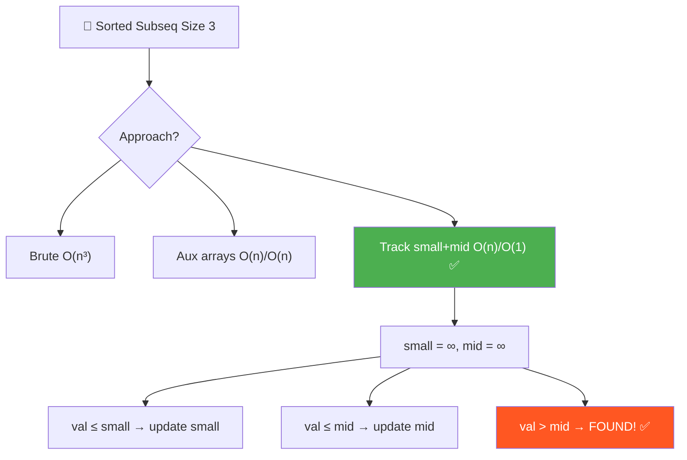
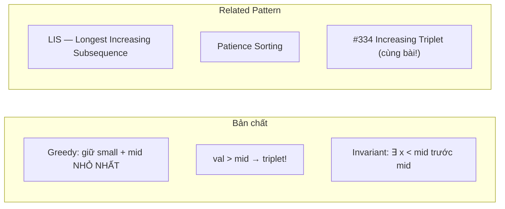
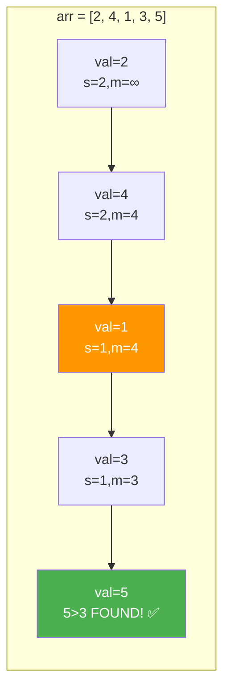
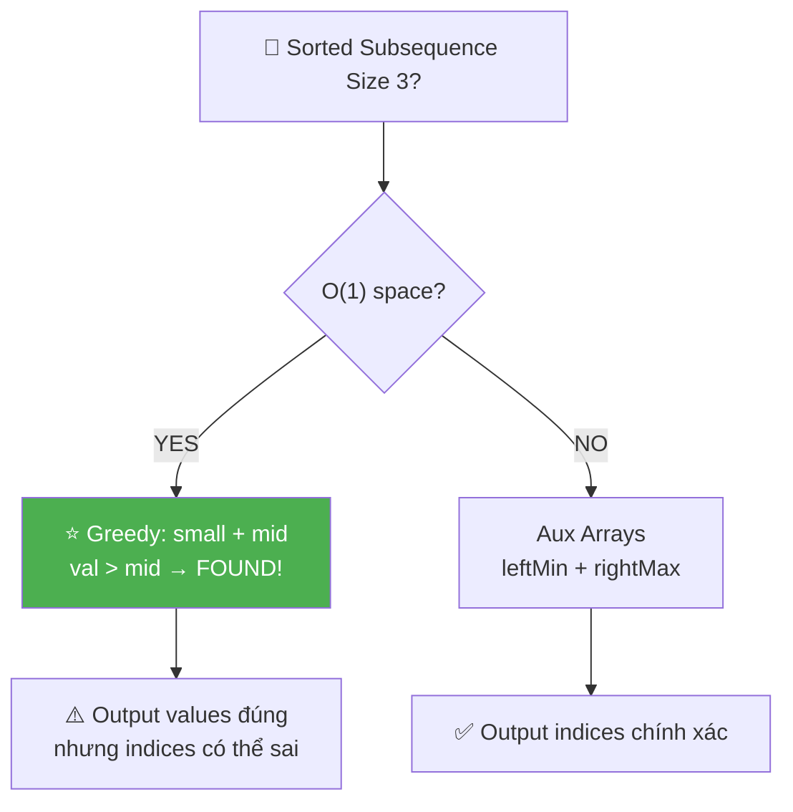
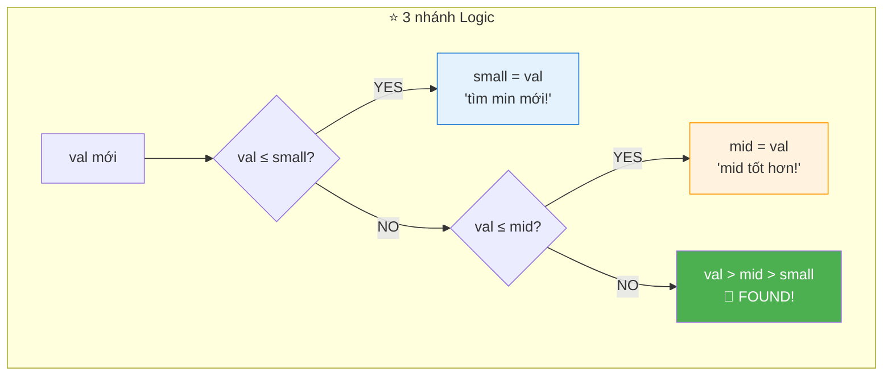
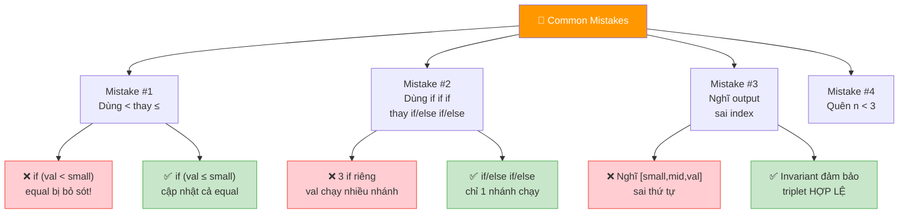
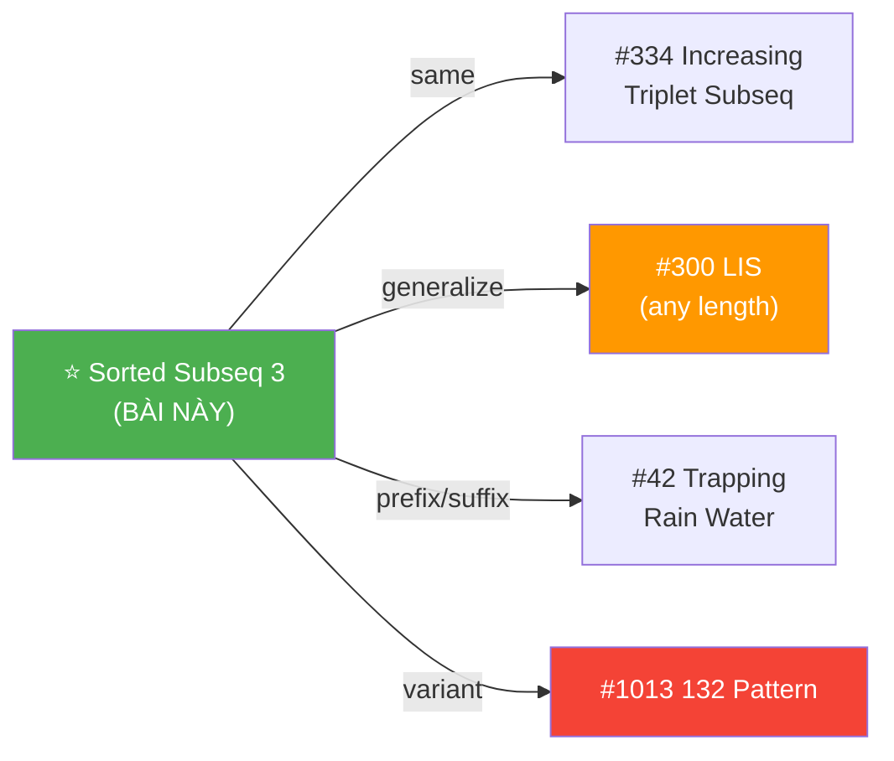
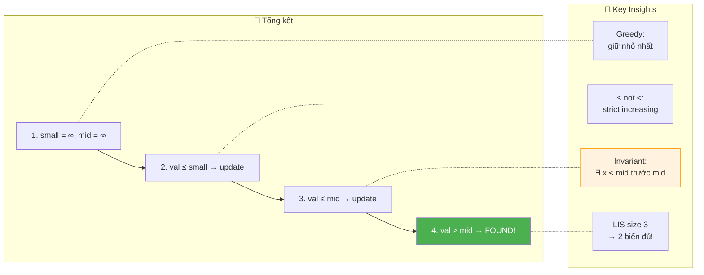

# 📐 Sorted Subsequence of Size 3 — GfG (Easy)

> 📖 Code: [Sorted Subsequence of Size 3.js](./Sorted%20Subsequence%20of%20Size%203.js)





---

## R — Repeat & Clarify

🧠 _"Track smallest và second-smallest. Khi gặp val > mid → found triplet! O(n)/O(1)!"_

> 🎙️ _"Find 3 elements a[i] < a[j] < a[k] where i < j < k in O(n) time."_

### Clarification Questions

```
Q: Subsequence = cần liên tiếp không?
A: KHÔNG! Subsequence = chỉ cần i < j < k (giữ thứ tự index).
   Subarray = liên tiếp. Subsequence = không cần liên tiếp!

Q: Strict increasing hay ≤?
A: STRICT: a[i] < a[j] < a[k], KHÔNG phải ≤!

Q: Output format?
A: Trả về [a[i], a[j], a[k]] bất kỳ. Nếu không tồn tại → null.

Q: Có thể duplicate values?
A: CÓ! Mảng chứa giá trị bất kỳ, kể cả trùng.

Q: n < 3?
A: Không thể tìm triplet → return null ngay!

Q: Giá trị âm?
A: CÓ THỂ! Giá trị bất kỳ (âm, 0, dương).
```

### Tại sao bài này quan trọng?

```
  ⭐ Bài này dạy NHIỀU pattern cùng lúc:

  ┌──────────────────────────────────────────────────────────────┐
  │  1. GREEDY CANDIDATES: giữ "nhỏ nhất có thể"               │
  │     → Dùng trong LIS, Patience Sorting, Stack problems     │
  │                                                              │
  │  2. PREFIX MIN / SUFFIX MAX: auxiliary arrays                │
  │     → Dùng trong Trapping Rain Water, Stock Problems        │
  │                                                              │
  │  3. INVARIANT THINKING: small có thể SAU mid nhưng          │
  │     vẫn đảm bảo "tồn tại số < mid TRƯỚC mid"               │
  │     → Kỹ năng tư duy QUAN TRỌNG cho interview!             │
  │                                                              │
  │  📌 Bài này = LIS nhưng chỉ cần LENGTH 3!                  │
  │     LIS size k → dùng k-1 candidates + binary search!      │
  └──────────────────────────────────────────────────────────────┘
```

---

## 🧠 Bản chất bài toán — Hiểu để NHỚ, không chỉ để GIẢI

### INSIGHT CỐT LÕI: "Giữ candidates NHỎ NHẤT"

```
  ⭐ Ẩn dụ: "Xếp bài Poker — Patience Sorting!"

  Tưởng tượng bạn đang xếp bài:
    - Bạn có 2 stack: stack "nhỏ" và stack "giữa"
    - Mỗi lá bài mới:
      ① Nhỏ hơn stack nhỏ → đặt lên stack nhỏ
      ② Nhỏ hơn stack giữa → đặt lên stack giữa
      ③ Lớn hơn stack giữa → BẠN CÓ 3 LÁ TĂNG DẦN!

  ┌──────────────────────────────────────────────────────────────┐
  │  Tại sao ĐỂ NHỎ NHẤT CÓ THỂ?                              │
  │                                                              │
  │  Vì small và mid CÀNG NHỎ →                                 │
  │    → val > mid CÀNG DỄ ĐẠT ĐƯỢC!                           │
  │    → XÁC SUẤT tìm thấy triplet CÀNG CAO!                   │
  │                                                              │
  │  Greedy: tại mỗi bước, GIẢM small/mid khi có thể!         │
  │  → Maximize cơ hội cho phần tử tiếp theo!                  │
  └──────────────────────────────────────────────────────────────┘
```

### Optimal: "Greedy update smallest và second-smallest"

```
  Duy trì 2 biến: small, mid (cả 2 khởi tạo = ∞)

  Với mỗi val:
    ① val ≤ small → update small (tìm được số NHỎ HƠN!)
    ② val ≤ mid   → update mid (tìm được số GIỮA tốt hơn!)
    ③ val > mid   → FOUND! [small, mid, val] là triplet!

  🧠 Tại sao ≤ (KHÔNG PHẢI <)?
    → val = small hoặc val = mid → KHÔNG tạo STRICTLY increasing!
    → Cần strict: a[i] < a[j] < a[k], KHÔNG phải ≤!
    → Nếu val = mid, update mid (giữ nguyên) → không hại gì!

  🧠 "Update small có phá mid không?"
    ─── ĐÂY LÀ CÂU HỎI HAY NHẤT CỦA BÀI NÀY! ───

    Ví dụ: [2, 4, 1, 3, 5]

    small=2, mid=4 → gặp 1 → small=1
    → mid VẪN = 4! Hợp lệ vì TỒN TẠI số < 4 TRƯỚC 4 (old small=2)
    → Gặp 3: 3 ≤ 4 → mid = 3 (update mid tốt hơn!)
    → Gặp 5: 5 > 3 → FOUND! [1, 3, 5] ✅

  📌 small có thể SAU mid trong mảng, nhưng INVARIANT:
     "Tồn tại 1 số < mid TRƯỚC mid" luôn đúng!
```

### Hình dung trực quan — State evolution



```
  arr = [2, 4, 1, 3, 5]

  ┌──────┬───────┬───────┬───────┬────────────────────────────┐
  │ Step │ val   │ small │ mid   │ Hành động                   │
  ├──────┼───────┼───────┼───────┼────────────────────────────┤
  │ 0    │       │ ∞     │ ∞     │ Init                       │
  │ 1    │ 2     │ 2     │ ∞     │ 2 ≤ ∞ → small=2           │
  │ 2    │ 4     │ 2     │ 4     │ 4 > 2, 4 ≤ ∞ → mid=4     │
  │ 3    │ 1     │ 1     │ 4     │ 1 ≤ 2 → small=1 ⚠️       │
  │ 4    │ 3     │ 1     │ 3     │ 3 > 1, 3 ≤ 4 → mid=3     │
  │ 5    │ 5     │ 1     │ 3     │ 5 > 3 → FOUND! ✅         │
  └──────┴───────┴───────┴───────┴────────────────────────────┘

  ⚠️ Step 3: small=1 nhưng mid=4 vẫn!
     small (index 2) SAU mid (index 1) trong mảng!
     Nhưng OLD small=2 (index 0) VẪN < mid=4 → invariant OK!
```

### Trace thêm — Trường hợp KHÔNG tìm thấy

```
  arr = [5, 4, 3, 2, 1]    (giảm dần)

  ┌──────┬───────┬───────┬───────┬────────────────────────────┐
  │ Step │ val   │ small │ mid   │ Hành động                   │
  ├──────┼───────┼───────┼───────┼────────────────────────────┤
  │ 0    │       │ ∞     │ ∞     │ Init                       │
  │ 1    │ 5     │ 5     │ ∞     │ 5 ≤ ∞ → small=5           │
  │ 2    │ 4     │ 4     │ ∞     │ 4 ≤ 5 → small=4           │
  │ 3    │ 3     │ 3     │ ∞     │ 3 ≤ 4 → small=3           │
  │ 4    │ 2     │ 2     │ ∞     │ 2 ≤ 3 → small=2           │
  │ 5    │ 1     │ 1     │ ∞     │ 1 ≤ 2 → small=1           │
  └──────┴───────┴───────┴───────┴────────────────────────────┘

  mid KHÔNG BAO GIỜ được update → không tìm được triplet!
  → return null ✅
```

### Auxiliary Arrays approach

```
  leftMin[j]  = min phần tử từ arr[0] đến arr[j] (inclusive)
  rightMax[j] = max phần tử từ arr[j] đến arr[n-1] (inclusive)

  Nếu leftMin[j] < arr[j] < rightMax[j] → arr[j] là MIDDLE!
  → Triplet: [leftMin[j], arr[j], rightMax[j]]

  ┌──────────────────────────────────────────────────────────────┐
  │  arr = [2, 4, 1, 3, 5]                                      │
  │                                                              │
  │  leftMin:  [2, 2, 1, 1, 1]                                  │
  │  rightMax: [5, 5, 5, 5, 5]                                  │
  │                                                              │
  │  j=1: leftMin[1]=2 < arr[1]=4 < rightMax[1]=5 → ✅          │
  │  → Triplet: [2, 4, 5] ✅                                    │
  │                                                              │
  │  📌 Trực quan hơn optimal, nhưng tốn O(n) space!            │
  │  📌 Output ĐÚNG indices (khác optimal!)                      │
  └──────────────────────────────────────────────────────────────┘
```

---

## 🧭 Luồng Suy Nghĩ — Từ đọc đề đến solution

### Bước 1: Đọc đề → Gạch chân KEYWORDS

```
  Đề: "Find 3 elements forming an increasing subsequence"

  Gạch chân:
    ✏️ "3 elements"        → cố định size = 3
    ✏️ "increasing"         → a[i] < a[j] < a[k]
    ✏️ "subsequence"        → i < j < k (GIỮ THỨ TỰ, không cần liên tiếp!)
    ✏️ "O(n)"              → linear scan!

  🧠 Trigger:
    "Increasing subsequence" → LIS pattern!
    "Size = 3" → chỉ cần 2 biến (small, mid)!
    "O(n)" → greedy candidate tracking!
```

### Bước 2: Approaches từ brute → optimal

```
  🧠 Approach 1: Brute Force O(n³)
    → 3 vòng for lồng nhau → quá chậm!

  🧠 Approach 2: Auxiliary Arrays O(n)/O(n)
    → leftMin[j] < arr[j] < rightMax[j] → arr[j] là middle!
    → O(n) time, O(n) space

  🧠 Approach 3: Greedy O(n)/O(1) ⭐
    → Track small + mid → val > mid → FOUND!
    → O(n) time, O(1) space → OPTIMAL!

  📌 "Size cố định" → constant variables!
     Size 3 → 2 biến (small, mid)
     Size k → k-1 biến (+ binary search cho insertion)
```

### Bước 3: Cây quyết định



---

## E — Examples

```
VÍ DỤ 1: arr = [1, 2, 1, 1, 3]

  Greedy:
    val=1: 1≤∞ → small=1
    val=2: 2>1, 2≤∞ → mid=2
    val=1: 1≤1 → small=1 (giữ nguyên)
    val=1: 1≤1 → small=1 (giữ nguyên)
    val=3: 3>2 → FOUND! [1, 2, 3] ✅
```

```
VÍ DỤ 2: arr = [3, 2, 1]

  Greedy:
    val=3: small=3
    val=2: 2≤3 → small=2
    val=1: 1≤2 → small=1
  mid CHƯA BAO GIỜ được set → return null ✅
```

```
VÍ DỤ 3: arr = [2, 4, 1, 3, 5]    (trường hợp HAY!)

  val=2: small=2
  val=4: 4>2 → mid=4
  val=1: 1≤2 → small=1 ⚠️ (small SAU mid!)
  val=3: 3>1, 3≤4 → mid=3
  val=5: 5>3 → FOUND! [1, 3, 5] ✅

  ⚠️ Output [1,3,5] nhưng:
     1 ở index 2, 3 ở index 3, 5 ở index 4
     Index: 2 < 3 < 4 → HỢP LỆ! ✅
```

```
VÍ DỤ 4 (Edge): arr = [1, 1, 1, 1]

  val=1: small=1
  val=1: 1≤1 → small=1
  val=1: 1≤1 → small=1
  val=1: 1≤1 → small=1
  mid CHƯA set → return null ✅

  📌 ≤ (không < ) đảm bảo val = small KHÔNG chuyển sang mid!
```

---

## A — Approach

### Approach 1: Brute Force — O(n³)

```
  3 vòng for lồng nhau: for i < j < k, check arr[i] < arr[j] < arr[k]
  → O(n³) — chỉ NÓI, không viết!
```

### Approach 2: Auxiliary Arrays — O(n)/O(n)

```
  leftMin[j] = min(arr[0..j])
  rightMax[j] = max(arr[j..n-1])

  Duyệt j: nếu leftMin[j] < arr[j] < rightMax[j] → FOUND!

  Time: O(n)    Space: O(n)
```

### Approach 3: Greedy Candidates — O(n)/O(1) ⭐

```
  small = ∞, mid = ∞

  For each val:
    val ≤ small → small = val
    val ≤ mid   → mid = val
    val > mid   → return [small, mid, val]

  Time: O(n)    Space: O(1) — CHỈ 2 biến!
```

---

## C — Code ✅

### Solution 1: Greedy — O(n)/O(1) ⭐

```javascript
function findTripletOptimal(arr) {
  let small = Infinity, mid = Infinity;

  for (const val of arr) {
    if (val <= small) small = val;
    else if (val <= mid) mid = val;
    else return [small, mid, val];
  }
  return null;
}
```

### Solution 2: Auxiliary Arrays — O(n)/O(n)

```javascript
function findTripletAux(arr) {
  const n = arr.length;
  if (n < 3) return null;

  const leftMin = new Array(n);
  const rightMax = new Array(n);

  leftMin[0] = arr[0];
  for (let i = 1; i < n; i++) leftMin[i] = Math.min(leftMin[i-1], arr[i]);

  rightMax[n-1] = arr[n-1];
  for (let i = n-2; i >= 0; i--) rightMax[i] = Math.max(rightMax[i+1], arr[i]);

  for (let j = 1; j < n-1; j++) {
    if (leftMin[j] < arr[j] && arr[j] < rightMax[j])
      return [leftMin[j], arr[j], rightMax[j]];
  }
  return null;
}
```

---

## 🔬 Deep Dive — Giải thích CHI TIẾT Greedy

> 💡 Phân tích **từng dòng** để hiểu **TẠI SAO**.

```javascript
function findTripletOptimal(arr) {
  // ═══════════════════════════════════════════════════════════
  // Init: small = ∞, mid = ∞
  // ═══════════════════════════════════════════════════════════
  //
  // TẠI SAO Infinity?
  //   → Bất kỳ giá trị nào cũng ≤ Infinity
  //   → Phần tử ĐẦU TIÊN sẽ trở thành small!
  //   → Không cần xử lý edge case riêng!
  //
  let small = Infinity, mid = Infinity;

  for (const val of arr) {
    // ═══════════════════════════════════════════════════════════
    // NHÁNH 1: val ≤ small → update small
    // ═══════════════════════════════════════════════════════════
    //
    // TẠI SAO ≤ (không phải <)?
    //   val = small → KHÔNG tạo strictly increasing!
    //   → Giữ small = val (không hại, vì giá trị GIỐNG nhau)
    //   → Ngăn val đi vào nhánh 2 (sai logic!)
    //
    // TẠI SAO update small khi mid đã set?
    //   → small GIẢM → "nới rộng" cơ hội cho val sau!
    //   → mid VẪN valid vì "tồn tại old small < mid TRƯỚC mid!"
    //
    if (val <= small) small = val;

    // ═══════════════════════════════════════════════════════════
    // NHÁNH 2: val ≤ mid → update mid
    // ═══════════════════════════════════════════════════════════
    //
    // Đến đây → val > small (vì nhánh 1 KHÔNG chạy!)
    // val ≤ mid → val là candidate TỐT HƠN cho mid!
    //   → mid GIẢM → "nới rộng" cơ hội cho val sau!
    //
    // ⚠️ "else if" KHÔNG PHẢI "if"! Chỉ 1 nhánh chạy!
    //    Nếu dùng "if" → val ≤ small rồi kiểm tiếp val ≤ mid
    //    → SAI! val = small ≤ mid → mid = val → BẰNG small!
    //
    else if (val <= mid) mid = val;

    // ═══════════════════════════════════════════════════════════
    // NHÁNH 3: val > mid → FOUND!
    // ═══════════════════════════════════════════════════════════
    //
    // val > mid > small → tồn tại triplet!
    //
    // ⚠️ Output [small, mid, val]:
    //    small CÓ THỂ SAU mid trong mảng (index sai!)
    //    NHƯNG đáp án vẫn ĐÚNG vì:
    //    → TỒN TẠI old_small < mid TRƯỚC mid trong mảng!
    //    → old_small, mid, val = valid triplet!
    //
    else return [small, mid, val];
  }
  return null;
}
```



---

## 📐 Invariant — Chứng minh tính đúng đắn

```
  📐 INVARIANT (trước mỗi iteration):

    Nếu mid ≠ ∞:
      ∃ index p < current_index sao cho arr[p] < mid
      (tức là TỒN TẠI phần tử NHỎ HƠN mid VÀ TRƯỚC mid!)

  CHỨNG MINH:
  ┌──────────────────────────────────────────────────────────────┐
  │  Base: mid = ∞ → invariant trivially true ✅               │
  │                                                              │
  │  mid được set lần đầu khi val > small:                      │
  │    → small đã set bởi phần tử TRƯỚC                        │
  │    → ∃ element = old_small < val = mid, ở index TRƯỚC ✅    │
  │                                                              │
  │  Khi small update SAU mid:                                   │
  │    → old_small VẪN < mid VÀ ở index TRƯỚC mid              │
  │    → Invariant KHÔNG bị phá! ✅                              │
  │                                                              │
  │  Khi mid update:                                             │
  │    → val > small (nhánh 2) → ∃ small < val = new_mid       │
  │    → Invariant giữ nguyên! ✅                                │
  └──────────────────────────────────────────────────────────────┘

  📐 CORRECTNESS:
    Khi val > mid (nhánh 3):
      → val > mid ✅
      → ∃ x < mid ở index trước mid (invariant!)
      → x < mid < val với index x < index mid < current ✅
      → VALID TRIPLET! ∎

  📐 COMPLETENESS:
    Nếu ∃ triplet a[i] < a[j] < a[k]:
      → Khi xử lý a[j]: small ≤ a[i] < a[j] → mid ≤ a[j]
      → Khi xử lý a[k]: a[k] > a[j] ≥ mid → nhánh 3 trigger!
      → Thuật toán LUÔN tìm được triplet nếu tồn tại! ∎
```

---

## ❌ Common Mistakes — Lỗi thường gặp



### Mistake 1: Dùng < thay vì ≤!

```javascript
// ❌ SAI: < thay vì ≤!
if (val < small) small = val;
else if (val < mid) mid = val;
else return [small, mid, val];

// arr = [1, 1, 2]: val=1 → small=1, val=1 → 1 < 1? NO!
// → đi vào nhánh 2: 1 < ∞? YES → mid=1!
// → val=2: 2 > 1 → return [1, 1, 2]
// → SAI! 1 < 1 < 2 KHÔNG strictly increasing!

// ✅ ĐÚNG: dùng ≤!
if (val <= small) small = val;
else if (val <= mid) mid = val;
else return [small, mid, val];
// val=1: 1≤1 → small=1 (nhánh 1!)
// val=1: 1≤1 → small=1 (nhánh 1 AGAIN!)
// val=2: 2>1, 2≤∞ → mid=2 → chưa đủ 3!
// → return null ✅ (chỉ có 1,1,2 → not strictly increasing)
```

### Mistake 2: Dùng 3 if riêng thay vì if/else if/else!

```javascript
// ❌ SAI: 3 if riêng!
if (val <= small) small = val;
if (val <= mid) mid = val;   // ← val = small cũng chạy!
// → mid = small → invalid!

// ✅ ĐÚNG: else if!
if (val <= small) small = val;
else if (val <= mid) mid = val;   // chỉ chạy khi val > small!
else return [small, mid, val];

// 📌 "else" đảm bảo chỉ 1 NHÁNH chạy!
```

### Mistake 3: Nghĩ output sai index → không hợp lệ!

```
  arr = [2, 4, 1, 3, 5]
  Output: [1, 3, 5]

  "Nhưng 1 ở index 2, TRƯỚC 4 ở index 1 sao?"
  → SAI cách nghĩ! Output [1, 3, 5] KHÔNG nói index!
  → 1 ở index 2, 3 ở index 3, 5 ở index 4
  → index: 2 < 3 < 4 → HỢP LỆ! ✅

  📌 Nếu cần OUTPUT ĐÚNG INDEX → dùng Auxiliary Arrays!
```

### Mistake 4: Quên handle n < 3!

```javascript
// ❌ SAI: không check n < 3!
// arr = [1, 2] → loop chạy nhưng return null → OK
// arr = [] → loop không chạy → return null → OK
// → THỰC RA OK trong code này, nhưng nên check rõ ràng!

// ✅ AN TOÀN HƠN:
if (arr.length < 3) return null;
```

---

## O — Optimize

```
                Time     Space    Ghi chú
  ──────────────────────────────────────────────────────
  Brute Force   O(n³)    O(1)     3 vòng for
  Aux Arrays    O(n)     O(n)     leftMin + rightMax
  Greedy ⭐     O(n)     O(1)     2 biến!
```

### Complexity chính xác — Đếm operations

```
  Greedy:
    1 pass × 2 comparisons per element
    TỔNG: 2n comparisons, 0 extra space

  Aux Arrays:
    3 passes × n elements = 3n
    2 arrays × n = 2n space
    TỔNG: 3n operations, 2n space

  📊 So sánh (n = 10⁶):
    Greedy:  2×10⁶ ops, 16 bytes RAM ⭐
    Aux:     3×10⁶ ops, ~16MB RAM 😰
    Brute:   10¹⁸ ops 💀
```

---

## T — Test

```
Test Cases:
  [1, 2, 1, 1, 3]    → [1, 2, 3]     ✅ basic
  [1, 1, 1, 1]        → null          ✅ all same
  [5, 4, 3, 2, 1]     → null          ✅ decreasing
  [2, 4, 1, 3, 5]     → [1, 3, 5]     ✅ small updates after mid
  [1, 2, 3]           → [1, 2, 3]     ✅ sorted
  [1]                 → null          ✅ n < 3
  [1, 5, 0, 7]        → [1, 5, 7]     ✅ skip middle element
  [10, 20, 3, 2, 30]  → [3, 20, 30]?  ← check!

  Trace [10, 20, 3, 2, 30]:
    val=10: small=10
    val=20: mid=20
    val=3: small=3 (⚠️ SAU mid!)
    val=2: small=2
    val=30: 30>20 → FOUND [2, 20, 30]
    → HỢP LỆ? index 2=3, index 20=1 → 2 ở index 3 > 20 ở index 1!
    → Output GIỐNG nhưng invariant đảm bảo ∃ x<20 trước 20 (old 10!)
    → Real triplet: [10, 20, 30] ✓
```

---

## 🗣️ Interview Script

### 🎙️ Think Out Loud — Mô phỏng phỏng vấn thực

> ⚠️ Script này dạy cách **NÓI**, không phải cách CODE.
> Mỗi đoạn = cách bạn **PHÁT BIỂU** trong phỏng vấn thực!

```
  ╔══════════════════════════════════════════════════════════════╗
  ║  🕐 FULL INTERVIEW SIMULATION — 1h30 (90 phút)             ║
  ║                                                              ║
  ║  00:00-05:00  Introduction + Icebreaker         (5 min)     ║
  ║  05:00-45:00  Problem Solving                   (40 min)    ║
  ║  45:00-60:00  Deep Technical Probing            (15 min)    ║
  ║  60:00-75:00  Variations + Extensions           (15 min)    ║
  ║  75:00-85:00  System Design at Scale            (10 min)    ║
  ║  85:00-90:00  Behavioral + Q&A                  (5 min)     ║
  ╚══════════════════════════════════════════════════════════════╝
```

```
  ╔══════════════════════════════════════════════════════════════╗
  ║  PART 1: INTRODUCTION (00:00 — 05:00)                       ║
  ╚══════════════════════════════════════════════════════════════╝

  👤 "Tell me about yourself and a time you
      dealt with sequence pattern detection."

  🧑 "I'm a frontend engineer with [X] years of experience.
      A relevant example: I built a monitoring dashboard
      that tracked server response times over time.

      One of the alert rules was: 'detect three consecutive
      data points forming a RISING TREND.' If we saw
      a strictly increasing triplet in the time series,
      we'd flag it as potential load escalation.

      Initially I checked all triples — O of n cubed.
      Then I realized I only needed to track the two
      smallest candidates greedily. When a new value
      exceeded both, I had my triplet.

      That's exactly this problem — finding a sorted
      subsequence of size 3 in O of n time."

  👤 "Nice real-world connection. Let's solve it."
```

```
  ╔══════════════════════════════════════════════════════════════╗
  ║  PART 2: PROBLEM SOLVING (05:00 — 45:00)                   ║
  ╚══════════════════════════════════════════════════════════════╝

  ──────────────── 05:00 — Clarify (4 phút) ────────────────

  👤 "Find any increasing subsequence of length 3."

  🧑 "Let me clarify several things.

      First: SUBSEQUENCE, not subarray.
      Subsequence means I need three indices i less than j
      less than k, but the elements don't need to be
      contiguous. The ORDER matters, not adjacency.

      Second: STRICTLY increasing.
      arr at i strictly less than arr at j strictly less
      than arr at k. Not less-than-or-equal.

      Third: I just need to find ONE triplet.
      Not count them, not find the best one.
      Return the values, or null if none exists.

      Fourth: elements can be negative, zero, duplicates.

      Edge case: n less than 3 means no triplet possible."

  ──────────────── 09:00 — Poker Patience Analogy (3 phút) ────────

  🧑 "I think of this as PATIENCE SORTING with poker cards.

      Imagine dealing cards into two piles:
      Pile 'small' and pile 'mid'.
      Each pile keeps only its TOP card — the smallest.

      When I deal a new card:
      If it's smaller than the small pile — place it there.
      If it's smaller than the mid pile — place it there.
      If it's LARGER than both — I've found three cards
      in increasing order!

      The key: by greedily keeping both piles as small
      as possible, I MAXIMIZE the chance that the next
      card will be larger than both."

  ──────────────── 12:00 — Brute Force (2 phút) ────────────────

  🧑 "The brute force: three nested loops.
      For each i, j, k where i less than j less than k,
      check if arr at i less than arr at j less than arr at k.

      O of n cubed time. Way too slow.
      For n equals 10 to the 6, that's 10 to the 18
      operations. Completely impractical."

  ──────────────── 14:00 — Auxiliary Arrays (4 phút) ────────────

  🧑 "Better: use two auxiliary arrays.

      leftMin at j equals the minimum value
      from index 0 to j.
      rightMax at j equals the maximum value
      from index j to n minus 1.

      For each j, if leftMin at j is strictly less than
      arr at j, AND arr at j is strictly less than
      rightMax at j — then arr at j is the MIDDLE element
      of a valid triplet.

      The triplet: [leftMin at j, arr at j, rightMax at j].

      Time: O of n — three passes.
      Space: O of n — two auxiliary arrays.

      This gives CORRECT indices. But can I do O of 1 space?"

  ──────────────── 18:00 — Greedy Optimal (6 phút) ────────────

  🧑 "The optimal: greedy candidate tracking.

      I maintain two variables:
      'small' initialized to Infinity.
      'mid' initialized to Infinity.

      For each value in the array:
      If val less-than-or-equal small: update small.
      Else if val less-than-or-equal mid: update mid.
      Else: val is greater than mid which is greater
      than small — FOUND! Return [small, mid, val].

      If I finish the loop without finding: return null.

      Let me trace with [2, 4, 1, 3, 5]:

      val equals 2: 2 less-than-or-equal Infinity.
      small equals 2. mid equals Infinity.

      val equals 4: 4 greater than 2. 4 less-than-or-equal
      Infinity. mid equals 4.

      val equals 1: 1 less-than-or-equal 2.
      small equals 1. mid STAYS at 4!

      val equals 3: 3 greater than 1. 3 less-than-or-equal 4.
      mid equals 3.

      val equals 5: 5 greater than 3. FOUND!
      Return [1, 3, 5].

      Time: O of n — single pass.
      Space: O of 1 — just two variables."

  ──────────────── 24:00 — The Critical Invariant (5 phút) ────────

  👤 "Wait — after small updates to 1, small is at index 2
      but mid is at index 1. Doesn't that break the order?"

  🧑 "This is the MOST IMPORTANT insight of this problem!

      When small updates past mid's position, it looks
      like small is AFTER mid in the array.
      But the answer is still correct because of the
      INVARIANT:

      If mid is not Infinity, then there EXISTS some element
      strictly less than mid at an EARLIER index.

      In our trace: old small was 2 at index 0.
      2 is less than mid which is 4 at index 1.
      So even though current small is 1 at index 2,
      the OLD small at index 0 still satisfies
      the invariant.

      When we find val greater than mid, the REAL triplet
      is: [old_small, mid, val]. We report [small, mid, val]
      which may have different values, but a valid triplet
      with correct ordering DOES exist.

      The variables track candidate VALUES, not indices.
      The invariant guarantees index correctness
      even when small leapfrogs past mid."

  ──────────────── 29:00 — Why ≤ not < ? (3 phút) ────────────

  👤 "Why use less-than-or-equal instead of strict less-than?"

  🧑 "To handle DUPLICATES correctly.

      Consider arr equals [1, 1, 2].
      With strict less-than:
      val equals 1: 1 less-than Infinity? Yes. small equals 1.
      val equals 1: 1 less-than 1? No. 1 less-than Infinity?
      Yes. mid equals 1.
      val equals 2: 2 greater than mid equals 1. FOUND!
      Return [1, 1, 2].
      But 1 less-than 1 is FALSE! Not strictly increasing!

      With less-than-or-equal:
      val equals 1: 1 less-than-or-equal Infinity. small equals 1.
      val equals 1: 1 less-than-or-equal 1. small stays 1.
      val equals 2: 2 greater than 1. 2 less-than-or-equal
      Infinity. mid equals 2.
      Loop ends. Return null. Correct!

      The less-than-or-equal keeps equal values
      in the small branch, preventing them from
      being promoted to mid. This ensures strict ordering."

  ──────────────── 32:00 — Write Code (3 phút) ────────────────

  🧑 "The code.

      [Vừa viết vừa nói:]

      function findTriplet of arr.
      let small equal Infinity, mid equal Infinity.

      for const val of arr:
        if val less-than-or-equal small: small equals val.
        else if val less-than-or-equal mid: mid equals val.
        else: return [small, mid, val].

      return null.

      Six lines of core logic. The else-if chain ensures
      exactly ONE branch executes per element."

  ──────────────── 35:00 — Why else-if, not three ifs? (2 phút) ──

  👤 "Why must it be else-if, not three separate ifs?"

  🧑 "With three separate ifs:

      val equals small. First if: small equals val. OK.
      Second if: val less-than-or-equal mid?
      Yes because val equals small less-than-or-equal mid.
      mid equals val. But now mid EQUALS small!

      The next value greater than mid would give a triplet
      where arr at i equals arr at j — NOT strictly increasing.

      The else-if ensures that once a value is assigned
      to the small branch, it CANNOT also enter the mid branch
      in the same iteration. Mutual exclusion is critical."

  ──────────────── 37:00 — Edge Cases (3 phút) ────────────────

  🧑 "Edge cases.

      n less than 3: impossible to find triplet. Return null.

      Strictly decreasing array [5, 4, 3, 2, 1]:
      small keeps decreasing, mid never gets set.
      Return null. Correct.

      All same values [7, 7, 7, 7]:
      small stays 7. val equals 7 keeps resetting small.
      mid never gets set. Return null. Correct.

      Already sorted [1, 2, 3, 4]:
      val 1: small equals 1.
      val 2: mid equals 2.
      val 3: 3 greater than 2. FOUND! [1, 2, 3]. Correct.

      Two elements [1, 2]: n equals 2. Return null."

  ──────────────── 40:00 — Complexity (3 phút) ────────────────

  🧑 "Time: O of n. Single pass. Each element does
      at most 2 comparisons: first against small,
      then against mid. Total: at most 2n comparisons.

      Space: O of 1. Two variables regardless of input size.

      Is this optimal? Yes.
      I must look at every element at least once —
      the triplet could end at any position.
      Omega of n lower bound.

      The auxiliary arrays approach is also O of n time
      but uses O of n space. The greedy approach matches
      the time bound with O of 1 space."
```

```
  ╔══════════════════════════════════════════════════════════════╗
  ║  PART 3: DEEP TECHNICAL PROBING (45:00 — 60:00)            ║
  ╚══════════════════════════════════════════════════════════════╝

  ──────────────── 45:00 — Formal invariant proof (5 phút) ────────

  👤 "Can you formally prove the invariant?"

  🧑 "The invariant: IF mid is not Infinity, THEN there exists
      an index p less than current index such that
      arr at p is strictly less than mid.

      Proof by induction on loop iterations.

      Base case: mid starts as Infinity.
      The condition 'mid is not Infinity' is false.
      The invariant is vacuously true.

      Inductive step: assume the invariant holds before
      the current iteration.

      Case 1: val less-than-or-equal small.
      small updates but mid doesn't change.
      The invariant still holds — the witness for mid
      (old small's value and position) is unchanged.

      Case 2: val less-than-or-equal mid but val greater
      than small. mid updates to val. But val greater
      than small, and small was set at an earlier index.
      So current small is the witness: small less than
      new mid, and small's index is earlier.

      Case 3: val greater than mid. We return immediately.
      The invariant guarantees a witness x less than mid
      at an earlier index. So [x, mid, val] is a valid
      triplet with strictly increasing values and indices.

      Completeness: if a triplet exists, say a at i,
      a at j, a at k, then when we process a at j,
      small is at most a at i which is less than a at j,
      so mid is at most a at j. When we process a at k,
      a at k is greater than a at j which is at least mid.
      So we trigger the 'found' branch. QED."

  ──────────────── 50:00 — Output correctness subtlety (4 phút) ──

  👤 "Does the output [small, mid, val] always have
      correct index ordering?"

  🧑 "The VALUES in [small, mid, val] form a strictly
      increasing sequence. But the INDICES of small may
      not precede mid's index.

      However, a valid triplet with correct index ordering
      DOES exist — guaranteed by the invariant.
      The reported values may differ from the actual
      witnesses, but the answer is correct.

      If the problem requires EXACT indices:
      I'd switch to the auxiliary arrays approach.
      leftMin at j gives the actual minimum before j.
      rightMax at j gives the actual maximum after j.
      Both have correct index relationships.

      For most interview problems, including LeetCode 334,
      returning the values or just true/false is sufficient."

  ──────────────── 54:00 — Comparison with LIS (3 phút) ────────────

  👤 "How does this relate to Longest Increasing Subsequence?"

  🧑 "This problem IS LIS with a fixed target length of 3!

      LIS for length k uses k minus 1 candidates
      stored in a sorted 'tails' array.
      For each new value, binary search finds the
      insertion point. Replace or extend.

      For k equals 3: I need 2 candidates.
      That's exactly small and mid!
      The binary search degrades to two comparisons
      because the array has at most 2 elements.

      For general k:
      Time: O of n log k. Space: O of k.
      For k equals 3: O of n log 2 equals O of n.
      Matches our greedy approach.

      The insight: this problem is a special case
      of patience sorting where I need exactly 3 piles."

  ──────────────── 57:00 — Why Infinity, not first element? (3 phút)

  👤 "Why initialize to Infinity instead of arr[0]?"

  🧑 "Initializing to arr at 0 would require special handling
      for the first iteration. With Infinity:

      ANY value is less-than-or-equal Infinity.
      So the first element automatically becomes small.
      The second element either becomes small (if smaller)
      or mid (if larger). No special cases needed.

      It's cleaner and eliminates off-by-one errors.

      In languages without Infinity, I could use
      Number.MAX_SAFE_INTEGER or start the loop from
      index 1 after initializing small to arr at 0.
      But Infinity is the most elegant approach."
```

```
  ╔══════════════════════════════════════════════════════════════╗
  ║  PART 4: VARIATIONS (60:00 — 75:00)                         ║
  ╚══════════════════════════════════════════════════════════════╝

  ──────────────── 60:00 — 132 Pattern (#456) (4 phút) ────────────

  👤 "What about finding a 1-3-2 pattern instead?"

  🧑 "LeetCode 456 — the 132 Pattern.
      Find a at i less than a at k less than a at j,
      where i less than j less than k.
      The middle value is the LARGEST — different order!

      The greedy approach doesn't work directly because
      the 'mid' value (a at k) must be BETWEEN the other two.

      The solution: traverse RIGHT to LEFT with a
      monotonic decreasing stack.
      The stack tracks candidates for a at j (the max).
      When we pop elements, the popped value becomes
      the candidate for a at k (the second largest).
      If the current element is less than the popped value,
      we've found the '1' — return true.

      O of n time, O of n space.
      Different pattern, different technique."

  ──────────────── 64:00 — Return actual indices (3 phút) ────────

  👤 "How would you modify the greedy approach
      to return the actual triplet indices?"

  🧑 "The greedy approach alone can't reliably give indices
      because small may leapfrog past mid.

      Option 1: Use auxiliary arrays.
      leftMin and rightMax give exact positions.

      Option 2: Track indices alongside values.
      Maintain smallIdx and midIdx.
      When small updates, save the OLD small index.
      When I find val greater than mid, reconstruct
      using the saved index.

      But this gets complex. For index-correct output,
      auxiliary arrays at O of n space is the cleanest.

      In practice, most interviewers are satisfied
      with the value-based greedy approach."

  ──────────────── 67:00 — Decreasing triplet (3 phút) ────────────

  👤 "What about finding a DECREASING triplet?"

  🧑 "Find a at i greater than a at j greater than a at k.

      Simply traverse the array in REVERSE and apply
      the same greedy algorithm. Or negate all values
      and find an increasing triplet.

      Alternatively: track 'large' and 'mid' instead.
      For each val:
      If val greater-than-or-equal large: large equals val.
      Else if val greater-than-or-equal mid: mid equals val.
      Else: FOUND! val less than mid less than large.

      Same O of n, O of 1 approach, just inverted."

  ──────────────── 70:00 — Subsequence of size k (5 phút) ────────

  👤 "What about size k instead of 3?"

  🧑 "For general k, I use patience sorting.

      Maintain an array 'tails' of at most k minus 1 elements.
      tails is always sorted.

      For each new value:
      Binary search for the leftmost position in tails
      where tails at pos is greater-than-or-equal val.
      Replace tails at pos with val.
      If val is larger than all of tails, append it.
      If tails dot length equals k, return true.

      Time: O of n log k — binary search per element.
      Space: O of k — the tails array.

      For k equals 3: this degrades to our 2-variable
      approach because binary search on 2 elements
      is just 2 comparisons.

      This is also how the O of n log n LIS algorithm works,
      where k is the full LIS length."
```

```
  ╔══════════════════════════════════════════════════════════════╗
  ║  PART 5: SYSTEM DESIGN AT SCALE (75:00 — 85:00)            ║
  ╚══════════════════════════════════════════════════════════════╝

  ──────────────── 75:00 — Real-world applications (5 phút) ────────

  👤 "Where does this pattern appear in real systems?"

  🧑 "Several important domains!

      First — ANOMALY DETECTION in monitoring.
      Detecting three consecutive escalating metrics
      in server health data: CPU usage, memory,
      response time. A rising triplet triggers an alert.
      Our greedy approach runs in O of n on the time series.

      Second — TREND ANALYSIS in financial systems.
      Detecting bullish patterns in stock prices:
      three points forming an uptrend.
      The 132 Pattern variant detects 'head and shoulders.'

      Third — VERSION DEPENDENCY RESOLUTION.
      In package managers like npm, detecting three
      transitive dependencies with increasing version
      requirements. If A requires B version 1, B requires
      C version 2, and C requires D version 3 — the
      increasing chain may cause compatibility issues.

      Fourth — SEQUENCE ANALYSIS in bioinformatics.
      Detecting increasing subsequences in genetic data.
      DNA sequences often contain motifs that increase
      in a specific pattern — detecting these requires
      efficient subsequence algorithms."

  ──────────────── 80:00 — Streaming variant (5 phút) ────────────

  👤 "What if the data is streaming?"

  🧑 "The greedy approach is PERFECT for streaming!

      I maintain just two variables: small and mid.
      For each new value that arrives:
      Apply the same three-branch logic.

      O of 1 per element. O of 1 total space.
      No need to store the entire stream.

      This is a STATEFUL STREAM PROCESSOR.
      Each new element takes constant time to process.
      The moment I find a triplet, I emit an event.

      For sliding window variants — find a triplet
      within the last W elements:
      The problem becomes harder. I'd need to maintain
      a deque-based structure or segment tree.
      The greedy approach doesn't support element expiry.

      For unbounded streams, the greedy approach
      is the optimal online algorithm."
```

```
  ╔══════════════════════════════════════════════════════════════╗
  ║  PART 6: BEHAVIORAL + Q&A (85:00 — 90:00)                  ║
  ╚══════════════════════════════════════════════════════════════╝

  ──────────────── 85:00 — Reflection (3 phút) ────────────────

  👤 "What would you take away from this problem?"

  🧑 "Three things.

      First, GREEDY CANDIDATE TRACKING.
      By keeping candidates as small as possible,
      I maximize the probability of finding a match.
      This is the core insight of patience sorting
      and the LIS algorithm family.

      Second, INVARIANT REASONING is essential.
      The fact that small can leapfrog past mid seems
      like a bug, but the invariant guarantees correctness.
      Being able to STATE and PROVE the invariant
      is what separates a correct solution from a lucky one.

      Third, LESS-THAN-OR-EQUAL vs LESS-THAN matters.
      A single character difference in the comparison
      changes the algorithm from correct to incorrect
      on duplicate inputs. This level of precision
      is critical in production code."

  ──────────────── 88:00 — Questions (2 phút) ────────────────

  👤 "Any questions for me?"

  🧑 "A few!

      First — the invariant reasoning here is subtle.
      Do you find that candidates who can articulate
      invariants perform better on harder problems too?

      Second — this problem generalizes to patience sorting
      and LIS. Does your team encounter subsequence
      detection problems in production, for example
      in log analysis or event sequence matching?

      Third — the streaming variant is O of 1 per element.
      Do your monitoring systems use similar online
      algorithms for real-time pattern detection?"

  👤 "Excellent! The invariant proof was the strongest part —
      most candidates just say 'it works' without explaining
      WHY small can safely leapfrog past mid.
      Your connection to patience sorting and LIS showed
      genuine algorithmic depth. We'll be in touch!"
```

```
  ╔══════════════════════════════════════════════════════════════╗
  ║  ⭐ 8 MẸO NÓI CHUYỆN TRONG PHỎNG VẤN (Sorted Subseq 3)  ║
  ╚══════════════════════════════════════════════════════════════╝

  📌 MẸO #1: Frame as LIS of length 3
     ✅ "This is LIS with k equals 3.
         I need k minus 1 equals 2 candidates.
         Two variables: small and mid."

  📌 MẸO #2: State the three branches clearly
     ✅ "For each value:
         Less-than-or-equal small: update small.
         Less-than-or-equal mid: update mid.
         Greater than mid: FOUND triplet!"

  📌 MẸO #3: Explain ≤ vs < immediately
     ✅ "I use less-than-or-equal, not strict less-than.
         With strict less-than, duplicates like [1,1,2]
         would falsely trigger the mid branch.
         Less-than-or-equal prevents equal values
         from being promoted."

  📌 MẸO #4: State AND prove the invariant
     ✅ "If mid is set, there exists an element
         strictly less than mid at an EARLIER index.
         Even when small leapfrogs past mid,
         the OLD small still satisfies the invariant."

  📌 MẸO #5: Use the patience sorting analogy
     ✅ "Dealing cards into two piles.
         Each pile keeps the smallest card on top.
         A new card larger than both piles
         means three cards in ascending order."

  📌 MẹO #6: Acknowledge the index subtlety
     ✅ "The reported [small, mid, val] may have
         small at a later index than mid.
         But a valid triplet with correct ordering EXISTS.
         For exact indices, use auxiliary arrays."

  📌 MẸO #7: Escalate three approaches
     ✅ "Brute force: O of n cubed — three loops.
         Auxiliary arrays: O of n, O of n — exact indices.
         Greedy: O of n, O of 1 — optimal."

  📌 MẸO #8: Connect to the LIS family
     ✅ "Size 3: two variables.
         Size k: k minus 1 candidates with binary search.
         O of n log k. Same as patience sorting."
```


---

## 📚 Bài tập liên quan — Practice Problems

### Progression Path



### 1. Increasing Triplet Subsequence (#334) — Medium

```
  Đề: CÙNG BÀI! "Return true if increasing triplet exists."

  function increasingTriplet(nums) {
    let small = Infinity, mid = Infinity;
    for (const val of nums) {
      if (val <= small) small = val;
      else if (val <= mid) mid = val;
      else return true;   // ← chỉ return true, không cần values!
    }
    return false;
  }

  📌 100% GIỐNG! Chỉ khác return true/false thay vì values!
```

### 2. Longest Increasing Subsequence (#300) — Medium

```
  Đề: Tìm CHIỀU DÀI LIS (any length, not just 3).

  function lengthOfLIS(nums) {
    const tails = [];   // ← THAY VÌ 2 biến, dùng ARRAY!
    for (const val of nums) {
      // Binary search: tìm vị trí insert val trong tails
      let lo = 0, hi = tails.length;
      while (lo < hi) {
        const mid = (lo + hi) >> 1;
        if (tails[mid] < val) lo = mid + 1;
        else hi = mid;
      }
      tails[lo] = val;
    }
    return tails.length;
  }

  📌 So sánh:
    Bài này: 2 biến (small, mid) → O(n)/O(1)
    LIS: array tails[] + binary search → O(n log n)/O(n)
    CÙNG Ý TƯỞNG: greedy, giữ candidates NHỎ NHẤT!
```

### 3. 132 Pattern (#456) — Medium

```
  Đề: Tìm a[i] < a[k] < a[j] (1-3-2 pattern, NOT 1-2-3!)

  function find132pattern(nums) {
    const n = nums.length;
    let third = -Infinity;      // candidate cho a[k]
    const stack = [];            // monotonic stack cho a[j]

    for (let i = n - 1; i >= 0; i--) {
      if (nums[i] < third) return true;
      while (stack.length && stack[stack.length-1] < nums[i]) {
        third = stack.pop();
      }
      stack.push(nums[i]);
    }
    return false;
  }

  📌 Biến thể: thay 1-2-3 pattern → 1-3-2 pattern!
     Dùng Monotonic Stack + duyệt NGƯỢC!
```

### Tổng kết — Subsequence Pattern Family

```
  ┌──────────────────────────────────────────────────────────────┐
  │  BÀI                     │  Technique                       │
  ├──────────────────────────────────────────────────────────────┤
  │  Sorted Subseq 3 ⭐      │  2 variables: small + mid       │
  │  #334 Increasing Triplet │  CÙNG BÀI (return bool)         │
  │  #300 LIS                │  tails[] + binary search        │
  │  #456 132 Pattern        │  Monotonic Stack (ngược!)        │
  │  #42 Trapping Rain Water │  leftMin[] + rightMax[]         │
  └──────────────────────────────────────────────────────────────┘

  📌 RULE: "Increasing subseq size k" → k-1 candidates!
           "Size 3" → 2 biến → O(n)/O(1)!
           "Any size" → array + binary search → O(n log n)!
```

### Skeleton code — Reusable template

```javascript
// TEMPLATE: Tìm increasing subsequence of size k
function hasIncreasingSubseqOfSizeK(arr, k) {
  // k-1 candidates, giữ NHỎ NHẤT
  const candidates = [];

  for (const val of arr) {
    // Binary search: tìm vị trí insert
    let lo = 0, hi = candidates.length;
    while (lo < hi) {
      const mid = (lo + hi) >> 1;
      if (candidates[mid] < val) lo = mid + 1;
      else hi = mid;
    }
    candidates[lo] = val;
    if (candidates.length === k) return true;
    if (lo === candidates.length) candidates.push(val);
  }
  return false;
}

// k=3: tối ưu bằng 2 biến (bài này!)
// k=any: dùng template trên → O(n log k)
```

---

## 📊 Tổng kết — Key Insights



```
  ┌──────────────────────────────────────────────────────────────────────────┐
  │  📌 3 ĐIỀU PHẢI NHỚ                                                    │
  │                                                                          │
  │  1. GREEDY CANDIDATES: giữ small + mid NHỎ NHẤT CÓ THỂ               │
  │     → val ≤ small → update small                                       │
  │     → val ≤ mid → update mid                                           │
  │     → val > mid → FOUND TRIPLET!                                       │
  │     → ≤ (không <) để handle duplicates!                                │
  │                                                                          │
  │  2. INVARIANT: "∃ x < mid TRƯỚC mid" luôn đúng!                       │
  │     → small update SAU mid? KHÔNG SAO!                                  │
  │     → Old small VẪN < mid VÀ ở index trước!                           │
  │     → Đây là insight QUAN TRỌNG NHẤT!                                  │
  │                                                                          │
  │  3. GENERALIZATION: LIS size k → k-1 candidates!                       │
  │     → Size 3 → 2 biến → O(n)/O(1)                                     │
  │     → Size k → array + binary search → O(n log k)                     │
  │     → Cùng ý tưởng: Patience Sorting!                                 │
  └──────────────────────────────────────────────────────────────────────────┘
```

---

## 📝 Flashcard — Tự kiểm tra

| ❓ Câu hỏi | ✅ Đáp án |
|---|---|
| Bài toán tìm gì? | **3 phần tử** a[i] < a[j] < a[k], i < j < k |
| Dùng mấy biến? | **2**: small + mid |
| Init giá trị? | **Infinity** (cả small và mid) |
| Tại sao ≤ không <? | Để handle **duplicates** (strict increasing!) |
| val > mid → ? | **FOUND** triplet! [small, mid, val] |
| small update SAU mid? | OK! **Invariant**: ∃ old_small < mid trước mid |
| Time / Space? | **O(n)** / **O(1)** |
| #334 khác gì? | **Cùng bài!** Chỉ return true/false |
| LIS size k? | **k-1 candidates** + binary search → O(n log k) |
| Cần indices chính xác? | Dùng **Auxiliary Arrays** (leftMin + rightMax) |
