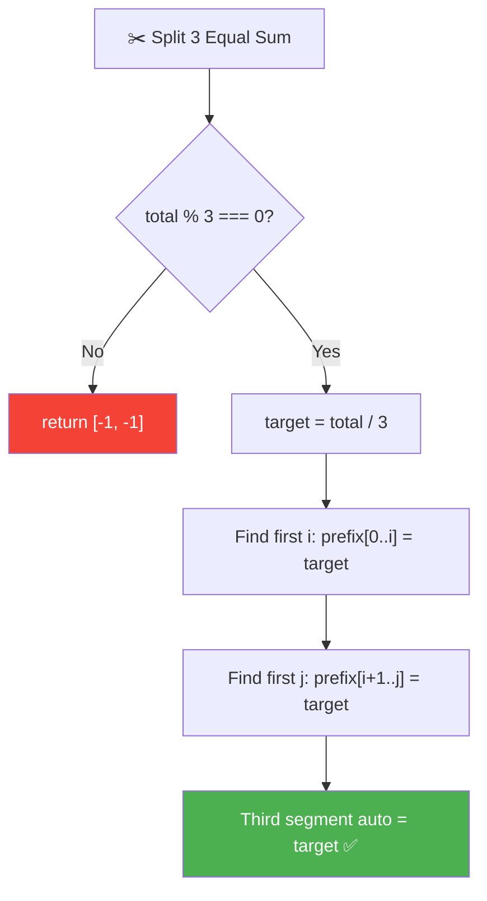
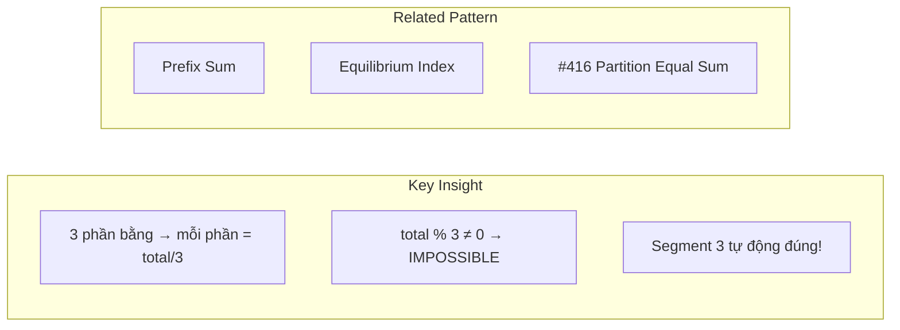
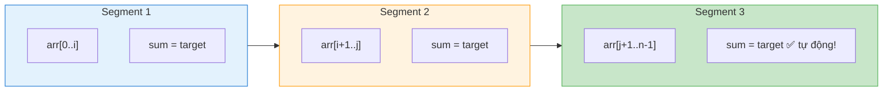
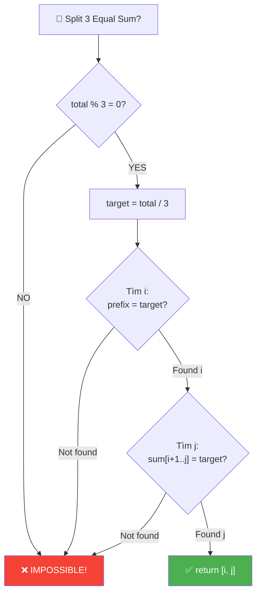
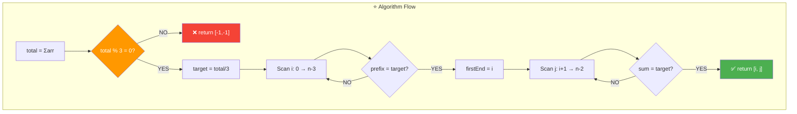
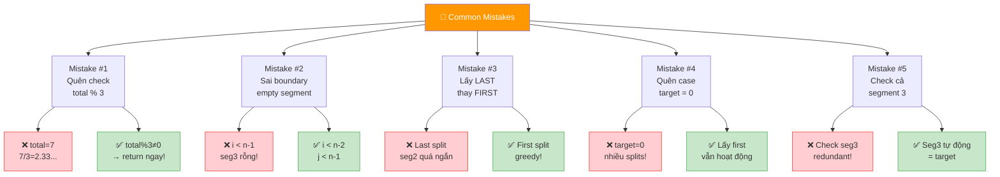
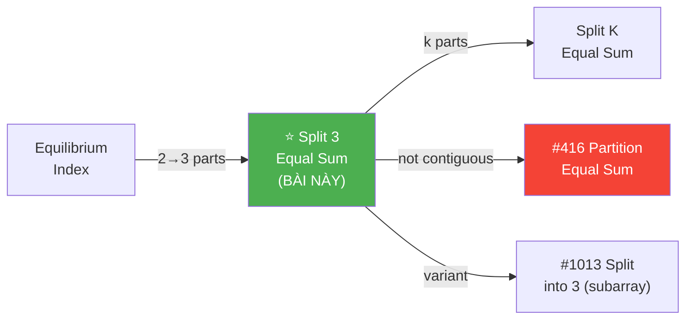
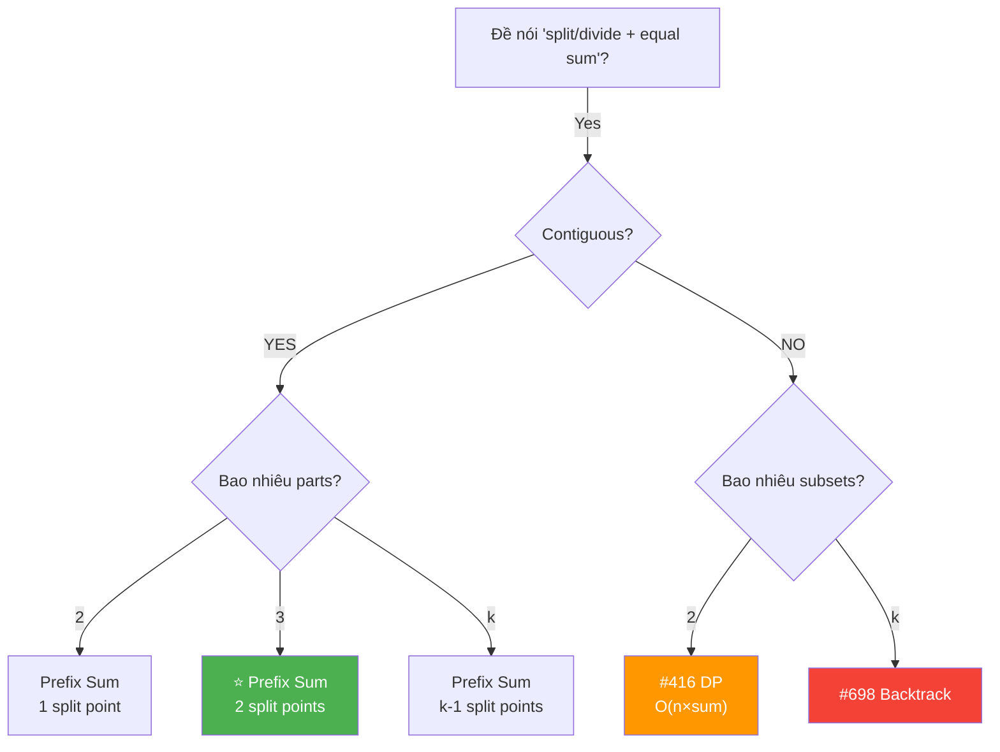
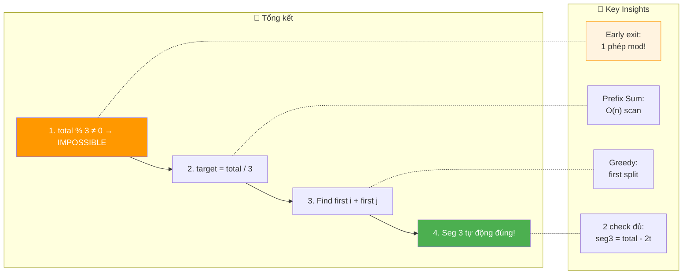

# ✂️ Split Array into Three Equal Sum Segments — GfG (Easy)

> 📖 Code: [Split Array Three Equal Sum.js](./Split%20Array%20Three%20Equal%20Sum.js)





---

## R — Repeat & Clarify

🧠 _"total % 3 ≠ 0 → impossible! Else target = total/3, tìm 2 split points bằng prefix sum. O(n)/O(1)!"_

> 🎙️ _"Divide array into 3 non-empty contiguous segments with equal sum. Return [i, j] split indices."_

### Clarification Questions

```
Q: "3 segments" = phải liên tiếp (contiguous)?
A: ĐÚNG! 3 subarrays liên tiếp, KHÔNG phải subsequences!
   arr[0..i] | arr[i+1..j] | arr[j+1..n-1]

Q: Segments có thể rỗng không?
A: KHÔNG! Mỗi segment ít nhất 1 phần tử → non-empty!

Q: Có thể có số âm không?
A: CÓ! Giá trị bất kỳ (âm, 0, dương).

Q: Output format?
A: [i, j] = split indices. Segment 1 = arr[0..i], Segment 2 = arr[i+1..j]

Q: Nếu nhiều cách chia?
A: Trả về BẤT KỲ 1 cách hợp lệ (greedy: first split sớm nhất)

Q: n < 3?
A: IMPOSSIBLE! Cần ít nhất 3 phần tử (1 per segment)!
```

### Tại sao bài này quan trọng?

```
  ⭐ Bài này dạy pattern "Prefix Sum + K equal segments"!

  ┌──────────────────────────────────────────────────────────────┐
  │  Pattern: "Split array into K equal-sum parts"               │
  │    → Check: total % k === 0? (điều kiện CẦN!)              │
  │    → target = total / k                                      │
  │    → Tìm k-1 split points bằng prefix sum!                  │
  │                                                              │
  │  Progression:                                                │
  │    2 segments (Equilibrium)   → 1 split point               │
  │    3 segments (BÀI NÀY) ⭐  → 2 split points               │
  │    K segments                → k-1 split points              │
  │                                                              │
  │  📌 TÍN HIỆU: "Split/Divide + equal sum"                   │
  │     → total % k, target = total/k, prefix sum!              │
  └──────────────────────────────────────────────────────────────┘
```

---

## 🧠 Bản chất bài toán — Hiểu để NHỚ, không chỉ để GIẢI

### INSIGHT CỐT LÕI: "3 phần bằng → mỗi phần = total/3!"

```
  ⭐ Ẩn dụ: "Cắt dây thừng thành 3 đoạn BẰNG nhau!"

  Tưởng tượng: mỗi phần tử arr[i] = 1 đoạn dây dài arr[i] cm
  Bạn cần CẮT mảng thành 3 phần, mỗi phần tổng BẰNG nhau.

  Bước 1: Đo tổng chiều dài = total
  Bước 2: total ÷ 3 = chiều dài mong muốn MỖI đoạn
  Bước 3: Cắt lần 1 khi đã đủ "target" → split point i
  Bước 4: Cắt lần 2 khi đã đủ "target" nữa → split point j
  Bước 5: Đoạn còn lại TỰ ĐỘNG = target!

  ┌──────────────────────────────────────────────────────────────┐
  │  TẠI SAO segment 3 TỰ ĐỘNG đúng?                           │
  │                                                              │
  │  seg1 + seg2 + seg3 = total                                  │
  │  seg1 = target, seg2 = target                                │
  │  → seg3 = total - target - target                            │
  │        = total - 2 × (total/3)                               │
  │        = total - 2total/3                                     │
  │        = total/3                                              │
  │        = target!  ✅                                          │
  │                                                              │
  │  📌 "2 phần đúng → phần 3 TỰ ĐỘNG đúng!"                   │
  └──────────────────────────────────────────────────────────────┘
```

### Tại sao total % 3 ≠ 0 → IMPOSSIBLE?

```
  Chứng minh:

  seg1 = target, seg2 = target, seg3 = target
  → total = 3 × target
  → target = total / 3

  → total PHẢI chia hết cho 3!
  → total % 3 ≠ 0 → KHÔNG TỒN TẠI target nguyên → IMPOSSIBLE!

  📌 Đây là EARLY EXIT quan trọng nhất!
     Kiểm tra 1 phép % trước khi làm bất cứ gì!
```

### Prefix Sum — Công cụ tìm split points

```
  arr = [1, 3, 4, 0, 4]    total = 12    target = 4

  Prefix sum tích lũy:
    index:  0   1   2   3   4
    arr:    1   3   4   0   4
    prefix: 1   4   8   8   12

  Split point 1: prefix[i] = target = 4
    → prefix[1] = 4 ✅ → firstEnd = 1

  Split point 2: prefix[j] - prefix[firstEnd] = target
    → Tích lũy từ firstEnd+1:
       sum = arr[2] = 4 = target ✅ → j = 2

  Kết quả: [1, 2]
    Segment 1: arr[0..1] = [1, 3] = 4 ✅
    Segment 2: arr[2..2] = [4] = 4 ✅
    Segment 3: arr[3..4] = [0, 4] = 4 ✅
```

### Hình dung trực quan

```
  arr = [1, 3, 4, 0, 4]    total = 12    target = 4

  ┌─────────────────────────────────────────┐
  │  [1, 3] │ [4]   │ [0, 4]               │
  │  sum=4  │ sum=4 │ sum=4                 │
  │    ✅   │  ✅    │   ✅                  │
  └─────────────────────────────────────────┘
       ↑         ↑
    split i=1  split j=2

  📌 Chia mảng thành 3 khối: [0..i] | [i+1..j] | [j+1..n-1]
```



---

## 🧭 Luồng Suy Nghĩ — Từ đọc đề đến solution

### Bước 1: Đọc đề → Gạch chân KEYWORDS

```
  Đề: "Divide array into 3 non-empty contiguous parts with equal sum"

  Gạch chân:
    ✏️ "3 parts"          → cần 2 split points
    ✏️ "equal sum"         → mỗi phần = total/3
    ✏️ "contiguous"        → 3 subarrays liên tiếp
    ✏️ "non-empty"        → mỗi phần ≥ 1 phần tử

  🧠 Trigger:
    "Equal sum" → total % k = 0?
    "Contiguous" → Prefix Sum!
    "3 parts" → 2 split points!
```

### Bước 2: Xây dựng Logic

```
  🧠 Bước 2a: Check khả thi
    total % 3 ≠ 0 → IMPOSSIBLE! Return [-1, -1]!

  🧠 Bước 2b: Tìm target
    target = total / 3

  🧠 Bước 2c: Tìm split point 1
    Duyệt i từ 0 đến n-3:
      Tích lũy sum, khi sum = target → firstEnd = i, DỪNG!

  🧠 Bước 2d: Tìm split point 2
    Duyệt j từ firstEnd+1 đến n-2:
      Tích lũy sum, khi sum = target → return [firstEnd, j]!

  🧠 Bước 2e: Segment 3 tự động đúng!
    total - 2×target = target → KHÔNG CẦN CHECK!
```

### Bước 3: Cây quyết định



---

## E — Examples

```
VÍ DỤ 1: arr = [1, 3, 4, 0, 4]    total = 12    target = 4

  Pass 1 (tìm i):
    i=0: sum=1  ≠ 4
    i=1: sum=4  = 4 ✅ → firstEnd = 1

  Pass 2 (tìm j):
    j=2: sum=4  = 4 ✅ → return [1, 2]

  Verify:
    [1, 3] = 4 ✅    [4] = 4 ✅    [0, 4] = 4 ✅
```

```
VÍ DỤ 2: arr = [1, 2, 3, 4, 5]    total = 15    target = 5

  Pass 1:
    i=0: sum=1  ≠ 5
    i=1: sum=3  ≠ 5
    i=2: sum=6  ≠ 5   ← quá rồi!

  firstEnd = -1 → return [-1, -1] ✅

  📌 total % 3 = 0 (15÷3=5) nhưng KHÔNG TÌM ĐƯỢC split point!
     Vì [1,2] ≠ 5, [1,2,3] = 6 ≠ 5 → impossible!
```

```
VÍ DỤ 3 (Edge): arr = [0, 0, 0, 0]    total = 0    target = 0

  Pass 1:
    i=0: sum=0 = 0 ✅ → firstEnd = 0

  Pass 2:
    j=1: sum=0 = 0 ✅ → return [0, 1]

  Verify:
    [0] = 0 ✅    [0] = 0 ✅    [0, 0] = 0 ✅

  📌 target = 0 → nhiều split points → lấy FIRST!
```

```
VÍ DỤ 4 (Edge): arr = [1, -1, 1, -1, 1, -1]    total = 0    target = 0

  Pass 1:
    i=0: sum=1  ≠ 0
    i=1: sum=0  = 0 ✅ → firstEnd = 1

  Pass 2:
    j=2: sum=1  ≠ 0
    j=3: sum=0  = 0 ✅ → return [1, 3]

  Verify:
    [1, -1] = 0 ✅    [1, -1] = 0 ✅    [1, -1] = 0 ✅

  📌 Số ÂM → target = 0 → vẫn hoạt động!
```

```
VÍ DỤ 5 (Edge): arr = [3, 3, 3]    total = 9    target = 3

  Pass 1:
    i=0: sum=3 = 3 ✅ → firstEnd = 0

  Pass 2:
    j=1: sum=3 = 3 ✅ → return [0, 1]

  Verify:
    [3] = 3 ✅    [3] = 3 ✅    [3] = 3 ✅

  📌 Minimum case: 3 phần tử, mỗi phần 1 phần tử!
```

### Trace dạng bảng — VD chi tiết

```
  arr = [2, 2, 1, 1, 1, 1, 1, 3]    total = 12    target = 4

  ═══ Pass 1: Tìm firstEnd ═══════════════════════════════

  ┌───────┬────────┬────────┬───────────────────────────┐
  │ i     │ arr[i] │ sum    │ Hành động                  │
  ├───────┼────────┼────────┼───────────────────────────┤
  │ 0     │ 2      │ 2      │ ≠ 4, tiếp tục             │
  │ 1     │ 2      │ 4      │ = 4 ✅ → firstEnd = 1!    │
  └───────┴────────┴────────┴───────────────────────────┘

  ═══ Pass 2: Tìm j (từ firstEnd+1 = 2) ═════════════════

  ┌───────┬────────┬────────┬───────────────────────────┐
  │ j     │ arr[j] │ sum    │ Hành động                  │
  ├───────┼────────┼────────┼───────────────────────────┤
  │ 2     │ 1      │ 1      │ ≠ 4, tiếp tục             │
  │ 3     │ 1      │ 2      │ ≠ 4, tiếp tục             │
  │ 4     │ 1      │ 3      │ ≠ 4, tiếp tục             │
  │ 5     │ 1      │ 4      │ = 4 ✅ → return [1, 5]!   │
  └───────┴────────┴────────┴───────────────────────────┘

  Verify: [2,2]=4 ✅  [1,1,1,1]=4 ✅  [1,3]=4 ✅
```

---

## A — Approach

### Approach 1: Brute Force — O(n²)

```
  Thử mọi cặp (i, j):
    Tính sum segment 1, 2, 3
    So sánh = target

  2 vòng for: O(n²) — quá chậm!
```

### Approach 2: Prefix Sum + 2-pass — O(n)/O(1) ⭐

```
  Step 1: total = Σarr. Nếu total % 3 ≠ 0 → return [-1,-1]
  Step 2: target = total / 3
  Step 3: Scan left → tìm FIRST i: prefix[0..i] = target
  Step 4: Scan from i+1 → tìm FIRST j: sum[i+1..j] = target
  Step 5: Segment 3 tự động đúng!

  Time: O(n)    Space: O(1)

  📌 "Greedy: lấy split point SỚM NHẤT"
     → Cho segment 2 và 3 nhiều lựa chọn hơn!
```

---

## C — Code ✅

```javascript
function splitArray(arr) {
  const total = arr.reduce((a, b) => a + b, 0);
  if (total % 3 !== 0) return [-1, -1];

  const target = total / 3;
  let sum = 0, firstEnd = -1;

  // Find first split
  for (let i = 0; i < arr.length - 2; i++) {
    sum += arr[i];
    if (sum === target && firstEnd === -1) firstEnd = i;
  }
  if (firstEnd === -1) return [-1, -1];

  // Find second split
  sum = 0;
  for (let j = firstEnd + 1; j < arr.length - 1; j++) {
    sum += arr[j];
    if (sum === target) return [firstEnd, j];
  }

  return [-1, -1];
}
```

---

## 🔬 Deep Dive — Giải thích CHI TIẾT từng dòng

> 💡 Phân tích **từng dòng** để hiểu **TẠI SAO**.

```javascript
function splitArray(arr) {
  // ═══════════════════════════════════════════════════════════
  // STEP 1: Tính tổng toàn bộ
  // ═══════════════════════════════════════════════════════════
  //
  // TẠI SAO tính total trước?
  //   → Cần biết total để tính target = total/3
  //   → Và check total % 3 ≠ 0 → EARLY EXIT!
  //
  const total = arr.reduce((a, b) => a + b, 0);

  // ═══════════════════════════════════════════════════════════
  // STEP 2: Early exit — QUAN TRỌNG NHẤT!
  // ═══════════════════════════════════════════════════════════
  //
  // TẠI SAO %3?
  //   3 phần BẰNG nhau → mỗi phần = total/3
  //   → total PHẢI chia hết cho 3!
  //   → Chia không hết → IMPOSSIBLE! Return ngay!
  //
  // ⚠️ Đây là 1 phép toán nhưng LOẠI BỎ ~2/3 test cases!
  //
  if (total % 3 !== 0) return [-1, -1];

  // ═══════════════════════════════════════════════════════════
  // STEP 3: Tính target
  // ═══════════════════════════════════════════════════════════
  //
  // target = mỗi segment phải có tổng = target
  //
  const target = total / 3;
  let sum = 0, firstEnd = -1;

  // ═══════════════════════════════════════════════════════════
  // STEP 4: Tìm split point 1 (FIRST match!)
  // ═══════════════════════════════════════════════════════════
  //
  // ⚠️ i < arr.length - 2 (KHÔNG PHẢI i < arr.length!)
  //   → Segment 1 kết thúc ở TỐI ĐA index n-3
  //   → Để lại ít nhất 2 phần tử cho segment 2 và 3!
  //   → n-2 cho segment 2, n-1 cho segment 3
  //
  // ⚠️ firstEnd === -1 → chỉ lấy FIRST match!
  //   → GREEDY: split SỚM NHẤT → cho seg 2+3 nhiều space nhất!
  //   → Nếu first match sai → có thể MISS valid split!
  //   → (Bài này first luôn đủ vì ta check seg 2 tiếp!)
  //
  for (let i = 0; i < arr.length - 2; i++) {
    sum += arr[i];
    if (sum === target && firstEnd === -1) firstEnd = i;
  }

  // ═══════════════════════════════════════════════════════════
  // STEP 5: Kiểm tra có tìm được split 1 không
  // ═══════════════════════════════════════════════════════════
  //
  // firstEnd = -1 → prefix sum KHÔNG BAO GIỜ = target
  // → Ví dụ arr = [1,2,3,4,5], target=5 → prefix = 1,3,6... miss!
  //
  if (firstEnd === -1) return [-1, -1];

  // ═══════════════════════════════════════════════════════════
  // STEP 6: Tìm split point 2
  // ═══════════════════════════════════════════════════════════
  //
  // Bắt đầu từ firstEnd + 1 (ngay sau segment 1!)
  // Reset sum = 0 (tích lũy segment 2 từ đầu!)
  //
  // ⚠️ j < arr.length - 1 (KHÔNG PHẢI j < arr.length!)
  //   → Segment 2 kết thúc ở TỐI ĐA index n-2
  //   → Để lại ít nhất 1 phần tử cho segment 3!
  //
  // 🧠 Segment 3 KHÔNG CẦN CHECK!
  //   seg3 = total - seg1 - seg2 = total - 2×target = target ✅
  //
  sum = 0;
  for (let j = firstEnd + 1; j < arr.length - 1; j++) {
    sum += arr[j];
    if (sum === target) return [firstEnd, j];
  }

  return [-1, -1];
}
```



---

## 📐 Invariant — Chứng minh tính đúng đắn

```
  📐 INVARIANT:

  Khi return [i, j]:
    sum(arr[0..i]) = target ✅ (verified by pass 1)
    sum(arr[i+1..j]) = target ✅ (verified by pass 2)
    sum(arr[j+1..n-1]) = total - 2×target = target ✅ (tự động!)

  CHỨNG MINH:
  ┌──────────────────────────────────────────────────────────────┐
  │  Correctness (nếu trả về [i,j] → đúng):                    │
  │    Pass 1: sum = Σarr[0..i] = target ✅                     │
  │    Pass 2: sum = Σarr[i+1..j] = target ✅                   │
  │    Seg 3: Σarr[j+1..n-1] = total - Σarr[0..j]              │
  │          = total - target - target                           │
  │          = 3×target - 2×target = target ✅  ∎               │
  │                                                              │
  │  Non-empty guarantee:                                        │
  │    Pass 1: i ≤ n-3 → seg1 ≥ 1 element ✅                   │
  │    Pass 2: j ≥ i+1 → seg2 ≥ 1 element ✅                   │
  │    Pass 2: j ≤ n-2 → seg3 ≥ 1 element ✅                   │
  │                                                              │
  │  Completeness (nếu tồn tại → tìm được):                     │
  │    Nếu ∃ valid split [i*, j*]:                               │
  │      → Σarr[0..i*] = target                                 │
  │      → Pass 1 sẽ tìm firstEnd ≤ i*                         │
  │         (vì lấy FIRST match!)                                │
  │      → Σarr[firstEnd+1..j'] = target cho j' nào đó         │
  │         (vì seg2+seg3 = 2×target, ∃ cắt j' chia 2 phần!)  │
  │      → Pass 2 sẽ tìm j' ✅  ∎                               │
  └──────────────────────────────────────────────────────────────┘

  📐 TẠI SAO FIRST match cho firstEnd?
    → firstEnd SỚM → seg 2+3 DÀI hơn
    → seg 2+3 = 2×target → CHẮC CHẮN cắt được!
    → Nếu firstEnd MUỘN → seg 2+3 NGẮN → có thể không cắt được!

    ⚠️ Nhưng thực ra bất kỳ match nào cũng hoạt động:
       seg 2+3 = total - target = 2×target → luôn cắt được!
       FIRST chỉ giúp GREEDY tìm NHANH hơn!
```

---

## ❌ Common Mistakes — Lỗi thường gặp



### Mistake 1: Quên check total % 3!

```javascript
// ❌ SAI: không check divisible!
function splitArray(arr) {
  const target = arr.reduce((a,b) => a+b, 0) / 3;
  // target = 2.333... → sum === target KHÔNG BAO GIỜ true!
  // → Loop chạy hết → return [-1, -1] → ĐÚNG KẾT QUẢ
  //   nhưng LÃNG PHÍ thời gian!

// ✅ ĐÚNG: check trước!
  if (total % 3 !== 0) return [-1, -1];  // EARLY EXIT!
}
```

### Mistake 2: Sai boundary → empty segment!

```javascript
// ❌ SAI: cho phép empty segment!
for (let i = 0; i < arr.length; i++) { ... }
// i = n-1 → seg1 = arr[0..n-1] = TOÀN MẢNG!
//         → seg2 = rỗng, seg3 = rỗng → SAI!

// ✅ ĐÚNG:
for (let i = 0; i < arr.length - 2; i++) { ... }  // seg1
for (let j = firstEnd + 1; j < arr.length - 1; j++) { ... }  // seg2
// → seg3 luôn ≥ 1 phần tử ✅
```

### Mistake 3: Lấy LAST match thay vì FIRST!

```
  arr = [0, 0, 0, 0, 0, 0]    target = 0

  FIRST match: firstEnd = 0 → seg2 bắt đầu từ 1 → thoải mái!
  LAST match:  firstEnd = 3 → seg2 chỉ có [0, 0] → vẫn OK

  Nhưng với edge cases phức tạp hơn, FIRST an toàn hơn!
  📌 GREEDY: first split → maximize space cho seg 2+3!
```

### Mistake 4: Nhầm khi target = 0!

```
  arr = [0, 0, 0, 0]    total = 0    target = 0

  Pass 1: i=0, sum=0 = target → firstEnd = 0 ✅
  Pass 2: j=1, sum=0 = target → return [0, 1] ✅

  📌 target = 0 → prefix sum = 0 TẠI MỌI vị trí nếu all zeros!
     → FIRST match cho [0, 1] = split SỚM NHẤT!

  arr = [1, -1, 0, 0]    total = 0    target = 0
  Pass 1: i=0 sum=1≠0, i=1 sum=0=0 → firstEnd=1
  Pass 2: j=2 sum=0=0 → return [1, 2] ✅
```

### Mistake 5: Kiểm tra cả segment 3!

```javascript
// ❌ REDUNDANT: check segment 3!
sum = 0;
for (let k = j + 1; k < arr.length; k++) sum += arr[k];
if (sum !== target) return [-1, -1];  // KHÔNG CẦN!

// ✅ seg3 = total - 2×target = target → TỰ ĐỘNG ĐÚNG!
// → Thêm code = waste time + source of bugs!
```

---

## O — Optimize

```
                Time     Space    Ghi chú
  ──────────────────────────────────────────────────────
  Brute Force   O(n²)    O(1)     Thử mọi cặp (i,j)
  Prefix Array  O(n)     O(n)     Build full prefix sum
  2-Pass ⭐     O(n)     O(1)     Tối ưu!
```

### Complexity chính xác — Đếm operations

```
  2-Pass Approach:
    Pass 0: n additions (tính total) + 1 mod check
    Pass 1: ≤ n-2 additions + ≤ n-2 comparisons (tìm i)
    Pass 2: ≤ n-2 additions + ≤ n-2 comparisons (tìm j)
    TỔNG: ≤ 3n operations

  📊 So sánh (n = 10⁶):
    2-Pass: 3×10⁶ ops, 16 bytes RAM ⭐
    Brute:  10¹² ops 💀

  📌 EARLY EXIT: total % 3 ≠ 0 → SKIP toàn bộ!
     ~2/3 random inputs bị loại ngay bước 1!
```

---

## T — Test

```
Test Cases:
  [1, 3, 4, 0, 4]        → [1, 2]    ✅ basic
  [1, 2, 3, 4, 5]         → [-1,-1]   ✅ total%3=0 nhưng no split
  [0, 0, 0, 0]            → [0, 1]    ✅ all zeros
  [3, 3, 3]               → [0, 1]    ✅ minimum n=3
  [1, -1, 1, -1, 1, -1]   → [1, 3]    ✅ negative numbers
  [7]                      → [-1,-1]   ✅ n < 3
  [1, 2]                   → [-1,-1]   ✅ n < 3
  [2, 2, 1, 1, 1, 1, 1, 3] → [1, 5]   ✅ longer array
```

### Edge Cases giải thích

```
  ┌──────────────────────────────────────────────────────────────────┐
  │  Minimum: arr=[3,3,3], n=3                                      │
  │    total=9, target=3                                             │
  │    i=0: sum=3=target → firstEnd=0                               │
  │    j=1: sum=3=target → return [0,1] ✅                          │
  │                                                                  │
  │  Negative: arr=[1,-1,1,-1,1,-1], total=0, target=0              │
  │    i=1: sum=0=target → firstEnd=1                               │
  │    j=3: sum=0=target → return [1,3] ✅                          │
  │                                                                  │
  │  Impossible (mod): arr=[1,2,3], total=6, target=2                │
  │    i=0: sum=1≠2 → i=1: sum=3≠2 → [-1,-1] ✅                   │
  │    (6%3=0 nhưng prefix sum CHƯA BAO GIỜ = target!)             │
  │    → Wait: 1≠2, 1+2=3≠2 → NO SPLIT!                           │
  │    → Hmm... [1,2,3] → [1]+[2]+[3] = 1,2,3 → NOT EQUAL!       │
  │                                                                  │
  │  📌 total % 3 = 0 KHÔNG ĐỦ! Vẫn cần kiểm split points!       │
  └──────────────────────────────────────────────────────────────────┘
```

---

## 🗣️ Interview Script

### 🎙️ Think Out Loud — Mô phỏng phỏng vấn thực

```
  ──────────────── PHASE 1: Clarify ────────────────

  👤 Interviewer: "Split array into 3 contiguous parts
                   with equal sum."

  🧑 You: "Let me clarify:
   1. Three contiguous, non-empty subarrays.
   2. Each must have the same sum.
   3. Return the split indices [i, j].
   4. Values can be negative?"

  ──────────────── PHASE 2: Examples ────────────────

  🧑 You: "arr = [1, 3, 4, 0, 4], total = 12.
   Each segment must sum to 12/3 = 4.
   [1,3] = 4, [4] = 4, [0,4] = 4 → [1, 2]."

  ──────────────── PHASE 3: Approach ────────────────

  🧑 You: "Key observations:

   1. If total isn't divisible by 3, impossible immediately.
   2. Each segment must sum to target = total/3.
   3. I scan left-to-right to find the first index i where
      the prefix sum equals target. That's the end of segment 1.
   4. Then I continue scanning from i+1 to find where the
      next segment also sums to target. That gives me j.
   5. The third segment automatically sums to target since
      total - 2*target = target.

   O(n) time, O(1) space."

  ──────────────── PHASE 4: Code + Verify ────────────────

  🧑 You: [writes code]

  "Key boundaries:
   - i goes up to n-3 (leave room for segments 2 and 3)
   - j goes up to n-2 (leave room for segment 3)
   - I take the FIRST match for i — greedy to maximize
     space for the remaining segments."

  ──────────────── PHASE 5: Follow-ups ────────────────

  👤 "What if we need k equal parts instead of 3?"
  🧑 "Generalize: check total % k == 0, target = total/k,
      then scan for k-1 split points where the running sum
      hits multiples of target. Same O(n) time."

  👤 "What if segments don't need to be contiguous?"
  🧑 "That's the subset sum / partition problem — NP-hard
      in general! For 2 subsets, it's LeetCode #416 which
      needs DP. Very different from this greedy approach."

  👤 "Does the first split always work?"
  🧑 "Yes! Since segment 2+3 together sum to 2*target,
      and we know there exists a valid split within them,
      the greedy first-match for i guarantees we can
      find a valid j."
```

---

## 📚 Bài tập liên quan — Practice Problems

### Progression Path



### 1. Partition Equal Subset Sum (#416) — Medium

```
  Đề: Chia mảng thành 2 subsets (KHÔNG contiguous) bằng sum.

  function canPartition(nums) {
    const total = nums.reduce((a,b) => a+b, 0);
    if (total % 2 !== 0) return false;

    const target = total / 2;
    const dp = new Array(target + 1).fill(false);
    dp[0] = true;

    for (const num of nums) {
      for (let j = target; j >= num; j--) {
        dp[j] = dp[j] || dp[j - num];
      }
    }
    return dp[target];
  }

  📌 So sánh:
    Bài này: contiguous → GREEDY prefix sum O(n)!
    #416: NOT contiguous → DP O(n×sum)! NP-hard!
    → "Contiguous" = VÔ CÙNG quan trọng cho complexity!
```

### 2. Partition to K Equal Sum Subsets (#698) — Medium

```
  Đề: Chia mảng thành k subsets bằng sum.

  function canPartitionKSubsets(nums, k) {
    const total = nums.reduce((a,b) => a+b, 0);
    if (total % k !== 0) return false;
    const target = total / k;

    nums.sort((a,b) => b-a);
    const used = new Array(nums.length).fill(false);

    function backtrack(k, current, start) {
      if (k === 0) return true;
      if (current === target) return backtrack(k-1, 0, 0);
      for (let i = start; i < nums.length; i++) {
        if (!used[i] && current + nums[i] <= target) {
          used[i] = true;
          if (backtrack(k, current + nums[i], i+1)) return true;
          used[i] = false;
        }
      }
      return false;
    }
    return backtrack(k, 0, 0);
  }

  📌 SO SÁNH:
    Bài này: CONTIGUOUS 3 parts → O(n) greedy!
    #698: ANY k subsets → backtracking (exponential!)
    → "Contiguous" = key difference!
```

### 3. Split Array into K Contiguous Parts

```
  Generalization cho k phần CONTIGUOUS bằng sum:

  function splitKEqual(arr, k) {
    const total = arr.reduce((a,b) => a+b, 0);
    if (total % k !== 0) return null;

    const target = total / k;
    const splits = [];
    let sum = 0;

    for (let i = 0; i < arr.length; i++) {
      sum += arr[i];
      if (sum === target && splits.length < k - 1) {
        splits.push(i);
        sum = 0;
      }
    }
    return splits.length === k - 1 ? splits : null;
  }

  📌 k=3 → CÙNG BÀI NÀY!
     k=2 → giống Equilibrium Index concept!
     k=any → tìm k-1 split points!
```

### Tổng kết — Prefix Sum + Split Pattern

```
  ┌──────────────────────────────────────────────────────────────┐
  │  BÀI                     │  Technique       │  Time         │
  ├──────────────────────────────────────────────────────────────┤
  │  Equilibrium Index       │  Prefix Sum      │  O(n)         │
  │  Split 3 Equal ⭐       │  Prefix Sum      │  O(n)         │
  │  Split K Equal           │  Prefix Sum      │  O(n)         │
  │  #416 Partition 2 Sets   │  DP              │  O(n×sum)     │
  │  #698 Partition K Sets   │  Backtrack       │  O(k × 2^n)  │
  └──────────────────────────────────────────────────────────────┘

  📌 RULE: CONTIGUOUS → Prefix Sum O(n)!
           NOT CONTIGUOUS → DP/Backtracking (hard!)
```

### Skeleton code — Reusable template

```javascript
// TEMPLATE: Split array into k CONTIGUOUS equal-sum parts
function splitKEqualContiguous(arr, k) {
  const total = arr.reduce((a, b) => a + b, 0);

  // Step 1: Check divisibility
  if (total % k !== 0) return null;

  const target = total / k;
  const splits = [];  // k-1 split points
  let sum = 0;

  // Step 2: Find k-1 split points
  for (let i = 0; i < arr.length - (k - splits.length); i++) {
    sum += arr[i];
    if (sum === target) {
      splits.push(i);
      sum = 0;
      if (splits.length === k - 1) return splits;
    }
  }
  return null;
}

// k=2: 1 split point (Equilibrium variant)
// k=3: 2 split points (BÀI NÀY!)
// k=any: k-1 split points
```

---

## 📌 Kỹ năng chuyển giao — Pattern Summary



---

## 📊 Tổng kết — Key Insights



```
  ┌──────────────────────────────────────────────────────────────────────────┐
  │  📌 3 ĐIỀU PHẢI NHỚ                                                    │
  │                                                                          │
  │  1. EARLY EXIT: total % 3 ≠ 0 → IMPOSSIBLE ngay!                      │
  │     → 1 phép mod LOẠI BỎ ~2/3 test cases!                             │
  │     → Luôn check divisibility TRƯỚC khi làm gì khác!                  │
  │                                                                          │
  │  2. 2 SPLIT POINTS: chỉ cần tìm i và j!                               │
  │     → Segment 3 TỰ ĐỘNG = target!                                     │
  │     → total - 2×target = target → KHÔNG CẦN CHECK!                    │
  │     → Boundary: i < n-2, j < n-1 → non-empty segments!               │
  │                                                                          │
  │  3. CONTIGUOUS vs NOT: khác biệt KHỔNG LỒ!                            │
  │     → Contiguous: Prefix Sum → O(n) greedy!                           │
  │     → Not contiguous: DP/Backtracking → NP-hard!                      │
  │     → "Contiguous" = TIN HIỆU cho Prefix Sum!                        │
  └──────────────────────────────────────────────────────────────────────────┘
```

---

## 📝 Flashcard — Tự kiểm tra

| ❓ Câu hỏi | ✅ Đáp án |
|---|---|
| Check đầu tiên? | **total % 3 ≠ 0** → impossible! |
| Target? | **total / 3** |
| Cần tìm mấy split points? | **2** (i và j) |
| Tại sao seg3 tự động đúng? | **total - 2×target = target** |
| Boundary i? | **i < n-2** (leave ≥2 for seg 2+3) |
| Boundary j? | **j < n-1** (leave ≥1 for seg 3) |
| Lấy first hay last match? | **FIRST** (greedy!) |
| Time / Space? | **O(n)** / **O(1)** |
| Nếu not contiguous? | **DP** (#416) hoặc **Backtrack** (#698) |
| Generalize cho k parts? | Tìm **k-1 split points** bằng prefix sum! |
