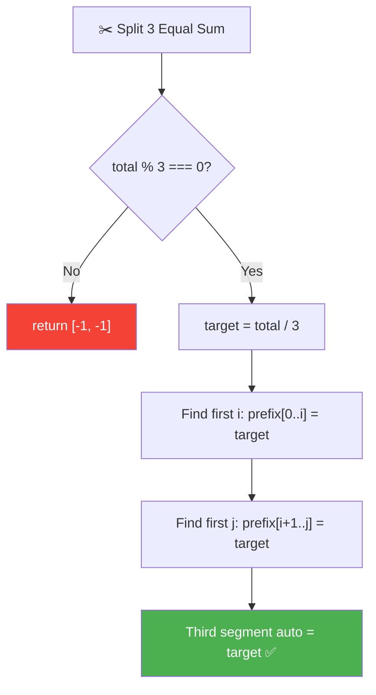
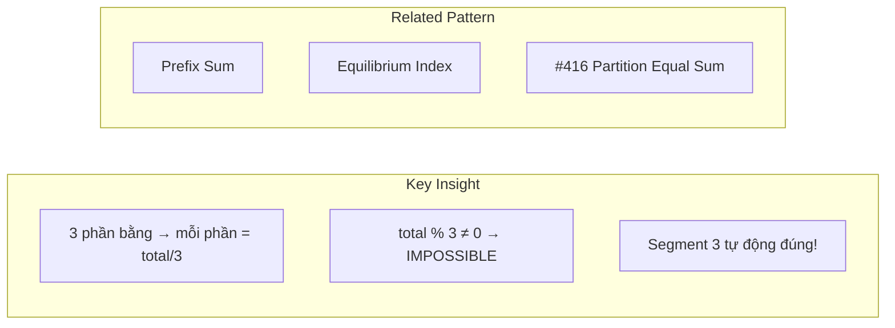
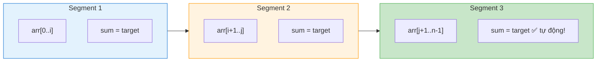
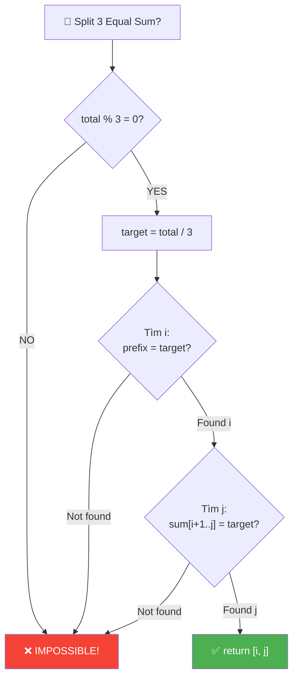
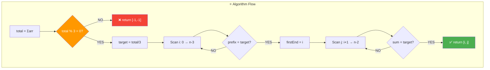
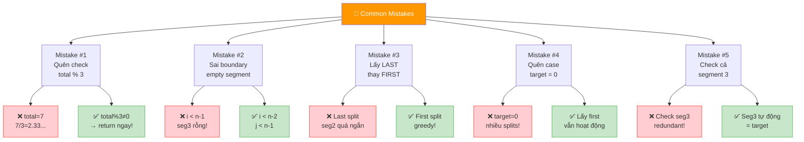
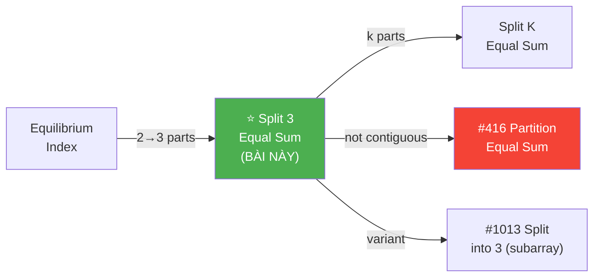
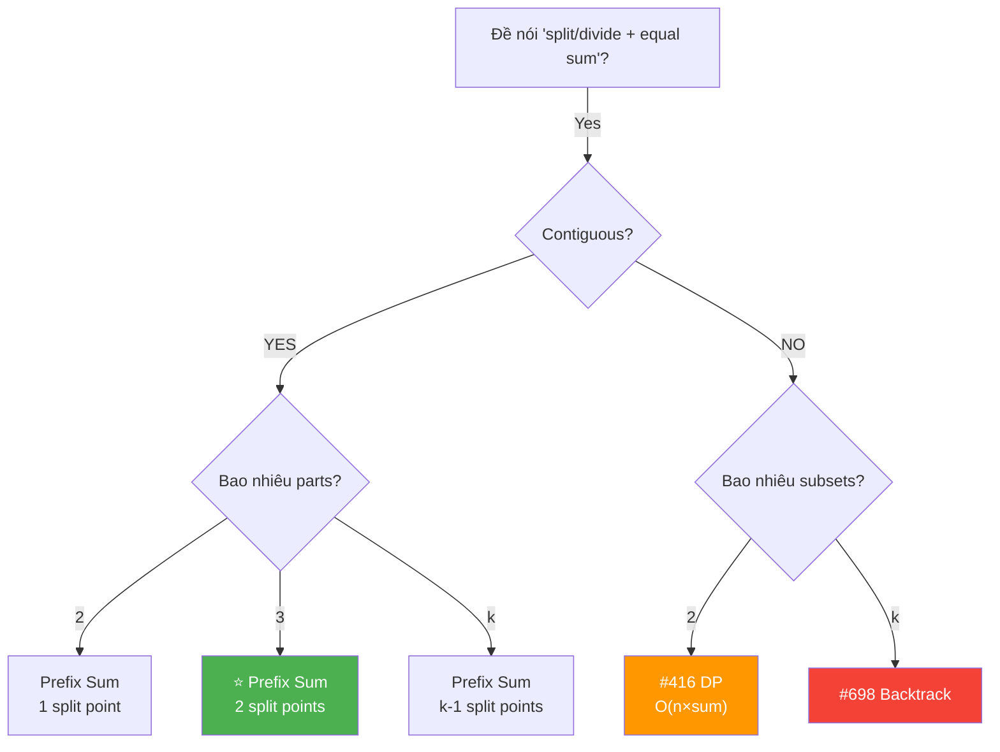
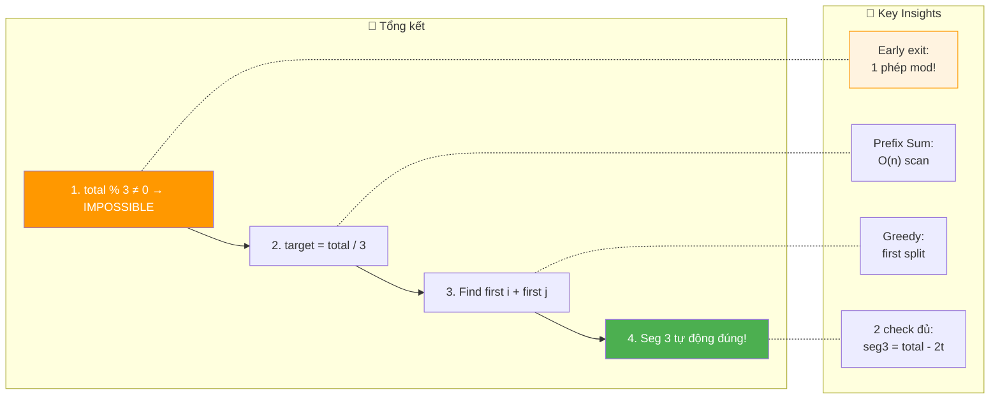

# ✂️ Split Array into Three Equal Sum Segments — GfG (Easy)

> 📖 Code: [Split Array Three Equal Sum.js](./Split%20Array%20Three%20Equal%20Sum.js)





---

## R — Repeat & Clarify

🧠 _"total % 3 ≠ 0 → impossible! Else target = total/3, tìm 2 split points bằng prefix sum. O(n)/O(1)!"_

> 🎙️ _"Divide array into 3 non-empty contiguous segments with equal sum. Return [i, j] split indices."_

### Clarification Questions

```
Q: "3 segments" = phải liên tiếp (contiguous)?
A: ĐÚNG! 3 subarrays liên tiếp, KHÔNG phải subsequences!
   arr[0..i] | arr[i+1..j] | arr[j+1..n-1]

Q: Segments có thể rỗng không?
A: KHÔNG! Mỗi segment ít nhất 1 phần tử → non-empty!

Q: Có thể có số âm không?
A: CÓ! Giá trị bất kỳ (âm, 0, dương).

Q: Output format?
A: [i, j] = split indices. Segment 1 = arr[0..i], Segment 2 = arr[i+1..j]

Q: Nếu nhiều cách chia?
A: Trả về BẤT KỲ 1 cách hợp lệ (greedy: first split sớm nhất)

Q: n < 3?
A: IMPOSSIBLE! Cần ít nhất 3 phần tử (1 per segment)!
```

### Tại sao bài này quan trọng?

```
  ⭐ Bài này dạy pattern "Prefix Sum + K equal segments"!

  ┌──────────────────────────────────────────────────────────────┐
  │  Pattern: "Split array into K equal-sum parts"               │
  │    → Check: total % k === 0? (điều kiện CẦN!)              │
  │    → target = total / k                                      │
  │    → Tìm k-1 split points bằng prefix sum!                  │
  │                                                              │
  │  Progression:                                                │
  │    2 segments (Equilibrium)   → 1 split point               │
  │    3 segments (BÀI NÀY) ⭐  → 2 split points               │
  │    K segments                → k-1 split points              │
  │                                                              │
  │  📌 TÍN HIỆU: "Split/Divide + equal sum"                   │
  │     → total % k, target = total/k, prefix sum!              │
  └──────────────────────────────────────────────────────────────┘
```

---

## 🧠 Bản chất bài toán — Hiểu để NHỚ, không chỉ để GIẢI

### INSIGHT CỐT LÕI: "3 phần bằng → mỗi phần = total/3!"

```
  ⭐ Ẩn dụ: "Cắt dây thừng thành 3 đoạn BẰNG nhau!"

  Tưởng tượng: mỗi phần tử arr[i] = 1 đoạn dây dài arr[i] cm
  Bạn cần CẮT mảng thành 3 phần, mỗi phần tổng BẰNG nhau.

  Bước 1: Đo tổng chiều dài = total
  Bước 2: total ÷ 3 = chiều dài mong muốn MỖI đoạn
  Bước 3: Cắt lần 1 khi đã đủ "target" → split point i
  Bước 4: Cắt lần 2 khi đã đủ "target" nữa → split point j
  Bước 5: Đoạn còn lại TỰ ĐỘNG = target!

  ┌──────────────────────────────────────────────────────────────┐
  │  TẠI SAO segment 3 TỰ ĐỘNG đúng?                           │
  │                                                              │
  │  seg1 + seg2 + seg3 = total                                  │
  │  seg1 = target, seg2 = target                                │
  │  → seg3 = total - target - target                            │
  │        = total - 2 × (total/3)                               │
  │        = total - 2total/3                                     │
  │        = total/3                                              │
  │        = target!  ✅                                          │
  │                                                              │
  │  📌 "2 phần đúng → phần 3 TỰ ĐỘNG đúng!"                   │
  └──────────────────────────────────────────────────────────────┘
```

### Tại sao total % 3 ≠ 0 → IMPOSSIBLE?

```
  Chứng minh:

  seg1 = target, seg2 = target, seg3 = target
  → total = 3 × target
  → target = total / 3

  → total PHẢI chia hết cho 3!
  → total % 3 ≠ 0 → KHÔNG TỒN TẠI target nguyên → IMPOSSIBLE!

  📌 Đây là EARLY EXIT quan trọng nhất!
     Kiểm tra 1 phép % trước khi làm bất cứ gì!
```

### Prefix Sum — Công cụ tìm split points

```
  arr = [1, 3, 4, 0, 4]    total = 12    target = 4

  Prefix sum tích lũy:
    index:  0   1   2   3   4
    arr:    1   3   4   0   4
    prefix: 1   4   8   8   12

  Split point 1: prefix[i] = target = 4
    → prefix[1] = 4 ✅ → firstEnd = 1

  Split point 2: prefix[j] - prefix[firstEnd] = target
    → Tích lũy từ firstEnd+1:
       sum = arr[2] = 4 = target ✅ → j = 2

  Kết quả: [1, 2]
    Segment 1: arr[0..1] = [1, 3] = 4 ✅
    Segment 2: arr[2..2] = [4] = 4 ✅
    Segment 3: arr[3..4] = [0, 4] = 4 ✅
```

### Hình dung trực quan

```
  arr = [1, 3, 4, 0, 4]    total = 12    target = 4

  ┌─────────────────────────────────────────┐
  │  [1, 3] │ [4]   │ [0, 4]               │
  │  sum=4  │ sum=4 │ sum=4                 │
  │    ✅   │  ✅    │   ✅                  │
  └─────────────────────────────────────────┘
       ↑         ↑
    split i=1  split j=2

  📌 Chia mảng thành 3 khối: [0..i] | [i+1..j] | [j+1..n-1]
```



---

## 🧭 Luồng Suy Nghĩ — Từ đọc đề đến solution

### Bước 1: Đọc đề → Gạch chân KEYWORDS

```
  Đề: "Divide array into 3 non-empty contiguous parts with equal sum"

  Gạch chân:
    ✏️ "3 parts"          → cần 2 split points
    ✏️ "equal sum"         → mỗi phần = total/3
    ✏️ "contiguous"        → 3 subarrays liên tiếp
    ✏️ "non-empty"        → mỗi phần ≥ 1 phần tử

  🧠 Trigger:
    "Equal sum" → total % k = 0?
    "Contiguous" → Prefix Sum!
    "3 parts" → 2 split points!
```

### Bước 2: Xây dựng Logic

```
  🧠 Bước 2a: Check khả thi
    total % 3 ≠ 0 → IMPOSSIBLE! Return [-1, -1]!

  🧠 Bước 2b: Tìm target
    target = total / 3

  🧠 Bước 2c: Tìm split point 1
    Duyệt i từ 0 đến n-3:
      Tích lũy sum, khi sum = target → firstEnd = i, DỪNG!

  🧠 Bước 2d: Tìm split point 2
    Duyệt j từ firstEnd+1 đến n-2:
      Tích lũy sum, khi sum = target → return [firstEnd, j]!

  🧠 Bước 2e: Segment 3 tự động đúng!
    total - 2×target = target → KHÔNG CẦN CHECK!
```

### Bước 3: Cây quyết định



---

## E — Examples

```
VÍ DỤ 1: arr = [1, 3, 4, 0, 4]    total = 12    target = 4

  Pass 1 (tìm i):
    i=0: sum=1  ≠ 4
    i=1: sum=4  = 4 ✅ → firstEnd = 1

  Pass 2 (tìm j):
    j=2: sum=4  = 4 ✅ → return [1, 2]

  Verify:
    [1, 3] = 4 ✅    [4] = 4 ✅    [0, 4] = 4 ✅
```

```
VÍ DỤ 2: arr = [1, 2, 3, 4, 5]    total = 15    target = 5

  Pass 1:
    i=0: sum=1  ≠ 5
    i=1: sum=3  ≠ 5
    i=2: sum=6  ≠ 5   ← quá rồi!

  firstEnd = -1 → return [-1, -1] ✅

  📌 total % 3 = 0 (15÷3=5) nhưng KHÔNG TÌM ĐƯỢC split point!
     Vì [1,2] ≠ 5, [1,2,3] = 6 ≠ 5 → impossible!
```

```
VÍ DỤ 3 (Edge): arr = [0, 0, 0, 0]    total = 0    target = 0

  Pass 1:
    i=0: sum=0 = 0 ✅ → firstEnd = 0

  Pass 2:
    j=1: sum=0 = 0 ✅ → return [0, 1]

  Verify:
    [0] = 0 ✅    [0] = 0 ✅    [0, 0] = 0 ✅

  📌 target = 0 → nhiều split points → lấy FIRST!
```

```
VÍ DỤ 4 (Edge): arr = [1, -1, 1, -1, 1, -1]    total = 0    target = 0

  Pass 1:
    i=0: sum=1  ≠ 0
    i=1: sum=0  = 0 ✅ → firstEnd = 1

  Pass 2:
    j=2: sum=1  ≠ 0
    j=3: sum=0  = 0 ✅ → return [1, 3]

  Verify:
    [1, -1] = 0 ✅    [1, -1] = 0 ✅    [1, -1] = 0 ✅

  📌 Số ÂM → target = 0 → vẫn hoạt động!
```

```
VÍ DỤ 5 (Edge): arr = [3, 3, 3]    total = 9    target = 3

  Pass 1:
    i=0: sum=3 = 3 ✅ → firstEnd = 0

  Pass 2:
    j=1: sum=3 = 3 ✅ → return [0, 1]

  Verify:
    [3] = 3 ✅    [3] = 3 ✅    [3] = 3 ✅

  📌 Minimum case: 3 phần tử, mỗi phần 1 phần tử!
```

### Trace dạng bảng — VD chi tiết

```
  arr = [2, 2, 1, 1, 1, 1, 1, 3]    total = 12    target = 4

  ═══ Pass 1: Tìm firstEnd ═══════════════════════════════

  ┌───────┬────────┬────────┬───────────────────────────┐
  │ i     │ arr[i] │ sum    │ Hành động                  │
  ├───────┼────────┼────────┼───────────────────────────┤
  │ 0     │ 2      │ 2      │ ≠ 4, tiếp tục             │
  │ 1     │ 2      │ 4      │ = 4 ✅ → firstEnd = 1!    │
  └───────┴────────┴────────┴───────────────────────────┘

  ═══ Pass 2: Tìm j (từ firstEnd+1 = 2) ═════════════════

  ┌───────┬────────┬────────┬───────────────────────────┐
  │ j     │ arr[j] │ sum    │ Hành động                  │
  ├───────┼────────┼────────┼───────────────────────────┤
  │ 2     │ 1      │ 1      │ ≠ 4, tiếp tục             │
  │ 3     │ 1      │ 2      │ ≠ 4, tiếp tục             │
  │ 4     │ 1      │ 3      │ ≠ 4, tiếp tục             │
  │ 5     │ 1      │ 4      │ = 4 ✅ → return [1, 5]!   │
  └───────┴────────┴────────┴───────────────────────────┘

  Verify: [2,2]=4 ✅  [1,1,1,1]=4 ✅  [1,3]=4 ✅
```

---

## A — Approach

### Approach 1: Brute Force — O(n²)

```
  Thử mọi cặp (i, j):
    Tính sum segment 1, 2, 3
    So sánh = target

  2 vòng for: O(n²) — quá chậm!
```

### Approach 2: Prefix Sum + 2-pass — O(n)/O(1) ⭐

```
  Step 1: total = Σarr. Nếu total % 3 ≠ 0 → return [-1,-1]
  Step 2: target = total / 3
  Step 3: Scan left → tìm FIRST i: prefix[0..i] = target
  Step 4: Scan from i+1 → tìm FIRST j: sum[i+1..j] = target
  Step 5: Segment 3 tự động đúng!

  Time: O(n)    Space: O(1)

  📌 "Greedy: lấy split point SỚM NHẤT"
     → Cho segment 2 và 3 nhiều lựa chọn hơn!
```

---

## C — Code ✅

```javascript
function splitArray(arr) {
  const total = arr.reduce((a, b) => a + b, 0);
  if (total % 3 !== 0) return [-1, -1];

  const target = total / 3;
  let sum = 0, firstEnd = -1;

  // Find first split
  for (let i = 0; i < arr.length - 2; i++) {
    sum += arr[i];
    if (sum === target && firstEnd === -1) firstEnd = i;
  }
  if (firstEnd === -1) return [-1, -1];

  // Find second split
  sum = 0;
  for (let j = firstEnd + 1; j < arr.length - 1; j++) {
    sum += arr[j];
    if (sum === target) return [firstEnd, j];
  }

  return [-1, -1];
}
```

---

## 🔬 Deep Dive — Giải thích CHI TIẾT từng dòng

> 💡 Phân tích **từng dòng** để hiểu **TẠI SAO**.

```javascript
function splitArray(arr) {
  // ═══════════════════════════════════════════════════════════
  // STEP 1: Tính tổng toàn bộ
  // ═══════════════════════════════════════════════════════════
  //
  // TẠI SAO tính total trước?
  //   → Cần biết total để tính target = total/3
  //   → Và check total % 3 ≠ 0 → EARLY EXIT!
  //
  const total = arr.reduce((a, b) => a + b, 0);

  // ═══════════════════════════════════════════════════════════
  // STEP 2: Early exit — QUAN TRỌNG NHẤT!
  // ═══════════════════════════════════════════════════════════
  //
  // TẠI SAO %3?
  //   3 phần BẰNG nhau → mỗi phần = total/3
  //   → total PHẢI chia hết cho 3!
  //   → Chia không hết → IMPOSSIBLE! Return ngay!
  //
  // ⚠️ Đây là 1 phép toán nhưng LOẠI BỎ ~2/3 test cases!
  //
  if (total % 3 !== 0) return [-1, -1];

  // ═══════════════════════════════════════════════════════════
  // STEP 3: Tính target
  // ═══════════════════════════════════════════════════════════
  //
  // target = mỗi segment phải có tổng = target
  //
  const target = total / 3;
  let sum = 0, firstEnd = -1;

  // ═══════════════════════════════════════════════════════════
  // STEP 4: Tìm split point 1 (FIRST match!)
  // ═══════════════════════════════════════════════════════════
  //
  // ⚠️ i < arr.length - 2 (KHÔNG PHẢI i < arr.length!)
  //   → Segment 1 kết thúc ở TỐI ĐA index n-3
  //   → Để lại ít nhất 2 phần tử cho segment 2 và 3!
  //   → n-2 cho segment 2, n-1 cho segment 3
  //
  // ⚠️ firstEnd === -1 → chỉ lấy FIRST match!
  //   → GREEDY: split SỚM NHẤT → cho seg 2+3 nhiều space nhất!
  //   → Nếu first match sai → có thể MISS valid split!
  //   → (Bài này first luôn đủ vì ta check seg 2 tiếp!)
  //
  for (let i = 0; i < arr.length - 2; i++) {
    sum += arr[i];
    if (sum === target && firstEnd === -1) firstEnd = i;
  }

  // ═══════════════════════════════════════════════════════════
  // STEP 5: Kiểm tra có tìm được split 1 không
  // ═══════════════════════════════════════════════════════════
  //
  // firstEnd = -1 → prefix sum KHÔNG BAO GIỜ = target
  // → Ví dụ arr = [1,2,3,4,5], target=5 → prefix = 1,3,6... miss!
  //
  if (firstEnd === -1) return [-1, -1];

  // ═══════════════════════════════════════════════════════════
  // STEP 6: Tìm split point 2
  // ═══════════════════════════════════════════════════════════
  //
  // Bắt đầu từ firstEnd + 1 (ngay sau segment 1!)
  // Reset sum = 0 (tích lũy segment 2 từ đầu!)
  //
  // ⚠️ j < arr.length - 1 (KHÔNG PHẢI j < arr.length!)
  //   → Segment 2 kết thúc ở TỐI ĐA index n-2
  //   → Để lại ít nhất 1 phần tử cho segment 3!
  //
  // 🧠 Segment 3 KHÔNG CẦN CHECK!
  //   seg3 = total - seg1 - seg2 = total - 2×target = target ✅
  //
  sum = 0;
  for (let j = firstEnd + 1; j < arr.length - 1; j++) {
    sum += arr[j];
    if (sum === target) return [firstEnd, j];
  }

  return [-1, -1];
}
```



---

## 📐 Invariant — Chứng minh tính đúng đắn

```
  📐 INVARIANT:

  Khi return [i, j]:
    sum(arr[0..i]) = target ✅ (verified by pass 1)
    sum(arr[i+1..j]) = target ✅ (verified by pass 2)
    sum(arr[j+1..n-1]) = total - 2×target = target ✅ (tự động!)

  CHỨNG MINH:
  ┌──────────────────────────────────────────────────────────────┐
  │  Correctness (nếu trả về [i,j] → đúng):                    │
  │    Pass 1: sum = Σarr[0..i] = target ✅                     │
  │    Pass 2: sum = Σarr[i+1..j] = target ✅                   │
  │    Seg 3: Σarr[j+1..n-1] = total - Σarr[0..j]              │
  │          = total - target - target                           │
  │          = 3×target - 2×target = target ✅  ∎               │
  │                                                              │
  │  Non-empty guarantee:                                        │
  │    Pass 1: i ≤ n-3 → seg1 ≥ 1 element ✅                   │
  │    Pass 2: j ≥ i+1 → seg2 ≥ 1 element ✅                   │
  │    Pass 2: j ≤ n-2 → seg3 ≥ 1 element ✅                   │
  │                                                              │
  │  Completeness (nếu tồn tại → tìm được):                     │
  │    Nếu ∃ valid split [i*, j*]:                               │
  │      → Σarr[0..i*] = target                                 │
  │      → Pass 1 sẽ tìm firstEnd ≤ i*                         │
  │         (vì lấy FIRST match!)                                │
  │      → Σarr[firstEnd+1..j'] = target cho j' nào đó         │
  │         (vì seg2+seg3 = 2×target, ∃ cắt j' chia 2 phần!)  │
  │      → Pass 2 sẽ tìm j' ✅  ∎                               │
  └──────────────────────────────────────────────────────────────┘

  📐 TẠI SAO FIRST match cho firstEnd?
    → firstEnd SỚM → seg 2+3 DÀI hơn
    → seg 2+3 = 2×target → CHẮC CHẮN cắt được!
    → Nếu firstEnd MUỘN → seg 2+3 NGẮN → có thể không cắt được!

    ⚠️ Nhưng thực ra bất kỳ match nào cũng hoạt động:
       seg 2+3 = total - target = 2×target → luôn cắt được!
       FIRST chỉ giúp GREEDY tìm NHANH hơn!
```

---

## ❌ Common Mistakes — Lỗi thường gặp



### Mistake 1: Quên check total % 3!

```javascript
// ❌ SAI: không check divisible!
function splitArray(arr) {
  const target = arr.reduce((a,b) => a+b, 0) / 3;
  // target = 2.333... → sum === target KHÔNG BAO GIỜ true!
  // → Loop chạy hết → return [-1, -1] → ĐÚNG KẾT QUẢ
  //   nhưng LÃNG PHÍ thời gian!

// ✅ ĐÚNG: check trước!
  if (total % 3 !== 0) return [-1, -1];  // EARLY EXIT!
}
```

### Mistake 2: Sai boundary → empty segment!

```javascript
// ❌ SAI: cho phép empty segment!
for (let i = 0; i < arr.length; i++) { ... }
// i = n-1 → seg1 = arr[0..n-1] = TOÀN MẢNG!
//         → seg2 = rỗng, seg3 = rỗng → SAI!

// ✅ ĐÚNG:
for (let i = 0; i < arr.length - 2; i++) { ... }  // seg1
for (let j = firstEnd + 1; j < arr.length - 1; j++) { ... }  // seg2
// → seg3 luôn ≥ 1 phần tử ✅
```

### Mistake 3: Lấy LAST match thay vì FIRST!

```
  arr = [0, 0, 0, 0, 0, 0]    target = 0

  FIRST match: firstEnd = 0 → seg2 bắt đầu từ 1 → thoải mái!
  LAST match:  firstEnd = 3 → seg2 chỉ có [0, 0] → vẫn OK

  Nhưng với edge cases phức tạp hơn, FIRST an toàn hơn!
  📌 GREEDY: first split → maximize space cho seg 2+3!
```

### Mistake 4: Nhầm khi target = 0!

```
  arr = [0, 0, 0, 0]    total = 0    target = 0

  Pass 1: i=0, sum=0 = target → firstEnd = 0 ✅
  Pass 2: j=1, sum=0 = target → return [0, 1] ✅

  📌 target = 0 → prefix sum = 0 TẠI MỌI vị trí nếu all zeros!
     → FIRST match cho [0, 1] = split SỚM NHẤT!

  arr = [1, -1, 0, 0]    total = 0    target = 0
  Pass 1: i=0 sum=1≠0, i=1 sum=0=0 → firstEnd=1
  Pass 2: j=2 sum=0=0 → return [1, 2] ✅
```

### Mistake 5: Kiểm tra cả segment 3!

```javascript
// ❌ REDUNDANT: check segment 3!
sum = 0;
for (let k = j + 1; k < arr.length; k++) sum += arr[k];
if (sum !== target) return [-1, -1];  // KHÔNG CẦN!

// ✅ seg3 = total - 2×target = target → TỰ ĐỘNG ĐÚNG!
// → Thêm code = waste time + source of bugs!
```

---

## O — Optimize

```
                Time     Space    Ghi chú
  ──────────────────────────────────────────────────────
  Brute Force   O(n²)    O(1)     Thử mọi cặp (i,j)
  Prefix Array  O(n)     O(n)     Build full prefix sum
  2-Pass ⭐     O(n)     O(1)     Tối ưu!
```

### Complexity chính xác — Đếm operations

```
  2-Pass Approach:
    Pass 0: n additions (tính total) + 1 mod check
    Pass 1: ≤ n-2 additions + ≤ n-2 comparisons (tìm i)
    Pass 2: ≤ n-2 additions + ≤ n-2 comparisons (tìm j)
    TỔNG: ≤ 3n operations

  📊 So sánh (n = 10⁶):
    2-Pass: 3×10⁶ ops, 16 bytes RAM ⭐
    Brute:  10¹² ops 💀

  📌 EARLY EXIT: total % 3 ≠ 0 → SKIP toàn bộ!
     ~2/3 random inputs bị loại ngay bước 1!
```

---

## T — Test

```
Test Cases:
  [1, 3, 4, 0, 4]        → [1, 2]    ✅ basic
  [1, 2, 3, 4, 5]         → [-1,-1]   ✅ total%3=0 nhưng no split
  [0, 0, 0, 0]            → [0, 1]    ✅ all zeros
  [3, 3, 3]               → [0, 1]    ✅ minimum n=3
  [1, -1, 1, -1, 1, -1]   → [1, 3]    ✅ negative numbers
  [7]                      → [-1,-1]   ✅ n < 3
  [1, 2]                   → [-1,-1]   ✅ n < 3
  [2, 2, 1, 1, 1, 1, 1, 3] → [1, 5]   ✅ longer array
```

### Edge Cases giải thích

```
  ┌──────────────────────────────────────────────────────────────────┐
  │  Minimum: arr=[3,3,3], n=3                                      │
  │    total=9, target=3                                             │
  │    i=0: sum=3=target → firstEnd=0                               │
  │    j=1: sum=3=target → return [0,1] ✅                          │
  │                                                                  │
  │  Negative: arr=[1,-1,1,-1,1,-1], total=0, target=0              │
  │    i=1: sum=0=target → firstEnd=1                               │
  │    j=3: sum=0=target → return [1,3] ✅                          │
  │                                                                  │
  │  Impossible (mod): arr=[1,2,3], total=6, target=2                │
  │    i=0: sum=1≠2 → i=1: sum=3≠2 → [-1,-1] ✅                   │
  │    (6%3=0 nhưng prefix sum CHƯA BAO GIỜ = target!)             │
  │    → Wait: 1≠2, 1+2=3≠2 → NO SPLIT!                           │
  │    → Hmm... [1,2,3] → [1]+[2]+[3] = 1,2,3 → NOT EQUAL!       │
  │                                                                  │
  │  📌 total % 3 = 0 KHÔNG ĐỦ! Vẫn cần kiểm split points!       │
  └──────────────────────────────────────────────────────────────────┘
```

---

## 🗣️ Interview Script

### 🎙️ Think Out Loud — Mô phỏng phỏng vấn thực

> ⚠️ Script này dạy cách **NÓI**, không phải cách CODE.
> Mỗi đoạn = cách bạn **PHÁT BIỂU** trong phỏng vấn thực!

```
  ╔══════════════════════════════════════════════════════════════╗
  ║  🕐 FULL INTERVIEW SIMULATION — 1h30 (90 phút)             ║
  ║                                                              ║
  ║  00:00-05:00  Introduction + Icebreaker         (5 min)     ║
  ║  05:00-45:00  Problem Solving                   (40 min)    ║
  ║  45:00-60:00  Deep Technical Probing            (15 min)    ║
  ║  60:00-75:00  Variations + Extensions           (15 min)    ║
  ║  75:00-85:00  System Design at Scale            (10 min)    ║
  ║  85:00-90:00  Behavioral + Q&A                  (5 min)     ║
  ╚══════════════════════════════════════════════════════════════╝
```

```
  ╔══════════════════════════════════════════════════════════════╗
  ║  PART 1: INTRODUCTION (00:00 — 05:00)                       ║
  ╚══════════════════════════════════════════════════════════════╝

  👤 "Tell me about yourself and a time you dealt
      with data partitioning or load balancing."

  🧑 "I'm a frontend engineer with [X] years of experience.
      A relevant example: I worked on a video processing
      pipeline that needed to split large video files
      into three equal-duration segments for parallel
      transcoding across three worker nodes.

      The challenge: each segment had variable-size frames.
      I needed to find two cut points where the total
      frame sizes in each segment were roughly equal.

      I computed the total size, divided by 3 for the target,
      then scanned with a running sum to find the first
      cut point where the prefix sum hit the target,
      then found the second cut point the same way.

      That's essentially this problem — splitting an array
      into three contiguous parts with equal sum."

  👤 "Nice practical connection. Let's formalize."
```

```
  ╔══════════════════════════════════════════════════════════════╗
  ║  PART 2: PROBLEM SOLVING (05:00 — 45:00)                   ║
  ╚══════════════════════════════════════════════════════════════╝

  ──────────────── 05:00 — Clarify (4 phút) ────────────────

  👤 "Split an array into three contiguous parts
      with equal sum."

  🧑 "Let me clarify.

      Three CONTIGUOUS, NON-EMPTY subarrays.
      arr[0..i], arr[i+1..j], arr[j+1..n-1].
      Each must have the same sum.

      Return the split indices [i, j].
      If impossible, return [-1, -1].

      Values can be negative or zero.
      If multiple valid splits exist, return any one.

      Edge case: n less than 3 means at least one segment
      would be empty — impossible."

  ──────────────── 09:00 — Rope Cutting Analogy (3 phút) ────────

  🧑 "I think of this as CUTTING A ROPE into 3 equal pieces.

      The array is a rope. Each element is a segment
      of rope with a certain length — which can be
      negative, like a debt.

      I measure the total length: total.
      Each piece must be total divided by 3.

      First observation: if total is not divisible by 3,
      it's IMPOSSIBLE. No matter where I cut,
      three equal pieces can't exist.

      This is my EARLY EXIT — one modulo check
      eliminates roughly two-thirds of all inputs."

  ──────────────── 12:00 — Early Exit (2 phút) ────────────────

  🧑 "The first thing I do: compute total and check
      total mod 3.

      If total mod 3 is not 0: return [-1, -1] immediately.

      This is a necessary condition.
      seg1 plus seg2 plus seg3 equals total.
      If all three equal target: 3 times target equals total.
      So target equals total divided by 3.
      If total isn't divisible by 3, target isn't an integer,
      and integer sums can never match.

      One modulo operation. O of 1. Eliminates most cases."

  ──────────────── 14:00 — Prefix Sum Approach (6 phút) ────────

  🧑 "Now the key insight: I only need to find TWO
      split points — not three segments.

      The third segment is AUTOMATIC.
      If seg1 equals target and seg2 equals target,
      then seg3 equals total minus 2 times target
      equals total minus 2 times total over 3
      equals total over 3 equals target.

      So my algorithm:
      Step 1: Compute total. Check total mod 3.
      Step 2: target equals total over 3.
      Step 3: Scan left to right with a running sum.
      When the running sum equals target, that's the end
      of segment 1. Record firstEnd equals i.
      Step 4: Reset the running sum. Continue scanning
      from firstEnd plus 1. When the new running sum
      equals target, that's the end of segment 2.
      Return [firstEnd, j].

      Let me trace with [1, 3, 4, 0, 4]:
      Total equals 12. Target equals 4.

      Pass 1: sum equals 0.
      i equals 0: sum equals 1. Not 4.
      i equals 1: sum equals 4. MATCH! firstEnd equals 1.

      Pass 2: sum equals 0.
      j equals 2: sum equals 4. MATCH!
      Return [1, 2].

      Verify:
      [1, 3] equals 4. [4] equals 4. [0, 4] equals 4. All target!"

  ──────────────── 20:00 — Boundary Analysis (4 phút) ────────────

  👤 "Why do you stop i at n minus 3?"

  🧑 "Critical boundary constraints!

      Each segment must be NON-EMPTY.
      Segment 1: arr[0..i] — at least 1 element.
      Segment 2: arr[i+1..j] — at least 1 element.
      Segment 3: arr[j+1..n-1] — at least 1 element.

      For segment 3 to have at least 1 element:
      j plus 1 is at most n minus 1, so j is at most n minus 2.

      For segment 2 to have at least 1 element:
      i plus 1 is at most j, meaning i is at most j minus 1.
      Since j is at most n minus 2, i is at most n minus 3.

      So: i ranges from 0 to n minus 3.
      j ranges from i plus 1 to n minus 2.

      If I let i go up to n minus 1, segment 2 and 3
      would be empty — violating the non-empty constraint."

  ──────────────── 24:00 — Why FIRST match? (3 phút) ────────────

  👤 "Why take the first match for i?"

  🧑 "Greedy: the first match gives the SHORTEST segment 1.
      This leaves the MOST elements for segments 2 and 3.

      Since segments 2 and 3 together must sum to
      2 times target, and they need to be split into
      two segments each equaling target, an earlier
      first split gives the second pass more room to find j.

      In fact, ANY valid firstEnd works because:
      segments 2 plus 3 equals total minus target
      equals 2 times target. Within any range summing
      to 2 times target that starts with a valid prefix,
      we can always find a cut at target.

      But first match is the simplest greedy strategy
      and eliminates the need for backtracking."

  ──────────────── 27:00 — Write Code (3 phút) ────────────────

  🧑 "The code.

      [Vừa viết vừa nói:]

      function splitArray of arr.
      const total equals arr dot reduce sum.
      if total mod 3 not equals 0: return [-1, -1].

      const target equals total over 3.
      let sum equals 0, firstEnd equals -1.

      Pass 1: for i from 0 to arr dot length minus 3.
      sum plus-equals arr at i.
      if sum equals target and firstEnd equals -1:
      firstEnd equals i.

      if firstEnd equals -1: return [-1, -1].

      Pass 2: sum equals 0.
      for j from firstEnd plus 1 to arr dot length minus 2.
      sum plus-equals arr at j.
      if sum equals target: return [firstEnd, j].

      return [-1, -1]."

  ──────────────── 30:00 — Why segment 3 is auto-correct (2 phút) ─

  👤 "Why don't you verify segment 3?"

  🧑 "Because it's MATHEMATICALLY guaranteed.

      total equals seg1 plus seg2 plus seg3.
      seg1 equals target, seg2 equals target.
      seg3 equals total minus 2 times target
      equals 3 times target minus 2 times target
      equals target.

      Checking segment 3 would be REDUNDANT.
      It adds code, adds a potential bug source,
      and wastes a pass through the data.
      The proof is watertight."

  ──────────────── 32:00 — Edge Cases (4 phút) ────────────────

  🧑 "Edge cases.

      n less than 3: return [-1, -1] immediately.
      Can't form 3 non-empty segments.

      All zeros [0, 0, 0, 0]: total equals 0, target equals 0.
      First match at i equals 0, then j equals 1.
      Return [0, 1]. Each segment sums to 0.

      Negative numbers [1, -1, 1, -1, 1, -1]:
      total equals 0, target equals 0.
      prefix sum: 1, 0, 1, 0, 1, 0.
      First 0 at i equals 1. Second 0 at j equals 3.
      Return [1, 3]. Correct!

      total mod 3 equals 0 but no valid split:
      arr equals [1, 2, 3], total equals 6, target equals 2.
      prefix: 1, 3 — neither equals 2.
      firstEnd equals -1. Return [-1, -1].

      Minimum case [3, 3, 3]: firstEnd equals 0, j equals 1."

  ──────────────── 36:00 — Complexity (3 phút) ────────────────

  🧑 "Time: O of n.
      Pass 0: n additions for total.
      Pass 1: at most n minus 2 additions for firstEnd.
      Pass 2: at most n minus 2 additions for j.
      Total: at most 3n operations.

      Space: O of 1.
      Two variables: sum and firstEnd.
      No auxiliary arrays needed.

      The early exit on total mod 3 eliminates
      roughly two-thirds of random inputs in O of 1.

      Is this optimal? Yes.
      I must look at every element to compute the total.
      Omega of n is the lower bound."

  ──────────────── 39:00 — Alternative: Count of target hits (4 phút)

  👤 "Is there another way to solve this?"

  🧑 "Yes! A single-pass approach.

      Compute total and target equals total over 3.
      Scan with a running prefix sum.
      Count how many times the prefix sum equals target.

      When the prefix sum equals 2 times target
      AND the count of 'target hits' is at least 1
      AND we're not at the last element:
      A valid split exists!

      The target hit before the current position
      is the first split. The current position is
      the second split.

      This avoids the two-pass pattern but is harder
      to extract the actual split indices.
      For a boolean 'does a split exist?' answer,
      it's elegant."
```

```
  ╔══════════════════════════════════════════════════════════════╗
  ║  PART 3: DEEP TECHNICAL PROBING (45:00 — 60:00)            ║
  ╚══════════════════════════════════════════════════════════════╝

  ──────────────── 45:00 — Correctness proof (5 phút) ────────────

  👤 "Can you prove the algorithm is complete —
      that it finds a split whenever one exists?"

  🧑 "Completeness proof.

      Suppose a valid split exists at indices i*, j*.
      Then prefix sum at i* equals target.

      My pass 1 finds firstEnd, the FIRST index where
      prefix sum equals target. So firstEnd is at most i*.

      Now segments 2 and 3 starting from firstEnd plus 1
      together sum to total minus target equals 2 times target.

      I need to show a valid j exists in the range
      [firstEnd plus 1, n minus 2].

      Consider the prefix sum from firstEnd plus 1.
      At j equals n minus 2 (scanning all of seg2 plus most of seg3),
      the running sum equals total minus target minus arr[n-1].
      Not necessarily target.

      But here's the key: since the original split at
      [i*, j*] was valid, AND firstEnd is at most i*,
      the remaining array from firstEnd plus 1 has
      sum equals 2 times target. Within it, there's
      a sub-prefix that sums to target — guaranteed
      by the existence of the original valid j*.

      If firstEnd equals i*: j equals j* works directly.
      If firstEnd is less than i*: the remaining range
      is LARGER, containing more elements.
      Since prefix sum is monotonically accumulated
      from the same values, a target-hit must exist. QED."

  ──────────────── 50:00 — Floating point trap (3 phút) ────────────

  👤 "What if the values are floating point?"

  🧑 "With floating point values, the modulo check
      breaks because floating point division isn't exact.

      total divided by 3 might be 4.000000000001.
      Comparing sum equals target would fail.

      Solutions:
      1. Use an EPSILON tolerance: abs(sum minus target)
         less than epsilon.
      2. Scale values to integers: multiply all by
         a power of 10 to eliminate decimals.
      3. Use exact arithmetic libraries like BigDecimal.

      For integer-only inputs (typical in interviews),
      this isn't an issue. But I'd mention it to show
      awareness of numerical precision."

  ──────────────── 53:00 — Contiguous vs non-contiguous (4 phút) ──

  👤 "What if the segments don't need to be contiguous?"

  🧑 "That changes the problem DRAMATICALLY!

      Non-contiguous partition into 2 equal subsets:
      LeetCode 416 — Partition Equal Subset Sum.
      This is a SUBSET SUM problem, which is NP-hard
      in general. The DP solution is O of n times target.

      Non-contiguous into k equal subsets:
      LeetCode 698 — Partition to K Equal Sum Subsets.
      This requires backtracking — exponential time.

      The word 'contiguous' is the KEY difference.
      Contiguous means prefix sum, which gives us O of n.
      Non-contiguous means subset selection, which is NP-hard.

      In interviews, always clarify: 'Are the segments
      contiguous subarrays or arbitrary subsets?'
      The answer changes the approach entirely."

  ──────────────── 57:00 — Multiple valid splits (3 phút) ────────

  👤 "What if you need ALL valid splits?"

  🧑 "I'd modify the approach.

      Pass 1: find ALL indices where prefix sum equals target.
      Store them in a list: candidates for firstEnd.

      For each candidate firstEnd:
      Pass 2: find ALL indices j where the middle segment
      sums to target.

      Total valid splits: the count of all valid (i, j) pairs.

      Time: O of n squared in the worst case
      (every position is a valid split for target equals 0).

      For just COUNTING valid splits with target equals 0:
      I can use a prefix sum and count pairs where
      prefix at i equals target AND prefix at j equals
      2 times target. O of n with combinatorics."
```

```
  ╔══════════════════════════════════════════════════════════════╗
  ║  PART 4: VARIATIONS (60:00 — 75:00)                         ║
  ╚══════════════════════════════════════════════════════════════╝

  ──────────────── 60:00 — Generalize to k parts (4 phút) ────────

  👤 "What about k equal parts instead of 3?"

  🧑 "Same pattern! Check total mod k. target equals total
      over k. Find k minus 1 split points.

      Scan with a running sum. Each time the sum hits
      a multiple of target, record a split point and
      reset the sum.

      function splitKEqual of arr, k:
      check total mod k. target equals total over k.
      splits array. running sum.
      for each element: sum plus equals element.
      if sum equals target and splits length less than k minus 1:
      push i to splits. reset sum.
      return splits of length k minus 1.

      Time: O of n. Space: O of k.
      The two-pass approach for k equals 3 is just
      a specialization of this general template."

  ──────────────── 64:00 — Minimum difference split (4 phút) ────────

  👤 "What if equal split isn't possible and you want
      to MINIMIZE the difference between segments?"

  🧑 "That's a harder optimization problem.

      For 2 segments: find the split point i that minimizes
      abs(prefix at i minus (total minus prefix at i)).
      Scan linearly, track the minimum. O of n.

      For 3 segments: I need to try all possible first splits
      and for each, find the best second split.
      With prefix sums precomputed, this is O of n squared.

      For k segments: this becomes a DP problem.
      dp at (k, i) equals the minimum max-segment-sum
      when splitting the first i elements into k parts.
      Binary search optimization gives O of n log(sum))."

  ──────────────── 68:00 — LeetCode #1013 connection (3 phút) ────

  👤 "How does this relate to LeetCode 1013?"

  🧑 "LeetCode 1013 — Partition Array Into Three Parts
      With Equal Sum. It's EXACTLY this problem!

      The only difference: 1013 returns true/false,
      not the split indices. So the single-pass
      counting approach works well:

      Count positions where prefix sum equals target.
      If we reach a position where prefix sum equals
      2 times target and count is at least 1,
      return true.

      Same O of n, O of 1 approach."

  ──────────────── 71:00 — Split with equal average (4 phút) ────────

  👤 "What about splitting so each part has the same AVERAGE?"

  🧑 "Equal average is EQUIVALENT to equal sum
      only when all parts have the same SIZE.

      If sizes differ: average equals sum divided by size.
      For two parts with sizes s1 and s2:
      sum1 over s1 equals sum2 over s2.
      This means sum1 times s2 equals sum2 times s1.

      LeetCode 805 — Split Array With Same Average.
      This is NP-hard in general! It reduces to subset sum.
      The DP solution is O of n squared times sum.

      Equal SUM with contiguous parts: O of n (our problem).
      Equal AVERAGE with any partition: NP-hard.
      Again, 'contiguous' and 'sum' are the key simplifiers."
```

```
  ╔══════════════════════════════════════════════════════════════╗
  ║  PART 5: SYSTEM DESIGN AT SCALE (75:00 — 85:00)            ║
  ╚══════════════════════════════════════════════════════════════╝

  ──────────────── 75:00 — Real-world applications (5 phút) ────────

  👤 "Where does this pattern appear in real systems?"

  🧑 "Several important domains!

      First — LOAD BALANCING across servers.
      Given a sequence of tasks with varying costs,
      split them into k contiguous batches for k workers.
      Each batch should have roughly equal total cost.
      This is exactly our k-way split problem.

      Second — VIDEO TRANSCODING pipelines.
      Split a video into segments for parallel processing.
      Each segment should have roughly equal total frame size.
      The prefix sum approach finds optimal cut points.

      Third — DATA SHARDING in databases.
      When range-partitioning a sorted dataset across nodes,
      we want each shard to hold roughly equal data.
      The prefix sum of row sizes determines shard boundaries.

      Fourth — PARAGRAPH SPLITTING in text rendering.
      Split text into columns of equal height.
      Each character's height contributes to the prefix sum.
      Finding cut points that equalize column heights
      is the same algorithm."

  ──────────────── 80:00 — Streaming variant (5 phút) ────────────

  👤 "Can you split a stream into k equal parts?"

  🧑 "For a stream, we don't know the total upfront.

      Option 1: Two-pass. First pass computes total.
      Second pass finds split points.
      Requires storing or re-reading the entire stream.

      Option 2: Sampling. Estimate total from a sample.
      Compute approximate target. Split greedily.
      May not be exact but works for load balancing.

      Option 3: Dynamic rebalancing.
      Split greedily with an estimated target.
      After processing, if splits are uneven,
      rebalance by moving elements between segments.

      In practice, distributed systems use Option 3.
      Initial split is approximate, then a background
      rebalancing job evens out the shards.
      This is how Kafka partition rebalancing works."
```

```
  ╔══════════════════════════════════════════════════════════════╗
  ║  PART 6: BEHAVIORAL + Q&A (85:00 — 90:00)                  ║
  ╚══════════════════════════════════════════════════════════════╝

  ──────────────── 85:00 — Reflection (3 phút) ────────────────

  👤 "What would you take away from this problem?"

  🧑 "Three things.

      First, the EARLY EXIT pattern.
      One modulo check eliminates most inputs instantly.
      This generalizes: whenever a problem requires
      dividing something into k equal parts, check
      divisibility FIRST before doing any work.

      Second, the 'LAST SEGMENT IS FREE' insight.
      If the first k minus 1 segments are correct,
      the last is guaranteed by subtraction.
      This reduces k checks to k minus 1 —
      fewer passes, fewer bugs, cleaner code.

      Third, CONTIGUOUS vs NON-CONTIGUOUS
      is a defining constraint.
      Contiguous gives prefix sum and O of n.
      Non-contiguous gives subset sum and NP-hardness.
      Always clarify this in interviews — it changes
      the entire approach."

  ──────────────── 88:00 — Questions (2 phút) ────────────────

  👤 "Any questions for me?"

  🧑 "A few!

      First — in your data infrastructure, how do you
      handle shard rebalancing? Is it based on prefix sums
      of key distributions, or hash-based partitioning?

      Second — the contiguous vs non-contiguous distinction
      reminds me of scheduling theory. Do your systems
      use contiguous task batching for locality benefits?

      Third — the early exit via modulo check is elegant.
      Do you value these kinds of mathematical pruning
      techniques in your codebase, or do you prefer
      more general-purpose solutions?"

  👤 "Excellent! The 'last segment is free' observation
      was the highlight — most candidates redundantly
      verify all three segments. Your explanation of
      contiguous versus non-contiguous complexity showed
      genuine CS depth. We'll be in touch!"
```

```
  ╔══════════════════════════════════════════════════════════════╗
  ║  ⭐ 8 MẸO NÓI CHUYỆN TRONG PHỎNG VẤN (Split 3 Equal)    ║
  ╚══════════════════════════════════════════════════════════════╝

  📌 MẸO #1: Lead with the early exit
     ✅ "First check: total mod 3.
         If not divisible, return impossible immediately.
         One modulo check eliminates most inputs."

  📌 MẸO #2: State the target clearly
     ✅ "Each segment must sum to total divided by 3.
         I need TWO split points — not three checks."

  📌 MẸO #3: Explain why segment 3 is free
     ✅ "If seg1 and seg2 both equal target,
         seg3 equals total minus 2 times target
         which equals target. No verification needed."

  📌 MẸO #4: Emphasize boundary constraints
     ✅ "i goes up to n minus 3 — leave room for
         segments 2 and 3, each at least 1 element.
         j goes up to n minus 2 — leave room for segment 3."

  📌 MẸO #5: Justify the greedy first match
     ✅ "I take the FIRST index where prefix sum equals target.
         This gives the remaining segments maximum room.
         Any valid first split works, but first is simplest."

  📌 MẸO #6: Use the rope cutting analogy
     ✅ "Cutting a rope into 3 equal pieces.
         Measure total length, divide by 3,
         cut at the first and second target marks."

  📌 MẸO #7: Contrast contiguous vs non-contiguous
     ✅ "Contiguous: prefix sum, O of n.
         Non-contiguous: subset sum, NP-hard.
         The word 'contiguous' is the key simplifier."

  📌 MẸO #8: Generalize to k parts
     ✅ "For k equal contiguous parts:
         check total mod k. target equals total over k.
         Find k minus 1 split points via prefix sum.
         Same O of n algorithm."
```


---

## 📚 Bài tập liên quan — Practice Problems

### Progression Path



### 1. Partition Equal Subset Sum (#416) — Medium

```
  Đề: Chia mảng thành 2 subsets (KHÔNG contiguous) bằng sum.

  function canPartition(nums) {
    const total = nums.reduce((a,b) => a+b, 0);
    if (total % 2 !== 0) return false;

    const target = total / 2;
    const dp = new Array(target + 1).fill(false);
    dp[0] = true;

    for (const num of nums) {
      for (let j = target; j >= num; j--) {
        dp[j] = dp[j] || dp[j - num];
      }
    }
    return dp[target];
  }

  📌 So sánh:
    Bài này: contiguous → GREEDY prefix sum O(n)!
    #416: NOT contiguous → DP O(n×sum)! NP-hard!
    → "Contiguous" = VÔ CÙNG quan trọng cho complexity!
```

### 2. Partition to K Equal Sum Subsets (#698) — Medium

```
  Đề: Chia mảng thành k subsets bằng sum.

  function canPartitionKSubsets(nums, k) {
    const total = nums.reduce((a,b) => a+b, 0);
    if (total % k !== 0) return false;
    const target = total / k;

    nums.sort((a,b) => b-a);
    const used = new Array(nums.length).fill(false);

    function backtrack(k, current, start) {
      if (k === 0) return true;
      if (current === target) return backtrack(k-1, 0, 0);
      for (let i = start; i < nums.length; i++) {
        if (!used[i] && current + nums[i] <= target) {
          used[i] = true;
          if (backtrack(k, current + nums[i], i+1)) return true;
          used[i] = false;
        }
      }
      return false;
    }
    return backtrack(k, 0, 0);
  }

  📌 SO SÁNH:
    Bài này: CONTIGUOUS 3 parts → O(n) greedy!
    #698: ANY k subsets → backtracking (exponential!)
    → "Contiguous" = key difference!
```

### 3. Split Array into K Contiguous Parts

```
  Generalization cho k phần CONTIGUOUS bằng sum:

  function splitKEqual(arr, k) {
    const total = arr.reduce((a,b) => a+b, 0);
    if (total % k !== 0) return null;

    const target = total / k;
    const splits = [];
    let sum = 0;

    for (let i = 0; i < arr.length; i++) {
      sum += arr[i];
      if (sum === target && splits.length < k - 1) {
        splits.push(i);
        sum = 0;
      }
    }
    return splits.length === k - 1 ? splits : null;
  }

  📌 k=3 → CÙNG BÀI NÀY!
     k=2 → giống Equilibrium Index concept!
     k=any → tìm k-1 split points!
```

### Tổng kết — Prefix Sum + Split Pattern

```
  ┌──────────────────────────────────────────────────────────────┐
  │  BÀI                     │  Technique       │  Time         │
  ├──────────────────────────────────────────────────────────────┤
  │  Equilibrium Index       │  Prefix Sum      │  O(n)         │
  │  Split 3 Equal ⭐       │  Prefix Sum      │  O(n)         │
  │  Split K Equal           │  Prefix Sum      │  O(n)         │
  │  #416 Partition 2 Sets   │  DP              │  O(n×sum)     │
  │  #698 Partition K Sets   │  Backtrack       │  O(k × 2^n)  │
  └──────────────────────────────────────────────────────────────┘

  📌 RULE: CONTIGUOUS → Prefix Sum O(n)!
           NOT CONTIGUOUS → DP/Backtracking (hard!)
```

### Skeleton code — Reusable template

```javascript
// TEMPLATE: Split array into k CONTIGUOUS equal-sum parts
function splitKEqualContiguous(arr, k) {
  const total = arr.reduce((a, b) => a + b, 0);

  // Step 1: Check divisibility
  if (total % k !== 0) return null;

  const target = total / k;
  const splits = [];  // k-1 split points
  let sum = 0;

  // Step 2: Find k-1 split points
  for (let i = 0; i < arr.length - (k - splits.length); i++) {
    sum += arr[i];
    if (sum === target) {
      splits.push(i);
      sum = 0;
      if (splits.length === k - 1) return splits;
    }
  }
  return null;
}

// k=2: 1 split point (Equilibrium variant)
// k=3: 2 split points (BÀI NÀY!)
// k=any: k-1 split points
```

---

## 📌 Kỹ năng chuyển giao — Pattern Summary



---

## 📊 Tổng kết — Key Insights



```
  ┌──────────────────────────────────────────────────────────────────────────┐
  │  📌 3 ĐIỀU PHẢI NHỚ                                                    │
  │                                                                          │
  │  1. EARLY EXIT: total % 3 ≠ 0 → IMPOSSIBLE ngay!                      │
  │     → 1 phép mod LOẠI BỎ ~2/3 test cases!                             │
  │     → Luôn check divisibility TRƯỚC khi làm gì khác!                  │
  │                                                                          │
  │  2. 2 SPLIT POINTS: chỉ cần tìm i và j!                               │
  │     → Segment 3 TỰ ĐỘNG = target!                                     │
  │     → total - 2×target = target → KHÔNG CẦN CHECK!                    │
  │     → Boundary: i < n-2, j < n-1 → non-empty segments!               │
  │                                                                          │
  │  3. CONTIGUOUS vs NOT: khác biệt KHỔNG LỒ!                            │
  │     → Contiguous: Prefix Sum → O(n) greedy!                           │
  │     → Not contiguous: DP/Backtracking → NP-hard!                      │
  │     → "Contiguous" = TIN HIỆU cho Prefix Sum!                        │
  └──────────────────────────────────────────────────────────────────────────┘
```

---

## 📝 Flashcard — Tự kiểm tra

| ❓ Câu hỏi | ✅ Đáp án |
|---|---|
| Check đầu tiên? | **total % 3 ≠ 0** → impossible! |
| Target? | **total / 3** |
| Cần tìm mấy split points? | **2** (i và j) |
| Tại sao seg3 tự động đúng? | **total - 2×target = target** |
| Boundary i? | **i < n-2** (leave ≥2 for seg 2+3) |
| Boundary j? | **j < n-1** (leave ≥1 for seg 3) |
| Lấy first hay last match? | **FIRST** (greedy!) |
| Time / Space? | **O(n)** / **O(1)** |
| Nếu not contiguous? | **DP** (#416) hoặc **Backtrack** (#698) |
| Generalize cho k parts? | Tìm **k-1 split points** bằng prefix sum! |
