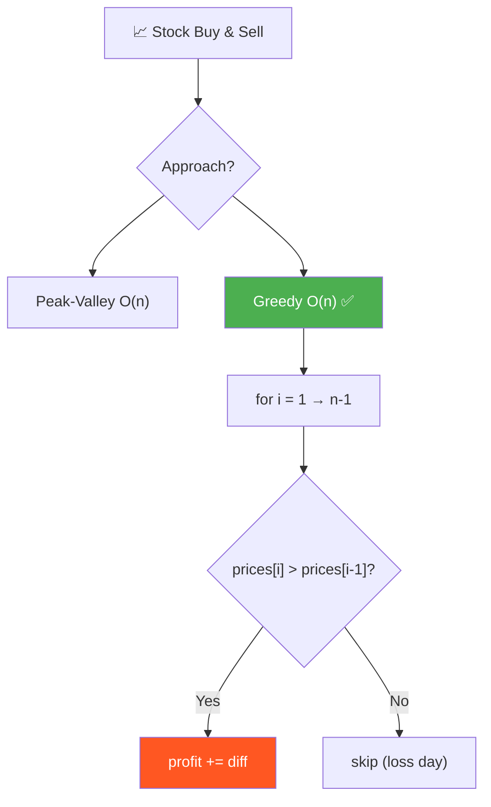
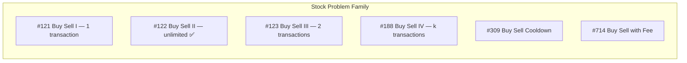
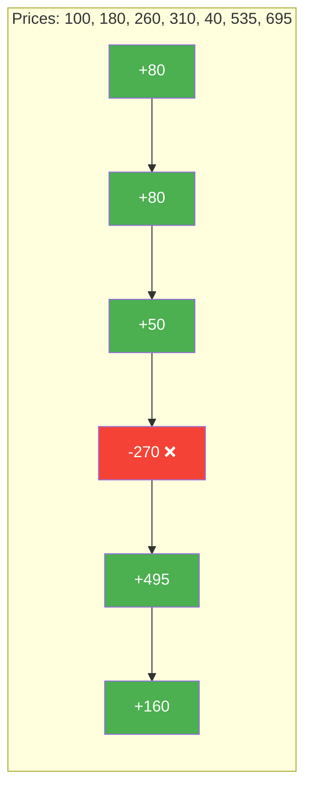
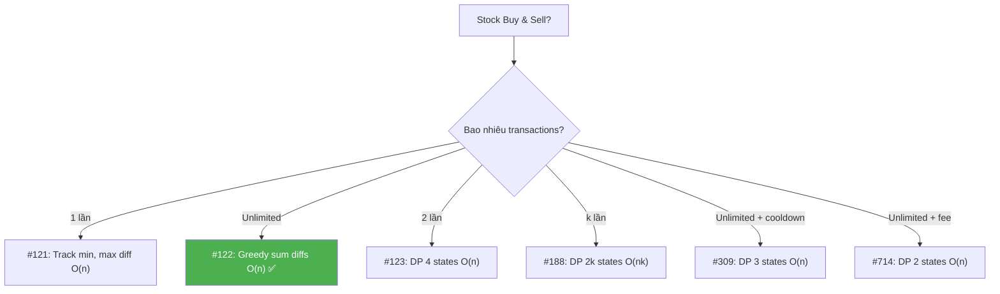

# 📈 Stock Buy and Sell — Multiple Transactions — GfG (Easy) / LeetCode #122

> 📖 Code: [Stock Buy and Sell.js](./Stock%20Buy%20and%20Sell.js)





---

## R — Repeat & Clarify

🧠 _"Cộng TẤT CẢ ngày tăng giá liên tiếp! prices[i] > prices[i-1] → profit += diff. O(n)!"_

> 🎙️ _"Given stock prices for each day, find maximum profit with unlimited buy/sell transactions. Cannot hold multiple stocks simultaneously."_

### Clarification Questions

```
Q: Được mua bán bao nhiêu lần?
A: UNLIMITED! Bao nhiêu lần cũng được.

Q: Có thể mua và bán CÙNG NGÀY?
A: Có! Bán rồi mua lại cùng ngày OK.

Q: Phải bán trước khi mua mới?
A: Đúng! Chỉ hold TỐI ĐA 1 stock tại 1 thời điểm.

Q: Giá có thể = 0?
A: Có thể. Giá ≥ 0.

Q: Mảng rỗng hoặc 1 phần tử?
A: Không thể có transaction → profit = 0.
```

### Tại sao bài này quan trọng?

```
  Bài này là BẢN LỀ trong "Stock Problem Family":

  ┌──────────────────────────────────────────────────────────────┐
  │  #121 — 1 transaction:      Track min price, max diff       │
  │  #122 — Unlimited (BÀI NÀY): Sum positive diffs → GREEDY   │
  │  #123 — 2 transactions:     DP 4 states                     │
  │  #188 — k transactions:     DP k×2 states                   │
  │  #309 — Cooldown:           DP + state machine              │
  │  #714 — Transaction fee:    DP + fee adjustment             │
  │                                                              │
  │  📌 #122 dạy GREEDY insight CỐT LÕI:                       │
  │  "Mua ở VALLEY, bán ở PEAK = Cộng tất cả ngày tăng giá!"  │
  │  → Hiểu insight này → giải được #309, #714 dễ hơn!         │
  └──────────────────────────────────────────────────────────────┘
```

---

## 🧠 Bản chất bài toán — Hiểu để NHỚ, không chỉ để GIẢI

### Đồ thị giá = Chuỗi NÚI

```
  prices = [100, 180, 260, 310, 40, 535, 695]

  695 ─ ─ ─ ─ ─ ─ ─ ─ ─ ─ ─ ─ ─ ─ ─ ─ ─ ─ ─ ─ ─ ● Sell
  535 ─ ─ ─ ─ ─ ─ ─ ─ ─ ─ ─ ─ ─ ─ ─ ─ ─ ●      /
                                             |    /
  310 ─ ─ ─ ─ ─ ─ ● Sell                    |  /
  260 ─ ─ ─ ─ ─ ●  |                        |/
  180 ─ ─ ─ ─●   |  |                       /
  100 ─ ─ ● Buy |  |    40 ─ ─ ─ ─ ─ ─ ● Buy
           \   /  |         
            ↑      ↑
         +210    +655       Total = 865

  📌 MUA ở đáy (valley), BÁN ở đỉnh (peak)!
     → Transaction 1: Buy 100, Sell 310 → +210
     → Transaction 2: Buy 40, Sell 695 → +655
     → Total = 865
```

### KEY INSIGHT: "Cộng mọi ngày tăng giá" = "Mua đáy, bán đỉnh"

```
  🧠 Tại sao 2 cách cho cùng kết quả?

  Transaction lớn: Buy 100, Sell 310 = +210
  Chia nhỏ ra:
    Day 0→1: 180 - 100 = +80
    Day 1→2: 260 - 180 = +80
    Day 2→3: 310 - 260 = +50
    Tổng:    80 + 80 + 50 = 210 ← GIỐNG!

  📐 CHỨNG MINH:
    prices[3] - prices[0]
    = (prices[3] - prices[2]) + (prices[2] - prices[1]) + (prices[1] - prices[0])
    = Σ (prices[i] - prices[i-1])  cho i = 1 → 3

  → BÁN ở peak - MUA ở valley = TỔNG mọi daily gains giữa 2 điểm!
  → KHÔNG CẦN biết khi nào mua, khi nào bán!
  → CHỈ CẦN cộng TẤT CẢ ngày tăng giá!

  ┌──────────────────────────────────────────────────────────────┐
  │  💡 Telescoping Sum:                                         │
  │                                                              │
  │  peak - valley = Σ (prices[i+1] - prices[i])               │
  │                   i=valley → peak-1                          │
  │                                                              │
  │  → Cộng TẤT CẢ daily positive diffs = mua ở mọi valley,   │
  │    bán ở mọi peak!                                           │
  └──────────────────────────────────────────────────────────────┘
```



```
  Chỉ cộng ngày XANH (tăng giá):
  +80 + 80 + 50 + 495 + 160 = 865 ✅

  Bỏ qua ngày ĐỎ (giảm giá):
  -270 → KHÔNG mua ngày đó!
```

### Hai cách nhìn bài toán

```
  CÁCH 1: Peak-Valley — "Tìm đáy mua, tìm đỉnh bán"
  ┌──────────────────────────────────────────────────────────────┐
  │  while chưa hết mảng:                                        │
  │    1. Tìm VALLEY (local min): giá giảm → đi xuống           │
  │    2. Tìm PEAK (local max): giá tăng → đi lên               │
  │    3. profit += peak - valley                                 │
  │                                                              │
  │  → Trực quan! Giống cách trader thực tế nghĩ!               │
  │  → Nhưng code hơi DÀI (2 while lồng)                       │
  └──────────────────────────────────────────────────────────────┘

  CÁCH 2: Greedy — "Cộng tất cả ngày tăng giá"
  ┌──────────────────────────────────────────────────────────────┐
  │  for i = 1 → n-1:                                           │
  │    if prices[i] > prices[i-1]:                               │
  │       profit += prices[i] - prices[i-1]                     │
  │                                                              │
  │  → 3 DÒNG CODE! Cực kỳ ngắn gọn!                           │
  │  → Tương đương peak-valley (đã chứng minh!)                 │
  └──────────────────────────────────────────────────────────────┘

  📌 Interview: nêu Peak-Valley trước (trực quan),
     rồi optimize thành Greedy (ngắn gọn)!
```

---

## 🧭 Luồng Suy Nghĩ — Từ đọc đề đến solution

> 💡 Phần này dạy bạn **CÁCH TƯ DUY** để tự giải bài, không chỉ biết đáp án.

### Bước 1: Đọc đề → Gạch chân KEYWORDS

```
  Đề: "Buy and sell stock any number of times for max profit"

  Gạch chân:
    "any number of times"  → UNLIMITED transactions!
    "maximum profit"       → OPTIMIZATION problem
    "buy earlier, sell later" → buy day < sell day
    "cannot hold multiple"   → bán XONG mới được mua tiếp

  🧠 Tự hỏi: "Unlimited = greedy có thể hoạt động?"
    → Yes! Không có giới hạn → lấy TẤT CẢ profit khả dĩ!

  📌 Kỹ năng chuyển giao:
    "Unlimited transactions" → Greedy (lấy mọi gain)
    "At most k transactions" → DP (cần trade-off)
    "With cooldown/fee"      → DP + state machine
```

### Bước 2: Vẽ đồ thị bằng tay → Tìm PATTERN

```
  prices = [100, 180, 260, 310, 40, 535, 695]

  Vẽ đồ thị giá theo ngày:
    Day 0: 100  ↑
    Day 1: 180  ↑  tăng
    Day 2: 260  ↑  tăng
    Day 3: 310  ↓  PEAK! → BÁN ở đây
    Day 4: 40   ↑  VALLEY! → MUA ở đây
    Day 5: 535  ↑  tăng
    Day 6: 695     PEAK! → BÁN ở đây

  🧠 Quan sát:
    1. MUA ở valley (đáy), BÁN ở peak (đỉnh)
    2. Bỏ qua đoạn GIẢM (day 3→4: -270)
    3. Lấy TẤT CẢ đoạn TĂNG!
```

### Bước 3: Brute Force → "Thử tất cả khả năng"

```
  Brute force: thử TẤT CẢ cách mua bán → O(2ⁿ)!
    → Mỗi ngày: buy, sell, hoặc do nothing
    → Exponential → quá chậm!

  🧠 Tự hỏi: "Có cần thử tất cả không?"
    → Unlimited transactions → KHÔNG cần trade-off!
    → Mỗi ngày tăng giá = 1 cơ hội profit
    → Lấy HẾT! → GREEDY!
```

### Bước 4: "Chỉ cần cộng ngày tăng giá!" → Greedy

```
  💡 KEY INSIGHT:
    Nếu prices[i] > prices[i-1] → có PROFIT!
    → Cộng vào total!
    
    Nếu prices[i] ≤ prices[i-1] → LOSS hoặc flat
    → Bỏ qua! (không mua ngày lỗ)

  Tạ sao đúng? Telescoping sum:
    Peak - Valley = Σ daily gains (đã chứng minh ở trên!)
    → Cộng TẤT CẢ daily gains = tự động buy valley, sell peak!

  ✅ O(n) time, O(1) space — tối ưu nhất!

  📌 Kỹ năng chuyển giao:
    ┌──────────────────────────────────────────────────────────────┐
    │  Khi "unlimited" + optimization:                            │
    │    → GREEDY thường hoạt động!                               │
    │    → "Lấy TẤT CẢ cơ hội profit"                           │
    │                                                              │
    │  Khi "limited k" + optimization:                            │
    │    → Greedy KHÔNG đủ (cần trade-off giữa k lần)            │
    │    → Cần DP!                                                │
    │                                                              │
    │  Jump Game (#55):    "Can reach end?" → Greedy max reach   │
    │  Gas Station (#134): "Can complete circuit?" → Greedy      │
    │  Stock #122:         "Unlimited trades?" → Greedy sum      │
    └──────────────────────────────────────────────────────────────┘
```

### Bước 5: Tổng kết — Cây quyết định Stock problems



---

## E — Examples

### Ví dụ minh họa trực quan

```
VÍ DỤ 1: prices = [100, 180, 260, 310, 40, 535, 695]

  Daily diffs: +80, +80, +50, -270, +495, +160
  
  Cộng diffs DƯƠNG: 80 + 80 + 50 + 495 + 160 = 865 ✅

  Tương đương:
    Transaction 1: Buy@100, Sell@310 = +210 (= 80+80+50)
    Transaction 2: Buy@40,  Sell@695 = +655 (= 495+160)
    Total = 865
```

```
VÍ DỤ 2: prices = [4, 2]

  Daily diffs: -2
  
  Không có diff DƯƠNG → profit = 0 ✅
  🧠 Giá CHỈ GIẢM → không bao giờ nên mua!
```

```
VÍ DỤ 3: prices = [1, 2, 3, 4, 5]

  Daily diffs: +1, +1, +1, +1
  
  Tất cả DƯƠNG! Cộng hết: 1+1+1+1 = 4 ✅
  
  Tương đương: Buy@1, Sell@5 = +4
  🧠 Giá TĂNG LIÊN TỤC → 1 transaction duy nhất = sum all diffs!
```

```
VÍ DỤ 4: prices = [7, 1, 5, 3, 6, 4]

  Daily diffs: -6, +4, -2, +3, -2

  Diffs DƯƠNG: +4 + 3 = 7 ✅

  Tương đương:
    Transaction 1: Buy@1, Sell@5 = +4
    Transaction 2: Buy@3, Sell@6 = +3
    Total = 7
```

### Trace — Greedy: prices = [100, 180, 260, 310, 40, 535, 695]

```
  ┌──────────────────────────────────────────────────────────────────┐
  │ i=1: prices[1]=180 > prices[0]=100? YES! +80                   │
  │      profit = 80                                                 │
  │      🧠 "Hôm nay tăng 80 → lấy profit!"                       │
  ├──────────────────────────────────────────────────────────────────┤
  │ i=2: prices[2]=260 > prices[1]=180? YES! +80                   │
  │      profit = 160                                                │
  ├──────────────────────────────────────────────────────────────────┤
  │ i=3: prices[3]=310 > prices[2]=260? YES! +50                   │
  │      profit = 210                                                │
  ├──────────────────────────────────────────────────────────────────┤
  │ i=4: prices[4]=40 > prices[3]=310? NO! (giảm 270)             │
  │      profit = 210 (bỏ qua, KHÔNG mua ngày lỗ!)                │
  │      🧠 "Hôm nay GIẢM → skip! Đừng mua!"                      │
  ├──────────────────────────────────────────────────────────────────┤
  │ i=5: prices[5]=535 > prices[4]=40? YES! +495                   │
  │      profit = 705                                                │
  ├──────────────────────────────────────────────────────────────────┤
  │ i=6: prices[6]=695 > prices[5]=535? YES! +160                  │
  │      profit = 865                                                │
  └──────────────────────────────────────────────────────────────────┘

  → return 865 ✅
```

### Trace — Peak-Valley: prices = [7, 1, 5, 3, 6, 4]

```
  ┌──────────────────────────────────────────────────────────────────┐
  │ Pass 1: Find valley                                              │
  │   i=0: 7 >= 1? YES → i++                                        │
  │   i=1: 1 >= 5? NO → valley = prices[1] = 1                     │
  │                                                                  │
  │ Pass 1: Find peak                                                │
  │   i=1: 1 <= 5? YES → i++                                        │
  │   i=2: 5 <= 3? NO → peak = prices[2] = 5                       │
  │                                                                  │
  │ profit += 5 - 1 = 4     total = 4                               │
  ├──────────────────────────────────────────────────────────────────┤
  │ Pass 2: Find valley                                              │
  │   i=2: 5 >= 3? YES → i++                                        │
  │   i=3: 3 >= 6? NO → valley = prices[3] = 3                     │
  │                                                                  │
  │ Pass 2: Find peak                                                │
  │   i=3: 3 <= 6? YES → i++                                        │
  │   i=4: 6 <= 4? NO → peak = prices[4] = 6                       │
  │                                                                  │
  │ profit += 6 - 3 = 3     total = 7                               │
  ├──────────────────────────────────────────────────────────────────┤
  │ i=5: i = n-1 → exit loop                                        │
  └──────────────────────────────────────────────────────────────────┘

  → return 7 ✅
```

---

## A — Approach

### Approach 1: Peak-Valley — O(n)

```
  ┌──────────────────────────────────────────────────────────────┐
  │  while (i < n - 1):                                          │
  │    // Tìm VALLEY (đáy)                                      │
  │    while prices[i] >= prices[i+1]: i++                       │
  │    valley = prices[i]                                        │
  │                                                              │
  │    // Tìm PEAK (đỉnh)                                       │
  │    while prices[i] <= prices[i+1]: i++                       │
  │    peak = prices[i]                                          │
  │                                                              │
  │    profit += peak - valley                                   │
  │                                                              │
  │  Time: O(n)    Space: O(1)                                   │
  │  → Mỗi phần tử được duyệt TỐI ĐA 2 lần (1 lần tìm        │
  │    valley, 1 lần tìm peak)                                   │
  └──────────────────────────────────────────────────────────────┘
```

### Approach 2: Greedy Sum Diffs — O(n) ✅

```
  💡 KEY INSIGHT: peak - valley = Σ daily positive diffs!

  ┌──────────────────────────────────────────────────────────────┐
  │  for i = 1 → n-1:                                           │
  │    if prices[i] > prices[i-1]:                               │
  │       profit += prices[i] - prices[i-1]                     │
  │                                                              │
  │  Time: O(n)    Space: O(1)                                   │
  │  → 3 dòng logic! Ngắn nhất có thể!                          │
  └──────────────────────────────────────────────────────────────┘

  🧠 Tại sao bỏ qua ngày giảm giá?
    prices[i] ≤ prices[i-1] → diff ≤ 0
    → Cộng vào chỉ GIẢM profit!
    → Bỏ qua = "không giao dịch ngày đó!"
```

---

## C — Code

### Solution 1: Peak-Valley — O(n)

```javascript
function maxProfitPeakValley(prices) {
  const n = prices.length;
  if (n < 2) return 0;

  let totalProfit = 0;
  let i = 0;

  while (i < n - 1) {
    // Find valley
    while (i < n - 1 && prices[i] >= prices[i + 1]) i++;
    const valley = prices[i];

    // Find peak
    while (i < n - 1 && prices[i] <= prices[i + 1]) i++;
    const peak = prices[i];

    totalProfit += peak - valley;
  }

  return totalProfit;
}
```

```
  📝 Line-by-line:

  Line 3: if (n < 2) return 0
    → 0 hoặc 1 ngày → không thể mua BÁN → profit = 0

  Line 9: while (i < n - 1 && prices[i] >= prices[i + 1]) i++
    → Đi XUỐNG: giá giảm → tìm đáy (valley)
    → Dừng khi: giá BẮT ĐẦU TĂNG (prices[i] < prices[i+1])
    
    ⚠️ Tại sao >=? (chứ không phải >?)
       → prices[i] == prices[i+1] → flat → TIẾP TỤC tìm valley!
       → Mua ở ngày flat CUỐI CÙNG trước khi tăng → OK!

  Line 13: while (i < n - 1 && prices[i] <= prices[i + 1]) i++
    → Đi LÊN: giá tăng → tìm đỉnh (peak)
    → Dừng khi: giá BẮT ĐẦU GIẢM

  Line 16: totalProfit += peak - valley
    → 1 transaction: mua ở valley, bán ở peak!

  🧠 i KHÔNG reset sau mỗi transaction!
     → Tiếp tục từ peak hiện tại → tìm valley TIẾP!
     → Mỗi phần tử chỉ duyệt 1 lần → O(n)!
```

### Solution 2: Greedy — O(n) ✅

```javascript
function maxProfitGreedy(prices) {
  let totalProfit = 0;

  for (let i = 1; i < prices.length; i++) {
    if (prices[i] > prices[i - 1]) {
      totalProfit += prices[i] - prices[i - 1];
    }
  }

  return totalProfit;
}
```

```
  📝 Line-by-line:

  Line 4: for (let i = 1; i < prices.length; i++)
    → Bắt đầu từ 1 (cần prices[i-1])
    → Duyệt MỌI ngày, check daily change

  Line 5: if (prices[i] > prices[i - 1])
    → Giá TĂNG so với hôm qua?
    → YES → cộng chênh lệch vào profit!
    → NO → bỏ qua (không mua ngày lỗ)

    🧠 Tại sao > (strict) chứ không >=?
       → prices[i] == prices[i-1] → diff = 0 → cộng 0 → vô ích!
       → Bỏ qua cho sạch, nhưng cộng 0 cũng KHÔNG SAI

  Line 6: totalProfit += prices[i] - prices[i - 1]
    → "Lấy profit của ngày hôm nay"
    → Tương đương: mua hôm qua, bán hôm nay
    → Thực tế: telescoping sum tự động gộp thành valley→peak!
```

---

## ❌ Common Mistakes — Lỗi thường gặp

### Mistake 1: Nghĩ cần tìm global min và global max

```javascript
// ❌ SAI: mua ở MIN toàn cục, bán ở MAX toàn cục!
const profit = Math.max(...prices) - Math.min(...prices);

// Input: [1, 5, 2, 8]
// SAI: max - min = 8 - 1 = 7
// ĐÚNG: Buy@1 Sell@5 (+4), Buy@2 Sell@8 (+6) = 10!
// → Đa transaction > single transaction!

// ✅ ĐÚNG: cộng TẤT CẢ diffs dương!
```

### Mistake 2: Chỉ tìm 1 transaction (đây là bài #121!)

```javascript
// ❌ SAI: track min price, max profit (bài #121!)
let minPrice = Infinity;
let maxProfit = 0;
for (const price of prices) {
  minPrice = Math.min(minPrice, price);
  maxProfit = Math.max(maxProfit, price - minPrice);
}
// → Chỉ tìm 1 transaction tốt nhất!

// ✅ ĐÚNG: bài #122 = UNLIMITED → cộng tất cả diffs dương!
```

### Mistake 3: Peak-Valley — quên check bounds

```javascript
// ❌ SAI: thiếu i < n-1 check → index out of bounds!
while (prices[i] >= prices[i + 1]) i++; // i+1 = n!

// ✅ ĐÚNG: luôn check i < n-1 trước khi access i+1!
while (i < n - 1 && prices[i] >= prices[i + 1]) i++;
```

### Mistake 4: Greedy — cộng cả ngày giảm giá

```javascript
// ❌ SAI: cộng TẤT CẢ diffs (kể cả âm!)
for (let i = 1; i < n; i++) {
  totalProfit += prices[i] - prices[i - 1]; // ← kể cả khi âm!
}

// ✅ ĐÚNG: CHỈ cộng diffs DƯƠNG!
for (let i = 1; i < n; i++) {
  if (prices[i] > prices[i - 1]) { // check trước!
    totalProfit += prices[i] - prices[i - 1];
  }
}

// Hoặc dùng Math.max:
totalProfit += Math.max(0, prices[i] - prices[i - 1]);
```

---

## O — Optimize

```
                      Time       Space     Ghi chú
  ─────────────────────────────────────────────────────────────
  Brute Force         O(2ⁿ)      O(n)      Thử tất cả cách
  Peak-Valley         O(n)       O(1)      Trực quan
  Greedy ✅           O(n)       O(1)      3 dòng code!

  📌 KHÔNG thể tốt hơn O(n) (phải đọc mỗi giá ít nhất 1 lần!)
  📌 Peak-Valley và Greedy cho CÙNG KẾT QUẢ, cùng O(n)
     → Greedy ưu tiên vì code NGẮN hơn!
```

---

## T — Test

```
Test Cases:
  [100,180,260,310,40,535,695]  → 865   ✅ 2 transactions
  [4,2]                         → 0     ✅ Giá chỉ giảm
  [1,2,3,4,5]                   → 4     ✅ Tăng liên tục
  [5,4,3,2,1]                   → 0     ✅ Giảm liên tục
  [7,1,5,3,6,4]                 → 7     ✅ LeetCode example
  [1]                           → 0     ✅ 1 phần tử
  [3,3,3]                       → 0     ✅ Flat (giá không đổi)
  [1,2]                         → 1     ✅ Minimal transaction
```

### Edge Cases giải thích

```
  ┌──────────────────────────────────────────────────────────────┐
  │  Giá tăng liên tục:  [1,2,3,4,5] → 4                       │
  │    = 1 transaction lớn (Buy@1 Sell@5)                        │
  │    = sum diffs (1+1+1+1 = 4) → GIỐNG!                      │
  │                                                              │
  │  Giá giảm liên tục:  [5,4,3,2,1] → 0                       │
  │    Không có diff dương → KHÔNG mua!                          │
  │                                                              │
  │  Giá flat:            [3,3,3] → 0                            │
  │    Mọi diff = 0 → không profit!                              │
  │                                                              │
  │  Zigzag:             [1,5,2,8,3,7] → 4+6+4 = 14            │
  │    Mua ở mỗi VALLEY, bán ở mỗi PEAK!                       │
  └──────────────────────────────────────────────────────────────┘
```

---

## 🗣️ Interview Script

### 🎙️ Think Out Loud — Mô phỏng phỏng vấn thực

> ⚠️ Script này dạy cách **NÓI**, không phải cách CODE.
> Mỗi đoạn = cách bạn **PHÁT BIỂU** trong phỏng vấn thực!

```
  ╔══════════════════════════════════════════════════════════════╗
  ║  🕐 FULL INTERVIEW SIMULATION — 1h30 (90 phút)             ║
  ║                                                              ║
  ║  00:00-05:00  Introduction + Icebreaker         (5 min)     ║
  ║  05:00-45:00  Problem Solving                   (40 min)    ║
  ║  45:00-60:00  Deep Technical Probing            (15 min)    ║
  ║  60:00-75:00  Variations + Extensions           (15 min)    ║
  ║  75:00-85:00  System Design at Scale            (10 min)    ║
  ║  85:00-90:00  Behavioral + Q&A                  (5 min)     ║
  ╚══════════════════════════════════════════════════════════════╝
```

```
  ╔══════════════════════════════════════════════════════════════╗
  ║  PART 1: INTRODUCTION (00:00 — 05:00)                       ║
  ╚══════════════════════════════════════════════════════════════╝

  👤 "Tell me about yourself and a time you dealt
      with optimization under sequential constraints."

  🧑 "I'm a frontend engineer with [X] years of experience.
      A relevant example: I built a dashboard for an
      e-commerce team that tracked daily ad spend versus
      revenue. The team wanted to know when to 'buy in'
      on ad campaigns and when to 'pull back.'

      I modeled it as a stock problem: the daily ROI
      was the 'price.' With unlimited campaign adjustments,
      the optimal strategy was to increase spend on every
      day where ROI improved — sum all positive daily gains.

      That's exactly LeetCode 122 — maximizing profit
      with unlimited transactions by summing consecutive
      positive differences."

  👤 "Perfect analogy. Let's formalize."
```

```
  ╔══════════════════════════════════════════════════════════════╗
  ║  PART 2: PROBLEM SOLVING (05:00 — 45:00)                   ║
  ╚══════════════════════════════════════════════════════════════╝

  ──────────────── 05:00 — Clarify (4 phút) ────────────────

  👤 "Maximize profit buying and selling stock
      with unlimited transactions."

  🧑 "Let me clarify.

      I'm given an array of daily stock prices.
      I can buy and sell any number of times.
      But I must SELL before buying again —
      I can hold at most one share at any time.

      I can buy and sell on the same day —
      effectively a no-op.

      I want to maximize TOTAL profit across
      all transactions.

      Edge cases: if there's only one price or zero prices,
      no transaction is possible — profit is 0.
      If prices only decrease, best strategy is
      to not buy at all — profit is 0."

  ──────────────── 09:00 — Mountain Range Analogy (3 phút) ────────

  🧑 "I think of the price chart as a MOUNTAIN RANGE.

      The prices form peaks (local maxima) and
      valleys (local minima).

      The optimal strategy: BUY at every valley,
      SELL at every peak.

      Each valley-to-peak segment captures all the
      profit in that upswing. I never hold during
      a downswing.

      The question is: how do I efficiently identify
      all the valley-peak pairs?"

  ──────────────── 12:00 — Peak-Valley Approach (4 phút) ────────

  🧑 "The intuitive approach: Peak-Valley.

      I scan through the prices:
      First, I walk DOWN until I find a valley —
      a local minimum where prices stop decreasing.
      Then I walk UP until I find a peak —
      a local maximum where prices stop increasing.
      I add peak minus valley to my profit.
      Repeat until I've scanned the entire array.

      Let me trace with [100, 180, 260, 310, 40, 535, 695]:

      Walk down: 100 is already a valley (start).
      Walk up: 100, 180, 260, 310 — stops at 310 (peak).
      Profit: 310 minus 100 equals 210.

      Walk down: 310, 40 — valley at 40.
      Walk up: 40, 535, 695 — peak at 695.
      Profit: 695 minus 40 equals 655.

      Total: 210 plus 655 equals 865.

      O of n time — each element visited at most twice."

  ──────────────── 16:00 — Greedy Simplification (5 phút) ────────

  🧑 "But I can simplify DRAMATICALLY.

      The key insight: the TELESCOPING SUM property.

      Peak minus valley equals the sum of all consecutive
      daily gains between them.

      For example: 310 minus 100 equals
      (180 minus 100) plus (260 minus 180)
      plus (310 minus 260) equals 80 plus 80 plus 50
      equals 210. Same result!

      This means: instead of finding valleys and peaks,
      I just iterate through the array once.
      For each day, if today's price is higher than
      yesterday's, I add the difference to my profit.

      for i from 1 to n minus 1:
        if prices at i greater than prices at i minus 1:
          profit plus-equals prices at i minus prices at i minus 1.

      THREE lines of logic. O of n. O of 1 space.

      Let me trace: [100, 180, 260, 310, 40, 535, 695].
      Diffs: +80, +80, +50, -270, +495, +160.
      Sum positives: 80 plus 80 plus 50 plus 495 plus 160
      equals 865. Same answer!"

  ──────────────── 21:00 — Telescoping Sum Proof (4 phút) ────────

  👤 "Can you prove the telescoping sum property?"

  🧑 "Yes! Algebraically.

      For any consecutive prices from index a to index b:
      prices at b minus prices at a equals
      the sum from i equals a plus 1 to b of
      (prices at i minus prices at i minus 1).

      This is the telescoping sum identity.
      Expanding the right side:
      (prices at a plus 1 minus prices at a)
      plus (prices at a plus 2 minus prices at a plus 1)
      plus ... plus (prices at b minus prices at b minus 1).

      Every intermediate term cancels. Only prices at b
      minus prices at a remains. QED.

      Now, the optimal strategy captures every upswing.
      Each upswing is a valley-to-peak segment.
      By the telescoping identity, each segment's profit
      equals the sum of its daily gains.

      Summing all positive daily gains across the entire
      array automatically captures every upswing
      and ignores every downswing."

  ──────────────── 25:00 — Why skip negative diffs? (2 phút) ────

  👤 "Why is it correct to skip negative differences?"

  🧑 "A negative difference means the price DROPPED.

      With unlimited transactions, I can choose NOT
      to hold during any day. If the price drops,
      I should have sold yesterday and buy today.

      By skipping negative diffs, I'm implicitly
      saying: 'I was not holding stock on this day.'

      By adding positive diffs, I'm saying:
      'I held stock from yesterday to today and
      captured the gain.'

      The greedy works because there's NO PENALTY
      for transacting. Unlimited, no fee, no cooldown.
      Take every gain, avoid every loss."

  ──────────────── 27:00 — Write Code (3 phút) ────────────────

  🧑 "The code.

      [Vừa viết vừa nói:]

      function maxProfit of prices.
      let profit equals 0.

      for let i equals 1; i less than prices dot length; i++:
        if prices at i greater than prices at i minus 1:
          profit plus-equals prices at i minus prices at i minus 1.

      return profit.

      Alternatively, using Math dot max:
      profit plus-equals Math dot max of 0,
      prices at i minus prices at i minus 1.

      Both are equivalent. The if-check version
      avoids adding zero, but both are correct."

  ──────────────── 30:00 — Edge Cases (3 phút) ────────────────

  🧑 "Edge cases.

      Empty array or single element: profit is 0.
      No transaction possible.

      Strictly decreasing [5, 4, 3, 2, 1]:
      All diffs are negative. Sum of positives is 0.
      Don't buy at all.

      Strictly increasing [1, 2, 3, 4, 5]:
      All diffs are positive: 1 + 1 + 1 + 1 = 4.
      Equivalent to one transaction: buy at 1, sell at 5.

      Flat prices [3, 3, 3]: all diffs are 0. Profit is 0.

      Zigzag [1, 5, 2, 8, 3, 7]:
      Diffs: +4, -3, +6, -5, +4.
      Positives: 4 + 6 + 4 = 14.
      Three separate transactions."

  ──────────────── 33:00 — Complexity (3 phút) ────────────────

  🧑 "Time: O of n. Single pass through the array.
      Each element is compared exactly once to its predecessor.

      Space: O of 1. One variable for profit.

      Is this optimal? Yes.
      I must read every price at least once —
      the optimal profit depends on every element.
      Omega of n is the lower bound.

      The peak-valley approach is also O of n
      but with more complex code. The greedy version
      is strictly simpler with identical performance."

  ──────────────── 36:00 — Peak-Valley vs Greedy trade-off (3 phút)

  👤 "When would you prefer peak-valley over greedy?"

  🧑 "Peak-valley when I need the ACTUAL transactions.

      The greedy approach tells me the maximum profit
      but not WHEN to buy and sell.

      Peak-valley explicitly identifies each valley-peak
      pair, giving me the transaction list:
      Buy at valley, sell at peak.

      For just the profit number: greedy wins.
      For the transaction history: peak-valley is needed.

      In an interview, I'd mention both approaches,
      ask the interviewer which output format they want,
      and code accordingly."

  ──────────────── 39:00 — Common Mistakes (4 phút) ────────────

  🧑 "Common mistakes.

      First: using global min and max.
      Buy at the overall minimum, sell at the overall
      maximum. This ignores intermediate opportunities.
      [1, 5, 2, 8]: global approach gives 8 minus 1 = 7.
      But the correct answer is (5-1) + (8-2) = 10.

      Second: confusing with LeetCode 121 (one transaction).
      121 uses track-min-max-diff. 122 needs all gains.

      Third: adding negative diffs too.
      Summing ALL diffs gives prices at n-1 minus prices at 0,
      which is just one transaction from day 0 to last day.
      Must ONLY add positive diffs.

      Fourth: in peak-valley, forgetting bounds check.
      Accessing prices at i+1 without checking i less than n-1
      causes array index out of bounds."
```

```
  ╔══════════════════════════════════════════════════════════════╗
  ║  PART 3: DEEP TECHNICAL PROBING (45:00 — 60:00)            ║
  ╚══════════════════════════════════════════════════════════════╝

  ──────────────── 45:00 — Why greedy works formally (4 phút) ────

  👤 "Can you prove the greedy approach is optimal?"

  🧑 "The greedy choice property:

      At each step, taking every positive daily gain
      is locally optimal. And the sum of locally optimal
      choices equals the globally optimal solution.

      Proof by contradiction. Suppose the greedy
      solution is suboptimal. Then there exists an
      optimal solution that skips some positive gain
      on day i. But since transactions are unlimited
      and free, including that gain doesn't prevent
      any other transaction. So including it gives
      at least as much profit — contradicting the
      assumption that skipping was optimal.

      The key condition: NO CONSTRAINTS on transactions.
      No limit, no fee, no cooldown.
      Any constraint breaks the greedy property
      and requires DP."

  ──────────────── 49:00 — Equivalence proof (4 phút) ────────────

  👤 "Prove peak-valley and greedy give the same result."

  🧑 "Consider any valley at index v and peak at index p.

      Peak-valley profit: prices at p minus prices at v.

      Greedy profit from v to p:
      Sum of all (prices at i minus prices at i minus 1)
      for i from v plus 1 to p,
      WHERE the diff is positive.

      Between a valley and its peak, ALL diffs are positive
      (prices are monotonically increasing in this segment).
      So the greedy sum includes ALL diffs, which equals
      prices at p minus prices at v by telescoping.

      Between a peak and the next valley, ALL diffs are
      negative. Greedy skips them. Peak-valley also skips
      this segment (no transaction during downswing).

      Both approaches capture exactly the same segments.
      The total profit is identical. QED."

  ──────────────── 53:00 — Stock #121 connection (3 phút) ────────

  👤 "How does this relate to LeetCode 121?"

  🧑 "LeetCode 121 — Best Time to Buy and Sell Stock.
      At most ONE transaction.

      The approach: track the minimum price seen so far.
      For each price, compute price minus min so far.
      The maximum of these is the answer.

      O of n, O of 1. But fundamentally different:
      121 finds the SINGLE largest valley-to-peak.
      122 sums ALL valley-to-peak segments.

      If I apply our greedy to 121, I'd get TOO MUCH
      profit by combining multiple transactions.
      The limit of 1 transaction requires choosing
      the BEST single opportunity — not all of them."

  ──────────────── 56:00 — DP state machine (4 phút) ────────────

  👤 "How would you solve this with DP?"

  🧑 "Even though greedy works for 122, the DP approach
      is important because it generalizes.

      I define two states at each day:
      hold: maximum profit if I'm holding a stock.
      notHold: maximum profit if I'm NOT holding.

      Transitions:
      hold at i equals max of (hold at i minus 1,
      notHold at i minus 1 minus prices at i).
      Meaning: I either keep holding, or I was not holding
      and I BUY today.

      notHold at i equals max of (notHold at i minus 1,
      hold at i minus 1 plus prices at i).
      Meaning: I either keep not holding, or I was holding
      and I SELL today.

      Base: hold at 0 equals minus prices at 0.
      notHold at 0 equals 0.

      Answer: notHold at n minus 1.

      This gives exactly the same result as greedy
      for unlimited transactions. But it generalizes:
      adding a fee → subtract fee when selling.
      Adding cooldown → notHold depends on i minus 2.
      Limiting to k → add a transaction counter."
```

```
  ╔══════════════════════════════════════════════════════════════╗
  ║  PART 4: VARIATIONS (60:00 — 75:00)                         ║
  ╚══════════════════════════════════════════════════════════════╝

  ──────────────── 60:00 — With transaction fee (#714) (4 phút) ──

  👤 "What if there's a fee per transaction?"

  🧑 "LeetCode 714. The greedy approach FAILS.

      With a fee, small gains might not cover the fee.
      I need to decide: is this upswing large enough
      to justify the fee?

      The DP state machine handles this naturally.
      When selling: notHold at i equals max of
      (notHold at i minus 1,
      hold at i minus 1 plus prices at i minus fee).

      The fee is subtracted at sell time.
      This means small fluctuations won't trigger
      unnecessary buy-sell cycles.

      O of n time, O of 1 space (only need previous day)."

  ──────────────── 64:00 — With cooldown (#309) (4 phút) ────────

  👤 "What about a cooldown after selling?"

  🧑 "LeetCode 309. After selling, I must wait one day
      before buying again.

      Three states: hold, notHold, cooldown.

      hold at i: max of (hold at i-1, notHold at i-1 - price).
      notHold at i: max of (notHold at i-1, cooldown at i-1).
      cooldown at i: hold at i-1 + price.

      The cooldown state prevents immediate re-buying.
      After selling (entering cooldown), I must wait
      one day in notHold before buying again.

      O of n time, O of 1 space."

  ──────────────── 68:00 — At most k transactions (#188) (4 phút) ─

  👤 "What about at most k transactions?"

  🧑 "LeetCode 188. This is the FULL GENERALIZATION.

      DP with 2k states: for each of k transaction slots,
      I track hold and notHold.

      hold at (t, i): max profit holding stock,
      having completed at most t-1 full transactions.
      notHold at (t, i): max profit not holding,
      having completed at most t full transactions.

      Time: O of n times k. Space: O of k.

      When k is at least n over 2: there are at most
      n over 2 valley-peak pairs, so k is effectively
      unlimited. I switch to the greedy approach.

      This optimization is critical: without it,
      large k causes unnecessary DP computation."

  ──────────────── 72:00 — Stock family summary (3 phút) ────────

  🧑 "The entire stock problem family:

      121: 1 transaction → track min, O of n.
      122: unlimited → greedy sum diffs, O of n.
      123: 2 transactions → DP 4 states, O of n.
      188: k transactions → DP 2k states, O of nk.
      309: unlimited + cooldown → DP 3 states, O of n.
      714: unlimited + fee → DP 2 states, O of n.

      The progression: 122 is the pivot.
      Adding constraints (limit, fee, cooldown)
      transitions from greedy to DP.
      The DP state machine is the universal framework."
```

```
  ╔══════════════════════════════════════════════════════════════╗
  ║  PART 5: SYSTEM DESIGN AT SCALE (75:00 — 85:00)            ║
  ╚══════════════════════════════════════════════════════════════╝

  ──────────────── 75:00 — Real-world applications (5 phút) ────────

  👤 "Where does this pattern appear in real systems?"

  🧑 "Several important domains!

      First — ALGORITHMIC TRADING.
      High-frequency trading bots use exactly this logic.
      With zero commission (common on modern platforms),
      the optimal strategy is to capture every positive
      price movement. The greedy sum of positive diffs
      is the theoretical maximum daily profit.

      Second — ENERGY ARBITRAGE.
      Electricity prices fluctuate hourly.
      Battery storage systems buy power when cheap
      (valley) and sell back to the grid when expensive
      (peak). With unlimited charge-discharge cycles,
      the greedy approach gives the maximum revenue.

      Third — CLOUD SPOT PRICING.
      AWS spot instance prices vary over time.
      Migrating workloads to cheaper time slots
      is the same optimization: buy compute when cheap,
      release when expensive.

      Fourth — INVENTORY MANAGEMENT.
      Buy inventory when supplier prices dip,
      sell when demand pushes prices up.
      With no holding cost limit, the greedy approach
      tells you the maximum possible margin."

  ──────────────── 80:00 — Streaming and constraints (5 phút) ────

  👤 "What if prices are streaming in real-time?"

  🧑 "The greedy approach is PERFECTLY suited for streaming!

      I maintain a single variable: the previous price.
      For each new price:
      If current greater than previous:
      profit plus-equals current minus previous.
      Update previous.

      O of 1 per element. O of 1 total space.
      No need to store the history.

      For the DP variants (fee, cooldown):
      I maintain the state variables (hold, notHold).
      Still O of 1 per element. Still streaming-friendly.

      For the k-transaction variant: I need 2k state
      variables. Still O of 1 per element.

      The key insight: all stock problem solutions
      only look at the PREVIOUS state.
      They're all amenable to online/streaming processing."
```

```
  ╔══════════════════════════════════════════════════════════════╗
  ║  PART 6: BEHAVIORAL + Q&A (85:00 — 90:00)                  ║
  ╚══════════════════════════════════════════════════════════════╝

  ──────────────── 85:00 — Reflection (3 phút) ────────────────

  👤 "What would you take away from this problem?"

  🧑 "Three things.

      First, the TELESCOPING SUM insight.
      A large gain decomposes into consecutive daily gains.
      This converts a complex multi-transaction problem
      into a simple single-pass summation.
      The mathematical identity drives the algorithm.

      Second, GREEDY NEEDS PROOF.
      The greedy approach works because there are
      NO constraints on transactions. The moment
      a constraint is added — fee, cooldown, limit —
      greedy breaks and DP is required.
      Always verify the greedy choice property.

      Third, the STOCK FAMILY is a masterclass
      in problem progression.
      Starting from 122, each variant adds one constraint
      and requires one more DP dimension.
      The state machine framework unifies them all."

  ──────────────── 88:00 — Questions (2 phút) ────────────────

  👤 "Any questions for me?"

  🧑 "A few!

      First — the greedy sum-of-diffs is the theoretical
      maximum. In your trading systems, do you account
      for slippage and market impact that reduce
      the realizable profit below this theoretical max?

      Second — the DP state machine generalizes beautifully.
      Does your team use similar state machine patterns
      for other sequential decision problems, like
      resource allocation or workflow scheduling?

      Third — the streaming property makes this ideal
      for real-time systems. Do your monitoring pipelines
      use similar online algorithms for detecting
      opportunities in time-series data?"

  👤 "Excellent! The telescoping sum proof was the highlight —
      most candidates just say 'add positive diffs'
      without explaining WHY it equals valley-peak.
      Your stock family progression showed you understand
      the deeper structure. We'll be in touch!"
```

```
  ╔══════════════════════════════════════════════════════════════╗
  ║  ⭐ 8 MẸO NÓI CHUYỆN TRONG PHỎNG VẤN (Stock Buy Sell)   ║
  ╚══════════════════════════════════════════════════════════════╝

  📌 MẸO #1: Start with peak-valley intuition
     ✅ "Buy at every valley, sell at every peak.
         The price chart is a mountain range.
         Capture every upswing, skip every downswing."

  📌 MẸO #2: Simplify with telescoping sum
     ✅ "Peak minus valley equals the sum of
         all consecutive daily gains.
         So I just add every positive daily diff."

  📌 MẸO #3: State the greedy condition
     ✅ "Greedy works because transactions are UNLIMITED
         and FREE. Every positive gain is worth taking.
         No constraint means no trade-off."

  📌 MẸO #4: Prove telescoping algebraically
     ✅ "prices[b] minus prices[a] equals
         the sum from a+1 to b of daily differences.
         Intermediate terms cancel. Only endpoints remain."

  📌 MẸO #5: Mention what breaks greedy
     ✅ "Adding a fee: small gains don't cover the cost.
         Adding a cooldown: can't re-buy immediately.
         Limiting to k: must choose the best k trades.
         Any constraint requires DP."

  📌 MẸO #6: Present the stock family
     ✅ "121: one transaction, track min.
         122: unlimited, greedy sum.
         123, 188: limited, DP.
         309, 714: constraints, DP state machine."

  📌 MẸO #7: Distinguish from #121
     ✅ "121 finds the SINGLE best transaction.
         122 sums ALL profitable opportunities.
         Using 121's approach on 122 misses
         multiple transaction profits."

  📌 MẸO #8: Mention the DP generalization
     ✅ "The state machine with hold/notHold
         handles all variants. Greedy is a special case
         when the DP transitions simplify."
```

---

