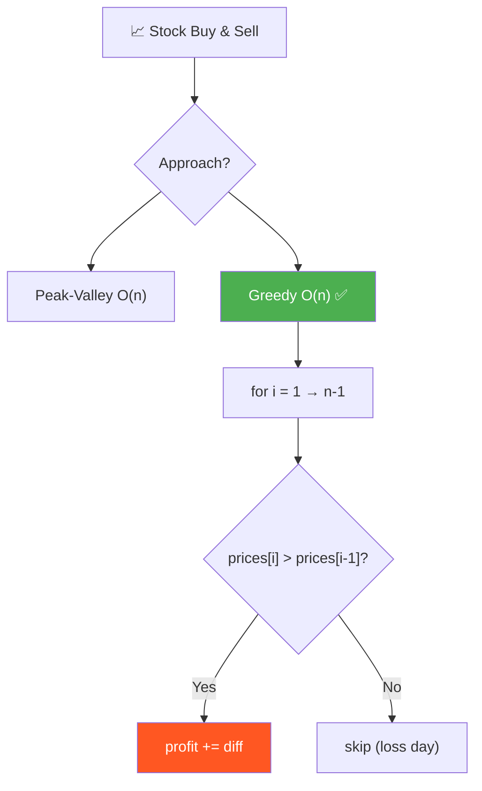
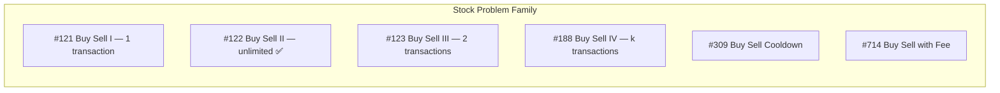
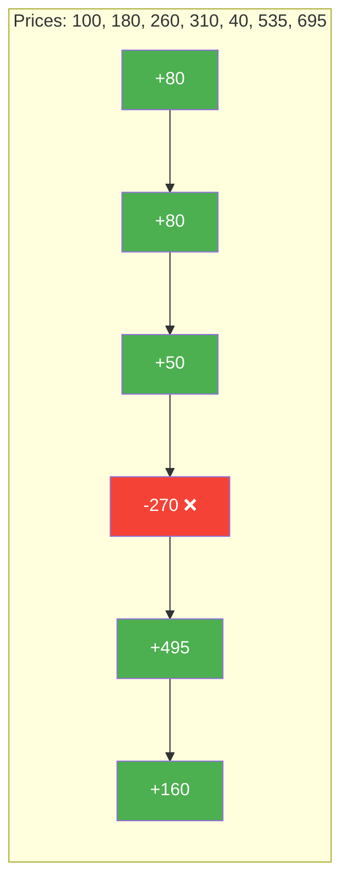
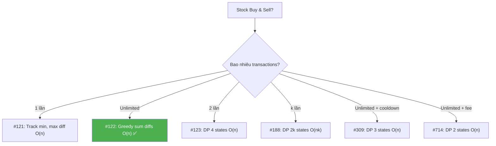

# 📈 Stock Buy and Sell — Multiple Transactions — GfG (Easy) / LeetCode #122

> 📖 Code: [Stock Buy and Sell.js](./Stock%20Buy%20and%20Sell.js)





---

## R — Repeat & Clarify

🧠 _"Cộng TẤT CẢ ngày tăng giá liên tiếp! prices[i] > prices[i-1] → profit += diff. O(n)!"_

> 🎙️ _"Given stock prices for each day, find maximum profit with unlimited buy/sell transactions. Cannot hold multiple stocks simultaneously."_

### Clarification Questions

```
Q: Được mua bán bao nhiêu lần?
A: UNLIMITED! Bao nhiêu lần cũng được.

Q: Có thể mua và bán CÙNG NGÀY?
A: Có! Bán rồi mua lại cùng ngày OK.

Q: Phải bán trước khi mua mới?
A: Đúng! Chỉ hold TỐI ĐA 1 stock tại 1 thời điểm.

Q: Giá có thể = 0?
A: Có thể. Giá ≥ 0.

Q: Mảng rỗng hoặc 1 phần tử?
A: Không thể có transaction → profit = 0.
```

### Tại sao bài này quan trọng?

```
  Bài này là BẢN LỀ trong "Stock Problem Family":

  ┌──────────────────────────────────────────────────────────────┐
  │  #121 — 1 transaction:      Track min price, max diff       │
  │  #122 — Unlimited (BÀI NÀY): Sum positive diffs → GREEDY   │
  │  #123 — 2 transactions:     DP 4 states                     │
  │  #188 — k transactions:     DP k×2 states                   │
  │  #309 — Cooldown:           DP + state machine              │
  │  #714 — Transaction fee:    DP + fee adjustment             │
  │                                                              │
  │  📌 #122 dạy GREEDY insight CỐT LÕI:                       │
  │  "Mua ở VALLEY, bán ở PEAK = Cộng tất cả ngày tăng giá!"  │
  │  → Hiểu insight này → giải được #309, #714 dễ hơn!         │
  └──────────────────────────────────────────────────────────────┘
```

---

## 🧠 Bản chất bài toán — Hiểu để NHỚ, không chỉ để GIẢI

### Đồ thị giá = Chuỗi NÚI

```
  prices = [100, 180, 260, 310, 40, 535, 695]

  695 ─ ─ ─ ─ ─ ─ ─ ─ ─ ─ ─ ─ ─ ─ ─ ─ ─ ─ ─ ─ ─ ● Sell
  535 ─ ─ ─ ─ ─ ─ ─ ─ ─ ─ ─ ─ ─ ─ ─ ─ ─ ●      /
                                             |    /
  310 ─ ─ ─ ─ ─ ─ ● Sell                    |  /
  260 ─ ─ ─ ─ ─ ●  |                        |/
  180 ─ ─ ─ ─●   |  |                       /
  100 ─ ─ ● Buy |  |    40 ─ ─ ─ ─ ─ ─ ● Buy
           \   /  |         
            ↑      ↑
         +210    +655       Total = 865

  📌 MUA ở đáy (valley), BÁN ở đỉnh (peak)!
     → Transaction 1: Buy 100, Sell 310 → +210
     → Transaction 2: Buy 40, Sell 695 → +655
     → Total = 865
```

### KEY INSIGHT: "Cộng mọi ngày tăng giá" = "Mua đáy, bán đỉnh"

```
  🧠 Tại sao 2 cách cho cùng kết quả?

  Transaction lớn: Buy 100, Sell 310 = +210
  Chia nhỏ ra:
    Day 0→1: 180 - 100 = +80
    Day 1→2: 260 - 180 = +80
    Day 2→3: 310 - 260 = +50
    Tổng:    80 + 80 + 50 = 210 ← GIỐNG!

  📐 CHỨNG MINH:
    prices[3] - prices[0]
    = (prices[3] - prices[2]) + (prices[2] - prices[1]) + (prices[1] - prices[0])
    = Σ (prices[i] - prices[i-1])  cho i = 1 → 3

  → BÁN ở peak - MUA ở valley = TỔNG mọi daily gains giữa 2 điểm!
  → KHÔNG CẦN biết khi nào mua, khi nào bán!
  → CHỈ CẦN cộng TẤT CẢ ngày tăng giá!

  ┌──────────────────────────────────────────────────────────────┐
  │  💡 Telescoping Sum:                                         │
  │                                                              │
  │  peak - valley = Σ (prices[i+1] - prices[i])               │
  │                   i=valley → peak-1                          │
  │                                                              │
  │  → Cộng TẤT CẢ daily positive diffs = mua ở mọi valley,   │
  │    bán ở mọi peak!                                           │
  └──────────────────────────────────────────────────────────────┘
```



```
  Chỉ cộng ngày XANH (tăng giá):
  +80 + 80 + 50 + 495 + 160 = 865 ✅

  Bỏ qua ngày ĐỎ (giảm giá):
  -270 → KHÔNG mua ngày đó!
```

### Hai cách nhìn bài toán

```
  CÁCH 1: Peak-Valley — "Tìm đáy mua, tìm đỉnh bán"
  ┌──────────────────────────────────────────────────────────────┐
  │  while chưa hết mảng:                                        │
  │    1. Tìm VALLEY (local min): giá giảm → đi xuống           │
  │    2. Tìm PEAK (local max): giá tăng → đi lên               │
  │    3. profit += peak - valley                                 │
  │                                                              │
  │  → Trực quan! Giống cách trader thực tế nghĩ!               │
  │  → Nhưng code hơi DÀI (2 while lồng)                       │
  └──────────────────────────────────────────────────────────────┘

  CÁCH 2: Greedy — "Cộng tất cả ngày tăng giá"
  ┌──────────────────────────────────────────────────────────────┐
  │  for i = 1 → n-1:                                           │
  │    if prices[i] > prices[i-1]:                               │
  │       profit += prices[i] - prices[i-1]                     │
  │                                                              │
  │  → 3 DÒNG CODE! Cực kỳ ngắn gọn!                           │
  │  → Tương đương peak-valley (đã chứng minh!)                 │
  └──────────────────────────────────────────────────────────────┘

  📌 Interview: nêu Peak-Valley trước (trực quan),
     rồi optimize thành Greedy (ngắn gọn)!
```

---

## 🧭 Luồng Suy Nghĩ — Từ đọc đề đến solution

> 💡 Phần này dạy bạn **CÁCH TƯ DUY** để tự giải bài, không chỉ biết đáp án.

### Bước 1: Đọc đề → Gạch chân KEYWORDS

```
  Đề: "Buy and sell stock any number of times for max profit"

  Gạch chân:
    "any number of times"  → UNLIMITED transactions!
    "maximum profit"       → OPTIMIZATION problem
    "buy earlier, sell later" → buy day < sell day
    "cannot hold multiple"   → bán XONG mới được mua tiếp

  🧠 Tự hỏi: "Unlimited = greedy có thể hoạt động?"
    → Yes! Không có giới hạn → lấy TẤT CẢ profit khả dĩ!

  📌 Kỹ năng chuyển giao:
    "Unlimited transactions" → Greedy (lấy mọi gain)
    "At most k transactions" → DP (cần trade-off)
    "With cooldown/fee"      → DP + state machine
```

### Bước 2: Vẽ đồ thị bằng tay → Tìm PATTERN

```
  prices = [100, 180, 260, 310, 40, 535, 695]

  Vẽ đồ thị giá theo ngày:
    Day 0: 100  ↑
    Day 1: 180  ↑  tăng
    Day 2: 260  ↑  tăng
    Day 3: 310  ↓  PEAK! → BÁN ở đây
    Day 4: 40   ↑  VALLEY! → MUA ở đây
    Day 5: 535  ↑  tăng
    Day 6: 695     PEAK! → BÁN ở đây

  🧠 Quan sát:
    1. MUA ở valley (đáy), BÁN ở peak (đỉnh)
    2. Bỏ qua đoạn GIẢM (day 3→4: -270)
    3. Lấy TẤT CẢ đoạn TĂNG!
```

### Bước 3: Brute Force → "Thử tất cả khả năng"

```
  Brute force: thử TẤT CẢ cách mua bán → O(2ⁿ)!
    → Mỗi ngày: buy, sell, hoặc do nothing
    → Exponential → quá chậm!

  🧠 Tự hỏi: "Có cần thử tất cả không?"
    → Unlimited transactions → KHÔNG cần trade-off!
    → Mỗi ngày tăng giá = 1 cơ hội profit
    → Lấy HẾT! → GREEDY!
```

### Bước 4: "Chỉ cần cộng ngày tăng giá!" → Greedy

```
  💡 KEY INSIGHT:
    Nếu prices[i] > prices[i-1] → có PROFIT!
    → Cộng vào total!
    
    Nếu prices[i] ≤ prices[i-1] → LOSS hoặc flat
    → Bỏ qua! (không mua ngày lỗ)

  Tạ sao đúng? Telescoping sum:
    Peak - Valley = Σ daily gains (đã chứng minh ở trên!)
    → Cộng TẤT CẢ daily gains = tự động buy valley, sell peak!

  ✅ O(n) time, O(1) space — tối ưu nhất!

  📌 Kỹ năng chuyển giao:
    ┌──────────────────────────────────────────────────────────────┐
    │  Khi "unlimited" + optimization:                            │
    │    → GREEDY thường hoạt động!                               │
    │    → "Lấy TẤT CẢ cơ hội profit"                           │
    │                                                              │
    │  Khi "limited k" + optimization:                            │
    │    → Greedy KHÔNG đủ (cần trade-off giữa k lần)            │
    │    → Cần DP!                                                │
    │                                                              │
    │  Jump Game (#55):    "Can reach end?" → Greedy max reach   │
    │  Gas Station (#134): "Can complete circuit?" → Greedy      │
    │  Stock #122:         "Unlimited trades?" → Greedy sum      │
    └──────────────────────────────────────────────────────────────┘
```

### Bước 5: Tổng kết — Cây quyết định Stock problems



---

## E — Examples

### Ví dụ minh họa trực quan

```
VÍ DỤ 1: prices = [100, 180, 260, 310, 40, 535, 695]

  Daily diffs: +80, +80, +50, -270, +495, +160
  
  Cộng diffs DƯƠNG: 80 + 80 + 50 + 495 + 160 = 865 ✅

  Tương đương:
    Transaction 1: Buy@100, Sell@310 = +210 (= 80+80+50)
    Transaction 2: Buy@40,  Sell@695 = +655 (= 495+160)
    Total = 865
```

```
VÍ DỤ 2: prices = [4, 2]

  Daily diffs: -2
  
  Không có diff DƯƠNG → profit = 0 ✅
  🧠 Giá CHỈ GIẢM → không bao giờ nên mua!
```

```
VÍ DỤ 3: prices = [1, 2, 3, 4, 5]

  Daily diffs: +1, +1, +1, +1
  
  Tất cả DƯƠNG! Cộng hết: 1+1+1+1 = 4 ✅
  
  Tương đương: Buy@1, Sell@5 = +4
  🧠 Giá TĂNG LIÊN TỤC → 1 transaction duy nhất = sum all diffs!
```

```
VÍ DỤ 4: prices = [7, 1, 5, 3, 6, 4]

  Daily diffs: -6, +4, -2, +3, -2

  Diffs DƯƠNG: +4 + 3 = 7 ✅

  Tương đương:
    Transaction 1: Buy@1, Sell@5 = +4
    Transaction 2: Buy@3, Sell@6 = +3
    Total = 7
```

### Trace — Greedy: prices = [100, 180, 260, 310, 40, 535, 695]

```
  ┌──────────────────────────────────────────────────────────────────┐
  │ i=1: prices[1]=180 > prices[0]=100? YES! +80                   │
  │      profit = 80                                                 │
  │      🧠 "Hôm nay tăng 80 → lấy profit!"                       │
  ├──────────────────────────────────────────────────────────────────┤
  │ i=2: prices[2]=260 > prices[1]=180? YES! +80                   │
  │      profit = 160                                                │
  ├──────────────────────────────────────────────────────────────────┤
  │ i=3: prices[3]=310 > prices[2]=260? YES! +50                   │
  │      profit = 210                                                │
  ├──────────────────────────────────────────────────────────────────┤
  │ i=4: prices[4]=40 > prices[3]=310? NO! (giảm 270)             │
  │      profit = 210 (bỏ qua, KHÔNG mua ngày lỗ!)                │
  │      🧠 "Hôm nay GIẢM → skip! Đừng mua!"                      │
  ├──────────────────────────────────────────────────────────────────┤
  │ i=5: prices[5]=535 > prices[4]=40? YES! +495                   │
  │      profit = 705                                                │
  ├──────────────────────────────────────────────────────────────────┤
  │ i=6: prices[6]=695 > prices[5]=535? YES! +160                  │
  │      profit = 865                                                │
  └──────────────────────────────────────────────────────────────────┘

  → return 865 ✅
```

### Trace — Peak-Valley: prices = [7, 1, 5, 3, 6, 4]

```
  ┌──────────────────────────────────────────────────────────────────┐
  │ Pass 1: Find valley                                              │
  │   i=0: 7 >= 1? YES → i++                                        │
  │   i=1: 1 >= 5? NO → valley = prices[1] = 1                     │
  │                                                                  │
  │ Pass 1: Find peak                                                │
  │   i=1: 1 <= 5? YES → i++                                        │
  │   i=2: 5 <= 3? NO → peak = prices[2] = 5                       │
  │                                                                  │
  │ profit += 5 - 1 = 4     total = 4                               │
  ├──────────────────────────────────────────────────────────────────┤
  │ Pass 2: Find valley                                              │
  │   i=2: 5 >= 3? YES → i++                                        │
  │   i=3: 3 >= 6? NO → valley = prices[3] = 3                     │
  │                                                                  │
  │ Pass 2: Find peak                                                │
  │   i=3: 3 <= 6? YES → i++                                        │
  │   i=4: 6 <= 4? NO → peak = prices[4] = 6                       │
  │                                                                  │
  │ profit += 6 - 3 = 3     total = 7                               │
  ├──────────────────────────────────────────────────────────────────┤
  │ i=5: i = n-1 → exit loop                                        │
  └──────────────────────────────────────────────────────────────────┘

  → return 7 ✅
```

---

## A — Approach

### Approach 1: Peak-Valley — O(n)

```
  ┌──────────────────────────────────────────────────────────────┐
  │  while (i < n - 1):                                          │
  │    // Tìm VALLEY (đáy)                                      │
  │    while prices[i] >= prices[i+1]: i++                       │
  │    valley = prices[i]                                        │
  │                                                              │
  │    // Tìm PEAK (đỉnh)                                       │
  │    while prices[i] <= prices[i+1]: i++                       │
  │    peak = prices[i]                                          │
  │                                                              │
  │    profit += peak - valley                                   │
  │                                                              │
  │  Time: O(n)    Space: O(1)                                   │
  │  → Mỗi phần tử được duyệt TỐI ĐA 2 lần (1 lần tìm        │
  │    valley, 1 lần tìm peak)                                   │
  └──────────────────────────────────────────────────────────────┘
```

### Approach 2: Greedy Sum Diffs — O(n) ✅

```
  💡 KEY INSIGHT: peak - valley = Σ daily positive diffs!

  ┌──────────────────────────────────────────────────────────────┐
  │  for i = 1 → n-1:                                           │
  │    if prices[i] > prices[i-1]:                               │
  │       profit += prices[i] - prices[i-1]                     │
  │                                                              │
  │  Time: O(n)    Space: O(1)                                   │
  │  → 3 dòng logic! Ngắn nhất có thể!                          │
  └──────────────────────────────────────────────────────────────┘

  🧠 Tại sao bỏ qua ngày giảm giá?
    prices[i] ≤ prices[i-1] → diff ≤ 0
    → Cộng vào chỉ GIẢM profit!
    → Bỏ qua = "không giao dịch ngày đó!"
```

---

## C — Code

### Solution 1: Peak-Valley — O(n)

```javascript
function maxProfitPeakValley(prices) {
  const n = prices.length;
  if (n < 2) return 0;

  let totalProfit = 0;
  let i = 0;

  while (i < n - 1) {
    // Find valley
    while (i < n - 1 && prices[i] >= prices[i + 1]) i++;
    const valley = prices[i];

    // Find peak
    while (i < n - 1 && prices[i] <= prices[i + 1]) i++;
    const peak = prices[i];

    totalProfit += peak - valley;
  }

  return totalProfit;
}
```

```
  📝 Line-by-line:

  Line 3: if (n < 2) return 0
    → 0 hoặc 1 ngày → không thể mua BÁN → profit = 0

  Line 9: while (i < n - 1 && prices[i] >= prices[i + 1]) i++
    → Đi XUỐNG: giá giảm → tìm đáy (valley)
    → Dừng khi: giá BẮT ĐẦU TĂNG (prices[i] < prices[i+1])
    
    ⚠️ Tại sao >=? (chứ không phải >?)
       → prices[i] == prices[i+1] → flat → TIẾP TỤC tìm valley!
       → Mua ở ngày flat CUỐI CÙNG trước khi tăng → OK!

  Line 13: while (i < n - 1 && prices[i] <= prices[i + 1]) i++
    → Đi LÊN: giá tăng → tìm đỉnh (peak)
    → Dừng khi: giá BẮT ĐẦU GIẢM

  Line 16: totalProfit += peak - valley
    → 1 transaction: mua ở valley, bán ở peak!

  🧠 i KHÔNG reset sau mỗi transaction!
     → Tiếp tục từ peak hiện tại → tìm valley TIẾP!
     → Mỗi phần tử chỉ duyệt 1 lần → O(n)!
```

### Solution 2: Greedy — O(n) ✅

```javascript
function maxProfitGreedy(prices) {
  let totalProfit = 0;

  for (let i = 1; i < prices.length; i++) {
    if (prices[i] > prices[i - 1]) {
      totalProfit += prices[i] - prices[i - 1];
    }
  }

  return totalProfit;
}
```

```
  📝 Line-by-line:

  Line 4: for (let i = 1; i < prices.length; i++)
    → Bắt đầu từ 1 (cần prices[i-1])
    → Duyệt MỌI ngày, check daily change

  Line 5: if (prices[i] > prices[i - 1])
    → Giá TĂNG so với hôm qua?
    → YES → cộng chênh lệch vào profit!
    → NO → bỏ qua (không mua ngày lỗ)

    🧠 Tại sao > (strict) chứ không >=?
       → prices[i] == prices[i-1] → diff = 0 → cộng 0 → vô ích!
       → Bỏ qua cho sạch, nhưng cộng 0 cũng KHÔNG SAI

  Line 6: totalProfit += prices[i] - prices[i - 1]
    → "Lấy profit của ngày hôm nay"
    → Tương đương: mua hôm qua, bán hôm nay
    → Thực tế: telescoping sum tự động gộp thành valley→peak!
```

---

## ❌ Common Mistakes — Lỗi thường gặp

### Mistake 1: Nghĩ cần tìm global min và global max

```javascript
// ❌ SAI: mua ở MIN toàn cục, bán ở MAX toàn cục!
const profit = Math.max(...prices) - Math.min(...prices);

// Input: [1, 5, 2, 8]
// SAI: max - min = 8 - 1 = 7
// ĐÚNG: Buy@1 Sell@5 (+4), Buy@2 Sell@8 (+6) = 10!
// → Đa transaction > single transaction!

// ✅ ĐÚNG: cộng TẤT CẢ diffs dương!
```

### Mistake 2: Chỉ tìm 1 transaction (đây là bài #121!)

```javascript
// ❌ SAI: track min price, max profit (bài #121!)
let minPrice = Infinity;
let maxProfit = 0;
for (const price of prices) {
  minPrice = Math.min(minPrice, price);
  maxProfit = Math.max(maxProfit, price - minPrice);
}
// → Chỉ tìm 1 transaction tốt nhất!

// ✅ ĐÚNG: bài #122 = UNLIMITED → cộng tất cả diffs dương!
```

### Mistake 3: Peak-Valley — quên check bounds

```javascript
// ❌ SAI: thiếu i < n-1 check → index out of bounds!
while (prices[i] >= prices[i + 1]) i++; // i+1 = n!

// ✅ ĐÚNG: luôn check i < n-1 trước khi access i+1!
while (i < n - 1 && prices[i] >= prices[i + 1]) i++;
```

### Mistake 4: Greedy — cộng cả ngày giảm giá

```javascript
// ❌ SAI: cộng TẤT CẢ diffs (kể cả âm!)
for (let i = 1; i < n; i++) {
  totalProfit += prices[i] - prices[i - 1]; // ← kể cả khi âm!
}

// ✅ ĐÚNG: CHỈ cộng diffs DƯƠNG!
for (let i = 1; i < n; i++) {
  if (prices[i] > prices[i - 1]) { // check trước!
    totalProfit += prices[i] - prices[i - 1];
  }
}

// Hoặc dùng Math.max:
totalProfit += Math.max(0, prices[i] - prices[i - 1]);
```

---

## O — Optimize

```
                      Time       Space     Ghi chú
  ─────────────────────────────────────────────────────────────
  Brute Force         O(2ⁿ)      O(n)      Thử tất cả cách
  Peak-Valley         O(n)       O(1)      Trực quan
  Greedy ✅           O(n)       O(1)      3 dòng code!

  📌 KHÔNG thể tốt hơn O(n) (phải đọc mỗi giá ít nhất 1 lần!)
  📌 Peak-Valley và Greedy cho CÙNG KẾT QUẢ, cùng O(n)
     → Greedy ưu tiên vì code NGẮN hơn!
```

---

## T — Test

```
Test Cases:
  [100,180,260,310,40,535,695]  → 865   ✅ 2 transactions
  [4,2]                         → 0     ✅ Giá chỉ giảm
  [1,2,3,4,5]                   → 4     ✅ Tăng liên tục
  [5,4,3,2,1]                   → 0     ✅ Giảm liên tục
  [7,1,5,3,6,4]                 → 7     ✅ LeetCode example
  [1]                           → 0     ✅ 1 phần tử
  [3,3,3]                       → 0     ✅ Flat (giá không đổi)
  [1,2]                         → 1     ✅ Minimal transaction
```

### Edge Cases giải thích

```
  ┌──────────────────────────────────────────────────────────────┐
  │  Giá tăng liên tục:  [1,2,3,4,5] → 4                       │
  │    = 1 transaction lớn (Buy@1 Sell@5)                        │
  │    = sum diffs (1+1+1+1 = 4) → GIỐNG!                      │
  │                                                              │
  │  Giá giảm liên tục:  [5,4,3,2,1] → 0                       │
  │    Không có diff dương → KHÔNG mua!                          │
  │                                                              │
  │  Giá flat:            [3,3,3] → 0                            │
  │    Mọi diff = 0 → không profit!                              │
  │                                                              │
  │  Zigzag:             [1,5,2,8,3,7] → 4+6+4 = 14            │
  │    Mua ở mỗi VALLEY, bán ở mỗi PEAK!                       │
  └──────────────────────────────────────────────────────────────┘
```

---

## 🗣️ Interview Script

### 🎙️ Think Out Loud — Mô phỏng phỏng vấn thực

```
  ──────────────── PHASE 1: Clarify ────────────────

  👤 Interviewer: "Maximize profit buying/selling stock multiple times."

  🧑 You: "Let me clarify:
   1. Unlimited transactions — no limit on how many.
   2. Must sell before buying again — no overlapping holds.
   3. Can buy and sell same day — effectively a wash.
   4. Looking for MAXIMUM total profit."

  ──────────────── PHASE 2: Peak-Valley ────────────────

  🧑 You: "If I plot the prices, the optimal strategy is to buy at
   every local minimum (valley) and sell at every local maximum 
   (peak). I scan through, alternating between finding valleys
   and peaks, summing the differences.

   This is O(n) time, O(1) space."

  ──────────────── PHASE 3: Greedy Simplification ────────────────

  🧑 You: "Actually, I can simplify further. Buying at a valley
   and selling at a peak equals the sum of all consecutive daily
   gains between them — by the telescoping sum property.

   So I just iterate once, adding prices[i] - prices[i-1]
   whenever it's positive. Three lines of code, same O(n) time.

   This works because with unlimited transactions, every positive
   daily change represents a profit opportunity I should take."

  ──────────────── PHASE 4: Follow-ups ────────────────

  👤 Interviewer: "What if limited to at most k transactions?"

  🧑 You: "That's LeetCode #188. The greedy approach fails because
   we need to choose WHICH k transactions maximize profit. This
   requires DP with 2k states — hold/not-hold for each of k
   transactions. Time O(nk), space O(k)."
```

### Pattern & Liên kết

```
  STOCK PROBLEM pattern family:

  ┌──────────────────────────────────────────────────────────────┐
  │  #121 — 1 transaction: Track min, O(n)                      │
  │  #122 — Unlimited (BÀI NÀY): Sum diffs, O(n) ✅           │
  │  #123 — 2 transactions: DP, O(n)                            │
  │  #188 — k transactions: DP, O(nk)                           │
  │  #309 — Unlimited + cooldown: DP 3 states, O(n)            │
  │  #714 — Unlimited + fee: DP 2 states, O(n)                 │
  └──────────────────────────────────────────────────────────────┘

  📌 PROGRESSION:
    #121 → #122: 1→unlimited = GREEDY
    #122 → #309: thêm cooldown = DP state machine
    #122 → #714: thêm fee = DP (profit -= fee khi sell)
    #122 → #188: unlimited→k = DP 2k states
```

### Skeleton code — Greedy template

```javascript
// TEMPLATE: Stock Buy Sell — Unlimited Transactions
function maxProfit(prices) {
  let profit = 0;
  for (let i = 1; i < prices.length; i++) {
    // "Lấy TẤT CẢ cơ hội profit"
    profit += Math.max(0, prices[i] - prices[i - 1]);
  }
  return profit;
}

// Biến thể #714 (with fee):
//   profit += Math.max(0, prices[i] - prices[i-1] - fee);
//   ← SAI! Cần DP vì fee ảnh hưởng khi nào nên sell!
```
