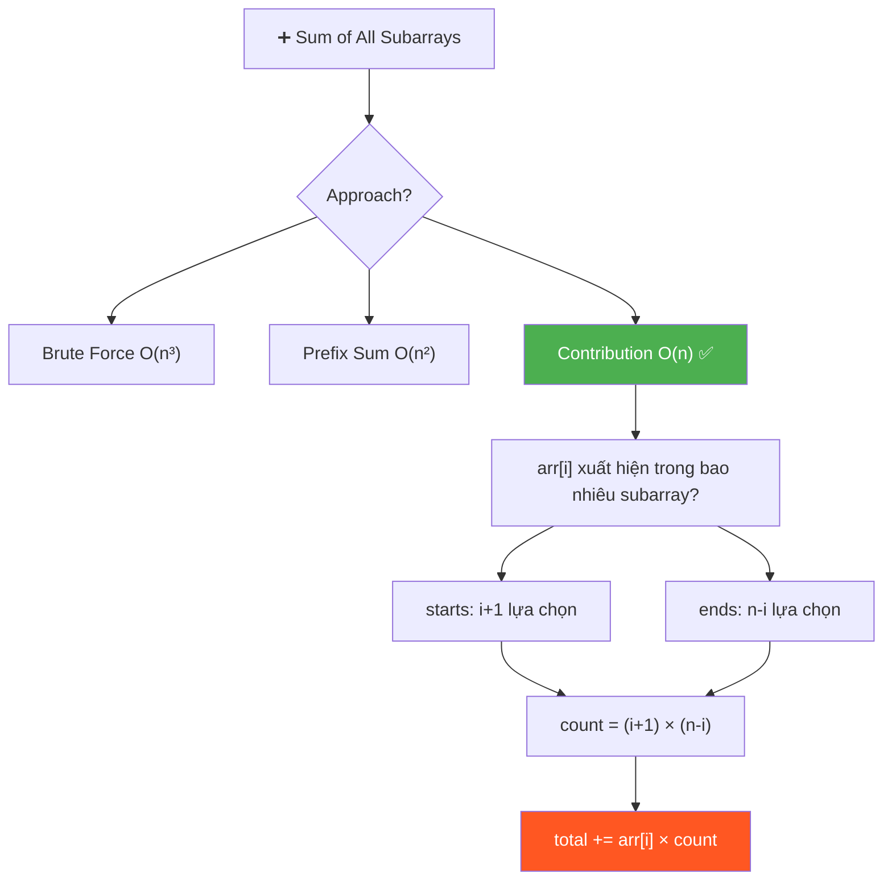
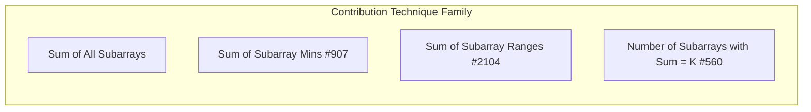
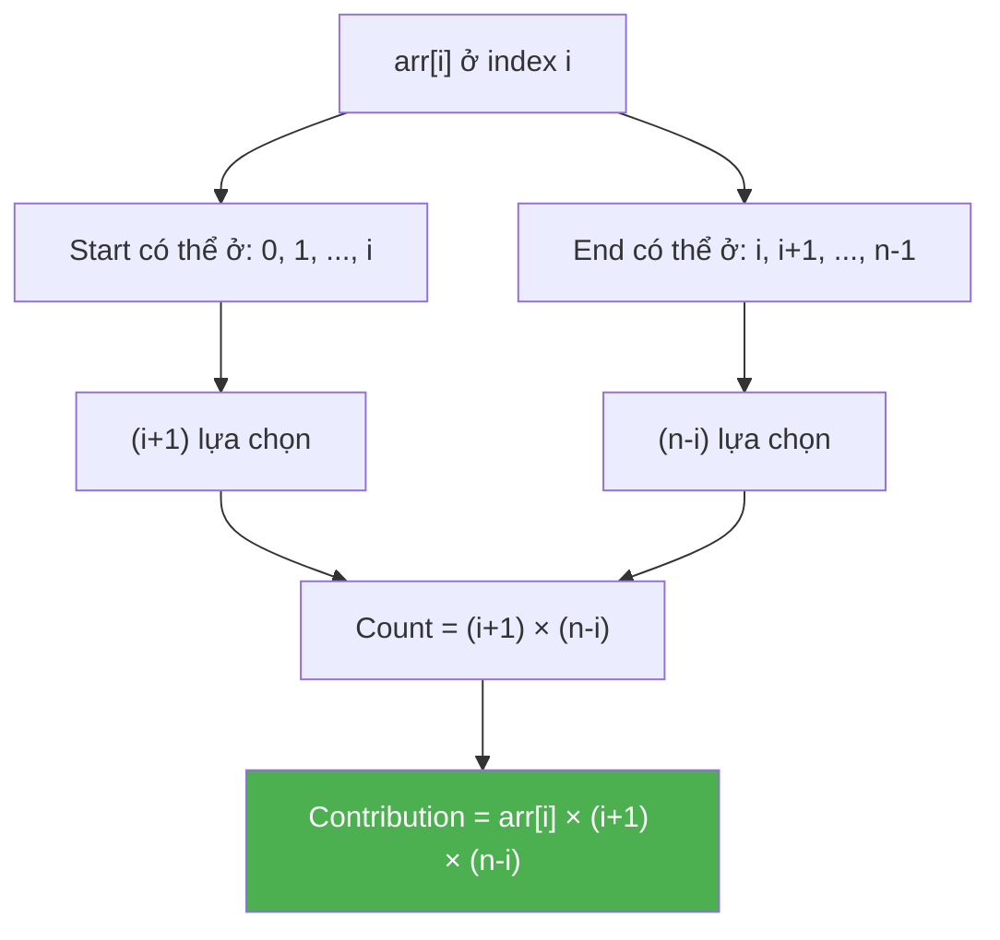
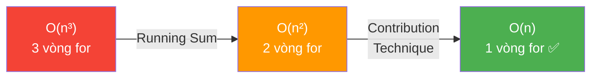

# ➕ Sum of All Subarrays — GfG (Easy)

> 📖 Code: [Sum of All Subarrays.js](./Sum%20of%20All%20Subarrays.js)





---

## R — Repeat & Clarify

🧠 _"Mỗi arr[i] xuất hiện trong (i+1)×(n-i) subarrays. Tổng = Σ arr[i]×(i+1)×(n-i). O(n)!"_

> 🎙️ _"Given an integer array arr[], compute the sum of all possible sub-arrays."_

### Clarification Questions

```
Q: "All possible sub-arrays" = subarrays LIÊN TIẾP?
A: Đúng! Subarray = contiguous subsequence. KHÔNG phải subset!

Q: Có tính subarray rỗng?
A: Không. Chỉ non-empty subarrays.

Q: Bao nhiêu subarrays trong mảng n phần tử?
A: n(n+1)/2. Ví dụ n=4 → 10 subarrays.

Q: arr[i] có thể âm?
A: Có thể! Nhưng ĐỀ BÀI cho positive → result luôn dương.

Q: Overflow?
A: Với n lớn, sum có thể rất lớn → dùng BigInt hoặc modulo.
```

### Tại sao bài này quan trọng?

```
  Bài này dạy CONTRIBUTION TECHNIQUE — một trong những kỹ thuật
  MẠNH NHẤT để tối ưu từ O(n²) → O(n)!

  ┌──────────────────────────────────────────────────────────────┐
  │  CONTRIBUTION TECHNIQUE:                                      │
  │    Thay vì tính "tổng mỗi subarray rồi cộng"               │
  │    → Tính "mỗi phần tử ĐÓNG GÓP bao nhiêu vào tổng"       │
  │                                                              │
  │  ĐẢO NGƯỢC góc nhìn:                                        │
  │    ❌ For each SUBARRAY → sum its elements                   │
  │    ✅ For each ELEMENT → count how many subarrays contain it │
  │                                                              │
  │  Áp dụng cho: Sum of Subarrays, Sum of Mins, Sum of Ranges, │
  │  counting problems, expected value calculations...           │
  └──────────────────────────────────────────────────────────────┘
```

---

## 🧠 Bản chất bài toán — Hiểu để NHỚ, không chỉ để GIẢI

### Đếm: arr[i] xuất hiện trong bao nhiêu subarrays?

```
  arr = [1, 4, 5, 3, 2]    (n = 5)
         0  1  2  3  4

  Xét arr[2] = 5 (index 2):
    Subarray PHẢI chứa index 2.
    → Start có thể ở: 0, 1, 2        → (i+1) = 3 lựa chọn
    → End có thể ở:   2, 3, 4        → (n-i) = 3 lựa chọn

    Tổng: 3 × 3 = 9 subarrays chứa arr[2]=5

  Liệt kê kiểm tra:
    [5]         start=2, end=2
    [5,3]       start=2, end=3
    [5,3,2]     start=2, end=4
    [4,5]       start=1, end=2
    [4,5,3]     start=1, end=3
    [4,5,3,2]   start=1, end=4
    [1,4,5]     start=0, end=2
    [1,4,5,3]   start=0, end=3
    [1,4,5,3,2] start=0, end=4
    → Đúng 9 subarrays! ✅
```



### Công thức CONTRIBUTION — Chứng minh

```
  📐 CHỨNG MINH: arr[i] xuất hiện trong (i+1) × (n-i) subarrays

  Subarray = arr[start..end] với 0 ≤ start ≤ end ≤ n-1

  Subarray CHỨA index i khi và chỉ khi:
    start ≤ i ≤ end

  → start ∈ {0, 1, 2, ..., i}       → (i+1) giá trị
  → end   ∈ {i, i+1, i+2, ..., n-1} → (n-i) giá trị

  Mỗi cặp (start, end) cho 1 subarray DUY NHẤT
  → Tổng subarrays chứa i = (i+1) × (n-i)

  📐 TỔNG CONTRIBUTION:
    Total = Σᵢ arr[i] × (i+1) × (n-i)    cho i = 0 → n-1

  📐 KIỂM TRA: tổng số lần xuất hiện = tổng subarrays × trung bình?
    Σᵢ (i+1)(n-i) = Σᵢ (i+1)(n-i)
    
    Ví dụ n=3:
      i=0: 1×3 = 3
      i=1: 2×2 = 4
      i=2: 3×1 = 3
      Tổng: 10

    Tổng subarrays n=3: n(n+1)/2 = 6
    Mỗi subarray có trung bình (n+1)/3 ≈ 1.67 phần tử
    Tổng phần tử = 6 × 1.67 = 10 ✅
```

### Ví dụ TÍNH TOÁN ĐẦY ĐỦ

```
  arr = [1, 4, 5, 3, 2]    n = 5

  ┌─────────┬────────┬─────────┬─────────┬──────────────────────┐
  │  i      │ arr[i] │ (i+1)   │ (n-i)   │ Contribution         │
  ├─────────┼────────┼─────────┼─────────┼──────────────────────┤
  │  0      │ 1      │ 1       │ 5       │ 1 × 1 × 5 = 5       │
  │  1      │ 4      │ 2       │ 4       │ 4 × 2 × 4 = 32      │
  │  2      │ 5      │ 3       │ 3       │ 5 × 3 × 3 = 45      │
  │  3      │ 3      │ 4       │ 2       │ 3 × 4 × 2 = 24      │
  │  4      │ 2      │ 5       │ 1       │ 2 × 5 × 1 = 10      │
  ├─────────┼────────┼─────────┼─────────┼──────────────────────┤
  │  TOTAL  │        │         │         │ 5+32+45+24+10 = 116  │
  └─────────┴────────┴─────────┴─────────┴──────────────────────┘

  → 116 ✅ (khớp expected output!)

  🧠 Nhận xét: phần tử Ở GIỮA có count LỚN NHẤT!
     i=2: count = 3×3 = 9  ← PEAK
     i=0: count = 1×5 = 5  ← nhỏ
     i=4: count = 5×1 = 5  ← nhỏ

  📌 Phần tử GIỮA MẢNG đóng góp NHIỀU NHẤT vào tổng!
     → Hình parabol: count = (i+1)(n-i) đạt max tại i = (n-1)/2
```

---

## 🧭 Luồng Suy Nghĩ — Từ đọc đề đến solution

> 💡 Phần này dạy bạn **CÁCH TƯ DUY** để tự giải bài, không chỉ biết đáp án.

### Bước 1: Đọc đề → Gạch chân KEYWORDS

```
  Đề bài: "Compute the sum of all possible sub-arrays"

  Gạch chân:
    "sum"              → TÍNH TỔNG (không phải tìm, đếm)
    "all possible"     → TẤT CẢ subarrays → n(n+1)/2 cái
    "sub-arrays"       → LIÊN TIẾP (contiguous)

  🧠 Tự hỏi: "Brute force bao nhiêu subarrays?"
    → n(n+1)/2 ≈ O(n²) subarrays
    → Mỗi subarray cần O(n) để sum
    → Brute force: O(n³)!
    → "Quá chậm! Có pattern nào?"

  📌 Kỹ năng chuyển giao:
    Khi thấy "sum/count of ALL subarrays":
    → ĐỪNG generate từng subarray!
    → HỎI: "Mỗi phần tử đóng góp bao nhiêu?"
    → Contribution Technique!
```

### Bước 2: Brute Force → "3 vòng for"

```
  Brute force: generate TẤT CẢ subarrays, tính sum mỗi cái

  for start = 0 → n-1:           ← chọn start
    for end = start → n-1:       ← chọn end
      for k = start → end:       ← tính sum
        total += arr[k]

  Time: O(n³)   Space: O(1)

  🧠 Tự hỏi: "Bỏ vòng for TRONG CÙNG được không?"
```

### Bước 3: Optimize 1 — "Bỏ vòng for thứ 3"

```
  Vòng for k tính sum arr[start..end] TỪNG LẦN!
  Nhưng arr[start..end] = arr[start..end-1] + arr[end]!

  → Tích lũy sum thay vì tính lại:

  for i = 0 → n-1:
    subarraySum = 0
    for j = i → n-1:
      subarraySum += arr[j]   ← MỞ RỘNG subarray thêm 1!
      total += subarraySum

  Time: O(n²)   Space: O(1)

  📌 Kỹ năng chuyển giao:
    "Tính lại từ đầu mỗi lần" → "Tích lũy kết quả trước đó"
    → Running Sum / Prefix Sum technique
    → O(n³) → O(n²) nhờ bỏ 1 vòng for!
```

### Bước 4: Optimize 2 — "Đảo ngược góc nhìn"

```
  🧠 CÂU HỎI QUAN TRỌNG: "Thay vì duyệt từng SUBARRAY,
     có thể duyệt từng PHẦN TỬ không?"

  ❌ Góc nhìn CŨ: cho mỗi subarray → cộng các phần tử
  ✅ Góc nhìn MỚI: cho mỗi phần tử → đếm nó thuộc bao nhiêu subarrays

  💡 INSIGHT: arr[i] xuất hiện trong BAO NHIÊU subarray?
    → Start ∈ {0, 1, ..., i}         → (i+1) lựa chọn
    → End   ∈ {i, i+1, ..., n-1}     → (n-i) lựa chọn
    → Count = (i+1) × (n-i) subarrays!

  → total = Σ arr[i] × (i+1) × (n-i)
  → CHỈ CẦN 1 VÒNG FOR! O(n)!

  📌 Kỹ năng chuyển giao:
    ┌──────────────────────────────────────────────────────────────┐
    │  CONTRIBUTION TECHNIQUE:                                     │
    │    "Thay vì tính KẾT QUẢ cho mỗi nhóm,                    │
    │     tính ĐÓNG GÓP của mỗi phần tử vào kết quả!"           │
    │                                                              │
    │  Áp dụng khi:                                                │
    │  • Sum of all subarrays → arr[i] × (i+1)(n-i)              │
    │  • Sum of all subarray MINS (#907) → Monotonic Stack        │
    │  • Sum of all subarray RANGES (#2104)                       │
    │  • Count of all pairs/triples                                │
    │  • Expected value trong probability                          │
    └──────────────────────────────────────────────────────────────┘
```

### Bước 5: Tổng kết — Pipeline O(n³) → O(n²) → O(n)



```
  ⭐ QUY TẮC VÀNG:
    "Sum/Count of ALL subarrays" → Contribution Technique!
    "Thay vì duyệt N² subarrays → duyệt N phần tử!"
    "Hỏi: mỗi phần tử ĐÓNG GÓP bao nhiêu?"
```

---

## E — Examples

### Ví dụ minh họa trực quan

```
VÍ DỤ 1: arr = [1, 2, 3]    n = 3

  Liệt kê TẤT CẢ n(n+1)/2 = 6 subarrays:
    [1]       = 1
    [1,2]     = 3
    [1,2,3]   = 6
    [2]       = 2
    [2,3]     = 5
    [3]       = 3
    ─────────────
    Total     = 20

  Kiểm tra Contribution:
    arr[0]=1: 1 × (0+1)(3-0) = 1 × 1 × 3 = 3
    arr[1]=2: 2 × (1+1)(3-1) = 2 × 2 × 2 = 8
    arr[2]=3: 3 × (2+1)(3-2) = 3 × 3 × 1 = 9
    Total = 3 + 8 + 9 = 20 ✅

  🧠 Kiểm tra arr[1]=2 xuất hiện trong 4 subarrays:
     [2], [1,2], [2,3], [1,2,3] → đúng 4 = 2×2 ✅
```

```
VÍ DỤ 2: arr = [1, 4, 5, 3, 2]    n = 5

  Contribution table:
    i=0: 1 × 1 × 5 = 5     ← đầu mảng, count nhỏ
    i=1: 4 × 2 × 4 = 32
    i=2: 5 × 3 × 3 = 45    ← GIỮA mảng, count LỚN NHẤT!
    i=3: 3 × 4 × 2 = 24
    i=4: 2 × 5 × 1 = 10    ← cuối mảng, count nhỏ
    ─────────────────────
    Total = 116 ✅
```

```
VÍ DỤ 3: arr = [1, 2, 3, 4]    n = 4

  Contribution:
    1 × 1 × 4 = 4
    2 × 2 × 3 = 12
    3 × 3 × 2 = 18
    4 × 4 × 1 = 16
    ─────────────
    Total = 50 ✅
```

---

## A — Approach

### Approach 1: Brute Force — O(n³)

```
  3 vòng for: chọn start, chọn end, tính sum

  ┌──────────────────────────────────────────────────────────────┐
  │  for i = 0 → n-1:           // chọn start                   │
  │    for j = i → n-1:         // chọn end                     │
  │      for k = i → j:         // tính sum arr[i..j]           │
  │        total += arr[k]                                       │
  │                                                              │
  │  Time: O(n³)    Space: O(1)                                  │
  │  → Quá chậm cho n > 1000!                                   │
  └──────────────────────────────────────────────────────────────┘
```

### Approach 2: Running Sum — O(n²)

```
  💡 Bỏ vòng for thứ 3 bằng running sum!

  ┌──────────────────────────────────────────────────────────────┐
  │  for i = 0 → n-1:                                           │
  │    subarraySum = 0                                           │
  │    for j = i → n-1:                                         │
  │      subarraySum += arr[j]  // mở rộng subarray thêm 1     │
  │      total += subarraySum   // cộng sum subarray hiện tại   │
  │                                                              │
  │  Time: O(n²)    Space: O(1)                                  │
  │  → Tốt hơn 3× so với O(n³), nhưng vẫn chậm!               │
  └──────────────────────────────────────────────────────────────┘

  🧠 Tại sao đúng?
    j=i:   subarraySum = arr[i]           → sum [i..i]
    j=i+1: subarraySum = arr[i]+arr[i+1]  → sum [i..i+1]
    j=i+2: subarraySum += arr[i+2]        → sum [i..i+2]
    → TÍCH LŨY thay vì tính lại!
```

### Approach 3: Contribution Technique — O(n) ✅

```
  💡 KEY INSIGHT: Đếm arr[i] xuất hiện trong bao nhiêu subarrays!

  ┌──────────────────────────────────────────────────────────────┐
  │  total = 0                                                    │
  │  for i = 0 → n-1:                                           │
  │    count = (i + 1) × (n - i)                                │
  │    total += arr[i] × count                                   │
  │                                                              │
  │  Time: O(n)    Space: O(1)                                   │
  │  → TỐI ƯU NHẤT! Không thể tốt hơn!                        │
  └──────────────────────────────────────────────────────────────┘

  🧠 count = (i+1)(n-i) vì:
    Start ∈ {0, 1, ..., i}         → (i+1) lựa chọn
    End   ∈ {i, i+1, ..., n-1}     → (n-i) lựa chọn
    → Mỗi cặp (start, end) = 1 subarray duy nhất chứa i
```

---

## C — Code

### Solution 1: Brute Force — O(n³)

```javascript
function sumSubarraysBrute(arr) {
  const n = arr.length;
  let total = 0;

  for (let i = 0; i < n; i++) {
    for (let j = i; j < n; j++) {
      for (let k = i; k <= j; k++) {
        total += arr[k];
      }
    }
  }

  return total;
}
```

### Solution 2: Running Sum — O(n²)

```javascript
function sumSubarraysPrefix(arr) {
  const n = arr.length;
  let total = 0;

  for (let i = 0; i < n; i++) {
    let subarraySum = 0;
    for (let j = i; j < n; j++) {
      subarraySum += arr[j];
      total += subarraySum;
    }
  }

  return total;
}
```

```
  📝 Line-by-line:

  Line 5: let subarraySum = 0
    → Reset cho mỗi start i MỚI!
    → ⚠️ Nếu đặt NGOÀI vòng for i → SAI! (tích lũy qua các start)

  Line 7: subarraySum += arr[j]
    → MỞ RỘNG subarray arr[i..j] thêm arr[j]
    → KHÔNG tính lại từ đầu → tiết kiệm 1 vòng for!

  Line 8: total += subarraySum
    → Cộng sum của subarray arr[i..j] vào tổng
    → Mỗi subarraySum = sum của 1 subarray cụ thể
```

### Solution 3: Contribution — O(n) ✅

```javascript
function sumSubarraysContribution(arr) {
  const n = arr.length;
  let total = 0;

  for (let i = 0; i < n; i++) {
    total += arr[i] * (i + 1) * (n - i);
  }

  return total;
}
```

```
  📝 Line-by-line:

  Line 6: total += arr[i] * (i + 1) * (n - i)
    → arr[i]: GIÁ TRỊ phần tử
    → (i + 1): số lựa chọn START (0, 1, ..., i)
    → (n - i): số lựa chọn END (i, i+1, ..., n-1)
    → Tích 3 số = TỔNG ĐÓNG GÓP của arr[i]

    ⚠️ Tại sao (i+1) mà không phải i?
       → i lựa chọn = {0, 1, ..., i} = (i+1) phần tử!
       → Gồm CẢ index 0 (start = 0)!

    ⚠️ Overflow: arr[i] × (i+1) × (n-i) có thể lớn!
       → JS: Number.MAX_SAFE_INTEGER = 2⁵³ - 1 ≈ 9 × 10¹⁵
       → Nếu n = 10⁵, arr[i] = 10⁹: 10⁹ × 10⁵ × 10⁵ = 10¹⁹ > 2⁵³!
       → Dùng BigInt hoặc modulo 10⁹+7!
```

### Trace — Contribution: arr = [1, 4, 5, 3, 2]

```
  n = 5

  i=0: arr[0]=1  count = (0+1)×(5-0) = 1×5 = 5
       contribution = 1 × 5 = 5       total = 5

  i=1: arr[1]=4  count = (1+1)×(5-1) = 2×4 = 8
       contribution = 4 × 8 = 32      total = 37

  i=2: arr[2]=5  count = (2+1)×(5-2) = 3×3 = 9
       contribution = 5 × 9 = 45      total = 82

  i=3: arr[3]=3  count = (3+1)×(5-3) = 4×2 = 8
       contribution = 3 × 8 = 24      total = 106

  i=4: arr[4]=2  count = (4+1)×(5-4) = 5×1 = 5
       contribution = 2 × 5 = 10      total = 116

  → return 116 ✅
```

> 🎙️ _"Instead of iterating over all O(n²) subarrays, I calculate each element's contribution. Element at index i appears in exactly (i+1)×(n-i) subarrays, so I multiply its value by this count. Single pass, O(n) time, O(1) space."_

---

## ❌ Common Mistakes — Lỗi thường gặp

### Mistake 1: Nhầm (i+1) vs i

```javascript
// ❌ SAI: dùng i thay vì (i+1)!
total += arr[i] * i * (n - i);
// i=0: arr[0] × 0 × 5 = 0 ← BỎ SÓT arr[0]!

// ✅ ĐÚNG: start ∈ {0,...,i} = (i+1) giá trị!
total += arr[i] * (i + 1) * (n - i);
```

### Mistake 2: Running Sum — không reset

```javascript
// ❌ SAI: subarraySum tích lũy QUA CÁC start!
let subarraySum = 0; // ← NGOÀI vòng for i!
for (let i = 0; i < n; i++) {
  for (let j = i; j < n; j++) {
    subarraySum += arr[j]; // ← KHÔNG reset!
  }
}

// ✅ ĐÚNG: reset MỖI start i!
for (let i = 0; i < n; i++) {
  let subarraySum = 0; // ← TRONG vòng for i!
  for (let j = i; j < n; j++) {
    subarraySum += arr[j];
    total += subarraySum;
  }
}
```

### Mistake 3: Quên cộng vào total trong O(n²)

```javascript
// ❌ SAI: chỉ tính subarraySum, quên cộng vào total!
for (let j = i; j < n; j++) {
  subarraySum += arr[j];
}
total += subarraySum; // ← CHỈ cộng subarray CUỐI CÙNG!

// ✅ ĐÚNG: cộng MỖI subarray!
for (let j = i; j < n; j++) {
  subarraySum += arr[j];
  total += subarraySum; // ← cộng TỪNG subarray!
}
```

---

## O — Optimize

```
                      Time       Space     Ghi chú
  ─────────────────────────────────────────────────────────────
  Brute Force         O(n³)      O(1)      3 vòng for
  Running Sum         O(n²)      O(1)      Bỏ 1 vòng for
  Contribution ✅     O(n)       O(1)      Đảo ngược góc nhìn!

  📌 O(n) là LOWER BOUND (phải đọc mỗi phần tử ít nhất 1 lần)
     → Contribution Technique = TỐI ƯU TUYỆT ĐỐI!
```

---

## T — Test

```
Test Cases:
  [1,4,5,3,2]  → 116   ✅ Example 1
  [1,2,3,4]    → 50    ✅ Example 2
  [1]          → 1     ✅ Single element
  [1,2]        → 6     ✅ [1]+[2]+[1,2] = 1+2+3
  [1,2,3]      → 20    ✅ 6 subarrays
  [5,5,5]      → 50    ✅ Tất cả giống nhau
```

---

## 🗣️ Interview Script

### 🎙️ Think Out Loud — Mô phỏng phỏng vấn thực

> ⚠️ Script này dạy cách **NÓI**, không phải cách CODE.
> Mỗi đoạn = cách bạn **PHÁT BIỂU** trong phỏng vấn thực!

```
  ╔══════════════════════════════════════════════════════════════╗
  ║  🕐 FULL INTERVIEW SIMULATION — 1h30 (90 phút)             ║
  ║                                                              ║
  ║  00:00-05:00  Introduction + Icebreaker         (5 min)     ║
  ║  05:00-45:00  Problem Solving                   (40 min)    ║
  ║  45:00-60:00  Deep Technical Probing            (15 min)    ║
  ║  60:00-75:00  Variations + Extensions           (15 min)    ║
  ║  75:00-85:00  System Design at Scale            (10 min)    ║
  ║  85:00-90:00  Behavioral + Q&A                  (5 min)     ║
  ╚══════════════════════════════════════════════════════════════╝
```

```
  ╔══════════════════════════════════════════════════════════════╗
  ║  PART 1: INTRODUCTION (00:00 — 05:00)                       ║
  ╚══════════════════════════════════════════════════════════════╝

  👤 "Tell me about yourself and a time you optimized
      an aggregation operation."

  🧑 "I'm a frontend engineer with [X] years of experience.
      A relevant example: I built an analytics dashboard
      that computed rolling averages for every possible
      time window — 1 day, 2 days, up to N days.

      Initially the backend computed each window's average
      separately — O of N squared windows, each needing
      O of N to sum. Total: O of N cubed.

      I realized instead of asking 'what's the sum
      of each window,' I could ask 'how many windows
      contain each data point?' A data point at position i
      appears in (i+1) times (N-i) windows.

      I multiplied each value by its count.
      Single pass, O of N. The dashboard loaded
      10x faster.

      That's exactly the contribution technique
      for Sum of All Subarrays."

  👤 "Great optimization story. Let's formalize."
```

```
  ╔══════════════════════════════════════════════════════════════╗
  ║  PART 2: PROBLEM SOLVING (05:00 — 45:00)                   ║
  ╚══════════════════════════════════════════════════════════════╝

  ──────────────── 05:00 — Clarify (3 phút) ────────────────

  👤 "Compute the sum of all possible subarrays."

  🧑 "Let me clarify.

      Subarrays are CONTIGUOUS subsequences.
      Not subsets, not subsequences — contiguous.

      For an array of size n, there are n times
      (n plus 1) divided by 2 non-empty subarrays.

      I need to compute the sum of all elements
      across ALL subarrays.

      Values can be negative.
      For large n, the result could overflow —
      I should mention using BigInt or modulo."

  ──────────────── 08:00 — Voting Booth Analogy (3 phút) ────────

  🧑 "I think of this as a VOTING BOOTH analogy.

      Imagine each subarray is an election.
      Each element 'votes' in every election it appears in.
      Its vote is its VALUE.

      Instead of running each election and counting votes,
      I ask: how many elections does each element
      participate in?

      Element at index i participates in ALL subarrays
      that START at or before i, and END at or after i.
      That's (i+1) start choices times (n-i) end choices.

      So element i casts its vote in (i+1) times (n-i)
      elections. Total votes equals value times count."

  ──────────────── 11:00 — Brute Force O(n³) (2 phút) ────────────

  🧑 "The brute force: three nested loops.

      Outer loop: start from 0 to n-1.
      Middle loop: end from start to n-1.
      Inner loop: compute sum from start to end.

      Total: O of n cubed.
      For n equals 10 to the 4: 10 to the 12 operations.
      Way too slow."

  ──────────────── 13:00 — Running Sum O(n²) (3 phút) ────────────

  🧑 "First optimization: running sum.

      I notice the inner loop recalculates the sum
      from scratch each time. But sum of arr[i..j]
      equals sum of arr[i..j-1] plus arr[j].

      I maintain a running sum and extend by one element:

      for each start i:
        subarraySum equals 0.
        for each end j from i to n-1:
          subarraySum plus-equals arr[j].
          total plus-equals subarraySum.

      This eliminates the inner loop. O of n squared.
      Better, but still quadratic."

  ──────────────── 16:00 — Contribution Technique O(n) (6 phút) ──

  🧑 "The key insight: FLIP THE PERSPECTIVE.

      Instead of iterating over subarrays and summing
      their elements, I iterate over ELEMENTS and
      count how many subarrays contain each.

      Element at index i appears in a subarray arr[s..e]
      if and only if s is at most i and e is at least i.

      Choices for s: 0, 1, 2, ..., i → that's (i+1).
      Choices for e: i, i+1, ..., n-1 → that's (n-i).

      Total subarrays containing index i:
      count equals (i+1) times (n-i).

      Element i's TOTAL CONTRIBUTION to the answer:
      arr[i] times (i+1) times (n-i).

      The final answer: sum over all i of
      arr[i] times (i+1) times (n-i).

      Let me trace with [1, 4, 5, 3, 2], n equals 5:

      i=0: 1 times 1 times 5 equals 5.
      i=1: 4 times 2 times 4 equals 32.
      i=2: 5 times 3 times 3 equals 45.
      i=3: 3 times 4 times 2 equals 24.
      i=4: 2 times 5 times 1 equals 10.

      Total: 5 + 32 + 45 + 24 + 10 = 116.

      Single pass. O of n. O of 1 space."

  ──────────────── 22:00 — Why (i+1) not i? (2 phút) ────────────

  👤 "Why (i+1) instead of i?"

  🧑 "Because the start positions are ZERO-INDEXED.

      Start can be at indices 0, 1, ..., i.
      That's i plus 1 positions (inclusive).

      If I used i instead of i+1:
      At i=0: count equals 0 times 5 equals 0.
      Element at index 0 would contribute NOTHING.
      But it appears in subarrays that start at 0!

      The plus-1 accounts for index 0 as a valid start."

  ──────────────── 24:00 — Parabolic Distribution (3 phút) ────────

  🧑 "An interesting property: the count
      (i+1) times (n-i) forms a PARABOLA.

      Elements in the MIDDLE of the array appear in
      the MOST subarrays. Elements at the EDGES
      appear in fewer.

      For n=5: counts are 5, 8, 9, 8, 5.
      Maximum at the center: i=2, count=9.

      The maximum count is at i equals (n-1) over 2,
      and equals approximately n squared over 4.

      This means: if you want to maximize the sum,
      put large values in the MIDDLE.
      If you want to minimize: put large values
      at the EDGES. This gives a greedy strategy
      for the 'rearrange for maximum sum' variant."

  ──────────────── 27:00 — Write Code (2 phút) ────────────────

  🧑 "The code.

      [Vừa viết vừa nói:]

      function sumAllSubarrays of arr.
      const n equals arr dot length.
      let total equals 0.

      for let i equals 0; i less than n; i++:
        total plus-equals arr[i] times (i+1) times (n-i).

      return total.

      Four lines of core logic. Each element is processed
      exactly once. One multiplication and one addition
      per iteration."

  ──────────────── 29:00 — Verify with brute force (3 phút) ────────

  🧑 "Let me verify with arr equals [1, 2, 3].

      Brute force: all 6 subarrays.
      [1]=1, [2]=2, [3]=3, [1,2]=3, [2,3]=5, [1,2,3]=6.
      Total: 1+2+3+3+5+6 = 20.

      Contribution:
      1 times 1 times 3 = 3.
      2 times 2 times 2 = 8.
      3 times 3 times 1 = 9.
      Total: 3+8+9 = 20. Matches!

      Let me double-check element 1 (index 0):
      It appears in [1], [1,2], [1,2,3] — 3 subarrays.
      Count: (0+1) times (3-0) = 1 times 3 = 3. Correct!"

  ──────────────── 32:00 — Edge Cases (3 phút) ────────────────

  🧑 "Edge cases.

      Single element [5]: count = 1 times 1 = 1.
      Total = 5. Correct — only one subarray.

      Two elements [1, 2]:
      Subarrays: [1]=1, [2]=2, [1,2]=3. Total=6.
      Contribution: 1 times 1 times 2 + 2 times 2 times 1
      = 2 + 4 = 6. Correct!

      All zeros [0, 0, 0]: total = 0. Correct.

      Negative values [-1, 2, -3]:
      Contribution: (-1)(1)(3) + 2(2)(2) + (-3)(3)(1)
      = -3 + 8 + (-9) = -4.
      Brute: [-1]=-1, [2]=2, [-3]=-3, [-1,2]=1,
      [2,-3]=-1, [-1,2,-3]=-2.
      Total: -1+2-3+1-1-2 = -4. Correct!"

  ──────────────── 35:00 — Complexity (3 phút) ────────────────

  🧑 "Time: O of n. Single pass. Each element does
      one multiplication and one addition.

      Space: O of 1. One accumulator variable.

      Is this optimal? Yes.
      I must read every element at least once.
      Omega of n is the lower bound.

      The optimization journey:
      O of n cubed: three loops.
      O of n squared: running sum eliminates inner loop.
      O of n: contribution technique eliminates both loops.

      Each step gained by changing PERSPECTIVE,
      not by adding data structures."

  ──────────────── 38:00 — Connection to expected value (3 phút) ──

  👤 "What's the expected value of a random subarray's sum?"

  🧑 "The expected value equals total sum divided by
      the number of subarrays.

      Number of subarrays: n(n+1)/2.
      Total sum: what we just computed.

      Expected value = Σ arr[i]×(i+1)×(n-i) / [n(n+1)/2].

      For a uniform random subarray, this gives
      the average subarray sum.

      This connects to probability theory:
      E[sum of random subarray] equals
      Σ arr[i] × P(element i is in subarray)
      where P(i) = (i+1)(n-i) / [n(n+1)/2].

      The contribution technique IS expected value
      computation — just without the denominator."
```

```
  ╔══════════════════════════════════════════════════════════════╗
  ║  PART 3: DEEP TECHNICAL PROBING (45:00 — 60:00)            ║
  ╚══════════════════════════════════════════════════════════════╝

  ──────────────── 45:00 — Formal proof (4 phút) ────────────────

  👤 "Can you prove the contribution formula rigorously?"

  🧑 "The total sum S equals the sum over all subarrays
      of the sum of elements in that subarray.

      S = Σ (over all pairs s,e where 0≤s≤e≤n-1)
          Σ (k from s to e) arr[k].

      I can swap the order of summation.
      For a fixed element arr[k], it appears in
      the inner sum whenever s is at most k and
      e is at least k.

      S = Σ (k=0 to n-1) arr[k] × |{(s,e) : s≤k, e≥k, s≤e}|.

      The count of valid (s,e) pairs for a fixed k:
      s ranges from 0 to k: (k+1) choices.
      e ranges from k to n-1: (n-k) choices.
      Each combination gives s≤k≤e, so s≤e automatically.

      Count = (k+1)(n-k).

      Therefore S = Σ arr[k] × (k+1) × (n-k). QED.

      The key step: swapping summation order.
      This is the fundamental technique behind
      contribution counting."

  ──────────────── 49:00 — Closed form for count sum (3 phút) ────

  👤 "What's the sum of all counts (i+1)(n-i)?"

  🧑 "The sum Σ (i+1)(n-i) from i=0 to n-1.

      Let j = i+1. Then j ranges from 1 to n.
      The sum becomes Σ j × (n-j+1) = Σ j(n+1-j)
      = (n+1)Σj - Σj² 
      = (n+1)n(n+1)/2 - n(n+1)(2n+1)/6
      = n(n+1)/6 × [3(n+1) - (2n+1)]
      = n(n+1)(n+2)/6.

      So the total appearance count is n(n+1)(n+2)/6.

      Cross-check: n=3 gives 3×4×5/6 = 10.
      Our example: counts 3, 4, 3. Sum = 10. Correct!

      This means on AVERAGE, each element appears
      in (n+2)/6 × (n+1) ≈ n/3 subarrays.
      Middle elements appear in more, edge elements less."

  ──────────────── 52:00 — Sum of Subarray Minimums (#907) (4 phút)

  👤 "What about sum of subarray minimums?"

  🧑 "LeetCode 907 — Sum of Subarray Minimums.
      For each subarray, take the minimum element,
      then sum all those minimums.

      The contribution technique still applies!
      For each element arr[i], I count how many
      subarrays have arr[i] as their minimum.

      But the count isn't a simple formula anymore.
      I need to find: how far LEFT can I extend
      before hitting something smaller?
      And how far RIGHT?

      This requires a MONOTONIC STACK to find
      the nearest smaller element on each side.

      left[i] = distance to previous smaller element.
      right[i] = distance to next smaller-or-equal element.
      count = left[i] × right[i].
      contribution = arr[i] × left[i] × right[i].

      O of n time with the stack.
      Same contribution principle, harder counting."

  ──────────────── 56:00 — Overflow considerations (4 phút) ────────

  👤 "What about integer overflow?"

  🧑 "For large arrays, overflow is a real concern.

      arr[i] can be up to 10 to the 9.
      (i+1) can be up to n, say 10 to the 5.
      (n-i) can be up to n, say 10 to the 5.

      Product: 10^9 × 10^5 × 10^5 = 10^19.
      JavaScript's MAX_SAFE_INTEGER is about 9 × 10^15.
      Overflow!

      Solutions:
      1. Use BigInt: handles arbitrary precision.
      2. Apply modulo 10^9+7: common in competitive programming.
      3. In languages with 64-bit integers (C++, Java):
         use long long, which handles up to ~9.2 × 10^18.

      If the problem asks for modulo, I'd compute
      (arr[i] % MOD × ((i+1)*(n-i)) % MOD) % MOD
      at each step."
```

```
  ╔══════════════════════════════════════════════════════════════╗
  ║  PART 4: VARIATIONS (60:00 — 75:00)                         ║
  ╚══════════════════════════════════════════════════════════════╝

  ──────────────── 60:00 — Sum of subarray products? (4 phút) ────

  👤 "What about sum of subarray PRODUCTS?"

  🧑 "Products don't distribute like sums.
      The contribution technique doesn't apply directly.

      Each element's contribution to a product
      depends on the OTHER elements in the subarray.
      I can't isolate each element's contribution.

      For this I'd use the O of n squared approach:
      maintain a running product per starting index.
      Or use logarithms to convert products to sums,
      but that introduces floating point errors.

      There's no known O of n solution for general
      sum of subarray products."

  ──────────────── 64:00 — Rearrange for max sum (3 phút) ────────

  👤 "If you could rearrange the array to maximize
      the sum of all subarrays, what would you do?"

  🧑 "Since the contribution of element at position i
      is value times (i+1) times (n-i), and the
      count (i+1)(n-i) is maximized at the CENTER:

      Put the LARGEST values at the center positions.
      Put the SMALLEST values at the edges.

      This is an assignment problem:
      Sort the counts (i+1)(n-i) in decreasing order.
      Sort the values in decreasing order.
      Pair the largest value with the largest count.

      By the rearrangement inequality, this pairing
      MAXIMIZES the dot product.

      O of n log n due to sorting."

  ──────────────── 67:00 — Sum of subarray XORs? (4 phút) ────────

  👤 "What about XOR instead of sum?"

  🧑 "XOR has a nice property:
      x XOR x equals 0. It cancels in pairs.

      For each BIT POSITION independently:
      if arr[i] has bit b set, it contributes to
      (i+1)(n-i) subarrays.
      The XOR of that bit across all subarrays:
      if the count is ODD, bit b is set in the answer.
      If even, it cancels out.

      So for each element, check if (i+1)(n-i) is odd.
      If yes, arr[i] contributes to the XOR sum.
      If no, it cancels.

      (i+1)(n-i) is odd only when BOTH (i+1) and (n-i)
      are odd. This gives a simple O of n solution."

  ──────────────── 71:00 — Sum of Subarray Ranges (#2104) (4 phút) ─

  👤 "How about sum of subarray ranges?"

  🧑 "LeetCode 2104. Range = max minus min.

      Sum of ranges = Sum of maxes minus Sum of mins.

      Each is a separate contribution problem:
      Sum of maxes: for each element, count subarrays
      where it's the maximum. Use monotonic stack
      to find nearest greater element on each side.

      Sum of mins: same, but find nearest smaller element.

      Two passes with monotonic stacks. O of n total.

      The contribution technique reduces a seemingly
      complex problem to two simpler counting problems."
```

```
  ╔══════════════════════════════════════════════════════════════╗
  ║  PART 5: SYSTEM DESIGN AT SCALE (75:00 — 85:00)            ║
  ╚══════════════════════════════════════════════════════════════╝

  ──────────────── 75:00 — Real-world applications (5 phút) ────────

  👤 "Where does the contribution technique appear
      in real systems?"

  🧑 "Several important domains!

      First — ANALYTICS AGGREGATION.
      Computing the total metric across all time windows.
      Instead of evaluating each window separately,
      count how many windows each data point affects.
      My dashboard example from the intro.

      Second — FEATURE ENGINEERING in ML.
      The 'sum of all subarrays' is a statistical feature
      that captures an element's positional importance.
      Center elements contribute more — this encodes
      locality and centrality information.

      Third — DATABASE WINDOW FUNCTIONS.
      SQL's SUM() OVER (ROWS BETWEEN ... AND ...)
      for all possible window sizes. The naive approach
      is O of N squared. The contribution technique
      gives O of N — faster query plans.

      Fourth — FINANCIAL RISK ANALYSIS.
      Computing VaR (Value at Risk) across all possible
      holding periods. Each daily return contributes to
      multiple holding period calculations.
      The contribution count tells us the weight of each day."

  ──────────────── 80:00 — Parallel processing (5 phút) ────────────

  👤 "Can this be parallelized?"

  🧑 "Perfectly! The contribution technique is
      EMBARRASSINGLY PARALLEL.

      Each element's contribution is INDEPENDENT.
      arr[i] times (i+1) times (n-i) depends only on i
      and n — no inter-element dependencies.

      I can split the array across P processors.
      Each computes the contribution of its elements.
      Then I sum the partial results.

      Time: O of n over P. Communication: O of P.
      Total speedup: nearly linear.

      In contrast, the running sum O of n squared approach
      has dependencies — subarraySum carries state
      from the previous iteration. Harder to parallelize.

      This is another advantage of the contribution
      technique: not just faster, but parallelizable."
```

```
  ╔══════════════════════════════════════════════════════════════╗
  ║  PART 6: BEHAVIORAL + Q&A (85:00 — 90:00)                  ║
  ╚══════════════════════════════════════════════════════════════╝

  ──────────────── 85:00 — Reflection (3 phút) ────────────────

  👤 "What would you take away from this problem?"

  🧑 "Three things.

      First, PERSPECTIVE SHIFTING.
      The breakthrough isn't a clever data structure.
      It's asking a DIFFERENT QUESTION:
      'How much does each element contribute?'
      instead of 'What's the sum of each subarray?'
      The same data, a different angle, O of n squared
      to O of n.

      Second, the CONTRIBUTION FORMULA
      (i+1) times (n-i) is a universal pattern.
      It counts 'intervals containing a point.'
      This appears everywhere: subarrays, substrings,
      time windows, database ranges.

      Third, ESCALATION is a story.
      O of n cubed → O of n squared → O of n.
      Each step shows a different technique:
      running sum, then perspective flip.
      Presenting this progression in an interview
      demonstrates structured thinking."

  ──────────────── 88:00 — Questions (2 phút) ────────────────

  👤 "Any questions for me?"

  🧑 "A few!

      First — the contribution technique produces
      embarrassingly parallel code. Does your data
      pipeline leverage this kind of element-wise
      independence for distributed aggregation?

      Second — the parabolic count distribution
      means center elements matter more. In your
      analytics, do you weight data points by their
      positional importance?

      Third — this generalizes to Sum of Subarray Mins
      with monotonic stacks. Does your team encounter
      these stack-based counting patterns in production,
      for example in log analysis or alerting?"

  👤 "Excellent! The perspective shift was the highlight —
      moving from subarray-centric to element-centric
      thinking. Your connection to expected value and
      the rearrangement inequality showed genuine
      mathematical depth. We'll be in touch!"
```

```
  ╔══════════════════════════════════════════════════════════════╗
  ║  ⭐ 8 MẸO NÓI CHUYỆN TRONG PHỎNG VẤN (Sum All Subarrays)║
  ╚══════════════════════════════════════════════════════════════╝

  📌 MẸO #1: Lead with the perspective flip
     ✅ "Instead of iterating over all subarrays,
         I iterate over elements and count how many
         subarrays each element appears in."

  📌 MẸO #2: State the formula clearly
     ✅ "Element at index i appears in exactly
         (i+1) times (n-i) subarrays.
         Its contribution: arr[i] × (i+1) × (n-i)."

  📌 MẸO #3: Explain (i+1) not i
     ✅ "Start can be 0, 1, ..., i — that's i+1 positions.
         Using i would miss index 0 as a valid start."

  📌 MẸO #4: Show the escalation
     ✅ "O of n cubed: three loops.
         O of n squared: running sum.
         O of n: contribution technique.
         Each step by changing perspective."

  📌 MẸO #5: Mention the parabolic distribution
     ✅ "Center elements have the highest count.
         Edge elements have the lowest.
         The count (i+1)(n-i) is maximized at i=(n-1)/2."

  📌 MẸO #6: Connect to expected value
     ✅ "The contribution count divided by the total
         number of subarrays gives the probability
         that a random subarray contains element i."

  📌 MẸO #7: Generalize to harder problems
     ✅ "Sum of sums: simple formula.
         Sum of mins/maxes: monotonic stack for counting.
         Sum of ranges: two stack passes.
         Same contribution principle, harder counting."

  📌 MẸO #8: Mention parallelism
     ✅ "Each element's contribution is independent.
         The computation is embarrassingly parallel.
         O of n over P with P processors."
```

