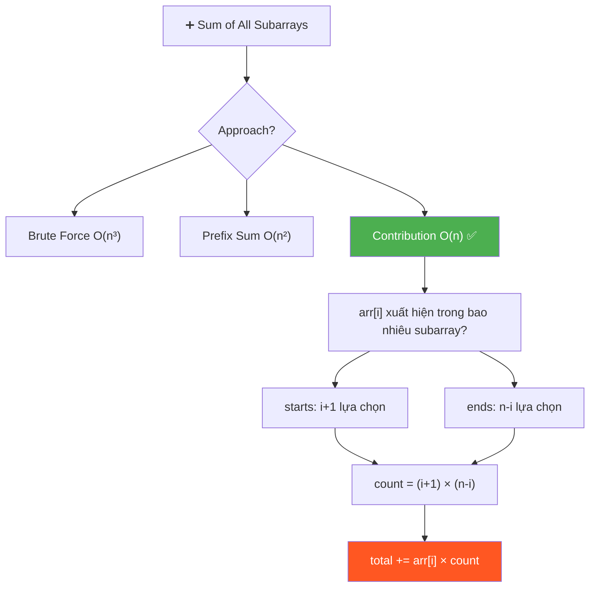
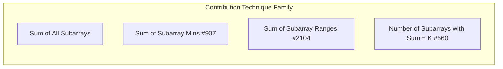
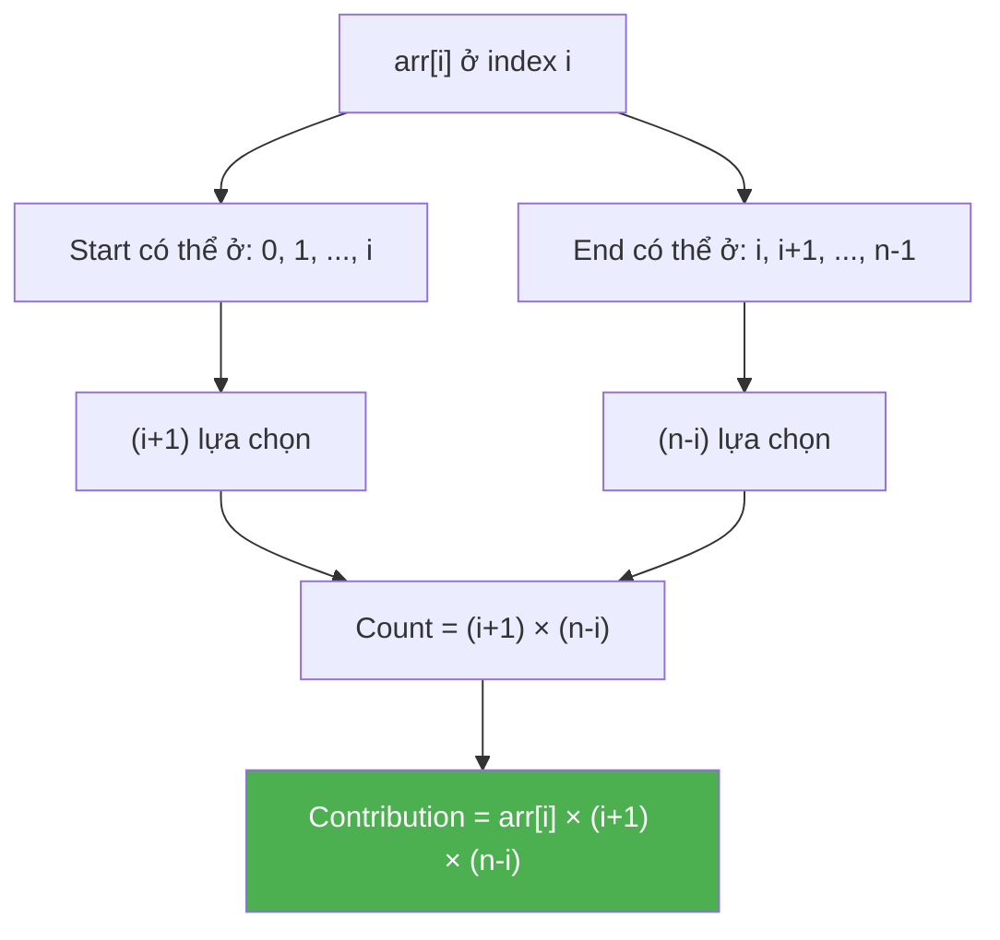
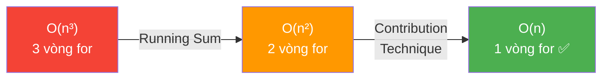

# ➕ Sum of All Subarrays — GfG (Easy)

> 📖 Code: [Sum of All Subarrays.js](./Sum%20of%20All%20Subarrays.js)





---

## R — Repeat & Clarify

🧠 _"Mỗi arr[i] xuất hiện trong (i+1)×(n-i) subarrays. Tổng = Σ arr[i]×(i+1)×(n-i). O(n)!"_

> 🎙️ _"Given an integer array arr[], compute the sum of all possible sub-arrays."_

### Clarification Questions

```
Q: "All possible sub-arrays" = subarrays LIÊN TIẾP?
A: Đúng! Subarray = contiguous subsequence. KHÔNG phải subset!

Q: Có tính subarray rỗng?
A: Không. Chỉ non-empty subarrays.

Q: Bao nhiêu subarrays trong mảng n phần tử?
A: n(n+1)/2. Ví dụ n=4 → 10 subarrays.

Q: arr[i] có thể âm?
A: Có thể! Nhưng ĐỀ BÀI cho positive → result luôn dương.

Q: Overflow?
A: Với n lớn, sum có thể rất lớn → dùng BigInt hoặc modulo.
```

### Tại sao bài này quan trọng?

```
  Bài này dạy CONTRIBUTION TECHNIQUE — một trong những kỹ thuật
  MẠNH NHẤT để tối ưu từ O(n²) → O(n)!

  ┌──────────────────────────────────────────────────────────────┐
  │  CONTRIBUTION TECHNIQUE:                                      │
  │    Thay vì tính "tổng mỗi subarray rồi cộng"               │
  │    → Tính "mỗi phần tử ĐÓNG GÓP bao nhiêu vào tổng"       │
  │                                                              │
  │  ĐẢO NGƯỢC góc nhìn:                                        │
  │    ❌ For each SUBARRAY → sum its elements                   │
  │    ✅ For each ELEMENT → count how many subarrays contain it │
  │                                                              │
  │  Áp dụng cho: Sum of Subarrays, Sum of Mins, Sum of Ranges, │
  │  counting problems, expected value calculations...           │
  └──────────────────────────────────────────────────────────────┘
```

---

## 🧠 Bản chất bài toán — Hiểu để NHỚ, không chỉ để GIẢI

### Đếm: arr[i] xuất hiện trong bao nhiêu subarrays?

```
  arr = [1, 4, 5, 3, 2]    (n = 5)
         0  1  2  3  4

  Xét arr[2] = 5 (index 2):
    Subarray PHẢI chứa index 2.
    → Start có thể ở: 0, 1, 2        → (i+1) = 3 lựa chọn
    → End có thể ở:   2, 3, 4        → (n-i) = 3 lựa chọn

    Tổng: 3 × 3 = 9 subarrays chứa arr[2]=5

  Liệt kê kiểm tra:
    [5]         start=2, end=2
    [5,3]       start=2, end=3
    [5,3,2]     start=2, end=4
    [4,5]       start=1, end=2
    [4,5,3]     start=1, end=3
    [4,5,3,2]   start=1, end=4
    [1,4,5]     start=0, end=2
    [1,4,5,3]   start=0, end=3
    [1,4,5,3,2] start=0, end=4
    → Đúng 9 subarrays! ✅
```



### Công thức CONTRIBUTION — Chứng minh

```
  📐 CHỨNG MINH: arr[i] xuất hiện trong (i+1) × (n-i) subarrays

  Subarray = arr[start..end] với 0 ≤ start ≤ end ≤ n-1

  Subarray CHỨA index i khi và chỉ khi:
    start ≤ i ≤ end

  → start ∈ {0, 1, 2, ..., i}       → (i+1) giá trị
  → end   ∈ {i, i+1, i+2, ..., n-1} → (n-i) giá trị

  Mỗi cặp (start, end) cho 1 subarray DUY NHẤT
  → Tổng subarrays chứa i = (i+1) × (n-i)

  📐 TỔNG CONTRIBUTION:
    Total = Σᵢ arr[i] × (i+1) × (n-i)    cho i = 0 → n-1

  📐 KIỂM TRA: tổng số lần xuất hiện = tổng subarrays × trung bình?
    Σᵢ (i+1)(n-i) = Σᵢ (i+1)(n-i)
    
    Ví dụ n=3:
      i=0: 1×3 = 3
      i=1: 2×2 = 4
      i=2: 3×1 = 3
      Tổng: 10

    Tổng subarrays n=3: n(n+1)/2 = 6
    Mỗi subarray có trung bình (n+1)/3 ≈ 1.67 phần tử
    Tổng phần tử = 6 × 1.67 = 10 ✅
```

### Ví dụ TÍNH TOÁN ĐẦY ĐỦ

```
  arr = [1, 4, 5, 3, 2]    n = 5

  ┌─────────┬────────┬─────────┬─────────┬──────────────────────┐
  │  i      │ arr[i] │ (i+1)   │ (n-i)   │ Contribution         │
  ├─────────┼────────┼─────────┼─────────┼──────────────────────┤
  │  0      │ 1      │ 1       │ 5       │ 1 × 1 × 5 = 5       │
  │  1      │ 4      │ 2       │ 4       │ 4 × 2 × 4 = 32      │
  │  2      │ 5      │ 3       │ 3       │ 5 × 3 × 3 = 45      │
  │  3      │ 3      │ 4       │ 2       │ 3 × 4 × 2 = 24      │
  │  4      │ 2      │ 5       │ 1       │ 2 × 5 × 1 = 10      │
  ├─────────┼────────┼─────────┼─────────┼──────────────────────┤
  │  TOTAL  │        │         │         │ 5+32+45+24+10 = 116  │
  └─────────┴────────┴─────────┴─────────┴──────────────────────┘

  → 116 ✅ (khớp expected output!)

  🧠 Nhận xét: phần tử Ở GIỮA có count LỚN NHẤT!
     i=2: count = 3×3 = 9  ← PEAK
     i=0: count = 1×5 = 5  ← nhỏ
     i=4: count = 5×1 = 5  ← nhỏ

  📌 Phần tử GIỮA MẢNG đóng góp NHIỀU NHẤT vào tổng!
     → Hình parabol: count = (i+1)(n-i) đạt max tại i = (n-1)/2
```

---

## 🧭 Luồng Suy Nghĩ — Từ đọc đề đến solution

> 💡 Phần này dạy bạn **CÁCH TƯ DUY** để tự giải bài, không chỉ biết đáp án.

### Bước 1: Đọc đề → Gạch chân KEYWORDS

```
  Đề bài: "Compute the sum of all possible sub-arrays"

  Gạch chân:
    "sum"              → TÍNH TỔNG (không phải tìm, đếm)
    "all possible"     → TẤT CẢ subarrays → n(n+1)/2 cái
    "sub-arrays"       → LIÊN TIẾP (contiguous)

  🧠 Tự hỏi: "Brute force bao nhiêu subarrays?"
    → n(n+1)/2 ≈ O(n²) subarrays
    → Mỗi subarray cần O(n) để sum
    → Brute force: O(n³)!
    → "Quá chậm! Có pattern nào?"

  📌 Kỹ năng chuyển giao:
    Khi thấy "sum/count of ALL subarrays":
    → ĐỪNG generate từng subarray!
    → HỎI: "Mỗi phần tử đóng góp bao nhiêu?"
    → Contribution Technique!
```

### Bước 2: Brute Force → "3 vòng for"

```
  Brute force: generate TẤT CẢ subarrays, tính sum mỗi cái

  for start = 0 → n-1:           ← chọn start
    for end = start → n-1:       ← chọn end
      for k = start → end:       ← tính sum
        total += arr[k]

  Time: O(n³)   Space: O(1)

  🧠 Tự hỏi: "Bỏ vòng for TRONG CÙNG được không?"
```

### Bước 3: Optimize 1 — "Bỏ vòng for thứ 3"

```
  Vòng for k tính sum arr[start..end] TỪNG LẦN!
  Nhưng arr[start..end] = arr[start..end-1] + arr[end]!

  → Tích lũy sum thay vì tính lại:

  for i = 0 → n-1:
    subarraySum = 0
    for j = i → n-1:
      subarraySum += arr[j]   ← MỞ RỘNG subarray thêm 1!
      total += subarraySum

  Time: O(n²)   Space: O(1)

  📌 Kỹ năng chuyển giao:
    "Tính lại từ đầu mỗi lần" → "Tích lũy kết quả trước đó"
    → Running Sum / Prefix Sum technique
    → O(n³) → O(n²) nhờ bỏ 1 vòng for!
```

### Bước 4: Optimize 2 — "Đảo ngược góc nhìn"

```
  🧠 CÂU HỎI QUAN TRỌNG: "Thay vì duyệt từng SUBARRAY,
     có thể duyệt từng PHẦN TỬ không?"

  ❌ Góc nhìn CŨ: cho mỗi subarray → cộng các phần tử
  ✅ Góc nhìn MỚI: cho mỗi phần tử → đếm nó thuộc bao nhiêu subarrays

  💡 INSIGHT: arr[i] xuất hiện trong BAO NHIÊU subarray?
    → Start ∈ {0, 1, ..., i}         → (i+1) lựa chọn
    → End   ∈ {i, i+1, ..., n-1}     → (n-i) lựa chọn
    → Count = (i+1) × (n-i) subarrays!

  → total = Σ arr[i] × (i+1) × (n-i)
  → CHỈ CẦN 1 VÒNG FOR! O(n)!

  📌 Kỹ năng chuyển giao:
    ┌──────────────────────────────────────────────────────────────┐
    │  CONTRIBUTION TECHNIQUE:                                     │
    │    "Thay vì tính KẾT QUẢ cho mỗi nhóm,                    │
    │     tính ĐÓNG GÓP của mỗi phần tử vào kết quả!"           │
    │                                                              │
    │  Áp dụng khi:                                                │
    │  • Sum of all subarrays → arr[i] × (i+1)(n-i)              │
    │  • Sum of all subarray MINS (#907) → Monotonic Stack        │
    │  • Sum of all subarray RANGES (#2104)                       │
    │  • Count of all pairs/triples                                │
    │  • Expected value trong probability                          │
    └──────────────────────────────────────────────────────────────┘
```

### Bước 5: Tổng kết — Pipeline O(n³) → O(n²) → O(n)



```
  ⭐ QUY TẮC VÀNG:
    "Sum/Count of ALL subarrays" → Contribution Technique!
    "Thay vì duyệt N² subarrays → duyệt N phần tử!"
    "Hỏi: mỗi phần tử ĐÓNG GÓP bao nhiêu?"
```

---

## E — Examples

### Ví dụ minh họa trực quan

```
VÍ DỤ 1: arr = [1, 2, 3]    n = 3

  Liệt kê TẤT CẢ n(n+1)/2 = 6 subarrays:
    [1]       = 1
    [1,2]     = 3
    [1,2,3]   = 6
    [2]       = 2
    [2,3]     = 5
    [3]       = 3
    ─────────────
    Total     = 20

  Kiểm tra Contribution:
    arr[0]=1: 1 × (0+1)(3-0) = 1 × 1 × 3 = 3
    arr[1]=2: 2 × (1+1)(3-1) = 2 × 2 × 2 = 8
    arr[2]=3: 3 × (2+1)(3-2) = 3 × 3 × 1 = 9
    Total = 3 + 8 + 9 = 20 ✅

  🧠 Kiểm tra arr[1]=2 xuất hiện trong 4 subarrays:
     [2], [1,2], [2,3], [1,2,3] → đúng 4 = 2×2 ✅
```

```
VÍ DỤ 2: arr = [1, 4, 5, 3, 2]    n = 5

  Contribution table:
    i=0: 1 × 1 × 5 = 5     ← đầu mảng, count nhỏ
    i=1: 4 × 2 × 4 = 32
    i=2: 5 × 3 × 3 = 45    ← GIỮA mảng, count LỚN NHẤT!
    i=3: 3 × 4 × 2 = 24
    i=4: 2 × 5 × 1 = 10    ← cuối mảng, count nhỏ
    ─────────────────────
    Total = 116 ✅
```

```
VÍ DỤ 3: arr = [1, 2, 3, 4]    n = 4

  Contribution:
    1 × 1 × 4 = 4
    2 × 2 × 3 = 12
    3 × 3 × 2 = 18
    4 × 4 × 1 = 16
    ─────────────
    Total = 50 ✅
```

---

## A — Approach

### Approach 1: Brute Force — O(n³)

```
  3 vòng for: chọn start, chọn end, tính sum

  ┌──────────────────────────────────────────────────────────────┐
  │  for i = 0 → n-1:           // chọn start                   │
  │    for j = i → n-1:         // chọn end                     │
  │      for k = i → j:         // tính sum arr[i..j]           │
  │        total += arr[k]                                       │
  │                                                              │
  │  Time: O(n³)    Space: O(1)                                  │
  │  → Quá chậm cho n > 1000!                                   │
  └──────────────────────────────────────────────────────────────┘
```

### Approach 2: Running Sum — O(n²)

```
  💡 Bỏ vòng for thứ 3 bằng running sum!

  ┌──────────────────────────────────────────────────────────────┐
  │  for i = 0 → n-1:                                           │
  │    subarraySum = 0                                           │
  │    for j = i → n-1:                                         │
  │      subarraySum += arr[j]  // mở rộng subarray thêm 1     │
  │      total += subarraySum   // cộng sum subarray hiện tại   │
  │                                                              │
  │  Time: O(n²)    Space: O(1)                                  │
  │  → Tốt hơn 3× so với O(n³), nhưng vẫn chậm!               │
  └──────────────────────────────────────────────────────────────┘

  🧠 Tại sao đúng?
    j=i:   subarraySum = arr[i]           → sum [i..i]
    j=i+1: subarraySum = arr[i]+arr[i+1]  → sum [i..i+1]
    j=i+2: subarraySum += arr[i+2]        → sum [i..i+2]
    → TÍCH LŨY thay vì tính lại!
```

### Approach 3: Contribution Technique — O(n) ✅

```
  💡 KEY INSIGHT: Đếm arr[i] xuất hiện trong bao nhiêu subarrays!

  ┌──────────────────────────────────────────────────────────────┐
  │  total = 0                                                    │
  │  for i = 0 → n-1:                                           │
  │    count = (i + 1) × (n - i)                                │
  │    total += arr[i] × count                                   │
  │                                                              │
  │  Time: O(n)    Space: O(1)                                   │
  │  → TỐI ƯU NHẤT! Không thể tốt hơn!                        │
  └──────────────────────────────────────────────────────────────┘

  🧠 count = (i+1)(n-i) vì:
    Start ∈ {0, 1, ..., i}         → (i+1) lựa chọn
    End   ∈ {i, i+1, ..., n-1}     → (n-i) lựa chọn
    → Mỗi cặp (start, end) = 1 subarray duy nhất chứa i
```

---

## C — Code

### Solution 1: Brute Force — O(n³)

```javascript
function sumSubarraysBrute(arr) {
  const n = arr.length;
  let total = 0;

  for (let i = 0; i < n; i++) {
    for (let j = i; j < n; j++) {
      for (let k = i; k <= j; k++) {
        total += arr[k];
      }
    }
  }

  return total;
}
```

### Solution 2: Running Sum — O(n²)

```javascript
function sumSubarraysPrefix(arr) {
  const n = arr.length;
  let total = 0;

  for (let i = 0; i < n; i++) {
    let subarraySum = 0;
    for (let j = i; j < n; j++) {
      subarraySum += arr[j];
      total += subarraySum;
    }
  }

  return total;
}
```

```
  📝 Line-by-line:

  Line 5: let subarraySum = 0
    → Reset cho mỗi start i MỚI!
    → ⚠️ Nếu đặt NGOÀI vòng for i → SAI! (tích lũy qua các start)

  Line 7: subarraySum += arr[j]
    → MỞ RỘNG subarray arr[i..j] thêm arr[j]
    → KHÔNG tính lại từ đầu → tiết kiệm 1 vòng for!

  Line 8: total += subarraySum
    → Cộng sum của subarray arr[i..j] vào tổng
    → Mỗi subarraySum = sum của 1 subarray cụ thể
```

### Solution 3: Contribution — O(n) ✅

```javascript
function sumSubarraysContribution(arr) {
  const n = arr.length;
  let total = 0;

  for (let i = 0; i < n; i++) {
    total += arr[i] * (i + 1) * (n - i);
  }

  return total;
}
```

```
  📝 Line-by-line:

  Line 6: total += arr[i] * (i + 1) * (n - i)
    → arr[i]: GIÁ TRỊ phần tử
    → (i + 1): số lựa chọn START (0, 1, ..., i)
    → (n - i): số lựa chọn END (i, i+1, ..., n-1)
    → Tích 3 số = TỔNG ĐÓNG GÓP của arr[i]

    ⚠️ Tại sao (i+1) mà không phải i?
       → i lựa chọn = {0, 1, ..., i} = (i+1) phần tử!
       → Gồm CẢ index 0 (start = 0)!

    ⚠️ Overflow: arr[i] × (i+1) × (n-i) có thể lớn!
       → JS: Number.MAX_SAFE_INTEGER = 2⁵³ - 1 ≈ 9 × 10¹⁵
       → Nếu n = 10⁵, arr[i] = 10⁹: 10⁹ × 10⁵ × 10⁵ = 10¹⁹ > 2⁵³!
       → Dùng BigInt hoặc modulo 10⁹+7!
```

### Trace — Contribution: arr = [1, 4, 5, 3, 2]

```
  n = 5

  i=0: arr[0]=1  count = (0+1)×(5-0) = 1×5 = 5
       contribution = 1 × 5 = 5       total = 5

  i=1: arr[1]=4  count = (1+1)×(5-1) = 2×4 = 8
       contribution = 4 × 8 = 32      total = 37

  i=2: arr[2]=5  count = (2+1)×(5-2) = 3×3 = 9
       contribution = 5 × 9 = 45      total = 82

  i=3: arr[3]=3  count = (3+1)×(5-3) = 4×2 = 8
       contribution = 3 × 8 = 24      total = 106

  i=4: arr[4]=2  count = (4+1)×(5-4) = 5×1 = 5
       contribution = 2 × 5 = 10      total = 116

  → return 116 ✅
```

> 🎙️ _"Instead of iterating over all O(n²) subarrays, I calculate each element's contribution. Element at index i appears in exactly (i+1)×(n-i) subarrays, so I multiply its value by this count. Single pass, O(n) time, O(1) space."_

---

## ❌ Common Mistakes — Lỗi thường gặp

### Mistake 1: Nhầm (i+1) vs i

```javascript
// ❌ SAI: dùng i thay vì (i+1)!
total += arr[i] * i * (n - i);
// i=0: arr[0] × 0 × 5 = 0 ← BỎ SÓT arr[0]!

// ✅ ĐÚNG: start ∈ {0,...,i} = (i+1) giá trị!
total += arr[i] * (i + 1) * (n - i);
```

### Mistake 2: Running Sum — không reset

```javascript
// ❌ SAI: subarraySum tích lũy QUA CÁC start!
let subarraySum = 0; // ← NGOÀI vòng for i!
for (let i = 0; i < n; i++) {
  for (let j = i; j < n; j++) {
    subarraySum += arr[j]; // ← KHÔNG reset!
  }
}

// ✅ ĐÚNG: reset MỖI start i!
for (let i = 0; i < n; i++) {
  let subarraySum = 0; // ← TRONG vòng for i!
  for (let j = i; j < n; j++) {
    subarraySum += arr[j];
    total += subarraySum;
  }
}
```

### Mistake 3: Quên cộng vào total trong O(n²)

```javascript
// ❌ SAI: chỉ tính subarraySum, quên cộng vào total!
for (let j = i; j < n; j++) {
  subarraySum += arr[j];
}
total += subarraySum; // ← CHỈ cộng subarray CUỐI CÙNG!

// ✅ ĐÚNG: cộng MỖI subarray!
for (let j = i; j < n; j++) {
  subarraySum += arr[j];
  total += subarraySum; // ← cộng TỪNG subarray!
}
```

---

## O — Optimize

```
                      Time       Space     Ghi chú
  ─────────────────────────────────────────────────────────────
  Brute Force         O(n³)      O(1)      3 vòng for
  Running Sum         O(n²)      O(1)      Bỏ 1 vòng for
  Contribution ✅     O(n)       O(1)      Đảo ngược góc nhìn!

  📌 O(n) là LOWER BOUND (phải đọc mỗi phần tử ít nhất 1 lần)
     → Contribution Technique = TỐI ƯU TUYỆT ĐỐI!
```

---

## T — Test

```
Test Cases:
  [1,4,5,3,2]  → 116   ✅ Example 1
  [1,2,3,4]    → 50    ✅ Example 2
  [1]          → 1     ✅ Single element
  [1,2]        → 6     ✅ [1]+[2]+[1,2] = 1+2+3
  [1,2,3]      → 20    ✅ 6 subarrays
  [5,5,5]      → 50    ✅ Tất cả giống nhau
```

---

## 🗣️ Interview Script

### 🎙️ Think Out Loud — Mô phỏng phỏng vấn thực

```
  ──────────────── PHASE 1: Brute Force ────────────────

  🧑 You: "The brute force generates all n(n+1)/2 subarrays and
   sums each one. With 3 nested loops, that's O(n³).
   
   I can optimize to O(n²) by maintaining a running sum — instead
   of recalculating each subarray sum from scratch, I extend the
   previous sum by one element."

  ──────────────── PHASE 2: Contribution ────────────────

  🧑 You: "But I can do even better by flipping the perspective.
   Instead of asking 'what's the sum of each subarray?', I ask
   'how much does each element contribute to the total?'

   Element at index i is contained in every subarray where
   start ≤ i ≤ end. There are (i+1) choices for start and
   (n-i) choices for end, so arr[i] contributes
   arr[i] × (i+1) × (n-i) to the total.

   One pass, O(n) time, O(1) space — optimal."
```

### Pattern & Liên kết

```
  CONTRIBUTION TECHNIQUE family:

  ┌──────────────────────────────────────────────────────────────┐
  │  Sum of All Subarrays — BÀI NÀY:                            │
  │    → arr[i] × (i+1) × (n-i)                                │
  │    → O(n) ✅                                                │
  │                                                              │
  │  Sum of Subarray Minimums (#907) — Medium:                   │
  │    → Đếm: arr[i] là MIN trong bao nhiêu subarrays?         │
  │    → Monotonic Stack tìm left/right smaller                  │
  │    → O(n) với stack                                          │
  │                                                              │
  │  Sum of Subarray Ranges (#2104) — Medium:                    │
  │    → range = max - min cho mỗi subarray                     │
  │    → = Sum of Maxes - Sum of Mins                            │
  │    → 2 lần Monotonic Stack                                   │
  │                                                              │
  │  Count Subarrays with Sum = K (#560):                        │
  │    → Prefix Sum + HashMap                                    │
  └──────────────────────────────────────────────────────────────┘

  📌 PATTERN: "Đảo ngược góc nhìn"
     ❌ For each GROUP → process elements
     ✅ For each ELEMENT → count groups it belongs to
```

### Skeleton code — Contribution template

```javascript
// TEMPLATE: "Sum/Count of ALL subarrays" dùng Contribution
function sumAllSubarrays(arr) {
  const n = arr.length;
  let total = 0;

  for (let i = 0; i < n; i++) {
    const count = (i + 1) * (n - i); // subarrays chứa arr[i]
    total += arr[i] * count;
  }

  return total;
}

// Biến thể: nếu cần SUM of PRODUCTS → contribution phức tạp hơn
// Biến thể: nếu cần MIN/MAX → Monotonic Stack thay công thức
```
