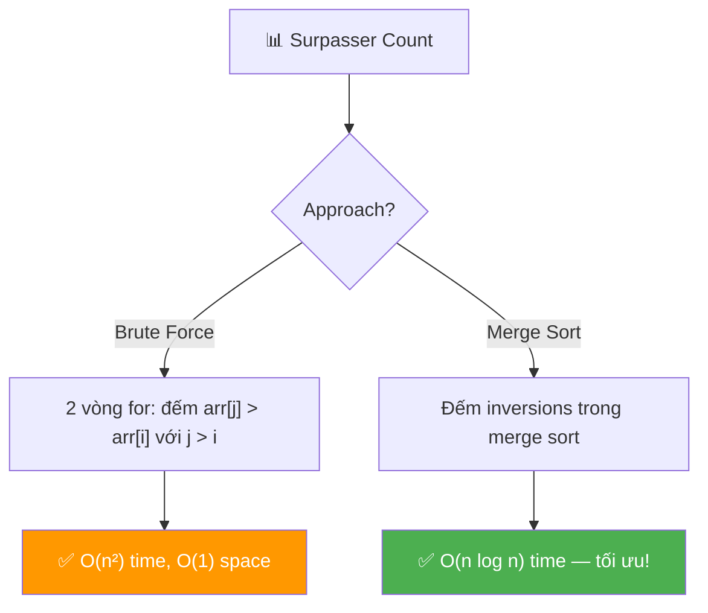
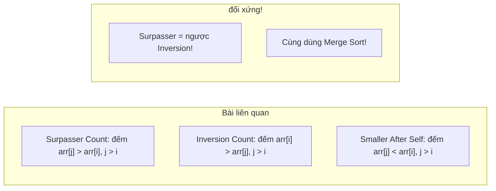
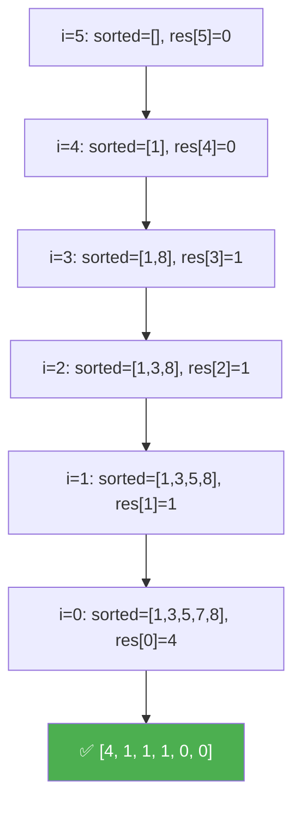

# 📊 Surpasser Count of Each Element — GfG (Easy)

> 📖 Code: [Surpasser Count.js](./Surpasser%20Count.js)





---

## R — Repeat & Clarify

🧠 *"Với mỗi phần tử arr[i], đếm bao nhiêu phần tử BÊN PHẢI lớn hơn nó."*

> 🎙️ *"For each element in the array, count how many elements to its right are strictly greater. Return an array of these counts."*

### Clarification Questions

```
Q: "Surpasser" = phần tử LỚN HƠN bên PHẢI?
A: ĐÚNG! arr[j] > arr[i] VÀ j > i

Q: Phần tử bằng có tính không?
A: KHÔNG! Strictly greater (> chứ không phải >=)!

Q: Mảng distinct?
A: CÓ! Bài GfG: distinct integers.

Q: Return gì?
A: Mảng COUNT cùng kích thước!
   arr = [2, 7, 5, 3, 8, 1]
   res = [4, 1, 1, 1, 0, 0]

Q: Phần tử cuối luôn = 0?
A: ĐÚNG! Không có phần tử nào bên phải → surpasser = 0!
```

### Tại sao bài này quan trọng?

```
  Bài này dạy 2 patterns quan trọng:

  1. BRUTE FORCE → O(n²): hiểu bài trước!
  2. MERGE SORT COUNTING → O(n log n): optimize bằng D&C!

  ┌───────────────────────────────────────────────────┐
  │  Surpasser Count ≈ INVERSION COUNT (đảo chiều!)   │
  │                                                    │
  │  Inversion: arr[i] > arr[j], j > i               │
  │  Surpasser: arr[j] > arr[i], j > i               │
  │                                                    │
  │  → CÙNG technique: Merge Sort counting!            │
  │  → Bài liên quan: LeetCode #315 (Count Smaller)  │
  └───────────────────────────────────────────────────┘
```

---

## 🧠 Bản chất bài toán — Hiểu để NHỚ, không chỉ để GIẢI

### Tưởng tượng: XẾP HÀNG so CHIỀU CAO!

```
  Mảng = hàng người đứng:
  [2, 7, 5, 3, 8, 1]

  Mỗi người NHÌN sang PHẢI → đếm bao nhiêu người CAO HƠN?

  Người cao 2: nhìn phải → thấy 7, 5, 3, 8 cao hơn → 4 người!
  Người cao 7: nhìn phải → thấy 8 cao hơn → 1 người!
  Người cao 5: nhìn phải → thấy 8 cao hơn → 1 người!
  Người cao 3: nhìn phải → thấy 8 cao hơn → 1 người!
  Người cao 8: nhìn phải → không ai cao hơn → 0!
  Người cao 1: nhìn phải → không ai (cuối hàng) → 0!

  → [4, 1, 1, 1, 0, 0] ✅
```

### Brute Force rất TRỰC QUAN!

```
  ⭐ Cách đơn giản nhất: 2 vòng for!

  for i = 0 → n-1:
    count = 0
    for j = i+1 → n-1:      ← nhìn BÊN PHẢI!
      if (arr[j] > arr[i]):
        count++
    res[i] = count

  → O(n²) — dễ hiểu, dễ code!
  → Nhưng chậm nếu n lớn!
```

### Optimize: Merge Sort — Đếm TRONG KHI sort!

```
  ⭐ INSIGHT: Merge Sort chia mảng thành 2 nửa.
  Khi MERGE 2 nửa ĐÃ SORT:
  → Biết chính xác bao nhiêu phần tử BÊN PHẢI lớn hơn!

  Tại sao?
    Left half:  [2, 5, 7]  (sorted, giữ index gốc)
    Right half: [1, 3, 8]  (sorted, giữ index gốc)

    Khi merge, nếu right[j] > left[i]:
    → TẤT CẢ phần tử từ j đến cuối right CŨNG > left[i]!
    → count[left[i]] += rightRemaining!

  Tuy nhiên, do bài này cần TRACK INDEX GỐC,
  implementation phức tạp hơn brute force RẤT NHIỀU.

  📌 TRONG PHỎNG VẤN:
    → Viết brute force O(n²) trước!
    → NÓI "có thể optimize bằng merge sort O(n log n)"!
    → Code merge sort CHỈ KHI interviewer YÊU CẦU!
```

### Cách đơn giản hơn: Duyệt PHẢI → TRÁI + cấu trúc dữ liệu

```
  ⭐ ALTERNATIVE: Duyệt từ PHẢI → TRÁI!

  Maintain 1 sorted structure (BST, BIT, sorted array)
  chứa tất cả phần tử ĐÃ THẤY bên phải.

  Với mỗi arr[i] (duyệt phải → trái):
    → Đếm bao nhiêu phần tử TRONG structure > arr[i]
    → Insert arr[i] vào structure

  Sorted array + binary search:
    → Tìm vị trí insert → phần tử SAU = lớn hơn!
    → count = sortedArr.length - insertPos
    → O(n²) worst case (do insert vào array)
    → Nhưng ĐƠN GIẢN hơn merge sort!
```

---

## 🧭 Luồng Suy Nghĩ — Từ đọc đề đến solution

### Bước 1: Keywords

```
  "greater elements to the right" → so sánh BÊN PHẢI
  "count for each" → mảng kết quả cùng kích thước
  "distinct" → không trùng → đơn giản hơn

  🧠 "Brute force: 2 vòng for → O(n²)"
```

### Bước 2: Brute Force → O(n²)

```
  for i: pick arr[i]
    for j > i: if arr[j] > arr[i]: count++
  → O(n²) — đủ cho phỏng vấn bước 1!
```

### Bước 3: Optimize? → O(n log n)

```
  Merge Sort counting hoặc BIT/Segment Tree
  → Phức tạp nhưng O(n log n)!
  → Trong phỏng vấn: nói approach, code nếu cần!
```

---

## E — Examples

```
VÍ DỤ 1: arr = [2, 7, 5, 3, 8, 1]

  i=0 (2): elements right > 2: [7, 5, 3, 8] → count = 4
  i=1 (7): elements right > 7: [8]           → count = 1
  i=2 (5): elements right > 5: [8]           → count = 1
  i=3 (3): elements right > 3: [8]           → count = 1
  i=4 (8): elements right > 8: []            → count = 0
  i=5 (1): elements right > 1: []            → count = 0

  → [4, 1, 1, 1, 0, 0] ✅
```

```
VÍ DỤ 2: arr = [4, 5, 1]

  i=0 (4): right > 4: [5] → 1
  i=1 (5): right > 5: []  → 0
  i=2 (1): right > 1: []  → 0

  → [1, 0, 0] ✅
```

```
VÍ DỤ 3: arr = [1, 2, 3, 4, 5] (sorted tăng)

  i=0 (1): [2,3,4,5] → 4
  i=1 (2): [3,4,5]   → 3
  i=2 (3): [4,5]     → 2
  i=3 (4): [5]       → 1
  i=4 (5): []        → 0

  → [4, 3, 2, 1, 0] ✅ (max surpassers!)
```

```
VÍ DỤ 4: arr = [5, 4, 3, 2, 1] (sorted giảm)

  Mọi phần tử bên phải đều NHỎ hơn → 0!
  → [0, 0, 0, 0, 0] ✅ (min surpassers!)
```

### Minh họa trực quan

```
  arr = [2, 7, 5, 3, 8, 1]

  i=0: 2 → nhìn phải:  7  5  3  8  1
                         ✅ ✅ ✅ ✅ ❌   count = 4

  i=1: 7 → nhìn phải:     5  3  8  1
                            ❌ ❌ ✅ ❌   count = 1

  i=2: 5 → nhìn phải:        3  8  1
                               ❌ ✅ ❌   count = 1

  i=3: 3 → nhìn phải:           8  1
                                  ✅ ❌   count = 1

  i=4: 8 → nhìn phải:              1
                                     ❌   count = 0

  i=5: 1 → nhìn phải:  (nothing)
                                           count = 0
```

---

## A — Approach

### Approach 1: Brute Force — O(n²) ⭐ (đủ cho phỏng vấn!)

```
💡 Ý tưởng: 2 vòng for — với mỗi i, đếm j > i mà arr[j] > arr[i]

  ✅ Ưu: Cực đơn giản! 5 dòng code!
  ❌ Nhược: O(n²) — chậm nếu n > 10⁴
```

### Approach 2: Duyệt phải → trái + Binary Search — O(n²) worst / O(n log n) avg

```
💡 Ý tưởng: Maintain sorted array, duyệt từ phải

  Duyệt phải → trái:
    Binary search tìm vị trí insert
    count = sorted.length - insertPosition
    Insert vào sorted array

  ✅ Ưu: Intuitive hơn merge sort
  ❌ Nhược: Insert vào array = O(n) → worst O(n²)
```

### Approach 3: Merge Sort — O(n log n)

```
💡 Ý tưởng: Đếm surpassers TRONG merge sort!

  Khi merge left[] và right[]:
    Nếu right[j] > left[i]:
      → Tất cả right[j..end] > left[i]
      → surpasserCount[left[i]] += rightRemaining

  ✅ O(n log n) — tối ưu!
  ❌ Phức tạp: cần track index gốc!
```

### So sánh

```
  ┌────────────────────────────┬──────────────┬──────────┬────────────────┐
  │                            │ Time         │ Space    │ Ghi chú         │
  ├────────────────────────────┼──────────────┼──────────┼────────────────┤
  │ Brute Force ⭐             │ O(n²)        │ O(n)     │ Đơn giản nhất  │
  │ Right→Left + BinSearch     │ O(n² / n lgn)│ O(n)     │ Trung bình      │
  │ Merge Sort                 │ O(n log n)   │ O(n)     │ Tối ưu          │
  └────────────────────────────┴──────────────┴──────────┴────────────────┘
```

---

## C — Code

### Solution 1: Brute Force — O(n²)

```javascript
function surpasserCountBrute(arr) {
  const n = arr.length;
  const res = new Array(n).fill(0);

  for (let i = 0; i < n; i++) {
    for (let j = i + 1; j < n; j++) {
      if (arr[j] > arr[i]) {
        res[i]++;
      }
    }
  }

  return res;
}
```

### Giải thích Brute Force

```
  for i: phần tử CẦN ĐẾM surpassers
  for j > i: mọi phần tử BÊN PHẢI
  if arr[j] > arr[i]: đếm!

  CHỈ 5 DÒNG LOGIC! Dễ nhất có thể!

  ⚠️ res[n-1] luôn = 0 (không có phần tử bên phải)
```

### Trace CHI TIẾT: arr = [2, 7, 5, 3, 8, 1]

```
  n = 6, res = [0, 0, 0, 0, 0, 0]

  ═══ i=0 (arr[i]=2) ═════════════════════════════════

  j=1: arr[1]=7 > 2? YES → res[0]++ → res[0]=1
  j=2: arr[2]=5 > 2? YES → res[0]++ → res[0]=2
  j=3: arr[3]=3 > 2? YES → res[0]++ → res[0]=3
  j=4: arr[4]=8 > 2? YES → res[0]++ → res[0]=4
  j=5: arr[5]=1 > 2? NO

  ═══ i=1 (arr[i]=7) ═════════════════════════════════

  j=2: arr[2]=5 > 7? NO
  j=3: arr[3]=3 > 7? NO
  j=4: arr[4]=8 > 7? YES → res[1]++ → res[1]=1
  j=5: arr[5]=1 > 7? NO

  ═══ i=2 (arr[i]=5) ═════════════════════════════════

  j=3: arr[3]=3 > 5? NO
  j=4: arr[4]=8 > 5? YES → res[2]++ → res[2]=1
  j=5: arr[5]=1 > 5? NO

  ═══ i=3 (arr[i]=3) ═════════════════════════════════

  j=4: arr[4]=8 > 3? YES → res[3]++ → res[3]=1
  j=5: arr[5]=1 > 3? NO

  ═══ i=4 (arr[i]=8) ═════════════════════════════════

  j=5: arr[5]=1 > 8? NO

  ═══ i=5 (arr[i]=1) ═════════════════════════════════
  → Không có j > 5

  KẾT QUẢ: res = [4, 1, 1, 1, 0, 0] ✅
```

### Solution 2: Right-to-Left + Binary Search Insert

```javascript
function surpasserCountBinSearch(arr) {
  const n = arr.length;
  const res = new Array(n).fill(0);
  const sorted = []; // Maintain sorted array of seen elements

  // Duyệt PHẢI → TRÁI
  for (let i = n - 1; i >= 0; i--) {
    // Binary search: tìm số phần tử > arr[i] trong sorted
    const pos = upperBound(sorted, arr[i]);
    res[i] = sorted.length - pos; // Phần tử SAU pos đều > arr[i]!

    // Insert arr[i] vào đúng vị trí để maintain sorted
    sorted.splice(pos, 0, arr[i]);
  }

  return res;
}

// Tìm vị trí ĐẦU TIÊN > target (upper bound)
function upperBound(sortedArr, target) {
  let lo = 0,
    hi = sortedArr.length;
  while (lo < hi) {
    const mid = (lo + hi) >> 1;
    if (sortedArr[mid] <= target) {
      lo = mid + 1;
    } else {
      hi = mid;
    }
  }
  return lo;
}
```

### Giải thích Right-to-Left — CHI TIẾT

```
  IDEA: Duyệt từ PHẢI → TRÁI!
    → sorted[] chứa tất cả phần tử ĐÃ THẤY (bên phải i)
    → Binary search tìm vị trí insert arr[i]
    → Phần tử SAU vị trí đó = LỚN HƠN = surpassers!

  upperBound(sorted, 2) = vị trí đầu tiên > 2
    → sorted.length - pos = số phần tử > 2!

  splice(pos, 0, arr[i]): Insert arr[i] vào đúng vị trí
    → sorted vẫn sorted!

  ⚠️ splice = O(n) worst case (shift elements)
     → Tổng: O(n²) worst case
     → Nhưng code ĐƠNG GIẢN hơn merge sort rất nhiều!
```

### Trace Right-to-Left: arr = [2, 7, 5, 3, 8, 1]

```
  sorted = []

  i=5 (arr[5]=1):
    upperBound([], 1) = 0
    res[5] = 0 - 0 = 0
    sorted = [1]

  i=4 (arr[4]=8):
    upperBound([1], 8) = 1
    res[4] = 1 - 1 = 0
    sorted = [1, 8]

  i=3 (arr[3]=3):
    upperBound([1, 8], 3) = 1   (1 ≤ 3, 8 > 3 → pos=1)
    res[3] = 2 - 1 = 1          (8 > 3 → 1 surpasser!)
    sorted = [1, 3, 8]

  i=2 (arr[2]=5):
    upperBound([1, 3, 8], 5) = 2  (1≤5, 3≤5, 8>5 → pos=2)
    res[2] = 3 - 2 = 1            (8 > 5 → 1!)
    sorted = [1, 3, 5, 8]

  i=1 (arr[1]=7):
    upperBound([1, 3, 5, 8], 7) = 3  (1≤7, 3≤7, 5≤7, 8>7 → pos=3)
    res[1] = 4 - 3 = 1               (8 > 7 → 1!)
    sorted = [1, 3, 5, 7, 8]

  i=0 (arr[0]=2):
    upperBound([1, 3, 5, 7, 8], 2) = 1  (1≤2, 3>2 → pos=1)
    res[0] = 5 - 1 = 4                  ([3,5,7,8] > 2 → 4!)
    sorted = [1, 2, 3, 5, 7, 8]

  KẾT QUẢ: res = [4, 1, 1, 1, 0, 0] ✅
```



> 🎙️ *"For each element, I count how many elements to its right are greater. The brute force is O(n²) with two loops. For optimization, I traverse right-to-left maintaining a sorted array of seen elements — binary search gives me the count of elements greater than the current one. With a balanced BST this would be O(n log n), but with a plain array it's O(n²) due to insertion."*

---

## O — Optimize

```
                           Time          Space     Ghi chú
  ────────────────────────────────────────────────────────
  Brute Force ⭐            O(n²)         O(n)      Đơn giản
  Right→Left + BinSearch    O(n²)*        O(n)      Splice = O(n)
  Merge Sort                O(n log n)    O(n)      Tối ưu
  BIT / Segment Tree        O(n log n)    O(n)      Advanced

  * splice O(n) → tổng O(n²). Dùng BST → O(n log n)

  📊 Phỏng vấn:
    → Viết brute force O(n²) trước (2 phút!)
    → Nói "optimize bằng merge sort hoặc BIT → O(n log n)"
    → Code merge sort CHỈ KHI interviewer yêu cầu!
```

---

## T — Test

```
Test Cases:
  [2, 7, 5, 3, 8, 1]  → [4, 1, 1, 1, 0, 0]   ✅ basic
  [4, 5, 1]            → [1, 0, 0]              ✅ small
  [1, 2, 3, 4, 5]      → [4, 3, 2, 1, 0]        ✅ sorted asc (max)
  [5, 4, 3, 2, 1]      → [0, 0, 0, 0, 0]        ✅ sorted desc (all 0)
  [1]                  → [0]                     ✅ 1 phần tử
  [3, 1]              → [0, 0]                  ✅ n=2 giảm
  [1, 3]              → [1, 0]                  ✅ n=2 tăng
  [10, 1, 2, 3, 15]    → [1, 3, 2, 1, 0]        ✅ mixed
```

---

## 🗣️ Interview Script

### Think Out Loud

```
  🧠 BƯỚC 1: Keywords
    "greater elements to the right" → so sánh bên phải!
    → 2 vòng for → O(n²)

  🧠 BƯỚC 2: Brute force
    "Với mỗi i, đếm j > i mà arr[j] > arr[i]"
    → O(n²) — viết trước!

  🧠 BƯỚC 3: Optimize (nếu hỏi)
    "Duyệt phải → trái, maintain sorted structure"
    "Binary search cho count, insert cho maintain"
    "Hoặc merge sort counting inversions (reversed)"
    → O(n log n)

  🎙️ Interview phrasing:
    "For each element, I count how many elements to its right
     are strictly greater. The brute force is straightforward:
     two nested loops, O(n²). If optimization is needed, I can
     traverse right-to-left maintaining a sorted structure and
     use binary search to count elements greater than the
     current one — O(n log n) with a balanced BST or BIT."
```

### Biến thể & Mở rộng

```
  1. Count of SMALLER elements to the RIGHT — LeetCode #315
     → Đảo > thành <
     → Cùng technique: merge sort hoặc BIT!

  2. Inversion Count — GfG Classic
     → arr[i] > arr[j] với j > i (NGƯỢC surpasser!)
     → Tổng tất cả inversions (không phải per-element)
     → Merge sort counting!

  3. Max Surpasser Count (maximum element trong result)
     → Tìm max trong res[] → thêm 1 bước!

  4. Count of GREATER elements to the LEFT
     → Đảo chiều: duyệt trái → phải + sorted structure!

  5. Next Greater Element (Stack!)
     → KHÁC BÀI: tìm phần tử LỚN HƠN GẦN NHẤT (không đếm!)
     → Monotonic Stack O(n)!
```

### So sánh với bài liên quan

```
  ┌──────────────────────────────────────────────────────────┐
  │  Bài toán              Technique           Complexity    │
  │  ────────────────────────────────────────────────        │
  │  Surpasser Count ⭐    Brute / Merge Sort   O(n²/nlogn) │
  │  Inversion Count       Merge Sort           O(n log n)  │
  │  Count Smaller (#315)  BIT / Merge Sort     O(n log n)  │
  │  Next Greater Element  Monotonic Stack      O(n)        │
  │  Leaders in Array      Right→Left scan      O(n)        │
  └──────────────────────────────────────────────────────────┘

  KEY INSIGHT:
  → "Đếm phần tử > / < bên phải" → Merge Sort hoặc BIT!
  → "Tìm phần tử gần nhất >" → Monotonic Stack!
  → "Duyệt phải → trái" = trick phổ biến cho bài "bên phải"!
```

---

## 🧩 Sai lầm phổ biến

```
❌ SAI LẦM #1: Nhầm > với >= !

   Surpasser = STRICTLY greater (>)!
   arr = [3, 3, 5]: surpassers of 3 (index 0) = [5] → 1 (không đếm 3!)

─────────────────────────────────────────────────────

❌ SAI LẦM #2: Nhầm với Next Greater Element!

   Surpasser: ĐẾM bao nhiêu phần tử > bên phải
   Next Greater: TÌM phần tử lớn hơn GẦN NHẤT
   → KHÁC BÀI! Khác technique!

─────────────────────────────────────────────────────

❌ SAI LẦM #3: Duyệt trái → phải cho approach sorted!

   Cần so sánh với phần tử BÊN PHẢI
   → Duyệt PHẢI → TRÁI: insert phần tử đã thấy!
   → Duyệt trái → phải: sorted chứa phần tử bên TRÁI → SAI!

─────────────────────────────────────────────────────

❌ SAI LẦM #4: Nghĩ merge sort là cách DUY NHẤT O(n log n)!

   Merge sort = 1 cách!
   BIT (Binary Indexed Tree) = cách khác!
   Balanced BST (AVL, Red-Black) = cách khác!
   → Phỏng vấn: nêu nhiều options, code cái dễ nhất!
```

---

## 📝 Flashcard — Tự kiểm tra

| ❓ Câu hỏi | ✅ Đáp án |
|---|---|
| Surpasser của arr[i]? | Phần tử arr[j] > arr[i] với j > i |
| Brute force? | 2 vòng for, đếm j > i mà arr[j] > arr[i] → O(n²) |
| Phần tử cuối luôn có bao nhiêu surpassers? | **0** (không có phần tử nào bên phải) |
| Sorted tăng dần → surpassers? | [n-1, n-2, ..., 1, 0] (max!) |
| Sorted giảm dần → surpassers? | [0, 0, ..., 0] (min!) |
| Optimize O(n log n)? | Merge Sort counting hoặc BIT |
| Bài liên quan trên LeetCode? | **#315** Count of Smaller Numbers After Self |
| Khác gì Next Greater Element? | Surpasser ĐẾM số lượng, NGE TÌM gần nhất |
