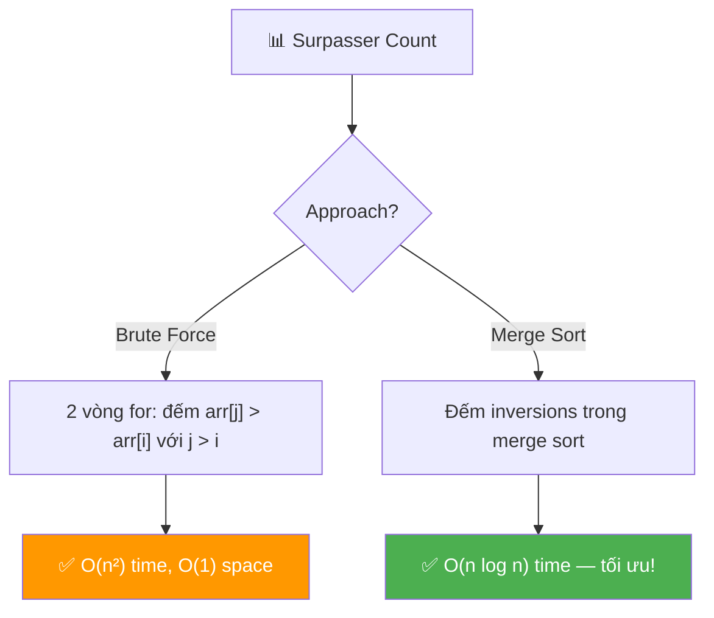
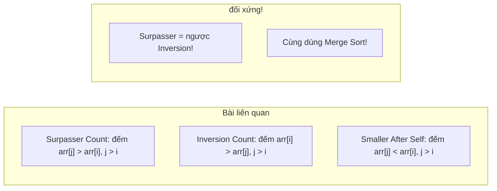
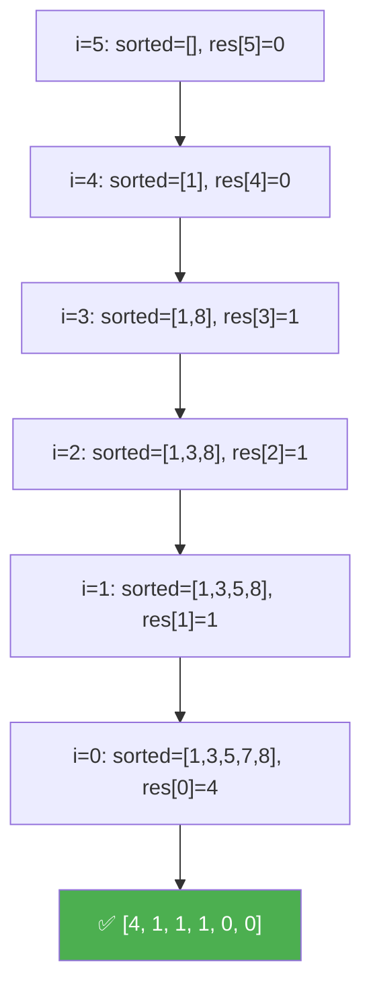

# 📊 Surpasser Count of Each Element — GfG (Easy)

> 📖 Code: [Surpasser Count.js](./Surpasser%20Count.js)





---

## R — Repeat & Clarify

🧠 *"Với mỗi phần tử arr[i], đếm bao nhiêu phần tử BÊN PHẢI lớn hơn nó."*

> 🎙️ *"For each element in the array, count how many elements to its right are strictly greater. Return an array of these counts."*

### Clarification Questions

```
Q: "Surpasser" = phần tử LỚN HƠN bên PHẢI?
A: ĐÚNG! arr[j] > arr[i] VÀ j > i

Q: Phần tử bằng có tính không?
A: KHÔNG! Strictly greater (> chứ không phải >=)!

Q: Mảng distinct?
A: CÓ! Bài GfG: distinct integers.

Q: Return gì?
A: Mảng COUNT cùng kích thước!
   arr = [2, 7, 5, 3, 8, 1]
   res = [4, 1, 1, 1, 0, 0]

Q: Phần tử cuối luôn = 0?
A: ĐÚNG! Không có phần tử nào bên phải → surpasser = 0!
```

### Tại sao bài này quan trọng?

```
  Bài này dạy 2 patterns quan trọng:

  1. BRUTE FORCE → O(n²): hiểu bài trước!
  2. MERGE SORT COUNTING → O(n log n): optimize bằng D&C!

  ┌───────────────────────────────────────────────────┐
  │  Surpasser Count ≈ INVERSION COUNT (đảo chiều!)   │
  │                                                    │
  │  Inversion: arr[i] > arr[j], j > i               │
  │  Surpasser: arr[j] > arr[i], j > i               │
  │                                                    │
  │  → CÙNG technique: Merge Sort counting!            │
  │  → Bài liên quan: LeetCode #315 (Count Smaller)  │
  └───────────────────────────────────────────────────┘
```

---

## 🧠 Bản chất bài toán — Hiểu để NHỚ, không chỉ để GIẢI

### Tưởng tượng: XẾP HÀNG so CHIỀU CAO!

```
  Mảng = hàng người đứng:
  [2, 7, 5, 3, 8, 1]

  Mỗi người NHÌN sang PHẢI → đếm bao nhiêu người CAO HƠN?

  Người cao 2: nhìn phải → thấy 7, 5, 3, 8 cao hơn → 4 người!
  Người cao 7: nhìn phải → thấy 8 cao hơn → 1 người!
  Người cao 5: nhìn phải → thấy 8 cao hơn → 1 người!
  Người cao 3: nhìn phải → thấy 8 cao hơn → 1 người!
  Người cao 8: nhìn phải → không ai cao hơn → 0!
  Người cao 1: nhìn phải → không ai (cuối hàng) → 0!

  → [4, 1, 1, 1, 0, 0] ✅
```

### Brute Force rất TRỰC QUAN!

```
  ⭐ Cách đơn giản nhất: 2 vòng for!

  for i = 0 → n-1:
    count = 0
    for j = i+1 → n-1:      ← nhìn BÊN PHẢI!
      if (arr[j] > arr[i]):
        count++
    res[i] = count

  → O(n²) — dễ hiểu, dễ code!
  → Nhưng chậm nếu n lớn!
```

### Optimize: Merge Sort — Đếm TRONG KHI sort!

```
  ⭐ INSIGHT: Merge Sort chia mảng thành 2 nửa.
  Khi MERGE 2 nửa ĐÃ SORT:
  → Biết chính xác bao nhiêu phần tử BÊN PHẢI lớn hơn!

  Tại sao?
    Left half:  [2, 5, 7]  (sorted, giữ index gốc)
    Right half: [1, 3, 8]  (sorted, giữ index gốc)

    Khi merge, nếu right[j] > left[i]:
    → TẤT CẢ phần tử từ j đến cuối right CŨNG > left[i]!
    → count[left[i]] += rightRemaining!

  Tuy nhiên, do bài này cần TRACK INDEX GỐC,
  implementation phức tạp hơn brute force RẤT NHIỀU.

  📌 TRONG PHỎNG VẤN:
    → Viết brute force O(n²) trước!
    → NÓI "có thể optimize bằng merge sort O(n log n)"!
    → Code merge sort CHỈ KHI interviewer YÊU CẦU!
```

### Cách đơn giản hơn: Duyệt PHẢI → TRÁI + cấu trúc dữ liệu

```
  ⭐ ALTERNATIVE: Duyệt từ PHẢI → TRÁI!

  Maintain 1 sorted structure (BST, BIT, sorted array)
  chứa tất cả phần tử ĐÃ THẤY bên phải.

  Với mỗi arr[i] (duyệt phải → trái):
    → Đếm bao nhiêu phần tử TRONG structure > arr[i]
    → Insert arr[i] vào structure

  Sorted array + binary search:
    → Tìm vị trí insert → phần tử SAU = lớn hơn!
    → count = sortedArr.length - insertPos
    → O(n²) worst case (do insert vào array)
    → Nhưng ĐƠN GIẢN hơn merge sort!
```

---

## 🧭 Luồng Suy Nghĩ — Từ đọc đề đến solution

### Bước 1: Keywords

```
  "greater elements to the right" → so sánh BÊN PHẢI
  "count for each" → mảng kết quả cùng kích thước
  "distinct" → không trùng → đơn giản hơn

  🧠 "Brute force: 2 vòng for → O(n²)"
```

### Bước 2: Brute Force → O(n²)

```
  for i: pick arr[i]
    for j > i: if arr[j] > arr[i]: count++
  → O(n²) — đủ cho phỏng vấn bước 1!
```

### Bước 3: Optimize? → O(n log n)

```
  Merge Sort counting hoặc BIT/Segment Tree
  → Phức tạp nhưng O(n log n)!
  → Trong phỏng vấn: nói approach, code nếu cần!
```

---

## E — Examples

```
VÍ DỤ 1: arr = [2, 7, 5, 3, 8, 1]

  i=0 (2): elements right > 2: [7, 5, 3, 8] → count = 4
  i=1 (7): elements right > 7: [8]           → count = 1
  i=2 (5): elements right > 5: [8]           → count = 1
  i=3 (3): elements right > 3: [8]           → count = 1
  i=4 (8): elements right > 8: []            → count = 0
  i=5 (1): elements right > 1: []            → count = 0

  → [4, 1, 1, 1, 0, 0] ✅
```

```
VÍ DỤ 2: arr = [4, 5, 1]

  i=0 (4): right > 4: [5] → 1
  i=1 (5): right > 5: []  → 0
  i=2 (1): right > 1: []  → 0

  → [1, 0, 0] ✅
```

```
VÍ DỤ 3: arr = [1, 2, 3, 4, 5] (sorted tăng)

  i=0 (1): [2,3,4,5] → 4
  i=1 (2): [3,4,5]   → 3
  i=2 (3): [4,5]     → 2
  i=3 (4): [5]       → 1
  i=4 (5): []        → 0

  → [4, 3, 2, 1, 0] ✅ (max surpassers!)
```

```
VÍ DỤ 4: arr = [5, 4, 3, 2, 1] (sorted giảm)

  Mọi phần tử bên phải đều NHỎ hơn → 0!
  → [0, 0, 0, 0, 0] ✅ (min surpassers!)
```

### Minh họa trực quan

```
  arr = [2, 7, 5, 3, 8, 1]

  i=0: 2 → nhìn phải:  7  5  3  8  1
                         ✅ ✅ ✅ ✅ ❌   count = 4

  i=1: 7 → nhìn phải:     5  3  8  1
                            ❌ ❌ ✅ ❌   count = 1

  i=2: 5 → nhìn phải:        3  8  1
                               ❌ ✅ ❌   count = 1

  i=3: 3 → nhìn phải:           8  1
                                  ✅ ❌   count = 1

  i=4: 8 → nhìn phải:              1
                                     ❌   count = 0

  i=5: 1 → nhìn phải:  (nothing)
                                           count = 0
```

---

## A — Approach

### Approach 1: Brute Force — O(n²) ⭐ (đủ cho phỏng vấn!)

```
💡 Ý tưởng: 2 vòng for — với mỗi i, đếm j > i mà arr[j] > arr[i]

  ✅ Ưu: Cực đơn giản! 5 dòng code!
  ❌ Nhược: O(n²) — chậm nếu n > 10⁴
```

### Approach 2: Duyệt phải → trái + Binary Search — O(n²) worst / O(n log n) avg

```
💡 Ý tưởng: Maintain sorted array, duyệt từ phải

  Duyệt phải → trái:
    Binary search tìm vị trí insert
    count = sorted.length - insertPosition
    Insert vào sorted array

  ✅ Ưu: Intuitive hơn merge sort
  ❌ Nhược: Insert vào array = O(n) → worst O(n²)
```

### Approach 3: Merge Sort — O(n log n)

```
💡 Ý tưởng: Đếm surpassers TRONG merge sort!

  Khi merge left[] và right[]:
    Nếu right[j] > left[i]:
      → Tất cả right[j..end] > left[i]
      → surpasserCount[left[i]] += rightRemaining

  ✅ O(n log n) — tối ưu!
  ❌ Phức tạp: cần track index gốc!
```

### So sánh

```
  ┌────────────────────────────┬──────────────┬──────────┬────────────────┐
  │                            │ Time         │ Space    │ Ghi chú         │
  ├────────────────────────────┼──────────────┼──────────┼────────────────┤
  │ Brute Force ⭐             │ O(n²)        │ O(n)     │ Đơn giản nhất  │
  │ Right→Left + BinSearch     │ O(n² / n lgn)│ O(n)     │ Trung bình      │
  │ Merge Sort                 │ O(n log n)   │ O(n)     │ Tối ưu          │
  └────────────────────────────┴──────────────┴──────────┴────────────────┘
```

---

## C — Code

### Solution 1: Brute Force — O(n²)

```javascript
function surpasserCountBrute(arr) {
  const n = arr.length;
  const res = new Array(n).fill(0);

  for (let i = 0; i < n; i++) {
    for (let j = i + 1; j < n; j++) {
      if (arr[j] > arr[i]) {
        res[i]++;
      }
    }
  }

  return res;
}
```

### Giải thích Brute Force

```
  for i: phần tử CẦN ĐẾM surpassers
  for j > i: mọi phần tử BÊN PHẢI
  if arr[j] > arr[i]: đếm!

  CHỈ 5 DÒNG LOGIC! Dễ nhất có thể!

  ⚠️ res[n-1] luôn = 0 (không có phần tử bên phải)
```

### Trace CHI TIẾT: arr = [2, 7, 5, 3, 8, 1]

```
  n = 6, res = [0, 0, 0, 0, 0, 0]

  ═══ i=0 (arr[i]=2) ═════════════════════════════════

  j=1: arr[1]=7 > 2? YES → res[0]++ → res[0]=1
  j=2: arr[2]=5 > 2? YES → res[0]++ → res[0]=2
  j=3: arr[3]=3 > 2? YES → res[0]++ → res[0]=3
  j=4: arr[4]=8 > 2? YES → res[0]++ → res[0]=4
  j=5: arr[5]=1 > 2? NO

  ═══ i=1 (arr[i]=7) ═════════════════════════════════

  j=2: arr[2]=5 > 7? NO
  j=3: arr[3]=3 > 7? NO
  j=4: arr[4]=8 > 7? YES → res[1]++ → res[1]=1
  j=5: arr[5]=1 > 7? NO

  ═══ i=2 (arr[i]=5) ═════════════════════════════════

  j=3: arr[3]=3 > 5? NO
  j=4: arr[4]=8 > 5? YES → res[2]++ → res[2]=1
  j=5: arr[5]=1 > 5? NO

  ═══ i=3 (arr[i]=3) ═════════════════════════════════

  j=4: arr[4]=8 > 3? YES → res[3]++ → res[3]=1
  j=5: arr[5]=1 > 3? NO

  ═══ i=4 (arr[i]=8) ═════════════════════════════════

  j=5: arr[5]=1 > 8? NO

  ═══ i=5 (arr[i]=1) ═════════════════════════════════
  → Không có j > 5

  KẾT QUẢ: res = [4, 1, 1, 1, 0, 0] ✅
```

### Solution 2: Right-to-Left + Binary Search Insert

```javascript
function surpasserCountBinSearch(arr) {
  const n = arr.length;
  const res = new Array(n).fill(0);
  const sorted = []; // Maintain sorted array of seen elements

  // Duyệt PHẢI → TRÁI
  for (let i = n - 1; i >= 0; i--) {
    // Binary search: tìm số phần tử > arr[i] trong sorted
    const pos = upperBound(sorted, arr[i]);
    res[i] = sorted.length - pos; // Phần tử SAU pos đều > arr[i]!

    // Insert arr[i] vào đúng vị trí để maintain sorted
    sorted.splice(pos, 0, arr[i]);
  }

  return res;
}

// Tìm vị trí ĐẦU TIÊN > target (upper bound)
function upperBound(sortedArr, target) {
  let lo = 0,
    hi = sortedArr.length;
  while (lo < hi) {
    const mid = (lo + hi) >> 1;
    if (sortedArr[mid] <= target) {
      lo = mid + 1;
    } else {
      hi = mid;
    }
  }
  return lo;
}
```

### Giải thích Right-to-Left — CHI TIẾT

```
  IDEA: Duyệt từ PHẢI → TRÁI!
    → sorted[] chứa tất cả phần tử ĐÃ THẤY (bên phải i)
    → Binary search tìm vị trí insert arr[i]
    → Phần tử SAU vị trí đó = LỚN HƠN = surpassers!

  upperBound(sorted, 2) = vị trí đầu tiên > 2
    → sorted.length - pos = số phần tử > 2!

  splice(pos, 0, arr[i]): Insert arr[i] vào đúng vị trí
    → sorted vẫn sorted!

  ⚠️ splice = O(n) worst case (shift elements)
     → Tổng: O(n²) worst case
     → Nhưng code ĐƠNG GIẢN hơn merge sort rất nhiều!
```

### Trace Right-to-Left: arr = [2, 7, 5, 3, 8, 1]

```
  sorted = []

  i=5 (arr[5]=1):
    upperBound([], 1) = 0
    res[5] = 0 - 0 = 0
    sorted = [1]

  i=4 (arr[4]=8):
    upperBound([1], 8) = 1
    res[4] = 1 - 1 = 0
    sorted = [1, 8]

  i=3 (arr[3]=3):
    upperBound([1, 8], 3) = 1   (1 ≤ 3, 8 > 3 → pos=1)
    res[3] = 2 - 1 = 1          (8 > 3 → 1 surpasser!)
    sorted = [1, 3, 8]

  i=2 (arr[2]=5):
    upperBound([1, 3, 8], 5) = 2  (1≤5, 3≤5, 8>5 → pos=2)
    res[2] = 3 - 2 = 1            (8 > 5 → 1!)
    sorted = [1, 3, 5, 8]

  i=1 (arr[1]=7):
    upperBound([1, 3, 5, 8], 7) = 3  (1≤7, 3≤7, 5≤7, 8>7 → pos=3)
    res[1] = 4 - 3 = 1               (8 > 7 → 1!)
    sorted = [1, 3, 5, 7, 8]

  i=0 (arr[0]=2):
    upperBound([1, 3, 5, 7, 8], 2) = 1  (1≤2, 3>2 → pos=1)
    res[0] = 5 - 1 = 4                  ([3,5,7,8] > 2 → 4!)
    sorted = [1, 2, 3, 5, 7, 8]

  KẾT QUẢ: res = [4, 1, 1, 1, 0, 0] ✅
```



> 🎙️ *"For each element, I count how many elements to its right are greater. The brute force is O(n²) with two loops. For optimization, I traverse right-to-left maintaining a sorted array of seen elements — binary search gives me the count of elements greater than the current one. With a balanced BST this would be O(n log n), but with a plain array it's O(n²) due to insertion."*

---

## O — Optimize

```
                           Time          Space     Ghi chú
  ────────────────────────────────────────────────────────
  Brute Force ⭐            O(n²)         O(n)      Đơn giản
  Right→Left + BinSearch    O(n²)*        O(n)      Splice = O(n)
  Merge Sort                O(n log n)    O(n)      Tối ưu
  BIT / Segment Tree        O(n log n)    O(n)      Advanced

  * splice O(n) → tổng O(n²). Dùng BST → O(n log n)

  📊 Phỏng vấn:
    → Viết brute force O(n²) trước (2 phút!)
    → Nói "optimize bằng merge sort hoặc BIT → O(n log n)"
    → Code merge sort CHỈ KHI interviewer yêu cầu!
```

---

## T — Test

```
Test Cases:
  [2, 7, 5, 3, 8, 1]  → [4, 1, 1, 1, 0, 0]   ✅ basic
  [4, 5, 1]            → [1, 0, 0]              ✅ small
  [1, 2, 3, 4, 5]      → [4, 3, 2, 1, 0]        ✅ sorted asc (max)
  [5, 4, 3, 2, 1]      → [0, 0, 0, 0, 0]        ✅ sorted desc (all 0)
  [1]                  → [0]                     ✅ 1 phần tử
  [3, 1]              → [0, 0]                  ✅ n=2 giảm
  [1, 3]              → [1, 0]                  ✅ n=2 tăng
  [10, 1, 2, 3, 15]    → [1, 3, 2, 1, 0]        ✅ mixed
```

---

## 🗣️ Interview Script

### 🎙️ Think Out Loud — Mô phỏng phỏng vấn thực

> ⚠️ Script này dạy cách **NÓI**, không phải cách CODE.
> Mỗi đoạn = cách bạn **PHÁT BIỂU** trong phỏng vấn thực!

```
  ╔══════════════════════════════════════════════════════════════╗
  ║  🕐 FULL INTERVIEW SIMULATION — 1h30 (90 phút)             ║
  ║                                                              ║
  ║  00:00-05:00  Introduction + Icebreaker         (5 min)     ║
  ║  05:00-45:00  Problem Solving                   (40 min)    ║
  ║  45:00-60:00  Deep Technical Probing            (15 min)    ║
  ║  60:00-75:00  Variations + Extensions           (15 min)    ║
  ║  75:00-85:00  System Design at Scale            (10 min)    ║
  ║  85:00-90:00  Behavioral + Q&A                  (5 min)     ║
  ╚══════════════════════════════════════════════════════════════╝
```

```
  ╔══════════════════════════════════════════════════════════════╗
  ║  PART 1: INTRODUCTION (00:00 — 05:00)                       ║
  ╚══════════════════════════════════════════════════════════════╝

  👤 "Tell me about yourself and a time you dealt
      with ranking or comparison-based analysis."

  🧑 "I'm a frontend engineer with [X] years of experience.
      A relevant example: I built a leaderboard system
      for a gaming platform. For each player, we needed
      to show how many players ranked ABOVE them
      who joined AFTER them — a 'threat count.'

      The naive approach compared each player against
      all later joiners — O of n squared with millions
      of players.

      I optimized by maintaining a sorted data structure
      as I scanned from most-recent to oldest.
      For each player, a binary search told me how many
      existing entries were greater. O of n log n.

      That's exactly the Surpasser Count problem —
      for each element, count how many elements to its
      right are strictly greater."

  👤 "Good real-world framing. Let's solve it."
```

```
  ╔══════════════════════════════════════════════════════════════╗
  ║  PART 2: PROBLEM SOLVING (05:00 — 45:00)                   ║
  ╚══════════════════════════════════════════════════════════════╝

  ──────────────── 05:00 — Clarify (3 phút) ────────────────

  👤 "For each element, count how many elements to its
      right are strictly greater."

  🧑 "Let me clarify.

      For each index i, I count j where j greater than i
      AND arr at j strictly greater than arr at i.

      Strictly greater — not greater-or-equal.
      So equal elements don't count.

      Elements are distinct (per the GfG problem).
      Return an array of counts, same length as input.
      The last element always has count 0 — no elements
      to its right.

      Edge case: single element returns [0]."

  ──────────────── 08:00 — Height Queue Analogy (3 phút) ────────

  🧑 "I think of this as a HEIGHT QUEUE.

      People standing in a line.
      Each person looks to their RIGHT and counts
      how many people are TALLER than them.

      Person with height 2: looks right, sees heights
      7, 5, 3, 8, 1. Four are taller. Count: 4.

      The tallest person (8): no one taller to the right.
      Count: 0.

      The last person: no one to look at. Count: 0.

      The question: how do I count efficiently
      without each person scanning the entire line?"

  ──────────────── 11:00 — Brute Force (3 phút) ────────────────

  🧑 "The brute force: two nested loops.

      For each index i from 0 to n minus 1:
        count equals 0.
        For j from i plus 1 to n minus 1:
          if arr at j greater than arr at i: count++.
        result at i equals count.

      Time: O of n squared.
      Space: O of n for the result array.

      This is extremely simple — five lines of logic.
      For n up to about 10 to the 4, it's fast enough.

      Let me trace with [2, 7, 5, 3, 8, 1]:
      i=0 (2): compare with 7, 5, 3, 8, 1.
      7 greater, 5 greater, 3 greater, 8 greater,
      1 not. Count: 4.

      i=1 (7): compare with 5, 3, 8, 1.
      Only 8 greater. Count: 1.

      Result: [4, 1, 1, 1, 0, 0]."

  ──────────────── 14:00 — Write Brute Force (2 phút) ────────────

  🧑 "The code.

      [Vừa viết vừa nói:]

      function surpasserCount of arr.
      const n equals arr dot length.
      const res equals new Array of n, fill 0.

      for let i equals 0; i less than n; i++:
        for let j equals i plus 1; j less than n; j++:
          if arr at j greater than arr at i: res at i++.

      return res."

  ──────────────── 16:00 — Optimize: Right-to-Left (6 phút) ────────

  👤 "Can you do better than O of n squared?"

  🧑 "Yes! The key insight: traverse RIGHT to LEFT.

      As I scan from right to left, I maintain a
      SORTED structure of all elements I've seen — 
      these are the elements to the RIGHT of the
      current position.

      For each arr at i:
      I binary search for the upper bound of arr at i
      in the sorted structure. All elements AFTER that
      position are strictly greater — that's my count.

      Then I insert arr at i into the sorted structure.

      Let me trace [2, 7, 5, 3, 8, 1]:

      i=5 (1): sorted is empty. Count: 0.
      Insert 1. sorted equals [1].

      i=4 (8): upperBound of 8 in [1] is 1.
      Count: 1 minus 1 equals 0. Insert 8.
      sorted equals [1, 8].

      i=3 (3): upperBound of 3 in [1, 8] is 1.
      Count: 2 minus 1 equals 1. The element 8
      is greater. Insert 3. sorted equals [1, 3, 8].

      i=2 (5): upperBound of 5 in [1, 3, 8] is 2.
      Count: 3 minus 2 equals 1. 8 greater.

      i=1 (7): upperBound of 7 in [1, 3, 5, 8] is 3.
      Count: 4 minus 3 equals 1. 8 greater.

      i=0 (2): upperBound of 2 in [1, 3, 5, 7, 8] is 1.
      Count: 5 minus 1 equals 4. [3, 5, 7, 8] greater.

      Result: [4, 1, 1, 1, 0, 0]. Correct!

      With a plain array and splice: O of n squared
      worst case due to insertion.
      With a balanced BST or BIT: O of n log n."

  ──────────────── 22:00 — Upper Bound detail (3 phút) ────────────

  👤 "Explain the upper bound binary search."

  🧑 "Upper bound finds the FIRST position where the
      value is STRICTLY GREATER than the target.

      In a sorted array [1, 3, 5, 8], upper bound of 5
      returns index 3 (pointing to 8). Elements from
      index 3 onward are strictly greater than 5.

      Count of surpassers: sorted dot length minus pos.

      Why upper bound and not lower bound?
      Because I need STRICTLY greater.
      Upper bound gives the first element greater than target.
      Lower bound gives the first element greater-or-equal.
      With distinct elements they're the same for non-present
      values, but upper bound is correct for all cases."

  ──────────────── 25:00 — Merge Sort approach (5 phút) ────────

  🧑 "For true O of n log n, I can use merge sort counting.

      The idea: during the merge step of merge sort,
      when I merge two sorted halves, I can count
      how many right-half elements are greater than
      each left-half element.

      When merging left and right:
      If right at j is greater than left at i:
      then ALL remaining elements in right from j onward
      are also greater (because right is sorted).
      surpasserCount for left at i plus-equals
      right dot length minus j.

      I need to track original indices because
      merge sort rearranges elements.

      Time: O of n log n. Space: O of n.

      This is the same technique used for
      Inversion Count, just with the comparison flipped."

  ──────────────── 30:00 — Which approach to code? (3 phút) ────────

  👤 "Which approach would you code in an interview?"

  🧑 "Strategy: BRUTE FORCE FIRST, then discuss optimization.

      The brute force takes 2 minutes to write.
      It's correct, clear, and easy to verify.

      Then I'd say: 'This is O of n squared.
      I can optimize to O of n log n using merge sort
      counting or a balanced BST. The merge sort
      approach counts surpassers during the merge step
      by exploiting the sorted order of each half.'

      I'd code the merge sort ONLY if the interviewer
      asks. It's significantly more complex —
      tracking original indices through merge sort
      is error-prone under time pressure.

      The right-to-left binary search approach
      is a good middle ground: easy to code, and
      O of n log n with a balanced BST."

  ──────────────── 33:00 — Edge Cases (3 phút) ────────────────

  🧑 "Edge cases.

      Single element [5]: result is [0].
      No elements to the right.

      Sorted ascending [1, 2, 3, 4, 5]:
      Maximum surpasser counts: [4, 3, 2, 1, 0].
      Every element is surpassed by all to its right.

      Sorted descending [5, 4, 3, 2, 1]:
      Zero surpassers everywhere: [0, 0, 0, 0, 0].
      Every element is the largest seen so far.

      Two elements [1, 3]: result [1, 0].
      Two elements [3, 1]: result [0, 0].

      All elements equal (if allowed):
      No element is STRICTLY greater than another.
      All counts would be 0."

  ──────────────── 36:00 — Complexity (3 phút) ────────────────

  🧑 "Brute force: O of n squared time, O of n space.
      Each element compared with all elements to its right.
      Total comparisons: n(n-1)/2.

      Right-to-left with balanced BST:
      O of n log n time. O of n space.
      Each insertion and query: O of log n.
      n elements: O of n log n total.

      Merge sort: O of n log n time. O of n space.
      Standard merge sort complexity with extra counting.

      Lower bound: Omega of n — must read every element.
      Is O of n achievable? No — because
      the problem requires pairwise comparisons.
      The comparison-based lower bound for this problem
      class is O of n log n."

  ──────────────── 39:00 — Surpasser vs Inversion symmetry (4 phút)

  👤 "How does this relate to inversion count?"

  🧑 "Surpasser and inversion are DUALS.

      Surpasser for element i: count j greater than i
      where arr at j GREATER THAN arr at i.
      'How many elements to my RIGHT are BIGGER?'

      Inversion for element i: count j greater than i
      where arr at j LESS THAN arr at i.
      'How many elements to my RIGHT are SMALLER?'

      They're COMPLEMENTARY:
      surpasser at i plus inversion at i equals n minus 1 minus i.
      (Total elements to the right of i.)

      So if I solve one, I can derive the other
      in O of n by subtraction.

      LeetCode 315 — Count of Smaller Numbers After Self —
      is the inversion variant. Same merge sort technique,
      flipped comparison direction."
```

```
  ╔══════════════════════════════════════════════════════════════╗
  ║  PART 3: DEEP TECHNICAL PROBING (45:00 — 60:00)            ║
  ╚══════════════════════════════════════════════════════════════╝

  ──────────────── 45:00 — Merge sort counting detail (5 phút) ────

  👤 "Walk me through the merge sort counting
      in more detail."

  🧑 "During the merge of two sorted halves:

      Left:  [2, 5, 7]  (with original indices)
      Right: [1, 3, 8]  (with original indices)

      I use two pointers, i for left and j for right.
      When left at i is less than right at j:
      All elements from j to end of right are greater
      than left at i. So surpasserCount for original
      index of left at i increases by
      right dot length minus j.

      Example:
      left at i equals 2, right starts at j equals 0.
      right at 0 is 1, less than 2 — advance j.
      right at 1 is 3, greater than 2 —
      surpasserCount for index of 2 increases by
      3 minus 1 equals 2 (elements 3 and 8).
      Place 2 into merged array.

      The tricky part: I must carry original indices
      through the merge sort. I use an array of
      index-value pairs, sorting by value but tracking
      the original index for counting.

      This is error-prone. That's why I advocate
      coding brute force first and discussing this
      as an optimization."

  ──────────────── 50:00 — BIT alternative (4 phút) ────────────────

  👤 "Could you use a Binary Indexed Tree instead?"

  🧑 "Yes! BIT is another O of n log n approach.

      Coordinate compression: map values to range [1, n].
      Process elements RIGHT to LEFT.

      For each arr at i:
      Query BIT for sum of frequencies of values
      greater than arr at i. This is the surpasser count.
      Then update BIT: increment frequency of arr at i.

      The query 'how many values greater than x' is
      totalInserted minus prefixSum of x.

      Each query and update: O of log n.
      Total: O of n log n.

      Advantage over merge sort: easier to implement
      and extend (e.g., for range queries).
      Disadvantage: requires coordinate compression
      and understanding of BIT internals."

  ──────────────── 54:00 — Strict vs non-strict (3 phút) ────────────

  👤 "What changes if we count greater-or-equal
      instead of strictly greater?"

  🧑 "With greater-or-equal, duplicates now count.

      arr equals [3, 3, 5]:
      Strictly greater: surpassers of 3 at index 0
      are [5] — count 1. The other 3 doesn't count.

      Greater-or-equal: [3, 5] — count 2.

      In the binary search approach:
      I'd use LOWER BOUND instead of UPPER BOUND.
      Lower bound finds the first element greater-or-equal.
      sorted dot length minus lowerBound gives the count.

      In the merge sort approach:
      Change the comparison from strict greater-than
      to greater-or-equal. The counting logic is the same.

      The modification is minimal but the results differ."

  ──────────────── 57:00 — Maximum surpasser count (3 phút) ────────

  👤 "How would you find the element with the
      maximum surpasser count?"

  🧑 "Compute the full surpasser array, then find its max.

      But can I do better? Partially yes.

      If I'm doing the right-to-left scan,
      I maintain a running maximum of the counts.
      No need to store all counts —
      O of 1 extra space for the max.

      But the scanning itself is still O of n log n
      or O of n squared.

      Observation: the maximum surpasser count is
      at most n minus 1 (for the smallest element).
      For a sorted ascending array, the first element
      has surpasser count n minus 1.

      The maximum is always achieved by the element
      with the most elements greater than it to its right.
      The global minimum has the most potential surpassers."
```

```
  ╔══════════════════════════════════════════════════════════════╗
  ║  PART 4: VARIATIONS (60:00 — 75:00)                         ║
  ╚══════════════════════════════════════════════════════════════╝

  ──────────────── 60:00 — Count Smaller After Self (#315) (4 phút)

  👤 "How about counting SMALLER elements to the right?"

  🧑 "LeetCode 315 — Count of Smaller Numbers After Self.
      This is the INVERSION variant of surpasser count.

      Same technique, flipped comparison:
      when merging, if left at i is greater than right at j,
      then the count for left at i increases by
      the number of right elements already placed.

      Or with right-to-left binary search:
      use LOWER BOUND instead of UPPER BOUND.
      The position itself gives the count of smaller elements.

      surpasser at i plus smaller at i
      equals n minus 1 minus i.
      They're complementary. Solve one, derive the other."

  ──────────────── 64:00 — Count Greater to the LEFT (3 phút) ────

  👤 "What about counting greater elements to the LEFT?"

  🧑 "Flip the direction: scan LEFT to RIGHT.

      Maintain a sorted structure of elements seen so far
      (which are all to the LEFT of the current position).

      For each arr at i:
      Binary search for upper bound of arr at i.
      Count equals number of elements above that bound.

      Same technique, reversed scan direction.
      Same O of n log n with a balanced BST.

      This is useful in problems like:
      'how many previous prices were higher?'
      or 'how many seniors joined before me?'"

  ──────────────── 67:00 — Distinguish from Next Greater Element (3 phút)

  👤 "How is this different from Next Greater Element?"

  🧑 "Fundamentally different problems!

      Surpasser Count: COUNT how many elements
      to the right are greater. Answer is a NUMBER.
      Technique: merge sort, BIT, or brute force.

      Next Greater Element: FIND the nearest greater
      element to the right. Answer is a VALUE.
      Technique: monotonic STACK. O of n.

      For arr equals [2, 7, 5, 3, 8, 1]:
      Surpasser: [4, 1, 1, 1, 0, 0]  — counts.
      NGE:       [7, 8, 8, 8, -1, -1] — nearest greater values.

      The stack for NGE processes each element once.
      Surpasser count can't use a stack because it needs
      the TOTAL count, not just the nearest."

  ──────────────── 70:00 — Online / streaming variant (5 phút) ────

  👤 "What if elements arrive one at a time?"

  🧑 "For the LEFT variant (count greater to the left),
      streaming works naturally. Each new element
      queries and updates the sorted structure.
      O of log n per element.

      For the RIGHT variant (surpasser count),
      streaming is harder. I don't know the right-side
      elements yet when processing leftward.

      Option 1: Wait until all elements arrive,
      then process right-to-left. Requires buffering.

      Option 2: Process left-to-right, but update
      previous elements when a new element arrives.
      This is O of n per new element — total O of n squared.

      Option 3: Use a balanced BST with order statistics.
      Process right-to-left offline after buffering.

      For real-time requirements, the LEFT variant is
      much more streaming-friendly than the RIGHT variant."
```

```
  ╔══════════════════════════════════════════════════════════════╗
  ║  PART 5: SYSTEM DESIGN AT SCALE (75:00 — 85:00)            ║
  ╚══════════════════════════════════════════════════════════════╝

  ──────────────── 75:00 — Real-world applications (5 phút) ────────

  👤 "Where does this pattern appear in real systems?"

  🧑 "Several domains!

      First — LEADERBOARD RANKING.
      For each player's score, how many players who
      joined LATER have a higher score?
      This measures 'competitive threat' or 'being overtaken.'
      The surpasser count gives a direct threat metric.

      Second — STOCK PRICE DOMINANCE.
      For each day's closing price, how many future days
      had a HIGHER close? This measures how 'dominated'
      a trading day is. Days with high surpasser count
      are poor entry points.

      Third — PERFORMANCE REVIEW at scale.
      For each employee's performance score, how many
      newer hires scored higher? High surpasser count
      for a senior employee might flag concerns.

      Fourth — VERSION MONITORING in software.
      For each release's performance metric, how many
      subsequent releases improved upon it?
      Surpasser count measures 'staleness' of a version."

  ──────────────── 80:00 — Distributed counting (5 phút) ────────

  👤 "How would you compute surpasser counts
      for a very large dataset?"

  🧑 "The merge sort approach naturally parallelizes!

      Divide and conquer: split the array across nodes.
      Each node sorts its local chunk and counts
      local surpassers during the merge.

      The distributed merge combines chunks from
      different nodes. During the merge, cross-chunk
      surpassers are counted.

      This is essentially a parallel merge sort —
      tools like MapReduce and Spark are designed
      for exactly this pattern.

      Alternatively, for approximate counts:
      use a sketch data structure like Count-Min Sketch
      combined with a streaming scan. Trade exactness
      for speed and memory efficiency.

      For BIT-based approaches: coordinate compress
      globally, then distribute updates and queries
      across a sharded BIT."
```

```
  ╔══════════════════════════════════════════════════════════════╗
  ║  PART 6: BEHAVIORAL + Q&A (85:00 — 90:00)                  ║
  ╚══════════════════════════════════════════════════════════════╝

  ──────────────── 85:00 — Reflection (3 phút) ────────────────

  👤 "What would you take away from this problem?"

  🧑 "Three things.

      First, BRUTE FORCE IS VALID.
      The O of n squared solution is five lines of code.
      In an interview, writing it quickly and correctly
      demonstrates clarity. Then I discuss optimization.

      Second, the SURPASSER-INVERSION DUALITY.
      Surpassers and inversions are complementary.
      They sum to n minus 1 minus i for each position.
      Solving one gives the other. This connection
      to inversion count links to sorting theory
      and merge sort.

      Third, the RIGHT-TO-LEFT PATTERN.
      For any 'count something to the right' problem,
      traversing right-to-left and maintaining a
      sorted structure is a universal technique.
      Binary search gives the count, insertion
      maintains the structure."

  ──────────────── 88:00 — Questions (2 phút) ────────────────

  👤 "Any questions for me?"

  🧑 "A few!

      First — the surpasser-inversion duality connects
      to sorting distance metrics (like Kendall tau).
      Does your team use these metrics for evaluating
      recommendation rankings or search relevance?

      Second — the merge sort counting technique
      parallels MapReduce's split-merge pattern.
      Do you use similar divide-and-conquer approaches
      for large-scale analytics?

      Third — the right-to-left pattern with a sorted
      structure is streaming-friendly for the 'left variant.'
      Do your real-time systems use this kind of incremental
      ranking computation?"

  👤 "Excellent! Starting with brute force and then clearly
      articulating the optimization path with the
      right-to-left invariant was impressive.
      The surpasser-inversion duality was the highlight.
      We'll be in touch!"
```

```
  ╔══════════════════════════════════════════════════════════════╗
  ║  ⭐ 8 MẸO NÓI CHUYỆN TRONG PHỎNG VẤN (Surpasser Count)  ║
  ╚══════════════════════════════════════════════════════════════╝

  📌 MẸO #1: Start with brute force confidently
     ✅ "Two nested loops. For each i, count j greater than i
         where arr[j] is greater. O of n squared.
         Simple, correct, five lines."

  📌 MẸO #2: Name the optimization approaches
     ✅ "Three ways to O of n log n:
         merge sort counting, BIT, or balanced BST.
         I'll explain the right-to-left sorted structure."

  📌 MẸO #3: Explain the right-to-left insight
     ✅ "Traverse right to left. The sorted structure
         contains all elements to the right.
         Upper bound binary search gives the surpasser count.
         Insert the current element to maintain the structure."

  📌 MẸO #4: Clarify upper bound vs lower bound
     ✅ "Upper bound: first element STRICTLY greater.
         For strictly greater surpassers, upper bound is correct.
         For greater-or-equal, use lower bound instead."

  📌 MẸO #5: State the inversion duality
     ✅ "Surpasser count plus inversion count
         equals n minus 1 minus i for each position.
         Solve one, derive the other by subtraction."

  📌 MẸO #6: Distinguish from Next Greater Element
     ✅ "Surpasser COUNT: how many are greater. Merge sort/BIT.
         Next Greater Element: which is nearest greater. Stack.
         Different questions, different data structures."

  📌 MẸO #7: Interview strategy: code brute, discuss optimize
     ✅ "Write brute force in 2 minutes. Verify correctness.
         Then say 'this optimizes to O of n log n
         using merge sort or BIT.'
         Code the advanced version only if asked."

  📌 MẸO #8: Connect to the comparison-counting family
     ✅ "Surpasser: greater to the right.
         Inversion: smaller to the right (#315).
         Leaders: no greater to the right.
         NGE: nearest greater to the right.
         Same direction, different questions."
```


---

## 🧩 Sai lầm phổ biến

```
❌ SAI LẦM #1: Nhầm > với >= !

   Surpasser = STRICTLY greater (>)!
   arr = [3, 3, 5]: surpassers of 3 (index 0) = [5] → 1 (không đếm 3!)

─────────────────────────────────────────────────────

❌ SAI LẦM #2: Nhầm với Next Greater Element!

   Surpasser: ĐẾM bao nhiêu phần tử > bên phải
   Next Greater: TÌM phần tử lớn hơn GẦN NHẤT
   → KHÁC BÀI! Khác technique!

─────────────────────────────────────────────────────

❌ SAI LẦM #3: Duyệt trái → phải cho approach sorted!

   Cần so sánh với phần tử BÊN PHẢI
   → Duyệt PHẢI → TRÁI: insert phần tử đã thấy!
   → Duyệt trái → phải: sorted chứa phần tử bên TRÁI → SAI!

─────────────────────────────────────────────────────

❌ SAI LẦM #4: Nghĩ merge sort là cách DUY NHẤT O(n log n)!

   Merge sort = 1 cách!
   BIT (Binary Indexed Tree) = cách khác!
   Balanced BST (AVL, Red-Black) = cách khác!
   → Phỏng vấn: nêu nhiều options, code cái dễ nhất!
```

---

## 📝 Flashcard — Tự kiểm tra

| ❓ Câu hỏi | ✅ Đáp án |
|---|---|
| Surpasser của arr[i]? | Phần tử arr[j] > arr[i] với j > i |
| Brute force? | 2 vòng for, đếm j > i mà arr[j] > arr[i] → O(n²) |
| Phần tử cuối luôn có bao nhiêu surpassers? | **0** (không có phần tử nào bên phải) |
| Sorted tăng dần → surpassers? | [n-1, n-2, ..., 1, 0] (max!) |
| Sorted giảm dần → surpassers? | [0, 0, ..., 0] (min!) |
| Optimize O(n log n)? | Merge Sort counting hoặc BIT |
| Bài liên quan trên LeetCode? | **#315** Count of Smaller Numbers After Self |
| Khác gì Next Greater Element? | Surpasser ĐẾM số lượng, NGE TÌM gần nhất |
