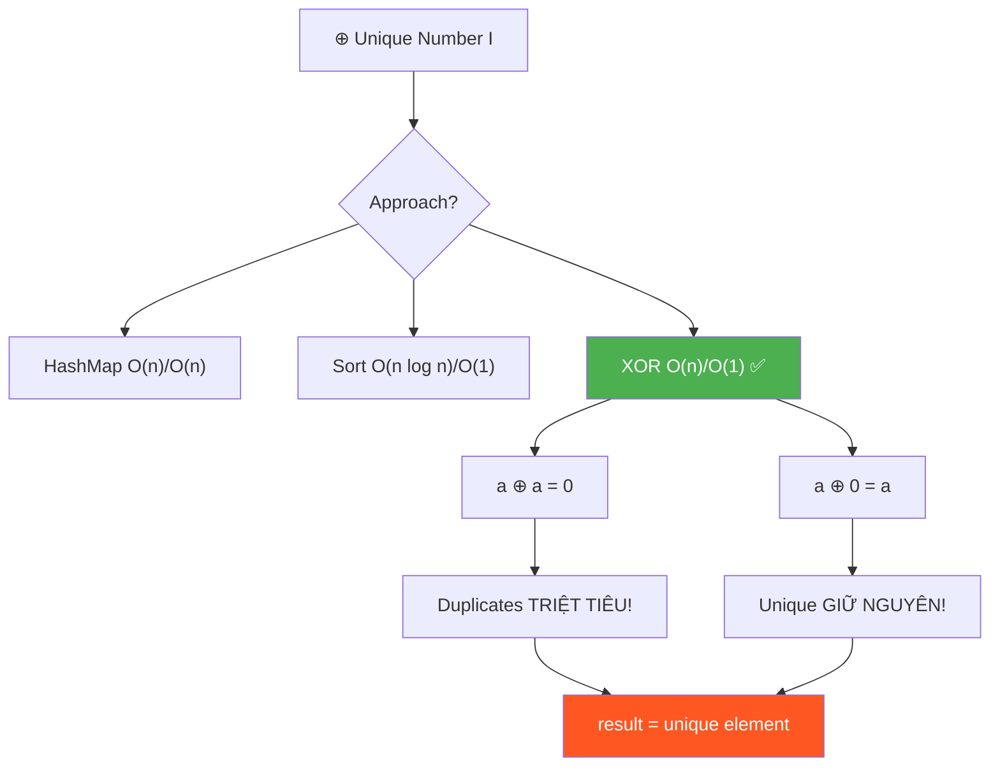
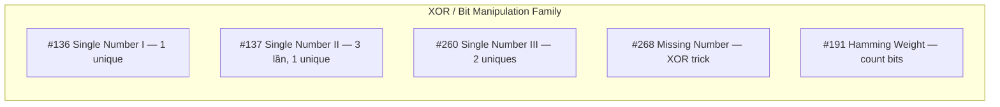
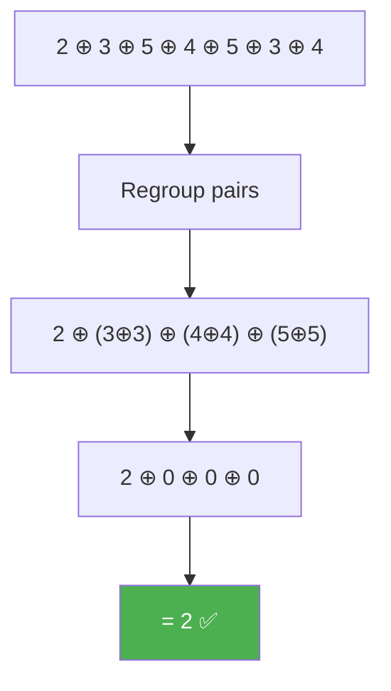
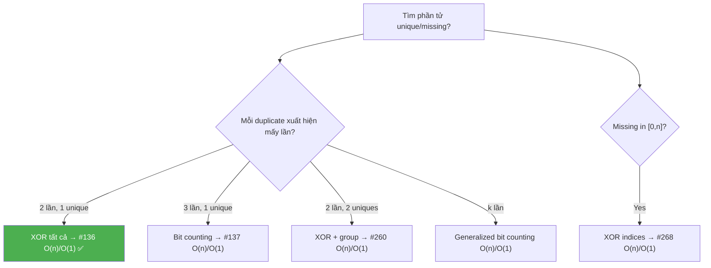

# ⊕ Unique Number I (Single Number) — GfG (Easy) / LeetCode #136

> 📖 Code: [Unique Number I.js](./Unique%20Number%20I.js)





---

## R — Repeat & Clarify

🧠 _"XOR tất cả! a⊕a=0, a⊕0=a → duplicate triệt tiêu, unique còn lại. O(n) time, O(1) space!"_

> 🎙️ _"Given an array where every element appears twice except one, find the element that appears only once."_

### Clarification Questions

```
Q: Mỗi phần tử xuất hiện CHÍNH XÁC 2 lần?
A: Đúng! Ngoại trừ 1 phần tử xuất hiện ĐÚNG 1 lần.

Q: Giá trị có thể âm?
A: Có thể! XOR vẫn hoạt động với số âm (two's complement).

Q: Mảng có thể rỗng?
A: Không, luôn có ít nhất 1 phần tử.

Q: Có thể có 0 trong mảng?
A: Có! XOR với 0: a ⊕ 0 = a → không ảnh hưởng.

Q: Phần tử xuất hiện 3 lần?
A: KHÔNG phải bài này! Đó là bài #137 (cần bit counting).
```

### Tại sao bài này quan trọng?

```
  Bài này dạy XOR — phép toán BIT MANIPULATION cơ bản nhất!

  ┌──────────────────────────────────────────────────────────────┐
  │  XOR là "SWISS ARMY KNIFE" của Bit Manipulation:             │
  │                                                              │
  │  3 tính chất VÀNG:                                           │
  │    1. a ⊕ a = 0         (tự triệt tiêu)                    │
  │    2. a ⊕ 0 = a         (trung hòa)                        │
  │    3. GIAO HOÁN + KẾT HỢP (thứ tự không quan trọng!)       │
  │                                                              │
  │  Áp dụng cho 10+ bài LeetCode:                              │
  │    #136 Single Number, #137 Single Number II,               │
  │    #260 Single Number III, #268 Missing Number,             │
  │    #389 Find the Difference, #1720 XOR Queries...           │
  │                                                              │
  │  📌 "Tìm 1 phần tử khác biệt" → NGHĨ NGAY XOR!           │
  └──────────────────────────────────────────────────────────────┘
```

---

## 🧠 Bản chất bài toán — Hiểu để NHỚ, không chỉ để GIẢI

### XOR là gì? — Giải thích từ ZERO

```
  XOR (Exclusive OR) = ⊕ = ^

  Bảng chân lý (truth table):
  ┌─────┬─────┬─────────┐
  │  A  │  B  │ A ⊕ B   │
  ├─────┼─────┼─────────┤
  │  0  │  0  │    0    │  ← giống → 0
  │  0  │  1  │    1    │  ← khác → 1
  │  1  │  0  │    1    │  ← khác → 1
  │  1  │  1  │    0    │  ← giống → 0
  └─────┴─────┴─────────┘

  📌 XOR = "KHÁC thì 1, GIỐNG thì 0"
     → 2 bit giống nhau → 0 → TRIỆT TIÊU!
     → Đây là lý do a ⊕ a = 0!
```

### Ba tính chất VÀNG của XOR

```
  ┌──────────────────────────────────────────────────────────────┐
  │  1. SELF-INVERSE:  a ⊕ a = 0                               │
  │     5 ^ 5 = 0                                                │
  │     Binary: 101 ^ 101 = 000 ✅                              │
  │     → "XOR với chính mình = TỰ HỦY!"                       │
  │                                                              │
  │  2. IDENTITY:      a ⊕ 0 = a                               │
  │     5 ^ 0 = 5                                                │
  │     Binary: 101 ^ 000 = 101 ✅                              │
  │     → "XOR với 0 = GIỮ NGUYÊN!"                            │
  │                                                              │
  │  3. COMMUTATIVE + ASSOCIATIVE:                               │
  │     a ⊕ b = b ⊕ a                                          │
  │     (a ⊕ b) ⊕ c = a ⊕ (b ⊕ c)                            │
  │     → "THỨ TỰ KHÔNG QUAN TRỌNG!"                           │
  │     → XOR tất cả phần tử, bất kể thứ tự!                   │
  └──────────────────────────────────────────────────────────────┘
```

### Áp dụng cho bài toán — Trực quan

```
  arr = [2, 3, 5, 4, 5, 3, 4]

  XOR tất cả:
    2 ⊕ 3 ⊕ 5 ⊕ 4 ⊕ 5 ⊕ 3 ⊕ 4

  Nhờ tính GIAO HOÁN, sắp xếp lại:
    = 2 ⊕ (3 ⊕ 3) ⊕ (4 ⊕ 4) ⊕ (5 ⊕ 5)
    = 2 ⊕    0     ⊕    0     ⊕    0
    = 2 ⊕ 0
    = 2 ✅

  🧠 Mọi phần tử DUPLICATE → tự triệt tiêu (a ⊕ a = 0)
     Phần tử UNIQUE → XOR với 0 = giữ nguyên (a ⊕ 0 = a)
     → Kết quả = phần tử unique!
```



### XOR hoạt động trên BINARY — Ví dụ bit-by-bit

```
  arr = [4, 1, 2, 1, 2]

  Binary:
    4 = 100
    1 = 001
    2 = 010
    1 = 001
    2 = 010

  XOR từng bước:
    result = 000 (khởi tạo = 0)
    
    000 ⊕ 100 = 100  (XOR với 4)
    100 ⊕ 001 = 101  (XOR với 1)
    101 ⊕ 010 = 111  (XOR với 2)
    111 ⊕ 001 = 110  (XOR với 1 → 1 triệt tiêu!)
    110 ⊕ 010 = 100  (XOR với 2 → 2 triệt tiêu!)
    
    100 = 4 ✅

  🧠 Ở từng bit position:
    Bit 0: 0,1,0,1,0 → XOR = 0  (1 xuất hiện 2 lần → triệt tiêu)
    Bit 1: 0,0,1,0,1 → XOR = 0  (1 xuất hiện 2 lần → triệt tiêu)
    Bit 2: 1,0,0,0,0 → XOR = 1  (1 xuất hiện 1 lần → giữ nguyên!)
    → Result = 100 = 4 ✅
```

---

## 🧭 Luồng Suy Nghĩ — Từ đọc đề đến solution

> 💡 Phần này dạy bạn **CÁCH TƯ DUY** để tự giải bài, không chỉ biết đáp án.

### Bước 1: Đọc đề → Gạch chân KEYWORDS

```
  Đề: "Every element appears twice except one. Find the unique one."

  Gạch chân:
    "appears twice"       → DUPLICATE → cancel out!
    "except one"          → UNIQUE → tìm phần tử này
    "find"                → SEARCH, không phải sort/rearrange

  🧠 Tự hỏi: "Duplicate = cặp = triệt tiêu?"
    → XOR! a ⊕ a = 0!

  📌 Kỹ năng chuyển giao:
    "Mọi phần tử xuất hiện CẶP, trừ 1" → XOR!
    "Tìm phần tử KHÁC BIỆT" → XOR!
    "Tìm số THIẾU trong dãy" → XOR!
```

### Bước 2: Brute Force → "So sánh từng phần tử"

```
  Cách 1: For mỗi phần tử, đếm nó xuất hiện bao nhiêu lần
    → 2 vòng for → O(n²) time, O(1) space

  Cách 2: HashMap đếm frequency
    → 1 vòng đếm, 1 vòng tìm count=1
    → O(n) time, O(n) space

  Cách 3: Sort rồi check cặp liền kề
    → O(n log n) time, O(1) space

  🧠 Tự hỏi: "Có cách O(n) time, O(1) space không?"
    → HashMap tốn O(n) space → có cách tốt hơn?
    → BIT MANIPULATION!
```

### Bước 3: "Duplicate = cặp = triệt tiêu" → XOR!

```
  💡 INSIGHT: XOR tất cả phần tử!
    → Duplicate: a ⊕ a = 0 → BIẾN MẤT!
    → Unique: a ⊕ 0 = a → CÒN LẠI!

  Tại sao O(1) space?
    → Chỉ cần 1 biến result!
    → Không cần Map, Set, hay sort!

  📌 Kỹ năng chuyển giao:
    ┌──────────────────────────────────────────────────────────────┐
    │  Khi cần O(n) time, O(1) space cho "tìm unique":           │
    │    1. Mọi phần tử xuất hiện 2 lần → XOR                   │
    │    2. Mọi phần tử xuất hiện 3 lần → Bit Counting (#137)   │
    │    3. 2 phần tử unique → XOR + Grouping (#260)             │
    │    4. Tìm missing number → XOR indices (#268)              │
    │                                                              │
    │  XOR = "phép cộng cho bài duplicate"                        │
    │  → Cặp tự hủy, unique còn lại!                             │
    └──────────────────────────────────────────────────────────────┘
```

### Bước 4: Tổng kết — Khi nào dùng XOR?



```
  ⭐ QUY TẮC VÀNG:
    "Duplicate xuất hiện CẶP" → XOR!
    "Tìm 1 phần tử KHÁC BIỆT" → XOR!
    "O(1) space + O(n) time" → Bit Manipulation!
```

---

## E — Examples

### Ví dụ minh họa trực quan

```
VÍ DỤ 1: arr = [2, 3, 5, 4, 5, 3, 4]

  XOR chain:
    0 ⊕ 2 = 2
    2 ⊕ 3 = 1       (binary: 10 ⊕ 11 = 01)
    1 ⊕ 5 = 4       (binary: 001 ⊕ 101 = 100)
    4 ⊕ 4 = 0       ← 4 triệt tiêu!
    0 ⊕ 5 = 5       
    5 ⊕ 3 = 6       (binary: 101 ⊕ 011 = 110)
    6 ⊕ 4 = 2       ← 4 triệt tiêu (từ bước trước)!

  Kết quả: 2 ✅

  🧠 Tại sao thứ tự không quan trọng?
     XOR commutative + associative!
     Gộp: 2 ⊕ (3⊕3) ⊕ (4⊕4) ⊕ (5⊕5) = 2 ⊕ 0 ⊕ 0 ⊕ 0 = 2
```

```
VÍ DỤ 2: arr = [2, 2, 5, 5, 20, 30, 30]

  Gộp cặp: (2⊕2) ⊕ (5⊕5) ⊕ 20 ⊕ (30⊕30)
          = 0 ⊕ 0 ⊕ 20 ⊕ 0
          = 20 ✅
```

```
VÍ DỤ 3: arr = [0, 1, 0]

  0 ⊕ 1 ⊕ 0
  = (0⊕0) ⊕ 1
  = 0 ⊕ 1
  = 1 ✅

  🧠 XOR với 0: a ⊕ 0 = a → không ảnh hưởng kết quả!
```

### Trace — XOR bit-by-bit: arr = [4, 1, 2, 1, 2]

```
  ┌──────────────────────────────────────────────────────────────────┐
  │ Start: result = 000 (= 0)                                       │
  ├──────────────────────────────────────────────────────────────────┤
  │ i=0: val=4=100  result = 000 ⊕ 100 = 100 (= 4)                │
  │                                                                  │
  │    0 0 0    bit 2: 0⊕1=1                                        │
  │  ⊕ 1 0 0    bit 1: 0⊕0=0                                       │
  │  ─────────   bit 0: 0⊕0=0                                       │
  │    1 0 0                                                         │
  ├──────────────────────────────────────────────────────────────────┤
  │ i=1: val=1=001  result = 100 ⊕ 001 = 101 (= 5)                │
  ├──────────────────────────────────────────────────────────────────┤
  │ i=2: val=2=010  result = 101 ⊕ 010 = 111 (= 7)                │
  ├──────────────────────────────────────────────────────────────────┤
  │ i=3: val=1=001  result = 111 ⊕ 001 = 110 (= 6)                │
  │   🧠 1 gặp lần 2 → bắt đầu "hủy" bit của 1!                  │
  ├──────────────────────────────────────────────────────────────────┤
  │ i=4: val=2=010  result = 110 ⊕ 010 = 100 (= 4)                │
  │   🧠 2 gặp lần 2 → "hủy" nốt bit của 2!                      │
  │   → Chỉ còn bit của 4 = 100 ✅                                 │
  └──────────────────────────────────────────────────────────────────┘

  → return 4 ✅
```

---

## A — Approach

### Approach 1: HashMap — O(n) time, O(n) space

```
  ┌──────────────────────────────────────────────────────────────┐
  │  Pass 1: Đếm frequency mỗi phần tử                          │
  │    map = { value → count }                                   │
  │                                                              │
  │  Pass 2: Tìm phần tử có count = 1                           │
  │                                                              │
  │  Time: O(n)    Space: O(n) ← Map chứa n/2 entries          │
  │  → Quá tốn memory!                                          │
  └──────────────────────────────────────────────────────────────┘
```

### Approach 2: Sort + Pair Check — O(n log n), O(1)

```
  ┌──────────────────────────────────────────────────────────────┐
  │  1. Sort mảng                                                │
  │  2. Duyệt từng CẶP (i, i+1):                               │
  │     Nếu arr[i] ≠ arr[i+1] → arr[i] là unique!              │
  │  3. Nếu không tìm thấy → phần tử CUỐI CÙNG là unique      │
  │                                                              │
  │  Time: O(n log n)    Space: O(1)                             │
  │  → Tốt hơn HashMap về space, nhưng chậm hơn XOR về time!  │
  └──────────────────────────────────────────────────────────────┘

  Ví dụ: [2, 3, 5, 4, 5, 3, 4]
  Sort:  [2, 3, 3, 4, 4, 5, 5]
  Pairs: (2,3)❌ → 2 là unique! ✅
```

### Approach 3: XOR — O(n) time, O(1) space ✅

```
  💡 XOR tất cả phần tử → duplicate triệt tiêu!

  ┌──────────────────────────────────────────────────────────────┐
  │  result = 0                                                   │
  │  for val of arr:                                              │
  │    result ^= val                                              │
  │                                                              │
  │  return result                                                │
  │                                                              │
  │  Time: O(n)    Space: O(1)                                   │
  │  → TỐI ƯU NHẤT! 3 dòng code!                               │
  └──────────────────────────────────────────────────────────────┘
```

---

## C — Code

### Solution 1: HashMap — O(n)/O(n)

```javascript
function uniqueNumberMap(arr) {
  const freq = new Map();
  for (const val of arr) {
    freq.set(val, (freq.get(val) || 0) + 1);
  }
  for (const [key, count] of freq) {
    if (count === 1) return key;
  }
  return -1;
}
```

```
  📝 Line-by-line:

  Line 4: freq.set(val, (freq.get(val) || 0) + 1)
    → freq.get(val) || 0: nếu chưa có → 0, có rồi → count hiện tại
    → + 1: tăng count lên 1
    → Pattern: "default value" cho Map — rất phổ biến!

    ⚠️ Tại sao || 0 chứ không phải ?? 0?
       → || 0: falsy check (0, null, undefined → 0)
       → ?? 0: nullish check (chỉ null, undefined → 0)
       → Ở đây count luôn > 0 nên || đủ!
```

### Solution 2: Sort + Pair Check — O(n log n)/O(1)

```javascript
function uniqueNumberSort(arr) {
  const sorted = [...arr].sort((a, b) => a - b);
  for (let i = 0; i < sorted.length - 1; i += 2) {
    if (sorted[i] !== sorted[i + 1]) return sorted[i];
  }
  return sorted[sorted.length - 1];
}
```

```
  📝 Line-by-line:

  Line 3: for (let i = 0; i < sorted.length - 1; i += 2)
    → Duyệt từng CẶP: (0,1), (2,3), (4,5), ...
    → Bước nhảy 2!

  Line 4: if (sorted[i] !== sorted[i + 1]) return sorted[i]
    → Cặp KHÔNG khớp → sorted[i] là unique!
    → Vì sort: [2, 3, 3, 4, 4, 5, 5]
       (2,3)❌ → 2 unique!

  Line 6: return sorted[sorted.length - 1]
    → Unique ở CUỐI CÙNG! (tất cả cặp trước đều khớp)
    → Ví dụ: [1, 1, 2, 2, 5] → 5 ở cuối
```

### Solution 3: XOR — O(n)/O(1) ✅

```javascript
function uniqueNumberXOR(arr) {
  let result = 0;
  for (const val of arr) {
    result ^= val;
  }
  return result;
}
```

```
  📝 Line-by-line:

  Line 2: let result = 0
    → Khởi tạo = 0 vì a ⊕ 0 = a (identity element)
    → ⚠️ Nếu khởi tạo = 1 → SAI! (thêm 1 vào XOR chain!)

  Line 3-5: for (const val of arr) result ^= val
    → XOR từng phần tử vào result
    → ^= là shorthand: result = result ^ val
    → Duplicate tự triệt tiêu, unique còn lại!

  🧠 Code CỰC KỲ NGẮN! Có thể viết 1 dòng:
    return arr.reduce((xor, val) => xor ^ val, 0);
    → reduce với operator ^ và initial = 0
```

---

## ❌ Common Mistakes — Lỗi thường gặp

### Mistake 1: Khởi tạo result sai

```javascript
// ❌ SAI: khởi tạo = arr[0] rồi bắt đầu từ index 1
// ĐÚNG nhưng THIẾU an toàn
let result = arr[0];
for (let i = 1; i < arr.length; i++) {
  result ^= arr[i];
}
// → Đúng nhưng mảng rỗng → lỗi!

// ✅ AN TOÀN HƠN: khởi tạo = 0, bắt đầu từ index 0
let result = 0;
for (const val of arr) result ^= val;
```

### Mistake 2: Nhầm XOR với AND/OR

```javascript
// ❌ SAI: dùng AND — mất bit!
result &= val;  // AND: 101 & 011 = 001 ← mất thông tin!

// ❌ SAI: dùng OR — không triệt tiêu!
result |= val;  // OR: 101 | 101 = 101 ← KHÔNG hủy!

// ✅ ĐÚNG: XOR — triệt tiêu duplicate!
result ^= val;  // XOR: 101 ^ 101 = 000 ← TRIỆT TIÊU! ✅
```

### Mistake 3: Sort — quên duplicate ở cuối

```javascript
// ❌ SAI: chỉ check pairs, quên phần tử cuối!
for (let i = 0; i < sorted.length - 1; i += 2) {
  if (sorted[i] !== sorted[i + 1]) return sorted[i];
}
// Nếu unique ở cuối: [1,1,2,2,5] → loop hết → KHÔNG return!

// ✅ ĐÚNG: thêm return cuối!
return sorted[sorted.length - 1]; // unique ở cuối cùng!
```

### Mistake 4: Nghĩ XOR không hoạt động với số 0

```
// Lo lắng: "0 XOR gì đó có vấn đề?"
// → KHÔNG! a ⊕ 0 = a → 0 là identity → an toàn!
// [0, 1, 0] → 0⊕1⊕0 = 1 ✅
```

---

## O — Optimize

```
                      Time       Space     Ghi chú
  ─────────────────────────────────────────────────────────────
  Brute Force (2 for) O(n²)      O(1)      So sánh từng cặp
  HashMap             O(n)       O(n)      Đếm frequency
  Sort + Pair         O(n log n) O(1)*     *nếu in-place sort
  XOR ✅              O(n)       O(1)      3 dòng code!

  📌 XOR = O(n) time + O(1) space = LOWER BOUND!
     Không thể tốt hơn (phải đọc mỗi phần tử ít nhất 1 lần!)
```

---

## T — Test

```
Test Cases:
  [2,3,5,4,5,3,4]       → 2    ✅ Unique ở đầu
  [2,2,5,5,20,30,30]     → 20   ✅ Unique ở giữa (đã sorted)
  [1]                     → 1    ✅ Single element
  [4,1,2,1,2]             → 4    ✅ LeetCode example
  [7,3,5,3,5,7,99]        → 99   ✅ Unique ở cuối
  [0,1,0]                 → 1    ✅ Có 0 trong mảng
```

### Edge Cases giải thích

```
  ┌──────────────────────────────────────────────────────────────┐
  │  Single element:    [5] → 5⊕0 = 5 ✅                       │
  │                                                              │
  │  Có 0 trong mảng:  [0,1,0] → 0⊕1⊕0 = 1 ✅                │
  │    0 là identity → không ảnh hưởng!                          │
  │                                                              │
  │  Số âm:            [-1, 2, -1] → (-1)⊕2⊕(-1) = 2 ✅       │
  │    XOR hoạt động trên two's complement bits!                 │
  │                                                              │
  │  Số lớn:           [2³¹-1, 0, 2³¹-1] → 0 ✅                │
  │    XOR hoạt động trên 32-bit integers!                       │
  └──────────────────────────────────────────────────────────────┘
```

---

## 🗣️ Interview Script

### 🎙️ Think Out Loud — Mô phỏng phỏng vấn thực

> ⚠️ Script này dạy cách **NÓI**, không phải cách CODE.
> Mỗi đoạn = cách bạn **PHÁT BIỂU** trong phỏng vấn thực!

```
  ╔══════════════════════════════════════════════════════════════╗
  ║  🕐 FULL INTERVIEW SIMULATION — 1h30 (90 phút)             ║
  ║                                                              ║
  ║  00:00-05:00  Introduction + Icebreaker         (5 min)     ║
  ║  05:00-45:00  Problem Solving                   (40 min)    ║
  ║  45:00-60:00  Deep Technical Probing            (15 min)    ║
  ║  60:00-75:00  Variations + Extensions           (15 min)    ║
  ║  75:00-85:00  System Design at Scale            (10 min)    ║
  ║  85:00-90:00  Behavioral + Q&A                  (5 min)     ║
  ╚══════════════════════════════════════════════════════════════╝
```

```
  ╔══════════════════════════════════════════════════════════════╗
  ║  PART 1: INTRODUCTION (00:00 — 05:00)                       ║
  ╚══════════════════════════════════════════════════════════════╝

  👤 "Tell me about yourself and a time you used
      bit manipulation to solve a real problem."

  🧑 "I'm a frontend engineer with [X] years of experience.
      A relevant example: I worked on a real-time
      data sync system where messages could arrive
      duplicated. Each message had a unique 32-bit ID.

      To detect the single un-acknowledged message
      among a sea of paired ACK-and-original messages,
      I XOR'd all message IDs as they arrived.
      Duplicates cancelled (a XOR a equals 0),
      leaving only the un-acknowledged ID.

      O of 1 space, O of n time, no HashMap needed.
      That's exactly LeetCode 136 — Single Number."

  👤 "Clean engineering. Let's formalize."
```

```
  ╔══════════════════════════════════════════════════════════════╗
  ║  PART 2: PROBLEM SOLVING (05:00 — 45:00)                   ║
  ╚══════════════════════════════════════════════════════════════╝

  ──────────────── 05:00 — Clarify (3 phút) ────────────────

  👤 "Find the element that appears once in an array
      where every other appears exactly twice."

  🧑 "Let me clarify.

      Exactly ONE element appears once.
      ALL other elements appear exactly TWICE.
      Not three times, not zero — exactly twice.

      Elements can be negative or zero.
      The array is non-empty: at least one element.

      I need to return the unique element's value.

      Key observation: the array has odd length.
      n minus 1 elements are in pairs (even count),
      plus the one unique element. Total is odd."

  ──────────────── 08:00 — Light Switch Analogy (3 phút) ────────

  🧑 "I think of this as a LIGHT SWITCH analogy.

      Each element is a light switch.
      Flipping a switch once: it turns ON.
      Flipping the SAME switch again: it turns OFF.

      If every switch is flipped exactly twice,
      all lights are OFF. But one switch is flipped
      only ONCE — it stays ON.

      XOR is the mathematical equivalent of a flip:
      a XOR a equals 0 — flipped twice, back to off.
      a XOR 0 equals a — flipped once, stays on.

      XOR all values together:
      duplicates cancel (double flip = off),
      the unique element remains (single flip = on)."

  ──────────────── 11:00 — Three approaches (4 phút) ────────────

  🧑 "I see three approaches.

      First: HASHMAP. Count the frequency of each element.
      Iterate the map to find the one with count 1.
      O of n time. O of n space. Works but wasteful.

      Second: SORT. Sort the array, then check pairs.
      If sorted at i doesn't equal sorted at i+1,
      sorted at i is unique. O of n log n time.
      O of 1 space (if in-place sort).

      Third: XOR. XOR all elements together.
      Duplicates cancel. Unique remains.
      O of n time. O of 1 space. OPTIMAL.

      I'll code the XOR approach."

  ──────────────── 15:00 — XOR deep dive (5 phút) ────────────

  🧑 "Three golden properties of XOR:

      ONE — Self inverse: a XOR a equals 0.
      Any value XOR'd with itself cancels to zero.
      This is why duplicates vanish.

      TWO — Identity: a XOR 0 equals a.
      Zero is the identity element.
      The unique value, XOR'd with zero, is itself.

      THREE — Commutative and associative.
      a XOR b equals b XOR a.
      (a XOR b) XOR c equals a XOR (b XOR c).
      ORDER DOESN'T MATTER. I can rearrange the XOR
      chain to group duplicates together.

      Let me trace [2, 3, 5, 4, 5, 3, 4]:

      Rearranged: 2 XOR (3 XOR 3) XOR (4 XOR 4) XOR (5 XOR 5)
      equals 2 XOR 0 XOR 0 XOR 0
      equals 2. The unique element.

      Of course, I don't actually rearrange.
      I just XOR left to right. Commutativity ensures
      the result is the same regardless of order."

  ──────────────── 20:00 — Write Code (2 phút) ────────────────

  🧑 "The code.

      [Vừa viết vừa nói:]

      function singleNumber of arr.
      let result equals 0.

      for const val of arr:
        result XOR-equals val.

      return result.

      Four lines. Or as a one-liner:
      return arr dot reduce of (xor, val) arrow xor XOR val, 0.

      Initial value is 0 because XOR with 0
      is the identity operation."

  ──────────────── 22:00 — Trace bit-by-bit (4 phút) ────────────

  🧑 "Let me trace at the bit level for [4, 1, 2, 1, 2].

      4 equals 100 in binary.
      1 equals 001.
      2 equals 010.

      result starts at 000.

      000 XOR 100 equals 100. (XOR with 4)
      100 XOR 001 equals 101. (XOR with 1)
      101 XOR 010 equals 111. (XOR with 2)
      111 XOR 001 equals 110. (XOR with 1 — cancels!)
      110 XOR 010 equals 100. (XOR with 2 — cancels!)

      100 equals 4. The unique element.

      At each bit position independently:
      Bit 0: 0, 1, 0, 1, 0 — two 1s cancel. Result: 0.
      Bit 1: 0, 0, 1, 0, 1 — two 1s cancel. Result: 0.
      Bit 2: 1, 0, 0, 0, 0 — one 1 remains. Result: 1.

      Each bit position acts INDEPENDENTLY.
      XOR processes all 32 bits in parallel!"

  ──────────────── 26:00 — Edge Cases (3 phút) ────────────────

  🧑 "Edge cases.

      Single element [5]: 0 XOR 5 equals 5. Trivial.

      Zeros in the array [0, 1, 0]:
      0 XOR 1 XOR 0 equals 1.
      Zero is the identity — it doesn't affect the result.

      Negative numbers [-1, 2, -1]:
      XOR works on two's complement representation.
      (-1) XOR 2 XOR (-1) equals 2. Correct.

      Large numbers [2 to the 31 minus 1, 0, 2 to the 31 minus 1]:
      XOR handles 32-bit integers natively.
      Result: 0."

  ──────────────── 29:00 — Complexity (3 phút) ────────────────

  🧑 "Time: O of n. Single pass. Each element is XOR'd once.
      XOR is a constant-time bitwise operation.

      Space: O of 1. One variable for the result.

      This is PROVABLY OPTIMAL.
      Any algorithm must read every element at least once
      (any unread element could be the unique one).
      Omega of n is the lower bound.

      XOR achieves O of n time with O of 1 space.
      No other approach matches both simultaneously:
      HashMap is O of n time but O of n space.
      Sort is O of 1 space but O of n log n time."

  ──────────────── 32:00 — Why not other bit ops? (3 phút) ────────

  👤 "Why XOR specifically? Why not AND or OR?"

  🧑 "AND loses information. 101 AND 011 equals 001.
      I can't recover the original values.
      AND is DESTRUCTIVE — it only keeps common bits.

      OR accumulates information. 101 OR 101 equals 101.
      It doesn't cancel! a OR a equals a, not 0.
      OR is MONOTONIC — bits only turn ON, never OFF.

      XOR is the unique operation that:
      is its own INVERSE (a XOR a equals 0),
      is NON-DESTRUCTIVE (a XOR 0 equals a),
      and COMMUTATIVE.

      This makes XOR the only bitwise operation
      suitable for cancellation."

  ──────────────── 35:00 — Initialize to 0, not arr[0] (2 phút) ────

  👤 "Why initialize result to 0?"

  🧑 "Because 0 is the IDENTITY element for XOR.
      a XOR 0 equals a.

      If I initialize to arr at 0 and start from index 1,
      it works too — but it crashes on an empty array.

      Initializing to 0 and starting from index 0
      is SAFER and mathematically clean:
      result equals 0 XOR arr[0] XOR arr[1] XOR ... XOR arr[n-1].
      The leading 0 has no effect."

  ──────────────── 37:00 — Connection to Missing Number (3 phút) ──

  👤 "How is this related to finding a missing number?"

  🧑 "LeetCode 268 — Missing Number.
      Array contains 0 to n but one is missing.

      I XOR all array elements with all indices 0 to n.
      Each value from 0 to n appears in BOTH sets,
      except the missing one — it appears only in indices.

      XOR cancels all pairs. The missing number remains.

      It's the SAME principle: create pairs that cancel,
      leaving the single unpaired value.

      result equals 0.
      for i from 0 to n-1:
        result XOR-equals i XOR arr at i.
      result XOR-equals n.
      return result."
```

```
  ╔══════════════════════════════════════════════════════════════╗
  ║  PART 3: DEEP TECHNICAL PROBING (45:00 — 60:00)            ║
  ╚══════════════════════════════════════════════════════════════╝

  ──────────────── 45:00 — Group theory proof (4 phút) ────────────

  👤 "Can you prove XOR works formally?"

  🧑 "XOR over integers forms an ABELIAN GROUP.

      Closure: a XOR b is an integer.
      Associativity: (a XOR b) XOR c = a XOR (b XOR c).
      Identity: a XOR 0 = a.
      Inverse: a XOR a = 0. Every element is its own inverse.
      Commutativity: a XOR b = b XOR a.

      Given array = {x, a1, a1, a2, a2, ..., ak, ak}:

      XOR all = x XOR (a1 XOR a1) XOR ... XOR (ak XOR ak)
              = x XOR 0 XOR 0 XOR ... XOR 0
              = x.

      By the group inverse property, each pair cancels.
      By the identity property, x remains.
      QED."

  ──────────────── 49:00 — Bit independence (3 phút) ────────────

  👤 "Why does XOR work across multiple bits?"

  🧑 "XOR is a BITWISE operation.
      It processes each bit position INDEPENDENTLY.

      At bit position b:
      I have n bits, each 0 or 1.
      XOR of these bits equals the PARITY —
      1 if an odd number of 1s, 0 if even.

      For duplicate elements: their bit at position b
      appears TWICE. Even count. Parity: 0. Cancelled.

      For the unique element: its bit appears ONCE.
      Odd count. Parity: 1 (if the bit was 1)
      or 0 (if the bit was 0). Preserved.

      So the final result has the EXACT bit pattern
      of the unique element. Each bit independently
      preserved or cancelled."

  ──────────────── 52:00 — Three times variant (#137) (4 phút) ────

  👤 "What if every other element appears three times?"

  🧑 "LeetCode 137 — Single Number II.
      XOR alone FAILS because a XOR a XOR a equals a,
      NOT 0. Three copies don't cancel.

      The fix: count bits MODULO 3.

      For each of the 32 bit positions:
      count how many elements have a 1 at that position.
      Take count modulo 3. If the result is 1,
      the unique element has a 1 there.

      Implementation with two variables:
      ones and twos track bit counts mod 3.
      ones holds bits seen once.
      twos holds bits seen twice.
      When a bit is seen thrice, it's cleared from both.

      O of n time, O of 1 space.
      Generalizes to k times using log2(k) state variables."

  ──────────────── 56:00 — Two uniques variant (#260) (4 phút) ────

  👤 "What if there are TWO unique elements?"

  🧑 "LeetCode 260 — Single Number III.

      XOR all elements gives xorAll equals a XOR b,
      where a and b are the two unique elements.

      xorAll has at least one set bit (since a ≠ b).
      I find the RIGHTMOST set bit using:
      diffBit equals xorAll AND negative xorAll.

      This bit differs between a and b.
      I partition all elements into two groups:
      Group 1: elements with this bit set.
      Group 2: elements without this bit set.

      Each group contains exactly ONE unique element
      plus pairs of duplicates. XOR each group
      separately gives a and b.

      O of n time (two passes), O of 1 space.
      The 'rightmost set bit' trick is key."
```

```
  ╔══════════════════════════════════════════════════════════════╗
  ║  PART 4: VARIATIONS (60:00 — 75:00)                         ║
  ╚══════════════════════════════════════════════════════════════╝

  ──────────────── 60:00 — Find the Difference (#389) (3 phút) ────

  👤 "What about finding an extra character
      added to a string?"

  🧑 "LeetCode 389 — Find the Difference.
      String t is string s with one extra character.

      XOR all chars in s, then XOR all chars in t.
      Every character in s appears in both s and t —
      they cancel. The extra character remains.

      Same as Single Number but with character codes.
      XOR treats char codes as integers.

      Or equivalently: sum of t minus sum of s
      gives the extra character's code.
      But XOR avoids potential integer overflow."

  ──────────────── 63:00 — XOR queries on subarrays (#1720) (3 phút)

  👤 "What about XOR queries on subarrays?"

  🧑 "LeetCode 1720 — XOR Queries of Subarrays.
      Given queries [left, right], compute XOR of
      arr[left] to arr[right] for each query.

      I build a PREFIX XOR array:
      prefix at i equals arr[0] XOR arr[1] XOR ... XOR arr[i].

      Then XOR of arr[left..right] equals
      prefix at right XOR prefix at left minus 1.

      This works because XOR is self-inverse:
      the prefix up to left-1 cancels out.

      Build prefix: O of n.
      Each query: O of 1.
      Total: O of n plus Q.

      Same idea as prefix sum but with XOR instead of addition."

  ──────────────── 66:00 — Swap without temp variable (2 phút) ────

  👤 "What about the XOR swap trick?"

  🧑 "A classic bit manipulation trick:

      a XOR-equals b. Now a = original_a XOR b.
      b XOR-equals a. Now b = original_a XOR b XOR b = original_a.
      a XOR-equals b. Now a = original_a XOR b XOR original_a = original_b.

      Three XOR operations swap a and b without a temp variable.

      Caveat: fails when a and b point to the SAME memory location
      (a XOR a equals 0 — wipes the value).
      In practice, a temp variable is clearer and equally fast.
      But it demonstrates XOR's self-inverse property."

  ──────────────── 68:00 — Generalize to k occurrences (4 phút) ────

  👤 "Can you generalize to every element appearing k times?"

  🧑 "For k occurrences and one unique element:

      If k is even: XOR works directly!
      a XOR'd k times (even) cancels to 0.

      If k is odd: XOR alone fails.
      a XOR'd k times (odd) equals a, not 0.

      General solution: bit counting modulo k.
      For each of 32 bit positions:
      count 1s, take mod k. If non-zero,
      the unique element has a 1 there.

      Time: O of 32n. Space: O of 1.

      For k equals 2: XOR suffices (this problem).
      For k equals 3: bit counting mod 3 (#137).
      For any k: bit counting mod k."

  ──────────────── 72:00 — Single Number family summary (3 phút) ──

  🧑 "The Single Number family:

      136: every other appears 2 times, 1 unique.
      XOR all. O of n, O of 1.

      137: every other appears 3 times, 1 unique.
      Bit counting mod 3. O of n, O of 1.

      260: every other appears 2 times, 2 uniques.
      XOR all plus partition by differing bit. O of n, O of 1.

      268: Missing number in [0..n].
      XOR all values with all indices. O of n, O of 1.

      389: Extra character in string.
      XOR all chars. O of n, O of 1.

      The common thread: XOR's self-inverse property
      enables O of 1 space solutions where HashMap
      would use O of n space."
```

```
  ╔══════════════════════════════════════════════════════════════╗
  ║  PART 5: SYSTEM DESIGN AT SCALE (75:00 — 85:00)            ║
  ╚══════════════════════════════════════════════════════════════╝

  ──────────────── 75:00 — Real-world applications (5 phút) ────────

  👤 "Where does XOR cancellation appear in real systems?"

  🧑 "Several critical domains!

      First — ERROR DETECTION (Parity bits).
      Network packets include XOR-based checksums.
      The receiver XORs all received bits.
      If the result is 0: no error.
      If non-zero: error detected.
      Single Number is this same principle: XOR reveals
      the 'odd one out.'

      Second — RAID STORAGE.
      RAID 5 uses XOR to compute parity across disks.
      If disk A fails: data equals XOR of all other disks
      plus parity. This is XOR's self-inverse at work.

      Third — NETWORK DEDUPLICATION.
      In message queuing (like Kafka consumers),
      messages can arrive duplicated. XOR-based
      deduplication tracks which messages are unpaired
      without storing all message IDs.

      Fourth — CRYPTOGRAPHIC STREAM CIPHERS.
      XOR is the core operation in one-time pad encryption.
      plaintext XOR key equals ciphertext.
      ciphertext XOR key equals plaintext.
      Self-inverse makes XOR perfect for encryption."

  ──────────────── 80:00 — Streaming XOR (5 phút) ────────────────

  👤 "Can this work in a streaming context?"

  🧑 "Perfectly! XOR is inherently streaming-friendly.

      I maintain a single accumulator variable.
      For each new element: accumulator XOR-equals element.
      At any point, the accumulator holds the XOR of
      all elements seen so far.

      O of 1 per element. O of 1 total space.
      No buffering required.

      This is used in practice for:
      1. Real-time checksum computation in network protocols.
      2. Incremental hash computation for data integrity.
      3. Online deduplication in event processing systems.

      Even if elements arrive out of order,
      commutativity guarantees the same result.
      This is a strong property: I can process
      elements from multiple threads and XOR
      the partial results. Thread-safe with atomics."
```

```
  ╔══════════════════════════════════════════════════════════════╗
  ║  PART 6: BEHAVIORAL + Q&A (85:00 — 90:00)                  ║
  ╚══════════════════════════════════════════════════════════════╝

  ──────────────── 85:00 — Reflection (3 phút) ────────────────

  👤 "What would you take away from this problem?"

  🧑 "Three things.

      First, XOR is the SWISS ARMY KNIFE of bit manipulation.
      Three properties — self-inverse, identity, commutativity —
      solve an entire family of problems.
      Whenever I see 'find the unique element,'
      XOR is my first thought.

      Second, MATCH THE CONSTRAINT to the technique.
      HashMap gives O of n time but O of n space.
      Sort gives O of 1 space but O of n log n time.
      XOR achieves BOTH O of n time AND O of 1 space.
      The constraint 'O(1) space' is the trigger for
      bit manipulation thinking.

      Third, the problem GENERALIZES beautifully.
      136 to 137: change k from 2 to 3.
      136 to 260: change unique count from 1 to 2.
      136 to 268: change 'duplicate' to 'complete sequence.'
      Understanding the base case (XOR cancellation)
      unlocks the entire family."

  ──────────────── 88:00 — Questions (2 phút) ────────────────

  👤 "Any questions for me?"

  🧑 "A few!

      First — XOR-based error detection is fundamental
      to networking. Does your infrastructure use
      custom checksums, or standard protocols like CRC?

      Second — the streaming XOR pattern is thread-safe
      with atomic XOR operations. Does your system
      leverage lock-free XOR accumulation for
      real-time deduplication?

      Third — RAID uses XOR for disk parity.
      In your distributed storage, do you use similar
      erasure coding schemes that generalize XOR
      to Reed-Solomon codes?"

  👤 "Excellent! The group theory proof was unexpected
      and showed real depth. Your progression from
      136 through 137, 260, 268 demonstrated mastery
      of the entire family. We'll be in touch!"
```

```
  ╔══════════════════════════════════════════════════════════════╗
  ║  ⭐ 8 MẸO NÓI CHUYỆN TRONG PHỎNG VẤN (Unique Number I)  ║
  ╚══════════════════════════════════════════════════════════════╝

  📌 MẸO #1: State the three XOR properties immediately
     ✅ "a XOR a equals 0 — self-inverse.
         a XOR 0 equals a — identity.
         Commutative and associative — order doesn't matter."

  📌 MẸO #2: Name all three approaches, choose XOR
     ✅ "HashMap: O(n)/O(n).
         Sort: O(n log n)/O(1).
         XOR: O(n)/O(1) — optimal on both axes."

  📌 MẸO #3: Use the light switch analogy
     ✅ "Flipping a switch twice: back to OFF.
         Flipping once: stays ON.
         XOR all — duplicates flip off, unique stays on."

  📌 MẸO #4: Trace at the bit level
     ✅ "XOR processes each bit independently.
         At each position: even 1s cancel, odd 1s remain.
         The final result has the unique element's exact bits."

  📌 MẸO #5: Explain why 0 is the initial value
     ✅ "Zero is the identity element for XOR.
         a XOR 0 equals a.
         Starting from 0 adds nothing to the chain."

  📌 MẸO #6: Distinguish XOR from AND/OR
     ✅ "AND loses information — destructive.
         OR doesn't cancel — monotonic.
         XOR cancels duplicates — self-inverse."

  📌 MẸO #7: Present the family progression
     ✅ "136: 2 times, 1 unique → XOR.
         137: 3 times, 1 unique → bit counting mod 3.
         260: 2 times, 2 uniques → XOR + partition.
         268: missing number → XOR with indices."

  📌 MẸO #8: Connect to real systems
     ✅ "Parity bits, RAID storage, stream ciphers,
         network deduplication — all use XOR's
         self-inverse property at their core."
```

