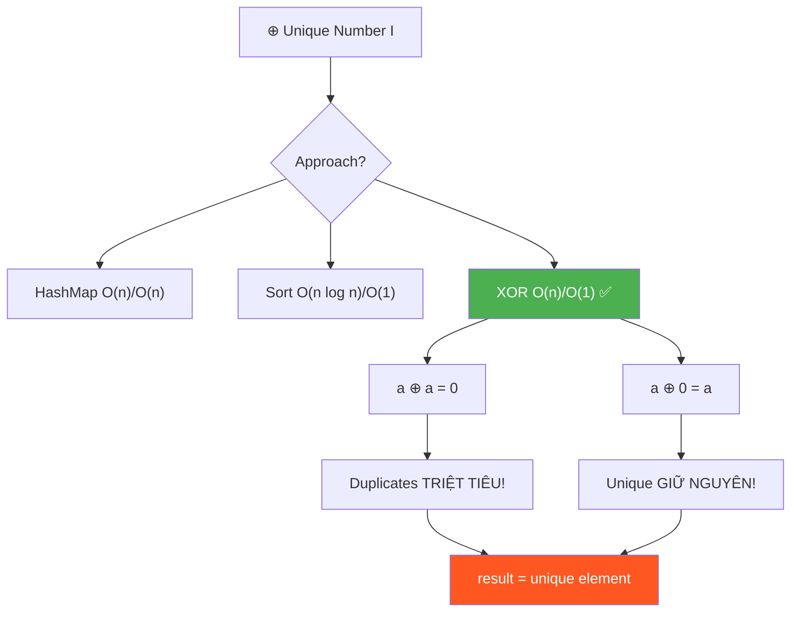
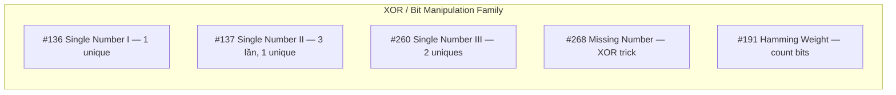
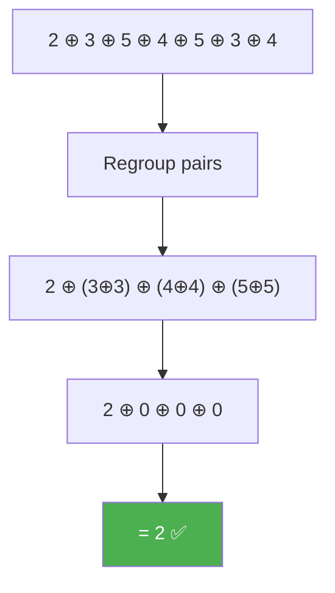
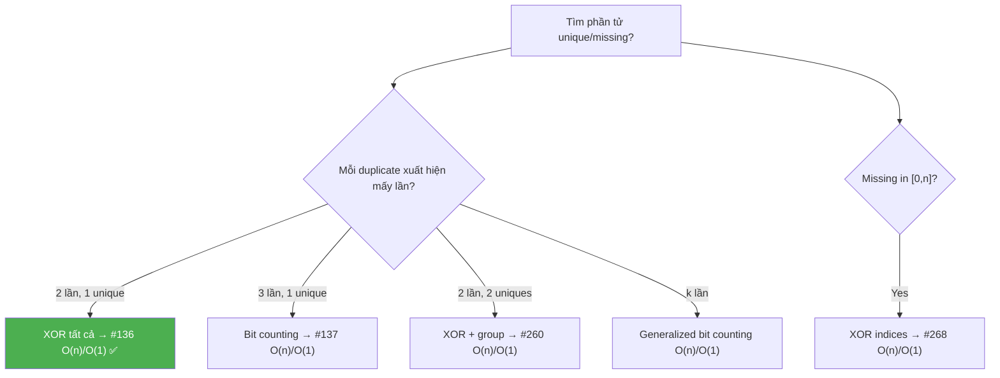

# ⊕ Unique Number I (Single Number) — GfG (Easy) / LeetCode #136

> 📖 Code: [Unique Number I.js](./Unique%20Number%20I.js)





---

## R — Repeat & Clarify

🧠 _"XOR tất cả! a⊕a=0, a⊕0=a → duplicate triệt tiêu, unique còn lại. O(n) time, O(1) space!"_

> 🎙️ _"Given an array where every element appears twice except one, find the element that appears only once."_

### Clarification Questions

```
Q: Mỗi phần tử xuất hiện CHÍNH XÁC 2 lần?
A: Đúng! Ngoại trừ 1 phần tử xuất hiện ĐÚNG 1 lần.

Q: Giá trị có thể âm?
A: Có thể! XOR vẫn hoạt động với số âm (two's complement).

Q: Mảng có thể rỗng?
A: Không, luôn có ít nhất 1 phần tử.

Q: Có thể có 0 trong mảng?
A: Có! XOR với 0: a ⊕ 0 = a → không ảnh hưởng.

Q: Phần tử xuất hiện 3 lần?
A: KHÔNG phải bài này! Đó là bài #137 (cần bit counting).
```

### Tại sao bài này quan trọng?

```
  Bài này dạy XOR — phép toán BIT MANIPULATION cơ bản nhất!

  ┌──────────────────────────────────────────────────────────────┐
  │  XOR là "SWISS ARMY KNIFE" của Bit Manipulation:             │
  │                                                              │
  │  3 tính chất VÀNG:                                           │
  │    1. a ⊕ a = 0         (tự triệt tiêu)                    │
  │    2. a ⊕ 0 = a         (trung hòa)                        │
  │    3. GIAO HOÁN + KẾT HỢP (thứ tự không quan trọng!)       │
  │                                                              │
  │  Áp dụng cho 10+ bài LeetCode:                              │
  │    #136 Single Number, #137 Single Number II,               │
  │    #260 Single Number III, #268 Missing Number,             │
  │    #389 Find the Difference, #1720 XOR Queries...           │
  │                                                              │
  │  📌 "Tìm 1 phần tử khác biệt" → NGHĨ NGAY XOR!           │
  └──────────────────────────────────────────────────────────────┘
```

---

## 🧠 Bản chất bài toán — Hiểu để NHỚ, không chỉ để GIẢI

### XOR là gì? — Giải thích từ ZERO

```
  XOR (Exclusive OR) = ⊕ = ^

  Bảng chân lý (truth table):
  ┌─────┬─────┬─────────┐
  │  A  │  B  │ A ⊕ B   │
  ├─────┼─────┼─────────┤
  │  0  │  0  │    0    │  ← giống → 0
  │  0  │  1  │    1    │  ← khác → 1
  │  1  │  0  │    1    │  ← khác → 1
  │  1  │  1  │    0    │  ← giống → 0
  └─────┴─────┴─────────┘

  📌 XOR = "KHÁC thì 1, GIỐNG thì 0"
     → 2 bit giống nhau → 0 → TRIỆT TIÊU!
     → Đây là lý do a ⊕ a = 0!
```

### Ba tính chất VÀNG của XOR

```
  ┌──────────────────────────────────────────────────────────────┐
  │  1. SELF-INVERSE:  a ⊕ a = 0                               │
  │     5 ^ 5 = 0                                                │
  │     Binary: 101 ^ 101 = 000 ✅                              │
  │     → "XOR với chính mình = TỰ HỦY!"                       │
  │                                                              │
  │  2. IDENTITY:      a ⊕ 0 = a                               │
  │     5 ^ 0 = 5                                                │
  │     Binary: 101 ^ 000 = 101 ✅                              │
  │     → "XOR với 0 = GIỮ NGUYÊN!"                            │
  │                                                              │
  │  3. COMMUTATIVE + ASSOCIATIVE:                               │
  │     a ⊕ b = b ⊕ a                                          │
  │     (a ⊕ b) ⊕ c = a ⊕ (b ⊕ c)                            │
  │     → "THỨ TỰ KHÔNG QUAN TRỌNG!"                           │
  │     → XOR tất cả phần tử, bất kể thứ tự!                   │
  └──────────────────────────────────────────────────────────────┘
```

### Áp dụng cho bài toán — Trực quan

```
  arr = [2, 3, 5, 4, 5, 3, 4]

  XOR tất cả:
    2 ⊕ 3 ⊕ 5 ⊕ 4 ⊕ 5 ⊕ 3 ⊕ 4

  Nhờ tính GIAO HOÁN, sắp xếp lại:
    = 2 ⊕ (3 ⊕ 3) ⊕ (4 ⊕ 4) ⊕ (5 ⊕ 5)
    = 2 ⊕    0     ⊕    0     ⊕    0
    = 2 ⊕ 0
    = 2 ✅

  🧠 Mọi phần tử DUPLICATE → tự triệt tiêu (a ⊕ a = 0)
     Phần tử UNIQUE → XOR với 0 = giữ nguyên (a ⊕ 0 = a)
     → Kết quả = phần tử unique!
```



### XOR hoạt động trên BINARY — Ví dụ bit-by-bit

```
  arr = [4, 1, 2, 1, 2]

  Binary:
    4 = 100
    1 = 001
    2 = 010
    1 = 001
    2 = 010

  XOR từng bước:
    result = 000 (khởi tạo = 0)
    
    000 ⊕ 100 = 100  (XOR với 4)
    100 ⊕ 001 = 101  (XOR với 1)
    101 ⊕ 010 = 111  (XOR với 2)
    111 ⊕ 001 = 110  (XOR với 1 → 1 triệt tiêu!)
    110 ⊕ 010 = 100  (XOR với 2 → 2 triệt tiêu!)
    
    100 = 4 ✅

  🧠 Ở từng bit position:
    Bit 0: 0,1,0,1,0 → XOR = 0  (1 xuất hiện 2 lần → triệt tiêu)
    Bit 1: 0,0,1,0,1 → XOR = 0  (1 xuất hiện 2 lần → triệt tiêu)
    Bit 2: 1,0,0,0,0 → XOR = 1  (1 xuất hiện 1 lần → giữ nguyên!)
    → Result = 100 = 4 ✅
```

---

## 🧭 Luồng Suy Nghĩ — Từ đọc đề đến solution

> 💡 Phần này dạy bạn **CÁCH TƯ DUY** để tự giải bài, không chỉ biết đáp án.

### Bước 1: Đọc đề → Gạch chân KEYWORDS

```
  Đề: "Every element appears twice except one. Find the unique one."

  Gạch chân:
    "appears twice"       → DUPLICATE → cancel out!
    "except one"          → UNIQUE → tìm phần tử này
    "find"                → SEARCH, không phải sort/rearrange

  🧠 Tự hỏi: "Duplicate = cặp = triệt tiêu?"
    → XOR! a ⊕ a = 0!

  📌 Kỹ năng chuyển giao:
    "Mọi phần tử xuất hiện CẶP, trừ 1" → XOR!
    "Tìm phần tử KHÁC BIỆT" → XOR!
    "Tìm số THIẾU trong dãy" → XOR!
```

### Bước 2: Brute Force → "So sánh từng phần tử"

```
  Cách 1: For mỗi phần tử, đếm nó xuất hiện bao nhiêu lần
    → 2 vòng for → O(n²) time, O(1) space

  Cách 2: HashMap đếm frequency
    → 1 vòng đếm, 1 vòng tìm count=1
    → O(n) time, O(n) space

  Cách 3: Sort rồi check cặp liền kề
    → O(n log n) time, O(1) space

  🧠 Tự hỏi: "Có cách O(n) time, O(1) space không?"
    → HashMap tốn O(n) space → có cách tốt hơn?
    → BIT MANIPULATION!
```

### Bước 3: "Duplicate = cặp = triệt tiêu" → XOR!

```
  💡 INSIGHT: XOR tất cả phần tử!
    → Duplicate: a ⊕ a = 0 → BIẾN MẤT!
    → Unique: a ⊕ 0 = a → CÒN LẠI!

  Tại sao O(1) space?
    → Chỉ cần 1 biến result!
    → Không cần Map, Set, hay sort!

  📌 Kỹ năng chuyển giao:
    ┌──────────────────────────────────────────────────────────────┐
    │  Khi cần O(n) time, O(1) space cho "tìm unique":           │
    │    1. Mọi phần tử xuất hiện 2 lần → XOR                   │
    │    2. Mọi phần tử xuất hiện 3 lần → Bit Counting (#137)   │
    │    3. 2 phần tử unique → XOR + Grouping (#260)             │
    │    4. Tìm missing number → XOR indices (#268)              │
    │                                                              │
    │  XOR = "phép cộng cho bài duplicate"                        │
    │  → Cặp tự hủy, unique còn lại!                             │
    └──────────────────────────────────────────────────────────────┘
```

### Bước 4: Tổng kết — Khi nào dùng XOR?



```
  ⭐ QUY TẮC VÀNG:
    "Duplicate xuất hiện CẶP" → XOR!
    "Tìm 1 phần tử KHÁC BIỆT" → XOR!
    "O(1) space + O(n) time" → Bit Manipulation!
```

---

## E — Examples

### Ví dụ minh họa trực quan

```
VÍ DỤ 1: arr = [2, 3, 5, 4, 5, 3, 4]

  XOR chain:
    0 ⊕ 2 = 2
    2 ⊕ 3 = 1       (binary: 10 ⊕ 11 = 01)
    1 ⊕ 5 = 4       (binary: 001 ⊕ 101 = 100)
    4 ⊕ 4 = 0       ← 4 triệt tiêu!
    0 ⊕ 5 = 5       
    5 ⊕ 3 = 6       (binary: 101 ⊕ 011 = 110)
    6 ⊕ 4 = 2       ← 4 triệt tiêu (từ bước trước)!

  Kết quả: 2 ✅

  🧠 Tại sao thứ tự không quan trọng?
     XOR commutative + associative!
     Gộp: 2 ⊕ (3⊕3) ⊕ (4⊕4) ⊕ (5⊕5) = 2 ⊕ 0 ⊕ 0 ⊕ 0 = 2
```

```
VÍ DỤ 2: arr = [2, 2, 5, 5, 20, 30, 30]

  Gộp cặp: (2⊕2) ⊕ (5⊕5) ⊕ 20 ⊕ (30⊕30)
          = 0 ⊕ 0 ⊕ 20 ⊕ 0
          = 20 ✅
```

```
VÍ DỤ 3: arr = [0, 1, 0]

  0 ⊕ 1 ⊕ 0
  = (0⊕0) ⊕ 1
  = 0 ⊕ 1
  = 1 ✅

  🧠 XOR với 0: a ⊕ 0 = a → không ảnh hưởng kết quả!
```

### Trace — XOR bit-by-bit: arr = [4, 1, 2, 1, 2]

```
  ┌──────────────────────────────────────────────────────────────────┐
  │ Start: result = 000 (= 0)                                       │
  ├──────────────────────────────────────────────────────────────────┤
  │ i=0: val=4=100  result = 000 ⊕ 100 = 100 (= 4)                │
  │                                                                  │
  │    0 0 0    bit 2: 0⊕1=1                                        │
  │  ⊕ 1 0 0    bit 1: 0⊕0=0                                       │
  │  ─────────   bit 0: 0⊕0=0                                       │
  │    1 0 0                                                         │
  ├──────────────────────────────────────────────────────────────────┤
  │ i=1: val=1=001  result = 100 ⊕ 001 = 101 (= 5)                │
  ├──────────────────────────────────────────────────────────────────┤
  │ i=2: val=2=010  result = 101 ⊕ 010 = 111 (= 7)                │
  ├──────────────────────────────────────────────────────────────────┤
  │ i=3: val=1=001  result = 111 ⊕ 001 = 110 (= 6)                │
  │   🧠 1 gặp lần 2 → bắt đầu "hủy" bit của 1!                  │
  ├──────────────────────────────────────────────────────────────────┤
  │ i=4: val=2=010  result = 110 ⊕ 010 = 100 (= 4)                │
  │   🧠 2 gặp lần 2 → "hủy" nốt bit của 2!                      │
  │   → Chỉ còn bit của 4 = 100 ✅                                 │
  └──────────────────────────────────────────────────────────────────┘

  → return 4 ✅
```

---

## A — Approach

### Approach 1: HashMap — O(n) time, O(n) space

```
  ┌──────────────────────────────────────────────────────────────┐
  │  Pass 1: Đếm frequency mỗi phần tử                          │
  │    map = { value → count }                                   │
  │                                                              │
  │  Pass 2: Tìm phần tử có count = 1                           │
  │                                                              │
  │  Time: O(n)    Space: O(n) ← Map chứa n/2 entries          │
  │  → Quá tốn memory!                                          │
  └──────────────────────────────────────────────────────────────┘
```

### Approach 2: Sort + Pair Check — O(n log n), O(1)

```
  ┌──────────────────────────────────────────────────────────────┐
  │  1. Sort mảng                                                │
  │  2. Duyệt từng CẶP (i, i+1):                               │
  │     Nếu arr[i] ≠ arr[i+1] → arr[i] là unique!              │
  │  3. Nếu không tìm thấy → phần tử CUỐI CÙNG là unique      │
  │                                                              │
  │  Time: O(n log n)    Space: O(1)                             │
  │  → Tốt hơn HashMap về space, nhưng chậm hơn XOR về time!  │
  └──────────────────────────────────────────────────────────────┘

  Ví dụ: [2, 3, 5, 4, 5, 3, 4]
  Sort:  [2, 3, 3, 4, 4, 5, 5]
  Pairs: (2,3)❌ → 2 là unique! ✅
```

### Approach 3: XOR — O(n) time, O(1) space ✅

```
  💡 XOR tất cả phần tử → duplicate triệt tiêu!

  ┌──────────────────────────────────────────────────────────────┐
  │  result = 0                                                   │
  │  for val of arr:                                              │
  │    result ^= val                                              │
  │                                                              │
  │  return result                                                │
  │                                                              │
  │  Time: O(n)    Space: O(1)                                   │
  │  → TỐI ƯU NHẤT! 3 dòng code!                               │
  └──────────────────────────────────────────────────────────────┘
```

---

## C — Code

### Solution 1: HashMap — O(n)/O(n)

```javascript
function uniqueNumberMap(arr) {
  const freq = new Map();
  for (const val of arr) {
    freq.set(val, (freq.get(val) || 0) + 1);
  }
  for (const [key, count] of freq) {
    if (count === 1) return key;
  }
  return -1;
}
```

```
  📝 Line-by-line:

  Line 4: freq.set(val, (freq.get(val) || 0) + 1)
    → freq.get(val) || 0: nếu chưa có → 0, có rồi → count hiện tại
    → + 1: tăng count lên 1
    → Pattern: "default value" cho Map — rất phổ biến!

    ⚠️ Tại sao || 0 chứ không phải ?? 0?
       → || 0: falsy check (0, null, undefined → 0)
       → ?? 0: nullish check (chỉ null, undefined → 0)
       → Ở đây count luôn > 0 nên || đủ!
```

### Solution 2: Sort + Pair Check — O(n log n)/O(1)

```javascript
function uniqueNumberSort(arr) {
  const sorted = [...arr].sort((a, b) => a - b);
  for (let i = 0; i < sorted.length - 1; i += 2) {
    if (sorted[i] !== sorted[i + 1]) return sorted[i];
  }
  return sorted[sorted.length - 1];
}
```

```
  📝 Line-by-line:

  Line 3: for (let i = 0; i < sorted.length - 1; i += 2)
    → Duyệt từng CẶP: (0,1), (2,3), (4,5), ...
    → Bước nhảy 2!

  Line 4: if (sorted[i] !== sorted[i + 1]) return sorted[i]
    → Cặp KHÔNG khớp → sorted[i] là unique!
    → Vì sort: [2, 3, 3, 4, 4, 5, 5]
       (2,3)❌ → 2 unique!

  Line 6: return sorted[sorted.length - 1]
    → Unique ở CUỐI CÙNG! (tất cả cặp trước đều khớp)
    → Ví dụ: [1, 1, 2, 2, 5] → 5 ở cuối
```

### Solution 3: XOR — O(n)/O(1) ✅

```javascript
function uniqueNumberXOR(arr) {
  let result = 0;
  for (const val of arr) {
    result ^= val;
  }
  return result;
}
```

```
  📝 Line-by-line:

  Line 2: let result = 0
    → Khởi tạo = 0 vì a ⊕ 0 = a (identity element)
    → ⚠️ Nếu khởi tạo = 1 → SAI! (thêm 1 vào XOR chain!)

  Line 3-5: for (const val of arr) result ^= val
    → XOR từng phần tử vào result
    → ^= là shorthand: result = result ^ val
    → Duplicate tự triệt tiêu, unique còn lại!

  🧠 Code CỰC KỲ NGẮN! Có thể viết 1 dòng:
    return arr.reduce((xor, val) => xor ^ val, 0);
    → reduce với operator ^ và initial = 0
```

---

## ❌ Common Mistakes — Lỗi thường gặp

### Mistake 1: Khởi tạo result sai

```javascript
// ❌ SAI: khởi tạo = arr[0] rồi bắt đầu từ index 1
// ĐÚNG nhưng THIẾU an toàn
let result = arr[0];
for (let i = 1; i < arr.length; i++) {
  result ^= arr[i];
}
// → Đúng nhưng mảng rỗng → lỗi!

// ✅ AN TOÀN HƠN: khởi tạo = 0, bắt đầu từ index 0
let result = 0;
for (const val of arr) result ^= val;
```

### Mistake 2: Nhầm XOR với AND/OR

```javascript
// ❌ SAI: dùng AND — mất bit!
result &= val;  // AND: 101 & 011 = 001 ← mất thông tin!

// ❌ SAI: dùng OR — không triệt tiêu!
result |= val;  // OR: 101 | 101 = 101 ← KHÔNG hủy!

// ✅ ĐÚNG: XOR — triệt tiêu duplicate!
result ^= val;  // XOR: 101 ^ 101 = 000 ← TRIỆT TIÊU! ✅
```

### Mistake 3: Sort — quên duplicate ở cuối

```javascript
// ❌ SAI: chỉ check pairs, quên phần tử cuối!
for (let i = 0; i < sorted.length - 1; i += 2) {
  if (sorted[i] !== sorted[i + 1]) return sorted[i];
}
// Nếu unique ở cuối: [1,1,2,2,5] → loop hết → KHÔNG return!

// ✅ ĐÚNG: thêm return cuối!
return sorted[sorted.length - 1]; // unique ở cuối cùng!
```

### Mistake 4: Nghĩ XOR không hoạt động với số 0

```
// Lo lắng: "0 XOR gì đó có vấn đề?"
// → KHÔNG! a ⊕ 0 = a → 0 là identity → an toàn!
// [0, 1, 0] → 0⊕1⊕0 = 1 ✅
```

---

## O — Optimize

```
                      Time       Space     Ghi chú
  ─────────────────────────────────────────────────────────────
  Brute Force (2 for) O(n²)      O(1)      So sánh từng cặp
  HashMap             O(n)       O(n)      Đếm frequency
  Sort + Pair         O(n log n) O(1)*     *nếu in-place sort
  XOR ✅              O(n)       O(1)      3 dòng code!

  📌 XOR = O(n) time + O(1) space = LOWER BOUND!
     Không thể tốt hơn (phải đọc mỗi phần tử ít nhất 1 lần!)
```

---

## T — Test

```
Test Cases:
  [2,3,5,4,5,3,4]       → 2    ✅ Unique ở đầu
  [2,2,5,5,20,30,30]     → 20   ✅ Unique ở giữa (đã sorted)
  [1]                     → 1    ✅ Single element
  [4,1,2,1,2]             → 4    ✅ LeetCode example
  [7,3,5,3,5,7,99]        → 99   ✅ Unique ở cuối
  [0,1,0]                 → 1    ✅ Có 0 trong mảng
```

### Edge Cases giải thích

```
  ┌──────────────────────────────────────────────────────────────┐
  │  Single element:    [5] → 5⊕0 = 5 ✅                       │
  │                                                              │
  │  Có 0 trong mảng:  [0,1,0] → 0⊕1⊕0 = 1 ✅                │
  │    0 là identity → không ảnh hưởng!                          │
  │                                                              │
  │  Số âm:            [-1, 2, -1] → (-1)⊕2⊕(-1) = 2 ✅       │
  │    XOR hoạt động trên two's complement bits!                 │
  │                                                              │
  │  Số lớn:           [2³¹-1, 0, 2³¹-1] → 0 ✅                │
  │    XOR hoạt động trên 32-bit integers!                       │
  └──────────────────────────────────────────────────────────────┘
```

---

## 🗣️ Interview Script

### 🎙️ Think Out Loud — Mô phỏng phỏng vấn thực

```
  ──────────────── PHASE 1: Clarify ────────────────

  👤 Interviewer: "Find the element that appears once in an array
                   where every other element appears exactly twice."

  🧑 You: "Let me clarify:
   1. Exactly one element appears once, all others exactly twice.
   2. Can elements be negative or zero? (Yes → XOR still works)
   3. Array is non-empty, at least 1 element."

  ──────────────── PHASE 2: Solutions ────────────────

  🧑 You: "I can think of three approaches:

   HashMap: O(n) time, O(n) space — count frequencies.
   Sort: O(n log n), O(1) — sort and check pairs.
   
   But the optimal is XOR: I XOR all elements together.
   Since a XOR a equals 0, all duplicates cancel out.
   Since a XOR 0 equals a, the unique element remains.
   
   This gives O(n) time, O(1) space — can't do better."

  ──────────────── PHASE 3: Follow-ups ────────────────

  👤 Interviewer: "What if TWO elements appear once?"

  🧑 You: "That's LeetCode #260. XOR all gives xor = a ⊕ b.
   I find any set bit in xor (using xor & -xor for rightmost).
   This bit differs between a and b, so I partition the array
   into two groups based on that bit. XOR each group separately
   gives a and b individually. Still O(n) time, O(1) space!"

  👤 Interviewer: "What if elements appear THREE times, one unique?"

  🧑 You: "That's #137. XOR alone doesn't work (a⊕a⊕a = a ≠ 0).
   Instead, I count bits at each position modulo 3. For each bit
   position, the total count mod 3 gives the unique element's bit.
   O(n) time, O(1) space using 32-bit counting."
```

### Pattern & Liên kết

```
  XOR / BIT MANIPULATION family:

  ┌──────────────────────────────────────────────────────────────┐
  │  #136 Single Number I — BÀI NÀY:                            │
  │    → XOR tất cả. O(n)/O(1) ✅                              │
  │                                                              │
  │  #137 Single Number II:                                      │
  │    → Mỗi phần tử 3 lần, 1 unique                           │
  │    → Bit counting mod 3. O(n)/O(1)                          │
  │                                                              │
  │  #260 Single Number III:                                     │
  │    → 2 phần tử unique                                       │
  │    → XOR all + rightmost diffbit + partition. O(n)/O(1)     │
  │                                                              │
  │  #268 Missing Number:                                        │
  │    → XOR array vs XOR [0..n]. O(n)/O(1)                    │
  │    → Cũng dùng: sum formula n(n+1)/2 - sum(arr)            │
  │                                                              │
  │  #389 Find the Difference:                                   │
  │    → XOR 2 strings. O(n)/O(1)                               │
  └──────────────────────────────────────────────────────────────┘

  📌 "Duplicate triệt tiêu" → NGHĨ XOR!
     "O(1) space + tìm unique" → NGHĨ BIT MANIPULATION!
```

### Skeleton code — XOR template

```javascript
// TEMPLATE: Tìm 1 phần tử unique khi mọi phần tử khác xuất hiện CẶP
function findUnique(arr) {
  return arr.reduce((xor, val) => xor ^ val, 0);
}

// Biến thể #268: Missing Number [0..n]
function missingNumber(arr) {
  let xor = 0;
  for (let i = 0; i < arr.length; i++) {
    xor ^= i ^ arr[i]; // XOR cả index lẫn value!
  }
  xor ^= arr.length; // thêm n (vì i chỉ đến n-1)
  return xor;
}
```
