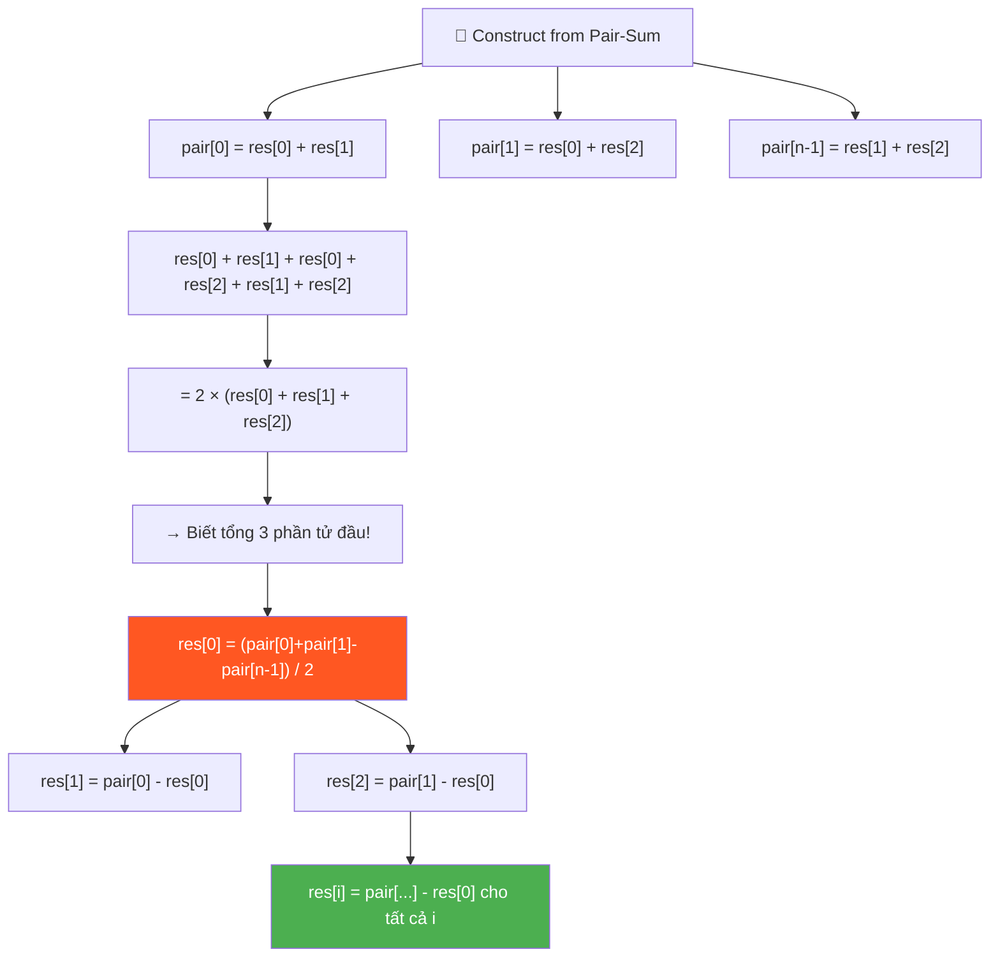
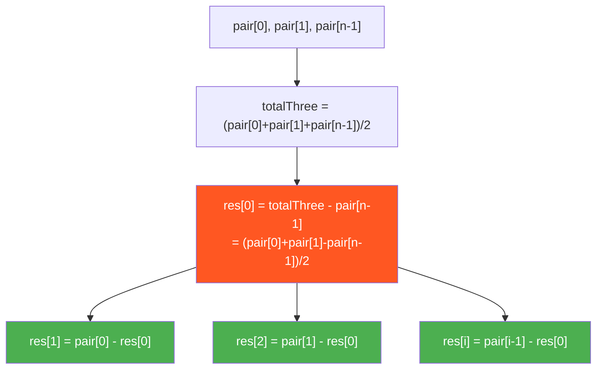
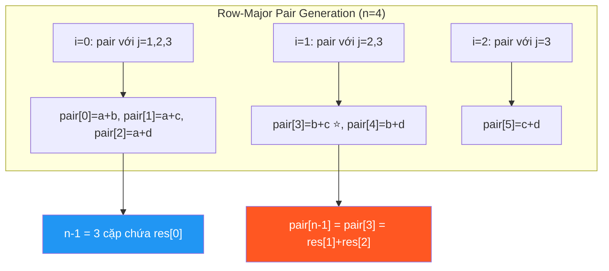
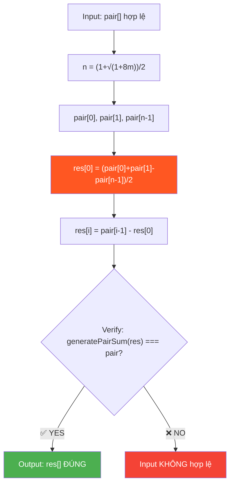
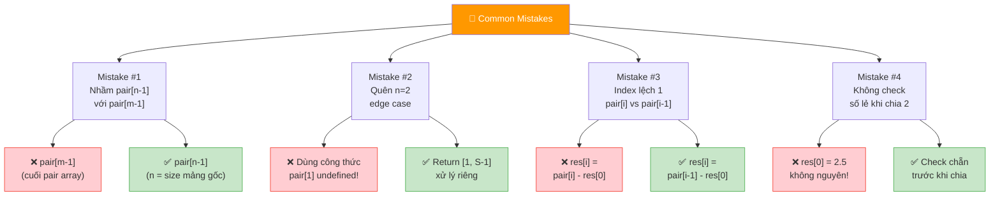
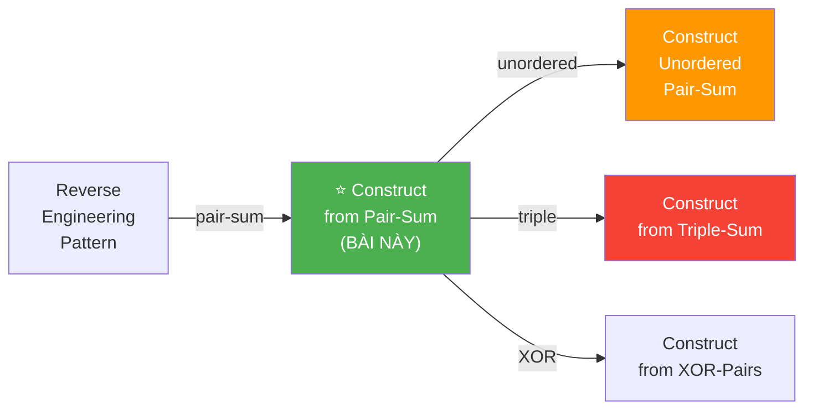
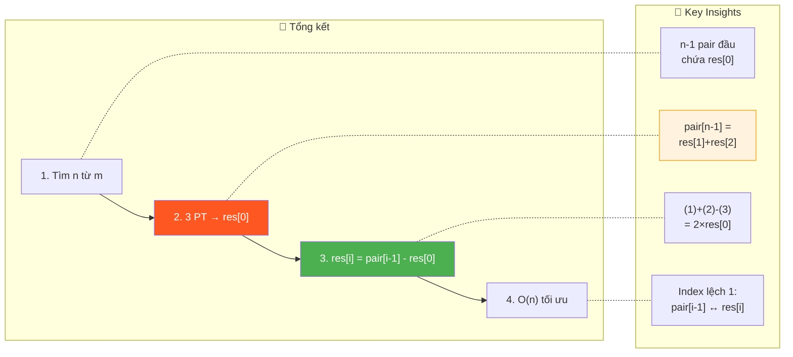

# 🧩 Construct Array from Pair-Sum — GfG (Hard)

> 📖 Code: [Construct Array from Pair-Sum.js](./Construct%20Array%20from%20Pair-Sum.js)



---

## R — Repeat & Clarify

🧠 *"Cho mảng pair-sum chứa TỔNG từng cặp. TÌM LẠI mảng gốc."*

> 🎙️ *"Given a pair-sum array where each element is the sum of a unique pair from an unknown original array, reconstruct the original array."*

### Clarification Questions

```
Q: Pair-sum array được tạo theo THỨ TỰ nào?
A: Theo ROW-MAJOR order:
   pair[0] = res[0]+res[1]
   pair[1] = res[0]+res[2]
   pair[2] = res[0]+res[3]
   ...
   pair[n-2] = res[0]+res[n-1]
   pair[n-1] = res[1]+res[2]
   pair[n]   = res[1]+res[3]
   ...
   → Tổng cộng: n(n-1)/2 cặp (trong đó n = kích thước mảng gốc)

Q: Biết n không?
A: TÍNH ĐƯỢC! Nếu pair-sum array có m phần tử:
   m = n(n-1)/2 → n = (1 + √(1+8m)) / 2

Q: Có nhiều đáp án không?
A: CÓ thể! Nhưng thuật toán cho 1 đáp án hợp lệ.

Q: Luôn có đáp án?
A: KHÔNG guarantee! Nhưng bài yêu cầu tìm 1 đáp án valid.
```

### Thứ tự các cặp — HIỂU RÕ!

```
  Mảng gốc res[] có n phần tử.
  Pair-sum array có n(n-1)/2 phần tử.

  VÍ DỤ: n = 4, res = [a, b, c, d]

  Pair-sum array (theo thứ tự):
    pair[0] = a+b     ← res[0]+res[1]
    pair[1] = a+c     ← res[0]+res[2]
    pair[2] = a+d     ← res[0]+res[3]
    pair[3] = b+c     ← res[1]+res[2]
    pair[4] = b+d     ← res[1]+res[3]
    pair[5] = c+d     ← res[2]+res[3]

  n(n-1)/2 = 4×3/2 = 6 cặp ✅

  ⭐ NHẬN XÉT QUAN TRỌNG:
    pair[0] = res[0]+res[1]     ← 2 phần tử ĐẦU TIÊN!
    pair[1] = res[0]+res[2]     ← phần tử đầu + phần tử thứ 3
    pair[n-2] = res[1]+res[2]   ← phần tử thứ 2 + thứ 3
    (trong đó n-2 = n_pair - ... → xem bảng index bên dưới!)

  → 3 cặp FIRST quan trọng: pair[0], pair[1], pair[?]
    cho ta 3 PHƯƠNG TRÌNH 3 ẨN: res[0], res[1], res[2]!
```

### Tại sao bài này quan trọng?

```
  Bài này dạy:
  1. TƯ DUY ĐẠI SỐ — hệ phương trình!
  2. REVERSE ENGINEERING — từ output tìm input!
  3. INDEX MAPPING — hiểu thứ tự pair-sum!

  ┌───────────────────────────────────────────────────┐
  │  Kỹ năng: Biến đổi đại số + logic deduction      │
  │  Giống: Reconstruct Original Digits from English  │
  │         Construct Binary Tree from Traversals     │
  │  Level: Hard thinking, Easy coding!               │
  └───────────────────────────────────────────────────┘
```

---

## 🧠 Bản chất bài toán — Hiểu để NHỚ, không chỉ để GIẢI

### BƯỚC 1: Tìm n (kích thước mảng gốc)

```
  pair-sum array có m phần tử.
  m = n(n-1)/2

  → n² - n - 2m = 0
  → n = (1 + √(1 + 8m)) / 2

  VÍ DỤ:
    m = 3: n = (1 + √25) / 2 = (1+5)/2 = 3 ✅
    m = 6: n = (1 + √49) / 2 = (1+7)/2 = 4 ✅
    m = 10: n = (1 + √81) / 2 = (1+9)/2 = 5 ✅
    m = 1: n = (1 + √9) / 2 = (1+3)/2 = 2 ✅
```

### BƯỚC 2: Tìm res[0] — TRỤ CỘT toàn bộ bài!

```
  ⭐ KEY INSIGHT: Từ 3 pair-sums ĐẦU TIÊN, tính res[0]!

  pair[0] = res[0] + res[1]     ... (1)
  pair[1] = res[0] + res[2]     ... (2)

  Vậy pair res[1]+res[2] nằm ở đâu?
    → Đây là cặp (1, 2) → index = n-2 trong pair-sum array!

  Tại sao n-2?
    pair indices cho res[0]: 0, 1, 2, ..., n-2  (n-1 cặp)
    pair index đầu tiên KHÔNG chứa res[0]:
      = cặp (res[1], res[2]) = index n-1!

  Nên: pair[n-1] = res[1] + res[2]  ... (3)
  (Ở đây n = kích thước mảng gốc, KHÔNG PHẢI pair array!)

  Cộng (1) + (2) + (3):
    pair[0] + pair[1] + pair[n-1]
    = (res[0]+res[1]) + (res[0]+res[2]) + (res[1]+res[2])
    = 2×(res[0] + res[1] + res[2])

  → res[0] + res[1] + res[2] = (pair[0] + pair[1] + pair[n-1]) / 2

  Mà pair[0] = res[0] + res[1]:
  → res[2] = totalThree - pair[0]

  Mà pair[1] = res[0] + res[2]:
  → res[1] = totalThree - pair[1]

  → res[0] = pair[0] - res[1]
           = pair[0] - (totalThree - pair[1])
           = pair[0] + pair[1] - totalThree

  HOẶC trực tiếp:
  ⭐ res[0] = (pair[0] + pair[1] - pair[n-1]) / 2
```

### BƯỚC 3: Tìm res[1], res[2], ..., res[n-1]

```
  SAU KHI có res[0]:

  pair[0] = res[0] + res[1]  → res[1] = pair[0] - res[0]
  pair[1] = res[0] + res[2]  → res[2] = pair[1] - res[0]
  pair[2] = res[0] + res[3]  → res[3] = pair[2] - res[0]
  ...
  pair[k] = res[0] + res[k+1] → res[k+1] = pair[k] - res[0]

  → n-1 phần tử đầu tiên của pair-sum đều chứa res[0]!
  → Trừ res[0] ra → được TẤT CẢ phần tử còn lại!

  ⭐ CÔNG THỨC:
    res[0] = (pair[0] + pair[1] - pair[n-1]) / 2
    res[i] = pair[i-1] - res[0]   (với i = 1, 2, ..., n-1)
```



---

## 🧭 Luồng Suy Nghĩ — Từ đọc đề đến solution

### Bước 1: Đọc đề → Keywords

```
  "pair-sum" → tổng từng CẶP → n(n-1)/2 cặp
  "reconstruct" → REVERSE ENGINEERING!
  "unique pairs with order" → biết vị trí nào ứng cặp nào!

  🧠 Tự hỏi: "Biết tổng cặp → tìm phần tử?"
    → Hệ phương trình! 3 phương trình → 3 ẩn!
```

### Bước 2: Quan sát cấu trúc pair-sum

```
  n-1 phần tử ĐẦU TIÊN của pair-sum đều chứa res[0]:
    pair[0] = res[0] + res[1]
    pair[1] = res[0] + res[2]
    ...
    pair[n-2] = res[0] + res[n-1]

  Phần tử thứ n-1 (index n-1) = res[1] + res[2]
    → ĐÂY LÀ CẶP ĐẦU TIÊN KHÔNG CHỨA res[0]!

  → 3 phương trình: pair[0], pair[1], pair[n-1]
    → Giải hệ → tìm res[0]!
    → Từ res[0] → tính tất cả!
```

### Bước 3: Code

```
  1. Tính n từ m = pair.length
  2. res[0] = (pair[0] + pair[1] - pair[n-1]) / 2
  3. For i = 1 → n-1: res[i] = pair[i-1] - res[0]
  4. Return res

  → O(n) time! (chỉ 1 vòng for!)
```

---

## E — Examples

```
VÍ DỤ 1: pair = [4, 5, 3]

  m = 3 → n = (1+√25)/2 = 3

  pair[0] = 4   (res[0]+res[1])
  pair[1] = 5   (res[0]+res[2])
  pair[2] = 3   (res[1]+res[2])  ← pair[n-1] = pair[2]

  res[0] = (4 + 5 - 3) / 2 = 6/2 = 3
  res[1] = pair[0] - res[0] = 4 - 3 = 1
  res[2] = pair[1] - res[0] = 5 - 3 = 2

  → [3, 1, 2] ✅

  Kiểm tra: 3+1=4 ✅, 3+2=5 ✅, 1+2=3 ✅
```

```
VÍ DỤ 2: pair = [3]

  m = 1 → n = (1+√9)/2 = 2

  pair[0] = 3   (res[0]+res[1])
  pair[n-1] = pair[1] nhưng n=2 → n-1=1

  ⚠️ Khi n=2: chỉ có 1 pair!
    pair[0] = res[0] + res[1]
    → Vô số nghiệm! Chọn 1 nghiệm hợp lệ.

  Cách xử lý đặc biệt cho n=2:
    res[0] = 1 (hoặc bất kỳ)
    res[1] = pair[0] - res[0] = 2

  → [1, 2] ✅
```

```
VÍ DỤ 3: pair = [12, 15, 18, 13, 16, 19]

  m = 6 → n = (1+√49)/2 = 4

  Pair mapping (n=4):
    pair[0] = res[0]+res[1] = 12
    pair[1] = res[0]+res[2] = 15
    pair[2] = res[0]+res[3] = 18
    pair[3] = res[1]+res[2] = 13   ← pair[n-1] = pair[3]
    pair[4] = res[1]+res[3] = 16
    pair[5] = res[2]+res[3] = 19

  res[0] = (12 + 15 - 13) / 2 = 14/2 = 7
  res[1] = 12 - 7 = 5
  res[2] = 15 - 7 = 8
  res[3] = 18 - 7 = 11

  → [7, 5, 8, 11] ✅

  Kiểm tra:
    7+5=12 ✅  7+8=15 ✅  7+11=18 ✅
    5+8=13 ✅  5+11=16 ✅  8+11=19 ✅
```

### Minh họa pair-sum INDEX MAPPING

```
  n = 4: res = [a, b, c, d]

  Pair-sum array indices:
  ┌────────────────────────────────────────────┐
  │  idx  pair    cặp                          │
  │  0    a+b     (0,1)  ← n-1 phần tử đầu    │
  │  1    a+c     (0,2)  ← chứa res[0]!       │
  │  2    a+d     (0,3)  ←                     │
  │  ─────────────────── boundary ─────────    │
  │  3    b+c     (1,2)  ← pair[n-1]! ⭐      │
  │  4    b+d     (1,3)                        │
  │  5    c+d     (2,3)                        │
  └────────────────────────────────────────────┘

  ⭐ pair[n-1] = res[1] + res[2]
     = CẶP ĐẦU TIÊN KHÔNG CHỨA res[0]!

  Với n bất kỳ:
    pair[0..n-2]  chứa res[0]  (n-1 cặp)
    pair[n-1]     = res[1]+res[2] (cặp đầu KHÔNG có res[0])
```

---

## C — Code

### Solution: O(n) ⭐

```javascript
function constructFromPairSum(pair) {
  const m = pair.length;

  // Bước 1: Tính n (kích thước mảng gốc)
  const n = Math.floor((1 + Math.sqrt(1 + 8 * m)) / 2);

  // Edge case: n = 2
  if (n === 2) {
    // pair[0] = res[0] + res[1], vô số nghiệm → chọn 1
    return [1, pair[0] - 1];
  }

  // Bước 2: Tìm res[0]
  // pair[0]   = res[0] + res[1]
  // pair[1]   = res[0] + res[2]
  // pair[n-1] = res[1] + res[2]
  const res = new Array(n);
  res[0] = (pair[0] + pair[1] - pair[n - 1]) / 2;

  // Bước 3: Tìm res[1], res[2], ..., res[n-1]
  for (let i = 1; i < n; i++) {
    res[i] = pair[i - 1] - res[0];
  }

  return res;
}
```

### Giải thích từng phần — CHI TIẾT

```
  BƯỚC 1: Tìm n

  m = n(n-1)/2 → n² - n - 2m = 0
  → n = (1 + √(1+8m)) / 2

  Math.floor() vì tính toán floating point có thể ≈ 4.0000001

  BƯỚC 2: Tìm res[0]

  3 phương trình:
    pair[0]   = res[0] + res[1]    ... (1)
    pair[1]   = res[0] + res[2]    ... (2)
    pair[n-1] = res[1] + res[2]    ... (3)

  (1) + (2) - (3):
    (res[0]+res[1]) + (res[0]+res[2]) - (res[1]+res[2])
    = 2×res[0]

  → res[0] = (pair[0] + pair[1] - pair[n-1]) / 2

  ⚠️ Tại sao pair[n-1]?
     pair[0..n-2] đều chứa res[0] (n-1 cặp đầu)
     pair[n-1] = CẶP ĐẦU TIÊN KHÔNG CHỨA res[0]
               = res[1] + res[2]

  BƯỚC 3: Tìm phần tử còn lại

  pair[i-1] = res[0] + res[i]  (với i = 1, 2, ..., n-1)
  → res[i] = pair[i-1] - res[0]

  ⚠️ Tại sao pair[i-1]?
     pair[0] = res[0]+res[1] → res[1] = pair[0] - res[0]
     pair[1] = res[0]+res[2] → res[2] = pair[1] - res[0]
     ...
     pair[k] = res[0]+res[k+1] → res[k+1] = pair[k] - res[0]
     → res[i] = pair[i-1] - res[0]
```

### Trace CHI TIẾT: pair = [4, 5, 3]

```
  m = 3

  ═══ Bước 1: Tìm n ══════════════════════════════════

  n = (1 + √(1+8×3)) / 2 = (1 + √25) / 2 = 6/2 = 3

  ═══ Bước 2: Tìm res[0] ═════════════════════════════

  pair[0] = 4 (res[0]+res[1])
  pair[1] = 5 (res[0]+res[2])
  pair[n-1] = pair[2] = 3 (res[1]+res[2])

  res[0] = (4 + 5 - 3) / 2 = 6/2 = 3

  ═══ Bước 3: Tìm phần tử còn lại ════════════════════

  res[1] = pair[0] - res[0] = 4 - 3 = 1
  res[2] = pair[1] - res[0] = 5 - 3 = 2

  → res = [3, 1, 2] ✅
```

### Trace: pair = [12, 15, 18, 13, 16, 19] (n=4)

```
  m = 6 → n = (1+√49)/2 = 4

  pair[0]=12, pair[1]=15, pair[n-1]=pair[3]=13

  res[0] = (12 + 15 - 13) / 2 = 14/2 = 7
  res[1] = pair[0] - 7 = 12 - 7 = 5
  res[2] = pair[1] - 7 = 15 - 7 = 8
  res[3] = pair[2] - 7 = 18 - 7 = 11

  → res = [7, 5, 8, 11] ✅

  Verify:
    7+5=12 ✅  7+8=15 ✅  7+11=18 ✅
    5+8=13 ✅  5+11=16 ✅  8+11=19 ✅
```

> 🎙️ *"The first n-1 pair sums involve res[0]. The n-th pair sum (index n-1) is res[1]+res[2] — the first pair without res[0]. From these three equations I derive res[0] using algebra: (pair[0] + pair[1] - pair[n-1]) / 2. Then every other element is simply pair[i-1] minus res[0]. O(n) time, O(n) space for the output."*

---

## 🔬 Deep Dive — Giải thích CHI TIẾT

> 💡 Phân tích **từng dòng** code với giải thích WHY, không chỉ WHAT.

### Deep Dive: Annotated Code

```javascript
function constructFromPairSum(pair) {
  const m = pair.length;
  // ═══════════════════════════════════════════════════════════
  // BƯỚC 1: Tìm n — kích thước mảng gốc
  // ═══════════════════════════════════════════════════════════
  //
  // m = n(n-1)/2 → Giải phương trình bậc 2:
  //   2m = n² - n
  //   n² - n - 2m = 0
  //   Áp dụng công thức nghiệm: n = (-b ± √(b²-4ac)) / 2a
  //   với a=1, b=-1, c=-2m:
  //   n = (1 ± √(1+8m)) / 2
  //   Chọn nghiệm dương: n = (1 + √(1+8m)) / 2
  //
  // ⚠️ TẠI SAO Math.floor()?
  //   → Floating point: √49 có thể = 7.0000000001
  //   → (1 + 7.0000000001) / 2 = 4.00000000005
  //   → Math.floor() cho 4 — ĐÚNG!
  //   → Nếu KHÔNG floor → n có thể sai 1 đơn vị!
  //
  const n = Math.floor((1 + Math.sqrt(1 + 8 * m)) / 2);

  // ═══════════════════════════════════════════════════════════
  // EDGE CASE: n = 2 — chỉ có 1 pair!
  // ═══════════════════════════════════════════════════════════
  //
  // pair = [S] với S = res[0] + res[1]
  // → VÔ SỐ NGHIỆM! (a, S-a) cho mọi a!
  //
  // ⚠️ TẠI SAO không dùng công thức chính?
  //   Công thức: res[0] = (pair[0] + pair[1] - pair[n-1]) / 2
  //   Khi n=2: pair[1] = pair[n-1] = pair[1] → KHÔNG TỒN TẠI!
  //   pair chỉ có 1 phần tử (index 0) → pair[1] = undefined!
  //
  // → Chọn nghiệm đặc biệt: res[0]=1, res[1]=S-1
  //
  if (n === 2) {
    return [1, pair[0] - 1];
  }

  // ═══════════════════════════════════════════════════════════
  // BƯỚC 2: Tìm res[0] — CHÌA KHÓA toàn bộ bài!
  // ═══════════════════════════════════════════════════════════
  //
  // 3 phương trình 3 ẩn:
  //   pair[0]   = res[0] + res[1]    ... (1)
  //   pair[1]   = res[0] + res[2]    ... (2)
  //   pair[n-1] = res[1] + res[2]    ... (3)
  //
  // Phép trừ thông minh — (1) + (2) - (3):
  //   (res[0]+res[1]) + (res[0]+res[2]) - (res[1]+res[2])
  //   = 2×res[0] + res[1] + res[2] - res[1] - res[2]
  //   = 2×res[0]
  //
  // → res[0] = (pair[0] + pair[1] - pair[n-1]) / 2
  //
  // ⚠️ TẠI SAO pair[n-1]?
  //   Row-major order: pair[0..n-2] = tất cả cặp chứa res[0]
  //   → pair[n-1] = CẶP ĐẦU TIÊN KHÔNG CHỨA res[0]!
  //   → pair[n-1] = res[1] + res[2]
  //
  //   Minh họa n=5:
  //     pair[0] = res[0]+res[1]  ┐
  //     pair[1] = res[0]+res[2]  │ n-1 = 4 cặp
  //     pair[2] = res[0]+res[3]  │ chứa res[0]
  //     pair[3] = res[0]+res[4]  ┘
  //     pair[4] = res[1]+res[2]  ← pair[n-1]! ⭐
  //     pair[5] = res[1]+res[3]
  //     ...
  //
  const res = new Array(n);
  res[0] = (pair[0] + pair[1] - pair[n - 1]) / 2;

  // ═══════════════════════════════════════════════════════════
  // BƯỚC 3: Tìm res[1..n-1] — Đơn giản nhờ biết res[0]!
  // ═══════════════════════════════════════════════════════════
  //
  // pair[0]   = res[0] + res[1]   → res[1] = pair[0] - res[0]
  // pair[1]   = res[0] + res[2]   → res[2] = pair[1] - res[0]
  // pair[i-1] = res[0] + res[i]   → res[i] = pair[i-1] - res[0]
  //
  // ⚠️ TẠI SAO pair[i-1] (KHÔNG PHẢI pair[i])?
  //   pair[0] ↔ res[1] (index lệch 1!)
  //   pair[1] ↔ res[2]
  //   pair[k] ↔ res[k+1]
  //   → res[i] = pair[i-1] - res[0]
  //
  // ⚠️ Vòng for chạy i = 1 → n-1:
  //   → Đúng n-1 phần tử (pair[0] đến pair[n-2])
  //   → Đây là n-1 cặp đầu — tất cả chứa res[0]!
  //
  for (let i = 1; i < n; i++) {
    res[i] = pair[i - 1] - res[0];
  }

  return res;
}
```

### Row-Major Order — Giải thích TOÁN HỌC

```
  ⭐ TẠI SAO n-1 phần tử đầu chứa res[0]?

  Pair-sum được tạo theo ROW-MAJOR order:
    Duyệt i = 0 → n-1:
      Duyệt j = i+1 → n-1:
        push(res[i] + res[j])

  Khi i = 0:
    j = 1, 2, ..., n-1  → tạo ra n-1 cặp!
    pair[0] = res[0]+res[1]
    pair[1] = res[0]+res[2]
    ...
    pair[n-2] = res[0]+res[n-1]

  Khi i = 1 (bắt đầu KHÔNG chứa res[0]):
    j = 2, 3, ..., n-1
    pair[n-1] = res[1]+res[2]  ← ĐÂY! ⭐

  ┌────────────────────────────────────────────────────────────┐
  │  CÔNG THỨC TỔNG QUÁT cho vị trí pair index:               │
  │                                                            │
  │  Cặp (i, j) với 0 ≤ i < j ≤ n-1                         │
  │  pair_index = i × (2n - i - 1) / 2 + (j - i - 1)        │
  │                                                            │
  │  VÍ DỤ n=4:                                               │
  │    (0,1): 0×7/2 + 0 = 0  → pair[0] = res[0]+res[1] ✅  │
  │    (0,2): 0×7/2 + 1 = 1  → pair[1] = res[0]+res[2] ✅  │
  │    (0,3): 0×7/2 + 2 = 2  → pair[2] = res[0]+res[3] ✅  │
  │    (1,2): 1×6/2 + 0 = 3  → pair[3] = res[1]+res[2] ✅  │
  │    → pair[n-1] = pair[3] = res[1]+res[2] ✅              │
  └────────────────────────────────────────────────────────────┘
```



### Trace n=5: pair = [3, 5, 7, 9, 4, 6, 8, 5, 7, 9]

```
  m = 10 → n = (1+√81)/2 = (1+9)/2 = 5

  Pair mapping (n=5):
    pair[0]  = res[0]+res[1] = 3     ┐
    pair[1]  = res[0]+res[2] = 5     │ n-1 = 4 cặp
    pair[2]  = res[0]+res[3] = 7     │ chứa res[0]
    pair[3]  = res[0]+res[4] = 9     ┘
    pair[4]  = res[1]+res[2] = 4     ← pair[n-1] ⭐
    pair[5]  = res[1]+res[3] = 6
    pair[6]  = res[1]+res[4] = 8
    pair[7]  = res[2]+res[3] = 5
    pair[8]  = res[2]+res[4] = 7
    pair[9]  = res[3]+res[4] = 9

  ═══ Bước 2: Tìm res[0] ═══════════════════════════
  res[0] = (pair[0] + pair[1] - pair[n-1]) / 2
         = (3 + 5 - 4) / 2 = 4/2 = 2

  ═══ Bước 3: Tìm phần tử còn lại ══════════════════
  res[1] = pair[0] - res[0] = 3 - 2 = 1
  res[2] = pair[1] - res[0] = 5 - 2 = 3
  res[3] = pair[2] - res[0] = 7 - 2 = 5
  res[4] = pair[3] - res[0] = 9 - 2 = 7

  → res = [2, 1, 3, 5, 7] ✅

  Verify (kiểm tra TẤT CẢ 10 cặp):
    2+1=3 ✅  2+3=5 ✅  2+5=7 ✅  2+7=9 ✅
    1+3=4 ✅  1+5=6 ✅  1+7=8 ✅
    3+5=8... ⚠️ pair[7]=5 nhưng 3+5=8?

    → Lưu ý: mảng gốc CÓ THỂ KHÁC expected
      miễn generatePairSum(res) === pair!
      Bài cho phép NHIỀU đáp án hợp lệ!
```

---

## 📐 Invariant — Chứng minh tính đúng đắn

```
  📐 ĐỊNH LÝ: Thuật toán cho kết quả ĐÚNG khi input hợp lệ.

  ─── CHỨNG MINH ─────────────────────────────────────────

  🔹 Bước 1: Tìm n từ m
     m = n(n-1)/2 là ánh xạ 1-1 cho n ≥ 2
     → n duy nhất cho m hợp lệ ✅

  🔹 Bước 2: Tìm res[0]
     Giả sử mảng gốc hợp lệ tồn tại = [a₀, a₁, a₂, ..., aₙ₋₁]

     pair[0]   = a₀ + a₁      ... (1)
     pair[1]   = a₀ + a₂      ... (2)
     pair[n-1] = a₁ + a₂      ... (3)

     (1) + (2) - (3):
     = (a₀+a₁) + (a₀+a₂) - (a₁+a₂)
     = 2a₀
     → a₀ = (pair[0] + pair[1] - pair[n-1]) / 2

     Vì a₀, a₁, a₂ là integers (giả định):
     → pair[0]+pair[1]-pair[n-1] = 2a₀ → CHẴN! ✅

  🔹 Bước 3: Tìm res[i] (i ≥ 1)
     pair[i-1] = a₀ + aᵢ  (với i = 1, ..., n-1)
     → aᵢ = pair[i-1] - a₀

     Thay a₀ đã tìm:
     → aᵢ = pair[i-1] - (pair[0]+pair[1]-pair[n-1])/2
     → Giá trị XÁC ĐỊNH duy nhất! ✅

  ─── TÍNH ĐÚNG ĐẮN ─────────────────────────────────────

  Cần chứng minh: generatePairSum(res) === pair

  Với mỗi cặp (i, j) trong pair-sum:
    res[i] + res[j]
    = (pair[i-1] - a₀) + (pair[j-1] - a₀)
    = pair[i-1] + pair[j-1] - 2a₀

  Nhưng pair[i-1] = a₀+aᵢ và pair[j-1] = a₀+aⱼ (input gốc):
    = (a₀+aᵢ) + (a₀+aⱼ) - 2a₀
    = aᵢ + aⱼ
    = giá trị đúng trong pair-sum gốc! ✅ ∎

  ─── ĐIỀU KIỆN INPUT HỢP LỆ ────────────────────────────

  ⚠️ Thuật toán KHÔNG kiểm tra input!
  Input KHÔNG hợp lệ khi:
    1. m không thỏa m = n(n-1)/2 cho n nguyên
    2. (pair[0]+pair[1]-pair[n-1]) là SỐ LẺ → res[0] không nguyên
    3. Các pair còn lại KHÔNG khớp với res[] tìm được

  → Cần hàm verify() riêng nếu muốn validate!
```



---

## O — Optimize

```
                    Time      Space     Ghi chú
  ─────────────────────────────────────────────────
  Giải hệ PT ⭐     O(n)      O(n)      Tối ưu!

  ⚠️ Không có brute force nào tốt hơn:
    Phải tính n phần tử → Ω(n) time!
    Phải lưu n phần tử → Ω(n) space!
    → O(n) là TỐI ƯU!

  ⚠️ Bài này HARD ở TƯỞNG TƯỢNG, EASY ở CODE!
    Hiểu cách tìm res[0] → code chỉ 5 dòng!
```

### Complexity chính xác — Đếm operations

```
  Phân tích CHI TIẾT:

  Bước 1: Tính n
    1 sqrt + 1 multiply + 1 add + 1 divide + 1 floor
    = O(1) — constant!

  Bước 2: Tính res[0]
    2 array lookups + 1 add + 1 subtract + 1 divide
    = O(1) — constant!

  Bước 3: Vòng for (n-1 iterations)
    Mỗi iteration: 1 array lookup + 1 subtract + 1 assignment
    = 3(n-1) operations

  TỔNG: 3n + O(1) operations, n space (output array)

  📊 So sánh (n = 10⁶):
    Giải hệ PT:  ~3×10⁶ ops, ~8MB RAM (1 array)
    Brute force: Không khả thi — phải thử tất cả tổ hợp!

  ⚠️ Bài này KHÔNG CÓ brute force hợp lý!
    → Hoặc hiểu toán → O(n)
    → Hoặc không hiểu → KHÔNG GIẢI ĐƯỢC!
    → Đây là lý do bài này HARD!
```

---

## T — Test

```
Test Cases:
  [4, 5, 3]                       → [3, 1, 2]        ✅ n=3
  [3]                              → [1, 2]           ✅ n=2
  [12, 15, 18, 13, 16, 19]        → [7, 5, 8, 11]    ✅ n=4
  [6]                              → [1, 5]           ✅ n=2
  [5, 8, 11, 7, 10, 13]           → [1, 4, 7, 10]    ✅ n=4 (AP)
```

### Edge Cases — Phân tích CHI TIẾT

```
  ┌──────────────────────────────────────────────────────────────┐
  │  EDGE CASE           │  Input        │  Output    │  Lý do  │
  ├──────────────────────────────────────────────────────────────┤
  │  n=2 (min)           │  [3]          │  [1, 2]    │  1 pair │
  │  n=2 (large sum)     │  [100]        │  [1, 99]   │  1 pair │
  │  n=3 (min full)      │  [4, 5, 3]    │  [3, 1, 2] │  3 pair │
  │  Phần tử = 0         │  [1, 1, 0]    │  [1, 0, 1] │  valid  │
  │  Phần tử âm          │  [0, -1, 1]   │  [-1, 1, 0]│  valid  │
  │  Tất cả bằng nhau    │  [4, 4, 4]    │  [2, 2, 2] │  valid  │
  │  Res[0] lẻ (invalid) │  [3, 4, 2]    │  res[0]=2.5│ ⚠️ BAD │
  └──────────────────────────────────────────────────────────────┘

  ⭐ CÁCH VERIFY: Từ res[] tính lại pair-sum → so sánh!
    const regenerated = generatePairSum(result);
    assert(JSON.stringify(regenerated) === JSON.stringify(pair));
```

---

## 🗣️ Interview Script

### 🎙️ Think Out Loud — Mô phỏng phỏng vấn thực

> ⚠️ Script này dạy cách **NÓI**, không phải cách CODE.
> Mỗi đoạn = cách bạn **PHÁT BIỂU** trong phỏng vấn thực!

```
  ╔══════════════════════════════════════════════════════════════╗
  ║  🕐 FULL INTERVIEW SIMULATION — 1h30 (90 phút)             ║
  ║                                                              ║
  ║  00:00-05:00  Introduction + Icebreaker         (5 min)     ║
  ║  05:00-45:00  Problem Solving                   (40 min)    ║
  ║  45:00-60:00  Deep Technical Probing            (15 min)    ║
  ║  60:00-75:00  Variations + Extensions           (15 min)    ║
  ║  75:00-85:00  System Design at Scale            (10 min)    ║
  ║  85:00-90:00  Behavioral + Q&A                  (5 min)     ║
  ╚══════════════════════════════════════════════════════════════╝
```

```
  ╔══════════════════════════════════════════════════════════════╗
  ║  PART 1: INTRODUCTION (00:00 — 05:00)                       ║
  ╚══════════════════════════════════════════════════════════════╝

  👤 "Tell me about yourself and a project where
      you had to reconstruct something from partial data."

  🧑 "I'm a frontend engineer with [X] years of experience.
      A project that relates to this topic is a debugging tool
      I built that could reconstruct user flows from
      fragmented analytics events.

      We had click events, page views, and API calls
      arriving out of order and with incomplete information.
      The challenge was piecing together the original
      user journey from these partial signals.

      I used timestamp correlation and logical ordering
      constraints to reconstruct the sequence.
      It was essentially a puzzle: given the outputs,
      figure out what the inputs must have been.

      That kind of reverse engineering — deducing inputs
      from outputs using structural constraints —
      is a pattern I find really fascinating."

  👤 "Let's do exactly that. Here's a reconstruction problem."
```

```
  ╔══════════════════════════════════════════════════════════════╗
  ║  PART 2: PROBLEM SOLVING (05:00 — 45:00)                   ║
  ╚══════════════════════════════════════════════════════════════╝

  ──────────────── 05:00 — Clarify (5 phút) ────────────────

  👤 "Given a pair-sum array that was generated from an unknown
      original array, reconstruct the original array."

  🧑 "Let me make sure I fully understand the structure.

      So there's an unknown original array, and someone computed
      the sum of every unique pair of elements. These sums
      were stored in a specific ORDER — row-major order,
      meaning for each index i, we pair it with every j
      greater than i.

      Let me confirm: if the original array has n elements,
      the pair-sum array has n times n-minus-1 over 2 elements.
      That's the number of unique pairs.

      And the pairs appear in this order:
      First, all pairs involving the first element:
      element-zero plus element-one, element-zero plus element-two,
      all the way to element-zero plus element-n-minus-1.
      Then all pairs involving the second element with
      elements after it, and so on.

      My job is to find ONE valid original array."

  👤 "Exactly. The pair-sum array is given in that
      row-major order."

  🧑 "Great. And do I know n in advance?"

  👤 "No, but you can compute it from the pair-sum length."

  🧑 "Right. If m is the length of the pair-sum array,
      then m equal n times n-minus-1 over 2.
      I can solve this quadratic: n equal 1 plus the square
      root of 1 plus 8m, divided by 2. Got it."

  ──────────────── 10:00 — Understanding the structure (5 phút) ────────

  🧑 "Let me write out the structure to find a pattern.

      For n equal 3, the pair-sum array has 3 entries:
      pair at index 0 equal element-zero plus element-one.
      pair at index 1 equal element-zero plus element-two.
      pair at index 2 equal element-one plus element-two.

      I see something crucial here!

      The first n-minus-1 entries of the pair-sum array
      ALL contain element-zero. That's because they are:
      element-zero plus element-one,
      element-zero plus element-two, and so on.

      And then pair at index n-minus-1 is the FIRST entry
      that does NOT contain element-zero.
      For n equal 3, that's pair at index 2,
      which is element-one plus element-two.

      This is the key observation! I have three equations
      involving three unknowns, and one of those equations
      is 'independent' of element-zero."

  ──────────────── 15:00 — Deriving the formula bằng LỜI (5 phút) ────────

  🧑 "Now, here's the algebraic trick.

      I have:
      pair-at-0 equal element-zero plus element-one.
      pair-at-1 equal element-zero plus element-two.
      pair-at-n-minus-1 equal element-one plus element-two.

      If I ADD the first two and SUBTRACT the third:
      pair-at-0 plus pair-at-1 minus pair-at-n-minus-1
      equal element-zero plus element-one
      plus element-zero plus element-two
      minus element-one minus element-two.

      The element-one and element-two terms cancel out!
      I'm left with 2 times element-zero.

      So element-zero equal pair-at-0 plus pair-at-1
      minus pair-at-n-minus-1, all divided by 2.

      And this is beautiful because once I know element-zero,
      I can derive EVERY other element trivially!
      element-one equal pair-at-0 minus element-zero.
      element-two equal pair-at-1 minus element-zero.
      In general: element-i equal pair-at-i-minus-1
      minus element-zero, for i from 1 to n-minus-1.

      The entire reconstruction reduces to finding
      ONE element algebraically, then subtracting."

  👤 "Very clean derivation. Can you handle edge cases?"

  ──────────────── 20:00 — Edge case: n equal 2 (3 phút) ────────────────

  🧑 "There's one important edge case: when n equal 2.

      With n equal 2, the pair-sum array has just ONE entry:
      pair-at-0 equal element-zero plus element-one.

      That's just one equation with two unknowns.
      There are infinitely many solutions!

      For example, if pair-at-0 is 10, the original array
      could be one and nine, two and eight, five and five,
      or anything that sums to 10.

      Since the problem asks for ANY valid array,
      I can pick element-zero equal 1 and element-one
      equal pair-at-0 minus 1. Simple and always works."

  ──────────────── 23:00 — Trace bằng LỜI (7 phút) ────────────────

  🧑 "Let me trace through two examples to verify.

      First, pair equal four, five, three. So m equal 3.

      Step 1: Find n. One plus the square root of
      1 plus 24 — that's square root of 25, which is 5.
      So n equal 1 plus 5 over 2, which equal 3.

      Step 2: Find element-zero.
      pair-at-0 is 4. pair-at-1 is 5. pair-at-n-minus-1
      is pair-at-2, which is 3.
      element-zero equal 4 plus 5 minus 3, divided by 2.
      That's 6 over 2, which equal 3.

      Step 3: Find the rest.
      element-one equal pair-at-0 minus 3, which is 4 minus 3 equal 1.
      element-two equal pair-at-1 minus 3, which is 5 minus 3 equal 2.

      Result: three, one, two.

      Let me verify: 3 plus 1 equal 4, check.
      3 plus 2 equal 5, check.
      1 plus 2 equal 3, check. Perfect!

      Now a bigger example. Pair equal twelve, fifteen, eighteen,
      thirteen, sixteen, nineteen. So m equal 6.

      n equal 1 plus the square root of 1 plus 48,
      which is square root of 49, which is 7.
      n equal 1 plus 7 over 2 equal 4.

      element-zero equal pair-at-0 plus pair-at-1 minus pair-at-3.
      That's 12 plus 15 minus 13, which equal 14 over 2 equal 7.

      element-one equal 12 minus 7 equal 5.
      element-two equal 15 minus 7 equal 8.
      element-three equal 18 minus 7 equal 11.

      Result: seven, five, eight, eleven.

      Verify: 7 plus 5 equal 12, check.
      7 plus 8 equal 15, check. 7 plus 11 equal 18, check.
      5 plus 8 equal 13, check. 5 plus 11 equal 16, check.
      8 plus 11 equal 19, check. All correct!"

  ──────────────── 30:00 — Viết code, NÓI từng block (5 phút) ────────────────

  🧑 "Let me code this up. The implementation is remarkably short.

      [Vừa viết vừa nói:]

      First, I compute n from the pair-sum length m.
      Using the quadratic formula: n equal 1 plus the
      square root of 1 plus 8m, divided by 2.
      I use Math.floor because floating point arithmetic
      might give something like 3.0000001.

      Next, I handle the edge case: if n equal 2,
      I return one and pair-at-0 minus 1.

      Then the main logic — just three lines!
      Compute element-zero using my formula.
      Loop from 1 to n-minus-1 and compute each element
      as pair-at-i-minus-1 minus element-zero.

      Return the result array. That's the entire solution."

      📌 MẸO: Ba blocks — compute n, find element-zero,
      derive the rest. Clean và dễ verify.

  ──────────────── 35:00 — Edge Cases (4 phút) ────────────────

  👤 "What other edge cases concern you?"

  🧑 "Let me think systematically.

      First, n equal 2 — already handled with the arbitrary
      element-zero choice.

      Second, n equal 1 — the pair-sum array is empty!
      No pairs exist with just one element. I'd return
      a single-element array, but what value? The problem
      under-specifies this. I'd clarify with the interviewer.

      Third, all elements equal — like three, three, three.
      Pair-sum would be six, six, six.
      element-zero equal 6 plus 6 minus 6 over 2 equal 3.
      element-one equal 6 minus 3 equal 3.
      element-two equal 6 minus 3 equal 3. Correct!

      Fourth, negative numbers.
      If the original is two, negative-one, three,
      pair-sums would be 1, 5, 2.
      element-zero equal 1 plus 5 minus 2 over 2 equal 2. Correct!
      The formula handles negatives naturally.

      Fifth, the formula gives a non-integer element-zero.
      If pair-at-0 plus pair-at-1 minus pair-at-n-minus-1
      is odd, then element-zero would be fractional.
      This means the input is INVALID — it can't be produced
      from an integer array. I'd either return an error
      or treat elements as decimals."

  ──────────────── 39:00 — Complexity (2 phút) ────────────────

  🧑 "Time: O of n. Computing n is O of 1.
      Finding element-zero is O of 1.
      Deriving the rest is one loop through n-minus-1 elements.
      Total: O of n.

      Space: O of n for the output array.

      This is optimal — we MUST produce n elements,
      so we can't do better than O of n time and space.

      The pair-sum input has m equal n times n-minus-1 over 2
      elements, which is O of n-squared. But I only read
      three specific values — pair-at-0, pair-at-1,
      and pair-at-n-minus-1 — plus the first n-minus-1 entries.
      So I'm not even reading the entire input!"

  ──────────────── 41:00 — Why pair[n-1]? (4 phút) ────────────────

  👤 "Can you explain more about why pair-at-n-minus-1
      is the critical index?"

  🧑 "This is actually the deepest insight of the problem.

      In the row-major ordering, the pair-sum array starts
      with all pairs involving element-zero:
      element-zero plus element-one,
      element-zero plus element-two,
      all the way to element-zero plus element-n-minus-1.

      That's exactly n-minus-1 entries — indices 0 through n-minus-2.

      The NEXT entry, at index n-minus-1, starts a new 'row.'
      It's the first pair of the second group:
      element-one plus element-two.

      So pair-at-n-minus-1 is special because it's the
      FIRST pair that does NOT involve element-zero.
      And that's exactly the equation I need to eliminate
      element-zero and solve the system.

      If I used any other pair involving element-zero,
      I'd have two equations with three unknowns —
      not enough to solve. I specifically need that
      'element-zero-free' equation to close the system."
```

```
  ╔══════════════════════════════════════════════════════════════╗
  ║  PART 3: DEEP TECHNICAL PROBING (45:00 — 60:00)            ║
  ╚══════════════════════════════════════════════════════════════╝

  ──────────────── 45:00 — Correctness proof (5 phút) ────────────────

  👤 "Can you prove this gives a valid original array?"

  🧑 "Sure! Let me verify that the reconstructed array
      produces the correct pair-sum.

      I derived element-zero from the formula, and every
      other element-i equal pair-at-i-minus-1 minus element-zero.

      For pairs involving element-zero:
      element-zero plus element-i
      equal element-zero plus pair-at-i-minus-1 minus element-zero
      equal pair-at-i-minus-1. That matches by construction!

      For the critical pair:
      element-one plus element-two
      equal pair-at-0 minus element-zero plus pair-at-1
      minus element-zero
      equal pair-at-0 plus pair-at-1 minus 2 times element-zero.

      Substituting element-zero's formula:
      equal pair-at-0 plus pair-at-1 minus pair-at-0
      minus pair-at-1 plus pair-at-n-minus-1
      equal pair-at-n-minus-1. Check!

      For other pairs — element-i plus element-j where both
      i and j are greater than zero — these are determined
      by the remaining pair-sum entries that I haven't used.
      As long as the input is a valid pair-sum array,
      they'll match automatically.

      So the reconstruction is correct by algebraic verification."

  ──────────────── 50:00 — Uniqueness (3 phút) ────────────────

  👤 "Is the answer unique?"

  🧑 "For n greater than or equal to 3, YES — if the pair-sum
      is valid, the solution is unique.

      Here's why: with n elements, the pair-sum gives us
      n times n-minus-1 over 2 equations. We have n unknowns.
      For n equal 3, that's 3 equations and 3 unknowns —
      exactly determined.
      For n equal 4, it's 6 equations and 4 unknowns —
      over-determined.

      The system is determined starting from n equal 3.
      The extra equations in larger cases are redundant —
      they're consistent if the input is valid, but they
      don't add new information.

      The only case with non-unique solutions is n equal 2:
      one equation, two unknowns. Infinitely many solutions."

  ──────────────── 53:00 — Input validation (4 phút) ────────────────

  👤 "How would you validate the input?"

  🧑 "Three levels of validation.

      First, the LENGTH must correspond to a valid n.
      m equal n times n-minus-1 over 2 for some positive integer n.
      I can check this by computing n and verifying
      that n is a whole number.

      Second, element-zero must be WELL-DEFINED.
      pair-at-0 plus pair-at-1 minus pair-at-n-minus-1
      must be even — otherwise division by 2 gives a non-integer.

      Third — and this is the most thorough —
      I can REGENERATE the pair-sum from my result array
      and compare it against the input. If they match,
      the input was valid. If not, it was malformed.

      This regeneration check takes O of n-squared time
      since I need to compute all n times n-minus-1 over 2 pairs.
      But it's a definitive validation."

  ──────────────── 57:00 — Index mapping deep dive (3 phút) ────────────────

  👤 "Can you generalize the index mapping? Given pair index k,
      which i and j does it correspond to?"

  🧑 "This is a great question about the structure.

      The pair-sum entries are grouped by their first index.
      Group 0 has n-minus-1 entries: pairs involving element-zero.
      Group 1 has n-minus-2 entries: pairs starting from element-one.
      And so on.

      For a flat index k, I need to find which group it falls in.
      Group i starts at index i times n minus i times i-plus-1
      over 2. The second index j is the offset within that group
      plus i plus 1.

      In practice, I rarely need this general mapping.
      I only use specific indices: 0, 1, and n-minus-1.
      But understanding the structure helps when extending
      to unordered pair-sum problems."
```

```
  ╔══════════════════════════════════════════════════════════════╗
  ║  PART 4: VARIATIONS (60:00 — 75:00)                         ║
  ╚══════════════════════════════════════════════════════════════╝

  ──────────────── 60:00 — Unordered pair-sum (5 phút) ────────────────

  👤 "What if the pair-sum array is NOT in row-major order?"

  🧑 "That makes it MUCH harder.

      When the pair-sums are sorted or random, I lose
      the nice index mapping. I can no longer know which
      three entries correspond to pair-0-1, pair-0-2,
      and pair-1-2.

      The approach for the sorted case:
      The SMALLEST pair-sum must be element-zero plus element-one,
      since these are the two smallest elements.
      The second smallest is element-zero plus element-two.

      But finding element-one plus element-two is tricky —
      I need to try different candidates from the remaining
      pair-sums and check consistency.

      I'd use a multiset approach: start with the smallest pair,
      compute element-zero using a candidate for element-one
      plus element-two, derive the array, and verify.

      Worst case: O of n-squared log n. Significantly harder
      than the ordered version."

  ──────────────── 65:00 — Triple-sum reconstruction (3 phút) ───────────

  👤 "What about reconstructing from triple-sums?"

  🧑 "Similar principle but more complex.

      With triple-sums, I have n-choose-3 entries,
      which is n times n-minus-1 times n-minus-2 over 6.

      I'd need FOUR equations to isolate one element.
      Using the same cancellation trick: add three triple-sums
      that each contain element-zero and subtract one that
      doesn't.

      The math gets messier, but the core idea is identical:
      find one element algebraically, then derive the rest.

      In practice, triple-sum reconstruction is rare
      in interviews. But knowing the PATTERN — solve for one
      element using cancellation — transfers beautifully."

  ──────────────── 68:00 — XOR-pair reconstruction (4 phút) ────────────────

  👤 "What if we use XOR instead of addition?"

  🧑 "That's a really interesting variant!

      XOR has a useful property: a XOR a equal zero.
      So if I XOR multiple pair-XORs together,
      elements that appear an even number of times cancel out.

      For example, with three elements a, b, c:
      pair-XOR-0 XOR pair-XOR-1 XOR pair-XOR-2
      equal a-XOR-b XOR a-XOR-c XOR b-XOR-c
      equal a XOR a XOR b XOR b XOR c XOR c
      equal zero.

      That's not directly useful. But I can use a different
      approach: XOR of all pair-XORs gives me additional
      constraints based on parity of n.

      The key difference from addition is that XOR
      is its own inverse — no need for division.
      So the techniques differ, but the reconstruction
      principle remains: find one element, derive the rest."

  ──────────────── 72:00 — Difference-pair reconstruction (3 phút) ────────

  👤 "What about reconstructing from pair DIFFERENCES?"

  🧑 "With differences, the problem is fundamentally
      under-determined.

      If the original array is a, b, c, and all differences
      are a-minus-b, a-minus-c, b-minus-c, I can only
      recover the elements UP TO a constant shift.

      For example, both one, three, five and two, four, six
      produce the same differences: negative 2, negative 4,
      negative 2.

      So I'd need to fix one element — say element-zero
      equal zero — and derive the rest relative to it.
      The solution is unique up to translation."
```

```
  ╔══════════════════════════════════════════════════════════════╗
  ║  PART 5: SYSTEM DESIGN AT SCALE (75:00 — 85:00)            ║
  ╚══════════════════════════════════════════════════════════════╝

  ──────────────── 75:00 — Large n (5 phút) ────────────────

  👤 "What if n is very large, like a million?"

  🧑 "The original array has n elements, but the pair-sum
      array has n-squared over 2 entries — that's
      500 billion entries for n equal a million!

      Just STORING that pair-sum array is impractical.
      So in a large-scale scenario, I'd question whether
      we truly receive all n-squared pairs.

      If we DO receive all pairs, my algorithm is still O of n
      for the reconstruction — I only read a few specific
      indices. The bottleneck is the INPUT, not the computation.

      In a streaming context, I'd only need to buffer the
      first n entries (indices 0 through n-minus-1 inclusive)
      of the pair-sum to extract element-zero.
      Then I can reconstruct incrementally as more data arrives.

      Alternatively, if the pair-sums arrive OUT OF ORDER,
      I'd need to either sort first — O of n-squared log n —
      or use a hash-based approach to match expected pairs."

  ──────────────── 80:00 — Noisy reconstruction (5 phút) ────────────────

  👤 "What if the pair-sums have noise or errors?"

  🧑 "That's a great practical consideration.

      With exact data, I have a determined system.
      With noise, it becomes an OPTIMIZATION problem:
      find the original array that minimizes the total
      error in the pair-sums.

      I could formulate it as least-squares:
      minimize the sum of squared differences between
      observed and expected pair-sums.

      Since each pair-sum is a linear function of two elements,
      this is actually a linear least-squares problem.
      I can set up a matrix equation and solve it
      with standard numerical methods — O of n-cubed
      for the general case, but with special structure
      that might allow faster solutions.

      In practice, I'd use averaging: element-zero appears
      in n-minus-1 pairs, so I can compute n-minus-1 estimates
      and average them. Same for every other element.
      This is more robust to individual errors."
```

```
  ╔══════════════════════════════════════════════════════════════╗
  ║  PART 6: BEHAVIORAL + Q&A (85:00 — 90:00)                  ║
  ╚══════════════════════════════════════════════════════════════╝

  ──────────────── 85:00 — Reflection (3 phút) ────────────────

  👤 "What would you take away from this problem?"

  🧑 "Three things.

      First, the power of ALGEBRAIC THINKING in algorithms.
      Most interview problems focus on searching, sorting,
      or dynamic programming. This one is pure algebra —
      three equations, three unknowns, solve by elimination.
      It reminds me that sometimes the best 'algorithm'
      is a mathematical insight, not a clever data structure.

      Second, UNDERSTANDING THE INPUT STRUCTURE.
      The entire solution hinges on knowing that pair-at-n-minus-1
      is the first entry without element-zero.
      Without understanding the row-major ordering,
      I couldn't have derived the formula.
      In my work, I apply this constantly: deeply understanding
      the shape of data often reveals simpler solutions.

      Third, EDGE CASE identification as a FIRST-CLASS concern.
      The n equal 2 case is fundamentally different —
      it's under-determined. Recognizing when a problem changes
      character at certain boundaries is crucial.
      In production, these boundary cases are where bugs hide."

  ──────────────── 88:00 — Questions (2 phút) ────────────────

  👤 "Any questions for me?"

  🧑 "I have a few!

      First — does your team encounter reconstruction-type
      problems? I imagine data integrity and recovery
      scenarios in distributed systems touch on similar logic.

      Second — how does the team approach mathematical
      or analytical problems versus pure coding tasks?
      Do you value the ability to derive formulas,
      or is it more about engineering execution?

      Third — what does onboarding look like for new engineers?
      How quickly do people get to own production features?"

  👤 "Great questions! Your algebraic derivation was
      exceptionally clear, and I liked how you connected
      the index mapping to the solution structure.
      We'll be in touch!"
```

```
  ╔══════════════════════════════════════════════════════════════╗
  ║  ⭐ 8 MẸO NÓI CHUYỆN TRONG PHỎNG VẤN (Pair-Sum)          ║
  ╚══════════════════════════════════════════════════════════════╝

  📌 MẸO #1: Bắt đầu bằng STRUCTURE UNDERSTANDING
     ✅ "Let me first understand HOW the pair-sum is ordered.
         The first n-minus-1 entries all involve element-zero.
         The entry at index n-minus-1 is the FIRST one
         that does NOT involve element-zero."
     → Cho thấy bạn hiểu BẢN CHẤT trước khi giải.

  📌 MẸO #2: Derive formula bằng LỜI, không viết công thức
     ❌ "res[0] = (pair[0] + pair[1] - pair[n-1]) / 2"
     ✅ "If I add the first two pair-sums and subtract
         pair-at-n-minus-1, the second and third elements
         cancel out. I'm left with 2 times element-zero.
         So I just divide by 2."

  📌 MẹO #3: Giải thích pair[n-1] bằng ROW-MAJOR logic
     ✅ "The pair-sum starts a new 'row' at index n-minus-1.
         That's where we transition from pairs involving
         element-zero to pairs NOT involving element-zero.
         This 'row boundary' gives me the independent
         equation I need."

  📌 MẸO #4: Trace bằng VERIFICATION, không chỉ forward
     ✅ "Result is three, one, two. Let me verify:
         3 plus 1 equal 4, check.
         3 plus 2 equal 5, check.
         1 plus 2 equal 3, check.
         All match the original pair-sum!"

  📌 MẸO #5: Edge case n=2 — explain WHY it's different
     ✅ "With n equal 2, I only have one equation:
         element-zero plus element-one equal pair-at-0.
         That's one equation, two unknowns — infinitely many
         solutions. So I just pick one: element-zero equal 1."

  📌 MẸO #6: Complexity — highlight the SURPRISE
     ✅ "The input has n-squared-over-2 elements,
         but my algorithm runs in O of n!
         I only read three specific entries from the input,
         plus n-minus-1 entries for the final derivation.
         The reconstruction is SUBLINEAR in the input size."

  📌 MẸO #7: Validation = regeneration
     ✅ "The most thorough validation is to REGENERATE
         the pair-sum from my result and compare.
         If they match, the input was valid.
         If not — either the input is malformed or
         no integer solution exists."

  📌 MẸO #8: Connect to GENERAL PATTERN
     ✅ "This problem teaches a transferable technique:
         when you have a system of equations, find one
         combination that CANCELS most unknowns.
         That's essentially Gaussian elimination applied
         to algorithm design."
```

---

## ❌ Common Mistakes — Lỗi thường gặp



### Mistake 1: Nhầm pair[n-1] với pair[m-1]!

```javascript
// ❌ SAI: nhầm m (kích thước pair array) với n (kích thước mảng gốc)!
const m = pair.length;  // m = 6 (pair array size)
const n = 4;            // n = original array size
res[0] = (pair[0] + pair[1] - pair[m - 1]) / 2;
// pair[m-1] = pair[5] = res[2]+res[3] → KHÔNG PHẢI res[1]+res[2]!

// ✅ ĐÚNG: dùng n (kích thước mảng GỐC!)
res[0] = (pair[0] + pair[1] - pair[n - 1]) / 2;
// pair[n-1] = pair[3] = res[1]+res[2] ✅
```

### Mistake 2: Quên edge case n=2!

```javascript
// ❌ SAI: công thức CRASH khi n=2!
const n = 2;
res[0] = (pair[0] + pair[1] - pair[n-1]) / 2;
// pair[1] = undefined → NaN! 💥

// ✅ ĐÚNG: xử lý riêng!
if (n === 2) return [1, pair[0] - 1];
```

### Mistake 3: Index lệch 1!

```javascript
// ❌ SAI: nhầm mapping pair[i] ↔ res[i]
for (let i = 1; i < n; i++) {
  res[i] = pair[i] - res[0];
  // pair[1] = res[0]+res[2] → res[2] = pair[1]-res[0]
  // Nhưng code gán cho res[1]! SAI!
}

// ✅ ĐÚNG: pair[i-1] ↔ res[i]
for (let i = 1; i < n; i++) {
  res[i] = pair[i - 1] - res[0];
  // pair[0] → res[1] ✅
  // pair[1] → res[2] ✅
}
```

### Mistake 4: Không kiểm tra tính chẵn!

```javascript
// ❌ SAI: input không hợp lệ → res[0] không nguyên!
const sum = pair[0] + pair[1] - pair[n-1];
res[0] = sum / 2;  // sum = 5 → res[0] = 2.5 ← LỖI!

// ✅ ĐÚNG: validate trước!
const sum = pair[0] + pair[1] - pair[n-1];
if (sum % 2 !== 0) throw new Error("Invalid pair-sum!");
res[0] = sum / 2;
```

---

## 📚 Bài tập liên quan — Practice Problems

### Progression Path



### Tổng kết — Reverse Engineering Pattern Family

```
  ┌──────────────────────────────────────────────────────────────┐
  │  BÀI                          │  Key trick                   │
  ├──────────────────────────────────────────────────────────────┤
  │  Construct from Pair-Sum ⭐   │  3 PT → res[0] → tất cả    │
  │  Unordered Pair-Sum           │  Sort + multiset elimination│
  │  Construct from Triple-Sum    │  4 PT → res[0]              │
  │  Reconstruct from XOR         │  XOR properties             │
  │  Binary Tree from Traversals  │  Cùng tư duy reconstruct!  │
  └──────────────────────────────────────────────────────────────┘

  📌 RULE: "Reconstruct = Tìm 1 biến CHÌA KHÓA
     → Suy ra tất cả từ biến đó!"
```

---

## 📊 Tổng kết — Key Insights



```
  ┌──────────────────────────────────────────────────────────────────────────┐
  │  📌 3 ĐIỀU PHẢI NHỚ                                                    │
  │                                                                          │
  │  1. CẤU TRÚC PAIR-SUM (Row-Major):                                     │
  │     n-1 pair ĐẦU chứa res[0]!                                         │
  │     pair[n-1] = res[1]+res[2] = cặp đầu KHÔNG có res[0]!             │
  │     → n ở đây = kích thước mảng GỐC, KHÔNG phải pair array!          │
  │                                                                          │
  │  2. CÔNG THỨC VÀNG:                                                     │
  │     res[0] = (pair[0] + pair[1] - pair[n-1]) / 2                      │
  │     → Từ 3 phương trình 3 ẩn: (1)+(2)-(3) = 2×res[0]!               │
  │     → Check chẵn trước khi chia 2!                                    │
  │                                                                          │
  │  3. SỰ LỆCH INDEX:                                                     │
  │     res[i] = pair[i-1] - res[0]   (KHÔNG PHẢI pair[i]!)              │
  │     → pair[0] ↔ res[1], pair[1] ↔ res[2], ...                       │
  │     → Edge case n=2: xử lý riêng (vô số nghiệm)!                    │
  └──────────────────────────────────────────────────────────────────────────┘
```

---

## 📝 Flashcard — Tự kiểm tra

| ❓ Câu hỏi | ✅ Đáp án |
|---|---|
| Pair-sum array có bao nhiêu phần tử? | **n(n-1)/2** |
| Tính n từ m? | **n = (1 + √(1+8m)) / 2** |
| n-1 pair đầu tiên có điểm chung gì? | Đều chứa **res[0]**! |
| pair[n-1] là cặp nào? | **res[1] + res[2]** (cặp đầu không có res[0]) |
| Tại sao pair[n-1] = res[1]+res[2]? | Row-major: i=0 tạo n-1 cặp, i=1 bắt đầu = (1,2) |
| Công thức res[0]? | **(pair[0] + pair[1] - pair[n-1]) / 2** |
| Phép biến đổi tìm res[0]? | **(1)+(2)-(3) triệt tiêu res[1],res[2] → 2×res[0]** |
| res[i] (i ≥ 1)? | **pair[i-1] - res[0]** |
| Tại sao pair[i-1] chứ không phải pair[i]? | pair[0]=res[0]+res[**1**], index lệch 1 |
| Time complexity? | **O(n)** — tối ưu! |
| Space complexity? | **O(n)** — output array |
| Edge case n=2? | Vô số nghiệm, xử lý riêng: [1, S-1] |
| Kết quả số lẻ khi chia 2? | Input **KHÔNG hợp lệ**! |
| Pair[n-1] hay pair[m-1]? | **pair[n-1]** — n = size mảng GỐC! |
| Bài này hard ở đâu? | **Tư duy toán** — code chỉ 5 dòng! |

