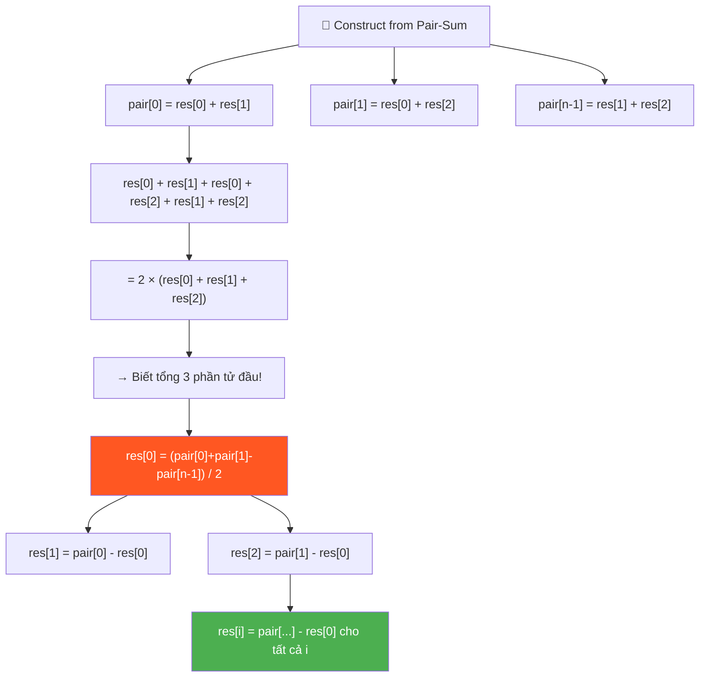
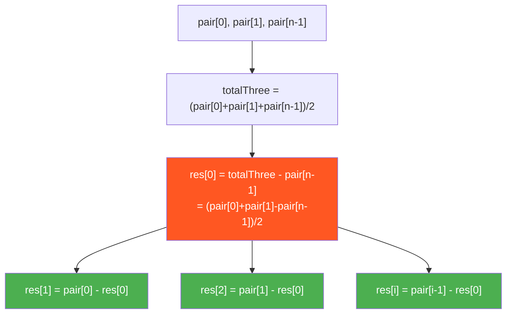

# 🧩 Construct Array from Pair-Sum — GfG (Hard)

> 📖 Code: [Construct Array from Pair-Sum.js](./Construct%20Array%20from%20Pair-Sum.js)



---

## R — Repeat & Clarify

🧠 *"Cho mảng pair-sum chứa TỔNG từng cặp. TÌM LẠI mảng gốc."*

> 🎙️ *"Given a pair-sum array where each element is the sum of a unique pair from an unknown original array, reconstruct the original array."*

### Clarification Questions

```
Q: Pair-sum array được tạo theo THỨ TỰ nào?
A: Theo ROW-MAJOR order:
   pair[0] = res[0]+res[1]
   pair[1] = res[0]+res[2]
   pair[2] = res[0]+res[3]
   ...
   pair[n-2] = res[0]+res[n-1]
   pair[n-1] = res[1]+res[2]
   pair[n]   = res[1]+res[3]
   ...
   → Tổng cộng: n(n-1)/2 cặp (trong đó n = kích thước mảng gốc)

Q: Biết n không?
A: TÍNH ĐƯỢC! Nếu pair-sum array có m phần tử:
   m = n(n-1)/2 → n = (1 + √(1+8m)) / 2

Q: Có nhiều đáp án không?
A: CÓ thể! Nhưng thuật toán cho 1 đáp án hợp lệ.

Q: Luôn có đáp án?
A: KHÔNG guarantee! Nhưng bài yêu cầu tìm 1 đáp án valid.
```

### Thứ tự các cặp — HIỂU RÕ!

```
  Mảng gốc res[] có n phần tử.
  Pair-sum array có n(n-1)/2 phần tử.

  VÍ DỤ: n = 4, res = [a, b, c, d]

  Pair-sum array (theo thứ tự):
    pair[0] = a+b     ← res[0]+res[1]
    pair[1] = a+c     ← res[0]+res[2]
    pair[2] = a+d     ← res[0]+res[3]
    pair[3] = b+c     ← res[1]+res[2]
    pair[4] = b+d     ← res[1]+res[3]
    pair[5] = c+d     ← res[2]+res[3]

  n(n-1)/2 = 4×3/2 = 6 cặp ✅

  ⭐ NHẬN XÉT QUAN TRỌNG:
    pair[0] = res[0]+res[1]     ← 2 phần tử ĐẦU TIÊN!
    pair[1] = res[0]+res[2]     ← phần tử đầu + phần tử thứ 3
    pair[n-2] = res[1]+res[2]   ← phần tử thứ 2 + thứ 3
    (trong đó n-2 = n_pair - ... → xem bảng index bên dưới!)

  → 3 cặp FIRST quan trọng: pair[0], pair[1], pair[?]
    cho ta 3 PHƯƠNG TRÌNH 3 ẨN: res[0], res[1], res[2]!
```

### Tại sao bài này quan trọng?

```
  Bài này dạy:
  1. TƯ DUY ĐẠI SỐ — hệ phương trình!
  2. REVERSE ENGINEERING — từ output tìm input!
  3. INDEX MAPPING — hiểu thứ tự pair-sum!

  ┌───────────────────────────────────────────────────┐
  │  Kỹ năng: Biến đổi đại số + logic deduction      │
  │  Giống: Reconstruct Original Digits from English  │
  │         Construct Binary Tree from Traversals     │
  │  Level: Hard thinking, Easy coding!               │
  └───────────────────────────────────────────────────┘
```

---

## 🧠 Bản chất bài toán — Hiểu để NHỚ, không chỉ để GIẢI

### BƯỚC 1: Tìm n (kích thước mảng gốc)

```
  pair-sum array có m phần tử.
  m = n(n-1)/2

  → n² - n - 2m = 0
  → n = (1 + √(1 + 8m)) / 2

  VÍ DỤ:
    m = 3: n = (1 + √25) / 2 = (1+5)/2 = 3 ✅
    m = 6: n = (1 + √49) / 2 = (1+7)/2 = 4 ✅
    m = 10: n = (1 + √81) / 2 = (1+9)/2 = 5 ✅
    m = 1: n = (1 + √9) / 2 = (1+3)/2 = 2 ✅
```

### BƯỚC 2: Tìm res[0] — TRỤ CỘT toàn bộ bài!

```
  ⭐ KEY INSIGHT: Từ 3 pair-sums ĐẦU TIÊN, tính res[0]!

  pair[0] = res[0] + res[1]     ... (1)
  pair[1] = res[0] + res[2]     ... (2)

  Vậy pair res[1]+res[2] nằm ở đâu?
    → Đây là cặp (1, 2) → index = n-2 trong pair-sum array!

  Tại sao n-2?
    pair indices cho res[0]: 0, 1, 2, ..., n-2  (n-1 cặp)
    pair index đầu tiên KHÔNG chứa res[0]:
      = cặp (res[1], res[2]) = index n-1!

  Nên: pair[n-1] = res[1] + res[2]  ... (3)
  (Ở đây n = kích thước mảng gốc, KHÔNG PHẢI pair array!)

  Cộng (1) + (2) + (3):
    pair[0] + pair[1] + pair[n-1]
    = (res[0]+res[1]) + (res[0]+res[2]) + (res[1]+res[2])
    = 2×(res[0] + res[1] + res[2])

  → res[0] + res[1] + res[2] = (pair[0] + pair[1] + pair[n-1]) / 2

  Mà pair[0] = res[0] + res[1]:
  → res[2] = totalThree - pair[0]

  Mà pair[1] = res[0] + res[2]:
  → res[1] = totalThree - pair[1]

  → res[0] = pair[0] - res[1]
           = pair[0] - (totalThree - pair[1])
           = pair[0] + pair[1] - totalThree

  HOẶC trực tiếp:
  ⭐ res[0] = (pair[0] + pair[1] - pair[n-1]) / 2
```

### BƯỚC 3: Tìm res[1], res[2], ..., res[n-1]

```
  SAU KHI có res[0]:

  pair[0] = res[0] + res[1]  → res[1] = pair[0] - res[0]
  pair[1] = res[0] + res[2]  → res[2] = pair[1] - res[0]
  pair[2] = res[0] + res[3]  → res[3] = pair[2] - res[0]
  ...
  pair[k] = res[0] + res[k+1] → res[k+1] = pair[k] - res[0]

  → n-1 phần tử đầu tiên của pair-sum đều chứa res[0]!
  → Trừ res[0] ra → được TẤT CẢ phần tử còn lại!

  ⭐ CÔNG THỨC:
    res[0] = (pair[0] + pair[1] - pair[n-1]) / 2
    res[i] = pair[i-1] - res[0]   (với i = 1, 2, ..., n-1)
```



---

## 🧭 Luồng Suy Nghĩ — Từ đọc đề đến solution

### Bước 1: Đọc đề → Keywords

```
  "pair-sum" → tổng từng CẶP → n(n-1)/2 cặp
  "reconstruct" → REVERSE ENGINEERING!
  "unique pairs with order" → biết vị trí nào ứng cặp nào!

  🧠 Tự hỏi: "Biết tổng cặp → tìm phần tử?"
    → Hệ phương trình! 3 phương trình → 3 ẩn!
```

### Bước 2: Quan sát cấu trúc pair-sum

```
  n-1 phần tử ĐẦU TIÊN của pair-sum đều chứa res[0]:
    pair[0] = res[0] + res[1]
    pair[1] = res[0] + res[2]
    ...
    pair[n-2] = res[0] + res[n-1]

  Phần tử thứ n-1 (index n-1) = res[1] + res[2]
    → ĐÂY LÀ CẶP ĐẦU TIÊN KHÔNG CHỨA res[0]!

  → 3 phương trình: pair[0], pair[1], pair[n-1]
    → Giải hệ → tìm res[0]!
    → Từ res[0] → tính tất cả!
```

### Bước 3: Code

```
  1. Tính n từ m = pair.length
  2. res[0] = (pair[0] + pair[1] - pair[n-1]) / 2
  3. For i = 1 → n-1: res[i] = pair[i-1] - res[0]
  4. Return res

  → O(n) time! (chỉ 1 vòng for!)
```

---

## E — Examples

```
VÍ DỤ 1: pair = [4, 5, 3]

  m = 3 → n = (1+√25)/2 = 3

  pair[0] = 4   (res[0]+res[1])
  pair[1] = 5   (res[0]+res[2])
  pair[2] = 3   (res[1]+res[2])  ← pair[n-1] = pair[2]

  res[0] = (4 + 5 - 3) / 2 = 6/2 = 3
  res[1] = pair[0] - res[0] = 4 - 3 = 1
  res[2] = pair[1] - res[0] = 5 - 3 = 2

  → [3, 1, 2] ✅

  Kiểm tra: 3+1=4 ✅, 3+2=5 ✅, 1+2=3 ✅
```

```
VÍ DỤ 2: pair = [3]

  m = 1 → n = (1+√9)/2 = 2

  pair[0] = 3   (res[0]+res[1])
  pair[n-1] = pair[1] nhưng n=2 → n-1=1

  ⚠️ Khi n=2: chỉ có 1 pair!
    pair[0] = res[0] + res[1]
    → Vô số nghiệm! Chọn 1 nghiệm hợp lệ.

  Cách xử lý đặc biệt cho n=2:
    res[0] = 1 (hoặc bất kỳ)
    res[1] = pair[0] - res[0] = 2

  → [1, 2] ✅
```

```
VÍ DỤ 3: pair = [12, 15, 18, 13, 16, 19]

  m = 6 → n = (1+√49)/2 = 4

  Pair mapping (n=4):
    pair[0] = res[0]+res[1] = 12
    pair[1] = res[0]+res[2] = 15
    pair[2] = res[0]+res[3] = 18
    pair[3] = res[1]+res[2] = 13   ← pair[n-1] = pair[3]
    pair[4] = res[1]+res[3] = 16
    pair[5] = res[2]+res[3] = 19

  res[0] = (12 + 15 - 13) / 2 = 14/2 = 7
  res[1] = 12 - 7 = 5
  res[2] = 15 - 7 = 8
  res[3] = 18 - 7 = 11

  → [7, 5, 8, 11] ✅

  Kiểm tra:
    7+5=12 ✅  7+8=15 ✅  7+11=18 ✅
    5+8=13 ✅  5+11=16 ✅  8+11=19 ✅
```

### Minh họa pair-sum INDEX MAPPING

```
  n = 4: res = [a, b, c, d]

  Pair-sum array indices:
  ┌────────────────────────────────────────────┐
  │  idx  pair    cặp                          │
  │  0    a+b     (0,1)  ← n-1 phần tử đầu    │
  │  1    a+c     (0,2)  ← chứa res[0]!       │
  │  2    a+d     (0,3)  ←                     │
  │  ─────────────────── boundary ─────────    │
  │  3    b+c     (1,2)  ← pair[n-1]! ⭐      │
  │  4    b+d     (1,3)                        │
  │  5    c+d     (2,3)                        │
  └────────────────────────────────────────────┘

  ⭐ pair[n-1] = res[1] + res[2]
     = CẶP ĐẦU TIÊN KHÔNG CHỨA res[0]!

  Với n bất kỳ:
    pair[0..n-2]  chứa res[0]  (n-1 cặp)
    pair[n-1]     = res[1]+res[2] (cặp đầu KHÔNG có res[0])
```

---

## C — Code

### Solution: O(n) ⭐

```javascript
function constructFromPairSum(pair) {
  const m = pair.length;

  // Bước 1: Tính n (kích thước mảng gốc)
  const n = Math.floor((1 + Math.sqrt(1 + 8 * m)) / 2);

  // Edge case: n = 2
  if (n === 2) {
    // pair[0] = res[0] + res[1], vô số nghiệm → chọn 1
    return [1, pair[0] - 1];
  }

  // Bước 2: Tìm res[0]
  // pair[0]   = res[0] + res[1]
  // pair[1]   = res[0] + res[2]
  // pair[n-1] = res[1] + res[2]
  const res = new Array(n);
  res[0] = (pair[0] + pair[1] - pair[n - 1]) / 2;

  // Bước 3: Tìm res[1], res[2], ..., res[n-1]
  for (let i = 1; i < n; i++) {
    res[i] = pair[i - 1] - res[0];
  }

  return res;
}
```

### Giải thích từng phần — CHI TIẾT

```
  BƯỚC 1: Tìm n

  m = n(n-1)/2 → n² - n - 2m = 0
  → n = (1 + √(1+8m)) / 2

  Math.floor() vì tính toán floating point có thể ≈ 4.0000001

  BƯỚC 2: Tìm res[0]

  3 phương trình:
    pair[0]   = res[0] + res[1]    ... (1)
    pair[1]   = res[0] + res[2]    ... (2)
    pair[n-1] = res[1] + res[2]    ... (3)

  (1) + (2) - (3):
    (res[0]+res[1]) + (res[0]+res[2]) - (res[1]+res[2])
    = 2×res[0]

  → res[0] = (pair[0] + pair[1] - pair[n-1]) / 2

  ⚠️ Tại sao pair[n-1]?
     pair[0..n-2] đều chứa res[0] (n-1 cặp đầu)
     pair[n-1] = CẶP ĐẦU TIÊN KHÔNG CHỨA res[0]
               = res[1] + res[2]

  BƯỚC 3: Tìm phần tử còn lại

  pair[i-1] = res[0] + res[i]  (với i = 1, 2, ..., n-1)
  → res[i] = pair[i-1] - res[0]

  ⚠️ Tại sao pair[i-1]?
     pair[0] = res[0]+res[1] → res[1] = pair[0] - res[0]
     pair[1] = res[0]+res[2] → res[2] = pair[1] - res[0]
     ...
     pair[k] = res[0]+res[k+1] → res[k+1] = pair[k] - res[0]
     → res[i] = pair[i-1] - res[0]
```

### Trace CHI TIẾT: pair = [4, 5, 3]

```
  m = 3

  ═══ Bước 1: Tìm n ══════════════════════════════════

  n = (1 + √(1+8×3)) / 2 = (1 + √25) / 2 = 6/2 = 3

  ═══ Bước 2: Tìm res[0] ═════════════════════════════

  pair[0] = 4 (res[0]+res[1])
  pair[1] = 5 (res[0]+res[2])
  pair[n-1] = pair[2] = 3 (res[1]+res[2])

  res[0] = (4 + 5 - 3) / 2 = 6/2 = 3

  ═══ Bước 3: Tìm phần tử còn lại ════════════════════

  res[1] = pair[0] - res[0] = 4 - 3 = 1
  res[2] = pair[1] - res[0] = 5 - 3 = 2

  → res = [3, 1, 2] ✅
```

### Trace: pair = [12, 15, 18, 13, 16, 19] (n=4)

```
  m = 6 → n = (1+√49)/2 = 4

  pair[0]=12, pair[1]=15, pair[n-1]=pair[3]=13

  res[0] = (12 + 15 - 13) / 2 = 14/2 = 7
  res[1] = pair[0] - 7 = 12 - 7 = 5
  res[2] = pair[1] - 7 = 15 - 7 = 8
  res[3] = pair[2] - 7 = 18 - 7 = 11

  → res = [7, 5, 8, 11] ✅

  Verify:
    7+5=12 ✅  7+8=15 ✅  7+11=18 ✅
    5+8=13 ✅  5+11=16 ✅  8+11=19 ✅
```

> 🎙️ *"The first n-1 pair sums involve res[0]. The n-th pair sum (index n-1) is res[1]+res[2] — the first pair without res[0]. From these three equations I derive res[0] using algebra: (pair[0] + pair[1] - pair[n-1]) / 2. Then every other element is simply pair[i-1] minus res[0]. O(n) time, O(n) space for the output."*

---

## O — Optimize

```
                    Time      Space     Ghi chú
  ─────────────────────────────────────────────────
  Giải hệ PT ⭐     O(n)      O(n)      Tối ưu!

  ⚠️ Không có brute force nào tốt hơn:
    Phải tính n phần tử → Ω(n) time!
    Phải lưu n phần tử → Ω(n) space!
    → O(n) là TỐI ƯU!

  ⚠️ Bài này HARD ở TƯỞNG TƯỢNG, EASY ở CODE!
    Hiểu cách tìm res[0] → code chỉ 5 dòng!
```

---

## T — Test

```
Test Cases:
  [4, 5, 3]                       → [3, 1, 2]        ✅ n=3
  [3]                              → [1, 2]           ✅ n=2
  [12, 15, 18, 13, 16, 19]        → [7, 5, 8, 11]    ✅ n=4
  [6]                              → [1, 5]           ✅ n=2
  [5, 8, 11, 7, 10, 13]           → [1, 4, 7, 10]    ✅ n=4 (AP)
```

---

## 🗣️ Interview Script

### Think Out Loud

```
  🧠 BƯỚC 1: Hiểu pair-sum structure
    "n-1 pair đầu chứa res[0]"
    "pair[n-1] = res[1]+res[2] = cặp đầu KHÔNG có res[0]"

  🧠 BƯỚC 2: Giải hệ 3 phương trình
    "pair[0] + pair[1] - pair[n-1] = 2×res[0]"
    "→ res[0] = (pair[0] + pair[1] - pair[n-1]) / 2"

  🧠 BƯỚC 3: Suy ra tất cả
    "res[i] = pair[i-1] - res[0] cho i = 1..n-1"

  🎙️ Interview phrasing:
    "The key observation is that the first n-1 pair sums all
     involve res[0], and pair[n-1] is the first pair without
     res[0]. These three values form a system of three equations
     in three unknowns. I solve for res[0], then derive all
     remaining elements in O(n)."
```

### Biến thể & Mở rộng

```
  1. VERIFY pair-sum (check nếu mảng gốc hợp lệ)
     → Từ res[] tính lại pair-sum → so sánh!

  2. Pair-sum KHÔNG THEO THỨ TỰ
     → SORT pair-sum trước → phức tạp hơn!
     → Cần dùng multiset/priority queue!

  3. Construct from Triple-sum
     → Tương tự nhưng phức tạp hơn → n(n-1)(n-2)/6 triples!

  4. Sum of All Pairs (tổng TẤT CẢ pair-sums)
     → Mỗi res[i] xuất hiện trong n-1 cặp
     → Total = (n-1) × sum(res)
```

---

## 🧩 Sai lầm phổ biến

```
❌ SAI LẦM #1: Nhầm index pair[n-1]!

   pair[n-1] = res[1]+res[2] (n = kích thước MẢNg GỐC!)
   KHÔNG phải pair[m-1] (m = kích thước pair array!)

   n-1 trong bối cảnh:
   → n = kích thước mảng GỐC (3, 4, 5, ...)
   → pair[n-1] = phần tử thứ n của pair array (index n-1)

─────────────────────────────────────────────────

❌ SAI LẦM #2: Quên edge case n=2!

   n=2: pair chỉ có 1 phần tử = res[0]+res[1]
   → Vô số nghiệm! Công thức chính KHÔNG áp dụng!
   → Cần xử lý riêng!

─────────────────────────────────────────────────

❌ SAI LẦM #3: Nhầm res[i] = pair[i] - res[0]!

   ĐÚNG: res[i] = pair[i-1] - res[0]  (lệch 1!)
   Vì: pair[0] = res[0]+res[1] → res[1] = pair[0]-res[0]
       pair[1] = res[0]+res[2] → res[2] = pair[1]-res[0]
   → pair index = res index - 1!

─────────────────────────────────────────────────

❌ SAI LẦM #4: Kết quả có số lẻ (chia 2 dư 1)!

   res[0] = (pair[0]+pair[1]-pair[n-1]) / 2
   Nếu tổng là SỐ LẺ → res[0] không nguyên!
   → Input KHÔNG hợp lệ (không tồn tại mảng gốc nguyên)!
```

---

## 📝 Flashcard — Tự kiểm tra

| ❓ Câu hỏi | ✅ Đáp án |
|---|---|
| Pair-sum array có bao nhiêu phần tử? | **n(n-1)/2** |
| n-1 pair đầu tiên có điểm chung gì? | Đều chứa **res[0]**! |
| pair[n-1] là cặp nào? | **res[1] + res[2]** (cặp đầu không có res[0]) |
| Công thức res[0]? | **(pair[0] + pair[1] - pair[n-1]) / 2** |
| res[i] (i ≥ 1)? | **pair[i-1] - res[0]** |
| Time complexity? | **O(n)** |
| Edge case n=2? | Vô số nghiệm, xử lý riêng |
| Tại sao pair[i-1] chứ không phải pair[i]? | pair[0]=res[0]+res[**1**], index lệch 1 |
