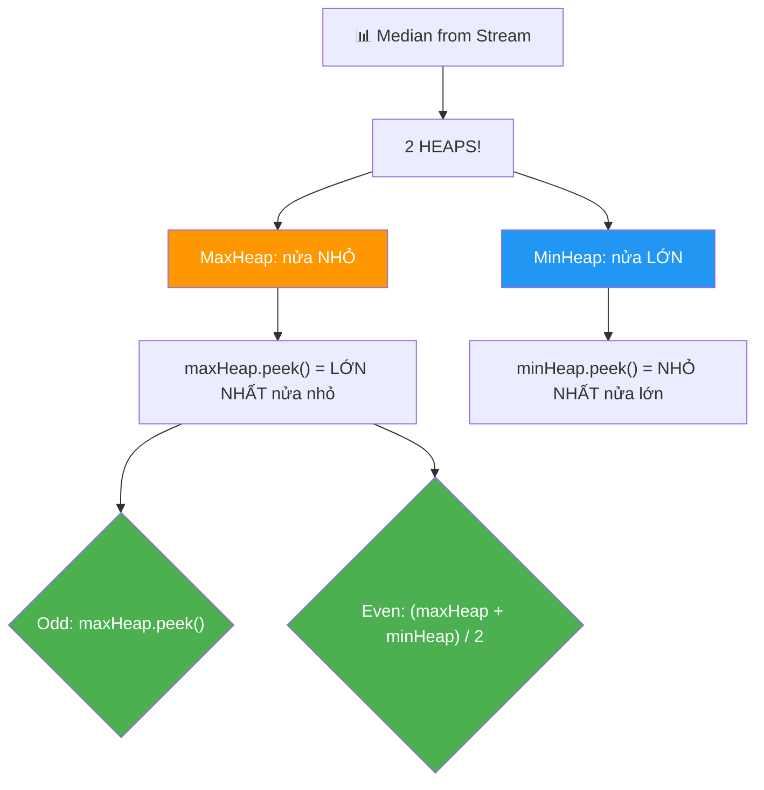
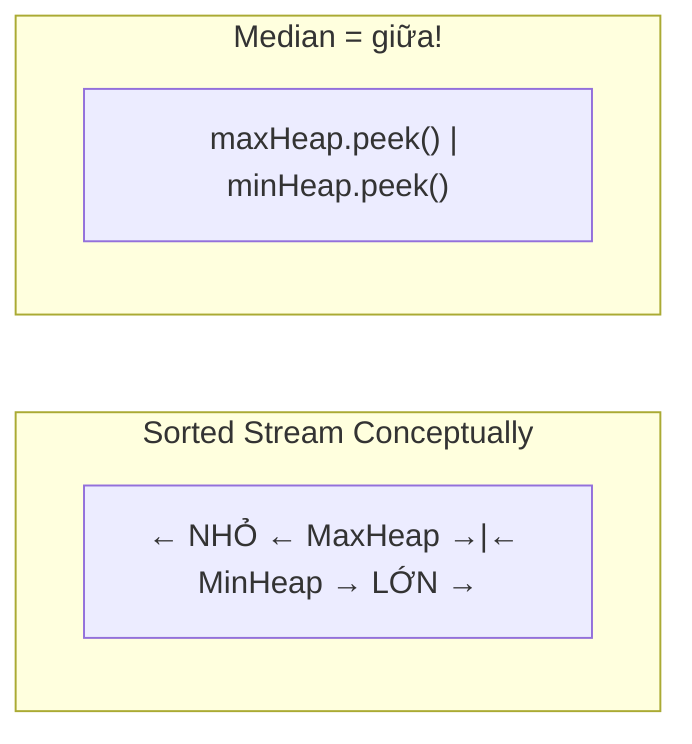
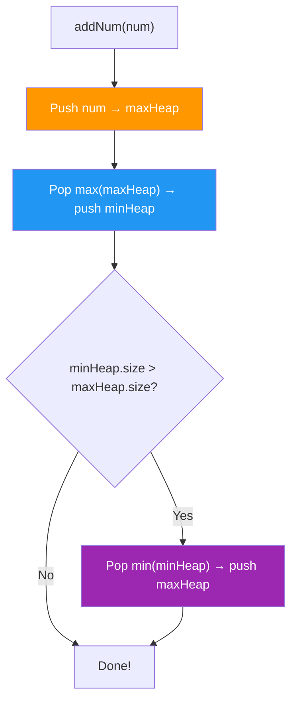
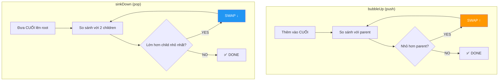
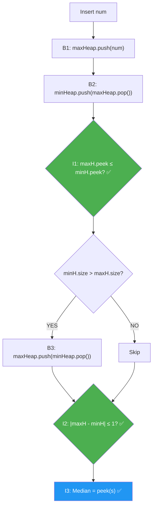
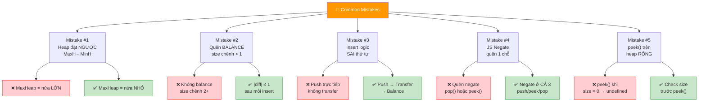
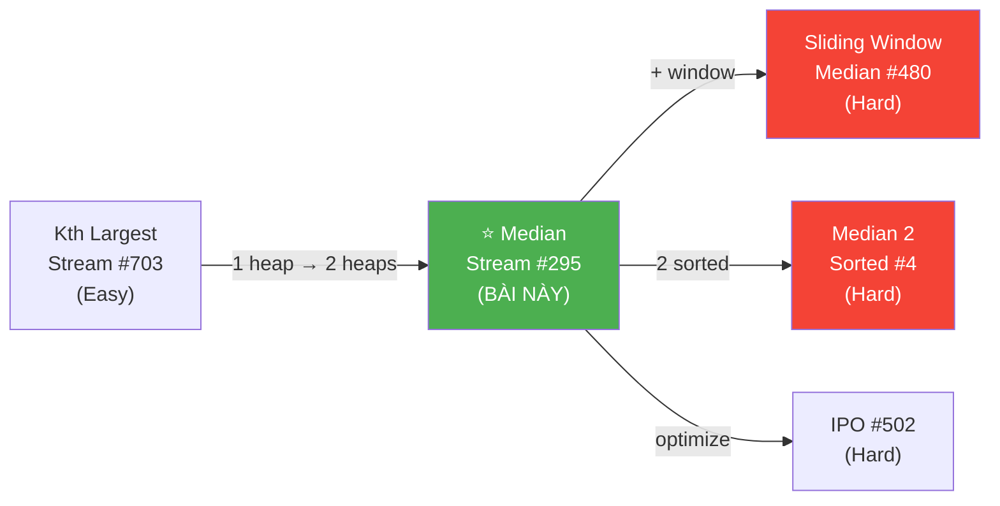
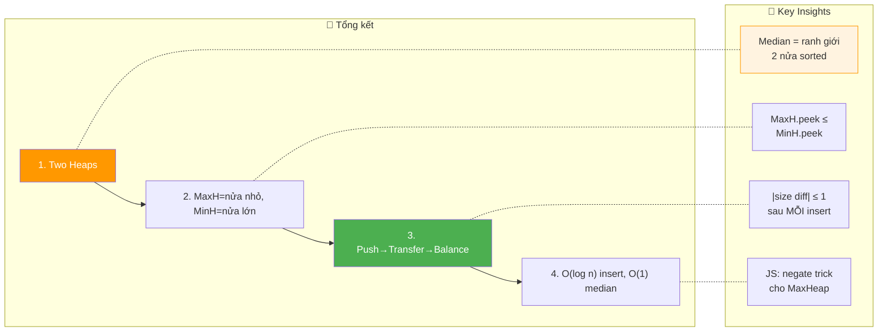

# 📊 Find Median from Data Stream — GfG / LeetCode #295 (Hard)

> 📖 Code: [Median from Data Stream.js](./Median%20from%20Data%20Stream.js)





---

## R — Repeat & Clarify

🧠 *"Nhận stream số liên tục. Sau MỖI số mới, tìm MEDIAN của tất cả số đã nhận."*

> 🎙️ *"Design a data structure that receives integers one at a time and returns the median of all elements seen so far after each insertion."*

### Clarification Questions

```
Q: Median = gì?
A: Số Ở GIỮA khi sort!
   Odd count:  median = phần tử giữa
   Even count: median = TRUNG BÌNH 2 phần tử giữa

Q: Stream = gì?
A: Số đến TỪNG CÁI MỘT! Không biết trước toàn bộ!
   → Cần cấu trúc dữ liệu HIỆU QUẢ!

Q: Có số âm/trùng không?
A: CÓ! Tất cả integer hợp lệ!

Q: Output format?
A: Mảng median SAU MỖI lần insert!
```

### Tại sao bài này quan trọng?

```
  ⭐ TOP bài phỏng vấn DESIGN + ALGORITHM!
  (Google, Amazon, Netflix — hỏi LIÊN TỤC!)

  BẠN PHẢI hiểu:
  1. TWO HEAPS pattern — MaxHeap + MinHeap!
  2. BALANCING logic — giữ 2 heap cân bằng!
  3. Heap implementation (JS KHÔNG có sẵn!)

  ┌───────────────────────────────────────────────────┐
  │  Pattern: Two Heaps = "chia dữ liệu làm 2 nửa"   │
  │  Giống: Sliding Window Median (#480)               │
  │         IPO Problem (#502)                         │
  │         Smallest Range (#632)                      │
  └───────────────────────────────────────────────────┘
```

---

## 🧠 Bản chất bài toán — Hiểu để NHỚ, không chỉ để GIẢI

### Tưởng tượng: 2 ĐỘI XẾP HÀNG!

```
  ⭐ Chia tất cả số thành 2 NỬA:

  NỬA NHỎ (maxHeap):  chứa nửa NHỎ hơn
    → MaxHeap: peek() = LỚN NHẤT trong nửa nhỏ!

  NỬA LỚN (minHeap):  chứa nửa LỚN hơn
    → MinHeap: peek() = NHỎ NHẤT trong nửa lớn!

  VÍ DỤ: stream đã nhận [1, 3, 5, 7, 9]

    maxHeap (nửa nhỏ): [1, 3, 5]  peek = 5
    minHeap (nửa lớn): [7, 9]     peek = 7

    Median = maxHeap.peek() = 5 ✅ (odd → phần tử giữa!)

  VÍ DỤ: stream đã nhận [1, 3, 5, 7]

    maxHeap: [1, 3]  peek = 3
    minHeap: [5, 7]  peek = 5

    Median = (3 + 5) / 2 = 4 ✅ (even → trung bình!)

  ⭐ MEDIAN luôn ở RANH GIỚI giữa 2 heap!
```

### QUY TẮC CÂN BẰNG

```
  ⭐ 2 QUY TẮC VÀNG:

  1. maxHeap.size >= minHeap.size  (maxHeap nhiều hơn hoặc bằng!)
  2. maxHeap.size <= minHeap.size + 1  (chênh TỐI ĐA 1!)

  → |maxHeap.size - minHeap.size| ≤ 1

  Tại sao maxHeap nhiều hơn?
    → Odd count: median = maxHeap.peek() (1 phần tử dư ở maxHeap!)
    → Even count: median = (maxHeap.peek() + minHeap.peek()) / 2

  ⚠️ Convention: maxHeap luôn ≥ minHeap size!
     (Có thể đảo, nhưng phải NHẤT QUÁN!)
```

### THUẬT TOÁN INSERT — 3 bước!

```
  ⭐ Thêm số num vào stream:

  BƯỚC 1: Push vào maxHeap TRƯỚC
    maxHeap.push(num)

  BƯỚC 2: Di chuyển MAX(maxHeap) sang minHeap
    minHeap.push(maxHeap.pop())
    → Đảm bảo maxHeap.peek() ≤ minHeap.peek()!
    → (Lớn nhất nửa nhỏ ≤ Nhỏ nhất nửa lớn!)

  BƯỚC 3: Cân bằng kích thước
    if (minHeap.size > maxHeap.size):
      maxHeap.push(minHeap.pop())
    → Đảm bảo maxHeap.size ≥ minHeap.size!

  ⚠️ Tại sao 3 bước mà không push trực tiếp?
     Nếu push trực tiếp vào maxHeap:
     → num có thể LỚN HƠN minHeap.peek() → sai nửa!
     → Bước 2 tự động SỬA bằng cách chuyển lớn nhất sang!

  ⚠️ Cách khác: so sánh num với maxHeap.peek():
     → num ≤ maxHeap.peek(): push vào maxHeap
     → num > maxHeap.peek(): push vào minHeap
     → Rồi balance! (cũng đúng, nhưng nhiều case hơn)
```



---

## 🧭 Luồng Suy Nghĩ — Từ đọc đề đến solution

### Bước 1: Brute Force?

```
  Cách 1: Maintain sorted array
    → Insert: O(n) (shift elements!)
    → Median: O(1) (access middle!)
    → Total: O(n²) cho n insertions!

  Cách 2: Sort lại mỗi lần
    → Insert: O(1) (push!)
    → Median: O(n log n) (sort!)
    → Total: O(n² log n) → rất chậm!
```

### Bước 2: Two Heaps → O(log n) per insert!

```
  → Insert: O(log n) (3 heap operations!)
  → Median: O(1) (peek top of heaps!)
  → Total: O(n log n) cho n insertions!
  → TỐI ƯU!
```

---

## E — Examples

```
VÍ DỤ: arr = [5, 15, 1, 3, 2, 8]

  ═══ Insert 5 ═════════════════════════════════════
  maxHeap.push(5) → maxHeap=[5]
  minHeap.push(maxHeap.pop()=5) → maxHeap=[], minHeap=[5]
  min.size(1) > max.size(0) → maxHeap.push(minHeap.pop()=5)
  maxHeap=[5], minHeap=[]
  Median = maxHeap.peek() = 5.00 ✅

  ═══ Insert 15 ════════════════════════════════════
  maxHeap.push(15) → maxHeap=[15,5]
  minHeap.push(maxHeap.pop()=15) → maxHeap=[5], minHeap=[15]
  min.size(1) = max.size(1) → OK!
  maxHeap=[5], minHeap=[15]
  Median = (5+15)/2 = 10.00 ✅

  ═══ Insert 1 ═════════════════════════════════════
  maxHeap.push(1) → maxHeap=[5,1]
  minHeap.push(maxHeap.pop()=5) → maxHeap=[1], minHeap=[5,15]
  min.size(2) > max.size(1) → maxHeap.push(minHeap.pop()=5)
  maxHeap=[5,1], minHeap=[15]
  Median = maxHeap.peek() = 5.00 ✅

  ═══ Insert 3 ═════════════════════════════════════
  maxHeap.push(3) → maxHeap=[5,3,1]
  minHeap.push(maxHeap.pop()=5) → maxHeap=[3,1], minHeap=[5,15]
  min.size(2) = max.size(2) → OK!
  maxHeap=[3,1], minHeap=[5,15]
  Median = (3+5)/2 = 4.00 ✅

  ═══ Insert 2 ═════════════════════════════════════
  maxHeap.push(2) → maxHeap=[3,2,1]
  minHeap.push(maxHeap.pop()=3) → maxHeap=[2,1], minHeap=[3,5,15]
  min.size(3) > max.size(2) → maxHeap.push(minHeap.pop()=3)
  maxHeap=[3,2,1], minHeap=[5,15]
  Median = maxHeap.peek() = 3.00 ✅

  ═══ Insert 8 ═════════════════════════════════════
  maxHeap.push(8) → maxHeap=[8,3,2,1]
  minHeap.push(maxHeap.pop()=8) → maxHeap=[3,2,1], minHeap=[5,8,15]
  min.size(3) = max.size(3) → OK!
  maxHeap=[3,2,1], minHeap=[5,8,15]
  Median = (3+5)/2 = 4.00 ✅

  OUTPUT: [5.00, 10.00, 5.00, 4.00, 3.00, 4.00] ✅
```

### Minh họa trực quan

```
  Sau insert [5, 15, 1, 3, 2, 8]:

  Sorted: [1, 2, 3 | 5, 8, 15]
           ←maxHeap→ ←minHeap→

  maxHeap (nửa nhỏ):    [3, 2, 1]     peek = 3
  minHeap (nửa lớn):    [5, 8, 15]    peek = 5

  Median = (3 + 5) / 2 = 4.00 ✅

  ┌─────────────────────────────────────────────────┐
  │  maxHeap: [... 1, 2, 3]  →  peek=3             │
  │                           |  ← MEDIAN ở đây!    │
  │  minHeap: [5, 8, 15 ...]  →  peek=5             │
  └─────────────────────────────────────────────────┘
```

---

## C — Code

### Heap Implementation (JS không có sẵn!)

```javascript
class MinHeap {
  constructor() { this.data = []; }
  size() { return this.data.length; }
  peek() { return this.data[0]; }

  push(val) {
    this.data.push(val);
    this._bubbleUp(this.data.length - 1);
  }

  pop() {
    const top = this.data[0];
    const last = this.data.pop();
    if (this.data.length > 0) {
      this.data[0] = last;
      this._sinkDown(0);
    }
    return top;
  }

  _bubbleUp(i) {
    while (i > 0) {
      const parent = (i - 1) >> 1;
      if (this.data[parent] <= this.data[i]) break;
      [this.data[parent], this.data[i]] = [this.data[i], this.data[parent]];
      i = parent;
    }
  }

  _sinkDown(i) {
    const n = this.data.length;
    while (true) {
      let smallest = i;
      const l = 2 * i + 1, r = 2 * i + 2;
      if (l < n && this.data[l] < this.data[smallest]) smallest = l;
      if (r < n && this.data[r] < this.data[smallest]) smallest = r;
      if (smallest === i) break;
      [this.data[smallest], this.data[i]] = [this.data[i], this.data[smallest]];
      i = smallest;
    }
  }
}

class MaxHeap {
  constructor() { this.heap = new MinHeap(); }
  size() { return this.heap.size(); }
  peek() { return -this.heap.peek(); }
  push(val) { this.heap.push(-val); }
  pop() { return -this.heap.pop(); }
}
```

### Giải thích Heap

```
  ⚠️ JavaScript KHÔNG có built-in Heap!
     (Python: heapq, Java: PriorityQueue, C++: priority_queue)

  MinHeap: peek() = NHỎ NHẤT → O(1), push/pop = O(log n)

  MaxHeap: TRICK! Dùng MinHeap với NEGATE values!
    push(5) → MinHeap.push(-5)
    peek() → -MinHeap.peek() = -(-5) = 5
    → MaxHeap behavior mà code MinHeap!

  ⚠️ Phỏng vấn: hỏi "implement heap from scratch?"
     → NÓI "I'll use a standard heap" → code nhanh!
     → Nếu hỏi chi tiết → giải thích bubbleUp/sinkDown!
```

### Solution: Two Heaps — O(log n) per insert ⭐

```javascript
function findMedianStream(arr) {
  const maxHeap = new MaxHeap(); // Nửa NHỎ
  const minHeap = new MinHeap(); // Nửa LỚN
  const result = [];

  for (const num of arr) {
    // Bước 1: Push vào maxHeap
    maxHeap.push(num);

    // Bước 2: Chuyển max(maxHeap) → minHeap
    minHeap.push(maxHeap.pop());

    // Bước 3: Balance
    if (minHeap.size() > maxHeap.size()) {
      maxHeap.push(minHeap.pop());
    }

    // Tính median
    if (maxHeap.size() > minHeap.size()) {
      result.push(maxHeap.peek()); // Odd → maxHeap.peek()
    } else {
      result.push((maxHeap.peek() + minHeap.peek()) / 2); // Even → avg
    }
  }

  return result;
}
```

### Giải thích Solution — CHI TIẾT

```
  FLOW cho mỗi số num:

  1. maxHeap.push(num)         ← thêm vào nửa nhỏ
  2. minHeap.push(maxHeap.pop())  ← chuyển LỚN NHẤT sang nửa lớn
     → Đảm bảo: max(nửa nhỏ) ≤ min(nửa lớn)!
  3. Balance: nếu minHeap nhiều hơn → chuyển 1 về maxHeap
     → Đảm bảo: maxHeap.size ∈ {minHeap.size, minHeap.size+1}

  MEDIAN:
    Odd:  maxHeap có THÊM 1 → median = maxHeap.peek()
    Even: 2 heap bằng nhau → median = avg(maxHeap.peek(), minHeap.peek())

  COMPLEXITY mỗi insert:
    3 heap operations: push + pop + (optional push)
    Mỗi operation: O(log n)
    → O(log n) per insert!

  Median: O(1) — chỉ peek()!
```

> 🎙️ *"I maintain two heaps: a max-heap for the lower half and a min-heap for the upper half. For each new number, I push to the max-heap, then move its top to the min-heap, then rebalance if needed. The median is either the max-heap's top (odd count) or the average of both tops (even count). O(log n) per insertion, O(1) for median."*

---

## 🔬 Deep Dive — Giải thích CHI TIẾT

> 💡 Phân tích **từng dòng** code với giải thích WHY, không chỉ WHAT.

### Deep Dive: Heap Internals — Binary Heap là gì?

```
  ⭐ BINARY HEAP = Complete Binary Tree + Heap Property

  Complete Binary Tree:
    → Tất cả level đầy, trừ level cuối (đầy từ trái → phải)
    → Lưu trong MẢNG! Không cần node/pointer!

  ┌──────────────────────────────────────────────────────┐
  │  Parent-Child relationship (0-indexed):              │
  │                                                      │
  │  parent(i) = (i - 1) >> 1  = Math.floor((i-1)/2)   │
  │  left(i)   = 2 * i + 1                              │
  │  right(i)  = 2 * i + 2                              │
  │                                                      │
  │  VÍ DỤ: data = [1, 3, 5, 7, 9]                     │
  │                                                      │
  │         1 (i=0)                                      │
  │        / \                                           │
  │       3   5  (i=1, i=2)                              │
  │      / \                                             │
  │     7   9   (i=3, i=4)                               │
  │                                                      │
  │  parent(3) = (3-1)>>1 = 1 → data[1]=3 ✅           │
  │  left(1) = 2*1+1 = 3 → data[3]=7 ✅                │
  │  right(1) = 2*1+2 = 4 → data[4]=9 ✅               │
  └──────────────────────────────────────────────────────┘

  MinHeap Property: parent ≤ children (mọi node!)
    → Root (data[0]) = NHỎ NHẤT! → peek() = O(1)!

  MaxHeap Property: parent ≥ children (mọi node!)
    → Root (data[0]) = LỚN NHẤT! → peek() = O(1)!
```

### Deep Dive: bubbleUp vs sinkDown

```
  ⭐ HAI THAO TÁC CỐT LÕI CỦA HEAP:

  ─── bubbleUp (sau push) ────────────────────────────
  Khi THÊM phần tử mới vào cuối mảng:
    → Có thể VI PHẠM heap property với parent!
    → So sánh với parent, swap nếu NHỎ hơn (MinHeap)
    → Lặp lại cho đến khi thỏa hoặc lên root!

  VÍ DỤ MinHeap: push(2) vào [1, 5, 3, 7]
    [1, 5, 3, 7, 2]  → 2 < parent(5) → swap!
    [1, 2, 3, 7, 5]  → 2 > parent(1) → STOP!

    Height = O(log n) → bubbleUp = O(log n)!

  ─── sinkDown (sau pop) ─────────────────────────────
  Khi XÓA root (min/max):
    → Đưa phần tử CUỐI lên root
    → Có thể VI PHẠM heap property với children!
    → So sánh với 2 children, swap với NHỎ NHẤT (MinHeap)
    → Lặp lại cho đến khi thỏa hoặc xuống leaf!

  VÍ DỤ MinHeap: pop() từ [1, 2, 3, 7, 5]
    Xóa root(1), đưa cuối(5) lên: [5, 2, 3, 7]
    5 > min(2,3)=2 → swap với 2: [2, 5, 3, 7]
    5 > child(7)? NO → STOP!

    Height = O(log n) → sinkDown = O(log n)!
```



### Deep Dive: MaxHeap via Negate — TẠI SAO?

```
  ⭐ JavaScript KHÔNG CÓ MaxHeap built-in!

  TRICK: Negate mọi giá trị → MinHeap hoạt động như MaxHeap!

  Giải thích toán học:
    Nếu a > b → -a < -b
    → Min(-values) = -(Max(values))!

  VÍ DỤ: Muốn MaxHeap chứa [3, 7, 5]
    MinHeap lưu: [-3, -7, -5]
    MinHeap.peek() = -7 (nhỏ nhất trong negated!)
    MaxHeap.peek() = -(-7) = 7 (LỚN NHẤT gốc!) ✅

  ⚠️ PHẢI negate ở 3 chỗ:
    push(val) → heap.push(-val)    ← negate IN
    peek()    → -heap.peek()       ← negate OUT
    pop()     → -heap.pop()        ← negate OUT

  ⚠️ Quên negate BẤT KỲ chỗ nào → BUG khó tìm!
```

### Deep Dive: Annotated Solution Code

```javascript
function findMedianStream(arr) {
  const maxHeap = new MaxHeap(); // Nửa NHỎ
  const minHeap = new MinHeap(); // Nửa LỚN
  const result = [];
  // ═══════════════════════════════════════════════════════════
  // TẠI SAO MaxHeap = nửa NHỎ, MinHeap = nửa LỚN?
  // ═══════════════════════════════════════════════════════════
  //
  // Median nằm ở RANH GIỚI giữa 2 nửa:
  //   MaxHeap.peek() = LỚN NHẤT trong nửa nhỏ  ← ← ← ←┐
  //   MinHeap.peek() = NHỎ NHẤT trong nửa lớn  ← ← ← ←┤ MEDIAN!
  //                                                      │
  //   [... nhỏ ... maxH.peek() | minH.peek() ... lớn ...]
  //                             ↑
  //                           MEDIAN
  //
  // Nếu đặt NGƯỢC (MaxHeap = nửa lớn):
  //   MaxHeap.peek() = LỚN NHẤT nửa lớn → xa median!
  //   MinHeap.peek() = NHỎ NHẤT nửa nhỏ → xa median!
  //   → KHÔNG lấy được median! ❌

  for (const num of arr) {
    // ═══════════════════════════════════════════════════════
    // BƯỚC 1: Push vào maxHeap (nửa nhỏ)
    // ═══════════════════════════════════════════════════════
    //
    // ⚠️ TẠI SAO luôn push vào maxHeap TRƯỚC?
    //   → Không cần so sánh num với heap tops!
    //   → Bước 2 sẽ TỰ ĐỘNG sửa nếu num quá lớn!
    //   → Code NGẮN + ÍT bug hơn!
    //
    maxHeap.push(num);

    // ═══════════════════════════════════════════════════════
    // BƯỚC 2: Chuyển MAX(maxHeap) → minHeap
    // ═══════════════════════════════════════════════════════
    //
    // Lấy phần tử LỚN NHẤT từ nửa nhỏ → đẩy sang nửa lớn!
    //
    // ⭐ INSIGHT QUAN TRỌNG: Bước này đảm bảo:
    //   maxHeap.peek() ≤ minHeap.peek()
    //   (Mọi phần tử nửa nhỏ ≤ mọi phần tử nửa lớn!)
    //
    // ⚠️ TẠI SAO cần bước này?
    //   VD: maxHeap = [5, 3], minHeap = [7, 9]
    //   Insert 100: maxHeap = [100, 5, 3]
    //   Nếu KHÔNG chuyển: maxHeap.peek() = 100 > minHeap.peek() = 7
    //   → VI PHẠM! Nửa nhỏ chứa số lớn hơn nửa lớn! ❌
    //   Chuyển max(100) sang: maxH=[5,3], minH=[7,9,100] ✅
    //
    minHeap.push(maxHeap.pop());

    // ═══════════════════════════════════════════════════════
    // BƯỚC 3: Cân bằng kích thước
    // ═══════════════════════════════════════════════════════
    //
    // Convention: maxHeap.size ∈ {minHeap.size, minHeap.size + 1}
    //   → maxHeap nhiều hơn TỐI ĐA 1!
    //   → Nếu minHeap nhiều hơn → chuyển min(minHeap) về maxHeap
    //
    // ⚠️ TẠI SAO chỉ check minHeap > maxHeap?
    //   Sau bước 1+2: maxHeap giảm 0 (push rồi pop = net 0)
    //                 minHeap tăng 1
    //   → Chỉ có thể xảy ra: minHeap nhiều hơn maxHeap 1!
    //   → KHÔNG BAO GIỜ maxHeap nhiều hơn minHeap >1 sau bước 2!
    //
    if (minHeap.size() > maxHeap.size()) {
      maxHeap.push(minHeap.pop());
    }

    // ═══════════════════════════════════════════════════════
    // TÍNH MEDIAN
    // ═══════════════════════════════════════════════════════
    //
    // Odd count: maxHeap có THÊM 1 phần tử
    //   → median = maxHeap.peek() (phần tử giữa!)
    //
    // Even count: 2 heap BẰNG NHAU
    //   → median = avg(maxHeap.peek(), minHeap.peek())
    //   → 2 phần tử giữa!
    //
    // ⚠️ TẠI SAO maxHeap.size() > minHeap.size() = odd?
    //   Convention: maxHeap luôn ≥ minHeap
    //   → Odd: maxHeap = (n+1)/2, minHeap = (n-1)/2
    //   → Even: maxHeap = n/2, minHeap = n/2
    //
    if (maxHeap.size() > minHeap.size()) {
      result.push(maxHeap.peek());
    } else {
      result.push((maxHeap.peek() + minHeap.peek()) / 2);
    }
  }

  return result;
}
```

### Trace CHI TIẾT bổ sung: arr = [3, 1, 2]

```
  ═══ Insert 3 ═════════════════════════════════════
  B1: maxHeap.push(3) → maxHeap=[3], minHeap=[]
  B2: minHeap.push(maxHeap.pop()=3)
      → maxHeap=[], minHeap=[3]
  B3: min.size(1) > max.size(0) → YES!
      maxHeap.push(minHeap.pop()=3)
      → maxHeap=[3], minHeap=[]
  Median: max.size(1) > min.size(0) → maxHeap.peek() = 3 ✅

  ═══ Insert 1 ═════════════════════════════════════
  B1: maxHeap.push(1) → maxHeap=[3,1], minHeap=[]
  B2: minHeap.push(maxHeap.pop()=3)
      → maxHeap=[1], minHeap=[3]
  B3: min.size(1) = max.size(1) → NO
  Median: max.size(1) = min.size(1) → (1+3)/2 = 2 ✅

  ═══ Insert 2 ═════════════════════════════════════
  B1: maxHeap.push(2) → maxHeap=[2,1], minHeap=[3]
  B2: minHeap.push(maxHeap.pop()=2)
      → maxHeap=[1], minHeap=[2,3]
  B3: min.size(2) > max.size(1) → YES!
      maxHeap.push(minHeap.pop()=2)
      → maxHeap=[2,1], minHeap=[3]
  Median: max.size(2) > min.size(1) → maxHeap.peek() = 2 ✅

  OUTPUT: [3, 2, 2] ✅

  ⭐ Sorted = [1, 2, 3] → median = 2 ✅
  maxHeap = [2, 1] (nửa nhỏ, peek=2)
  minHeap = [3]     (nửa lớn, peek=3)
```

### Trace: arr = [5, 4, 3, 2, 1] (giảm dần)

```
  ⭐ Worst case? Phần tử giảm dần — mọi num đều < maxHeap.peek()!

  ┌──────┬──────┬──────────────┬──────────────┬─────────┐
  │ Step │ num  │ maxHeap      │ minHeap      │ Median  │
  ├──────┼──────┼──────────────┼──────────────┼─────────┤
  │ 1    │ 5    │ [5]          │ []           │ 5       │
  │ 2    │ 4    │ [4]          │ [5]          │ 4.5     │
  │ 3    │ 3    │ [4, 3]       │ [5]          │ 4       │
  │ 4    │ 2    │ [3, 2]       │ [4, 5]       │ 3.5     │
  │ 5    │ 1    │ [3, 2, 1]    │ [4, 5]       │ 3       │
  └──────┴──────┴──────────────┴──────────────┴─────────┘

  OUTPUT: [5, 4.5, 4, 3.5, 3] ✅

  ⭐ NHẬN XÉT: Dù input giảm dần, thuật toán vẫn O(log n)!
     Mỗi step: 3 heap ops × O(log n) = O(log n)
     → Không bị degenerate case!
```

---

## 📐 Invariant — Chứng minh tính đúng đắn

```
  📐 INVARIANT: Sau mỗi insert, 3 điều kiện LUÔN thỏa:

  I1: MAX-PARTITION
      Mọi phần tử trong maxHeap ≤ Mọi phần tử trong minHeap
      ⟺ maxHeap.peek() ≤ minHeap.peek() (nếu cả 2 non-empty)

  I2: SIZE-BALANCE
      maxHeap.size() - minHeap.size() ∈ {0, 1}

  I3: MEDIAN-CORRECT
      Nếu I1 ∧ I2 thì:
        Odd count  → median = maxHeap.peek()
        Even count → median = (maxHeap.peek() + minHeap.peek()) / 2

  ─── CHỨNG MINH I1 ─────────────────────────────────────

  Sau bước 1: maxHeap.push(num)
    → maxHeap có thể chứa num > minHeap.peek() → I1 VI PHẠM!

  Sau bước 2: minHeap.push(maxHeap.pop())
    → Phần tử LỚN NHẤT rời maxHeap → sang minHeap
    → maxHeap.peek() (mới) ≤ phần tử vừa chuyển ≤ minHeap.peek()
    → I1 PHỤC HỒI! ✅

  Sau bước 3: maxHeap.push(minHeap.pop()) (nếu cần)
    → Phần tử NHỎ NHẤT rời minHeap → sang maxHeap
    → minHeap.peek() (mới) ≥ phần tử vừa chuyển ≥ maxHeap.peek()
    → I1 VẪN ĐÚNG! ✅

  ─── CHỨNG MINH I2 ─────────────────────────────────────

  Trước insert: maxH.size = M, minH.size = N, M - N ∈ {0, 1}

  Sau bước 1: M+1, N        (maxHeap +1)
  Sau bước 2: M, N+1        (maxHeap -1, minHeap +1)
  Sau bước 3:
    Nếu N+1 > M → M+1, N    (chuyển 1 về maxHeap)
    Nếu N+1 ≤ M → M, N+1   (không chuyển)

  Case 1: M = N (bằng nhau trước insert)
    Sau B2: M, N+1 → N+1 > M=N → M+1 > N? YES (N+1>N)
    Sau B3: M+1, N → (M+1) - N = 1 ∈ {0,1} ✅

  Case 2: M = N+1 (maxHeap nhiều hơn 1 trước insert)
    Sau B2: M, N+1 → N+1 ≤ M=N+1 → bằng nhau → NO chuyển
    Sau B3: M, N+1 → M - (N+1) = (N+1) - (N+1) = 0 ∈ {0,1} ✅

  → I2 luôn đúng! ∎

  ─── CHỨNG MINH I3 ─────────────────────────────────────

  Merged sorted = [...maxHeap sorted, ...minHeap sorted]
  (nhờ I1: max phần tử maxHeap ≤ min phần tử minHeap)

  Odd count: M = N+1
    → maxHeap chứa (N+1) phần tử NHỎ nhất
    → maxHeap.peek() = phần tử thứ (N+1) = median! ✅

  Even count: M = N
    → maxHeap.peek() = phần tử thứ N (cuối nửa nhỏ)
    → minHeap.peek() = phần tử thứ N+1 (đầu nửa lớn)
    → median = avg(2 phần tử giữa) ✅ ∎
```



---

## O — Optimize

```
                         addNum()      findMedian()   Space
  ──────────────────────────────────────────────────────────
  Sorted Array (insert)   O(n)          O(1)          O(n)
  Sort each time          O(n log n)    O(1)          O(n)
  Two Heaps ⭐            O(log n)      O(1)          O(n)
  Balanced BST            O(log n)      O(log n)      O(n)

  ⚠️ Two Heaps = TỐI ƯU nhất cho bài này!
     addNum: O(log n) — 3 heap operations
     findMedian: O(1) — peek 2 tops!
```

### Complexity chính xác — Đếm operations

```
  Phân tích CHI TIẾT cho MỖI insert:

  Bước 1: maxHeap.push(num)
    bubbleUp: O(log n) — tối đa log₂(n) swaps

  Bước 2: minHeap.push(maxHeap.pop())
    maxHeap.pop(): sinkDown O(log n)
    minHeap.push(): bubbleUp O(log n)
    → 2 × O(log n)

  Bước 3: Balance (nếu cần)
    minHeap.pop(): sinkDown O(log n)
    maxHeap.push(): bubbleUp O(log n)
    → 2 × O(log n)

  Tính Median: O(1) — chỉ peek()!

  TỔNG mỗi insert: TỐI ĐA 5 heap operations = 5 × O(log n)
  → O(log n) per insert (hằng số × log n)

  📊 So sánh n = 10⁶ insertions:
    Sorted Array: n × O(n) = 10¹² ops    💀
    Sort mỗi lần: n × O(n log n) = 2×10¹³ 💀💀
    Two Heaps:    n × O(log n) = 2×10⁷    ⭐
    → Nhanh hơn 100,000× so với sorted array!

  ⚠️ Space: O(n) cho cả 2 cách — không tối ưu hơn!
     Nhưng 2 heaps có constant nhỏ hơn sorted array.
```

### Tại sao Balanced BST không tốt bằng?

```
  ┌──────────────────────────────────────────────────────────────┐
  │  BST (AVL/Red-Black):                                       │
  │    addNum: O(log n)  ← tương đương!                        │
  │    findMedian: O(log n) ← TỆ HƠN! Phải traverse!          │
  │                                                              │
  │  Two Heaps:                                                  │
  │    addNum: O(log n)  ← tương đương!                        │
  │    findMedian: O(1)  ← TỐT HƠN! Chỉ peek!                │
  │                                                              │
  │  → Two Heaps thắng ở findMedian: O(1) vs O(log n)!        │
  │  → BST chỉ tốt nếu cần findKth() tổng quát!              │
  └──────────────────────────────────────────────────────────────┘
```

---

## T — Test

```
Test Cases:
  [5, 15, 1, 3, 2, 8]  → [5, 10, 5, 4, 3, 4]      ✅
  [2, 2, 2, 2]          → [2, 2, 2, 2]              ✅ duplicates
  [1]                   → [1]                        ✅ 1 phần tử
  [1, 2]               → [1, 1.5]                   ✅ even
  [3, 1, 2]            → [3, 2, 2]                   ✅
  [5, 4, 3, 2, 1]      → [5, 4.5, 4, 3.5, 3]        ✅ giảm dần
  [1, 2, 3, 4, 5]      → [1, 1.5, 2, 2.5, 3]        ✅ tăng dần
```

### Edge Cases — Phân tích CHI TIẾT

```
  ┌──────────────────────────────────────────────────────────────┐
  │  EDGE CASE              │  Input           │  Ghi chú       │
  ├──────────────────────────────────────────────────────────────┤
  │  1 phần tử              │  [42]            │  median = 42   │
  │  2 phần tử (even)       │  [1, 2]          │  → 1, 1.5      │
  │  All duplicates          │  [5, 5, 5]       │  → 5, 5, 5     │
  │  Số âm                  │  [-3, -1, -5]    │  → -3, -2, -3  │
  │  Âm + dương             │  [-1, 1]         │  → -1, 0       │
  │  Tăng dần               │  [1,2,3,4,5]     │  median tăng   │
  │  Giảm dần               │  [5,4,3,2,1]     │  median giảm   │
  │  Cùng giá trị xen kẽ    │  [1,100,1,100]   │  → 1,50.5,1,50.5│
  │  Rất lớn                │  [10⁹, -10⁹]    │  overflow? NO  │
  └──────────────────────────────────────────────────────────────┘

  ⚠️ Không có edge case "rỗng" vì stream luôn có ≥ 1 phần tử!
  ⚠️ JS: Number an toàn đến 2⁵³ → KHÔNG overflow với integers!
```

---

## 🗣️ Interview Script

### 🎙️ Think Out Loud — Mô phỏng phỏng vấn thực

> ⚠️ Script này dạy cách **NÓI**, không phải cách CODE.
> Mỗi đoạn = cách bạn **PHÁT BIỂU** trong phỏng vấn thực!

```
  ╔══════════════════════════════════════════════════════════════╗
  ║  🕐 FULL INTERVIEW SIMULATION — 1h30 (90 phút)             ║
  ║                                                              ║
  ║  00:00-05:00  Introduction + Icebreaker         (5 min)     ║
  ║  05:00-45:00  Problem Solving                   (40 min)    ║
  ║  45:00-60:00  Deep Technical Probing            (15 min)    ║
  ║  60:00-75:00  Variations + Extensions           (15 min)    ║
  ║  75:00-85:00  System Design at Scale            (10 min)    ║
  ║  85:00-90:00  Behavioral + Q&A                  (5 min)     ║
  ╚══════════════════════════════════════════════════════════════╝
```

```
  ╔══════════════════════════════════════════════════════════════╗
  ║  PART 1: INTRODUCTION (00:00 — 05:00)                       ║
  ╚══════════════════════════════════════════════════════════════╝

  👤 "Tell me about yourself and a project involving
      real-time data processing."

  🧑 "I'm a frontend engineer with [X] years of experience.
      One project that's relevant here is a live analytics dashboard
      that displayed percentile metrics — like P50 and P99 latency —
      for API traffic in real-time.

      The challenge was that data kept flowing in continuously.
      We couldn't just sort everything on every update —
      that would be far too slow with thousands of requests
      per second.

      So we used a streaming aggregation approach on the backend
      where we maintained approximate histograms and merged
      them periodically. On the frontend, I had to handle
      incremental updates to charts without full re-renders.

      That experience gave me a strong intuition for problems
      where you need running statistics from streaming data —
      which I suspect is exactly what we're about to discuss."

  👤 "Perfect intuition! Let's dive into a problem."
```

```
  ╔══════════════════════════════════════════════════════════════╗
  ║  PART 2: PROBLEM SOLVING (05:00 — 45:00)                   ║
  ╚══════════════════════════════════════════════════════════════╝

  ──────────────── 05:00 — Clarify (5 phút) ────────────────

  👤 "Design a data structure that supports two operations:
      addNum — inserts an integer from a data stream,
      and findMedian — returns the median of all elements so far."

  🧑 "Let me make sure I understand the requirements.

      So numbers arrive one at a time, and after EACH insertion,
      I might be asked for the median. The median is the middle
      value when all numbers are sorted.

      For an odd count, it's the single middle element.
      For an even count, it's the average of the two middle elements.

      A few things I want to confirm:

      Can numbers be negative? I assume yes.
      Can there be duplicates? Also yes.
      And I should optimize for BOTH operations — not just
      one at the expense of the other.

      What are the constraints? How many numbers and
      how many findMedian calls?"

  👤 "Up to 50,000 calls total. Numbers between negative 10⁵
      and positive 10⁵."

  🧑 "So n up to 50,000. If each insert is O of log n,
      total work is about 50,000 times 17, which is under
      a million. Very manageable. Let me think about approaches."

  ──────────────── 10:00 — Brute Force (3 phút) ────────────────

  🧑 "The simplest approach: maintain a sorted array.

      For each new number, I binary search for the correct
      insertion position — that's O of log n.
      But then I have to SHIFT all elements after it
      to make room — that's O of n.

      So insertion is O of n, and finding the median is O of 1
      since I just access the middle index.

      With n insertions at O of n each, total is O of n-squared.
      For n equal 50,000, that's 2.5 billion operations.
      Too slow.

      But this gives me the right intuition: I don't actually
      need the entire sorted array. For the median, I only need
      the elements RIGHT AT the middle. Specifically, I need
      the LARGEST of the lower half and the SMALLEST of
      the upper half."

  ──────────────── 13:00 — Key Insight bằng LỜI (5 phút) ────────────────

  🧑 "And that's a big clue! A max-heap gives me the largest
      element in O of 1, and a min-heap gives me the smallest
      in O of 1. What if I split the stream into two halves?

      I'll use a MAX-heap for the LOWER half of the numbers.
      Its peek gives me the largest element in the lower half.

      And a MIN-heap for the UPPER half.
      Its peek gives me the smallest element in the upper half.

      These two peeks are always the elements ADJACENT to
      the median. So finding the median is just comparing these
      two values.

      If there's an odd total, the max-heap has one extra element,
      and its peek IS the median.
      If there's an even total, the median is the average
      of both peeks.

      The key invariant I need to maintain is:

      First — ORDERING: every element in the max-heap must be
      less than or equal to every element in the min-heap.
      In other words, the lower half is actually lower!

      Second — BALANCE: the max-heap's size is either equal to
      or exactly one more than the min-heap's size.
      This ensures the median is always at the top."

  👤 "How do you maintain those invariants during insertion?"

  ──────────────── 18:00 — Insert Logic bằng LỜI (5 phút) ────────────────

  🧑 "Here's where the elegant trick comes in.

      Instead of comparing the number against the peeks
      and doing a bunch of if-else logic, I use a three-step
      process that's always correct:

      Step 1: Always push the new number into the MAX-heap first.
      This is the 'candidate' position.

      Step 2: Immediately pop the MAX-heap's top and push it
      into the MIN-heap. Why? Because the max-heap's top
      is now the LARGEST element in the lower half.
      By sending it to the min-heap, I GUARANTEE that
      the ordering invariant is satisfied: nothing in the
      max-heap is larger than anything in the min-heap.

      Step 3: Check the balance. If the min-heap is now LARGER
      than the max-heap, pop the min-heap's top and push it
      back to the max-heap. This ensures the max-heap
      is always at least as large as the min-heap.

      That's it! Three steps, no comparisons needed.
      The heap operations themselves handle all the logic."

  🧑 "And I want to emphasize WHY this is elegant.
      An alternative approach compares the new number against
      max-heap's peek to decide which heap to push to.
      That requires more branches and is harder to reason about.
      My approach — push, transfer, rebalance — is just
      three unconditional steps. Always correct, easy to verify."

  ──────────────── 23:00 — Trace bằng LỜI (7 phút) ────────────────

  🧑 "Let me trace through a concrete example.
      I'll add the numbers: five, two, eight, one, four.

      Adding 5:
      Push 5 to max-heap. Max-heap has [5].
      Pop 5 and push to min-heap. Min-heap has [5].
      Min-heap is larger — pop 5 back to max-heap.
      Max-heap: [5], min-heap: empty.
      Median equal 5. Makes sense — only one number.

      Adding 2:
      Push 2 to max-heap. Max-heap has [5, 2].
      Pop 5 (the max) and push to min-heap. Min-heap: [5].
      Max-heap: [2], min-heap: [5]. Sizes are balanced.
      Median equal the average of 2 and 5,
      which is 3.5.

      Adding 8:
      Push 8 to max-heap. Max-heap: [8, 2].
      Pop 8 and push to min-heap. Min-heap: [5, 8].
      Max-heap: [2], min-heap: [5, 8]. Min is larger — rebalance!
      Pop 5 from min-heap, push to max-heap.
      Max-heap: [5, 2], min-heap: [8].
      Median equal 5. Correct — sorted is two, five, eight.

      Adding 1:
      Push 1 to max-heap. Max-heap: [5, 2, 1].
      Pop 5 to min-heap. Min-heap: [5, 8].
      Max-heap: [2, 1], min-heap: [5, 8]. Balanced!
      Median equal the average of 2 and 5,
      which is 3.5.

      Adding 4:
      Push 4 to max-heap. Max-heap: [4, 2, 1].
      Pop 4 to min-heap. Min-heap: [4, 5, 8].
      Min is larger — pop 4, push to max-heap.
      Max-heap: [4, 2, 1], min-heap: [5, 8].
      Median equal 4. Correct — sorted is one, two, four, five, eight."

  ──────────────── 30:00 — Viết code, NÓI từng block (5 phút) ────────────────

  🧑 "Let me code this up. I'll explain block by block.

      [Vừa viết vừa nói:]

      First, since JavaScript doesn't have a built-in heap,
      I'll mention that I'd normally implement a MinHeap class
      with push, pop, peek, and size operations.
      For a MaxHeap, I use the clever trick of NEGATING values:
      push negative, peek negative — this turns a min-heap
      into a max-heap with zero extra code.

      For the main class, I initialize two heaps:
      maxHeap for the lower half, minHeap for the upper half.

      The addNum method is my three-step process:
      Push to maxHeap. Pop maxHeap's top and push to minHeap.
      If minHeap is larger, pop its top back to maxHeap.

      The findMedian method: if maxHeap is larger, return its peek.
      Otherwise, return the average of both peeks.

      And that's the whole solution! The heap handles all
      the complexity behind the scenes."

      📌 MẸO: KHÔNG cần giải thích implementation của heap!
      Nói: "I'll use a standard heap" rồi focus vào LOGIC.
      Chỉ giải thích heap internals NẾU interviewer hỏi.

  ──────────────── 35:00 — Edge Cases (3 phút) ────────────────

  👤 "What edge cases should we consider?"

  🧑 "Good question. Let me think through these.

      First, a single element — just return it. My max-heap
      has one element, min-heap is empty, so I return max-heap's
      peek. Correct.

      Second, two elements — the median is their average.
      After the three steps, max-heap has the smaller one
      and min-heap has the larger one. Average is correct.

      Third, all identical values — like five, five, five, five.
      Every number goes through push-transfer-balance,
      and median is always 5. No issue.

      Fourth, sorted ascending input — one, two, three, four, five.
      The heaps adaptively balance. No degenerate behavior.

      Fifth, sorted descending — five, four, three, two, one.
      Same thing — the three-step process handles it regardless
      of input order.

      Sixth, negative numbers — like negative 3, zero, 7.
      The heap comparisons work the same with negatives.
      No special handling needed.

      And finally, very large n — up to 50,000 elements.
      Each insert is O of log n, which is about 16 operations.
      Total: about 800,000 heap operations. Very fast."

  ──────────────── 38:00 — Complexity (3 phút) ────────────────

  🧑 "For addNum — O of log n per call. Each insertion does
      at most three heap operations: one push and up to two
      pop-push pairs. Each heap operation is O of log n
      where n is the total number of elements.

      For findMedian — O of 1. I just peek at one or both heaps.

      Space — O of n. I store every element across the two heaps.

      Total for n insertions: O of n log n.

      This is essentially optimal for a comparison-based approach.
      You can't maintain a dynamic median in better than
      O of log n per update without specialized data structures
      like order-statistic trees."

  ──────────────── 41:00 — Thêm test case (4 phút) ────────────────

  👤 "Walk through an example with duplicates."

  🧑 "Sure. Let me add: three, three, three.

      Adding first 3:
      Push to max-heap. Transfer to min-heap. Rebalance back.
      Max-heap: [3], min-heap: empty.
      Median equal 3.

      Adding second 3:
      Push 3 to max-heap: [3, 3]. Pop 3, push to min-heap: [3].
      Max-heap: [3], min-heap: [3]. Balanced!
      Median equal the average of 3 and 3, which equal 3.

      Adding third 3:
      Push 3 to max-heap: [3, 3]. Pop 3, push to min-heap: [3, 3].
      Min is larger — pop 3, push to max-heap.
      Max-heap: [3, 3], min-heap: [3].
      Median equal 3.

      Works perfectly! Duplicates don't cause any issues
      because the heap naturally handles equal elements."
```

```
  ╔══════════════════════════════════════════════════════════════╗
  ║  PART 3: DEEP TECHNICAL PROBING (45:00 — 60:00)            ║
  ╚══════════════════════════════════════════════════════════════╝

  ──────────────── 45:00 — Push-transfer vs Compare approach (4 phút) ────────

  👤 "You use push-then-transfer. Why not just compare
      the number against the max-heap's peek and push
      to the correct side?"

  🧑 "Both approaches work, but let me explain why I prefer
      the push-transfer approach.

      With the compare approach, I'd say: if the number is less
      than or equal to max-heap's peek, push to max-heap.
      Otherwise, push to min-heap. Then rebalance if needed.

      The problem is there are more edge cases to handle:
      What if the max-heap is empty? I need a special check.
      What if the sizes are already unbalanced?
      I need different balancing rules depending on which
      heap I pushed to.

      With push-transfer, I have exactly three unconditional steps.
      No if-else for the push. No empty-heap checks.
      The transfer AUTOMATICALLY ensures the ordering invariant.
      And the balance step is a single condition.

      It's the difference between writing three lines versus
      ten lines with multiple branches. In an interview,
      fewer branches mean fewer bugs."

  ──────────────── 49:00 — Why maxHeap is one larger? (3 phút) ────────────────

  👤 "Why does the max-heap hold the extra element when
      the count is odd?"

  🧑 "It's a convention, but a useful one.

      For an odd total, the median IS a single element.
      By keeping it in the max-heap, I access it with
      max-heap's peek — which is O of 1.

      If I let the min-heap be larger instead, the median
      would be the min-heap's peek. That works too,
      but I'd need to adjust the balancing condition.

      The key is CONSISTENCY. As long as I pick one convention
      and stick to it, the rest of the logic follows naturally.

      I chose max-heap because it feels intuitive:
      the lower half 'owns' the median, and the median
      is at the TOP of the lower half."

  ──────────────── 52:00 — Correctness argument (4 phút) ────────────────

  👤 "Can you argue that this algorithm is correct?"

  🧑 "Sure. My invariant after each insertion is:

      One — the max-heap contains the floor of n-over-2
      smallest elements, PLUS possibly the median.

      Two — the min-heap contains the ceiling of n-over-2
      largest elements.

      Three — every element in the max-heap is less than or equal
      to every element in the min-heap.

      For invariant three, the transfer step guarantees this.
      After pushing to max-heap and popping its top,
      the value sent to min-heap is the LARGEST in max-heap.
      Nothing remaining in the max-heap exceeds it,
      and it's now the SMALLEST in the min-heap.

      For invariants one and two, the balance step ensures
      the size difference is at most 1.

      Given these three hold, the median is either:
      max-heap's peek when sizes differ — that's the single
      middle element.
      Or the average of both peeks when sizes are equal —
      those are the two middle elements.

      By induction, if the invariants hold before an insertion,
      the three-step process maintains them after."

  ──────────────── 56:00 — Heap internals (4 phút) ────────────────

  👤 "Can you explain how the heap works internally?"

  🧑 "Sure! A binary heap is stored as an array.

      For element at index i:
      its left child is at 2i plus 1,
      its right child is at 2i plus 2,
      and its parent is at floor of i minus 1 over 2.

      For a MIN-heap, every parent is smaller than
      or equal to its children. So the root — index zero —
      is always the minimum.

      Push: I append the new element at the end of the array,
      then BUBBLE UP — compare with parent, swap if smaller,
      repeat until the heap property is restored.
      This is O of log n because the tree height is log n.

      Pop: I save the root, replace it with the LAST element,
      then SINK DOWN — compare with children, swap with
      the smaller child if needed, repeat downward.
      Also O of log n.

      For a MAX-heap in JavaScript, I use a clever trick:
      I NEGATE all values before storing them in a MinHeap.
      Pushing 5 stores negative 5. Peeking returns negative of
      the stored minimum, which is the original maximum.
      This way, I write the heap code once and reuse it."
```

```
  ╔══════════════════════════════════════════════════════════════╗
  ║  PART 4: VARIATIONS (60:00 — 75:00)                         ║
  ╚══════════════════════════════════════════════════════════════╝

  ──────────────── 60:00 — Sliding Window Median (5 phút) ────────────────

  👤 "What if you need the median of the last w elements
      instead of all elements?"

  🧑 "That's LeetCode 480, and it's significantly harder.

      The core challenge is REMOVAL. In my current solution,
      I only add elements but never remove them. With a sliding
      window, as the window moves, I need to remove the element
      that just left the window.

      The problem is that a heap doesn't support efficient
      removal of arbitrary elements — only the root.

      The standard approach is LAZY DELETION.
      I maintain a hashmap counting elements that should be
      removed. When I need to pop from a heap, I check
      if the top element is marked for deletion. If so,
      I throw it away and pop again.

      The heap might temporarily hold 'ghost' elements
      that have been logically deleted. But as long as
      I clean them up before peeking or using the tops,
      the median is correct.

      This brings the complexity to O of n log n total
      for w-sized windows across n elements."

  ──────────────── 65:00 — Kth Largest in Stream (3 phút) ────────────────

  👤 "What about finding the kth largest element
      in a stream?"

  🧑 "That's LeetCode 703, and it's actually SIMPLER
      than the median problem.

      I just need a single min-heap of size k.
      The heap's root is always the kth largest element.

      When a new number arrives:
      If the heap has fewer than k elements, push it.
      If the number is larger than the heap's root,
      pop the root and push the new number.
      Otherwise, ignore it — it's too small to be in the top k.

      The peek is always the answer. O of log k per insert,
      O of 1 for the query.

      This is actually a special case of the median problem:
      the median is the 'n-over-2-th' largest. But since k
      is fixed in the kth-largest problem, I don't need
      the two-heap structure."

  ──────────────── 68:00 — Percentile generalization (4 phút) ────────────────

  👤 "Can you generalize to arbitrary percentiles?"

  🧑 "Absolutely! The median is the 50th percentile.
      For a general p-th percentile, I adjust the balance rule.

      Instead of keeping the heaps roughly equal in size,
      I keep the max-heap at about p percent of the total elements
      and the min-heap at about 1 minus p percent.

      For example, for the 90th percentile:
      max-heap should have 90 percent of the elements,
      min-heap should have 10 percent.
      The peek of the max-heap gives me the p90 value.

      The insertion logic is the same — push, transfer, balance.
      I just change the balance condition from
      'max-heap size equal min-heap size plus or minus one'
      to 'max-heap size is approximately p times n.'

      In practice, this means after each insert, I check
      if the ratio is off and transfer one element if needed."

  ──────────────── 72:00 — Alternative data structures (3 phút) ────────────────

  👤 "Are there other data structures that could solve this?"

  🧑 "Yes, a few alternatives.

      A balanced BST — like an AVL tree or red-black tree —
      can find the median by maintaining subtree sizes and
      walking to the n-over-2-th node. Insert and find
      are both O of log n. But implementation is complex.

      An order-statistic tree is essentially a BST augmented
      with subtree sizes. Select-by-rank is O of log n.
      This is cleaner than managing two heaps, but
      most languages don't have one built-in.

      A sorted list with binary search insertion: O of n insert,
      O of 1 median. Good for small n.

      And segment trees or BITs over a value range:
      O of log R insert and query, where R is the value range.
      For this problem, R is 200,001, so log R is about 18.
      Competitive with heaps but more complex to code.

      In interviews, two heaps wins for clarity and simplicity."
```

```
  ╔══════════════════════════════════════════════════════════════╗
  ║  PART 5: SYSTEM DESIGN AT SCALE (75:00 — 85:00)            ║
  ╚══════════════════════════════════════════════════════════════╝

  ──────────────── 75:00 — Large-scale median (5 phút) ────────────────

  👤 "If you had a billion numbers streaming in,
      how would you find the median?"

  🧑 "At that scale, I can't store all elements in memory.
      I need approximate approaches.

      The classic solution is count-min sketch with quantile
      estimation, or reservoir sampling for approximate medians.

      But a more practical approach for bounded value ranges:
      I bucket the values into histograms. If values are
      integers between 0 and 100,000, I maintain an array
      of 100,001 counters. Each insert is O of 1 — just
      increment the counter.

      To find the median, I scan the buckets and count
      until I reach n over 2. That's O of R where R is
      the range. For 100,000, that's fast enough.

      For floating-point or unbounded values,
      I'd use a t-digest or Q-digest data structure.
      These give approximate percentiles with bounded error
      in O of log n time and O of compression-factor space.

      In distributed systems, each node computes a local
      histogram, and a coordinator merges them to find
      the global median. This is how systems like Prometheus
      compute P50 and P99 latencies."

  ──────────────── 80:00 — Multi-stream merging (5 phút) ────────────────

  👤 "What if you have multiple streams and need
      the global median?"

  🧑 "If each stream fits in memory independently,
      I maintain a two-heap structure per stream.
      But the GLOBAL median across all streams isn't just
      the median of individual medians — that's a common
      misconception.

      One approach: merge all streams into one global two-heap.
      But that requires all data in one place, which might
      not be possible for distributed systems.

      A better approach for distributed: each node sends
      its local histogram or t-digest to a coordinator.
      The coordinator merges them — t-digests support an
      efficient merge operation — and computes the global
      percentile.

      Alternatively, for exact results, I can use a binary
      search approach: guess the median value, and ask each
      node 'how many elements are less than this guess?'
      Sum the counts. If it's less than half the total,
      increase the guess; otherwise decrease.
      This converges in O of log R rounds where R is
      the value range."
```

```
  ╔══════════════════════════════════════════════════════════════╗
  ║  PART 6: BEHAVIORAL + Q&A (85:00 — 90:00)                  ║
  ╚══════════════════════════════════════════════════════════════╝

  ──────────────── 85:00 — Reflection (3 phút) ────────────────

  👤 "What would you take away from this problem?"

  🧑 "Three things.

      First, the SPLIT + PEEK pattern. Instead of maintaining
      a full sorted collection, I only track the two values
      I actually need — the maximum of the lower half and
      the minimum of the upper half. This 'lazy' approach
      of computing only what you need is a powerful design
      principle. In frontend, it's like virtual scrolling —
      render only the visible rows, not the whole list.

      Second, the PUSH-TRANSFER-BALANCE technique.
      Instead of complex conditional logic, I use simple
      unconditional steps and let the data structure enforce
      the invariants. This is similar to how I approach
      React state management — rather than managing
      dozens of conditionals, I design state shapes
      that make invalid states impossible.

      Third, the importance of KNOWING YOUR PRIMITIVES.
      The entire solution is built on one operation:
      heap push and pop. Understanding that a heap gives
      O of log n insert and O of 1 peek is the foundation.
      In system design, knowing the performance characteristics
      of your building blocks is everything."

  ──────────────── 88:00 — Questions (2 phút) ────────────────

  👤 "Any questions for me?"

  🧑 "I have a few!

      First — does your system handle real-time metrics
      like percentile latencies? I'd love to hear how
      you approach approximate quantile computation at scale.

      Second — when the team faces a problem with multiple
      valid approaches, how do you decide which one to go with?
      Simplicity versus optimality, for instance.

      Third — is there a culture of knowledge sharing?
      Tech talks, design review sessions, that kind of thing?"

  👤 "Great questions! Your explanation of the three-step
      insert was very clear, and I liked how you connected
      the heap pattern to broader system design concepts.
      We'll be in touch!"
```

```
  ╔══════════════════════════════════════════════════════════════╗
  ║  ⭐ 8 MẸO NÓI CHUYỆN TRONG PHỎNG VẤN (Median Stream)     ║
  ╚══════════════════════════════════════════════════════════════╝

  📌 MẸO #1: Bắt đầu bằng OBSERVATION, không phải solution
     ✅ "For the median, I only need the LARGEST of the lower half
         and the SMALLEST of the upper half.
         I don't need the whole sorted sequence."
     → Cho thấy bạn suy nghĩ từ BẢN CHẤT bài toán.

  📌 MẸO #2: Giải thích TWO HEAPS bằng ẩn dụ
     ❌ "I use a max-heap and a min-heap"
     ✅ "Think of the data as a seesaw.
         The max-heap is the left side, holding smaller numbers.
         The min-heap is the right side, holding larger numbers.
         The median sits right at the PIVOT point."

  📌 MẸO #3: Push-transfer > Compare approach
     ✅ "Instead of comparing and deciding which heap to push to,
         I always push to max-heap first, then transfer
         the top to min-heap, then rebalance.
         Three unconditional steps. Zero comparisons.
         The data structure enforces correctness for me."

  📌 MẸO #4: Trace bằng NARRATIVE, không bảng số
     ❌ "maxHeap: [5, 2]. Pop 5. minHeap: [5, 8]. Pop 5."
     ✅ "When I add 8, it goes to the max-heap first.
         The max-heap's largest — which is 8 — transfers
         to the min-heap. But now min-heap is too big,
         so 5 comes back. The new median is 5."

  📌 MẸO #5: Giải thích MaxHeap bằng NEGATE trick
     ✅ "JavaScript doesn't have a built-in heap.
         For MaxHeap, I NEGATE values before storing —
         pushing 5 stores negative 5. Peeking returns
         negative of the stored minimum, giving me
         the original maximum. One class, two behaviors."

  📌 MẸO #6: Complexity — giải thích TẠI SAO tốt hơn brute force
     ✅ "The sorted-array approach is O of n per insert
         because of element shifting. My heap approach
         is O of log n per insert — each heap operation
         traverses at most the tree height."

  📌 MẸO #7: Connect to SLIDING WINDOW variant
     ✅ "The streaming version only adds. Sliding window adds
         AND removes. For removal, I use lazy deletion —
         mark elements as deleted and clean up when they
         reach the top. Same two heaps, one extra hashmap."

  📌 MẸO #8: Connect to SYSTEM DESIGN
     ✅ "At billion-element scale, I can't use exact heaps.
         I'd switch to approximate structures like t-digest
         or count-min sketch with quantile estimation.
         The two-heap pattern gives the right intuition,
         but real systems need bounded-memory approximations."
```

---

## ❌ Common Mistakes — Lỗi thường gặp



### Mistake 1: Heap đặt NGƯỢC!

```javascript
// ❌ SAI: MaxHeap = nửa lớn → peek xa median!
const maxHeap = new MaxHeap(); // nửa LỚN ← SAI!
const minHeap = new MinHeap(); // nửa NHỎ ← SAI!
// maxHeap.peek() = LỚN NHẤT nửa lớn → xa median!
// minHeap.peek() = NHỎ NHẤT nửa nhỏ → xa median!

// ✅ ĐÚNG: MaxHeap = nửa NHỎ!
const maxHeap = new MaxHeap(); // nửa NHỎ (peek = lớn nhất nửa nhỏ!)
const minHeap = new MinHeap(); // nửa LỚN (peek = nhỏ nhất nửa lớn!)
// Median ở RANH GIỚI: maxHeap.peek() | minHeap.peek()
```

### Mistake 2: Quên Balance!

```javascript
// ❌ SAI: push trực tiếp không balance → size chênh lệch!
maxHeap.push(num);
// Sau 5 inserts vào maxHeap: maxHeap.size=5, minHeap.size=0
// → Không biết median ở đâu!

// ✅ ĐÚNG: luôn balance sau insert!
maxHeap.push(num);
minHeap.push(maxHeap.pop());
if (minHeap.size() > maxHeap.size()) {
  maxHeap.push(minHeap.pop());
}
// → |maxHeap.size - minHeap.size| ≤ 1 LUÔN!
```

### Mistake 3: SAI thứ tự insert → vi phạm partition!

```javascript
// ❌ SAI: push vào maxHeap KHÔNG chuyển → nửa nhỏ có số LỚN!
maxHeap.push(100); // maxHeap = [100, 3, 1], minHeap = [5, 7]
// maxHeap.peek() = 100 > minHeap.peek() = 5 → VI PHẠM!

// ✅ ĐÚNG: luôn chuyển max(maxHeap) sang minHeap!
maxHeap.push(100);
minHeap.push(maxHeap.pop()); // chuyển 100 sang minHeap
// maxHeap = [3, 1], minHeap = [5, 7, 100] ✅
```

### Mistake 4: JS Negate quên 1 chỗ!

```javascript
// ❌ SAI: quên negate ở pop()!
class MaxHeap {
  push(val) { this.heap.push(-val); }   // ✅ negate
  peek()    { return -this.heap.peek(); } // ✅ negate
  pop()     { return this.heap.pop(); }   // ❌ QUÊN negate!
  // pop() trả về giá trị ÂM → median SAI!
}

// ✅ ĐÚNG: negate ở CẢ 3!
class MaxHeap {
  push(val) { this.heap.push(-val); }
  peek()    { return -this.heap.peek(); }
  pop()     { return -this.heap.pop(); }  // ✅ negate!
}
```

### Mistake 5: peek() trên heap rỗng!

```javascript
// ❌ SAI: median khi chỉ có maxHeap, minHeap rỗng!
const median = (maxHeap.peek() + minHeap.peek()) / 2;
// minHeap.peek() = undefined → NaN!

// ✅ ĐÚNG: check size TRƯỚC!
if (maxHeap.size() > minHeap.size()) {
  median = maxHeap.peek(); // Odd → chỉ maxHeap
} else {
  median = (maxHeap.peek() + minHeap.peek()) / 2; // Even → cả 2
}
```

---

## 📚 Bài tập liên quan — Practice Problems

### Progression Path



### Tổng kết — Heap Pattern Family

```
  ┌──────────────────────────────────────────────────────────────┐
  │  BÀI                       │  Heap(s)          │  Key trick │
  ├──────────────────────────────────────────────────────────────┤
  │  Kth Largest Stream        │  1 MinHeap(k)     │  peek=kth  │
  │  Median Stream ⭐          │  MaxH + MinH      │  partition │
  │  Sliding Window Median     │  MaxH + MinH      │  lazy del  │
  │  Merge K Sorted Lists      │  1 MinHeap(k)     │  k-way     │
  │  IPO Problem               │  MaxH + MinH      │  greedy    │
  │  Task Scheduler            │  1 MaxHeap        │  cooldown  │
  └──────────────────────────────────────────────────────────────┘

  📌 RULE:
    1 heap  → tìm min/max/kth → O(log n)
    2 heaps → chia dữ liệu 2 nửa → median/partition → O(log n)
```

---

## 📊 Tổng kết — Key Insights



```
  ┌──────────────────────────────────────────────────────────────────────────┐
  │  📌 4 ĐIỀU PHẢI NHỚ                                                    │
  │                                                                          │
  │  1. TWO HEAPS PATTERN:                                                  │
  │     MaxHeap (nửa NHỎ) + MinHeap (nửa LỚN)!                           │
  │     Median nằm ở RANH GIỚI: maxHeap.peek() | minHeap.peek()!          │
  │     → Đặt NGƯỢC = median xa → SAI!                                    │
  │                                                                          │
  │  2. INSERT = 3 BƯỚC:                                                    │
  │     Push maxHeap → Transfer max sang minHeap → Balance!                │
  │     → KHÔNG CẦN so sánh num với heap tops!                            │
  │     → Bước Transfer TỰ ĐỘNG sửa partition!                            │
  │                                                                          │
  │  3. BALANCE QUY TẮC:                                                    │
  │     maxHeap.size ∈ {minHeap.size, minHeap.size + 1}                   │
  │     → Odd: median = maxHeap.peek()                                     │
  │     → Even: median = avg(maxHeap.peek(), minHeap.peek())              │
  │                                                                          │
  │  4. JS IMPLEMENTATION:                                                  │
  │     MaxHeap = MinHeap + NEGATE values!                                 │
  │     → Negate ở CẢ 3 chỗ: push, peek, pop!                            │
  │     → Quên 1 chỗ = BUG khó debug!                                    │
  └──────────────────────────────────────────────────────────────────────────┘
```

---

## 📝 Flashcard — Tự kiểm tra

| ❓ Câu hỏi | ✅ Đáp án |
|---|---|
| Dùng cấu trúc gì? | **Two Heaps**: MaxHeap (nửa nhỏ) + MinHeap (nửa lớn) |
| MaxHeap chứa gì? | Nửa **NHỎ** (peek = lớn nhất nửa nhỏ) |
| MinHeap chứa gì? | Nửa **LỚN** (peek = nhỏ nhất nửa lớn) |
| Tại sao MaxHeap = nửa NHỎ? | peek() = lớn nhất nửa nhỏ → **sát median**! |
| 3 bước insert? | Push maxHeap → Transfer max sang minHeap → Balance |
| Tại sao Transfer (bước 2)? | Đảm bảo **maxH.peek ≤ minH.peek** (partition đúng!) |
| Tại sao Balance (bước 3)? | Đảm bảo **\|size diff\| ≤ 1** (biết median ở đâu!) |
| Median odd? | **maxHeap.peek()** |
| Median even? | **(maxHeap.peek() + minHeap.peek()) / 2** |
| addNum complexity? | **O(log n)** — tối đa 5 heap ops |
| findMedian complexity? | **O(1)** — chỉ peek! |
| Heap push/pop complexity? | **O(log n)** — bubbleUp/sinkDown |
| Heap peek complexity? | **O(1)** — trả về root! |
| JS MaxHeap trick? | Dùng MinHeap với **negate values** ở push/peek/pop |
| Binary Heap lưu bằng gì? | **Mảng**! parent(i)=(i-1)>>1, left=2i+1, right=2i+2 |
| bubbleUp khi nào? | Sau **push** — swap lên cho đến khi ≤ parent |
| sinkDown khi nào? | Sau **pop** — swap xuống cho đến khi ≥ children |
| Tại sao không dùng BST? | BST findMedian = **O(log n)** vs Heap = **O(1)** |
| "Median + stream" → gì? | **Two Heaps!** |
| "Kth + stream" → gì? | **One Heap** size k! |
| LeetCode nào? | **#295** Find Median from Data Stream |

