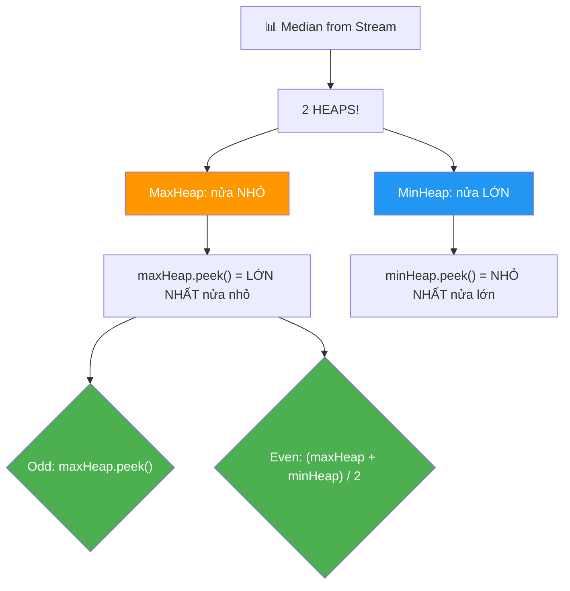
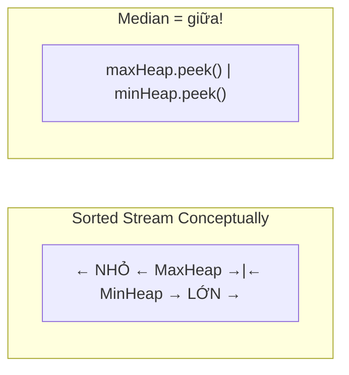
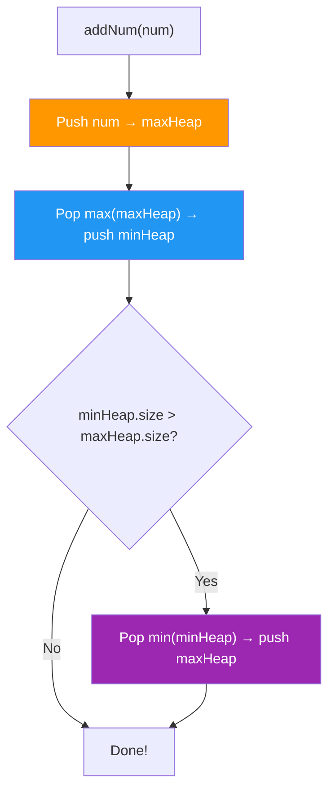

# 📊 Find Median from Data Stream — GfG / LeetCode #295 (Hard)

> 📖 Code: [Median from Data Stream.js](./Median%20from%20Data%20Stream.js)





---

## R — Repeat & Clarify

🧠 *"Nhận stream số liên tục. Sau MỖI số mới, tìm MEDIAN của tất cả số đã nhận."*

> 🎙️ *"Design a data structure that receives integers one at a time and returns the median of all elements seen so far after each insertion."*

### Clarification Questions

```
Q: Median = gì?
A: Số Ở GIỮA khi sort!
   Odd count:  median = phần tử giữa
   Even count: median = TRUNG BÌNH 2 phần tử giữa

Q: Stream = gì?
A: Số đến TỪNG CÁI MỘT! Không biết trước toàn bộ!
   → Cần cấu trúc dữ liệu HIỆU QUẢ!

Q: Có số âm/trùng không?
A: CÓ! Tất cả integer hợp lệ!

Q: Output format?
A: Mảng median SAU MỖI lần insert!
```

### Tại sao bài này quan trọng?

```
  ⭐ TOP bài phỏng vấn DESIGN + ALGORITHM!
  (Google, Amazon, Netflix — hỏi LIÊN TỤC!)

  BẠN PHẢI hiểu:
  1. TWO HEAPS pattern — MaxHeap + MinHeap!
  2. BALANCING logic — giữ 2 heap cân bằng!
  3. Heap implementation (JS KHÔNG có sẵn!)

  ┌───────────────────────────────────────────────────┐
  │  Pattern: Two Heaps = "chia dữ liệu làm 2 nửa"   │
  │  Giống: Sliding Window Median (#480)               │
  │         IPO Problem (#502)                         │
  │         Smallest Range (#632)                      │
  └───────────────────────────────────────────────────┘
```

---

## 🧠 Bản chất bài toán — Hiểu để NHỚ, không chỉ để GIẢI

### Tưởng tượng: 2 ĐỘI XẾP HÀNG!

```
  ⭐ Chia tất cả số thành 2 NỬA:

  NỬA NHỎ (maxHeap):  chứa nửa NHỎ hơn
    → MaxHeap: peek() = LỚN NHẤT trong nửa nhỏ!

  NỬA LỚN (minHeap):  chứa nửa LỚN hơn
    → MinHeap: peek() = NHỎ NHẤT trong nửa lớn!

  VÍ DỤ: stream đã nhận [1, 3, 5, 7, 9]

    maxHeap (nửa nhỏ): [1, 3, 5]  peek = 5
    minHeap (nửa lớn): [7, 9]     peek = 7

    Median = maxHeap.peek() = 5 ✅ (odd → phần tử giữa!)

  VÍ DỤ: stream đã nhận [1, 3, 5, 7]

    maxHeap: [1, 3]  peek = 3
    minHeap: [5, 7]  peek = 5

    Median = (3 + 5) / 2 = 4 ✅ (even → trung bình!)

  ⭐ MEDIAN luôn ở RANH GIỚI giữa 2 heap!
```

### QUY TẮC CÂN BẰNG

```
  ⭐ 2 QUY TẮC VÀNG:

  1. maxHeap.size >= minHeap.size  (maxHeap nhiều hơn hoặc bằng!)
  2. maxHeap.size <= minHeap.size + 1  (chênh TỐI ĐA 1!)

  → |maxHeap.size - minHeap.size| ≤ 1

  Tại sao maxHeap nhiều hơn?
    → Odd count: median = maxHeap.peek() (1 phần tử dư ở maxHeap!)
    → Even count: median = (maxHeap.peek() + minHeap.peek()) / 2

  ⚠️ Convention: maxHeap luôn ≥ minHeap size!
     (Có thể đảo, nhưng phải NHẤT QUÁN!)
```

### THUẬT TOÁN INSERT — 3 bước!

```
  ⭐ Thêm số num vào stream:

  BƯỚC 1: Push vào maxHeap TRƯỚC
    maxHeap.push(num)

  BƯỚC 2: Di chuyển MAX(maxHeap) sang minHeap
    minHeap.push(maxHeap.pop())
    → Đảm bảo maxHeap.peek() ≤ minHeap.peek()!
    → (Lớn nhất nửa nhỏ ≤ Nhỏ nhất nửa lớn!)

  BƯỚC 3: Cân bằng kích thước
    if (minHeap.size > maxHeap.size):
      maxHeap.push(minHeap.pop())
    → Đảm bảo maxHeap.size ≥ minHeap.size!

  ⚠️ Tại sao 3 bước mà không push trực tiếp?
     Nếu push trực tiếp vào maxHeap:
     → num có thể LỚN HƠN minHeap.peek() → sai nửa!
     → Bước 2 tự động SỬA bằng cách chuyển lớn nhất sang!

  ⚠️ Cách khác: so sánh num với maxHeap.peek():
     → num ≤ maxHeap.peek(): push vào maxHeap
     → num > maxHeap.peek(): push vào minHeap
     → Rồi balance! (cũng đúng, nhưng nhiều case hơn)
```



---

## 🧭 Luồng Suy Nghĩ — Từ đọc đề đến solution

### Bước 1: Brute Force?

```
  Cách 1: Maintain sorted array
    → Insert: O(n) (shift elements!)
    → Median: O(1) (access middle!)
    → Total: O(n²) cho n insertions!

  Cách 2: Sort lại mỗi lần
    → Insert: O(1) (push!)
    → Median: O(n log n) (sort!)
    → Total: O(n² log n) → rất chậm!
```

### Bước 2: Two Heaps → O(log n) per insert!

```
  → Insert: O(log n) (3 heap operations!)
  → Median: O(1) (peek top of heaps!)
  → Total: O(n log n) cho n insertions!
  → TỐI ƯU!
```

---

## E — Examples

```
VÍ DỤ: arr = [5, 15, 1, 3, 2, 8]

  ═══ Insert 5 ═════════════════════════════════════
  maxHeap.push(5) → maxHeap=[5]
  minHeap.push(maxHeap.pop()=5) → maxHeap=[], minHeap=[5]
  min.size(1) > max.size(0) → maxHeap.push(minHeap.pop()=5)
  maxHeap=[5], minHeap=[]
  Median = maxHeap.peek() = 5.00 ✅

  ═══ Insert 15 ════════════════════════════════════
  maxHeap.push(15) → maxHeap=[15,5]
  minHeap.push(maxHeap.pop()=15) → maxHeap=[5], minHeap=[15]
  min.size(1) = max.size(1) → OK!
  maxHeap=[5], minHeap=[15]
  Median = (5+15)/2 = 10.00 ✅

  ═══ Insert 1 ═════════════════════════════════════
  maxHeap.push(1) → maxHeap=[5,1]
  minHeap.push(maxHeap.pop()=5) → maxHeap=[1], minHeap=[5,15]
  min.size(2) > max.size(1) → maxHeap.push(minHeap.pop()=5)
  maxHeap=[5,1], minHeap=[15]
  Median = maxHeap.peek() = 5.00 ✅

  ═══ Insert 3 ═════════════════════════════════════
  maxHeap.push(3) → maxHeap=[5,3,1]
  minHeap.push(maxHeap.pop()=5) → maxHeap=[3,1], minHeap=[5,15]
  min.size(2) = max.size(2) → OK!
  maxHeap=[3,1], minHeap=[5,15]
  Median = (3+5)/2 = 4.00 ✅

  ═══ Insert 2 ═════════════════════════════════════
  maxHeap.push(2) → maxHeap=[3,2,1]
  minHeap.push(maxHeap.pop()=3) → maxHeap=[2,1], minHeap=[3,5,15]
  min.size(3) > max.size(2) → maxHeap.push(minHeap.pop()=3)
  maxHeap=[3,2,1], minHeap=[5,15]
  Median = maxHeap.peek() = 3.00 ✅

  ═══ Insert 8 ═════════════════════════════════════
  maxHeap.push(8) → maxHeap=[8,3,2,1]
  minHeap.push(maxHeap.pop()=8) → maxHeap=[3,2,1], minHeap=[5,8,15]
  min.size(3) = max.size(3) → OK!
  maxHeap=[3,2,1], minHeap=[5,8,15]
  Median = (3+5)/2 = 4.00 ✅

  OUTPUT: [5.00, 10.00, 5.00, 4.00, 3.00, 4.00] ✅
```

### Minh họa trực quan

```
  Sau insert [5, 15, 1, 3, 2, 8]:

  Sorted: [1, 2, 3 | 5, 8, 15]
           ←maxHeap→ ←minHeap→

  maxHeap (nửa nhỏ):    [3, 2, 1]     peek = 3
  minHeap (nửa lớn):    [5, 8, 15]    peek = 5

  Median = (3 + 5) / 2 = 4.00 ✅

  ┌─────────────────────────────────────────────────┐
  │  maxHeap: [... 1, 2, 3]  →  peek=3             │
  │                           |  ← MEDIAN ở đây!    │
  │  minHeap: [5, 8, 15 ...]  →  peek=5             │
  └─────────────────────────────────────────────────┘
```

---

## C — Code

### Heap Implementation (JS không có sẵn!)

```javascript
class MinHeap {
  constructor() { this.data = []; }
  size() { return this.data.length; }
  peek() { return this.data[0]; }

  push(val) {
    this.data.push(val);
    this._bubbleUp(this.data.length - 1);
  }

  pop() {
    const top = this.data[0];
    const last = this.data.pop();
    if (this.data.length > 0) {
      this.data[0] = last;
      this._sinkDown(0);
    }
    return top;
  }

  _bubbleUp(i) {
    while (i > 0) {
      const parent = (i - 1) >> 1;
      if (this.data[parent] <= this.data[i]) break;
      [this.data[parent], this.data[i]] = [this.data[i], this.data[parent]];
      i = parent;
    }
  }

  _sinkDown(i) {
    const n = this.data.length;
    while (true) {
      let smallest = i;
      const l = 2 * i + 1, r = 2 * i + 2;
      if (l < n && this.data[l] < this.data[smallest]) smallest = l;
      if (r < n && this.data[r] < this.data[smallest]) smallest = r;
      if (smallest === i) break;
      [this.data[smallest], this.data[i]] = [this.data[i], this.data[smallest]];
      i = smallest;
    }
  }
}

class MaxHeap {
  constructor() { this.heap = new MinHeap(); }
  size() { return this.heap.size(); }
  peek() { return -this.heap.peek(); }
  push(val) { this.heap.push(-val); }
  pop() { return -this.heap.pop(); }
}
```

### Giải thích Heap

```
  ⚠️ JavaScript KHÔNG có built-in Heap!
     (Python: heapq, Java: PriorityQueue, C++: priority_queue)

  MinHeap: peek() = NHỎ NHẤT → O(1), push/pop = O(log n)

  MaxHeap: TRICK! Dùng MinHeap với NEGATE values!
    push(5) → MinHeap.push(-5)
    peek() → -MinHeap.peek() = -(-5) = 5
    → MaxHeap behavior mà code MinHeap!

  ⚠️ Phỏng vấn: hỏi "implement heap from scratch?"
     → NÓI "I'll use a standard heap" → code nhanh!
     → Nếu hỏi chi tiết → giải thích bubbleUp/sinkDown!
```

### Solution: Two Heaps — O(log n) per insert ⭐

```javascript
function findMedianStream(arr) {
  const maxHeap = new MaxHeap(); // Nửa NHỎ
  const minHeap = new MinHeap(); // Nửa LỚN
  const result = [];

  for (const num of arr) {
    // Bước 1: Push vào maxHeap
    maxHeap.push(num);

    // Bước 2: Chuyển max(maxHeap) → minHeap
    minHeap.push(maxHeap.pop());

    // Bước 3: Balance
    if (minHeap.size() > maxHeap.size()) {
      maxHeap.push(minHeap.pop());
    }

    // Tính median
    if (maxHeap.size() > minHeap.size()) {
      result.push(maxHeap.peek()); // Odd → maxHeap.peek()
    } else {
      result.push((maxHeap.peek() + minHeap.peek()) / 2); // Even → avg
    }
  }

  return result;
}
```

### Giải thích Solution — CHI TIẾT

```
  FLOW cho mỗi số num:

  1. maxHeap.push(num)         ← thêm vào nửa nhỏ
  2. minHeap.push(maxHeap.pop())  ← chuyển LỚN NHẤT sang nửa lớn
     → Đảm bảo: max(nửa nhỏ) ≤ min(nửa lớn)!
  3. Balance: nếu minHeap nhiều hơn → chuyển 1 về maxHeap
     → Đảm bảo: maxHeap.size ∈ {minHeap.size, minHeap.size+1}

  MEDIAN:
    Odd:  maxHeap có THÊM 1 → median = maxHeap.peek()
    Even: 2 heap bằng nhau → median = avg(maxHeap.peek(), minHeap.peek())

  COMPLEXITY mỗi insert:
    3 heap operations: push + pop + (optional push)
    Mỗi operation: O(log n)
    → O(log n) per insert!

  Median: O(1) — chỉ peek()!
```

> 🎙️ *"I maintain two heaps: a max-heap for the lower half and a min-heap for the upper half. For each new number, I push to the max-heap, then move its top to the min-heap, then rebalance if needed. The median is either the max-heap's top (odd count) or the average of both tops (even count). O(log n) per insertion, O(1) for median."*

---

## O — Optimize

```
                         addNum()      findMedian()   Space
  ──────────────────────────────────────────────────────────
  Sorted Array (insert)   O(n)          O(1)          O(n)
  Sort each time          O(n log n)    O(1)          O(n)
  Two Heaps ⭐            O(log n)      O(1)          O(n)
  Balanced BST            O(log n)      O(log n)      O(n)

  ⚠️ Two Heaps = TỐI ƯU nhất cho bài này!
     addNum: O(log n) — 3 heap operations
     findMedian: O(1) — peek 2 tops!
```

---

## T — Test

```
Test Cases:
  [5, 15, 1, 3, 2, 8]  → [5, 10, 5, 4, 3, 4]      ✅
  [2, 2, 2, 2]          → [2, 2, 2, 2]              ✅ duplicates
  [1]                   → [1]                        ✅ 1 phần tử
  [1, 2]               → [1, 1.5]                   ✅ even
  [3, 1, 2]            → [3, 2, 2]                   ✅
  [5, 4, 3, 2, 1]      → [5, 4.5, 4, 3.5, 3]        ✅ giảm dần
  [1, 2, 3, 4, 5]      → [1, 1.5, 2, 2.5, 3]        ✅ tăng dần
```

---

## 🗣️ Interview Script

### Think Out Loud

```
  🧠 BƯỚC 1: Brute force
    "Insert sort → O(n) insert, O(1) median → tổng O(n²)"

  🧠 BƯỚC 2: Tối ưu
    "Median = phần tử GIỮA → chia dữ liệu 2 NỬA!"
    "Nửa nhỏ: MaxHeap (peek = lớn nhất nửa nhỏ)"
    "Nửa lớn: MinHeap (peek = nhỏ nhất nửa lớn)"

  🧠 BƯỚC 3: Insert logic
    "Push → maxHeap, chuyển max → minHeap, balance!"
    "→ O(log n) per insert!"

  🧠 BƯỚC 4: Median
    "Odd: maxHeap.peek()"
    "Even: avg(maxHeap.peek(), minHeap.peek())"

  🎙️ "Two heaps split the data into lower and upper halves.
     The max-heap's top and min-heap's top are always adjacent
     to the median. Insert is O(log n), median query is O(1)."
```

### Biến thể & Mở rộng

```
  1. Sliding Window Median — LeetCode #480 (Hard!)
     → Two Heaps + Lazy Deletion!
     → Phải xóa phần tử ra khỏi window!

  2. Find Median of Sorted Arrays — LeetCode #4
     → KHÁC! 2 sorted arrays → binary search O(log min(m,n))!

  3. Kth Largest in Stream — LeetCode #703
     → CHỈ CẦN MinHeap size k! Đơn giản hơn!

  4. Stream Statistics (mean, mode, etc.)
     → Mean: running sum / count — O(1)!
     → Mode: HashMap frequency tracking!
```

### So sánh với bài liên quan

```
  ┌──────────────────────────────────────────────────────────┐
  │  Bài toán              Technique           Complexity    │
  │  ────────────────────────────────────────────────        │
  │  Median Stream ⭐      Two Heaps            O(log n)    │
  │  Sliding Window Median Two Heaps + Lazy     O(n log n)  │
  │  Kth Largest Stream    MinHeap size k       O(log k)    │
  │  Median 2 Sorted       Binary Search        O(log min)  │
  └──────────────────────────────────────────────────────────┘

  ⭐ QUY TẮC VÀNG:
    "Median" + "stream/dynamic" → TWO HEAPS!
    "Kth" + "stream" → ONE HEAP size k!
    "Median" + "2 sorted arrays" → BINARY SEARCH!
```

---

## 🧩 Sai lầm phổ biến

```
❌ SAI LẦM #1: MaxHeap và MinHeap đặt NGƯỢC!

   MaxHeap = nửa NHỎ (peek = lớn nhất nửa nhỏ!)
   MinHeap = nửa LỚN (peek = nhỏ nhất nửa lớn!)

   Nếu đặt ngược → median SAI!

─────────────────────────────────────────────────────

❌ SAI LẦM #2: Quên BALANCE!

   Phải đảm bảo |maxHeap.size - minHeap.size| ≤ 1!
   Không balance → không biết median ở đâu!

─────────────────────────────────────────────────────

❌ SAI LẦM #3: Push trực tiếp dựa trên so sánh (phức tạp hơn!)

   Cách đơn giản: push maxHeap → chuyển → balance!
   Cách phức tạp: if (num ≤ maxHeap.peek()) push maxHeap
                  else push minHeap → rồi balance!
   → Cả 2 đúng, nhưng cách 1 ÍT CODE hơn!

─────────────────────────────────────────────────────

❌ SAI LẦM #4: JS MaxHeap dùng negate NHẦM!

   push(val): heap.push(-val)  ← negate khi PUSH!
   peek(): -heap.peek()        ← negate khi PEEK!
   pop(): -heap.pop()          ← negate khi POP!

   Quên negate ở BẤT KỲ chỗ nào → SAI!
```

---

## 📝 Flashcard — Tự kiểm tra

| ❓ Câu hỏi | ✅ Đáp án |
|---|---|
| Dùng cấu trúc gì? | **Two Heaps**: MaxHeap (nửa nhỏ) + MinHeap (nửa lớn) |
| MaxHeap chứa gì? | Nửa **NHỎ** (peek = lớn nhất nửa nhỏ) |
| MinHeap chứa gì? | Nửa **LỚN** (peek = nhỏ nhất nửa lớn) |
| 3 bước insert? | Push maxHeap → chuyển max sang minHeap → balance |
| Median odd? | **maxHeap.peek()** |
| Median even? | **(maxHeap.peek() + minHeap.peek()) / 2** |
| addNum complexity? | **O(log n)** |
| findMedian complexity? | **O(1)** |
| JS MaxHeap trick? | Dùng MinHeap với **negate values** |
| LeetCode nào? | **#295** Find Median from Data Stream |
