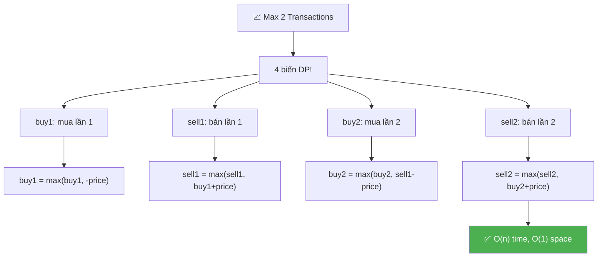
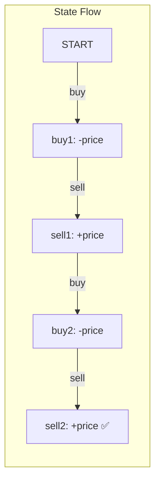

# 📈 Stock Buy & Sell — Max 2 Transactions — GfG / LeetCode #123 (Hard)

> 📖 Code: [Stock Buy Sell 2 Transactions.js](./Stock%20Buy%20Sell%202%20Transactions.js)





---

## R — Repeat & Clarify

🧠 *"Tối đa 2 lần mua-bán. Phải BÁN xong mới MUA lại. Tìm MAX profit."*

> 🎙️ *"Given stock prices over n days, find maximum profit with at most two buy-sell transactions. Must sell before buying again."*

### Clarification Questions

```
Q: "At most 2" = 0, 1, hoặc 2 transactions?
A: ĐÚNG! Nếu 1 transaction tốt hơn 2 → dùng 1!
   Nếu 0 tốt hơn → profit = 0!

Q: Có thể MUA và BÁN cùng ngày?
A: Về logic CÓ THỂ (bán lần 1, mua lần 2 cùng ngày)
   → Tương đương không bán!

Q: Giống bài K transactions (LC #188)?
A: ĐÚNG! Đây là SPECIAL CASE k=2 → optimize O(n)/O(1)!
   K transactions: O(n×k) → k=2: O(n×2) = O(n) tương tự,
   nhưng code đơn giản hơn nhiều (4 biến cố định!)
```

### Tại sao bài này quan trọng?

```
  ⭐ Special case k=2 với CODE CỰC ĐƠN GIẢN!

  Thay vì mảng buy[k], sell[k] như bài K transactions,
  → CHỈ CẦN 4 BIẾN: buy1, sell1, buy2, sell2!
  → O(n) time, O(1) space — tối ưu nhất!

  ┌───────────────────────────────────────────────────┐
  │  LC #121: k=1 → 2 biến: minPrice, maxProfit       │
  │  LC #123: k=2 → 4 biến: buy1,sell1,buy2,sell2 ⭐ │
  │  LC #188: k=any → 2 mảng: buy[k], sell[k]        │
  └───────────────────────────────────────────────────┘
```

---

## 🧠 Bản chất bài toán — Hiểu để NHỚ, không chỉ để GIẢI

### 4 TRẠNG THÁI = 4 BIẾN!

```
  ⭐ Duyệt mỗi ngày, track 4 trạng thái:

  buy1  = max profit KHI đang giữ stock (lần mua 1)
        = "tôi đã mua 1 lần, chưa bán"

  sell1 = max profit SAU KHI bán lần 1
        = "tôi đã hoàn thành 1 transaction"

  buy2  = max profit KHI đang giữ stock (lần mua 2)
        = "tôi đã bán 1 lần, mua lại, chưa bán"

  sell2 = max profit SAU KHI bán lần 2
        = "tôi đã hoàn thành 2 transactions"

  ⚠️ Mỗi state BUILD trên state TRƯỚC!
     buy1 ← (mua)
     sell1 ← buy1 + (bán)
     buy2 ← sell1 + (mua lại)
     sell2 ← buy2 + (bán)
```

### Transitions — MỖI NGÀY!

```
  Cho mỗi ngày với giá = price:

  buy1  = max(buy1,  -price)
          ↑ giữ nguyên  ↑ mua HÔM NAY (chi -price)

  sell1 = max(sell1, buy1 + price)
          ↑ giữ nguyên  ↑ bán HÔM NAY (buy1 + price)

  buy2  = max(buy2,  sell1 - price)
          ↑ giữ nguyên  ↑ mua lần 2 (sell1 - price)

  sell2 = max(sell2, buy2 + price)
          ↑ giữ nguyên  ↑ bán lần 2 (buy2 + price)

  ⭐ buy1 = -price vì lần mua đầu tiên, profit = 0 - price!
  ⭐ buy2 = sell1 - price vì lần mua thứ 2 DÙNG PROFIT TỪ LẦN 1!
```

### Tưởng tượng: 4 TÚI TIỀN!

```
  Bạn có 4 túi, mỗi túi track 1 strategy:

  Túi 1 (buy1):  "Mua tốt nhất chưa bán"     → max(-price)
  Túi 2 (sell1): "Bán lần 1 tốt nhất"          → max(buy1 + price)
  Túi 3 (buy2):  "Mua lần 2 tốt nhất"          → max(sell1 - price)
  Túi 4 (sell2): "Bán lần 2 tốt nhất"          → max(buy2 + price)

  Mỗi ngày: update CẢ 4 túi!
  Cuối cùng: sell2 = đáp án!
  (sell2 ≥ sell1 ≥ 0 luôn đúng → tự chọn 0, 1, hoặc 2 transactions!)
```

### Tại sao sell2 bao gồm cả case 0 và 1 transaction?

```
  ⭐ INSIGHT TINH TẾ!

  sell2 = max profit với TỐI ĐA 2 transactions.

  Case 0 transactions: sell2 = 0 (khởi tạo!)
  Case 1 transaction:  buy2 = sell1 - price
                        sell2 = buy2 + price = sell1
                        → sell2 ≥ sell1: tự động bao gồm!
  Case 2 transactions: buy2 dùng sell1 profit → cộng dồn!

  → KHÔNG cần return max(sell1, sell2)!
  → sell2 đã ≥ sell1 luôn! (vì sell2 init = 0, luôn max lên)
```

---

## 🧭 Luồng Suy Nghĩ — Từ đọc đề đến solution

### Bước 1: Keywords

```
  "at most 2 transactions" → DP 4 states!
  "stock buy sell" → state machine!
```

### Bước 2: Approach cũ vs mới

```
  Cách 1: Chia mảng tại mỗi điểm
    → maxProfit(0..i) + maxProfit(i+1..n-1)
    → O(n²) — chậm!

  Cách 2: leftMax[i] + rightMax[i]
    → leftMax[i] = max profit bán ĐẾN ngày i
    → rightMax[i] = max profit mua TỪ ngày i
    → O(n) time, O(n) space

  Cách 3: 4 biến DP ⭐
    → buy1, sell1, buy2, sell2
    → O(n) time, O(1) space — TỐI ƯU NHẤT!
```

---

## E — Examples

```
VÍ DỤ 1: prices = [10, 22, 5, 75, 65, 80]

  Transaction 1: mua 10, bán 22 → +12
  Transaction 2: mua 5, bán 80  → +75
  Total = 12 + 75 = 87 ✅

  (KHÔNG: mua 5, bán 80 = 75 với 1 trans → 87 > 75!)
```

```
VÍ DỤ 2: prices = [100, 30, 15, 10, 8, 25, 80]

  1 transaction: mua 8, bán 80 → +72
  2 transactions? Mua 8 bán 25(+17), mua ??? → KHÔNG tốt hơn!
  → 1 transaction = 72 ✅ (sell2 tự bao gồm!)
```

```
VÍ DỤ 3: prices = [90, 80, 70, 60, 50]

  Toàn giảm → profit = 0 ✅
```

---

## C — Code

### Solution: 4-Variable DP — O(n) time, O(1) space ⭐

```javascript
function maxProfit2(prices) {
  const n = prices.length;
  if (n <= 1) return 0;

  let buy1 = -Infinity;
  let sell1 = 0;
  let buy2 = -Infinity;
  let sell2 = 0;

  for (const price of prices) {
    buy1 = Math.max(buy1, -price);           // Mua lần 1
    sell1 = Math.max(sell1, buy1 + price);    // Bán lần 1
    buy2 = Math.max(buy2, sell1 - price);     // Mua lần 2
    sell2 = Math.max(sell2, buy2 + price);    // Bán lần 2
  }

  return sell2;
}
```

### Giải thích — CHI TIẾT

```
  KHỞI TẠO:
    buy1 = -Infinity   ← chưa mua lần 1 → trạng thái invalid!
    sell1 = 0           ← chưa bán → profit = 0
    buy2 = -Infinity   ← chưa mua lần 2 → invalid!
    sell2 = 0           ← chưa bán lần 2 → profit = 0

  LOOP (mỗi ngày):
    buy1: "tôi nên giữ stock cũ HAY mua hôm nay?"
      → max(-price trước, -price hôm nay)
      → buy1 = max(buy1, -price) = -min(price seen so far)!

    sell1: "tôi nên giữ profit cũ HAY bán hôm nay?"
      → max(sell1 trước, buy1 + price)
      → = max profit sau 1 transaction!

    buy2: "tôi nên giữ stock cũ HAY mua lại sau sell1?"
      → max(buy2 trước, sell1 - price)
      → sell1 - price = profit transaction 1 - chi phí mua lại!

    sell2: "tôi nên giữ profit cũ HAY bán lần 2?"
      → max(sell2 trước, buy2 + price)
      → = max profit sau TỐI ĐA 2 transactions!

  ⚠️ Update THỨ TỰ: buy1 → sell1 → buy2 → sell2
     Mỗi state dùng state TRƯỚC (đã update CÙNG NGÀY)!
     Có đúng không? CÓ! Vì:
     Nếu buy1 mua hôm nay → sell1 bán cùng ngày → profit = 0
     → Tương đương KHÔNG giao dịch → ĐÚNG!
```

### Trace CHI TIẾT: prices = [10, 22, 5, 75, 65, 80]

```
  Init: buy1=-∞, sell1=0, buy2=-∞, sell2=0

  ═══ price=10 ════════════════════════════════════════

  buy1  = max(-∞, -10)  = -10     ← Mua ngày 0!
  sell1 = max(0, -10+10) = 0      ← Bán cùng ngày = 0
  buy2  = max(-∞, 0-10) = -10     ← Mua lần 2 (profit1=0)
  sell2 = max(0, -10+10) = 0

  ═══ price=22 ════════════════════════════════════════

  buy1  = max(-10, -22) = -10     ← Giữ mua ở 10
  sell1 = max(0, -10+22) = 12     ⭐ Bán lần 1! profit=12!
  buy2  = max(-10, 12-22) = -10   ← Giữ mua cũ
  sell2 = max(0, -10+22) = 12     ← Bán lần 2 = 12

  ═══ price=5 ═════════════════════════════════════════

  buy1  = max(-10, -5)  = -5      ← Mua lại ở 5 tốt hơn!
  sell1 = max(12, -5+5)  = 12     ← Giữ profit 12
  buy2  = max(-10, 12-5) = 7      ⭐ Mua lần 2! effective=7!
  sell2 = max(12, 7+5)   = 12

  ═══ price=75 ════════════════════════════════════════

  buy1  = max(-5, -75)  = -5
  sell1 = max(12, -5+75) = 70     ⭐ Bán tại 75 = 70!
  buy2  = max(7, 70-75)  = 7      ← Giữ buy2 cũ
  sell2 = max(12, 7+75)  = 82     ⭐ Bán lần 2 = 82!

  ═══ price=65 ════════════════════════════════════════

  buy1  = max(-5, -65)  = -5
  sell1 = max(70, -5+65) = 70
  buy2  = max(7, 70-65)  = 7
  sell2 = max(82, 7+65)  = 82

  ═══ price=80 ════════════════════════════════════════

  buy1  = max(-5, -80)  = -5
  sell1 = max(70, -5+80) = 75
  buy2  = max(7, 75-80)  = 7
  sell2 = max(82, 7+80)  = 87     ⭐⭐ MAX = 87!

  ═══ KẾT QUẢ ═════════════════════════════════════════
  sell2 = 87 ✅  (mua 10, bán 22 = +12, mua 5, bán 80 = +75)
```

```
  BẢNG TÓM TẮT:

  ┌───────┬──────┬───────┬──────┬───────┐
  │ price │ buy1 │ sell1 │ buy2 │ sell2 │
  ├───────┼──────┼───────┼──────┼───────┤
  │ init  │  -∞  │   0   │  -∞  │   0   │
  │  10   │ -10  │   0   │ -10  │   0   │
  │  22   │ -10  │  12   │ -10  │  12   │
  │   5   │  -5  │  12   │   7  │  12   │
  │  75   │  -5  │  70   │   7  │  82   │
  │  65   │  -5  │  70   │   7  │  82   │
  │  80   │  -5  │  75   │   7  │  87 ⭐│
  └───────┴──────┴───────┴──────┴───────┘
```

### Trace: prices = [90, 80, 70, 60, 50] (toàn giảm)

```
  ┌───────┬──────┬───────┬──────┬───────┐
  │ price │ buy1 │ sell1 │ buy2 │ sell2 │
  ├───────┼──────┼───────┼──────┼───────┤
  │  90   │ -90  │   0   │ -90  │   0   │
  │  80   │ -80  │   0   │ -80  │   0   │
  │  70   │ -70  │   0   │ -70  │   0   │
  │  60   │ -60  │   0   │ -60  │   0   │
  │  50   │ -50  │   0   │ -50  │   0   │
  └───────┴──────┴───────┴──────┴───────┘

  sell2 = 0 ✅ (giá toàn giảm → không giao dịch!)
```

> 🎙️ *"I track four states: buy1, sell1, buy2, sell2. Each day I update them in order — buy1 tracks the cheapest buy, sell1 tracks the best first sale, buy2 leverages sell1 profit to buy again, and sell2 gives the final answer. Since sell2 naturally covers 0 and 1 transaction cases, I just return sell2. O(n) time, O(1) space."*

---

## O — Optimize

```
                    Time      Space     Ghi chú
  ─────────────────────────────────────────────────
  Split + scan      O(n²)     O(1)      Thử mọi split
  Left+Right max    O(n)      O(n)      2 mảng prefix
  4 Variables ⭐     O(n)      O(1)      Tối ưu nhất!

  ⚠️ O(n) time + O(1) space = KHÔNG THỂ TỐT HƠN!
     Phải đọc mỗi giá ít nhất 1 lần → Ω(n)!
```

---

## T — Test

```
Test Cases:
  [10, 22, 5, 75, 65, 80]     → 87    ✅ 12+75
  [100, 30, 15, 10, 8, 25, 80]→ 72    ✅ chỉ 1 trans
  [90, 80, 70, 60, 50]        → 0     ✅ toàn giảm
  [1, 2, 3, 4, 5]             → 4     ✅ 1 trans: 1→5
  [3, 3, 5, 0, 0, 3, 1, 4]    → 6     ✅ 2+4
  [1, 2, 4, 2, 5, 7, 2, 4, 9, 0] → 13 ✅
  [1]                         → 0     ✅ 1 ngày
  [1, 2]                      → 1     ✅ mua 1 bán 2
```

---

## 🗣️ Interview Script

### Think Out Loud

```
  🧠 BƯỚC 1: Nhận dạng
    "At most 2 transactions → k=2 special case!"
    "→ 4 DP states thay vì array!"

  🧠 BƯỚC 2: Define states
    "buy1 = best profit holding stock (1st buy)"
    "sell1 = best profit after 1st sell"
    "buy2 = best profit holding stock (2nd buy)"
    "sell2 = best profit after 2nd sell = ANSWER!"

  🧠 BƯỚC 3: Transitions
    "buy1 = max(buy1, -price)"
    "sell1 = max(sell1, buy1 + price)"
    "buy2 = max(buy2, sell1 - price)"
    "sell2 = max(sell2, buy2 + price)"

  🧠 BƯỚC 4: Why sell2 includes 0/1 trans?
    "sell2 init = 0 → covers 0 transactions"
    "buy2 uses sell1 → if same-day buy-sell → net 0 → covers 1!"

  🎙️ "Four variables, one pass. Each state builds on the previous
     one. buy1 finds the cheapest entry point, sell1 maximizes
     the first sale, buy2 reinvests that profit, and sell2 gives
     the overall maximum. O(n) time, O(1) space, and it naturally
     handles 0 or 1 transaction cases."
```

### Connection với Stock Family

```
  ┌──────────────────────────────────────────────────────────┐
  │  LC #121: k=1 → buy1, sell1 (2 biến!)                   │
  │           buy1 = max(buy1, -price) = -minPrice           │
  │           sell1 = max(sell1, buy1+price) = maxProfit      │
  │                                                          │
  │  LC #123: k=2 → buy1,sell1,buy2,sell2 (4 biến!) ⭐      │
  │           BÀI NÀY!                                       │
  │                                                          │
  │  LC #188: k=any → buy[k], sell[k] (2 mảng!)             │
  │           Tổng quát hóa!                                 │
  └──────────────────────────────────────────────────────────┘

  ⭐ BÀI NÀY là "SWEET SPOT":
    Đủ phức tạp để DẠY state machine!
    Đủ đơn giản để CODE 4 dòng!
```

---

## 🧩 Sai lầm phổ biến

```
❌ SAI LẦM #1: buy1 = 0 thay vì -Infinity!

   buy1 = 0: "đang giữ stock miễn phí" → SAI!
   → sell1 = max(0, 0+price) = price → BÁN mà không MUA!

   ✅ buy1 = -Infinity: "chưa mua → trạng thái invalid!"

─────────────────────────────────────────────────────

❌ SAI LẦM #2: Return max(sell1, sell2) thay vì sell2!

   KHÔNG CẦN! sell2 ≥ sell1 LUÔN ĐÚNG!
   Vì sell2 init=0, buy2 dùng sell1 → sell2 ≥ sell1!
   → return sell2 đủ!

─────────────────────────────────────────────────────

❌ SAI LẦM #3: Nghĩ update cùng ngày = mua bán cùng ngày!

   buy1=-10, sell1=buy1+22=12 (cùng iteration!)
   "Mua và bán cùng ngày?" → profit = 0 → tương đương KHÔNG!
   → KHÔNG SAI! Code tự xử lý!

─────────────────────────────────────────────────────

❌ SAI LẦM #4: Nhầm buy2 = -price thay vì sell1 - price!

   buy2 = -price: MUA lần 2 mà QUÊN profit lần 1! → SAI!
   buy2 = sell1 - price: MUA bằng PROFIT LẦN 1! → ĐÚNG!

   sell1 = 12 → buy2 = 12 - 5 = 7
   → "Tôi có 12 tiền lời, mua lại giá 5, còn lại 7!" ✅
```

---

## 📝 Flashcard — Tự kiểm tra

| ❓ Câu hỏi | ✅ Đáp án |
|---|---|
| Cần bao nhiêu biến? | **4**: buy1, sell1, buy2, sell2 |
| buy1 = ? | `max(buy1, -price)` |
| sell1 = ? | `max(sell1, buy1 + price)` |
| buy2 = ? | `max(buy2, sell1 - price)` |
| sell2 = ? | `max(sell2, buy2 + price)` |
| Khởi tạo buy? | **-Infinity** |
| Khởi tạo sell? | **0** |
| Return gì? | **sell2** (đã bao gồm 0 và 1 transaction!) |
| Time / Space? | **O(n) / O(1)** |
| LeetCode nào? | **#123** Best Time to Buy and Sell Stock III |
