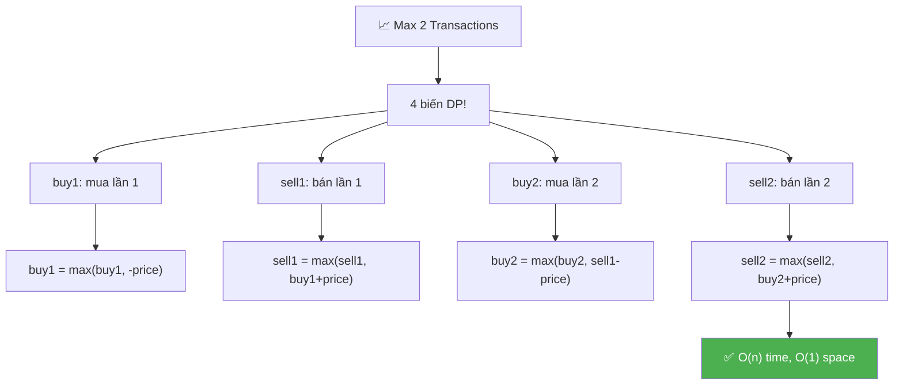
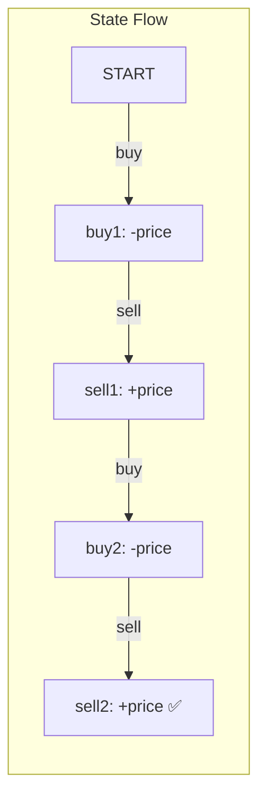
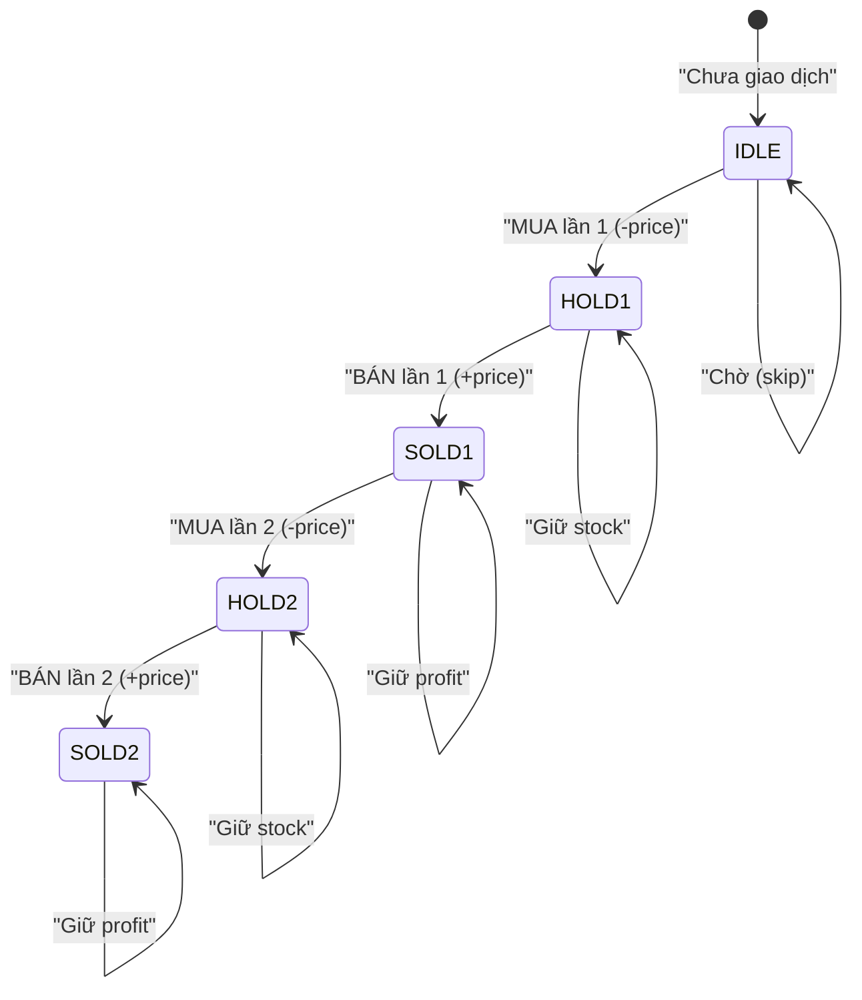
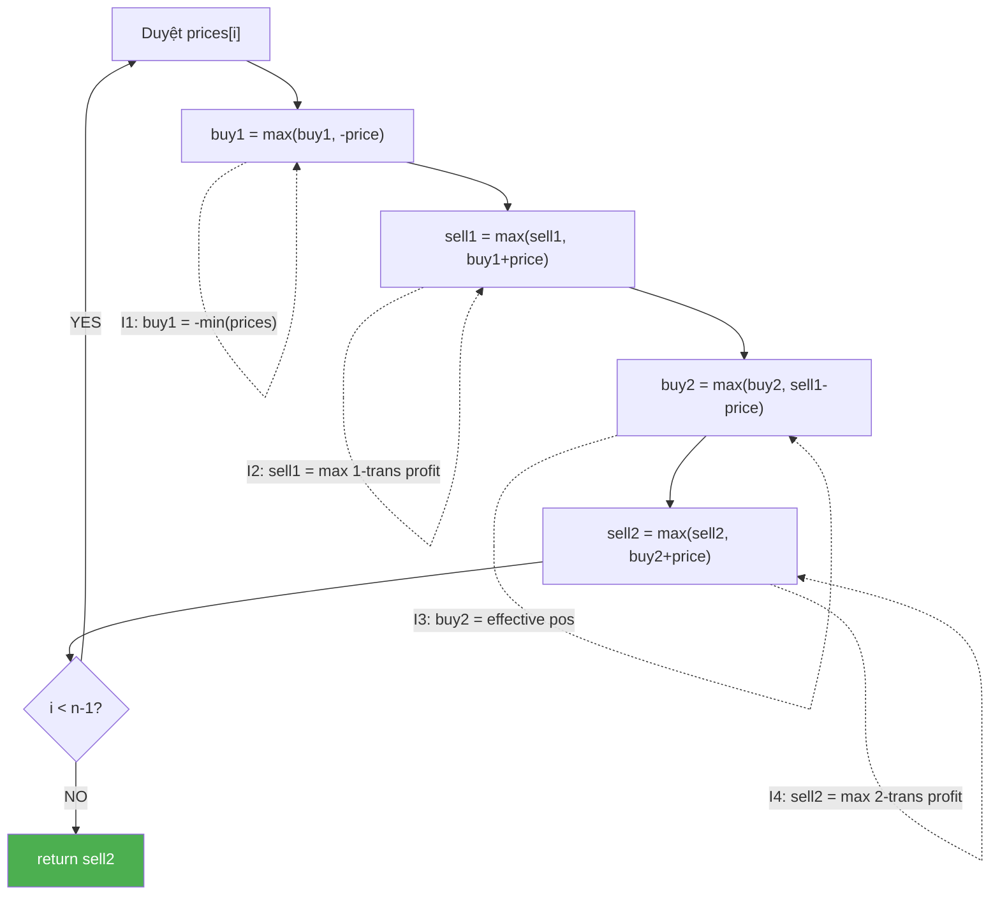
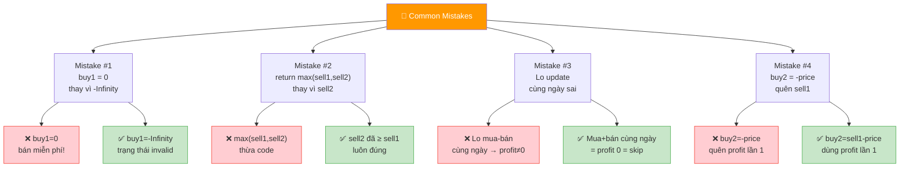
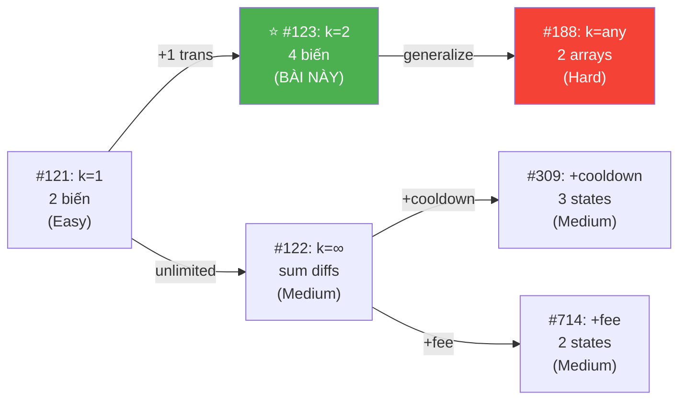
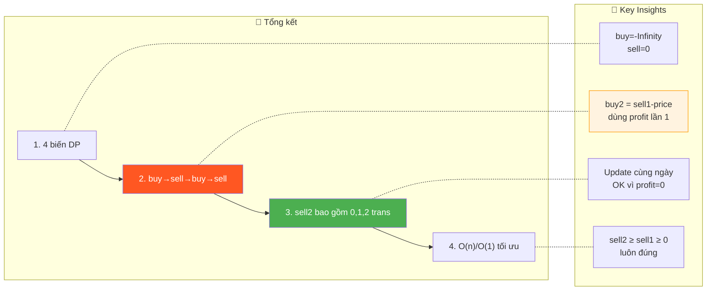

# 📈 Stock Buy & Sell — Max 2 Transactions — GfG / LeetCode #123 (Hard)

> 📖 Code: [Stock Buy Sell 2 Transactions.js](./Stock%20Buy%20Sell%202%20Transactions.js)





---

## R — Repeat & Clarify

🧠 *"Tối đa 2 lần mua-bán. Phải BÁN xong mới MUA lại. Tìm MAX profit."*

> 🎙️ *"Given stock prices over n days, find maximum profit with at most two buy-sell transactions. Must sell before buying again."*

### Clarification Questions

```
Q: "At most 2" = 0, 1, hoặc 2 transactions?
A: ĐÚNG! Nếu 1 transaction tốt hơn 2 → dùng 1!
   Nếu 0 tốt hơn → profit = 0!

Q: Có thể MUA và BÁN cùng ngày?
A: Về logic CÓ THỂ (bán lần 1, mua lần 2 cùng ngày)
   → Tương đương không bán!

Q: Giống bài K transactions (LC #188)?
A: ĐÚNG! Đây là SPECIAL CASE k=2 → optimize O(n)/O(1)!
   K transactions: O(n×k) → k=2: O(n×2) = O(n) tương tự,
   nhưng code đơn giản hơn nhiều (4 biến cố định!)
```

### Tại sao bài này quan trọng?

```
  ⭐ Special case k=2 với CODE CỰC ĐƠN GIẢN!

  Thay vì mảng buy[k], sell[k] như bài K transactions,
  → CHỈ CẦN 4 BIẾN: buy1, sell1, buy2, sell2!
  → O(n) time, O(1) space — tối ưu nhất!

  ┌───────────────────────────────────────────────────┐
  │  LC #121: k=1 → 2 biến: minPrice, maxProfit       │
  │  LC #123: k=2 → 4 biến: buy1,sell1,buy2,sell2 ⭐ │
  │  LC #188: k=any → 2 mảng: buy[k], sell[k]        │
  └───────────────────────────────────────────────────┘
```

---

## 🧠 Bản chất bài toán — Hiểu để NHỚ, không chỉ để GIẢI

### 4 TRẠNG THÁI = 4 BIẾN!

```
  ⭐ Duyệt mỗi ngày, track 4 trạng thái:

  buy1  = max profit KHI đang giữ stock (lần mua 1)
        = "tôi đã mua 1 lần, chưa bán"

  sell1 = max profit SAU KHI bán lần 1
        = "tôi đã hoàn thành 1 transaction"

  buy2  = max profit KHI đang giữ stock (lần mua 2)
        = "tôi đã bán 1 lần, mua lại, chưa bán"

  sell2 = max profit SAU KHI bán lần 2
        = "tôi đã hoàn thành 2 transactions"

  ⚠️ Mỗi state BUILD trên state TRƯỚC!
     buy1 ← (mua)
     sell1 ← buy1 + (bán)
     buy2 ← sell1 + (mua lại)
     sell2 ← buy2 + (bán)
```

### Transitions — MỖI NGÀY!

```
  Cho mỗi ngày với giá = price:

  buy1  = max(buy1,  -price)
          ↑ giữ nguyên  ↑ mua HÔM NAY (chi -price)

  sell1 = max(sell1, buy1 + price)
          ↑ giữ nguyên  ↑ bán HÔM NAY (buy1 + price)

  buy2  = max(buy2,  sell1 - price)
          ↑ giữ nguyên  ↑ mua lần 2 (sell1 - price)

  sell2 = max(sell2, buy2 + price)
          ↑ giữ nguyên  ↑ bán lần 2 (buy2 + price)

  ⭐ buy1 = -price vì lần mua đầu tiên, profit = 0 - price!
  ⭐ buy2 = sell1 - price vì lần mua thứ 2 DÙNG PROFIT TỪ LẦN 1!
```

### Tưởng tượng: 4 TÚI TIỀN!

```
  Bạn có 4 túi, mỗi túi track 1 strategy:

  Túi 1 (buy1):  "Mua tốt nhất chưa bán"     → max(-price)
  Túi 2 (sell1): "Bán lần 1 tốt nhất"          → max(buy1 + price)
  Túi 3 (buy2):  "Mua lần 2 tốt nhất"          → max(sell1 - price)
  Túi 4 (sell2): "Bán lần 2 tốt nhất"          → max(buy2 + price)

  Mỗi ngày: update CẢ 4 túi!
  Cuối cùng: sell2 = đáp án!
  (sell2 ≥ sell1 ≥ 0 luôn đúng → tự chọn 0, 1, hoặc 2 transactions!)
```

### Tại sao sell2 bao gồm cả case 0 và 1 transaction?

```
  ⭐ INSIGHT TINH TẾ!

  sell2 = max profit với TỐI ĐA 2 transactions.

  Case 0 transactions: sell2 = 0 (khởi tạo!)
  Case 1 transaction:  buy2 = sell1 - price
                        sell2 = buy2 + price = sell1
                        → sell2 ≥ sell1: tự động bao gồm!
  Case 2 transactions: buy2 dùng sell1 profit → cộng dồn!

  → KHÔNG cần return max(sell1, sell2)!
  → sell2 đã ≥ sell1 luôn! (vì sell2 init = 0, luôn max lên)
```

---

## 🧭 Luồng Suy Nghĩ — Từ đọc đề đến solution

### Bước 1: Keywords

```
  "at most 2 transactions" → DP 4 states!
  "stock buy sell" → state machine!
```

### Bước 2: Approach cũ vs mới

```
  Cách 1: Chia mảng tại mỗi điểm
    → maxProfit(0..i) + maxProfit(i+1..n-1)
    → O(n²) — chậm!

  Cách 2: leftMax[i] + rightMax[i]
    → leftMax[i] = max profit bán ĐẾN ngày i
    → rightMax[i] = max profit mua TỪ ngày i
    → O(n) time, O(n) space

  Cách 3: 4 biến DP ⭐
    → buy1, sell1, buy2, sell2
    → O(n) time, O(1) space — TỐI ƯU NHẤT!
```

---

## E — Examples

```
VÍ DỤ 1: prices = [10, 22, 5, 75, 65, 80]

  Transaction 1: mua 10, bán 22 → +12
  Transaction 2: mua 5, bán 80  → +75
  Total = 12 + 75 = 87 ✅

  (KHÔNG: mua 5, bán 80 = 75 với 1 trans → 87 > 75!)
```

```
VÍ DỤ 2: prices = [100, 30, 15, 10, 8, 25, 80]

  1 transaction: mua 8, bán 80 → +72
  2 transactions? Mua 8 bán 25(+17), mua ??? → KHÔNG tốt hơn!
  → 1 transaction = 72 ✅ (sell2 tự bao gồm!)
```

```
VÍ DỤ 3: prices = [90, 80, 70, 60, 50]

  Toàn giảm → profit = 0 ✅
```

---

## C — Code

### Solution: 4-Variable DP — O(n) time, O(1) space ⭐

```javascript
function maxProfit2(prices) {
  const n = prices.length;
  if (n <= 1) return 0;

  let buy1 = -Infinity;
  let sell1 = 0;
  let buy2 = -Infinity;
  let sell2 = 0;

  for (const price of prices) {
    buy1 = Math.max(buy1, -price);           // Mua lần 1
    sell1 = Math.max(sell1, buy1 + price);    // Bán lần 1
    buy2 = Math.max(buy2, sell1 - price);     // Mua lần 2
    sell2 = Math.max(sell2, buy2 + price);    // Bán lần 2
  }

  return sell2;
}
```

### Giải thích — CHI TIẾT

```
  KHỞI TẠO:
    buy1 = -Infinity   ← chưa mua lần 1 → trạng thái invalid!
    sell1 = 0           ← chưa bán → profit = 0
    buy2 = -Infinity   ← chưa mua lần 2 → invalid!
    sell2 = 0           ← chưa bán lần 2 → profit = 0

  LOOP (mỗi ngày):
    buy1: "tôi nên giữ stock cũ HAY mua hôm nay?"
      → max(-price trước, -price hôm nay)
      → buy1 = max(buy1, -price) = -min(price seen so far)!

    sell1: "tôi nên giữ profit cũ HAY bán hôm nay?"
      → max(sell1 trước, buy1 + price)
      → = max profit sau 1 transaction!

    buy2: "tôi nên giữ stock cũ HAY mua lại sau sell1?"
      → max(buy2 trước, sell1 - price)
      → sell1 - price = profit transaction 1 - chi phí mua lại!

    sell2: "tôi nên giữ profit cũ HAY bán lần 2?"
      → max(sell2 trước, buy2 + price)
      → = max profit sau TỐI ĐA 2 transactions!

  ⚠️ Update THỨ TỰ: buy1 → sell1 → buy2 → sell2
     Mỗi state dùng state TRƯỚC (đã update CÙNG NGÀY)!
     Có đúng không? CÓ! Vì:
     Nếu buy1 mua hôm nay → sell1 bán cùng ngày → profit = 0
     → Tương đương KHÔNG giao dịch → ĐÚNG!
```

### Trace CHI TIẾT: prices = [10, 22, 5, 75, 65, 80]

```
  Init: buy1=-∞, sell1=0, buy2=-∞, sell2=0

  ═══ price=10 ════════════════════════════════════════

  buy1  = max(-∞, -10)  = -10     ← Mua ngày 0!
  sell1 = max(0, -10+10) = 0      ← Bán cùng ngày = 0
  buy2  = max(-∞, 0-10) = -10     ← Mua lần 2 (profit1=0)
  sell2 = max(0, -10+10) = 0

  ═══ price=22 ════════════════════════════════════════

  buy1  = max(-10, -22) = -10     ← Giữ mua ở 10
  sell1 = max(0, -10+22) = 12     ⭐ Bán lần 1! profit=12!
  buy2  = max(-10, 12-22) = -10   ← Giữ mua cũ
  sell2 = max(0, -10+22) = 12     ← Bán lần 2 = 12

  ═══ price=5 ═════════════════════════════════════════

  buy1  = max(-10, -5)  = -5      ← Mua lại ở 5 tốt hơn!
  sell1 = max(12, -5+5)  = 12     ← Giữ profit 12
  buy2  = max(-10, 12-5) = 7      ⭐ Mua lần 2! effective=7!
  sell2 = max(12, 7+5)   = 12

  ═══ price=75 ════════════════════════════════════════

  buy1  = max(-5, -75)  = -5
  sell1 = max(12, -5+75) = 70     ⭐ Bán tại 75 = 70!
  buy2  = max(7, 70-75)  = 7      ← Giữ buy2 cũ
  sell2 = max(12, 7+75)  = 82     ⭐ Bán lần 2 = 82!

  ═══ price=65 ════════════════════════════════════════

  buy1  = max(-5, -65)  = -5
  sell1 = max(70, -5+65) = 70
  buy2  = max(7, 70-65)  = 7
  sell2 = max(82, 7+65)  = 82

  ═══ price=80 ════════════════════════════════════════

  buy1  = max(-5, -80)  = -5
  sell1 = max(70, -5+80) = 75
  buy2  = max(7, 75-80)  = 7
  sell2 = max(82, 7+80)  = 87     ⭐⭐ MAX = 87!

  ═══ KẾT QUẢ ═════════════════════════════════════════
  sell2 = 87 ✅  (mua 10, bán 22 = +12, mua 5, bán 80 = +75)
```

```
  BẢNG TÓM TẮT:

  ┌───────┬──────┬───────┬──────┬───────┐
  │ price │ buy1 │ sell1 │ buy2 │ sell2 │
  ├───────┼──────┼───────┼──────┼───────┤
  │ init  │  -∞  │   0   │  -∞  │   0   │
  │  10   │ -10  │   0   │ -10  │   0   │
  │  22   │ -10  │  12   │ -10  │  12   │
  │   5   │  -5  │  12   │   7  │  12   │
  │  75   │  -5  │  70   │   7  │  82   │
  │  65   │  -5  │  70   │   7  │  82   │
  │  80   │  -5  │  75   │   7  │  87 ⭐│
  └───────┴──────┴───────┴──────┴───────┘
```

### Trace: prices = [90, 80, 70, 60, 50] (toàn giảm)

```
  ┌───────┬──────┬───────┬──────┬───────┐
  │ price │ buy1 │ sell1 │ buy2 │ sell2 │
  ├───────┼──────┼───────┼──────┼───────┤
  │  90   │ -90  │   0   │ -90  │   0   │
  │  80   │ -80  │   0   │ -80  │   0   │
  │  70   │ -70  │   0   │ -70  │   0   │
  │  60   │ -60  │   0   │ -60  │   0   │
  │  50   │ -50  │   0   │ -50  │   0   │
  └───────┴──────┴───────┴──────┴───────┘

  sell2 = 0 ✅ (giá toàn giảm → không giao dịch!)
```

> 🎙️ *"I track four states: buy1, sell1, buy2, sell2. Each day I update them in order — buy1 tracks the cheapest buy, sell1 tracks the best first sale, buy2 leverages sell1 profit to buy again, and sell2 gives the final answer. Since sell2 naturally covers 0 and 1 transaction cases, I just return sell2. O(n) time, O(1) space."*

---

## 🔬 Deep Dive — Giải thích CHI TIẾT

> 💡 Phân tích **từng dòng** code với giải thích WHY, không chỉ WHAT.

### Deep Dive: Annotated Code

```javascript
function maxProfit2(prices) {
  const n = prices.length;
  // ═══════════════════════════════════════════════════════════
  // EDGE CASE: ≤ 1 ngày → KHÔNG THỂ giao dịch!
  // ═══════════════════════════════════════════════════════════
  //
  // Cần ít nhất 2 ngày: MUA ngày i, BÁN ngày j (j > i)!
  //
  if (n <= 1) return 0;

  // ═══════════════════════════════════════════════════════════
  // KHỞI TẠO: 4 trạng thái DP
  // ═══════════════════════════════════════════════════════════
  //
  // ⚠️ TẠI SAO buy = -Infinity, sell = 0?
  //
  // buy1 = -Infinity: "Chưa từng mua → trạng thái KHÔNG HỢP LỆ"
  //   → Nếu init buy1 = 0: "đang giữ stock MIỄN PHÍ"
  //   → sell1 = max(0, 0+price) = price → BÁN mà không MUA! ❌
  //   → -Infinity đảm bảo sell1 chỉ > 0 SAU KHI buy1 được update!
  //
  // sell1 = 0: "Chưa giao dịch → profit = 0"
  //   → Đây cũng là "case 0 transactions"!
  //
  // buy2 = -Infinity: Tương tự buy1
  //   → Sẽ được update khi sell1 > 0 (đã có profit lần 1)
  //
  // sell2 = 0: "profit tối đa với 2 trans = 0 nếu không giao dịch"
  //
  let buy1 = -Infinity;
  let sell1 = 0;
  let buy2 = -Infinity;
  let sell2 = 0;

  for (const price of prices) {
    // ═══════════════════════════════════════════════════════
    // STATE 1: buy1 — Mua cổ phiếu LẦN 1
    // ═══════════════════════════════════════════════════════
    //
    // buy1 = max(buy1, -price)
    //   Ý nghĩa: "Nên GIỮ stock cũ hay MUA HÔM NAY?"
    //
    //   buy1 (giữ): vẫn profit cũ (mua ở ngày trước)
    //   -price (mua): chi -price cho stock mới
    //
    //   ⭐ buy1 thực chất = -min(prices[0..i])!
    //      Vì max(-p₀, -p₁, ..., -pᵢ) = -(min(p₀, ..., pᵢ))
    //      → buy1 tracks NGÀY MUA RẺ NHẤT!
    //
    buy1 = Math.max(buy1, -price);

    // ═══════════════════════════════════════════════════════
    // STATE 2: sell1 — Bán cổ phiếu LẦN 1
    // ═══════════════════════════════════════════════════════
    //
    // sell1 = max(sell1, buy1 + price)
    //   Ý nghĩa: "Nên GIỮ profit cũ hay BÁN HÔM NAY?"
    //
    //   sell1 (giữ): profit cũ từ bán ngày trước
    //   buy1 + price (bán): mua ở buy1 + bán ở price
    //
    //   ⭐ sell1 = max profit với ĐÚNG 1 transaction!
    //      = price[j] - price[i] lớn nhất (j > i)
    //      = BÀI LC #121!
    //
    sell1 = Math.max(sell1, buy1 + price);

    // ═══════════════════════════════════════════════════════
    // STATE 3: buy2 — Mua cổ phiếu LẦN 2
    // ═══════════════════════════════════════════════════════
    //
    // buy2 = max(buy2, sell1 - price)
    //   Ý nghĩa: "Nên GIỮ stock lần 2 hay MUA LẠI HÔM NAY?"
    //
    //   buy2 (giữ): vẫn đang giữ stock từ lần mua 2 trước
    //   sell1 - price (mua lại): DÙNG PROFIT LẦN 1 để mua!
    //
    //   ⭐ KEY INSIGHT: sell1 - price!
    //      sell1 = profit từ transaction 1
    //      → "Tôi có sell1 đồng lời, mua lại giá price"
    //      → "Còn lại sell1 - price → đây là EFFECTIVE COST!"
    //
    //   VÍ DỤ: sell1 = 12 (lời 12 từ trans 1)
    //           price = 5 (mua lại giá 5)
    //           → buy2 = 12 - 5 = 7 → effective profit = 7!
    //           → KHÔNG bắt đầu từ 0 mà từ +12!
    //
    //   ⚠️ Nếu dùng buy2 = -price (KHÔNG dùng sell1):
    //      → Bỏ qua profit lần 1! → chỉ cho 1 transaction!
    //
    buy2 = Math.max(buy2, sell1 - price);

    // ═══════════════════════════════════════════════════════
    // STATE 4: sell2 — Bán cổ phiếu LẦN 2 = ĐÁP ÁN!
    // ═══════════════════════════════════════════════════════
    //
    // sell2 = max(sell2, buy2 + price)
    //   Ý nghĩa: "Nên GIỮ profit cũ hay BÁN LẦN 2?"
    //
    //   sell2 (giữ): profit cũ
    //   buy2 + price (bán): sell1 - cost2 + sell_price2
    //                     = profit_trans1 + profit_trans2
    //
    //   ⭐ sell2 tự CHỨA cả case 0 và 1 transaction!
    //      Case 0: sell2 = 0 (init, chưa update)
    //      Case 1: buy2 = sell1 - price, sell2 = buy2 + price
    //              = sell1 - price + price = sell1! (mua bán cùng ngày!)
    //      Case 2: sell2 = profit1 + profit2 (2 transactions thực!)
    //
    sell2 = Math.max(sell2, buy2 + price);
  }

  return sell2;
}
```

### Tại sao UPDATE CÙNG NGÀY không sai?

```
  ⭐ CÂU HỎI HAY NHẤT CỦA BÀI NÀY!

  Trong cùng 1 iteration (cùng 1 giá price):
    buy1  = max(buy1, -price)          ← update!
    sell1 = max(sell1, buy1 + price)    ← DÙNG buy1 mới!

  Vấn đề: buy1 vừa MUA hôm nay → sell1 BÁN cùng ngày?
    sell1 = buy1 + price = (-price) + price = 0
    → Profit = 0 → tương đương KHÔNG GIAO DỊCH!

  ┌──────────────────────────────────────────────────────────────┐
  │  CHỈ CÓ 2 TRƯỜNG HỢP:                                     │
  │                                                              │
  │  1. buy1 KHÔNG update (giữ cũ):                            │
  │     → sell1 = max(sell1, old_buy1 + price) — ĐÚNG!          │
  │                                                              │
  │  2. buy1 UPDATE (-price hôm nay):                           │
  │     → sell1 = max(sell1, -price + price) = max(sell1, 0)    │
  │     → Giữ sell1 cũ (vì sell1 ≥ 0 luôn!) — ĐÚNG!           │
  │                                                              │
  │  → Cả 2 trường hợp đều CHO KẾT QUẢ ĐÚNG! ∎               │
  └──────────────────────────────────────────────────────────────┘

  Tương tự cho buy2-sell2:
    buy2 vừa update → sell2 = buy2 + price = sell1 - price + price = sell1
    → sell2 ≥ sell1 (tự bao gồm 1 transaction!) → ĐÚNG!
```

### State Machine — Hình dung trực quan



```
  ⭐ Mapping State Machine → 4 biến:

  ┌──────────────────────────────────────────────────────────────┐
  │  State    │ Biến   │ Ý nghĩa            │ Transition        │
  ├──────────────────────────────────────────────────────────────┤
  │  IDLE     │ (init) │ Chưa giao dịch     │ → buy1            │
  │  HOLD1    │ buy1   │ Đang giữ stock #1  │ -price            │
  │  SOLD1    │ sell1  │ Đã bán lần 1       │ buy1 + price      │
  │  HOLD2    │ buy2   │ Đang giữ stock #2  │ sell1 - price     │
  │  SOLD2    │ sell2  │ Đã bán lần 2       │ buy2 + price      │
  └──────────────────────────────────────────────────────────────┘

  ⚠️ Mỗi state = max profit có thể ĐẠT ĐƯỢC tại state đó!
     Tại MỖI ngày, tất cả state được update SONG SONG!
     (Thực tế tuần tự, nhưng vẫn đúng nhờ chứng minh ở trên)
```

### So sánh k=1, k=2, k=any — Cùng pattern!

```
  ⭐ Bài k=2 là GENERALIZATION của k=1!

  LC #121 (k=1):     LC #123 (k=2):         LC #188 (k=any):
  buy1  = max(b1,-p)  buy1  = max(b1,-p)     for j=1..k:
  sell1 = max(s1,b1+p) sell1 = max(s1,b1+p)    buy[j]  = max(buy[j], sell[j-1]-p)
                       buy2  = max(b2,s1-p)     sell[j] = max(sell[j], buy[j]+p)
                       sell2 = max(s2,b2+p)
  return sell1         return sell2             return sell[k]

  ⭐ NHẬN XÉT:
  1. k=1: buy1 = max(buy1, 0 - price) = max(buy1, -price)
     → sell[0] = 0 (ẩn!) → buy1 = sell[0] - price = -price!
  2. k=2: buy2 = max(buy2, sell1 - price) → dùng sell[1]!
  3. k=any: buy[j] = max(buy[j], sell[j-1] - price) → TỔNG QUÁT!

  → Hiểu k=2 → hiểu k=any ngay! Chỉ cần loop thêm!
```

### Trace bổ sung: prices = [3, 3, 5, 0, 0, 3, 1, 4]

```
  ┌───────┬──────┬───────┬──────┬───────┬──────────────────────┐
  │ price │ buy1 │ sell1 │ buy2 │ sell2 │ Ghi chú              │
  ├───────┼──────┼───────┼──────┼───────┼──────────────────────┤
  │  init │  -∞  │   0   │  -∞  │   0   │                      │
  │   3   │  -3  │   0   │  -3  │   0   │ mua 3                │
  │   3   │  -3  │   0   │  -3  │   0   │ giữ nguyên           │
  │   5   │  -3  │   2   │  -3  │   2   │ bán 5 → profit1=2   │
  │   0   │   0  │   2   │   2  │   2   │ ⭐ buy1=0! buy2=2!  │
  │   0   │   0  │   2   │   2  │   2   │ giữ nguyên           │
  │   3   │   0  │   3   │   2  │   5   │ sell1↑, sell2=2+3=5  │
  │   1   │   0  │   3   │   2  │   5   │ giữ (1<3,5>3)        │
  │   4   │   0  │   4   │   2  │   6   │ ⭐ sell2=2+4=6!     │
  └───────┴──────┴───────┴──────┴───────┴──────────────────────┘

  sell2 = 6 ✅ (mua 3 bán 5 = +2, mua 0 bán 4 = +4 → 6!)

  ⭐ NHẬN XÉT thay đổi buy2:
     Khi price=0: buy2 = max(-3, sell1-0) = max(-3, 2) = 2
     → buy2 = 2 nghĩa là: "tôi có 2 đồng lời, mua lại giá 0!"
     → Effective position = +2 (vẫn lời 2 dù đang giữ stock!)
```

---

## 📐 Invariant — Chứng minh tính đúng đắn

```
  📐 INVARIANT: Sau duyệt prices[0..i], 4 biến thỏa:

  I1: buy1  = max(-prices[j]) cho j ∈ [0, i]
             = -min(prices[0..i])
             = "mua ở ngày rẻ nhất tính đến ngày i"

  I2: sell1 = max(prices[j] - prices[k]) cho 0 ≤ k < j ≤ i
             = "max profit với đúng 1 transaction tính đến ngày i"

  I3: buy2  = max(sell1[t] - prices[j]) cho 0 ≤ t ≤ j ≤ i
             = "max effective position khi mua lần 2"

  I4: sell2 = max profit với TỐI ĐA 2 transactions tính đến ngày i

  ─── CHỨNG MINH I1 ─────────────────────────────────────

  buy1 = max(buy1, -prices[i])
       = max(max(-prices[0..i-1]), -prices[i])    (IH)
       = max(-prices[0..i])
       = -min(prices[0..i]) ✅

  ─── CHỨNG MINH sell2 ≥ sell1 ≥ 0 ──────────────────────

  sell1 = max(sell1, buy1 + price) ≥ max(0, ...) ≥ 0
  (init sell1 = 0, max chỉ tăng)

  sell2: Khi buy2 = sell1 - price, sell2 = buy2 + price = sell1
  → sell2 ≥ sell1 luôn đúng!
  → sell2 bao gồm cả case 0 và 1 transaction! ✅

  ─── CHỨNG MINH UPDATE ORDER ĐÚNG ──────────────────────

  Giả sử ngày i: buy1 update → sell1 dùng buy1 mới:
    sell1_new = max(sell1_old, buy1_new + price[i])

  TH1: buy1_new = buy1_old (không đổi) → sell1 đúng ✅
  TH2: buy1_new = -price[i] (mua hôm nay)
    → sell1 = max(sell1_old, -price[i] + price[i])
    = max(sell1_old, 0) = sell1_old (vì sell1 ≥ 0)
    → sell1 KHÔNG đổi → ĐÚNG! ✅

  Tương tự: sell1→buy2→sell2 đều đúng khi update tuần tự! ∎
```



---

## O — Optimize

```
                    Time      Space     Ghi chú
  ─────────────────────────────────────────────────
  Split + scan      O(n²)     O(1)      Thử mọi split
  Left+Right max    O(n)      O(n)      2 mảng prefix
  4 Variables ⭐     O(n)      O(1)      Tối ưu nhất!

  ⚠️ O(n) time + O(1) space = KHÔNG THỂ TỐT HƠN!
     Phải đọc mỗi giá ít nhất 1 lần → Ω(n)!
```

### Complexity chính xác — Đếm operations

```
  Phân tích CHI TIẾT:

  Loop: n iterations
  Mỗi iteration: 4 × Math.max (8 operations: 4 compare + 4 assign)
  → 8n operations tổng cộng

  Space: 4 biến scalar = O(1)

  📊 So sánh (n = 10⁶):
    Split + scan: O(n²) = 10¹² ops     💀
    Left+Right:   O(n) = ~4×10⁶ ops     ✅ nhưng O(n) space
    4 Variables:  O(n) = ~8×10⁶ ops     ⭐ O(1) space!

  ⚠️ Left+Right approach cũng O(n) time nhưng:
    → Cần 2 mảng prefix O(n) space
    → 3 passes (left, right, combine)
    → Code phức tạp hơn!
    → 4 Variables = 1 pass, 4 biến, code 6 dòng!
```

### Tại sao Split + Scan = O(n²)?

```
  Ý tưởng: Chia mảng tại mỗi điểm i:
    profit = maxProfit(prices[0..i]) + maxProfit(prices[i+1..n-1])
    Thử n-1 điểm chia, mỗi lần scan O(n)
    → O(n²)!

  Left+Right cải tiến:
    leftMax[i]  = max profit mua-bán trong prices[0..i]     (1 pass trái→phải)
    rightMax[i] = max profit mua-bán trong prices[i..n-1]   (1 pass phải→trái)
    answer = max(leftMax[i] + rightMax[i+1]) cho mọi i      (1 pass)
    → O(n) time, O(n) space — NHƯNG 4 Variables tốt hơn!
```

---

## T — Test

```
Test Cases:
  [10, 22, 5, 75, 65, 80]     → 87    ✅ 12+75
  [100, 30, 15, 10, 8, 25, 80]→ 72    ✅ chỉ 1 trans
  [90, 80, 70, 60, 50]        → 0     ✅ toàn giảm
  [1, 2, 3, 4, 5]             → 4     ✅ 1 trans: 1→5
  [3, 3, 5, 0, 0, 3, 1, 4]    → 6     ✅ 2+4
  [1, 2, 4, 2, 5, 7, 2, 4, 9, 0] → 13 ✅
  [1]                         → 0     ✅ 1 ngày
  [1, 2]                      → 1     ✅ mua 1 bán 2
```

### Edge Cases — Phân tích CHI TIẾT

```
  ┌────────────────────────────────────────────────────────────────┐
  │  EDGE CASE             │  Input          │  Output │  Lý do   │
  ├────────────────────────────────────────────────────────────────┤
  │  1 ngày                │  [5]            │  0      │  no buy  │
  │  2 ngày tăng           │  [1, 5]         │  4      │  1 trans │
  │  2 ngày giảm           │  [5, 1]         │  0      │  no trans│
  │  Toàn giảm             │  [5,4,3,2,1]    │  0      │  no trans│
  │  Toàn tăng             │  [1,2,3,4,5]    │  4      │  1 trans │
  │  1 trans tốt hơn 2     │  [1,10,1,10]    │  9      │  1→10    │
  │  V-shape               │  [10,1,10]      │  9      │  1 trans │
  │  W-shape               │  [10,1,10,1,10] │  18     │  2×9     │
  │  Duplicates             │  [3,3,3]        │  0      │  no diff │
  │  Giá rất lớn           │  [10⁹, 1]      │  0      │  giảm    │
  └────────────────────────────────────────────────────────────────┘

  ⭐ NHẬN XÉT:
  - "1 trans tốt hơn": sell2 tự chọn 1 trans khi có lợi hơn!
  - "W-shape": best case cho 2 trans — mua đáy, bán đỉnh 2 lần!
  - Duplicates: all same price → sell1 = sell2 = 0!
```

---

## 🗣️ Interview Script

### 🎙️ Think Out Loud — Mô phỏng phỏng vấn thực

> ⚠️ Script này dạy cách **NÓI**, không phải cách CODE.
> Mỗi đoạn = cách bạn **PHÁT BIỂU** trong phỏng vấn thực!

```
  ╔══════════════════════════════════════════════════════════════╗
  ║  🕐 FULL INTERVIEW SIMULATION — 1h30 (90 phút)             ║
  ║                                                              ║
  ║  00:00-05:00  Introduction + Icebreaker         (5 min)     ║
  ║  05:00-45:00  Problem Solving                   (40 min)    ║
  ║  45:00-60:00  Deep Technical Probing            (15 min)    ║
  ║  60:00-75:00  Variations + Extensions           (15 min)    ║
  ║  75:00-85:00  System Design at Scale            (10 min)    ║
  ║  85:00-90:00  Behavioral + Q&A                  (5 min)     ║
  ╚══════════════════════════════════════════════════════════════╝
```

```
  ╔══════════════════════════════════════════════════════════════╗
  ║  PART 1: INTRODUCTION (00:00 — 05:00)                       ║
  ╚══════════════════════════════════════════════════════════════╝

  👤 "Tell me about yourself and a project where
      you had to manage complex multi-step logic."

  🧑 "I'm a frontend engineer with [X] years of experience.
      A project that comes to mind is a multi-step checkout flow
      where each step depended on the previous one.

      The tricky part was that users could go back and change
      earlier steps, which could invalidate later ones.
      For example, changing the shipping address might
      invalidate the previously selected delivery method.

      I modeled each step as a state with clear dependencies.
      When a step changed, I'd cascade and reset all dependent
      states downstream. This 'chaining' of dependent states
      is actually very similar to how DP problems work —
      each state builds on the optimal result of the previous one."

  👤 "That's a nice parallel. Let's look at a problem
      that does exactly that kind of chaining."
```

```
  ╔══════════════════════════════════════════════════════════════╗
  ║  PART 2: PROBLEM SOLVING (05:00 — 45:00)                   ║
  ╚══════════════════════════════════════════════════════════════╝

  ──────────────── 05:00 — Clarify (5 phút) ────────────────

  👤 "Given an array of stock prices, find the maximum profit
      with at most two transactions."

  🧑 "Let me clarify the rules before I start.

      So I'm given daily stock prices, and I can do at MOST
      two transactions — where one transaction is a buy
      followed by a sell. I could do zero or one if that's
      better.

      The key constraint is: I must sell before I can buy again.
      No holding two stocks at the same time.

      And I assume I can buy and sell on the same day?
      That would just be a no-op with zero profit."

  👤 "That's right."

  🧑 "And what are the constraints?"

  👤 "n up to 100,000."

  🧑 "So I need at least O of n. An n-squared brute force
      would be ten billion operations — way too slow.
      Let me start with a simpler approach and optimize."

  ──────────────── 10:00 — Brute Force Thinking (3 phút) ────────────────

  🧑 "The most natural way to think about two transactions
      is to split the array at some point.

      Everything to the LEFT of the split is used for
      transaction 1, and everything to the RIGHT is used
      for transaction 2.

      For each split point, I'd need the best single-transaction
      profit on each side. If I compute those naively,
      that's O of n for each side, times n split points,
      giving O of n-squared.

      But I notice that the best profit for the left side,
      as I move the split point rightward, can be computed
      incrementally. I just keep track of the minimum price
      seen so far and the best profit so far.

      Same for the right side, scanning from right to left.

      So I could precompute two arrays:
      left-profit-at-i equal the best profit from day 0 to day i.
      right-profit-at-i equal the best profit from day i to the end.
      Then my answer is the max of left-profit-at-i plus
      right-profit-at-i-plus-1 over all split points.

      That's O of n time, but O of n space for the two arrays.
      Can I do better on space?"

  👤 "Can you get to O of 1 space?"

  ──────────────── 13:00 — State Machine Insight bằng LỜI (8 phút) ────────

  🧑 "Yes! And here's the beautiful insight.

      Since k is fixed at exactly 2, I don't need arrays at all.
      I can model the entire problem as a STATE MACHINE
      with just four variables.

      Let me think about what states I go through
      when making two transactions:

      State 1: I've bought my FIRST stock but haven't sold it yet.
      The best value at this state is 'how little I've paid' —
      I want to buy as cheaply as possible.
      I'll call this buy1.

      State 2: I've completed my FIRST transaction — bought and sold.
      The best value here is the profit from that first trade.
      I'll call this sell1.

      State 3: I've used my first profit and bought a SECOND stock.
      This is where it gets interesting — buy2 equal
      sell1 minus today's price. That means I'm REINVESTING
      the profit from my first trade into the second buy.
      I'll call this buy2.

      State 4: I've sold the second stock — both transactions done.
      This is sell2, my final answer.

      So the transitions are like a pipeline:
      buy1 feeds into sell1, sell1 feeds into buy2,
      buy2 feeds into sell2.

      Each day, I update all four states by asking:
      'Is it better to stay in my current state,
       or transition to this state today?'"

  ──────────────── 21:00 — Transitions bằng LỜI (3 phút) ────────────────

  🧑 "Let me spell out each transition.

      For buy1: should I keep my current holding, or should
      I buy today? I take whichever gives me a better position.
      Since this is the first buy with no prior profit,
      buy1 equal the max of buy1 and negative today's price.

      For sell1: should I keep my current profit, or sell
      what I'm holding today? sell1 equal the max of sell1
      and buy1 plus today's price.

      For buy2: should I keep holding what I have, or use
      my first transaction's profit to buy again?
      buy2 equal the max of buy2 and sell1 minus today's price.
      And this is the KEY LINE — sell1 minus price means
      I'm carrying over the profit from my first trade!

      For sell2: same idea. sell2 equal the max of sell2
      and buy2 plus today's price."

  ──────────────── 24:00 — Initialization bằng LỜI (2 phút) ────────────────

  🧑 "For the starting values:

      buy1 and buy2 both start at NEGATIVE INFINITY.
      That represents an impossible state — I haven't bought
      anything yet. Using negative infinity means any real
      purchase will be better, and it won't accidentally
      contribute to a sell.

      sell1 and sell2 both start at ZERO.
      Before any trades happen, my profit is zero.
      This also means that if no profitable trade exists —
      like if prices only go down — the answer is correctly zero."

  ──────────────── 26:00 — Trace bằng LỜI (6 phút) ────────────────

  🧑 "Let me trace through an example to verify.
      Prices: ten, twenty-two, five, seventy-five, sixty-five, eighty.

      Day 0, price is 10:
      buy1 becomes negative 10 — I bought at 10.
      sell1 stays at zero — selling immediately gives zero profit.
      buy2 becomes negative 10 — same first buy for second chain.
      sell2 stays at zero.

      Day 1, price is 22:
      buy1 stays at negative 10 — buying at 10 is still better
      than buying at 22.
      sell1 becomes negative 10 plus 22, which equal 12!
      My first transaction made a profit of 12!
      buy2 stays at negative 10 — using my 12 profit to buy at 22
      would give 12 minus 22 equal negative 10, no improvement.
      sell2 becomes 12 — selling the second stock at 22.

      Day 2, price is 5:
      Now here's where it gets really interesting!
      buy1 improves to negative 5 — buying at 5 is cheaper.
      sell1 stays at 12 — selling at 5 isn't profitable.
      buy2 becomes 12 minus 5, which equal 7!
      What does 7 mean? It means I made 12 from my first trade,
      then bought again at 5, so my NET position is positive 7.
      I'm essentially 'up 7' even though I'm holding a stock.
      sell2 becomes 7 plus 5 equal 12.

      Day 3, price is 75:
      buy1 stays negative 5. sell1 becomes negative 5 plus 75 equal 70!
      buy2 stays at 7 — 70 minus 75 is negative 5, worse than 7.
      sell2 becomes 7 plus 75 equal 82!

      Day 5, price is 80:
      sell1 becomes 75. buy2 stays 7.
      sell2 becomes 7 plus 80 equal 87!

      Final answer: 87!
      That's buy at 10, sell at 22 for plus 12,
      then buy at 5, sell at 80 for plus 75.
      Total: 12 plus 75 equal 87."

  ──────────────── 32:00 — Viết code, NÓI từng block (4 phút) ────────────────

  🧑 "Let me code this up. It's remarkably clean.

      [Vừa viết vừa nói:]

      First, a base case — if fewer than 2 prices, return zero.

      Then I initialize my four variables:
      buy1 and buy2 to negative infinity,
      sell1 and sell2 to zero.

      The main loop is just one pass through all prices.
      For each price, I update all four states IN ORDER:
      buy1, then sell1, then buy2, then sell2.
      Each one is a simple max of 'keep current' or 'act today'.

      And finally, I return sell2.

      The beauty of this is that sell2 actually COVERS
      the 0-transaction and 1-transaction cases too.
      If doing just one trade is optimal, sell2 naturally
      equals sell1. If doing nothing is optimal, sell2 stays zero."

      📌 MẸO: Giải thích code theo 3 blocks:
      init → single loop → return. Đó là TẤT CẢ.

  ──────────────── 36:00 — Edge Cases (3 phút) ────────────────

  👤 "Walk me through the edge cases."

  🧑 "Sure, let me go through them.

      First, prices only go down — like ninety, eighty, seventy,
      sixty, fifty. buy1 keeps updating to the cheapest price,
      but sell1 never exceeds zero because every sell would
      result in a loss. So the answer is correctly zero.

      Second, prices only go up — like one, two, three, four, five.
      Here, the best strategy is one transaction: buy at 1,
      sell at 5, profit equal 4. But what about two transactions?
      Any way to split would give less total than 4.
      My algorithm returns 4 through sell2, which captures
      one long trade as the optimal solution even though
      we're ALLOWED two.

      Third, all same price — like five, five, five.
      All differences are zero, so no profit. Correct.

      Fourth, just two prices — like three, seven.
      One transaction: buy at 3, sell at 7, profit equal 4.

      Fifth, the V-shape — like ten, one, ten.
      One transaction: buy at 1, sell at 10, profit equal 9.
      No room for a second transaction."

  ──────────────── 39:00 — Complexity (3 phút) ────────────────

  🧑 "Time: O of n — one pass through the array.
      Each day does exactly four comparisons and four max
      operations. All constant work.

      Space: O of 1 — just four variables. No arrays,
      no 2D matrix, nothing that scales with input size.

      This is optimal because any algorithm must read
      every price at least once — that's omega-n.
      And we can't do better than O of 1 extra space.

      Compared to the split-array approach, we eliminated
      the O of n space for the two precomputed arrays
      by recognizing that we only need four running states."

  ──────────────── 42:00 — Another test (3 phút) ────────────────

  👤 "Try a case where one transaction is actually better."

  🧑 "Sure. Prices: one, ten, two, three.

      With one transaction: buy at 1, sell at 10, profit equal 9.

      With two transactions: best first would be buy 1, sell 10
      for plus 9. Then buy 2, sell 3 for plus 1. Total: 10.
      Wait, that's actually better!

      Let me trace it:
      Day 0, price 1: buy1 equal negative 1.
      Day 1, price 10: sell1 equal negative 1 plus 10 equal 9.
      Day 2, price 2: buy2 equal 9 minus 2 equal 7.
      Day 3, price 3: sell2 equal 7 plus 3 equal 10.

      So two transactions give 10 — better than one at 9!
      My algorithm correctly finds this.

      Now let me try: one, ten, two, three, but the last price
      is smaller — one, ten, two, one.
      Day 2: buy2 equal 9 minus 2 equal 7.
      Day 3: sell2 equal max of 7 plus 1 equal 8.
      But sell2 was already 9 from just sell1.
      Wait — sell2 would be max of previous sell2 and 7 plus 1.
      Previous sell2 after day 1 was 9.
      So sell2 stay at 9. One transaction is better. Correct!"
```

```
  ╔══════════════════════════════════════════════════════════════╗
  ║  PART 3: DEEP TECHNICAL PROBING (45:00 — 60:00)            ║
  ╚══════════════════════════════════════════════════════════════╝

  ──────────────── 45:00 — Same-day buy-sell bug? (3 phút) ────────────────

  👤 "You update buy1 and then immediately use it in sell1.
      Doesn't that allow buying and selling on the same day?"

  🧑 "Great question! This is the most common concern people have.

      Let's say buy1 updates to negative price today.
      Then sell1 would be max of sell1 and negative price
      plus price, which equal zero.

      But sell1 was already at least zero from the start!
      So the max operation would just keep sell1 unchanged.
      Effectively, a same-day buy-sell produces zero profit,
      which is the same as not trading at all.

      The max operation acts as a natural 'safety net.'
      It COULD compute the buy-sell-same-day value,
      but it immediately discards it because the existing
      value is already as good or better.

      So there's no bug. The order is actually what makes
      this solution so elegant — it allows the chain to
      flow naturally without needing temporary variables."

  ──────────────── 48:00 — Why negative infinity? (3 phút) ────────────────

  👤 "What happens if you use zero instead of negative infinity?"

  🧑 "If buy1 starts at zero, then on the first day with price 5,
      sell1 would be max of zero and zero plus 5, which equal 5.
      That's a profit of 5 from thin air — I 'sold' without buying!

      The same issue cascades: sell1 equal 5 means buy2
      could use that phantom profit, and sell2 would be
      even more inflated.

      Negative infinity is the correct sentinel because
      it makes any sell computation negative infinity,
      which loses the max comparison to the 'do nothing' option
      of zero.

      It's a general principle: in DP, use negative infinity
      for states that haven't been reached yet,
      and zero for states that represent 'no action taken.'"

  ──────────────── 51:00 — Relationship to general k (5 phút) ────────────────

  👤 "How does this connect to the general k version?"

  🧑 "My four variables are literally the unrolled version
      of the general DP arrays!

      In the general version, LeetCode 188, I have two arrays:
      buy-of-t and sell-of-t, for t from 1 to k.

      When k equal 2:
      buy-of-1 is buy1.
      sell-of-1 is sell1.
      buy-of-2 is buy2.
      sell-of-2 is sell2.

      The inner loop goes from t equal 1 to t equal 2,
      and each iteration does exactly one sell update
      and one buy update.

      So this problem is the SWEET SPOT of the stock family:
      complex enough to teach the state machine pattern,
      but simple enough to implement in four lines.

      If someone solves this well, generalizing to k
      is just 'put the four variables into arrays and
      wrap them in a loop.' The logic is identical."

  ──────────────── 56:00 — Split-array vs 4-variable (4 phút) ────────────────

  👤 "You mentioned the split-array approach earlier.
      When would you prefer one over the other?"

  🧑 "The split-array approach is easier to UNDERSTAND.
      It's very visual: left half handles trade 1,
      right half handles trade 2.

      But the 4-variable approach is better in every other way:
      O of 1 space instead of O of n,
      simpler code — just four lines in a loop,
      and it generalizes to k transactions immediately.

      I'd use the split approach in an EXPLANATION context —
      if someone doesn't understand the state machine,
      showing them the split logic builds intuition.
      Then I'd show the 4-variable version as the optimization.

      In production, always the 4-variable approach."
```

```
  ╔══════════════════════════════════════════════════════════════╗
  ║  PART 4: VARIATIONS (60:00 — 75:00)                         ║
  ╚══════════════════════════════════════════════════════════════╝

  ──────────────── 60:00 — k equal 1 (3 phút) ────────────────

  👤 "What if we simplify to just one transaction?"

  🧑 "That's LeetCode 121, the classic version.

      I'd just keep buy1 and sell1 — drop the second pair.
      buy1 equal the max of buy1 and negative price,
      which is essentially tracking the MINIMUM price seen so far.
      sell1 equal the max of sell1 and buy1 plus price,
      which track the maximum profit.

      One interesting thing: buy1 equal negative min-price.
      So the formula sell1 equal max of sell1 and negative
      min-price plus today's price is exactly the classic
      'price minus min-price so far' approach, just written
      in state machine form.

      It's the same idea, just expressed differently."

  ──────────────── 63:00 — Unlimited transactions (3 phút) ────────────────

  👤 "And if we can do unlimited transactions?"

  🧑 "LeetCode 122. When there's no limit on k,
      I don't need any DP at all.

      The key insight is that I should capture EVERY
      positive price movement. If the price goes up
      from yesterday to today, I should have been holding.
      If it goes down, I should have sold yesterday.

      So I just scan through and sum every positive difference:
      for each day, if today's price is higher than yesterday's,
      add the difference to my total.

      This works because with unlimited transactions,
      I can perfectly split any upward movement into
      buy-yesterday, sell-today. There's never a reason
      to skip a profitable day."

  ──────────────── 66:00 — Cooldown (5 phút) ────────────────

  👤 "What about adding a one-day cooldown after selling?"

  🧑 "LeetCode 309. Now I can't buy immediately after selling.
      This breaks the 'sell then buy same day' trick
      that we relied on for chaining.

      I need a third state: 'resting.' After selling,
      I enter the resting state for one day.

      So my states become:
      'hold' — I'm currently holding stock.
      'sold' — I just sold today, entering cooldown.
      'rest' — cooldown is over, I'm free to act.

      The transitions:
      hold today equal max of 'hold yesterday' or
      'rest yesterday minus price.' I can ONLY buy from rest.
      sold today equal 'hold yesterday plus price.'
      rest today equal max of 'rest yesterday' or 'sold yesterday.'

      The cooldown is enforced by the fact that I can only
      buy from 'rest', not from 'sold.' After selling,
      I must pass through 'rest' first.

      Still O of n time, O of 1 space — just three variables."

  ──────────────── 71:00 — Fee (2 phút) ────────────────

  👤 "And transaction fees?"

  🧑 "LeetCode 714. Simplest variation to add.

      I subtract the fee every time I sell:
      sell equal max of sell and hold plus price minus fee.

      The fee creates a threshold — tiny price fluctuations
      aren't worth trading anymore. The price needs to rise
      by MORE than the fee to justify a round trip."

  ──────────────── 73:00 — Stock Family Map (2 phút) ────────────────

  🧑 "If I step back, the whole stock family is one pattern:

      Each problem is a state machine with 'holding'
      and 'not holding' as the core states.
      The constraints just modify the transitions:
      k limit restricts how many times I can cycle,
      cooldown adds a waiting state,
      fee adds a cost to transitions.

      THIS problem — k equal 2 — is the perfect middle ground.
      It's the smallest k where you see the CHAINING pattern:
      sell1 feeds into buy2. That's the core insight
      that unlocks the entire family."
```

```
  ╔══════════════════════════════════════════════════════════════╗
  ║  PART 5: SYSTEM DESIGN AT SCALE (75:00 — 85:00)            ║
  ╚══════════════════════════════════════════════════════════════╝

  ──────────────── 75:00 — Streaming (5 phút) ────────────────

  👤 "In a real-time trading system, how would this work?"

  🧑 "The beautiful thing about the 4-variable approach is
      that it's ALREADY a streaming algorithm!

      I maintain buy1, sell1, buy2, sell2 as persistent state.
      Each time a new price tick arrives, I just run the
      four update formulas. That's O of 1 per update.

      I don't need any historical prices — the four variables
      encode everything about the optimal strategy so far.

      In a real system, I'd add a few practical concerns:
      A sliding window if I only care about recent history —
      maybe the last 90 trading days.
      Transaction costs and spread — not just the fee
      but the bid-ask spread.
      And market hours — gap handling between close and open.

      But the core algorithm is perfectly suited for streaming."

  ──────────────── 80:00 — Extended to portfolio (5 phút) ────────────────

  👤 "What if you have multiple assets?"

  🧑 "With multiple assets and a limit of two total transactions
      across ALL of them, I'd compute each asset's best
      single-transaction profit independently. That's O of n
      per asset.

      Then I'd pick the two best non-overlapping transactions.
      This becomes a scheduling problem — find the two
      non-overlapping intervals with maximum total profit.

      If the transactions CAN overlap in time across different assets,
      it's simpler — just pick the two single-asset trades
      with the highest profits.

      If they CAN'T overlap, I need to sort by end time
      and use a greedy or DP approach on the intervals.

      With m assets and n time steps, the total time would be
      O of m times n for computing all single-asset profits,
      plus O of m log m for sorting and selecting."
```

```
  ╔══════════════════════════════════════════════════════════════╗
  ║  PART 6: BEHAVIORAL + Q&A (85:00 — 90:00)                  ║
  ╚══════════════════════════════════════════════════════════════╝

  ──────────────── 85:00 — Reflection (3 phút) ────────────────

  👤 "What would you take away from this problem?"

  🧑 "Two things stand out.

      First, the power of STATE MACHINE thinking.
      Instead of thinking about this as 'find two intervals',
      I modeled it as four sequential states with simple
      transitions. The problem essentially solved itself.

      I apply this constantly in frontend work —
      form wizards, async request lifecycles,
      animation timelines. When I see multi-step logic,
      I immediately think 'what are the states and transitions?'

      Second, the CHAINING insight. buy2 uses sell1.
      That single connection is what makes two transactions
      work as one coherent pipeline instead of two separate
      problems. Recognizing how sub-problems feed into each other
      is the essence of dynamic programming."

  ──────────────── 88:00 — Questions (2 phút) ────────────────

  👤 "Any questions for me?"

  🧑 "I have a few!

      First — how does your team approach performance
      optimization? Do you profile first, or do you have
      established patterns you follow?

      Second — I'm curious about code review culture.
      When someone submits a complex algorithm implementation,
      how does the team ensure it's correct and maintainable?

      Third — what kind of technical growth opportunities
      are there? Conferences, learning time, tech talks?"

  👤 "Excellent! Your explanation was very clear,
      especially how you connected the four variables
      to the general k problem. Great problem-solving!
      We'll be in touch."
```

```
  ╔══════════════════════════════════════════════════════════════╗
  ║  ⭐ 8 MẸO NÓI CHUYỆN TRONG PHỎNG VẤN (Stock k=2)         ║
  ╚══════════════════════════════════════════════════════════════╝

  📌 MẸO #1: Bắt đầu bằng SPLIT APPROACH, rồi optimize
     ✅ "The natural first idea is to try every split point
         where the left half handles trade 1 and the right
         handles trade 2. That's O of n-squared.
         But I can reduce to O of n with precomputation..."
     → Cho thấy thought process, không nhảy vào optimal ngay.

  📌 MẸO #2: Giải thích 4 biến bằng PIPELINE
     ❌ "buy1, sell1, buy2, sell2 are four DP states"
     ✅ "Think of it as a pipeline: buy1 feeds into sell1,
         sell1 feeds into buy2, buy2 feeds into sell2.
         Each state builds on the optimal result of the
         previous one."

  📌 MẸO #3: buy2 = sell1 - price là KEY INSIGHT
     ✅ "This is the magic line! buy2 takes the PROFIT
         from my first transaction and REINVESTS it.
         So if sell1 is 12 and today's price is 5,
         buy2 becomes 7 — I'm 'up 7' even while holding."

  📌 MẸO #4: Same-day buy-sell — explain WHY it's not a bug
     ❌ "It's not a bug because..."
     ✅ "If buy1 updates to negative price and sell1 computes
         zero, the max operation keeps sell1 at its current
         value since zero is never better. The max IS the
         safety net."

  📌 MẸO #5: Trace bằng STORY, không bằng số
     ❌ "sell1 equal max of 0 and negative 10 plus 22 equal 12"
     ✅ "On day 1, the price jumps to 22. I had bought at 10,
         so selling now give me a profit of 12.
         That's my first transaction done!"

  📌 MẸO #6: KẾT NỐI với k=1 và k=any
     ✅ "If k equal 1, I just use buy1 and sell1 — two variables.
         If k equal any, I put them into arrays of size k.
         This problem is the SWEET SPOT that teaches the pattern."

  📌 MẸO #7: sell2 COVERS all cases
     ✅ "I return sell2, which naturally covers zero, one,
         AND two transactions. If one trade is optimal,
         sell2 just equals sell1. If zero trades are optimal,
         sell2 stays at zero."

  📌 MẹO #8: Negative infinity = "state doesn't exist yet"
     ✅ "Think of negative infinity as a 'not yet available'
         placeholder. It ensures no phantom profits can leak
         into the pipeline until a real buy happens."
```


## ❌ Common Mistakes — Lỗi thường gặp



### Mistake 1: buy1 = 0 thay vì -Infinity!

```javascript
// ❌ SAI: buy1 = 0 = "giữ stock miễn phí"!
let buy1 = 0;
// sell1 = max(0, 0 + price) = price → BÁN MÀ KHÔNG MUA!
// VD: price=100 → sell1=100 → profit MIỄN PHÍ! ❌

// ✅ ĐÚNG: buy1 = -Infinity = "chưa mua → invalid state"
let buy1 = -Infinity;
// sell1 = max(0, -Infinity + price) = 0 → chưa giao dịch ✅
// Chỉ khi buy1 = -10 (đã mua) → sell1 = -10+22 = 12 ✅
```

### Mistake 2: Return max(sell1, sell2)!

```javascript
// ❌ THỪA: return Math.max(sell1, sell2)
// sell2 ĐÃ ≥ sell1 luôn!

// CHỨNG MINH: sell2 ≥ sell1
// Khi buy2 = sell1 - price (cùng ngày):
//   sell2 = max(sell2, buy2 + price) = max(sell2, sell1)
// → sell2 ≥ sell1 luôn! ✅

// ✅ ĐÚNG: chỉ cần return sell2
return sell2;
```

### Mistake 3: Lo update cùng ngày sai!

```javascript
// ⚠️ KHÔNG SAI! Xem chứng minh:
buy1 = Math.max(buy1, -price);         // buy1 CÓ THỂ thay đổi!
sell1 = Math.max(sell1, buy1 + price);  // dùng buy1 MỚI!

// Nếu buy1 đổi thành -price:
//   sell1 = max(sell1, -price + price) = max(sell1, 0) = sell1
//   → sell1 KHÔNG đổi → ĐÚNG!

// Nếu buy1 KHÔNG đổi:
//   sell1 = max(sell1, old_buy1 + price) → cũng ĐÚNG!
```

### Mistake 4: buy2 = -price (quên sell1)!

```javascript
// ❌ SAI: buy2 KHÔNG dùng profit lần 1!
buy2 = Math.max(buy2, -price);
// → Lần mua 2 bắt đầu từ 0! Bỏ qua toàn bộ profit lần 1!
// → Kết quả = max(trans1, trans2) thay vì trans1 + trans2!

// ✅ ĐÚNG: buy2 DÙNG sell1 làm vốn!
buy2 = Math.max(buy2, sell1 - price);
// sell1 = 12 (lời 12 từ trans 1)
// price = 5 → buy2 = 12 - 5 = 7
// → "Tôi có 12 đồng, mua lại 5, effective = +7!" ✅
```

---

## 📚 Bài tập liên quan — Practice Problems

### Progression Path



### Tổng kết — Stock Family Pattern

```
  ┌──────────────────────────────────────────────────────────────┐
  │  Bài          │  Constraint     │  Approach       │  TC     │
  ├──────────────────────────────────────────────────────────────┤
  │  #121 k=1     │  1 transaction  │  minPrice var   │  O(n)   │
  │  #122 k=∞     │  unlimited      │  sum pos diffs  │  O(n)   │
  │  #123 k=2 ⭐  │  at most 2      │  4 variables    │  O(n)   │
  │  #188 k=any   │  at most k      │  buy[]/sell[]   │  O(nk)  │
  │  #309 +cool   │  ∞ + cooldown   │  3 states       │  O(n)   │
  │  #714 +fee    │  ∞ + fee        │  2 states       │  O(n)   │
  └──────────────────────────────────────────────────────────────┘

  📌 PATTERN CHUNG:
    1. Define STATES (hold, sold, cooldown...)
    2. Define TRANSITIONS (buy, sell, skip)
    3. Update ALL states each day
    4. Return FINAL state!
```

---

## 📊 Tổng kết — Key Insights



```
  ┌──────────────────────────────────────────────────────────────────────────┐
  │  📌 4 ĐIỀU PHẢI NHỚ                                                    │
  │                                                                          │
  │  1. 4 BIẾN = 4 TRẠNG THÁI:                                            │
  │     buy1 = -Infinity, sell1 = 0, buy2 = -Infinity, sell2 = 0          │
  │     → buy = -Infinity (invalid), sell = 0 (no transaction)!            │
  │                                                                          │
  │  2. KEY INSIGHT — buy2 = sell1 - price:                                │
  │     Lần mua 2 DÙNG PROFIT từ lần 1!                                  │
  │     → buy2 = -price nếu k=1, buy2 = sell1-price nếu k=2!            │
  │     → Đây là CÁCH CỘNG DỒN PROFIT!                                   │
  │                                                                          │
  │  3. UPDATE CÙNG NGÀY = ĐÚNG:                                           │
  │     buy1 mua hôm nay → sell1 bán cùng ngày = profit 0               │
  │     → Tương đương SKIP → sell1 giữ nguyên!                           │
  │                                                                          │
  │  4. sell2 BAO GỒM TẤT CẢ:                                            │
  │     0 trans: sell2 = 0 (init)                                         │
  │     1 trans: sell2 ≥ sell1 (mua-bán cùng ngày lần 2)                 │
  │     2 trans: sell2 = profit1 + profit2                                │
  │     → Chỉ cần return sell2!                                          │
  └──────────────────────────────────────────────────────────────────────────┘
```

---

## 📝 Flashcard — Tự kiểm tra

| ❓ Câu hỏi | ✅ Đáp án |
|---|---|
| Cần bao nhiêu biến? | **4**: buy1, sell1, buy2, sell2 |
| buy1 = ? | `max(buy1, -price)` = **-min(prices)** |
| sell1 = ? | `max(sell1, buy1 + price)` = **max 1-trans profit** |
| buy2 = ? | `max(buy2, sell1 - price)` = **effective position** |
| sell2 = ? | `max(sell2, buy2 + price)` = **ĐÁP ÁN** |
| Tại sao buy2 = sell1 - price? | Dùng **profit lần 1** làm vốn mua lần 2! |
| Khởi tạo buy? | **-Infinity** (chưa mua = invalid state!) |
| Khởi tạo sell? | **0** (chưa giao dịch = profit 0) |
| Tại sao buy ≠ 0? | buy=0 → "giữ stock miễn phí" → **bán mà không mua**! |
| Update cùng ngày có sai? | **KHÔNG!** Mua+bán cùng ngày = profit 0 = skip |
| Return gì? | **sell2** (đã bao gồm 0, 1, và 2 transactions!) |
| Tại sao không max(sell1,sell2)? | **sell2 ≥ sell1 luôn** (chứng minh ở Invariant) |
| Thứ tự update? | buy1 → sell1 → buy2 → sell2 (mỗi state build trên trước!) |
| Mở rộng sang k=any? | Loop j=1..k: buy[j]=max(buy[j],sell[j-1]-p), sell[j]=max(sell[j],buy[j]+p) |
| Time / Space? | **O(n) / O(1)** — tối ưu nhất! |
| Stock Family? | #121(k=1) → **#123(k=2)** → #188(k=any) → #309(+cooldown) |
| LeetCode nào? | **#123** Best Time to Buy and Sell Stock III |

