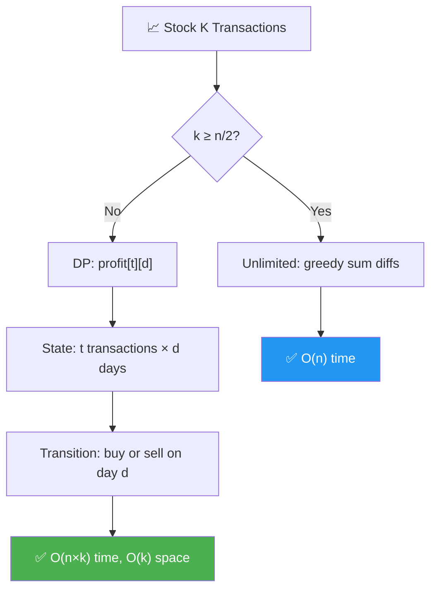
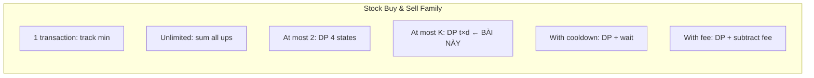
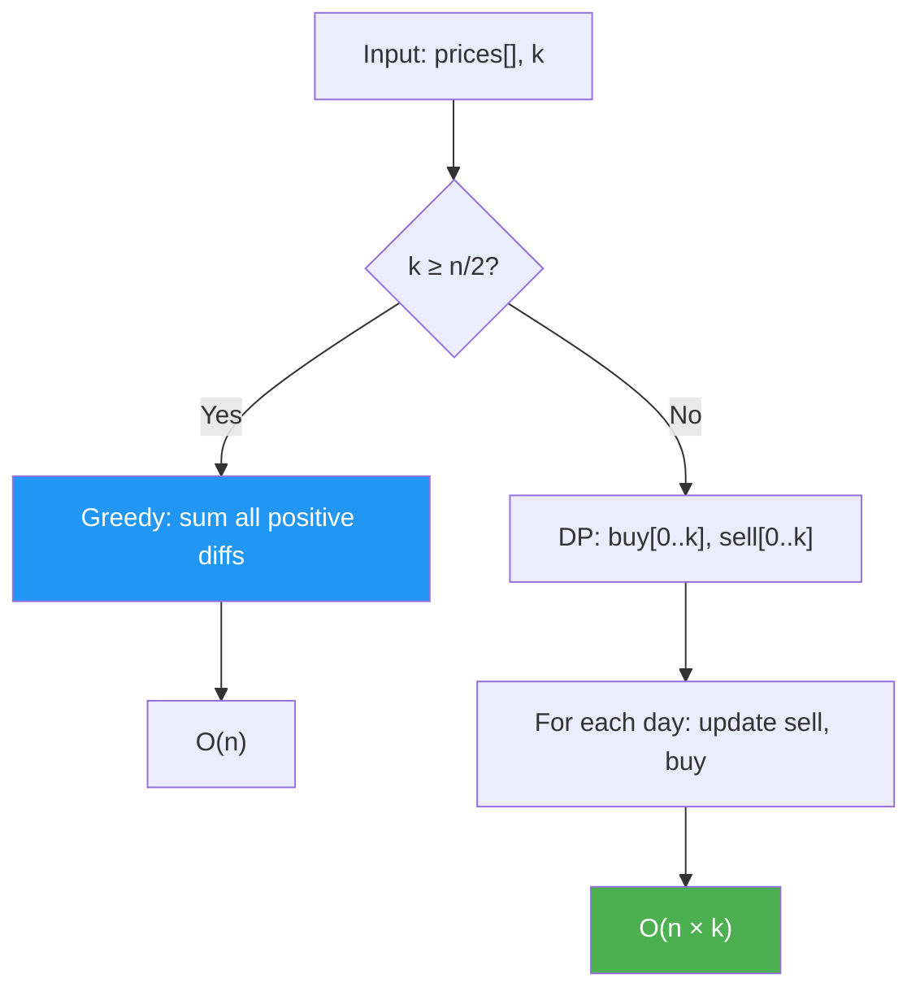

# 📈 Stock Buy & Sell — At Most K Transactions — GfG / LeetCode #188 (Hard)

> 📖 Code: [Stock Buy Sell K Transactions.js](./Stock%20Buy%20Sell%20K%20Transactions.js)





---

## R — Repeat & Clarify

🧠 *"Tối đa K lần mua-bán. Mỗi lần phải BÁN xong mới được MUA lại. Tìm MAX profit."*

> 🎙️ *"Given stock prices over n days and an integer k, find the maximum profit with at most k buy-sell transactions. Must sell before buying again."*

### Clarification Questions

```
Q: 1 transaction = 1 buy + 1 sell?
A: ĐÚNG! Mua rồi bán = 1 giao dịch!

Q: Phải bán trước khi mua lại?
A: ĐÚNG! Không được giữ 2 stocks cùng lúc!

Q: Có thể KHÔNG giao dịch?
A: CÓ! Profit = 0 nếu giá toàn giảm!

Q: k = 0?
A: Profit = 0 (không được giao dịch!)

Q: k rất lớn (k ≥ n/2)?
A: Tương đương UNLIMITED transactions → greedy!
   (Tối đa n/2 transactions vì cần 2 ngày/transaction)
```

### Tại sao bài này quan trọng?

```
  ⭐ ĐỈNH CAO của series Stock Buy & Sell!
  (LeetCode #188 — Hard!)

  Đây là BÀI TỔNG QUÁT cho tất cả variants:
  ┌───────────────────────────────────────────────────┐
  │  k = 1:       LC #121 — Best Time to Buy & Sell  │
  │  k = ∞:       LC #122 — Unlimited Transactions   │
  │  k = 2:       LC #123 — At Most 2 Transactions   │
  │  k = any:     LC #188 — At Most K (BÀI NÀY!) ⭐  │
  │  k = ∞ + cool: LC #309 — With Cooldown           │
  │  k = ∞ + fee: LC #714 — With Transaction Fee     │
  └───────────────────────────────────────────────────┘

  BẠN PHẢI hiểu:
  1. DP state machine: buy[t] / sell[t]
  2. Tối ưu hóa: k ≥ n/2 → unlimited → greedy!
  3. Space optimization: O(n×k) → O(k)!
```

---

## 🧠 Bản chất bài toán — Hiểu để NHỚ, không chỉ để GIẢI

### Tưởng tượng: STATE MACHINE!

```
  ⭐ Mỗi ngày, bạn ở 1 trong 2 TRẠNG THÁI:

  "HOLDING" = đang GIỮ stock (đã mua, chưa bán)
  "NOT HOLDING" = KHÔNG giữ stock (đã bán hoặc chưa mua)

  Transitions:
    NOT HOLDING → HOLDING:  MUA!  (profit -= price)
    HOLDING → NOT HOLDING:  BÁN!  (profit += price, transaction++)
    Stay same:              KHÔNG LÀM GÌ!

  ⚠️ Mỗi lần BÁN = HOÀN THÀNH 1 transaction!
     → Đếm transactions khi BÁN, không phải khi mua!
```

### DP: 2 mảng buy[t] và sell[t]

```
  ⭐ ĐỊNH NGHĨA:

  sell[t] = max profit SAU KHI đã hoàn thành t transactions
            (KHÔNG giữ stock)

  buy[t]  = max profit SAU KHI đã mua lần thứ t+1
            (ĐANG giữ stock, sẽ bán = transaction t+1)

  TRANSITIONS (cho mỗi ngày với giá price):

  buy[t]  = max(buy[t],            ← giữ nguyên (đã mua trước đó)
                sell[t] - price)    ← mua hôm nay (sau t sells!)

  sell[t] = max(sell[t],            ← giữ nguyên (đã bán trước đó)
                buy[t-1] + price)   ← bán hôm nay (hoàn thành trans t!)

  ⚠️ Thứ tự: update SELL trước, rồi BUY!
     Hoặc: update BUY trước với sell[t] cũ (dùng biến temp)

  KẾT QUẢ: max(sell[0], sell[1], ..., sell[k])
  (Tối đa t transactions → sell[t] lớn nhất!)
```

### Tại sao approach này đúng?

```
  ⭐ CHỨNG MINH trực giác:

  buy[t] = max profit khi ĐANG GIỮ stock, đã bán t lần trước đó
    → Hoặc đã mua TRƯỚC (buy[t] cũ)
    → Hoặc mua HÔM NAY sau t sells (sell[t] - price)

  sell[t] = max profit khi KHÔNG GIỮ stock, đã bán ĐÚNG t lần
    → Hoặc đã bán TRƯỚC (sell[t] cũ)
    → Hoặc bán HÔM NAY: buy[t-1] + price
       (buy[t-1] = đang giữ stock sau t-1 bán → bán hôm nay = t bán!)

  → Duyệt qua TẤT CẢ ngày, update mọi state!
  → Cuối cùng: max(sell[0..k]) = đáp án!
```

### Tối ưu hóa: k ≥ n/2 → UNLIMITED!

```
  ⭐ CỰC KỲ QUAN TRỌNG!

  Mỗi transaction cần ÍT NHẤT 2 ngày (1 ngày mua, 1 ngày bán).
  → Tối đa n/2 transactions trong n ngày!
  → Nếu k ≥ n/2: tương đương UNLIMITED!

  UNLIMITED → GREEDY:
    Cộng TẤT CẢ sự tăng giá liên tiếp!
    profit = Σ max(0, prices[i] - prices[i-1])

  → O(n) thay vì O(n×k)!

  ⚠️ PHẢI check trước! Nếu không: k = 10⁹, n = 10⁵
     → O(n×k) = 10¹⁴ → TLE!
     → O(n) = 10⁵ → PASS!
```



---

## 🧭 Luồng Suy Nghĩ — Từ đọc đề đến solution

### Bước 1: Keywords

```
  "at most k transactions" → DP with k states!
  "buy and sell" → state machine (holding/not holding)!
  "maximum profit" → optimization → DP!
```

### Bước 2: Special case k ≥ n/2

```
  "k ≥ n/2 → unlimited → greedy O(n)!"
  → CHECK TRƯỚC để tránh TLE!
```

### Bước 3: DP

```
  buy[t], sell[t] cho t = 0..k
  Duyệt mỗi ngày: update tất cả t!
  → O(n × k) time, O(k) space!
```

---

## E — Examples

```
VÍ DỤ 1: prices = [10, 22, 5, 80], k = 2

  k=2, n/2=2 → k ≥ n/2 → UNLIMITED!
  Greedy: (22-10) + (80-5) = 12 + 75 = 87 ✅

  (Hoặc DP cũng cho 87)
```

```
VÍ DỤ 2: prices = [90, 80, 70, 60, 50], k = 1

  Giá toàn giảm → KHÔNG mua!
  Profit = 0 ✅
```

```
VÍ DỤ 3: prices = [2, 4, 1], k = 1

  k=1: chỉ 1 transaction!
  Mua ngày 0 (2), bán ngày 1 (4) → profit = 2 ✅
```

```
VÍ DỤ 4: prices = [3, 2, 6, 5, 0, 3], k = 2

  Transaction 1: mua 2, bán 6 → profit = 4
  Transaction 2: mua 0, bán 3 → profit = 3
  Total = 7 ✅
```

---

## C — Code

### Helper: Unlimited Profit (Greedy)

```javascript
function unlimitedProfit(prices) {
  let profit = 0;
  for (let i = 1; i < prices.length; i++) {
    if (prices[i] > prices[i - 1]) {
      profit += prices[i] - prices[i - 1];
    }
  }
  return profit;
}
```

### Solution: DP — O(n×k) time, O(k) space ⭐

```javascript
function maxProfit(prices, k) {
  const n = prices.length;
  if (n <= 1 || k === 0) return 0;

  // Optimization: k ≥ n/2 → unlimited
  if (k >= Math.floor(n / 2)) {
    return unlimitedProfit(prices);
  }

  // DP arrays: buy[t] and sell[t]
  const buy = new Array(k + 1).fill(-Infinity);
  const sell = new Array(k + 1).fill(0);
  // buy[t] = max profit đang giữ stock, đã bán t lần
  // sell[t] = max profit không giữ stock, đã bán t lần

  for (let d = 0; d < n; d++) {
    const price = prices[d];
    for (let t = 1; t <= k; t++) {
      // Bán hôm nay = hoàn thành transaction t
      sell[t] = Math.max(sell[t], buy[t] + price);
      // Mua hôm nay = sau t-1 sells trước đó
      buy[t] = Math.max(buy[t], sell[t - 1] - price);
    }
  }

  // Max profit = max sell values
  return Math.max(...sell);
}
```

### Giải thích DP — CHI TIẾT

```
  KHỞI TẠO:
    buy[t] = -Infinity  (chưa mua → lợi nhuận -∞)
    sell[t] = 0          (chưa giao dịch → lợi nhuận 0)

  ⚠️ buy = -Infinity vì chưa có trạng thái "đang giữ stock"!
     sell = 0 vì 0 transactions = 0 profit!

  LOOP:
  for d = 0 → n-1:           ← mỗi ngày
    for t = 1 → k:           ← mỗi transaction count

      sell[t] = max(sell[t], buy[t] + price)
        → KHÔNG BÁN: giữ sell[t] cũ
        → BÁN: buy[t] + price
          (đang giữ stock cho trans t → bán hôm nay!)

      buy[t] = max(buy[t], sell[t-1] - price)
        → KHÔNG MUA: giữ buy[t] cũ
        → MUA: sell[t-1] - price
          (đã bán t-1 lần → mua cho lần t!)

  ⚠️ Thứ tự: sell[t] TRƯỚC buy[t]!
     Vì buy[t] dùng sell[t-1] (t-1, KHÔNG phải t!)
     → sell[t] update KHÔNG ảnh hưởng buy[t]!

     Nếu buy[t] dùng sell[t] → PHẢI update buy TRƯỚC
     hoặc dùng biến temp!

  KẾT QUẢ: max(sell[0], sell[1], ..., sell[k])
    → sell[0] = 0 (không giao dịch)
    → sell[t] = profit sau t transactions tốt nhất
```

### Trace CHI TIẾT: prices = [3, 2, 6, 5, 0, 3], k = 2

```
  n=6, k=2, k < n/2=3 → dùng DP!

  Init: buy = [-∞, -∞, -∞]
        sell = [0, 0, 0]

  ═══ d=0, price=3 ════════════════════════════════════

  t=1: sell[1] = max(0, -∞+3) = 0
       buy[1]  = max(-∞, 0-3) = -3     ← MUA ngày 0!
  t=2: sell[2] = max(0, -∞+3) = 0
       buy[2]  = max(-∞, 0-3) = -3

  buy = [-∞, -3, -3],  sell = [0, 0, 0]

  ═══ d=1, price=2 ════════════════════════════════════

  t=1: sell[1] = max(0, -3+2) = 0
       buy[1]  = max(-3, 0-2) = -2     ← MUA ngày 1 tốt hơn!
  t=2: sell[2] = max(0, -3+2) = 0
       buy[2]  = max(-3, 0-2) = -2

  buy = [-∞, -2, -2],  sell = [0, 0, 0]

  ═══ d=2, price=6 ════════════════════════════════════

  t=1: sell[1] = max(0, -2+6) = 4  ⭐  ← BÁN! profit=4!
       buy[1]  = max(-2, 0-6) = -2
  t=2: sell[2] = max(0, -2+6) = 4
       buy[2]  = max(-2, 4-6) = -2     ← sell[1]=4 mới!

  buy = [-∞, -2, -2],  sell = [0, 4, 4]

  ═══ d=3, price=5 ════════════════════════════════════

  t=1: sell[1] = max(4, -2+5) = 4
       buy[1]  = max(-2, 0-5) = -2
  t=2: sell[2] = max(4, -2+5) = 4
       buy[2]  = max(-2, 4-5) = -1     ← MUA lần 2 sau sell!

  buy = [-∞, -2, -1],  sell = [0, 4, 4]

  ═══ d=4, price=0 ════════════════════════════════════

  t=1: sell[1] = max(4, -2+0) = 4
       buy[1]  = max(-2, 0-0) = 0      ← MUA ngày 4 FREE!
  t=2: sell[2] = max(4, -1+0) = 4
       buy[2]  = max(-1, 4-0) = 4      ← MUA lần 2 tại 0!

  buy = [-∞, 0, 4],    sell = [0, 4, 4]

  ═══ d=5, price=3 ════════════════════════════════════

  t=1: sell[1] = max(4, 0+3) = 4
       buy[1]  = max(0, 0-3) = 0
  t=2: sell[2] = max(4, 4+3) = 7  ⭐  ← BÁN lần 2! profit=7!
       buy[2]  = max(4, 4-3) = 4

  buy = [-∞, 0, 4],    sell = [0, 4, 7]

  ═══ KẾT QUẢ ═════════════════════════════════════════
  max(sell) = max(0, 4, 7) = 7 ✅

  Giải thích: mua 2 bán 6 (+4), mua 0 bán 3 (+3) = 7!
```

> 🎙️ *"I model this as a DP state machine with two arrays: buy[t] represents holding stock after t-1 previous sells, and sell[t] represents not holding stock after completing exactly t sells. For each day, I update all states. When k exceeds n/2, I switch to greedy since we effectively have unlimited transactions. O(n×k) time, O(k) space."*

---

## O — Optimize

```
                         Time          Space     Ghi chú
  ──────────────────────────────────────────────────────
  Brute Force (recursion) O(2^n)       O(n)      Quá chậm
  DP 2D table             O(n×k)       O(n×k)    Tốn space
  DP 1D ⭐                O(n×k)       O(k)      Tối ưu!
  k ≥ n/2 → Greedy        O(n)         O(1)      Special case!

  ⚠️ PHẢI check k ≥ n/2 trước!
     k = 10⁹, n = 10⁵ → O(n×k) = TLE!
     Greedy = O(n) → PASS!
```

---

## T — Test

```
Test Cases:
  [10, 22, 5, 80],             k=2  → 87    ✅ 12+75
  [90, 80, 70, 60, 50],        k=1  → 0     ✅ toàn giảm
  [2, 4, 1],                   k=1  → 2     ✅ mua 2 bán 4
  [3, 2, 6, 5, 0, 3],          k=2  → 7     ✅ 4+3
  [1, 2, 3, 4, 5],             k=1  → 4     ✅ mua 1 bán 5
  [7, 1, 5, 3, 6, 4],          k=2  → 7     ✅ 4+3
  [1],                         k=1  → 0     ✅ 1 ngày
  [1, 2],                      k=1  → 1     ✅ mua 1 bán 2
```

---

## 🗣️ Interview Script

### Think Out Loud

```
  🧠 BƯỚC 1: Nhận dạng bài
    "At most k transactions → DP!"
    "Stock buy & sell family → state machine!"

  🧠 BƯỚC 2: Special case
    "k ≥ n/2 → unlimited → greedy: sum all positive diffs!"

  🧠 BƯỚC 3: DP formulation
    "2 states: buy[t] (holding stock), sell[t] (not holding)"
    "sell[t] = max(sell[t], buy[t] + price) — bán today"
    "buy[t] = max(buy[t], sell[t-1] - price) — mua today"

  🧠 BƯỚC 4: Complexity
    "O(n×k) time, O(k) space — 1D DP!"

  🎙️ Interview phrasing:
    "I first check if k allows unlimited transactions — if k
     is at least n/2, I use greedy to sum all positive price
     differences. Otherwise, I use DP with two arrays: buy[t]
     tracks the best profit while holding stock after t-1 sells,
     and sell[t] tracks the best profit after exactly t sells.
     For each day, I update all t states. O(n×k) time, O(k) space."
```

### Biến thể — Stock Family Summary

```
  ┌──────────────────────────────────────────────────────────┐
  │  LC #121: k=1 → track minPrice, maxProfit               │
  │           maxProfit = max(price - minPrice)              │
  │           O(n) time, O(1) space                          │
  │                                                          │
  │  LC #122: k=∞ → greedy: sum positive diffs              │
  │           profit += max(0, price[i] - price[i-1])       │
  │           O(n) time, O(1) space                          │
  │                                                          │
  │  LC #123: k=2 → DP 4 states: buy1, sell1, buy2, sell2  │
  │           O(n) time, O(1) space                          │
  │                                                          │
  │  LC #188: k=any → DP buy[t], sell[t]  ← BÀI NÀY! ⭐   │
  │           O(n×k) time, O(k) space                        │
  │                                                          │
  │  LC #309: k=∞ + cooldown → DP hold, sold, rest          │
  │           O(n) time, O(1) space                          │
  │                                                          │
  │  LC #714: k=∞ + fee → DP hold, cash                     │
  │           O(n) time, O(1) space                          │
  └──────────────────────────────────────────────────────────┘
```

---

## 🧩 Sai lầm phổ biến

```
❌ SAI LẦM #1: Quên check k ≥ n/2!

   k = 10⁹, n = 10⁵ → O(n×k) = 10¹⁴ → TLE!
   PHẢI check: if (k >= n/2) → greedy!

─────────────────────────────────────────────────────

❌ SAI LẦM #2: Khởi tạo buy = 0 thay vì -Infinity!

   buy[t] = 0: "đang giữ stock miễn phí" → SAI!
   buy[t] = -Infinity: "chưa mua → trạng thái không hợp lệ"

   Nếu buy[0] = 0: sell[1] = max(0, 0+price) = price
   → BÁN mà không mua → SAI!

─────────────────────────────────────────────────────

❌ SAI LẦM #3: Đếm transaction khi MUA thay vì BÁN!

   1 transaction = 1 BUY + 1 SELL
   Đếm khi BÁN (hoàn thành)!
   buy[t] = mua CHO transaction t (chưa xong!)
   sell[t] = HOÀN THÀNH transaction t!

─────────────────────────────────────────────────────

❌ SAI LẦM #4: Thứ tự update sell và buy!

   Nếu buy[t] dùng sell[t] (cùng t):
   → Mua và bán CÙNG NGÀY → SAI!

   Code trên: buy[t] dùng sell[t-1] → ĐÚNG!
   sell[t] dùng buy[t] (cùng t) → OK vì buy[t]
   đã update với sell[t-1] cũ!
```

---

## 📝 Flashcard — Tự kiểm tra

| ❓ Câu hỏi | ✅ Đáp án |
|---|---|
| buy[t] nghĩa gì? | Max profit khi **đang giữ stock**, đã bán **t-1** lần trước |
| sell[t] nghĩa gì? | Max profit khi **không giữ stock**, đã bán **t** lần |
| Transition sell[t]? | `max(sell[t], buy[t] + price)` |
| Transition buy[t]? | `max(buy[t], sell[t-1] - price)` |
| Khởi tạo buy? | **-Infinity** (chưa mua) |
| Khởi tạo sell? | **0** (chưa giao dịch) |
| k ≥ n/2 thì sao? | **Greedy**: sum positive diffs → O(n) |
| Time / Space? | **O(n×k)** / **O(k)** |
| LeetCode nào? | **#188** Best Time to Buy and Sell Stock IV |
