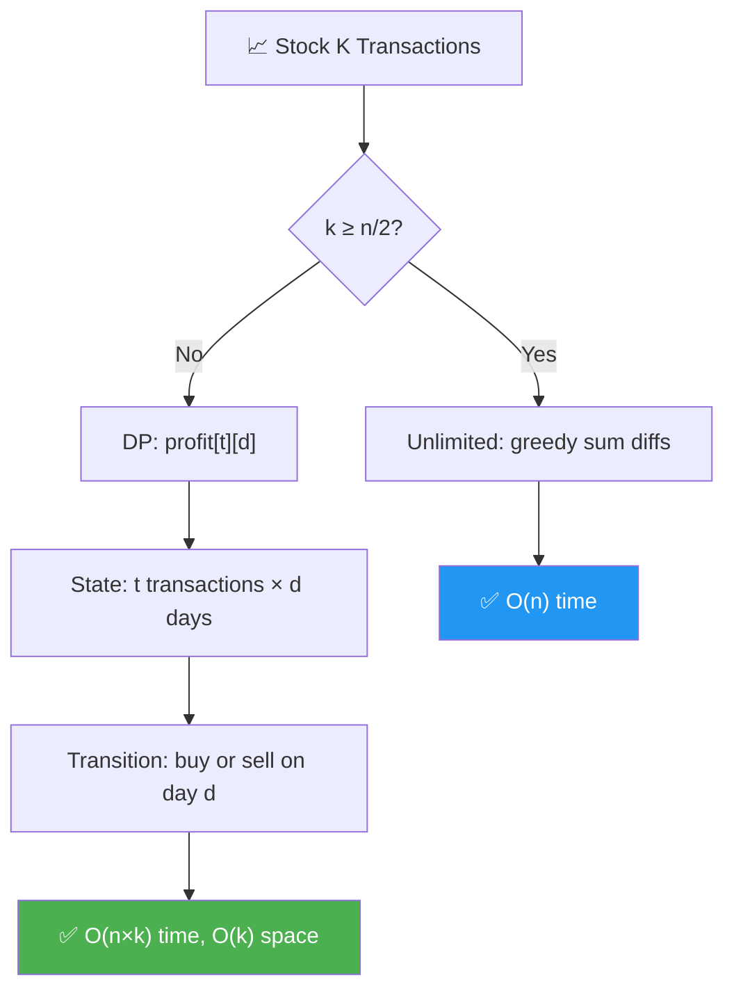
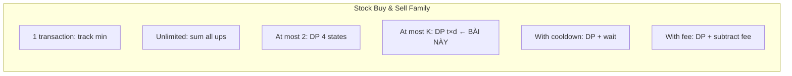
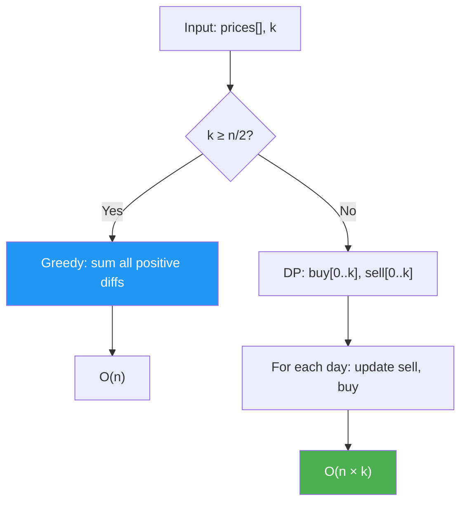
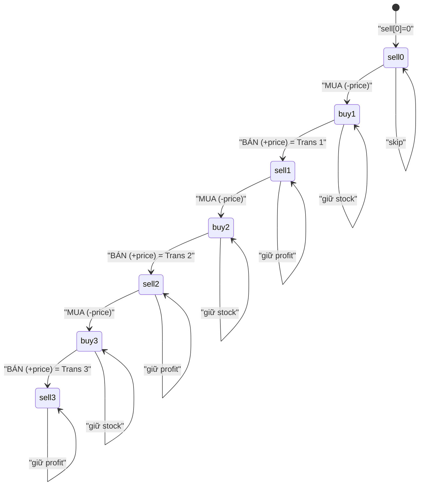
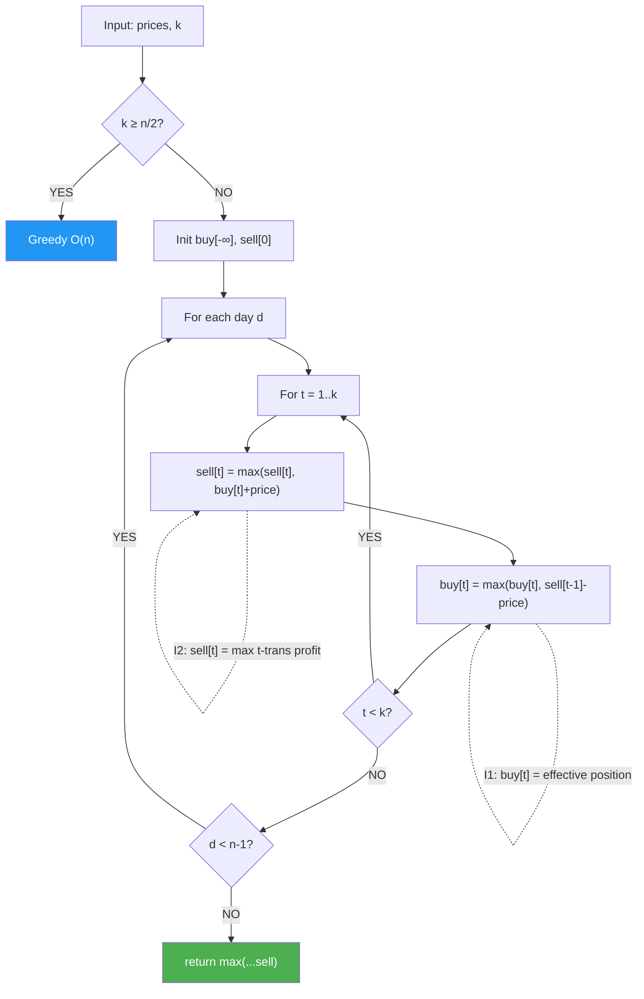
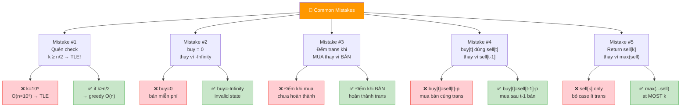
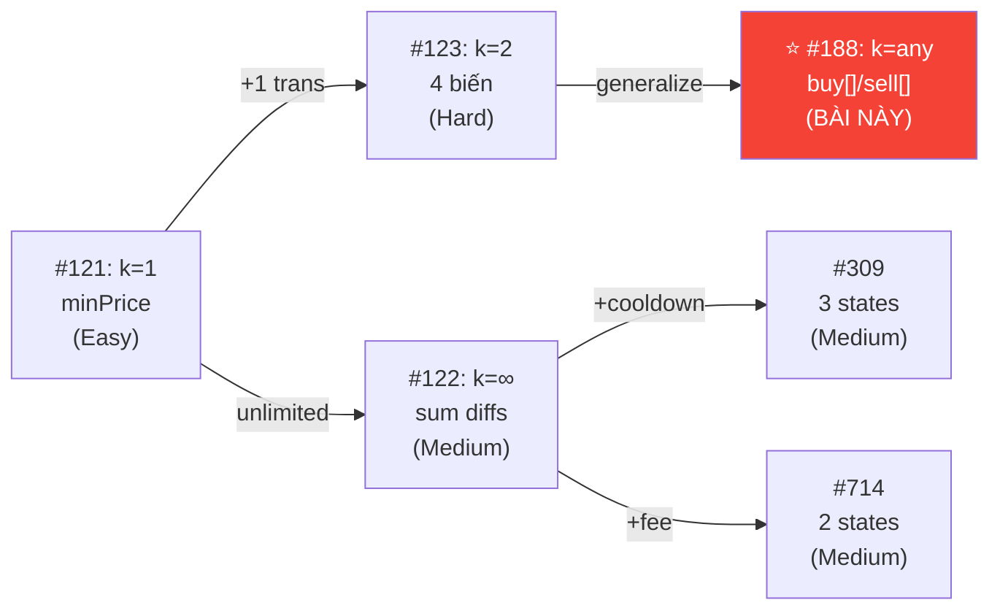
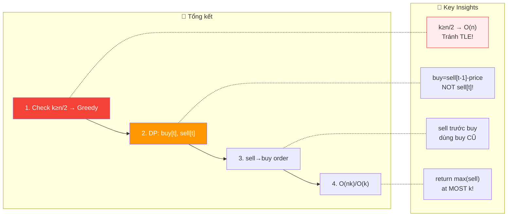

# 📈 Stock Buy & Sell — At Most K Transactions — GfG / LeetCode #188 (Hard)

> 📖 Code: [Stock Buy Sell K Transactions.js](./Stock%20Buy%20Sell%20K%20Transactions.js)





---

## R — Repeat & Clarify

🧠 *"Tối đa K lần mua-bán. Mỗi lần phải BÁN xong mới được MUA lại. Tìm MAX profit."*

> 🎙️ *"Given stock prices over n days and an integer k, find the maximum profit with at most k buy-sell transactions. Must sell before buying again."*

### Clarification Questions

```
Q: 1 transaction = 1 buy + 1 sell?
A: ĐÚNG! Mua rồi bán = 1 giao dịch!

Q: Phải bán trước khi mua lại?
A: ĐÚNG! Không được giữ 2 stocks cùng lúc!

Q: Có thể KHÔNG giao dịch?
A: CÓ! Profit = 0 nếu giá toàn giảm!

Q: k = 0?
A: Profit = 0 (không được giao dịch!)

Q: k rất lớn (k ≥ n/2)?
A: Tương đương UNLIMITED transactions → greedy!
   (Tối đa n/2 transactions vì cần 2 ngày/transaction)
```

### Tại sao bài này quan trọng?

```
  ⭐ ĐỈNH CAO của series Stock Buy & Sell!
  (LeetCode #188 — Hard!)

  Đây là BÀI TỔNG QUÁT cho tất cả variants:
  ┌───────────────────────────────────────────────────┐
  │  k = 1:       LC #121 — Best Time to Buy & Sell  │
  │  k = ∞:       LC #122 — Unlimited Transactions   │
  │  k = 2:       LC #123 — At Most 2 Transactions   │
  │  k = any:     LC #188 — At Most K (BÀI NÀY!) ⭐  │
  │  k = ∞ + cool: LC #309 — With Cooldown           │
  │  k = ∞ + fee: LC #714 — With Transaction Fee     │
  └───────────────────────────────────────────────────┘

  BẠN PHẢI hiểu:
  1. DP state machine: buy[t] / sell[t]
  2. Tối ưu hóa: k ≥ n/2 → unlimited → greedy!
  3. Space optimization: O(n×k) → O(k)!
```

---

## 🧠 Bản chất bài toán — Hiểu để NHỚ, không chỉ để GIẢI

### Tưởng tượng: STATE MACHINE!

```
  ⭐ Mỗi ngày, bạn ở 1 trong 2 TRẠNG THÁI:

  "HOLDING" = đang GIỮ stock (đã mua, chưa bán)
  "NOT HOLDING" = KHÔNG giữ stock (đã bán hoặc chưa mua)

  Transitions:
    NOT HOLDING → HOLDING:  MUA!  (profit -= price)
    HOLDING → NOT HOLDING:  BÁN!  (profit += price, transaction++)
    Stay same:              KHÔNG LÀM GÌ!

  ⚠️ Mỗi lần BÁN = HOÀN THÀNH 1 transaction!
     → Đếm transactions khi BÁN, không phải khi mua!
```

### DP: 2 mảng buy[t] và sell[t]

```
  ⭐ ĐỊNH NGHĨA:

  sell[t] = max profit SAU KHI đã hoàn thành t transactions
            (KHÔNG giữ stock)

  buy[t]  = max profit SAU KHI đã mua lần thứ t+1
            (ĐANG giữ stock, sẽ bán = transaction t+1)

  TRANSITIONS (cho mỗi ngày với giá price):

  buy[t]  = max(buy[t],            ← giữ nguyên (đã mua trước đó)
                sell[t] - price)    ← mua hôm nay (sau t sells!)

  sell[t] = max(sell[t],            ← giữ nguyên (đã bán trước đó)
                buy[t-1] + price)   ← bán hôm nay (hoàn thành trans t!)

  ⚠️ Thứ tự: update SELL trước, rồi BUY!
     Hoặc: update BUY trước với sell[t] cũ (dùng biến temp)

  KẾT QUẢ: max(sell[0], sell[1], ..., sell[k])
  (Tối đa t transactions → sell[t] lớn nhất!)
```

### Tại sao approach này đúng?

```
  ⭐ CHỨNG MINH trực giác:

  buy[t] = max profit khi ĐANG GIỮ stock, đã bán t lần trước đó
    → Hoặc đã mua TRƯỚC (buy[t] cũ)
    → Hoặc mua HÔM NAY sau t sells (sell[t] - price)

  sell[t] = max profit khi KHÔNG GIỮ stock, đã bán ĐÚNG t lần
    → Hoặc đã bán TRƯỚC (sell[t] cũ)
    → Hoặc bán HÔM NAY: buy[t-1] + price
       (buy[t-1] = đang giữ stock sau t-1 bán → bán hôm nay = t bán!)

  → Duyệt qua TẤT CẢ ngày, update mọi state!
  → Cuối cùng: max(sell[0..k]) = đáp án!
```

### Tối ưu hóa: k ≥ n/2 → UNLIMITED!

```
  ⭐ CỰC KỲ QUAN TRỌNG!

  Mỗi transaction cần ÍT NHẤT 2 ngày (1 ngày mua, 1 ngày bán).
  → Tối đa n/2 transactions trong n ngày!
  → Nếu k ≥ n/2: tương đương UNLIMITED!

  UNLIMITED → GREEDY:
    Cộng TẤT CẢ sự tăng giá liên tiếp!
    profit = Σ max(0, prices[i] - prices[i-1])

  → O(n) thay vì O(n×k)!

  ⚠️ PHẢI check trước! Nếu không: k = 10⁹, n = 10⁵
     → O(n×k) = 10¹⁴ → TLE!
     → O(n) = 10⁵ → PASS!
```



---

## 🧭 Luồng Suy Nghĩ — Từ đọc đề đến solution

### Bước 1: Keywords

```
  "at most k transactions" → DP with k states!
  "buy and sell" → state machine (holding/not holding)!
  "maximum profit" → optimization → DP!
```

### Bước 2: Special case k ≥ n/2

```
  "k ≥ n/2 → unlimited → greedy O(n)!"
  → CHECK TRƯỚC để tránh TLE!
```

### Bước 3: DP

```
  buy[t], sell[t] cho t = 0..k
  Duyệt mỗi ngày: update tất cả t!
  → O(n × k) time, O(k) space!
```

---

## E — Examples

```
VÍ DỤ 1: prices = [10, 22, 5, 80], k = 2

  k=2, n/2=2 → k ≥ n/2 → UNLIMITED!
  Greedy: (22-10) + (80-5) = 12 + 75 = 87 ✅

  (Hoặc DP cũng cho 87)
```

```
VÍ DỤ 2: prices = [90, 80, 70, 60, 50], k = 1

  Giá toàn giảm → KHÔNG mua!
  Profit = 0 ✅
```

```
VÍ DỤ 3: prices = [2, 4, 1], k = 1

  k=1: chỉ 1 transaction!
  Mua ngày 0 (2), bán ngày 1 (4) → profit = 2 ✅
```

```
VÍ DỤ 4: prices = [3, 2, 6, 5, 0, 3], k = 2

  Transaction 1: mua 2, bán 6 → profit = 4
  Transaction 2: mua 0, bán 3 → profit = 3
  Total = 7 ✅
```

---

## C — Code

### Helper: Unlimited Profit (Greedy)

```javascript
function unlimitedProfit(prices) {
  let profit = 0;
  for (let i = 1; i < prices.length; i++) {
    if (prices[i] > prices[i - 1]) {
      profit += prices[i] - prices[i - 1];
    }
  }
  return profit;
}
```

### Solution: DP — O(n×k) time, O(k) space ⭐

```javascript
function maxProfit(prices, k) {
  const n = prices.length;
  if (n <= 1 || k === 0) return 0;

  // Optimization: k ≥ n/2 → unlimited
  if (k >= Math.floor(n / 2)) {
    return unlimitedProfit(prices);
  }

  // DP arrays: buy[t] and sell[t]
  const buy = new Array(k + 1).fill(-Infinity);
  const sell = new Array(k + 1).fill(0);
  // buy[t] = max profit đang giữ stock, đã bán t lần
  // sell[t] = max profit không giữ stock, đã bán t lần

  for (let d = 0; d < n; d++) {
    const price = prices[d];
    for (let t = 1; t <= k; t++) {
      // Bán hôm nay = hoàn thành transaction t
      sell[t] = Math.max(sell[t], buy[t] + price);
      // Mua hôm nay = sau t-1 sells trước đó
      buy[t] = Math.max(buy[t], sell[t - 1] - price);
    }
  }

  // Max profit = max sell values
  return Math.max(...sell);
}
```

### Giải thích DP — CHI TIẾT

```
  KHỞI TẠO:
    buy[t] = -Infinity  (chưa mua → lợi nhuận -∞)
    sell[t] = 0          (chưa giao dịch → lợi nhuận 0)

  ⚠️ buy = -Infinity vì chưa có trạng thái "đang giữ stock"!
     sell = 0 vì 0 transactions = 0 profit!

  LOOP:
  for d = 0 → n-1:           ← mỗi ngày
    for t = 1 → k:           ← mỗi transaction count

      sell[t] = max(sell[t], buy[t] + price)
        → KHÔNG BÁN: giữ sell[t] cũ
        → BÁN: buy[t] + price
          (đang giữ stock cho trans t → bán hôm nay!)

      buy[t] = max(buy[t], sell[t-1] - price)
        → KHÔNG MUA: giữ buy[t] cũ
        → MUA: sell[t-1] - price
          (đã bán t-1 lần → mua cho lần t!)

  ⚠️ Thứ tự: sell[t] TRƯỚC buy[t]!
     Vì buy[t] dùng sell[t-1] (t-1, KHÔNG phải t!)
     → sell[t] update KHÔNG ảnh hưởng buy[t]!

     Nếu buy[t] dùng sell[t] → PHẢI update buy TRƯỚC
     hoặc dùng biến temp!

  KẾT QUẢ: max(sell[0], sell[1], ..., sell[k])
    → sell[0] = 0 (không giao dịch)
    → sell[t] = profit sau t transactions tốt nhất
```

### Trace CHI TIẾT: prices = [3, 2, 6, 5, 0, 3], k = 2

```
  n=6, k=2, k < n/2=3 → dùng DP!

  Init: buy = [-∞, -∞, -∞]
        sell = [0, 0, 0]

  ═══ d=0, price=3 ════════════════════════════════════

  t=1: sell[1] = max(0, -∞+3) = 0
       buy[1]  = max(-∞, 0-3) = -3     ← MUA ngày 0!
  t=2: sell[2] = max(0, -∞+3) = 0
       buy[2]  = max(-∞, 0-3) = -3

  buy = [-∞, -3, -3],  sell = [0, 0, 0]

  ═══ d=1, price=2 ════════════════════════════════════

  t=1: sell[1] = max(0, -3+2) = 0
       buy[1]  = max(-3, 0-2) = -2     ← MUA ngày 1 tốt hơn!
  t=2: sell[2] = max(0, -3+2) = 0
       buy[2]  = max(-3, 0-2) = -2

  buy = [-∞, -2, -2],  sell = [0, 0, 0]

  ═══ d=2, price=6 ════════════════════════════════════

  t=1: sell[1] = max(0, -2+6) = 4  ⭐  ← BÁN! profit=4!
       buy[1]  = max(-2, 0-6) = -2
  t=2: sell[2] = max(0, -2+6) = 4
       buy[2]  = max(-2, 4-6) = -2     ← sell[1]=4 mới!

  buy = [-∞, -2, -2],  sell = [0, 4, 4]

  ═══ d=3, price=5 ════════════════════════════════════

  t=1: sell[1] = max(4, -2+5) = 4
       buy[1]  = max(-2, 0-5) = -2
  t=2: sell[2] = max(4, -2+5) = 4
       buy[2]  = max(-2, 4-5) = -1     ← MUA lần 2 sau sell!

  buy = [-∞, -2, -1],  sell = [0, 4, 4]

  ═══ d=4, price=0 ════════════════════════════════════

  t=1: sell[1] = max(4, -2+0) = 4
       buy[1]  = max(-2, 0-0) = 0      ← MUA ngày 4 FREE!
  t=2: sell[2] = max(4, -1+0) = 4
       buy[2]  = max(-1, 4-0) = 4      ← MUA lần 2 tại 0!

  buy = [-∞, 0, 4],    sell = [0, 4, 4]

  ═══ d=5, price=3 ════════════════════════════════════

  t=1: sell[1] = max(4, 0+3) = 4
       buy[1]  = max(0, 0-3) = 0
  t=2: sell[2] = max(4, 4+3) = 7  ⭐  ← BÁN lần 2! profit=7!
       buy[2]  = max(4, 4-3) = 4

  buy = [-∞, 0, 4],    sell = [0, 4, 7]

  ═══ KẾT QUẢ ═════════════════════════════════════════
  max(sell) = max(0, 4, 7) = 7 ✅

  Giải thích: mua 2 bán 6 (+4), mua 0 bán 3 (+3) = 7!
```

> 🎙️ *"I model this as a DP state machine with two arrays: buy[t] represents holding stock after t-1 previous sells, and sell[t] represents not holding stock after completing exactly t sells. For each day, I update all states. When k exceeds n/2, I switch to greedy since we effectively have unlimited transactions. O(n×k) time, O(k) space."*

---

## 🔬 Deep Dive — Giải thích CHI TIẾT

> 💡 Phân tích **từng dòng** code với giải thích WHY, không chỉ WHAT.

### Deep Dive: Annotated Code

```javascript
function maxProfit(prices, k) {
  const n = prices.length;
  // ═══════════════════════════════════════════════════════════
  // EDGE CASE: n ≤ 1 hoặc k = 0
  // ═══════════════════════════════════════════════════════════
  //
  // n ≤ 1: cần ít nhất 2 ngày (mua + bán)
  // k = 0: không cho giao dịch → profit = 0
  //
  if (n <= 1 || k === 0) return 0;

  // ═══════════════════════════════════════════════════════════
  // OPTIMIZATION: k ≥ n/2 → UNLIMITED → GREEDY!
  // ═══════════════════════════════════════════════════════════
  //
  // ⭐ TẠI SAO n/2?
  // Mỗi transaction cần TỐI THIỂU 2 ngày: 1 mua + 1 bán
  // → n ngày → tối đa ⌊n/2⌋ transactions
  // → Nếu k ≥ n/2: có thừa quota → tương đương UNLIMITED!
  //
  // ⚠️ NẾU KHÔNG CHECK:
  //   k = 10⁹, n = 10⁵ → O(n×k) = 10¹⁴ → TLE!!!
  //   Với check: O(n) = 10⁵ → PASS!
  //
  // Greedy unlimited = cộng TẤT CẢ positive diffs:
  //   Σ max(0, prices[i] - prices[i-1])
  //   "Mua mỗi tối, bán mỗi sáng nếu lời!"
  //
  if (k >= Math.floor(n / 2)) {
    return unlimitedProfit(prices);
  }

  // ═══════════════════════════════════════════════════════════
  // KHỞI TẠO: buy[t] và sell[t]
  // ═══════════════════════════════════════════════════════════
  //
  // buy[t] = max profit khi ĐANG giữ stock, đã bán t-1 lần
  //          (sẽ bán lần thứ t!)
  //
  // sell[t] = max profit khi KHÔNG giữ stock, đã bán ĐÚNG t lần
  //
  // ⚠️ TẠI SAO buy = -Infinity?
  //   "Chưa từng mua" = trạng thái KHÔNG HỢP LỆ!
  //   → -Infinity đảm bảo sell[t] = max(0, -∞ + price) = 0
  //   → Chỉ tính khi buy[t] đã thực sự update (mua rồi!)
  //
  // ⚠️ TẠI SAO sell = 0?
  //   sell[0] = 0: "0 transactions = 0 profit" → base case!
  //   sell[t>0] = 0: "chưa hoàn thành t trans = 0 tạm thời"
  //
  const buy = new Array(k + 1).fill(-Infinity);
  const sell = new Array(k + 1).fill(0);

  for (let d = 0; d < n; d++) {
    const price = prices[d];
    for (let t = 1; t <= k; t++) {
      // ═══════════════════════════════════════════════════
      // SELL trước — Bán hôm nay = hoàn thành transaction t
      // ═══════════════════════════════════════════════════
      //
      // sell[t] = max(sell[t], buy[t] + price)
      //   Ý nghĩa: "Nên GIỮ profit cũ hay BÁN HÔM NAY?"
      //
      //   sell[t] (giữ): profit cũ từ bán ngày trước
      //   buy[t] + price: đang giữ stock cho trans t → bán!
      //
      //   ⚠️ buy[t] ở đây = buy[t] CỦA ITERATION TRƯỚC!
      //      (chưa update ở vòng lặp này!)
      //      → ĐÚNG: bán stock đã mua TRƯỚC ĐÓ!
      //
      sell[t] = Math.max(sell[t], buy[t] + price);

      // ═══════════════════════════════════════════════════
      // BUY sau — Mua hôm nay = chuẩn bị cho transaction t
      // ═══════════════════════════════════════════════════
      //
      // buy[t] = max(buy[t], sell[t-1] - price)
      //   Ý nghĩa: "Nên GIỮ stock cũ hay MUA HÔM NAY?"
      //
      //   buy[t] (giữ): vẫn giữ stock đã mua trước đó
      //   sell[t-1] - price: đã hoàn thành t-1 trans
      //     → Dùng profit t-1 trans để MUA CHO TRANS T!
      //
      //   ⭐ KEY: sell[t-1] không phải sell[t]!
      //      sell[t-1] = profit sau t-1 bán
      //      → Mua cho trans thứ t!
      //      → KHÔNG mua bán cùng ngày CHO CÙNG trans!
      //
      //   ⚠️ sell[t-1] ở đây CÓ THỂ đã update!
      //      sell[t-1] update ở vòng t-1 → đã xong trước t!
      //      Nhưng VẪN ĐÚNG vì:
      //      Nếu sell[t-1] vừa bán hôm nay → buy[t] mua cùng ngày
      //      → sell[t] = buy[t]+price = sell[t-1]-price+price = sell[t-1]
      //      → Tương đương SKIP trans thứ t → ĐÚNG!
      //
      buy[t] = Math.max(buy[t], sell[t - 1] - price);
    }
  }

  // ═══════════════════════════════════════════════════════════
  // KẾT QUẢ: max(sell[0], sell[1], ..., sell[k])
  // ═══════════════════════════════════════════════════════════
  //
  // ⭐ TẠI SAO không chỉ sell[k]?
  //   sell[k] = profit tốt nhất với ĐÚNG k transactions
  //   Nhưng "at most k" → có thể 0, 1, ..., k transactions!
  //   → Cần max CỦA TẤT CẢ!
  //
  //   Thực tế: sell[t] ≥ 0 luôn (init = 0, max chỉ tăng)
  //   → sell[k] thường = max(sell) vì nhiều trans hơn ≥ ít hơn
  //   → NHƯNG không đảm bảo! VD: k=3 nhưng chỉ 2 cơ hội tốt!
  //
  //   ⚠️ Với code k=2 (LC#123): sell2 ≥ sell1 LUÔN (chứng minh được)
  //      Với k tổng quát: sell[k] có thể = sell[k-1] nhưng KHÔNG NHỎ hơn!
  //      → Math.max(...sell) = sell[k] trong hầu hết cases!
  //      → Nhưng max(...sell) an toàn hơn!
  //
  return Math.max(...sell);
}
```

### Deep Dive: Tại sao k ≥ n/2 → Unlimited?

```
  ⭐ CHỨNG MINH FORMAL:

  Mỗi transaction = 1 ngày MUA + 1 ngày BÁN = 2 ngày TỐI THIỂU
  (Có thể mua ngày i, bán ngày j > i, nhưng cần ≥ 2 ngày cho 1 trans)

  Với n ngày: tối đa = ⌊n/2⌋ transactions

  VÍ DỤ: n = 7 ngày
    Trans 1: mua ngày 0, bán ngày 1
    Trans 2: mua ngày 2, bán ngày 3
    Trans 3: mua ngày 4, bán ngày 5
    → Tối đa 3 = ⌊7/2⌋ transactions!

  → Nếu k ≥ ⌊n/2⌋:
    Quota k ĐỦ cho mọi cơ hội → UNLIMITED!
    → Greedy: cộng mọi positive diff!

  ⚠️ QUAN TRỌNG trong contest/interview:
    k = 10⁹ thường gặp → PHẢI check!
    Không check → O(n × 10⁹) = TLE guaranteed!
```

### Deep Dive: Sell trước Buy — Thứ tự update

```
  ⭐ CÂU HỎI QUAN TRỌNG: Tại sao update sell[t] TRƯỚC buy[t]?

  Code:
    sell[t] = max(sell[t], buy[t] + price)      // sell dùng buy[t] CŨ
    buy[t]  = max(buy[t], sell[t-1] - price)     // buy dùng sell[t-1]

  Phân tích:
    sell[t] dùng buy[t] → buy[t] CHƯA update → dùng giá trị cũ ✅
    buy[t] dùng sell[t-1] → sell[t-1] ĐÃ update (ở vòng t-1)

  ⚠️ sell[t-1] đã update — có sai không?
    Nếu sell[t-1] vừa bán hôm nay → buy[t] mua cùng ngày:
      buy[t] = sell[t-1] - price (bán + mua cùng ngày)
      sell[t] = buy[t] + price = sell[t-1] (net 0!)
    → Tương đương KHÔNG giao dịch trans t → ĐÚNG!

  ┌──────────────────────────────────────────────────────────┐
  │  Thứ tự              │ sell[t] dùng │ buy[t] dùng      │
  ├──────────────────────────────────────────────────────────┤
  │  sell→buy (code này)  │ buy[t] CŨ ✅ │ sell[t-1] MỚI ✅│
  │  buy→sell             │ buy[t] MỚI ⚠️│ sell[t-1] CŨ ✅ │
  └──────────────────────────────────────────────────────────┘

  Cả 2 thứ tự đều ĐÚNG! (chứng minh tương tự k=2)
  Nhưng sell→buy dễ HIỂU hơn (bán dùng buy cũ = stock đã mua!)
```

### Deep Dive: Connection k=2 → k=any

```
  ⭐ Bài k=2 (LC #123) là SPECIAL CASE của bài này!

  LC #123 (k=2):               LC #188 (k=any):
  buy1  = max(buy1, -price)     for t = 1 to k:
  sell1 = max(sell1,buy1+price)   sell[t] = max(sell[t], buy[t]+price)
  buy2  = max(buy2,sell1-price)   buy[t]  = max(buy[t], sell[t-1]-price)
  sell2 = max(sell2,buy2+price)

  MAPPING:
    buy1  = buy[1]    (buy[1] = max(buy[1], sell[0]-price) = max(buy[1], -price))
    sell1 = sell[1]   (sell[1] = max(sell[1], buy[1]+price))
    buy2  = buy[2]    (buy[2] = max(buy[2], sell[1]-price))
    sell2 = sell[2]   (sell[2] = max(sell[2], buy[2]+price))

  → LC #123 = unroll loop cho k=2!
  → 4 biến = buy[1], sell[1], buy[2], sell[2]!
  → Hiểu k=2 → hiểu k=any ngay!
```

### State Machine Diagram — k=3 ví dụ



```
  ⭐ Pattern: sell[0] → buy[1] → sell[1] → buy[2] → ... → sell[k]

  Mỗi cặp (buy[t], sell[t]) = 1 transaction!
  buy[t] = mua cho trans t (dùng sell[t-1] profit!)
  sell[t] = bán hoàn thành trans t

  → 2k states + sell[0] = (2k+1) states tổng cộng!
  → k=1: 3 states, k=2: 5 states, k=3: 7 states...
```

### Trace bổ sung: prices = [7, 1, 5, 3, 6, 4], k = 2

```
  n=6, k=2, k < n/2=3 → DP!

  ┌───────┬──────┬──────┬──────┬──────┬──────────────────────────┐
  │ price │ b[1] │ s[1] │ b[2] │ s[2] │ Ghi chú                  │
  ├───────┼──────┼──────┼──────┼──────┼──────────────────────────┤
  │  init │  -∞  │  0   │  -∞  │  0   │                          │
  │   7   │  -7  │  0   │  -7  │  0   │ mua 7                    │
  │   1   │  -1  │  0   │  -1  │  0   │ mua 1 tốt hơn!          │
  │   5   │  -1  │  4   │  -1  │  4   │ ⭐ s[1]=4 (1→5)         │
  │   3   │  -1  │  4   │   1  │  4   │ ⭐ b[2]=4-3=1           │
  │   6   │  -1  │  5   │   1  │  7   │ ⭐⭐ s[2]=1+6=7!        │
  │   4   │  -1  │  5   │   1  │  7   │ giữ                      │
  └───────┴──────┴──────┴──────┴──────┴──────────────────────────┘

  max(sell) = max(0, 5, 7) = 7 ✅
  Trans 1: mua 1, bán 5 = +4
  Trans 2: mua 3, bán 6 = +3 → Total = 7!

  ⭐ NHẬN XÉT:
  - sell[1] update lên 5 (mua 1, bán 6) ở ngày cuối cùng
  - Nhưng sell[2] = 7 > sell[1] = 5 → 2 trans tốt hơn 1 trans!
  - buy[2] tại price=3: b[2] = sell[1]-3 = 4-3 = 1
    → "Tôi có 4 đồng lời, mua lại 3, effective = +1!"
```

### Trace bổ sung: prices = [1, 2, 3, 4, 5], k = 1

```
  n=5, k=1 → DP!

  ┌───────┬──────┬──────┬───────────────────────┐
  │ price │ b[1] │ s[1] │ Ghi chú               │
  ├───────┼──────┼──────┼───────────────────────┤
  │  init │  -∞  │  0   │                        │
  │   1   │  -1  │  0   │ mua 1                  │
  │   2   │  -1  │  1   │ bán 2 → profit 1      │
  │   3   │  -1  │  2   │ bán 3 → profit 2      │
  │   4   │  -1  │  3   │ bán 4 → profit 3      │
  │   5   │  -1  │  4   │ bán 5 → profit 4      │
  └───────┴──────┴──────┴───────────────────────┘

  max(sell) = 4 ✅ (mua 1, bán 5)

  ⭐ k=1 → buy[1],sell[1] = giống LC #121!
     buy[1] = max(buy[1], sell[0]-price) = max(buy[1], -price)
     → buy[1] = -minPrice!
     sell[1] = max(sell[1], buy[1]+price) = maxProfit!
```

---

## 📐 Invariant — Chứng minh tính đúng đắn

```
  📐 INVARIANT: Sau duyệt prices[0..d], 2 mảng thỏa:

  I1: buy[t] = max profit khi ĐANG giữ stock,
              đã hoàn thành ĐÚNG t-1 transactions trước đó,
              trong prices[0..d]

  I2: sell[t] = max profit khi KHÔNG giữ stock,
               đã hoàn thành ĐÚNG t transactions,
               trong prices[0..d]

  ─── CHỨNG MINH sell[t] ≥ 0 ──────────────────────────

  Base: sell[t] = 0 (init)
  Step: sell[t] = max(sell[t], buy[t] + price)
        sell[t] (cũ) ≥ 0 (IH)
        → sell[t] (mới) = max(≥0, ...) ≥ 0 ✅

  ─── CHỨNG MINH SELL TRƯỚC BUY = ĐÚNG ───────────────

  Tại ngày d, transaction t:
    sell[t] = max(sell[t], buy[t] + price)
      buy[t] ở đây = buy[t] cũ (chưa update ở vòng t này)
      → sell[t] dùng "stock đã mua TRƯỚC hôm nay" ✅

    buy[t] = max(buy[t], sell[t-1] - price)
      sell[t-1] CÓ THỂ đã update (ở vòng t-1)

  Nếu sell[t-1] vừa bán hôm nay:
    buy[t] = sell[t-1] - price (mua ngay sau bán)
    sell[t] (sau) = max(sell[t], buy[t] + price)
                  = max(sell[t], sell[t-1])
    → "Bán lần t-1 rồi mua lại bán cùng ngày lần t = net 0"
    → Tương đương: sell[t] ≥ sell[t-1] (skip 1 trans)
    → ĐÚNG! ∎

  ─── CHỨNG MINH k ≥ n/2 → UNLIMITED ─────────────────

  Mỗi transaction cần ≥ 2 ngày:
    T transactions → ≤ n/(2T) ≤ n ngày
    T tối đa = ⌊n/2⌋
    → k ≥ ⌊n/2⌋ → k ≥ T_max → UNLIMITED ✅

  Greedy cho unlimited:
    profit = Σ max(0, prices[i] - prices[i-1])
    = tổng mọi đoạn tăng giá
    = tối ưu vì "mua đáy mỗi đoạn tăng, bán đỉnh" ✅ ∎
```



---

## O — Optimize

```
                         Time          Space     Ghi chú
  ──────────────────────────────────────────────────────
  Brute Force (recursion) O(2^n)       O(n)      Quá chậm
  DP 2D table             O(n×k)       O(n×k)    Tốn space
  DP 1D ⭐                O(n×k)       O(k)      Tối ưu!
  k ≥ n/2 → Greedy        O(n)         O(1)      Special case!

  ⚠️ PHẢI check k ≥ n/2 trước!
     k = 10⁹, n = 10⁵ → O(n×k) = TLE!
     Greedy = O(n) → PASS!
```

### Complexity chính xác — Đếm operations

```
  Phân tích CHI TIẾT:

  Case k < n/2 (DP):
    Outer loop: n iterations (days)
    Inner loop: k iterations (transactions)
    Mỗi inner iteration: 2 × Math.max = 4 ops
    → n × k × 4 = 4nk operations

    Space: 2 arrays × (k+1) = O(k)

  Case k ≥ n/2 (Greedy):
    1 pass: n-1 comparisons = O(n)
    Space: 1 variable = O(1)

  📊 So sánh (n = 10⁵):
    k=2:    4 × 10⁵ × 2 = 8×10⁵         ⭐ (nhanh)
    k=100:  4 × 10⁵ × 100 = 4×10⁷       ⭐ (OK)
    k=10⁹:  GREEDY → n-1 = 10⁵           ⭐ (check!)
    k=10⁹ KHÔNG check: 4×10¹⁴            💀 TLE!
```

### DP 2D → 1D: Space optimization

```
  DP 2D gốc:
    profit[t][d] = max profit với t trans tính đến ngày d
    → O(n×k) space — TỐN!

  DP 1D tối ưu (code bài này):
    buy[t], sell[t] — chỉ track state HIỆN TẠI!
    → Update theo ngày d, overwrite in-place!
    → O(k) space!

  ⭐ TẠI SAO in-place OK?
    sell[t] chỉ dùng buy[t] (cùng t, ngày trước)
    buy[t] chỉ dùng sell[t-1] (t-1, có thể cùng ngày)
    → KHÔNG dùng giá trị từ 2+ ngày trước → in-place safe!
```

---

## T — Test

```
Test Cases:
  [10, 22, 5, 80],             k=2  → 87    ✅ 12+75
  [90, 80, 70, 60, 50],        k=1  → 0     ✅ toàn giảm
  [2, 4, 1],                   k=1  → 2     ✅ mua 2 bán 4
  [3, 2, 6, 5, 0, 3],          k=2  → 7     ✅ 4+3
  [1, 2, 3, 4, 5],             k=1  → 4     ✅ mua 1 bán 5
  [7, 1, 5, 3, 6, 4],          k=2  → 7     ✅ 4+3
  [1],                         k=1  → 0     ✅ 1 ngày
  [1, 2],                      k=1  → 1     ✅ mua 1 bán 2
```

### Edge Cases — Phân tích CHI TIẾT

```
  ┌──────────────────────────────────────────────────────────────────┐
  │  EDGE CASE               │  Input             │  Output │ Lý do │
  ├──────────────────────────────────────────────────────────────────┤
  │  k = 0                   │  [1,2,3], k=0      │  0      │ no tx │
  │  n = 1                   │  [5], k=1           │  0      │ no tx │
  │  k > n                   │  [1,2], k=10⁹      │  1      │ greed │
  │  Toàn giảm               │  [5,4,3,2,1], k=2   │  0      │ no tx │
  │  Toàn tăng               │  [1,2,3,4,5], k=1   │  4      │ 1 tx  │
  │  Toàn tăng k=∞           │  [1,2,3,4,5], k=10  │  4      │ greed │
  │  W-shape                 │  [10,1,10,1,10], k=2│  18     │ 2×9   │
  │  Duplicates              │  [3,3,3], k=2       │  0      │ flat  │
  │  k=1 giữa đã optimize   │  [2,4,1], k=1       │  2      │ LC121 │
  └──────────────────────────────────────────────────────────────────┘

  ⭐ NHẬN XÉT:
  - k=0 và n≤1: early return 0!
  - k ≥ n/2: PHẢI switch greedy (k=10⁹ thường gặp!)
  - Toàn tăng + k=1: chỉ 1 trans mua đầu bán cuối
  - Toàn tăng + k lớn: greedy sum tất cả diffs = mua đầu bán cuối tương đương!
```

---

## 🗣️ Interview Script

### 🎙️ Think Out Loud — Mô phỏng phỏng vấn thực

> ⚠️ Script này dạy cách **NÓI**, không phải cách CODE.
> Mỗi đoạn = cách bạn **PHÁT BIỂU** trong phỏng vấn thực!

```
  ╔══════════════════════════════════════════════════════════════╗
  ║  🕐 FULL INTERVIEW SIMULATION — 1h30 (90 phút)             ║
  ║                                                              ║
  ║  00:00-05:00  Introduction + Icebreaker         (5 min)     ║
  ║  05:00-45:00  Problem Solving                   (40 min)    ║
  ║  45:00-60:00  Deep Technical Probing            (15 min)    ║
  ║  60:00-75:00  Variations + Extensions           (15 min)    ║
  ║  75:00-85:00  System Design at Scale            (10 min)    ║
  ║  85:00-90:00  Behavioral + Q&A                  (5 min)     ║
  ╚══════════════════════════════════════════════════════════════╝
```

```
  ╔══════════════════════════════════════════════════════════════╗
  ║  PART 1: INTRODUCTION (00:00 — 05:00)                       ║
  ╚══════════════════════════════════════════════════════════════╝

  👤 "Tell me about yourself and a complex state management
      problem you've solved."

  🧑 "I'm a frontend engineer with [X] years of experience.
      One project that stands out is a trading dashboard
      where we had to track multiple portfolio positions
      in real-time. The state was complex — each position
      had its own lifecycle: pending, open, partially filled,
      closed.

      Initially we had a flat state object and tons of
      conditional logic. I refactored it into a state machine
      pattern — each position had explicit states and valid
      transitions. This eliminated an entire class of bugs
      where we'd try to modify a closed position.

      That experience actually connects to algorithm design —
      a lot of dynamic programming problems are essentially
      state machines where you track which states are reachable
      and optimize over transitions."

  👤 "Great! Let's do exactly that. Here's a problem."
```

```
  ╔══════════════════════════════════════════════════════════════╗
  ║  PART 2: PROBLEM SOLVING (05:00 — 45:00)                   ║
  ╚══════════════════════════════════════════════════════════════╝

  ──────────────── 05:00 — Clarify (5 phút) ────────────────

  👤 "You're given an array of stock prices and an integer k.
      Find the maximum profit with at most k transactions."

  🧑 "Before I start, let me make sure I understand the rules.

      So a 'transaction' means one buy followed by one sell.
      I can do at MOST k transactions — could be fewer if
      that's more profitable.

      And critically — I have to sell before I can buy again.
      No overlapping: I can't hold two stocks simultaneously.

      Also, I assume I can buy and sell on the same day?
      Like, sell stock A in the morning and buy stock B
      in the afternoon? That's how the DP usually works."

  👤 "Yes, that's correct."

  🧑 "And what are the constraints on n and k?"

  👤 "n up to 1000, k up to 1000."

  🧑 "Okay, so n times k is up to a million — that's fine
      for an O of n-times-k solution. But I need to watch out
      for edge cases where k is very large. Let me think
      through this step by step."

  ──────────────── 10:00 — Key Insight (5 phút) ────────────────

  🧑 "First, let me find the critical insight.

      With n prices, the maximum number of meaningful transactions
      is n over 2. Because each transaction needs at least
      two days — one to buy, one to sell.

      So if k is greater than or equal to n over 2,
      I effectively have UNLIMITED transactions.
      In that case, I don't need DP at all — I can just
      use a greedy approach: sum up every positive price change.

      For example, with prices three, one, four, one, five, nine:
      the positive jumps are one-to-four which is plus 3,
      one-to-five which is plus 4, five-to-nine which is plus 4.
      Greedy would capture all of them.

      This optimization is CRITICAL. Without it, if k equal
      something like ten to the ninth, my DP would try to
      allocate a billion-element array and crash.

      So my algorithm has two branches:
      If k is at least n over 2 — use greedy, O of n.
      Otherwise — use DP, O of n times k."

  👤 "Good catch! Walk me through the DP."

  ──────────────── 15:00 — DP Formulation bằng LỜI (8 phút) ────────────────

  🧑 "Alright, for the DP approach, I need to think about
      what states I'm tracking.

      At any point during the process, I'm in one of two situations:
      either I'm HOLDING a stock, or I'm NOT holding one.
      And I need to know how many transactions I've completed.

      So I'll use two arrays:

      The first one tracks 'the best profit I can have while
      currently HOLDING a stock, given that I've completed
      t minus 1 sells so far.' I'll call this buy-of-t.

      The second one tracks 'the best profit I can have while
      NOT holding a stock, having completed exactly t sells.'
      I'll call this sell-of-t.

      Now, for each day, I update these two arrays.

      For sell-of-t, I have two choices:
      Either I do nothing — keep the old sell-of-t.
      Or I sell today — that's buy-of-t plus today's price.
      I take whichever is bigger.

      For buy-of-t, again two choices:
      Either I do nothing — keep the old buy-of-t.
      Or I buy today — that's sell-of-t-minus-1 minus today's price.
      The key here is that I use sell of T MINUS ONE.
      Because buying for the t-th transaction means
      I've already completed t minus 1 sells.

      And there's a subtle but important detail about the ORDER
      of these updates. I update sell BEFORE buy.
      That's because buy-of-t depends on sell-of-t-minus-1,
      not sell-of-t. So even if sell-of-t just got updated,
      it doesn't affect buy-of-t — they use different indices."

  ──────────────── 23:00 — Initialization bằng LỜI (3 phút) ────────────────

  🧑 "For initialization:

      I set all sell values to zero. Makes sense —
      if I haven't done any transactions, my profit is zero.

      But for buy, I set everything to NEGATIVE INFINITY.
      Why? Because at the start, there's no valid state
      where I'm 'holding a stock.' It's an impossible state.
      Setting it to negative infinity ensures that any real
      buy will be better, so the first actual buy naturally
      takes over.

      The final answer is the maximum across all sell values:
      sell-of-zero, sell-of-one, up to sell-of-k.
      I include sell-of-zero because sometimes doing nothing
      is the best option — like if prices only go down."

  ──────────────── 26:00 — Trace bằng LỜI (6 phút) ────────────────

  🧑 "Let me trace through an concrete example to verify.
      I'll use prices: three, two, six, five, zero, three.
      And k equal 2.

      First, k is 2 and n over 2 is 3, so 2 is less than 3 —
      I use the DP path.

      I initialize buy as negative infinity, negative infinity,
      negative infinity. And sell as zero, zero, zero.

      Day 0, price is 3:
      For transaction 1 — sell stays at zero because
      I can't sell what I don't have. But buy becomes
      zero minus 3, which equal negative 3.
      That means: I bought at price 3, costing me 3.

      Day 1, price is 2:
      For transaction 1 — sell is still zero. But buy updates
      to zero minus 2, which equal negative 2.
      Negative 2 is better than negative 3 — buying at 2
      is cheaper than buying at 3! Makes sense.

      Day 2, price is 6:
      Here's where it gets exciting!
      For transaction 1 — sell goes from zero to
      negative 2 plus 6, which equal 4!
      That means I bought at 2 and sold at 6 for a profit of 4.
      Buy stays at negative 2.

      For transaction 2 — this is the interesting part.
      Buy-of-2 can now use sell-of-1, which just became 4.
      So buy-of-2 equal 4 minus 6, which equal negative 2.
      That means: I took my 4 profit from the first transaction,
      then reinvested by buying at 6.

      Day 4, price is 0:
      For transaction 1 — buy becomes zero minus zero, which
      equal zero! That's a FREE buy! I'm holding stock
      at zero cost.
      For transaction 2 — buy becomes 4 minus zero, equal 4.
      That means: I kept my 4 profit from transaction 1
      and bought at price 0 — essentially getting it for free.

      Day 5, price is 3:
      For transaction 2 — sell becomes 4 plus 3, which equal 7!

      Final answer: max of zero, 4, 7, which equal 7.
      That's: buy at 2, sell at 6 for plus 4,
      then buy at 0, sell at 3 for plus 3.
      Total profit equal 7!"

  ──────────────── 32:00 — Viết code, NÓI từng block (5 phút) ────────────────

  🧑 "Let me code this up. I'll walk through it block by block.

      [Vừa viết vừa nói:]

      First, the base cases. If the array has one or fewer
      elements, or if k is zero, I return zero immediately.
      No opportunities for any profit.

      Next, the greedy optimization. If k is at least
      n over 2, I call my greedy helper — just scan through
      and sum up every positive price difference.
      This is O of n and avoids the DP overhead entirely.

      Then I set up my DP arrays. Buy is initialized to
      negative infinity — no valid holding state yet.
      Sell is initialized to zero — zero profit for zero trades.
      Both arrays have size k plus 1, because I index
      transactions from 1 to k, and sell-of-zero is my base case.

      The main loop: for each day, for each transaction count
      from 1 to k, I update sell first, then buy.
      Sell-of-t equal the max of itself and buy-of-t plus
      today's price. Buy-of-t equal the max of itself and
      sell-of-t-minus-1 minus today's price.

      Finally, I return the maximum value in the sell array."

      📌 MẸO: KHÔNG đọc code từng dòng!
      Đọc theo BLOCK: base case → greedy check → DP setup
      → main loop → result.

  ──────────────── 37:00 — Edge Cases (3 phút) ────────────────

  👤 "What edge cases should we worry about?"

  🧑 "Good question, let me think through these.

      First, k equal zero — can't make any transactions.
      Return zero. My base case handles this.

      Second, prices are monotonically decreasing — like
      seven, six, four, three, one. No profitable buy-sell pair
      exists. All sell values stay at zero. Correct.

      Third, k equal 1 — this reduces to the classic 'best time
      to buy and sell stock' problem, LeetCode 121.
      My DP handles it: buy-of-1 tracks the minimum price,
      sell-of-1 tracks the maximum profit.

      Fourth, k is very large — like a billion.
      My greedy optimization kicks in and runs in O of n.
      Without this, I'd try to allocate a billion-element array
      and crash immediately.

      Fifth, all prices are the same — like five, five, five.
      No profit possible — all differences are zero.
      My algorithm correctly returns zero.

      And finally, just two prices — like one, five.
      One transaction: buy at 1, sell at 5, profit equal 4."

  ──────────────── 40:00 — Complexity (3 phút) ────────────────

  🧑 "For time complexity — it's O of n times min of k and
      n over 2. The inner loop runs k iterations, but with
      the greedy optimization, k is capped at n over 2.
      So the worst case is O of n-squared over 2.

      For space — O of k. Just two arrays of size k plus 1.
      No 2D matrix needed — I reuse the arrays across days.

      The greedy branch is O of n time, O of 1 space.

      One note: there's a more advanced approach using
      quickselect on profit intervals that achieves O of n log n,
      but the DP approach is much more practical and easier
      to explain in an interview."

  ──────────────── 43:00 — Thêm test case (2 phút) ────────────────

  👤 "Run the greedy branch mentally."

  🧑 "Sure. Prices: one, two, three, four, five. k equal 100.

      n is 5, n over 2 is 2. k is 100, which is way more than 2.
      So I use the greedy path.

      Positive differences:
      two minus one equal 1.
      Three minus two equal 1.
      Four minus three equal 1.
      Five minus four equal 1.
      Sum: 1 plus 1 plus 1 plus 1 equal 4.

      That's the same as buying at 1 and selling at 5.
      The greedy approach captures this by summing
      each consecutive increase. Works perfectly!"
```

```
  ╔══════════════════════════════════════════════════════════════╗
  ║  PART 3: DEEP TECHNICAL PROBING (45:00 — 60:00)            ║
  ╚══════════════════════════════════════════════════════════════╝

  ──────────────── 45:00 — Tại sao sell trước buy? (3 phút) ────────────────

  👤 "You update sell before buy. Why? Does the order matter?"

  🧑 "Great question! The order matters, but maybe not
      the way you'd expect.

      When I update sell-of-t, I use buy-of-t — the OLD value
      from the previous day. That's correct because I'm deciding
      whether to sell TODAY based on my holding state.

      When I update buy-of-t, I use sell-of-t-MINUS-ONE.
      Notice: t minus one, not t. So even though I just
      updated sell-of-t, that doesn't affect this calculation
      because I'm reading sell at a DIFFERENT index.

      If the formula used sell-of-t instead of sell-of-t-minus-1,
      THEN the order would create a bug — I'd be buying and
      selling in the same transaction, effectively doubling up.

      Actually, you could update in either order here.
      But I prefer sell-first because it's more intuitive:
      'resolve existing positions before opening new ones.'"

  ──────────────── 48:00 — buy[t] = -Infinity tại sao? (3 phút) ────────────────

  👤 "Why negative infinity for buy, not just zero?"

  🧑 "If I initialized buy to zero, then on the very first day,
      the formula says: sell-of-t equal max of sell-of-t
      and buy-of-t plus price.

      If buy-of-t were zero and price is, say, 5,
      then sell-of-t would become 5 — meaning I 'sold' for
      a profit of 5 without ever buying! That's wrong.

      Negative infinity acts as a sentinel. It says:
      'this state is not yet reachable.' Any real profit
      added to negative infinity is still negative infinity,
      so the max operation will always prefer the 'do nothing'
      option until a real buy actually happens.

      It's a common pattern in DP — use negative infinity
      for unreachable states and zero for valid base cases."

  ──────────────── 51:00 — Correctness Proof (5 phút) ────────────────

  👤 "Can you argue that this DP is correct?"

  🧑 "Sure. I'll think about it inductively.

      My invariant after processing day d is:
      sell-of-t hold the maximum profit achievable using
      at most t transactions over the first d plus 1 days,
      ending with no stock held.

      And buy-of-t hold the maximum profit achievable
      using at most t minus 1 completed sells, plus one
      outstanding buy, over the first d plus 1 days.

      Base case: before any days, sell-of-t equal zero
      for all t, and buy-of-t equal negative infinity.
      This is correct — no days mean no trades possible.

      Inductive step: on day d, for each transaction count t,
      I consider all possible actions.
      For sell: either I sold earlier and do nothing today,
      or I was holding and sell today. I take the max.
      For buy: either I already bought and hold, or I
      just completed sell t minus 1 and buy today.

      These cover ALL possible choices on day d.
      By induction, after all n days, sell-of-t correctly
      represents the best profit with exactly t transactions.

      The final answer is the max over all sell values,
      which gives the best profit with at MOST k transactions."

  ──────────────── 56:00 — 1D vs 2D DP (4 phút) ────────────────

  👤 "Some solutions use a 2D array — dp of d comma t.
      How does yours avoid that?"

  🧑 "In the 2D version, dp-of-d-comma-t depends only on
      values from day d minus 1. So when I process day d,
      I only need the previous day's row.

      Instead of storing all n rows, I just overwrite
      in place — my buy and sell arrays represent the
      'current row' and they get updated each day.

      This is the standard 'rolling array' optimization.
      It reduces space from O of n times k down to O of k.

      The same technique appears in many DP problems:
      knapsack, longest common subsequence, edit distance.
      Anytime the recurrence only looks back one step,
      you can collapse the dimension."
```

```
  ╔══════════════════════════════════════════════════════════════╗
  ║  PART 4: VARIATIONS (60:00 — 75:00)                         ║
  ╚══════════════════════════════════════════════════════════════╝

  ──────────────── 60:00 — k equal 2 (3 phút) ────────────────

  👤 "How does this relate to the k equal 2 version?"

  🧑 "LeetCode 123, Best Time to Buy and Sell Stock III.

      With k equal 2, my DP arrays have just 3 elements each:
      buy-of-0, buy-of-1, buy-of-2. Same for sell.

      If I UNROLL the inner loop, I get exactly four variables:
      buy1, sell1, buy2, sell2.

      buy1 equal max of buy1 and negative price.
      sell1 equal max of sell1 and buy1 plus price.
      buy2 equal max of buy2 and sell1 minus price.
      sell2 equal max of sell2 and buy2 plus price.

      That's exactly the classic solution you see everywhere
      for the k-equal-2 version. My general approach with
      arrays naturally simplifies to that!"

  ──────────────── 63:00 — k equal 1 (2 phút) ────────────────

  👤 "And k equal 1?"

  🧑 "That's LeetCode 121, the classic version.
      With k equal 1, I just have buy-of-1 and sell-of-1.

      Buy-of-1 tracks the best 'unrealized' position —
      which is essentially the negation of the minimum price
      seen so far. And sell-of-1 tracks the maximum profit.

      So my general DP naturally reduces to the
      'track min price and max profit' solution.

      It's elegant how one algorithm covers all cases."

  ──────────────── 65:00 — Unlimited with cooldown (5 phút) ────────────────

  👤 "What if we add a cooldown period — you must wait one day
      after selling before buying again?"

  🧑 "That's LeetCode 309. The key difference is that
      after selling, I enter a 'rest' state for one day.

      So now I have THREE states instead of two:
      'hold' — I'm holding stock,
      'sold' — I just sold today, entering cooldown,
      'rest' — I'm free to buy.

      The transitions become:
      Hold today equal the max of 'hold yesterday'
      and 'rest yesterday minus price.'
      Notice I can only buy from 'rest', not from 'sold' —
      that's what enforces the cooldown.

      Sold today equal 'hold yesterday plus price.'
      I can only sell if I was holding.

      Rest today equal the max of 'rest yesterday'
      and 'sold yesterday.'
      I can stay resting, or transition from sold to rest
      after the cooldown.

      This is O of n time, O of 1 space.
      The framework is the same state-machine DP,
      just with one extra state."

  ──────────────── 70:00 — Transaction fee (3 phút) ────────────────

  👤 "What about a transaction fee?"

  🧑 "LeetCode 714. Very clean modification.

      Instead of having a separate state, I just subtract
      the fee each time I sell. So the sell transition becomes:
      sell equal max of sell and hold plus price minus fee.

      Everything else stays the same.
      The fee makes it so tiny fluctuations aren't worth trading.
      You need the price to rise by MORE than the fee
      to make a profitable trade.

      It's O of n time, O of 1 space.
      And it naturally handles the case where holding
      through a small dip is better than selling and
      rebuying with the fee overhead."

  ──────────────── 73:00 — Full Stock Family (2 phút) ────────────────

  👤 "Can you summarize the whole family?"

  🧑 "Sure! It's actually a beautiful progression.

      LeetCode 121, k equal 1: just track min price and max profit.
      LeetCode 122, unlimited: greedy — sum positive differences.
      LeetCode 123, k equal 2: four variables — buy1, sell1, buy2, sell2.
      LeetCode 188, k equal any — THIS problem:
      DP with buy and sell arrays. The general solution.
      LeetCode 309, unlimited with cooldown: add a rest state.
      LeetCode 714, unlimited with fee: subtract fee on sell.

      They all share the same core idea: state machine DP.
      The states are 'holding' and 'not holding',
      and the constraints just add transitions or wait periods.

      If you understand 188, you can solve ALL of them."
```

```
  ╔══════════════════════════════════════════════════════════════╗
  ║  PART 5: SYSTEM DESIGN AT SCALE (75:00 — 85:00)            ║
  ╚══════════════════════════════════════════════════════════════╝

  ──────────────── 75:00 — Real-time trading (5 phút) ────────────────

  👤 "In a real trading system, prices stream in real-time.
      How would you adapt this?"

  🧑 "Great question! In a streaming context, I can maintain
      my buy and sell arrays as running state.

      Each time a new price arrives, I do one pass through
      my k transaction states — that's O of k per update.
      I don't need to store historical prices at all.

      For the greedy branch, it's even simpler.
      I just keep track of yesterday's price.
      If today's price is higher, I add the difference.
      That's O of 1 per tick.

      In a real system, I'd also want to handle:
      market hours and gaps between trading days,
      partial fills where a buy order doesn't execute fully,
      and slippage where the actual execution price
      differs from the quoted price.

      But algorithmically, the core DP adapts beautifully
      to streaming — each new price is just another
      iteration of the outer loop."

  ──────────────── 80:00 — Multiple stocks (5 phút) ────────────────

  👤 "What if you have multiple stocks to trade?"

  🧑 "That's a significant extension!

      With m stocks and k total transactions across all of them,
      one approach is to compute the optimal profit for each
      stock independently, then use a knapsack-like approach
      to allocate k transactions across m stocks.

      But if I can hold multiple stocks simultaneously,
      it becomes a multi-dimensional DP problem.
      The state would be: day, number of transactions used,
      and which stocks I'm currently holding.

      For m stocks with k shared transactions,
      the brute force is exponential in m.
      But with relaxations — like 'at most one stock at a time' —
      I can merge the price sequences and apply the same
      single-stock algorithm.

      In practice, trading firms use heuristics and
      portfolio optimization rather than exact DP,
      because the number of instruments is large."
```

```
  ╔══════════════════════════════════════════════════════════════╗
  ║  PART 6: BEHAVIORAL + Q&A (85:00 — 90:00)                  ║
  ╚══════════════════════════════════════════════════════════════╝

  ──────────────── 85:00 — Reflection (3 phút) ────────────────

  👤 "What's the most important lesson from this problem?"

  🧑 "I'd say two things.

      First, the GREEDY GUARD. Before diving into complex DP,
      always check if there's a simpler special case.
      When k is large enough, greedy gives the optimal answer
      in O of n. Skipping this check doesn't just hurt
      performance — it crashes the program entirely.

      In my work, I apply the same principle: before building
      a complex feature, ask 'is there a simpler case I should
      handle separately?' This saves development time
      and reduces bugs.

      Second, STATE MACHINE thinking. Instead of trying to
      define one monolithic recurrence, I broke the problem
      into states — holding, not holding — with clear transitions.
      This makes the DP almost write itself. Each state
      has exactly two choices, and the transitions are obvious.

      This pattern works for so many problems beyond stocks:
      regex matching, game states, even UI component lifecycles."

  ──────────────── 88:00 — Questions (2 phút) ────────────────

  👤 "Any questions for me?"

  🧑 "Yes, a few!

      First — does your team work with real-time data processing?
      I'm curious about the latency constraints you deal with.

      Second — how do you balance algorithmic correctness
      with practical constraints like network latency
      and partial data in your systems?

      Third — what's the team culture around learning?
      Do engineers get time for deep technical exploration?"

  👤 "Excellent questions! [answers]

      Your understanding of the problem family was impressive,
      and the way you identified the greedy optimization
      before the DP showed strong problem-solving instincts.
      We'll be in touch!"
```

```
  ╔══════════════════════════════════════════════════════════════╗
  ║  ⭐ 8 MẸO NÓI CHUYỆN TRONG PHỎNG VẤN (Stock DP)           ║
  ╚══════════════════════════════════════════════════════════════╝

  📌 MẸO #1: Bắt đầu bằng GREEDY GUARD
     ✅ "Before I build the full DP, I want to handle
         the special case where k is large enough
         that we effectively have unlimited transactions..."
     → Cho thấy bạn nghĩ đến optimization TRƯỚC khi code.

  📌 MẸO #2: Giải thích DP STATE bằng ngôn ngữ tự nhiên
     ❌ "buy[t] = max(buy[t], sell[t-1] - price)"
     ✅ "buy-of-t represents the best profit I can have
         while HOLDING a stock, given that I've already
         completed t minus 1 sells. Either I keep holding,
         or I just bought today using my profit from
         the previous completed transaction."

  📌 MẹO #3: Giải thích NEGATIVE INFINITY bằng ẩn dụ
     ✅ "I set buy to negative infinity — think of it as
         a placeholder saying 'this state doesn't exist yet.'
         Any real purchase will naturally replace it."

  📌 MẸO #4: Trace VERBAL, không đọc bảng số
     ❌ "sell bracket 1 equal max of 0 comma negative 2 plus 6
         equal 4"
     ✅ "On day 2, the price is 6. I had bought at 2,
         so selling now give me a profit of 4.
         That's my first transaction completed!"

  📌 MẸO #5: KẾT NỐI các biến thể thành FAMILY
     ✅ "If you understand this general version,
         k equal 2 is just unrolling the loop to 4 variables,
         and k equal 1 is tracking min price and max profit.
         One solution covers the entire family."

  📌 MẸO #6: GREEDY vs DP — giải thích trade-off
     ✅ "When k is unlimited, I don't need to track
         transaction counts — every profitable day is worth taking.
         But when k is limited, I need DP to choose
         WHICH opportunities to invest my limited transactions in."

  📌 MẸO #7: Update order — giải thích bằng logic BUSINESS
     ✅ "I update sell before buy — think of it as
         'close existing positions before opening new ones.'
         And they don't interfere because buy uses
         sell-of-t-minus-1, not sell-of-t."

  📌 MẸO #8: Kết thúc bằng PATTERN recognition
     ✅ "This is a state machine DP — the same framework
         applies to cooldown, transaction fees,
         and even problems outside of finance."
```

### Biến thể — Stock Family Summary

```
  ┌──────────────────────────────────────────────────────────┐
  │  LC #121: k=1 → track minPrice, maxProfit               │
  │           maxProfit = max(price - minPrice)              │
  │           O(n) time, O(1) space                          │
  │                                                          │
  │  LC #122: k=∞ → greedy: sum positive diffs              │
  │           profit += max(0, price[i] - price[i-1])       │
  │           O(n) time, O(1) space                          │
  │                                                          │
  │  LC #123: k=2 → DP 4 states: buy1, sell1, buy2, sell2  │
  │           O(n) time, O(1) space                          │
  │                                                          │
  │  LC #188: k=any → DP buy[t], sell[t]  ← BÀI NÀY! ⭐   │
  │           O(n×k) time, O(k) space                        │
  │                                                          │
  │  LC #309: k=∞ + cooldown → DP hold, sold, rest          │
  │           O(n) time, O(1) space                          │
  │                                                          │
  │  LC #714: k=∞ + fee → DP hold, cash                     │
  │           O(n) time, O(1) space                          │
  └──────────────────────────────────────────────────────────┘
```

---

## ❌ Common Mistakes — Lỗi thường gặp



### Mistake 1: Quên check k ≥ n/2 → TLE!

```javascript
// ❌ SAI: không check → k=10⁹ sẽ TLE!
function maxProfit(prices, k) {
  const buy = new Array(k + 1).fill(-Infinity); // k+1 = 10⁹+1 → MLE!
  // ...
}

// ✅ ĐÚNG: check trước!
function maxProfit(prices, k) {
  if (k >= Math.floor(prices.length / 2)) {
    return unlimitedProfit(prices); // O(n) greedy!
  }
  // ... DP chỉ khi k < n/2
}
```

### Mistake 2: buy = 0 thay vì -Infinity!

```javascript
// ❌ SAI: buy[t]=0 = "giữ stock miễn phí"
const buy = new Array(k + 1).fill(0);
// sell[1] = max(0, 0+price) = price → BÁN MÀ KHÔNG MUA!

// ✅ ĐÚNG: buy[t]=-Infinity = "chưa mua = invalid"
const buy = new Array(k + 1).fill(-Infinity);
// sell[1] = max(0, -Infinity+price) = 0 → chưa giao dịch ✅
```

### Mistake 3: buy[t] dùng sell[t] thay vì sell[t-1]!

```javascript
// ❌ SAI: mua cho trans t dùng profit trans t!
buy[t] = Math.max(buy[t], sell[t] - price);
// → Mua VÀ bán cho CÙNG transaction → vô nghĩa!
// sell[t] bao gồm bán lần t → mua lại dùng profit bán lần t?
// → ĐÚNG RA phải dùng profit TRƯỚC lần t!

// ✅ ĐÚNG: mua cho trans t dùng profit sau t-1 bán!
buy[t] = Math.max(buy[t], sell[t - 1] - price);
// sell[t-1] = profit sau t-1 transactions
// → Mua CHO transaction thứ t!
```

### Mistake 4: Return sell[k] thay vì max(sell)!

```javascript
// ❌ KHÔNG AN TOÀN: chỉ return sell[k]
return sell[k];
// Nếu chỉ có 1 cơ hội tốt nhưng k=3:
//   sell[1]=10, sell[2]=10, sell[3]=10
//   → Đúng trong case này, nhưng logic sai!

// ✅ AN TOÀN: max tất cả sell values
return Math.max(...sell);
// Bao gồm sell[0]=0 (0 trans), sell[1], ..., sell[k]
// → "at most k" = tốt nhất trong 0,1,...,k!
```

---

## 📚 Bài tập liên quan — Practice Problems

### Progression Path



### Tổng kết — Stock Family Pattern

```
  ┌──────────────────────────────────────────────────────────────┐
  │  Bài          │  Constraint     │  Approach       │  TC     │
  ├──────────────────────────────────────────────────────────────┤
  │  #121 k=1     │  1 transaction  │  minPrice var   │  O(n)   │
  │  #122 k=∞     │  unlimited      │  sum pos diffs  │  O(n)   │
  │  #123 k=2     │  at most 2      │  4 variables    │  O(n)   │
  │  #188 k=any ⭐│  at most k      │  buy[]/sell[]   │  O(nk)  │
  │  #309 +cool   │  ∞ + cooldown   │  3 states       │  O(n)   │
  │  #714 +fee    │  ∞ + fee        │  2 states       │  O(n)   │
  └──────────────────────────────────────────────────────────────┘

  📌 PATTERN CHUNG:
    1. Define STATES (hold, sold, cooldown...)
    2. Define TRANSITIONS (buy, sell, skip)
    3. Check SPECIAL CASES (k≥n/2 → greedy!)
    4. Update ALL states each day
    5. Return FINAL state!

  📌 EVOLUTION:
    k=1: 2 vars → k=2: 4 vars → k=any: 2 arrays!
    → "Unroll" array loop = k=2 special case!
```

---

## 📊 Tổng kết — Key Insights



```
  ┌──────────────────────────────────────────────────────────────────────────┐
  │  📌 5 ĐIỀU PHẢI NHỚ                                                    │
  │                                                                          │
  │  1. CHECK k ≥ n/2 → GREEDY:                                           │
  │     Mỗi trans cần ≥ 2 ngày → tối đa ⌊n/2⌋ trans!                    │
  │     k ≥ n/2 → unlimited → greedy O(n)!                                │
  │     → PHẢI check! k=10⁹ thường gặp!                                  │
  │                                                                          │
  │  2. DP: buy[t] = sell[t-1] - price (NOT sell[t]):                      │
  │     Mua cho trans t dùng profit SAU t-1 bán!                          │
  │     sell[t] = bán hoàn thành trans t!                                  │
  │     → sell[t-1] ≠ sell[t]! CÙNG t = mua bán cùng trans!             │
  │                                                                          │
  │  3. KHỞI TẠO: buy = -Infinity, sell = 0:                              │
  │     buy = -Infinity: "chưa mua = invalid"                             │
  │     sell = 0: "0 trans = 0 profit"                                    │
  │     → buy = 0 → "giữ stock miễn phí" → BÁN MÀ KHÔNG MUA!           │
  │                                                                          │
  │  4. THỨ TỰ: sell[t] TRƯỚC buy[t]:                                     │
  │     sell[t] dùng buy[t] CŨ (chưa update) ✅                          │
  │     buy[t] dùng sell[t-1] (đã update OK, vì mua+bán cùng ngày=skip)  │
  │                                                                          │
  │  5. KẾT QUẢ: max(...sell) không chỉ sell[k]:                          │
  │     "at most k" → tốt nhất trong 0,1,...,k transactions!             │
  │     Thực tế sell[k] thường = max, nhưng max an toàn hơn!             │
  └──────────────────────────────────────────────────────────────────────────┘
```

---

## 📝 Flashcard — Tự kiểm tra

| ❓ Câu hỏi | ✅ Đáp án |
|---|---|
| buy[t] nghĩa gì? | Max profit khi **đang giữ stock**, đã bán **t-1** lần trước |
| sell[t] nghĩa gì? | Max profit khi **không giữ stock**, đã bán **t** lần |
| Transition sell[t]? | `max(sell[t], buy[t] + price)` — bán hôm nay |
| Transition buy[t]? | `max(buy[t], sell[t-1] - price)` — mua hôm nay |
| Tại sao sell[t-1] không phải sell[t]? | sell[t] = BÁN lần t, buy[t] = MUA cho trans t → dùng sell[t-1] = profit **TRƯỚC** trans t! |
| Khởi tạo buy? | **-Infinity** (chưa mua = invalid state!) |
| Khởi tạo sell? | **0** (chưa giao dịch = 0 profit) |
| Tại sao buy ≠ 0? | buy=0 → "giữ stock miễn phí" → **bán mà không mua**! |
| k ≥ n/2 thì sao? | **Greedy**: sum positive diffs → O(n)! |
| Tại sao check k ≥ n/2? | k=10⁹ → O(nk) = **TLE**! Greedy = O(n) → PASS! |
| Thứ tự update? | **sell trước buy** → sell dùng buy CŨ, buy dùng sell[t-1] |
| Return gì? | **max(...sell)** — "at most k" = tốt nhất trong 0..k trans! |
| Connection với k=2? | buy[1]=buy1, sell[1]=sell1, buy[2]=buy2, sell[2]=sell2 → **unroll loop**! |
| Time / Space? | **O(n×k)** / **O(k)** |
| Stock Family? | #121(k=1) → #123(k=2) → **#188(k=any)** → #309(+cooldown) → #714(+fee) |
| LeetCode nào? | **#188** Best Time to Buy and Sell Stock IV |

