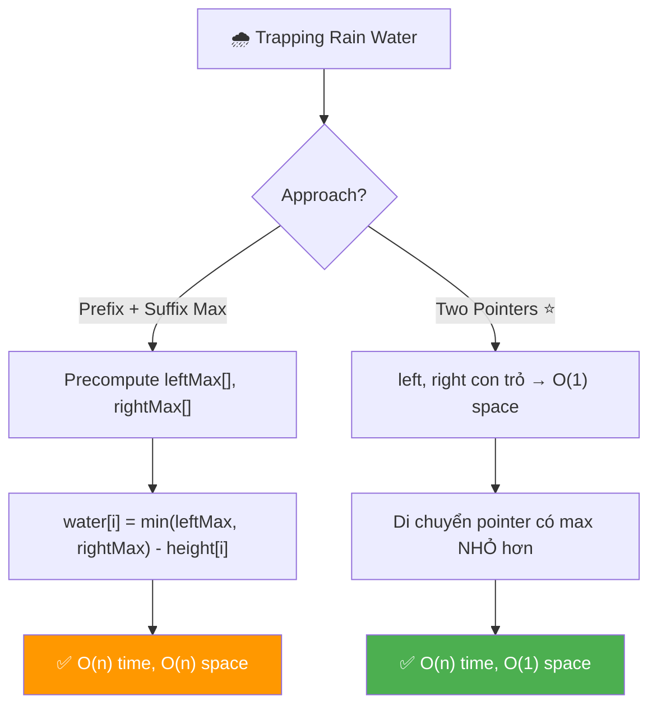
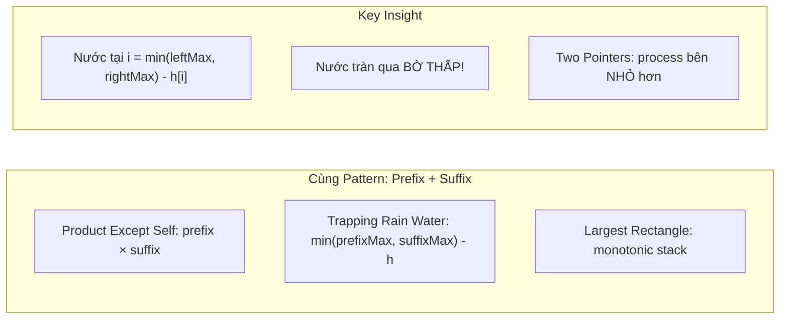
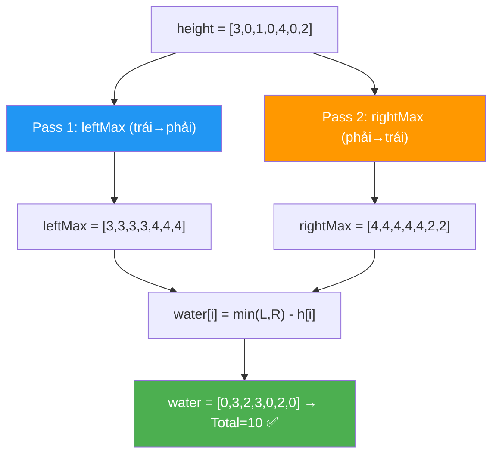
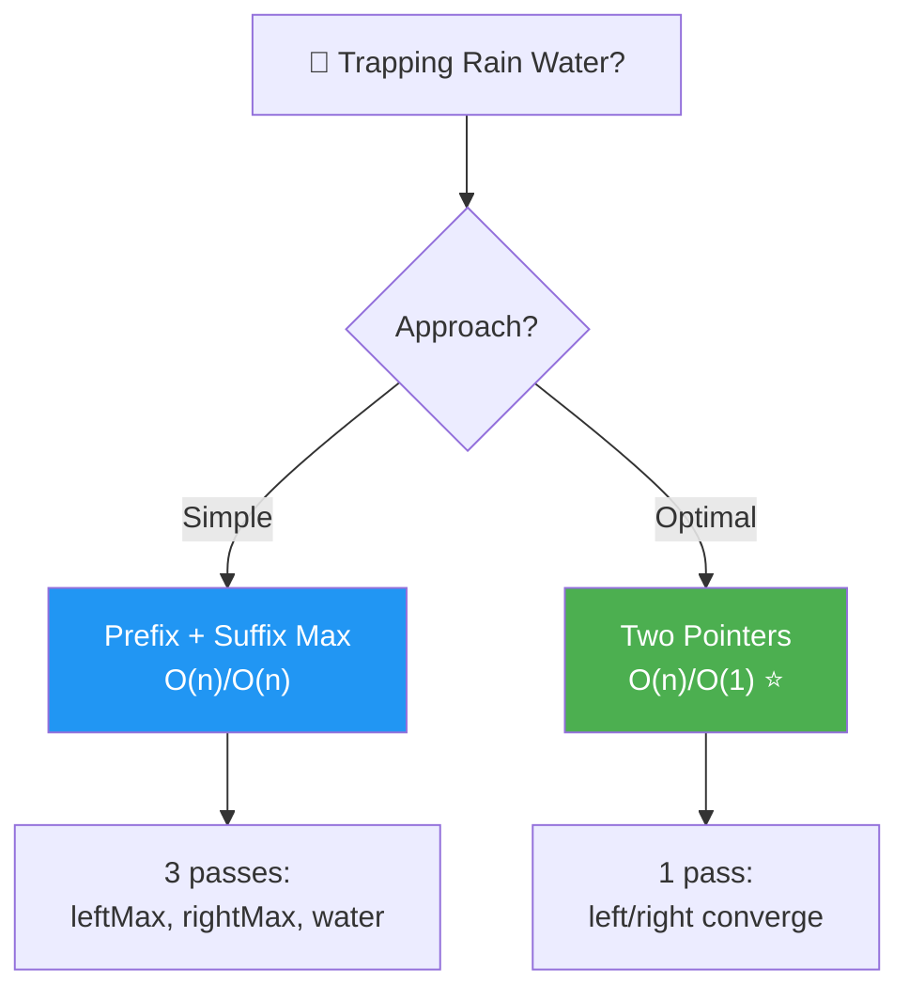
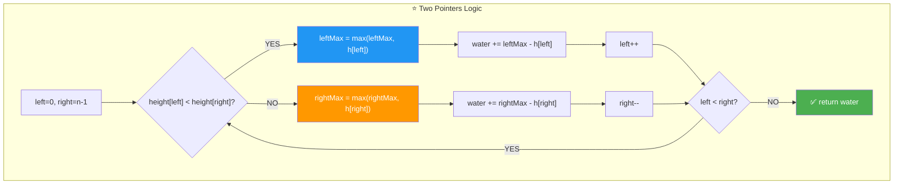
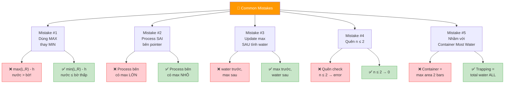
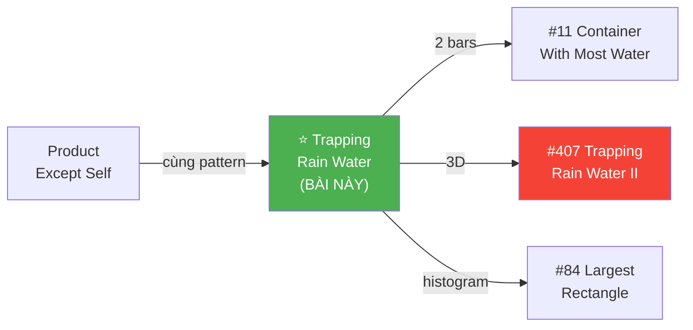
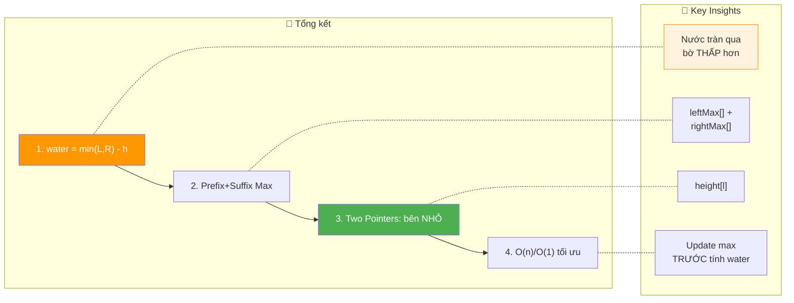

# 🌧️ Trapping Rain Water — GfG / LeetCode #42 (Hard)

> 📖 Code: [Trapping Rain Water.js](./Trapping%20Rain%20Water.js)





---

## R — Repeat & Clarify

🧠 *"Cho mảng height[] đại diện các cột. Tính tổng lượng nước MẮC KẸT giữa các cột sau khi mưa."*

> 🎙️ *"Given an array representing bar heights in an elevation map, compute how much water can be trapped between them after rain."*

### Clarification Questions

```
Q: Nước đọng ở mỗi vị trí i tính bằng gì?
A: water[i] = min(maxBênTrái, maxBênPhải) - height[i]
   → Nước bị giới hạn bởi BỜ THẤP HƠN!
   → Nếu kết quả < 0 → = 0 (cột cao hơn bờ → không đọng!)

Q: Mảng có toàn 0 không?
A: CÓ! → water = 0 (không có cột → không đọng!)

Q: Chiều rộng mỗi cột?
A: 1 đơn vị! → water[i] = chiều CAO nước × 1 = chiều cao!

Q: Phần tử đầu/cuối có đọng nước không?
A: KHÔNG! Cột đầu/cuối không có bờ 1 bên → nước tràn!

Q: Giá trị height có thể âm không?
A: KHÔNG! height[i] ≥ 0 (chiều cao cột).

Q: Nước chỉ đọng theo phương DỌC?
A: ĐÚNG! Mỗi vị trí i tính RIÊNG RẼ. Nước đọng dọc!
```

### Tại sao bài này quan trọng?

```
  ⭐ TOP 5 bài phỏng vấn KINH ĐIỂN NHẤT!
  (Google, Amazon, Facebook, Microsoft — ĐỀU hỏi!)

  BẠN PHẢI hiểu:
  1. Công thức CỐT LÕI: water[i] = min(leftMax, rightMax) - h[i]
  2. Prefix Max / Suffix Max pattern (giống Product Except Self!)
  3. Two Pointers optimization → O(1) space

  ┌───────────────────────────────────────────────────┐
  │  Bài này = ĐỈNH CAO của Prefix/Suffix pattern!    │
  │  Product Except Self: prefix × suffix             │
  │  Trapping Rain Water: min(prefixMax, suffixMax)   │
  │  → CÙNG tư duy "nhìn 2 chiều"!                   │
  │                                                    │
  │  📌 Progression:                                   │
  │    Product Except Self → Trapping Rain Water       │
  │    → Container With Most Water → Trapping Water 3D │
  └───────────────────────────────────────────────────┘
```

---

## 🧠 Bản chất bài toán — Hiểu để NHỚ, không chỉ để GIẢI

### INSIGHT CỐT LÕI: "Nước tràn qua BỜ THẤP!"

```
  ⭐ Ẩn dụ: BỂ NƯỚC giữa 2 BỨC TƯỜNG!

  Tưởng tượng 2 bức tường cao 3m và 5m.
  Bạn đổ nước vào giữa.
  Nước dâng đến bao nhiêu? → 3m (bờ THẤP hơn!)
  → Nước TRÀN qua tường 3m trước khi chạm 5m!

  ┌──────────────────────────────────────────────────────────────┐
  │  TẠI SAO min() KHÔNG PHẢI max()?                            │
  │                                                              │
  │  Nước KHÔNG THỂ cao hơn bờ thấp nhất!                       │
  │  → Mực nước = min(bờ trái cao nhất, bờ phải cao nhất)       │
  │  → Lượng nước = mực nước - chiều cao cột tại vị trí đó     │
  │                                                              │
  │  📌 CÔNG THỨC VÀNG:                                         │
  │  water[i] = min(leftMax[i], rightMax[i]) - height[i]         │
  │                                                              │
  │  leftMax[i] = max(height[0..i])  → bờ trái cao nhất         │
  │  rightMax[i] = max(height[i..n-1]) → bờ phải cao nhất       │
  └──────────────────────────────────────────────────────────────┘
```

### Hình dung trực quan — Elevation Map

```
  height = [3, 0, 1, 0, 4, 0, 2]

  Vẽ cột + nước (. = nước, █ = cột):

          4
    3     █
    █ ~ ~ █       2
    █ ~ █ █ ~ ~ █
    █ . █ . █ . █
    ──────────────────
    0  1  2  3  4  5  6

  Nước đọng:
    i=0: cột đầu → 0 (không có bờ trái!)
    i=1: leftMax=3, rightMax=4 → min=3 → 3-0 = 3 💧
    i=2: leftMax=3, rightMax=4 → min=3 → 3-1 = 2 💧
    i=3: leftMax=3, rightMax=4 → min=3 → 3-0 = 3 💧
    i=4: cột cao nhất → leftMax=rightMax=4 → 4-4 = 0
    i=5: leftMax=4, rightMax=2 → min=2 → 2-0 = 2 💧
    i=6: cột cuối → 0 (không có bờ phải!)

  Total = 0 + 3 + 2 + 3 + 0 + 2 + 0 = 10 ✅
```

### Minh họa BẢNG TRỰC QUAN

```
  height = [3, 0, 1, 0, 4, 0, 2]

  ┌─────┬────────┬──────────┬──────────┬─────────┬──────────┐
  │  i  │ h[i]   │ leftMax  │ rightMax │ min(L,R)│ water    │
  ├─────┼────────┼──────────┼──────────┼─────────┼──────────┤
  │  0  │   3    │    3     │    4     │   3     │ 3-3 = 0  │
  │  1  │   0    │    3     │    4     │   3     │ 3-0 = 3  │
  │  2  │   1    │    3     │    4     │   3     │ 3-1 = 2  │
  │  3  │   0    │    3     │    4     │   3     │ 3-0 = 3  │
  │  4  │   4    │    4     │    4     │   4     │ 4-4 = 0  │
  │  5  │   0    │    4     │    2     │   2     │ 2-0 = 2  │
  │  6  │   2    │    4     │    2     │   2     │ 2-2 = 0  │
  └─────┴────────┴──────────┴──────────┴─────────┴──────────┘
                                              Total = 10 ✅
```



### Tại sao Two Pointers hoạt động?

```
  ⭐ CÂU HỎI QUAN TRỌNG NHẤT CỦA BÀI NÀY!

  Công thức: water[i] = min(leftMax, rightMax) - h[i]
  → CHỈ CẦN BIẾT max NHỎ HƠN!

  Khi height[left] < height[right]:
    → Bờ phải CÓ ÍT NHẤT height[right] > height[left]
    → rightMax ≥ height[right] > height[left] ≥ leftMax (nếu leftMax = height[left])
    → min(leftMax, rightMax) = leftMax!
    → water = leftMax - height[left]
    → KHÔNG CẦN biết rightMax chính xác!

  ┌──────────────────────────────────────────────────────────────┐
  │  Ẩn dụ: 2 BỨC TƯỜNG đang đi về TRUNG TÂM                  │
  │                                                              │
  │  Bạn nhìn từ 2 đầu: tường trái (left) và tường phải (right) │
  │  Nước tại left phụ thuộc BỜ THẤP HƠN.                       │
  │                                                              │
  │  Nếu tường trái < tường phải:                                │
  │    → BỜ THẤP chính là bên trái!                             │
  │    → leftMax quyết định! Tính water rồi đi vào (left++)!    │
  │                                                              │
  │  Nếu tường trái ≥ tường phải:                                │
  │    → BỜ THẤP chính là bên phải!                             │
  │    → rightMax quyết định! Tính water rồi đi vào (right--)!  │
  └──────────────────────────────────────────────────────────────┘
```

---

## 🧭 Luồng Suy Nghĩ — Từ đọc đề đến solution

### Bước 1: Keywords

```
  "trapping rain water" → nước đọng giữa các cột
  "height array" → elevation map
  "total water" → tổng nước ĐỌNG ĐƯỢC

  🧠 "Mỗi vị trí i: nước phụ thuộc max TRÁI + max PHẢI"
    → prefix max + suffix max!
    → GIỐNG pattern Product Except Self!
```

### Bước 2: Brute → Prefix/Suffix → Two Pointers

```
  🧠 Approach 1: Brute Force O(n²)
    Với mỗi i: scan left + scan right tìm max → O(n²)
    → Quá chậm!

  🧠 Approach 2: Prefix/Suffix Max O(n)/O(n)
    Precompute leftMax[] trái→phải, rightMax[] phải→trái
    → O(n) time, O(n) space — 3 passes

  🧠 Approach 3: Two Pointers O(n)/O(1) ⭐
    "Chỉ cần BỜ THẤP HƠN quyết định mực nước!"
    → Process bên có max nhỏ hơn → O(1) space!
```

### Bước 3: Cây quyết định



---

## E — Examples

```
VÍ DỤ 1: height = [3, 0, 1, 0, 4, 0, 2]

  leftMax:  [3, 3, 3, 3, 4, 4, 4]
  rightMax: [4, 4, 4, 4, 4, 2, 2]

  water: [0, 3, 2, 3, 0, 2, 0] → Total = 10 ✅
```

```
VÍ DỤ 2: height = [3, 0, 2, 0, 4]

  leftMax:  [3, 3, 3, 3, 4]
  rightMax: [4, 4, 4, 4, 4]

  water: [0, 3, 1, 3, 0] → Total = 7 ✅
```

```
VÍ DỤ 3: height = [1, 2, 3, 4] (tăng dần)

  leftMax:  [1, 2, 3, 4]
  rightMax: [4, 4, 4, 4]

  water: [0, 0, 0, 0] → Total = 0 ✅
  → Không có "bể" → nước tràn hết!
  → 📌 Mọi leftMax[i] = height[i] → water = 0!
```

```
VÍ DỤ 4: height = [4, 3, 2, 1] (giảm dần)

  leftMax:  [4, 4, 4, 4]
  rightMax: [4, 3, 2, 1]

  water: [0, 0, 0, 0] → Total = 0 ✅
  → Dốc xuống → nước chảy hết bên phải!
  → 📌 Mọi rightMax[i] = height[i] → water = 0!
```

```
VÍ DỤ 5 (Edge): height = [5, 2, 5]    (bể đơn giản)

  leftMax:  [5, 5, 5]
  rightMax: [5, 5, 5]

  water: [0, 3, 0] → Total = 3 ✅
  → 📌 Bể đơn giản nhất: 2 bờ + 1 trũng!
```

---

## A — Approach

### Approach 1: Brute Force — O(n²)

```
💡 Với mỗi i: tìm max bên trái + max bên phải

  for each i:
    leftMax = max(height[0..i])      ← O(n)
    rightMax = max(height[i..n-1])   ← O(n)
    water += min(leftMax, rightMax) - height[i]

  ✅ Đúng, dễ hiểu
  ❌ O(n²) — tính max mỗi i = O(n)
```

### Approach 2: Prefix Max + Suffix Max — O(n) time, O(n) space

```
💡 Precompute leftMax[] và rightMax[]

  Pass 1 (trái→phải): leftMax[i] = max(height[0..i])
  Pass 2 (phải→trái): rightMax[i] = max(height[i..n-1])
  Pass 3: water += min(leftMax[i], rightMax[i]) - height[i]

  ✅ O(n) time — 3 passes
  ❌ O(n) space — 2 mảng phụ
```

### Approach 3: Two Pointers — O(n) time, O(1) space ⭐

```
💡 Dùng left/right pointers + leftMax/rightMax biến!

  left=0, right=n-1
  leftMax=0, rightMax=0

  while (left < right):
    if (height[left] < height[right]):
      leftMax = max(leftMax, height[left])
      water += leftMax - height[left]
      left++
    else:
      rightMax = max(rightMax, height[right])
      water += rightMax - height[right]
      right--

  ✅ O(n) time, O(1) space — TỐI ƯU!
```

### So sánh

```
  ┌──────────────────────────┬──────────┬──────────┬──────────────┐
  │                          │ Time     │ Space    │ Ghi chú       │
  ├──────────────────────────┼──────────┼──────────┼──────────────┤
  │ Brute Force              │ O(n²)    │ O(1)     │ Quá chậm      │
  │ Prefix + Suffix Max      │ O(n)     │ O(n)     │ Dễ hiểu       │
  │ Two Pointers ⭐          │ O(n)     │ O(1)     │ Tối ưu!       │
  └──────────────────────────┴──────────┴──────────┴──────────────┘
```

---

## C — Code ✅

### Solution 1: Prefix Max + Suffix Max — O(n) time, O(n) space

```javascript
function trapPrefixSuffix(height) {
  const n = height.length;
  if (n <= 2) return 0;

  const leftMax = new Array(n);
  const rightMax = new Array(n);

  // Pass 1: Left max (trái → phải)
  leftMax[0] = height[0];
  for (let i = 1; i < n; i++) {
    leftMax[i] = Math.max(leftMax[i - 1], height[i]);
  }

  // Pass 2: Right max (phải → trái)
  rightMax[n - 1] = height[n - 1];
  for (let i = n - 2; i >= 0; i--) {
    rightMax[i] = Math.max(rightMax[i + 1], height[i]);
  }

  // Pass 3: Tính water
  let water = 0;
  for (let i = 0; i < n; i++) {
    water += Math.min(leftMax[i], rightMax[i]) - height[i];
  }

  return water;
}
```

### Solution 2: Two Pointers — O(n) time, O(1) space ⭐

```javascript
function trap(height) {
  const n = height.length;
  if (n <= 2) return 0;

  let left = 0,
    right = n - 1;
  let leftMax = 0,
    rightMax = 0;
  let water = 0;

  while (left < right) {
    if (height[left] < height[right]) {
      // Bờ TRÁI thấp hơn → xử lý left
      leftMax = Math.max(leftMax, height[left]);
      water += leftMax - height[left];
      left++;
    } else {
      // Bờ PHẢI thấp hơn → xử lý right
      rightMax = Math.max(rightMax, height[right]);
      water += rightMax - height[right];
      right--;
    }
  }

  return water;
}
```

---

## 🔬 Deep Dive — Giải thích CHI TIẾT

> 💡 Phân tích **từng dòng** Prefix/Suffix rồi Two Pointers.

### Deep Dive: Prefix/Suffix Max

```javascript
function trapPrefixSuffix(height) {
  const n = height.length;
  // ═══════════════════════════════════════════════════════════
  // n ≤ 2: KHÔNG THỂ đọng nước!
  // ═══════════════════════════════════════════════════════════
  //
  // Cần ít nhất 3 cột: 2 bờ + 1 trũng!
  // [5, 2] → 2 cột → nước tràn hết!
  //
  if (n <= 2) return 0;

  const leftMax = new Array(n);
  const rightMax = new Array(n);

  // ═══════════════════════════════════════════════════════════
  // Pass 1: leftMax[i] = max(height[0], ..., height[i])
  // ═══════════════════════════════════════════════════════════
  //
  // leftMax[i] = cột CAO NHẤT từ đầu mảng đến i
  // = "bờ trái cao nhất" cho vị trí i!
  //
  // TẠI SAO include height[i]?
  //   → Nếu height[i] là CAO NHẤT → leftMax = height[i]
  //   → water = min(height[i], rightMax) - height[i] ≥ 0
  //   → KHÔNG CẦN max(0, ...)!
  //
  leftMax[0] = height[0];
  for (let i = 1; i < n; i++) {
    leftMax[i] = Math.max(leftMax[i - 1], height[i]);
  }

  // ═══════════════════════════════════════════════════════════
  // Pass 2: rightMax[i] = max(height[i], ..., height[n-1])
  // ═══════════════════════════════════════════════════════════
  //
  // rightMax[i] = cột CAO NHẤT từ i đến cuối mảng
  // = "bờ phải cao nhất" cho vị trí i!
  //
  rightMax[n - 1] = height[n - 1];
  for (let i = n - 2; i >= 0; i--) {
    rightMax[i] = Math.max(rightMax[i + 1], height[i]);
  }

  // ═══════════════════════════════════════════════════════════
  // Pass 3: Tính tổng nước
  // ═══════════════════════════════════════════════════════════
  //
  // water[i] = min(leftMax[i], rightMax[i]) - height[i]
  //
  // min(L,R) = MỰC NƯỚC (bờ thấp hơn!)
  // height[i] = CHIỀU CAO CỘT
  // water = mực nước - chiều cao = LƯỢNG NƯỚC ĐỌNG!
  //
  // ⚠️ Luôn ≥ 0 vì leftMax[i] ≥ height[i] và rightMax[i] ≥ height[i]
  //    → min(L,R) ≥ height[i]!
  //
  let water = 0;
  for (let i = 0; i < n; i++) {
    water += Math.min(leftMax[i], rightMax[i]) - height[i];
  }
  return water;
}
```

### Deep Dive: Two Pointers ⭐

```javascript
function trap(height) {
  const n = height.length;
  if (n <= 2) return 0;

  // ═══════════════════════════════════════════════════════════
  // 2 pointers + 2 max variables
  // ═══════════════════════════════════════════════════════════
  //
  // left: con trỏ từ TRÁI đi vào
  // right: con trỏ từ PHẢI đi vào
  // leftMax: height CAO NHẤT bên trái (đến left)
  // rightMax: height CAO NHẤT bên phải (đến right)
  //
  // TẠI SAO init = 0?
  //   → Chưa gặp cột nào → max = 0!
  //   → Sẽ update ngay ở step đầu tiên!
  //
  let left = 0, right = n - 1;
  let leftMax = 0, rightMax = 0;
  let water = 0;

  while (left < right) {
    // ═══════════════════════════════════════════════════════
    // KEY DECISION: process bên có height NHỎ HƠN!
    // ═══════════════════════════════════════════════════════
    //
    // TẠI SAO so sánh height[left] vs height[right]?
    //
    //   Nếu height[left] < height[right]:
    //     → BỜ PHẢI có ít nhất height[right] > height[left]
    //     → rightMax ≥ height[right] > height[left]
    //     → min(leftMax, rightMax) = leftMax! (CHẮC CHẮN!)
    //     → water tại left = leftMax - height[left]
    //     → Tính được mà KHÔNG CẦN biết rightMax!
    //
    //   Ngược lại → tính water tại right mà KHÔNG CẦN leftMax!
    //
    if (height[left] < height[right]) {
      // ─── Process LEFT ───
      //
      // Update leftMax: có thể height[left] là max mới!
      // ⚠️ Update TRƯỚC rồi mới tính water!
      //    (nếu height[left] = max mới → water = 0, ĐÚNG!)
      //
      leftMax = Math.max(leftMax, height[left]);
      water += leftMax - height[left];
      left++;
    } else {
      // ─── Process RIGHT ───
      // Tương tự bên trái, nhưng từ phải!
      //
      rightMax = Math.max(rightMax, height[right]);
      water += rightMax - height[right];
      right--;
    }
  }

  return water;
}
```



### Trace CHI TIẾT Prefix/Suffix: height = [3, 0, 1, 0, 4, 0, 2]

```
  n = 7

  ═══ Pass 1: leftMax (trái → phải) ══════════════════

  leftMax[0] = 3
  leftMax[1] = max(3, 0) = 3
  leftMax[2] = max(3, 1) = 3
  leftMax[3] = max(3, 0) = 3
  leftMax[4] = max(3, 4) = 4
  leftMax[5] = max(4, 0) = 4
  leftMax[6] = max(4, 2) = 4

  leftMax = [3, 3, 3, 3, 4, 4, 4]

  ═══ Pass 2: rightMax (phải → trái) ═════════════════

  rightMax[6] = 2
  rightMax[5] = max(2, 0) = 2
  rightMax[4] = max(2, 4) = 4
  rightMax[3] = max(4, 0) = 4
  rightMax[2] = max(4, 1) = 4
  rightMax[1] = max(4, 0) = 4
  rightMax[0] = max(4, 3) = 4

  rightMax = [4, 4, 4, 4, 4, 2, 2]

  ═══ Pass 3: Tính water ═════════════════════════════

  i=0: min(3, 4) - 3 = 3 - 3 = 0
  i=1: min(3, 4) - 0 = 3 - 0 = 3
  i=2: min(3, 4) - 1 = 3 - 1 = 2
  i=3: min(3, 4) - 0 = 3 - 0 = 3
  i=4: min(4, 4) - 4 = 4 - 4 = 0
  i=5: min(4, 2) - 0 = 2 - 0 = 2
  i=6: min(4, 2) - 2 = 2 - 2 = 0

  Total = 0 + 3 + 2 + 3 + 0 + 2 + 0 = 10 ✅
```

### Trace CHI TIẾT Two Pointers: height = [3, 0, 1, 0, 4, 0, 2]

```
  l=0, r=6, lMax=0, rMax=0, water=0

  ┌──────┬───────┬───────┬────────┬──────────┬───────┬──────────────────────┐
  │ Step │ l     │ r     │ lMax   │ rMax     │ water │ Reason               │
  ├──────┼───────┼───────┼────────┼──────────┼───────┼──────────────────────┤
  │      │ h[0]=3│ h[6]=2│        │          │       │                      │
  │ 1    │ 0     │ 5     │ 0      │ max(0,2) │ 0+0=0│ 3≥2 → process RIGHT │
  │      │       │       │        │ =2       │       │ rMax=2, 2-2=0        │
  │      │ h[0]=3│ h[5]=0│        │          │       │                      │
  │ 2    │ 0     │ 4     │ 0      │ max(2,0) │ 0+2=2│ 3≥0 → process RIGHT │
  │      │       │       │        │ =2       │       │ rMax=2, 2-0=2        │
  │      │ h[0]=3│ h[4]=4│        │          │       │                      │
  │ 3    │ 1     │ 4     │ max(0,3)│ 2       │ 2+0=2│ 3<4 → process LEFT  │
  │      │       │       │ =3     │          │       │ lMax=3, 3-3=0        │
  │      │ h[1]=0│ h[4]=4│        │          │       │                      │
  │ 4    │ 2     │ 4     │ max(3,0)│ 2       │ 2+3=5│ 0<4 → process LEFT  │
  │      │       │       │ =3     │          │       │ lMax=3, 3-0=3        │
  │      │ h[2]=1│ h[4]=4│        │          │       │                      │
  │ 5    │ 3     │ 4     │ max(3,1)│ 2       │ 5+2=7│ 1<4 → process LEFT  │
  │      │       │       │ =3     │          │       │ lMax=3, 3-1=2        │
  │      │ h[3]=0│ h[4]=4│        │          │       │                      │
  │ 6    │ 4     │ 4     │ max(3,0)│ 2       │ 7+3  │ 0<4 → process LEFT  │
  │      │       │       │ =3     │          │ =10  │ lMax=3, 3-0=3        │
  └──────┴───────┴───────┴────────┴──────────┴───────┴──────────────────────┘

  l(4) ≥ r(4) → STOP! water = 10 ✅
```

---

## 📐 Invariant — Chứng minh tính đúng đắn

```
  📐 INVARIANT cho Two Pointers:

  Tại mỗi iteration:

  1. leftMax = max(height[0..left-1]) (đã xử lý)
  2. rightMax = max(height[right+1..n-1]) (đã xử lý)
  3. Tất cả vị trí 0..left-1 và right+1..n-1 đã tính water ĐÚNG!

  CHỨNG MINH cho trường hợp process LEFT:
  ┌──────────────────────────────────────────────────────────────┐
  │  Khi height[left] < height[right]:                          │
  │                                                              │
  │  true_rightMax = max(height[left+1..n-1])                   │
  │               ≥ height[right]  (vì right ∈ [left+1, n-1])  │
  │               > height[left]   (vì height[left] < height[right]) │
  │               ≥ leftMax        (nếu leftMax ≤ height[left]) │
  │                                                              │
  │  → min(leftMax, true_rightMax) = leftMax!                    │
  │  → water[left] = leftMax - height[left] ✅                  │
  │                                                              │
  │  Tương tự cho process RIGHT:                                 │
  │  Khi height[left] ≥ height[right]:                          │
  │  → true_leftMax ≥ height[left] ≥ height[right]             │
  │  → min(true_leftMax, rightMax) = rightMax!                   │
  │  → water[right] = rightMax - height[right] ✅               │
  └──────────────────────────────────────────────────────────────┘

  📐 TERMINATION:
    Mỗi step: left++ hoặc right--
    → left + (n-1-right) tăng 1 mỗi step
    → Tối đa n-1 steps → terminate! ∎

  📐 COMPLETENESS:
    Mỗi vị trí 0..n-1 được xử lý đúng 1 lần
    (trừ vị trí left=right khi dừng → water=0 tại đó!)
    → Tổng water = Σwater[i] cho i = 0..n-1 ✅ ∎
```

---

## ❌ Common Mistakes — Lỗi thường gặp



### Mistake 1: Dùng MAX thay vì MIN!

```javascript
// ❌ SAI: nước KHÔNG THỂ cao hơn bờ thấp!
water += Math.max(leftMax[i], rightMax[i]) - height[i];
// height = [3, 0, 5]: max(3,5)-0 = 5 → SAI! Nước chỉ đến 3!

// ✅ ĐÚNG: bờ THẤP quyết định!
water += Math.min(leftMax[i], rightMax[i]) - height[i];
// min(3,5)-0 = 3 → ĐÚNG!
```

### Mistake 2: Two Pointers — process SAI bên!

```javascript
// ❌ SAI: process bên có max LỚN hơn!
if (height[left] > height[right]) {
  // process LEFT → leftMax CHƯA CHẮC = bottleneck!
  leftMax = Math.max(leftMax, height[left]);
  water += leftMax - height[left];  // CÓ THỂ SAI!
  left++;
}

// ✅ ĐÚNG: process bên có height NHỎ hơn!
if (height[left] < height[right]) {
  leftMax = Math.max(leftMax, height[left]);
  water += leftMax - height[left];  // leftMax = bottleneck ✅
  left++;
}
```

### Mistake 3: Update max SAU khi tính water!

```javascript
// ❌ SAI: tính water trước khi update max!
water += leftMax - height[left];  // leftMax chưa bao gồm height[left]!
leftMax = Math.max(leftMax, height[left]);  // quá muộn!
// VD: height[left]=5 là max mới → water = oldMax - 5 → CÓ THỂ ÂM!

// ✅ ĐÚNG: update max TRƯỚC!
leftMax = Math.max(leftMax, height[left]);
water += leftMax - height[left];  // leftMax luôn ≥ height[left] → ≥ 0!
```

### Mistake 4: Quên n ≤ 2!

```javascript
// ❌ SAI: array rỗng hoặc 1-2 phần tử → crash hoặc sai!
const leftMax = new Array(n);  // n=0 → empty → ok
// nhưng nên early return cho clarity!

// ✅ ĐÚNG:
if (n <= 2) return 0;  // cần ≥ 3 để đọng nước!
```

### Mistake 5: Nhầm với Container With Most Water (#11)!

```
  ❌ NHẦM:
    #42 Trapping Rain Water: TỔNG nước ĐỌG giữa TẤT CẢ cột!
    #11 Container Most Water: MAX nước giữa ĐÚNG 2 cột!

  #42: Cộng water TẤT CẢ vị trí → tổng nước!
  #11: Tìm 2 cột tạo bể CHỨA nước NHIỀU NHẤT!

  Cùng Two Pointers nhưng KHÁC logic:
    #42: process bên nhỏ → tính water mỗi step
    #11: process bên nhỏ → tính area = min(h[l],h[r]) × (r-l)

  📌 ĐỪNG NHẦM!
```

---

## O — Optimize

```
                       Time      Space     Ghi chú
  ──────────────────────────────────────────────────
  Brute Force          O(n²)     O(1)      Quá chậm
  Prefix+Suffix Max    O(n)      O(n)      Dễ hiểu
  Two Pointers ⭐      O(n)      O(1)      Tối ưu!

  ⚠️ O(n) là TỐI ƯU:
    Phải đọc mọi phần tử → Ω(n) lower bound!
    Two Pointers: 1 pass, 2 biến extra → O(1)!
```

### Complexity chính xác — Đếm operations

```
  Prefix/Suffix Max:
    Pass 1: n comparisons (leftMax)
    Pass 2: n comparisons (rightMax)
    Pass 3: n min + n subtract + n add
    TỔNG: 5n operations, 2n space

  Two Pointers:
    1 pass: n-1 iterations
    Mỗi iteration: 1 comparison + 1 max + 1 subtract + 1 add
    TỔNG: 4(n-1) operations, 4 variables

  📊 So sánh (n = 10⁶):
    Prefix: 5×10⁶ ops, ~16MB RAM (2 arrays)
    TwoPtr: 4×10⁶ ops, 32 bytes RAM ⭐
    Brute:  10¹² ops 💀
```

---

## T — Test

```
Test Cases:
  [3, 0, 1, 0, 4, 0, 2]  → 10   ✅ ví dụ gốc
  [3, 0, 2, 0, 4]         → 7    ✅ ví dụ 2
  [1, 2, 3, 4]            → 0    ✅ tăng dần → tràn!
  [4, 3, 2, 1]            → 0    ✅ giảm dần → tràn!
  [0, 1, 0, 2, 1, 0, 3]   → 4    ✅ LeetCode example
  []                      → 0    ✅ rỗng
  [5]                     → 0    ✅ 1 phần tử
  [5, 2]                  → 0    ✅ 2 phần tử
  [5, 2, 5]               → 3    ✅ bể đơn giản
  [2, 0, 2]               → 2    ✅ bể nhỏ
  [0, 0, 0]               → 0    ✅ all zeros
```

---

## 🗣️ Interview Script

### 🎙️ Think Out Loud — Mô phỏng phỏng vấn thực

```
  ──────────────── PHASE 1: Clarify ────────────────

  👤 Interviewer: "Given an elevation map, compute how much
                   water can be trapped after raining."

  🧑 You: "Let me clarify:
   1. Each element is a bar height, non-negative.
   2. Bar width is 1. Water volume = water height × 1.
   3. I need total water across ALL positions.
   4. First and last bars can't trap water (no outer wall)."

  ──────────────── PHASE 2: Examples ────────────────

  🧑 You: "height = [3, 0, 1, 0, 4, 0, 2].
   At index 1: left max = 3, right max = 4.
   Water = min(3,4) - 0 = 3.
   Repeating this for all positions gives total = 10."

  ──────────────── PHASE 3: Approach ────────────────

  🧑 You: "The water at each position i equals:
   min(tallest bar to its left, tallest to its right) - height[i].

   Brute force: O(n²) — recalculate max each time.

   Better: precompute leftMax[] left-to-right and rightMax[]
   right-to-left. Then one pass to sum water. O(n) time, O(n) space.

   Optimal: two pointers. I keep left/right pointers and track
   leftMax/rightMax. I always process the side with the smaller
   boundary, because that's the bottleneck. O(n) time, O(1) space."

  ──────────────── PHASE 4: Code + Verify ────────────────

  🧑 You: [writes Two Pointers code]

  "Key: update max BEFORE computing water. And I compare
   height[left] vs height[right], not leftMax vs rightMax.
   When height[left] < height[right], I know rightMax ≥ height[right]
   > height[left] ≥ leftMax... actually leftMax is what determines
   the water here."

  ──────────────── PHASE 5: Follow-ups ────────────────

  👤 "How does this differ from Container With Most Water?"
  🧑 "#11 finds the max water between just TWO bars.
      #42 sums water at ALL positions. Both use two pointers
      but with different logic."

  👤 "What about 2D trapping rain water?"
  🧑 "LeetCode #407 — much harder! You need BFS with a
      priority queue, processing from the border inward.
      The lowest border cell determines the water level."

  👤 "Could you use a monotonic stack?"
  🧑 "Yes! Process bars left-to-right, maintaining a decreasing
      stack. When you hit a taller bar, pop and calculate water
      layer by layer. Same O(n) time, O(n) space."
```

---

## 📚 Bài tập liên quan — Practice Problems

### Progression Path



### 1. Container With Most Water (#11) — Medium

```
  Đề: Tìm 2 cột tạo bể chứa NHIỀU nước nhất.

  function maxArea(height) {
    let left = 0, right = height.length - 1;
    let max = 0;
    while (left < right) {
      const area = Math.min(height[left], height[right]) * (right - left);
      max = Math.max(max, area);
      if (height[left] < height[right]) left++;
      else right--;
    }
    return max;
  }

  📌 So sánh:
    #42 (bài này): TỔNG nước TẤT CẢ vị trí
    #11: MAX nước giữa ĐÚNG 2 cột
    Cùng Two Pointers, KHÁC logic!
```

### 2. Largest Rectangle in Histogram (#84) — Hard

```
  Đề: Tìm hình chữ nhật LỚN NHẤT trong histogram.

  function largestRectangleArea(heights) {
    const stack = [];
    let maxArea = 0;
    heights.push(0);  // sentinel

    for (let i = 0; i < heights.length; i++) {
      while (stack.length && heights[i] < heights[stack[stack.length-1]]) {
        const h = heights[stack.pop()];
        const w = stack.length ? i - stack[stack.length-1] - 1 : i;
        maxArea = Math.max(maxArea, h * w);
      }
      stack.push(i);
    }
    return maxArea;
  }

  📌 Monotonic Stack! Cùng "elevation map" nhưng bài khác!
```

### 3. Product of Array Except Self (#238) — Medium

```
  Đề: Output[i] = tích tất cả phần tử TRỪ arr[i].

  function productExceptSelf(nums) {
    const n = nums.length;
    const result = new Array(n).fill(1);

    let prefix = 1;
    for (let i = 0; i < n; i++) {
      result[i] *= prefix;
      prefix *= nums[i];
    }

    let suffix = 1;
    for (let i = n - 1; i >= 0; i--) {
      result[i] *= suffix;
      suffix *= nums[i];
    }
    return result;
  }

  📌 CÙNG PATTERN! prefix × suffix thay vì min(prefixMax, suffixMax)!
```

### Tổng kết — Prefix/Suffix Pattern Family

```
  ┌──────────────────────────────────────────────────────────────┐
  │  BÀI                     │  Prefix op  │  Suffix op         │
  ├──────────────────────────────────────────────────────────────┤
  │  Trapping Rain Water ⭐  │  Max        │  Max → min(L,R)   │
  │  Product Except Self     │  Multiply   │  Multiply          │
  │  Container Most Water    │  Two Pointers (không prefix!)    │
  │  Largest Rectangle       │  Monotonic Stack                 │
  │  Trapping Water 3D       │  BFS + Priority Queue           │
  └──────────────────────────────────────────────────────────────┘

  📌 RULE: "Cần info từ 2 chiều (trái+phải)?
     → Prefix + Suffix!"
     → Two Pointers nếu cần O(1) space!
```

### Skeleton code — Reusable Prefix/Suffix template

```javascript
// TEMPLATE: Prefix + Suffix pattern
function prefixSuffixPattern(arr) {
  const n = arr.length;

  // Pass 1: prefix (left → right)
  const prefix = new Array(n);
  prefix[0] = arr[0];
  for (let i = 1; i < n; i++) {
    prefix[i] = OPERATION(prefix[i-1], arr[i]);
    // OPERATION = Math.max (Trapping), multiply (Product), etc.
  }

  // Pass 2: suffix (right → left)
  const suffix = new Array(n);
  suffix[n-1] = arr[n-1];
  for (let i = n - 2; i >= 0; i--) {
    suffix[i] = OPERATION(suffix[i+1], arr[i]);
  }

  // Pass 3: combine
  let result = 0;
  for (let i = 0; i < n; i++) {
    result += COMBINE(prefix[i], suffix[i]) - arr[i];
    // COMBINE = Math.min (Trapping), multiply (Product), etc.
  }
  return result;
}

// Trapping: OPERATION = Math.max, COMBINE = Math.min
// Product:  OPERATION = ×, COMBINE = ×
```

---

## 📊 Tổng kết — Key Insights



```
  ┌──────────────────────────────────────────────────────────────────────────┐
  │  📌 3 ĐIỀU PHẢI NHỚ                                                    │
  │                                                                          │
  │  1. CÔNG THỨC VÀNG:                                                     │
  │     water[i] = min(leftMax[i], rightMax[i]) - height[i]                │
  │     → Nước tràn qua BỜ THẤP! min() KHÔNG phải max()!                  │
  │     → leftMax ≥ h[i], rightMax ≥ h[i] → kết quả ≥ 0!                 │
  │                                                                          │
  │  2. TWO POINTERS: process bên có height NHỎ HƠN!                      │
  │     → height[left] < height[right] → process LEFT                      │
  │     → Vì rightMax ≥ height[right] > height[left]                       │
  │     → min(leftMax, rightMax) = leftMax → tính được!                    │
  │     → Update max TRƯỚC rồi mới tính water!                            │
  │                                                                          │
  │  3. PATTERN: Prefix/Suffix → Two Pointers!                              │
  │     → Bước 1: Prefix/Suffix arrays → O(n)/O(n) → DỄ HIỂU             │
  │     → Bước 2: Two Pointers → O(n)/O(1) → TỐI ƯU                      │
  │     → Cùng pattern: Product Except Self, Container Most Water!         │
  └──────────────────────────────────────────────────────────────────────────┘
```

---

## 📝 Flashcard — Tự kiểm tra

| ❓ Câu hỏi | ✅ Đáp án |
|---|---|
| Công thức cốt lõi? | `water[i] = min(leftMax, rightMax) - height[i]` |
| Tại sao MIN? | Nước tràn qua **bờ thấp hơn**! |
| Prefix+Suffix: time/space? | **O(n) / O(n)** |
| Two Pointers: time/space? | **O(n) / O(1)** ⭐ |
| Two Pointers: process bên nào? | Bên có **height nhỏ hơn** |
| Tại sao process bên nhỏ? | Bên nhỏ = **bottleneck** → quyết định mực nước |
| Update max trước hay sau water? | **TRƯỚC** (đảm bảo ≥ 0!) |
| Tăng dần → water? | **0** (nước tràn hết bên trái) |
| Giảm dần → water? | **0** (nước tràn hết bên phải) |
| Bài cùng pattern? | **Product Except Self** (prefix × suffix) |
| #42 vs #11? | #42: **tổng** water ALL. #11: **max** water 2 bars |
| LeetCode nào? | **#42** Trapping Rain Water |
