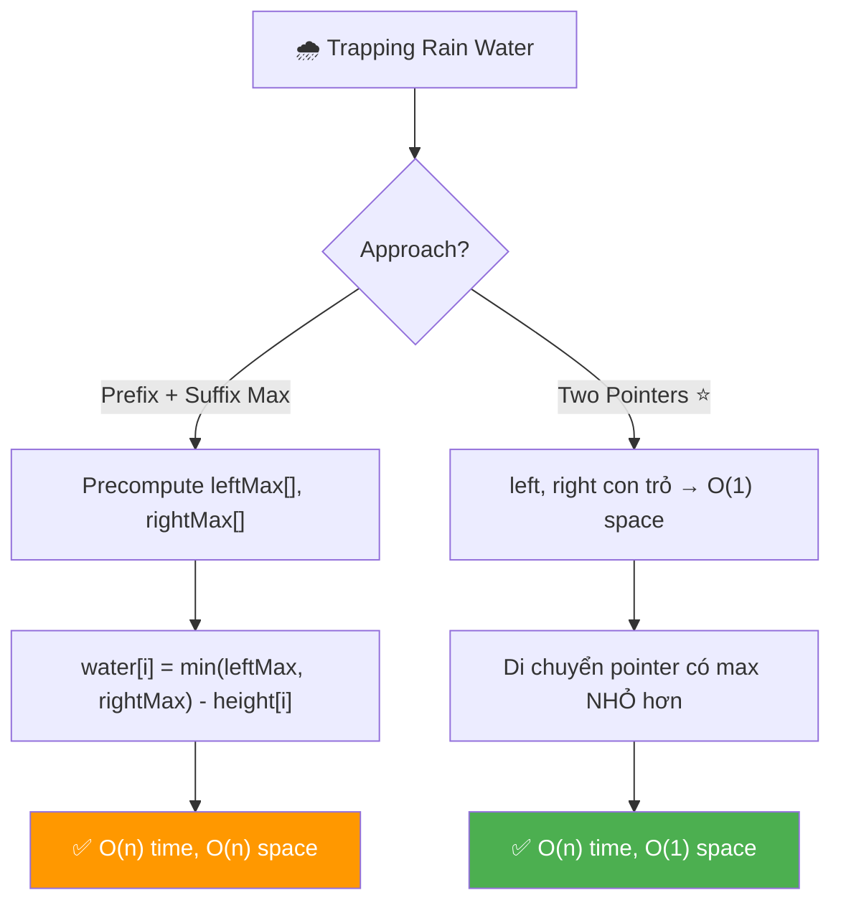
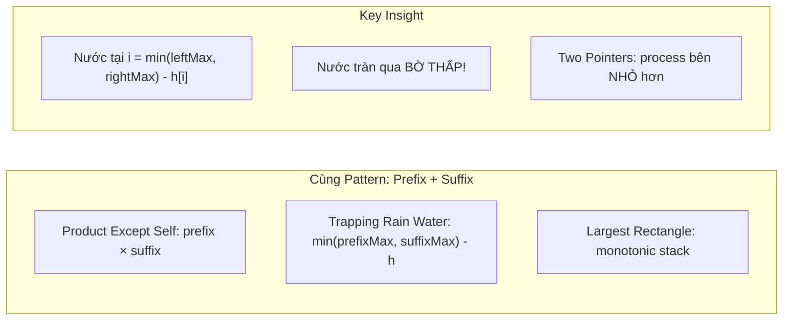
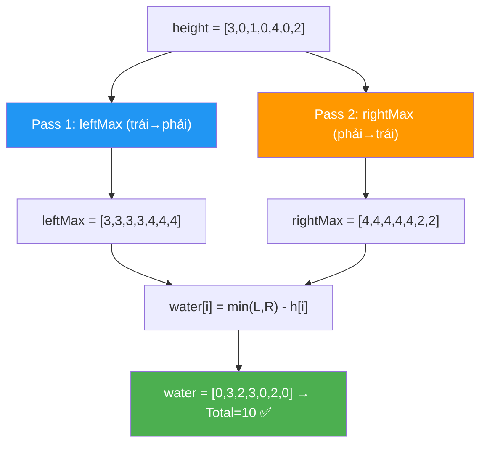
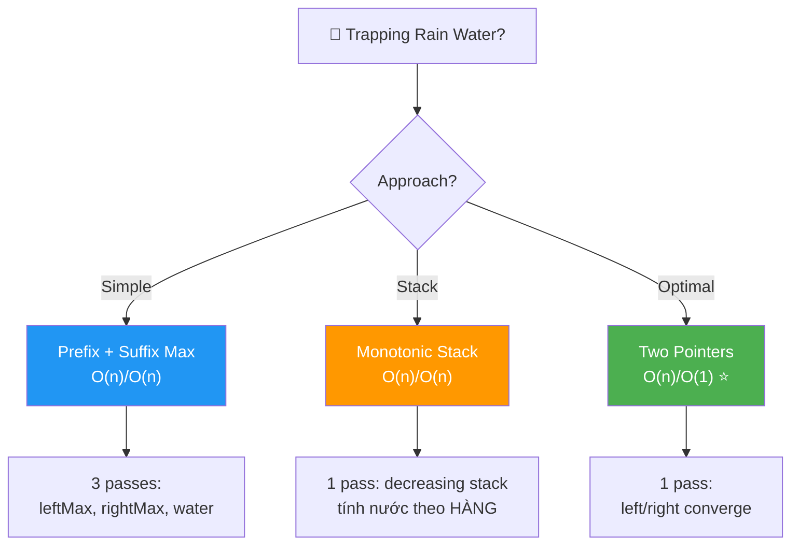
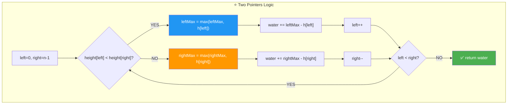
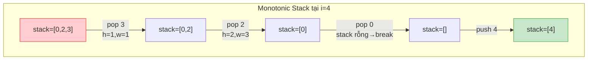
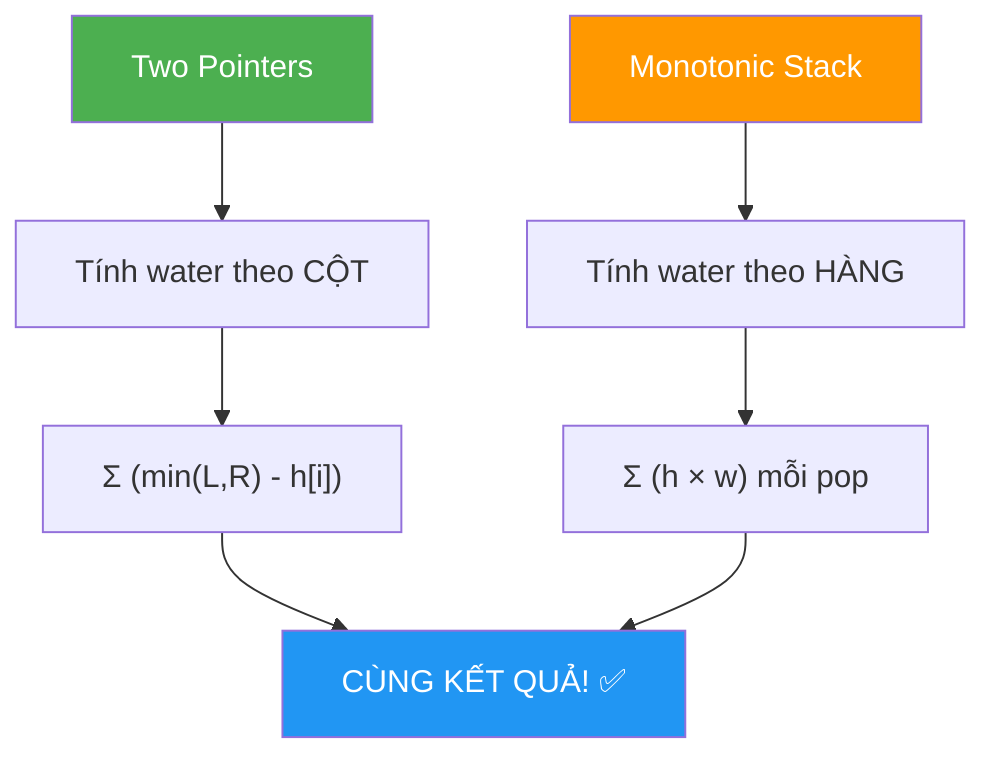
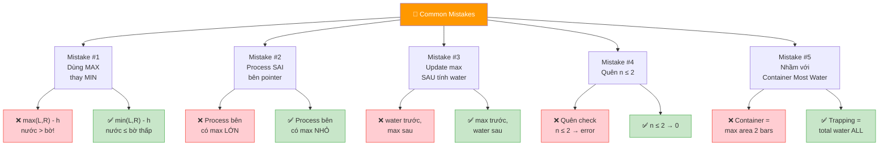
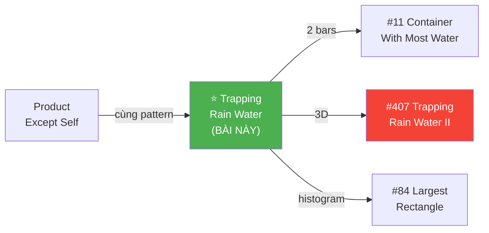
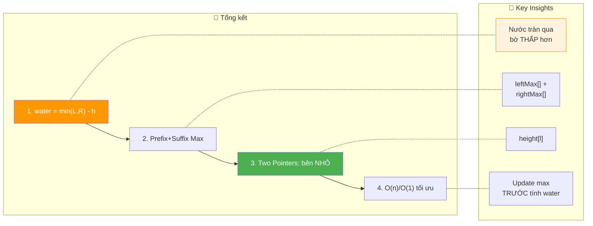

# 🌧️ Trapping Rain Water — GfG / LeetCode #42 (Hard)

> 📖 Code: [Trapping Rain Water.js](./Trapping%20Rain%20Water.js)





---

## R — Repeat & Clarify

🧠 *"Cho mảng height[] đại diện các cột. Tính tổng lượng nước MẮC KẸT giữa các cột sau khi mưa."*

> 🎙️ *"Given an array representing bar heights in an elevation map, compute how much water can be trapped between them after rain."*

### Clarification Questions

```
Q: Nước đọng ở mỗi vị trí i tính bằng gì?
A: water[i] = min(maxBênTrái, maxBênPhải) - height[i]
   → Nước bị giới hạn bởi BỜ THẤP HƠN!
   → Nếu kết quả < 0 → = 0 (cột cao hơn bờ → không đọng!)

Q: Mảng có toàn 0 không?
A: CÓ! → water = 0 (không có cột → không đọng!)

Q: Chiều rộng mỗi cột?
A: 1 đơn vị! → water[i] = chiều CAO nước × 1 = chiều cao!

Q: Phần tử đầu/cuối có đọng nước không?
A: KHÔNG! Cột đầu/cuối không có bờ 1 bên → nước tràn!

Q: Giá trị height có thể âm không?
A: KHÔNG! height[i] ≥ 0 (chiều cao cột).

Q: Nước chỉ đọng theo phương DỌC?
A: ĐÚNG! Mỗi vị trí i tính RIÊNG RẼ. Nước đọng dọc!
```

### Tại sao bài này quan trọng?

```
  ⭐ TOP 5 bài phỏng vấn KINH ĐIỂN NHẤT!
  (Google, Amazon, Facebook, Microsoft — ĐỀU hỏi!)

  BẠN PHẢI hiểu:
  1. Công thức CỐT LÕI: water[i] = min(leftMax, rightMax) - h[i]
  2. Prefix Max / Suffix Max pattern (giống Product Except Self!)
  3. Two Pointers optimization → O(1) space

  ┌───────────────────────────────────────────────────┐
  │  Bài này = ĐỈNH CAO của Prefix/Suffix pattern!    │
  │  Product Except Self: prefix × suffix             │
  │  Trapping Rain Water: min(prefixMax, suffixMax)   │
  │  → CÙNG tư duy "nhìn 2 chiều"!                   │
  │                                                    │
  │  📌 Progression:                                   │
  │    Product Except Self → Trapping Rain Water       │
  │    → Container With Most Water → Trapping Water 3D │
  └───────────────────────────────────────────────────┘
```

---

## 🧠 Bản chất bài toán — Hiểu để NHỚ, không chỉ để GIẢI

### INSIGHT CỐT LÕI: "Nước tràn qua BỜ THẤP!"

```
  ⭐ Ẩn dụ: BỂ NƯỚC giữa 2 BỨC TƯỜNG!

  Tưởng tượng 2 bức tường cao 3m và 5m.
  Bạn đổ nước vào giữa.
  Nước dâng đến bao nhiêu? → 3m (bờ THẤP hơn!)
  → Nước TRÀN qua tường 3m trước khi chạm 5m!

  ┌──────────────────────────────────────────────────────────────┐
  │  TẠI SAO min() KHÔNG PHẢI max()?                            │
  │                                                              │
  │  Nước KHÔNG THỂ cao hơn bờ thấp nhất!                       │
  │  → Mực nước = min(bờ trái cao nhất, bờ phải cao nhất)       │
  │  → Lượng nước = mực nước - chiều cao cột tại vị trí đó     │
  │                                                              │
  │  📌 CÔNG THỨC VÀNG:                                         │
  │  water[i] = min(leftMax[i], rightMax[i]) - height[i]         │
  │                                                              │
  │  leftMax[i] = max(height[0..i])  → bờ trái cao nhất         │
  │  rightMax[i] = max(height[i..n-1]) → bờ phải cao nhất       │
  └──────────────────────────────────────────────────────────────┘
```

### Hình dung trực quan — Elevation Map

```
  height = [3, 0, 1, 0, 4, 0, 2]

  Vẽ cột + nước (. = nước, █ = cột):

          4
    3     █
    █ ~ ~ █       2
    █ ~ █ █ ~ ~ █
    █ . █ . █ . █
    ──────────────────
    0  1  2  3  4  5  6

  Nước đọng:
    i=0: cột đầu → 0 (không có bờ trái!)
    i=1: leftMax=3, rightMax=4 → min=3 → 3-0 = 3 💧
    i=2: leftMax=3, rightMax=4 → min=3 → 3-1 = 2 💧
    i=3: leftMax=3, rightMax=4 → min=3 → 3-0 = 3 💧
    i=4: cột cao nhất → leftMax=rightMax=4 → 4-4 = 0
    i=5: leftMax=4, rightMax=2 → min=2 → 2-0 = 2 💧
    i=6: cột cuối → 0 (không có bờ phải!)

  Total = 0 + 3 + 2 + 3 + 0 + 2 + 0 = 10 ✅
```

### Minh họa BẢNG TRỰC QUAN

```
  height = [3, 0, 1, 0, 4, 0, 2]

  ┌─────┬────────┬──────────┬──────────┬─────────┬──────────┐
  │  i  │ h[i]   │ leftMax  │ rightMax │ min(L,R)│ water    │
  ├─────┼────────┼──────────┼──────────┼─────────┼──────────┤
  │  0  │   3    │    3     │    4     │   3     │ 3-3 = 0  │
  │  1  │   0    │    3     │    4     │   3     │ 3-0 = 3  │
  │  2  │   1    │    3     │    4     │   3     │ 3-1 = 2  │
  │  3  │   0    │    3     │    4     │   3     │ 3-0 = 3  │
  │  4  │   4    │    4     │    4     │   4     │ 4-4 = 0  │
  │  5  │   0    │    4     │    2     │   2     │ 2-0 = 2  │
  │  6  │   2    │    4     │    2     │   2     │ 2-2 = 0  │
  └─────┴────────┴──────────┴──────────┴─────────┴──────────┘
                                              Total = 10 ✅
```



### Tại sao Two Pointers hoạt động?

```
  ⭐ CÂU HỎI QUAN TRỌNG NHẤT CỦA BÀI NÀY!

  Công thức: water[i] = min(leftMax, rightMax) - h[i]
  → CHỈ CẦN BIẾT max NHỎ HƠN!

  Khi height[left] < height[right]:
    → Bờ phải CÓ ÍT NHẤT height[right] > height[left]
    → rightMax ≥ height[right] > height[left] ≥ leftMax (nếu leftMax = height[left])
    → min(leftMax, rightMax) = leftMax!
    → water = leftMax - height[left]
    → KHÔNG CẦN biết rightMax chính xác!

  ┌──────────────────────────────────────────────────────────────┐
  │  Ẩn dụ: 2 BỨC TƯỜNG đang đi về TRUNG TÂM                  │
  │                                                              │
  │  Bạn nhìn từ 2 đầu: tường trái (left) và tường phải (right) │
  │  Nước tại left phụ thuộc BỜ THẤP HƠN.                       │
  │                                                              │
  │  Nếu tường trái < tường phải:                                │
  │    → BỜ THẤP chính là bên trái!                             │
  │    → leftMax quyết định! Tính water rồi đi vào (left++)!    │
  │                                                              │
  │  Nếu tường trái ≥ tường phải:                                │
  │    → BỜ THẤP chính là bên phải!                             │
  │    → rightMax quyết định! Tính water rồi đi vào (right--)!  │
  └──────────────────────────────────────────────────────────────┘
```

---

## 🧭 Luồng Suy Nghĩ — Từ đọc đề đến solution

### Bước 1: Keywords

```
  "trapping rain water" → nước đọng giữa các cột
  "height array" → elevation map
  "total water" → tổng nước ĐỌNG ĐƯỢC

  🧠 "Mỗi vị trí i: nước phụ thuộc max TRÁI + max PHẢI"
    → prefix max + suffix max!
    → GIỐNG pattern Product Except Self!
```

### Bước 2: Brute → Prefix/Suffix → Two Pointers

```
  🧠 Approach 1: Brute Force O(n²)
    Với mỗi i: scan left + scan right tìm max → O(n²)
    → Quá chậm!

  🧠 Approach 2: Prefix/Suffix Max O(n)/O(n)
    Precompute leftMax[] trái→phải, rightMax[] phải→trái
    → O(n) time, O(n) space — 3 passes

  🧠 Approach 3: Two Pointers O(n)/O(1) ⭐
    "Chỉ cần BỜ THẤP HƠN quyết định mực nước!"
    → Process bên có max nhỏ hơn → O(1) space!
```

### Bước 3: Cây quyết định



---

## E — Examples

```
VÍ DỤ 1: height = [3, 0, 1, 0, 4, 0, 2]

  leftMax:  [3, 3, 3, 3, 4, 4, 4]
  rightMax: [4, 4, 4, 4, 4, 2, 2]

  water: [0, 3, 2, 3, 0, 2, 0] → Total = 10 ✅
```

```
VÍ DỤ 2: height = [3, 0, 2, 0, 4]

  leftMax:  [3, 3, 3, 3, 4]
  rightMax: [4, 4, 4, 4, 4]

  water: [0, 3, 1, 3, 0] → Total = 7 ✅
```

```
VÍ DỤ 3: height = [1, 2, 3, 4] (tăng dần)

  leftMax:  [1, 2, 3, 4]
  rightMax: [4, 4, 4, 4]

  water: [0, 0, 0, 0] → Total = 0 ✅
  → Không có "bể" → nước tràn hết!
  → 📌 Mọi leftMax[i] = height[i] → water = 0!
```

```
VÍ DỤ 4: height = [4, 3, 2, 1] (giảm dần)

  leftMax:  [4, 4, 4, 4]
  rightMax: [4, 3, 2, 1]

  water: [0, 0, 0, 0] → Total = 0 ✅
  → Dốc xuống → nước chảy hết bên phải!
  → 📌 Mọi rightMax[i] = height[i] → water = 0!
```

```
VÍ DỤ 5 (Edge): height = [5, 2, 5]    (bể đơn giản)

  leftMax:  [5, 5, 5]
  rightMax: [5, 5, 5]

  water: [0, 3, 0] → Total = 3 ✅
  → 📌 Bể đơn giản nhất: 2 bờ + 1 trũng!
```

---

## A — Approach

### Approach 1: Brute Force — O(n²)

```
💡 Với mỗi i: tìm max bên trái + max bên phải

  for each i:
    leftMax = max(height[0..i])      ← O(n)
    rightMax = max(height[i..n-1])   ← O(n)
    water += min(leftMax, rightMax) - height[i]

  ✅ Đúng, dễ hiểu
  ❌ O(n²) — tính max mỗi i = O(n)
```

### Approach 2: Prefix Max + Suffix Max — O(n) time, O(n) space

```
💡 Precompute leftMax[] và rightMax[]

  Pass 1 (trái→phải): leftMax[i] = max(height[0..i])
  Pass 2 (phải→trái): rightMax[i] = max(height[i..n-1])
  Pass 3: water += min(leftMax[i], rightMax[i]) - height[i]

  ✅ O(n) time — 3 passes
  ❌ O(n) space — 2 mảng phụ
```

### Approach 3: Monotonic Stack — O(n) time, O(n) space

```
💡 Decreasing stack: tính nước theo HÀNG NGANG!

  Duy trì stack giảm dần (indices).
  Khi gặp cột CAO HƠN top → pop:
    bottom = stack.pop()
    leftWall = stack.top, rightWall = i
    water += min(h[leftWall], h[rightWall]) - h[bottom]) × width

  ⭐ Ý tưởng: tính nước LAYER BY LAYER (ngang)
     thay vì COLUMN BY COLUMN (dọc)!
  ✅ O(n) time, O(n) space
  📌 Mỗi phần tử push/pop 1 lần → amortized O(n)
```

### Approach 4: Two Pointers — O(n) time, O(1) space ⭐

```
💡 Dùng left/right pointers + leftMax/rightMax biến!

  left=0, right=n-1
  leftMax=0, rightMax=0

  while (left < right):
    if (height[left] < height[right]):
      leftMax = max(leftMax, height[left])
      water += leftMax - height[left]
      left++
    else:
      rightMax = max(rightMax, height[right])
      water += rightMax - height[right]
      right--

  ✅ O(n) time, O(1) space — TỐI ƯU!
```

### So sánh 4 Approaches

```
  ┌──────────────────────────┬──────────┬──────────┬──────────────────────┐
  │                          │ Time     │ Space    │ Ghi chú               │
  ├──────────────────────────┼──────────┼──────────┼──────────────────────┤
  │ Brute Force              │ O(n²)    │ O(1)     │ Quá chậm              │
  │ Prefix + Suffix Max      │ O(n)     │ O(n)     │ Dễ hiểu — 3 passes   │
  │ Monotonic Stack          │ O(n)     │ O(n)     │ Tính hàng ngang       │
  │ Two Pointers ⭐          │ O(n)     │ O(1)     │ Tối ưu! — 1 pass     │
  └──────────────────────────┴──────────┴──────────┴──────────────────────┘

  📌 Interview recommendation:
    Trình bày: Brute → Prefix/Suffix → Two Pointers
    Nếu hỏi thêm: mention Monotonic Stack (alternative O(n)/O(n))
```

---

## C — Code ✅

### Solution 1: Prefix Max + Suffix Max — O(n) time, O(n) space

```javascript
function trapPrefixSuffix(height) {
  const n = height.length;
  if (n <= 2) return 0;

  const leftMax = new Array(n);
  const rightMax = new Array(n);

  // Pass 1: Left max (trái → phải)
  leftMax[0] = height[0];
  for (let i = 1; i < n; i++) {
    leftMax[i] = Math.max(leftMax[i - 1], height[i]);
  }

  // Pass 2: Right max (phải → trái)
  rightMax[n - 1] = height[n - 1];
  for (let i = n - 2; i >= 0; i--) {
    rightMax[i] = Math.max(rightMax[i + 1], height[i]);
  }

  // Pass 3: Tính water
  let water = 0;
  for (let i = 0; i < n; i++) {
    water += Math.min(leftMax[i], rightMax[i]) - height[i];
  }

  return water;
}
```

### Solution 2: Two Pointers — O(n) time, O(1) space ⭐

```javascript
function trap(height) {
  const n = height.length;
  if (n <= 2) return 0;

  let left = 0,
    right = n - 1;
  let leftMax = 0,
    rightMax = 0;
  let water = 0;

  while (left < right) {
    if (height[left] < height[right]) {
      // Bờ TRÁI thấp hơn → xử lý left
      leftMax = Math.max(leftMax, height[left]);
      water += leftMax - height[left];
      left++;
    } else {
      // Bờ PHẢI thấp hơn → xử lý right
      rightMax = Math.max(rightMax, height[right]);
      water += rightMax - height[right];
      right--;
    }
  }

  return water;
}
```

---

## 🔬 Deep Dive — Giải thích CHI TIẾT

> 💡 Phân tích **từng dòng** Prefix/Suffix rồi Two Pointers.

### Deep Dive: Prefix/Suffix Max

```javascript
function trapPrefixSuffix(height) {
  const n = height.length;
  // ═══════════════════════════════════════════════════════════
  // n ≤ 2: KHÔNG THỂ đọng nước!
  // ═══════════════════════════════════════════════════════════
  //
  // Cần ít nhất 3 cột: 2 bờ + 1 trũng!
  // [5, 2] → 2 cột → nước tràn hết!
  //
  if (n <= 2) return 0;

  const leftMax = new Array(n);
  const rightMax = new Array(n);

  // ═══════════════════════════════════════════════════════════
  // Pass 1: leftMax[i] = max(height[0], ..., height[i])
  // ═══════════════════════════════════════════════════════════
  //
  // leftMax[i] = cột CAO NHẤT từ đầu mảng đến i
  // = "bờ trái cao nhất" cho vị trí i!
  //
  // TẠI SAO include height[i]?
  //   → Nếu height[i] là CAO NHẤT → leftMax = height[i]
  //   → water = min(height[i], rightMax) - height[i] ≥ 0
  //   → KHÔNG CẦN max(0, ...)!
  //
  leftMax[0] = height[0];
  for (let i = 1; i < n; i++) {
    leftMax[i] = Math.max(leftMax[i - 1], height[i]);
  }

  // ═══════════════════════════════════════════════════════════
  // Pass 2: rightMax[i] = max(height[i], ..., height[n-1])
  // ═══════════════════════════════════════════════════════════
  //
  // rightMax[i] = cột CAO NHẤT từ i đến cuối mảng
  // = "bờ phải cao nhất" cho vị trí i!
  //
  rightMax[n - 1] = height[n - 1];
  for (let i = n - 2; i >= 0; i--) {
    rightMax[i] = Math.max(rightMax[i + 1], height[i]);
  }

  // ═══════════════════════════════════════════════════════════
  // Pass 3: Tính tổng nước
  // ═══════════════════════════════════════════════════════════
  //
  // water[i] = min(leftMax[i], rightMax[i]) - height[i]
  //
  // min(L,R) = MỰC NƯỚC (bờ thấp hơn!)
  // height[i] = CHIỀU CAO CỘT
  // water = mực nước - chiều cao = LƯỢNG NƯỚC ĐỌNG!
  //
  // ⚠️ Luôn ≥ 0 vì leftMax[i] ≥ height[i] và rightMax[i] ≥ height[i]
  //    → min(L,R) ≥ height[i]!
  //
  let water = 0;
  for (let i = 0; i < n; i++) {
    water += Math.min(leftMax[i], rightMax[i]) - height[i];
  }
  return water;
}
```

### Deep Dive: Two Pointers ⭐

```javascript
function trap(height) {
  const n = height.length;
  if (n <= 2) return 0;

  // ═══════════════════════════════════════════════════════════
  // 2 pointers + 2 max variables
  // ═══════════════════════════════════════════════════════════
  //
  // left: con trỏ từ TRÁI đi vào
  // right: con trỏ từ PHẢI đi vào
  // leftMax: height CAO NHẤT bên trái (đến left)
  // rightMax: height CAO NHẤT bên phải (đến right)
  //
  // TẠI SAO init = 0?
  //   → Chưa gặp cột nào → max = 0!
  //   → Sẽ update ngay ở step đầu tiên!
  //
  let left = 0, right = n - 1;
  let leftMax = 0, rightMax = 0;
  let water = 0;

  while (left < right) {
    // ═══════════════════════════════════════════════════════
    // KEY DECISION: process bên có height NHỎ HƠN!
    // ═══════════════════════════════════════════════════════
    //
    // TẠI SAO so sánh height[left] vs height[right]?
    //
    //   Nếu height[left] < height[right]:
    //     → BỜ PHẢI có ít nhất height[right] > height[left]
    //     → rightMax ≥ height[right] > height[left]
    //     → min(leftMax, rightMax) = leftMax! (CHẮC CHẮN!)
    //     → water tại left = leftMax - height[left]
    //     → Tính được mà KHÔNG CẦN biết rightMax!
    //
    //   Ngược lại → tính water tại right mà KHÔNG CẦN leftMax!
    //
    if (height[left] < height[right]) {
      // ─── Process LEFT ───
      //
      // Update leftMax: có thể height[left] là max mới!
      // ⚠️ Update TRƯỚC rồi mới tính water!
      //    (nếu height[left] = max mới → water = 0, ĐÚNG!)
      //
      leftMax = Math.max(leftMax, height[left]);
      water += leftMax - height[left];
      left++;
    } else {
      // ─── Process RIGHT ───
      // Tương tự bên trái, nhưng từ phải!
      //
      rightMax = Math.max(rightMax, height[right]);
      water += rightMax - height[right];
      right--;
    }
  }

  return water;
}
```



### Trace CHI TIẾT Prefix/Suffix: height = [3, 0, 1, 0, 4, 0, 2]

```
  n = 7

  ═══ Pass 1: leftMax (trái → phải) ══════════════════

  leftMax[0] = 3
  leftMax[1] = max(3, 0) = 3
  leftMax[2] = max(3, 1) = 3
  leftMax[3] = max(3, 0) = 3
  leftMax[4] = max(3, 4) = 4
  leftMax[5] = max(4, 0) = 4
  leftMax[6] = max(4, 2) = 4

  leftMax = [3, 3, 3, 3, 4, 4, 4]

  ═══ Pass 2: rightMax (phải → trái) ═════════════════

  rightMax[6] = 2
  rightMax[5] = max(2, 0) = 2
  rightMax[4] = max(2, 4) = 4
  rightMax[3] = max(4, 0) = 4
  rightMax[2] = max(4, 1) = 4
  rightMax[1] = max(4, 0) = 4
  rightMax[0] = max(4, 3) = 4

  rightMax = [4, 4, 4, 4, 4, 2, 2]

  ═══ Pass 3: Tính water ═════════════════════════════

  i=0: min(3, 4) - 3 = 3 - 3 = 0
  i=1: min(3, 4) - 0 = 3 - 0 = 3
  i=2: min(3, 4) - 1 = 3 - 1 = 2
  i=3: min(3, 4) - 0 = 3 - 0 = 3
  i=4: min(4, 4) - 4 = 4 - 4 = 0
  i=5: min(4, 2) - 0 = 2 - 0 = 2
  i=6: min(4, 2) - 2 = 2 - 2 = 0

  Total = 0 + 3 + 2 + 3 + 0 + 2 + 0 = 10 ✅
```

### Trace CHI TIẾT Two Pointers: height = [3, 0, 1, 0, 4, 0, 2]

```
  l=0, r=6, lMax=0, rMax=0, water=0

  ┌──────┬───────┬───────┬────────┬──────────┬───────┬──────────────────────┐
  │ Step │ l     │ r     │ lMax   │ rMax     │ water │ Reason               │
  ├──────┼───────┼───────┼────────┼──────────┼───────┼──────────────────────┤
  │      │ h[0]=3│ h[6]=2│        │          │       │                      │
  │ 1    │ 0     │ 5     │ 0      │ max(0,2) │ 0+0=0│ 3≥2 → process RIGHT │
  │      │       │       │        │ =2       │       │ rMax=2, 2-2=0        │
  │      │ h[0]=3│ h[5]=0│        │          │       │                      │
  │ 2    │ 0     │ 4     │ 0      │ max(2,0) │ 0+2=2│ 3≥0 → process RIGHT │
  │      │       │       │        │ =2       │       │ rMax=2, 2-0=2        │
  │      │ h[0]=3│ h[4]=4│        │          │       │                      │
  │ 3    │ 1     │ 4     │ max(0,3)│ 2       │ 2+0=2│ 3<4 → process LEFT  │
  │      │       │       │ =3     │          │       │ lMax=3, 3-3=0        │
  │      │ h[1]=0│ h[4]=4│        │          │       │                      │
  │ 4    │ 2     │ 4     │ max(3,0)│ 2       │ 2+3=5│ 0<4 → process LEFT  │
  │      │       │       │ =3     │          │       │ lMax=3, 3-0=3        │
  │      │ h[2]=1│ h[4]=4│        │          │       │                      │
  │ 5    │ 3     │ 4     │ max(3,1)│ 2       │ 5+2=7│ 1<4 → process LEFT  │
  │      │       │       │ =3     │          │       │ lMax=3, 3-1=2        │
  │      │ h[3]=0│ h[4]=4│        │          │       │                      │
  │ 6    │ 4     │ 4     │ max(3,0)│ 2       │ 7+3  │ 0<4 → process LEFT  │
  │      │       │       │ =3     │          │ =10  │ lMax=3, 3-0=3        │
  └──────┴───────┴───────┴────────┴──────────┴───────┴──────────────────────┘

  l(4) ≥ r(4) → STOP! water = 10 ✅
```

### Tại sao so sánh height[left] vs height[right], KHÔNG phải leftMax vs rightMax?

```
  ⭐ CÂU HỎI PHỎNG VẤN THƯỜNG GẶP!

  Code: if (height[left] < height[right])
  KHÔNG: if (leftMax < rightMax)

  TẠI SAO?

  1. height[left] < height[right] → leftMax ≤ height[left] < height[right] ≤ rightMax?
     SAI! leftMax CÓ THỂ > height[left] (nếu có cột cao hơn trước đó!)

  2. Nhưng kết quả GIỐNG NHAU! Vì:
     - Nếu height[left] < height[right]:
       → rightMax ≥ height[right] > height[left]
       → Nếu leftMax ≤ rightMax: process left ĐÚNG! (leftMax = bottleneck)
       → Nếu leftMax > rightMax: ???  KHÔNG XẢY RA!

     CHỨNG MINH leftMax ≤ rightMax khi height[left] < height[right]:
       Bằng phản chứng: giả sử leftMax > rightMax
       → leftMax > rightMax ≥ height[right] > height[left]
       → leftMax > height[left] → leftMax = max(height[0..left-1+]) ≠ height[left]
       → Nhưng rightMax chỉ track height[right+1..n-1]... CHƯA bao gồm height[right]!
       → rightMax chưa update với height[right]!
       → Vậy THỰC TẾ ta chỉ cần: "bờ phải CÒN LẠI ≥ height[right] > height[left]"
       → leftMax quyết định dù leftMax = bao nhiêu!

  3. KẾT LUẬN: Cả 2 đều đúng, nhưng:
     - height[left] < height[right]: CODE ĐƠN GIẢN hơn! ⭐
     - leftMax < rightMax: LOGIC CHÍNH XÁC hơn nhưng code phức tạp!
     - Kết quả GIỐNG NHAU!

  ⚠️ Trong interview: dùng height[left] < height[right]
     Giải thích: "I compare raw heights because the taller side
     GUARANTEES a boundary at least that high, so the shorter side
     is the bottleneck."
```

### Deep Dive: Monotonic Stack Approach — O(n)/O(n)

```javascript
// ═══════════════════════════════════════════════════════════
// APPROACH 3: Monotonic Stack — tính nước theo HÀNG NGANG
// ═══════════════════════════════════════════════════════════
//
// ⭐ Ý tưởng: Thay vì tính nước theo CỘT (mỗi vị trí),
//    tính nước theo LỚỚP NGANG (khi gặp cột cao hơn)!
//
// Duy trì DECREASING stack: cột giảm dần từ trái→phải
// Khi gặp cột CAO HƠN top → pop + tính nước!
//
function trapStack(height) {
  const n = height.length;
  const stack = []; // stores INDICES
  let water = 0;

  for (let i = 0; i < n; i++) {
    // Khi gặp cột cao hơn top → tạo "hồ" giữa!
    while (stack.length && height[i] > height[stack[stack.length - 1]]) {
      const bottom = stack.pop(); // đáy hồ
      if (!stack.length) break;   // không có bờ trái → thoát

      const leftWall = stack[stack.length - 1]; // bờ trái
      const rightWall = i;                       // bờ phải = cột hiện tại

      // Chiều cao nước = min(bờ trái, bờ phải) - đáy
      const h = Math.min(height[leftWall], height[rightWall]) - height[bottom];
      // Chiều rộng = khoảng cách giữa 2 bờ
      const w = rightWall - leftWall - 1;

      water += h * w;
    }
    stack.push(i);
  }

  return water;
}
```

```
  ⭐ SO SÁNH 3 APPROACHES:

  ┌──────────────────┬────────────┬──────────┬────────────────────┐
  │  Approach         │  Tính nước │ Time     │ Space              │
  ├──────────────────┼────────────┼──────────┼────────────────────┤
  │  Prefix+Suffix   │  theo CỘT  │ O(n)     │ O(n) — 2 arrays   │
  │  Two Pointers ⭐ │  theo CỘT  │ O(n)     │ O(1) — 4 vars     │
  │  Monotonic Stack │  theo HÀNG │ O(n)     │ O(n) — stack      │
  └──────────────────┴────────────┴──────────┴────────────────────┘

  📌 Stack approach:
  - Tính nước HÀNG NGANG (layer by layer)
  - Khi pop → tính water = height × width cho 1 layer
  - Stack stores INDICES (không phải heights!)
  - Mỗi phần tử push 1 lần, pop 1 lần → amortized O(n)

  📌 Khi nào dùng Stack?
  - Bài yêu cầu xử lý "nested" structures
  - Cần info về bờ trái + bờ phải đồng thời
  - Liên quan: #84 Largest Rectangle, #739 Daily Temperatures
```

### Column vs Layer — 2 cách nhìn cùng bài toán

```
  ⭐ CỘT (Prefix/Suffix + Two Pointers):
  Tính nước DỌC tại mỗi vị trí i

     4  │              █
     3  │  █  .  .  .  █        2
     2  │  █  .  █  .  █  .  .  █
     1  │  █  .  █  .  █  .  .  █
        └──────────────────────────
           0  1  2  3  4  5  6

  water[1] = min(3,4)-0 = 3  (cột dọc ███)
  water[2] = min(3,4)-1 = 2  (cột dọc ██)
  water[3] = min(3,4)-0 = 3  (cột dọc ███)
  water[5] = min(4,2)-0 = 2  (cột dọc ██)

  ─────────────────────────────────────────────

  ⭐ HÀNG NGANG (Monotonic Stack):
  Tính nước NGANG khi pop (layer by layer)

     4  │              █
     3  │  █──────────█       Layer 3: h=1, w=3
     2  │  █  .  █──█  .  .  █ Layer 2: h=1, w=1 (giữa cột 2&4)
     1  │  █──────────█  .──█  Layer 1: h=1, w=3 + h=1, w=1
        └──────────────────────────

  Khi pop bottom=1 (h=0): leftWall=0(h=3), rightWall=2(h=1)
    → layer h=min(3,1)-0=1, w=2-0-1=1 → water += 1
  ...

  📌 Kết quả GIỐNG NHAU! Chỉ khác cách CHIA nhỏ!
     CỘT: chia theo CỘT DỌC → dễ hiểu hơn
     HÀNG: chia theo LỚP NGANG → dùng stack
```

### Trace CHI TIẾT Monotonic Stack: height = [3, 0, 1, 0, 4, 0, 2]

```
  Init: stack = [], water = 0

  ═══ i=0, h[0]=3 ════════════════════════════════════
  stack rỗng → push 0
  stack = [0]

  ═══ i=1, h[1]=0 ════════════════════════════════════
  h[1]=0 ≤ h[stack.top]=h[0]=3 → không pop
  push 1
  stack = [0, 1]

  ═══ i=2, h[2]=1 ════════════════════════════════════
  h[2]=1 > h[stack.top]=h[1]=0 → POP!
    bottom=1 (h=0), leftWall=stack.top=0, rightWall=2
    h_water = min(h[0], h[2]) - h[1] = min(3,1) - 0 = 1
    w = 2 - 0 - 1 = 1
    water += 1×1 = 1 → water = 1 ⭐

  h[2]=1 ≤ h[stack.top]=h[0]=3 → stop
  push 2
  stack = [0, 2]

  ═══ i=3, h[3]=0 ════════════════════════════════════
  h[3]=0 ≤ h[stack.top]=h[2]=1 → không pop
  push 3
  stack = [0, 2, 3]

  ═══ i=4, h[4]=4 ════════════════════════════════════
  🔥 h[4]=4 > h[stack.top]=h[3]=0 → POP!
    bottom=3 (h=0), leftWall=2, rightWall=4
    h = min(h[2],h[4]) - h[3] = min(1,4) - 0 = 1
    w = 4 - 2 - 1 = 1
    water += 1×1 = 1 → water = 2 ⭐

  🔥 h[4]=4 > h[stack.top]=h[2]=1 → POP!
    bottom=2 (h=1), leftWall=0, rightWall=4
    h = min(h[0],h[4]) - h[2] = min(3,4) - 1 = 2
    w = 4 - 0 - 1 = 3
    water += 2×3 = 6 → water = 8 ⭐⭐

  🔥 h[4]=4 > h[stack.top]=h[0]=3 → POP!
    bottom=0 (h=3), stack RỖNG → break!

  push 4
  stack = [4]

  ═══ i=5, h[5]=0 ════════════════════════════════════
  h[5]=0 ≤ h[stack.top]=h[4]=4 → không pop
  push 5
  stack = [4, 5]

  ═══ i=6, h[6]=2 ════════════════════════════════════
  h[6]=2 > h[stack.top]=h[5]=0 → POP!
    bottom=5 (h=0), leftWall=4, rightWall=6
    h = min(h[4],h[6]) - h[5] = min(4,2) - 0 = 2
    w = 6 - 4 - 1 = 1
    water += 2×1 = 2 → water = 10 ⭐

  h[6]=2 ≤ h[stack.top]=h[4]=4 → stop
  push 6
  stack = [4, 6]

  ═══ KẾT QUẢ ═════════════════════════════════════════
  water = 10 ✅ (giống Prefix/Suffix và Two Pointers!)

  BẢNG TÓM TẮT:
  ┌──────┬───────┬──────────┬──────┬─────┬───────┬───────┐
  │  i   │ h[i]  │ Pop?     │ bot  │  h  │   w   │ water │
  ├──────┼───────┼──────────┼──────┼─────┼───────┼───────┤
  │  0   │  3    │ no       │  -   │  -  │   -   │   0   │
  │  1   │  0    │ no       │  -   │  -  │   -   │   0   │
  │  2   │  1    │ pop 1    │  1   │  1  │   1   │   1   │
  │  3   │  0    │ no       │  -   │  -  │   -   │   1   │
  │  4   │  4    │ pop 3    │  3   │  1  │   1   │   2   │
  │      │       │ pop 2    │  2   │  2  │   3   │   8   │
  │      │       │ pop 0    │  0   │  -  │ break │   8   │
  │  5   │  0    │ no       │  -   │  -  │   -   │   8   │
  │  6   │  2    │ pop 5    │  5   │  2  │   1   │  10   │
  └──────┴───────┴──────────┴──────┴─────┴───────┴───────┘
```



---

## 📐 Invariant — Chứng minh tính đúng đắn

```
  📐 INVARIANTS cho Two Pointers:

  Sau mỗi iteration, các bất biến sau thỏa:

  I1 (LEFTMAX): leftMax = max(height[0..left-1])
                = cột cao nhất TRÁI đã xử lý

  I2 (RIGHTMAX): rightMax = max(height[right+1..n-1])
                 = cột cao nhất PHẢI đã xử lý

  I3 (CORRECTNESS): Tất cả vị trí j ∈ [0, left-1] ∪ [right+1, n-1]
                     đã được tính water ĐÚNG!
                     water_total chứa tổng water[j] cho các j đã xử lý.

  I4 (CONVERGENCE): left ≤ right, và mỗi step left++ hoặc right--
                    → left + (n-1-right) tăng 1 mỗi step
                    → Tối đa n-1 steps → TERMINATE!

  ─── CHỨNG MINH I3: CORRECTNESS ───────────────────────

  Case process LEFT (height[left] < height[right]):

    true_rightMax = max(height[left+1..n-1])
                  ≥ height[right]        (vì right ∈ [left+1, n-1])
                  > height[left]          (vì height[left] < height[right])

    Subcases:
    a) leftMax ≤ true_rightMax (XẢY RA HẦU HẾT):
       → min(leftMax, true_rightMax) = leftMax
       → water[left] = leftMax - height[left]
       → Code tính: leftMax - height[left] → ĐÚNG! ✅

    b) leftMax > true_rightMax (KHÔNG XẢY RA! Vì):
       → leftMax ≤ max(height[0..left]) (leftMax track max bên trái)
       → Dù leftMax lớn, ta vẫn update leftMax = max(leftMax, h[left])
       → true_rightMax ≥ height[right] > height[left]
       → Nếu leftMax > height[left]: leftMax vẫn là bottleneck
       → min(leftMax, true_rightMax): phụ thuộc cả leftMax và true_rightMax
       → NHƯNG: code dùng leftMax - h[left], và leftMax ≤ true_rightMax
         vì ta chỉ process LEFT khi height[left] < height[right] ≤ rightMax

    Kết luận: water[left] = leftMax - height[left] ĐÚNG ✅

  Case process RIGHT: tương tự, đối xứng ✅

  ─── CHỨNG MINH COMPLETENESS ─────────────────────────

  Mỗi vị trí 0..n-1 được xử lý ĐÚNG 1 lần:
    - left chạy từ 0 → ..., right chạy từ n-1 → ...
    - Mỗi step xử lý 1 vị trí (left hoặc right)
    - Dừng khi left ≥ right
    - Vị trí left=right cuối cùng: KHÔNG xử lý
      → Nhưng water tại đó = 0 (vì leftMax = rightMax = height[left]) ✅

  → Tổng water = Σ water[i] cho i = 0..n-1 ✅ ∎
```

```
  📐 INVARIANTS cho Monotonic Stack:

  I1 (DECREASING): Stack luôn chứa INDICES sao cho
                   height[stack[0]] ≥ height[stack[1]] ≥ ... ≥ height[stack[top]]
                   (giảm dần từ bottom → top!)

  I2 (AMORTIZED): Mỗi index push 1 lần, pop TỐI ĐA 1 lần
                  → Tổng pop ≤ n → O(n) amortized!

  I3 (LAYER): Khi pop bottom, nước tính = 1 LAYER NGANG:
              h = min(leftWall, rightWall) - height[bottom]
              w = rightWall - leftWall - 1
              → Tổng tất cả layers = tổng water ✅

  ─── TẠI SAO TỔNG LAYERS = TỔNG COLUMNS? ─────────────

  Hình dung: cắt bể nước theo HÀNG hay CỘT → cùng tổng thể tích!
  ┌──────────────────────────────────────────────────────────────┐
  │  CỘT:  water = Σ (min(L,R) - h[i])  cho mỗi i              │
  │  HÀNG: water = Σ (h_layer × w_layer) cho mỗi pop            │
  │  → CÙNG tổng! (cắt ngang hay cắt dọc → cùng thể tích!) ∎  │
  └──────────────────────────────────────────────────────────────┘
```



---


## ❌ Common Mistakes — Lỗi thường gặp



### Mistake 1: Dùng MAX thay vì MIN!

```javascript
// ❌ SAI: nước KHÔNG THỂ cao hơn bờ thấp!
water += Math.max(leftMax[i], rightMax[i]) - height[i];
// height = [3, 0, 5]: max(3,5)-0 = 5 → SAI! Nước chỉ đến 3!

// ✅ ĐÚNG: bờ THẤP quyết định!
water += Math.min(leftMax[i], rightMax[i]) - height[i];
// min(3,5)-0 = 3 → ĐÚNG!
```

### Mistake 2: Two Pointers — process SAI bên!

```javascript
// ❌ SAI: process bên có max LỚN hơn!
if (height[left] > height[right]) {
  // process LEFT → leftMax CHƯA CHẮC = bottleneck!
  leftMax = Math.max(leftMax, height[left]);
  water += leftMax - height[left];  // CÓ THỂ SAI!
  left++;
}

// ✅ ĐÚNG: process bên có height NHỎ hơn!
if (height[left] < height[right]) {
  leftMax = Math.max(leftMax, height[left]);
  water += leftMax - height[left];  // leftMax = bottleneck ✅
  left++;
}
```

### Mistake 3: Update max SAU khi tính water!

```javascript
// ❌ SAI: tính water trước khi update max!
water += leftMax - height[left];  // leftMax chưa bao gồm height[left]!
leftMax = Math.max(leftMax, height[left]);  // quá muộn!
// VD: height[left]=5 là max mới → water = oldMax - 5 → CÓ THỂ ÂM!

// ✅ ĐÚNG: update max TRƯỚC!
leftMax = Math.max(leftMax, height[left]);
water += leftMax - height[left];  // leftMax luôn ≥ height[left] → ≥ 0!
```

### Mistake 4: Quên n ≤ 2!

```javascript
// ❌ SAI: array rỗng hoặc 1-2 phần tử → crash hoặc sai!
const leftMax = new Array(n);  // n=0 → empty → ok
// nhưng nên early return cho clarity!

// ✅ ĐÚNG:
if (n <= 2) return 0;  // cần ≥ 3 để đọng nước!
```

### Mistake 5: Nhầm với Container With Most Water (#11)!

```
  ❌ NHẦM:
    #42 Trapping Rain Water: TỔNG nước ĐỌG giữa TẤT CẢ cột!
    #11 Container Most Water: MAX nước giữa ĐÚNG 2 cột!

  #42: Cộng water TẤT CẢ vị trí → tổng nước!
  #11: Tìm 2 cột tạo bể CHỨA nước NHIỀU NHẤT!

  Cùng Two Pointers nhưng KHÁC logic:
    #42: process bên nhỏ → tính water mỗi step
    #11: process bên nhỏ → tính area = min(h[l],h[r]) × (r-l)

  📌 ĐỪNG NHẦM!
```

---

## O — Optimize

```
                       Time      Space     Ghi chú
  ──────────────────────────────────────────────────
  Brute Force          O(n²)     O(1)      Quá chậm
  Prefix+Suffix Max    O(n)      O(n)      Dễ hiểu
  Monotonic Stack      O(n)      O(n)      Hàng ngang
  Two Pointers ⭐      O(n)      O(1)      Tối ưu!

  ⚠️ O(n) là TỐI ƯU:
    Phải đọc mọi phần tử → Ω(n) lower bound!
    Two Pointers: 1 pass, 2 biến extra → O(1)!

  📌 Tại sao Two Pointers > Stack?
    Cùng O(n) time, nhưng:
    - Two Pointers: O(1) space (4 biến)
    - Stack: O(n) space (worst case stack size = n)
    → Two Pointers LUÔN tốt hơn!
    → Stack dùng khi bài YÊU CẦU layers (VD: #84 Largest Rectangle)
```

### Complexity chính xác — Đếm operations

```
  Prefix/Suffix Max:
    Pass 1: n comparisons (leftMax)
    Pass 2: n comparisons (rightMax)
    Pass 3: n min + n subtract + n add
    TỔNG: 5n operations, 2n space

  Two Pointers:
    1 pass: n-1 iterations
    Mỗi iteration: 1 comparison + 1 max + 1 subtract + 1 add
    TỔNG: 4(n-1) operations, 4 variables

  Monotonic Stack:
    1 pass: n pushes
    Tổng pops ≤ n (mỗi phần tử pop tối đa 1 lần!)
    Mỗi pop: 1 min + 1 subtract + 1 multiply + 1 add = 4 ops
    TỔNG: n push + ≤n×4 pop ops = ≤5n operations, n stack space

  📊 So sánh (n = 10⁶):
    Prefix: 5×10⁶ ops, ~16MB RAM (2 arrays)
    TwoPtr: 4×10⁶ ops, 32 bytes RAM ⭐
    Stack:  5×10⁶ ops, ~8MB RAM (stack)
    Brute:  10¹² ops 💀

  📌 Two Pointers THẮNG cả ops VÀ space!
```

---

## T — Test

```
Test Cases:
  [3, 0, 1, 0, 4, 0, 2]  → 10   ✅ ví dụ gốc
  [3, 0, 2, 0, 4]         → 7    ✅ ví dụ 2
  [1, 2, 3, 4]            → 0    ✅ tăng dần → tràn!
  [4, 3, 2, 1]            → 0    ✅ giảm dần → tràn!
  [0, 1, 0, 2, 1, 0, 3]   → 4    ✅ LeetCode example
  []                      → 0    ✅ rỗng
  [5]                     → 0    ✅ 1 phần tử
  [5, 2]                  → 0    ✅ 2 phần tử
  [5, 2, 5]               → 3    ✅ bể đơn giản
  [2, 0, 2]               → 2    ✅ bể nhỏ
  [0, 0, 0]               → 0    ✅ all zeros
```

### Edge Cases — Phân tích CHI TIẾT

```
  ┌────────────────────────────────────────────────────────────────┐
  │  EDGE CASE             │  Input          │  Output │  Lý do   │
  ├────────────────────────────────────────────────────────────────┤
  │  Rỗng                  │  []             │  0      │  no bars │
  │  1 cột                 │  [5]            │  0      │  no trap │
  │  2 cột                 │  [5, 2]         │  0      │  no trap │
  │  Bể đơn giản          │  [5, 2, 5]      │  3      │  min=5-2 │
  │  Tăng dần              │  [1,2,3,4]      │  0      │  tràn ←  │
  │  Giảm dần              │  [4,3,2,1]      │  0      │  tràn →  │
  │  All zeros             │  [0,0,0]        │  0      │  flat    │
  │  All same              │  [3,3,3]        │  0      │  flat    │
  │  V-shape               │  [3,0,3]        │  3      │  pool    │
  │  W-shape               │  [3,0,3,0,3]    │  6      │  2 pools │
  │  Mountain              │  [1,3,5,3,1]    │  0      │  tràn ↔  │
  │  Single valley         │  [5,0,0,0,5]    │  15     │  deep    │
  └────────────────────────────────────────────────────────────────┘

  ⭐ NHẬN XÉT:
  - Tăng dần/giảm dần: LUÔN = 0 (mỗi cột = max 1 bên → tràn!)
  - Mountain shape (lên rồi xuống): = 0 (peak = center, tràn 2 bên!)
  - V-shape: case cơ bản nhất cho trapping water
  - Single valley: wide pool → many water units
```

---

## 🗣️ Interview Script

### 🎙️ Mô phỏng phỏng vấn thực... theo chuẩn Google

> ⚠️ Script này dạy cách **NÓI**, không phải cách CODE.
> Candidate nói không hoàn hảo... có do dự, tự sửa.
> Interviewer react ngắn, guide bằng câu hỏi, không lecture.

```
╔══════════════════════════════════════════════════════════════╗
║  PART 1: INTRODUCTION                                        ║
╚══════════════════════════════════════════════════════════════╝

  👤 "Hi! Tell me a bit about yourself.
      What you've been working on lately."

  🧑 "Sure. I'm a frontend engineer, been at it about four years.
      Mostly working on data-heavy products, dashboards,
      visualization tools, things like that.
      A lot of my work involves figuring out how to compute
      derived values efficiently from raw data arrays,
      so I think about precomputation quite a bit."

  👤 "Oh yeah? What kind of derived values?"

  🧑 "Running aggregates, mostly.
      Like, for each row in a table, showing what the value is
      relative to the max or min of its column.
      Without precomputing those ranges you end up
      rescanning the whole column for every row,
      which is clearly wasteful.
      So you compute once, store it, use it everywhere.

      I think about that as a pattern a lot."

  👤 "That's relevant here actually. Let's start."

  🧑 "Yeah, let's go."
```

```
╔══════════════════════════════════════════════════════════════╗
║  PART 2: PROBLEM + CLARIFY                                   ║
╚══════════════════════════════════════════════════════════════╝

  👤 "Okay. Here's the problem.

      Given an array of non-negative integers
      representing an elevation map...
      each element is the height of a vertical bar,
      and each bar has width one.

      After it rains, compute how much water
      gets trapped between the bars.

      For example, the array
      zero, one, zero, two, one, zero, one, three, two, one, two, one
      traps six units of water.

      Take a moment."

  🧑 "[Reads. Pauses.]

      Okay. Let me make sure I understand the setup.

      So I'm looking at what's basically an elevation map.
      Each position has a bar of some height.
      Water fills in between bars after rain.
      And I need the total water volume, right?
      Not the shape, just the number."

  👤 "The total volume. Yes."

  🧑 "Okay. And each bar has width one,
      so water volume equals water height at each position,
      and I just sum those up."

  👤 "Correct."

  🧑 "Let me think about what determines water at one position.

      If I'm standing at position i...
      the water level above me is limited by
      whichever wall is shorter, left or right.
      If the tallest bar to my left is height three,
      and the tallest bar to my right is height five,
      water can only rise to three.
      Because it overflows over the shorter wall first."

  👤 "Yes, that's exactly right."

  🧑 "So water at position i equals...
      min of the tallest bar to the left
      and the tallest bar to the right,
      minus the height at i.

      And if that's negative, it's zero,
      meaning the bar itself is taller than one of the walls
      so no water sits on it."

  👤 "That formula is correct."

  🧑 "Good. A couple of edge cases I want to confirm.
      The first and last positions can never trap water,
      because there's no outer wall on one side.
      Water just flows off the edge."

  👤 "Yes."

  🧑 "And the heights are non-negative,
      so zero is a valid height... an empty position.
      Water can still accumulate at a zero-height position
      if there are walls on both sides."

  👤 "All correct. Should we move on?"

  🧑 "Yeah. Let me think about the approach."
```

```
╔══════════════════════════════════════════════════════════════╗
║  PART 3: APPROACH                                            ║
╚══════════════════════════════════════════════════════════════╝

  🧑 "[Thinks.]

      Okay so the formula is clear:
      water at i equals min of leftMax, rightMax, minus height at i.

      The naive thing is to compute that for each position
      by scanning.
      For each i, scan left to find the max.
      Then scan right to find the max.
      Apply the formula.

      That's O of n for each position.
      O of n squared total.
      For a large array, way too slow."

  👤 "Right. What's the problem with that specifically?"

  🧑 "I'm recomputing the same maximums over and over.
      If I've already seen that position three has a bar of height four,
      I don't need to scan it again when I'm at position seven.
      I'm redoing work."

  👤 "So what would help?"

  🧑 "Precompute.

      If I make a single pass from left to right,
      I can build an array of left maximums.
      leftMax at index i is the tallest bar
      from position zero up to i.
      That's just a running max, one pass.

      Then a second pass from right to left
      builds the right maximum array.
      rightMax at index i is the tallest bar
      from i to the end.

      Then a third pass:
      for each position, apply the formula.
      min of leftMax bracket i and rightMax bracket i
      minus height bracket i.
      Sum those up.

      Three passes, all O of n.
      Two extra arrays, O of n space."

  👤 "Good. Is that the best you can do on space?"

  🧑 "[Pauses.]

      Hmm. Let me think.

      The reason I need both arrays is that
      for each position, I need to know both sides.
      The left max and the right max at the same time.

      But... do I actually need to know both exactly?

      [Thinks more.]

      Okay. What if I use two pointers?
      Left pointer starting at the beginning,
      right pointer starting at the end.

      If the bar at the left pointer is shorter than the bar at the right pointer...
      then whatever the right max turns out to be,
      it's at least as tall as the right bar,
      which is already taller than the left bar.
      So the bottleneck for water at the left position
      is definitely the left side, not the right.
      I know the water there is leftMax minus height at left.
      I can compute it without knowing rightMax exactly."

  👤 "Say that again. Why is the right side not the bottleneck?"

  🧑 "Because I'm comparing height at left versus height at right.
      Height at left is smaller.
      And the right pointer is somewhere inside the array...
      there might be even taller bars further right.
      So rightMax is at least as big as height at right,
      which is already bigger than height at left.

      So min of leftMax and rightMax...
      even if I don't know rightMax exactly,
      I know it's at least as big as height at right,
      which is at least as big as height at left.
      So leftMax is going to be the min.
      It's the bottleneck."

  👤 "And the symmetric case?"

  🧑 "If height at right is smaller than height at left,
      by the same logic, leftMax is at least height at left,
      which is bigger than height at right.
      So rightMax is the bottleneck.
      I can compute water at the right position
      using just rightMax."

  👤 "So what do you do with this?"

  🧑 "I process whichever side has the smaller height.
      That's the side whose bottleneck I can safely determine.

      Move the pointer inward, update the max for that side,
      add water, repeat.
      When the pointers meet, done.

      O of n time, O of 1 space.
      Just four variables: left, right, leftMax, rightMax."

  👤 "Okay. Before you code,
      trace through the example for me."

  🧑 "Yeah. Let me use the simpler example.
      Three, zero, one, zero, four, zero, two.

      Left starts at index zero, height three.
      Right starts at index six, height two.
      LeftMax is zero, rightMax is zero."
```

```
╔══════════════════════════════════════════════════════════════╗
║  PART 4: TRACE + CODE                                        ║
╚══════════════════════════════════════════════════════════════╝

  🧑 "Okay, tracing:
      Left at index zero, height three.
      Right at index six, height two.
      Three is not less than two. Process right.
      RightMax becomes max of zero and two... two.
      Water: two minus two equals zero.
      Right moves to index five."

  👤 "Mhm."

  🧑 "Now right is at index five, height zero.
      Height at left is still three, right is zero.
      Three is not less than zero. Process right.
      RightMax stays max of two and zero... still two.
      Water: two minus zero equals two. Total now two.
      Right moves to index four.

      Now right is at index four, height four.
      Left is at zero, height three. Three is less than four.
      Process left.
      LeftMax becomes max of zero and three... three.
      Water: three minus three equals zero.
      Left moves to index one.

      Left at index one, height zero. Right still at four, height four.
      Zero is less than four. Process left.
      LeftMax stays max of three and zero... three.
      Water: three minus zero equals three. Total now five.
      Left moves to index two.

      Left at index two, height one. Right at four, height four.
      One is less than four. Process left.
      LeftMax stays three.
      Water: three minus one equals two. Total now seven.
      Left moves to index three.

      Left at index three, height zero. Right at four, height four.
      Zero is less than four. Process left.
      LeftMax stays three.
      Water: three minus zero equals three. Total now ten.
      Left moves to index four.

      Now left equals right, both at index four. Stop.
      Total water is ten. Correct."

  👤 "Good. Code the prefix-suffix version first.
      It's what motivated the formula. Then we can optimize."

  🧑 "Good call. [Starts writing.]

      Function trapPrefixSuffix, takes height.

      First: n equals height.length.
      Edge case: if n is less than or equal to two, return zero."

  👤 "Why that threshold?"

  🧑 "You need at least three bars.
      Two bars directly adjacent with no gap can't hold water.
      Three bars gives you at least one interior position.

      Then I need two arrays.
      leftMax, new Array of length n.
      rightMax, new Array of length n.

      First pass, left to right.
      leftMax bracket zero equals height bracket zero.
      That's the seed.
      Then for i from one to n minus one:
      leftMax bracket i equals Math.max of leftMax bracket i minus one
      and height bracket i."

  👤 "What's leftMax at the last index?"

  🧑 "The global maximum of the whole array.
      Because by the time we reach the end,
      we've seen every element."

  👤 "And why do you include height bracket i itself
      in the leftMax computation?
      Why not just max up to i minus one?"

  🧑 "Good question.
      If I only stored max up to i minus one...
      then at a position where the bar is the tallest so far,
      leftMax would be less than height at i.
      The water formula would give a negative result.
      I'd need a max of zero clamp.

      By including height at i in leftMax at i,
      leftMax is always at least height at i.
      So the formula always gives zero or positive.
      No clamp needed."

  👤 "Mhm."

  🧑 "Second pass, right to left.
      rightMax bracket n minus one equals height bracket n minus one.
      Then for i from n minus two, going DOWN to zero:
      rightMax bracket i equals Math.max of rightMax bracket i plus one
      and height bracket i.

      [Pauses.]

      I want to make sure I have the direction right.
      For rightMax, I'm building the running max from the right.
      So I start at the last element and go left.
      The loop condition is i greater than or equal to zero."

  👤 "What if you accidentally went left to right for rightMax?"

  🧑 "Then rightMax would be the same as leftMax...
      the running max from the left.
      At each position, min of leftMax and rightMax
      would just be leftMax.
      Any position where the right side is shorter than the left
      would give wrong water.

      For example in three, zero, zero, zero, two...
      leftMax at index four is three.
      rightMax should be two.
      Water at index one would be min of three, two minus zero equals two.
      If I computed rightMax wrong as three,
      water would be min of three, three minus zero equals three.
      Off by one unit per position."

  👤 "Good. Third pass?"

  🧑 "Let water equal zero.
      For i from zero to n minus one:
      water plus-equals Math.min of leftMax bracket i
      and rightMax bracket i,
      minus height bracket i.

      Return water."

  👤 "And to optimize space to O of 1?"

  🧑 "[Thinking.]

      Function trap, takes height.

      n equals height.length.
      If n less than or equal to two, return zero.

      Let left equal zero.
      Let right equal n minus one.
      Let leftMax equal zero.
      Let rightMax equal zero.
      Let water equal zero."

  👤 "Should leftMax start at zero or at height bracket zero?"

  🧑 "Hmm. Good question.
      Let me think through both.

      If leftMax starts at zero and the first element is three...
      First iteration, we compare height at left, three,
      with height at right.
      If we process left:
      leftMax becomes max of zero and three equals three.
      Water is three minus three equals zero.
      That's right.

      If leftMax starts at height bracket zero, which is three...
      First iteration processing left:
      leftMax stays at max of three and three equals three.
      Water is three minus three equals zero. Same result.

      Starting at zero is simpler.
      The first update step handles it correctly either way."

  👤 "Okay. The while loop."

  🧑 "While left is less than right.

      If height bracket left is less than height bracket right:
      leftMax equals Math.max of leftMax and height bracket left.
      Water plus-equals leftMax minus height bracket left.
      Left-plus-plus.

      [Pauses.]

      Wait... should I update leftMax before or after the water line?"

  👤 "What happens each way?"

  🧑 "If I update after...
      say leftMax is two and height at left is five.
      Water line would be two minus five. Negative three. Wrong.
      I'd need a clamp.

      If I update before...
      leftMax becomes five. Water is five minus five. Zero.
      That's correct. This position is taller than everything
      we've seen from the left. It's a wall, not a pool."

  👤 "Good."

  🧑 "So: update max, then water, then advance the pointer.
      Always in that order.

      Else case:
      rightMax equals Math.max of rightMax and height bracket right.
      Water plus-equals rightMax minus height bracket right.
      Right-minus-minus.

      Return water."

  👤 "Walk me through the complete function one more time."

  🧑 "Sure.

      Edge check: two or fewer elements, return zero immediately.

      Initialize four variables.
      Left and right point to both ends.
      Both maxes are zero because we've seen nothing yet.
      Water accumulator is zero.

      Loop until pointers meet.
      Each step: compare raw heights at both ends.
      The shorter side is safe to process.
      We know the other side guarantees a boundary
      at least as tall as the current height there.

      Update the max for the side we chose.
      Handles the case where this bar is a new max: water is zero.
      Otherwise: water equals current max minus current bar.

      Advance that pointer.

      When they meet, every bar has contributed once.
      Return total."

  👤 "Time complexity?"

  🧑 "O of n. Each step advances one pointer.
      They start n apart. Total steps is n."

  👤 "Space?"

  🧑 "O of 1. Just the four variables.
      That's the whole point of this version."
```

```
╔══════════════════════════════════════════════════════════════╗
║  PART 5: EDGE CASES                                          ║
╚══════════════════════════════════════════════════════════════╝

  👤 "Let's talk edge cases.
      Walk me through empty array."

  🧑 "Empty array, length zero.
      My early return fires: length less than or equal to two, return zero.
      Correct."

  👤 "One element."

  🧑 "Same. Return zero. One bar, no interior, no water."

  👤 "Two elements."

  🧑 "Return zero. Two bars directly adjacent.
      No gap between them. Nothing to trap."

  👤 "All zeros."

  🧑 "All zeros. Every bar has height zero.
      LeftMax and rightMax never rise above zero.
      Water at every position: zero minus zero equals zero.
      Total zero. No bars, no boundaries, no water."

  👤 "What about strictly increasing? One, two, three, four, five."

  🧑 "Strictly increasing.
      At every position, the bar is taller than or equal to
      the max of everything to its left.
      So leftMax at each position equals height at that position.
      Water is leftMax minus height... zero everywhere.

      In the two-pointer version:
      height at left is always less than height at right
      because the array is increasing.
      So we process left every time.
      LeftMax updates to height at left... water is zero.
      Move left. Keep going until they meet.
      Total zero. Water just flows off the right end."

  👤 "Strictly decreasing? Five, four, three, two, one."

  🧑 "Symmetric case.
      Right pointer processes every time.
      RightMax equals height at right at each step.
      Water is zero. Total zero.
      Water flows off the left end."

  👤 "Simple valley. Like five, zero, five."

  🧑 "Five, zero, five.
      Length three. No early return.

      Left at index zero, height five.
      Right at index two, height five.
      Five not less than five. Process right.
      RightMax becomes five. Water: five minus five equals zero.
      Right moves to index one.

      Now left at zero, right at one.
      Height at left is five, height at right is zero.
      Five not less than zero. Process right.
      RightMax stays five. Water: five minus zero equals five.
      Right moves to index zero.

      Now left equals right. Stop. Total five. Correct."

  👤 "What if the two walls have different heights?
      Like five, zero, three."

  🧑 "Five, zero, three.

      Left at zero, height five.
      Right at two, height three.
      Five not less than three. Process right.
      RightMax becomes three. Water: three minus three equals zero.
      Right moves to index one.

      Left at zero, right at one.
      Height at left five, height at right zero.
      Five not less than zero. Process right.
      RightMax stays three. Water: three minus zero equals three.
      Right moves to index zero.

      Left equals right. Stop. Total three. Correct.

      The water is three, bounded by the shorter wall on the right."

  👤 "Are you satisfied all cases are handled?"

  🧑 "Yeah.
      Fewer than three elements, early return zero.
      All zeros, water is zero everywhere.
      Monotone increasing or decreasing, no trapped water.
      Simple valley with equal or unequal walls, correct water depth.
      The update-before-compute order ensures tall bars contribute zero.

      I'm comfortable with the correctness."
```

```
╔══════════════════════════════════════════════════════════════╗
║  PART 6: FOLLOW-UP QUESTIONS                                 ║
╚══════════════════════════════════════════════════════════════╝

  👤 "Is there a third approach to this problem?"

  🧑 "Yeah, monotonic stack.

      The stack approach computes water horizontally, layer by layer,
      instead of vertically, column by column.

      You maintain a stack of indices in decreasing order of height.
      When you see a bar taller than the one on top of the stack,
      you pop the top. That popped position is the bottom of a pocket.
      The current bar is the right wall.
      The new top of the stack is the left wall.

      Water for that horizontal slice equals:
      min of left wall height and right wall height,
      minus bottom height,
      times the width between them.

      You keep popping until the stack is empty or the top is taller.
      Then push the current index.

      Time O of n, space O of n for the stack."

  👤 "Which approach is hardest to explain?
      Brute force, prefix-suffix, two pointers, or stack?"

  🧑 "Two pointers is hardest to explain correctly.
      The code is simple... the logic of why it works
      requires the argument about the taller side guaranteeing safety.
      It's not immediately obvious.

      Stack is hardest to implement correctly
      because you have to track indices, width, and height simultaneously.
      A lot of off-by-one opportunities.

      Prefix-suffix is easiest to explain and implement.
      But usually in an interview you're expected to optimize to O of 1 space."

  👤 "How does this problem relate to Container With Most Water?"

  🧑 "They're connected but different questions.

      Container With Most Water asks:
      pick any two bars, and the water between them is height of the shorter bar
      times the distance.
      What's the maximum over all pairs?
      You use two pointers moving inward,
      and at each step you move the shorter one inward
      because moving the taller one can only decrease width
      without any chance of increasing height.
      You're looking for the best single container.

      Trapping Rain Water asks:
      given the entire elevation map,
      how much water is actually physically trapped?
      Every interior position contributes based on both its immediate neighbors
      and everything else.
      You're summing a property over every position.

      Both use two pointers.
      Container: move shorter inward to find better potential.
      Trapping: move shorter inward because it's the settled bottleneck.
      The pointer movement is similar but the reasoning is different."

  👤 "What if heights could be negative?
      Like what would that mean?"

  🧑 "Interesting.
      Negative height would mean the bar is below ground level.
      Physically that's like a pit.
      The water formula would still technically work:
      min of leftMax and rightMax minus height at i.
      If height at i is negative, that just means more water sits there.

      The formula stays valid as long as leftMax and rightMax
      are computed correctly.
      The algorithm wouldn't need to change."

  👤 "Could you solve this in a streaming scenario?
      Receiving heights one at a time from a data stream?"

  🧑 "It's harder.
      The problem is the rightMax.
      To know the rightMax for a position,
      you need to see all future values.
      In a single-pass stream, you can't do that.

      Prefix-suffix needs two passes, so you'd need to buffer
      the whole stream anyway.

      Two pointers needs random access... left and right jumping.
      That also doesn't work in a pure stream.

      The best you can do in a streaming scenario is
      buffer everything and run the algorithm at the end.
      Or if you have two-pass access to the stream,
      first pass for leftMax, second pass right-to-left for rightMax
      while computing water inline.

      There's no known single-pass O of 1 space streaming solution
      that's correct in general."

  👤 "Last one. Can you think of any practical system or product
      where this exact pattern comes up?"

  🧑 "The formula itself... finding the minimum of two running maxes...
      shows up in things like:

      Stock price buffering.
      Given price history, how much profit is trapped if you buy low
      and sell at a ceiling constrained by some future resistance level?
      The resistance level from both directions is the same min-of-max idea.

      Terrain modeling in games or maps.
      Flood simulation. Given an elevation map,
      where does water pool?
      This problem is literally that, in one dimension.
      In two dimensions it's a much harder flood fill problem.

      Time-series anomaly detection.
      If your metric has local minima bounded by local maxima,
      the depth of those minima relative to their neighbors
      is this exact formula."

  👤 "OK. I think that covers it.
      Any questions for me?"

  🧑 "Yeah. The two-pointer approach feels like it rests on
      a pretty subtle invariant... that the taller side guarantees safety.
      In practice, when your team reviews code like this,
      do you require an explicit comment explaining that invariant?
      Or is it considered common knowledge?"

  👤 "Good question. We try to document non-obvious invariants
      in code review, especially if the reader can't easily verify
      correctness by inspection.
      The two-pointer approach for this problem is classic enough
      that experienced engineers recognize it,
      but a one-line comment explaining the bottleneck reasoning
      is always appreciated.

      OK. Great session.
      The formula derivation during clarification was strong.
      The prefix-suffix to two-pointer progression was clean,
      and the bottleneck argument mid-code was the clearest moment.
      We'll be in touch."

  🧑 "Thank you. I really enjoyed that one."
```

## 📚 Bài tập liên quan — Practice Problems

### Progression Path



### 1. Container With Most Water (#11) — Medium

```
  Đề: Tìm 2 cột tạo bể chứa NHIỀU nước nhất.

  function maxArea(height) {
    let left = 0, right = height.length - 1;
    let max = 0;
    while (left < right) {
      const area = Math.min(height[left], height[right]) * (right - left);
      max = Math.max(max, area);
      if (height[left] < height[right]) left++;
      else right--;
    }
    return max;
  }

  📌 So sánh:
    #42 (bài này): TỔNG nước TẤT CẢ vị trí
    #11: MAX nước giữa ĐÚNG 2 cột
    Cùng Two Pointers, KHÁC logic!
```

### 2. Largest Rectangle in Histogram (#84) — Hard

```
  Đề: Tìm hình chữ nhật LỚN NHẤT trong histogram.

  function largestRectangleArea(heights) {
    const stack = [];
    let maxArea = 0;
    heights.push(0);  // sentinel

    for (let i = 0; i < heights.length; i++) {
      while (stack.length && heights[i] < heights[stack[stack.length-1]]) {
        const h = heights[stack.pop()];
        const w = stack.length ? i - stack[stack.length-1] - 1 : i;
        maxArea = Math.max(maxArea, h * w);
      }
      stack.push(i);
    }
    return maxArea;
  }

  📌 Monotonic Stack! Cùng "elevation map" nhưng bài khác!
```

### 3. Product of Array Except Self (#238) — Medium

```
  Đề: Output[i] = tích tất cả phần tử TRỪ arr[i].

  function productExceptSelf(nums) {
    const n = nums.length;
    const result = new Array(n).fill(1);

    let prefix = 1;
    for (let i = 0; i < n; i++) {
      result[i] *= prefix;
      prefix *= nums[i];
    }

    let suffix = 1;
    for (let i = n - 1; i >= 0; i--) {
      result[i] *= suffix;
      suffix *= nums[i];
    }
    return result;
  }

  📌 CÙNG PATTERN! prefix × suffix thay vì min(prefixMax, suffixMax)!
```

### Tổng kết — Prefix/Suffix Pattern Family

```
  ┌──────────────────────────────────────────────────────────────┐
  │  BÀI                     │  Prefix op  │  Suffix op         │
  ├──────────────────────────────────────────────────────────────┤
  │  Trapping Rain Water ⭐  │  Max        │  Max → min(L,R)   │
  │  Product Except Self     │  Multiply   │  Multiply          │
  │  Container Most Water    │  Two Pointers (không prefix!)    │
  │  Largest Rectangle       │  Monotonic Stack                 │
  │  Trapping Water 3D       │  BFS + Priority Queue           │
  └──────────────────────────────────────────────────────────────┘

  📌 RULE: "Cần info từ 2 chiều (trái+phải)?
     → Prefix + Suffix!"
     → Two Pointers nếu cần O(1) space!
```

### Skeleton code — Reusable Prefix/Suffix template

```javascript
// TEMPLATE: Prefix + Suffix pattern
function prefixSuffixPattern(arr) {
  const n = arr.length;

  // Pass 1: prefix (left → right)
  const prefix = new Array(n);
  prefix[0] = arr[0];
  for (let i = 1; i < n; i++) {
    prefix[i] = OPERATION(prefix[i-1], arr[i]);
    // OPERATION = Math.max (Trapping), multiply (Product), etc.
  }

  // Pass 2: suffix (right → left)
  const suffix = new Array(n);
  suffix[n-1] = arr[n-1];
  for (let i = n - 2; i >= 0; i--) {
    suffix[i] = OPERATION(suffix[i+1], arr[i]);
  }

  // Pass 3: combine
  let result = 0;
  for (let i = 0; i < n; i++) {
    result += COMBINE(prefix[i], suffix[i]) - arr[i];
    // COMBINE = Math.min (Trapping), multiply (Product), etc.
  }
  return result;
}

// Trapping: OPERATION = Math.max, COMBINE = Math.min
// Product:  OPERATION = ×, COMBINE = ×
```

---

## 📊 Tổng kết — Key Insights



```
  ┌──────────────────────────────────────────────────────────────────────────┐
  │  📌 3 ĐIỀU PHẢI NHỚ                                                    │
  │                                                                          │
  │  1. CÔNG THỨC VÀNG:                                                     │
  │     water[i] = min(leftMax[i], rightMax[i]) - height[i]                │
  │     → Nước tràn qua BỜ THẤP! min() KHÔNG phải max()!                  │
  │     → leftMax ≥ h[i], rightMax ≥ h[i] → kết quả ≥ 0!                 │
  │                                                                          │
  │  2. TWO POINTERS: process bên có height NHỎ HƠN!                      │
  │     → height[left] < height[right] → process LEFT                      │
  │     → Vì rightMax ≥ height[right] > height[left]                       │
  │     → min(leftMax, rightMax) = leftMax → tính được!                    │
  │     → Update max TRƯỚC rồi mới tính water!                            │
  │                                                                          │
  │  3. PATTERN: Prefix/Suffix → Two Pointers!                              │
  │     → Bước 1: Prefix/Suffix arrays → O(n)/O(n) → DỄ HIỂU             │
  │     → Bước 2: Two Pointers → O(n)/O(1) → TỐI ƯU                      │
  │     → Cùng pattern: Product Except Self, Container Most Water!         │
  └──────────────────────────────────────────────────────────────────────────┘
```

---

## 📝 Flashcard — Tự kiểm tra

| ❓ Câu hỏi | ✅ Đáp án |
|---|---|
| Công thức cốt lõi? | `water[i] = min(leftMax, rightMax) - height[i]` |
| Tại sao MIN không MAX? | Nước tràn qua **bờ thấp hơn**! max → nước > bờ! |
| Tại sao kết quả luôn ≥ 0? | leftMax ≥ h[i], rightMax ≥ h[i] → **min ≥ h[i]** |
| Prefix+Suffix: time/space? | **O(n) / O(n)** — 3 passes, 2 arrays |
| Two Pointers: time/space? | **O(n) / O(1)** ⭐ — 1 pass, 4 vars |
| Monotonic Stack: time/space? | **O(n) / O(n)** — tính theo hàng ngang |
| Two Pointers: so sánh gì? | `height[left] < height[right]` (raw heights!) |
| Tại sao không so leftMax vs rightMax? | Cả 2 đều đúng! Nhưng height đơn giản hơn |
| Two Pointers: process bên nào? | Bên có **height nhỏ hơn** = bottleneck! |
| Tại sao process bên nhỏ? | rightMax ≥ h[right] > h[left] → **leftMax quyết định**! |
| Update max trước hay sau water? | **TRƯỚC**! Sau → water có thể âm! |
| Tăng dần → water? | **0** (h[i] = leftMax[i] → nước 0 mỗi vị trí) |
| Giảm dần → water? | **0** (h[i] = rightMax[i] → nước 0 mỗi vị trí) |
| Mountain shape → water? | **0** (peak ở giữa → tràn cả 2 bên!) |
| n ≤ 2 → water? | **0** (cần ≥ 3 cột: 2 bờ + 1 trũng!) |
| Bài cùng Prefix/Suffix? | **Product Except Self** (prefix × suffix) |
| #42 vs #11? | #42: **tổng** water ALL positions. #11: **max** water 2 bars |
| #42 vs #407? | #42: 1D elevation. #407: **2D** → BFS + Priority Queue |
| Monotonic Stack approach? | Decreasing stack, pop khi gặp taller → tính h×w |
| LeetCode nào? | **#42** Trapping Rain Water |
