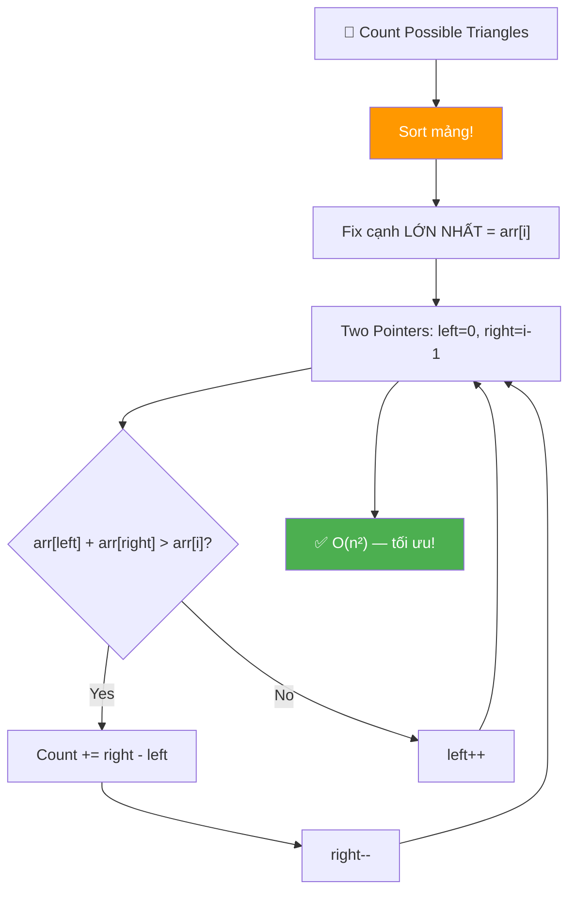
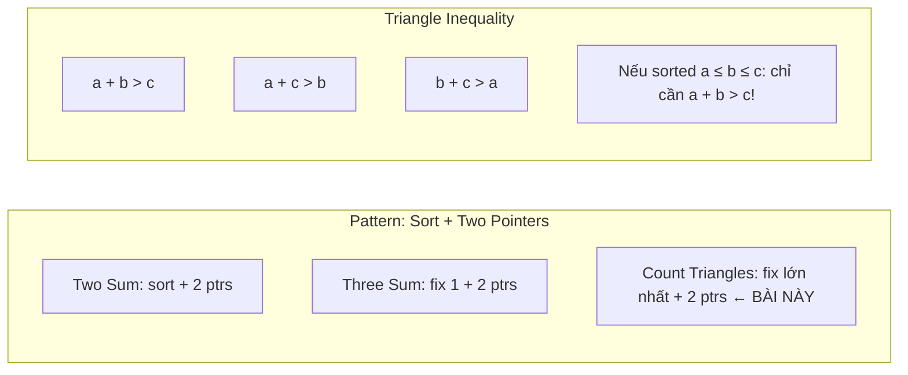
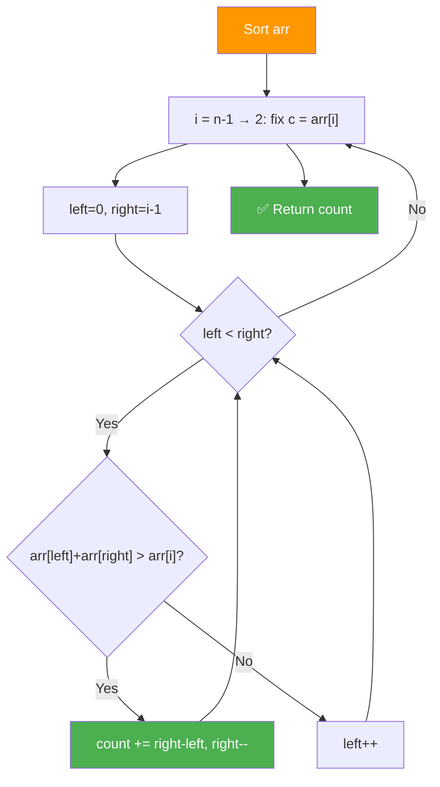
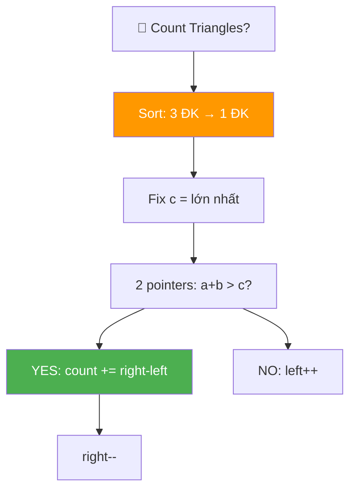
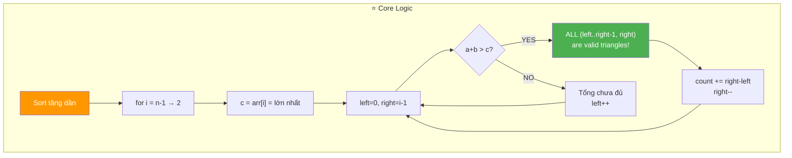
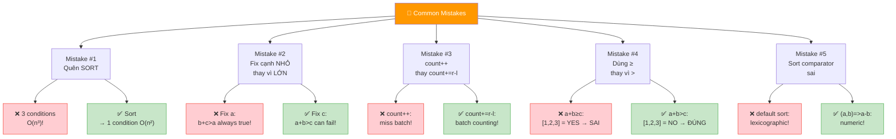
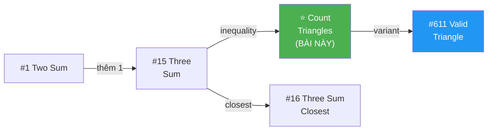
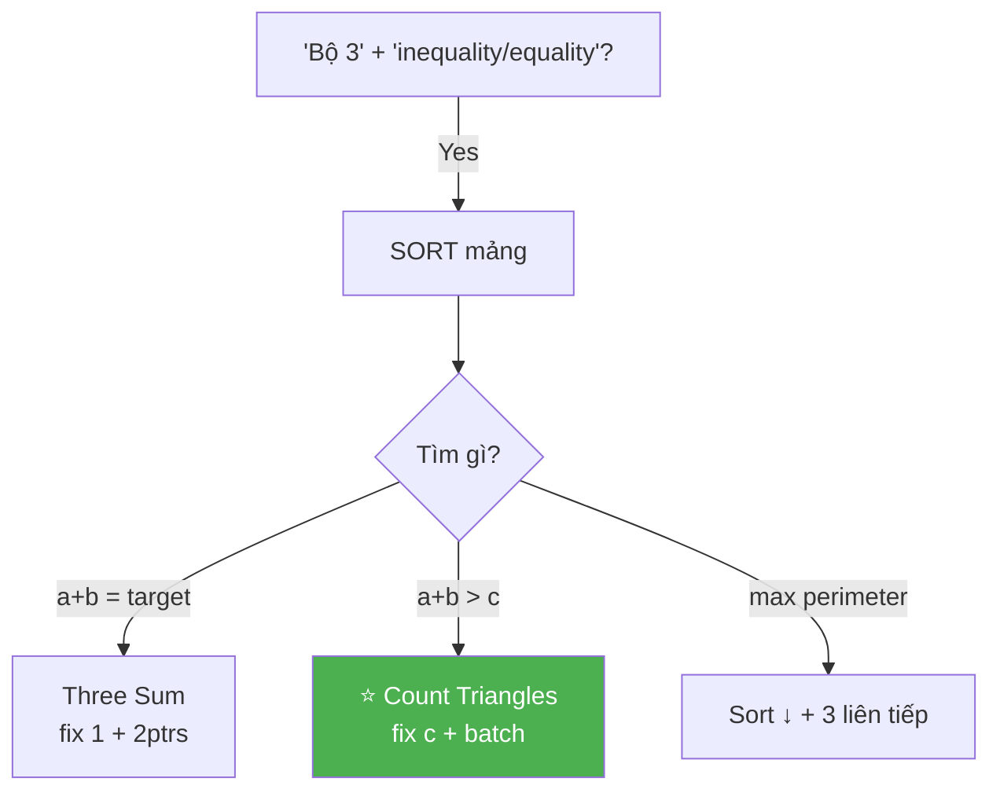
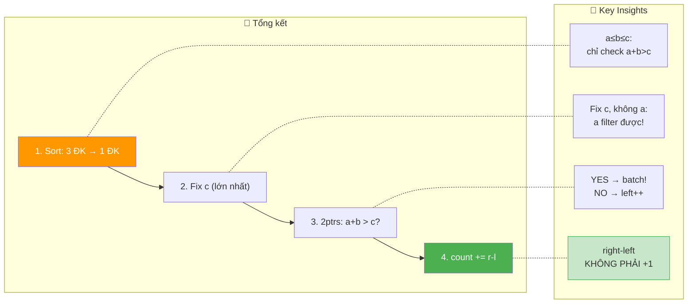

# 📐 Count Possible Triangles — GfG (Medium)

> 📖 Code: [Count Possible Triangles.js](./Count%20Possible%20Triangles.js)





---

## R — Repeat & Clarify

🧠 *"Đếm số BỘ BA phần tử có thể tạo thành tam giác. Điều kiện: tổng 2 cạnh BẤT KỲ phải lớn hơn cạnh thứ 3."*

> 🎙️ *"Given an array of positive integers, count the number of triplets that can form valid triangles. The sum of any two sides must be strictly greater than the third side."*

### Clarification Questions

```
Q: Triangle Inequality là gì?
A: Cho 3 cạnh a, b, c:
   a + b > c  VÀ  a + c > b  VÀ  b + c > a
   → TẤT CẢ 3 điều kiện phải thỏa mãn!

Q: Nếu mảng ĐÃ SORT (a ≤ b ≤ c)?
A: CHỈ CẦN KIỂM TRA: a + b > c!
   Vì a ≤ b ≤ c nên:
   → a + c > b? LUÔN ĐÚNG! (c ≥ b, nên a + c ≥ a + b > b)
   → b + c > a? LUÔN ĐÚNG! (b + c ≥ 2a > a)
   → CHỈ CÒN: a + b > c!

Q: Phần tử trùng có tính không?
A: Tính theo VỊ TRÍ khác nhau (index khác nhau)!
   [3, 3, 3] → 1 tam giác (3 vị trí khác nhau)

Q: Return COUNT, không phải danh sách?
A: ĐÚNG! Chỉ cần đếm số lượng.

Q: Giá trị 0 có xuất hiện không?
A: Bài nói positive integers → KHÔNG CÓ 0!
   (Quan trọng vì chứng minh 2 điều kiện tự động thỏa cần a > 0!)

Q: Strict hay non-strict inequality?
A: STRICT! a + b > c, KHÔNG PHẢI a + b ≥ c!
   [1, 2, 3]: 1+2=3 → NOT strictly > → NOT valid!
```

### Tại sao bài này quan trọng?

```
  ⭐ Bài này kết hợp 3 concepts:

  1. SORT → biến 3 điều kiện thành 1 điều kiện!
  2. FIX 1 CẠNH → cố định cạnh lớn nhất
  3. TWO POINTERS → đếm cặp thỏa mãn!

  Pattern giống Three Sum:
  ┌───────────────────────────────────────────────────┐
  │  Three Sum = 0:   fix 1 + 2 ptrs tìm tổng = 0    │
  │  Count Triangles: fix lớn nhất + 2 ptrs tìm > c  │
  │  Three Sum Close: fix 1 + 2 ptrs tìm gần target  │
  └───────────────────────────────────────────────────┘

  ⚠️ TRICK quan trọng:
    Sort → a + b > c = điều kiện DUY NHẤT!
    Fix c (cạnh lớn nhất) → Two Pointers tìm a + b > c!
    count += right - left = BATCH COUNTING (không +1!)
```

---

## 🧠 Bản chất bài toán — Hiểu để NHỚ, không chỉ để GIẢI

### INSIGHT CỐT LÕI: "Sort → 3 điều kiện thành 1!"

```
  ⭐ Ẩn dụ: "3 que gỗ ghép TAM GIÁC!"

  Cho 3 que dài a, b, c. Khi nào ghép được?
  → 2 que NGẮN cộng lại phải DÀI HƠN que dài nhất!
  → Nếu 2 que ngắn = que dài → nằm PHẲNG, không tạo tam giác!

  ┌─────────────────────────────────────────────────────┐
  │  a + b > c   (2 que ngắn ghép lại phải DÀI HƠN     │
  │               que dài nhất!)                         │
  │                                                      │
  │  VÍ DỤ: a=3, b=4, c=7                               │
  │    3 + 4 = 7 > 7? → NO! Không thành tam giác!       │
  │    (2 que ngắn nằm PHẲNG trên que dài!)             │
  │                                                      │
  │  VÍ DỤ: a=3, b=4, c=6                               │
  │    3 + 4 = 7 > 6? → YES! Thành tam giác! ✅         │
  └─────────────────────────────────────────────────────┘
```

### Tại sao Sort biến 3 điều kiện thành 1?

```
  Sorted: a ≤ b ≤ c

  Điều kiện 1: a + b > c   ← CẦN CHECK! (có thể sai)
  Điều kiện 2: a + c > b   ← LUÔN ĐÚNG!
  Điều kiện 3: b + c > a   ← LUÔN ĐÚNG!

  ═══ CHỨNG MINH chi tiết ═══════════════════════════

  Điều kiện 2: a + c > b
    c ≥ b (vì sorted) → a + c ≥ a + b > b (vì a > 0)
    → LUÔN ĐÚNG! ✅

  Điều kiện 3: b + c > a
    b ≥ a VÀ c ≥ a (vì sorted, a nhỏ nhất)
    → b + c ≥ a + a = 2a > a (vì a > 0)
    → LUÔN ĐÚNG! ✅

  ⚠️ Chỉ điều kiện 1 có thể FAIL!
     c lớn nhất → 2 cạnh NHỎ cộng lại có thể KHÔNG > c!

  → SORT = TRICK CỰC MẠNH cho bài này!
```

### Fix cạnh lớn nhất + Two Pointers

```
  ⭐ Strategy:
  1. SORT mảng tăng dần
  2. FIX c = arr[i] (cạnh lớn nhất, duyệt từ cuối)
  3. TWO POINTERS trong [0..i-1]: tìm bao nhiêu cặp (a, b) mà a+b > c

  Tại sao fix C chứ không fix A?
    → Fix cạnh LỚN NHẤT → biết ngưỡng cần vượt!
    → 2 pointers tìm cặp (a, b) sao cho a+b > c
    → left=0 (nhỏ nhất), right=i-1 (lớn tiếp theo)

  ┌─────────────────────────────────────────────────────┐
  │  arr[left] + arr[right] > arr[i]?                    │
  │                                                      │
  │  YES → TẤT CẢ left' từ left đến right-1 cũng thỏa! │
  │         (vì arr[left'] ≥ arr[left])                  │
  │         → count += right - left                      │
  │         → right-- (thử cạnh nhỏ hơn)                │
  │                                                      │
  │  NO  → left++ (cần cạnh lớn hơn!)                   │
  └─────────────────────────────────────────────────────┘
```

### Tại sao count += right - left? (KHÔNG PHẢI +1!)

```
  ⭐ INSIGHT QUAN TRỌNG — Hiểu sai = sai toàn bộ bài!

  Sorted: [..., left, left+1, ..., right-1, right, ..., i]

  Nếu arr[left] + arr[right] > arr[i]:
    → arr[left] = nhỏ nhất trong range [left, right]
    → Nếu arr[left] + arr[right] > arr[i]
    → THÌ arr[left+1] + arr[right] > arr[i] CHẮC CHẮN! (vì lớn hơn!)
    → VÀ arr[left+2] + arr[right] > arr[i] CHẮC CHẮN!
    → ...
    → VÀ arr[right-1] + arr[right] > arr[i] CHẮC CHẮN!

    → TẤT CẢ cặp (arr[k], arr[right]) với k ∈ [left, right-1] đều thỏa!
    → Số cặp = right - 1 - left + 1 = right - left!

  VÍ DỤ: arr = [3, 4, 6, 7], fix c = arr[3] = 7
    left=0 (3), right=2 (6): 3+6=9 > 7 ✅
    → Cặp thỏa: (3,6), (4,6) → count += 2-0 = 2!
    → KHÔNG cần duyệt từng cặp!

  📌 Đây là BATCH COUNTING — lý do biến O(n³) thành O(n²)!
```



---

## 🧭 Luồng Suy Nghĩ — Từ đọc đề đến solution

### Bước 1: Đọc đề → Keywords

```
  Đề: "Count triplets that form valid triangles"

  Gạch chân:
    ✏️ "count"        → đếm, không liệt kê
    ✏️ "triplets"      → bộ 3
    ✏️ "valid triangle" → triangle inequality
    ✏️ "positive"      → > 0 (quan trọng cho chứng minh!)

  🧠 Trigger:
    "Bộ 3" + "inequality" → Sort + fix 1 + 2 pointers!
    "Count" → batch counting (right - left)!
```

### Bước 2: Approaches từ brute → optimal

```
  🧠 Approach 1: Brute Force O(n³)
    3 vòng for → check 3 điều kiện → quá chậm!

  🧠 Approach 2: Sort + Brute O(n³) → still slow!
    Sort → 1 điều kiện nhưng vẫn 3 vòng for!

  🧠 Approach 3: Sort + Fix + 2 Pointers O(n²) ⭐
    Sort → fix c → 2 pointers → batch counting!

  📌 Progression:
    O(n³) → Sort (rút gọn) → 2 pointers (batch) → O(n²)!
```

### Bước 3: Cây quyết định



---

## E — Examples

```
VÍ DỤ 1: arr = [4, 6, 3, 7]

  Sort: [3, 4, 6, 7]

  Fix c = 7 (i=3): left=0, right=2
    3+6=9 > 7 ✅ → count += 2-0 = 2    (cặp: [3,6], [4,6])
    right=1: 3+4=7 > 7? NO → left++
    left=1: left ≥ right → stop

  Fix c = 6 (i=2): left=0, right=1
    3+4=7 > 6 ✅ → count += 1-0 = 1    (cặp: [3,4])
    right=0: left ≥ right → stop

  → Total = 2 + 1 = 3 ✅
  Triangles: [3,4,6], [3,6,7], [4,6,7]
```

```
VÍ DỤ 2: arr = [1, 2, 3]

  Sort: [1, 2, 3]

  Fix c = 3 (i=2): left=0, right=1
    1+2=3 > 3? NO → left++
    left=1: left ≥ right → stop

  → Total = 0 ✅ (1+2 KHÔNG > 3, chỉ = 3!)
```

```
VÍ DỤ 3 (Edge): arr = [3, 3, 3]

  Sort: [3, 3, 3]

  Fix c = 3 (i=2): left=0, right=1
    3+3=6 > 3 ✅ → count += 1-0 = 1
    right=0: left ≥ right → stop

  → Total = 1 ✅ (tam giác đều!)
```

```
VÍ DỤ 4 (Edge): arr = [1, 1, 1, 1]

  Sort: [1, 1, 1, 1]

  Fix c = 1 (i=3): left=0, right=2
    1+1=2 > 1 ✅ → count += 2-0 = 2  (cặp: [0,2], [1,2])
    right=1: 1+1=2 > 1 ✅ → count += 1-0 = 1  (cặp: [0,1])
    right=0: stop

  Fix c = 1 (i=2): left=0, right=1
    1+1=2 > 1 ✅ → count += 1-0 = 1  (cặp: [0,1])
    right=0: stop

  → Total = 2 + 1 + 1 = 4 ✅ (C(4,3) = 4!)
```

### Trace dạng bảng — VD chi tiết

```
  arr = [4, 6, 3, 7]    Sort: [3, 4, 6, 7]

  ═══ i=3: c = 7 ═══════════════════════════════════════

  ┌──────┬──────┬───────┬─────────┬───────┬─────────────────────┐
  │ Step │ left │ right │ a+b     │ > c?  │ Action              │
  ├──────┼──────┼───────┼─────────┼───────┼─────────────────────┤
  │ 1    │ 0(3) │ 2(6)  │ 3+6=9   │ > 7 ✅│ count+=2, right=1  │
  │ 2    │ 0(3) │ 1(4)  │ 3+4=7   │ = 7 ❌│ left=1             │
  │ 3    │ 1≥1  │       │         │       │ STOP               │
  └──────┴──────┴───────┴─────────┴───────┴─────────────────────┘
  count = 2

  ═══ i=2: c = 6 ═══════════════════════════════════════

  ┌──────┬──────┬───────┬─────────┬───────┬─────────────────────┐
  │ Step │ left │ right │ a+b     │ > c?  │ Action              │
  ├──────┼──────┼───────┼─────────┼───────┼─────────────────────┤
  │ 1    │ 0(3) │ 1(4)  │ 3+4=7   │ > 6 ✅│ count+=1, right=0  │
  │ 2    │ 0≥0  │       │         │       │ STOP               │
  └──────┴──────┴───────┴─────────┴───────┴─────────────────────┘
  count = 2 + 1 = 3 ✅
```

### Minh họa Two Pointers

```
  Sorted arr = [3, 4, 6, 7]

  Fix c = arr[3] = 7:

  ┌───┬───┬───┐
  │ 3 │ 4 │ 6 │  7    ← c (fixed!)
  └───┴───┴───┘
    ↑       ↑
   left   right

  Step 1: 3+6=9 > 7 ✅
    → Cặp: (3,6), (4,6) → count += 2
    → right--

  ┌───┬───┐
  │ 3 │ 4 │  6   7
  └───┴───┘
    ↑   ↑
   left right

  Step 2: 3+4=7 > 7? NO
    → left++

  ┌───┐
  │ 4 │  6   7
  └───┘
    ↑
  left=right → STOP!

  count = 2 cho c=7
```

---

## A — Approach

### Approach 1: Brute Force — O(n³)

```
  3 vòng for lồng nhau:
    for i: for j > i: for k > j:
      check arr[i]+arr[j]>arr[k] && arr[i]+arr[k]>arr[j] && arr[j]+arr[k]>arr[i]

  → O(n³) — chỉ NÓI trong phỏng vấn!
```

### Approach 2: Sort + Two Pointers — O(n²) ⭐

```
  1. Sort mảng tăng dần
  2. Fix c = arr[i] (lớn nhất), duyệt i = n-1 → 2
  3. Two Pointers: left=0, right=i-1
     - a+b > c → count += right-left, right--
     - a+b ≤ c → left++
  4. Return count

  Time: O(n log n + n²) = O(n²)
  Space: O(1) (sort in-place)
```

---

## C — Code ✅

### Solution 1: Brute Force — O(n³)

```javascript
function countTrianglesBrute(arr) {
  const n = arr.length;
  let count = 0;

  for (let i = 0; i < n - 2; i++) {
    for (let j = i + 1; j < n - 1; j++) {
      for (let k = j + 1; k < n; k++) {
        if (
          arr[i] + arr[j] > arr[k] &&
          arr[i] + arr[k] > arr[j] &&
          arr[j] + arr[k] > arr[i]
        ) {
          count++;
        }
      }
    }
  }

  return count;
}
```

### Solution 2: Sort + Two Pointers — O(n²) ⭐

```javascript
function countTriangles(arr) {
  const n = arr.length;
  arr.sort((a, b) => a - b); // ⭐ SORT trước!
  let count = 0;

  // Fix cạnh LỚN NHẤT = arr[i], duyệt từ cuối
  for (let i = n - 1; i >= 2; i--) {
    let left = 0;
    let right = i - 1;

    while (left < right) {
      if (arr[left] + arr[right] > arr[i]) {
        // ⭐ TẤT CẢ left' từ left đến right-1 đều thỏa!
        count += right - left;
        right--;
      } else {
        // Cần cặp lớn hơn → tăng left
        left++;
      }
    }
  }

  return count;
}
```

---

## 🔬 Deep Dive — Giải thích CHI TIẾT từng dòng

> 💡 Phân tích **từng dòng** để hiểu **TẠI SAO**.

```javascript
function countTriangles(arr) {
  const n = arr.length;

  // ═══════════════════════════════════════════════════════════
  // SORT: biến 3 điều kiện → 1 điều kiện!
  // ═══════════════════════════════════════════════════════════
  //
  // TẠI SAO sort?
  //   Unsorted: check a+b>c AND a+c>b AND b+c>a (3 checks!)
  //   Sorted a ≤ b ≤ c: chỉ check a+b > c! (1 check!)
  //
  // ⚠️ sort((a,b) => a-b) QUAN TRỌNG!
  //   Nếu quên comparator → sort lexicographic:
  //   [3, 10, 7] → ["10", "3", "7"] → SAI!
  //
  arr.sort((a, b) => a - b);
  let count = 0;

  // ═══════════════════════════════════════════════════════════
  // FIX c = arr[i]: cạnh LỚN NHẤT
  // ═══════════════════════════════════════════════════════════
  //
  // TẠI SAO fix c (lớn nhất)?
  //   Fix a (nhỏ nhất): b+c > a LUÔN TRUE → vô ích!
  //   Fix c (lớn nhất): a+b > c có thể FALSE → filter!
  //
  // TẠI SAO i >= 2?
  //   Cần ít nhất 3 phần tử: index 0, 1, 2
  //   i = 2 → left=0, right=1 → minimum case!
  //
  // TẠI SAO duyệt từ CUỐI (n-1)?
  //   c phải là LỚN NHẤT trong sorted array
  //   → fixed ở cuối, 2 pointers tìm trong phần nhỏ hơn!
  //
  for (let i = n - 1; i >= 2; i--) {
    let left = 0;
    let right = i - 1;

    // ═══════════════════════════════════════════════════════
    // TWO POINTERS: đếm cặp (a, b) mà a+b > c
    // ═══════════════════════════════════════════════════════
    //
    // left = index nhỏ nhất (a nhỏ nhất)
    // right = index lớn nhất < i (b lớn nhất)
    //
    while (left < right) {
      if (arr[left] + arr[right] > arr[i]) {
        // ─── BATCH COUNTING! ───
        //
        // arr[left] + arr[right] > c
        // → arr[left+1] + arr[right] > c (lớn hơn!)
        // → arr[left+2] + arr[right] > c
        // → ...
        // → arr[right-1] + arr[right] > c
        //
        // → TẤT CẢ k ∈ [left, right-1] ghép arr[right] đều thỏa!
        // → Số cặp = right - left
        //
        // ⚠️ right - left, KHÔNG PHẢI right - left + 1!
        //    Vì cặp (right, right) = chính nó → không tính!
        //    Cặp: (left, right), (left+1, right), ..., (right-1, right)
        //    = right - 1 - left + 1 = right - left!
        //
        count += right - left;

        // right-- để thử cạnh b NHỎ hơn
        // (đã đếm hết cặp với arr[right] rồi!)
        right--;
      } else {
        // ─── Tổng CHƯA ĐỦ! ───
        //
        // arr[left] + arr[right] ≤ c
        // → Cần a LỚN HƠN → left++!
        //
        // TẠI SAO không right++?
        //   right đang ở i-1 (lớn nhất rồi!)
        //   Chỉ có thể tăng left để tăng tổng!
        //
        left++;
      }
    }
  }

  return count;
}
```



---

## 📐 Invariant — Chứng minh tính đúng đắn

```
  📐 INVARIANT cho Two Pointers (fixed c = arr[i]):

  Tại mỗi iteration:
    1. Tất cả cặp (a, b) với a ∈ [left, right] VÀ b > right
       → ĐÃ ĐƯỢC ĐẾM! (từ các bước right-- trước)

    2. Tất cả cặp (a, b) với a < left VÀ b ∈ [left, right]
       → ĐÃ ĐƯỢC LOẠI! (vì a+b ≤ c → tất cả a' < a cũng ≤ c)

  CHỨNG MINH correctness:
  ┌──────────────────────────────────────────────────────────────┐
  │  Khi arr[left] + arr[right] > c:                            │
  │    ∀ k ∈ [left, right-1]:                                   │
  │      arr[k] ≥ arr[left] (sorted!)                           │
  │      → arr[k] + arr[right] ≥ arr[left] + arr[right] > c!   │
  │    → (right - left) cặp hợp lệ! ✅                          │
  │                                                              │
  │  Khi arr[left] + arr[right] ≤ c:                            │
  │    arr[left] + arr[right] ≤ c                                │
  │    → arr[left] + arr[right-1] ≤ c (arr[right-1] ≤ arr[right])│
  │    → arr[left] + arr[right-2] ≤ c                           │
  │    → TẤT CẢ cặp (left, k) với k ≤ right đều ≤ c!         │
  │    → left++ để thử a lớn hơn! ✅                             │
  └──────────────────────────────────────────────────────────────┘

  📐 COMPLETENESS:
    Mọi cặp (a, b) với 0 ≤ a < b ≤ i-1 đều được xét:
    - Nếu hợp lệ: đếm qua count += right-left khi b = right
    - Nếu không: bị loại khi left vượt qua a
    → KHÔNG BỎ SÓT, KHÔNG ĐẾM TRÙNG! ∎

  📐 TERMINATION:
    Mỗi step: left++ hoặc right--
    → gap = right - left giảm ít nhất 1 mỗi step
    → Tối đa i-1 steps → terminate! ∎

  📐 TẠI SAO O(n²)?
    Outer loop: n-2 iterations (i = n-1 → 2)
    Inner loop: ≤ i-1 iterations (left + right cross)
    Tổng inner = (n-2) + (n-3) + ... + 1 = O(n²/2) = O(n²) ∎
```

---

## ❌ Common Mistakes — Lỗi thường gặp



### Mistake 1: Quên SORT!

```javascript
// ❌ SAI: không sort → phải check 3 điều kiện!
for (let i = 0; i < n - 2; i++)
  for (let j = i + 1; j < n - 1; j++)
    for (let k = j + 1; k < n; k++)
      if (arr[i]+arr[j]>arr[k] && arr[i]+arr[k]>arr[j] && arr[j]+arr[k]>arr[i])
        count++;
// O(n³)!

// ✅ ĐÚNG: sort → 1 condition → 2 pointers → O(n²)!
arr.sort((a, b) => a - b);
// Chỉ cần check: a + b > c!
```

### Mistake 2: Fix cạnh NHỎ NHẤT!

```javascript
// ❌ SAI: fix a (nhỏ nhất)!
for (let i = 0; i < n - 2; i++) {
  // arr[j] + arr[k] > arr[i] → LUÔN TRUE (vì j,k > i, sorted!)
  // → Không filter được gì → vô ích!
}

// ✅ ĐÚNG: fix c (LỚN NHẤT)!
for (let i = n - 1; i >= 2; i--) {
  // arr[left] + arr[right] > arr[i] → CÓ THỂ FALSE → filter!
}
```

### Mistake 3: count++ thay vì count += right - left!

```javascript
// ❌ SAI: chỉ đếm 1 cặp!
if (arr[left] + arr[right] > arr[i]) {
  count++;     // chỉ đếm (left, right) → MISS tất cả left' khác!
  right--;
}

// ✅ ĐÚNG: đếm TẤT CẢ cặp hợp lệ!
if (arr[left] + arr[right] > arr[i]) {
  count += right - left;  // ĐẾM BATCH!
  right--;
}

// VD: [3, 4, 6, 7], c=7, left=0, right=2
// ❌ count++ → đếm 1 (chỉ [3,6])
// ✅ count+=2 → đếm 2 ([3,6] VÀ [4,6])
```

### Mistake 4: Dùng >= thay vì >!

```javascript
// ❌ SAI: dùng >= !
if (arr[left] + arr[right] >= arr[i]) { ... }
// [1, 2, 3]: 1+2=3 >= 3? YES → count = 1 → SAI!
// (1+2=3, KHÔNG PHẢI strictly greater!)

// ✅ ĐÚNG: dùng > !
if (arr[left] + arr[right] > arr[i]) { ... }
// [1, 2, 3]: 1+2=3 > 3? NO → count = 0 → ĐÚNG!
```

### Mistake 5: Sort comparator sai!

```javascript
// ❌ SAI: default sort = lexicographic!
arr.sort();
// [10, 3, 7] → ["10", "3", "7"] → [10, 3, 7] → SAI!
// "10" < "3" (ký tự '1' < '3')

// ✅ ĐÚNG: numeric comparator!
arr.sort((a, b) => a - b);
// [10, 3, 7] → [3, 7, 10] → ĐÚNG!
```

---

## O — Optimize

```
                       Time          Space     Ghi chú
  ──────────────────────────────────────────────────────
  Brute Force          O(n³)         O(1)      3 vòng for
  Sort + 2 Pointers ⭐ O(n²)         O(1)*     Tối ưu!

  * O(1) nếu sort in-place, O(n) nếu sort cần space

  ⚠️ Tại sao O(n²)?
    Vòng ngoài: n-2 iterations (fix c)
    Vòng trong: Two Pointers ≤ i-1 iterations
    Tổng: Σ(i-1) for i=2→n-1 = n(n-1)/2 = O(n²)

  ⚠️ Có O(n log n) không?
    KHÔNG CÓ cách O(n log n) đã biết cho bài này!
    Vì output có thể O(n²) triangles → phải COUNT O(n²)!
    O(n²) là TỐI ƯU cho bài counting!
```

### Complexity chính xác — Đếm operations

```
  Sort: O(n log n) comparisons

  Main loop:
    Outer: n-2 iterations
    Tổng inner: Σ(i-1) for i=2 to n-1
              = 1 + 2 + ... + (n-2)
              = (n-2)(n-1)/2

  Mỗi inner step: 1 addition + 1 comparison + 1 add/increment
  TỔNG: 3 × n(n-1)/2 ≈ 1.5n² operations

  📊 So sánh (n = 10³):
    Sort+2ptr: 1.5×10⁶ ops ⭐
    Brute:     10⁹ ops 💀

  📊 So sánh (n = 10⁴):
    Sort+2ptr: 1.5×10⁸ ops ⭐ (~0.5s)
    Brute:     10¹² ops 💀 (~hours)
```

---

## T — Test

```
Test Cases:
  [4, 6, 3, 7]                    → 3     ✅ [3,4,6],[3,6,7],[4,6,7]
  [10, 21, 22, 100, 101, 200, 300]→ 6     ✅
  [1, 2, 3]                       → 0     ✅ 1+2 = 3, không >
  [3, 3, 3]                       → 1     ✅ 1 tam giác đều
  [1, 1, 1, 1]                    → 4     ✅ C(4,3) = 4
  [5]                             → 0     ✅ < 3 phần tử
  [1, 2]                          → 0     ✅ < 3 phần tử
  [2, 3, 4, 5]                    → 3     ✅ [2,3,4],[2,4,5],[3,4,5]
  [1, 2, 3, 4, 5]                 → 3     ✅

  Edge: [1, 2, 3, 4, 5] trace:
    Sort: [1,2,3,4,5]
    i=4(5): l=0,r=3 → 1+4=5=5 NO, l=1 → 2+4=6>5 YES cnt+=2
            r=2 → 2+3=5=5 NO, l=2, stop → count=2
    i=3(4): l=0,r=2 → 1+3=4=4 NO, l=1 → 2+3=5>4 YES cnt+=1
            r=1, stop → count=3
    i=2(3): l=0,r=1 → 1+2=3=3 NO, l=1, stop → count=3
    Total = 3 ✅
```

---

## 🗣️ Interview Script

### 🎙️ Think Out Loud — Mô phỏng phỏng vấn thực

```
  ──────────────── PHASE 1: Clarify ────────────────

  👤 Interviewer: "Count the number of triplets from an
                   array that can form valid triangles."

  🧑 You: "Let me clarify:
   1. Triangle inequality: sum of any two sides must be
      strictly greater than the third.
   2. All values are positive integers.
   3. I return the count, not the actual triplets.
   4. Duplicate values at different indices are distinct triplets."

  ──────────────── PHASE 2: Examples ────────────────

  🧑 You: "arr = [4, 6, 3, 7]. After sorting: [3, 4, 6, 7].
   Valid triangles: [3,4,6], [3,6,7], [4,6,7] → 3 total.
   Note: [3,4,7] fails because 3+4=7, not strictly greater."

  ──────────────── PHASE 3: Approach ────────────────

  🧑 You: "Brute force is O(n³) with three nested loops.

   Key insight: after sorting, if a ≤ b ≤ c, we only need
   to check a + b > c. The other two conditions are automatically
   satisfied since c is the largest.

   So I sort, then fix the largest side c = arr[i] and use
   two pointers (left=0, right=i-1) to count pairs where
   arr[left] + arr[right] > arr[i].

   When the sum exceeds c, ALL elements from left to right-1
   paired with arr[right] also satisfy the condition — so I
   add right-left to the count. This is batch counting.

   O(n²) time after O(n log n) sort."

  ──────────────── PHASE 4: Code + Verify ────────────────

  🧑 You: [writes code, traces [4,6,3,7] example]

  "Important details:
   - Sort with numeric comparator: (a,b) => a-b
   - Strictly greater: >, not >=
   - count += right-left, NOT count++"

  ──────────────── PHASE 5: Follow-ups ────────────────

  👤 "Why fix the largest side, not the smallest?"
  🧑 "If I fix the smallest side a, then b+c > a is always
      true since b,c ≥ a > 0. No filtering power! Fixing
      the largest side c gives a+b > c which can actually fail,
      so the two pointers can prune effectively."

  👤 "Can we do better than O(n²)?"
  🧑 "No, because the answer itself can be O(n²) — for example,
      an array of all 1s has C(n,3) ≈ n³/6 triangles. We need
      at least O(n²) to count them."

  👤 "How does this relate to Three Sum?"
  🧑 "Same pattern! Three Sum fixes one element and uses two
      pointers to find pairs summing to a target. Here I fix
      the largest side and find pairs whose sum exceeds it.
      The batch counting trick (right-left) is the same idea."
```

---

## 📚 Bài tập liên quan — Practice Problems

### Progression Path



### 1. Three Sum (#15) — Medium

```
  Đề: Tìm tất cả bộ 3 có tổng = 0.

  function threeSum(nums) {
    nums.sort((a, b) => a - b);
    const result = [];
    for (let i = 0; i < nums.length - 2; i++) {
      if (i > 0 && nums[i] === nums[i-1]) continue;  // skip dup
      let left = i + 1, right = nums.length - 1;
      while (left < right) {
        const sum = nums[i] + nums[left] + nums[right];
        if (sum === 0) {
          result.push([nums[i], nums[left], nums[right]]);
          while (left < right && nums[left] === nums[left+1]) left++;
          while (left < right && nums[right] === nums[right-1]) right--;
          left++; right--;
        } else if (sum < 0) left++;
        else right--;
      }
    }
    return result;
  }

  📌 CÙNG PATTERN:
    Count Triangles: fix c → a+b > c → count += r-l
    Three Sum:       fix a → a+b+c = 0 → find exact!
```

### 2. Valid Triangle Number (#611) — Medium

```
  Đề: CÙNG BÀI! LeetCode version.

  function triangleNumber(nums) {
    nums.sort((a, b) => a - b);
    let count = 0;
    for (let i = nums.length - 1; i >= 2; i--) {
      let left = 0, right = i - 1;
      while (left < right) {
        if (nums[left] + nums[right] > nums[i]) {
          count += right - left;
          right--;
        } else {
          left++;
        }
      }
    }
    return count;
  }

  📌 100% GIỐNG! LeetCode #611 = bài này!
```

### 3. Largest Perimeter Triangle (#976) — Easy

```
  Đề: Tìm tam giác có chu vi LỚN NHẤT.

  function largestPerimeter(nums) {
    nums.sort((a, b) => b - a);  // sort GIẢM dần!
    for (let i = 0; i < nums.length - 2; i++) {
      // Check 3 phần tử liên tiếp (lớn nhất trước!)
      if (nums[i+1] + nums[i+2] > nums[i]) {
        return nums[i] + nums[i+1] + nums[i+2];
      }
    }
    return 0;
  }

  📌 KHÁC: chỉ cần TÌM 1, không đếm!
     Sort giảm → check 3 liên tiếp → O(n log n)!
```

### Tổng kết — Sort + Two Pointers Family

```
  ┌──────────────────────────────────────────────────────────────┐
  │  BÀI                     │  Fix gì?  │  2ptr tìm gì?       │
  ├──────────────────────────────────────────────────────────────┤
  │  Two Sum                 │  —        │  a+b = target        │
  │  Three Sum               │  a (1st)  │  b+c = -a            │
  │  Three Sum Closest       │  a (1st)  │  b+c ≈ target-a      │
  │  Count Triangles ⭐      │  c (last) │  a+b > c             │
  │  #611 Valid Triangle     │  c (last) │  a+b > c (SAME!)     │
  │  #976 Largest Perimeter  │  Sort ↓   │  3 liên tiếp         │
  └──────────────────────────────────────────────────────────────┘

  📌 RULE: "Bộ 3" + "condition" → Sort + fix 1 + 2 pointers!
     "= target" → move both pointers
     "> target" → count += right-left (batch!)
```

### Skeleton code — Reusable template

```javascript
// TEMPLATE: Fix 1 + Two Pointers cho bộ 3
function tripletPattern(arr, condition) {
  arr.sort((a, b) => a - b);
  let count = 0;

  // Fix phần tử cuối (lớn nhất) hoặc đầu (nhỏ nhất)
  for (let i = arr.length - 1; i >= 2; i--) {
    let left = 0, right = i - 1;

    while (left < right) {
      const val = arr[left] + arr[right];

      if (val > arr[i]) {
        // BATCH counting: tất cả left..right-1 ghép right thỏa!
        count += right - left;
        right--;
      } else {
        // Cần tổng lớn hơn → tăng left
        left++;
      }
    }
  }
  return count;
}

// Triangle: condition = a+b > c
// Three Sum > k: condition = a+b+c > k → a+b > k-c
```

---

## 📌 Kỹ năng chuyển giao — Pattern Summary



---

## 📊 Tổng kết — Key Insights



```
  ┌──────────────────────────────────────────────────────────────────────────┐
  │  📌 3 ĐIỀU PHẢI NHỚ                                                    │
  │                                                                          │
  │  1. SORT → 3 ĐIỀU KIỆN THÀNH 1:                                        │
  │     a ≤ b ≤ c → chỉ check a + b > c!                                  │
  │     2 ĐK còn lại TỰ ĐỘNG thỏa (vì a > 0)!                            │
  │     ⚠️ sort((a,b) => a-b) — numeric, KHÔNG lexicographic!             │
  │                                                                          │
  │  2. FIX c (LỚN NHẤT), không fix a:                                     │
  │     Fix a → b+c > a LUÔN TRUE → vô ích!                                │
  │     Fix c → a+b > c CÓ THỂ FALSE → filter hiệu quả!                  │
  │     Two Pointers tìm trong [0..i-1]!                                    │
  │                                                                          │
  │  3. BATCH COUNTING: count += right - left                               │
  │     KHÔNG PHẢI count++ hay count += right - left + 1!                   │
  │     Nếu arr[left]+arr[right] > c → TẤT CẢ left' ∈ [left, right-1]    │
  │     ghép arr[right] đều thỏa → right - left cặp!                      │
  │     > STRICT, không >=! ([1,2,3]: 1+2=3 NOT > 3!)                     │
  └──────────────────────────────────────────────────────────────────────────┘
```

---

## 📝 Flashcard — Tự kiểm tra

| ❓ Câu hỏi | ✅ Đáp án |
|---|---|
| Triangle inequality (3 điều kiện)? | a+b>c, a+c>b, b+c>a |
| Sau khi sort (a≤b≤c), cần check gì? | CHỈ **a+b > c**! |
| Fix cạnh nào? | Cạnh **LỚN NHẤT** (c)! |
| Tại sao fix c, không fix a? | Fix a → b+c>a **luôn true** → vô ích! |
| arr[left]+arr[right] > c → count? | count += **right - left** (batch!) |
| Tại sao right-left không phải +1? | Cặp: (left,right), ..., (right-1,right) = **r-l** cặp |
| [1,2,3] → bao nhiêu? | **0** (1+2=3, NOT strictly >) |
| Time complexity? | **O(n²)** (sau sort O(n log n)) |
| Space? | **O(1)** (sort in-place) |
| Có tối ưu hơn O(n²)? | **KHÔNG** (output có thể O(n²) triangles) |
| Pattern giống bài nào? | **Three Sum** (sort + fix 1 + 2 pointers) |
| LeetCode equivalent? | **#611** Valid Triangle Number |
