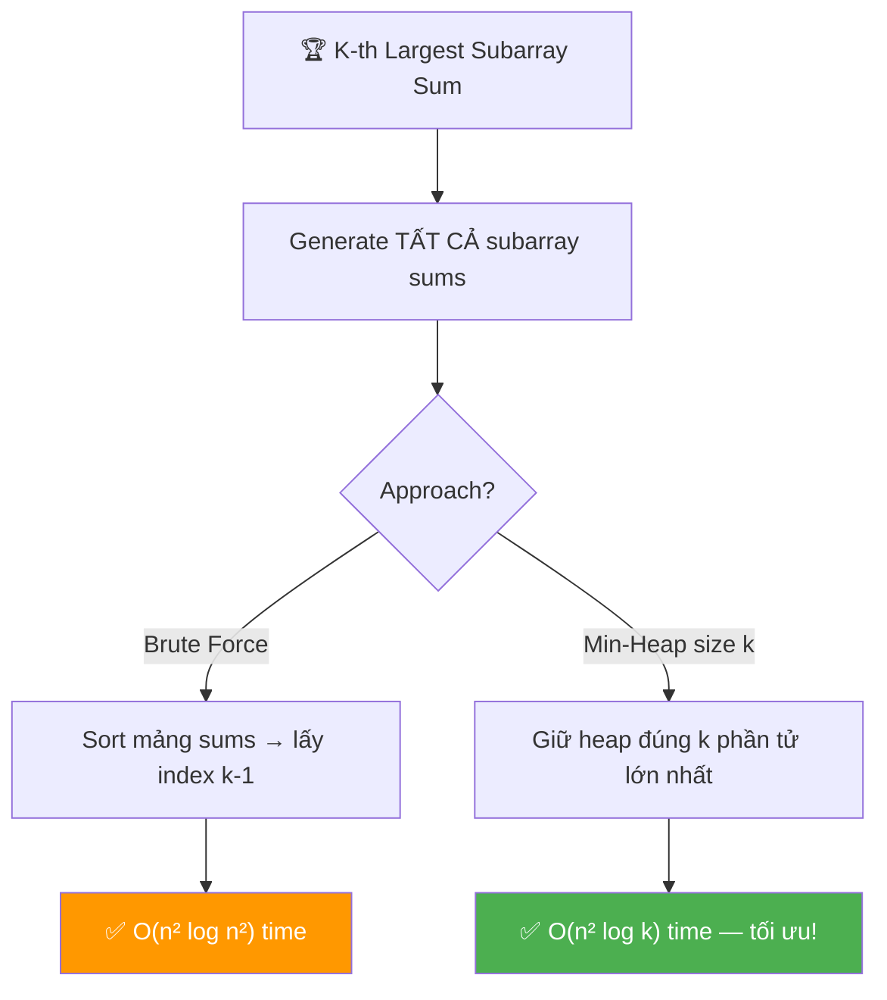
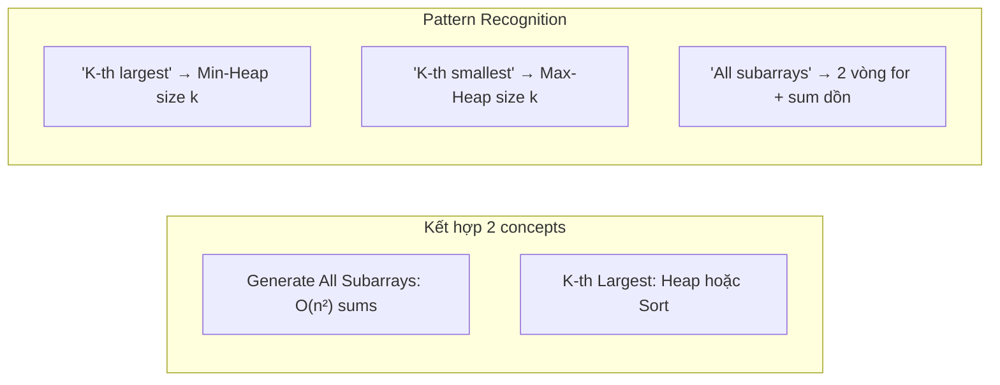
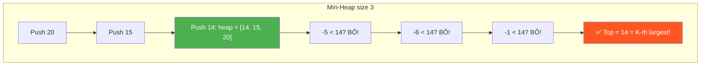

# 🏆 K-th Largest Sum Contiguous Subarray — GfG (Medium)

> 📖 Code: [K-th Largest Sum Subarray.js](./K-th%20Largest%20Sum%20Subarray.js)





---

## R — Repeat & Clarify

🧠 *"Tìm tổng subarray LỚN THỨ K trong TẤT CẢ subarray sums của mảng. Mảng có cả số dương và âm."*

> 🎙️ *"Given an array with both positive and negative numbers, find the k-th largest sum among all contiguous subarray sums."*

### Clarification Questions

```
Q: Subarray là gì?
A: Đoạn phần tử LIÊN TIẾP! [1,2] từ [1,2,3] ✅
   [1,3] → KHÔNG phải subarray (bỏ 2)!

Q: Có bao nhiêu subarray sums?
A: n(n+1)/2 sums (mỗi cặp start, end = 1 subarray)
   n=3 → 6 sums, n=4 → 10 sums, n=100 → 5050 sums!

Q: "K-th largest" = lớn thứ mấy?
A: k=1 → lớn NHẤT, k=2 → lớn THỨ 2, ...
   Sorted giảm dần → lấy index k-1!

Q: Subarray sums có thể TRÙNG không?
A: CÓ! Mỗi sum TÍNH RIÊNG (kể cả trùng giá trị).
   Sums = [20, 15, 14, -5, -6, -1], k=3 → 14

Q: k guaranteed hợp lệ không?
A: CÓ! 1 ≤ k ≤ n(n+1)/2
```

### Tại sao bài này quan trọng?

```
  Bài này KẾT HỢP 2 concepts nền tảng:

  1. Generate All Subarray Sums → O(n²) (đã học!)
  2. K-th Largest Element → Heap/Sort

  BẠN PHẢI hiểu:
  ┌─────────────────────────────────────────────────────┐
  │  "K-th largest" → Min-Heap size k!                   │
  │  → Heap giữ k phần tử lớn nhất                      │
  │  → Top của min-heap = nhỏ nhất trong k lớn nhất     │
  │  → = phần tử lớn thứ k!                             │
  │                                                      │
  │  "All subarray sums" → 2 vòng for + incremental sum │
  │  → KHÔNG cần generate subarray, chỉ cần SUM!        │
  └─────────────────────────────────────────────────────┘

  ⭐ Pattern "K-th largest" xuất hiện RẤT NHIỀU:
    K-th Largest Element in Array (#215)
    K Closest Points to Origin (#973)
    Top K Frequent Elements (#347)
    → ALL dùng Heap!
```

---

## 🧠 Bản chất bài toán — Hiểu để NHỚ, không chỉ để GIẢI

### CHIA BÀI THÀNH 2 PHẦN

```
  ⭐ Bài này = 2 bài NHỎ HƠN ghép lại!

  PHẦN 1: Tính TẤT CẢ subarray sums
    → 2 vòng for + incremental sum
    → arr = [20, -5, -1] → sums = [20, 15, 14, -5, -6, -1]
    → Đã học ở "Generating All Subarrays"!

  PHẦN 2: Tìm phần tử lớn thứ K
    → Sort → lấy index k-1    (đơn giản!)
    → Min-Heap size k          (tối ưu!)

  KẾT HỢP:
    Tính sums → tìm k-th largest trong sums!
```

### PHẦN 1: Incremental Sum — Tính sum KHÔNG cần mảng phụ

```
  ⭐ TRICK: Mỗi khi end tăng 1, sum CHỈ CỘNG THÊM 1 phần tử!

  arr = [20, -5, -1]

  start=0:
    end=0: sum = 20         → sum += arr[0]
    end=1: sum = 20+(-5)=15 → sum += arr[1]  (CỘNG THÊM, không tính lại!)
    end=2: sum = 15+(-1)=14 → sum += arr[2]

  start=1:
    end=1: sum = -5          → reset sum, sum += arr[1]
    end=2: sum = -5+(-1)=-6  → sum += arr[2]

  start=2:
    end=2: sum = -1          → reset sum, sum += arr[2]

  → Tất cả sums: [20, 15, 14, -5, -6, -1]
  → Tổng: n(n+1)/2 = 3×4/2 = 6 sums ✅

  ⚠️ KHÔNG cần mảng phụ chứa subarray!
     Chỉ cần 1 biến sum → reset mỗi start mới!
```

### PHẦN 2: Min-Heap size K — Tại sao?

```
  ⭐ INSIGHT: Giữ K phần tử LỚN NHẤT → đỉnh heap = lớn thứ K!

  Hình dung: TOP K BẢNG ĐIỂM!
    Bạn muốn biết điểm lớn THỨ 3 trong lớp.
    → Giữ 3 điểm cao nhất trong "bảng vinh danh" (heap)
    → Khi có điểm mới:
       Nếu > điểm THẤP NHẤT trên bảng → THAY THẾ!
       Nếu ≤ → bỏ qua!
    → Cuối cùng: điểm thấp nhất trên bảng = lớn thứ 3!

  MIN-HEAP size K:
    → Heap luôn giữ K phần tử lớn nhất
    → Top (min) = nhỏ nhất trong K lớn nhất = LỚN THỨ K!

  Ví dụ: sums = [20, 15, 14, -5, -6, -1], k=3

    Process 20:  heap = [20]               (size < k, push)
    Process 15:  heap = [15, 20]           (size < k, push)
    Process 14:  heap = [14, 15, 20]       (size = k!)
    Process -5:  -5 < heap top (14) → BỎ!
    Process -6:  -6 < 14 → BỎ!
    Process -1:  -1 < 14 → BỎ!

    → heap top = 14 = lớn thứ 3 ✅
```



### Tại sao Min-Heap tốt hơn Sort?

```
  SORT: 
    Lưu TẤT CẢ n(n+1)/2 sums → sort → lấy index k-1
    Time: O(n² log n²) = O(n² × 2 log n) = O(n² log n)
    Space: O(n²) — lưu TẤT CẢ sums!

  MIN-HEAP size k:
    Giữ TỐI ĐA k phần tử → thêm/bỏ O(log k)
    Time: O(n² log k)
    Space: O(k) — chỉ lưu k phần tử!

  So sánh:
    k thường << n² → log k << log n²
    → Heap NHANH HƠN!
    → Và tiết kiệm BỘ NHỚ hơn!

  ⚠️ JavaScript KHÔNG CÓ built-in Heap!
     → Cần implement MinHeap hoặc dùng sort!
     → Trong phỏng vấn: nói "dùng Min-Heap", code sort nếu cần.
```

---

## 🧭 Luồng Suy Nghĩ — Từ đọc đề đến solution

> 💡 Phần này dạy bạn **CÁCH TƯ DUY** để tự giải bài, không chỉ biết đáp án.

### Bước 1: Đọc đề → Gạch chân KEYWORDS

```
  Đề bài: "K-th largest sum of contiguous subarray"

  Gạch chân:
    "contiguous subarray" → subarray LIÊN TIẾP
    "sum"                 → tính TỔNG, không cần lưu subarray
    "k-th largest"        → sắp xếp → lấy thứ k
    "all"                 → enumerate TẤT CẢ sums

  🧠 Tự hỏi: "Bao nhiêu subarray sums?"
    → n(n+1)/2 → O(n²) → PHẢI enumerate hết!
    → Không có cách O(n) vì cần biết TẤT CẢ sums!

  📌 Kỹ năng chuyển giao:
    "K-th largest/smallest" → Heap!
    "All subarray sums" → 2 vòng for + incremental sum!
```

### Bước 2: Vẽ ví dụ NHỎ bằng tay

```
  arr = [20, -5, -1], k = 3

  Tất cả subarrays và sums:
    [20]         → 20
    [20, -5]     → 15
    [20, -5, -1] → 14
    [-5]         → -5
    [-5, -1]     → -6
    [-1]         → -1

  Sắp xếp giảm dần:
    [20, 15, 14, -1, -5, -6]
     #1  #2  #3  #4  #5  #6

  k=3 → 14 ✅
```

### Bước 3: Brute Force → Sort tất cả

```
  🧠 "Cách đơn giản nhất?"
    1. Tính TẤT CẢ subarray sums → mảng sums[]
    2. Sort sums[] giảm dần
    3. Return sums[k-1]

  ✅ Solution 1: O(n² log n) time, O(n²) space
```

### Bước 4: Optimize → Min-Heap

```
  🧠 "Có cần sort TẤT CẢ không?"
    → KHÔNG! Chỉ cần K phần tử lớn nhất!
    → Min-Heap size K → chỉ giữ K lớn nhất!

  🧠 "Tại sao Min-Heap chứ không phải Max-Heap?"
    → Min-Heap: top = NHỎ NHẤT trong heap
    → Nếu phần tử mới > top → thay thế (nó lớn hơn!)
    → Nếu phần tử mới ≤ top → bỏ (nó không nằm trong top K!)
    → Cuối: top = nhỏ nhất trong K lớn nhất = LỚN THỨ K!

  ✅ Solution 2: O(n² log k) time, O(k) space
```

---

## E — Examples

```
VÍ DỤ 1: arr = [20, -5, -1], k = 3

  Subarray sums (incremental):
    start=0: 20, 15, 14
    start=1: -5, -6
    start=2: -1

  All sums: [20, 15, 14, -5, -6, -1]
  Sorted desc: [20, 15, 14, -1, -5, -6]
  k=3 → 14 ✅
```

```
VÍ DỤ 2: arr = [10, -10, 20, -40], k = 6

  Subarray sums (incremental):
    start=0: 10, 0, 20, -20
    start=1: -10, 10, -30
    start=2: 20, -20
    start=3: -40

  All sums: [10, 0, 20, -20, -10, 10, -30, 20, -20, -40]
  Sorted desc: [20, 20, 10, 10, 0, -10, -20, -20, -30, -40]
                #1  #2  #3  #4  #5  #6
  k=6 → -10 ✅
```

### Minh họa trực quan

```
  arr = [20, -5, -1]

  Tất cả subarrays:
    ┌────┐
    │ 20 │ -5  -1    sum=20
    ├────┤────┐
    │ 20 │ -5 │ -1   sum=15
    ├────┤────┤────┐
    │ 20 │ -5 │ -1 │  sum=14
    └────┘────┘────┘
              ┌────┐
     20      │ -5 │ -1    sum=-5
              ├────┤────┐
     20      │ -5 │ -1 │  sum=-6
              └────┘────┘
                   ┌────┐
     20   -5      │ -1 │  sum=-1
                   └────┘

  Sắp xếp: 20 > 15 > 14 > -1 > -5 > -6
                      ↑
                    k=3 → 14!
```

---

## A — Approach

### Approach 1: Generate all sums + Sort — O(n² log n)

```
💡 Ý tưởng: Tính TẤT CẢ sums → sort → lấy index k-1

  1. 2 vòng for: tính tất cả n(n+1)/2 subarray sums
  2. Push vào mảng sums[]
  3. Sort giảm dần
  4. Return sums[k-1]

  ✅ Đơn giản, dễ code
  ❌ O(n²) space — lưu TẤT CẢ sums
  ❌ O(n² log n²) time — sort toàn bộ
```

### Approach 2: Generate sums + Min-Heap size K ⭐

```
💡 Ý tưởng: Dùng Min-Heap giữ K phần tử lớn nhất!

  1. 2 vòng for: tính subarray sums
  2. Với mỗi sum:
     → Nếu heap.size < k: push vào heap
     → Nếu sum > heap.top: pop top, push sum
     → Nếu sum ≤ heap.top: BỎ QUA!
  3. Return heap.top

  ✅ O(n² log k) time — chỉ log k cho mỗi heap operation
  ✅ O(k) space — chỉ giữ k phần tử!
  ⚠️ JS không có built-in heap → cần implement!
```

### So sánh

```
  ┌──────────────────────────┬──────────────┬──────────┬────────────────┐
  │                          │ Time         │ Space    │ Ghi chú         │
  ├──────────────────────────┼──────────────┼──────────┼────────────────┤
  │ Sort all sums            │ O(n² log n)  │ O(n²)    │ Đơn giản        │
  │ Min-Heap size k ⭐       │ O(n² log k)  │ O(k)     │ Tối ưu!         │
  └──────────────────────────┴──────────────┴──────────┴────────────────┘

  ⚠️ Cả 2 đều phải enumerate O(n²) sums — không tránh được!
     Tối ưu ở phần CHỌN k-th largest!
```

---

## C — Code

### Solution 1: Sort tất cả sums — O(n² log n)

```javascript
function kthLargestSumSort(arr, k) {
  const n = arr.length;
  const sums = [];

  // Bước 1: Tính TẤT CẢ subarray sums
  for (let i = 0; i < n; i++) {
    let sum = 0;
    for (let j = i; j < n; j++) {
      sum += arr[j]; // ⭐ Incremental sum!
      sums.push(sum);
    }
  }

  // Bước 2: Sort giảm dần
  sums.sort((a, b) => b - a);

  // Bước 3: Lấy k-th largest
  return sums[k - 1];
}
```

### Giải thích từng phần

```
  PHẦN 1: Incremental Sum

  for (let i = 0; i < n; i++) {  ← start index
    let sum = 0;                  ← RESET mỗi start mới!
    for (let j = i; j < n; j++) { ← end index
      sum += arr[j];              ← CỘNG THÊM 1 phần tử (không tính lại!)
      sums.push(sum);             ← lưu sum
    }
  }

  ⚠️ Tại sao sum += arr[j] mà không tính lại từ đầu?
     j=i:   sum = arr[i]                       ← 1 phần tử
     j=i+1: sum = arr[i] + arr[i+1]            ← thêm 1
     j=i+2: sum = arr[i] + arr[i+1] + arr[i+2] ← thêm 1
     → Mỗi bước CHỈ cộng thêm arr[j] → O(1)!
     → KHÔNG cần vòng for thứ 3!

  PHẦN 2: Sort

  sums.sort((a, b) => b - a);  ← GIẢM DẦN!
  → sums[0] = lớn nhất, sums[k-1] = lớn thứ k

  ⚠️ (a, b) => b - a = GIẢM DẦN
     (a, b) => a - b = TĂNG DẦN
```

### Trace CHI TIẾT: arr = [20, -5, -1], k = 3

```
  n = 3

  ═══ Bước 1: Tính tất cả sums ════════════════════════════

  i=0: sum = 0
    j=0: sum += arr[0] = 0+20 = 20   → sums = [20]
    j=1: sum += arr[1] = 20+(-5) = 15 → sums = [20, 15]
    j=2: sum += arr[2] = 15+(-1) = 14 → sums = [20, 15, 14]

  i=1: sum = 0
    j=1: sum += arr[1] = 0+(-5) = -5  → sums = [20, 15, 14, -5]
    j=2: sum += arr[2] = -5+(-1) = -6 → sums = [20, 15, 14, -5, -6]

  i=2: sum = 0
    j=2: sum += arr[2] = 0+(-1) = -1  → sums = [20, 15, 14, -5, -6, -1]

  Tổng: 6 sums = 3×4/2 ✅

  ═══ Bước 2: Sort giảm dần ═══════════════════════════════

  [20, 15, 14, -5, -6, -1]
  → sorted: [20, 15, 14, -1, -5, -6]

  ═══ Bước 3: Lấy k-th ═══════════════════════════════════

  k=3 → sums[2] = 14 ✅
```

### Solution 2: Min-Heap size K — O(n² log k) ⭐

```javascript
class MinHeap {
  constructor() {
    this.heap = [];
  }

  get size() {
    return this.heap.length;
  }

  get top() {
    return this.heap[0];
  }

  push(val) {
    this.heap.push(val);
    this._bubbleUp(this.heap.length - 1);
  }

  pop() {
    const top = this.heap[0];
    const last = this.heap.pop();
    if (this.heap.length > 0) {
      this.heap[0] = last;
      this._sinkDown(0);
    }
    return top;
  }

  _bubbleUp(i) {
    while (i > 0) {
      const parent = Math.floor((i - 1) / 2);
      if (this.heap[parent] <= this.heap[i]) break;
      [this.heap[parent], this.heap[i]] = [this.heap[i], this.heap[parent]];
      i = parent;
    }
  }

  _sinkDown(i) {
    const n = this.heap.length;
    while (true) {
      let smallest = i;
      const left = 2 * i + 1;
      const right = 2 * i + 2;
      if (left < n && this.heap[left] < this.heap[smallest]) smallest = left;
      if (right < n && this.heap[right] < this.heap[smallest]) smallest = right;
      if (smallest === i) break;
      [this.heap[smallest], this.heap[i]] = [this.heap[i], this.heap[smallest]];
      i = smallest;
    }
  }
}

function kthLargestSumHeap(arr, k) {
  const n = arr.length;
  const heap = new MinHeap();

  for (let i = 0; i < n; i++) {
    let sum = 0;
    for (let j = i; j < n; j++) {
      sum += arr[j];

      if (heap.size < k) {
        heap.push(sum); // Chưa đủ k → push thẳng
      } else if (sum > heap.top) {
        heap.pop(); // Bỏ phần tử nhỏ nhất
        heap.push(sum); // Thêm sum lớn hơn
      }
      // Nếu sum ≤ heap.top → BỎ QUA (không nằm trong top k)
    }
  }

  return heap.top; // ⭐ Top = nhỏ nhất trong k lớn nhất = lớn thứ k!
}
```

### Giải thích Min-Heap — CHI TIẾT

```
  MIN-HEAP:
    → Phần tử NHỎ NHẤT ở đỉnh (top)
    → push/pop đều O(log n) (n = size heap)

  LOGIC:
    heap duy trì K phần tử LỚN NHẤT đã thấy.

    Khi có sum mới:
    ┌──────────────────────────────────────────────────┐
    │  heap.size < k  → push (chưa đủ k!)              │
    │  sum > heap.top → pop + push (thay thế nhỏ nhất) │
    │  sum ≤ heap.top → BỎ QUA (không thuộc top k)     │
    └──────────────────────────────────────────────────┘

    Cuối cùng:
    → heap chứa K sum lớn nhất
    → heap.top = NHỎ NHẤT trong K lớn nhất = LỚN THỨ K!

  ⚠️ Tại sao Min-Heap chứ không phải Max-Heap?
     Min-Heap: top = NHỎ NHẤT → dễ so sánh "có lớn hơn top?"
     → Nếu lớn hơn → thay thế top → giữ K lớn nhất!

     Max-Heap: top = LỚN NHẤT → không biết ai NHỎ NHẤT
     → Khó biết phần tử nào cần bỏ!
```

### Trace Min-Heap: arr = [20, -5, -1], k = 3

```
  ═══ Process sums theo thứ tự generate ════════════════════

  sum=20:  heap.size=0 < 3 → push(20)
           heap = [20]

  sum=15:  heap.size=1 < 3 → push(15)
           heap = [15, 20]

  sum=14:  heap.size=2 < 3 → push(14)
           heap = [14, 20, 15]    ← SIZE = K!
                   ↑ top = 14

  sum=-5:  -5 ≤ heap.top(14) → BỎ!

  sum=-6:  -6 ≤ 14 → BỎ!

  sum=-1:  -1 ≤ 14 → BỎ!

  → heap.top = 14 = lớn thứ 3 ✅

  Heap chứa: [14, 20, 15] = 3 sum lớn nhất!
```

### Trace Min-Heap: arr = [10, -10, 20, -40], k = 6

```
  Sums generated (theo thứ tự):
    i=0: 10, 0, 20, -20
    i=1: -10, 10, -30
    i=2: 20, -20
    i=3: -40

  ═══ Process từng sum ════════════════════════════════════

  sum=10:    size=0<6 → push   heap=[10]
  sum=0:     size=1<6 → push   heap=[0, 10]
  sum=20:    size=2<6 → push   heap=[0, 10, 20]
  sum=-20:   size=3<6 → push   heap=[-20, 0, 20, 10]
  sum=-10:   size=4<6 → push   heap=[-20, -10, 20, 10, 0]
  sum=10:    size=5<6 → push   heap=[-20, -10, 20, 10, 0, 10]
                                 ↑ top = -20, size = 6 = k!

  sum=-30:   -30 ≤ top(-20) → BỎ!
  sum=20:    20 > top(-20) → pop(-20), push(20)
             heap = [-10, 0, 10, 10, 20, 20]
                      ↑ top = -10

  sum=-20:   -20 ≤ top(-10) → BỎ!
  sum=-40:   -40 ≤ -10 → BỎ!

  → heap.top = -10 = lớn thứ 6 ✅

  Kiểm tra: sorted desc = [20, 20, 10, 10, 0, -10, ...]
                           #1  #2  #3  #4  #5  #6 ✅
```

> 🎙️ *"I generate all subarray sums using two nested loops with an incremental running sum — O(n²) sums total. To find the k-th largest, I maintain a min-heap of size k. For each sum: if the heap has fewer than k elements, I push; otherwise, I only push if the sum exceeds the heap's top, replacing the minimum. The final heap top is the k-th largest sum."*

---

## O — Optimize

```
                       Time           Space     Ghi chú
  ──────────────────────────────────────────────────────
  Sort all sums        O(n² log n)    O(n²)     Simple
  Min-Heap size k ⭐   O(n² log k)    O(k)      Optimal

  ⚠️ KHÔNG THỂ tốt hơn O(n²) cho generating sums!
     Có n(n+1)/2 sums → phải enumerate hết → Ω(n²) lower bound!

  ⚠️ Phần tối ưu: CHỌN k-th largest
     Sort tất cả: O(n² log n²) = O(n² log n)
     Heap size k: O(n² log k)
     Khi k << n²: log k << log n → Heap NHANH HƠN!

  📊 Ví dụ cụ thể: n=1000, k=10
     Sort: 1000² × log(1000²) ≈ 1M × 20 = 20M operations
     Heap: 1000² × log(10) ≈ 1M × 3.3 = 3.3M operations
     → Heap NHANH GẤP 6 LẦN!
```

---

## T — Test

```
Test Cases:
  [20, -5, -1],          k=3  → 14    ✅ basic
  [10, -10, 20, -40],    k=6  → -10   ✅ có âm lớn
  [1, 2, 3],             k=1  → 6     ✅ k=1 = max sum = toàn mảng
  [1, 2, 3],             k=6  → 1     ✅ k=max = min sum
  [5],                   k=1  → 5     ✅ 1 phần tử
  [-1, -2, -3],          k=1  → -1    ✅ toàn âm, max = -1
  [1, -1, 1],            k=3  → 1     ✅ sums trùng
  [3, -2, 5],            k=2  → 5     ✅ 2nd largest
```

---

## 🗣️ Interview Script

> 🎙️ *"I decompose this into two sub-problems: generating all contiguous subarray sums, and finding the k-th largest among them. For sums, I use two nested loops with a running sum — O(n²). For the k-th largest, I use a min-heap of size k: push when under capacity, otherwise replace the top only if the new sum is larger. The heap's top at the end is the answer. O(n² log k) time, O(k) space."*

### Think Out Loud — Quá trình suy nghĩ

```
  🧠 BƯỚC 1: Đọc đề → phát hiện keywords
    "k-th largest" → Heap pattern!
    "all contiguous subarray sums" → O(n²) enumerate!
    → Kết hợp: generate sums + heap!

  🧠 BƯỚC 2: Brute force
    "Generate mảng sums, sort, lấy index k-1"
    → O(n² log n) time, O(n²) space

  🧠 BƯỚC 3: Optimize
    "Không cần sort TẤT CẢ! Chỉ cần K lớn nhất!"
    "→ Min-Heap size K!"
    → O(n² log k) time, O(k) space

  🧠 BƯỚC 4: Edge cases
    → k=1: max subarray sum (Kadane's nhưng đề bắt O(n²))
    → k=n(n+1)/2: min subarray sum
    → Toàn âm: hoạt động bình thường
    → Sums trùng: tính riêng (mỗi subarray = 1 sum)

  🎙️ Interview phrasing:
    "There are n(n+1)/2 subarray sums — I generate them all
     with two loops and a running sum in O(n²). To find the
     k-th largest without sorting everything, I maintain a
     min-heap of size k. The heap's top is always the smallest
     of the k largest sums seen so far — which is exactly the
     k-th largest. O(n² log k) time, O(k) space."
```

### Biến thể & Mở rộng

```
  Biến thể phổ biến:

  1. K-th Largest Element in Array (LeetCode #215)
     → Quickselect O(n) average hoặc Heap O(n log k)
     → KHÔNG cần generate sums — chỉ 1 mảng!

  2. K-th SMALLEST sum
     → Dùng MAX-Heap size k (đảo chiều!)
     → Hoặc sort tăng dần, lấy sums[k-1]

  3. Top K subarray sums
     → Min-Heap size k → extract tất cả k phần tử!

  4. Max subarray sum (k=1)
     → Không cần O(n²)! Dùng Kadane's O(n)!
     → ⚠️ Nhưng bài NÀY bắt generate hết → O(n²)

  5. Subarray sum = K (khác bài!)
     → Prefix Sum + HashMap O(n)
     → KHÔNG cần enumerate hết!
```

### So sánh với bài liên quan

```
  ┌──────────────────────────────────────────────────────────┐
  │  Bài toán              Technique           Complexity    │
  │  ────────────────────────────────────────────────        │
  │  K-th Largest Sum ⭐   Generate + Heap     O(n² log k)  │
  │  K-th Largest Elem     Quickselect/Heap    O(n)/O(nlogk)│
  │  Max Subarray Sum      Kadane's            O(n)         │
  │  Top K Frequent        HashMap + Heap      O(n log k)   │
  │  Generate All Subs     2 vòng for          O(n²)        │
  └──────────────────────────────────────────────────────────┘

  KEY INSIGHT:
  → "K-th largest" → Min-Heap size K
  → "K-th smallest" → Max-Heap size K
  → "All subarray sums" → incremental sum O(n²)
  → Kết hợp concepts → bài phỏng vấn!
```

### Kiến thức liên quan

```
  K-TH LARGEST SUM → Generate Sums + Heap!

  Lộ trình học (progression):
  ┌───────────────────────────────────────────────────────────┐
  │  Generate All Subarrays (enumerate subarray)              │
  │         ↓                                                  │
  │  Sum of All Subarrays (incremental sum)                   │
  │         ↓                                                  │
  │  ⭐ K-th Largest Sum (bài này! generate + heap)           │
  │         ↓                                                  │
  │  K-th Largest Element (quickselect/heap)                   │
  │         ↓                                                  │
  │  Top K Frequent Elements (hashmap + heap)                  │
  └───────────────────────────────────────────────────────────┘

  ⭐ QUY TẮC VÀNG:
    "K-th largest/smallest" → Heap!
    Min-Heap size K = giữ K lớn nhất → top = lớn thứ K
    Max-Heap size K = giữ K nhỏ nhất → top = nhỏ thứ K
```

---

## 🧩 Sai lầm phổ biến

```
❌ SAI LẦM #1: Dùng Max-Heap thay vì Min-Heap!

   Max-Heap: top = LỚN NHẤT
   → Pop k lần? O(n² log n²) — TỆ HƠN sort!
   → Vì phải build heap O(n²) trước!

   Min-Heap size k: chỉ giữ k phần tử
   → Push/pop O(log k) × n² lần = O(n² log k)!

─────────────────────────────────────────────────────

❌ SAI LẦM #2: Tính sum từ đầu mỗi lần!

   SAI:
   for i: for j:
     let sum = 0;
     for (k = i; k <= j; k++) sum += arr[k];  ← O(n) mỗi lần!
   → O(n³)!

   ĐÚNG (incremental):
   for i:
     let sum = 0;
     for j:
       sum += arr[j];     ← O(1) mỗi lần!
   → O(n²)!

─────────────────────────────────────────────────────

❌ SAI LẦM #3: Sort TĂNG dần rồi lấy sai index!

   Sorted TĂNG: [a₁ ≤ a₂ ≤ ... ≤ aₘ]
   K-th largest = aₘ₋ₖ₊₁ (index m-k!)  ← DỄ NHẦM!

   Sorted GIẢM: [a₁ ≥ a₂ ≥ ... ≥ aₘ]
   K-th largest = aₖ (index k-1!)       ← DỄ HƠN!

   → Sort GIẢM DẦN, lấy index k-1!

─────────────────────────────────────────────────────

❌ SAI LẦM #4: Quên JavaScript sort cần comparator!

   arr.sort()           → sort theo STRING! [1,10,2,20,3]
   arr.sort((a,b)=>a-b) → sort theo SỐ!    [1,2,3,10,20]
   arr.sort((a,b)=>b-a) → sort GIẢM DẦN!   [20,10,3,2,1]

   ⚠️ LUÔN dùng comparator khi sort số!
```

---

## 📝 Flashcard — Tự kiểm tra

| ❓ Câu hỏi | ✅ Đáp án |
|---|---|
| Bao nhiêu subarray sums? | n(n+1)/2 |
| Cách tính sum hiệu quả? | Incremental: `sum += arr[j]`, reset mỗi start |
| K-th largest → dùng gì? | **Min-Heap size K** |
| Tại sao Min-Heap? | Top = nhỏ nhất trong K lớn nhất = lớn thứ K |
| Time optimal? | **O(n² log k)** |
| Space optimal? | **O(k)** cho heap |
| K=1 thì sao? | Max subarray sum (nhưng vẫn O(n²) do enumerate) |
| JS sort number? | `sort((a,b) => b-a)` cho giảm dần |
