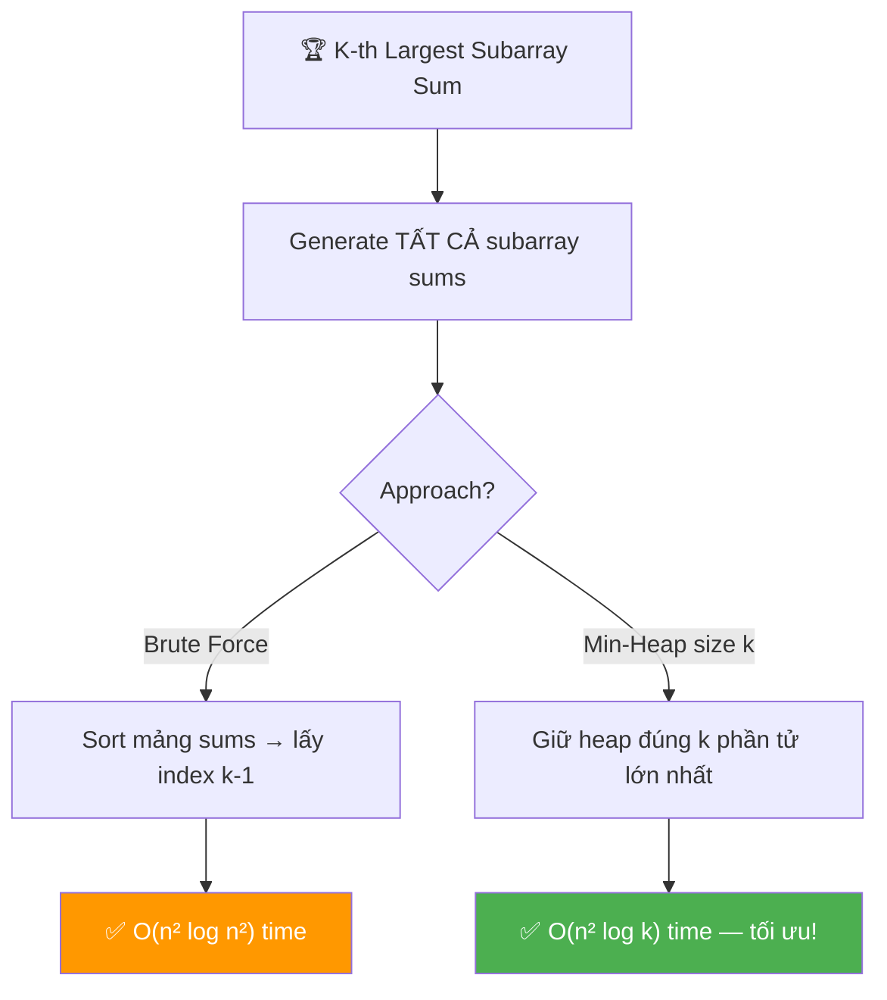
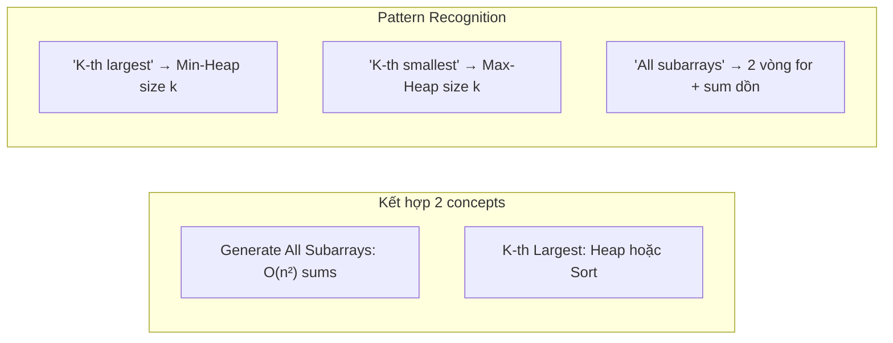
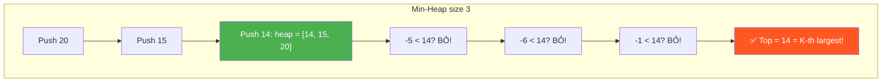
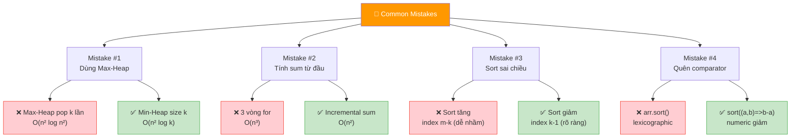
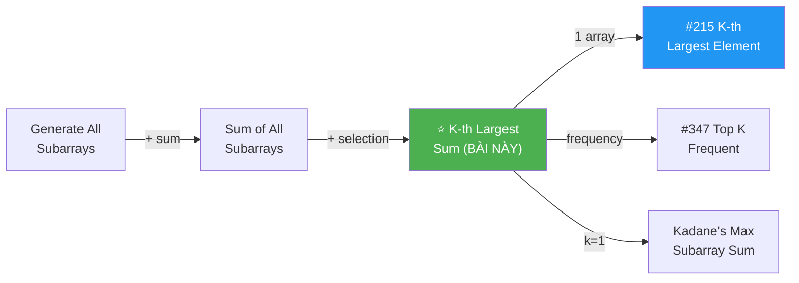
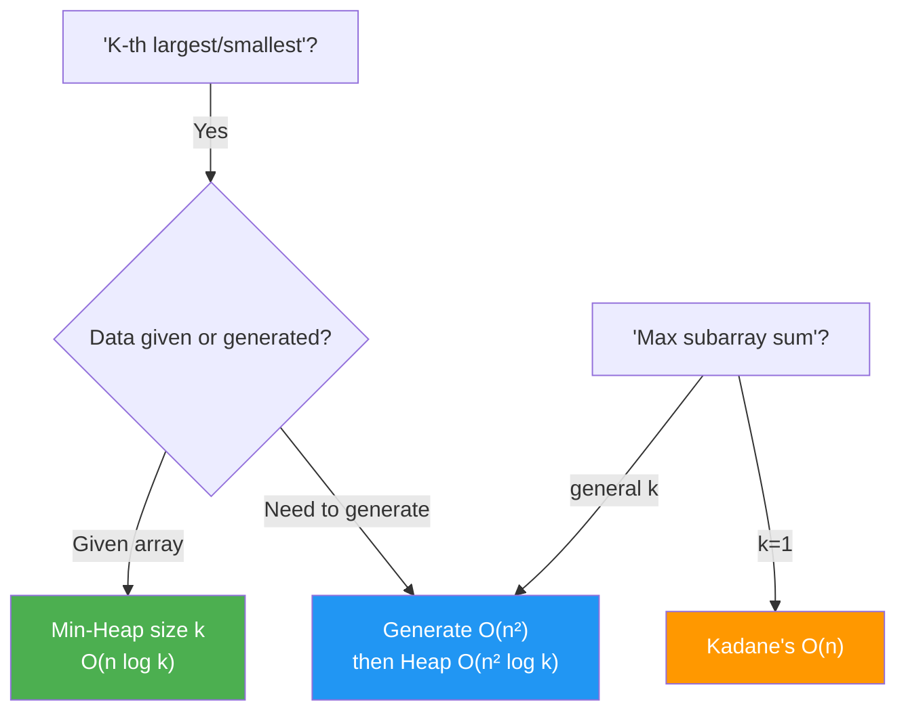
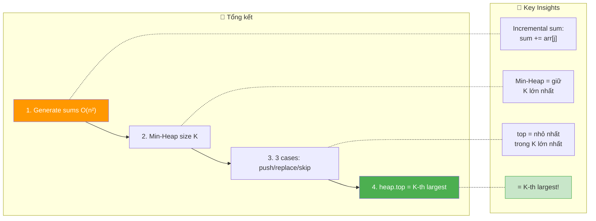

# 🏆 K-th Largest Sum Contiguous Subarray — GfG (Medium)

> 📖 Code: [K-th Largest Sum Subarray.js](./K-th%20Largest%20Sum%20Subarray.js)





---

## R — Repeat & Clarify

🧠 *"Tìm tổng subarray LỚN THỨ K trong TẤT CẢ subarray sums của mảng. Mảng có cả số dương và âm."*

> 🎙️ *"Given an array with both positive and negative numbers, find the k-th largest sum among all contiguous subarray sums."*

### Clarification Questions

```
Q: Subarray là gì?
A: Đoạn phần tử LIÊN TIẾP! [1,2] từ [1,2,3] ✅
   [1,3] → KHÔNG phải subarray (bỏ 2)!

Q: Có bao nhiêu subarray sums?
A: n(n+1)/2 sums (mỗi cặp start, end = 1 subarray)
   n=3 → 6 sums, n=4 → 10 sums, n=100 → 5050 sums!

Q: "K-th largest" = lớn thứ mấy?
A: k=1 → lớn NHẤT, k=2 → lớn THỨ 2, ...
   Sorted giảm dần → lấy index k-1!

Q: Subarray sums có thể TRÙNG không?
A: CÓ! Mỗi sum TÍNH RIÊNG (kể cả trùng giá trị).
   Sums = [20, 15, 14, -5, -6, -1], k=3 → 14

Q: k guaranteed hợp lệ không?
A: CÓ! 1 ≤ k ≤ n(n+1)/2
```

### Tại sao bài này quan trọng?

```
  Bài này KẾT HỢP 2 concepts nền tảng:

  1. Generate All Subarray Sums → O(n²) (đã học!)
  2. K-th Largest Element → Heap/Sort

  BẠN PHẢI hiểu:
  ┌─────────────────────────────────────────────────────┐
  │  "K-th largest" → Min-Heap size k!                   │
  │  → Heap giữ k phần tử lớn nhất                      │
  │  → Top của min-heap = nhỏ nhất trong k lớn nhất     │
  │  → = phần tử lớn thứ k!                             │
  │                                                      │
  │  "All subarray sums" → 2 vòng for + incremental sum │
  │  → KHÔNG cần generate subarray, chỉ cần SUM!        │
  └─────────────────────────────────────────────────────┘

  ⭐ Pattern "K-th largest" xuất hiện RẤT NHIỀU:
    K-th Largest Element in Array (#215)
    K Closest Points to Origin (#973)
    Top K Frequent Elements (#347)
    → ALL dùng Heap!
```

---

## 🧠 Bản chất bài toán — Hiểu để NHỚ, không chỉ để GIẢI

### CHIA BÀI THÀNH 2 PHẦN

```
  ⭐ Bài này = 2 bài NHỎ HƠN ghép lại!

  PHẦN 1: Tính TẤT CẢ subarray sums
    → 2 vòng for + incremental sum
    → arr = [20, -5, -1] → sums = [20, 15, 14, -5, -6, -1]
    → Đã học ở "Generating All Subarrays"!

  PHẦN 2: Tìm phần tử lớn thứ K
    → Sort → lấy index k-1    (đơn giản!)
    → Min-Heap size k          (tối ưu!)

  KẾT HỢP:
    Tính sums → tìm k-th largest trong sums!
```

### PHẦN 1: Incremental Sum — Tính sum KHÔNG cần mảng phụ

```
  ⭐ TRICK: Mỗi khi end tăng 1, sum CHỈ CỘNG THÊM 1 phần tử!

  arr = [20, -5, -1]

  start=0:
    end=0: sum = 20         → sum += arr[0]
    end=1: sum = 20+(-5)=15 → sum += arr[1]  (CỘNG THÊM, không tính lại!)
    end=2: sum = 15+(-1)=14 → sum += arr[2]

  start=1:
    end=1: sum = -5          → reset sum, sum += arr[1]
    end=2: sum = -5+(-1)=-6  → sum += arr[2]

  start=2:
    end=2: sum = -1          → reset sum, sum += arr[2]

  → Tất cả sums: [20, 15, 14, -5, -6, -1]
  → Tổng: n(n+1)/2 = 3×4/2 = 6 sums ✅

  ⚠️ KHÔNG cần mảng phụ chứa subarray!
     Chỉ cần 1 biến sum → reset mỗi start mới!
```

### PHẦN 2: Min-Heap size K — Tại sao?

```
  ⭐ INSIGHT: Giữ K phần tử LỚN NHẤT → đỉnh heap = lớn thứ K!

  Hình dung: TOP K BẢNG ĐIỂM!
    Bạn muốn biết điểm lớn THỨ 3 trong lớp.
    → Giữ 3 điểm cao nhất trong "bảng vinh danh" (heap)
    → Khi có điểm mới:
       Nếu > điểm THẤP NHẤT trên bảng → THAY THẾ!
       Nếu ≤ → bỏ qua!
    → Cuối cùng: điểm thấp nhất trên bảng = lớn thứ 3!

  MIN-HEAP size K:
    → Heap luôn giữ K phần tử lớn nhất
    → Top (min) = nhỏ nhất trong K lớn nhất = LỚN THỨ K!

  Ví dụ: sums = [20, 15, 14, -5, -6, -1], k=3

    Process 20:  heap = [20]               (size < k, push)
    Process 15:  heap = [15, 20]           (size < k, push)
    Process 14:  heap = [14, 15, 20]       (size = k!)
    Process -5:  -5 < heap top (14) → BỎ!
    Process -6:  -6 < 14 → BỎ!
    Process -1:  -1 < 14 → BỎ!

    → heap top = 14 = lớn thứ 3 ✅
```



### Tại sao Min-Heap tốt hơn Sort?

```
  SORT: 
    Lưu TẤT CẢ n(n+1)/2 sums → sort → lấy index k-1
    Time: O(n² log n²) = O(n² × 2 log n) = O(n² log n)
    Space: O(n²) — lưu TẤT CẢ sums!

  MIN-HEAP size k:
    Giữ TỐI ĐA k phần tử → thêm/bỏ O(log k)
    Time: O(n² log k)
    Space: O(k) — chỉ lưu k phần tử!

  So sánh:
    k thường << n² → log k << log n²
    → Heap NHANH HƠN!
    → Và tiết kiệm BỘ NHỚ hơn!

  ⚠️ JavaScript KHÔNG CÓ built-in Heap!
     → Cần implement MinHeap hoặc dùng sort!
     → Trong phỏng vấn: nói "dùng Min-Heap", code sort nếu cần.
```

---

## 🧭 Luồng Suy Nghĩ — Từ đọc đề đến solution

> 💡 Phần này dạy bạn **CÁCH TƯ DUY** để tự giải bài, không chỉ biết đáp án.

### Bước 1: Đọc đề → Gạch chân KEYWORDS

```
  Đề bài: "K-th largest sum of contiguous subarray"

  Gạch chân:
    "contiguous subarray" → subarray LIÊN TIẾP
    "sum"                 → tính TỔNG, không cần lưu subarray
    "k-th largest"        → sắp xếp → lấy thứ k
    "all"                 → enumerate TẤT CẢ sums

  🧠 Tự hỏi: "Bao nhiêu subarray sums?"
    → n(n+1)/2 → O(n²) → PHẢI enumerate hết!
    → Không có cách O(n) vì cần biết TẤT CẢ sums!

  📌 Kỹ năng chuyển giao:
    "K-th largest/smallest" → Heap!
    "All subarray sums" → 2 vòng for + incremental sum!
```

### Bước 2: Vẽ ví dụ NHỎ bằng tay

```
  arr = [20, -5, -1], k = 3

  Tất cả subarrays và sums:
    [20]         → 20
    [20, -5]     → 15
    [20, -5, -1] → 14
    [-5]         → -5
    [-5, -1]     → -6
    [-1]         → -1

  Sắp xếp giảm dần:
    [20, 15, 14, -1, -5, -6]
     #1  #2  #3  #4  #5  #6

  k=3 → 14 ✅
```

### Bước 3: Brute Force → Sort tất cả

```
  🧠 "Cách đơn giản nhất?"
    1. Tính TẤT CẢ subarray sums → mảng sums[]
    2. Sort sums[] giảm dần
    3. Return sums[k-1]

  ✅ Solution 1: O(n² log n) time, O(n²) space
```

### Bước 4: Optimize → Min-Heap

```
  🧠 "Có cần sort TẤT CẢ không?"
    → KHÔNG! Chỉ cần K phần tử lớn nhất!
    → Min-Heap size K → chỉ giữ K lớn nhất!

  🧠 "Tại sao Min-Heap chứ không phải Max-Heap?"
    → Min-Heap: top = NHỎ NHẤT trong heap
    → Nếu phần tử mới > top → thay thế (nó lớn hơn!)
    → Nếu phần tử mới ≤ top → bỏ (nó không nằm trong top K!)
    → Cuối: top = nhỏ nhất trong K lớn nhất = LỚN THỨ K!

  ✅ Solution 2: O(n² log k) time, O(k) space
```

---

## E — Examples

```
VÍ DỤ 1: arr = [20, -5, -1], k = 3

  Subarray sums (incremental):
    start=0: 20, 15, 14
    start=1: -5, -6
    start=2: -1

  All sums: [20, 15, 14, -5, -6, -1]
  Sorted desc: [20, 15, 14, -1, -5, -6]
  k=3 → 14 ✅
```

```
VÍ DỤ 2: arr = [10, -10, 20, -40], k = 6

  Subarray sums (incremental):
    start=0: 10, 0, 20, -20
    start=1: -10, 10, -30
    start=2: 20, -20
    start=3: -40

  All sums: [10, 0, 20, -20, -10, 10, -30, 20, -20, -40]
  Sorted desc: [20, 20, 10, 10, 0, -10, -20, -20, -30, -40]
                #1  #2  #3  #4  #5  #6
  k=6 → -10 ✅
```

### Minh họa trực quan

```
  arr = [20, -5, -1]

  Tất cả subarrays:
    ┌────┐
    │ 20 │ -5  -1    sum=20
    ├────┤────┐
    │ 20 │ -5 │ -1   sum=15
    ├────┤────┤────┐
    │ 20 │ -5 │ -1 │  sum=14
    └────┘────┘────┘
              ┌────┐
     20      │ -5 │ -1    sum=-5
              ├────┤────┐
     20      │ -5 │ -1 │  sum=-6
              └────┘────┘
                   ┌────┐
     20   -5      │ -1 │  sum=-1
                   └────┘

  Sắp xếp: 20 > 15 > 14 > -1 > -5 > -6
                      ↑
                    k=3 → 14!
```

---

## A — Approach

### Approach 1: Generate all sums + Sort — O(n² log n)

```
💡 Ý tưởng: Tính TẤT CẢ sums → sort → lấy index k-1

  1. 2 vòng for: tính tất cả n(n+1)/2 subarray sums
  2. Push vào mảng sums[]
  3. Sort giảm dần
  4. Return sums[k-1]

  ✅ Đơn giản, dễ code
  ❌ O(n²) space — lưu TẤT CẢ sums
  ❌ O(n² log n²) time — sort toàn bộ
```

### Approach 2: Generate sums + Min-Heap size K ⭐

```
💡 Ý tưởng: Dùng Min-Heap giữ K phần tử lớn nhất!

  1. 2 vòng for: tính subarray sums
  2. Với mỗi sum:
     → Nếu heap.size < k: push vào heap
     → Nếu sum > heap.top: pop top, push sum
     → Nếu sum ≤ heap.top: BỎ QUA!
  3. Return heap.top

  ✅ O(n² log k) time — chỉ log k cho mỗi heap operation
  ✅ O(k) space — chỉ giữ k phần tử!
  ⚠️ JS không có built-in heap → cần implement!
```

### So sánh

```
  ┌──────────────────────────┬──────────────┬──────────┬────────────────┐
  │                          │ Time         │ Space    │ Ghi chú         │
  ├──────────────────────────┼──────────────┼──────────┼────────────────┤
  │ Sort all sums            │ O(n² log n)  │ O(n²)    │ Đơn giản        │
  │ Min-Heap size k ⭐       │ O(n² log k)  │ O(k)     │ Tối ưu!         │
  └──────────────────────────┴──────────────┴──────────┴────────────────┘

  ⚠️ Cả 2 đều phải enumerate O(n²) sums — không tránh được!
     Tối ưu ở phần CHỌN k-th largest!
```

---

## C — Code

### Solution 1: Sort tất cả sums — O(n² log n)

```javascript
function kthLargestSumSort(arr, k) {
  const n = arr.length;
  const sums = [];

  // Bước 1: Tính TẤT CẢ subarray sums
  for (let i = 0; i < n; i++) {
    let sum = 0;
    for (let j = i; j < n; j++) {
      sum += arr[j]; // ⭐ Incremental sum!
      sums.push(sum);
    }
  }

  // Bước 2: Sort giảm dần
  sums.sort((a, b) => b - a);

  // Bước 3: Lấy k-th largest
  return sums[k - 1];
}
```

### Giải thích từng phần

```
  PHẦN 1: Incremental Sum

  for (let i = 0; i < n; i++) {  ← start index
    let sum = 0;                  ← RESET mỗi start mới!
    for (let j = i; j < n; j++) { ← end index
      sum += arr[j];              ← CỘNG THÊM 1 phần tử (không tính lại!)
      sums.push(sum);             ← lưu sum
    }
  }

  ⚠️ Tại sao sum += arr[j] mà không tính lại từ đầu?
     j=i:   sum = arr[i]                       ← 1 phần tử
     j=i+1: sum = arr[i] + arr[i+1]            ← thêm 1
     j=i+2: sum = arr[i] + arr[i+1] + arr[i+2] ← thêm 1
     → Mỗi bước CHỈ cộng thêm arr[j] → O(1)!
     → KHÔNG cần vòng for thứ 3!

  PHẦN 2: Sort

  sums.sort((a, b) => b - a);  ← GIẢM DẦN!
  → sums[0] = lớn nhất, sums[k-1] = lớn thứ k

  ⚠️ (a, b) => b - a = GIẢM DẦN
     (a, b) => a - b = TĂNG DẦN
```

### Trace CHI TIẾT: arr = [20, -5, -1], k = 3

```
  n = 3

  ═══ Bước 1: Tính tất cả sums ════════════════════════════

  i=0: sum = 0
    j=0: sum += arr[0] = 0+20 = 20   → sums = [20]
    j=1: sum += arr[1] = 20+(-5) = 15 → sums = [20, 15]
    j=2: sum += arr[2] = 15+(-1) = 14 → sums = [20, 15, 14]

  i=1: sum = 0
    j=1: sum += arr[1] = 0+(-5) = -5  → sums = [20, 15, 14, -5]
    j=2: sum += arr[2] = -5+(-1) = -6 → sums = [20, 15, 14, -5, -6]

  i=2: sum = 0
    j=2: sum += arr[2] = 0+(-1) = -1  → sums = [20, 15, 14, -5, -6, -1]

  Tổng: 6 sums = 3×4/2 ✅

  ═══ Bước 2: Sort giảm dần ═══════════════════════════════

  [20, 15, 14, -5, -6, -1]
  → sorted: [20, 15, 14, -1, -5, -6]

  ═══ Bước 3: Lấy k-th ═══════════════════════════════════

  k=3 → sums[2] = 14 ✅
```

### Solution 2: Min-Heap size K — O(n² log k) ⭐

```javascript
class MinHeap {
  constructor() {
    this.heap = [];
  }

  get size() {
    return this.heap.length;
  }

  get top() {
    return this.heap[0];
  }

  push(val) {
    this.heap.push(val);
    this._bubbleUp(this.heap.length - 1);
  }

  pop() {
    const top = this.heap[0];
    const last = this.heap.pop();
    if (this.heap.length > 0) {
      this.heap[0] = last;
      this._sinkDown(0);
    }
    return top;
  }

  _bubbleUp(i) {
    while (i > 0) {
      const parent = Math.floor((i - 1) / 2);
      if (this.heap[parent] <= this.heap[i]) break;
      [this.heap[parent], this.heap[i]] = [this.heap[i], this.heap[parent]];
      i = parent;
    }
  }

  _sinkDown(i) {
    const n = this.heap.length;
    while (true) {
      let smallest = i;
      const left = 2 * i + 1;
      const right = 2 * i + 2;
      if (left < n && this.heap[left] < this.heap[smallest]) smallest = left;
      if (right < n && this.heap[right] < this.heap[smallest]) smallest = right;
      if (smallest === i) break;
      [this.heap[smallest], this.heap[i]] = [this.heap[i], this.heap[smallest]];
      i = smallest;
    }
  }
}

function kthLargestSumHeap(arr, k) {
  const n = arr.length;
  const heap = new MinHeap();

  for (let i = 0; i < n; i++) {
    let sum = 0;
    for (let j = i; j < n; j++) {
      sum += arr[j];

      if (heap.size < k) {
        heap.push(sum); // Chưa đủ k → push thẳng
      } else if (sum > heap.top) {
        heap.pop(); // Bỏ phần tử nhỏ nhất
        heap.push(sum); // Thêm sum lớn hơn
      }
      // Nếu sum ≤ heap.top → BỎ QUA (không nằm trong top k)
    }
  }

  return heap.top; // ⭐ Top = nhỏ nhất trong k lớn nhất = lớn thứ k!
}
```

### Giải thích Min-Heap — CHI TIẾT

```
  MIN-HEAP:
    → Phần tử NHỎ NHẤT ở đỉnh (top)
    → push/pop đều O(log n) (n = size heap)

  LOGIC:
    heap duy trì K phần tử LỚN NHẤT đã thấy.

    Khi có sum mới:
    ┌──────────────────────────────────────────────────┐
    │  heap.size < k  → push (chưa đủ k!)              │
    │  sum > heap.top → pop + push (thay thế nhỏ nhất) │
    │  sum ≤ heap.top → BỎ QUA (không thuộc top k)     │
    └──────────────────────────────────────────────────┘

    Cuối cùng:
    → heap chứa K sum lớn nhất
    → heap.top = NHỎ NHẤT trong K lớn nhất = LỚN THỨ K!

  ⚠️ Tại sao Min-Heap chứ không phải Max-Heap?
     Min-Heap: top = NHỎ NHẤT → dễ so sánh "có lớn hơn top?"
     → Nếu lớn hơn → thay thế top → giữ K lớn nhất!

     Max-Heap: top = LỚN NHẤT → không biết ai NHỎ NHẤT
     → Khó biết phần tử nào cần bỏ!
```

### Trace Min-Heap: arr = [20, -5, -1], k = 3

```
  ═══ Process sums theo thứ tự generate ════════════════════

  sum=20:  heap.size=0 < 3 → push(20)
           heap = [20]

  sum=15:  heap.size=1 < 3 → push(15)
           heap = [15, 20]

  sum=14:  heap.size=2 < 3 → push(14)
           heap = [14, 20, 15]    ← SIZE = K!
                   ↑ top = 14

  sum=-5:  -5 ≤ heap.top(14) → BỎ!

  sum=-6:  -6 ≤ 14 → BỎ!

  sum=-1:  -1 ≤ 14 → BỎ!

  → heap.top = 14 = lớn thứ 3 ✅

  Heap chứa: [14, 20, 15] = 3 sum lớn nhất!
```

### Trace Min-Heap: arr = [10, -10, 20, -40], k = 6

```
  Sums generated (theo thứ tự):
    i=0: 10, 0, 20, -20
    i=1: -10, 10, -30
    i=2: 20, -20
    i=3: -40

  ═══ Process từng sum ════════════════════════════════════

  sum=10:    size=0<6 → push   heap=[10]
  sum=0:     size=1<6 → push   heap=[0, 10]
  sum=20:    size=2<6 → push   heap=[0, 10, 20]
  sum=-20:   size=3<6 → push   heap=[-20, 0, 20, 10]
  sum=-10:   size=4<6 → push   heap=[-20, -10, 20, 10, 0]
  sum=10:    size=5<6 → push   heap=[-20, -10, 20, 10, 0, 10]
                                 ↑ top = -20, size = 6 = k!

  sum=-30:   -30 ≤ top(-20) → BỎ!
  sum=20:    20 > top(-20) → pop(-20), push(20)
             heap = [-10, 0, 10, 10, 20, 20]
                      ↑ top = -10

  sum=-20:   -20 ≤ top(-10) → BỎ!
  sum=-40:   -40 ≤ -10 → BỎ!

  → heap.top = -10 = lớn thứ 6 ✅

  Kiểm tra: sorted desc = [20, 20, 10, 10, 0, -10, ...]
                           #1  #2  #3  #4  #5  #6 ✅
```

> 🎙️ *"I generate all subarray sums using two nested loops with an incremental running sum — O(n²) sums total. To find the k-th largest, I maintain a min-heap of size k. For each sum: if the heap has fewer than k elements, I push; otherwise, I only push if the sum exceeds the heap's top, replacing the minimum. The final heap top is the k-th largest sum."*

---

## 🔬 Deep Dive — Giải thích CHI TIẾT từng dòng

> 💡 Phần này phân tích **từng dòng** Min-Heap solution để bạn hiểu **TẠI SAO**.

```javascript
function kthLargestSumHeap(arr, k) {
  // ═══════════════════════════════════════════════════════════
  // DÒNG 1-2: Khởi tạo
  // ═══════════════════════════════════════════════════════════
  //
  // n = arr.length → dùng cho loop bounds
  // MinHeap: cấu trúc dữ liệu giữ K phần tử LỚN NHẤT
  //
  // TẠI SAO Min-Heap chứ không Max-Heap?
  //   → Min-Heap: top = NHỎ NHẤT → so sánh "sum > top?" O(1)
  //   → Nếu sum > top → thay thế → heap vẫn giữ K lớn nhất!
  //   → Max-Heap: top = LỚN NHẤT → không biết phần tử NHỎ nhất ở đâu!
  //
  const n = arr.length;
  const heap = new MinHeap();

  // ═══════════════════════════════════════════════════════════
  // DÒNG 3-5: Generate ALL subarray sums — O(n²)
  // ═══════════════════════════════════════════════════════════
  //
  // 2 vòng for: i = start, j = end
  // sum = running sum → reset mỗi start mới
  //
  // TẠI SAO sum += arr[j] mà không tính lại?
  //   → subarray [i..j] = subarray [i..j-1] + arr[j]
  //   → Chỉ CỘNG THÊM 1 phần tử → O(1) mỗi sum!
  //   → Nếu tính lại: for k=i to j → O(n) mỗi sum → O(n³) tổng!
  //
  for (let i = 0; i < n; i++) {
    let sum = 0;                    // ← RESET mỗi start mới!
    for (let j = i; j < n; j++) {
      sum += arr[j];                // ← INCREMENTAL: O(1)!

      // ═════════════════════════════════════════════════════
      // DÒNG 6-8: Heap logic — giữ K phần tử lớn nhất
      // ═════════════════════════════════════════════════════
      //
      // 3 cases:
      //
      // Case 1: heap.size < k → chưa đủ K → push thẳng!
      //   → Đang xây dựng top K, cần thêm phần tử
      //
      // Case 2: sum > heap.top → sum lớn hơn phần tử NHỎ NHẤT trong heap
      //   → Phần tử top KHÔNG thuộc top K nữa → thay thế!
      //   → pop top (loại nhỏ nhất), push sum (thêm lớn hơn)
      //
      // Case 3: sum ≤ heap.top → sum KHÔNG thuộc top K
      //   → BỎ QUA! Không cần xử lý!
      //   → ⚠️ QUAN TRỌNG: phải có case này để tránh push thừa!
      //
      if (heap.size < k) {
        heap.push(sum);
      } else if (sum > heap.top) {
        heap.pop();
        heap.push(sum);
      }
      // sum ≤ heap.top → BỎ QUA
    }
  }

  // ═══════════════════════════════════════════════════════════
  // DÒNG 9: Return heap.top — THE ANSWER!
  // ═══════════════════════════════════════════════════════════
  //
  // heap chứa K sum lớn nhất
  // heap.top = NHỎ NHẤT trong K lớn nhất = LỚN THỨ K!
  //
  // VD: k=3, heap = [14, 20, 15]
  //   top = 14 = nhỏ nhất trong {14, 15, 20} = lớn thứ 3 ✅
  //
  return heap.top;
}
```

---

## 📐 Invariant — Chứng minh tính đúng đắn

```
  📐 INVARIANT (bất biến) cho Min-Heap size K:

  Sau khi xử lý m sums (m = số sums đã xét):

    Gọi S = tập m sums đã xét, TOP_K(S) = K sums lớn nhất trong S.

    INV: heap chứa CHÍNH XÁC min(m, k) phần tử lớn nhất trong S.
         Nếu m ≥ k: heap.top = phần tử LỚN THỨ K trong S.

  CHỨNG MINH:
  ┌──────────────────────────────────────────────────────────────┐
  │  Base: m = 0                                                 │
  │    heap rỗng, S rỗng → trivially true ✅                    │
  │                                                              │
  │  Inductive: giả sử INV đúng sau m sums.                    │
  │  Xét sum thứ (m+1) = s:                                    │
  │                                                              │
  │  Case 1: heap.size < k                                      │
  │    → push s → heap chứa m+1 phần tử (tất cả đã thấy)      │
  │    → m+1 ≤ k → heap = TẤT CẢ sums đã thấy ✅              │
  │                                                              │
  │  Case 2: s > heap.top (heap.size = k)                       │
  │    → s thuộc top K mới (vì s > phần tử nhỏ nhất trong top K)│
  │    → pop top (loại phần tử NHỎ NHẤT trong top K cũ)        │
  │    → push s (thêm phần tử MỚI vào top K)                   │
  │    → heap vẫn chứa K lớn nhất ✅                            │
  │                                                              │
  │  Case 3: s ≤ heap.top (heap.size = k)                       │
  │    → s KHÔNG thuộc top K (nhỏ hơn hoặc bằng TẤT CẢ trong  │
  │      top K cũ, nhưng top K đã đầy)                          │
  │    → BỎ QUA → heap không đổi → vẫn chứa K lớn nhất ✅      │
  │                                                              │
  │  Termination: m = n(n+1)/2 (tất cả sums)                   │
  │    → heap.top = LỚN THỨ K trong TẤT CẢ subarray sums ∎    │
  └──────────────────────────────────────────────────────────────┘

  📐 TIME COMPLEXITY PROOF:
    Outer loop: n iterations
    Inner loop: n-i iterations mỗi i
    Total sums: Σ(n-i) = n(n+1)/2 = O(n²)
    Mỗi sum: heap operation O(log k) (push hoặc pop+push)
    → Total: O(n² log k) ∎

  📐 SPACE:
    heap giữ tối đa k phần tử → O(k) ∎
```

---

## O — Optimize

```
                       Time           Space     Ghi chú
  ──────────────────────────────────────────────────────
  Sort all sums        O(n² log n)    O(n²)     Simple
  Min-Heap size k ⭐   O(n² log k)    O(k)      Optimal

  ⚠️ KHÔNG THỂ tốt hơn O(n²) cho generating sums!
     Có n(n+1)/2 sums → phải enumerate hết → Ω(n²) lower bound!

  ⚠️ Phần tối ưu: CHỌN k-th largest
     Sort tất cả: O(n² log n²) = O(n² log n)
     Heap size k: O(n² log k)
     Khi k << n²: log k << log n → Heap NHANH HƠN!

  📊 Ví dụ cụ thể: n=1000, k=10
     Sort: 1000² × log(1000²) ≈ 1M × 20 = 20M operations
     Heap: 1000² × log(10) ≈ 1M × 3.3 = 3.3M operations
     → Heap NHANH GẤP 6 LẦN!
```

---

## T — Test

```
Test Cases:
  [20, -5, -1],          k=3  → 14    ✅ basic
  [10, -10, 20, -40],    k=6  → -10   ✅ có âm lớn
  [1, 2, 3],             k=1  → 6     ✅ k=1 = max sum = toàn mảng
  [1, 2, 3],             k=6  → 1     ✅ k=max = min sum
  [5],                   k=1  → 5     ✅ 1 phần tử
  [-1, -2, -3],          k=1  → -1    ✅ toàn âm, max = -1
  [1, -1, 1],            k=3  → 1     ✅ sums trùng
  [3, -2, 5],            k=2  → 5     ✅ 2nd largest
```

---

## 🗣️ Interview Script

### 🎙️ Think Out Loud — Mô phỏng phỏng vấn thực

> ⚠️ Script này dạy cách **NÓI**, không phải cách CODE.
> Mỗi đoạn = cách bạn **PHÁT BIỂU** trong phỏng vấn thực!

```
  ╔══════════════════════════════════════════════════════════════╗
  ║  🕐 FULL INTERVIEW SIMULATION — 1h30 (90 phút)             ║
  ║                                                              ║
  ║  00:00-05:00  Introduction + Icebreaker         (5 min)     ║
  ║  05:00-45:00  Problem Solving                   (40 min)    ║
  ║  45:00-60:00  Deep Technical Probing            (15 min)    ║
  ║  60:00-75:00  Variations + Extensions           (15 min)    ║
  ║  75:00-85:00  System Design at Scale            (10 min)    ║
  ║  85:00-90:00  Behavioral + Q&A                  (5 min)     ║
  ╚══════════════════════════════════════════════════════════════╝
```

```
  ╔══════════════════════════════════════════════════════════════╗
  ║  PART 1: INTRODUCTION (00:00 — 05:00)                       ║
  ╚══════════════════════════════════════════════════════════════╝

  👤 "Tell me about yourself and a time you decomposed
      a complex problem into simpler sub-problems."

  🧑 "I'm a frontend engineer with [X] years of experience.
      A relevant example: I built a dashboard analytics
      feature that needed to find the top K performing
      time windows from all possible date ranges.

      I decomposed it into two sub-problems:
      1. Generate all valid date range metrics (O of n squared
         combinations of start/end dates).
      2. Select the K-th largest using a min-heap of size K.

      Same decomposition as K-th Largest Sum Subarray:
      generate all subarray sums, then find K-th largest."

  👤 "Nice decomposition. Let's formalize."
```

```
  ╔══════════════════════════════════════════════════════════════╗
  ║  PART 2: PROBLEM SOLVING (05:00 — 45:00)                   ║
  ╚══════════════════════════════════════════════════════════════╝

  ──────────────── 05:00 — Clarify (3 phút) ────────────────

  👤 "Find the k-th largest sum among all contiguous
      subarray sums."

  🧑 "Let me clarify.

      Contiguous subarray: consecutive elements.
      [1,2] from [1,2,3] is valid, [1,3] is not.

      How many subarray sums? n times (n+1) over 2.
      For n equals 3: 6 sums. For n equals 100: 5050.

      K-th largest: k equals 1 is the maximum sum,
      k equals n(n+1)/2 is the minimum sum.

      Array contains BOTH positive and negative numbers.
      Duplicate sums are counted separately.

      I decompose this into two sub-problems:
      1. Generate all subarray sums efficiently.
      2. Find the k-th largest among them."

  ──────────────── 08:00 — Scoreboard Analogy (2 phút) ────────

  🧑 "I think of this as a TOP-K SCOREBOARD.

      Imagine a tournament with n(n+1)/2 players.
      Each player's score is a subarray sum.
      I need the K-th highest score.

      I keep a scoreboard of size K (min-heap).
      New player arrives:
      Score higher than the lowest on the board?
      Replace the lowest. Otherwise, rejected.

      At the end, the lowest score on the board
      is exactly the K-th highest overall."

  ──────────────── 10:00 — Brute Force (3 phút) ────────────────

  🧑 "Brute force: generate all sums, sort, take index k-1.

      Step 1: Two nested loops with incremental sum.
      For each start i, reset sum to 0.
      For each end j from i, sum plus-equals arr at j.
      Push each sum into an array.
      Total: n(n+1)/2 sums.

      Step 2: Sort descending.
      Step 3: Return sums at k minus 1.

      Time: O of n squared log n for the sort.
      Space: O of n squared to store all sums."

  ──────────────── 13:00 — Incremental Sum detail (3 phút) ────

  👤 "Why incremental sum instead of recalculating?"

  🧑 "Subarray [i..j] equals subarray [i..j-1] plus arr at j.

      If I recalculate from scratch each time:
      for k equals i to j, sum plus-equals arr at k.
      That's O of n per sum, O of n cubed total.

      With incremental sum:
      just sum plus-equals arr at j.
      O of 1 per sum, O of n squared total.

      The difference: n cubed vs n squared.
      For n equals 1000: billion vs million operations."

  ──────────────── 16:00 — Optimize with Min-Heap (5 phút) ────

  🧑 "Key insight: I don't need ALL sums sorted.
      I only need the K LARGEST.

      Min-Heap of size K:
      The heap always contains the K largest sums seen so far.
      The top of a min-heap is the SMALLEST element.
      So the top equals the smallest among the K largest
      equals the K-th largest.

      For each new sum:
      If heap size less than K: push directly.
      If sum greater than heap top: pop top, push sum.
      If sum at most heap top: skip.

      Time: O of n squared log k.
      Space: O of k.

      When k is much smaller than n squared,
      log k is much smaller than log n squared.
      Significant speedup."

  ──────────────── 21:00 — Write Code (5 phút) ────────────────

  🧑 "The code.

      function kthLargestSum of arr, k.
      const n equals arr dot length.
      const heap equals new MinHeap.

      for let i equals 0; i less than n; i++:
        let sum equals 0.
        for let j equals i; j less than n; j++:
          sum plus-equals arr at j.

          if heap dot size less than k:
            heap dot push of sum.
          else if sum greater than heap dot top:
            heap dot pop.
            heap dot push of sum.

      return heap dot top."

  ──────────────── 26:00 — Trace example (4 phút) ────────────

  🧑 "Trace with [20, -5, -1], k equals 3.

      Sums generated: 20, 15, 14, -5, -6, -1.

      sum 20: heap size 0 less than 3. Push. heap equals [20].
      sum 15: heap size 1 less than 3. Push. heap equals [15, 20].
      sum 14: heap size 2 less than 3. Push. heap equals [14, 20, 15].
      Now heap size equals k equals 3!

      sum -5: -5 at most heap top 14. Skip.
      sum -6: -6 at most 14. Skip.
      sum -1: -1 at most 14. Skip.

      heap top equals 14 equals 3rd largest. Correct!"

  ──────────────── 30:00 — Complexity (3 phút) ────────────────

  🧑 "Time: O of n squared log k.
      Generating sums: O of n squared.
      Each heap operation: O of log k.
      Total: n squared times log k.

      Space: O of k for the heap.
      Compare with sort approach: O of n squared space.

      Is this optimal? For generating sums, yes.
      There are n(n+1)/2 sums, must enumerate all.
      Omega of n squared lower bound.
      The heap reduces the selection cost from
      O of n squared log n to O of n squared log k."

  ──────────────── 33:00 — Edge Cases (2 phút) ────────────────

  🧑 "Edge cases.

      k equals 1: maximum subarray sum.
      k equals n(n+1)/2: minimum subarray sum.

      Single element: [5], k equals 1. Return 5.
      All negative: [-1, -2, -3], k equals 1.
      Max sum is -1 (single element). Correct.

      Duplicate sums: [1, -1, 1], sums include
      multiple 1's and 0's. Each counted separately."
```

```
  ╔══════════════════════════════════════════════════════════════╗
  ║  PART 3: DEEP TECHNICAL PROBING (45:00 — 60:00)            ║
  ╚══════════════════════════════════════════════════════════════╝

  ──────────────── 45:00 — Why Min-Heap not Max-Heap? (3 phút) ──

  👤 "Why not use a Max-Heap?"

  🧑 "Two possible Max-Heap approaches, both worse:

      Approach A: Build max-heap of all sums, pop k times.
      Build: O of n squared. Pop k times: O of k log n squared.
      Total: O of n squared plus k log n).
      When k is large, this is worse than min-heap.
      Also requires O of n squared space.

      Approach B: Max-heap of size n squared minus k.
      Keeps the n squared minus k SMALLEST sums.
      Wasteful when k is small (most common case).

      Min-Heap of size k:
      O of n squared log k time, O of k space.
      Optimal for small k. Clean and intuitive."

  ──────────────── 48:00 — Quickselect alternative (3 phút) ────

  👤 "Could you use Quickselect instead?"

  🧑 "Yes! Generate all sums into an array,
      then use Quickselect to find the k-th largest.

      Quickselect: O of n squared average for finding
      k-th element in an array of size n squared.
      But worst case O of n to the 4th.

      Compared to heap: O of n squared log k (guaranteed).
      Quickselect is faster on average but has worse
      worst-case guarantees.

      In interviews I prefer the heap approach:
      deterministic performance, clear logic,
      and O of k space vs O of n squared."

  ──────────────── 51:00 — Prefix sum alternative (4 phút) ────

  👤 "Could you optimize sum generation with prefix sums?"

  🧑 "Yes! prefix at i equals sum of arr [0..i-1].
      Subarray sum [i..j] equals prefix at j+1 minus prefix at i.

      But this doesn't reduce the asymptotic complexity.
      There are still n(n+1)/2 sums to compute.
      Prefix just changes the constant factor.

      The incremental sum approach is equivalent:
      for each fixed i, sum plus-equals arr at j
      is the same as prefix at j+1 minus prefix at i.

      Both are O of n squared. No improvement possible."

  ──────────────── 55:00 — Kadane's for k=1 (3 phút) ────────────

  👤 "If k equals 1, could you do better?"

  🧑 "Yes! k equals 1 means maximum subarray sum.
      That's Kadane's algorithm: O of n time, O of 1 space.

      Kadane's: track current max ending here
      and global max. At each element, decide
      'extend or start fresh.'

      But this problem asks for ARBITRARY k,
      not just k equals 1. Kadane's only works for the max.

      For general k, we MUST enumerate all sums.
      No known algorithm avoids the O of n squared
      enumeration for arbitrary k."
```

```
  ╔══════════════════════════════════════════════════════════════╗
  ║  PART 4: VARIATIONS (60:00 — 75:00)                         ║
  ╚══════════════════════════════════════════════════════════════╝

  ──────────────── 60:00 — K-th Largest Element (#215) (3 phút) ──

  👤 "How does this relate to K-th Largest Element?"

  🧑 "K-th Largest Element in Array (LeetCode 215):
      same selection problem, but on a GIVEN array.
      No need to generate sums.

      Three approaches for #215:
      Sort: O of n log n.
      Min-Heap size k: O of n log k.
      Quickselect: O of n average.

      Our problem: first GENERATE O of n squared sums,
      then apply the same selection techniques.
      The generation step dominates."

  ──────────────── 63:00 — K-th Smallest Sum (2 phút) ────────

  👤 "What about K-th SMALLEST subarray sum?"

  🧑 "Flip the heap! Use a MAX-Heap of size k.

      Max-heap keeps the K SMALLEST sums.
      Top equals LARGEST of the K smallest
      equals K-th smallest.

      Or: sort ascending, take sums at k minus 1.

      Same complexity, just reversed comparison."

  ──────────────── 65:00 — Top K sums (3 phút) ────────────────

  👤 "What if you need ALL top K sums, not just the K-th?"

  🧑 "After the heap pass, the heap contains exactly
      the K largest sums. Extract all K elements.

      To get them in sorted order:
      pop all K elements from the heap.
      They come out in ascending order (min-heap).
      Reverse for descending.

      Time: O of n squared log k plus k log k.
      The k log k for extraction is negligible."

  ──────────────── 68:00 — Subarray sum equals K (3 phút) ────

  👤 "What about finding subarrays whose sum equals K?"

  🧑 "Completely different problem!
      That's Subarray Sum Equals K (LeetCode 560).

      Technique: prefix sum plus hashmap.
      For each prefix at j, check if
      prefix at j minus K exists in the map.

      O of n time, O of n space.
      Does NOT enumerate all sums.

      Key distinction: 'sum equals K' uses prefix sum math.
      'K-th largest sum' requires enumeration."

  ──────────────── 71:00 — Streaming variant (4 phút) ────────

  👤 "What if the array is a stream of numbers?"

  🧑 "If elements arrive one at a time:
      with each new element, new subarrays appear
      (all subarrays ending at the new element).

      For each new element at index j:
      update running sums for all start positions
      i from 0 to j. That's j+1 new sums.

      Feed each new sum into the min-heap.
      The heap always has the K-th largest
      across all sums seen so far.

      Time per element: O of j log k.
      Total: O of n squared log k. Same asymptotic."
```

```
  ╔══════════════════════════════════════════════════════════════╗
  ║  PART 5: SYSTEM DESIGN AT SCALE (75:00 — 85:00)            ║
  ╚══════════════════════════════════════════════════════════════╝

  ──────────────── 75:00 — Real-world applications (5 phút) ────

  👤 "Where does this pattern appear in real systems?"

  🧑 "Several domains!

      First — TIME SERIES ANALYTICS.
      Finding the K-th best performing time window
      in stock prices or website traffic.
      Each contiguous time window is a subarray.

      Second — NETWORK MONITORING.
      Identifying the K-th highest bandwidth usage
      across all time intervals on a network link.
      Helps capacity planning.

      Third — SLIDING WINDOW METRICS.
      In dashboards: out of all possible date ranges,
      find the K most impactful periods.
      The min-heap approach streams results efficiently.

      Fourth — DATABASE QUERY OPTIMIZATION.
      Finding the K-th most expensive query span
      in a log of query execution times."

  ──────────────── 80:00 — Scaling (5 phút) ────────────────

  👤 "How would you handle very large n?"

  🧑 "For very large n, n squared sums is prohibitive.

      Strategies:

      1. APPROXIMATION: sample random subarrays
      instead of enumerating all. Use reservoir sampling
      to maintain approximate top K.

      2. PRUNING: if the array is mostly positive,
      short subarrays near the max element dominate.
      Skip subarrays that can't possibly be in top K.

      3. PARALLEL: partition the outer loop across
      threads. Each thread maintains its own min-heap
      of size K. Merge heaps at the end.

      4. For k equals 1 or small k:
      specialized algorithms exist that avoid
      full enumeration (e.g., Kadane's for k=1)."
```

```
  ╔══════════════════════════════════════════════════════════════╗
  ║  PART 6: BEHAVIORAL + Q&A (85:00 — 90:00)                  ║
  ╚══════════════════════════════════════════════════════════════╝

  ──────────────── 85:00 — Reflection (3 phút) ────────────────

  👤 "What would you take away from this problem?"

  🧑 "Three things.

      First, PROBLEM DECOMPOSITION.
      This problem is naturally two sub-problems:
      generate sums and select K-th largest.
      Identifying this decomposition is the key insight.

      Second, the MIN-HEAP SIZE K pattern.
      'K-th largest' maps to min-heap of size K.
      'K-th smallest' maps to max-heap of size K.
      This pattern appears in dozens of problems.

      Third, INCREMENTAL COMPUTATION.
      Computing subarray sums incrementally
      (sum plus-equals arr at j) instead of from scratch
      reduces O of n cubed to O of n squared.
      Always look for ways to reuse previous computation."

  ──────────────── 88:00 — Questions (2 phút) ────────────────

  👤 "Any questions for me?"

  🧑 "A few!

      First — the min-heap pattern for top-K
      is a streaming-friendly data structure.
      Does your system use heap-based approaches
      for real-time analytics or ranking?

      Second — the O of n squared enumeration
      is a bottleneck. Does your team encounter
      similar quadratic scan problems, and if so,
      have you found practical approximations?

      Third — problem decomposition was key here.
      How does your team approach breaking down
      complex features into independent sub-problems?"

  👤 "Excellent! The decomposition into 'generate sums'
      plus 'select K-th' was immediately clear.
      The incremental sum optimization and the heap
      invariant proof showed strong fundamentals.
      We'll be in touch!"
```

```
  ╔══════════════════════════════════════════════════════════════╗
  ║  ⭐ 8 MẸO NÓI CHUYỆN (K-th Largest Sum Subarray)         ║
  ╚══════════════════════════════════════════════════════════════╝

  📌 MẸO #1: Decompose immediately
     ✅ "Two sub-problems: generate all subarray sums O(n²),
         then find K-th largest using min-heap O(n² log k)."

  📌 MẸO #2: Explain incremental sum
     ✅ "sum += arr[j] reuses previous computation.
         O(1) per sum instead of O(n). Avoids O(n³)."

  📌 MẸO #3: Explain Min-Heap choice
     ✅ "Min-heap size K: top = smallest of K largest
         = K-th largest. O(log k) per operation."

  📌 MẸO #4: State the 3 heap cases
     ✅ "Size < k: push. Sum > top: replace. Sum ≤ top: skip."

  📌 MẸO #5: Know Kadane's for k=1
     ✅ "k=1 is max subarray sum = Kadane's O(n).
         But general k requires O(n²) enumeration."

  📌 MẸO #6: Compare with sort approach
     ✅ "Sort: O(n² log n), O(n²) space.
         Heap: O(n² log k), O(k) space. Strictly better."

  📌 MẸO #7: Know the flip for K-th smallest
     ✅ "K-th largest → Min-Heap size K.
         K-th smallest → Max-Heap size K."

  📌 MẸO #8: JS heap caveat
     ✅ "JavaScript has no built-in heap.
         Mention heap in discussion, implement or use sort."
```

## ❌ Common Mistakes — Lỗi thường gặp



### Mistake 1: Dùng Max-Heap thay vì Min-Heap!

```javascript
// ❌ SAI: Max-Heap → pop k lần → O(n² log n²)
const maxHeap = new MaxHeap();
for (const sum of allSums) maxHeap.push(sum);  // O(n²) space!
for (let i = 0; i < k - 1; i++) maxHeap.pop(); // O(k log n²)!
return maxHeap.top;
// → Build O(n²) + pop O(k log n²) — TỆ HƠN sort!

// ✅ ĐÚNG: Min-Heap size k → O(n² log k), O(k) space
const minHeap = new MinHeap();
for (const sum of allSums) {
  if (minHeap.size < k) minHeap.push(sum);
  else if (sum > minHeap.top) { minHeap.pop(); minHeap.push(sum); }
}
return minHeap.top;  // K-th largest!
```

### Mistake 2: Tính sum từ đầu mỗi lần!

```javascript
// ❌ SAI: O(n³) — 3 vòng for!
for (let i = 0; i < n; i++)
  for (let j = i; j < n; j++) {
    let sum = 0;
    for (let k = i; k <= j; k++) sum += arr[k];  // ← O(n) mỗi lần!
    sums.push(sum);
  }

// ✅ ĐÚNG: O(n²) — incremental sum!
for (let i = 0; i < n; i++) {
  let sum = 0;                       // ← RESET mỗi start!
  for (let j = i; j < n; j++) {
    sum += arr[j];                   // ← O(1) CỘNG THÊM!
    sums.push(sum);
  }
}
```

### Mistake 3: Sort sai chiều + index sai!

```javascript
// ❌ DỄ NHẦM: sort TĂNG → index phức tạp
sums.sort((a, b) => a - b);         // tăng dần
return sums[sums.length - k];       // phải tính m-k! Dễ off-by-one!

// ✅ RÕ RÀNG: sort GIẢM → index k-1!
sums.sort((a, b) => b - a);         // giảm dần
return sums[k - 1];                  // trực tiếp!
```

### Mistake 4: Quên JavaScript sort comparator!

```javascript
// ❌ SAI: default sort = LEXICOGRAPHIC!
[10, 20, 3, 1].sort()
// → ["1", "10", "20", "3"] → [1, 10, 20, 3] → SAI!

// ✅ ĐÚNG: numeric comparator!
[10, 20, 3, 1].sort((a, b) => b - a)
// → [20, 10, 3, 1] → ĐÚNG!
```

---

## 📚 Bài tập liên quan — Practice Problems

### Progression Path



### 1. K-th Largest Element in Array (#215) — Medium

```
  Đề: Tìm phần tử lớn thứ K trong mảng (KHÔNG sorted).

  // Min-Heap size k — O(n log k)
  function findKthLargest(nums, k) {
    const heap = new MinHeap();
    for (const num of nums) {
      if (heap.size < k) {
        heap.push(num);
      } else if (num > heap.top) {
        heap.pop();
        heap.push(num);
      }
    }
    return heap.top;
  }

  // Sort — O(n log n)
  function findKthLargestSort(nums, k) {
    nums.sort((a, b) => b - a);
    return nums[k - 1];
  }

  📌 CÙNG PATTERN! Chỉ khác: không cần generate sums!
```

### 2. Maximum Subarray Sum (Kadane's) — Medium

```
  Đề: Tìm subarray có tổng LỚN NHẤT (= K-th largest với k=1).

  function maxSubarraySum(nums) {
    let maxEndingHere = nums[0];
    let maxSoFar = nums[0];
    for (let i = 1; i < nums.length; i++) {
      maxEndingHere = Math.max(nums[i], maxEndingHere + nums[i]);
      maxSoFar = Math.max(maxSoFar, maxEndingHere);
    }
    return maxSoFar;
  }

  📌 O(n) chỉ cho k=1! General k cần O(n²) enumerate!
```

### 3. Top K Frequent Elements (#347) — Medium

```
  Đề: Tìm K phần tử xuất hiện NHIỀU NHẤT.

  function topKFrequent(nums, k) {
    const freq = new Map();
    for (const num of nums) freq.set(num, (freq.get(num) || 0) + 1);

    // Min-Heap on frequency, size k
    const heap = new MinHeap();  // compare by frequency
    for (const [num, count] of freq) {
      if (heap.size < k) heap.push({ num, count });
      else if (count > heap.top.count) {
        heap.pop();
        heap.push({ num, count });
      }
    }
    return heap.heap.map(item => item.num);
  }

  📌 CÙNG PATTERN Min-Heap size K! Khác: heap trên frequency!
```

### Tổng kết — "K-th" Pattern Family

```
  ┌──────────────────────────────────────────────────────────────┐
  │  BÀI                     │ Generate     │ Selection          │
  ├──────────────────────────────────────────────────────────────┤
  │  K-th Largest Sum ⭐     │ O(n²) sums   │ Min-Heap k         │
  │  K-th Largest Element    │ — (given)    │ Min-Heap k / QS    │
  │  Top K Frequent          │ HashMap freq │ Min-Heap k         │
  │  K Closest Points        │ — (given)    │ Max-Heap k         │
  │  Max Subarray Sum        │ —            │ Kadane's O(n)      │
  └──────────────────────────────────────────────────────────────┘

  📌 RULE: "K-th largest" → Min-Heap size K!
           "K-th smallest" → Max-Heap size K!
           Decompose into Generate + Select!
```

---

## 📌 Kỹ năng chuyển giao — Pattern Summary



---

## 📊 Tổng kết — Key Insights



```
  ┌──────────────────────────────────────────────────────────────────────────┐
  │  📌 3 ĐIỀU PHẢI NHỚ                                                    │
  │                                                                          │
  │  1. DECOMPOSE: bài = 2 sub-problems!                                   │
  │     Generate all subarray sums (O(n²) — incremental!)                  │
  │     + Find K-th largest (Min-Heap size K!)                             │
  │                                                                          │
  │  2. INCREMENTAL SUM: sum += arr[j] → O(1) mỗi sum!                    │
  │     Reset sum = 0 mỗi start mới!                                      │
  │     KHÔNG tính lại từ đầu (O(n) → O(n³) tổng!)                       │
  │                                                                          │
  │  3. MIN-HEAP SIZE K: 3 cases!                                          │
  │     heap.size < k → push (chưa đủ K!)                                 │
  │     sum > heap.top → pop + push (thay thế nhỏ nhất!)                  │
  │     sum ≤ heap.top → SKIP (không thuộc top K!)                        │
  │     → heap.top = K-th largest ✅                                       │
  └──────────────────────────────────────────────────────────────────────────┘
```

---

## 📝 Flashcard — Tự kiểm tra

| ❓ Câu hỏi | ✅ Đáp án |
|---|---|
| Bao nhiêu subarray sums? | **n(n+1)/2** |
| Cách tính sum hiệu quả? | Incremental: `sum += arr[j]`, reset mỗi start |
| Tại sao incremental? | Tránh O(n³) → chỉ O(n²) |
| K-th largest → dùng gì? | **Min-Heap size K** |
| Tại sao Min-Heap? | Top = nhỏ nhất trong K lớn nhất = **lớn thứ K** |
| K-th smallest → dùng gì? | **Max-Heap size K** |
| 3 cases của heap? | size < k: push. sum > top: replace. sum ≤ top: skip |
| Time (sort approach)? | **O(n² log n)** |
| Time (heap approach)? | **O(n² log k)** ⭐ |
| Space (sort)? | **O(n²)** — lưu tất cả sums |
| Space (heap)? | **O(k)** — chỉ giữ K phần tử |
| K=1 thì sao? | Max subarray sum (Kadane's O(n) nếu chỉ cần max) |
| JS sort number? | `sort((a,b) => b-a)` giảm dần |
| JS có built-in heap? | **KHÔNG** — phải implement hoặc dùng sort |
| Pattern? | **Generate + Select (Heap)** |
| Bài liên quan? | #215 K-th Largest, #347 Top K Frequent, Kadane's |

