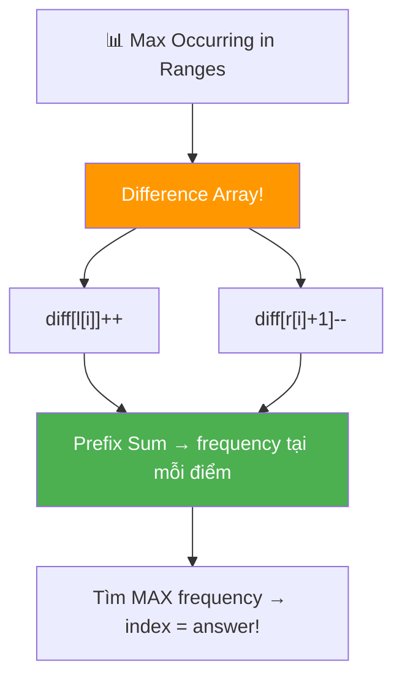
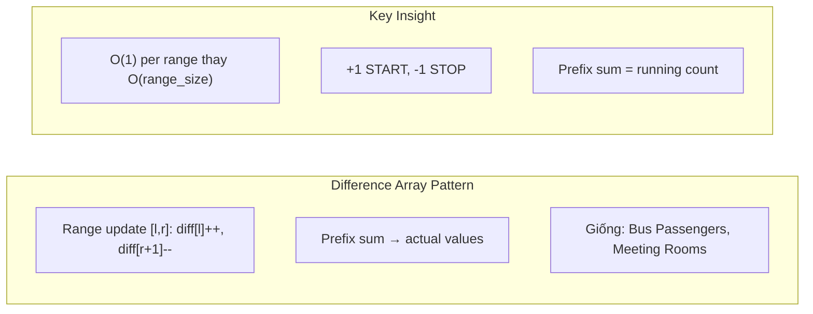
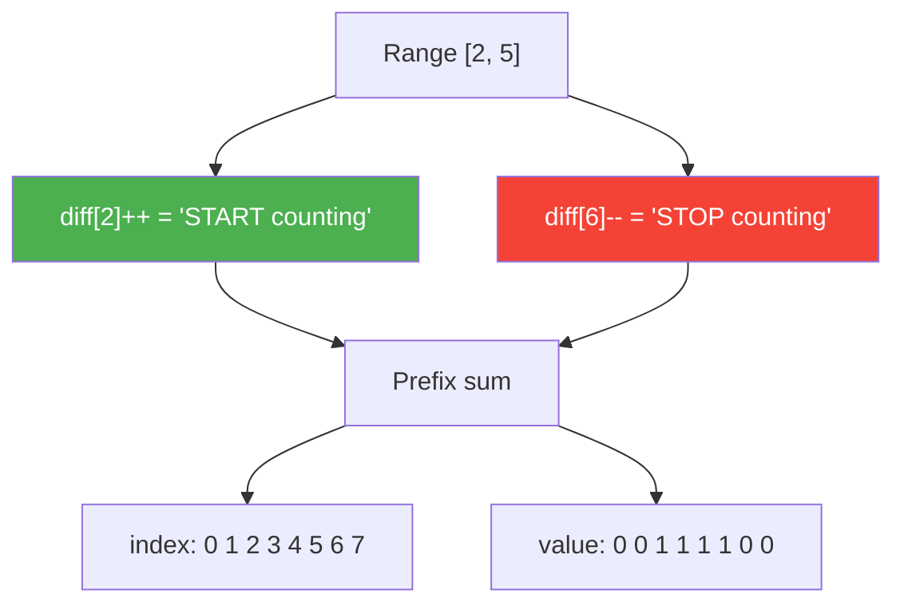
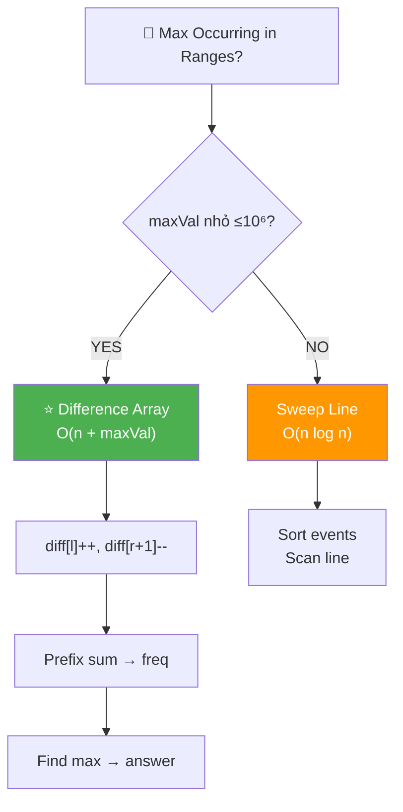
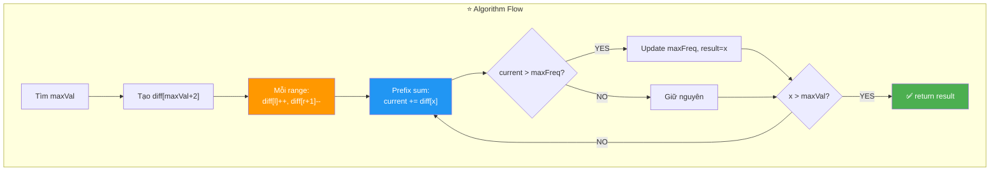
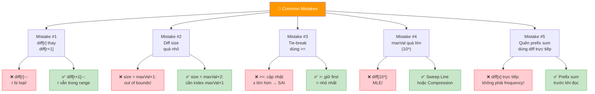
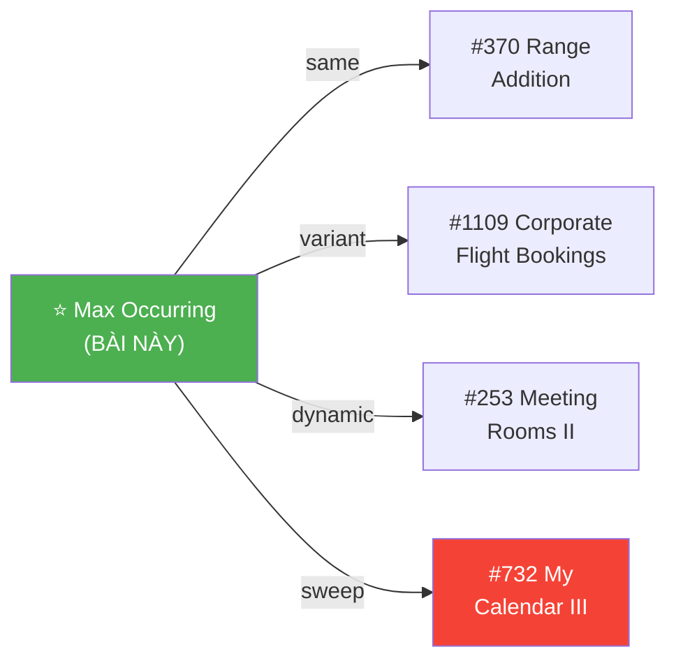
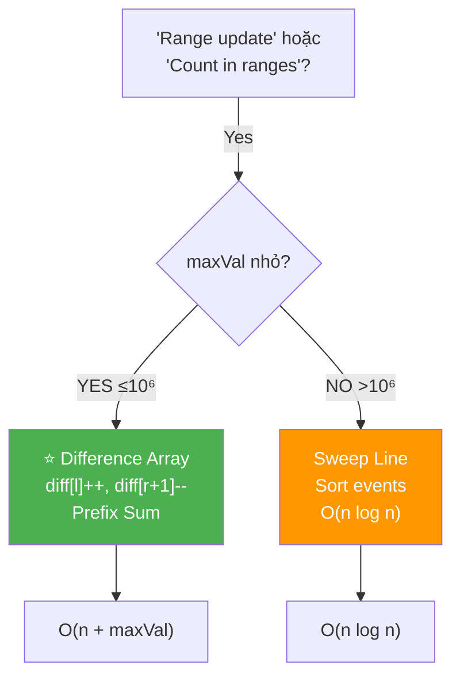
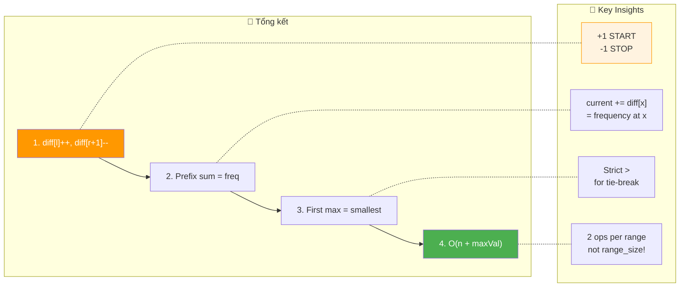

# 📊 Maximum Occurring Integer in Ranges — GfG (Medium)

> 📖 Code: [Max Occurring in Ranges.js](./Max%20Occurring%20in%20Ranges.js)





---

## R — Repeat & Clarify

🧠 *"Cho n khoảng [l[i], r[i]]. Tìm số nguyên XUẤT HIỆN trong NHIỀU khoảng NHẤT. Tie-break: nhỏ nhất."*

> 🎙️ *"Given n ranges [l[i], r[i]], find the integer that appears in the most ranges. If tied, return the smallest."*

### Clarification Questions

```
Q: "Occurring" = nằm trong range?
A: ĐÚNG! Số x "occurs" nếu l[i] ≤ x ≤ r[i]!

Q: Ranges có OVERLAP?
A: CÓ! Đó là lý do 1 số có thể nằm trong NHIỀU ranges!

Q: Tie-break?
A: Nhiều số cùng max frequency → chọn NHỎ NHẤT!

Q: Giá trị có thể lớn?
A: CÓ! l, r có thể lên 10⁶ → DIFFERENCE ARRAY!
   Nếu 10⁹ → cần Coordinate Compression!

Q: Ranges inclusive ở cả 2 đầu?
A: ĐÚNG! [l, r] = l, l+1, ..., r (tất cả integers trong đó!)

Q: l[i] có thể = r[i]?
A: CÓ! [5, 5] = chỉ chứa MỘT số 5! (point range!)

Q: Có negative values không?
A: Tùy bài, nhưng thường l, r ≥ 0. Nếu có negative → offset!
```

### Tại sao bài này quan trọng?

```
  ⭐ Bài này dạy DIFFERENCE ARRAY — pattern CỰC QUAN TRỌNG!

  "Range update + Point query" → Difference Array!

  ┌───────────────────────────────────────────────────────────────┐
  │  Pattern: DIFFERENCE ARRAY + PREFIX SUM                       │
  │                                                               │
  │  Thay vì +1 cho MỖI phần tử trong range:                    │
  │    → O(range_size) mỗi range → O(n × max_range) tổng!      │
  │                                                               │
  │  Dùng difference array:                                       │
  │    diff[l]++ , diff[r+1]--                                   │
  │    → O(1) mỗi range! → prefix sum → O(maxVal)               │
  │                                                               │
  │  ĐÂY LÀ PATTERN CỰC KỲ PHỔ BIẾN:                          │
  │    Bus Passengers / Minimum Platforms → sweep line            │
  │    Meeting Rooms II → event counting                          │
  │    Corporate Flight Bookings (#1109)                          │
  │    Range Addition (#370)                                      │
  │    → TẤT CẢ = Difference Array!                              │
  └───────────────────────────────────────────────────────────────┘
```

---

## 🧠 Bản chất bài toán — Hiểu để NHỚ, không chỉ để GIẢI

### INSIGHT CỐT LÕI: "+1 START, -1 STOP!"

```
  ⭐ Ẩn dụ: BẢNG ĐĂNG KÝ HỘI NGHỊ!

  Mỗi range [l, r] = 1 khách đăng ký TỪ ngày l ĐẾN ngày r.
  → Hỏi: ngày nào có NHIỀU KHÁCH NHẤT?

  BRUTE FORCE: với mỗi range, +1 cho mọi ngày trong range.
    → O(n × range) — chậm nếu range lớn!

  ⭐ TRICK THÔNG MINH:
    Ngày l: +1 (1 khách ĐẾN!)
    Ngày r+1: -1 (1 khách ĐI!)

  → Prefix sum = số khách HIỆN TẠI tại mỗi ngày!

  ┌──────────────────────────────────────────────────────────────┐
  │  TẠI SAO HOẠT ĐỘNG?                                         │
  │                                                              │
  │  +1 tại l → prefix sum TĂNG 1 từ index l trở đi            │
  │  -1 tại r+1 → prefix sum GIẢM 1 từ index r+1 trở đi       │
  │                                                              │
  │  → Kết hợp: prefix sum TĂNG 1 CHỈ từ l đến r!             │
  │  → Chính xác = "x nằm trong range [l, r]"!                 │
  │                                                              │
  │  📌 2 THAO TÁC thay cho (r - l + 1) thao tác!              │
  │     O(1) thay vì O(range_size)!                              │
  └──────────────────────────────────────────────────────────────┘
```

### Minh họa 1 range: [2, 5]

```
  diff[2]++ = "START counting from 2"
  diff[6]-- = "STOP counting from 6"

  diff:    [0, 0, +1, 0, 0, 0, -1, 0]
  index:    0  1   2  3  4  5   6  7

  Prefix sum:
  index:    0  1   2  3  4  5   6  7
  value:    0  0   1  1  1  1   0  0
                   ↑──────────↑
                  [2, 5] = 1 ✅
```



### Minh họa NHIỀU ranges overlap

```
  Ranges: [1,6], [2,4], [4,8], [3,5]

  Trên trục số:
  ─────────────────────────────────────────
  x:   0   1   2   3   4   5   6   7   8
  ─────────────────────────────────────────
  [1,6]:   ████████████████████████
  [2,4]:       ████████████
  [4,8]:                   ██████████████████
  [3,5]:           ██████████████
  ─────────────────────────────────────────
  freq:  0   1   2   3   4   3   2   1   1
                         ↑
                     MAX = 4! → answer = 4

  Tại x=4:
    [1,6] ✅  [2,4] ✅  [4,8] ✅  [3,5] ✅ → 4 ranges!
```

### Difference Array — CỐT LÕI! CHỨNG MINH FORMAL

```
  ⭐ DIFFERENCE ARRAY — Formal:

  Tạo mảng diff[] với tất cả = 0.

  Cho mỗi range [l[i], r[i]]:
    diff[l[i]]++     ← "bắt đầu tính" tại l
    diff[r[i] + 1]-- ← "ngừng tính" tại r+1

  Sau đó: PREFIX SUM trên diff[]
    → prefix[x] = số ranges CHỨA x!

  📐 CHỨNG MINH:

  Với 1 range [l, r]:
    diff[l] = +1, diff[r+1] = -1

    prefix[x] = Σ diff[0..x]

    Case x < l:  prefix[x] = 0  (chưa gặp +1)      ✅
    Case l ≤ x ≤ r: prefix[x] = +1 (gặp +1, chưa gặp -1)  ✅
    Case x > r:  prefix[x] = +1 + (-1) = 0 (gặp cả 2)  ✅

  → prefix[x] = 1 khi x ∈ [l, r], 0 ngoài → ĐÚNG! ∎

  Với NHIỀU ranges: tính chất cộng (linearity of prefix sum):
    prefix[x] = Σ (1 nếu x ∈ range_i) = số ranges chứa x! ∎
```

### Tại sao diff[r+1]-- KHÔNG PHẢI diff[r]-- ?

```
  ⚠️ SAI LẦM KINH ĐIỂN NHẤT CỦA BÀI NÀY!

  Range [2, 5]: x=5 VẪN TRONG range!

  ❌ diff[5]--:
    prefix[5] = +1 + (-1) = 0 → x=5 KHÔNG ĐƯỢC TÍNH → SAI!

  ✅ diff[6]--:
    prefix[5] = +1 + 0 = 1 → x=5 ĐƯỢC TÍNH ✅
    prefix[6] = +1 + (-1) = 0 → x=6 KHÔNG tính ✅

  📌 LUÔN NHỚ: diff[r+1]--, KHÔNG PHẢI diff[r]--!
     Vì range INCLUSIVE ở cả 2 đầu: [l, r] bao gồm r!
```

---

## 🧭 Luồng Suy Nghĩ — Từ đọc đề đến solution

### Bước 1: Đọc đề → Keywords

```
  Đề: "Find integer occurring in most ranges"

  Gạch chân:
    ✏️ "ranges"         → nhiều khoảng, có overlap
    ✏️ "occurring"      → nằm trong range
    ✏️ "most"           → max frequency
    ✏️ "smallest if tie" → tie-break

  🧠 Trigger:
    "Range update" → Difference Array!
    "Count at point" → Prefix Sum!
    "Range + Frequency" → diff[l]++, diff[r+1]--!
```

### Bước 2: Approaches

```
  🧠 Approach 1: Brute Force O(n × maxRange)
    Với mỗi range, +1 cho mọi integer trong range
    → Chậm nếu range lớn (10⁶)!

  🧠 Approach 2: Difference Array + Prefix Sum O(n + maxVal) ⭐
    diff[l]++, diff[r+1]-- cho mỗi range → O(n)
    Prefix sum → O(maxVal)
    Find max → O(maxVal)
    → Total: O(n + maxVal)!

  🧠 Approach 3: Sweep Line O(n log n)
    Khi maxVal quá lớn (10⁹) → coordinate compression + sort!
```

### Bước 3: Cây quyết định



---

## E — Examples

```
VÍ DỤ 1: l = [1, 2, 4, 3], r = [6, 4, 8, 5]

  Ranges: [1,6], [2,4], [4,8], [3,5]

  diff:
    [1,6]: diff[1]++, diff[7]--
    [2,4]: diff[2]++, diff[5]--
    [4,8]: diff[4]++, diff[9]--
    [3,5]: diff[3]++, diff[6]--

  diff[]:  0  1  1  1  1  -1  -1  -1  0  -1
  index:   0  1  2  3  4   5   6   7  8   9

  Prefix:  0  1  2  3  4   3   2   1  1   0
                        ↑
                    MAX = 4 tại index 4

  → answer = 4 ✅
```

```
VÍ DỤ 2: l = [1, 5, 9, 13, 21], r = [15, 8, 12, 20, 30]

  Ranges: [1,15], [5,8], [9,12], [13,20], [21,30]

  Overlap analysis:
    x=5: [1,15] ✅ [5,8] ✅ → freq = 2
    x=9: [1,15] ✅ [9,12] ✅ → freq = 2
    x=13: [1,15] ✅ [13,20] ✅ → freq = 2

  Max freq = 2.
  Smallest: x=5 (first in scan left→right)
  → answer = 5 ✅
```

```
VÍ DỤ 3 (Edge): l = [5], r = [5]    (point range)

  diff[5]++, diff[6]--

  Prefix: [0,0,0,0,0,1,0]
  → MAX = 1 tại index 5 → answer = 5 ✅
```

```
VÍ DỤ 4 (Edge): l = [1,1], r = [3,3]    (identical ranges)

  diff[1]++ ×2, diff[4]-- ×2

  diff:   [0, 2, 0, 0, -2]
  Prefix: [0, 2, 2, 2,  0]
  → MAX = 2 tại index 1 → answer = 1 ✅ (smallest!)
```

```
VÍ DỤ 5 (Edge): l = [1,3,5], r = [2,4,6]    (no overlap!)

  diff[1]++, diff[3]--
  diff[3]++, diff[5]--
  diff[5]++, diff[7]--

  diff:   [0, 1, 0, 0, 0, 0, 0, -1]
                   ↑       ↑
            diff[3]=-1+1=0  diff[5]=-1+1=0

  Wait, recalculate:
  diff:   [0, 1, 0, -1+1, 0, -1+1, 0, -1]
        = [0, 1, 0,  0,   0,  0,   0, -1]

  Prefix: [0, 1, 1, 1, 1, 1, 1, 0]
  → Tất cả freq = 1! → answer = 1 ✅ (nhỏ nhất!)

  ⚠️ Hmm, sai! Recalculate:
  [1,2]: diff[1]++, diff[3]--
  [3,4]: diff[3]++, diff[5]--
  [5,6]: diff[5]++, diff[7]--

  diff:   [0, +1, 0, -1+1, 0, -1+1, 0, -1]
        = [0,  1, 0,   0,  0,   0,  0,  -1]

  Prefix: [0, 1, 1, 1, 1, 1, 1, 0]
  → MAX = 1 → answer = 1 ✅ (mỗi range LIỀN nhau nhưng KHÔNG overlap!)
```

### Trace dạng bảng — VD chi tiết

```
  l = [1, 2, 4, 3], r = [6, 4, 8, 5]
  Ranges: [1,6], [2,4], [4,8], [3,5]
  maxVal = 8

  ═══ Step 1: Build Difference Array ═════════════════

  ┌─────────┬──────────┬────────────┬─────────────────────────┐
  │ Range   │ diff[l]++│ diff[r+1]--│ diff state              │
  ├─────────┼──────────┼────────────┼─────────────────────────┤
  │ [1, 6]  │ diff[1]++│ diff[7]--  │ [0,1,0,0,0,0,0,-1,0,0] │
  │ [2, 4]  │ diff[2]++│ diff[5]--  │ [0,1,1,0,0,-1,0,-1,0,0]│
  │ [4, 8]  │ diff[4]++│ diff[9]--  │ [0,1,1,0,1,-1,0,-1,0,-1]│
  │ [3, 5]  │ diff[3]++│ diff[6]--  │ [0,1,1,1,1,-1,-1,-1,0,-1]│
  └─────────┴──────────┴────────────┴─────────────────────────┘

  ═══ Step 2: Prefix Sum ════════════════════════════

  ┌───────┬──────┬─────────┬──────────┬───────────────────┐
  │ x     │ diff │ current │ maxFreq  │ result            │
  ├───────┼──────┼─────────┼──────────┼───────────────────┤
  │ 0     │  0   │ 0       │ 0        │ —                 │
  │ 1     │ +1   │ 1       │ 1        │ 1                 │
  │ 2     │ +1   │ 2       │ 2        │ 2                 │
  │ 3     │ +1   │ 3       │ 3        │ 3                 │
  │ 4     │ +1   │ 4 ⭐    │ 4        │ 4                 │
  │ 5     │ -1   │ 3       │ 4        │ 4 (giữ)          │
  │ 6     │ -1   │ 2       │ 4        │ 4 (giữ)          │
  │ 7     │ -1   │ 1       │ 4        │ 4 (giữ)          │
  │ 8     │  0   │ 1       │ 4        │ 4 (giữ)          │
  └───────┴──────┴─────────┴──────────┴───────────────────┘

  → result = 4 ✅
```

---

## A — Approach

### Approach 1: Brute Force — O(n × maxRange)

```
  Với mỗi range [l[i], r[i]]:
    for x = l[i] → r[i]: count[x]++
  Tìm max count → O(n × range)
  → Chậm nếu range lớn! (10⁶ range, mỗi range 10⁶ → 10¹²!)
```

### Approach 2: Difference Array + Prefix Sum — O(n + maxVal) ⭐

```
  Step 1: diff[l]++, diff[r+1]-- cho mỗi range → O(n)
  Step 2: Prefix sum → frequency → O(maxVal)
  Step 3: Find max → O(maxVal)
  → Total: O(n + maxVal)!

  📌 Mỗi range = CHỈ 2 thao tác! (thay vì range_size thao tác!)
```

### Approach 3: Sweep Line — O(n log n)

```
  Khi maxVal CỰC LỚN (10⁹):
    → Difference Array tốn O(maxVal) space → MLE!
    → Events: (l, +1) và (r+1, -1) cho mỗi range
    → Sort events → scan → O(n log n)!
```

---

## C — Code ✅

### Solution: Difference Array + Prefix Sum — O(n + maxVal) ⭐

```javascript
function maxOccurring(l, r) {
  const n = l.length;

  // Tìm giá trị max để tạo diff array
  let maxVal = 0;
  for (let i = 0; i < n; i++) {
    maxVal = Math.max(maxVal, r[i]);
  }

  // Difference array
  const diff = new Array(maxVal + 2).fill(0);
  for (let i = 0; i < n; i++) {
    diff[l[i]]++;
    diff[r[i] + 1]--;
  }

  // Prefix sum + find max
  let maxFreq = 0;
  let result = 0;
  let current = 0;

  for (let x = 0; x <= maxVal; x++) {
    current += diff[x]; // Prefix sum
    if (current > maxFreq) {
      maxFreq = current;
      result = x; // Smallest x with max freq (first occurrence!)
    }
  }

  return result;
}
```

---

## 🔬 Deep Dive — Giải thích CHI TIẾT từng dòng

> 💡 Phân tích **từng dòng** để hiểu **TẠI SAO**.

```javascript
function maxOccurring(l, r) {
  const n = l.length;

  // ═══════════════════════════════════════════════════════════
  // STEP 1: Tìm maxVal — O(n)
  // ═══════════════════════════════════════════════════════════
  //
  // TẠI SAO cần maxVal?
  //   → Cần biết KÍCH THƯỚC diff array!
  //   → diff phải đủ lớn để chứa index maxVal + 1
  //
  let maxVal = 0;
  for (let i = 0; i < n; i++) {
    maxVal = Math.max(maxVal, r[i]);
  }

  // ═══════════════════════════════════════════════════════════
  // STEP 2: Tạo Difference Array — O(n)
  // ═══════════════════════════════════════════════════════════
  //
  // ⚠️ Size = maxVal + 2, KHÔNG PHẢI maxVal + 1!
  //    Vì diff[r[i] + 1]-- → cần index maxVal + 1!
  //    Size maxVal + 1 → out of bounds!
  //
  const diff = new Array(maxVal + 2).fill(0);

  // ═══════════════════════════════════════════════════════════
  // STEP 3: Mark ranges — O(n)
  // ═══════════════════════════════════════════════════════════
  //
  // diff[l[i]]++:
  //   "Từ index l[i] trở đi, frequency TĂNG 1!"
  //   = 1 khách ĐẾN vào ngày l[i]
  //
  // diff[r[i] + 1]--:
  //   "Từ index r[i]+1 trở đi, frequency GIẢM 1!"
  //   = 1 khách ĐI vào ngày r[i]+1
  //
  // ⚠️ r[i] + 1, KHÔNG PHẢI r[i]!
  //    r[i] VẪN TRONG RANGE → phải giữ +1 ở đó!
  //
  for (let i = 0; i < n; i++) {
    diff[l[i]]++;
    diff[r[i] + 1]--;
  }

  // ═══════════════════════════════════════════════════════════
  // STEP 4: Prefix Sum + Find Max — O(maxVal)
  // ═══════════════════════════════════════════════════════════
  //
  // current += diff[x]:
  //   Prefix sum! current = frequency tại x!
  //   = "có bao nhiêu ranges CHỨA x?"
  //
  // Track maxFreq + result:
  //   current > maxFreq (STRICT >):
  //     → Cập nhật result = x
  //     → FIRST max = NHỎ NHẤT (duyệt tăng dần!)
  //     → TỰ ĐỘNG handle tie-break!
  //
  // ⚠️ Dùng > (strict), KHÔNG PHẢI >=!
  //    >= → cập nhật result thành x LỚN hơn → SAI tie-break!
  //    >  → giữ result nhỏ nhất → ĐÚNG!
  //
  let maxFreq = 0;
  let result = 0;
  let current = 0;

  for (let x = 0; x <= maxVal; x++) {
    current += diff[x];
    if (current > maxFreq) {
      maxFreq = current;
      result = x;
    }
  }

  return result;
}
```



---

## 📐 Invariant — Chứng minh tính đúng đắn

```
  📐 INVARIANT:

  Sau prefix sum, current tại x = Σ diff[0..x]
    = số ranges CHỨA x!

  CHỨNG MINH:
  ┌──────────────────────────────────────────────────────────────┐
  │  Với 1 range [l, r]:                                         │
  │    diff[l] = +1, diff[r+1] = -1                              │
  │                                                              │
  │    prefix[x] = Σ diff[0..x]                                  │
  │                                                              │
  │    x < l:     prefix[x] += 0 (chưa gặp +1)           ✅    │
  │    l ≤ x ≤ r: prefix[x] += 1 (gặp +1, chưa gặp -1)  ✅    │
  │    x > r:     prefix[x] += 1 + (-1) = 0               ✅    │
  │                                                              │
  │  → prefix[x] = 1 khi x ∈ [l, r], 0 ngoài!                  │
  │                                                              │
  │  Với n ranges (linearity):                                   │
  │    prefix[x] = Σ (1 nếu x ∈ range_i)                        │
  │             = số ranges chứa x!  ∎                           │
  └──────────────────────────────────────────────────────────────┘

  📐 TIE-BREAK:
    Duyệt x = 0 → maxVal (tăng dần)
    Dùng current > maxFreq (strict >)
    → first x đạt MAX = NHỎ NHẤT → tie-break tự động! ∎

  📐 CORRECTNESS:
    result = argmin{x : freq(x) = maxFreq}
    → ĐÚNG vì first update = smallest x!  ∎
```

---

## ❌ Common Mistakes — Lỗi thường gặp



### Mistake 1: diff[r]-- thay vì diff[r+1]--!

```javascript
// ❌ SAI: r VẪN TRONG range!
diff[r[i]]--;
// Range [2, 5]: diff[5]-- → prefix[5] = 0 → x=5 bị loại!

// ✅ ĐÚNG: r+1!
diff[r[i] + 1]--;
// Range [2, 5]: diff[6]-- → prefix[5] = 1 ✅, prefix[6] = 0 ✅
```

### Mistake 2: Diff array size quá nhỏ!

```javascript
// ❌ SAI: size = maxVal + 1!
const diff = new Array(maxVal + 1).fill(0);
// diff[r[i] + 1]-- → r[i] = maxVal → index maxVal+1 → OUT OF BOUNDS!

// ✅ ĐÚNG: size = maxVal + 2!
const diff = new Array(maxVal + 2).fill(0);
// diff[maxVal + 1] → valid! ✅
```

### Mistake 3: Dùng >= thay > cho tie-break!

```javascript
// ❌ SAI: >= cập nhật x LỚN hơn!
if (current >= maxFreq) {
  maxFreq = current;
  result = x;  // x CÓ THỂ lớn hơn → tie-break SAI!
}

// ✅ ĐÚNG: > giữ FIRST (nhỏ nhất)!
if (current > maxFreq) {
  maxFreq = current;
  result = x;  // first x = NHỎ NHẤT! ✅
}
```

### Mistake 4: maxVal quá lớn (10⁹)!

```javascript
// ❌ SAI: tạo array 10⁹ → MLE!
const diff = new Array(1000000001).fill(0);
// ~4GB RAM → MEMORY LIMIT EXCEEDED!

// ✅ ĐÚNG: dùng Sweep Line!
// Events: (l, +1) và (r+1, -1)
// Sort events → scan → O(n log n)!
```

### Mistake 5: Đọc diff trực tiếp thay vì prefix sum!

```javascript
// ❌ SAI: diff[x] KHÔNG PHẢI frequency!
for (let x = 0; x <= maxVal; x++) {
  if (diff[x] > maxFreq) { // diff[x] = +1 hoặc -1, KHÔNG PHẢI freq!
    maxFreq = diff[x];
    result = x;
  }
}

// ✅ ĐÚNG: prefix sum TRƯỚC!
let current = 0;
for (let x = 0; x <= maxVal; x++) {
  current += diff[x];  // ← PREFIX SUM = freq!
  if (current > maxFreq) { ... }
}
```

---

## O — Optimize

```
                         Time             Space        Ghi chú
  ──────────────────────────────────────────────────────────────
  Brute Force            O(n × maxRange)   O(maxVal)    Chậm
  Diff Array + PrefSum ⭐ O(n + maxVal)     O(maxVal)    Tối ưu!
  Sweep Line             O(n log n)        O(n)         maxVal lớn

  ⚠️ Chọn approach nào?
    maxVal ≤ 10⁶ → Difference Array!
    maxVal > 10⁶ → Sweep Line!
```

### Complexity chính xác — Đếm operations

```
  Difference Array:
    Find maxVal: n comparisons
    Build diff: 2n operations (++ và --)
    Prefix sum: maxVal additions
    Find max: maxVal comparisons
    TỔNG: 2n + 2×maxVal operations

  📊 So sánh (n = 10⁵, maxVal = 10⁶):
    Diff Array: 2×10⁵ + 2×10⁶ = 2.2×10⁶ ops ⭐
    Brute: 10⁵ × 10⁶ = 10¹¹ ops 💀

  📊 Space:
    diff array: maxVal+2 integers ≈ 4MB (cho maxVal=10⁶) ✅
```

---

## T — Test

```
Test Cases:
  l=[1,2,4,3], r=[6,4,8,5]             → 4     ✅
  l=[1,5,9,13,21], r=[15,8,12,20,30]   → 5     ✅
  l=[1], r=[5]                          → 1     ✅ 1 range
  l=[1,1], r=[3,3]                      → 1     ✅ identical ranges
  l=[5], r=[5]                          → 5     ✅ point range
  l=[1,3,5], r=[2,4,6]                 → 1     ✅ no overlap (all freq=1)
  l=[0,0,0], r=[0,0,0]                 → 0     ✅ all same point
  l=[1,2], r=[3,4]                     → 2     ✅ partial overlap
```

---

## 🗣️ Interview Script

### 🎙️ Think Out Loud — Mô phỏng phỏng vấn thực

```
  ──────────────── PHASE 1: Clarify ────────────────

  👤 Interviewer: "Given n ranges [l, r], find the integer
                   in the most ranges. Smallest if tied."

  🧑 You: "Let me clarify:
   1. Ranges are inclusive: [l, r] includes both l and r.
   2. I need the integer with highest frequency across ranges.
   3. Tie-break: return the smallest such integer.
   4. What's the range of values? Up to 10⁶?"

  ──────────────── PHASE 2: Examples ────────────────

  🧑 You: "Ranges [1,6], [2,4], [4,8], [3,5].
   The integer 4 appears in all 4 ranges — that's the max.
   Answer is 4."

  ──────────────── PHASE 3: Approach ────────────────

  🧑 You: "Brute force: for each range, increment a counter
   for every integer in it. O(n × range_size).

   Better: use a difference array. For each range [l, r],
   I mark diff[l]++ and diff[r+1]--. Then a prefix sum
   over this array gives the exact frequency at each point.

   Why it works: the +1 at l starts counting, and the -1
   at r+1 stops counting. The prefix sum accumulates these
   marks, giving the number of active ranges at each point.

   I find the first position with maximum frequency for the
   tie-break. O(n + maxVal) time."

  ──────────────── PHASE 4: Code + Verify ────────────────

  🧑 You: [writes code]

  "Key details:
   - Array size = maxVal + 2 (need index maxVal+1)
   - diff[r+1]--, NOT diff[r]-- (r is inclusive!)
   - Use strict > for tie-break (first = smallest)"

  ──────────────── PHASE 5: Follow-ups ────────────────

  👤 "What if values can be up to 10⁹?"
  🧑 "Then a difference array would be too large. I'd use
      a sweep line: create events (l, +1) and (r+1, -1),
      sort them, and scan. O(n log n) time, O(n) space."

  👤 "What if we need to update ranges dynamically?"
  🧑 "For dynamic range updates and point queries, I'd use
      a Binary Indexed Tree (Fenwick Tree) or Segment Tree
      with lazy propagation. O(log n) per update/query."

  👤 "How does this relate to Meeting Rooms II?"
  🧑 "Same pattern! Each meeting is a range [start, end].
      diff[start]++, diff[end]--. Max prefix sum = minimum
      number of rooms needed. Exact same technique."
```

---

## 📚 Bài tập liên quan — Practice Problems

### Progression Path



### 1. Range Addition (#370) — Medium

```
  Đề: Cho mảng size n, áp dụng updates [start, end, val].
       Mỗi update: cộng val vào arr[start..end].

  function getModifiedArray(length, updates) {
    const diff = new Array(length + 1).fill(0);

    for (const [start, end, val] of updates) {
      diff[start] += val;      // bắt đầu cộng val
      diff[end + 1] -= val;    // ngừng cộng val
    }

    // Prefix sum → actual values
    const result = new Array(length);
    let current = 0;
    for (let i = 0; i < length; i++) {
      current += diff[i];
      result[i] = current;
    }
    return result;
  }

  📌 CÙNG PATTERN! Chỉ khác:
    Bài này: diff[l] += 1 (count ranges)
    #370: diff[start] += val (add any value!)
```

### 2. Corporate Flight Bookings (#1109) — Medium

```
  Đề: n flights, bookings = [first, last, seats].
       Tìm total seats cho mỗi flight.

  function corpFlightBookings(bookings, n) {
    const diff = new Array(n + 1).fill(0);

    for (const [first, last, seats] of bookings) {
      diff[first - 1] += seats;     // 1-indexed → 0-indexed!
      if (last < n) diff[last] -= seats;
    }

    const result = new Array(n);
    let current = 0;
    for (let i = 0; i < n; i++) {
      current += diff[i];
      result[i] = current;
    }
    return result;
  }

  📌 CÙNG PATTERN! 1-indexed thay 0-indexed!
```

### 3. Meeting Rooms II (#253) — Medium

```
  Đề: Tìm số phòng TỐI THIỂU cho meetings.

  function minMeetingRooms(intervals) {
    const events = [];
    for (const [start, end] of intervals) {
      events.push([start, +1]);   // meeting starts
      events.push([end, -1]);     // meeting ends
    }
    events.sort((a, b) => a[0] - b[0] || a[1] - b[1]);

    let maxRooms = 0, current = 0;
    for (const [_, delta] of events) {
      current += delta;
      maxRooms = Math.max(maxRooms, current);
    }
    return maxRooms;
  }

  📌 Sweep Line version (khi domain lớn!)
     Cùng ý tưởng: +1 start, -1 end!
     Nhưng sort events thay diff array!
```

### 4. Sweep Line — khi maxVal quá lớn

```
  function maxOccurringSweep(l, r) {
    const events = [];
    for (let i = 0; i < l.length; i++) {
      events.push([l[i], +1]);     // range starts
      events.push([r[i] + 1, -1]); // range ends
    }
    // Sort by position, then by delta (-1 before +1 at same pos)
    events.sort((a, b) => a[0] - b[0] || a[1] - b[1]);

    let maxFreq = 0, current = 0, result = 0;
    for (const [pos, delta] of events) {
      current += delta;
      if (current > maxFreq) {
        maxFreq = current;
        result = pos;
      }
    }
    return result;
  }

  📌 O(n log n) time, O(n) space!
     Không cần maxVal → works cho 10⁹!
```

### Tổng kết — Difference Array Family

```
  ┌──────────────────────────────────────────────────────────────┐
  │  BÀI                     │  Technique       │  Time         │
  ├──────────────────────────────────────────────────────────────┤
  │  Max Occurring ⭐         │  Diff Array      │  O(n+maxVal)  │
  │  #370 Range Addition     │  Diff Array      │  O(n+maxVal)  │
  │  #1109 Flight Bookings   │  Diff Array      │  O(n+maxVal)  │
  │  #253 Meeting Rooms II   │  Sweep Line      │  O(n log n)   │
  │  #732 My Calendar III    │  TreeMap/Sweep   │  O(n log n)   │
  │  Minimum Platforms       │  Sweep Line      │  O(n log n)   │
  └──────────────────────────────────────────────────────────────┘

  📌 RULE:
    maxVal nhỏ → Difference Array O(n + maxVal)!
    maxVal lớn → Sweep Line O(n log n)!
    Dynamic → BIT/Segment Tree O(log n per query)!
```

### Skeleton code — Reusable Difference Array template

```javascript
// TEMPLATE: Difference Array for range updates
function diffArrayTemplate(ranges, maxVal) {
  // Step 1: Build difference array
  const diff = new Array(maxVal + 2).fill(0);
  for (const [l, r, val = 1] of ranges) {
    diff[l] += val;         // start adding val
    diff[r + 1] -= val;     // stop adding val
  }

  // Step 2: Prefix sum → actual values
  const result = new Array(maxVal + 1);
  let current = 0;
  for (let x = 0; x <= maxVal; x++) {
    current += diff[x];
    result[x] = current;
  }
  return result;
}

// Usage:
// Count ranges: val = 1 → result[x] = # ranges containing x
// Sum ranges:   val = any → result[x] = total value at x
// Find max:     argmax result[x] → answer!
```

---

## 📌 Kỹ năng chuyển giao — Pattern Summary



---

## 📊 Tổng kết — Key Insights



```
  ┌──────────────────────────────────────────────────────────────────────────┐
  │  📌 3 ĐIỀU PHẢI NHỚ                                                    │
  │                                                                          │
  │  1. DIFFERENCE ARRAY: "+1 START, -1 STOP"                               │
  │     → diff[l]++ = bắt đầu tính từ l                                   │
  │     → diff[r+1]-- = ngừng tính từ r+1                                  │
  │     → ⚠️ r+1 KHÔNG PHẢI r! (r VẪN trong range!)                       │
  │     → Prefix sum → frequency tại mỗi điểm!                            │
  │                                                                          │
  │  2. 2 THAO TÁC thay (r-l+1) thao tác:                                 │
  │     → O(1) per range thay O(range_size)!                                │
  │     → diff size = maxVal + 2 (cần index maxVal+1!)                     │
  │     → Dùng > (strict) cho tie-break (first = nhỏ nhất!)               │
  │                                                                          │
  │  3. KHI NÀO DÙNG GÌ:                                                   │
  │     → maxVal ≤ 10⁶: Difference Array → O(n + maxVal)                  │
  │     → maxVal > 10⁶: Sweep Line → O(n log n)                           │
  │     → Dynamic updates: BIT / Segment Tree → O(log n)                  │
  └──────────────────────────────────────────────────────────────────────────┘
```

---

## 📝 Flashcard — Tự kiểm tra

| ❓ Câu hỏi | ✅ Đáp án |
|---|---|
| Difference Array: range [l,r]? | `diff[l]++, diff[r+1]--` |
| Tại sao r+1 không phải r? | Vì r **VẪN trong range** (inclusive!) |
| Prefix sum cho gì? | **Frequency** tại mỗi điểm |
| Tie-break? | Duyệt trái→phải, **strict >**, first max = nhỏ nhất |
| Diff array size? | **maxVal + 2** (cần index maxVal+1!) |
| Time / Space? | **O(n + maxVal)** / **O(maxVal)** |
| maxVal lớn (10⁹)? | **Sweep Line** O(n log n) hoặc **Coord Compression** |
| Bài cùng pattern? | LC #370, #1109, #253, Meeting Rooms |
| Tại sao 2 ops thay range_size? | +1 tại l "starts" counting, -1 tại r+1 "stops" |
| Dynamic range queries? | **BIT** hoặc **Segment Tree** O(log n) |
