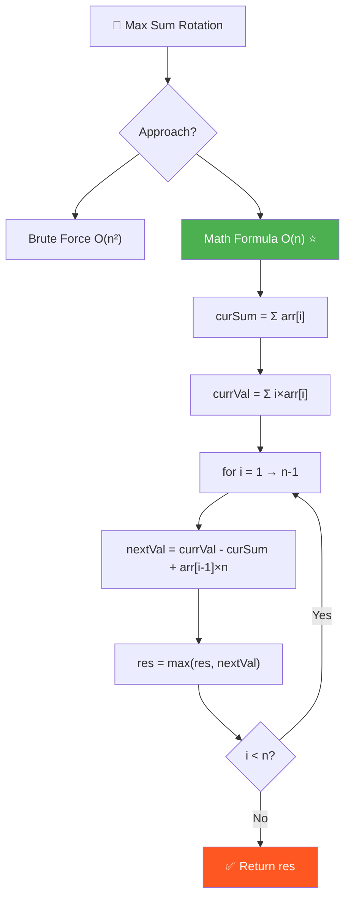
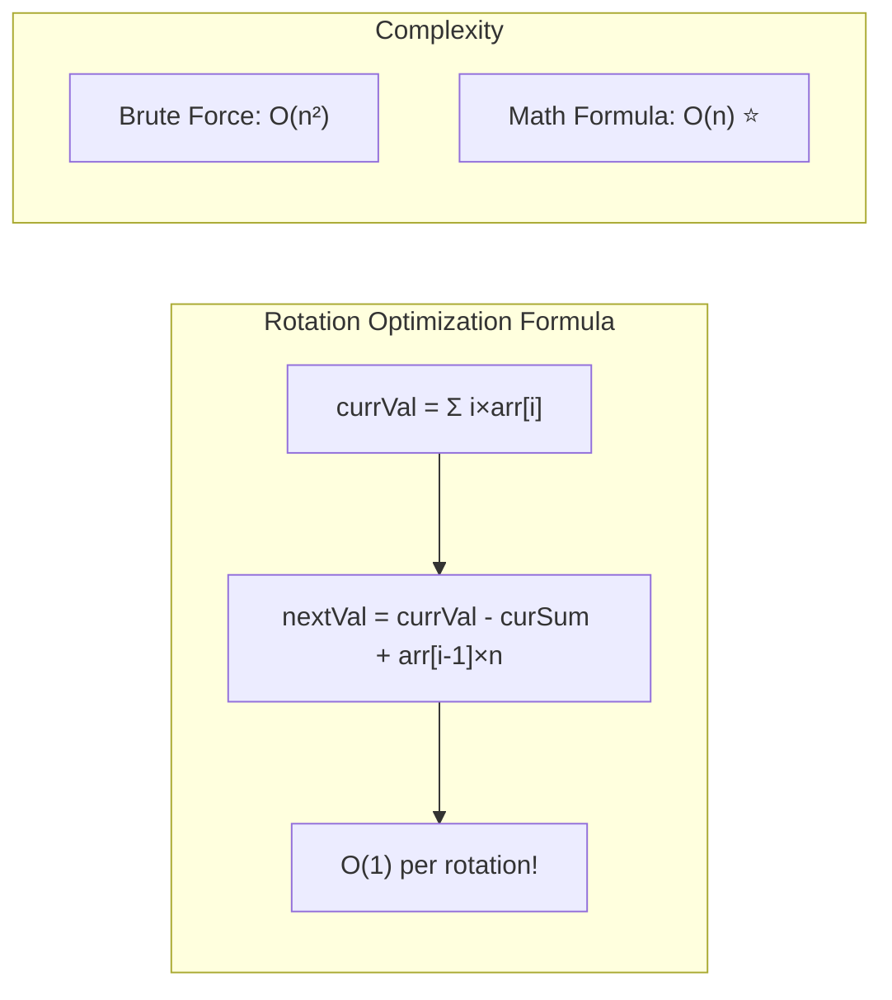

# 🔢 Maximum Sum of i×arr[i] Among All Rotations — GfG (Medium)

> 📖 Code: [Max Sum Rotation.js](./Max%20Sum%20Rotation.js)





---

## R — Repeat & Clarify

🧠 *"Tính nextVal từ currVal bằng CÔNG THỨC, không cần tính lại từ đầu! O(n)!"*

> 🎙️ *"Find the rotation of the array that maximizes Σ(i × arr[i]). Use the math relationship between consecutive rotations."*

---

## E — Examples

```
arr = [8, 3, 1, 2]

  Rotation 0: [8,3,1,2] → 0×8 + 1×3 + 2×1 + 3×2 = 0+3+2+6 = 11
  Rotation 1: [2,8,3,1] → 0×2 + 1×8 + 2×3 + 3×1 = 0+8+6+3 = 17
  Rotation 2: [1,2,8,3] → 0×1 + 1×2 + 2×8 + 3×3 = 0+2+16+9 = 27
  Rotation 3: [3,1,2,8] → 0×3 + 1×1 + 2×2 + 3×8 = 0+1+4+24 = 29 ✅

  Max = 29
```

---

## A — Approach

### Brute Force — O(n²)

```
Thử tất cả n rotations, mỗi cái tính sum O(n) → O(n²)
```

### Math Formula — O(n) ✅

```
💡 KEY INSIGHT: Khi rotate LEFT 1 vị trí:

  currVal = 0×a₀ + 1×a₁ + 2×a₂ + ... + (n-1)×aₙ₋₁
  nextVal = 0×a₁ + 1×a₂ + ... + (n-2)×aₙ₋₁ + (n-1)×a₀

  nextVal - currVal = (a₁ + a₂ + ... + aₙ₋₁) - (n-1)×a₀ + (n-1)×a₀... 

  Đơn giản hóa: Khi element arr[i-1] chuyển từ index 0 lên index n-1:
    → Tất cả phần tử khác GIẢM index 1 → mất tổng (curSum - arr[i-1])
    → arr[i-1] từ index 0 → index n-1 → được thêm arr[i-1] × (n-1)

  nextVal = currVal - (curSum - arr[i-1]) + arr[i-1] × (n-1)
          = currVal - curSum + arr[i-1] × n
```

---

## C — Code

### Solution 1: Brute Force — O(n²)

```javascript
function maxSumBrute(arr) {
  const n = arr.length;
  let res = -Infinity;

  for (let i = 0; i < n; i++) {
    let sum = 0;
    for (let j = 0; j < n; j++) {
      sum += j * arr[(i + j) % n];
    }
    res = Math.max(res, sum);
  }
  return res;
}
```

### Solution 2: Math Formula — O(n) ✅

```javascript
function maxSum(arr) {
  const n = arr.length;

  // Tổng tất cả phần tử
  let curSum = 0;
  for (let i = 0; i < n; i++) curSum += arr[i];

  // Tính sum ban đầu (rotation 0)
  let currVal = 0;
  for (let i = 0; i < n; i++) currVal += i * arr[i];

  let res = currVal;

  // Tính rotation tiếp theo từ rotation trước
  for (let i = 1; i < n; i++) {
    currVal = currVal - curSum + arr[i - 1] * n;
    res = Math.max(res, currVal);
  }
  return res;
}
```

### Trace: [8, 3, 1, 2]

```
  curSum = 8+3+1+2 = 14
  currVal = 0×8 + 1×3 + 2×1 + 3×2 = 11
  res = 11

  i=1: currVal = 11 - 14 + 8×4 = 11 - 14 + 32 = 29   res=29
  i=2: currVal = 29 - 14 + 3×4 = 29 - 14 + 12 = 27   res=29
  i=3: currVal = 27 - 14 + 1×4 = 27 - 14 + 4 = 17    res=29

  Max = 29 ✅ (rotation 1 = [3,1,2,8] theo right, tức [2,8,3,1]... )
```

---

## O — Optimize

```
  Brute Force: O(n²)
  Math Formula: O(n) time, O(1) space ✅

  Key: nextVal = currVal - curSum + arr[i-1] × n
```

---

## 🗣️ Interview Script

> 🎙️ *"Instead of recalculating for each rotation, I derive the next rotation's value from the current one. When we left-rotate, every element drops one index position (losing curSum - arr[0]), while the displaced element gains (n-1) positions. This gives the recurrence: nextVal = currVal - curSum + arr[i-1] × n. O(n) time, O(1) space."*

### Pattern

```
  ROTATION OPTIMIZATION pattern:
  Thay vì tính lại O(n) mỗi rotation → derive O(1) từ rotation trước!
  Dùng khi: tính hàm trên tất cả rotations
```
