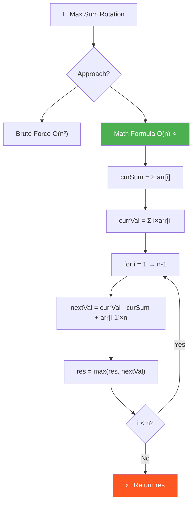
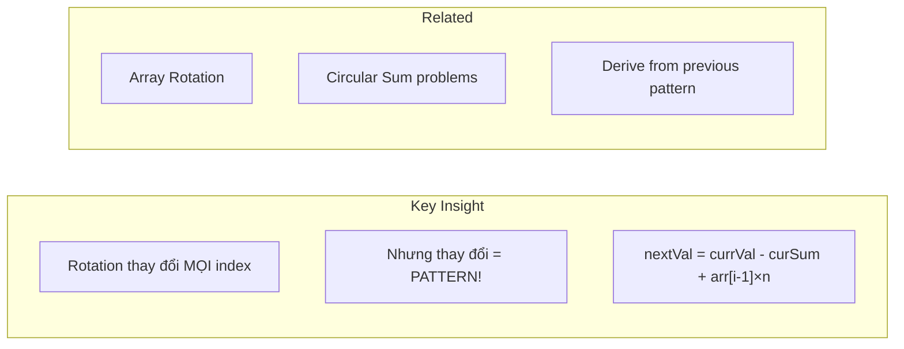
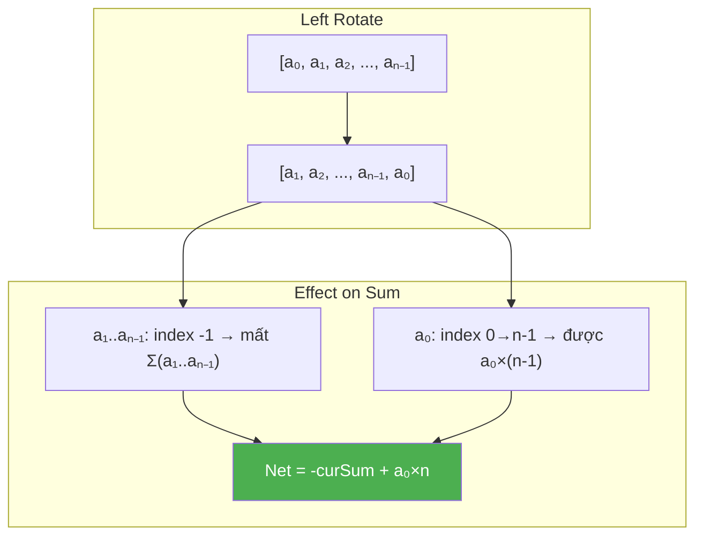
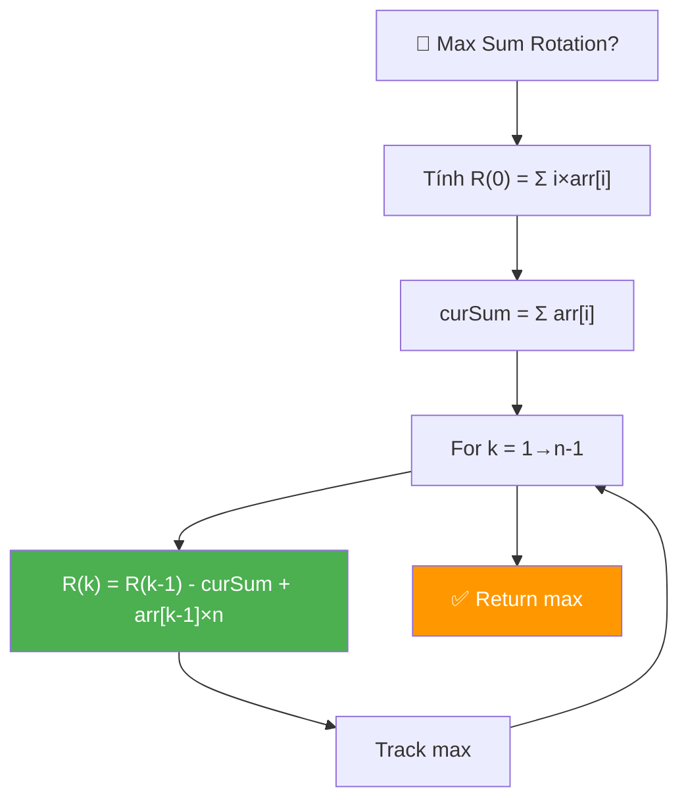
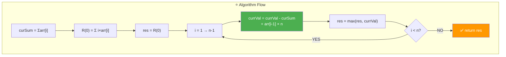
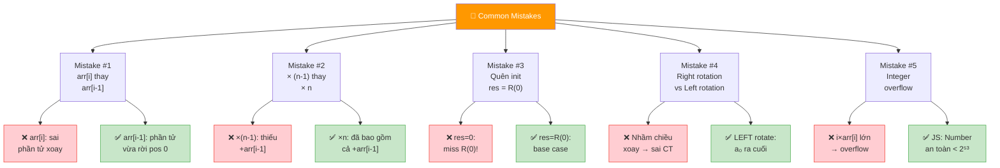
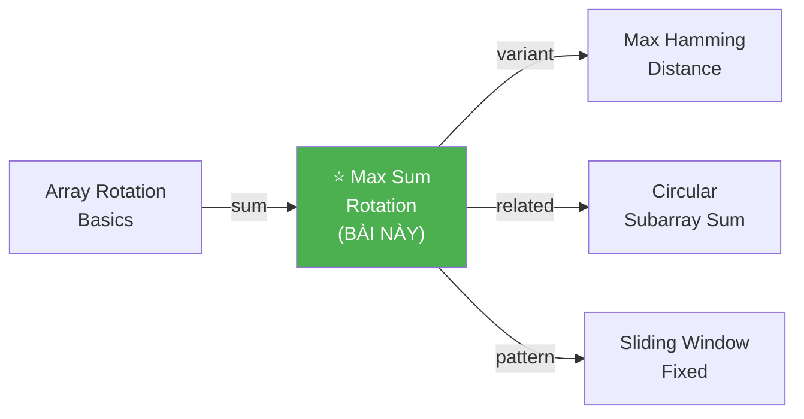
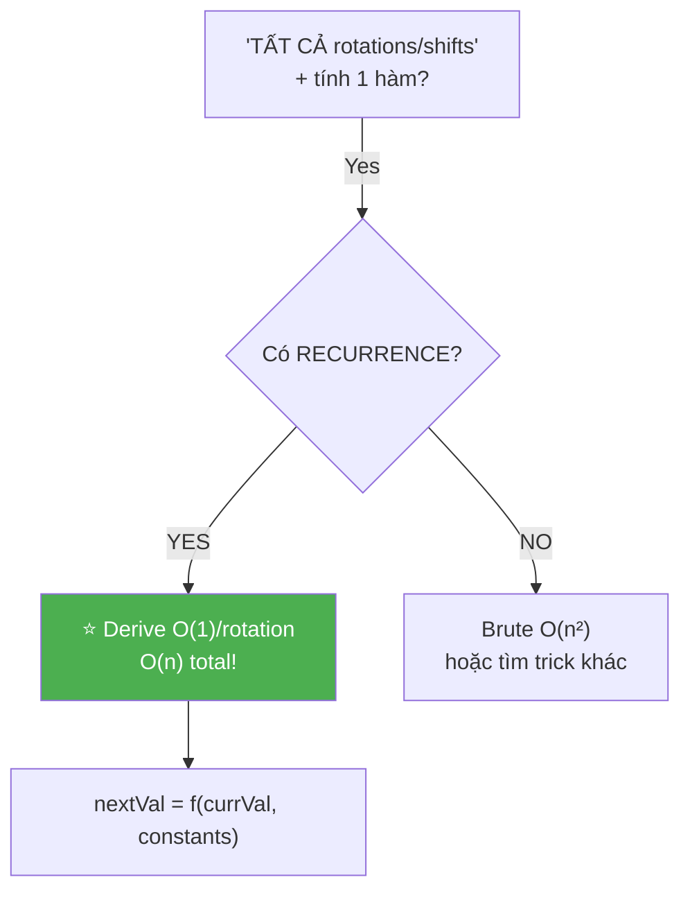
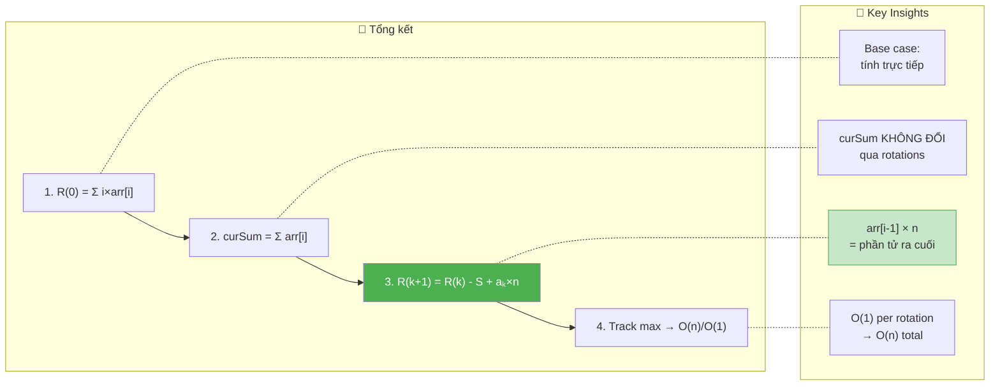

# 🔢 Maximum Sum of i×arr[i] Among All Rotations — GfG (Medium)

> 📖 Code: [Max Sum Rotation.js](./Max%20Sum%20Rotation.js)





---

## R — Repeat & Clarify

🧠 *"Tính nextVal từ currVal bằng CÔNG THỨC, không cần tính lại từ đầu! O(n)!"*

> 🎙️ *"Find the rotation of the array that maximizes Σ(i × arr[i]). Use the math relationship between consecutive rotations."*

### Clarification Questions

```
Q: "Rotation" = gì?
A: LEFT rotation: phần tử đầu ĐI RA CUỐI!
   [a₀, a₁, a₂, ..., aₙ₋₁] → [a₁, a₂, ..., aₙ₋₁, a₀]

Q: Bao nhiêu rotations?
A: n rotations (0 → n-1). Rotation n = rotation 0 (quay lại!)

Q: Sum = gì?
A: Σ i × arr[i] = 0×arr[0] + 1×arr[1] + 2×arr[2] + ...
   → Giá trị LỚN tại index LỚN → nhiều trọng số hơn!

Q: Return gì?
A: MAX value của Σ i×arr[i] trên TẤT CẢ rotations!

Q: Có negative values?
A: CÓ thể! Nhưng thường positive (bài GfG).

Q: n = 1?
A: 0×arr[0] = 0. Chỉ 1 rotation!
```

### Tại sao bài này quan trọng?

```
  ⭐ Bài này dạy pattern "DERIVE FROM PREVIOUS"!

  ┌───────────────────────────────────────────────────────────────┐
  │  Pattern: Thay vì tính lại O(n), derive O(1) từ trước!      │
  │                                                               │
  │  Brute: n rotations × O(n) each = O(n²)                      │
  │  Smart: CÔNG THỨC liên hệ rotation(k) → rotation(k+1)       │
  │    → O(1) per rotation × n rotations = O(n)!                 │
  │                                                               │
  │  Giống pattern:                                                │
  │    Sliding Window: sum(window) → add right, remove left       │
  │    Rotation Sum: sum(rotation) → derive from previous!        │
  │    Prefix Sum: sum(range) → prefix[r] - prefix[l-1]          │
  └───────────────────────────────────────────────────────────────┘

  📌 TÍN HIỆU: "tính hàm trên TẤT CẢ rotations"
     → Tìm RECURRENCE giữa rotations!
```

---

## 🧠 Bản chất bài toán — Hiểu để NHỚ, không chỉ để GIẢI

### INSIGHT CỐT LÕI: "Rotation thay đổi index PATTERN!"

```
  ⭐ Ẩn dụ: "XẾP HÀNG lính theo vị trí!"

  n lính có giá trị (sức mạnh). Xếp vào vị trí 0, 1, 2, ..., n-1.
  Điểm = Σ (vị trí × sức mạnh).
  → Muốn lính MẠNH đứng vị trí LỚN!

  Mỗi "rotation" = XOAY hàng: người đầu đi ra cuối.
  Câu hỏi: rotation nào cho ĐIỂM CAO NHẤT?

  ┌──────────────────────────────────────────────────────────────┐
  │  Brute: thử n xoay, mỗi lần tính lại → O(n²)              │
  │  Smart: khi xoay 1 lần, ĐIỂM THAY ĐỔI BAO NHIÊU?         │
  │                                                              │
  │  Khi LEFT ROTATE 1:                                          │
  │    [a₀, a₁, a₂, ..., aₙ₋₁] → [a₁, a₂, ..., aₙ₋₁, a₀]    │
  │                                                              │
  │  THAY ĐỔI:                                                  │
  │    a₁: vị trí 1 → 0 (GIẢM 1) → mất a₁                     │
  │    a₂: vị trí 2 → 1 (GIẢM 1) → mất a₂                     │
  │    ...                                                       │
  │    aₙ₋₁: vị trí n-1 → n-2 (GIẢM 1) → mất aₙ₋₁            │
  │    a₀: vị trí 0 → n-1 (TĂNG n-1) → được a₀ × (n-1)        │
  │                                                              │
  │  Tổng thay đổi:                                              │
  │    GIẢM: (a₁ + a₂ + ... + aₙ₋₁) = curSum - a₀              │
  │    TĂNG: a₀ × (n-1)                                         │
  │                                                              │
  │  → nextVal = currVal - (curSum - a₀) + a₀ × (n-1)           │
  │            = currVal - curSum + a₀ × n                       │
  └──────────────────────────────────────────────────────────────┘
```

### Suy diễn CÔNG THỨC — Step by step

```
  Gọi R(k) = Σ i × arr'[i] cho rotation thứ k.

  ═══ Rotation 0 ═══
  R(0) = 0×a₀ + 1×a₁ + 2×a₂ + ... + (n-1)×aₙ₋₁

  ═══ Rotation 1 (left rotate 1) ═══
  Mảng mới: [a₁, a₂, ..., aₙ₋₁, a₀]
  R(1) = 0×a₁ + 1×a₂ + ... + (n-2)×aₙ₋₁ + (n-1)×a₀

  ═══ R(1) - R(0) = ? ═══
  R(1) - R(0) = (0×a₁ + 1×a₂ + ... + (n-2)×aₙ₋₁ + (n-1)×a₀)
              - (0×a₀ + 1×a₁ + 2×a₂ + ... + (n-1)×aₙ₋₁)

  Nhóm theo phần tử:
    a₀: (n-1) - 0 = +(n-1)
    a₁: 0 - 1 = -1
    a₂: 1 - 2 = -1
    ...
    aₙ₋₁: (n-2) - (n-1) = -1

  → R(1) - R(0) = (n-1)×a₀ - (a₁ + a₂ + ... + aₙ₋₁)
                 = (n-1)×a₀ - (curSum - a₀)
                 = n×a₀ - curSum

  → R(1) = R(0) + n×a₀ - curSum
         = R(0) - curSum + n×a₀   ✅

  ═══ TỔNG QUÁT: R(k) → R(k+1) ═══
  Rotation thứ k: [aₖ, aₖ₊₁, ..., aₙ₋₁, a₀, ..., aₖ₋₁]
  Left rotate → [aₖ₊₁, ..., aₙ₋₁, a₀, ..., aₖ₋₁, aₖ]
  → aₖ đi từ index 0 → index n-1

  R(k+1) = R(k) - curSum + n × aₖ

  ⭐ Trong code: aₖ = arr[i-1] (vì i chạy từ 1!)
     → nextVal = currVal - curSum + arr[i-1] × n
```

### Minh họa trực quan

```
  arr = [8, 3, 1, 2]    n = 4    curSum = 14

  Rotation 0: [8, 3, 1, 2]
    Positions: [0, 1, 2, 3]
    Weighted:  [0, 3, 2, 6]  → sum = 11

  Rotation 1: [3, 1, 2, 8]    (8 đi từ pos 0 → pos 3)
    THAY ĐỔI: tất cả khác GIẢM 1 (mất 3+1+2=6)
               8 TĂNG 3 (được 8×3=24)
    → 11 - 6 + 24 = 29    ← wait, let me recalculate:
    → 11 - curSum + 8×n = 11 - 14 + 32 = 29 ✅

  ┌────────────────────────────────────────────────────┐
  │  R0: [8, 3, 1, 2]                                  │
  │      ↓↓ ↓↓ ↓↓ ↓↓                                   │
  │      0  1  2  3  (positions)                        │
  │      0  3  2  6  → 11                              │
  │                                                     │
  │  R1: [3, 1, 2, 8]  (8 ra cuối!)                   │
  │      ↓↓ ↓↓ ↓↓ ↓↓                                   │
  │      0  1  2  3  (positions)                        │
  │      0  1  4 24  → 29  ⭐ MAX!                     │
  └────────────────────────────────────────────────────┘
```



---

## 🧭 Luồng Suy Nghĩ — Từ đọc đề đến solution

### Bước 1: Đọc đề → Keywords

```
  Đề: "Maximize Σ(i × arr[i]) among all rotations"

  Gạch chân:
    ✏️ "all rotations"   → n rotations
    ✏️ "maximize"         → tìm max
    ✏️ "i × arr[i]"       → weighted sum
    ✏️ "rotations"        → circular shift

  🧠 Trigger:
    "All rotations" → O(n²) brute → có RECURRENCE O(n)?
    "Weighted sum" → mỗi rotation chỉ shift weights!
```

### Bước 2: Brute → Observe → Derive

```
  🧠 Approach 1: Brute O(n²)
    Thử mỗi rotation, tính Σ i×arr[i] → O(n) each → O(n²)

  🧠 Approach 2: Observe pattern
    Rotation k → k+1: mỗi element GIẢM 1 index, 1 element TĂNG n-1
    → CÓ CÔNG THỨC liên hệ! → O(1) per rotation!

  🧠 Approach 3: Math Formula O(n) ⭐
    nextVal = currVal - curSum + arr[i-1] × n
    → O(1) per rotation × n rotations = O(n)!
```

### Bước 3: Cây quyết định



---

## E — Examples

```
VÍ DỤ 1: arr = [8, 3, 1, 2]    n = 4    curSum = 14

  Rotation 0: [8,3,1,2] → 0×8 + 1×3 + 2×1 + 3×2 = 0+3+2+6 = 11
  Rotation 1: [3,1,2,8] → 0×3 + 1×1 + 2×2 + 3×8 = 0+1+4+24 = 29 ⭐
  Rotation 2: [1,2,8,3] → 0×1 + 1×2 + 2×8 + 3×3 = 0+2+16+9 = 27
  Rotation 3: [2,8,3,1] → 0×2 + 1×8 + 2×3 + 3×1 = 0+8+6+3 = 17

  Max = 29 ✅
```

```
VÍ DỤ 2: arr = [1, 20, 2, 10]    n = 4    curSum = 33

  R(0) = 0×1 + 1×20 + 2×2 + 3×10 = 0+20+4+30 = 54
  R(1) = 54 - 33 + 1×4  = 54-33+4  = 25
  R(2) = 25 - 33 + 20×4 = 25-33+80 = 72 ⭐
  R(3) = 72 - 33 + 2×4  = 72-33+8  = 47

  Max = 72 ✅
  → [2, 10, 1, 20]: 0×2 + 1×10 + 2×1 + 3×20 = 0+10+2+60 = 72 ✅

  📌 Phần tử LỚN (20) ở position LỚN (3) → max!
```

```
VÍ DỤ 3 (Edge): arr = [5]    n = 1

  R(0) = 0×5 = 0
  → Max = 0 ✅ (chỉ 1 rotation!)
```

```
VÍ DỤ 4 (Edge): arr = [1, 2, 3]    n = 3    curSum = 6

  R(0) = 0×1 + 1×2 + 2×3 = 0+2+6 = 8
  R(1) = 8 - 6 + 1×3 = 5
  R(2) = 5 - 6 + 2×3 = 5

  Max = 8 ✅ → rotation 0 (mảng gốc!) là tốt nhất!
  → Sorted ascending → index LỚN nhân giá trị LỚN → đã tối ưu!
```

```
VÍ DỤ 5: arr = [3, 2, 1]    n = 3    curSum = 6

  R(0) = 0×3 + 1×2 + 2×1 = 0+2+2 = 4
  R(1) = 4 - 6 + 3×3 = 7
  R(2) = 7 - 6 + 2×3 = 7

  Max = 7 ✅ (R(1) = R(2) = 7, cả 2 optimal!)
```

### Trace dạng bảng — VD chi tiết

```
  arr = [8, 3, 1, 2]    n = 4    curSum = 14

  R(0) = 0×8 + 1×3 + 2×1 + 3×2 = 11

  ┌──────┬────────────────────────────────────┬──────────┬──────┐
  │ i    │ Công thức                           │ currVal  │ max  │
  ├──────┼────────────────────────────────────┼──────────┼──────┤
  │ init │ R(0) = Σ i×arr[i]                  │ 11       │ 11   │
  │ 1    │ 11 - 14 + arr[0]×4 = 11-14+32      │ 29       │ 29 ⭐│
  │ 2    │ 29 - 14 + arr[1]×4 = 29-14+12      │ 27       │ 29   │
  │ 3    │ 27 - 14 + arr[2]×4 = 27-14+4       │ 17       │ 29   │
  └──────┴────────────────────────────────────┴──────────┴──────┘

  → Max = 29 ✅

  Verification:
    i=1 → rotation [3, 1, 2, 8] → 0+1+4+24 = 29 ✅
```

---

## A — Approach

### Approach 1: Brute Force — O(n²)

```
  Thử tất cả n rotations, mỗi cái tính sum O(n) → O(n²)

  for rotation r = 0 → n-1:
    sum = 0
    for j = 0 → n-1:
      sum += j × arr[(r + j) % n]
    max = Math.max(max, sum)
```

### Approach 2: Math Formula — O(n) ⭐

```
  Step 1: curSum = Σ arr[i]                    O(n)
  Step 2: currVal = R(0) = Σ i×arr[i]         O(n)
  Step 3: For i = 1 → n-1:
            currVal = currVal - curSum + arr[i-1] × n   O(1) each!
            track max

  📌 CÔNG THỨC: nextVal = currVal - curSum + arr[i-1] × n

  Total: O(n) time, O(1) space!
```

---

## C — Code ✅

### Solution 1: Brute Force — O(n²)

```javascript
function maxSumBrute(arr) {
  const n = arr.length;
  let res = -Infinity;

  for (let i = 0; i < n; i++) {
    let sum = 0;
    for (let j = 0; j < n; j++) {
      sum += j * arr[(i + j) % n];
    }
    res = Math.max(res, sum);
  }
  return res;
}
```

### Solution 2: Math Formula — O(n) ⭐

```javascript
function maxSum(arr) {
  const n = arr.length;

  // Tổng tất cả phần tử
  let curSum = 0;
  for (let i = 0; i < n; i++) curSum += arr[i];

  // Tính sum ban đầu (rotation 0)
  let currVal = 0;
  for (let i = 0; i < n; i++) currVal += i * arr[i];

  let res = currVal;

  // Tính rotation tiếp theo từ rotation trước
  for (let i = 1; i < n; i++) {
    currVal = currVal - curSum + arr[i - 1] * n;
    res = Math.max(res, currVal);
  }
  return res;
}
```

---

## 🔬 Deep Dive — Giải thích CHI TIẾT từng dòng

> 💡 Phân tích **từng dòng** để hiểu **TẠI SAO**.

```javascript
function maxSum(arr) {
  const n = arr.length;

  // ═══════════════════════════════════════════════════════════
  // STEP 1: Tổng tất cả phần tử — O(n)
  // ═══════════════════════════════════════════════════════════
  //
  // TẠI SAO cần curSum?
  //   → curSum xuất hiện trong CÔNG THỨC:
  //     nextVal = currVal - curSum + arr[i-1] × n
  //   → curSum = tổng reduction khi mọi phần tử GIẢM 1 index!
  //
  // ⚠️ curSum KHÔNG ĐỔI qua các rotations!
  //    (Rotation chỉ đổi VỊ TRÍ, tổng vẫn giữ nguyên!)
  //
  let curSum = 0;
  for (let i = 0; i < n; i++) curSum += arr[i];

  // ═══════════════════════════════════════════════════════════
  // STEP 2: Tính R(0) = Σ i × arr[i] — O(n)
  // ═══════════════════════════════════════════════════════════
  //
  // R(0) = rotation ban đầu (không xoay!)
  // = 0×arr[0] + 1×arr[1] + 2×arr[2] + ... + (n-1)×arr[n-1]
  //
  // ⚠️ arr[0] nhân 0 → LOẠI KHỎI tổng!
  //    → Nên xoay để phần tử NHỎ NHẤT ở index 0!
  //
  let currVal = 0;
  for (let i = 0; i < n; i++) currVal += i * arr[i];

  let res = currVal;

  // ═══════════════════════════════════════════════════════════
  // STEP 3: Derive mỗi rotation từ trước — O(n) total, O(1) each
  // ═══════════════════════════════════════════════════════════
  //
  // ⭐ CÔNG THỨC CỐT LÕI:
  //   nextVal = currVal - curSum + arr[i-1] × n
  //
  // TẠI SAO?
  //   Khi left-rotate lần thứ i:
  //     → Phần tử arr[i-1] đi từ index 0 → index n-1
  //     → Tất cả phần tử khác GIẢM 1 index
  //
  //   Chi tiết:
  //     Giảm: mọi phần tử khác (tổng = curSum - arr[i-1]) mất 1 index
  //            → mất (curSum - arr[i-1])
  //     Tăng: arr[i-1] từ index 0 → n-1 → được arr[i-1] × (n-1)
  //
  //   nextVal = currVal - (curSum - arr[i-1]) + arr[i-1] × (n-1)
  //           = currVal - curSum + arr[i-1] + arr[i-1] × (n-1)
  //           = currVal - curSum + arr[i-1] × (1 + n - 1)
  //           = currVal - curSum + arr[i-1] × n    ✅
  //
  // ⚠️ arr[i-1] KHÔNG PHẢI arr[i]!
  //    i bắt đầu từ 1 → rotation thứ 1 xoay arr[0] (index i-1=0!)
  //    rotation thứ 2 xoay arr[1] (index i-1=1!)
  //
  for (let i = 1; i < n; i++) {
    currVal = currVal - curSum + arr[i - 1] * n;
    res = Math.max(res, currVal);
  }
  return res;
}
```



---

## 📐 Invariant — Chứng minh tính đúng đắn

```
  📐 INVARIANT:

  Sau iteration i:
    currVal = R(i) = Σ j × arr_rotated_i[j]
    res = max(R(0), R(1), ..., R(i))

  CHỨNG MINH CÔNG THỨC:
  ┌──────────────────────────────────────────────────────────────┐
  │  R(k) = Σ j × aₖ₊ⱼ mod n     cho j = 0 → n-1              │
  │  R(k+1) = Σ j × aₖ₊₁₊ⱼ mod n cho j = 0 → n-1              │
  │                                                              │
  │  R(k+1) - R(k):                                             │
  │    Cho mỗi phần tử aₘ (m ≠ k):                              │
  │      Trong R(k): aₘ ở position j → contribution = j × aₘ   │
  │      Trong R(k+1): aₘ ở position j-1 → (j-1) × aₘ          │
  │      Thay đổi: -aₘ                                          │
  │    Tổng thay đổi các phần tử khác: -Σaₘ = -(S - aₖ)        │
  │                                                              │
  │    Cho aₖ:                                                   │
  │      Trong R(k): aₖ ở position 0 → contribution = 0         │
  │      Trong R(k+1): aₖ ở position n-1 → (n-1) × aₖ          │
  │      Thay đổi: +(n-1) × aₖ                                  │
  │                                                              │
  │  R(k+1) = R(k) - (S - aₖ) + (n-1) × aₖ                     │
  │         = R(k) - S + aₖ + (n-1) × aₖ                        │
  │         = R(k) - S + n × aₖ                                  │
  │                                                              │
  │  Trong code: k → i-1, nên aₖ = arr[i-1]                     │
  │  → R(i) = R(i-1) - curSum + arr[i-1] × n        ✅  ∎       │
  └──────────────────────────────────────────────────────────────┘

  📐 CORRECTNESS:
    Base: R(0) = Σ i×arr[i] → tính trực tiếp ✅
    Step: R(k+1) = R(k) - S + n×aₖ → proven above ✅
    Result: max(R(0), R(1), ..., R(n-1)) → tracked by res ✅ ∎

  📐 TERMINATION:
    Loop runs exactly n-1 times → terminate ∎

  📐 SPACE:
    chỉ dùng curSum, currVal, res → O(1) ∎
```

---

## ❌ Common Mistakes — Lỗi thường gặp



### Mistake 1: arr[i] thay vì arr[i-1]!

```javascript
// ❌ SAI: arr[i] = phần tử SAI!
currVal = currVal - curSum + arr[i] * n;
// i=1: dùng arr[1]? NHẦm! Rotation 1 xoay arr[0] ra cuối!

// ✅ ĐÚNG: arr[i-1]!
currVal = currVal - curSum + arr[i - 1] * n;
// i=1: arr[0] = phần tử đang ở index 0, xoay ra cuối ✅
```

### Mistake 2: Nhân (n-1) thay vì n!

```javascript
// ❌ SAI: chỉ nghĩ "tăng n-1 vị trí"!
currVal = currVal - curSum + arr[i-1] + arr[i-1] * (n-1);
// Dài dòng nhưng ĐÚNG! Tuy nhiên:

// ✅ RÚT GỌN: arr[i-1] + arr[i-1]×(n-1) = arr[i-1]×n!
currVal = currVal - curSum + arr[i-1] * n;
// ← Gọn hơn, ít bug hơn! Cùng kết quả!

// ❌ SAI NẾU QUÊN +arr[i-1]:
currVal = currVal - curSum + arr[i-1] * (n-1);
// → Thiếu arr[i-1] (phần bù từ -curSum bao gồm arr[i-1])!
```

### Mistake 3: Quên init res = R(0)!

```javascript
// ❌ SAI: res = 0 hoặc -Infinity, bỏ qua R(0)!
let res = 0;
for (let i = 1; i < n; i++) {
  // ... chỉ check R(1) → R(n-1), MISS R(0)!
}

// ✅ ĐÚNG: init res = R(0)!
let res = currVal;  // R(0)!
for (let i = 1; i < n; i++) { ... }
```

### Mistake 4: Nhầm left vs right rotation!

```
  ❌ Nếu bài hỏi RIGHT rotation:
    [a₀, a₁, ..., aₙ₋₁] → [aₙ₋₁, a₀, a₁, ..., aₙ₋₂]
    → Công thức KHÁC!
    → nextVal = currVal + curSum - arr[n-i] × n

  ✅ Bài này: LEFT rotation!
    [a₀, a₁, ..., aₙ₋₁] → [a₁, a₂, ..., aₙ₋₁, a₀]
    → nextVal = currVal - curSum + arr[i-1] × n

  📌 Luôn xác định LEFT hay RIGHT trước khi code!
```

### Mistake 5: Integer overflow!

```
  n có thể lớn, arr[i] lớn → i×arr[i] lớn!
  VD: n = 10⁵, arr[i] = 10⁶ → i×arr[i] ≤ 10¹¹

  ⚠️ JavaScript: Number safe lên đến 2⁵³ ≈ 9×10¹⁵ → OK!
  ⚠️ C++/Java (int): MAX = 2³¹ ≈ 2×10⁹ → OVERFLOW!
     → Dùng long long (C++) hoặc long (Java)!
```

---

## O — Optimize

```
                Time     Space    Ghi chú
  ──────────────────────────────────────────────
  Brute Force   O(n²)    O(1)     n rotations × O(n) each
  Math Formula  O(n)     O(1)     O(1) per rotation! ⭐
```

### Complexity chính xác — Đếm operations

```
  Math Formula:
    Pass 1: n additions (curSum)
    Pass 2: n multiplications + n additions (R(0))
    Pass 3: (n-1) × (1 sub + 1 mul + 1 add + 1 max)
    TỔNG: 2n + 4(n-1) ≈ 6n operations

  📊 So sánh (n = 10⁶):
    Formula: 6×10⁶ ops ⭐
    Brute:   10¹² ops 💀

  Space: 3 variables (curSum, currVal, res) → O(1) ✅
```

---

## T — Test

```
Test Cases:
  [8, 3, 1, 2]     → 29    ✅ rotation [3,1,2,8]
  [1, 20, 2, 10]   → 72    ✅ rotation [2,10,1,20]
  [5]               → 0     ✅ 0×5 = 0
  [1, 2, 3]         → 8     ✅ rotation 0 (đã sorted!)
  [3, 2, 1]         → 7     ✅ rotation 1 hoặc 2
  [10, 1, 2, 3, 4]  → 50    ✅
  [0, 0, 0]         → 0     ✅ all zeros

  Edge: [10, 1, 2, 3, 4] trace:
    curSum = 20, R(0) = 0+1+4+9+16 = 30
    i=1: 30-20+10×5 = 60 → res=60
    i=2: 60-20+1×5  = 45 → res=60
    i=3: 45-20+2×5  = 35 → res=60
    i=4: 35-20+3×5  = 30 → res=60
    → Wait, let me recheck R(1):
    Rotation 1: [1,2,3,4,10] → 0+2+6+12+40 = 60 ✅
```

---

## 🗣️ Interview Script

### 🎙️ Think Out Loud — Mô phỏng phỏng vấn thực

> ⚠️ Script này dạy cách **NÓI**, không phải cách CODE.
> Mỗi đoạn = cách bạn **PHÁT BIỂU** trong phỏng vấn thực!

```
  ╔══════════════════════════════════════════════════════════════╗
  ║  🕐 FULL INTERVIEW SIMULATION — 1h30 (90 phút)             ║
  ║                                                              ║
  ║  00:00-05:00  Introduction + Icebreaker         (5 min)     ║
  ║  05:00-45:00  Problem Solving                   (40 min)    ║
  ║  45:00-60:00  Deep Technical Probing            (15 min)    ║
  ║  60:00-75:00  Variations + Extensions           (15 min)    ║
  ║  75:00-85:00  System Design at Scale            (10 min)    ║
  ║  85:00-90:00  Behavioral + Q&A                  (5 min)     ║
  ╚══════════════════════════════════════════════════════════════╝
```

```
  ╔══════════════════════════════════════════════════════════════╗
  ║  PART 1: INTRODUCTION (00:00 — 05:00)                       ║
  ╚══════════════════════════════════════════════════════════════╝

  👤 "Tell me about yourself and a time you turned
      an O(n²) algorithm into O(n) using math."

  🧑 "I'm a frontend engineer with [X] years of experience.
      A concrete example: I was building a chart renderer
      that needed to find the optimal starting point in
      a circular dataset to maximize a weighted display score.

      Naive: re-compute the score for each starting point.
      O(n) per start × n starts = O(n²). Too slow for n=10⁶.

      Insight: consecutive starting points share most data.
      The score changes by a predictable formula.
      I derived a recurrence: next = curr - sum + elem × n.
      One multiplication and two additions per step.
      O(n) total, O(1) space.

      That is exactly Max Sum Rotation."

  👤 "Excellent. Let's dive in."
```

```
  ╔══════════════════════════════════════════════════════════════╗
  ║  PART 2: PROBLEM SOLVING (05:00 — 45:00)                   ║
  ╚══════════════════════════════════════════════════════════════╝

  ──────────────── 05:00 — Clarify (3 phút) ────────────────

  👤 "Given an array of n integers, find the rotation
      that maximizes the sum of i times arr[i]."

  🧑 "Let me clarify.

      A rotation: a cyclic left shift of the array.
      Rotation 0 is the original array.
      Rotation 1: [a₁, a₂, ..., aₙ₋₁, a₀].
      There are exactly n distinct rotations.

      The objective: maximize Σ(i × arr_rotated[i])
      over all n rotations.

      Return the maximum value, not the rotation index?

      I also want to know: can array elements be negative?
      Is n guaranteed at least 1?"

  ──────────────── 08:00 — Elevator Pitch Analogy (2 phút) ──

  🧑 "Think of this as an ELEVATOR WEIGHT PROBLEM.

      n floors, each floor has a weight.
      The index i is the floor number — higher floor means
      higher multiplier. You want heavy items on high floors.

      When you rotate left by one:
      the item on floor 0 rides up to the top floor (n-1).
      Every other item drops one floor.

      Question: net effect on the total weighted sum?
      Dropping one floor means losing 1 unit of weight
      per item (total loss = sum of all items).
      But one item gained n-1 floors.
      Net: −sum + item × n.

      That's the recurrence formula!"

  ──────────────── 10:00 — Brute Force (3 phút) ────────────

  🧑 "Brute force: try all n rotations.

      For each rotation r from 0 to n minus 1:
        compute sum of j times arr[(r + j) mod n]
        for j from 0 to n minus 1.

      That is O(n) per rotation, O(n) rotations.
      Total: O of n squared.

      For n equals 10 to the 5: 10 to the 10 operations.
      Might time out. Let me find the O(n) approach."

  ──────────────── 13:00 — Derive the Recurrence (5 phút) ──

  🧑 "Key observation: when I left-rotate by one,
      going from rotation k to rotation k plus 1:

      Every element EXCEPT arr[k] had its index decrease by 1.
      The contribution of each such element drops by arr[m].
      Total decrease from all 'other' elements: curSum minus arr[k].

      The element arr[k] moved from index 0 to index n minus 1.
      Its contribution changes from 0 to (n-1) times arr[k].
      That is a gain of (n-1) times arr[k].

      Net change:
        R(k+1) = R(k) - (curSum - arr[k]) + (n-1) × arr[k]
               = R(k) - curSum + arr[k] + (n-1) × arr[k]
               = R(k) - curSum + n × arr[k]

      In code: for iteration i starting from 1,
      the element leaving position 0 is arr[i-1].
      So: currVal = currVal - curSum + arr[i-1] × n."

  ──────────────── 18:00 — Write Code (5 phút) ──────────────

  🧑 "The code.

      function maxSum of arr:
        const n equals arr.length.

        Compute curSum equals sum of all arr[i]. O(n).

        Compute R(0): currVal equals sum of i times arr[i]. O(n).

        Set res equals currVal.

        For i from 1 to n minus 1:
          currVal equals currVal minus curSum plus arr[i-1] times n.
          res equals max of res and currVal.

        Return res.

      Time: O(n). Space: O(1)."

  ──────────────── 23:00 — Trace example (5 phút) ───────────

  🧑 "Trace with [8, 3, 1, 2], n equals 4.

      curSum = 8 + 3 + 1 + 2 = 14.
      R(0) = 0×8 + 1×3 + 2×1 + 3×2 = 0 + 3 + 2 + 6 = 11.
      res = 11.

      i=1: currVal = 11 - 14 + arr[0] × 4
                   = 11 - 14 + 8 × 4
                   = 11 - 14 + 32 = 29. res = 29. ⭐

      i=2: currVal = 29 - 14 + arr[1] × 4
                   = 29 - 14 + 3 × 4
                   = 29 - 14 + 12 = 27. res stays 29.

      i=3: currVal = 27 - 14 + arr[2] × 4
                   = 27 - 14 + 1 × 4
                   = 27 - 14 + 4 = 17. res stays 29.

      Return 29.

      Verify rotation 1: [3, 1, 2, 8]
      → 0×3 + 1×1 + 2×2 + 3×8 = 0 + 1 + 4 + 24 = 29. Correct!"

  ──────────────── 28:00 — Complexity (3 phút) ───────────────

  🧑 "Time: O of n.
      Three passes: curSum (n adds), R(0) (n muls + n adds),
      then n minus 1 iterations of the recurrence.
      Total: about 6n operations.

      Space: O of 1.
      Just three variables: curSum, currVal, res."

  ──────────────── 31:00 — Edge Cases (4 phút) ───────────────

  🧑 "Edge cases.

      Single element: n equals 1. Only rotation 0.
      R(0) = 0 times arr[0] = 0. Return 0.

      Already optimal rotation 0:
      arr = [1, 2, 3], sorted ascending.
      Largest values already at highest indices.
      R(0) = 0+2+6 = 8. After rotations: 5, 5. Max is 8.

      All equal elements: arr = [c, c, c].
      All rotations give the same sum.
      Return that sum.

      Negative elements: the formula still works.
      curSum may be negative, but the recurrence is exact."
```

```
  ╔══════════════════════════════════════════════════════════════╗
  ║  PART 3: DEEP TECHNICAL PROBING (45:00 — 60:00)            ║
  ╚══════════════════════════════════════════════════════════════╝

  ──────────────── 45:00 — Why arr[i-1] not arr[i]? (3 phút) ─

  👤 "Why is it arr[i-1] and not arr[i] in the formula?"

  🧑 "The loop variable i represents the rotation number.
      At rotation i, the element that LEFT position 0
      to go to position n-1 is the one that was at
      the front of rotation i minus 1.

      In the ORIGINAL array, that element is arr[i-1].
      Because after i-1 left-rotations, the array
      starts at arr[i-1].

      Concretely:
      Rotation 1: arr[0] leaves position 0. → arr[i-1] with i=1: arr[0]. ✅
      Rotation 2: arr[1] leaves position 0. → arr[i-1] with i=2: arr[1]. ✅

      Using arr[i] would give the wrong element —
      one position ahead in the original array."

  ──────────────── 48:00 — Why ×n not ×(n-1)? (4 phút) ──────

  👤 "Why multiply by n and not n minus 1?
      The element only moved n minus 1 positions up."

  🧑 "Good catch. The element arr[k] moves from index 0 to index n-1.
      That is a net gain of n minus 1 positions.
      So its contribution alone changes by arr[k] times (n-1).

      But there's also the loss from the −curSum term.
      The curSum includes arr[k] itself.
      When I subtract curSum, I am also subtracting arr[k] once.

      So the total effect on arr[k]:
      minus arr[k] from the curSum subtraction,
      plus arr[k] times (n-1) from moving up.
      Net: arr[k] times (n-1) minus arr[k] = arr[k] times (n-2).

      Wait — let me redo this more carefully.

      nextVal = currVal − (curSum − arr[k]) + arr[k] × (n−1)
              = currVal − curSum + arr[k] + arr[k] × (n−1)
              = currVal − curSum + arr[k] × (1 + n − 1)
              = currVal − curSum + arr[k] × n.

      The ×n comes from combining the +arr[k] rescue
      with the (n-1) gain. It's a clean algebraic simplification."

  ──────────────── 52:00 — Can we find the rotation index? (4 phút) ─

  👤 "You return the maximum value. What if I need the rotation?"

  🧑 "Easy addition. Track the index when res updates.

      Let resIdx = 0.
      In the loop: when currVal > res, set resIdx = i.

      At the end: resIdx is the optimal rotation number.

      To reconstruct the rotated array:
      slice arr from resIdx to end, then arr from 0 to resIdx.
      O(n) time to reconstruct."

  ──────────────── 56:00 — Proof that formula covers all rotations (2 phút) ─

  👤 "How do you know you covered ALL n rotations?"

  🧑 "R(0) is initialized before the loop — that's rotation 0.
      The loop runs i from 1 to n minus 1, inclusive.
      So we compute R(1), R(2), ..., R(n-1).
      Total: n rotations, all covered.

      After n left-rotations, the array returns to original.
      So rotations 0 through n-1 are all distinct and exhaustive."
```

```
  ╔══════════════════════════════════════════════════════════════╗
  ║  PART 4: VARIATIONS (60:00 — 75:00)                         ║
  ╚══════════════════════════════════════════════════════════════╝

  ──────────────── 60:00 — Right rotation (3 phút) ────────────

  👤 "What if we use RIGHT rotation instead of LEFT?"

  🧑 "Right rotation: the LAST element goes to position 0.
      All others shift right (index increases by 1).

      Net change going from rotation k to k+1 (right):
        Every element except arr[n-k] gains one index.
        That means the sum increases by (curSum - arr[n-k]).
        But arr[n-k] moves from index n-1 to index 0.
        Its contribution changes from (n-1)×arr[n-k] to 0.
        Loss: (n-1) × arr[n-k].

      nextVal = currVal + (curSum - arr[n-k]) - (n-1) × arr[n-k]
             = currVal + curSum - arr[n-k] - (n-1) × arr[n-k]
             = currVal + curSum - arr[n-k] × n.

      Opposite sign! Always verify left vs right before coding."

  ──────────────── 63:00 — Minimize instead of maximize (2 phút) ─

  👤 "What if I want the MINIMUM weighted sum rotation?"

  🧑 "Track the minimum instead of maximum.
      Initialize res = currVal.
      In the loop: res = min of res and currVal.
      Same formula, same O(n) time.

      The minimum would place the smallest values
      at the highest indices."

  ──────────────── 65:00 — Connection to Sliding Window (4 phút) ─

  👤 "You mentioned sliding window. Explain the connection."

  🧑 "Both use the 'derive from previous' pattern.

      Sliding Window Fixed Sum:
        When window slides right by one:
        add new element on the right, remove old on the left.
        nextSum = currSum + arr[right] - arr[left].
        O(1) per slide.

      Max Sum Rotation:
        When rotation advances by one:
        one element climbs from index 0 to n-1.
        All others drop one index.
        nextVal = currVal - curSum + arr[i-1] × n.
        O(1) per rotation.

      Both exploit the RECURRENCE between consecutive states.
      The insight: 'what changes between state k and k+1?'
      Answer always leads to O(1) per step."

  ──────────────── 69:00 — Circular weighted sum (3 phút) ────

  👤 "What about a CIRCULAR weighted sum variant,
      where weights also wrap around?"

  🧑 "More complex. If weights also rotate with the array,
      then consecutive rotations share no simple structure.
      The formula no longer holds.

      We'd need either O(n²) brute force,
      or a different mathematical characterization
      specific to the circular weight pattern.

      For fixed weights i = 0..n-1 (this problem),
      the recurrence works cleanly."

  ──────────────── 72:00 — Generalize to any aggregation (2 phút) ─

  👤 "Can this pattern generalize beyond weighted sums?"

  🧑 "Yes, for any function that has a tractable recurrence.

      If F(rotation k+1) can be expressed as
      F(rotation k) plus some O(1) change,
      then we get O(n) total.

      Examples where this works:
      XOR-weighted rotations.
      Cyclic distance sums.
      Weighted occurrence counts, if the weight structure
      has a linear recurrence."
```

```
  ╔══════════════════════════════════════════════════════════════╗
  ║  PART 5: SYSTEM DESIGN AT SCALE (75:00 — 85:00)            ║
  ╚══════════════════════════════════════════════════════════════╝

  ──────────────── 75:00 — Real-world applications (5 phút) ────

  👤 "Where would this pattern appear in real products?"

  🧑 "Several areas.

      First — DATA VISUALIZATION.
      A circular chart (pie, donut) has optimal starting angles.
      Weighted segments benefit from a particular rotation.
      The 'weighted sum' models visual prominence by position.

      Second — SCHEDULING WITH POSITION WEIGHTS.
      A task queue where earlier positions have higher priority
      (example: urgency × seconds from now).
      Find the optimal ordering of n tasks to maximize urgency
      weighted by position. Rotation = circular shift of tasks.

      Third — SIGNAL PROCESSING.
      Cyclic shift of a discrete signal to maximize
      correlation with a weight function.
      The recurrence maps to the cross-correlation formula.

      Fourth — GAME DEVELOPMENT.
      In turn-based games with n players in a circle,
      find the starting player that maximizes total
      value delivered weighted by turn order."

  ──────────────── 80:00 — Scaling (5 phút) ────────────────

  👤 "How would you handle n equals 10⁸?"

  🧑 "The O(n) formula handles 10⁸ in roughly 1-2 seconds.
      Memory: O(1), so no space concern.

      If needed in a parallel setting:
      Partition n rotations into chunks.
      Each core computes curSum for its chunk,
      then applies the recurrence starting from
      a precomputed base value.

      The recurrence is data-parallel friendly
      because each R(i) depends only on R(i-1) and constants.
      Prefix sum parallelization applies directly.

      For distributed: split the array across nodes,
      each node owns a range of rotation indices.
      Broadcast curSum and each node computes its R values."
```

```
  ╔══════════════════════════════════════════════════════════════╗
  ║  PART 6: BEHAVIORAL + Q&A (85:00 — 90:00)                  ║
  ╚══════════════════════════════════════════════════════════════╝

  ──────────────── 85:00 — Reflection (3 phút) ────────────────

  👤 "What's the single biggest insight from this problem?"

  🧑 "Three things.

      First, ASK 'WHAT CHANGES?'
      When moving from state k to state k plus 1,
      most of the computation is reused.
      Only the delta changes. Identify the delta.
      That turns O(n²) into O(n).

      Second, ALGEBRA IS PART OF CODING.
      The formula nextVal = currVal - curSum + arr[i-1] × n
      is derived from first principles, not guessed.
      Practice expanding and simplifying series to find
      these O(1) recurrences.

      Third, arr[i-1] NOT arr[i].
      The index offset is the most common bug here.
      When i is the rotation number, the element
      leaving position 0 is at original index i-1.
      Always verify with a small example."

  ──────────────── 88:00 — Questions (2 phút) ────────────────

  👤 "Any questions for me?"

  🧑 "A few!

      First — the 'derive from previous' pattern
      is essentially a recurrence relation.
      Does your team deal with problems where
      naive brute force was replaced by a mathematical
      recurrence and made a significant impact?

      Second — the right vs left rotation distinction
      changes the formula completely.
      How does your team document such 'directional'
      constraints to avoid implementation bugs?

      Third — this problem is O(n) time, O(1) space.
      In practice, does your team encounter
      algorithms where reducing memory footprint
      was more important than reducing time complexity?"

  👤 "Excellent session! The elevator analogy made the
      recurrence immediate and intuitive. The algebraic
      derivation of ×n instead of ×(n-1) showed
      real mathematical maturity. We'll be in touch!"
```

```
  ╔══════════════════════════════════════════════════════════════╗
  ║  ⭐ 8 MẸO NÓI CHUYỆN (Max Sum Rotation)                   ║
  ╚══════════════════════════════════════════════════════════════╝

  📌 MẸO #1: Elevator analogy immediately
     ✅ "Heavy items on highest floors.
         Rotating brings one item from floor 0 to floor n-1."

  📌 MẸO #2: State the formula with derivation
     ✅ "nextVal = currVal - curSum + arr[i-1] × n.
         Loss: curSum (all drop 1). Gain: arr[i-1] × n."

  📌 MẸO #3: Emphasize arr[i-1] not arr[i]
     ✅ "Rotation i moves arr[i-1] to position n-1.
         i starts at 1, so the leaving element is arr[i-1]."

  📌 MẸO #4: Init res = R(0), not 0
     ✅ "R(0) can be the maximum. Initialize res = currVal
         (which IS R(0)), not 0 or -Infinity for correctness."

  📌 MẸO #5: curSum is invariant
     ✅ "curSum = Σ arr[i] never changes across rotations.
         Rotation only reorders elements, not their total."

  📌 MẸO #6: Left vs Right rotation formula
     ✅ "Left:  nextVal = currVal - curSum + arr[i-1] × n.
         Right: nextVal = currVal + curSum - arr[n-i] × n."

  📌 MẸO #7: Connect to sliding window
     ✅ "Same 'derive from previous' pattern.
         Sliding window: new right, drop left.
         Rotation: one element climbs, all others drop."

  📌 MẸO #8: Brute force = O(n²), formula = O(n)/O(1)
     ✅ "State both complexities. Show you know the tradeoff
         and why the formula approach is strictly superior."
```

---

## 📚 Bài tập liên quan — Practice Problems

### Progression Path



### 1. Maximum Hamming Distance (GfG)

```
  Đề: Tìm rotation tối đa hóa Hamming distance với mảng gốc.

  function maxHamming(arr) {
    const n = arr.length;
    const doubled = [...arr, ...arr];  // duplicate!
    let maxDist = 0;

    for (let r = 1; r < n; r++) {
      let dist = 0;
      for (let i = 0; i < n; i++) {
        if (doubled[r + i] !== arr[i]) dist++;
      }
      maxDist = Math.max(maxDist, dist);
    }
    return maxDist;
  }

  📌 Cùng "try all rotations" nhưng không có recurrence!
     → O(n²) brute force (khó optimize hơn!)
```

### 2. Sliding Window Maximum Sum (Fixed Window)

```
  Đề: Tìm window size k có tổng lớn nhất.

  function maxSlidingSum(arr, k) {
    let windowSum = 0;
    for (let i = 0; i < k; i++) windowSum += arr[i];

    let maxSum = windowSum;
    for (let i = k; i < arr.length; i++) {
      windowSum += arr[i] - arr[i - k];  // O(1) per slide!
      maxSum = Math.max(maxSum, windowSum);
    }
    return maxSum;
  }

  📌 CÙNG PATTERN: derive next from previous!
     Window: += arr[right] - arr[left]
     Rotation: = currVal - curSum + arr[i-1]×n
```

### 3. Find Rotation Count (GfG)

```
  Đề: Tìm số lần mảng sorted đã bị rotate.

  function findRotationCount(arr) {
    let min = Infinity, minIdx = 0;
    for (let i = 0; i < arr.length; i++) {
      if (arr[i] < min) { min = arr[i]; minIdx = i; }
    }
    return minIdx;
  }

  📌 Related: rotation count = index phần tử nhỏ nhất!
```

### Tổng kết — "Derive From Previous" Pattern

```
  ┌──────────────────────────────────────────────────────────────┐
  │  BÀI                     │  Derive Formula                  │
  ├──────────────────────────────────────────────────────────────┤
  │  Max Sum Rotation ⭐      │  next = curr - S + a[i-1]×n    │
  │  Sliding Window Sum      │  next = curr + a[r] - a[l]     │
  │  Running Average         │  next = curr + (a[r]-a[l])/k   │
  │  Moving Product          │  next = curr × a[r] / a[l]     │
  └──────────────────────────────────────────────────────────────┘

  📌 RULE: "Tính hàm trên TẤT CẢ shifts/rotations?"
     → Tìm RECURRENCE giữa consecutive shifts!
     → O(1) per shift → O(n) total!
```

### Skeleton code — Reusable template

```javascript
// TEMPLATE: Derive rotation sum from previous
function maxRotationProperty(arr, computeDelta) {
  const n = arr.length;

  // Step 1: Compute base value (rotation 0)
  let baseValue = 0;
  for (let i = 0; i < n; i++) {
    baseValue += /* base computation */;
  }

  // Step 2: Precompute constants
  const sum = arr.reduce((a, b) => a + b, 0);

  // Step 3: Derive each rotation
  let currVal = baseValue;
  let res = currVal;
  for (let i = 1; i < n; i++) {
    currVal = computeDelta(currVal, sum, arr[i-1], n);
    res = Math.max(res, currVal);
  }
  return res;
}

// Max Sum Rotation:
// computeDelta = (curr, sum, elem, n) => curr - sum + elem * n
```

---

## 📌 Kỹ năng chuyển giao — Pattern Summary



---

## 📊 Tổng kết — Key Insights



```
  ┌──────────────────────────────────────────────────────────────────────────┐
  │  📌 3 ĐIỀU PHẢI NHỚ                                                    │
  │                                                                          │
  │  1. CÔNG THỨC CỐT LÕI:                                                 │
  │     R(k+1) = R(k) - curSum + arr[k] × n                                │
  │     Code: currVal = currVal - curSum + arr[i-1] * n                    │
  │     → ⚠️ arr[i-1] KHÔNG PHẢI arr[i]! (vì i bắt đầu từ 1!)           │
  │                                                                          │
  │  2. TẠI SAO HOẠT ĐỘNG:                                                  │
  │     Left rotate: a₀ ra cuối (index n-1)                                │
  │     → Mọi phần tử khác GIẢM 1 index → tổng giảm (curSum - a₀)        │
  │     → a₀ TĂNG (n-1) index → tổng tăng a₀ × (n-1)                     │
  │     → Net: -curSum + a₀ × n                                            │
  │                                                                          │
  │  3. PATTERN: "DERIVE FROM PREVIOUS"                                      │
  │     → Bất kỳ bài nào tính hàm trên TẤT CẢ rotations/shifts           │
  │     → Tìm recurrence: next = f(curr, constants)                        │
  │     → O(1) per step → O(n) total!                                      │
  │     → Cùng tư duy: Sliding Window, Prefix Sum!                         │
  └──────────────────────────────────────────────────────────────────────────┘
```

---

## 📝 Flashcard — Tự kiểm tra

| ❓ Câu hỏi | ✅ Đáp án |
|---|---|
| Công thức chuyển rotation? | `nextVal = currVal - curSum + arr[i-1] × n` |
| Tại sao arr[i-1] không arr[i]? | i bắt đầu từ **1**, rotation thứ i xoay arr[**i-1**] |
| curSum thay đổi không? | **KHÔNG!** curSum cố định qua rotations! |
| R(0) tính bằng gì? | `Σ i × arr[i]` (trực tiếp!) |
| Left rotate: ai ra cuối? | **a₀** (phần tử đầu đi ra cuối!) |
| Mọi phần tử khác thay đổi? | **GIẢM 1 index** → mất (curSum - a₀) |
| a₀ thay đổi? | Từ index **0 → n-1** → được a₀ × (n-1) |
| Rút gọn: -(S-a₀) + a₀(n-1)? | **-S + a₀ × n** |
| Time / Space? | **O(n)** / **O(1)** |
| Pattern giống? | **Sliding Window** (derive next from previous!) |
| Array sorted tăng → rotation nào? | Rotation **0** (index lớn × giá trị lớn đã tối ưu!) |
| Brute force complexity? | **O(n²)** (n rotations × O(n) each) |
