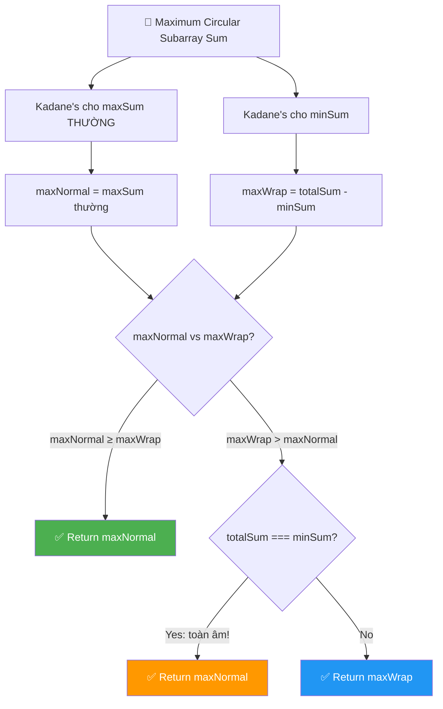
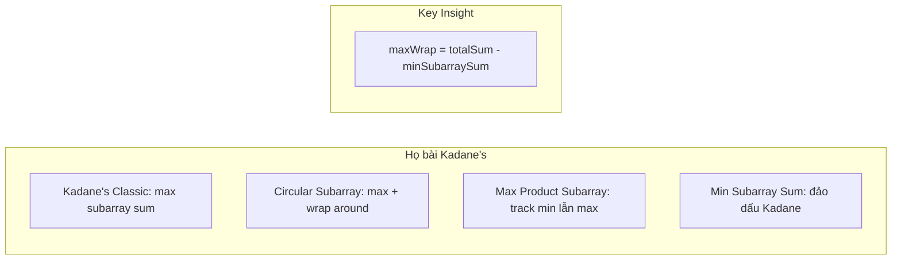
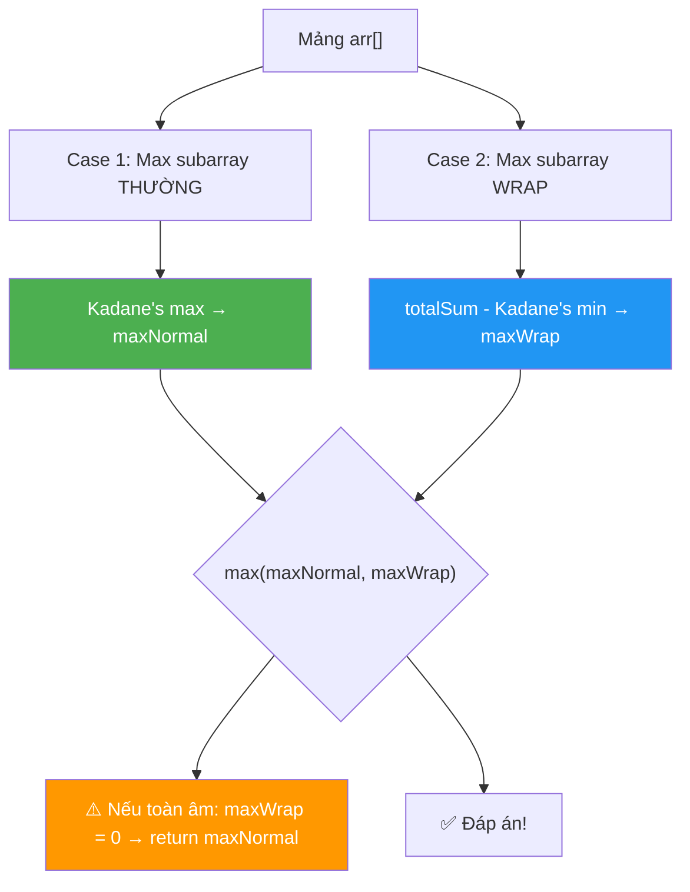
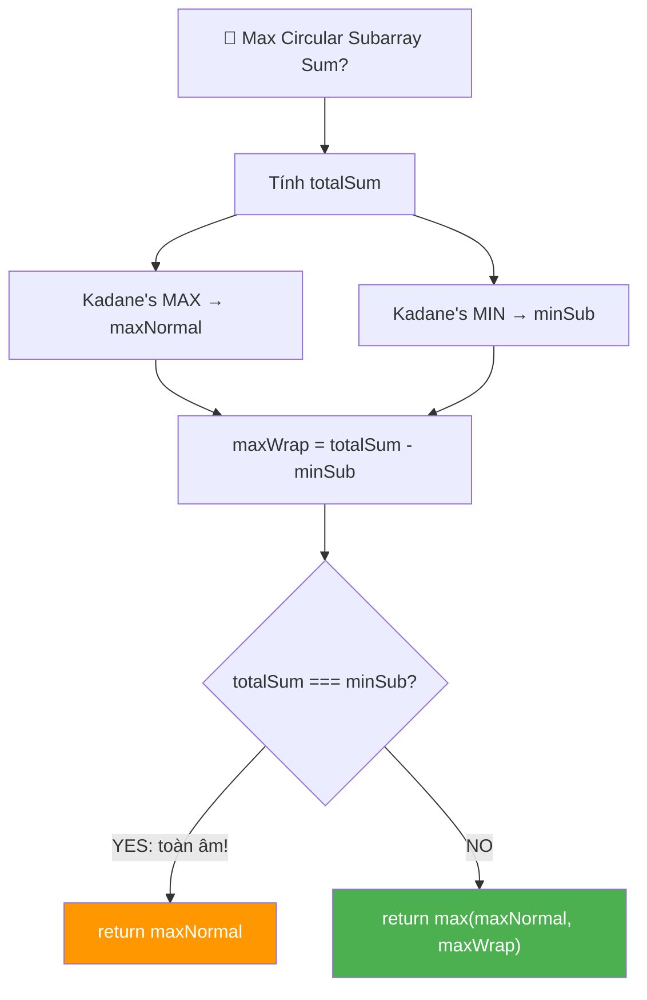
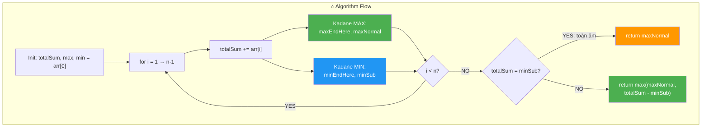
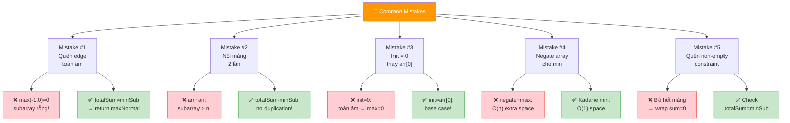
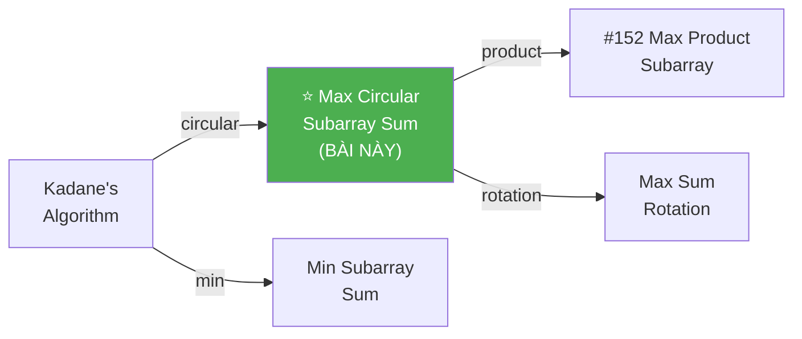
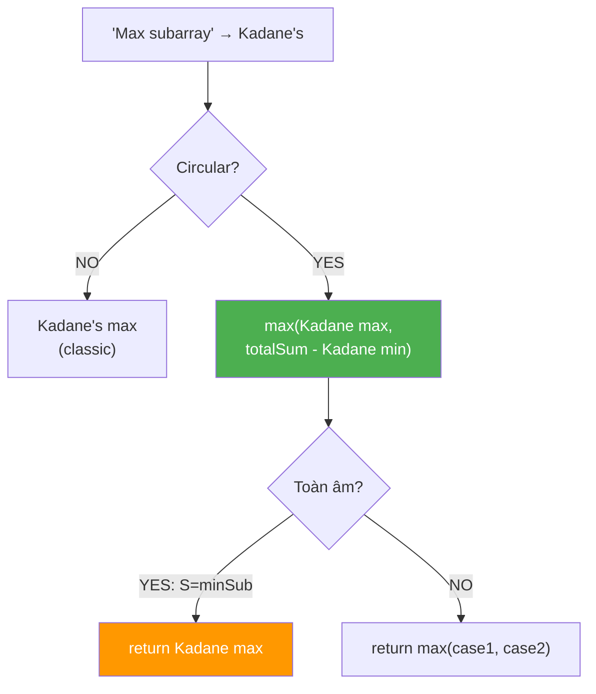
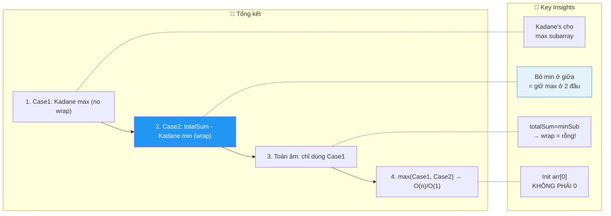

# 🔄 Maximum Circular Subarray Sum — GfG (Medium)

> 📖 Code: [Maximum Circular Subarray Sum.js](./Maximum%20Circular%20Subarray%20Sum.js)





---

## R — Repeat & Clarify

🧠 *"Circular array = mảng VÒNG TRÒN: phần tử cuối nối với phần tử đầu. Tìm subarray (có thể WRAP AROUND) có tổng lớn nhất."*

> 🎙️ *"Given a circular array, find the maximum sum of any non-empty subarray. The subarray may wrap around the end and continue from the beginning."*

### Clarification Questions

```
Q: Circular array nghĩa là gì?
A: Phần tử cuối LIÊN TIẾP với phần tử đầu!
   arr = [1, 2, 3] → ... → 3 → 1 → 2 → 3 → 1 → ...
   Subarray [3, 1] ✅ (wrap around!)

Q: Subarray phải non-empty?
A: CÓ! Ít nhất 1 phần tử.

Q: Mảng toàn âm thì sao?
A: Trả về số âm LỚN NHẤT (ít âm nhất).
   [-3, -2, -1] → -1

Q: Wrap around subarray có thể dài hơn n không?
A: KHÔNG! Tối đa n phần tử (toàn bộ mảng).

Q: Khác gì Kadane's thường?
A: Kadane's thường: subarray KHÔNG wrap.
   Bài này: subarray CÓ THỂ wrap qua đuôi → đầu!

Q: Subarray wrap = phần đầu + phần cuối?
A: ĐÚNG! Wrap subarray = [...cuối mảng] + [...đầu mảng]
   = totalSum - phần GIỮA bỏ đi!
```

### Tại sao bài này quan trọng?

```
  Bài này là NÂNG CẤP của Kadane's Algorithm!!!

  BẠN PHẢI hiểu:
  1. Kadane's thường chỉ xét subarray LIÊN TIẾP trong mảng
  2. Circular cho phép WRAP AROUND → thêm 1 trường hợp!
  3. Trick: maxWrap = totalSum - minSubarraySum
     → KHÔNG cần thực sự nối mảng thành vòng tròn!

  Prerequisite:
  ┌─────────────────────────────────────────────────┐
  │  ⚠️ PHẢI hiểu Kadane's Algorithm TRƯỚC!          │
  │  → maxEndingHere = max(num, maxEndingHere + num) │
  │  → "Tiếp tục hay bắt đầu lại?"                  │
  │  → Xem: Kadane's Algorithm.md                    │
  └─────────────────────────────────────────────────┘
```

---

## 🧠 Bản chất bài toán — Hiểu để NHỚ, không chỉ để GIẢI

### INSIGHT CỐT LÕI: "Bỏ min ở GIỮA = Giữ max ở 2 ĐẦU!"

```
  ⭐ Ẩn dụ: CHUỖI HẠT VÒNG TRÒN!

  Tưởng tượng mảng là 1 chuỗi hạt nối thành vòng tròn.
  Mỗi hạt có giá trị (dương hoặc âm).
  Bạn muốn CẮT 1 đoạn liên tiếp có TỔNG LỚN NHẤT.

  2 CÁCH cắt:
  1. Cắt 1 đoạn ở GIỮA → Kadane's thường!
  2. Cắt 1 đoạn QUẤN QUA mối nối → Wrap!
     = BỎ phần còn lại ở giữa
     = totalSum - phần bị bỏ
     → Muốn max phần giữ = min phần bỏ!
```

### 2 TRƯỜNG HỢP — CHỈ CÓ 2 THÔI!

```
  Subarray tổng max chỉ nằm ở 1 trong 2 vị trí:

  CASE 1: KHÔNG WRAP — subarray nằm giữa mảng
  ┌────────────────────────────────────┐
  │  ...  [█████████████]  ...         │
  │        ↑ start   end ↑            │
  │  → Kadane's THƯỜNG!               │
  └────────────────────────────────────┘

  CASE 2: CÓ WRAP — subarray quấn qua đuôi-đầu
  ┌────────────────────────────────────┐
  │  [████]  ...........  [████████]   │
  │  ↑ end   (phần BỎ)    start ↑     │
  │  → Phần BỎ ở GIỮA = MIN subarray! │
  └────────────────────────────────────┘

  ĐÁP ÁN = max(case1, case2)
```

### Tại sao totalSum - minSubarraySum?

```
  CHỨNG MINH:

  Mảng:    [a₁, a₂, a₃, ..., aₙ]
  totalSum = a₁ + a₂ + ... + aₙ

  Nếu wrap subarray = [aₖ, ..., aₙ, a₁, ..., aⱼ]
  thì phần BỎ ĐI  = [aⱼ₊₁, ..., aₖ₋₁]  ← subarray ở GIỮA!

  wrapSum = totalSum - bỏSum
  Muốn wrapSum LỚN NHẤT ↑
  → Cần bỏSum NHỎ NHẤT ↓
  → bỏSum = MIN subarray sum!

  ⭐ maxWrap = totalSum - minSubarraySum

  ┌──────────────────────────────────────────────────────────────┐
  │  Tổng mảng:    [████████████████████████████████]  = totalSum│
  │                      ↑               ↑                      │
  │                 Phần BỎ = minSubarray (Kadane's min!)        │
  │                                                              │
  │  Sau khi BỎ:                                                 │
  │  [████]                         [████████]                   │
  │     ↑                              ↑                         │
  │  wrap TRÁI                    wrap PHẢI                      │
  │  = totalSum - minSubarraySum!                                │
  │                                                              │
  │  📌 KHÔNG cần nối mảng! Chỉ cần totalSum - minSubarraySum! │
  └──────────────────────────────────────────────────────────────┘
```



### Edge Case: Mảng toàn âm!

```
  ⚠️ CRITICAL EDGE CASE!

  arr = [-3, -2, -1]
  totalSum = -6
  minSubarraySum = toàn bộ mảng = -6

  maxWrap = totalSum - minSubarraySum = -6 - (-6) = 0

  Nhưng subarray phải NON-EMPTY! → 0 KHÔNG HỢP LỆ!
  (0 nghĩa là bỏ HẾT mảng → subarray rỗng!)

  → Khi totalSum === minSubarraySum → TOÀN ÂM → return maxNormal!
  → maxNormal = -1 (Kadane's thường tìm đúng số ít âm nhất)

  CÁCH PHÁT HIỆN:
    totalSum === minSubarraySum
    → mảng toàn âm (hoặc tổng = 0 nhưng minSub = totalSum)
    → Wrap case vô nghĩa → chỉ dùng Kadane's thường!
```

---

## 🧭 Luồng Suy Nghĩ — Từ đọc đề đến solution

### Bước 1: Đọc đề → Keywords

```
  Đề: "Maximum sum of non-empty subarray in a circular array"

  Gạch chân:
    ✏️ "circular"    → wrap around!
    ✏️ "subarray"    → LIÊN TIẾP → Kadane's family!
    ✏️ "maximum sum" → optimization
    ✏️ "non-empty"   → ít nhất 1 phần tử!

  🧠 Trigger:
    "circular array" → totalSum - opposite!
    "max subarray" → Kadane's Algorithm!
    → Combine: Kadane's max + Kadane's min!
```

### Bước 2: Vẽ ví dụ → Tìm pattern

```
  arr = [4, -1, -2, 3]

  Linear: max = [4] = 4
  Wrap:   max = [3, 4] = 7 (bỏ [-1, -2] ở giữa!)
  totalSum = 4, minSubarray = -3
  maxWrap = 4 - (-3) = 7 ✅

  📌 PATTERN: maxWrap = totalSum - minSubarraySum
```

### Bước 3: Cây quyết định



---

## E — Examples

```
VÍ DỤ 1: arr = [8, -8, 9, -9, 10, -11, 12]

  totalSum = 11
  Kadane's max: [12] = 12 → maxNormal = 12
  Kadane's min: [-11] → minSubarray = -11
  maxWrap = 11 - (-11) = 22

  Đáp án = max(12, 22) = 22 ✅
  Wrap subarray: [12, 8, -8, 9, -9, 10] (bỏ [-11])
```

```
VÍ DỤ 2: arr = [4, -1, -2, 3]

  totalSum = 4
  Kadane's max: [4] = 4 → maxNormal = 4
  Kadane's min: [-1, -2] = -3 → minSubarray = -3
  maxWrap = 4 - (-3) = 7

  Đáp án = max(4, 7) = 7 ✅
  Wrap subarray: [3, 4] (bỏ [-1, -2])
```

```
VÍ DỤ 3: arr = [5, -2, 3, 4]

  totalSum = 10
  Kadane's max: [5, -2, 3, 4] = 10 → maxNormal = 10
  Kadane's min: [-2] → minSubarray = -2
  maxWrap = 10 - (-2) = 12

  Đáp án = max(10, 12) = 12 ✅
  Wrap subarray: [3, 4, 5] (bỏ [-2])
```

```
VÍ DỤ 4 (EDGE): arr = [-3, -2, -1]    (toàn âm!)

  totalSum = -6
  Kadane's max: [-1] → maxNormal = -1
  Kadane's min: [-3, -2, -1] = -6
  maxWrap = -6 - (-6) = 0

  ⚠️ totalSum === minSubarray → TOÀN ÂM!
  → Return maxNormal = -1 ✅
```

```
VÍ DỤ 5 (Edge): arr = [1, 2, 3]    (toàn dương)

  totalSum = 6
  Kadane's max: [1, 2, 3] = 6 → maxNormal = 6
  Kadane's min: [1] = 1 → minSubarray = 1
  maxWrap = 6 - 1 = 5

  Đáp án = max(6, 5) = 6 ✅ → Không wrap! Lấy hết mảng!
```

### Trace dạng bảng — VD chi tiết

```
  arr = [8, -8, 9, -9, 10, -11, 12]    n=7

  ═══ Kadane's MAX + MIN đồng thời ═══════════════════

  ┌───────┬──────┬────────────┬────────┬────────────┬─────────┐
  │ i     │ a[i] │ maxEndHere │ maxNorm│ minEndHere │ minSub  │
  ├───────┼──────┼────────────┼────────┼────────────┼─────────┤
  │ init  │  8   │ 8          │ 8      │ 8          │ 8       │
  │ 1     │ -8   │ max(-8,0)=0│ 8      │ min(-8,0)=-8│ -8     │
  │ 2     │  9   │ max(9,9)=9 │ 9      │ min(9,1)=1 │ -8      │
  │ 3     │ -9   │ max(-9,0)=0│ 9      │ min(-9,-8)=-9│ -9    │
  │ 4     │ 10   │ max(10,10)=10│ 10   │ min(10,1)=1│ -9      │
  │ 5     │ -11  │ max(-11,-1)=-1│ 10  │ min(-11,-10)=-11│-11  │
  │ 6     │ 12   │ max(12,11)=12│ 12   │ min(12,1)=1│ -11     │
  └───────┴──────┴────────────┴────────┴────────────┴─────────┘

  totalSum = 11
  maxNormal = 12, minSubarray = -11
  maxWrap = 11 - (-11) = 22
  Đáp án = max(12, 22) = 22 ✅
```

---

## A — Approach

### Approach 1: Brute Force — O(n²)

```
  Thử MỌI subarray (bao gồm wrap around):

  for start = 0 → n-1:
    sum = 0
    for len = 1 → n:
      index = (start + len - 1) % n    ← wrap bằng modulo!
      sum += arr[index]
      maxSum = max(maxSum, sum)

  ✅ Đúng, dễ hiểu
  ❌ O(n²)
```

### Approach 2: Kadane's max + min — O(n) ⭐

```
  Case 1: Max subarray KHÔNG wrap → Kadane's max
  Case 2: Max subarray CÓ wrap → totalSum - Kadane's min
  Đáp án = max(case1, case2)
  ⚠️ Edge: toàn âm → chỉ dùng case 1!

  Time: O(n)    Space: O(1)
```

---

## C — Code ✅

### Solution 1: Brute Force — O(n²)

```javascript
function maxCircularSubarraySumBrute(arr) {
  const n = arr.length;
  let maxSum = -Infinity;

  for (let i = 0; i < n; i++) {
    let currentSum = 0;
    for (let j = 0; j < n; j++) {
      currentSum += arr[(i + j) % n]; // % n để wrap around!
      maxSum = Math.max(maxSum, currentSum);
    }
  }
  return maxSum;
}
```

### Solution 2: Kadane's max + min — O(n) ⭐

```javascript
function maxCircularSubarraySum(arr) {
  let totalSum = 0;
  let maxEndHere = arr[0], maxNormal = arr[0];
  let minEndHere = arr[0], minSub = arr[0];

  totalSum = arr[0];

  for (let i = 1; i < arr.length; i++) {
    totalSum += arr[i];

    // Kadane's max
    maxEndHere = Math.max(arr[i], maxEndHere + arr[i]);
    maxNormal = Math.max(maxNormal, maxEndHere);

    // Kadane's min
    minEndHere = Math.min(arr[i], minEndHere + arr[i]);
    minSub = Math.min(minSub, minEndHere);
  }

  // Edge case: toàn âm
  if (totalSum === minSub) return maxNormal;

  return Math.max(maxNormal, totalSum - minSub);
}
```

---

## 🔬 Deep Dive — Giải thích CHI TIẾT từng dòng

> 💡 Phân tích **từng dòng** để hiểu **TẠI SAO**.

```javascript
function maxCircularSubarraySum(arr) {
  // ═══════════════════════════════════════════════════════════
  // Khởi tạo 5 biến — TẤT CẢ = arr[0]!
  // ═══════════════════════════════════════════════════════════
  //
  // TẠI SAO arr[0] không phải 0?
  //   → Nếu init = 0: max(0, -3) = 0 → SAI cho mảng toàn âm!
  //   → arr[0] = base case (subarray 1 phần tử đầu tiên)
  //
  let totalSum = 0;
  let maxEndHere = arr[0], maxNormal = arr[0];
  let minEndHere = arr[0], minSub = arr[0];

  totalSum = arr[0];

  for (let i = 1; i < arr.length; i++) {
    // ═══════════════════════════════════════════════════════
    // totalSum: cộng dồn TOÀN BỘ mảng
    // ═══════════════════════════════════════════════════════
    //
    // Cần cho công thức: maxWrap = totalSum - minSub
    //
    totalSum += arr[i];

    // ═══════════════════════════════════════════════════════
    // Kadane's MAX — Case 1 (không wrap)
    // ═══════════════════════════════════════════════════════
    //
    // maxEndHere = max(arr[i], maxEndHere + arr[i])
    //   → "BẮT ĐẦU LẠI từ arr[i]" hay "TIẾP TỤC cộng dồn?"
    //   → Nếu cộng dồn < bắt đầu lại → bắt đầu lại!
    //
    // maxNormal = max(maxNormal, maxEndHere)
    //   → Track MAX toàn cục!
    //
    maxEndHere = Math.max(arr[i], maxEndHere + arr[i]);
    maxNormal = Math.max(maxNormal, maxEndHere);

    // ═══════════════════════════════════════════════════════
    // Kadane's MIN — cho Case 2 (wrap)
    // ═══════════════════════════════════════════════════════
    //
    // GIỐNG Kadane's MAX nhưng ĐẢO max → min!
    //
    // minEndHere = min(arr[i], minEndHere + arr[i])
    //   → Tìm subarray có TỔNG NHỎ NHẤT!
    //   → "BẮT ĐẦU LẠI" hay "TIẾP TỤC trừ dồn?"
    //
    // minSub = min(minSub, minEndHere)
    //   → Track MIN toàn cục!
    //
    // TẠI SAO cần min?
    //   maxWrap = totalSum - minSub
    //   → Bỏ phần NHỎ nhất ở giữa = Giữ phần LỚN nhất ở 2 đầu!
    //
    minEndHere = Math.min(arr[i], minEndHere + arr[i]);
    minSub = Math.min(minSub, minEndHere);
  }

  // ═══════════════════════════════════════════════════════════
  // Edge case: TOÀN ÂM!
  // ═══════════════════════════════════════════════════════════
  //
  // totalSum === minSub có nghĩa:
  //   → minSubarray = toàn bộ mảng!
  //   → maxWrap = totalSum - totalSum = 0
  //   → 0 = subarray RỖNG → KHÔNG HỢP LỆ!
  //
  // TẠI SAO toàn âm → minSub = totalSum?
  //   → Kadane's min sẽ lấy TOÀN BỘ mảng (vì tất cả đều âm!)
  //   → minSub = Σarr[i] = totalSum
  //
  // → Phải return maxNormal (số ÍT ÂM NHẤT!)
  //
  if (totalSum === minSub) return maxNormal;

  // ═══════════════════════════════════════════════════════════
  // Kết quả: max(Case1, Case2)
  // ═══════════════════════════════════════════════════════════
  //
  // maxNormal = Kadane's max (Case 1: không wrap)
  // totalSum - minSub = maxWrap (Case 2: wrap!)
  //
  return Math.max(maxNormal, totalSum - minSub);
}
```



---

## 📐 Invariant — Chứng minh tính đúng đắn

```
  📐 INVARIANT:

  Sau khi duyệt đến index i:
    maxNormal = max subarray sum trong arr[0..i] (không wrap)
    minSub = min subarray sum trong arr[0..i]
    totalSum = Σ arr[0..i]

  CHỨNG MINH Case 1 (correctness of Kadane's max):
  ┌──────────────────────────────────────────────────────────────┐
  │  maxEndHere = max sum subarray KẾT THÚC tại index i         │
  │  maxNormal = max trên tất cả maxEndHere → global max!       │
  │  → Đúng bởi Kadane's Algorithm (đã chứng minh!)  ∎          │
  └──────────────────────────────────────────────────────────────┘

  CHỨNG MINH Case 2 (wrap = totalSum - minSubarray):
  ┌──────────────────────────────────────────────────────────────┐
  │  Wrap subarray = arr[k..n-1] ∪ arr[0..j] (k > j)            │
  │                                                              │
  │  wrapSum = Σarr[k..n-1] + Σarr[0..j]                        │
  │         = totalSum - Σarr[j+1..k-1]                          │
  │                                                              │
  │  Phần bỏ: arr[j+1..k-1] = 1 subarray liên tiếp ở GIỮA     │
  │                                                              │
  │  max(wrapSum) = max(totalSum - Σarr[j+1..k-1])              │
  │               = totalSum - min(Σarr[j+1..k-1])              │
  │               = totalSum - minSubarraySum                     │
  │                                                              │
  │  → minSubarraySum = Kadane's min → ĐÚNG!  ∎                  │
  └──────────────────────────────────────────────────────────────┘

  CHỨNG MINH Edge Case (toàn âm):
  ┌──────────────────────────────────────────────────────────────┐
  │  Nếu tất cả arr[i] < 0:                                     │
  │    Kadane's min lấy TOÀN BỘ mảng → minSub = totalSum       │
  │    maxWrap = totalSum - totalSum = 0                          │
  │    → 0 = subarray rỗng → INVALID (non-empty required!)      │
  │                                                              │
  │  Detect: totalSum === minSub                                  │
  │  Fix: return maxNormal (Kadane's max tìm đúng element lớn nhất) │
  │  → maxNormal = max(arr[i]) = số ÍT ÂM nhất!  ∎              │
  └──────────────────────────────────────────────────────────────┘

  📐 COMPLETENESS:
    Mọi subarray (wrap hoặc không):
    - Không wrap: covered by Case 1 (Kadane's max)
    - Wrap: covered by Case 2 (totalSum - Kadane's min)
    → Đáp án = max(Case1, Case2) → ĐÚNG!  ∎
```

---

## ❌ Common Mistakes — Lỗi thường gặp



### Mistake 1: Quên edge case TOÀN ÂM!

```javascript
// ❌ SAI: return max(maxNormal, maxWrap)!
return Math.max(maxNormal, totalSum - minSub);
// arr = [-3,-2,-1]: max(-1, 0) = 0 → SAI! (subarray rỗng!)

// ✅ ĐÚNG: check trước!
if (totalSum === minSub) return maxNormal;
return Math.max(maxNormal, totalSum - minSub);
// arr = [-3,-2,-1]: return -1 ✅
```

### Mistake 2: Nối mảng 2 lần!

```javascript
// ❌ SAI: nối arr+arr rồi Kadane's!
const doubled = [...arr, ...arr];
let maxEndHere = doubled[0], maxSum = doubled[0];
for (let i = 1; i < 2 * n; i++) {
  maxEndHere = Math.max(doubled[i], maxEndHere + doubled[i]);
  maxSum = Math.max(maxSum, maxEndHere);
}
// VẤN ĐỀ: subarray có thể dài > n → lấy TRÙNG phần tử!
// Phải thêm constraint max length = n → PHỨC TẠP!

// ✅ ĐÚNG: totalSum - minSubarray → ĐƠN GIẢN!
```

### Mistake 3: Khởi tạo = 0!

```javascript
// ❌ SAI: init = 0!
let maxEndHere = 0, maxNormal = 0;
// arr = [-3,-2,-1]: max(0, -3) = 0 → maxNormal = 0 → SAI!

// ✅ ĐÚNG: init = arr[0], duyệt từ i=1!
let maxEndHere = arr[0], maxNormal = arr[0];
// arr = [-3,-2,-1]: maxNormal = -1 ✅
```

### Mistake 4: Negate array cho min!

```javascript
// ❌ KHÔNG SAI nhưng tốn space:
const negated = arr.map(x => -x);  // O(n) space!
// Kadane's max trên negated → negate result = Kadane's min

// ✅ ĐÚNG: Kadane's min trực tiếp → O(1) space!
minEndHere = Math.min(arr[i], minEndHere + arr[i]);
minSub = Math.min(minSub, minEndHere);
```

### Mistake 5: Quên non-empty constraint!

```
  maxWrap = totalSum - minSubarray

  Nếu minSubarray = totalSum → bỏ HẾT mảng!
  → Wrap subarray = RỖNG → vi phạm non-empty!

  📌 LUÔN check: totalSum === minSub → return maxNormal!
```

---

## O — Optimize

```
                    Time      Space          Ghi chú
  ───────────────────────────────────────────────────
  Brute Force       O(n²)     O(1)           Modulo wrap
  Kadane max+min ⭐  O(n)      O(1)           Tối ưu!
```

### Complexity chính xác — Đếm operations

```
  Kadane max + min (1 pass):
    n additions (totalSum)
    n max operations (Kadane's max: maxEndHere)
    n max operations (maxNormal)
    n min operations (Kadane's min: minEndHere)
    n min operations (minSub)
    1 comparison (totalSum vs minSub)
    1 max operation (final answer)
    TỔNG: 5n + 2 operations, 5 variables

  📊 So sánh (n = 10⁶):
    Kadane: 5×10⁶ ops, 40 bytes ⭐
    Brute:  10¹² ops 💀

  📌 O(n) là TỐI ƯU: Ω(n) lower bound (phải đọc mọi element!)
```

---

## T — Test

```
Test Cases:
  [8, -8, 9, -9, 10, -11, 12] → 22  ✅ wrap [12, 8, -8, 9, -9, 10]
  [4, -1, -2, 3]               → 7   ✅ wrap [3, 4]
  [5, -2, 3, 4]                → 12  ✅ wrap [3, 4, 5]
  [-3, -2, -1]                 → -1  ✅ toàn âm
  [1, 2, 3]                    → 6   ✅ toàn dương, lấy hết
  [5]                          → 5   ✅ 1 phần tử
  [-1]                         → -1  ✅ 1 phần tử âm
  [3, -1, 2, -1]              → 4   ✅ wrap [2,-1,3] or no-wrap [3,-1,2]
  [10, -3, -4, 7, 6, 5, -4, -1] → 23 ✅ wrap
```

---

## 🗣️ Interview Script

### 🎙️ Think Out Loud — Mô phỏng phỏng vấn thực

```
  ──────────────── PHASE 1: Clarify ────────────────

  👤 Interviewer: "Find the maximum subarray sum in a
                   circular array."

  🧑 You: "So the array wraps around — the last element
   connects to the first. The subarray can span across
   this boundary. Must be non-empty. Correct?"

  ──────────────── PHASE 2: Examples ────────────────

  🧑 You: "arr = [4, -1, -2, 3].
   Normal max: [4] = 4.
   But wrapping: [3, 4] = 7 — that's better!
   The 'wrap' skips [-1, -2] in the middle."

  ──────────────── PHASE 3: Approach ────────────────

  🧑 You: "I see two cases:

   Case 1: The max subarray doesn't wrap — standard Kadane's.

   Case 2: It wraps around. In this case, the part we SKIP
   in the middle is a contiguous subarray. To maximize what
   we keep, we minimize what we skip.

   So maxWrap = totalSum - minSubarraySum.
   I can find minSubarraySum with a modified Kadane's
   (just swap max for min).

   Final answer = max(case1, case2).

   Edge case: if all elements are negative, minSubarray
   equals the entire array, giving a wrap sum of 0.
   But the subarray must be non-empty, so I return
   the normal Kadane's result instead.

   O(n) time, O(1) space — both Kadane's run simultaneously."

  ──────────────── PHASE 4: Code + Verify ────────────────

  🧑 You: [writes code, traces example]

  "totalSum=4, maxNormal=4, minSub=-3.
   maxWrap = 4-(-3) = 7. max(4,7) = 7 ✅."

  ──────────────── PHASE 5: Follow-ups ────────────────

  👤 "Can you use the 'double array' approach?"
  🧑 "You could concatenate arr+arr and run Kadane's
      with a window constraint ≤ n. But that's harder
      to implement and still O(n). The totalSum-minSub
      approach is cleaner."

  👤 "What about finding the actual subarray indices?"
  🧑 "I'd track start/end indices for both Kadane's max
      and min. For the wrap case, the subarray goes from
      minEnd+1 to minStart-1, wrapping around."

  👤 "How about max product in a circular array?"
  🧑 "Much harder! Product has sign issues — negative times
      negative is positive. You'd need to track both max and
      min products, combined with the circular trick."
```

---

## 📚 Bài tập liên quan — Practice Problems

### Progression Path



### 1. Maximum Subarray (#53) — Kadane's Classic

```
  Đề: Max subarray sum KHÔNG circular.

  function maxSubArray(nums) {
    let maxEndHere = nums[0], maxSoFar = nums[0];
    for (let i = 1; i < nums.length; i++) {
      maxEndHere = Math.max(nums[i], maxEndHere + nums[i]);
      maxSoFar = Math.max(maxSoFar, maxEndHere);
    }
    return maxSoFar;
  }

  📌 CƠ SỞ cho bài này! Phải hiểu trước!
```

### 2. Maximum Sum Circular Subarray (#918) — LeetCode version

```
  Đề: CÙNG BÀI! LeetCode version.

  function maxSubarraySumCircular(nums) {
    let totalSum = 0;
    let maxEnd = nums[0], maxSum = nums[0];
    let minEnd = nums[0], minSum = nums[0];

    totalSum = nums[0];

    for (let i = 1; i < nums.length; i++) {
      totalSum += nums[i];
      maxEnd = Math.max(nums[i], maxEnd + nums[i]);
      maxSum = Math.max(maxSum, maxEnd);
      minEnd = Math.min(nums[i], minEnd + nums[i]);
      minSum = Math.min(minSum, minEnd);
    }

    if (totalSum === minSum) return maxSum;
    return Math.max(maxSum, totalSum - minSum);
  }

  📌 LeetCode #918 = bài này!
```

### 3. Maximum Product Subarray (#152) — Medium

```
  Đề: Max PRODUCT (không phải sum!) subarray.

  function maxProduct(nums) {
    let maxP = nums[0], minP = nums[0], result = nums[0];
    for (let i = 1; i < nums.length; i++) {
      if (nums[i] < 0) [maxP, minP] = [minP, maxP];  // swap!
      maxP = Math.max(nums[i], maxP * nums[i]);
      minP = Math.min(nums[i], minP * nums[i]);
      result = Math.max(result, maxP);
    }
    return result;
  }

  📌 Khác: track MIN product vì âm×âm=dương!
```

### 4. Min Subarray Sum

```
  Đề: Min subarray sum (Kadane's đảo).

  function minSubArray(nums) {
    let minEndHere = nums[0], minSoFar = nums[0];
    for (let i = 1; i < nums.length; i++) {
      minEndHere = Math.min(nums[i], minEndHere + nums[i]);
      minSoFar = Math.min(minSoFar, minEndHere);
    }
    return minSoFar;
  }

  📌 GIỐNG Kadane's max, đổi max→min! Dùng trong bài này!
```

### Tổng kết — Kadane's Family

```
  ┌──────────────────────────────────────────────────────────────┐
  │  BÀI                     │  Trick                           │
  ├──────────────────────────────────────────────────────────────┤
  │  #53 Max Subarray        │  Kadane's max                    │
  │  #918 Max Circular ⭐     │  max(Kadane max, S-Kadane min)  │
  │  #152 Max Product        │  track max AND min product       │
  │  Min Subarray            │  Kadane's min (swap max→min)    │
  │  Max Sum Rotation        │  Derive formula O(1)/rotation   │
  └──────────────────────────────────────────────────────────────┘

  📌 RULE:
    "Max subarray" → Kadane's!
    "Circular" → totalSum - opposite!
    "Product" → track BOTH max and min!
```

### Skeleton code — Reusable Circular pattern

```javascript
// TEMPLATE: Circular max/min subarray
function circularSubarray(arr, mode = 'max') {
  let totalSum = arr[0];
  let maxEnd = arr[0], maxSum = arr[0];
  let minEnd = arr[0], minSum = arr[0];

  for (let i = 1; i < arr.length; i++) {
    totalSum += arr[i];
    maxEnd = Math.max(arr[i], maxEnd + arr[i]);
    maxSum = Math.max(maxSum, maxEnd);
    minEnd = Math.min(arr[i], minEnd + arr[i]);
    minSum = Math.min(minSum, minEnd);
  }

  if (mode === 'max') {
    // Max circular subarray sum
    if (totalSum === minSum) return maxSum;
    return Math.max(maxSum, totalSum - minSum);
  } else {
    // Min circular subarray sum
    if (totalSum === maxSum) return minSum;
    return Math.min(minSum, totalSum - maxSum);
  }
}
```

---

## 📌 Kỹ năng chuyển giao — Pattern Summary



---

## 📊 Tổng kết — Key Insights



```
  ┌──────────────────────────────────────────────────────────────────────────┐
  │  📌 3 ĐIỀU PHẢI NHỚ                                                    │
  │                                                                          │
  │  1. 2 CASES:                                                             │
  │     Case 1: Subarray KHÔNG wrap → Kadane's max thường!                 │
  │     Case 2: Subarray CÓ wrap → totalSum - Kadane's min!               │
  │     → Bỏ phần NHỎ NHẤT ở giữa = Giữ phần LỚN NHẤT ở 2 đầu!        │
  │     → KHÔNG cần nối mảng!                                              │
  │                                                                          │
  │  2. EDGE CASE — TOÀN ÂM:                                                │
  │     totalSum === minSubarray → wrap case = 0 (rỗng!)                   │
  │     → Phải return maxNormal!                                            │
  │     → Detect bằng: if (totalSum === minSub) return maxNormal           │
  │                                                                          │
  │  3. PATTERN: "CIRCULAR → totalSum - opposite!"                         │
  │     → Max circular = totalSum - min subarray                           │
  │     → Min circular = totalSum - max subarray                           │
  │     → Init = arr[0], KHÔNG PHẢI 0! (cho mảng toàn âm!)               │
  │     → Kadane's max + min chạy ĐỒNG THỜI trong 1 pass → O(n)/O(1)!    │
  └──────────────────────────────────────────────────────────────────────────┘
```

---

## 📝 Flashcard — Tự kiểm tra

| ❓ Câu hỏi | ✅ Đáp án |
|---|---|
| Circular subarray khác gì linear? | Có thể **WRAP** qua đuôi về đầu |
| 2 cases chính? | Case 1: không wrap (Kadane max), Case 2: wrap (**totalSum - Kadane min**) |
| Tại sao totalSum - minSubarray? | Bỏ phần **NHỎ** nhất ở giữa = Giữ phần **LỚN** nhất ở 2 đầu |
| Edge case quan trọng nhất? | **Toàn âm**: maxWrap = 0 (rỗng!) → return maxNormal |
| Cách detect toàn âm? | **totalSum === minSubarray** |
| Kadane's min khác max? | Đổi **max → min** trong công thức! |
| Init maxEndHere? | **arr[0]**, KHÔNG PHẢI 0! |
| Có cần nối mảng 2 lần? | **KHÔNG!** totalSum - minSubarray = đủ! |
| Time / Space? | **O(n)** / **O(1)** (5 biến) |
| LeetCode equivalent? | **#918** Maximum Sum Circular Subarray |
| Pattern khi gặp "circular"? | **totalSum - opposite!** |
| Max product subarray khác gì? | Track **BOTH** max AND min product (âm×âm=dương!) |
