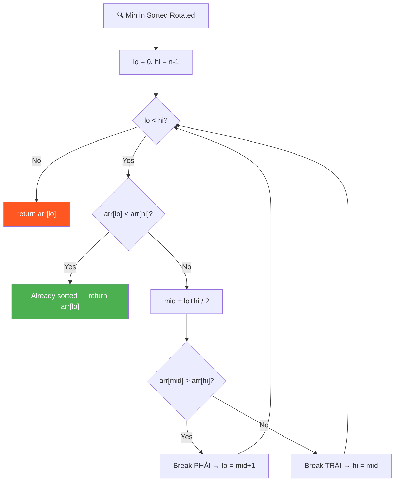
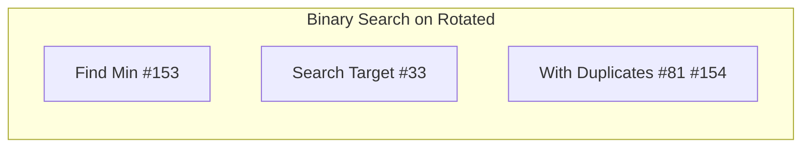

# 🔍 Minimum in a Sorted and Rotated Array — GfG (Medium)

> 📖 Code: [Min in Sorted Rotated.js](./Min%20in%20Sorted%20Rotated.js)





---

## R — Repeat & Clarify

🧠 *"Sorted + rotated = 2 đoạn sorted. Binary Search: nếu mid > high → min ở PHẢI. Ngược lại → min ở TRÁI!"*

> 🎙️ *"Find the minimum element in a sorted array that has been rotated. The minimum is at the rotation point. Use binary search for O(log n)."*

---

## E — Examples

```
arr = [5, 6, 1, 2, 3, 4]

  Sorted gốc: [1, 2, 3, 4, 5, 6]
  Rotated:     [5, 6, | 1, 2, 3, 4]
                       ↑ MIN = rotation point!

  Binary Search:
    lo=0, hi=5, mid=2 → arr[2]=1 < arr[5]=4 → hi=2
    lo=0, hi=2, mid=1 → arr[1]=6 > arr[2]=1 → lo=2
    lo=2, hi=2 → return arr[2] = 1 ✅
```

---

## A — Approach

```
💡 KEY INSIGHT:
  Sorted + rotated → 2 nửa sorted
  Min nằm ở ĐIỂM GÃY (rotation point)

  Binary Search:
    Nếu arr[lo] < arr[hi] → đoạn [lo..hi] sorted → min = arr[lo]
    Nếu arr[mid] > arr[hi] → gãy ở bên PHẢI → lo = mid + 1
    Ngược lại → gãy ở bên TRÁI (hoặc = mid) → hi = mid
```

---

## C — Code

### Solution 1: Linear — O(n)

```javascript
function findMinLinear(arr) {
  return Math.min(...arr);
}
```

### Solution 2: Binary Search — O(log n) ✅

```javascript
function findMin(arr) {
  let lo = 0, hi = arr.length - 1;

  while (lo < hi) {
    // Already sorted range
    if (arr[lo] < arr[hi]) return arr[lo];

    const mid = Math.floor((lo + hi) / 2);

    if (arr[mid] > arr[hi]) {
      lo = mid + 1;    // Min ở bên PHẢI
    } else {
      hi = mid;         // Min ở bên TRÁI (hoặc = mid)
    }
  }
  return arr[lo];
}
```

### Trace: [5, 6, 1, 2, 3, 4]

```
  lo=0, hi=5: arr[0]=5 > arr[5]=4 → NOT sorted
    mid=2: arr[2]=1 ≤ arr[5]=4 → hi=2

  lo=0, hi=2: arr[0]=5 > arr[2]=1 → NOT sorted
    mid=1: arr[1]=6 > arr[2]=1 → lo=2

  lo=2, hi=2: STOP! return arr[2] = 1 ✅
```

### Trace: [3, 1, 2]

```
  lo=0, hi=2: arr[0]=3 > arr[2]=2
    mid=1: arr[1]=1 ≤ arr[2]=2 → hi=1

  lo=0, hi=1: arr[0]=3 > arr[1]=1
    mid=0: arr[0]=3 > arr[1]=1 → lo=1

  lo=1, hi=1: return arr[1] = 1 ✅
```

---

## O — Optimize

```
  Linear:        O(n)
  Binary Search: O(log n) ✅

  ⚠️ Chỉ hoạt động với DISTINCT elements!
  Nếu có duplicates → worst case O(n) (LeetCode #154)
```

---

## 🗣️ Interview Script

> 🎙️ *"A sorted-rotated array has two sorted halves. The minimum is at the break point. Using binary search, I compare mid with high — if mid > high, the break is to the right; otherwise, it's at mid or left. O(log n) time. This is LeetCode #153."*

### Pattern

```
  BINARY SEARCH ON ROTATED SORTED ARRAY:
    Find Min (#153)    → compare mid vs high
    Search Target (#33) → check which half is sorted
    With Duplicates (#81, #154) → worst O(n)
```
