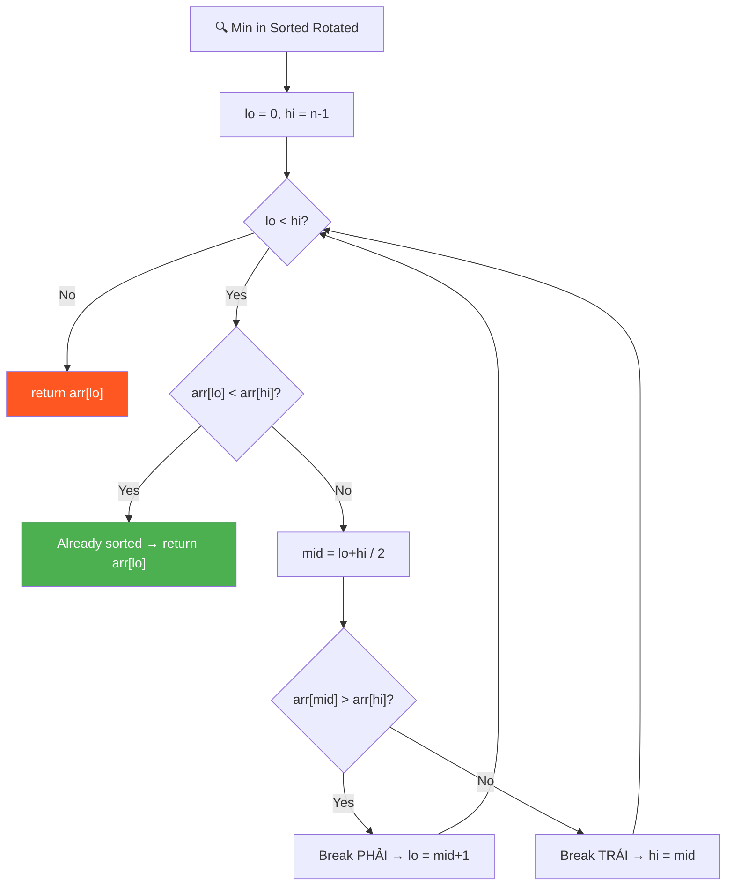
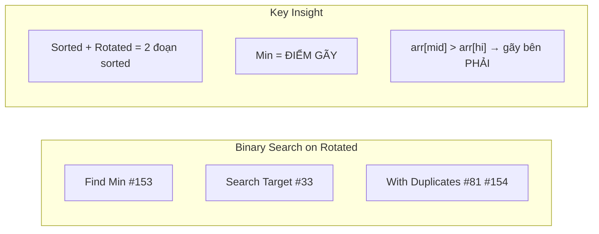
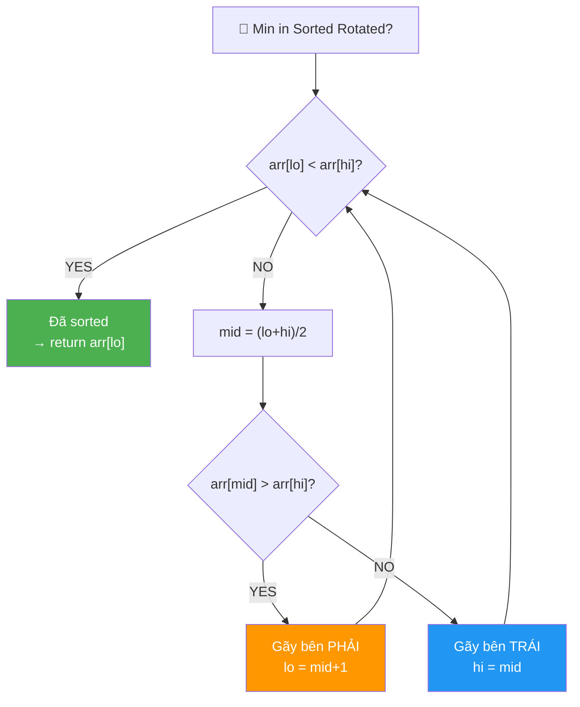
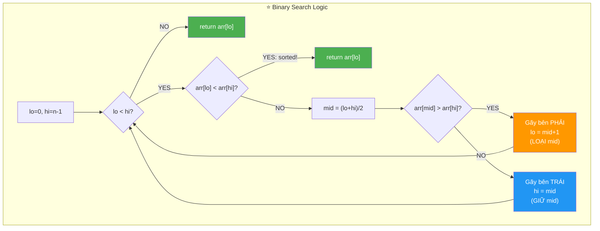
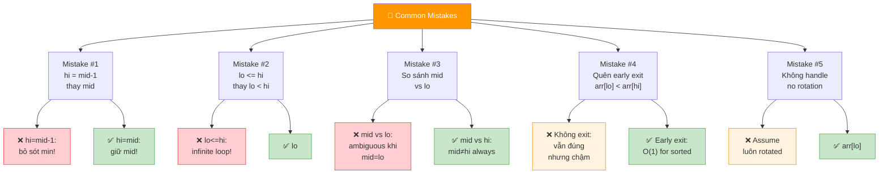
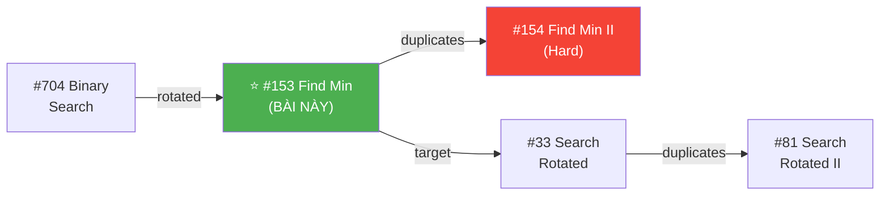
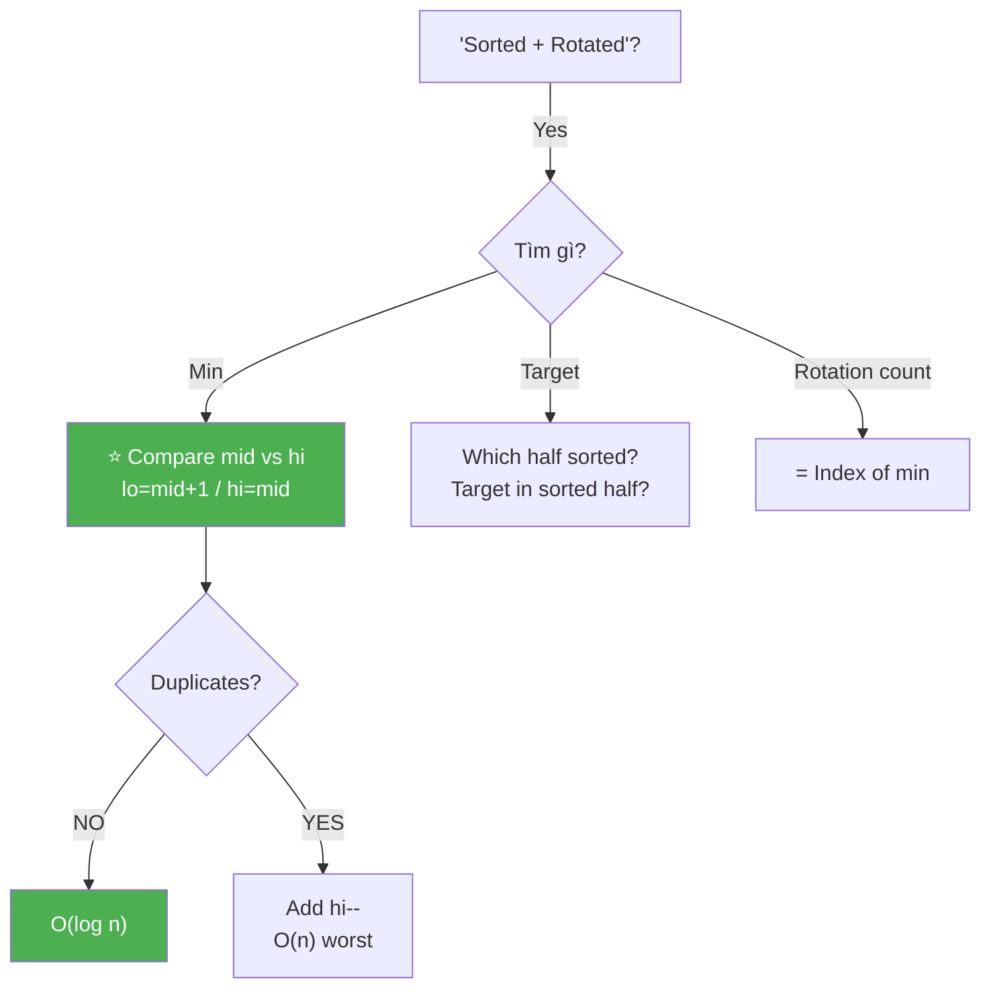
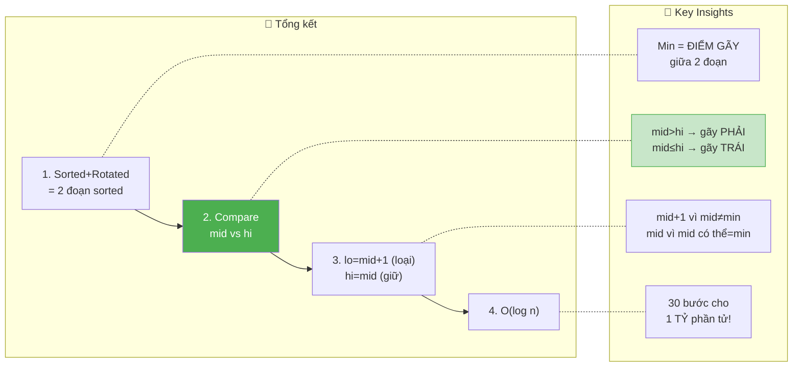

# 🔍 Minimum in a Sorted and Rotated Array — GfG (Medium)

> 📖 Code: [Min in Sorted Rotated.js](./Min%20in%20Sorted%20Rotated.js)





---

## R — Repeat & Clarify

🧠 *"Sorted + rotated = 2 đoạn sorted. Binary Search: nếu mid > high → min ở PHẢI. Ngược lại → min ở TRÁI!"*

> 🎙️ *"Find the minimum element in a sorted array that has been rotated. The minimum is at the rotation point. Use binary search for O(log n)."*

### Clarification Questions

```
Q: "Sorted and rotated" nghĩa là gì?
A: Mảng sorted TĂNG DẦN ban đầu, rồi bị XOAY k vị trí!
   [1,2,3,4,5,6] → rotate 2 → [5,6,1,2,3,4]
   → Tạo thành 2 ĐOẠN SORTED: [5,6] và [1,2,3,4]

Q: Min nằm ở đâu?
A: Tại ĐIỂM GÃY — nơi chuyển từ đoạn sorted thứ 1 sang đoạn 2!
   [5, 6, | 1, 2, 3, 4]    ← min = 1 tại điểm gãy!

Q: Nếu chưa rotate (k=0)?
A: Mảng vẫn sorted → min = arr[0]!
   [1, 2, 3, 4, 5] → min = 1

Q: Có duplicates?
A: Bài này: DISTINCT elements! (no duplicates)
   Nếu có duplicates → LeetCode #154, worst case O(n)!

Q: Return giá trị hay index?
A: GIÁ TRỊ min!

Q: n = 1?
A: Return arr[0]! (1 element = tự nó!)
```

### Tại sao bài này quan trọng?

```
  ⭐ Bài này dạy BINARY SEARCH trên SORTED ROTATED ARRAY!

  ĐÂY LÀ PATTERN CỰC KỲ PHỔ BIẾN trong phỏng vấn!

  ┌───────────────────────────────────────────────────────────────┐
  │  Binary Search KHÔNG CHỈ cho sorted array!                    │
  │                                                               │
  │  Sorted Rotated cũng dùng được vì:                           │
  │    → Vẫn có TÍNH ĐƠN ĐIỆU trong mỗi nửa!                  │
  │    → So sánh mid vs boundary → biết GÃY ở nửa nào!          │
  │                                                               │
  │  Progression:                                                  │
  │    #153 Find Min (bài này!) → #33 Search Target              │
  │    → #154 Min with Duplicates → #81 Search with Duplicates   │
  └───────────────────────────────────────────────────────────────┘
```

---

## 🧠 Bản chất bài toán — Hiểu để NHỚ, không chỉ để GIẢI

### INSIGHT CỐT LÕI: "Min = ĐIỂM GÃY!"

```
  ⭐ Ẩn dụ: "ĐƯỜNG NÚI GÃY!"

  Tưởng tượng mảng sorted rotated như đường núi:

  arr = [5, 6, 7, 8, 1, 2, 3, 4]

  BIỂU ĐỒ:
               8
         7
     6       ← đoạn sorted 1 (LỚN)
  5                     4
                     3      ← đoạn sorted 2 (NHỎ)
                  2
               1  ← ĐIỂM GÃY = MIN!

  Sorted + Rotated = 2 đoạn TĂNG DẦN:
    Đoạn 1: [5, 6, 7, 8] ← giá trị LỚN
    Đoạn 2: [1, 2, 3, 4] ← giá trị NHỎ
    ĐIỂM GÃY: 8 → 1 (đột ngột GIẢM!) = MIN!

  ⭐ NHIỆM VỤ: Tìm điểm gãy bằng Binary Search!
```

### Tại sao so sánh mid vs hi?

```
  3 TRƯỜNG HỢP khi xét arr[mid]:

  TRƯỜNG HỢP 1: arr[mid] > arr[hi]
  ┌──────────────────────────────────────┐
  │    arr[mid]                           │
  │   /                                   │
  │  /        ← đoạn 1 (LỚN)            │
  │ /                                     │
  │           GIẢM ĐỘT NGỘT              │
  │                  \                    │
  │                   \ ← đoạn 2 (NHỎ)  │
  │                    \  arr[hi]         │
  │                                       │
  │  → ĐIỂM GÃY ở bên PHẢI mid!          │
  │  → lo = mid + 1                       │
  └──────────────────────────────────────┘

  TRƯỜNG HỢP 2: arr[mid] ≤ arr[hi]
  ┌──────────────────────────────────────┐
  │                                       │
  │ ← đoạn 1 (LỚN)                      │
  │    \                                  │
  │     GIẢM ĐỘT NGỘT                    │
  │         \                             │
  │          arr[mid]                     │
  │            \                          │
  │             \ ← đoạn 2 (NHỎ)        │
  │              \  arr[hi]              │
  │                                       │
  │  → ĐIỂM GÃY ở bên TRÁI (hoặc = mid)!│
  │  → hi = mid (giữ mid!)              │
  └──────────────────────────────────────┘

  TRƯỜNG HỢP 3: arr[lo] < arr[hi]
  ┌──────────────────────────────────────┐
  │                                       │
  │  arr[lo]                    arr[hi]  │
  │    /                       /          │
  │   / ← ĐÃ SORTED hoàn toàn!/         │
  │  /                        /           │
  │ /                        /            │
  │                                       │
  │  → KHÔNG CÓ GÃY → min = arr[lo]!    │
  │  → return arr[lo] (early exit!)       │
  └──────────────────────────────────────┘
```

### Tại sao lo = mid + 1, nhưng hi = mid?

```
  ⚠️ INSIGHT QUAN TRỌNG NHẤT — nhiều người hiểu sai!

  Khi arr[mid] > arr[hi]:
    → mid CHẮC CHẮN KHÔNG phải min! (vì mid > hi → mid lớn hơn!)
    → Min CHẮC CHẮN nằm SAU mid!
    → lo = mid + 1 (LOẠI mid!)

  Khi arr[mid] ≤ arr[hi]:
    → mid CÓ THỂ là min! (mid ≤ hi → mid có thể nhỏ nhất!)
    → Không thể loại mid!
    → hi = mid (GIỮ mid!)

  📌 KHÁC BIỆT:
    lo = mid + 1 ← LOẠI mid (mid chắc chắn không phải min)
    hi = mid     ← GIỮ mid (mid có thể là min!)

  ⚠️ Nếu dùng hi = mid - 1 → BỎ SÓT min!
     VD: [3, 1, 2], mid=1, arr[1]=1 ≤ arr[2]=2
     hi = mid-1 = 0 → BỎ SÓT arr[1] = 1 = MIN!
```

---

## 🧭 Luồng Suy Nghĩ — Từ đọc đề đến solution

### Bước 1: Đọc đề → Keywords

```
  Đề: "Find minimum in a sorted and rotated array"

  Gạch chân:
    ✏️ "sorted"    → có thứ tự → Binary Search possible!
    ✏️ "rotated"    → 2 đoạn sorted → điểm gãy!
    ✏️ "minimum"    → tìm nhỏ nhất = tìm điểm gãy!
    ✏️ "distinct"   → no duplicates → O(log n) guaranteed!

  🧠 Trigger:
    "Sorted + rotated" → Binary Search trên rotated array!
    "Find min" → tìm điểm gãy!
    → Compare mid vs hi → biết gãy ở nửa nào!
```

### Bước 2: Approaches

```
  🧠 Approach 1: Linear O(n)
    Duyệt hết → tìm min → O(n)

  🧠 Approach 2: Binary Search O(log n) ⭐
    So sánh arr[mid] vs arr[hi]
    → mid > hi → gãy ở PHẢI → lo = mid+1
    → mid ≤ hi → gãy ở TRÁI → hi = mid
    → Early exit: arr[lo] < arr[hi] → sorted → return arr[lo]
```

### Bước 3: Cây quyết định



---

## E — Examples

```
VÍ DỤ 1: arr = [5, 6, 1, 2, 3, 4]

  Sorted gốc: [1, 2, 3, 4, 5, 6]
  Rotated:     [5, 6, | 1, 2, 3, 4]
                       ↑ MIN = rotation point!

  Binary Search:
    lo=0, hi=5: arr[0]=5 > arr[5]=4 → NOT sorted
      mid=2: arr[2]=1 ≤ arr[5]=4 → hi=2

    lo=0, hi=2: arr[0]=5 > arr[2]=1 → NOT sorted
      mid=1: arr[1]=6 > arr[2]=1 → lo=2

    lo=2, hi=2: STOP! return arr[2] = 1 ✅
```

```
VÍ DỤ 2: arr = [3, 4, 5, 1, 2]

  [3, 4, 5, | 1, 2]    gãy tại index 3

  lo=0, hi=4: arr[0]=3 > arr[4]=2
    mid=2: arr[2]=5 > arr[4]=2 → lo=3

  lo=3, hi=4: arr[3]=1 < arr[4]=2 → SORTED! return arr[3] = 1 ✅
```

```
VÍ DỤ 3 (Edge): arr = [1, 2, 3, 4, 5]    (không rotate!)

  arr[lo]=1 < arr[hi]=5 → ĐÃ SORTED!
  → return arr[0] = 1 ✅ (early exit!)
```

```
VÍ DỤ 4 (Edge): arr = [2, 1]

  lo=0, hi=1: arr[0]=2 > arr[1]=1
    mid=0: arr[0]=2 > arr[1]=1 → lo=1

  lo=1, hi=1: return arr[1] = 1 ✅
```

```
VÍ DỤ 5 (Edge): arr = [5]

  lo=0, hi=0: lo ≥ hi → return arr[0] = 5 ✅
```

### Trace dạng bảng — VD chi tiết

```
  arr = [5, 6, 7, 8, 1, 2, 3, 4]    n=8

  ┌──────┬────┬────┬─────┬─────────────────┬─────────────────────┐
  │ Step │ lo │ hi │ mid │ Comparison       │ Action              │
  ├──────┼────┼────┼─────┼─────────────────┼─────────────────────┤
  │ 1    │ 0  │ 7  │ 3   │ a[0]=5>a[7]=4   │ NOT sorted          │
  │      │    │    │     │ a[3]=8>a[7]=4   │ lo = 4              │
  │ 2    │ 4  │ 7  │ 5   │ a[4]=1<a[7]=4   │ SORTED! return a[4] │
  └──────┴────┴────┴─────┴─────────────────┴─────────────────────┘

  → return arr[4] = 1 ✅  (chỉ 2 steps!)
```

### Minh họa trực quan

```
  arr = [5, 6, 7, 8, 1, 2, 3, 4]

  ┌───┬───┬───┬───┬───┬───┬───┬───┐
  │ 5 │ 6 │ 7 │ 8 │ 1 │ 2 │ 3 │ 4 │
  └───┴───┴───┴───┴───┴───┴───┴───┘
    0   1   2   3   4   5   6   7

  Step 1: lo=0, hi=7, mid=3
  ┌───┬───┬───┬───┬───┬───┬───┬───┐
  │ 5 │ 6 │ 7 │ 8 │ 1 │ 2 │ 3 │ 4 │
  └───┴───┴───┴───┴───┴───┴───┴───┘
    ↑              ↑                ↑
   lo            mid              hi
   a[mid]=8 > a[hi]=4 → gãy bên PHẢI → lo=4

  Step 2: lo=4, hi=7
  ┌───┬───┬───┬───┐
  │ 1 │ 2 │ 3 │ 4 │
  └───┴───┴───┴───┘
    ↑               ↑
   lo              hi
   a[lo]=1 < a[hi]=4 → SORTED! → return 1 ✅
```

---

## A — Approach

### Approach 1: Linear Scan — O(n)

```
  Duyệt mảng → tìm min → O(n)
  Hoặc: tìm điểm arr[i] < arr[i-1] → O(n)
  → Dễ nhưng CHẬM khi n lớn!
```

### Approach 2: Binary Search — O(log n) ⭐

```
  Step 1: lo=0, hi=n-1
  Step 2: While lo < hi:
    - arr[lo] < arr[hi] → sorted → return arr[lo]
    - mid = (lo+hi)/2
    - arr[mid] > arr[hi] → gãy ở PHẢI → lo = mid+1
    - arr[mid] ≤ arr[hi] → gãy ở TRÁI → hi = mid
  Step 3: return arr[lo]

  Time: O(log n)    Space: O(1)
```

---

## C — Code ✅

### Solution 1: Linear — O(n)

```javascript
function findMinLinear(arr) {
  let min = arr[0];
  for (let i = 1; i < arr.length; i++) {
    if (arr[i] < min) min = arr[i];
  }
  return min;
}
```

### Solution 2: Binary Search — O(log n) ⭐

```javascript
function findMin(arr) {
  let lo = 0, hi = arr.length - 1;

  while (lo < hi) {
    // Already sorted range
    if (arr[lo] < arr[hi]) return arr[lo];

    const mid = Math.floor((lo + hi) / 2);

    if (arr[mid] > arr[hi]) {
      lo = mid + 1;    // Min ở bên PHẢI
    } else {
      hi = mid;         // Min ở bên TRÁI (hoặc = mid)
    }
  }
  return arr[lo];
}
```

---

## 🔬 Deep Dive — Giải thích CHI TIẾT từng dòng

> 💡 Phân tích **từng dòng** để hiểu **TẠI SAO**.

```javascript
function findMin(arr) {
  let lo = 0, hi = arr.length - 1;

  // ═══════════════════════════════════════════════════════════
  // while lo < hi (KHÔNG PHẢI lo <= hi!)
  // ═══════════════════════════════════════════════════════════
  //
  // TẠI SAO lo < hi, không phải lo <= hi?
  //   → Khi lo === hi → CHỈ CÒN 1 phần tử → CHÍNH LÀ MIN!
  //   → Không cần check thêm → return arr[lo]!
  //
  //   Nếu dùng lo <= hi:
  //     → lo === hi → vào loop → mid = lo → hi = mid = lo
  //     → Infinite loop! (lo và hi không thay đổi!)
  //
  while (lo < hi) {

    // ═══════════════════════════════════════════════════════
    // EARLY EXIT: Đoạn [lo..hi] đã sorted!
    // ═══════════════════════════════════════════════════════
    //
    // arr[lo] < arr[hi]:
    //   → Đoạn [lo..hi] = TĂNG DẦN hoàn toàn!
    //   → KHÔNG CÓ điểm gãy!
    //   → Min = arr[lo] (nhỏ nhất!)
    //
    // ⚠️ Optimization! Không bắt buộc nhưng NHANH hơn!
    //    Bỏ dòng này → vẫn đúng, nhưng thêm iterations!
    //
    if (arr[lo] < arr[hi]) return arr[lo];

    const mid = Math.floor((lo + hi) / 2);

    // ═══════════════════════════════════════════════════════
    // DECISION: Gãy ở nửa nào?
    // ═══════════════════════════════════════════════════════
    //
    // arr[mid] > arr[hi]:
    //   → mid nằm trong đoạn sorted 1 (phần LỚN!)
    //   → Điểm gãy nằm SAU mid → lo = mid + 1
    //   → mid + 1 vì mid CHẮC CHẮN KHÔNG phải min!
    //     (mid > hi → mid lớn hơn 1 phần tử khác → không min!)
    //
    // arr[mid] ≤ arr[hi]:
    //   → mid nằm trong đoạn sorted 2 (phần NHỎ!)
    //   → Điểm gãy ở TRƯỚC hoặc TẠI mid → hi = mid
    //   → hi = mid (GIỮ mid!) vì mid CÓ THỂ là min!
    //   → ⚠️ KHÔNG DÙNG hi = mid - 1 → sẽ bỏ sót min!
    //
    if (arr[mid] > arr[hi]) {
      lo = mid + 1;    // LOẠI mid (chắc chắn không phải min!)
    } else {
      hi = mid;         // GIỮ mid (có thể là min!)
    }
  }

  // ═══════════════════════════════════════════════════════════
  // lo === hi → chỉ còn 1 phần tử = MIN!
  // ═══════════════════════════════════════════════════════════
  return arr[lo];
}
```



---

## 📐 Invariant — Chứng minh tính đúng đắn

```
  📐 INVARIANT:

  "Min element LUÔN nằm trong [lo, hi]"

  CHỨNG MINH:
  ┌──────────────────────────────────────────────────────────────┐
  │  Base: lo=0, hi=n-1 → min ∈ [0, n-1] ✅                    │
  │                                                              │
  │  Case arr[lo] < arr[hi]:                                     │
  │    → [lo..hi] sorted → min = arr[lo] ✅                      │
  │                                                              │
  │  Case arr[mid] > arr[hi]:                                    │
  │    → arr[mid] > arr[hi]                                      │
  │    → mid ∈ đoạn sorted 1 (phần lớn)                         │
  │    → Mọi x ∈ [lo, mid] là phần lớn → KHÔNG PHẢI min!       │
  │    → min ∈ [mid+1, hi] → lo = mid+1 ✅                      │
  │                                                              │
  │  Case arr[mid] ≤ arr[hi]:                                    │
  │    → [mid..hi] sorted (tăng dần)                             │
  │    → min ≤ arr[mid] (vì mid có thể là min)                  │
  │    → min ∈ [lo, mid] → hi = mid ✅                           │
  │                                                              │
  │  → Mọi step: min vẫn nằm trong [lo, hi]!  ∎                 │
  └──────────────────────────────────────────────────────────────┘

  📐 TERMINATION:
    |hi - lo| giảm ít nhất 1 mỗi step:
    - lo = mid+1: lo tăng ít nhất 1
    - hi = mid: hi giảm ít nhất 1 (vì mid < hi khi lo < hi)
    → [lo, hi] shrink → lo === hi → terminate!  ∎

  📐 CORRECTNESS:
    Khi lo === hi: chỉ 1 phần tử, invariant → đó là min!
    → return arr[lo] = min!  ∎

  📐 COMPLEXITY:
    Mỗi step: [lo, hi] giảm ≈ một nửa
    → O(log n) steps!  ∎
```

### Tại sao so sánh với arr[hi], không phải arr[lo]?

```
  ⚠️ CÂU HỎI HAY! Nhiều người hỏi!

  So sánh arr[mid] vs arr[hi]:
    arr[mid] > arr[hi] → mid ở đoạn 1 → gãy ở PHẢI
    arr[mid] ≤ arr[hi] → mid ở đoạn 2 → gãy ở TRÁI/TẠI mid

  Tại sao KHÔNG so sánh arr[mid] vs arr[lo]?
    Vì arr[lo] CÓ THỂ = arr[mid] khi lo = mid!
    VD: [3, 1], lo=0, hi=1, mid=0
    arr[mid] = arr[lo] = 3 → không biết gãy ở đâu!

  So sánh với arr[hi]:
    mid ≠ hi (vì mid = floor((lo+hi)/2), lo < hi → mid < hi)
    → arr[mid] vs arr[hi] LUÔN có ý nghĩa!

  📌 LUÔN so sánh mid vs HI, không phải LO!
```

---

## ❌ Common Mistakes — Lỗi thường gặp



### Mistake 1: hi = mid - 1 thay vì hi = mid!

```javascript
// ❌ SAI: bỏ sót min!
if (arr[mid] <= arr[hi]) {
  hi = mid - 1;  // BỎ mid → nếu mid LÀ min → SAI!
}

// VD: [3, 1, 2], mid=1, arr[1]=1 ≤ arr[2]=2
// hi = mid-1 = 0 → BỎ SÓT arr[1] = 1 = MIN!

// ✅ ĐÚNG: giữ mid!
if (arr[mid] <= arr[hi]) {
  hi = mid;  // GIỮ mid → mid có thể là min! ✅
}
```

### Mistake 2: lo <= hi → infinite loop!

```javascript
// ❌ SAI: infinite loop khi lo = hi!
while (lo <= hi) {
  // lo = hi → mid = lo → hi = mid = lo → LOOP MÃI!
}

// ✅ ĐÚNG: stop khi chỉ còn 1 element!
while (lo < hi) {
  // lo = hi → EXIT → return arr[lo] ✅
}
```

### Mistake 3: So sánh mid vs lo!

```javascript
// ❌ NGUY HIỂM: mid có thể = lo!
if (arr[mid] > arr[lo]) {
  // Khi lo=0, hi=1 → mid=0 → arr[mid] = arr[lo] → AMBIGUOUS!
}

// ✅ ĐÚNG: mid vs hi (mid ≠ hi luôn khi lo < hi!)
if (arr[mid] > arr[hi]) {
  lo = mid + 1;
}
```

### Mistake 4: Không handle mảng đã sorted (k=0)!

```javascript
// ❌ KHÔNG SAI nhưng thiếu optimization:
while (lo < hi) {
  const mid = Math.floor((lo + hi) / 2);
  if (arr[mid] > arr[hi]) lo = mid + 1;
  else hi = mid;
}
// Mảng [1,2,3,4,5]: vẫn cần O(log n) steps!

// ✅ THÊM early exit:
while (lo < hi) {
  if (arr[lo] < arr[hi]) return arr[lo]; // Sorted! O(1)!
  // ...
}
// Mảng [1,2,3,4,5]: return arr[0] NGAY! ✅
```

### Mistake 5: Quên case duplicates!

```
  ⚠️ Bài này: DISTINCT elements → O(log n) guaranteed!

  Nếu có duplicates: [2, 2, 2, 0, 1, 2]
    arr[mid] = arr[hi] = 2 → KHÔNG BIẾT gãy ở đâu!
    → Phải hi-- (shrink 1) → worst case O(n)!

  → Đó là LeetCode #154 (Hard!)
```

---

## O — Optimize

```
                   Time          Space     Ghi chú
  ──────────────────────────────────────────────────
  Linear           O(n)          O(1)      Math.min
  Binary Search ⭐  O(log n)      O(1)      Tối ưu!
  With Dupes       O(n) worst    O(1)      #154

  ⚠️ Tại sao O(log n)?
    Mỗi step: loại bỏ ≈ 1/2 mảng
    n → n/2 → n/4 → ... → 1
    = log₂(n) steps!
```

### Complexity chính xác — Đếm operations

```
  Binary Search:
    Mỗi step: 1-2 comparisons + 1 midpoint computation
    Max steps: ⌈log₂(n)⌉
    TỔNG: ≤ 3 × log₂(n) operations

  📊 So sánh:
    n = 10⁶: Binary = 20 ops ⭐ vs Linear = 10⁶ ops
    n = 10⁹: Binary = 30 ops ⭐ vs Linear = 10⁹ ops

  📌 log₂(10⁹) ≈ 30 — CHỈ 30 bước cho 1 TỶ phần tử!
```

---

## T — Test

```
Test Cases:
  [5, 6, 1, 2, 3, 4]         → 1  ✅ rotated 2
  [3, 4, 5, 1, 2]            → 1  ✅ rotated 3
  [3, 1, 2]                  → 1  ✅ rotated 1
  [2, 1]                     → 1  ✅ rotated 1
  [1, 2, 3, 4, 5]            → 1  ✅ not rotated (k=0)
  [5]                        → 5  ✅ single element
  [4, 5, 6, 7, 0, 1, 2]     → 0  ✅ rotated 4
  [11, 13, 15, 17]           → 11 ✅ not rotated
  [2, 3, 4, 5, 6, 7, 8, 1]  → 1  ✅ rotated at end
```

---

## 🗣️ Interview Script

### 🎙️ Think Out Loud — Mô phỏng phỏng vấn thực

```
  ──────────────── PHASE 1: Clarify ────────────────

  👤 Interviewer: "Find the minimum in a sorted, rotated
                   array with distinct elements."

  🧑 You: "So the array was originally sorted in ascending
   order, then rotated some number of positions. The min
   is at the rotation point — the 'break' where values
   suddenly decrease. No duplicates. Correct?"

  ──────────────── PHASE 2: Examples ────────────────

  🧑 You: "[5, 6, 7, 8, 1, 2, 3, 4]. Two sorted halves:
   [5,6,7,8] and [1,2,3,4]. The break is between 8 and 1.
   Min = 1 at index 4."

  ──────────────── PHASE 3: Approach ────────────────

  🧑 You: "I'll use binary search. The key insight: if
   arr[mid] > arr[hi], the break point is to the right
   of mid, so lo = mid + 1. Otherwise, the break is at
   or to the left of mid, so hi = mid.

   Important: I use hi = mid, NOT mid-1, because mid
   itself could be the minimum.

   I also add an early exit: if arr[lo] < arr[hi], the
   subarray is already sorted, so min = arr[lo].

   O(log n) time, O(1) space."

  ──────────────── PHASE 4: Code + Verify ────────────────

  🧑 You: [writes code, traces example]

  "[5,6,1,2,3,4]: lo=0,hi=5,mid=2. arr[2]=1 ≤ arr[5]=4
   → hi=2. lo=0,hi=2,mid=1. arr[1]=6 > arr[2]=1 → lo=2.
   lo=hi=2 → return arr[2] = 1 ✅."

  ──────────────── PHASE 5: Follow-ups ────────────────

  👤 "What if there are duplicates?"
  🧑 "When arr[mid] = arr[hi], I can't tell which side
      the break is on. I'd do hi-- to shrink by one.
      Worst case becomes O(n) — that's LeetCode #154."

  👤 "How would you find a specific target?"
  🧑 "That's LeetCode #33. I first determine which half
      is sorted, then check if the target falls in the
      sorted half. Same O(log n) principle."

  👤 "Can you also return the rotation count?"
  🧑 "The rotation count equals the index of the minimum
      element! So I'd return the index instead of the value."
```

---

## 📚 Bài tập liên quan — Practice Problems

### Progression Path



### 1. Find Minimum in Rotated II (#154) — Hard (with duplicates)

```
  Đề: Cùng bài nhưng CÓ DUPLICATES!

  function findMinDup(nums) {
    let lo = 0, hi = nums.length - 1;
    while (lo < hi) {
      const mid = Math.floor((lo + hi) / 2);
      if (nums[mid] > nums[hi]) {
        lo = mid + 1;
      } else if (nums[mid] < nums[hi]) {
        hi = mid;
      } else {
        // nums[mid] === nums[hi] → AMBIGUOUS!
        hi--;  // shrink by 1 → worst case O(n)!
      }
    }
    return nums[lo];
  }

  📌 Thêm case nums[mid] === nums[hi] → hi--!
     Worst case: [2,2,2,0,2,2] → O(n)!
```

### 2. Search in Rotated Sorted Array (#33) — Medium

```
  Đề: Tìm TARGET trong sorted rotated array.

  function search(nums, target) {
    let lo = 0, hi = nums.length - 1;
    while (lo <= hi) {
      const mid = Math.floor((lo + hi) / 2);
      if (nums[mid] === target) return mid;

      // Nửa TRÁI sorted?
      if (nums[lo] <= nums[mid]) {
        if (target >= nums[lo] && target < nums[mid]) {
          hi = mid - 1;  // target ở nửa TRÁI sorted!
        } else {
          lo = mid + 1;
        }
      }
      // Nửa PHẢI sorted!
      else {
        if (target > nums[mid] && target <= nums[hi]) {
          lo = mid + 1;  // target ở nửa PHẢI sorted!
        } else {
          hi = mid - 1;
        }
      }
    }
    return -1;
  }

  📌 Xác định nửa nào SORTED → check target trong đó!
```

### 3. Find Rotation Count — GfG

```
  Đề: Tìm số lần mảng đã bị rotate.

  function findRotationCount(arr) {
    let lo = 0, hi = arr.length - 1;
    while (lo < hi) {
      if (arr[lo] < arr[hi]) return lo;  // sorted!
      const mid = Math.floor((lo + hi) / 2);
      if (arr[mid] > arr[hi]) lo = mid + 1;
      else hi = mid;
    }
    return lo;  // INDEX of min = rotation count!
  }

  📌 GIỐNG BÀI NÀY! Chỉ return INDEX thay vì VALUE!
```

### Tổng kết — Binary Search on Rotated Family

```
  ┌──────────────────────────────────────────────────────────────┐
  │  BÀI                     │  Technique       │  Time         │
  ├──────────────────────────────────────────────────────────────┤
  │  #153 Find Min ⭐         │  mid vs hi       │  O(log n)     │
  │  #154 Find Min (dupes)   │  mid vs hi + hi--│  O(n) worst   │
  │  #33 Search Target       │  sorted half     │  O(log n)     │
  │  #81 Search (dupes)      │  sorted half+hi--│  O(n) worst   │
  │  Rotation Count          │  = index of min  │  O(log n)     │
  └──────────────────────────────────────────────────────────────┘

  📌 RULE:
    Sorted Rotated → Binary Search!
    Compare mid vs HI (not LO!)
    lo = mid+1 (LOẠI mid), hi = mid (GIỮ mid)!
    Duplicates → hi-- (worst O(n))!
```

### Skeleton code — Reusable template

```javascript
// TEMPLATE: Binary Search on Sorted Rotated Array
function binarySearchRotated(arr, mode = 'findMin') {
  let lo = 0, hi = arr.length - 1;

  while (lo < hi) {
    // Early exit: already sorted
    if (arr[lo] < arr[hi]) {
      return mode === 'findMin' ? arr[lo] : lo;
    }

    const mid = Math.floor((lo + hi) / 2);

    if (arr[mid] > arr[hi]) {
      lo = mid + 1;   // break ở PHẢI, LOẠI mid
    } else if (arr[mid] < arr[hi]) {
      hi = mid;        // break ở TRÁI, GIỮ mid
    } else {
      hi--;            // duplicates: shrink by 1
    }
  }

  return mode === 'findMin' ? arr[lo] : lo;
}

// findMin: return VALUE (bài này!)
// findIdx: return INDEX (rotation count!)
```

---

## 📌 Kỹ năng chuyển giao — Pattern Summary



---

## 📊 Tổng kết — Key Insights



```
  ┌──────────────────────────────────────────────────────────────────────────┐
  │  📌 3 ĐIỀU PHẢI NHỚ                                                    │
  │                                                                          │
  │  1. SO SÁNH mid vs HI (không phải LO!):                                │
  │     → arr[mid] > arr[hi] → gãy ở PHẢI → lo = mid + 1                  │
  │     → arr[mid] ≤ arr[hi] → gãy ở TRÁI → hi = mid                     │
  │     → ⚠️ So với LO có thể mid = lo → ambiguous!                       │
  │                                                                          │
  │  2. lo = mid+1 vs hi = mid:                                             │
  │     → lo = mid + 1: LOẠI mid (mid > hi → chắc chắn không min!)        │
  │     → hi = mid: GIỮ mid (mid ≤ hi → mid CÓ THỂ là min!)              │
  │     → ⚠️ hi = mid-1 → BỎ SÓT min! ([3,1,2] sẽ sai!)                 │
  │                                                                          │
  │  3. WHILE lo < hi (không phải lo <= hi):                                │
  │     → lo = hi → chỉ 1 phần tử → CHÍNH LÀ MIN → return!              │
  │     → lo <= hi → infinite loop! (mid = lo, hi = mid = lo)             │
  │     → Early exit: arr[lo] < arr[hi] → sorted → return arr[lo]!        │
  └──────────────────────────────────────────────────────────────────────────┘
```

---

## 📝 Flashcard — Tự kiểm tra

| ❓ Câu hỏi | ✅ Đáp án |
|---|---|
| Sorted + rotated = gì? | **2 đoạn sorted**, min ở điểm gãy |
| So sánh mid với gì? | **arr[hi]** (KHÔNG PHẢI arr[lo]!) |
| arr[mid] > arr[hi] → action? | **lo = mid+1** (gãy ở PHẢI, LOẠI mid) |
| arr[mid] ≤ arr[hi] → action? | **hi = mid** (gãy ở TRÁI, GIỮ mid!) |
| Tại sao hi=mid, không mid-1? | mid **CÓ THỂ** là min! Bỏ → sai! |
| Tại sao lo < hi, không <=? | lo=hi → **1 element** → return! <= → **infinite loop** |
| Early exit? | **arr[lo] < arr[hi]** → sorted → return arr[lo] |
| Time / Space? | **O(log n)** / **O(1)** |
| Có duplicates? | **hi--** → worst case **O(n)** (#154) |
| Rotation count = ? | **Index** của min element! |
| LeetCode equivalent? | **#153** Find Minimum in Rotated Sorted Array |
| Search target (# nào)? | **#33** Search in Rotated Sorted Array |
