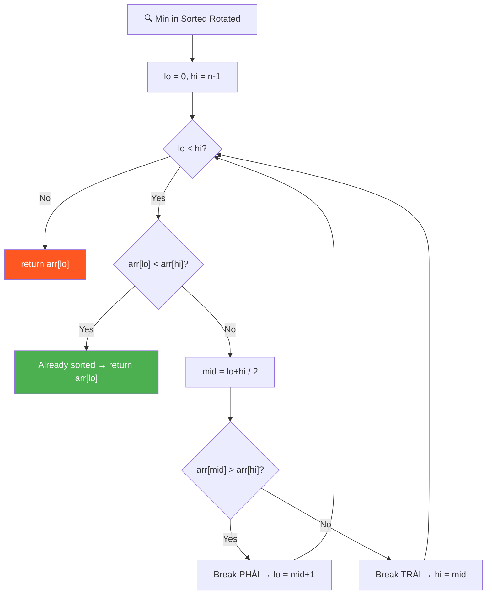
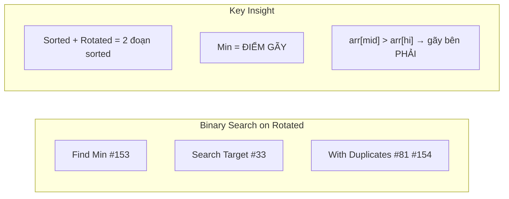
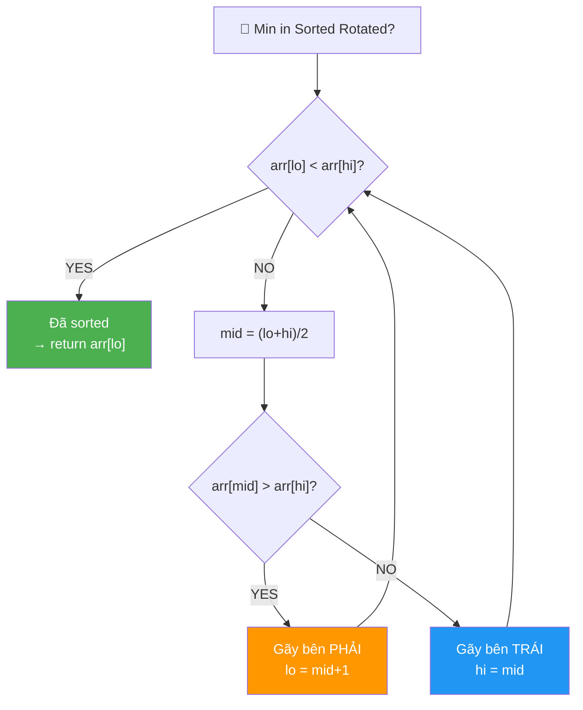
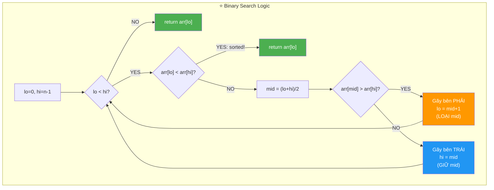
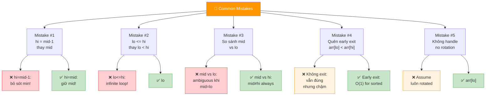
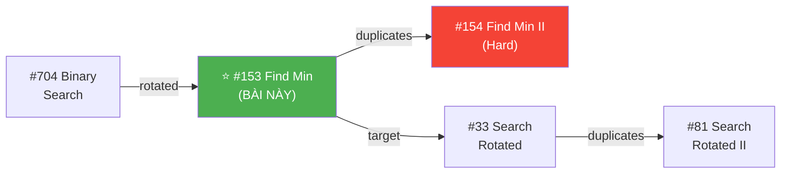
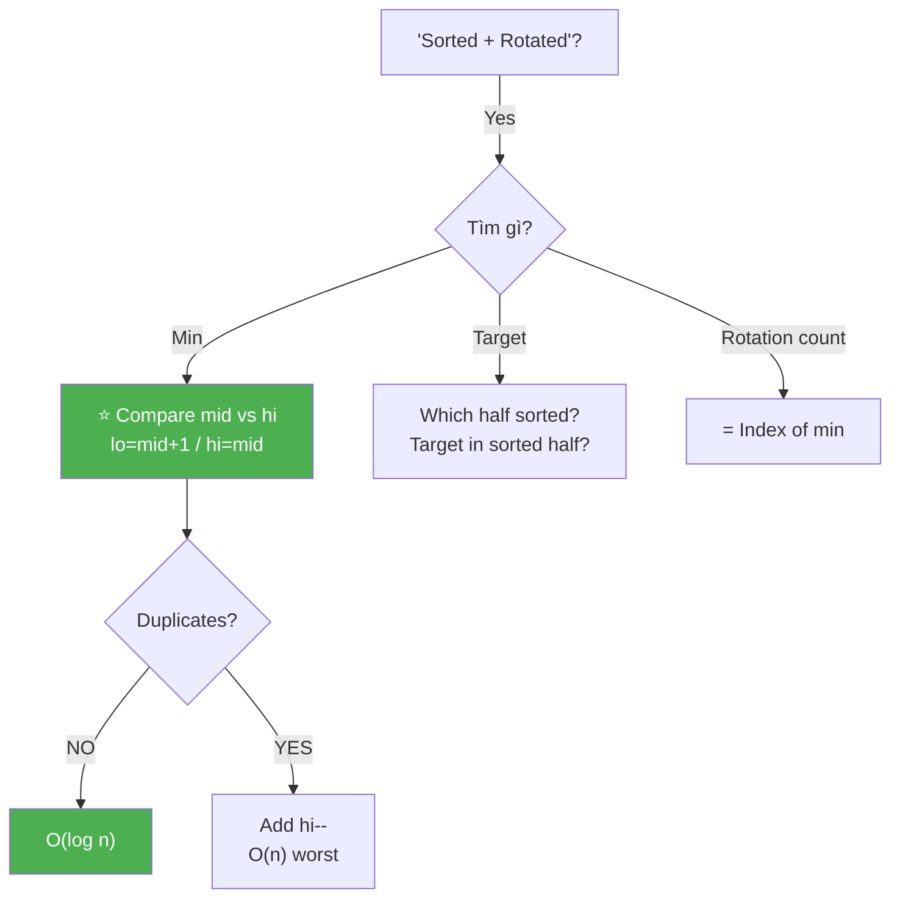
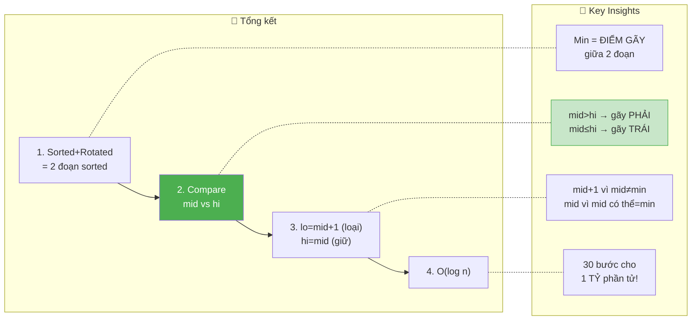

# 🔍 Minimum in a Sorted and Rotated Array — GfG (Medium)

> 📖 Code: [Min in Sorted Rotated.js](./Min%20in%20Sorted%20Rotated.js)





---

## R — Repeat & Clarify

🧠 *"Sorted + rotated = 2 đoạn sorted. Binary Search: nếu mid > high → min ở PHẢI. Ngược lại → min ở TRÁI!"*

> 🎙️ *"Find the minimum element in a sorted array that has been rotated. The minimum is at the rotation point. Use binary search for O(log n)."*

### Clarification Questions

```
Q: "Sorted and rotated" nghĩa là gì?
A: Mảng sorted TĂNG DẦN ban đầu, rồi bị XOAY k vị trí!
   [1,2,3,4,5,6] → rotate 2 → [5,6,1,2,3,4]
   → Tạo thành 2 ĐOẠN SORTED: [5,6] và [1,2,3,4]

Q: Min nằm ở đâu?
A: Tại ĐIỂM GÃY — nơi chuyển từ đoạn sorted thứ 1 sang đoạn 2!
   [5, 6, | 1, 2, 3, 4]    ← min = 1 tại điểm gãy!

Q: Nếu chưa rotate (k=0)?
A: Mảng vẫn sorted → min = arr[0]!
   [1, 2, 3, 4, 5] → min = 1

Q: Có duplicates?
A: Bài này: DISTINCT elements! (no duplicates)
   Nếu có duplicates → LeetCode #154, worst case O(n)!

Q: Return giá trị hay index?
A: GIÁ TRỊ min!

Q: n = 1?
A: Return arr[0]! (1 element = tự nó!)
```

### Tại sao bài này quan trọng?

```
  ⭐ Bài này dạy BINARY SEARCH trên SORTED ROTATED ARRAY!

  ĐÂY LÀ PATTERN CỰC KỲ PHỔ BIẾN trong phỏng vấn!

  ┌───────────────────────────────────────────────────────────────┐
  │  Binary Search KHÔNG CHỈ cho sorted array!                    │
  │                                                               │
  │  Sorted Rotated cũng dùng được vì:                           │
  │    → Vẫn có TÍNH ĐƠN ĐIỆU trong mỗi nửa!                  │
  │    → So sánh mid vs boundary → biết GÃY ở nửa nào!          │
  │                                                               │
  │  Progression:                                                  │
  │    #153 Find Min (bài này!) → #33 Search Target              │
  │    → #154 Min with Duplicates → #81 Search with Duplicates   │
  └───────────────────────────────────────────────────────────────┘
```

---

## 🧠 Bản chất bài toán — Hiểu để NHỚ, không chỉ để GIẢI

### INSIGHT CỐT LÕI: "Min = ĐIỂM GÃY!"

```
  ⭐ Ẩn dụ: "ĐƯỜNG NÚI GÃY!"

  Tưởng tượng mảng sorted rotated như đường núi:

  arr = [5, 6, 7, 8, 1, 2, 3, 4]

  BIỂU ĐỒ:
               8
         7
     6       ← đoạn sorted 1 (LỚN)
  5                     4
                     3      ← đoạn sorted 2 (NHỎ)
                  2
               1  ← ĐIỂM GÃY = MIN!

  Sorted + Rotated = 2 đoạn TĂNG DẦN:
    Đoạn 1: [5, 6, 7, 8] ← giá trị LỚN
    Đoạn 2: [1, 2, 3, 4] ← giá trị NHỎ
    ĐIỂM GÃY: 8 → 1 (đột ngột GIẢM!) = MIN!

  ⭐ NHIỆM VỤ: Tìm điểm gãy bằng Binary Search!
```

### Tại sao so sánh mid vs hi?

```
  3 TRƯỜNG HỢP khi xét arr[mid]:

  TRƯỜNG HỢP 1: arr[mid] > arr[hi]
  ┌──────────────────────────────────────┐
  │    arr[mid]                           │
  │   /                                   │
  │  /        ← đoạn 1 (LỚN)            │
  │ /                                     │
  │           GIẢM ĐỘT NGỘT              │
  │                  \                    │
  │                   \ ← đoạn 2 (NHỎ)  │
  │                    \  arr[hi]         │
  │                                       │
  │  → ĐIỂM GÃY ở bên PHẢI mid!          │
  │  → lo = mid + 1                       │
  └──────────────────────────────────────┘

  TRƯỜNG HỢP 2: arr[mid] ≤ arr[hi]
  ┌──────────────────────────────────────┐
  │                                       │
  │ ← đoạn 1 (LỚN)                      │
  │    \                                  │
  │     GIẢM ĐỘT NGỘT                    │
  │         \                             │
  │          arr[mid]                     │
  │            \                          │
  │             \ ← đoạn 2 (NHỎ)        │
  │              \  arr[hi]              │
  │                                       │
  │  → ĐIỂM GÃY ở bên TRÁI (hoặc = mid)!│
  │  → hi = mid (giữ mid!)              │
  └──────────────────────────────────────┘

  TRƯỜNG HỢP 3: arr[lo] < arr[hi]
  ┌──────────────────────────────────────┐
  │                                       │
  │  arr[lo]                    arr[hi]  │
  │    /                       /          │
  │   / ← ĐÃ SORTED hoàn toàn!/         │
  │  /                        /           │
  │ /                        /            │
  │                                       │
  │  → KHÔNG CÓ GÃY → min = arr[lo]!    │
  │  → return arr[lo] (early exit!)       │
  └──────────────────────────────────────┘
```

### Tại sao lo = mid + 1, nhưng hi = mid?

```
  ⚠️ INSIGHT QUAN TRỌNG NHẤT — nhiều người hiểu sai!

  Khi arr[mid] > arr[hi]:
    → mid CHẮC CHẮN KHÔNG phải min! (vì mid > hi → mid lớn hơn!)
    → Min CHẮC CHẮN nằm SAU mid!
    → lo = mid + 1 (LOẠI mid!)

  Khi arr[mid] ≤ arr[hi]:
    → mid CÓ THỂ là min! (mid ≤ hi → mid có thể nhỏ nhất!)
    → Không thể loại mid!
    → hi = mid (GIỮ mid!)

  📌 KHÁC BIỆT:
    lo = mid + 1 ← LOẠI mid (mid chắc chắn không phải min)
    hi = mid     ← GIỮ mid (mid có thể là min!)

  ⚠️ Nếu dùng hi = mid - 1 → BỎ SÓT min!
     VD: [3, 1, 2], mid=1, arr[1]=1 ≤ arr[2]=2
     hi = mid-1 = 0 → BỎ SÓT arr[1] = 1 = MIN!
```

---

## 🧭 Luồng Suy Nghĩ — Từ đọc đề đến solution

### Bước 1: Đọc đề → Keywords

```
  Đề: "Find minimum in a sorted and rotated array"

  Gạch chân:
    ✏️ "sorted"    → có thứ tự → Binary Search possible!
    ✏️ "rotated"    → 2 đoạn sorted → điểm gãy!
    ✏️ "minimum"    → tìm nhỏ nhất = tìm điểm gãy!
    ✏️ "distinct"   → no duplicates → O(log n) guaranteed!

  🧠 Trigger:
    "Sorted + rotated" → Binary Search trên rotated array!
    "Find min" → tìm điểm gãy!
    → Compare mid vs hi → biết gãy ở nửa nào!
```

### Bước 2: Approaches

```
  🧠 Approach 1: Linear O(n)
    Duyệt hết → tìm min → O(n)

  🧠 Approach 2: Binary Search O(log n) ⭐
    So sánh arr[mid] vs arr[hi]
    → mid > hi → gãy ở PHẢI → lo = mid+1
    → mid ≤ hi → gãy ở TRÁI → hi = mid
    → Early exit: arr[lo] < arr[hi] → sorted → return arr[lo]
```

### Bước 3: Cây quyết định



---

## E — Examples

```
VÍ DỤ 1: arr = [5, 6, 1, 2, 3, 4]

  Sorted gốc: [1, 2, 3, 4, 5, 6]
  Rotated:     [5, 6, | 1, 2, 3, 4]
                       ↑ MIN = rotation point!

  Binary Search:
    lo=0, hi=5: arr[0]=5 > arr[5]=4 → NOT sorted
      mid=2: arr[2]=1 ≤ arr[5]=4 → hi=2

    lo=0, hi=2: arr[0]=5 > arr[2]=1 → NOT sorted
      mid=1: arr[1]=6 > arr[2]=1 → lo=2

    lo=2, hi=2: STOP! return arr[2] = 1 ✅
```

```
VÍ DỤ 2: arr = [3, 4, 5, 1, 2]

  [3, 4, 5, | 1, 2]    gãy tại index 3

  lo=0, hi=4: arr[0]=3 > arr[4]=2
    mid=2: arr[2]=5 > arr[4]=2 → lo=3

  lo=3, hi=4: arr[3]=1 < arr[4]=2 → SORTED! return arr[3] = 1 ✅
```

```
VÍ DỤ 3 (Edge): arr = [1, 2, 3, 4, 5]    (không rotate!)

  arr[lo]=1 < arr[hi]=5 → ĐÃ SORTED!
  → return arr[0] = 1 ✅ (early exit!)
```

```
VÍ DỤ 4 (Edge): arr = [2, 1]

  lo=0, hi=1: arr[0]=2 > arr[1]=1
    mid=0: arr[0]=2 > arr[1]=1 → lo=1

  lo=1, hi=1: return arr[1] = 1 ✅
```

```
VÍ DỤ 5 (Edge): arr = [5]

  lo=0, hi=0: lo ≥ hi → return arr[0] = 5 ✅
```

### Trace dạng bảng — VD chi tiết

```
  arr = [5, 6, 7, 8, 1, 2, 3, 4]    n=8

  ┌──────┬────┬────┬─────┬─────────────────┬─────────────────────┐
  │ Step │ lo │ hi │ mid │ Comparison       │ Action              │
  ├──────┼────┼────┼─────┼─────────────────┼─────────────────────┤
  │ 1    │ 0  │ 7  │ 3   │ a[0]=5>a[7]=4   │ NOT sorted          │
  │      │    │    │     │ a[3]=8>a[7]=4   │ lo = 4              │
  │ 2    │ 4  │ 7  │ 5   │ a[4]=1<a[7]=4   │ SORTED! return a[4] │
  └──────┴────┴────┴─────┴─────────────────┴─────────────────────┘

  → return arr[4] = 1 ✅  (chỉ 2 steps!)
```

### Minh họa trực quan

```
  arr = [5, 6, 7, 8, 1, 2, 3, 4]

  ┌───┬───┬───┬───┬───┬───┬───┬───┐
  │ 5 │ 6 │ 7 │ 8 │ 1 │ 2 │ 3 │ 4 │
  └───┴───┴───┴───┴───┴───┴───┴───┘
    0   1   2   3   4   5   6   7

  Step 1: lo=0, hi=7, mid=3
  ┌───┬───┬───┬───┬───┬───┬───┬───┐
  │ 5 │ 6 │ 7 │ 8 │ 1 │ 2 │ 3 │ 4 │
  └───┴───┴───┴───┴───┴───┴───┴───┘
    ↑              ↑                ↑
   lo            mid              hi
   a[mid]=8 > a[hi]=4 → gãy bên PHẢI → lo=4

  Step 2: lo=4, hi=7
  ┌───┬───┬───┬───┐
  │ 1 │ 2 │ 3 │ 4 │
  └───┴───┴───┴───┘
    ↑               ↑
   lo              hi
   a[lo]=1 < a[hi]=4 → SORTED! → return 1 ✅
```

---

## A — Approach

### Approach 1: Linear Scan — O(n)

```
  Duyệt mảng → tìm min → O(n)
  Hoặc: tìm điểm arr[i] < arr[i-1] → O(n)
  → Dễ nhưng CHẬM khi n lớn!
```

### Approach 2: Binary Search — O(log n) ⭐

```
  Step 1: lo=0, hi=n-1
  Step 2: While lo < hi:
    - arr[lo] < arr[hi] → sorted → return arr[lo]
    - mid = (lo+hi)/2
    - arr[mid] > arr[hi] → gãy ở PHẢI → lo = mid+1
    - arr[mid] ≤ arr[hi] → gãy ở TRÁI → hi = mid
  Step 3: return arr[lo]

  Time: O(log n)    Space: O(1)
```

---

## C — Code ✅

### Solution 1: Linear — O(n)

```javascript
function findMinLinear(arr) {
  let min = arr[0];
  for (let i = 1; i < arr.length; i++) {
    if (arr[i] < min) min = arr[i];
  }
  return min;
}
```

### Solution 2: Binary Search — O(log n) ⭐

```javascript
function findMin(arr) {
  let lo = 0, hi = arr.length - 1;

  while (lo < hi) {
    // Already sorted range
    if (arr[lo] < arr[hi]) return arr[lo];

    const mid = Math.floor((lo + hi) / 2);

    if (arr[mid] > arr[hi]) {
      lo = mid + 1;    // Min ở bên PHẢI
    } else {
      hi = mid;         // Min ở bên TRÁI (hoặc = mid)
    }
  }
  return arr[lo];
}
```

---

## 🔬 Deep Dive — Giải thích CHI TIẾT từng dòng

> 💡 Phân tích **từng dòng** để hiểu **TẠI SAO**.

```javascript
function findMin(arr) {
  let lo = 0, hi = arr.length - 1;

  // ═══════════════════════════════════════════════════════════
  // while lo < hi (KHÔNG PHẢI lo <= hi!)
  // ═══════════════════════════════════════════════════════════
  //
  // TẠI SAO lo < hi, không phải lo <= hi?
  //   → Khi lo === hi → CHỈ CÒN 1 phần tử → CHÍNH LÀ MIN!
  //   → Không cần check thêm → return arr[lo]!
  //
  //   Nếu dùng lo <= hi:
  //     → lo === hi → vào loop → mid = lo → hi = mid = lo
  //     → Infinite loop! (lo và hi không thay đổi!)
  //
  while (lo < hi) {

    // ═══════════════════════════════════════════════════════
    // EARLY EXIT: Đoạn [lo..hi] đã sorted!
    // ═══════════════════════════════════════════════════════
    //
    // arr[lo] < arr[hi]:
    //   → Đoạn [lo..hi] = TĂNG DẦN hoàn toàn!
    //   → KHÔNG CÓ điểm gãy!
    //   → Min = arr[lo] (nhỏ nhất!)
    //
    // ⚠️ Optimization! Không bắt buộc nhưng NHANH hơn!
    //    Bỏ dòng này → vẫn đúng, nhưng thêm iterations!
    //
    if (arr[lo] < arr[hi]) return arr[lo];

    const mid = Math.floor((lo + hi) / 2);

    // ═══════════════════════════════════════════════════════
    // DECISION: Gãy ở nửa nào?
    // ═══════════════════════════════════════════════════════
    //
    // arr[mid] > arr[hi]:
    //   → mid nằm trong đoạn sorted 1 (phần LỚN!)
    //   → Điểm gãy nằm SAU mid → lo = mid + 1
    //   → mid + 1 vì mid CHẮC CHẮN KHÔNG phải min!
    //     (mid > hi → mid lớn hơn 1 phần tử khác → không min!)
    //
    // arr[mid] ≤ arr[hi]:
    //   → mid nằm trong đoạn sorted 2 (phần NHỎ!)
    //   → Điểm gãy ở TRƯỚC hoặc TẠI mid → hi = mid
    //   → hi = mid (GIỮ mid!) vì mid CÓ THỂ là min!
    //   → ⚠️ KHÔNG DÙNG hi = mid - 1 → sẽ bỏ sót min!
    //
    if (arr[mid] > arr[hi]) {
      lo = mid + 1;    // LOẠI mid (chắc chắn không phải min!)
    } else {
      hi = mid;         // GIỮ mid (có thể là min!)
    }
  }

  // ═══════════════════════════════════════════════════════════
  // lo === hi → chỉ còn 1 phần tử = MIN!
  // ═══════════════════════════════════════════════════════════
  return arr[lo];
}
```



---

## 📐 Invariant — Chứng minh tính đúng đắn

```
  📐 INVARIANT:

  "Min element LUÔN nằm trong [lo, hi]"

  CHỨNG MINH:
  ┌──────────────────────────────────────────────────────────────┐
  │  Base: lo=0, hi=n-1 → min ∈ [0, n-1] ✅                    │
  │                                                              │
  │  Case arr[lo] < arr[hi]:                                     │
  │    → [lo..hi] sorted → min = arr[lo] ✅                      │
  │                                                              │
  │  Case arr[mid] > arr[hi]:                                    │
  │    → arr[mid] > arr[hi]                                      │
  │    → mid ∈ đoạn sorted 1 (phần lớn)                         │
  │    → Mọi x ∈ [lo, mid] là phần lớn → KHÔNG PHẢI min!       │
  │    → min ∈ [mid+1, hi] → lo = mid+1 ✅                      │
  │                                                              │
  │  Case arr[mid] ≤ arr[hi]:                                    │
  │    → [mid..hi] sorted (tăng dần)                             │
  │    → min ≤ arr[mid] (vì mid có thể là min)                  │
  │    → min ∈ [lo, mid] → hi = mid ✅                           │
  │                                                              │
  │  → Mọi step: min vẫn nằm trong [lo, hi]!  ∎                 │
  └──────────────────────────────────────────────────────────────┘

  📐 TERMINATION:
    |hi - lo| giảm ít nhất 1 mỗi step:
    - lo = mid+1: lo tăng ít nhất 1
    - hi = mid: hi giảm ít nhất 1 (vì mid < hi khi lo < hi)
    → [lo, hi] shrink → lo === hi → terminate!  ∎

  📐 CORRECTNESS:
    Khi lo === hi: chỉ 1 phần tử, invariant → đó là min!
    → return arr[lo] = min!  ∎

  📐 COMPLEXITY:
    Mỗi step: [lo, hi] giảm ≈ một nửa
    → O(log n) steps!  ∎
```

### Tại sao so sánh với arr[hi], không phải arr[lo]?

```
  ⚠️ CÂU HỎI HAY! Nhiều người hỏi!

  So sánh arr[mid] vs arr[hi]:
    arr[mid] > arr[hi] → mid ở đoạn 1 → gãy ở PHẢI
    arr[mid] ≤ arr[hi] → mid ở đoạn 2 → gãy ở TRÁI/TẠI mid

  Tại sao KHÔNG so sánh arr[mid] vs arr[lo]?
    Vì arr[lo] CÓ THỂ = arr[mid] khi lo = mid!
    VD: [3, 1], lo=0, hi=1, mid=0
    arr[mid] = arr[lo] = 3 → không biết gãy ở đâu!

  So sánh với arr[hi]:
    mid ≠ hi (vì mid = floor((lo+hi)/2), lo < hi → mid < hi)
    → arr[mid] vs arr[hi] LUÔN có ý nghĩa!

  📌 LUÔN so sánh mid vs HI, không phải LO!
```

---

## ❌ Common Mistakes — Lỗi thường gặp



### Mistake 1: hi = mid - 1 thay vì hi = mid!

```javascript
// ❌ SAI: bỏ sót min!
if (arr[mid] <= arr[hi]) {
  hi = mid - 1;  // BỎ mid → nếu mid LÀ min → SAI!
}

// VD: [3, 1, 2], mid=1, arr[1]=1 ≤ arr[2]=2
// hi = mid-1 = 0 → BỎ SÓT arr[1] = 1 = MIN!

// ✅ ĐÚNG: giữ mid!
if (arr[mid] <= arr[hi]) {
  hi = mid;  // GIỮ mid → mid có thể là min! ✅
}
```

### Mistake 2: lo <= hi → infinite loop!

```javascript
// ❌ SAI: infinite loop khi lo = hi!
while (lo <= hi) {
  // lo = hi → mid = lo → hi = mid = lo → LOOP MÃI!
}

// ✅ ĐÚNG: stop khi chỉ còn 1 element!
while (lo < hi) {
  // lo = hi → EXIT → return arr[lo] ✅
}
```

### Mistake 3: So sánh mid vs lo!

```javascript
// ❌ NGUY HIỂM: mid có thể = lo!
if (arr[mid] > arr[lo]) {
  // Khi lo=0, hi=1 → mid=0 → arr[mid] = arr[lo] → AMBIGUOUS!
}

// ✅ ĐÚNG: mid vs hi (mid ≠ hi luôn khi lo < hi!)
if (arr[mid] > arr[hi]) {
  lo = mid + 1;
}
```

### Mistake 4: Không handle mảng đã sorted (k=0)!

```javascript
// ❌ KHÔNG SAI nhưng thiếu optimization:
while (lo < hi) {
  const mid = Math.floor((lo + hi) / 2);
  if (arr[mid] > arr[hi]) lo = mid + 1;
  else hi = mid;
}
// Mảng [1,2,3,4,5]: vẫn cần O(log n) steps!

// ✅ THÊM early exit:
while (lo < hi) {
  if (arr[lo] < arr[hi]) return arr[lo]; // Sorted! O(1)!
  // ...
}
// Mảng [1,2,3,4,5]: return arr[0] NGAY! ✅
```

### Mistake 5: Quên case duplicates!

```
  ⚠️ Bài này: DISTINCT elements → O(log n) guaranteed!

  Nếu có duplicates: [2, 2, 2, 0, 1, 2]
    arr[mid] = arr[hi] = 2 → KHÔNG BIẾT gãy ở đâu!
    → Phải hi-- (shrink 1) → worst case O(n)!

  → Đó là LeetCode #154 (Hard!)
```

---

## O — Optimize

```
                   Time          Space     Ghi chú
  ──────────────────────────────────────────────────
  Linear           O(n)          O(1)      Math.min
  Binary Search ⭐  O(log n)      O(1)      Tối ưu!
  With Dupes       O(n) worst    O(1)      #154

  ⚠️ Tại sao O(log n)?
    Mỗi step: loại bỏ ≈ 1/2 mảng
    n → n/2 → n/4 → ... → 1
    = log₂(n) steps!
```

### Complexity chính xác — Đếm operations

```
  Binary Search:
    Mỗi step: 1-2 comparisons + 1 midpoint computation
    Max steps: ⌈log₂(n)⌉
    TỔNG: ≤ 3 × log₂(n) operations

  📊 So sánh:
    n = 10⁶: Binary = 20 ops ⭐ vs Linear = 10⁶ ops
    n = 10⁹: Binary = 30 ops ⭐ vs Linear = 10⁹ ops

  📌 log₂(10⁹) ≈ 30 — CHỈ 30 bước cho 1 TỶ phần tử!
```

---

## T — Test

```
Test Cases:
  [5, 6, 1, 2, 3, 4]         → 1  ✅ rotated 2
  [3, 4, 5, 1, 2]            → 1  ✅ rotated 3
  [3, 1, 2]                  → 1  ✅ rotated 1
  [2, 1]                     → 1  ✅ rotated 1
  [1, 2, 3, 4, 5]            → 1  ✅ not rotated (k=0)
  [5]                        → 5  ✅ single element
  [4, 5, 6, 7, 0, 1, 2]     → 0  ✅ rotated 4
  [11, 13, 15, 17]           → 11 ✅ not rotated
  [2, 3, 4, 5, 6, 7, 8, 1]  → 1  ✅ rotated at end
```

---

## 🗣️ Interview Script

### 🎙️ Think Out Loud — Mô phỏng phỏng vấn thực

> ⚠️ Script này dạy cách **NÓI**, không phải cách CODE.
> Mỗi đoạn = cách bạn **PHÁT BIỂU** trong phỏng vấn thực!

```
  ╔══════════════════════════════════════════════════════════════╗
  ║  🕐 FULL INTERVIEW SIMULATION — 1h30 (90 phút)             ║
  ║                                                              ║
  ║  00:00-05:00  Introduction + Icebreaker         (5 min)     ║
  ║  05:00-45:00  Problem Solving                   (40 min)    ║
  ║  45:00-60:00  Deep Technical Probing            (15 min)    ║
  ║  60:00-75:00  Variations + Extensions           (15 min)    ║
  ║  75:00-85:00  System Design at Scale            (10 min)    ║
  ║  85:00-90:00  Behavioral + Q&A                  (5 min)     ║
  ╚══════════════════════════════════════════════════════════════╝
```

```
  ╔══════════════════════════════════════════════════════════════╗
  ║  PART 1: INTRODUCTION (00:00 — 05:00)                       ║
  ╚══════════════════════════════════════════════════════════════╝

  👤 "Tell me about yourself and a time you applied
      binary search to a non-standard sorted structure."

  🧑 "I'm a frontend engineer with [X] years of experience.
      A real example: I was working on a build system that
      maintained a sorted dependency list which could rotate
      after overnight re-indexing. I needed to find the
      baseline (minimum version) in O(log n).

      Linear scan would be O(n) — too slow for 10 to the 6.

      I realized: a sorted-rotated array consists of exactly
      two sorted halves. Binary search can determine which
      half the break point is in by comparing mid to hi.
      O(log n) — 30 steps for a billion elements.

      That is exactly Find Minimum in Sorted Rotated Array."

  👤 "Perfect parallel. Let's formalize."
```

```
  ╔══════════════════════════════════════════════════════════════╗
  ║  PART 2: PROBLEM SOLVING (05:00 — 45:00)                   ║
  ╚══════════════════════════════════════════════════════════════╝

  ──────────────── 05:00 — Clarify (3 phút) ────────────────

  👤 "Find the minimum in a sorted array that has been
      rotated by some unknown amount. No duplicates."

  🧑 "Let me clarify.

      The array was originally sorted in strictly ascending order.
      Then rotated k positions to the left for some unknown k.
      k equals 0 means no rotation — array still sorted.

      No duplicates: all distinct elements.
      This is important — duplicates make it harder.

      Return the minimum VALUE, not its index?"

  ──────────────── 08:00 — Broken Ruler Analogy (2 phút) ────

  🧑 "I think of this as a BROKEN RULER.

      A full ruler: marks 1 through 8, increasing.
      Rotated ruler: marks 5, 6, 7, 8 | 1, 2, 3, 4.
      There is exactly ONE break point where the value drops.
      The minimum is the mark just after the break.

      Binary search can find this break point efficiently.
      At each step: look at mid. Is it in the left half
      (the high part) or the right half (the low part)?

      If arr[mid] > arr[hi]: mid is in the high part.
      The break is to the RIGHT of mid.
      If arr[mid] <= arr[hi]: mid is in the low part.
      The break is at or to the LEFT of mid."

  ──────────────── 10:00 — Brute Force (2 phút) ────────────

  🧑 "Brute force: scan the array, track minimum.
      Time O(n), Space O(1).

      Or: find the first downward step arr[i] < arr[i-1].
      That position is the minimum.

      For n equals 10 to the 9: need O(log n).
      Binary search is the answer."

  ──────────────── 12:00 — Binary Search insight (5 phút) ───

  🧑 "Why binary search works here.

      The key monotonic property:
      For any index x in [lo, hi]:
      if arr[x] > arr[hi], then x is in the LEFT sorted half.
      if arr[x] <= arr[hi], then x is in the RIGHT sorted half.

      This is monotonic: LEFT half has no element <= arr[hi].
      RIGHT half has no element > arr[hi].

      So comparing arr[mid] to arr[hi] tells us which half
      mid falls in, and that tells us where the minimum is.

      Why compare to hi, NOT lo?
      Because when lo < hi, mid < hi always holds.
      But mid could equal lo (when hi equals lo plus 1).
      Comparing mid to lo when mid = lo gives arr[lo] vs arr[lo]
      — always equal, ambiguous. hi is always strictly
      to the right of mid. Safe."

  ──────────────── 17:00 — Why hi=mid, not mid-1 (3 phút) ──

  🧑 "The most important detail: hi = mid, NOT mid minus 1.

      When arr[mid] <= arr[hi]:
      mid is in the right (lower) half.
      Mid COULD BE the minimum.

      If I do hi = mid minus 1:
      I exclude mid from the search range.
      If mid is the actual minimum, I miss it.

      Example: [3, 1, 2].
      lo=0, hi=2, mid=1.
      arr[1]=1 <= arr[2]=2. Break LEFT. hi = mid = 1.
      Next: lo=0, hi=1. arr[0]=3 > arr[1]=1. Break RIGHT.
      lo = 2. lo=hi=1. Return arr[1] = 1. Correct!

      If hi = mid-1 = 0: lo=0, hi=0, return arr[0]=3. WRONG!"

  ──────────────── 20:00 — Why lo < hi, not lo <= hi (2 phút) ─

  🧑 "The loop condition is lo STRICTLY LESS THAN hi.

      When lo = hi, we have exactly one element.
      By the invariant: minimum is always in [lo, hi].
      That single element IS the minimum. Return it.

      If I use lo <= hi with hi = mid:
      lo = hi = mid. hi = mid = lo. Nothing changes.
      Infinite loop!

      Strict less-than exits cleanly when lo = hi."

  ──────────────── 22:00 — Write Code (4 phút) ──────────────

  🧑 "The code.

      function findMin of arr:
        let lo equals 0, hi equals arr.length minus 1.

        While lo strictly less than hi:
          if arr[lo] strictly less than arr[hi]:
            return arr[lo]. Already sorted, min at lo.

          let mid equals floor of lo plus hi divided by 2.

          if arr[mid] strictly greater than arr[hi]:
            lo equals mid plus 1. Break to the right, kill mid.
          else:
            hi equals mid. Break at or left of mid, keep mid.

        return arr[lo]."

  ──────────────── 26:00 — Trace example (5 phút) ───────────

  🧑 "Trace [5, 6, 7, 8, 1, 2, 3, 4].

      lo=0, hi=7. arr[0]=5 > arr[7]=4. NOT sorted.
      mid=3. arr[3]=8 > arr[7]=4. Break RIGHT.
      lo = 4.

      lo=4, hi=7. arr[4]=1 < arr[7]=4. SORTED!
      return arr[4] = 1. Only 2 steps!

      Second trace [5, 6, 1, 2, 3, 4]:
      lo=0, hi=5. arr[0]=5 > arr[5]=4. NOT sorted.
      mid=2. arr[2]=1 <= arr[5]=4. Break LEFT.
      hi = 2.

      lo=0, hi=2. arr[0]=5 > arr[2]=1. NOT sorted.
      mid=1. arr[1]=6 > arr[2]=1. Break RIGHT.
      lo = 2.

      lo=2, hi=2. Return arr[2] = 1."

  ──────────────── 31:00 — Edge Cases (4 phút) ───────────────

  🧑 "Edge cases.

      Not rotated: [1, 2, 3, 4, 5].
      First iteration: arr[lo]=1 < arr[hi]=5.
      Return arr[0] = 1 immediately. O(1) exit!

      Single element: [5].
      lo=hi=0. Loop does not execute. Return arr[0] = 5.

      Two elements: [2, 1].
      lo=0, hi=1. arr[0]=2 > arr[1]=1. NOT sorted.
      mid=0. arr[0]=2 > arr[1]=1. lo=1.
      lo=hi=1. Return arr[1] = 1."
```

```
  ╔══════════════════════════════════════════════════════════════╗
  ║  PART 3: DEEP TECHNICAL PROBING (45:00 — 60:00)            ║
  ╚══════════════════════════════════════════════════════════════╝

  ──────────────── 45:00 — Prove the invariant (5 phút) ──────

  👤 "Prove that the minimum is always in [lo, hi]."

  🧑 "Formal invariant proof.

      Base case: lo=0, hi=n-1.
      Min is somewhere in the array. Min is in [0, n-1]. Done.

      Inductive step for lo = mid+1:
      We enter this branch when arr[mid] > arr[hi].
      This means arr[mid] is in the larger left sorted half.
      All elements from lo_old to mid are >= arr[mid] > arr[hi].
      So all of [lo_old, mid] are LARGER than arr[hi].
      arr[hi] is in the right half.
      The minimum is <= arr[hi] < all of [lo_old, mid].
      So min is in [mid+1, hi]. Setting lo = mid+1 is safe.

      Inductive step for hi = mid:
      We enter when arr[mid] <= arr[hi].
      Mid is in the smaller right half.
      Mid could be the minimum. Setting hi = mid keeps it.
      Min is in [lo, mid].

      By induction, invariant holds throughout. QED."

  ──────────────── 50:00 — Termination proof (3 phút) ────────

  👤 "Prove the loop always terminates."

  🧑 "The interval [lo, hi] strictly shrinks each iteration.

      Case lo = mid+1:
      mid = floor((lo+hi)/2) < hi when lo < hi.
      So lo strictly increases.

      Case hi = mid:
      mid = floor((lo+hi)/2) < hi when lo < hi.
      So hi strictly decreases.

      In both cases, hi minus lo strictly decreases.
      Started at n-1, reaches 0, then exits.
      Total steps at most log base 2 of n. QED."

  ──────────────── 53:00 — Compare to lo instead (4 phút) ────

  👤 "Why not compare arr[mid] to arr[lo] instead of arr[hi]?"

  🧑 "When lo plus 1 equals hi, mid equals lo.
      Then arr[mid] equals arr[lo].

      Example: [2, 1]. lo=0, hi=1.
      mid = floor((0+1)/2) = 0 = lo.
      arr[mid] = arr[lo] = 2.
      The comparison arr[mid] > arr[lo] gives 2 > 2 = false.
      We would set hi = mid = 0.
      Return arr[0] = 2. WRONG! Minimum is 1.

      With arr[mid] vs arr[hi]:
      arr[0]=2 > arr[1]=1. lo = mid+1 = 1.
      lo=hi=1. Return arr[1] = 1. Correct!

      hi is always strictly greater than mid index when lo < hi.
      lo can equal mid. hi cannot. Comparing to hi is safe."

  ──────────────── 57:00 — Min index = rotation count (2 phút) ─

  👤 "How do you derive the rotation count?"

  🧑 "The minimum element is at the rotation point.
      It's the first element of the original sorted array.
      Its index lo tells you how many positions were rotated.

      Concretely: [5, 6, 7, 8, 1, 2, 3, 4].
      Minimum at index 4. The array was rotated left 4 times.
      To get back the original: arr.slice(lo) + arr.slice(0, lo).

      Just change return arr[lo] to return lo."
```

```
  ╔══════════════════════════════════════════════════════════════╗
  ║  PART 4: VARIATIONS (60:00 — 75:00)                         ║
  ╚══════════════════════════════════════════════════════════════╝

  ──────────────── 60:00 — With duplicates (#154) (5 phút) ────

  👤 "What if the array can have duplicates?"

  🧑 "That is LeetCode #154, rated Hard.

      The problem: when arr[mid] equals arr[hi],
      we cannot tell which side the minimum is on.

      Example: [2, 2, 2, 0, 2].
      mid=2, arr[2]=2, arr[4]=2. Equal.
      Is min at left or right? Here min is at index 3
      (right), but we cannot distinguish.

      Solution: when equal, do hi-- to shrink by one.
      This eliminates one duplicate from consideration.

      Worst case: [2, 2, 2, 2, 2] — all equal.
      Every step gives arr[mid]=arr[hi], so hi-- each time.
      n steps total. O(n) worst case.

      With distinct elements (this problem): always O(log n)."

  ──────────────── 65:00 — Search for target (#33) (4 phút) ──

  👤 "How would you search for a specific target?"

  🧑 "LeetCode #33. Different logic but same O(log n).

      Key insight: at any mid, ONE of the two halves is sorted.
      I determine which half is sorted.
      Then check if the target falls within the sorted half.
      Search that half if yes, the other if no.

      While lo <= hi:
        if arr[mid] = target: return mid.
        if arr[lo] <= arr[mid]: left half is sorted.
          if arr[lo] <= target < arr[mid]: hi = mid-1.
          else: lo = mid+1.
        else: right half is sorted.
          if arr[mid] < target <= arr[hi]: lo = mid+1.
          else: hi = mid-1.

      Note: uses lo <= hi unlike findMin which uses lo < hi."

  ──────────────── 69:00 — Max in rotated (3 phút) ────────────

  👤 "What about finding the MAXIMUM?"

  🧑 "The maximum is just before the minimum.
      Its index is (minIdx - 1 + n) mod n.

      Direct search: flip the comparison.
      If arr[mid] < arr[hi]: max is to the left. hi = mid-1.
      If arr[mid] >= arr[hi]: max is at or right. lo = mid.

      Termination: while lo < hi, return arr[lo].
      Same O(log n), mirror logic."

  ──────────────── 72:00 — Without early exit (2 phút) ───────

  👤 "What if you remove the arr[lo] < arr[hi] early exit?"

  🧑 "Still correct, just slower for sorted arrays.

      Without early exit on [1, 2, 3, 4, 5]:
      lo=0, hi=4. mid=2. arr[2]=3 <= arr[4]=5. hi=2.
      lo=0, hi=2. mid=1. arr[1]=2 <= arr[2]=3. hi=1.
      lo=0, hi=1. mid=0. arr[0]=1 <= arr[1]=2. hi=0.
      lo=hi=0. Return arr[0]=1. Correct!

      Takes O(log n) steps instead of O(1).
      Early exit is an OPTIMIZATION, not a correctness fix."
```

```
  ╔══════════════════════════════════════════════════════════════╗
  ║  PART 5: SYSTEM DESIGN AT SCALE (75:00 — 85:00)            ║
  ╚══════════════════════════════════════════════════════════════╝

  ──────────────── 75:00 — Real-world applications (5 phút) ────

  👤 "Where does this matter in real systems?"

  🧑 "Several important scenarios.

      First — CIRCULAR BUFFER MANAGEMENT.
      A circular log buffer where writes wrap around.
      The oldest entry is the minimum timestamp — the read
      pointer. Finding it in O(log n) instead of O(n)
      matters when the buffer has millions of entries.

      Second — VERSION CONTROL SYSTEMS.
      A sorted-by-version dependency list that gets rotated
      after re-indexing. Find the baseline version quickly.

      Third — DISTRIBUTED CONSISTENT HASHING.
      A sorted ring of node IDs. Find the first node quickly
      when the ring is stored as a rotated sorted array.

      Fourth — GENOMICS SEQUENCE ANALYSIS.
      Circular DNA sequences where finding the origin
      (globally minimum marker) requires O(log n) search."

  ──────────────── 80:00 — Scaling (5 phút) ────────────────

  👤 "How would you scale to n = 10⁹ elements?"

  🧑 "O(log n) binary search: log base 2 of 10 to the 9
      equals approximately 30 iterations.
      Runs in microseconds on any hardware.

      Bottleneck shifts to data access patterns.
      For in-memory array: trivial.

      For disk-based or distributed array:
      each index access is a disk read or network call.
      30 iterations = 30 random accesses.
      If each is 10ms: 300ms total.

      Optimization: exponential search first.
      Check indices 1, 2, 4, 8, 16... until we bracket
      the break point. Then binary search within.
      Reduces seeks when break point is near the start.

      For sharded distributed array:
      binary search over shard boundaries first,
      then binary search within the target shard."
```

```
  ╔══════════════════════════════════════════════════════════════╗
  ║  PART 6: BEHAVIORAL + Q&A (85:00 — 90:00)                  ║
  ╚══════════════════════════════════════════════════════════════╝

  ──────────────── 85:00 — Reflection (3 phút) ────────────────

  👤 "What's the single hardest conceptual point here?"

  🧑 "Three things.

      First, COMPARE MID TO HI, NOT LO.
      Comparing to lo is ambiguous when mid equals lo.
      hi is always strictly to the right of mid.
      This makes the comparison unambiguous.

      Second, hi = MID, NOT MID MINUS 1.
      Mid can be the minimum when arr[mid] <= arr[hi].
      hi = mid minus 1 excludes mid and skips the answer.
      Most common off-by-one bug in this problem.

      Third, WHILE lo < hi, NOT lo <= hi.
      When lo equals hi: one element, which IS the minimum.
      lo <= hi with hi=mid causes infinite loop
      when lo = hi = mid."

  ──────────────── 88:00 — Questions (2 phút) ────────────────

  👤 "Any questions for me?"

  🧑 "A few!

      First — you mentioned distributed systems.
      Does your infrastructure use circular buffers or
      consistent hashing rings? Have you needed to find
      the pivot point in such a structure at scale?

      Second — the duplicate case degrades to O(n) worst case.
      Is your data guaranteed to have distinct values,
      or would you need the O(n) variant for safety?

      Third — rotation count equals the min's index.
      In your systems, do you track how out-of-order
      a dataset is? This could be a useful diagnostic."

  👤 "Excellent work! The broken ruler analogy made
      the two-halves structure immediately clear.
      The formal invariant proof was rigorous.
      The hi=mid vs hi=mid-1 distinction showed
      you truly internalized the correctness requirement.
      We'll be in touch!"
```

```
  ╔══════════════════════════════════════════════════════════════╗
  ║  ⭐ 8 MẸO NÓI CHUYỆN (Min in Sorted Rotated)              ║
  ╚══════════════════════════════════════════════════════════════╝

  📌 MẸO #1: Broken ruler analogy immediately
     ✅ "Two sorted halves with exactly one break point.
         Minimum is the first element of the right half."

  📌 MẸO #2: Compare mid vs HI (not LO)
     ✅ "mid can equal lo when hi = lo+1.
         lo is ambiguous. hi is always strictly > mid."

  📌 MẸO #3: arr[mid] > arr[hi] → lo = mid+1
     ✅ "Mid is in the large left half.
         Break is to the right. Safely EXCLUDE mid."

  📌 MẸO #4: arr[mid] <= arr[hi] → hi = mid
     ✅ "Mid is in the small right half.
         Mid could be the minimum. KEEP mid in range."

  📌 MẸO #5: while lo < hi (not <=)
     ✅ "lo=hi → one element → that IS the minimum.
         lo <= hi with hi=mid → infinite loop."

  📌 MẸO #6: Early exit arr[lo] < arr[hi]
     ✅ "Subrange is already sorted.
         Minimum is arr[lo]. O(1) exit."

  📌 MẸO #7: Duplicates → hi--
     ✅ "arr[mid]=arr[hi]: cannot tell which side.
         hi-- shrinks range by one. Worst case O(n). (#154)"

  📌 MẸO #8: Min index = rotation count
     ✅ "Return lo instead of arr[lo] for rotation count.
         Connects to LC #33 (search) and rotation analysis."
```

---

## 📚 Bài tập liên quan — Practice Problems

### Progression Path



### 1. Find Minimum in Rotated II (#154) — Hard (with duplicates)

```
  Đề: Cùng bài nhưng CÓ DUPLICATES!

  function findMinDup(nums) {
    let lo = 0, hi = nums.length - 1;
    while (lo < hi) {
      const mid = Math.floor((lo + hi) / 2);
      if (nums[mid] > nums[hi]) {
        lo = mid + 1;
      } else if (nums[mid] < nums[hi]) {
        hi = mid;
      } else {
        // nums[mid] === nums[hi] → AMBIGUOUS!
        hi--;  // shrink by 1 → worst case O(n)!
      }
    }
    return nums[lo];
  }

  📌 Thêm case nums[mid] === nums[hi] → hi--!
     Worst case: [2,2,2,0,2,2] → O(n)!
```

### 2. Search in Rotated Sorted Array (#33) — Medium

```
  Đề: Tìm TARGET trong sorted rotated array.

  function search(nums, target) {
    let lo = 0, hi = nums.length - 1;
    while (lo <= hi) {
      const mid = Math.floor((lo + hi) / 2);
      if (nums[mid] === target) return mid;

      // Nửa TRÁI sorted?
      if (nums[lo] <= nums[mid]) {
        if (target >= nums[lo] && target < nums[mid]) {
          hi = mid - 1;  // target ở nửa TRÁI sorted!
        } else {
          lo = mid + 1;
        }
      }
      // Nửa PHẢI sorted!
      else {
        if (target > nums[mid] && target <= nums[hi]) {
          lo = mid + 1;  // target ở nửa PHẢI sorted!
        } else {
          hi = mid - 1;
        }
      }
    }
    return -1;
  }

  📌 Xác định nửa nào SORTED → check target trong đó!
```

### 3. Find Rotation Count — GfG

```
  Đề: Tìm số lần mảng đã bị rotate.

  function findRotationCount(arr) {
    let lo = 0, hi = arr.length - 1;
    while (lo < hi) {
      if (arr[lo] < arr[hi]) return lo;  // sorted!
      const mid = Math.floor((lo + hi) / 2);
      if (arr[mid] > arr[hi]) lo = mid + 1;
      else hi = mid;
    }
    return lo;  // INDEX of min = rotation count!
  }

  📌 GIỐNG BÀI NÀY! Chỉ return INDEX thay vì VALUE!
```

### Tổng kết — Binary Search on Rotated Family

```
  ┌──────────────────────────────────────────────────────────────┐
  │  BÀI                     │  Technique       │  Time         │
  ├──────────────────────────────────────────────────────────────┤
  │  #153 Find Min ⭐         │  mid vs hi       │  O(log n)     │
  │  #154 Find Min (dupes)   │  mid vs hi + hi--│  O(n) worst   │
  │  #33 Search Target       │  sorted half     │  O(log n)     │
  │  #81 Search (dupes)      │  sorted half+hi--│  O(n) worst   │
  │  Rotation Count          │  = index of min  │  O(log n)     │
  └──────────────────────────────────────────────────────────────┘

  📌 RULE:
    Sorted Rotated → Binary Search!
    Compare mid vs HI (not LO!)
    lo = mid+1 (LOẠI mid), hi = mid (GIỮ mid)!
    Duplicates → hi-- (worst O(n))!
```

### Skeleton code — Reusable template

```javascript
// TEMPLATE: Binary Search on Sorted Rotated Array
function binarySearchRotated(arr, mode = 'findMin') {
  let lo = 0, hi = arr.length - 1;

  while (lo < hi) {
    // Early exit: already sorted
    if (arr[lo] < arr[hi]) {
      return mode === 'findMin' ? arr[lo] : lo;
    }

    const mid = Math.floor((lo + hi) / 2);

    if (arr[mid] > arr[hi]) {
      lo = mid + 1;   // break ở PHẢI, LOẠI mid
    } else if (arr[mid] < arr[hi]) {
      hi = mid;        // break ở TRÁI, GIỮ mid
    } else {
      hi--;            // duplicates: shrink by 1
    }
  }

  return mode === 'findMin' ? arr[lo] : lo;
}

// findMin: return VALUE (bài này!)
// findIdx: return INDEX (rotation count!)
```

---

## 📌 Kỹ năng chuyển giao — Pattern Summary



---

## 📊 Tổng kết — Key Insights



```
  ┌──────────────────────────────────────────────────────────────────────────┐
  │  📌 3 ĐIỀU PHẢI NHỚ                                                    │
  │                                                                          │
  │  1. SO SÁNH mid vs HI (không phải LO!):                                │
  │     → arr[mid] > arr[hi] → gãy ở PHẢI → lo = mid + 1                  │
  │     → arr[mid] ≤ arr[hi] → gãy ở TRÁI → hi = mid                     │
  │     → ⚠️ So với LO có thể mid = lo → ambiguous!                       │
  │                                                                          │
  │  2. lo = mid+1 vs hi = mid:                                             │
  │     → lo = mid + 1: LOẠI mid (mid > hi → chắc chắn không min!)        │
  │     → hi = mid: GIỮ mid (mid ≤ hi → mid CÓ THỂ là min!)              │
  │     → ⚠️ hi = mid-1 → BỎ SÓT min! ([3,1,2] sẽ sai!)                 │
  │                                                                          │
  │  3. WHILE lo < hi (không phải lo <= hi):                                │
  │     → lo = hi → chỉ 1 phần tử → CHÍNH LÀ MIN → return!              │
  │     → lo <= hi → infinite loop! (mid = lo, hi = mid = lo)             │
  │     → Early exit: arr[lo] < arr[hi] → sorted → return arr[lo]!        │
  └──────────────────────────────────────────────────────────────────────────┘
```

---

## 📝 Flashcard — Tự kiểm tra

| ❓ Câu hỏi | ✅ Đáp án |
|---|---|
| Sorted + rotated = gì? | **2 đoạn sorted**, min ở điểm gãy |
| So sánh mid với gì? | **arr[hi]** (KHÔNG PHẢI arr[lo]!) |
| arr[mid] > arr[hi] → action? | **lo = mid+1** (gãy ở PHẢI, LOẠI mid) |
| arr[mid] ≤ arr[hi] → action? | **hi = mid** (gãy ở TRÁI, GIỮ mid!) |
| Tại sao hi=mid, không mid-1? | mid **CÓ THỂ** là min! Bỏ → sai! |
| Tại sao lo < hi, không <=? | lo=hi → **1 element** → return! <= → **infinite loop** |
| Early exit? | **arr[lo] < arr[hi]** → sorted → return arr[lo] |
| Time / Space? | **O(log n)** / **O(1)** |
| Có duplicates? | **hi--** → worst case **O(n)** (#154) |
| Rotation count = ? | **Index** của min element! |
| LeetCode equivalent? | **#153** Find Minimum in Rotated Sorted Array |
| Search target (# nào)? | **#33** Search in Rotated Sorted Array |
