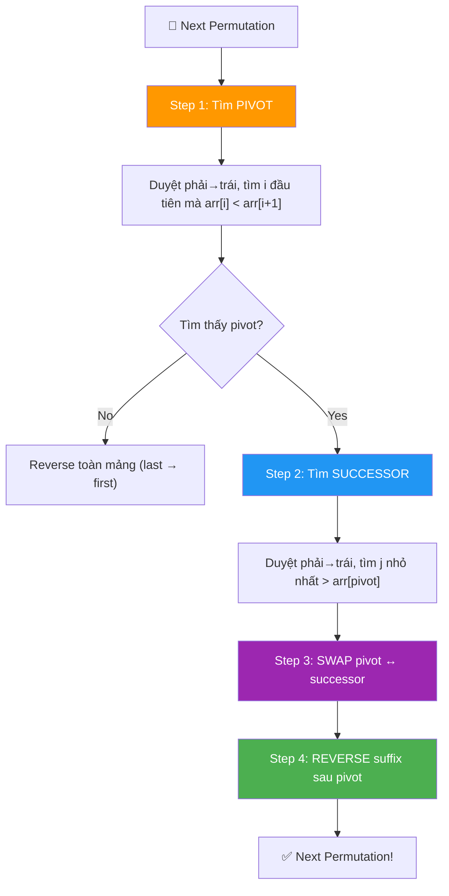
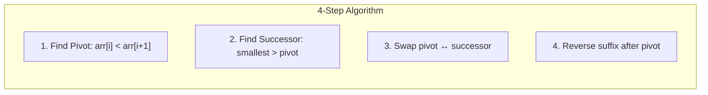
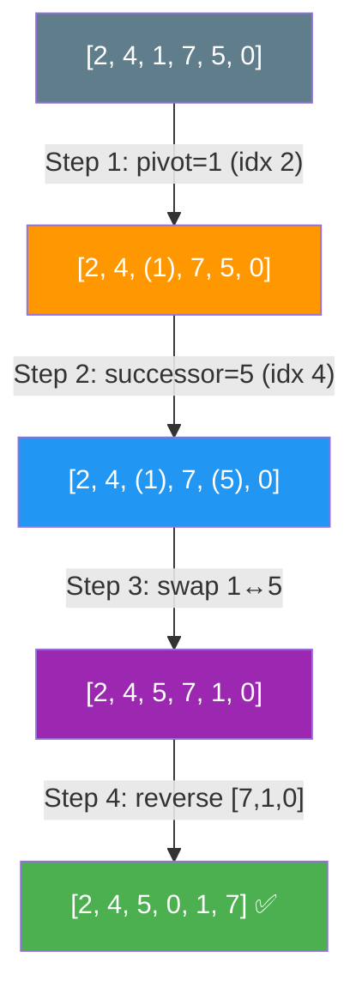

# 🔄 Next Permutation — GfG / LeetCode #31 (Medium)

> 📖 Code: [Next Permutation.js](./Next%20Permutation.js)





---

## R — Repeat & Clarify

🧠 *"Tìm hoán vị LỚN HƠN TIẾP THEO theo thứ tự từ điển. Nếu đã là hoán vị cuối → quay về hoán vị đầu (sorted)."*

> 🎙️ *"Given a permutation of integers, rearrange it to the next lexicographically greater permutation. If it's the last permutation, return the first (sorted ascending)."*

### Clarification Questions

```
Q: "Lexicographically greater" nghĩa là gì?
A: So sánh như TỪ ĐIỂN!
   [1,2,3] < [1,3,2] < [2,1,3] < [2,3,1] < [3,1,2] < [3,2,1]
   → So sánh từ TRÁI sang PHẢI, phần tử MỚI lớn hơn = lớn hơn!

Q: "Next" = tiếp theo NGAY SAU, không phải bất kỳ?
A: ĐÚNG! Phải là hoán vị LỚN HƠN NHỎ NHẤT!
   [1,2,3] → [1,3,2] (KHÔNG PHẢI [2,1,3]!)

Q: Mảng có phần tử trùng không?
A: Bài gốc: KHÔNG TRÙNG (permutation).
   LeetCode #31: CÓ THỂ TRÙNG! Code vẫn đúng!

Q: Modify in-place hay return mới?
A: IN-PLACE! Modify arr[] trực tiếp.

Q: Hoán vị cuối (descending) thì sao?
A: [3,2,1] → [1,2,3] (quay về đầu!)
```

### Tại sao bài này quan trọng?

```
  ⭐ Next Permutation = KINH ĐIỂN PHỎNG VẤN!
  (Google, Amazon, Facebook ĐỀU hỏi!)

  BẠN PHẢI hiểu:
  1. Thứ tự từ điển (lexicographic order)
  2. Thuật toán 4 bước (pivot → successor → swap → reverse)
  3. TẠI SAO mỗi bước đúng (chứng minh!)

  ┌───────────────────────────────────────────────────┐
  │  Bài này XUẤT HIỆN liên tục trong phỏng vấn!      │
  │  C++ có std::next_permutation sẵn                 │
  │  Java/JS/Python KHÔNG CÓ → phải tự implement!     │
  └───────────────────────────────────────────────────┘
```

---

## 🧠 Bản chất bài toán — Hiểu để NHỚ, không chỉ để GIẢI

### Tưởng tượng: ĐỒNG HỒ SỐ!

```
  Bạn có 1 đồng hồ hiển thị hoán vị.
  Mỗi lần "tăng" → hiện hoán vị TIẾP THEO!

  [1,2,3] → [1,3,2] → [2,1,3] → [2,3,1] → [3,1,2] → [3,2,1]
             ↑ +1       ↑ +1      ↑ +1       ↑ +1       ↑ +1

  [3,2,1] → quay lại [1,2,3] (overflow!)

  ⭐ Giống cộng 1 cho số nhị phân!
    999 + 1 = 1000 (carry!)
    [3,2,1] + 1 = [1,2,3] (reset!)
```

### Quan sát KEY: SUFFIX GIẢM DẦN!

```
  ⭐ INSIGHT QUAN TRỌNG NHẤT!

  arr = [2, 4, 1, 7, 5, 0]
                  ↑────────↑
                  SUFFIX GIẢM DẦN: [7, 5, 0]

  Phần GIẢM DẦN ở cuối = phần ĐÃ "MAX" (không thể tăng nữa)!
  → Giống số 999 → KHÔNG THỂ tăng chỉ ở phần này!
  → PHẢI "carry" lên vị trí TRƯỚC NÓ!

  Vị trí "carry" = PIVOT = phần tử NGAY TRƯỚC suffix giảm dần!
  pivot = arr[2] = 1 (vì 1 < 7, đây là chỗ CÓ THỂ tăng!)

  ─────────────────────────────────────────────

  VÍ DỤ SỐ: 1 2 4 7 5 0
                 ↑
               pivot

  Để "tăng" → thay pivot bằng số NHỎ NHẤT lớn hơn nó trong suffix!
  Suffix [7, 5, 0]: số nhỏ nhất > 1 = 5!
  → Swap 1 ↔ 5: [2, 4, 5, 7, 1, 0]
  → Reverse suffix: [2, 4, 5, 0, 1, 7]
  → DONE! ✅
```

### 4 BƯỚC — Hiểu TẠI SAO, không chỉ LÀM SAO!

```
  ⭐ BƯỚC 1: Tìm PIVOT
  ────────────────────────────
  Duyệt PHẢI → TRÁI, tìm i ĐẦU TIÊN mà arr[i] < arr[i+1]

  arr = [2, 4, 1, 7, 5, 0]
                  ↑
         i=2: arr[2]=1 < arr[3]=7 → PIVOT = index 2!

  TẠI SAO? Suffix [7, 5, 0] GIẢM DẦN → đã max!
  → Phải "carry" tại vị trí NGAY TRƯỚC suffix = pivot!

  ⚠️ Không tìm thấy pivot? → Toàn mảng giảm dần = HOÁN VỊ CUỐI!
     → Reverse toàn mảng → hoán vị đầu!

  ⭐ BƯỚC 2: Tìm SUCCESSOR
  ────────────────────────────
  Trong suffix (sau pivot), tìm phần tử NHỎ NHẤT > art[pivot]

  Suffix [7, 5, 0], pivot = 1
  → Tìm nhỏ nhất > 1: answer = 5 (tại index 4)

  TẠI SAO NHỎ NHẤT? Vì ta muốn NEXT (tăng ÍT NHẤT có thể)!
  → Chọn 7 sẽ tạo hoán vị LỚN HƠN 5 → bỏ mất hoán vị ở giữa!

  ⚠️ Suffix GIẢM DẦN → duyệt PHẢI → TRÁI → phần tử ĐẦU TIÊN > pivot
     = nhỏ nhất > pivot!

  ⭐ BƯỚC 3: SWAP pivot ↔ successor
  ────────────────────────────
  Swap arr[2] ↔ arr[4]:
  [2, 4, 1, 7, 5, 0] → [2, 4, 5, 7, 1, 0]

  TẠI SAO? Ta "tăng" vị trí pivot lên 1 bậc nhỏ nhất!
  Sau swap, suffix [7, 1, 0] VẪN GIẢM DẦN! (quan trọng!)

  ⭐ BƯỚC 4: REVERSE suffix
  ────────────────────────────
  Reverse phần sau pivot: [7, 1, 0] → [0, 1, 7]
  [2, 4, 5, 7, 1, 0] → [2, 4, 5, 0, 1, 7]

  TẠI SAO? Suffix giảm dần = LỚN NHẤT!
  Reverse → tăng dần = NHỎ NHẤT!
  → Đảm bảo phần sau pivot NHỎ NHẤT có thể!
  → Tổng thể là hoán vị LỚN HƠN NHỎ NHẤT = NEXT! ✅
```



### Tại sao suffix SAU swap VẪN giảm dần?

```
  ⭐ CHỨNG MINH — Đây là câu follow-up phổ biến!

  Trước swap:
    suffix = [..., successor, ..., ...]  (giảm dần!)
    pivot < successor
    successor = NHỎ NHẤT > pivot trong suffix

  Sau swap:
    pivot ĐI VÀO vị trí successor
    → pivot < successor (nhỏ hơn phần tử cũ)
    → VÀ pivot < phần tử TRƯỚC successor (vì các phần tử trước > successor > pivot)
    → VÀ pivot ≥ phần tử SAU successor (vì successor = nhỏ nhất > pivot
       → phần tử sau successor ≤ pivot!)
    → NHƯ VẬY: ... > pivot ≥ ... → VẪN GIẢM DẦN!

  VÍ DỤ:  suffix = [7, 5, 0], pivot = 1
    Swap 1 ↔ 5: suffix = [7, 1, 0]
    7 > 1 > 0 ✅ VẪN GIẢM DẦN!

  → Reverse suffix giảm dần = NHỎ NHẤT → đúng "NEXT"!
```

---

## 🧭 Luồng Suy Nghĩ — Từ đọc đề đến solution

### Bước 1: Keywords

```
  "next permutation" → hoán vị tiếp theo
  "lexicographically greater" → thứ tự từ điển
  "in-place" → modify trực tiếp

  🧠 "Làm sao tìm NEXT?"
    → Tăng ÍT NHẤT có thể → đổi vị trí TẬN CÙNG PHẢI!
    → Suffix giảm dần = đã max → pivot = điểm đổi!
```

### Bước 2: Brute Force?

```
  Generate TẤT CẢ n! hoán vị → sort → tìm hoán vị tiếp theo?
  → O(n! × n) — KHÔNG KHẢ THI cho n > 10!

  → Phải tìm cách IN-PLACE, O(n)!
```

### Bước 3: 4-Step Algorithm → O(n)

```
  1. Find pivot:     O(n) — duyệt phải→trái
  2. Find successor: O(n) — duyệt phải→trái trong suffix
  3. Swap:           O(1) — swap 2 phần tử
  4. Reverse suffix: O(n) — reverse phần cuối

  → TỔNG: O(n) time, O(1) space!
```

---

## E — Examples

```
VÍ DỤ 1: arr = [2, 4, 1, 7, 5, 0]

  Step 1: Pivot — duyệt phải→trái
    i=4: arr[4]=5 > arr[5]=0 → tiếp
    i=3: arr[3]=7 > arr[4]=5 → tiếp
    i=2: arr[2]=1 < arr[3]=7 → PIVOT = 2! ⭐

  Step 2: Successor — trong suffix [7,5,0], tìm nhỏ nhất > 1
    j=5: arr[5]=0 ≤ 1 → tiếp
    j=4: arr[4]=5 > 1 → SUCCESSOR = 4! ⭐

  Step 3: Swap pivot ↔ successor
    swap arr[2] ↔ arr[4]: [2,4,1,7,5,0] → [2,4,5,7,1,0]

  Step 4: Reverse suffix [7,1,0] → [0,1,7]
    [2,4,5,7,1,0] → [2,4,5,0,1,7] ✅
```

```
VÍ DỤ 2: arr = [3, 2, 1] — HOÁN VỊ CUỐI!

  Step 1: Pivot — duyệt phải→trái
    i=1: arr[1]=2 > arr[2]=1 → tiếp
    i=0: arr[0]=3 > arr[1]=2 → tiếp
    → KHÔNG TÌM THẤY! → pivot = -1

  → TOÀN MẢNG giảm dần = hoán vị CUỐI!
  → Reverse toàn mảng: [3,2,1] → [1,2,3] ✅
```

```
VÍ DỤ 3: arr = [1, 3, 5, 4, 2]

  Step 1: Pivot
    i=3: arr[3]=4 > arr[4]=2 → tiếp
    i=2: arr[2]=5 > arr[3]=4 → tiếp
    i=1: arr[1]=3 < arr[2]=5 → PIVOT = 1! ⭐

  Step 2: Successor — suffix [5,4,2], tìm nhỏ nhất > 3
    j=4: arr[4]=2 ≤ 3 → tiếp
    j=3: arr[3]=4 > 3 → SUCCESSOR = 3! ⭐

  Step 3: Swap arr[1] ↔ arr[3]
    [1,3,5,4,2] → [1,4,5,3,2]

  Step 4: Reverse suffix [5,3,2] → [2,3,5]
    [1,4,5,3,2] → [1,4,2,3,5] ✅
```

### Minh họa trực quan

```
  arr = [1, 3, 5, 4, 2]

  ┌───┬───┬───┬───┬───┐
  │ 1 │ 3 │ 5 │ 4 │ 2 │
  └───┴───┴───┴───┴───┘
        ↑   └───────┘
      PIVOT  SUFFIX (giảm dần: 5>4>2)

  Step 2: Trong [5,4,2], nhỏ nhất > 3 = 4
                        ↑ successor

  Step 3: Swap 3 ↔ 4:
  ┌───┬───┬───┬───┬───┐
  │ 1 │ 4 │ 5 │ 3 │ 2 │   suffix vẫn giảm: [5,3,2]
  └───┴───┴───┴───┴───┘

  Step 4: Reverse suffix [5,3,2] → [2,3,5]:
  ┌───┬───┬───┬───┬───┐
  │ 1 │ 4 │ 2 │ 3 │ 5 │  ✅
  └───┴───┴───┴───┴───┘
```

---

## C — Code

### Solution: 4-Step Algorithm — O(n) ⭐

```javascript
function nextPermutation(arr) {
  const n = arr.length;

  // Step 1: Tìm PIVOT (phải → trái)
  let pivot = -1;
  for (let i = n - 2; i >= 0; i--) {
    if (arr[i] < arr[i + 1]) {
      pivot = i;
      break;
    }
  }

  // Không có pivot → hoán vị cuối → reverse toàn mảng
  if (pivot === -1) {
    reverse(arr, 0, n - 1);
    return arr;
  }

  // Step 2: Tìm SUCCESSOR (phải → trái trong suffix)
  for (let j = n - 1; j > pivot; j--) {
    if (arr[j] > arr[pivot]) {
      // Step 3: SWAP pivot ↔ successor
      [arr[pivot], arr[j]] = [arr[j], arr[pivot]];
      break;
    }
  }

  // Step 4: REVERSE suffix sau pivot
  reverse(arr, pivot + 1, n - 1);
  return arr;
}

function reverse(arr, left, right) {
  while (left < right) {
    [arr[left], arr[right]] = [arr[right], arr[left]];
    left++;
    right--;
  }
}
```

### Giải thích từng bước — CHI TIẾT

```
  STEP 1: Tìm PIVOT

  for (let i = n-2; i >= 0; i--):
    → Duyệt PHẢI → TRÁI, bắt đầu từ n-2 (so với n-1)
    → Tìm i ĐẦU TIÊN mà arr[i] < arr[i+1]
    → Vì phải đọc arr[i+1], nên bắt đầu từ n-2!

  if (arr[i] < arr[i+1]):
    → Tìm thấy vị trí CÓ THỂ TĂNG!
    → Sau i: suffix GIẢM DẦN (đã max!)
    → pivot = i, break!

  pivot === -1:
    → Toàn mảng giảm dần = hoán vị cuối!
    → Reverse toàn mảng = hoán vị đầu (sorted)!

  STEP 2 + 3: Tìm SUCCESSOR và SWAP

  for (let j = n-1; j > pivot; j--):
    → Duyệt PHẢI → TRÁI trong suffix
    → Suffix GIẢM DẦN → phần tử ĐẦU TIÊN > arr[pivot]
       = nhỏ nhất > arr[pivot]!

  ⚠️ Tại sao duyệt phải → trái?
     Suffix giảm dần → phần tử NHỎ NHẤT ở cuối!
     → Phần tử đầu tiên > pivot (từ phải) = nhỏ nhất > pivot!

  swap + break: Swap rồi dừng ngay!

  STEP 4: REVERSE suffix

  reverse(arr, pivot + 1, n - 1):
    → Đổi suffix từ GIẢM DẦN → TĂNG DẦN!
    → = Hoán vị NHỎ NHẤT cho phần suffix!
    → Đảm bảo kết quả là "next" (không bỏ sót!)
```

### Trace CHI TIẾT: arr = [2, 4, 1, 7, 5, 0]

```
  n = 6

  ═══ Step 1: Find PIVOT ════════════════════════════════

  i=4: arr[4]=5, arr[5]=0: 5 < 0? NO     → tiếp
  i=3: arr[3]=7, arr[4]=5: 7 < 5? NO     → tiếp
  i=2: arr[2]=1, arr[3]=7: 1 < 7? YES!   → pivot = 2 ⭐

  pivot = 2, arr[pivot] = 1

  ═══ Step 2: Find SUCCESSOR ════════════════════════════

  Suffix (after pivot): indices 3, 4, 5 → [7, 5, 0]

  j=5: arr[5]=0 > arr[2]=1? 0 > 1? NO    → tiếp
  j=4: arr[4]=5 > arr[2]=1? 5 > 1? YES!  → successor = 4 ⭐

  ═══ Step 3: SWAP ══════════════════════════════════════

  swap arr[2] ↔ arr[4]: swap 1 ↔ 5
  [2, 4, 1, 7, 5, 0] → [2, 4, 5, 7, 1, 0]

  ═══ Step 4: REVERSE suffix ════════════════════════════

  Reverse arr[3..5]: [7, 1, 0] → [0, 1, 7]
  [2, 4, 5, 7, 1, 0] → [2, 4, 5, 0, 1, 7]

  ═══ KẾT QUẢ ═══════════════════════════════════════════
  [2, 4, 5, 0, 1, 7] ✅
```

### Trace: arr = [3, 2, 1] (hoán vị cuối)

```
  n = 3

  Step 1: Find PIVOT
    i=1: 2 < 1? NO
    i=0: 3 < 2? NO
    → pivot = -1 → HOÁN VỊ CUỐI!

  → Reverse toàn mảng: [3, 2, 1] → [1, 2, 3] ✅
```

### Trace: arr = [1, 1, 5] (có phần tử trùng — LeetCode)

```
  n = 3

  Step 1: i=1: arr[1]=1 < arr[2]=5? YES! → pivot = 1

  Step 2: j=2: arr[2]=5 > arr[1]=1? YES! → successor = 2

  Step 3: swap arr[1] ↔ arr[2]: [1, 1, 5] → [1, 5, 1]

  Step 4: Reverse arr[2..2]: [1] → [1] (1 phần tử, không đổi)

  → [1, 5, 1] ✅
```

> 🎙️ *"I scan right-to-left for the first element smaller than its right neighbor — that's the pivot, marking where the descending suffix begins. Then I find the smallest element in that suffix that's larger than the pivot — the successor. I swap them, then reverse the suffix to make it the smallest possible arrangement. Four steps, O(n) time, O(1) space."*

---

## O — Optimize

```
                    Time      Space     Ghi chú
  ─────────────────────────────────────────────────
  4-Step ⭐          O(n)      O(1)      Tối ưu!

  ⚠️ Không thể tốt hơn O(n):
    Có thể phải đọc/sửa TẤT CẢ n phần tử (worst case)!
    VD: [3, 2, 1] → [1, 2, 3] = đổi tất cả!

  ⚠️ 4 bước nhưng MỖI bước O(n) → tổng vẫn O(n)!
    Step 1: ≤ n comparisons
    Step 2: ≤ n comparisons
    Step 3: O(1)
    Step 4: ≤ n swaps
    → Tổng: ≤ 3n → O(n)!
```

---

## T — Test

```
Test Cases:
  [2, 4, 1, 7, 5, 0]  → [2, 4, 5, 0, 1, 7]  ✅ general
  [3, 2, 1]            → [1, 2, 3]            ✅ last → first
  [1, 3, 5, 4, 2]      → [1, 4, 2, 3, 5]      ✅ general
  [1, 2, 3]            → [1, 3, 2]            ✅ sorted → next
  [1]                  → [1]                  ✅ 1 phần tử
  [1, 1, 5]            → [1, 5, 1]            ✅ duplicates
  [1, 2]               → [2, 1]               ✅ n=2
  [2, 1]               → [1, 2]               ✅ n=2 last
  [1, 5, 8, 4, 7, 6, 5, 3, 1] → [1, 5, 8, 5, 1, 3, 4, 6, 7] ✅ long
```

---

## 🗣️ Interview Script

### Think Out Loud

```
  🧠 BƯỚC 1: Đọc đề
    "Next permutation — tăng ÍT NHẤT có thể"
    "→ Đổi vị trí TẬN CÙNG PHẢI có thể!"

  🧠 BƯỚC 2: Quan sát
    "Suffix giảm dần = đã max → không đổi được!"
    "→ PIVOT = phần tử TRƯỚC suffix giảm dần!"
    "→ Tăng pivot → thay bằng nhỏ nhất > pivot trong suffix!"

  🧠 BƯỚC 3: Algorithm
    "1. Find pivot: i cuối cùng mà arr[i] < arr[i+1]"
    "2. Find successor: nhỏ nhất > pivot trong suffix"
    "3. Swap pivot ↔ successor"
    "4. Reverse suffix (tăng dần = nhỏ nhất)"

  🧠 BƯỚC 4: Edge cases
    "Không có pivot → hoán vị cuối → reverse all"
    "1 phần tử → không đổi"
    "Có duplicates → code vẫn đúng (dùng < và >)"

  🎙️ Interview phrasing:
    "The key insight is that the suffix after the pivot is in
     descending order — it's maxed out. I find where this
     descending run begins (the pivot), swap it with the
     smallest larger element in the suffix, then reverse the
     suffix to get the smallest arrangement. O(n) time, O(1) space."
```

### Biến thể & Mở rộng

```
  1. Previous Permutation
     → ĐẢO CHIỀU! Tìm i mà arr[i] > arr[i+1]
     → Tìm LỚN NHẤT < arr[pivot] trong suffix
     → Swap + reverse!

  2. Kth Permutation Sequence (LeetCode #60)
     → Tính trực tiếp bằng factorial number system!
     → Không cần gọi next_permutation k lần!

  3. Permutations (LeetCode #46)
     → Generate TẤT CẢ hoán vị (backtracking)
     → Next Permutation có thể dùng nhưng chậm!

  4. Permutation Rank
     → Cho hoán vị → tìm nó là hoán vị THỨ MẤY
     → Cantor expansion / factorial numbering!

  5. next_permutation cho MULTISET (có trùng)
     → Code y hệt! Vì dùng < và >, tự handle trùng!
```

### So sánh với bài liên quan

```
  ┌──────────────────────────────────────────────────────────┐
  │  Bài toán              Technique           Complexity    │
  │  ────────────────────────────────────────────────        │
  │  Next Permutation ⭐   4-step algorithm     O(n)/O(1)   │
  │  Previous Permutation  4-step (đảo)         O(n)/O(1)   │
  │  Kth Permutation       Factorial system     O(n²)       │
  │  All Permutations      Backtracking         O(n!×n)     │
  │  Permutation Rank      Cantor expansion     O(n²)       │
  └──────────────────────────────────────────────────────────┘
```

---

## 🧩 Sai lầm phổ biến

```
❌ SAI LẦM #1: Tìm pivot TRÁI → PHẢI thay vì PHẢI → TRÁI!

   Pivot = phần tử TẬN CÙNG PHẢI mà arr[i] < arr[i+1]!
   Nếu tìm trái → phải: có thể pick sai vị trí!

   VD: [1, 3, 5, 4, 2]
   Trái → phải: i=0 (1<3) → SAI! Sẽ thay đổi quá nhiều!
   Phải → trái: i=1 (3<5) → ĐÚNG! ✅

─────────────────────────────────────────────────────

❌ SAI LẦM #2: Quên REVERSE suffix sau swap!

   Sau swap, suffix VẪN GIẢM DẦN!
   Nếu không reverse → không phải "NEXT" (bỏ sót!)

   VD: [1, 3, 5, 4, 2] → swap 3↔4 → [1, 4, 5, 3, 2]
   Nếu dừng ở đây: [1, 4, 5, 3, 2] → SAI!
   Phải reverse [5,3,2] → [1, 4, 2, 3, 5] → ĐÚNG! ✅

─────────────────────────────────────────────────────

❌ SAI LẦM #3: Tìm successor bằng MAX thay vì MIN!

   Cần: NHỎ NHẤT > pivot (tăng ÍT NHẤT!)
   LỚN NHẤT > pivot → tạo hoán vị QUÁ LỚN (bỏ sót!)

   Suffix giảm dần → duyệt phải→trái → ĐẦU TIÊN > pivot = nhỏ nhất!

─────────────────────────────────────────────────────

❌ SAI LẦM #4: Dùng SORT thay vì REVERSE!

   Sort suffix: O(n log n) — chậm hơn!
   Reverse suffix: O(n) — nhanh hơn!

   Cả 2 đều ĐÚNG, nhưng reverse tối ưu hơn!
   Suffix ĐÃ giảm dần → reverse = tăng dần = sorted!

─────────────────────────────────────────────────────

❌ SAI LẦM #5: Nhầm điều kiện pivot ( ≤ thay vì < )!

   arr[i] < arr[i+1] → ĐÚNG (strictly less!)
   arr[i] <= arr[i+1] → SAI cho duplicates!

   VD: [1, 5, 5] → pivot i=0 (1<5) ← ĐÚNG!
   Nếu dùng <=: i=1 (5<=5=true) → pivot=1 → SAI!
```

---

## 📝 Flashcard — Tự kiểm tra

| ❓ Câu hỏi | ✅ Đáp án |
|---|---|
| 4 bước là gì? | Pivot → Successor → Swap → Reverse |
| Pivot là gì? | Index i cuối cùng mà arr[i] < arr[i+1] |
| Pivot không tìm thấy? | Hoán vị cuối → **reverse toàn mảng** |
| Successor là gì? | Nhỏ nhất > arr[pivot] trong suffix |
| Tại sao reverse suffix? | Suffix giảm dần → reverse = tăng dần = nhỏ nhất |
| Time / Space? | **O(n) / O(1)** |
| Tại sao suffix vẫn giảm dần sau swap? | Successor = nhỏ nhất > pivot → pivot thay vào vẫn giữ thứ tự |
| Handle duplicates? | Code y hệt (dùng < và >) |
| LeetCode nào? | **#31** Next Permutation |
