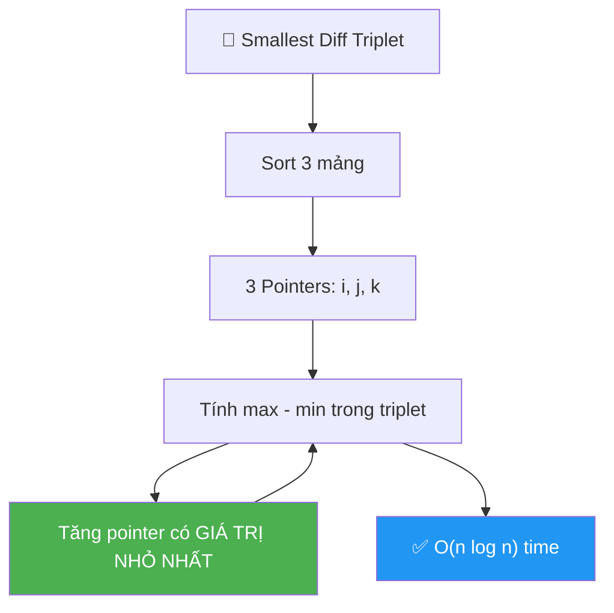

# 🎯 Smallest Difference Triplet from Three Arrays — GfG (Medium)

> 📖 Code: [Smallest Difference Triplet.js](./Smallest%20Difference%20Triplet.js)



---

## R — Repeat & Clarify

🧠 *"Cho 3 mảng cùng size. Chọn 1 phần tử mỗi mảng để tạo bộ ba có (max - min) NHỎ NHẤT. Tie-break: tổng nhỏ nhất."*

> 🎙️ *"Given three arrays of equal size, pick one element from each to form a triplet whose spread (max − min) is minimized. Tie-break by smallest sum."*

### Clarification Questions

```
Q: "Smallest difference" = max - min trong triplet?
A: ĐÚNG! Không phải tổng chênh lệch các cặp!
   Triplet (a, b, c): diff = max(a,b,c) - min(a,b,c)

Q: 1 phần tử từ MỖI mảng?
A: ĐÚNG! Không được chọn 2 từ cùng 1 mảng!

Q: Tie-break?
A: Cùng diff → chọn triplet có TỔNG NHỎ hơn!

Q: Mảng đã sorted?
A: KHÔNG! Phải SORT trước!
```

### Tại sao bài này quan trọng?

```
  ⭐ Pattern: SORT + MULTI-POINTER!

  Giống: Merge K Sorted Lists / 3-way Merge!
  → Sort → 3 pointers → tăng pointer nhỏ nhất!

  ┌───────────────────────────────────────────────────┐
  │  Pattern: "Minimize spread across K sources"       │
  │  → Sort each source                               │
  │  → Use pointers, advance the minimum              │
  │  → Giống: Smallest Range from K Lists (#632)      │
  └───────────────────────────────────────────────────┘
```

---

## 🧠 Bản chất bài toán — Hiểu để NHỎ NHẤT spread!

### Tại sao SORT + 3 POINTERS?

```
  ⭐ Key Insight: Để minimize (max - min):
     → 3 số phải GẦN NHAU nhất có thể!
     → Sort → các số gần nhau NẰM CẠNH NHAU!

  Sau khi sort cả 3 mảng:
    i, j, k = con trỏ vào arr1, arr2, arr3

  Mỗi bước:
    diff = max(arr1[i], arr2[j], arr3[k]) - min(arr1[i], arr2[j], arr3[k])

    "Muốn GIẢM diff → TĂNG min!"
    → Tăng pointer có GIÁ TRỊ NHỎ NHẤT!
    → Vì tăng max → diff TĂNG (xấu hơn!)
    → Tăng min → diff có thể GIẢM!

  ⚠️ Tại sao chỉ tăng MIN?
     min là "bottleneck" — kéo diff lên!
     Tăng min → min mới có thể gần max hơn!
     Tăng max → max mới chỉ ĐẨY xa min hơn!
```

### Minh họa

```
  arr1 = [2, 5, 8]  (sorted)
  arr2 = [7, 10, 12]
  arr3 = [6, 9, 14]

  i=0, j=0, k=0: triplet = (2, 7, 6)
    diff = 7 - 2 = 5. Min = 2 → tăng i!

  i=1, j=0, k=0: triplet = (5, 7, 6)
    diff = 7 - 5 = 2 ⭐ Min = 5 → tăng i!

  i=2, j=0, k=0: triplet = (8, 7, 6)
    diff = 8 - 6 = 2. Min = 6 → tăng k!

  i=2, j=0, k=1: triplet = (8, 7, 9)
    diff = 9 - 7 = 2. Min = 7 → tăng j!

  i=2, j=1, k=1: triplet = (8, 10, 9)
    diff = 10 - 8 = 2. Min = 8 → tăng i!

  i=3 → OUT OF BOUNDS → STOP!

  Best diff = 2, triplet = (5, 7, 6) → sort: [5, 6, 7] ✅
```

---

## E — Examples

```
VÍ DỤ 1:
  arr1 = [5, 2, 8]  → sorted: [2, 5, 8]
  arr2 = [10, 7, 12] → sorted: [7, 10, 12]
  arr3 = [9, 14, 6]  → sorted: [6, 9, 14]

  i=0,j=0,k=0: (2,7,6)  diff=7-2=5   min=2→i++
  i=1,j=0,k=0: (5,7,6)  diff=7-5=2⭐ min=5→i++
  i=2,j=0,k=0: (8,7,6)  diff=8-6=2   min=6→k++
  i=2,j=0,k=1: (8,7,9)  diff=9-7=2   min=7→j++
  i=2,j=1,k=1: (8,10,9) diff=10-8=2  min=8→i++
  i=3 → STOP!

  Best = 2, triplet with smallest sum:
    (5,7,6) sum=18, (8,7,6) sum=21, (8,7,9) sum=24, (8,10,9) sum=27
    → (5,7,6) → output: 7, 6, 5 ✅
```

```
VÍ DỤ 2:
  arr1 = [15, 12, 18, 9]  → [9, 12, 15, 18]
  arr2 = [10, 17, 13, 8]  → [8, 10, 13, 17]
  arr3 = [14, 16, 11, 5]  → [5, 11, 14, 16]

  i=0,j=0,k=0: (9,8,5)   diff=9-5=4    min=5→k++
  i=0,j=0,k=1: (9,8,11)  diff=11-8=3   min=8→j++
  i=0,j=1,k=1: (9,10,11) diff=11-9=2⭐ min=9→i++
  i=1,j=1,k=1: (12,10,11) diff=12-10=2 min=10→j++
  i=1,j=2,k=1: (12,13,11) diff=13-11=2 min=11→k++
  i=1,j=2,k=2: (12,13,14) diff=14-12=2 min=12→i++
  i=2,j=2,k=2: (15,13,14) diff=15-13=2 min=13→j++
  i=2,j=3,k=2: (15,17,14) diff=17-14=3 min=14→k++
  i=2,j=3,k=3: (15,17,16) diff=17-15=2 min=15→i++
  i=3,j=3,k=3: (18,17,16) diff=18-16=2 min=16→k++
  k=4 → STOP!

  Best diff=2, first occurrence: (9,10,11) sum=30
    → output sorted: 11, 10, 9 ✅
```

---

## C — Code

### Solution: Sort + 3 Pointers — O(n log n) ⭐

```javascript
function smallestDiffTriplet(arr1, arr2, arr3) {
  arr1.sort((a, b) => a - b);
  arr2.sort((a, b) => a - b);
  arr3.sort((a, b) => a - b);

  let i = 0, j = 0, k = 0;
  let bestDiff = Infinity;
  let bestTriplet = [];

  while (i < arr1.length && j < arr2.length && k < arr3.length) {
    const a = arr1[i], b = arr2[j], c = arr3[k];
    const curMin = Math.min(a, b, c);
    const curMax = Math.max(a, b, c);
    const diff = curMax - curMin;

    // Update best
    if (diff < bestDiff ||
       (diff === bestDiff && a + b + c < bestTriplet[0] + bestTriplet[1] + bestTriplet[2])) {
      bestDiff = diff;
      bestTriplet = [a, b, c];
    }

    // Advance pointer with MINIMUM value
    if (curMin === a) i++;
    else if (curMin === b) j++;
    else k++;
  }

  return bestTriplet.sort((a, b) => b - a); // desc for GfG format
}
```

### Giải thích — CHI TIẾT

```
  BƯỚC 1: Sort 3 mảng — O(n log n)

  BƯỚC 2: 3 pointers i, j, k — tất cả bắt đầu từ 0

  BƯỚC 3: Loop — while tất cả pointers trong bounds
    curMin = min(arr1[i], arr2[j], arr3[k])
    curMax = max(arr1[i], arr2[j], arr3[k])
    diff = curMax - curMin

    Update best nếu:
      diff < bestDiff, HOẶC
      diff == bestDiff VÀ sum nhỏ hơn (tie-break!)

    Advance pointer có VALUE = curMin
    → Tăng min → hi vọng diff giảm!

  BƯỚC 4: Return bestTriplet

  ⚠️ Tại sao DỪNG khi 1 pointer hết?
     Nếu pointer i hết → arr1 đã dùng phần tử LỚN NHẤT!
     Tăng j hoặc k → chỉ TĂNG max → diff TĂNG → xấu hơn!
     → Không cần tiếp!

  COMPLEXITY:
    Sort: O(n log n)
    Loop: O(3n) = O(n) — mỗi pointer tăng tối đa n lần!
    → Total: O(n log n)
```

### Trace: arr1=[5,2,8], arr2=[10,7,12], arr3=[9,14,6]

```
  Sorted: arr1=[2,5,8], arr2=[7,10,12], arr3=[6,9,14]

  ┌──────┬─────┬─────┬─────┬──────────────┬──────┬──────────┐
  │ Step │  i  │  j  │  k  │ triplet      │ diff │ best     │
  ├──────┼─────┼─────┼─────┼──────────────┼──────┼──────────┤
  │  1   │  0  │  0  │  0  │ (2, 7, 6)    │  5   │ 5        │
  │      │ min=2 → i++                                      │
  │  2   │  1  │  0  │  0  │ (5, 7, 6)    │  2   │ 2 ⭐     │
  │      │ min=5 → i++                                      │
  │  3   │  2  │  0  │  0  │ (8, 7, 6)    │  2   │ 2 (21>18)│
  │      │ min=6 → k++                                      │
  │  4   │  2  │  0  │  1  │ (8, 7, 9)    │  2   │ 2 (24>18)│
  │      │ min=7 → j++                                      │
  │  5   │  2  │  1  │  1  │ (8, 10, 9)   │  2   │ 2 (27>18)│
  │      │ min=8 → i++                                      │
  │  6   │  3  → OUT! STOP!                                 │
  └──────┴─────┴─────┴─────┴──────────────┴──────┴──────────┘

  Best: diff=2, triplet=(5,7,6) → sorted desc: [7,6,5] ✅
```

> 🎙️ *"I sort all three arrays, then use three pointers starting at 0. At each step I compute max minus min of the current triplet. To minimize the spread, I advance the pointer pointing to the minimum value — because increasing the minimum is the only way to potentially shrink the gap. I stop when any pointer reaches the end. O(n log n) for sorting, O(n) for the scan."*

---

## O — Optimize

```
                    Time          Space     Ghi chú
  ──────────────────────────────────────────────────────
  Brute Force       O(n³)         O(1)      3 nested loops
  Sort + 3 Ptr ⭐   O(n log n)    O(1)      Tối ưu!

  ⚠️ Loop O(n): mỗi pointer tăng TỐI ĐA n lần!
     → Tổng tăng ≤ 3n → O(n)!
     → Bottleneck = SORT: O(n log n)!
```

---

## T — Test

```
Test Cases:
  [5,2,8],[10,7,12],[9,14,6]       → [7,6,5]     ✅ diff=2
  [15,12,18,9],[10,17,13,8],[14,16,11,5] → [11,10,9] ✅ diff=2
  [1],[1],[1]                      → [1,1,1]      ✅ identical
  [1,2],[3,4],[5,6]                → [2,3,5]      ✅ diff=3
  [1,5,10],[2,6,11],[3,7,12]       → [3,2,1]      ✅ diff=2
```

---

## 🗣️ Interview Script

### Think Out Loud

```
  🧠 BƯỚC 1: Keywords
    "3 arrays, 1 from each" → multi-source selection!
    "min spread" → 3 số gần nhau!

  🧠 BƯỚC 2: Approach
    "Sort → gần nhau nằm cạnh → 3 pointers!"
    "Tăng pointer MIN → giảm spread!"

  🧠 BƯỚC 3: Why advance min?
    "max - min = diff. Tăng max → diff tăng (xấu!)"
    "Tăng min → min mới lớn hơn → diff có thể giảm!"

  🎙️ "Sort all three arrays. Three pointers scan forward.
     At each step, compute spread and advance the pointer
     with the smallest value to try to shrink the gap.
     O(n log n) total."
```

### Biến thể

```
  1. Smallest Range from K Lists — LeetCode #632
     → K mảng sorted → MinHeap chứa K pointers!
     → Tăng pointer MIN (dùng heap tìm min!)

  2. Closest 3 Sum — LeetCode #16
     → 1 mảng, tìm 3 số sum gần target nhất!

  3. 2 arrays, smallest diff pair
     → Sort + 2 pointers → O(n log n)!
```

---

## 🧩 Sai lầm phổ biến

```
❌ SAI LẦM #1: Quên SORT!

   Mảng chưa sorted → 3 pointers KHÔNG ĐÚNG!
   PHẢI sort trước!

─────────────────────────────────────────────────────

❌ SAI LẦM #2: Tăng pointer MAX thay vì MIN!

   Tăng max → diff TĂNG (xấu hơn!)
   Tăng min → diff CÓ THỂ giảm!

─────────────────────────────────────────────────────

❌ SAI LẦM #3: Quên tie-break bằng sum!

   Cùng diff → chọn triplet có SUM nhỏ hơn!
   Nếu không check → sai output!

─────────────────────────────────────────────────────

❌ SAI LẦM #4: Tiếp tục sau khi 1 pointer hết!

   1 pointer hết → chỉ có thể TĂNG diff!
   → DỪNG ngay! Đừng cố advance 2 pointer còn lại!
```

---

## 📝 Flashcard — Tự kiểm tra

| ❓ Câu hỏi | ✅ Đáp án |
|---|---|
| Bước đầu tiên? | **Sort** cả 3 mảng! |
| Tại sao advance min? | Tăng min → diff có thể **giảm**! |
| Dừng khi nào? | Khi **1 pointer** hết! |
| Tie-break? | Cùng diff → chọn **sum nhỏ** hơn |
| Time / Space? | **O(n log n)** / O(1) |
| Bài cùng pattern? | LC **#632** Smallest Range from K Lists |
